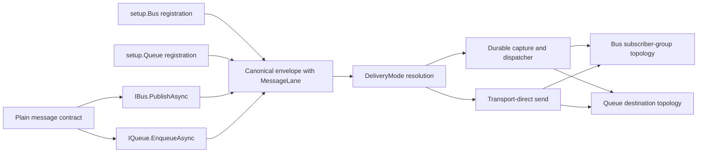

# Messaging Verb Model and Reviewed Architecture - Plan

## Goal Capsule

Replace Messaging's public type-intent and four-publisher shape with a coherent verb model:

- plain serializable message contracts with no Headless marker requirement;
- `IBus.PublishAsync` for subscriber fan-out and `IQueue.EnqueueAsync` for point-to-point ownership;
- structurally lane-scoped registration under `setup.Bus` and `setup.Queue`;
- durability selected independently through delivery options;
- lane identity preserved through every runtime, persistence, diagnostics, and provider boundary;
- provider capabilities validated at startup and proven by a shared conformance harness.

The result must feel native to Headless: modular abstraction/provider packages, message-centric configuration, typed middleware, commit coordination, shared provider tests, and truthful provider-specific escape hatches. It adopts the useful Send/Publish distinction seen in other frameworks without importing their endpoint model or contract taxonomy.

---

## Product Contract

### Summary

Headless Messaging currently exposes Bus and Queue concepts, but its API and implementation still mix four different concerns: message CLR type, semantic lane, logical routing, and durability. This creates stale planning, lane-defaulting risks, duplicated publisher services, and provider behavior that is difficult to validate uniformly.

The owner decision on 2026-07-13 is to use a verb-conveyed model. A message type does not declare whether it is an event or command. The operation and lane-scoped registration declare the semantics at the call site and composition root.

### Problem Frame

The design must solve five related problems as one migration:

1. **Public semantics:** plain contracts must work without `IMessage`, `IEvent`, or `ICommand` markers.
2. **Unambiguous registration:** scanning and explicit consumer registration cannot infer a lane from a plain CLR type.
3. **Internal correctness:** the same CLR type may use both lanes, so a `MessageType`-only key is invalid.
4. **Independent durability:** durable capture is a delivery guarantee, not a third or fourth semantic operation.
5. **Provider truth:** transport topology and supported guarantees must match the common contract and fail early when they do not.

### Requirements

- **R1 — Plain contracts:** Any public serializable class, record, or interface can be published or enqueued. Headless marker interfaces are neither required nor inspected for routing.
- **R2 — Verb-conveyed lane:** `IBus.PublishAsync` always selects Bus semantics; `IQueue.EnqueueAsync` always selects Queue semantics. No option may override the selected lane.
- **R3 — Dual-lane reuse:** The same CLR contract can intentionally be registered on both lanes, with independent logical names, consumers, middleware applicability, provider configuration, and physical topology.
- **R4 — Lane-complete identity:** Every registry, cache, circuit-breaker, middleware, storage, monitoring, diagnostics, and provider dispatch key whose behavior varies by lane includes `MessageLane`.
- **R5 — Structural registration:** Explicit registration and assembly scanning start from `setup.Bus` or `setup.Queue`. `OnBus` and `OnQueue` are removed from the shared message builder.
- **R6 — Two publishers:** The public publishing surface is `IBus` and `IQueue`. `IOutboxBus` and `IOutboxQueue` are removed.
- **R7 — Separate delivery guarantee:** Publish and enqueue options select `Auto`, `Durable`, or `TransportDirect` delivery without changing Bus/Queue semantics.
- **R8 — Scheduling safety:** Delayed work is durable. `Auto` with a delay resolves to durable capture; `TransportDirect` with a delay fails before any persistence or transport side effect.
- **R9 — Physical isolation:** Bus and Queue have independent physical namespaces. Same-type and same-logical-name registrations on opposite lanes cannot cross-deliver.
- **R10 — Capability validation:** Provider capabilities are immutable registration-time descriptors. Unsupported configured lanes, topology, and defaults fail before readiness; unsupported per-call delivery or scheduling choices fail synchronously before middleware or side effects.
- **R11 — Compatibility boundary:** Rename the CLR/public vocabulary from `IntentType` to `MessageLane` while preserving existing numeric values and persisted/wire representation during the first cutover.
- **R12 — Honest reliability:** Documentation and APIs describe at-least-once delivery and name the separate inbox, transaction, outbox, dispatcher, and replay guarantees. They never claim exactly-once processing.
- **R13 — Interaction boundaries:** Polymorphism is Bus-only; Queue is exact-contract. Request/reply is a Queue interaction pattern, not a third lane. Scheduling remains an option on Publish/Enqueue rather than a separate publisher.
- **R14 — Repository-wide migration:** Internal consumers, test helpers, demos, diagnostics, dashboards, provider packages, package READMEs, and `docs/llms/` use the new vocabulary and API in the same delivery program.
- **R15 — Conformance evidence:** Shared provider harnesses prove fan-out, competing consumption, lane isolation, and provider startup rejection using public APIs. Focused core, storage, and commit-coordination tests prove delivery-mode behavior.
- **R16 — Contract/payload identity:** The declared generic contract and stable logical message name control registration, routing, provider configuration, serialization schema, and durable/wire identity. A non-null concrete payload supplies values and ephemeral concrete typed-middleware metadata; fields outside the declared contract are not serialized implicitly, and the CLR implementation type is not a cross-service identity.
- **R17 — Lane-qualified consumer identity:** Existing runtime selection, received-message dedupe, retry, monitoring, and callback paths include lane alongside their current contract/group identity. This cutover does not invent a new public or persisted `SubscriptionId`; #225 owns the stable inbox identity and migration contract.

### Scope Boundaries

In scope:

- the verb model and lane-scoped registration;
- publisher consolidation and delivery modes;
- the `IntentType` to `MessageLane` CLR/public rename;
- runtime key propagation and provider topology isolation;
- provider capability descriptors and startup validation;
- reliability vocabulary needed to make the public contract honest;
- migration of all repository consumers and documentation;
- issue reconciliation for the Messaging roadmap.

Out of scope for this cutover:

- implementing the full durable inbox roadmap (#225);
- implementing polymorphic dispatch (#220), request/reply (#222), recurrence, or operator replay UI;
- unifying Jobs and Messaging runtimes (#263);
- renaming existing database columns, stored values, or stable wire-header literals solely for vocabulary consistency;
- compatibility shims for removed public APIs in this greenfield repository.

The advanced features remain constrained by this design and can be implemented after the foundation lands.

### Success Criteria

- An application can use one plain contract on Bus, Queue, or both without markers or ambiguous registration.
- Selecting `PublishAsync` or `EnqueueAsync` is sufficient to determine semantic lane throughout the pipeline.
- Selecting delivery mode never alters subscriber/destination semantics.
- Every provider passes the documented conformance tier; topology-changing RabbitMQ, NATS, and Pulsar providers additionally pass real-broker cutover/recovery integration tests, while unsupported configurations reject before readiness.
- Existing stored messages remain readable across the CLR vocabulary migration.
- Current public documentation, package READMEs, demos, and code agree after the cutover.
- A cold-read quick-start review by representative .NET maintainers results in the intended Bus versus Queue and delivery-mode choices for the plan's canonical scenarios without author coaching.

---

## Planning Contract

### Key Technical Decisions

- **KTD1 — The verb is authoritative.** Lane comes from `PublishAsync` versus `EnqueueAsync` and from the `setup.Bus` versus `setup.Queue` registration root. This matches MassTransit's useful Send/Publish distinction while avoiding a framework-owned message taxonomy.
- **KTD2 — Do not add optional markers.** Optional `IMessage`/`IEvent`/`ICommand` markers would create two authorities when a marker and invoked verb disagree. Applications may define domain markers for their own purposes; Headless ignores them for routing.
- **KTD3 — Registration is structurally lane-scoped.** Plain contracts make global assembly scanning ambiguous. Separate Bus and Queue roots keep the decision explicit at composition time and remove the need for `OnBus`/`OnQueue` toggles.
- **KTD4 — Lane is part of identity.** The same CLR type on both lanes is supported, not an error. Message registration and all downstream behavioral keys use at least `(MessageType, MessageLane)` plus the relevant logical name or consumer identity.
- **KTD5 — Durability is orthogonal.** Keep two publisher services and move durable/direct selection into immutable options. This removes duplicated `IOutbox*` surfaces without collapsing Bus and Queue.
- **KTD6 — `Auto` is intentionally context-sensitive and fails closed.** `Auto` captures atomically only when the coordinator is live and Messaging storage can enlist in the same provider connection and physical transaction; no coordinator means direct delivery. This ambient behavior is an explicit ergonomics trade-off: moving the same call across a transaction boundary can change acknowledgement latency and replay behavior, so publish contexts, diagnostics, and docs always expose the resolved mode. A present but incompatible coordinator is an error before persistence or send, never a silent direct or non-atomic durable fallback. `Durable` always captures first. `TransportDirect` explicitly bypasses capture and emits diagnostics when it bypasses an available atomic boundary.
- **KTD7 — Preserve storage and wire compatibility in the first rename.** `MessageLane` keeps `Bus = 0` and `Queue = 1`, the SQL column `IntentType`, header key `headless-intent`, header values `Bus`/`Queue`, and stored-envelope representation stable. This enum is an explicit compatibility exception to the usual zero-sentinel rule; unknown values are invalid and terminally diagnosed rather than mapped to Bus. Public CLR APIs, diagnostics labels, and new code use `MessageLane`. Dashboard/HTTP DTO renames are deliberate source/JSON breaks and are not rollback-compatible unless separately documented.
- **KTD8 — Physical topology separation is permanent.** The verb model permits one contract and one logical name on both lanes, so provider topology must isolate lanes even after migration. #344/#359 are correctness requirements, not transitional cleanup.
- **KTD9 — Separate declared capability from startup validation.** Providers contribute immutable, role-specific implementation descriptors during registration instead of relying on service-collection inspection. Bootstrap combines them with provider topology probes; diagnostics and dashboards label declared support separately from “validated at startup” and its timestamp. The descriptor is never presented as continuous broker health, and this program does not add a background topology-revalidation subsystem.
- **KTD10 — Queue owns request/reply; Bus owns polymorphism.** These constraints avoid a third lane and prevent point-to-point commands from acquiring fan-out behavior through assignable contracts.
- **KTD11 — Keep current user docs truthful until implementation lands.** This plan and `CONCEPTS.md` record the target decision now. `docs/llms/` and package READMEs switch only with the corresponding code because they document the currently shipped API.
- **KTD12 — No final public compatibility façade.** The repository is greenfield and prioritizes the clean target contract. Stack-only coexistence may keep current symbols compiling between dependent PRs; PR 1 removes old registration APIs, and PR 2 removes old publisher facades plus `IntentType` after every storage/observability reference migrates. Long-lived compatibility is limited to persisted/wire data required to read in-flight messages.
- **KTD13 — Declared contract is the wire authority.** The declared generic contract is the sole lookup key for routing, registration, and serialization schema. A concrete value implementing multiple registered interfaces is disambiguated by the caller's declared contract; Headless does not guess among assignable registrations. Serialization uses the declared contract shape, so multiple implementations cannot smuggle heterogeneous fields under one logical schema; explicit polymorphic schemas require a future stable, versioned discriminator design rather than CLR type names. Concrete typed middleware may receive ephemeral runtime-type metadata; null payloads still use the declared contract schema.
- **KTD14 — Qualify existing consumer identity; do not predesign the inbox.** U4 uses an internal lane-qualified consumer route key built from the declared contract and the current logical subscriber/destination metadata. It does not reuse the existing ephemeral `RuntimeSubscriptionHandle.SubscriptionId`, treat handler CLR type as stable identity, or add a persisted identity column. #225 decides the operator-stable inbox/dedupe identity with its own schema and refactor-migration rules.
- **KTD15 — Package ownership follows the existing dependency graph.** `MessageLane` and `DeliveryMode` live in `Headless.Messaging.Abstractions`; lane registration builders and capability descriptors live in `Headless.Messaging.Core`. Provider packages consume Core registration plumbing, while Bus/Queue abstraction packages continue to depend only on common Abstractions. Public provider-plumbing types are hidden from normal IntelliSense where they must be public for package boundaries.
- **KTD16 — The open issue graph mirrors PR boundaries.** Keep one roadmap tracker (#217), five verb-model PR issues (#273, #336, #350, #359, and #337), and only independently shippable future/maintenance PR issues. Granular implementation issues are closed as superseded after their acceptance criteria move into the retained PR issue; their history remains available through explicit replacement comments. PR 0 is a compatible correctness patch to `main`. After it merges, create `xshaheen/messaging-verb-model` from `main`; PRs 1-3 target that integration branch and PR 4 promotes the completed stack to `main`. This makes the release fence enforceable by the current CI workflows. All-provider parity is a hard release gate. If PR 3 lacks a required integration fixture or exceeds practical CI limits, it may split at a provider commit boundary; the successor still blocks release, so the five-PR shape is a target rather than a safety cap.

### External Framework Comparison

| Model | Contract classification | Semantic operation | Registration consequence | Headless decision |
|---|---|---|---|---|
| Marker model | `IEvent`/`ICommand` on the type | Often inferred or validated from the marker | Scanning can infer intent; shared contracts carry framework coupling | Rejected: strong compile-time taxonomy but creates intrusive and potentially conflicting authority |
| MassTransit | Plain classes/records/interfaces | `Publish` versus `Send` | Endpoint topology remains explicit | Adopt the verb principle, not the endpoint-centric framework shape |
| NServiceBus | Command/event conventions and markers | Send versus Publish with strict ownership rules | Strong semantic enforcement at endpoint boundaries | Adopt its clarity around ownership and guarantees, not its classification model |
| Wolverine | Plain messages with routing and durability policies | Send/Publish plus durable routing | Unified handler/runtime model | Adopt durable-policy separation, keep Jobs and Messaging distinct |
| Rebus | Plain messages and a small bus contract | Send/Publish/Reply/Defer | Lean endpoint configuration | Adopt operational clarity, keep separate Headless Bus/Queue facades |
| CAP | Event-centric publish and subscriber groups | Publish | Database-integrated event flow | Use as a transactional-outbox precedent only, not as the universal model |

The Headless difference is structural: Bus and Queue remain separate public facades and separate registration roots, while shared internals are reused below those contracts.

### High-Level Technical Design



The envelope is shared infrastructure, not a semantic unification point. `MessageLane` remains present after envelope creation so storage, retry, diagnostics, and provider dispatch cannot accidentally recompute or default it.

### Public API Shape

The following is the minimum normative public surface. Internal concrete builder types and file splits may vary, but implementation must preserve these names, generic authority, return types, and lane separation:

```csharp
public enum DeliveryMode
{
    Auto = 0,
    Durable = 1,
    TransportDirect = 2,
}

public interface IBus
{
    Task PublishAsync<T>(
        T? message,
        PublishOptions? options = null,
        CancellationToken cancellationToken = default
    );
}

public interface IQueue
{
    Task EnqueueAsync<T>(
        T? message,
        EnqueueOptions? options = null,
        CancellationToken cancellationToken = default
    );
}

public sealed record PublishOptions : MessageOptions
{
    public DeliveryMode DeliveryMode { get; init; } = DeliveryMode.Auto;
    public TimeSpan? Delay { get; init; }
}

public sealed record EnqueueOptions : MessageOptions
{
    public DeliveryMode DeliveryMode { get; init; } = DeliveryMode.Auto;
    public TimeSpan? Delay { get; init; }
}

public sealed class MessagingSetupBuilder
{
    public IBusRegistrationBuilder Bus { get; }
    public IQueueRegistrationBuilder Queue { get; }
}

public interface IBusRegistrationBuilder
{
    IBusRegistrationBuilder ForMessage<T>(Action<IBusMessageBuilder<T>> configure)
        where T : class;
    IBusRegistrationBuilder ForConsumersFromAssembly(Assembly assembly);
    IBusRegistrationBuilder ForConsumersFromAssemblyContaining<TMarker>();
}

public interface IQueueRegistrationBuilder
{
    IQueueRegistrationBuilder ForMessage<T>(Action<IQueueMessageBuilder<T>> configure)
        where T : class;
    IQueueRegistrationBuilder ForConsumersFromAssembly(Assembly assembly);
    IQueueRegistrationBuilder ForConsumersFromAssemblyContaining<TMarker>();
}

public interface IBusMessageBuilder<T>
    where T : class
{
    IBusMessageBuilder<T> MessageName(string messageName);
    IBusMessageBuilder<T> CorrelationFrom(Func<T, string?> selector);
    IBusMessageBuilder<T> Consumer<TConsumer>() where TConsumer : class, IConsume<T>;
    IBusMessageBuilder<T> Consumer<TConsumer>(Action<IBusConsumerBuilder<TConsumer>> configure)
        where TConsumer : class, IConsume<T>;
}

public interface IQueueMessageBuilder<T>
    where T : class
{
    IQueueMessageBuilder<T> MessageName(string messageName);
    IQueueMessageBuilder<T> CorrelationFrom(Func<T, string?> selector);
    IQueueMessageBuilder<T> Consumer<TConsumer>() where TConsumer : class, IConsume<T>;
    IQueueMessageBuilder<T> Consumer<TConsumer>(Action<IQueueConsumerBuilder<TConsumer>> configure)
        where TConsumer : class, IConsume<T>;
}
```

Message-level configuration owns logical name/destination, consumers, middleware applicability, and provider-specific topology. The existing lane-specific consumer builders retain subscriber-group configuration for Bus and destination configuration for Queue. Provider packages extend the lane message builders without exposing provider details through common Abstractions.

Public async APIs retain a trailing optional cancellation token. The closed `DeliveryMode` enum rejects unknown values before middleware or side effects. One-shot relative delay is the only scheduling surface added by this program; absolute scheduling, recurrence, cancellation, management APIs, and new provider-native scheduling remain in #223.

The generic type supplied to Publish/Enqueue is the declared contract. Headless resolves only that contract's lane-qualified registration; it does not search all implemented interfaces when a concrete payload matches more than one. The envelope and serializer use the stable declared-contract/logical-name schema; concrete runtime type is ephemeral middleware input and is not the replay or cross-service schema key. Extra implementation-only fields are not serialized unless a future explicit polymorphic-schema contract defines them. Routing and provider configuration never change from the declared contract. Null payload behavior is defined by the declared contract and tested explicitly.

### Delivery Resolution

| Requested mode | Commit-coordination scope | Delay | Result |
|---|---|---|---|
| `Auto` | Recognized | None | Capture in the coordinated transaction |
| `Auto` | None | None | Transport-direct send |
| `Auto` | Recognized or none | Present | Durable capture and scheduling; enlist when recognized |
| `Durable` | Recognized | Any supported | Capture in the coordinated transaction |
| `Durable` | None | Any supported | Capture in the configured durable store |
| `TransportDirect` | Recognized or none | None | Direct send; emit bypass diagnostic when coordination exists |
| `TransportDirect` | Recognized or none | Present | Reject before write/send |
| Any | Incompatible | Any | Reject before middleware, write, schedule, or send |

Resolution order is fixed: normalize immutable options; validate lane, mode, and schedule; verify coordination/storage compatibility; resolve an immutable delivery decision; then invoke user middleware; finally persist or send. Invalid delayed-direct or incompatible-coordination calls do not invoke middleware, storage, scheduler, or transport and do not emit diagnostics that imply acceptance.

| Resolved behavior | Successful call boundary | Cancellation/failure after the boundary |
|---|---|---|
| Transport direct | Transport has accepted the message | Caller observes the pre-acceptance failure; acknowledgement/state ambiguity remains at-least-once and is diagnosed |
| Coordinated durable capture | Outgoing row is enlisted in the caller's live transaction; final durability follows that transaction's commit | Rollback persists neither business state nor message; cancellation after capture does not delete the enlisted work |
| Uncoordinated durable capture | Durable row commit succeeds | Broker dispatch is asynchronous; later cancellation or shutdown leaves recoverable work for the dispatcher |

Failure injection covers before row insert, after insert before transaction commit, after commit before callback-buffer drain, after transport acceptance before terminal state write, and host shutdown. Each test asserts the returned outcome, persisted state, replay eligibility, and documented duplicate window.

### Routing and Topology Model

- Bus delivers one copy per logical subscriber group; replicas inside a group compete.
- Queue delivers one copy to one consumer in the owning logical destination.
- Dual-lane reuse is a correctness case, not a domain-model recommendation: independently versioned applications may reuse a shared integration contract while one publishes notifications and another enqueues owned work. Headless must obey the invoked verb and prevent cross-delivery even when the CLR contract and logical name coincide; application authors should still prefer distinct contracts when the business meanings differ.
- Framework vocabulary is **subscriber group** for Bus and **destination** for Queue. Provider-specific “consumer group” terminology stays inside provider mapping.
- Provider topology modes are `FrameworkManaged`, `ValidateOnly`, or `External`. Every mode still validates the capabilities needed by registered messages.
- NATS uses durable JetStream lane separation rather than Core NATS.
- Pulsar isolates lanes by topic and uses `Shared` consumption only within a logical group.
- Kafka remains Queue-only until a real fan-out design exists; Bus registration fails during bootstrap.
- AWS, Azure Service Bus, Redis, and InMemory must be revalidated against the same public conformance contract even when they already appear split.

Topology cutover is explicit per provider:

| Provider | Physical change | Cutover strategy | Rollback boundary |
|---|---|---|---|
| RabbitMQ | One shared topic exchange to dedicated Bus topic and Queue direct exchanges | Stop publishers, drain legacy exchange-bound queues, deploy new exchanges/bindings, then resume | Rollback is simple only before publishing to new exchanges; later rollback requires reverse drain |
| NATS JetStream | Shared subject/stream to lane-qualified interest-retention and work-queue streams | Stop publishers, drain legacy consumers, create/validate new streams, then resume | Point of no return is first publish to a new stream unless reverse drain is planned |
| Pulsar | Shared topic to `{name}-bus` and `{name}-queue` topics | Stop publishers, drain legacy subscriptions, create new topics/subscriptions, then resume | Point of no return is first publish to a lane topic unless reverse drain is planned |
| AWS, Azure Service Bus, Redis, InMemory | Already split by transport/topology | Keep physical names unchanged; verify only | Existing rollback behavior remains unchanged |
| Kafka | Queue-only; no Bus topology | No topology migration; reject Bus registration | Not applicable |

The framework does not introduce dual-read or dual-publish implicitly. Each topology-changing provider PR names the operator who owns the cutover, inventories every producer and consumer version plus their restart and auto-provision permissions, applies a deployment/version fence that prevents legacy processes from recreating or using old topology, defines a measurable drain-complete signal, and records abort criteria before first publish to the new topology. If global quiescence cannot be proven for a deployment, that provider cannot use this stop-and-drain strategy; its PR must return to design for a versioned bridge or dual-path migration. Provider tests seed legacy topology, execute the declared drain/cutover, and prove no stranded or cross-lane delivery. Before release, every topology-changing provider must either prove reverse-drain rollback in integration or declare and test a roll-forward-only recovery procedure with reconciliation queries, abort thresholds, and operator sign-off. Operational docs call out the downtime/drain and rollback boundary before any topology-changing release.

### Reliability Boundaries

| Boundary | Responsibility | Explicit non-guarantee |
|---|---|---|
| Inbox dedupe | Suppress duplicate handler entry by tenant, message, and consumer identity | Does not make external side effects idempotent |
| Business transaction | Commit handler state, inbox outcome, and captured outgoing work when the integration supports it | Does not include non-enlisted email, files, or SaaS calls |
| Outbox capture | Persist the outgoing envelope atomically with a recognized application transaction | Does not guarantee a single broker send |
| Dispatcher | Retry broker delivery, fence ownership, and record terminal disposition | May send duplicates around acknowledgement/state-write ambiguity |
| Replay/operations | Start an audited new execution while retaining original-message provenance | Is not another automatic retry attempt |

Immediate attempts, durable redelivery, terminal disposition, and operator replay remain distinct concepts. Store-authoritative time plus lease-generation fencing governs durable ownership; process-local monotonic time cannot order replicas.

### Middleware and Header Boundaries

The target stages are `OutboundEnvelope`, `InboundEnvelope`, `Deserialize`, and `Consume`. Each stage defines ordering, lifetime, applicability, short-circuit result, exception ownership, and cancellation behavior. Typed middleware remains the extension model; the deleted `IConsumeFilter` proposal does not return.

Inbound headers remain read-only. Outbound options accept immutable header values. Callback/reply behavior exposes explicit response headers and routing controls rather than mutating a read-only inbound dictionary.

### Issue Reconciliation

On 2026-07-14, the 30 open `domain:messaging` issues were compacted to 14: one roadmap tracker and 13 issues that each describe a credible PR. No acceptance criterion was discarded; granular issues were closed only after their scope moved into a retained PR issue.

Verb-model release issues:

| Order | Retained PR issue | Complete outcome | Absorbed issues |
|---|---|---|---|
| PR 0 | #273 | Store-authoritative dispatch leases | — |
| PR 1 | #336 | Lane identity, callback type correctness, retry isolation, capability gates, and lane-scoped registration | #351, #402, #661, #668 |
| PR 2 | #350 | Verb publishers, delivery modes, persistence, unknown-lane handling, and observability | #666 |
| PR 3 | #359 | Provider conformance, AWS safety, RabbitMQ/NATS/Pulsar topology, bounded rejection, and naming | #226, #349, #662, #663, #664, #665, #667, #669, #670 |
| PR 4 | #337 | Documentation, package-family compatibility, release, and final issue audit | — |

Independent future and maintenance PR issues:

| Issue | PR outcome | Dependency |
|---|---|---|
| #220 | Bus polymorphism plus dashboard fan-out visibility; absorbs #221 | #359 |
| #222 | Queue request/reply | #350 |
| #223 | Scheduling expansion | #350 |
| #225 | Transactional inbox deduplication | #350 |
| #233 | NATS stream ergonomics and DLQ visibility | #359 |
| #271 | Retry-processor shutdown and rolling-restart reliability; absorbs #332 | Independent |
| #276 | Envelope and consume middleware stages | #350 |
| #348 | Azure Service Bus shared client/sender lifecycle | Independent |

Absorbed issues were closed as `not planned` with an explicit supersession comment: #221 → #220; #332 → #271; #351/#402/#661/#668 → #336; #666 → #350; and #226/#349/#662/#663/#664/#665/#667/#669/#670 → #359. Earlier superseded or completed Messaging parents (#224, #263, #333, #344, #346, and #347) remain closed historical records.

Native GitHub relationships now mirror PR execution directly:

```text
#217
├─ #273
├─ #336  blocked by #273
├─ #350  blocked by #336
├─ #359  blocked by #350
└─ #337  blocked by #359

#220  blocked by #359
#222  blocked by #350
#223  blocked by #350
#225  blocked by #350
#233  blocked by #359
#276  blocked by #350
#271  independent
#348  independent
```

#217 remains open through publication and closes only after PR 4, package publication, and the final backlog audit.

### Pull Request Strategy

The complete plan is **not credible as one PR**. A single atomic implementation would mix a breaking public API, more than one hundred lane-vocabulary references, persisted/wire compatibility, provider lifecycle and topology, broker cutover procedures, dashboards, telemetry, demos, and documentation. Review and rollback would be weaker, not faster.

Issues describe independently verifiable outcomes; PRs compose related outcomes so each subsystem is touched once. Native dependencies that fall within one composed PR define commit order rather than requiring another PR.

| PR | Merge-safe scope | Plan units | Issue effect |
|---|---|---|---|
| **Preflight — evidence and tracker approval** | Inventory public package/dashboard/telemetry adopters, baseline every provider's current fan-out/competition/isolation behavior, cold-review the quick-start decision model with representative .NET maintainers, verify the compact issue graph, and record the release fence | Planning/U9 only | Establishes #217 and the five PR-sized child issues |
| **PR 0 — Lease correctness** | Fix store-authoritative time and fencing before the migration changes retry/storage identity | Independent #273 correctness slice | Closes #273; no architecture API change |
| **PR 1 — Core lane model and registration** | Add internal `MessageLane` compatibility, fix callback type propagation, isolate retry pickup/backpressure by lane, add capability gates, expose `setup.Bus`/`setup.Queue`, migrate registration callers, and remove `OnBus`/`OnQueue` | U1, U3, registration/runtime U4, U7, and registration U8/U9 | Closes #336 |
| **PR 2 — Public verb and persistence cutover** | Make `IBus.PublishAsync`/`IQueue.EnqueueAsync` authoritative, add delivery modes, migrate `IOutbox*` callers, remove old publisher facades, complete compatibility readers and storage regressions, migrate monitoring/OpenTelemetry/dashboard projections, quarantine unknown lanes, and remove `IntentType` | U2, outbound/persistence/observability U4/U5, and publisher U8/U9 | Closes #350; unblocks #222/#223/#225/#276 |
| **PR 3 — Provider conformance and topology** | Record the bounded transport-envelope rejection contract; land the shared harness; complete AWS fan-out safety, Kafka rejection, RabbitMQ topology/rejection, NATS topology, Pulsar topology, conformance for unchanged providers, and final provider naming; retain one commit and cutover runbook per provider | U6, provider U7/U9, and focused provider reliability outcomes | Closes #359; unblocks #220/#233 |
| **PR 4 — Documentation and release** | Synchronize abstraction/domain docs, validate previous-all-old and new-all-new local package graphs, document unsupported mixed graphs, compile current examples, remove stack-only bridges, finish provider/release notes, and reconcile every Messaging issue | Final U8/U9 and package-publication sweep | Closes #337; makes #217 release-ready, then closes #217 only after package publication succeeds |

PR 0 targets `main` and may publish as a compatible correctness patch. After PR 0 merges, `xshaheen/messaging-verb-model` is created from that exact `main` commit. PRs 1-3 target and merge only into the integration branch, where the current `main`-push package job cannot publish partial package graphs. PR 4 is the single promotion PR from the integration branch to `main`. The final compatibility matrix supports the previous all-old family and the new all-new family; mixed pre/post-cutover Messaging package graphs are explicitly unsupported. Existing package metadata should reject incompatible mixtures where the repository's packing model can express that safely, but the plan does not promise that every arbitrary mixed graph fails restore. Final release notes name the first non-rollback-compatible public/JSON boundary and the required lockstep package family.

PR 1 and PR 3 use issue-aligned commits as review and bisect boundaries. Every retained prefix must build and pass its focused tests, but reverting a commit requires reverting its dependency closure; commits are not falsely promised to be independently reversible. Provider-specific deployment cutovers remain independent operational actions even though their source changes merge together in PR 3.

### System-Wide Impact

- **Public contracts:** Bus/Queue abstractions, options, registration builders, contexts, envelope vocabulary, diagnostics DTOs, and testing APIs change together.
- **Runtime identity:** consumer selection, registries, caches, circuit breakers, middleware selection, retry paths, and callback dispatch must stop assuming message type alone identifies behavior.
- **Persistence:** SQL and in-memory stores must map the new CLR vocabulary without rewriting existing rows. Initializers must remain able to read current schemas.
- **Providers:** each transport must map logical Bus/Queue identity to isolated physical topology and publish an honest capability descriptor.
- **Operations:** dashboard and OpenTelemetry labels use `MessageLane`; legacy persisted/wire names remain an implementation detail during the compatibility window.
- **Internal packages:** Caching Hybrid, Distributed Locks, Permissions, ORM Messaging, Messaging Testing, and demos must choose publish/enqueue and delivery mode explicitly.
- **Documentation:** `CONCEPTS.md` records the decision immediately; current-user docs move with implementation units so examples never advertise an API that does not exist.

### Risks and Mitigations

| Risk | Mitigation |
|---|---|
| A type-only key survives in one of the 150+ `IntentType` references | Inventory references by subsystem; add same-type dual-lane regression tests at registry, middleware, storage, diagnostics, and provider levels |
| The CLR rename accidentally becomes a destructive schema/wire migration | Preserve enum numeric values, database column mapping, and stable header literals; test reading pre-cutover fixtures |
| `Auto` hides whether a send was durable | Emit delivery-resolution diagnostics and expose resolved mode in publish/monitoring context |
| `TransportDirect` bypasses an available transaction silently | Emit a structured diagnostic with message type, lane, and coordination identity |
| Lane-scoped scanning registers consumers twice or defaults to Bus | No default lane; require the Bus/Queue root and reject duplicate identity within the same lane |
| Providers claim capability based on API shape alone | Immutable descriptors plus bootstrap validation and provider conformance tests |
| Physical namespace collision leaks Bus messages into Queue consumers | Lane-qualified topology naming and same-type/same-name cross-lane integration tests |
| An intermediate PR is published as an incomplete package family | Merge PRs 1-3 only into `xshaheen/messaging-verb-model`; use PR 4 as the sole promotion to `main` and package publication boundary |
| A legacy producer or consumer resumes during topology cutover | Require operator-owned producer/consumer inventories, restart and auto-provision controls, a deployment/version fence, drain-complete signal, and abort criteria per provider |
| A provider lacks credible cutover or integration evidence | Treat all-provider parity as a hard release gate; split at that provider's commit boundary when necessary, but do not promote PR 4 until the successor passes |
| Large migration produces stale docs or half-migrated packages | Unit-level docs obligations, repository-wide symbol scans, package-fence tests, and final consistency sweep |
| Reliability work expands the API cutover indefinitely | Keep inbox/replay/advanced feature implementations out of scope; only define the boundaries they must later honor |

### Sequencing and Dependencies

1. Preflight verifies issue closures, provider baselines, known adopters, and the unpublished-program release fence before implementation.
2. PR 0 targets `main` and lands the compatible clock-skew/lease correction before storage and retry identity change; then create `xshaheen/messaging-verb-model` from the merged commit.
3. PR 1 targets the integration branch and follows internal review/bisect boundaries inside #336: callback type correctness, lane foundation, retry isolation, capability gates, then registration cutover. The final diff exposes lane-scoped registration only after capability and retry identity are complete.
4. PR 2 performs the public verb, delivery, persistence, and observability cutover atomically so no merged source state exposes new publishers with a half-migrated lane model.
5. Before PR 3 starts, every provider must have an implementation inventory, producer/consumer cutover inventory, fixture plan, rollback or roll-forward recovery contract, and an assigned operator. PR 3 begins with the bounded-rejection contract and shared conformance harness captured in #359, then uses provider-isolated commits for AWS/Azure Service Bus, Kafka, RabbitMQ, NATS, Pulsar, Redis/InMemory, and the final naming sweep. If any provider returns to design or lacks test infrastructure, split at that provider boundary; the release remains blocked until the successor passes the same conformance gate.
6. PR 4 runs final U8/U9 cleanup, package compatibility/release gates, documentation compilation, and issue audit, then promotes the integration branch to `main`. PR 4 does not auto-close #217.
7. After PR 4 merges: require green `main` CI and GitHub Packages publication, publish the release from the merged commit, verify the package family on nuget.org, then close #217. Every PR updates docs for behavior available in that branch state; PR 4 is the final synchronization and release proof.

No product-level question remains open. Implementation may choose internal type names and file splits that preserve the decisions and observable contracts above.

---

## Implementation Units

### U0 — Remove client-clock authority from dispatch leases

**Issue:** #273

**Goal:** Prevent an application clock step from creating an immediately expired relational lease while preserving the documented at-least-once recovery boundary.

**Files:**

- Update lease acquisition contracts in `src/Headless.Messaging.Core/Persistence/IDataStorage.cs` and both publish/subscribe executors so storage receives a lease duration rather than a client-computed absolute relational timestamp.
- Update `src/Headless.Messaging.Storage.PostgreSql/PostgreSqlDataStorage.cs` and `src/Headless.Messaging.Storage.SqlServer/SqlServerDataStorage.cs` so every relational claim and fresh-dispatch lease compares and stamps from one database-clock snapshot and returns the stored expiry.
- Keep `src/Headless.Messaging.InMemoryStorage/InMemoryDataStorage.cs` on its injected `TimeProvider`, which is the authoritative clock for that single-process store.
- Extend the shared storage harness plus PostgreSQL, SQL Server, and InMemory storage tests.

**Approach:** Treat scheduling time and lease time as separate authorities. `NextRetryAt` remains application scheduling state, while each storage provider owns lease comparison and expiry stamping. Reuse the existing `(LockedUntil, Owner)` conditional-write identity as the attempt generation/fence, and require terminal or retry-state writes to match the acquired values; no schema column is added. The relational atomic retry-claim paths already use database time, so PR 0 aligns the remaining fresh-dispatch and lease/reservation paths with that rule. This eliminates client wall-clock skew as an early-reclaim cause. It does not claim that a process paused longer than `DispatchTimeout` still owns the row: after genuine lease expiry, at-least-once recovery may overlap a resumed attempt because transports do not enforce the storage fence.

**Test scenarios:**

- Advancing the injected application `TimeProvider` does not alter relational lease expiry or make a newly acquired lease immediately reclaimable.
- SQL Server and PostgreSQL use one command-local database timestamp for the expiry predicate and new expiry value; the returned `LockedUntil` is the stored value.
- A stale `(LockedUntil, Owner)` attempt cannot reserve another retry or write terminal state after a successor owns the row.
- InMemory clock-skew behavior remains deterministic under its injected authoritative `TimeProvider`.
- A worker paused beyond `DispatchTimeout` is documented and tested as an at-least-once expiry case, not mislabeled as a guarantee that application-only fencing cannot provide.

**Verification:** PR 0 is independently compatible, closes #273 with corrected acceptance language, and can merge to `main` before the verb-model integration branch is created.

### U1 — Introduce `MessageLane` with compatibility mapping

**Requirements:** R2, R3, R4, R9, R11

**Goal:** Introduce the new lane vocabulary and compatibility seam internally without invalidating current stored or in-flight contracts; PR 1 completes registration and PR 2 performs the publisher plus lane-symbol cutover.

**Files:**

- Add `src/Headless.Messaging.Abstractions/MessageLane.cs` alongside the temporarily retained `IntentType.cs`; PR 2 removes the old symbol after every compile-time storage/observability reference migrates.
- Add the explicit `IntentType`/`MessageLane` compatibility mapper and internal lane-qualified key types in Messaging Core. PR 1 retains `IntentType` only at public/storage compatibility boundaries; PR 2 migrates those surfaces with all remaining references.
- Capture immutable legacy fixtures under `tests/Headless.Messaging.Core.Tests.Harness/Fixtures/legacy-intent-v1/`: raw PostgreSQL/SQL Server rows, InMemory records, stored envelope/header payloads, and legacy monitoring JSON. PR 1 records and hashes them; U5/PR 2 consumes them through migrated readers.
- Add focused compatibility-mapper and internal-key tests in Messaging Abstractions/Core tests. PR 2 owns public context/model migration tests plus user-visible monitoring, OpenTelemetry, dashboard, and testing projections.

**Approach:** Preserve Bus and Queue numeric values and declare the enum a compatibility exception to the usual zero-sentinel rule. PR 1 converts explicitly at internal boundaries while compatibility-facing storage models remain `IntentType`; no implicit cast or default-to-Bus path exists. Unknown numeric values are invalid and diagnosed without dispatch, mutation, or deletion. PR 2 moves public/core models to `MessageLane` and keeps database column names and stable header literals mapped explicitly instead of renaming persisted data.

**Test scenarios:**

- Explicit compatibility mapping converts current Bus/Queue values bidirectionally without numeric or textual drift.
- Existing wire headers and captured rows retain their current representation during PR 1.
- A raw unknown lane value is rejected by the internal mapping rather than defaulting to Bus; U5 owns durable quarantine-state behavior.
- Internal lane-qualified keys and envelope adapters use `MessageLane` while compatibility context/model properties remain `IntentType` until PR 2.
- Checked-in legacy fixtures are read by the new code without being regenerated by the new serializer.

**Verification:** `MessageLane` and the explicit internal mapping exist, PR 1's final registration surface compiles, and legacy storage/wire fixtures round-trip unchanged. Final removal of `IntentType` is gated by PR 2 and the repository-wide Contract Gates.

### U2 — Consolidate publishers and add delivery modes

**Requirements:** R1, R2, R6, R7, R8, R12, R16

**Goal:** Keep Bus and Queue as the only semantic publisher services and make durable/direct behavior an independent option.

**Files:**

- Update `src/Headless.Messaging.Bus.Abstractions/IBus.cs` and `PublishOptions.cs`; remove `IOutboxBus.cs`.
- Update `src/Headless.Messaging.Queue.Abstractions/IQueue.cs` and `EnqueueOptions.cs`; remove `IOutboxQueue.cs`.
- Consume the `DeliveryMode` contract introduced by U7/PR 1 and expose it through Publish/Enqueue options in PR 2.
- Update `src/Headless.Messaging.Core/Internal/Bus.cs`, `Queue.cs`, `DirectPublisherCore.cs`, `OutboxMessageWriter.cs`, and remove `OutboxBus.cs`/`OutboxQueue.cs`.
- Update outbound/inbound header and option contracts in Messaging Abstractions/Core so outbound values are captured immutably and inbound headers remain read-only.
- Update service wiring in `src/Headless.Messaging.Core/Setup.cs` and `Internal/IBootstrapper.Default.cs`.
- Migrate direct callers in `src/Headless.Orm.EntityFramework.Messaging/`, `src/Headless.DistributedLocks.Core/`, and `src/Headless.Messaging.Testing/MessagingTestHarness.cs` before removing the old interfaces.
- Update tests in `tests/Headless.Messaging.Core.Tests.Unit/BusTests.cs`, add the symmetric Queue facade tests, and update `Internal/CommitCoordinatorOutboxTests.cs`, `Internal/ScheduledMediumMessageQueueTests.cs`, and `TypeSafePublishApiTests.cs`.

**Approach:** Normalize and validate options before user middleware, resolve delivery mode once, and freeze lane/mode/schedule before envelope persistence or transport send. Reuse the existing direct publisher and outbox writer rather than creating parallel pipelines. Migrate every `IOutbox*` consumer first; delete the interfaces and implementations only after the affected project graph compiles.

**Test scenarios:**

- `Auto` outside coordination sends directly; inside coordination it captures atomically.
- `Durable` captures with and without a recognized coordination scope.
- `TransportDirect` bypasses capture and emits a bypass diagnostic inside coordination.
- A delayed `Auto` operation captures durably; delayed `TransportDirect` rejects before any side effect.
- A present but incompatible coordination context rejects before middleware, persistence, or send; matching EF/PostgreSQL/SQL Server contexts commit business state and message together or roll back both.
- Outbound custom headers are snapshotted before middleware/persistence, reserved fields merge deterministically, and inbound headers cannot be mutated through the public context.
- Arbitrary public class, record, and interface contracts work through both publishers.

**Verification:** DI resolves only `IBus` and `IQueue` publisher facades; no `IOutbox*` API or implementation remains; focused header/option tests satisfy rewritten #350's full acceptance surface.

### U3 — Replace shared lane toggles with lane-scoped registration

**Requirements:** R1, R3, R5, R14

**Goal:** Make explicit registration and assembly scanning unambiguous for plain message contracts.

**Files:**

- Update `src/Headless.Messaging.Core/Configuration/MessagingSetupBuilder.cs`.
- Refactor `src/Headless.Messaging.Core/Registration/MessageBuilder.cs`, `ConsumerBuilders.cs`, `MessageRegistration.cs`, and `ScannedConsumerBuilders.cs`.
- Update registration/bootstrap wiring in `src/Headless.Messaging.Core/Setup.cs`.
- Update `tests/Headless.Messaging.Core.Tests.Unit/ForMessageRegistrationTests.cs`, `MessagingBuilderTests.cs`, `Configuration/MessagingBuilderMiddlewareTests.cs`, and package-reference probes.

**Approach:** Expose Bus and Queue registration roots backed by a shared internal lane-aware builder. A registration captures its lane at creation; provider extensions may refine topology but cannot change lane. Assembly scanning always starts from a lane root and never defaults.

**Test scenarios:**

- One plain type registers on Bus, Queue, and both lanes with independent configuration.
- The same name is accepted across opposite lanes and rejected when duplicated within one lane where uniqueness is required.
- Bus scanning registers only Bus consumers; Queue scanning registers only Queue consumers.
- No API path can create a registration without selecting a lane.

**Verification:** `OnBus`/`OnQueue` and implicit Bus defaulting are absent; registration identity is lane-complete at construction.

### U4 — Propagate lane-complete identity through runtime internals

**Requirements:** R3, R4, R9, R15, R16, R17

**Goal:** Eliminate every type-only identity assumption that can merge Bus and Queue behavior.

**Files:**

- Update `src/Headless.Messaging.Core/ConsumerMetadata.cs`, `ConsumerRegistry.cs`, `IConsumerRegistry.cs`, and `Internal/ConsumerServiceSelector.cs`.
- Update `src/Headless.Messaging.Core/Internal/IMessageMetadataRegistry.cs`, `IMessagePublishRequestFactory.cs`, and the outbound message-name/correlation/provider-configuration caches.
- Update circuit-breaker, middleware selector/pipeline, runtime registry, retry, callback, transport-factory, diagnostics, and testing-observation code under `src/Headless.Messaging.Core/` and `src/Headless.Messaging.Testing/`.
- Update `tests/Headless.Messaging.Core.Tests.Unit/ConsumerRegistryTests.cs`, `ConsumerMetadataTests.cs`, `MessagingIntentSplitTests.cs`, circuit-breaker tests, middleware tests, `MessageSenderTests.cs`, and Messaging Testing tests.

**Approach:** Define a lane-qualified contract key for outbound registration/metadata and an internal lane-qualified consumer route key that preserves the current group/destination semantics. Do not create a new public/persisted subscription identifier or use handler CLR type as durable identity. Logical lookup and serialization use the declared contract plus lane; the publish request carries the concrete payload type only as ephemeral typed-middleware metadata.

**Test scenarios:**

- Same type and logical name on both lanes produce distinct registry entries, circuit states, middleware selections, and observations.
- A Bus failure does not open the corresponding Queue circuit.
- Bus-only middleware does not run for Queue and vice versa.
- Callback and retry paths retain the original lane without recomputing it from type.
- A concrete payload implementing two registered interfaces routes only through the explicitly declared generic contract; a concrete contract with no exact registration does not guess an interface.
- Two concrete implementations of the same declared interface serialize to the same declared schema; implementation-only fields do not appear on the wire or change replay identity.
- Null payload, callback, retry, and replay metadata preserve declared contract identity; non-null payloads also preserve concrete type.
- The same current contract/group/message ID on both lanes produces distinct runtime, received-message dedupe, retry, and monitoring keys; #225 separately defines any future persisted inbox identity.

**Verification:** A targeted symbol audit finds no behaviorally relevant dictionary/cache key based only on message type.

### U5 — Migrate persistence, wire mapping, and observability

**Requirements:** R4, R7, R11, R12, R14, R17

**Goal:** Carry lane and resolved delivery information across durable storage, provider dispatch, monitoring, and telemetry while preserving data compatibility.

**Files:**

- Update `src/Headless.Messaging.InMemoryStorage/InMemoryDataStorage.cs`, `InMemoryMonitoringApi.cs`, and maintenance paths.
- Update `src/Headless.Messaging.Storage.PostgreSql/PostgreSqlDataStorage.cs`, `PostgreSqlMonitoringApi.cs`, and `PostgreSqlStorageInitializer.cs`.
- Update `src/Headless.Messaging.Storage.SqlServer/SqlServerDataStorage.cs`, `SqlServerMonitoringApi.cs`, and `SqlServerStorageInitializer.cs`.
- Update `src/Headless.Messaging.Core/Persistence/`, monitoring models, diagnostics event data, and dashboard endpoints.
- Update `src/Headless.Messaging.OpenTelemetry/` and `src/Headless.Messaging.Testing/`.
- Update shared storage harness tests and provider integration tests under `tests/Headless.Messaging.Core.Tests.Harness/`, `Headless.Messaging.Storage.PostgreSql.Tests.Integration/`, and `Headless.Messaging.Storage.SqlServer.Tests.Integration/`.

**Approach:** Keep legacy schema and wire mappings explicit at persistence adapters. The domain/runtime model uses `MessageLane`; adapters translate to existing names and values. Preserve the lane-bearing unique-index identity, including the current message/group/lane dimensions. U2 and U5 land together in PR 2: U2 remains authoritative for delivery resolution, enlistment compatibility, and atomic commit/rollback behavior, while U5 adds provider-specific regression evidence and projections without redefining that contract. Persist or derive resolved delivery information only where operationally meaningful and not duplicative. Every claim/retry query explicitly filters to the recognized persisted lane values, so an unknown row is never leased or dispatched and cannot starve valid rows. Monitoring exposes bounded, queryable `Unknown lane` diagnostics; the framework neither mutates nor deletes these rows automatically, and repair/replay is an explicit operator action.

**Test scenarios:**

- Pre-cutover fixtures remain queryable and dispatchable.
- Schema introspection proves the legacy `IntentType` columns, numeric values, and lane-bearing unique-index keys remain unchanged.
- Opposite-lane duplicate identities remain distinct; same-lane duplicates converge according to the existing dedupe contract.
- New Bus and Queue rows round-trip through all storage providers.
- EF/PostgreSQL/SQL Server storage regressions prove PR 2's coordination contract against each adapter; they do not defer or redefine its behavior.
- Monitoring and retry pickup return both lanes correctly; unknown lane fixtures are excluded from leasing without starving recognized rows, remain queryable through bounded diagnostics, and are not mutated or deleted.
- Monitoring filters and dashboard endpoints distinguish lanes for the same type/name.
- Telemetry includes lane and resolved delivery mode without exposing mutable or provider-secret headers.

**Verification:** No schema rewrite is required for the public rename; checked-in old fixtures pass against new readers and schema-before/schema-after startup is stable. Dashboard/HTTP DTO rollback requires a separately versioned contract and is outside this cutover.

### U6 — Enforce physical lane topology and provider conformance

**Requirements:** R3, R9, R10, R15

**Goal:** Make Bus fan-out, Queue ownership, and cross-lane isolation observable provider contracts.

**Files:**

- Refine provider implementations under `src/Headless.Messaging.RabbitMq/`, `Nats/`, `Pulsar/`, `Kafka/`, `Aws/`, `AzureServiceBus/`, `Redis/`, and `InMemory/`.
- Add the shared lane-conformance base to `tests/Headless.Messaging.Core.Tests.Harness/MessagingIntegrationTestsBase.cs` (or a focused sibling base) and wire concrete leaves in the existing RabbitMQ, NATS, and AWS integration projects; cover InMemory in-process and providers with unchanged topology through focused unit/integration contracts.
- Add `tests/Headless.Messaging.Pulsar.Tests.Integration/` with a Testcontainers-backed broker fixture, shared harness leaf, legacy-topology seed/drain helpers, and cutover recovery tests.
- Carry forward provider-specific decisions from `docs/plans/2026-06-10-001-feat-messaging-dual-lane-topology-kafka-guard-plan.md`.

**Approach:** Centralize common end-to-end scenarios in the Messaging harness and add the missing Pulsar integration project required by its topology migration. Keep provider-native topology details in leaf fixtures/tests. Qualify physical names by lane in a stable provider-specific manner, apply the provider cutover table above, and validate external topology where the framework does not own provisioning. All-provider parity is a release requirement: unchanged providers may satisfy it with existing integration evidence plus focused topology contracts, but a topology-changing provider must prove cutover and recovery against a real broker.

**Test scenarios:**

- Bus sends one copy to each subscriber group and competes among replicas inside a group.
- Queue sends one copy to one consumer in the owning destination.
- Same type and same logical name on both lanes never cross-deliver.
- Kafka Bus registration fails at startup with a capability-specific diagnostic.
- Missing or incompatible externally managed topology prevents readiness with an actionable diff.
- RabbitMQ/NATS/Pulsar integration tests seed legacy topology, drain, cut over, and prove the new lane isolation. AWS proves unchanged split topology; InMemory proves isolation in-process. Azure Service Bus, Kafka, and Redis assert topology/capability mapping at unit level and use their existing integration evidence where available.
- Each topology-changing provider proves reverse-drain rollback or a declared roll-forward-only recovery path, including reconciliation, abort thresholds, and operator sign-off.
- Cutover fixtures prove legacy producer and consumer versions cannot restart, auto-provision, or cross-deliver after the version fence.

**Verification:** Every provider passes the conformance tier appropriate to its topology, and RabbitMQ, NATS, and Pulsar pass real-broker migration evidence. Unsupported configurations reject before readiness. PR 3 cannot close #359 or release with a topology-changing provider represented only by unit tests.

### U7 — Add immutable provider capability descriptors

**Requirements:** R8, R10, R15

**Goal:** Give bootstrap, diagnostics, dashboards, and tests one truthful source for provider support.

**Files:**

- Add capability descriptors and provider-registration plumbing to `src/Headless.Messaging.Core/`; keep `MessageLane` and `DeliveryMode` in common Abstractions so Bus/Queue packages do not depend on Core.
- Add the internal/unpublished `DeliveryMode` enum in common Messaging Abstractions during PR 1 so descriptor and rejection tests compile before PR 2 exposes it through publisher options.
- Update `src/Headless.Messaging.Core/Setup.cs`, `IBootstrapper.cs`, and `Internal/IBootstrapper.Default.cs`.
- Update each provider `Setup.cs` to contribute its descriptor.
- Update `tests/Headless.Messaging.Core.Tests.Unit/BootstrapperTests.cs` and provider `SetupTests`/factory tests.

**Approach:** Build role-specific descriptors during registration and freeze them before bootstrap. Transport descriptors own lane support, direct delivery, native delay, topology ownership, provider limits, and an explicit physical-lane-isolation capability keyed by lane-qualified contract/logical name. Storage descriptors own durable capture, durable scheduling, and storage provider/connection identity. Coordination descriptors expose the active transaction's provider/connection identity and liveness. A deterministic resolver selects the lane transport, combines it with storage for durable modes, and permits atomic `Auto` only when storage and coordination identities match; no individual provider claims the whole composition. Request/reply, recurrence, replay, and other advanced fields arrive with the issues that implement and test them. Bootstrap records declared support plus startup topology validation; presentation-neutral diagnostics distinguish declared support from “validated at startup” and its timestamp. Runtime broker drift remains the responsibility of existing transport/health failures rather than a new background revalidation subsystem. Explicit per-call modes and schedules validate synchronously before middleware. Do not inspect `IServiceCollection` at runtime to infer support.

**Test scenarios:**

- Valid registrations expose the exact provider capability set to bootstrap and diagnostics.
- Unsupported configured lanes, required/default delivery capabilities, and topology combinations fail before readiness.
- RabbitMQ, NATS, and Pulsar report physical lane isolation unsupported until their provider PR validates the new topology; same-contract/name dual-lane registration fails during bootstrap in the interim.
- Transport, storage, and coordination descriptors aggregate deterministically; mismatched provider/connection identities reject before middleware or side effects.
- Unsupported per-call delivery/scheduling choices that cannot be known at startup fail before middleware and side effects.
- Presentation-neutral diagnostics expose the same declared descriptor and startup-validation result used by bootstrap. U5/PR 2 owns dashboard rendering and dashboard-specific tests.
- Provider extensions cannot claim a capability their transport factory does not implement.
- Package-graph probes prove Bus/Queue abstractions depend only on common Abstractions and providers consume Core without a reverse dependency.

**Verification:** Capability truth has one immutable source and no service-collection scanning path remains.

### U8 — Migrate internal consumers, demos, and test utilities

**Requirements:** R1, R2, R6, R7, R14

**Goal:** Complete the repository-wide cutover and make intentional semantic/delivery choices at every internal call site.

**Files:**

- Update remaining Messaging integrations in `src/Headless.Caching.Hybrid/` and `src/Headless.Permissions.Core/`; U2 owns the `IOutbox*` migrations in Distributed Locks, ORM Messaging, and Messaging Testing.
- Update all Messaging demos under `demo/Headless.Messaging.*/`.
- Update affected unit/integration tests in the corresponding `tests/` projects.
- Extend package-fence tests to enforce abstraction boundaries after removal of `IOutbox*`.
- In PR 4, add local-feed package-family probes for the previous all-old and new all-new Messaging graphs and record unsupported mixed-family combinations in release documentation.

**Approach:** Choose lane from domain semantics and delivery mode from failure/transaction requirements. Cache invalidation is Bus and transport-direct unless a caller opts into durability; distributed-lock wake-up is durable; ORM integration-event dispatch uses Bus with coordinated durable capture; Permissions chooses the lane matching its existing fan-out/ownership semantics. Record any non-obvious choice in the matching package docs.

**Test scenarios:**

- Internal integrations resolve only the new facades and preserve their existing observable behavior.
- Coordinated ORM publication remains atomic.
- Demos compile and show lane-scoped registration with plain contracts.
- Tests and utilities can observe the same CLR type independently on both lanes.

**Verification:** Repository-wide searches find no `IOutboxBus`, `IOutboxQueue`, `IntentType`, `OnBus`, or `OnQueue` usage outside intentional legacy persistence mappings or historical design documents.

### U9 — Align user documentation and issue roadmap

**Requirements:** R12, R13, R14

**Goal:** Make all authoritative documentation describe the implemented verb model and reconcile stale Messaging issues.

**Files:**

- Finalize `CONCEPTS.md` and this plan against the implemented API.
- Update `docs/llms/messaging.md`, `docs/llms/index.md`, and cross-domain docs whose examples use Messaging.
- Update affected package READMEs under `src/Headless.Messaging.*/` and `src/Headless.Orm.EntityFramework.Messaging/README.md`.
- Update Messaging demo READMEs and issue descriptions/links after focused verification.

**Approach:** Follow `docs/authoring/AUTHORING.md`: domain docs and package READMEs mirror current code, retain required section order, and include the design trade-offs an agent needs to choose Bus/Queue and delivery mode correctly. Do not copy roadmap-only advanced features into current API docs.

**Test scenarios:**

- Every documented API name resolves in the built public surface.
- Quick-start examples compile against plain contracts and lane-scoped registration.
- Provider tables match immutable capability descriptors.
- Closed, rewritten, and active issues match the reconciliation in this plan.

**Verification:** Documentation drift searches are clean, authoring invariants hold, and the roadmap has one authoritative implementation sequence.

---

## Verification Contract

### Contract Gates

- Public API compilation proves class, record, and interface contracts require no framework marker.
- Compile-time probes prove consumers can reference Bus-only and Queue-only abstraction packages without pulling in the opposite facade or Core implementation.
- API/symbol scans prove the removed public vocabulary and publisher facades are gone except for explicit legacy persistence mappings and historical documents.
- Declared-contract probes cover multi-interface concrete payloads and null payloads without assignability guessing.

### Focused Unit Gates

- Delivery-mode resolution covers every row in the resolution table, including pre-side-effect rejection.
- Registration tests cover explicit and scanned Bus/Queue paths, dual-lane reuse, and duplicate handling.
- Registry, middleware, circuit-breaker, callback, retry, diagnostics, and observation tests cover same-type/same-name lane isolation.
- Consumer-route tests prove the same current contract/group/message ID on opposite lanes cannot collide in existing received-message dedupe, retry, or monitoring state; #225 owns any new persisted inbox identity later.
- Capability validation tests cover both supported and rejected combinations.

### Integration and Harness Gates

- Storage harnesses read pre-cutover fixtures and round-trip new lane values.
- RabbitMQ, NATS, Pulsar, and AWS provider harnesses prove Bus fan-out where supported, competition inside subscriber groups, Queue single ownership, and physical cross-lane isolation; InMemory proves the same in-process, and unchanged providers prove topology mappings at the strongest existing integration tier.
- RabbitMQ, NATS, and Pulsar seed legacy topology and prove drain/cutover plus either reverse-drain rollback or the declared roll-forward-only reconciliation procedure.
- Commit-coordination tests prove `Auto`/`Durable` capture and `TransportDirect` bypass behavior.
- Failure injection covers crash windows around capture, send, acknowledgement, and state write where the affected unit changes those paths.
- Provider readiness tests reject unsupported registrations and missing/incompatible topology before the host reports ready.

### Documentation Gates

- `docs/llms/messaging.md` and package README examples compile against the final API.
- Provider decision tables match capability descriptors and conformance outcomes.
- `CONCEPTS.md`, this plan, current API docs, and issue descriptions do not contradict the marker-interface rejection or lane/delivery separation.

### Narrowest Credible Execution Order

For each unit, use the repository Makefile's project-scoped build, test, and analyzer targets for the changed package graph; formatting uses the repository-wide format check or the changed-file commit hook because no project-scoped format target exists. Widen to the Messaging unit suite, storage/provider integration suites, demos, and full solution only after focused gates pass. Integration tests that require brokers or databases run through the existing Testcontainers fixtures. Dashboard-visible changes also run the existing Messaging dashboard validation path with Node 22 available.

---

## Definition of Done

- R1 through R17 are implemented and traced to passing verification gates.
- `IBus.PublishAsync` and `IQueue.EnqueueAsync` are the only public publisher operations; no framework message markers or `IOutbox*` facades are required or shipped.
- Registration is structurally lane-scoped and supports one contract on both lanes without identity collisions.
- Delivery-mode behavior is deterministic, diagnosed, and tested across coordination and scheduling cases.
- `MessageLane` reaches every behaviorally relevant runtime and provider boundary while existing stored/wire messages remain readable.
- Providers meet the documented integration or topology-unit conformance tier, and unsupported registrations fail before readiness.
- User documentation, package READMEs, demos, diagnostics, dashboards, and issue roadmap reflect the implemented model.
- Relevant project-scoped builds, tests, format checks, analyzers, provider integrations, and final Messaging-wide gates are green.
- PRs 1-3 merged only into `xshaheen/messaging-verb-model`; PR 4 promoted the completed stack to `main`; local-feed probes validate the previous-all-old and new-all-new package families, mixed graphs are documented as unsupported, and release notes identify the breaking source/JSON boundary.
- Green `main` CI and GitHub Packages publication are verified after PR 4; the release is published from that merged commit; the complete package family is verified on nuget.org before #217 closes.
- No P0/P1 document-review finding remains unresolved.
- #217 has exactly five PR-sized verb-model children, absorbed issues carry explicit supersession links, and the remaining open `domain:messaging` issues each describe an independently shippable PR.

---

## Appendix

### Advanced Capability Constraints

- **Polymorphic events (#220):** Bus-only, deduplicated by logical subscription identity; Queue stays exact-contract.
- **Request/reply (#222):** Queue interaction via a request client; plain request/response contracts; callback routing remains distinct asynchronous behavior.
- **Scheduling (#223):** This program preserves one-shot relative delay through Publish/Enqueue options and validates its durable fallback. Capability metadata may reserve future distinctions, but absolute schedules, recurrence, cancellation, management APIs, and new provider-native scheduling are not implemented here.
- **Transactional Bus (#224):** Subsumed by Bus plus `Auto`/`Durable` delivery and commit coordination; no second SQL bridge abstraction.
- **Jobs boundary (historical #263):** Shared substrate adoption is complete; keep handlers, envelopes, rows, runtime loops, and dashboards separate.

### Sources

Project sources:

- `CONCEPTS.md`
- `docs/brainstorms/2026-06-10-messaging-public-api-design-handoff.md`
- `docs/brainstorms/2026-06-10-messaging-type-intent-public-api-requirements.md` (rejected marker-model alternative)
- `docs/plans/2026-06-10-001-feat-messaging-dual-lane-topology-kafka-guard-plan.md`

External official documentation:

- [MassTransit message contracts](https://masstransit.io/documentation/concepts/messages), [producers](https://masstransit.io/documentation/concepts/producers), [outbox](https://masstransit.io/documentation/patterns/transactional-outbox), and [middleware](https://masstransit.io/documentation/configuration/middleware)
- [NServiceBus messages, events, and commands](https://docs.particular.net/nservicebus/messaging/messages-events-commands), [outbox](https://docs.particular.net/nservicebus/outbox/), and [recoverability](https://docs.particular.net/nservicebus/recoverability/)
- [Wolverine durable messaging](https://wolverinefx.net/guide/durability/) and [message bus](https://wolverinefx.net/guide/messaging/message-bus.html)
- [Rebus core bus contract](https://github.com/rebus-org/Rebus/blob/master/Rebus/Bus/IBus.cs)
- [CAP idempotence guidance](https://cap.dotnetcore.xyz/user-guide/en/cap/idempotence/)
