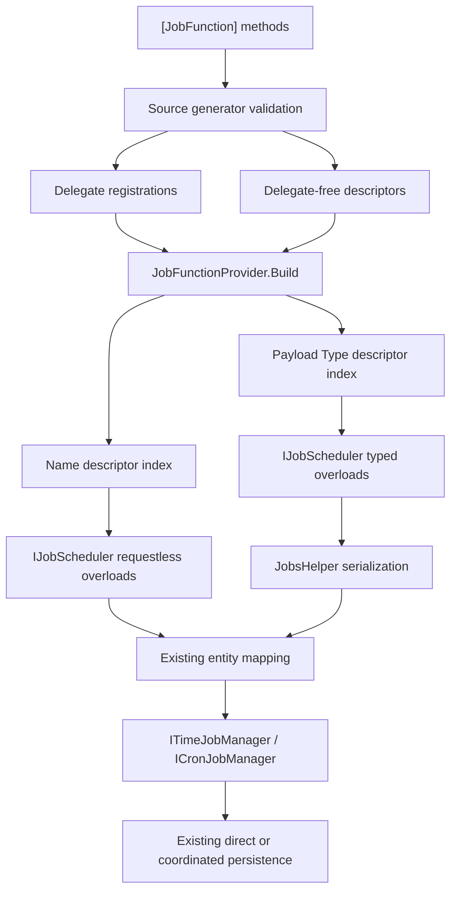

# Jobs Descriptor-Backed Scheduler - Plan

## Goal Capsule

- **Objective:** Preserve `[JobFunction]` as the sole handler model while turning its generated metadata into deterministic descriptor indexes, then expose a narrow typed/requestless scheduling facade over the existing managers and serializer.
- **Authority:** The live body and comments of GitHub issue [#304](https://github.com/xshaheen/headless-framework/issues/304) are the product contract. The issue had no comments when verified on 2026-07-14. Root `CLAUDE.md` governs API, testing, documentation, and shipping conventions.
- **Delivery shape:** Two independently reviewable stacked PRs. PR #304a owns descriptors, generator output/diagnostics, provider indexes/collisions, and generator/provider contract tests on `xshaheen/issue-304-job-function-descriptors`, based on `main`. PR #304b owns the scheduler facade, persistence mapping, DI, atomicity coverage, demos, and docs on `xshaheen/issue-304-job-scheduler`, based on PR #304a's branch.
- **Stop conditions:** Surface a blocker instead of guessing if the public descriptor cannot remain delegate-free, the existing manager APIs cannot preserve coordinated atomic writes, or the live issue changes in a way that conflicts with this plan. Ordinary implementation details are resolved by the decisions below.
- **Tail ownership:** Each slice runs focused tests, formatting, analyzers, simplification, plan-aware code review, commit/push/PR creation, and CI remediation. Neither PR is merged by this workflow.

---

## Product Contract

### Summary

Generated `[JobFunction]` registrations gain an immutable, application-visible descriptor that carries durable function identity and scheduling metadata without exposing the execution delegate. `JobFunctionProvider` freezes read-only name and payload-type indexes, rejecting every ambiguous function name or payload mapping deterministically instead of silently accepting the first registration. A new `IJobScheduler` uses those indexes to serialize typed payloads and create the existing `TimeJobEntity` and `CronJobEntity` shapes through their public managers. Requestless jobs use an explicit descriptor overload; typed descriptors cannot be smuggled through that path.

### Problem Frame

Callers currently copy string function names, construct persistence entities, serialize payload bytes, and invoke low-level managers directly. The generator already knows which `[JobFunction]` owns a typed request, but that metadata is exposed only as a function-name lookup. Silent `TryAdd` behavior also makes cross-assembly ambiguity depend on module-initializer order. The missing safe inverse lookup and application-facing facade make routine scheduling error-prone while the low-level managers remain necessary for CRUD, seeding, custom entities, and advanced scenarios.

### Requirements

**Descriptor and registry foundation**

- R1. Add a public immutable `JobFunctionDescriptor` containing generated function identity and scheduling metadata, including nullable request `Type`, without carrying or exposing `JobFunctionDelegate`.
- R2. Generate a descriptor for every typed and requestless `[JobFunction]` alongside the existing delegate registration. `[JobFunction]` remains the only discovery source and persisted `Function` strings remain the durable identity.
- R3. Expose frozen read-only name-to-descriptor and `Type`-to-descriptor indexes after `JobFunctionProvider.Build()`; typed requests map to exactly one descriptor and requestless functions have no synthetic request type.
- R4. Same-compilation duplicate function names and duplicate request-type mappings are source-generator errors. Cross-assembly duplicate function names or duplicate request-type mappings make `Build()` throw one deterministic exception whose ordinal-sorted conflict report is stable regardless of registration order. First-registration-wins is forbidden.
- R5. Configuration-backed cron expressions update delegate registrations and descriptors consistently before the provider freezes.

**Scheduler facade**

- R6. Add a public `IJobScheduler` with immediate and delayed typed scheduling, recurring typed scheduling with an explicit cron expression, and matching requestless overloads that require a `JobFunctionDescriptor`. Every async API has a trailing optional `CancellationToken`.
- R7. Every scheduling method returns the persisted entity `Guid`; recurring methods specifically return the persisted `CronJobEntity.Id` definition identifier.
- R8. `EnqueueOptions` and `RecurringJobOptions` expose only description, durable retry count/intervals, and node-death policy supported by current entities. Priority remains immutable `[JobFunction]` / `JobFunctionDescriptor` metadata because the current persistence model has no per-job priority. Execution time and cron expression remain method arguments. Do not add tenancy, idempotency, cancellation, chaining, pause/resume, timezone, correlation, lease, tracing, or bulk knobs.
- R9. Typed overloads resolve `typeof(TArgs)`, serialize the request through the existing Jobs request serializer, map descriptor identity and supported options into the existing entity types, and delegate persistence to `ITimeJobManager<TimeJobEntity>` or `ICronJobManager<CronJobEntity>`.
- R10. Requestless overloads verify the supplied descriptor still resolves by identity and has no request type. Unknown payload types or descriptor identities throw `JobFunctionNotFoundException`; a descriptor with a request type is rejected before serialization or persistence.
- R11. Both `AddHeadlessJobs()` and `AddHeadlessJobs<TTimeJob, TCronJob>()` register the same non-generic `IJobScheduler` contract through an internal generic `JobScheduler<TTimeJob, TCronJob>` implementation bound to the configured manager/entity pair. This does not change the public or authoritative role of low-level managers and must never persist a different entity type than the host configured.

**Proof and documentation**

- R12. Unit tests prove immediate, delayed, recurring, and requestless entity mapping, exact returned IDs, serializer use, supported option mapping, and all pre-persistence failures.
- R13. Relational conformance proves facade enqueue inside a coordinated scope preserves the existing atomic row write and deferred side-effect behavior.
- R14. Migrate one Jobs demo call site to typed scheduling and one requestless call site to the descriptor overload.
- R15. Update Abstractions, Core, source-generator, demo, and domain documentation. Continue documenting managers as supported public APIs, not deprecated surfaces.

### Acceptance Examples

- AE1. A generated `JobFunctionContext<CreateInvoice>` method produces a descriptor keyed by both its function string and `typeof(CreateInvoice)`; a parameterless function produces a name descriptor but no inverse type entry.
- AE2. Two generated functions in one compilation accepting the same request type fail compilation even when their function names differ.
- AE3. Two assemblies registering the same function name, and two assemblies mapping the same request type to different function names, both fail `Build()` with stable ordinal-sorted messages independent of callback order.
- AE4. Scheduling `CreateInvoice` immediately persists a `TimeJobEntity` whose `Function`, serialized `Request`, options, and returned `Id` match the resolved descriptor and manager result.
- AE5. Delayed scheduling sets only the explicit UTC execution time in addition to the immediate shape; recurring scheduling sets the explicit cron expression and returns the cron definition ID.
- AE6. A requestless descriptor schedules with `Request = null`; a typed descriptor passed to the requestless overload fails before either manager is called.
- AE7. An unregistered request type or stale/unknown descriptor throws `JobFunctionNotFoundException` before persistence.
- AE8. Inside a relational coordinated scope, a facade call enlists the same job row and defers the same dispatch/restart/notification work as a direct manager `AddAsync` call.

### Scope Boundaries

**Explicitly retained**

- Existing `JobFunctionRegistration`, generated delegates, durable function strings, low-level entity managers, custom entity CRUD, seeders, and direct advanced scheduling remain supported.

**Outside this plan**

- `IJob<TArgs>`, `ICronJob`, synthetic handler classes, class-handler naming attributes, or any discovery model besides `[JobFunction]`.
- Middleware execution or #302's discovery decision.
- Chains, cancellation APIs, idempotency, tenancy, cron controls/timezones/misfires, bulk scheduling, correlation, tracing, leases, or pause/resume.
- Merging either PR or starting #305.

---

## Planning Contract

### Key Technical Decisions

- KTD1. **Keep execution and discovery contracts separate.** `JobFunctionRegistration` remains the generated ABI used by the dispatcher and retains its delegate. `JobFunctionDescriptor` is a separate immutable public value carrying function name, nullable request type, cron metadata, priority, and maximum concurrency. This prevents application code from reaching the delegate while avoiding a breaking rewrite of already-generated registration ABI.
- KTD2. **Register one descriptor collection per generated assembly.** The module initializer emits descriptors alongside existing registrations and calls a dedicated provider registration API. Requestless and typed functions follow the same path; nullable `RequestType` is the only distinction.
- KTD3. **Validate before freezing.** Provider callbacks contribute complete registration batches to a collection rather than mutating final dictionaries with `TryAdd`. `Build()` groups by ordinal function name and exact `Type`, collects every duplicate, sorts conflict kinds and identities with ordinal comparers, throws one stable exception if any conflict exists, and freezes indexes only after validation succeeds.
- KTD4. **Make generator ambiguity a compile-time contract.** Reuse TQ005 for duplicate function identity and add the next shipped diagnostic for duplicate payload mapping. Validate the collected symbol set before code emission so generated dictionaries never rely on duplicate suppression.
- KTD5. **Treat effective cron metadata as one value.** Configuration resolution must update the descriptor and execution registration together, or derive both frozen views from one effective intermediate. The public descriptor must never report a cron expression different from dispatch/seeding behavior.
- KTD6. **Place public scheduling contracts in Abstractions and implementation in Core.** `IJobScheduler`, options, `JobFunctionDescriptor`, and `JobFunctionNotFoundException` belong in `Headless.Jobs.Abstractions`; concrete serialization/mapping and DI registration belong in `Headless.Jobs.Core`, following the repository's abstraction-plus-provider pattern.
- KTD7. **Use current static serializer behavior deliberately.** The facade calls `JobsHelper.CreateJobRequest` so configured JSON options and GZip behavior exactly match execution deserialization. No second serializer abstraction is introduced by this issue.
- KTD8. **Preserve manager authority.** The facade constructs existing entities and calls manager `AddAsync`; it does not call persistence providers, coordinators, dispatchers, or notification services directly. This is what preserves direct and commit-coordinated behavior without duplicating transaction logic.
- KTD9. **Validate before side effects.** Resolve the descriptor and validate overload compatibility before serializing. Finish entity construction before invoking a manager. Failure tests assert managers received no calls.
- KTD10. **Keep the stack physically and semantically separated.** #304a contains no scheduler facade, demo migration, or scheduler docs. #304b starts from #304a and owns all consumer-facing scheduling work, so #304a can be reviewed and merged independently and #304b's PR diff remains limited to the facade slice.
- KTD11. **Keep priority on generated function identity.** The user resolved the issue's contradictory priority wording on 2026-07-14: scheduling options omit priority because no entity or EF mapping persists it, while `[JobFunction]`, `JobFunctionRegistration`, and `JobFunctionDescriptor` remain the authoritative priority source used by dispatch. Do not add an ignored option or a persistence migration in #304.
- KTD12. **Use one public facade contract over the configured generic entity pair.** `IJobScheduler` stays non-generic for application ergonomics. `JobScheduler<TTimeJob, TCronJob>` is internal and carries the same `new()`/entity constraints as `AddHeadlessJobs<TTimeJob, TCronJob>()`; the generic setup registers that closed implementation against `IJobScheduler`. The default setup naturally closes it over `TimeJobEntity` / `CronJobEntity`, while custom hosts receive entities of their configured types without a second public API.

### High-Level Technical Design

### Stack and File Ownership

**PR #304a — `xshaheen/issue-304-job-function-descriptors` -> `main`**

- Owns `src/Headless.Jobs.Abstractions/Base/JobFunctionDescriptor.cs`.
- Owns descriptor/index/collision changes in `src/Headless.Jobs.Core/JobFunctionProvider.cs`.
- Owns generator output and diagnostics under `src/Headless.Jobs.SourceGenerator/`.
- Owns the new isolated generator contract project under `tests/Headless.Jobs.SourceGenerator.Tests.Unit/`, provider registry tests under `tests/Headless.Jobs.Composition.Tests.Unit/`, solution registration, and this plan.
- Must not add `IJobScheduler`, scheduler options, facade implementation/DI, demos, or scheduler documentation.

**PR #304b — `xshaheen/issue-304-job-scheduler` -> `xshaheen/issue-304-job-function-descriptors`**

- Owns public scheduler contracts/options/exception under `src/Headless.Jobs.Abstractions/`.
- Owns implementation and DI changes under `src/Headless.Jobs.Core/`.
- Owns scheduler unit tests in `tests/Headless.Jobs.Composition.Tests.Unit/` and coordinated facade conformance in `tests/Headless.Jobs.EntityFramework.Tests.Harness/` plus provider leaves only when exposure is required.
- Owns the two demo migrations under `demo/Headless.Jobs.Console.Demo/` and/or `demo/Headless.Jobs.Api.Demo/`, plus `docs/llms/jobs.md`, `docs/llms/index.md` if its canonical example changes, and package READMEs.
- Must not rewrite descriptor/generator behavior except for a narrowly proven #304a defect; any such repair is committed to #304a first and then rebased/merged into #304b.

### Assumptions

- The current source-generator project has no dedicated contract-test project, so #304a creates one using the repository's xUnit v3 and Verify source-generator patterns and adds it to `headless-framework.slnx`.
- `Type` identity is the inverse-key authority; display names are used only in deterministic error messages.
- The facade contract is non-generic, while its internal implementation is closed over the exact `TTimeJob` / `TCronJob` pair configured by either setup overload. Both entity constraints already provide `new()`, so the facade can construct the correct custom entity types without reflection or a second public interface.
- Existing static provider lifecycle remains startup-only. Tests isolate collision aggregation in a pure internal builder where necessary instead of depending on global test order.

### Sources and Existing Patterns

- Live authority: GitHub issue [#304](https://github.com/xshaheen/headless-framework/issues/304), verified 2026-07-14 with no comments.
- Registry and serializer: `src/Headless.Jobs.Core/JobFunctionProvider.cs`, `src/Headless.Jobs.Core/JobsHelper.cs`, and `src/Headless.Jobs.Core/DependencyInjection/SetupJobs.cs`.
- Generator: `src/Headless.Jobs.SourceGenerator/JobsIncrementalSourceGenerator.cs`, `Generators/DelegateGenerator.cs`, `Validation/AttributeValidator.cs`, `Validation/DiagnosticDescriptors.cs`, and `Resources/DiagnosticMessages.resx`.
- Public entity/manager contracts: `src/Headless.Jobs.Abstractions/Entities/`, `src/Headless.Jobs.Abstractions/Interfaces/Managers/`, and `src/Headless.Jobs.Abstractions/Base/JobFunctionRegistration.cs`.
- Atomicity pattern: `tests/Headless.Jobs.EntityFramework.Tests.Harness/JobsEnqueueAtomicityConformanceTests.cs` and `tests/Headless.Jobs.Composition.Tests.Unit/Transactions/JobsManagerCoordinatedRoutingTests.cs`.
- Generator test shape: `tests/Headless.Generator.Primitives.Tests.Unit/` with `Verify.SourceGenerators` and xUnit v3 Microsoft Testing Platform.
- Consumer docs and demos: `docs/llms/jobs.md`, `src/Headless.Jobs.Abstractions/README.md`, `src/Headless.Jobs.SourceGenerator/README.md`, `demo/Headless.Jobs.Console.Demo/`, and `demo/Headless.Jobs.Api.Demo/`.

---

## Implementation Units

### U1. Public descriptor contract (#304a)

- **Goal:** Define the delegate-free immutable value consumed by generated code, registry indexes, middleware follow-ups, and requestless scheduling.
- **Requirements:** R1, R3
- **Dependencies:** none
- **Files:** `src/Headless.Jobs.Abstractions/Base/JobFunctionDescriptor.cs` (new); `src/Headless.Jobs.Abstractions/README.md` only for descriptor facts required to explain the contract.
- **Approach:** Add a public immutable record/value with function name, nullable request type, cron expression, priority, and maximum concurrency. Validate invariants at construction without creating a synthetic request marker. Do not reference the execution delegate.
- **Test scenarios:** Typed and requestless construction; immutable value behavior; nullable request type is the only requestless marker; descriptor assembly has no dependency on Jobs Core.
- **Verification:** Abstractions build and public API analyzers pass.

### U2. Generated descriptors and compile-time collisions (#304a)

- **Goal:** Emit complete descriptors and reject ambiguous source compilations before generated registration code runs.
- **Requirements:** R2, R4
- **Dependencies:** U1
- **Files:** `src/Headless.Jobs.SourceGenerator/JobsIncrementalSourceGenerator.cs`; `src/Headless.Jobs.SourceGenerator/Generators/DelegateGenerator.cs` or a focused descriptor emitter; `src/Headless.Jobs.SourceGenerator/Validation/AttributeValidator.cs`; `src/Headless.Jobs.SourceGenerator/Validation/DiagnosticDescriptors.cs`; `src/Headless.Jobs.SourceGenerator/Resources/DiagnosticMessages.resx`; `src/Headless.Jobs.SourceGenerator/AnalyzerReleases.Unshipped.md`; `tests/Headless.Jobs.SourceGenerator.Tests.Unit/Headless.Jobs.SourceGenerator.Tests.Unit.csproj` (new); generator harness, tests, snapshots, and lock file under that project; `headless-framework.slnx`.
- **Approach:** Extend the collected method model enough to emit one descriptor per valid function and register the batch in the module initializer. Validate duplicate function names and duplicate non-null request types across the compilation before emission. Record the new diagnostic in analyzer release notes.
- **Test scenarios:** Snapshot containing one typed and one requestless function; descriptor fields match attributes/context; TQ005 duplicate function name; new duplicate-payload error for different functions sharing one request type; no diagnostic for multiple requestless functions; namespaces and same-simple-name request types emit unambiguous `typeof` expressions; existing delegate output remains intact.
- **Verification:** New generator contract suite and generator project build pass.

### U3. Deterministic provider indexes and collision report (#304a)

- **Goal:** Freeze unambiguous descriptor views and make cross-assembly conflicts independent of initializer order.
- **Requirements:** R3-R5
- **Dependencies:** U1, U2
- **Files:** `src/Headless.Jobs.Core/JobFunctionProvider.cs`; `tests/Headless.Jobs.Composition.Tests.Unit/JobFunctionProviderTests.cs` (new or focused replacement); narrowly affected existing provider tests.
- **Approach:** Collect batches, resolve configuration-backed cron metadata consistently, group all registrations, report all duplicate function and payload keys in a stable ordinal order, and freeze only on success. Preserve `JobFunctions` and legacy request metadata for dispatch/dashboard compatibility while adding descriptor indexes.
- **Test scenarios:** Successful typed/requestless name index; inverse type index; unknown lookups; duplicate function across two batches; duplicate request type across different names; simultaneous conflict classes; identical message under reversed batch order; ordinal sort including casing; no partial frozen state after failure; effective cron expression agrees across registration and descriptor.
- **Verification:** Jobs Core build and Jobs unit suite pass; public API and analyzer gates pass.

### U4. Scheduler public surface and supported options (#304b)

- **Goal:** Define the narrow application API without leaking persistence construction or inventing unsupported controls.
- **Requirements:** R6-R8, R10-R11
- **Dependencies:** U3
- **Files:** `src/Headless.Jobs.Abstractions/Interfaces/IJobScheduler.cs` (new); `src/Headless.Jobs.Abstractions/Models/EnqueueOptions.cs` (new); `src/Headless.Jobs.Abstractions/Models/RecurringJobOptions.cs` (new); `src/Headless.Jobs.Abstractions/Exceptions/JobFunctionNotFoundException.cs` (new); focused API-shape tests under `tests/Headless.Jobs.Composition.Tests.Unit/`.
- **Approach:** Use explicit immediate, delayed, and recurring method names/signatures with generic typed payload and descriptor-based requestless overloads. Keep execution time and cron expression as method arguments and cancellation tokens trailing/optional. Options map only to existing entity properties.
- **Test scenarios:** Reflection/API test covers every overload, return type, and trailing optional token; options expose only description, durable retry count/intervals, and node-death policy and explicitly do not expose priority; exception captures enough identity to distinguish missing payload type from missing descriptor name.
- **Verification:** Abstractions and Jobs unit projects compile with analyzers.

### U5. Scheduler mapping, serialization, validation, and DI (#304b)

- **Goal:** Implement the facade exclusively through the frozen descriptor indexes, existing serializer, and public managers.
- **Requirements:** R7, R9-R12
- **Dependencies:** U4
- **Files:** `src/Headless.Jobs.Core/JobScheduler.cs` (new); `src/Headless.Jobs.Core/DependencyInjection/SetupJobs.cs`; `tests/Headless.Jobs.Composition.Tests.Unit/JobSchedulerTests.cs` (new); DI registration tests in the same project.
- **Approach:** Resolve descriptors before serialization, reject requestless/typed overload mismatches, map supported options into the configured `TTimeJob` / `TCronJob` entities, call `JobsHelper.CreateJobRequest` for typed payloads, invoke the appropriate manager once, and return its persisted entity ID. Register the closed internal `JobScheduler<TTimeJob, TCronJob>` against non-generic `IJobScheduler` with the same lifetime as the managers.
- **Test scenarios:** Immediate typed entity shape; delayed typed execution time; recurring typed expression and definition ID; requestless time/cron requests with null payload; every supported option maps exactly; default values; configured serializer and GZip behavior; unknown request type; unknown descriptor; stale descriptor metadata; typed descriptor rejected by requestless overload; manager never called on validation/serialization failure; cancellation forwarded; DI resolves one facade with default jobs setup and does not bind incompatible generic managers.
- **Verification:** Jobs Core build and focused unit suite pass.

### U6. Coordinated facade atomicity (#304b)

- **Goal:** Prove facade calls inherit the managers' relational transaction and deferred-side-effect contract.
- **Requirements:** R13
- **Dependencies:** U5
- **Files:** `tests/Headless.Jobs.EntityFramework.Tests.Harness/JobsEnqueueAtomicityConformanceTests.cs`; fixture registration in `tests/Headless.Jobs.EntityFramework.Tests.Harness/JobsCoordinationFixtureBase.cs`; PostgreSQL/SQL Server leaf exposure only if the harness requires it.
- **Approach:** Add a portable facade scenario beside direct manager enqueue tests. Register a generated-equivalent descriptor/function in the fixture before provider build, begin the existing coordinated relational scope, schedule through `IJobScheduler`, and assert row visibility/commit or rollback plus deferred dispatch/restart/notification behavior using the same probes as manager tests.
- **Test scenarios:** Commit persists the facade-created row and releases deferred side effects after commit; rollback leaves no row and no side effect; returned ID identifies the enlisted row; request bytes/function/options match; both relational providers run the shared scenario.
- **Verification:** PostgreSQL and SQL Server Jobs integration projects pass independently with Docker.

### U7. Demo migration and documentation sync (#304b)

- **Goal:** Demonstrate the safe routine path while keeping low-level managers visibly supported.
- **Requirements:** R14-R15
- **Dependencies:** U5, U6
- **Files:** one typed scheduling call under `demo/Headless.Jobs.Api.Demo/`; one requestless scheduling call under `demo/Headless.Jobs.Console.Demo/` or the closest existing Jobs demo; `docs/llms/jobs.md`; `docs/llms/index.md` only if its canonical scheduling example changes; `src/Headless.Jobs.Abstractions/README.md`; `src/Headless.Jobs.SourceGenerator/README.md`; `src/Headless.Jobs.Core/README.md` if present/relevant.
- **Approach:** Replace two representative manual entity-construction paths without broad demo refactors. Document descriptor lookup, typed/requestless facade usage, serializer/option behavior, returned IDs, collision failures, and when managers remain the correct API.
- **Test scenarios:** Demo projects compile; examples use generated `[JobFunction]` metadata rather than copied function strings; docs never call managers deprecated and list explicit non-goals/options accurately.
- **Verification:** Both demo projects build; documentation links and examples match final signatures; source-generator README explains diagnostics/index output.

---

## Verification Contract

| Gate | Command | Applies to |
|---|---|---|
| Abstractions build | `make build-project PROJECT=src/Headless.Jobs.Abstractions/Headless.Jobs.Abstractions.csproj` | U1, U4 |
| Generator build | `make build-project PROJECT=src/Headless.Jobs.SourceGenerator/Headless.Jobs.SourceGenerator.csproj` | U2 |
| Generator contracts | `make test-project TEST_PROJECT=tests/Headless.Jobs.SourceGenerator.Tests.Unit/Headless.Jobs.SourceGenerator.Tests.Unit.csproj` | U2 |
| Jobs Core build | `make build-project PROJECT=src/Headless.Jobs.Core/Headless.Jobs.Core.csproj` | U3, U5 |
| Jobs unit suite | `make test-project TEST_PROJECT=tests/Headless.Jobs.Composition.Tests.Unit/Headless.Jobs.Composition.Tests.Unit.csproj` | U1, U3-U5 |
| PostgreSQL atomicity | `make test-project TEST_PROJECT=tests/Headless.Jobs.EntityFramework.PostgreSql.Tests.Integration/Headless.Jobs.EntityFramework.PostgreSql.Tests.Integration.csproj` | U6 |
| SQL Server atomicity | `make test-project TEST_PROJECT=tests/Headless.Jobs.EntityFramework.SqlServer.Tests.Integration/Headless.Jobs.EntityFramework.SqlServer.Tests.Integration.csproj` | U6 |
| Demo builds | `make build-project PROJECT=demo/Headless.Jobs.Api.Demo/Headless.Jobs.Api.Demo.csproj` and `make build-project PROJECT=demo/Headless.Jobs.Console.Demo/Headless.Jobs.Console.Demo.csproj` | U7 |
| Formatting | `make format-check` | both PRs |
| Focused analyzers | `make quality-analyzers-project PROJECT=<each changed production or test project>` | both PRs |
| Full analyzer gate | `make quality-analyzers` | before each PR push/review completion |
| Diff integrity | `git diff --check` | every commit and PR tail |
| CI | Required GitHub checks for each PR head are successful | both PRs |

Each behavior-changing unit must add or update automated tests. #304a must show generator red/diagnostic evidence for same-compilation ambiguity and provider failure evidence for cross-assembly ambiguity before the successful indexes are accepted. #304b must show facade tests failing before implementation or characterization evidence for reused manager atomicity, then pass the focused suites above. Container-backed integration gates may be deferred to CI only when Docker is genuinely unavailable locally; that exception must be reported and CI must still go green.

---

## Definition of Done

- #304a contains only U1-U3 plus this plan, uses an `xshaheen/*` branch based on `main`, links #304, is pushed and open, and passes its generator/Core/unit/analyzer/CI gates.
- #304b contains only U4-U7, uses an `xshaheen/*` branch whose PR base is #304a's branch, links #304 and the lower PR, is pushed and open, and passes its unit/integration/demo/docs/analyzer/CI gates.
- `[JobFunction]` is still the only handler discovery/authoring model; no class-handler alternative or synthetic request type exists.
- Descriptor and inverse indexes are read-only, complete, and collision-safe; all collision messages are deterministic and all generator diagnostics are documented and tested.
- The facade serializes through the existing Jobs serializer, persists only through managers, returns actual entity IDs, and fails unknown/mismatched identities before persistence.
- Immediate, delayed, recurring, requestless, returned cron definition ID, and coordinated atomic-write behavior are covered by automated tests.
- One typed and one requestless demo call site use the facade, while docs continue to present managers as supported for CRUD/custom/seeding/advanced use.
- Simplification and plan-aware code review have no unresolved eligible findings; any downstream residual is durably tracked according to the autopilot contract.
- Both PRs are independently reviewable, correctly stacked, open, and green. Neither PR is merged.
