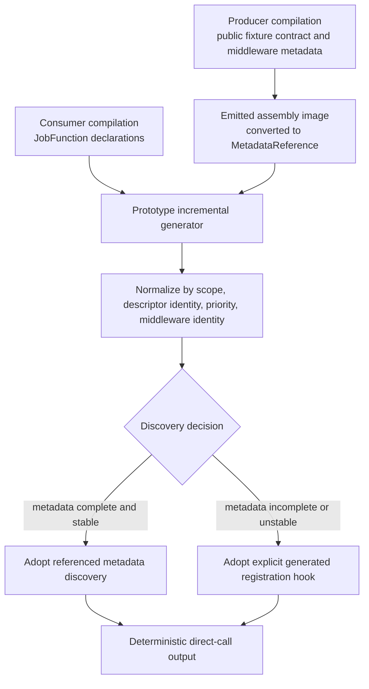
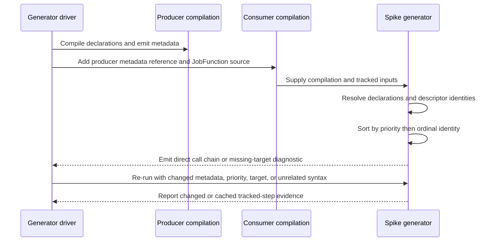

# spike(jobs): Validate cross-assembly middleware discovery by function identity

## Goal Capsule

- **Objective:** Produce executable evidence and one written decision for how the Jobs generator will discover global and function-targeted middleware across assembly boundaries.
- **Authority:** GitHub issue #302 and its comments override this plan; repository `CLAUDE.md` and current Jobs/Roslyn patterns govern implementation details.
- **Execution profile:** Bounded compile-time spike in prototype/test code. Preserve `[JobFunction]` as the sole handler model and use generated function descriptor identity for targeting.
- **Stop conditions:** Stop rather than widening scope if the evidence requires production Jobs generator/runtime changes, a second handler model, runtime scanning, reflection invocation, expression compilation, or coordination with unfinished #304 code.
- **Tail ownership:** Record exactly one registration mechanism for #305, verify it through focused build/test/analyzer gates, and keep the PR unmerged.

---

## Product Contract

### Summary

Jobs middleware needs global and per-function registration without runtime assembly scanning.
This spike determines whether the application generator can reliably compose middleware declarations from its current compilation and referenced assembly metadata, or whether referenced assemblies must expose an explicit generated registration hook.

### Problem Frame

The existing Jobs generator discovers `[JobFunction]` methods in the current compilation and emits direct registration calls, but cross-assembly middleware declarations introduce a separate compile-time discovery boundary.
The decision must be based on generated `JobFunctionDescriptor` identity rather than a handler class and must produce deterministic output independent of assembly-load or module-initializer order.

### Requirements

- R1. Keep `[JobFunction]` as the only handler authoring model; do not introduce `IJob<TArgs>`, `ICronJob`, `TJob` targeting, synthetic handler classes, or handler naming conventions.
- R2. Model both global middleware and middleware targeted to one generated function descriptor identity.
- R3. Prove which assembly-level declarations are visible from the current compilation and from referenced assembly metadata using a producer/reference/consumer fixture.
- R4. Evaluate metadata discovery and an explicit generated registration hook as mutually exclusive production candidates, then select exactly one for #305.
- R5. Order generated middleware by `Priority`, then stable middleware identity using ordinal semantics, independent of source, reference, or assembly-load order.
- R6. Define consumer authoring syntax for the selected mechanism, including which declarations must be repeated in the application assembly.
- R7. Emit a deterministic compile-time diagnostic when a function-targeted middleware declaration cannot resolve its generated function identity.
- R8. Inspect generated output and prove the steady-state path contains direct generated calls only, with no runtime assembly scan, reflection invocation, `Expression.Compile()`, or `Expression.Lambda(...).Compile()`.
- R9. Verify middleware metadata, priority, and target-identity changes regenerate correct output or diagnostics; unrelated edits must preserve byte-identical middleware output.
- R10. Keep all executable spike code in an isolated prototype/test project and record the discovery decision without modifying production Jobs generator/runtime packages.

### Acceptance Examples

- AE1. A producer assembly declares global middleware metadata; a consumer compilation references its emitted assembly and the spike generator emits the producer middleware in the consumer call chain.
- AE2. Same-priority middleware declared in different source/reference orders produces the same ordinal identity order.
- AE3. Function-targeted metadata resolves to the same generated descriptor identity used by a `[JobFunction]`; a missing or changed identity produces the documented diagnostic instead of a runtime miss.
- AE4. Re-running the generator after changing priority or target identity changes the relevant output, while an unrelated source edit leaves the discovery output cached or unchanged as appropriate to the tracked incremental step.

### Scope Boundaries

**In scope**

- A minimal Roslyn prototype, compile-and-reference fixture, focused tests/snapshots, solution registration, and a durable decision record.
- Both metadata visibility and explicit generated-hook fallback evidence, sufficient to choose one.

**Outside scope**

- Production middleware contracts, scheduling/execution pipeline integration, DI scopes, retries, tenancy, tracing, logging, persistence, or Messaging infrastructure sharing.
- Production `JobFunctionDescriptor` implementation owned by #304.
- Runtime plugin discovery or registration after `JobFunctionProvider.Build()`.

### Dependencies

- #304 coordinates on descriptor identity but does not block this spike; the fixture uses a minimal prototype identity with the same durable function-name semantics.
- #305 consumes the selected mechanism and must not carry both discovery paths into production.

### Sources

- [Issue #302](https://github.com/xshaheen/headless-framework/issues/302) — product and delivery contract.
- [Issue #304](https://github.com/xshaheen/headless-framework/issues/304) — generated descriptor identity and collision semantics coordination.
- [Issue #305](https://github.com/xshaheen/headless-framework/issues/305) — downstream consumer of the selected mechanism.
- [Roslyn `Compilation` API](https://learn.microsoft.com/en-us/dotnet/api/microsoft.codeanalysis.compilation?view=roslyn-dotnet-5.0.0) — metadata reference to symbol access.
- [Roslyn source generator cookbook](https://github.com/dotnet/roslyn/blob/main/docs/features/source-generators.cookbook.md) — direct `GeneratorDriver` testing and generated-output inspection.

---

## Planning Contract

### Key Technical Decisions

- KTD1. **Use one isolated Roslyn-driver test project as the producer/reference/consumer fixture.** The harness compiles a producer to an assembly image, converts that image to a `MetadataReference`, and compiles a consumer against it. This proves the real metadata-symbol boundary while keeping diagnostics, snapshots, and tracked incremental evidence in one bounded project.
- KTD2. **Represent targeting with a minimal generated function descriptor identity whose durable value is the `[JobFunction]` function name.** This aligns with #304 while avoiding a dependency on its unfinished public contract.
- KTD3. **Make the prototype generator compilation-driven and output direct calls.** Read current-assembly attributes from `Compilation.Assembly`, referenced attributes through symbols resolved from `Compilation.References`, normalize them into immutable value data, and generate the call chain.
- KTD4. **Define a total order and duplicate policy before generation.** Stable middleware identity is the declaring assembly simple name plus the middleware type's fully qualified metadata name, compared ordinally after `Priority`. An exact duplicate of scope, target identity, priority, and stable middleware identity is a compile-time error rather than a second invocation.
- KTD5. **Treat metadata discovery and the explicit hook as a precommitted decision gate, not parallel production options.** Adopt metadata discovery only if every required same/reference assembly, global/targeted, diagnostic, ordering, direct-call, and relevant-change case passes. Any visibility, target-resolution, determinism, or relevant-change failure selects the hook fallback. The hook candidate is valid only when a normal consumer declaration names the referenced producer assembly and the generator derives and invokes its well-known generated hook without harness-injected symbols, names, or calls.
- KTD6. **Use tracked incremental steps plus generated-source comparison for rebuild evidence.** Priority, target identity, and metadata-reference changes must regenerate correct output or diagnostics. An unrelated source edit must leave middleware output byte-identical; whether Roslyn reports the narrow step as cached is observational evidence, not a completion gate.
- KTD7. **Use a generator error for unresolved descriptor identity.** The diagnostic identifies the middleware declaration and target function deterministically; it must not defer failure to runtime or depend on registration order.

### High-Level Technical Design

### Assumptions

- Prototype metadata attributes and descriptor types are public inside the compiled fixture source so referenced assemblies can use them, but they remain test-only and do not create a production public API.
- A function name is sufficient as the prototype descriptor identity because #304 locks the persisted `Function` value as the durable identity.
- The existing `Microsoft.CodeAnalysis.CSharp` and Verify packages are sufficient; no new package family or quarantine override is expected.

### Sequencing

U1 establishes the isolated producer/reference/consumer compilation harness and prototype generator.
U2 turns each acceptance criterion into executable evidence and may refine the prototype without crossing into production packages.
U3 records the selected mechanism only after U2 has decided the evidence.

---

## Implementation Units

### U1. Isolated cross-assembly generator fixture

- **Goal:** Create the minimal test-only generator and emitted-metadata harness needed to model same-assembly and referenced-assembly middleware declarations by generated function identity.
- **Requirements:** R1, R2, R3, R4, R10.
- **Dependencies:** None.
- **Files:**
  - `tests/Headless.Jobs.MiddlewareDiscovery.Spike.Tests.Unit/Headless.Jobs.MiddlewareDiscovery.Spike.Tests.Unit.csproj`
  - `tests/Headless.Jobs.MiddlewareDiscovery.Spike.Tests.Unit/MiddlewareDiscoverySpikeGenerator.cs`
  - `tests/Headless.Jobs.MiddlewareDiscovery.Spike.Tests.Unit/CompilationFixture.cs`
  - `headless-framework.slnx`
- **Approach:** Add one `Headless.NET.Sdk.Test` project using the repository's existing Roslyn/Verify dependencies. The harness compiles public fixture-only contracts and producer declarations to an assembly image, references that image from a consumer compilation containing `[JobFunction]` declarations, retains the generator driver across updates, and returns diagnostics, generated source, and tracked-step results. The hook candidate starts from ordinary producer/reference/consumer inputs plus one declared consumer assembly marker; the generator must derive the well-known hook invocation without test-only injection.
- **Execution note:** Establish a failing cross-assembly characterization test before completing discovery logic so the selected mechanism is evidence-driven.
- **Patterns to follow:** `tests/Headless.Generator.Primitives.Tests.Unit/Helpers/TestHelpers.cs`, `tests/Headless.Generator.Primitives.Tests.Unit/PrimitiveGeneratorTests.cs`, and `src/Headless.Jobs.SourceGenerator/JobsIncrementalSourceGenerator.cs`.
- **Test scenarios:**
  - Compile an application-local global declaration and confirm the generator can observe it.
  - Compile a producer assembly with a global declaration, convert its emitted image to a metadata reference, and confirm consumer generated source observes or conclusively rejects it.
  - Compile a `[JobFunction]` plus a descriptor-targeted declaration and confirm both normalize to the same function-name identity.
  - Compile the explicit-hook candidate from an ordinary consumer assembly marker and confirm the generator derives and invokes the referenced producer's well-known hook without injected hook symbols, names, or calls.
- **Verification:** The focused test project builds without analyzer warnings and the harness compiles, references, and runs the generator without loading emitted assemblies.

### U2. Determinism, diagnostics, generated path, and incremental evidence

- **Goal:** Convert every behavioral acceptance criterion into focused tests and inspectable generated output that decides the discovery mechanism.
- **Requirements:** R3, R4, R5, R7, R8, R9.
- **Dependencies:** U1.
- **Files:**
  - `tests/Headless.Jobs.MiddlewareDiscovery.Spike.Tests.Unit/MiddlewareDiscoverySpikeGeneratorTests.cs`
  - `tests/Headless.Jobs.MiddlewareDiscovery.Spike.Tests.Unit/IncrementalDiscoveryTests.cs`
  - `tests/Headless.Jobs.MiddlewareDiscovery.Spike.Tests.Unit/Snapshots/`
- **Approach:** Exercise same-compilation and emitted-reference inputs, permute source/reference order, and snapshot the generated direct-call chain. Reuse the same generator driver with updated consumer compilations and metadata references to inspect tracked incremental reasons. Missing targets and exact duplicate declarations must produce stable errors with no invalid partial call chain.
- **Execution note:** Treat the first failing run for each mechanism as characterization evidence; do not weaken an assertion to make either candidate win.
- **Patterns to follow:** Verify snapshot conventions in `tests/Headless.Generator.Primitives.Tests.Unit/Snapshots/` and generator diagnostic patterns in `src/Headless.Jobs.SourceGenerator/Validation/DiagnosticDescriptors.cs`.
- **Test scenarios:**
  - Covers AE1. Discover a referenced global declaration and emit it together with an application-local declaration.
  - Covers AE3. Discover function-targeted metadata by descriptor identity in both same-assembly and referenced-assembly cases.
  - Reverse declaration order and metadata-reference order; assert `Priority`, then declaring assembly simple name plus fully qualified middleware metadata name using ordinal comparison, produces byte-for-byte identical output.
  - Repeat an exact scope/target/priority/identity declaration and assert a deterministic duplicate diagnostic rather than double invocation.
  - Supply a missing target identity; assert one deterministic error names the target and declaration, and generated output does not contain that targeted middleware.
  - Inspect the snapshot for direct static/delegate calls and assert forbidden runtime scan, reflection invocation, and expression compilation APIs are absent.
  - Covers AE4. Change priority and assert order/output plus the discovery tracked step change.
  - Covers AE4. Change target identity and assert the call chain or diagnostic plus the discovery tracked step change.
  - Change referenced middleware metadata and assert the reference-derived discovery step changes.
  - Change unrelated consumer syntax and assert normalized middleware output remains byte-identical; record tracked-step reuse without making caching a pass/fail requirement.
- **Verification:** All focused tests pass repeatedly with permuted input order; snapshots expose the complete call chain; no emitted assembly is loaded or scanned at runtime.

### U3. Discovery decision record

- **Goal:** Record the one mechanism #305 must implement, its authoring syntax, visibility boundary, ordering, diagnostics, and rejected alternative.
- **Requirements:** R4, R5, R6, R7, R8, R10.
- **Dependencies:** U2.
- **Files:**
  - `docs/solutions/tooling-decisions/jobs-middleware-cross-assembly-discovery-2026-07-14.md`
- **Approach:** Summarize observed evidence rather than anticipated Roslyn behavior. Apply KTD5's precommitted decision matrix, state which declarations the generator sees, document the selected consumer syntax and anything repeated in the application assembly, capture missing-target diagnostic limits, and explain why the rejected mechanism must not remain a second production option. Link #302, #304, and #305 and cite the focused tests as executable evidence.
- **Patterns to follow:** `docs/solutions/tooling-decisions/redlock-multi-instance-not-adopted-2026-05-19.md` for durable decision structure and YAML metadata.
- **Test scenarios:** Test expectation: none — this unit records the outcome already enforced by U2.
- **Verification:** A reviewer can implement #305's registration mechanism without reopening metadata-versus-hook selection or inventing consumer syntax.

---

## Verification Contract

| Gate | Scope | Done signal |
|---|---|---|
| Focused build | `tests/Headless.Jobs.MiddlewareDiscovery.Spike.Tests.Unit/Headless.Jobs.MiddlewareDiscovery.Spike.Tests.Unit.csproj` | Release build succeeds with no warnings or analyzer errors. |
| Focused tests | New spike test project | Same/cross-assembly, ordering, diagnostics, forbidden-path, and incremental tests pass. |
| Format | Repository C# formatting check | New C# sources match CSharpier output. |
| Analyzer quality | New spike test project | Project-scoped quality analyzer gate reports no findings. |
| Scope audit | Branch diff | Only the plan, isolated spike project/solution entry, snapshots, and decision record change; production Jobs packages remain untouched. |

---

## Definition of Done

- U1–U3 are complete and traceable to R1–R10.
- The producer/reference/consumer evidence covers both registration candidates and selects exactly one.
- Global and descriptor-targeted discovery work across the proven boundary for the selected mechanism.
- Generated output is deterministic by priority then ordinal middleware identity.
- Missing function targets fail at compile time with a stable diagnostic.
- Incremental evidence proves correct regeneration for metadata, priority, and target-identity changes; unrelated edits preserve byte-identical middleware output.
- Generated steady-state output contains direct calls only and no forbidden runtime discovery or compilation APIs.
- The decision record gives #305 an implementation-ready authoring model and diagnostic boundary.
- No production middleware pipeline, handler model, or #304 implementation is introduced.
- The branch is committed, pushed, opened as a PR linked to #302, and CI is green; the PR remains unmerged.
