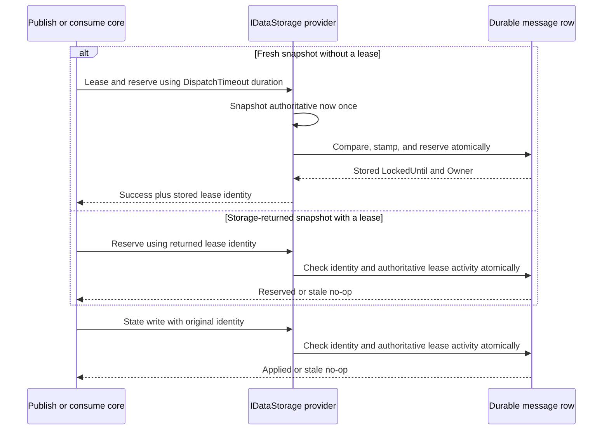

# Dispatch Lease Store Clock Authority - Plan

## Goal Capsule

- **Objective:** Make every dispatch lease use its storage provider as the temporal authority while preserving the documented at-least-once boundary after genuine lease expiry.
- **Authority:** GitHub issue #273 is the product and acceptance contract; `CLAUDE.md`, `CONCEPTS.md`, and current provider patterns govern implementation details.
- **Execution profile:** Change the public storage SPI, core publish/consume paths, InMemory/PostgreSQL/SQL Server implementations, provider-conformance tests, and lockstep messaging documentation.
- **Stop conditions:** Do not add schema state, promise process-pause fencing, change `NextRetryAt` scheduling ownership, or couple this work to the messaging verb-model branch.
- **Tail ownership:** The implementation must pass focused unit/integration gates, repository formatting and analyzer gates, review, PR publication, and CI disposition.

---

## Product Contract

### Summary

Dispatch lease acquisition will accept a duration and let each store compare, stamp, and return `LockedUntil` from its own authoritative clock. Relational providers will use database time; InMemory will retain its injected `TimeProvider`; expired leases will continue to permit at-least-once recovery.

### Problem Frame

Retry pickup already compares and stamps `LockedUntil` from one relational database-clock snapshot, but fresh publish/consume lease paths compute an absolute deadline from the application clock. A forward application-clock step can therefore shorten a new relational lease or make a database-leased retry snapshot appear expired to core, causing avoidable contention or skipped dispatch.

The store fence cannot stop transport or consumer work already running in a paused process. Once `DispatchTimeout` genuinely expires, a successor may acquire the row and overlap the resumed attempt. This plan removes client-clock skew while preserving that documented at-least-once boundary.

### Requirements

#### Lease authority and contracts

- R1. The four `IDataStorage` lease-acquisition methods accept a lease duration rather than an application-computed absolute deadline and return the stored expiry through the caller's `MediumMessage`.
- R2. PostgreSQL and SQL Server use one command-local database timestamp to compare current lease expiry, stamp the replacement expiry, and return the persisted `LockedUntil` and owner without a separate clock query.
- R3. InMemory samples its injected `TimeProvider` once inside the atomic row operation and uses that value for both comparison and expiry stamping.
- R4. Relational reservation and owned state-write predicates evaluate lease activity with database time while retaining exact `(LockedUntil, Owner)` equality as the attempt-generation fence.

#### Core dispatch behavior

- R5. Core passes `DispatchTimeout` as a duration and does not compare a storage-returned `LockedUntil` to the application clock to decide whether an existing lease must be reacquired.
- R6. Fresh publish/consume snapshots acquire a lease and reserve the attempt atomically; retry-pickup snapshots with a stored lease reserve under that lease; crash-recovery paths preserve their existing no-double-reservation behavior.
- R7. Every terminal and retry transition, including unsupported stored-message intent or missing transport, is fenced by the attempt's original `(LockedUntil, Owner)` identity.

#### Semantics, verification, and compatibility

- R8. `NextRetryAt` remains application scheduling state and is not converted to database-clock ownership.
- R9. A stale attempt cannot reserve another inline attempt or write retry/terminal state after a successor acquires the row.
- R10. Advancing the application `TimeProvider` cannot shorten, immediately reclaim, or otherwise change a relational lease's requested duration.
- R11. Genuine `DispatchTimeout` expiry remains recoverable and may produce unavoidable overlap when a paused process resumes; delivery remains at-least-once and consumers remain responsible for idempotency.
- R12. The change adds no schema column or migration and remains independently mergeable before the messaging verb-model integration branch.

### Acceptance Examples

- AE1. Given a relational storage instance whose application clock is far ahead, when a fresh publish or receive lease is acquired for a duration, then the returned and persisted expiry is approximately that duration after database time and an immediate contender cannot reclaim it.
- AE2. Given retry pickup returned a message with a database-stamped non-null lease, when core runs under a forward-skewed application clock, then it reserves under the existing lease without attempting reacquisition.
- AE3. Given owner A's lease expires and owner B acquires the row, when owner A later reserves another attempt or writes success, failure, or retry state, then storage rejects the stale `(LockedUntil, Owner)` generation.
- AE4. Given an InMemory store with a `FakeTimeProvider`, when the clock advances through the lease boundary, then acquisition and successor behavior are deterministic from that injected clock.
- AE5. Given a process pauses longer than `DispatchTimeout`, when a successor acquires the expired lease and the first process resumes, then storage fencing rejects the first process's later mutations but the documentation still acknowledges possible in-flight transport or handler overlap.

### Scope Boundaries

#### In Scope

- Public dispatch lease SPI and all first-party implementations/call sites.
- Store-clock comparison and stamping for lease acquisition and active-lease conditional writes.
- Shared provider-conformance and core orchestration coverage for publish and receive paths.
- Messaging documentation for clock authority, genuine expiry, and at-least-once overlap.

#### Out of Scope

- New fencing-token or generation columns, migrations, or broker-enforced tokens.
- Distinguishing process pause from crash or preventing work already accepted by a broker/handler after lease expiry.
- Changing retry scheduling, retry budgets, dead-owner recovery policy, distributed-lock policy, or message lane/verb design.
- Adjacent lease cleanup outside `Headless.Messaging`.

---

## Planning Contract

### Key Technical Decisions

- KTD1. **Duration crosses the SPI; expiry does not.** `IDataStorage` callers provide `DispatchTimeout`, and the provider computes the absolute expiry so relational storage never binds an application timestamp into shared ownership state.
- KTD2. **Ownership comparisons use the provider clock end to end.** Relational acquisition, attempt reservation, and fenced state writes evaluate active lease predicates with command-local database time; `NextRetryAt` remains application-clock scheduling state.
- KTD3. **A non-null returned lease is already acquired.** Core treats a non-null `LockedUntil` snapshot as storage-owned lease evidence and lets reserve/state conditional writes determine whether it remains valid. Re-evaluating it with application time would reintroduce the split authority.
- KTD4. **Reuse `(LockedUntil, Owner)` as the attempt generation.** Exact identity plus an authoritative active-lease predicate rejects stale reservations and terminal/retry writes after successor ownership without schema changes.
- KTD5. **Return persisted lease state from the mutation.** PostgreSQL uses `RETURNING`; SQL Server uses `OUTPUT inserted`; InMemory copies the row state while holding its lock. No follow-up clock or row read is added.
- KTD6. **Storage fencing does not imply execution fencing.** Genuine expiry may overlap already-running broker or handler work, so the runtime and docs retain at-least-once semantics.

### High-Level Technical Design



```mermaid
stateDiagram-v2
  [*] --> Unleased
  Unleased --> OwnedA: Store-clock acquire
  OwnedA --> OwnedA: Reserve or state write with matching identity
  OwnedA --> ExpiredA: Authoritative time reaches LockedUntil
  ExpiredA --> OwnedB: Successor store-clock acquire
  OwnedB --> OwnedB: Owner B mutations succeed
  OwnedB --> OwnedB: Owner A stale mutation rejected
  ExpiredA --> OverlapWindow: Owner A process resumes
  OverlapWindow --> OwnedB: Storage mutation rejected; in-flight work may overlap
```

### Assumptions

- The issue's explicit duration-contract decision authorizes a breaking change to the public `IDataStorage` SPI, consistent with the repository's greenfield API posture.
- A non-null `LockedUntil` on the dispatch snapshot identifies a lease already acquired by storage; fresh stored/redelivered snapshots continue to reach core without such a lease and use the acquisition path.
- Existing provider test projects and `DataStorageTestsBase` are the correct home for cross-provider lease semantics; no new test project or harness is needed.
- Documentation should update the central Messaging contract and the changed package READMEs only where the new clock boundary materially changes consumer-visible behavior.

### Risks and Mitigations

| Risk | Mitigation |
| --- | --- |
| SQL Server duration arithmetic loses sub-second precision. | Reuse the existing whole-seconds plus nanoseconds pattern from atomic retry pickup and add sub-second acquisition coverage. |
| A fast application clock still changes control flow before storage sees the operation. | Remove local expiry comparison from the lease-path decision and add skewed core tests for already-leased retry snapshots. |
| A rare terminal path bypasses the generation fence. | Audit every state-write call site; route unsupported-intent and missing-transport terminalization through the same fenced retry-state contract. |
| Tests become vacuous by allowing another operation to clean up or replace the seeded lease first. | Assert the stored/returned identity directly and exercise stale writes against a known successor generation. |
| Documentation overstates the guarantee. | Name eliminated client-clock skew separately from genuine timeout expiry and explicitly preserve possible process-pause overlap. |

---

## Implementation Units

### U1. Change the lease SPI and core dispatch decisions

- **Goal:** Make core pass lease duration, consume provider-returned lease identity, and fence every terminal and retry state transition.
- **Requirements:** R1, R5, R6, R7, R8
- **Dependencies:** None
- **Files:**
  - `src/Headless.Messaging.Core/Persistence/IDataStorage.cs`
  - `src/Headless.Messaging.Core/Internal/IMessageSender.cs`
  - `src/Headless.Messaging.Core/Internal/ISubscribeExecutor.cs`
  - `tests/Headless.Messaging.Core.Tests.Unit/MessageSenderTests.cs`
  - `tests/Headless.Messaging.Core.Tests.Unit/SubscribeExecutorRetryTests.cs`
  - `tests/Headless.Messaging.Core.Tests.Unit/SubscribeExecutorCancellationTests.cs`
  - `tests/Headless.Messaging.Core.Tests.Unit/CircuitBreaker/SubscribeExecutorCircuitBreakerTests.cs`
- **Approach:** Replace absolute lease parameters with duration parameters and update XML docs. Pass `DispatchTimeout` directly. Choose acquisition only for snapshots without a stored lease; keep retry-pickup and crash-recovery paths on their existing lease identity. Preserve the identity before clearing terminal fields so unsupported-intent and missing-transport writes use the same fenced state transition as other outcomes.
- **Patterns to follow:** Existing atomic lease-and-reserve flow, `ChangePublishRetryStateAsync`/`ChangeReceiveRetryStateAsync` fenced writes, trailing optional cancellation tokens, and repository public API documentation conventions.
- **Execution note:** Start with core unit tests that demonstrate forward-skewed application time cannot turn an already-leased retry snapshot into reacquisition.
- **Test scenarios:**
  - Covers AE2. A publish retry snapshot with non-null database lease reserves under that lease even when application time is after `LockedUntil`; no lease acquisition method is called.
  - Covers AE2. A receive retry snapshot behaves the same way.
  - A fresh publish or receive snapshot passes `DispatchTimeout` to the combined lease-and-reserve method.
  - A crash-recovered snapshot with an existing lease neither reacquires nor double-reserves; a null-lease crash-recovery edge uses the plain duration lease only.
  - Unsupported intent and missing transport use a fenced terminal write, and a rejected stale write does not appear successful.
  - Cancellation behavior and half-open circuit-breaker release remain unchanged after mock signature updates.
- **Verification:** Core compiles with the new SPI, targeted unit tests pass, and no core call site computes an absolute acquisition deadline.

### U2. Make InMemory lease ownership deterministic from its store clock

- **Goal:** Adapt InMemory to the duration SPI and prove deterministic acquisition, expiry, and stale-generation fencing.
- **Requirements:** R3, R9, R11
- **Dependencies:** U1
- **Files:**
  - `src/Headless.Messaging.Storage.InMemory/InMemoryDataStorage.cs`
  - `src/Headless.Messaging.Storage.InMemory/InMemoryDataStorage.Maintenance.cs`
  - `tests/Headless.Messaging.Core.Tests.Harness/DataStorageTestsBase.cs`
  - `tests/Headless.Messaging.Core.Tests.Harness/DeadOwnerReclaimConformanceTests.cs`
  - `tests/Headless.Messaging.Storage.InMemory.Tests.Unit/InMemoryDataStorageTests.cs`
- **Approach:** Sample injected time once while holding the message row lock, compare the current lease and stamp `now + duration` from that sample, and mirror the stored identity to the caller. Move reusable stale-success and expiry scenarios into shared conformance where appropriate while retaining InMemory-specific exact-time assertions. Update dead-owner conformance lease calls to pass durations through the revised SPI.
- **Patterns to follow:** Existing row-level `lock (message)` operations, `FakeTimeProvider` leaf fixture, and shared `DataStorageTestsBase` conformance inheritance.
- **Test scenarios:**
  - Covers AE4. Publish and receive acquisition stamp exactly fake-now plus duration and return the stored value.
  - Combined lease-and-reserve uses the same single sample and advances `InlineAttempts` atomically.
  - Advancing fake time to the boundary permits a successor lease; before the boundary contention is rejected.
  - Covers AE3. The prior generation cannot reserve or write success, failure, or retry state after the successor acquires the row.
- **Verification:** InMemory provider and shared harness compile, all InMemory storage tests pass without wall-clock sleeps, and exact stored/caller lease identity remains aligned.

### U3. Make PostgreSQL leases database-clock authoritative

- **Goal:** Apply one PostgreSQL statement-time snapshot to all dispatch lease ownership comparisons and return the stored generation.
- **Requirements:** R2, R4, R9, R10, R12
- **Dependencies:** U1, U2
- **Files:**
  - `src/Headless.Messaging.Storage.PostgreSql/PostgreSqlDataStorage.cs`
  - `tests/Headless.Messaging.Core.Tests.Harness/DataStorageTestsBase.cs`
  - `tests/Headless.Messaging.Storage.PostgreSql.Tests.Integration/PostgreSqlStorageTests.cs`
- **Approach:** Update plain and combined lease commands to use one command-local database timestamp for eligibility and duration stamping, return `LockedUntil` and `Owner`, and update the caller from the returned row. Replace application-time active-lease parameters in reservation and fenced state writes with database-time expressions while preserving `NextRetryAt` scheduling parameters and existing counter/identity predicates.
- **Patterns to follow:** PostgreSQL atomic retry pickup's clock snapshot, `RETURNING` mapping, UTC normalization, and dead-owner reclaim's database-clock predicate.
- **Test scenarios:**
  - Covers AE1. A far-forward application clock does not change publish/receive plain lease duration or allow immediate reacquisition.
  - Covers AE1. Combined lease-and-reserve returns the persisted expiry and owner for publish and receive.
  - Requested sub-second duration is preserved within a bounded real-database interval.
  - Covers AE3. Shared stale reserve and terminal/retry state scenarios reject the old generation after successor acquisition.
  - Scheduling tests continue to prove `NextRetryAt` follows the application `TimeProvider`.
- **Verification:** PostgreSQL integration suite proves clock-skew independence, returned/persisted identity equality, and stale-generation rejection against a real PostgreSQL instance.

### U4. Make SQL Server leases database-clock authoritative

- **Goal:** Apply one SQL Server command-local UTC snapshot to all dispatch lease ownership comparisons and return the stored generation.
- **Requirements:** R2, R4, R9, R10, R12
- **Dependencies:** U1, U2
- **Files:**
  - `src/Headless.Messaging.Storage.SqlServer/SqlServerDataStorage.cs`
  - `tests/Headless.Messaging.Core.Tests.Harness/DataStorageTestsBase.cs`
  - `tests/Headless.Messaging.Storage.SqlServer.Tests.Integration/SqlServerStorageTests.cs`
- **Approach:** Declare one UTC database timestamp inside each lease command, reuse it for expiry comparison and duration arithmetic, and return inserted `LockedUntil` and `Owner` through `OUTPUT`. Use the same database authority in reservation and fenced state-write predicates while retaining existing counter and identity guards.
- **Patterns to follow:** SQL Server atomic retry pickup's `SYSUTCDATETIME()` snapshot, tick-preserving duration arithmetic, `OUTPUT inserted` mapping, and dead-owner reclaim command shape.
- **Test scenarios:**
  - Covers AE1. A far-forward application clock does not change publish/receive plain lease duration or allow immediate reacquisition.
  - Covers AE1. Combined lease-and-reserve returns the persisted expiry and owner for publish and receive.
  - A sub-second duration is preserved rather than truncated to whole seconds.
  - Covers AE3. Shared stale reserve and terminal/retry state scenarios reject the old generation after successor acquisition.
  - Scheduling tests continue to prove `NextRetryAt` follows the application `TimeProvider`.
- **Verification:** SQL Server integration suite proves clock-skew independence, returned/persisted identity equality, precision, and stale-generation rejection against a real SQL Server instance.

### U5. Document the exact delivery guarantee and close the durable learning gap

- **Goal:** Align consumer and maintainer documentation with the implemented clock boundary and residual at-least-once behavior.
- **Requirements:** R8, R11, R12
- **Dependencies:** U1, U2, U3, U4
- **Files:**
  - `docs/llms/messaging.md`
  - `src/Headless.Messaging.Core/README.md`
  - `src/Headless.Messaging.Storage.InMemory/README.md`
  - `src/Headless.Messaging.Storage.PostgreSql/README.md`
  - `src/Headless.Messaging.Storage.SqlServer/README.md`
  - `docs/solutions/design-patterns/atomic-database-clock-relational-lease-claims.md`
- **Approach:** Keep the domain doc and package READMEs consistent with the public SPI and provider behavior. Distinguish application-scheduled `NextRetryAt`, store-authoritative lease ownership, eliminated client-clock skew, genuine `DispatchTimeout` expiry, and the process-pause overlap that storage fencing cannot prevent. Update the existing durable learning's statement that fresh dispatch remains a separate defect now that this work closes it.
- **Patterns to follow:** `docs/authoring/AUTHORING.md`, existing Messaging Retry Policy and Distributed Lock sections, and the atomic database-clock lease learning.
- **Test scenarios:** Test expectation: none -- documentation-only unit; behavioral proof is owned by U1-U4.
- **Verification:** Central and package docs agree on the same guarantee, contain no exactly-once or pause/crash promise, and no durable learning still describes issue #273 as unresolved.

---

## Verification Contract

| Gate | Applicability | Done signal |
| --- | --- | --- |
| `make build-project PROJECT=src/Headless.Messaging.Core/Headless.Messaging.Core.csproj` | U1 | Public SPI and core compile cleanly. |
| `make test-project TEST_PROJECT=tests/Headless.Messaging.Core.Tests.Unit/Headless.Messaging.Core.Tests.Unit.csproj` | U1 | Core publish/receive path and cancellation/circuit tests pass. |
| `make test-project TEST_PROJECT=tests/Headless.Messaging.Storage.InMemory.Tests.Unit/Headless.Messaging.Storage.InMemory.Tests.Unit.csproj` | U2 | Deterministic InMemory lease and stale-generation conformance passes. |
| `make test-project TEST_PROJECT=tests/Headless.Messaging.Storage.PostgreSql.Tests.Integration/Headless.Messaging.Storage.PostgreSql.Tests.Integration.csproj` | U3 | Real PostgreSQL skew, precision, persistence, and fencing tests pass with Docker available. |
| `make test-project TEST_PROJECT=tests/Headless.Messaging.Storage.SqlServer.Tests.Integration/Headless.Messaging.Storage.SqlServer.Tests.Integration.csproj` | U4 | Real SQL Server skew, precision, persistence, and fencing tests pass with Docker available. |
| Focused `make quality-analyzers-project PROJECT=...` for each changed production project | U1-U4 | No warnings or analyzer findings are introduced in changed projects. |
| `make format-check` | U1-U5 | CSharpier reports no formatting drift. |
| `make quality-analyzers` | All | Repository-required pre-PR analyzer gate passes. |
| Documentation drift review against `docs/authoring/AUTHORING.md` | U5 | Domain/package facts and section invariants remain synchronized. |

No browser gate is required because this change has no dashboard, HTTP UI, or browser-visible behavior.

---

## Definition of Done

- All R1-R12 requirements and AE1-AE5 acceptance examples are covered by implementation, tests, or explicit documentation.
- All four public acquisition methods take durations, and no relational dispatch lease acquisition or active-lease validity predicate depends on application time.
- PostgreSQL and SQL Server compare, stamp, and return each new lease from one command-local database-clock snapshot without a separate clock query.
- InMemory remains deterministic from its injected `TimeProvider`.
- Core does not locally expire a storage-returned lease and every terminal/retry path preserves the attempt-generation fence.
- Shared conformance proves stale attempts cannot reserve or mutate state after successor acquisition across all first-party stores.
- Documentation preserves at-least-once semantics after genuine expiry and makes no impossible process-pause fencing claim.
- Focused builds/tests, formatting, project analyzers, repository analyzers, report-only review, eligible review fixes, PR publication, and CI disposition complete successfully or leave a durable residual record under the autopilot contract.
- Experimental or abandoned implementation paths are removed from the final diff, and unrelated files remain untouched.

---

## Appendix

### Sources and Research

- GitHub issue #273, fetched live on 2026-07-14: product decisions and acceptance contract.
- `docs/solutions/design-patterns/atomic-database-clock-relational-lease-claims.md`: established database-clock claim pattern and explicit identification of fresh dispatch as the remaining Messaging gap.
- `CONCEPTS.md`: Store as temporal authority and Messaging delivery vocabulary.
- `docs/plans/2026-06-09-001-feat-messaging-retry-lease-monitor-plan.md`: current retry-pickup and lease-loss boundaries.
- `src/Headless.Messaging.Storage.PostgreSql/PostgreSqlDataStorage.cs` and `src/Headless.Messaging.Storage.SqlServer/SqlServerDataStorage.cs`: existing atomic retry pickup and dead-owner reclaim patterns.
- `tests/Headless.Messaging.Core.Tests.Harness/DataStorageTestsBase.cs`: shared provider conformance and current relational clock-skew seams.
