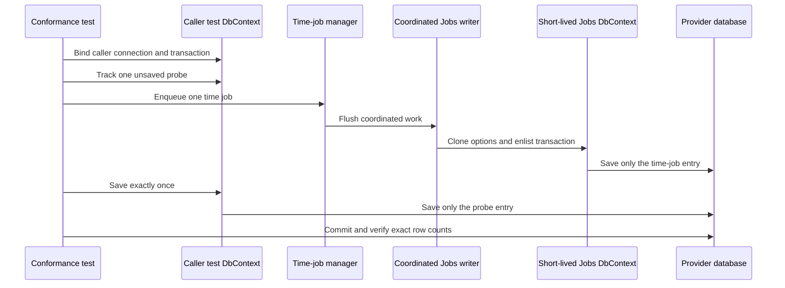

# Coordinated Write Change Tracker Isolation - Plan

## Goal Capsule

- **Objective:** Add provider-conformance regression coverage proving Jobs coordinated writes preserve consumer EF Core hooks while isolating each `SaveChangesAsync` pipeline to its own `DbContext` change tracker.
- **Authority:** GitHub issue [#460](https://github.com/xshaheen/headless-framework/issues/460) body and comments, then this plan, then repository conventions in `CLAUDE.md`.
- **Execution profile:** Prefer a test-only change on a branch created from `origin/main`; make a production correction only if the new cross-provider test exposes a real defect.
- **Stop condition:** PostgreSQL and SQL Server conformance suites prove the same isolation contract, or a genuine production defect requires the smallest correction backed by those tests.
- **Tail ownership:** Open an independent PR, babysit its checks to green, and do not merge it.

---

## Product Contract

### Summary

Extend the existing Jobs EF coordinated-enqueue conformance harness with one real-transaction scenario that distinguishes the caller context from the short-lived coordinated context and verifies both `SaveChangesAsync` overrides and interceptors process only their own tracked entries exactly once.

### Problem Frame

The coordinated Jobs writer clones the registered `DbContextOptions<TDbContext>`, rebinds a short-lived non-pooled context to the caller-owned connection and transaction, tracks only Jobs rows, and saves them before the caller later saves its own pending application row. The missing regression contract is change-tracker isolation: EF hooks execute once per `SaveChangesAsync`, not once per ambient transaction, and each invocation must observe only entries owned by that context.

### Requirements

#### Context and transaction topology

- R1. Run the scenario through the existing shared Jobs EF conformance harness on PostgreSQL and SQL Server.
- R2. Use one ambient coordinated transaction containing one pending caller-side probe, one coordinated time-job enqueue, and exactly one explicit caller `SaveChangesAsync` before commit.
- R3. Identify exactly two concrete context instances by stable EF context identity while preserving the caller-owned connection and live transaction.

#### Hook isolation and multiplicity

- R4. A test `JobsDbContext` override and a registered `SaveChangesInterceptor` must observe Added or Modified entries as stable entity type/key snapshots at `SavingChangesAsync` time.
- R5. The coordinated context observations must contain only the intended time-job entry and exclude the caller probe.
- R6. The caller context observations must contain only the probe entry and exclude the coordinated time-job entry.
- R7. Idempotence-sensitive markers keyed by hook kind, context role, entity type, and entity key must exist exactly once for each expected entry with no unexpected markers.

#### Durable outcome and documentation

- R8. After commit, an independent connection must observe exactly one probe row and one time-job row, and the test must document that hooks execute per save while isolation is by context/change tracker rather than ambient transaction.

### Scope Boundaries

- Keep the change independent of the Jobs API stack and any work related to issues #304 or #305.
- Preserve non-pooled coordinated context construction, consumer interceptors, concrete context overrides, transaction ownership, and configured model behavior.
- Do not assert that interceptors or overrides run once per transaction.
- Do not broaden into messaging atomicity, claim behavior, general commit/rollback coverage, pooling changes, or transaction ownership changes.
- Omit the rollback twin by default because existing coordinated-enqueue tests already prove rollback atomicity; add it only if the final fixture makes it a negligible extension.

### Source

- GitHub issue [#460: test(jobs): verify coordinated writes isolate EF side effects](https://github.com/xshaheen/headless-framework/issues/460).

---

## Planning Contract

### Key Technical Decisions

- KTD1. Extend `JobsEnqueueAtomicityConformanceTests<TFixture>` and its existing provider leaves rather than creating a new suite, keeping one behavioral contract for both relational providers.
- KTD2. Add a generic/custom-context path behind `BuildCoordinatedEnqueueHost` while preserving its current non-generic wrapper so existing atomicity tests remain unchanged.
- KTD3. Register the interceptor through the same Jobs context options action that production clones for coordinated writes; this proves option cloning preserves consumer hooks.
- KTD4. Inside the fixture's live transaction callback, bind the caller test context to the supplied connection without taking ownership, enlist the supplied transaction, and then perform the pending probe, coordinated enqueue, and caller save.
- KTD5. Use `DbContext.ContextId.InstanceId` for instance identity. Register the resolved caller ID before enqueue, attribute the other target-save ID as coordinated, and reset or freeze observations immediately before the transaction to exclude schema/bootstrap noise.
- KTD6. Treat observer markers as in-memory test side effects, separate from durable database assertions. Record every override and interceptor invocation with an ordinal and its Added or Modified entry snapshot, including empty snapshots; require one invocation per hook/context role plus the exact four hook/role/entity combinations once each.
- KTD7. Make probe schema lifecycle explicit. The custom model owns the mapped probe table for this scenario, while provider reset logic prevents collisions with the existing raw probe helper.

### High-Level Technical Design

### Assumptions

- The production implementation already satisfies the contract, so the expected result is a test-only PR.
- The custom test context can retain the required public options-only constructor and use test-scoped observer state without adding a production DI surface.
- Existing harness project references are sufficient for EF interceptors and the mapped probe entity.

### Patterns and Evidence

- `tests/Headless.Jobs.EntityFramework.Tests.Harness/JobsCoordinationFixtureBase.cs` owns shared host construction, transaction callbacks, schema setup, reset, and independent row counts.
- `tests/Headless.Jobs.EntityFramework.Tests.Harness/JobsEnqueueAtomicityConformanceTests.cs` owns the cross-provider coordinated-enqueue scenarios.
- `tests/Headless.Jobs.EntityFramework.PostgreSql.Tests.Integration/PostgreSqlEnqueueAtomicityTests.cs` and `tests/Headless.Jobs.EntityFramework.SqlServer.Tests.Integration/SqlServerEnqueueAtomicityTests.cs` expose inherited conformance methods as provider-discovered facts.
- `src/Headless.Jobs.EntityFramework/Infrastructure/JobsEFCorePersistenceProvider.cs` is the production seam to characterize; its options cloning, connection rebinding, `UseTransaction`, concrete context construction, and hook execution must remain intact unless the test proves a defect.
- `docs/solutions/logic-errors/asynclocal-ambient-scope-stranded-across-await.md` reinforces that final row counts alone do not distinguish correct and escaped execution paths; direct per-context observations provide the required proof.

---

## Implementation Units

### U1. Enable an observable caller and coordinated context topology

- **Goal:** Let the shared harness run coordinated enqueue with a custom Jobs context, mapped probe entity, interceptor, and explicit caller enlistment without changing existing tests.
- **Requirements:** R2, R3, R4, R8.
- **Dependencies:** None.
- **Files:**
  - `tests/Headless.Jobs.EntityFramework.Tests.Harness/JobsCoordinationFixtureBase.cs`
  - `tests/Headless.Jobs.EntityFramework.PostgreSql.Tests.Integration/PostgreSqlJobsCoordinationFixture.cs`
  - `tests/Headless.Jobs.EntityFramework.SqlServer.Tests.Integration/SqlServerJobsCoordinationFixture.cs`
- **Approach:** Preserve the existing host helper as a wrapper around a generic path, compose provider options with the test interceptor, map the probe in the custom test context, and ensure provider reset/bootstrap keeps the probe schema deterministic. The scenario should bind the caller context to the callback's connection and transaction without transferring connection ownership.
- **Patterns to follow:** Generic mapped-context host construction in `JobsCoordinationFixtureBase.cs`; provider-owned reset SQL in each leaf fixture; options-only Jobs context constructors used elsewhere in the harness.
- **Test scenarios:**
  1. Existing atomicity conformance scenarios still build and run through the unchanged non-generic helper.
  2. A custom Jobs context can create its mapped Jobs and probe schema, bind to the live provider connection, and enlist the helper's transaction without owning or closing that connection.
- **Verification:** Both provider integration projects compile and their existing coordinated-enqueue suites remain green.

### U2. Prove hook isolation and exact per-entry side effects across providers

- **Goal:** Add the issue-locked regression scenario once in the harness and expose it from both provider leaves.
- **Requirements:** R1, R2, R3, R4, R5, R6, R7, R8.
- **Dependencies:** U1.
- **Files:**
  - `tests/Headless.Jobs.EntityFramework.Tests.Harness/JobsEnqueueAtomicityConformanceTests.cs`
  - `tests/Headless.Jobs.EntityFramework.PostgreSql.Tests.Integration/PostgreSqlEnqueueAtomicityTests.cs`
  - `tests/Headless.Jobs.EntityFramework.SqlServer.Tests.Integration/SqlServerEnqueueAtomicityTests.cs`
- **Approach:** Add a custom context override, interceptor, and thread-safe recorder close to the conformance scenario. Reset observations after schema startup, record the caller context ID before enqueue, and capture every hook invocation with its ordinal and Added or Modified entity type/key snapshot, including empty snapshots. Assert one override and one interceptor invocation per context role, the exact caller/coordinated entry matrix, and exact committed row counts.
- **Execution note:** Establish the provider-conformance assertion before considering any production edit. If it fails, diagnose whether the failure is test setup or real option/change-tracker leakage, then make only the smallest production correction supported by both providers.
- **Patterns to follow:** Virtual shared test methods with `[Fact]` forwarding overrides in each provider leaf; `TestBase.AbortToken`; AwesomeAssertions; far-future time-job data used by the current atomicity suite.
- **Test scenarios:**
  1. PostgreSQL: the coordinated override and interceptor observe only the time job, the caller override and interceptor observe only the probe, the two context IDs differ, each hook/context role has exactly one invocation, every expected marker count is one, no extra marker or empty duplicate invocation exists, and final counts are one probe and one job.
  2. SQL Server: the same invocation, observation, and durable-state contract holds through the SQL Server fixture.
  3. The test comment states that EF hooks run per `SaveChangesAsync` and isolation is by context/change tracker rather than ambient transaction.
- **Verification:** The targeted regression fact and the full coordinated-enqueue conformance class pass on PostgreSQL and SQL Server.

---

## Verification Contract

| Gate | Command | Proves |
|---|---|---|
| PostgreSQL targeted regression | `make test-project TEST_PROJECT=tests/Headless.Jobs.EntityFramework.PostgreSql.Tests.Integration/Headless.Jobs.EntityFramework.PostgreSql.Tests.Integration.csproj TEST_FILTER='--filter-method "*coordinated*isolate*"'` | The new contract passes on PostgreSQL. |
| SQL Server targeted regression | `make test-project TEST_PROJECT=tests/Headless.Jobs.EntityFramework.SqlServer.Tests.Integration/Headless.Jobs.EntityFramework.SqlServer.Tests.Integration.csproj TEST_FILTER='--filter-method "*coordinated*isolate*"'` | The new contract passes on SQL Server. |
| PostgreSQL provider suite | `make test-project TEST_PROJECT=tests/Headless.Jobs.EntityFramework.PostgreSql.Tests.Integration/Headless.Jobs.EntityFramework.PostgreSql.Tests.Integration.csproj` | Existing and new PostgreSQL Jobs EF integration behavior remains green. |
| SQL Server provider suite | `make test-project TEST_PROJECT=tests/Headless.Jobs.EntityFramework.SqlServer.Tests.Integration/Headless.Jobs.EntityFramework.SqlServer.Tests.Integration.csproj` | Existing and new SQL Server Jobs EF integration behavior remains green. |
| Formatting | `make format-check` | Changed C# files satisfy repository formatting. |
| Analyzer/build quality | `make quality-analyzers-project PROJECT=tests/Headless.Jobs.EntityFramework.Tests.Harness/Headless.Jobs.EntityFramework.Tests.Harness.csproj` | Harness changes build cleanly under repository analyzers. |

If a production file changes, also run its focused build/analyzer gate and document why the test-only expectation was insufficient.

---

## Definition of Done

- U1 and U2 satisfy every linked requirement without inheriting Jobs API stack work.
- The shared conformance scenario is discovered and passes in both provider leaves.
- Exactly two context identities, one override and interceptor invocation per context role, and exactly four expected hook/role/entity markers are observed, each once, with no empty duplicate invocation or cross-context entry leakage.
- Independent database counts are exactly one probe row and one time-job row after commit.
- Existing coordinated-enqueue tests remain green and no abandoned test scaffolding or experimental production code remains.
- The final diff is test-only unless a failing provider-conformance test proves a production defect; any production correction is minimal and covered by both providers.
- The branch is pushed as `xshaheen/*`, the PR links issue #460, CI is green, review feedback is resolved or durably surfaced, and the PR remains unmerged.
