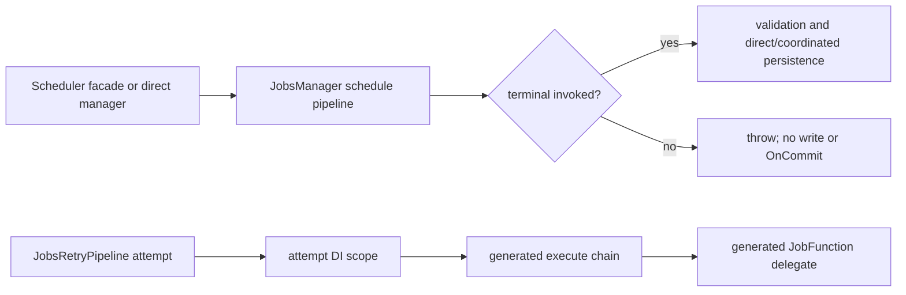

# Descriptor-targeted Jobs middleware

## Summary

Add AOT-safe, source-generated schedule and execute middleware to Jobs. Stage-specific generic attributes support global assembly declarations and targeted declarations placed beside `[JobFunction]`; generated chains select global and descriptor-targeted middleware by durable identity and impose one deterministic order.

---

## Problem Frame and Scope

`JobScheduler` currently maps typed input to entities, while `JobsManager` owns validation, persistence, coordination, and dispatch side effects. Execution uses `JobsRetryPipeline` to invoke a handler delegate per attempt. Neither path has a composable cross-cutting seam.

The change must introduce those seams without adding a handler model, scanning assemblies at runtime, wrapping the schedule pipeline twice, or changing retry authority. The low-level managers are the sole schedule entry; the retry callback is the sole execute entry.

### Scope boundaries

Included: public middleware contracts/contexts, assembly and method attribute discovery, generated dispatch, manager and retry integration, focused unit/generator/integration coverage, and Jobs documentation.

Excluded: #278 tenancy behavior, #319 OpenTelemetry behavior, class handlers (`IJob<T>`, `ICronJob`, `TJob`), runtime plugins/registration after `JobFunctionProvider.Build()`, shared Messaging infrastructure, and unrelated cleanup.

---

## Requirements Traceability

| Requirement | Plan coverage |
| --- | --- |
| Global and descriptor-targeted registration, one selected mechanism | U1, U2 |
| Deterministic generated schedule/execute chains; no runtime reflection/scan/compile | U2, U3 |
| Exactly one schedule invocation before validation and both direct/coordinated writes | U3, U4 |
| Reject/no-next leaves no persisted row or deferred side effect | U3, U4 |
| Execute middleware wraps each retry attempt with attempt token/scope | U3, U5 |
| Preserve `[JobFunction]` and retry/execution behavior | U1, U3, U5 |
| Registration/ordering semantics documented | U6 |

---

## Key Technical Decisions

1. Use compile-time constrained `JobScheduleMiddleware<TMiddleware>` and `JobExecuteMiddleware<TMiddleware>` attributes. Assembly placement is global. Method placement beside `[JobFunction]` derives its local target. `Function` remains only as an assembly-level fallback for a descriptor declared in another assembly. The production generator reads the current compilation plus referenced descriptor metadata; it does not retain the spike's generated-hook fallback.
2. Normalize assembly and method declarations into the same global-or-targeted registration model. Build chains ordered by numeric priority, then stable `assembly-name:metadata-name` identity. Diagnose unknown targets, duplicate declarations, invalid method placement, redundant method `Function`, and assembly fallback targeting a local descriptor during generation.
3. Keep two distinct public contracts and contexts in Jobs Core. Schedule context carries the resolved descriptor and the mutable time/cron entity being submitted. Execute context carries the descriptor, `JobFunctionContext`, attempt number, and attempt-scoped services. Neither exposes provider registries.
4. Generate a dispatcher into each consuming compilation, because Core cannot directly reference application middleware types. Its module initializer registers static schedule/execute delegates with a Core callback registry before `JobFunctionProvider.Build()`; Core freezes and invokes those delegates alongside function/descriptor registrations. Dispatch itself is direct generated calls, while middleware instances are resolved from bounded DI scopes. Schedule terminal completion is tracked so a middleware that omits `next` fails rather than returning a false successful enqueue.
5. Resolve `JobFunctionProvider.JobFunctionDescriptors` by durable `Function` at manager entry only to construct the context. An unknown function keeps the current `JobValidatorException` behavior and runs no middleware, write, or deferred side effect; cron/entity validation remains after schedule dispatch.
6. Invoke schedule dispatch once per submitted entity, in input order, at manager `AddAsync`/`AddBatchAsync` entry before cron/entity validation, coordinated capture, persistence, and side-effect registration. A batch receives one bounded scope per entity; a rejection or omitted `next` aborts the entire batch before its single writer call. `JobScheduler` remains a mapper/delegator only.
7. Keep `JobsRetryPipeline` as retry authority. Its existing per-attempt callback creates the execution scope and invokes the generated execute chain around `CachedDelegate`; the pipeline itself is not wrapped.

### Directional flow

---

## Implementation Units

### U1 — Public contracts and assembly metadata

**Files:** `src/Headless.Jobs.Core/`, `tests/Headless.Jobs.Tests.Unit/`, and source-generator reference fixtures.

Define public schedule/execute middleware delegates, interfaces or compatible contracts, context types, priority constants, and constrained stage-specific generic attributes in Jobs Core. Add generated assembly-level descriptor metadata for every `[JobFunction]`, so production generator discovery can validate external assembly targets. Derive local method targets from `[JobFunction]`, keep `Function` only for cross-assembly fallback, and validate declaration placement and arguments. Preserve trailing cancellation-token conventions and public XML documentation.

**Test scenarios:** contract shape exposes descriptor and appropriate state; invalid attribute inputs fail predictably; target identity is optional/global versus explicit/targeted; generated descriptor metadata is available from a metadata reference; public API members have expected cancellation-token placement.

### U2 — Generator discovery and deterministic generated dispatch

**Files:** `src/Headless.Jobs.SourceGenerator/`, `tests/Headless.Jobs.SourceGenerator.Tests.Unit/`, snapshot fixtures as needed.

Port the #302 assembly-metadata decision into the actual generator: inspect current and referenced assembly attributes (including generated descriptor metadata), validate targets against descriptor identities, sort global/targeted declarations once, and emit a consuming-assembly dispatcher plus module-initializer registration into the Core registry. The Core registry freezes with `JobFunctionProvider.Build()` and calls the generated delegates without reflection.

**Test scenarios:** same- and cross-assembly global/targeted declarations; referenced descriptor metadata enables target validation; target selection by descriptor identity; equal-priority ordering independent of reference/declaration order; duplicate and missing-target diagnostics; generated host registration happens before Core freeze; generated output uses direct calls and contains no scan/reflection/expression-compilation path; metadata/priority/target edits invalidate incremental output.

### U3 — Runtime pipeline composition and lifecycle placement

**Files:** `src/Headless.Jobs.Core/`, `src/Headless.Jobs.Core/Managers/JobsManager.cs`, `src/Headless.Jobs.Core/JobsExecutionTaskHandler.cs`, `src/Headless.Jobs.Core/DependencyInjection/SetupJobs.cs`.

Add the Core callback registry and generated-dispatch integration. Resolve a descriptor at each manager entry, then route time/cron single adds and each batch entity through schedule middleware in input order. Give every entity a bounded schedule scope and require its terminal delegate; any error prevents the subsequent aggregate validation, transaction capture, writer call, and deferred-side-effect registration. Retain a canonical manager-only schedule entry. Inside the retry attempt callback, invoke the execute chain with the attempt scope/token and then the existing cached delegate.

**Test scenarios:** facade and direct-manager paths invoke schedule once per submitted entity; heterogeneous batches select each entity's global/targeted chain in input order; single/batch time/cron paths preserve entity changes; unknown function runs no middleware and retains the existing validation failure; rejection and omitted `next` persist nothing and register no deferred callback; direct and coordinated success preserve existing writer/side-effect behavior; execute middleware sees descriptor, retry number, linked attempt token, and a fresh scoped dependency; execution exception propagation and terminal state semantics remain unchanged.

### U4 — Scheduling and coordination regression coverage

**Files:** `tests/Headless.Jobs.Tests.Unit/`, `tests/Headless.Jobs.Tests.Unit/Transactions/JobsManagerCoordinatedRoutingTests.cs`, focused manager fixture/helpers.

Extend existing manager/coordination seams rather than inventing persistence fakes. Cover global plus targeted middleware, mutation and rejection, omitted `next`, all manager entry shapes, and post-commit registration boundaries.

**Test scenarios:** one middleware invocation per accepted entity; mixed-descriptor batch ordering and per-entity scope lifetime; no direct write/writer write/notification/scheduler restart/OnCommit after a rejection or later entity omission; batch failure is atomic; coordinated accepted work defers only after all pipeline completion; facade does not double-wrap manager calls.

### U5 — Retry-attempt execute coverage

**Files:** `tests/Headless.Jobs.Tests.Unit/JobsExecutionTaskHandlerTests.cs` or the existing execution-handler test suite.

Use the existing retry test seams to demonstrate that a two-attempt job enters/exits execute middleware twice, resolves per-attempt scoped dependencies, and writes terminal state through the unchanged execution flow once.

**Test scenarios:** first handler failure then success causes two chain entries/exits and one final success state; cancellation token differs/flows per attempt; targeted execute middleware is excluded for other descriptors; middleware exceptions follow existing retry classification rather than bypassing it.

### U6 — Documentation and verification

**Files:** `src/Headless.Jobs.Abstractions/README.md`, `src/Headless.Jobs.Core/README.md`, source-generator documentation where the existing descriptor generation is described.

Document assembly-level registration syntax, global/descriptor target semantics, total ordering, the manager-only schedule entry, bounded scopes, and execute-per-attempt behavior. Explicitly state the non-goals so consumers do not infer class-handler support or runtime registration.

**Test scenarios:** documentation examples match compiled public API where feasible; generator snapshot protects the documented registration form.

---

## Dependencies and Risks

- #302's merged decision is authoritative: no fallback registration path may ship.
- #304's registry has no descriptor attached to `JobExecutionState`; runtime execution must resolve the descriptor deterministically from the existing function name without changing the handler model. An unexpected stale name must retain the existing execution failure behavior.
- Managers have distinct single/batch and direct/coordinated paths. The pipeline must surround all adds, before validation, without moving current transaction/side-effect behavior.
- Retry behavior is safety-critical. Execute composition must be strictly inside the Polly callback, so failure classification and durable retry updates retain their current authority.

---

## Verification Contract

Run focused source-generator and Jobs unit tests while iterating, including generated-output snapshots and manager/coordination/retry suites. Before PR, run the affected Jobs project build, focused analyzer checks, format check, and the narrowest credible complete Jobs test set. Confirm generated output has no runtime scanning, reflection invocation, or expression compilation; inspect the diff to ensure the scheduler facade contains no schedule-pipeline wrapper.

---

## Definition of Done

- All #305 acceptance criteria are met by code and focused tests.
- Assembly metadata is the only production registration path.
- Generated ordering is stable and descriptor-targeted behavior is covered across assemblies.
- Schedule runs once before any validation/write/coordination side effect, execute runs once per retry attempt.
- Documentation states registration and ordering semantics.
- Focused build, tests, analyzers, and formatting pass; CI is green on the PR.
