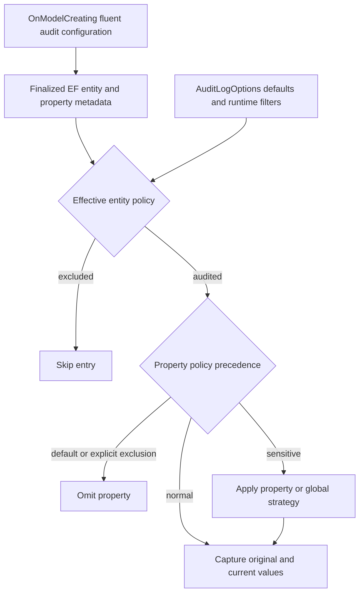
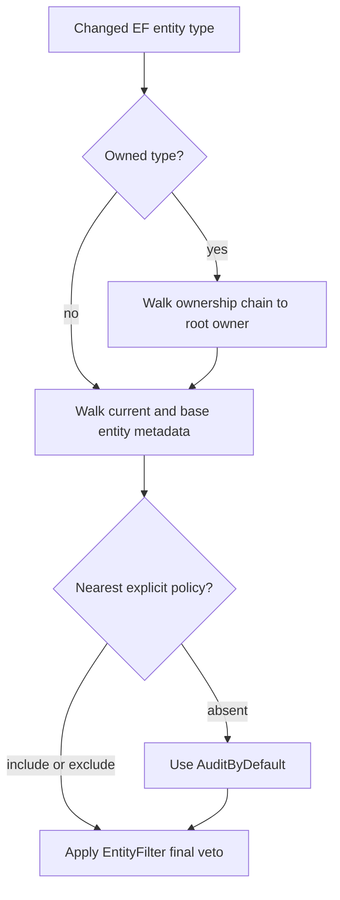

# EF-Native Audit Policy Metadata - Plan

## Goal Capsule

- **Objective:** Replace audit marker interfaces and CLR attributes with one EF Core model-metadata policy configured through fluent entity and property builders.
- **Authority:** The user-selected EF-native metadata architecture governs automatic capture; `CLAUDE.md`, current EF configuration patterns, and the audit documentation contract govern implementation details.
- **Execution profile:** Change the ORM audit policy surface and capture logic, remove the obsolete declarative APIs, migrate EF storage and test models, and update consumer documentation.
- **Stop conditions:** Do not introduce a provider-neutral policy registry, an attribute fallback, a compatibility shim, or EF dependencies in raw audit storage providers.
- **Tail ownership:** The implementation must pass focused unit and integration gates, repository formatting and analyzer gates, review, PR publication, and CI disposition.

---

## Product Contract

### Summary

Automatic audit capture will read a tri-state policy from the finalized EF model. Consumers will opt entities in or out and exclude or protect properties through fluent configuration while runtime options remain the operational override layer.

### Problem Frame

The current `IAuditTracked`, `AuditIgnoreAttribute`, and `AuditSensitiveAttribute` APIs place persistence-specific concerns on domain entities. Capture then reflects over CLR types and properties and maintains process-wide metadata caches even though the authoritative persistence model already exists in EF Core.

Automatic capture is implemented only by `EfAuditChangeCapture`; the PostgreSQL and SQL Server audit packages are storage providers rather than independent change-capture engines. A second provider-neutral registry would duplicate the EF model without a current consumer and create precedence problems.

### Requirements

#### Model policy and precedence

- R1. Entity audit metadata is tri-state: explicit include audits, explicit exclusion skips, and absence falls back to `AuditLogOptions.AuditByDefault`.
- R2. Public EF fluent methods configure entity inclusion, entity exclusion, property exclusion, and sensitive-property handling with an optional per-property strategy.
- R3. `AuditLogOptions.IsEnabled` remains the master switch; `EntityFilter` remains a final entity veto; default property exclusions and `PropertyFilter` remain property vetoes.
- R4. Property exclusion wins over sensitive handling, and an explicit per-property sensitive strategy wins over the global `SensitiveDataStrategy`.
- R5. Owned entries inherit audit eligibility through their ownership chain from the root owner while retaining property policy on the owned EF metadata.
- R6. Derived entity types inherit the nearest configured base entity policy unless they carry an explicit policy of their own.

#### API and package boundaries

- R7. EF policy extensions and annotation keys live in `Headless.EntityFramework`; `Headless.AuditLog.Abstractions` remains free of EF Core types.
- R8. `IAuditTracked`, `AuditIgnoreAttribute`, and `AuditSensitiveAttribute` are removed without fallback or compatibility aliases.
- R9. Reflection-based policy discovery and its process-wide CLR metadata caches are removed; runtime filter caches and deferred generated-value resolution remain.
- R10. Raw PostgreSQL and SQL Server audit storage packages remain independent of EF Core policy metadata and continue to store captured entries unchanged.

#### Recursion safety and consumer guidance

- R11. `AddHeadlessAuditLog` explicitly excludes `AuditLogEntry` even when consumers pre-register its entity type; a later explicit `IsAudited` call is a consumer override that re-enables unsafe recursive capture and must be documented as unsupported.
- R12. Unit and EF storage integration fixtures use the fluent policy and preserve existing create, update, delete, owned-value, sensitive-data, generated-key, and error behavior.
- R13. Package READMEs and `docs/llms/audit-log.md` describe the fluent model policy, precedence, defaults, package ownership, and migration away from domain annotations.

### Acceptance Examples

- AE1. Given `AuditByDefault` is false, when an entity has explicit audit metadata and is added, updated, or deleted, then capture emits the same entry shapes as before; an unconfigured entity is skipped.
- AE2. Given `AuditByDefault` is true, when an entity has explicit exclusion metadata, then capture skips it; an unconfigured entity is captured.
- AE3. Given an audited property is excluded and also marked sensitive, when the entity changes, then the property is absent from values and changed fields; if only sensitive metadata exists, its explicit strategy overrides the global strategy.
- AE4. Given an audited root with nested owned values, when an owned property changes, then the root policy controls eligibility and the owned property's exclusion or sensitive metadata controls value handling.
- AE5. Given `AuditLogEntry` is pre-registered before `AddHeadlessAuditLog`, when the model is finalized with `AuditByDefault` enabled, then the entry still carries exclusion metadata; a later explicit opt-in predictably overrides it and is documented as unsafe.
- AE6. Given an explicitly audited entity rejected by `EntityFilter`, or a property rejected by `PropertyFilter`, when capture runs, then the runtime filter veto wins.

### Scope Boundaries

#### In Scope

- EF entity/property fluent audit policy and internal primitive annotations.
- Automatic EF capture policy resolution, owned/base-type inheritance, and precedence.
- Clean removal of the three obsolete marker/attribute APIs and all first-party usages.
- EF storage recursion protection, focused unit/integration coverage, and synchronized consumer docs.

#### Deferred to Follow-Up Work

- A provider-neutral audit policy registry if a second non-EF automatic capture engine is introduced.
- A dedicated `dotnet ef dbcontext optimize` source-generation fixture; this change must prove annotations on the finalized runtime model, while compiled-model generation can be added when the repository adopts that workflow.

#### Out of Scope

- Changes to explicit business-event logging, audit entry schema, retention, query APIs, persistence providers, or storage migrations.
- Compatibility attributes, analyzers, source generators, or automatic conversion of existing consumer models.

---

## Planning Contract

### Key Technical Decisions

- KTD1. **The finalized EF model is the single declarative policy source.** `(session-settled: user-directed — chosen over entity attributes/markers and a provider-neutral registry: automatic capture is EF-specific, and metadata keeps persistence concerns off domain entities.)`
- KTD2. **Use primitive, independent annotations.** Entity inclusion is represented as explicit true/false; property exclusion, sensitivity, and optional strategy remain separate so absence can retain option defaults and exclusion precedence stays deterministic.
- KTD3. **Place the fluent API in the ORM package.** A dedicated collision-resistant public extension holder in the `Microsoft.EntityFrameworkCore` namespace follows repository EF ergonomics while annotation names remain internal.
- KTD4. **Preserve runtime options as vetoes, not competing metadata.** `IsEnabled`, filters, default excluded names, and the sensitive transformer remain runtime controls layered after declarative eligibility.
- KTD5. **Owned types inherit the root owner policy.** Owned entity-level policy does not create a second eligibility boundary; property annotations remain local to each owned property metadata object.
- KTD6. **Make recursion exclusion safe by default and explicit to override.** `AddHeadlessAuditLog` must apply `AuditLogEntryConfiguration` once even when the entity was already discovered; a later fluent opt-in remains possible under EF's last-explicit-configuration semantics but is documented as unsupported because it can recurse.
- KTD7. **Break cleanly.** The repository is greenfield, so removing the old APIs and updating all first-party consumers is safer than maintaining two policy systems with ambiguous precedence.

### High-Level Technical Design

### Assumptions

- The public fluent names will be `IsAudited`, `ExcludeFromAudit`, and `IsAuditSensitive`, with generic and non-generic overloads where EF's builder surface requires both forms.
- Primitive annotation values are available from EF's finalized runtime model without reflection or a custom convention plugin.
- Existing option delegate cache lifetime and semantics remain unchanged; only declarative CLR metadata caches disappear.
- The current SQLite unit and EF storage integration projects are sufficient to prove this refactor without Docker or schema changes.

### Risks and Mitigations

| Risk | Mitigation |
| --- | --- |
| Annotation absence is confused with explicit false. | Store only explicit true/false entity values and test the full policy/default matrix. |
| Owned or derived types silently change eligibility. | Centralize effective-policy resolution and test base override, root ownership, and nested ownership cases. |
| A property carries conflicting exclusion and sensitivity metadata. | Read exclusion first and test that it wins regardless of configuration order. |
| Pre-registered `AuditLogEntry` bypasses its configuration. | Replace the current surrogate recursion test with finalized-model assertions for normal and pre-registered paths. |
| Consumer configuration after `AddHeadlessAuditLog` opts the storage entity back in. | Document the explicit override as unsupported and add a model-ordering test so the behavior is visible rather than silently guaranteed. |
| Public docs keep teaching removed domain annotations. | Search all source/docs/test references and update the domain doc plus every affected package README in lockstep. |

---

## Implementation Units

### U1. Add the EF metadata policy and migrate automatic capture

- **Goal:** Provide the fluent policy, make automatic capture consume finalized EF metadata, remove the obsolete declarative APIs, and preserve capture behavior.
- **Requirements:** R1-R10, R12
- **Dependencies:** None
- **Files:**
  - `src/Headless.EntityFramework/Extensions/HeadlessAuditPolicyExtensions.cs`
  - `src/Headless.EntityFramework/Contexts/Auditing/EfAuditChangeCapture.cs`
  - `src/Headless.AuditLog.Abstractions/AuditLogOptions.cs`
  - `src/Headless.AuditLog.Abstractions/IAuditTracked.cs`
  - `src/Headless.AuditLog.Abstractions/AuditIgnoreAttribute.cs`
  - `src/Headless.AuditLog.Abstractions/AuditSensitiveAttribute.cs`
  - `tests/Headless.AuditLog.Tests.Unit/EfAuditChangeCaptureTests.cs`
- **Approach:** Add a dedicated EF-style public extension holder and internal annotation constants. Resolve effective entity eligibility from EF metadata, base types, and root ownership; retain option filters as vetoes. Read property annotations directly, preserve exclusion order, and remove reflection caches and obsolete public types. Convert test POCOs to annotation-free entities configured in `OnModelCreating`.
- **Patterns to follow:** `src/Headless.EntityFramework/Extensions/HeadlessCoordinatedTransactionExtensions.cs`, generic/non-generic builder overloads in `EntityTypeBuilderExtensions.cs`, and the current capture value/error/deferred-resolution flow.
- **Execution note:** Start with the metadata/default and precedence matrix, then replace reflection while keeping all unrelated capture tests green.
- **Test scenarios:**
  - Covers AE1 and AE2. Explicit true, explicit false, and absent metadata produce the expected result under both `AuditByDefault` values.
  - Covers AE3. Property exclusion wins over sensitivity; default/global and explicit Redact, Exclude, and Transform strategies preserve current output behavior.
  - Covers AE4. Root audited, root excluded, nested owned, owned excluded property, and owned sensitive property cases resolve deterministically.
  - A derived entity inherits a base policy and can override it explicitly.
  - Covers AE6. Entity and property runtime filters veto explicit metadata; repeated filter calls retain current caching semantics.
  - The finalized `DbContext.Model` exposes the primitive annotations used by capture, and no capture path reflects over CLR audit attributes.
  - Existing generated-key, composite-key, action-name, capture-error, disabled-warning, and empty-update tests remain green.
- **Verification:** The abstractions and ORM projects compile, the focused unit suite passes, and repository search finds no old marker/attribute usage or reflection-based audit policy lookup.

### U2. Make EF audit storage recursion-safe under the metadata policy

- **Goal:** Exclude the audit storage entity through its EF configuration and migrate real EF storage models to the fluent policy.
- **Requirements:** R11, R12
- **Dependencies:** U1
- **Files:**
  - `src/Headless.AuditLog.Storage.EntityFramework/AuditLogEntry.cs`
  - `src/Headless.AuditLog.Storage.EntityFramework/AuditLogEntryConfiguration.cs`
  - `src/Headless.AuditLog.Storage.EntityFramework/AuditLogModelBuilderExtensions.cs`
  - `tests/Headless.AuditLog.Tests.Unit/AuditStoreDbContext.cs`
  - `tests/Headless.AuditLog.Storage.EntityFramework.Tests.Integration/Fixture/AuditTestDbContext.cs`
  - `tests/Headless.AuditLog.Storage.EntityFramework.Tests.Integration/Fixture/ThrowingPublishAuditTestDbContext.cs`
  - `tests/Headless.AuditLog.Storage.EntityFramework.Tests.Integration/Fixture/Order.cs`
  - `tests/Headless.AuditLog.Storage.EntityFramework.Tests.Integration/Fixture/GeneratedOrder.cs`
  - `tests/Headless.AuditLog.Storage.EntityFramework.Tests.Integration/Fixture/GeneratedOrderLine.cs`
  - `tests/Headless.AuditLog.Storage.EntityFramework.Tests.Integration/Fixture/EmittingOrder.cs`
  - `tests/Headless.AuditLog.Storage.EntityFramework.Tests.Integration/AuditLogIntegrationTests.cs`
- **Approach:** Apply entity exclusion inside `AuditLogEntryConfiguration`, remove the CLR attribute and remarks, and make model-builder idempotence detect completed configuration rather than entity discovery alone. Configure all captured integration entities and sensitive properties through the new fluent surface.
- **Patterns to follow:** Existing `IEntityTypeConfiguration<TEntity>` mappings, `AddHeadlessAuditLog` model registration, SQLite integration fixture, and startup model validation.
- **Execution note:** Add the real model-level recursion assertions before changing the idempotence guard.
- **Test scenarios:**
  - Covers AE5. Normal `AddHeadlessAuditLog` configuration marks `AuditLogEntry` excluded in the finalized model.
  - Covers AE5. Pre-registering `AuditLogEntry` before `AddHeadlessAuditLog` still applies exclusion and the rest of its mapping exactly once.
  - Covers AE5. Explicitly opting `AuditLogEntry` in after `AddHeadlessAuditLog` overrides the exclusion, proving the documented unsupported ordering is deterministic.
  - With `AuditByDefault` enabled, automatic capture does not emit an audit entry for an `AuditLogEntry` change.
  - EF integration create, update, delete, generated-key, sensitive-value, retry, and throwing-publish scenarios preserve current results after fixture migration.
- **Verification:** The EF storage project and integration suite pass, model configuration remains idempotent, and no CLR audit attribute remains on the persistence entity.

### U3. Align consumer and maintainer documentation

- **Goal:** Teach the EF-native policy and remove all documentation for marker/attribute configuration.
- **Requirements:** R7-R10, R13
- **Dependencies:** U1, U2
- **Files:**
  - `docs/llms/audit-log.md`
  - `docs/llms/orm.md`
  - `src/Headless.AuditLog.Abstractions/README.md`
  - `src/Headless.AuditLog.Storage.EntityFramework/README.md`
  - `src/Headless.EntityFramework/README.md`
  - `AGENTS.md`
- **Approach:** Update Quick Start, feature lists, configuration tables, examples, package dependencies, and side effects to place declarative policy in `OnModelCreating`. Explain precedence, owned-type inheritance, runtime filters, the unsafe later override of `AuditLogEntry`, and the absence of a provider-neutral registry. Mirror the ORM package surface in `docs/llms/orm.md` and record the settled project decision in the repository Learnings section.
- **Patterns to follow:** `docs/authoring/AUTHORING.md`, the existing audit domain section order and table of contents, and package README mirroring rules.
- **Test scenarios:** Test expectation: none -- documentation-only unit; behavioral proof is owned by U1 and U2.
- **Verification:** All docs describe the same fluent API and precedence, code examples compile conceptually against the new public surface, the audit domain table of contents remains valid, and repository search finds no stale old-API guidance.

---

## Verification Contract

| Gate | Applicability | Done signal |
| --- | --- | --- |
| `make build-project PROJECT=src/Headless.EntityFramework/Headless.EntityFramework.csproj` | U1 | Public fluent API and metadata capture compile cleanly. |
| `make test-project TEST_PROJECT=tests/Headless.AuditLog.Tests.Unit/Headless.AuditLog.Tests.Unit.csproj` | U1, U2 | Metadata precedence, capture behavior, and model recursion assertions pass. |
| `make test-project TEST_PROJECT=tests/Headless.AuditLog.Storage.EntityFramework.Tests.Integration/Headless.AuditLog.Storage.EntityFramework.Tests.Integration.csproj` | U2 | Real EF storage pipeline behavior remains green. |
| `make format-check` | U1-U3 | Changed C# and documentation satisfy repository formatting. |
| Targeted analyzers through the changed project builds | U1-U2 | Warnings-as-errors and package conventions pass. |
| `rg -n '\b(IAuditTracked|AuditIgnore(Attribute)?|AuditSensitive(Attribute)?)\b' src tests` plus targeted documentation searches | U1-U3 | No obsolete source usage or stale consumer guidance remains without matching the replacement `IsAuditSensitive` API or this plan's historical context. |

Browser verification is not applicable because this change has no web UI or browser-visible behavior.

---

## Definition of Done

- The fluent EF model policy is the only first-party declarative source for automatic audit eligibility and property handling.
- Every requirement and acceptance example is covered by the focused test suites or documentation verification.
- The obsolete marker interface, attributes, reflection discovery, and declarative caches are absent from source and tests.
- `AuditLogEntry` recursion exclusion is proven for normal and pre-registered model paths.
- Public XML docs, package READMEs, the audit domain doc, and repository learning agree on the new API and precedence.
- Focused builds, unit tests, EF integration tests, formatting, analyzers, code review, PR checks, and CI pass.
- No experimental compatibility layer, dead code, generated scratch output, or abandoned approach remains in the diff.

---

## Appendix

### Sources and Research

- `src/Headless.EntityFramework/Contexts/Auditing/EfAuditChangeCapture.cs` — current automatic capture, ownership behavior, reflection caches, and runtime filter precedence.
- `src/Headless.AuditLog.Storage.EntityFramework/AuditLogModelBuilderExtensions.cs` — current entity-discovery idempotence seam that can skip recursion configuration.
- `tests/Headless.AuditLog.Tests.Unit/EfAuditChangeCaptureTests.cs` — primary behavior and SQLite model harness.
- `docs/solutions/architecture-patterns/unified-provider-setup-builder-pattern.md` — package boundary: EF capture belongs in ORM while raw stores remain EF-free.
- `docs/solutions/messaging/transport-wrapper-drift-and-doc-sync.md` — public API changes require lockstep implementation, package README, and LLM documentation updates.
- `docs/solutions/tooling-decisions/jobs-middleware-cross-assembly-discovery-2026-07-14.md` — adjacent precedent for one metadata source with deterministic precedence and no fallback registry.

### Product Contract Preservation

Product Contract unchanged after repository research; planning added only implementation constraints, precedence, and verification detail.
