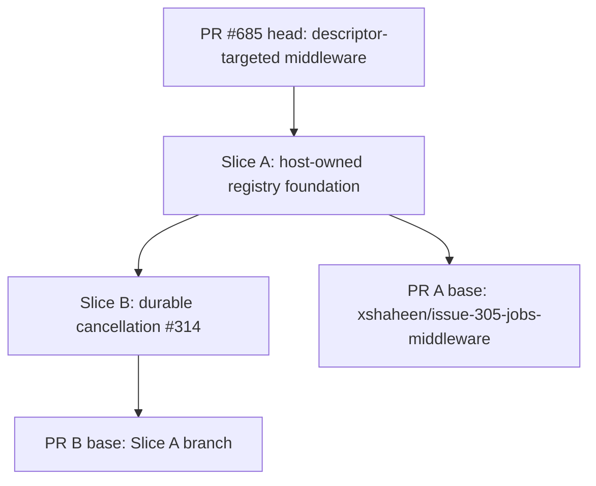
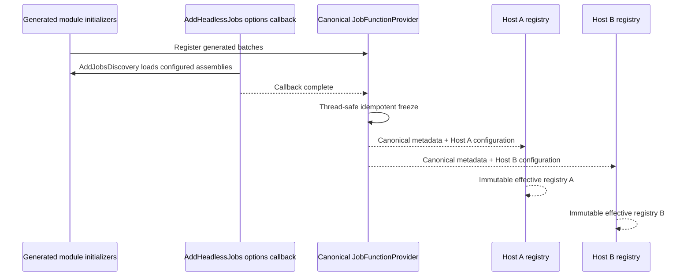
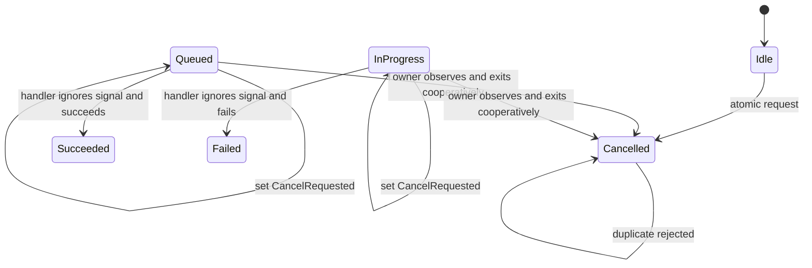
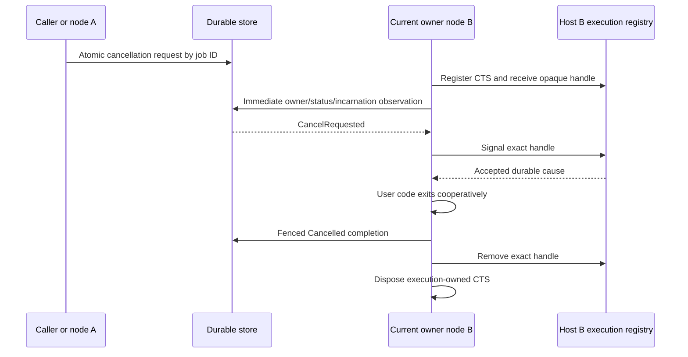

# Jobs Host Registry and Durable Cancellation Stack - Plan

## Goal Capsule

- **Objective:** Ship two independently reviewable stacked PRs: a host-owned Jobs runtime-registry foundation on top of the green head of PR #685, then durable cooperative cancellation closing issue #314 on that foundation.
- **Authority:** The delegated two-slice contract and live issue #314 govern behavior; the current head of PR #685 governs overlapping middleware and generated-registration code; live #302/#304 contracts preserve `[JobFunction]`, descriptor identity, and generator ABI.
- **Execution profile:** Slice A branches from `xshaheen/issue-305-jobs-middleware` and targets that branch. Slice B branches from Slice A and targets Slice A. Each slice runs implementation, simplification, plan-aware review/fixes, relevant browser determination, publication, and CI/CodeQL observation without merge.
- **Stop conditions:** Do not modify the abandoned `f1d1` worktree, copy its partial registry migration wholesale, add another handler model, persist an execution-generation column, broaden cancellation selectors, add authorization, or merge either PR.
- **Tail ownership:** The autonomous run owns issue creation, both branches, both PRs, eligible review fixes, manually dispatched checks when stacked-base filters suppress automatic workflows, and final stack verification.

---

## Product Contract

### Summary

The Jobs subsystem needs one immutable process-wide generated catalog and one configuration-resolved runtime registry per `IHost` before durable cancellation can be tested honestly across independent nodes. The second PR then makes time-job cancellation durable, cooperative, execution-owned, and fenced across in-memory, PostgreSQL, and SQL Server providers.

### Problem Frame

Current runtime code reads both DI-owned state and mutable static dictionaries. `JobFunctionProvider.Build()` also resolves one host's `IConfiguration` into process-global dictionaries, consumes its callback chain, and can let a later host replace the state observed by an earlier host. The abandoned #314 attempt exposed this split-brain design by starting two hosts, but its `Capture()` snapshot occurs before the Jobs options/discovery callback and therefore cannot be the foundation.

Cancellation is currently process-local: the requesting thread can signal, remove, and dispose a CTS only when the executing job happens to live in the same process. That cannot cancel work on another node and cannot distinguish durable user cancellation from host shutdown, lease loss, replacement execution, or an uncooperative handler's natural result.

### Requirements

#### Slice A — canonical catalog and host runtime registry

- R1. `[JobFunction]` remains the only discovery and authoring model; generated module-initializer calls to `RegisterFunctions`, `RegisterRequestType`, and `RegisterDescriptors` keep their current ABI. No generator-output rewrite is expected; any verified compatibility fix must preserve that ABI.
- R2. `JobFunctionProvider` remains the process-wide canonical generated catalog, freezes exactly once after the `AddHeadlessJobs` options callback has loaded all configured `AddJobsDiscovery` assemblies, and exposes #304-compatible canonical descriptor lookups.
- R3. Catalog registration, build, and freeze are thread-safe; repeated builds return the same canonical result; every registration attempted after freeze fails with a stable deterministic exception instead of being ignored.
- R4. Canonical catalog state contains raw generated metadata only. Host `IConfiguration` is never captured, resolved, or retained globally.
- R5. Each `IHost` receives one immutable `JobFunctionRegistry` built from the frozen canonical catalog plus that host's configuration; later hosts neither reset nor replace earlier hosts.
- R6. Scheduler, managers, execution context, initialization/seeding, fallback execution, execute-middleware descriptor lookup, Dashboard enumeration/request/delegate lookup, and every other live runtime read use the injected host registry rather than static runtime dictionaries.
- R7. `JobMiddlewareRegistry` remains aligned with the one-time generated-catalog freeze introduced by #305, including deterministic ordering and post-freeze rejection.
- R8. Contract tests prove discovery-before-freeze, idempotent/concurrent build, post-freeze rejection, stable duplicate diagnostics, two-host non-clobbering, host-specific configuration, canonical public descriptor compatibility, and Dashboard/runtime use of the injected registry.
- R20. Consumer documentation explains canonical-versus-host registry ownership and the discovery/freeze boundary.

#### Slice B — durable cooperative cancellation

- R9. `IJobScheduler` exposes time-job cancellation by job ID only, and Dashboard plus job-context self-cancellation route through that durable API rather than a local CTS shortcut.
- R10. `TimeJobEntity.CancelRequested` is durable and mapped for in-memory and relational providers. Existing PostgreSQL Jobs demo migrations/snapshots carry the schema change; a test-owned SQL Server migration artifact and upgrade-path test prove the corresponding SQL Server deployment transition because the repository has no SQL Server Jobs demo migration owner.
- R11. One atomic provider operation implements the live issue transitions: Idle becomes terminal Cancelled, Queued/InProgress set `CancelRequested`, duplicate/terminal/unknown requests return false, and rejected transitions do not mutate audit state.
- R12. Idle cancellation sets cancellation audit timestamps using the provider's authoritative clock and atomically preserves existing terminal chain behavior without invoking the cancelled parent handler or recursively requesting cancellation for descendants.
- R13. `JobsExecutionCancellationRegistry` is an internal per-`IHost` singleton. Registration returns an opaque execution-specific handle; only that exact handle may be signaled or conditionally removed; the execution path alone owns and disposes its CTS.
- R14. Durable user cancellation, host shutdown, and lease loss remain distinct atomic execution-local causes. Lease loss suppresses stale terminal writes; shutdown is not relabeled as user cancellation; exact handle identity prevents a replaced same-node execution from being signaled or removed by stale work.
- R15. Except for the direct atomic Idle-to-Cancelled transition in R11-R12, a Queued/InProgress execution writes terminal Cancelled only when its exact handle accepted durable user cancellation and user code exited with an `OperationCanceledException` carrying that exact execution token. Foreign/default-token cancellation, shutdown, lease loss, and uncooperative completion do not satisfy this predicate; a handler that ignores the token keeps its natural Succeeded/Failed result while `CancelRequested` remains audit data.
- R16. Observation uses node incarnation plus existing owner/status persistence fencing and the exact local registration handle; no new persisted execution-generation column is introduced.
- R17. The execution path observes durable cancellation once after local registration and before user code, then polls on a bounded validated `TimeProvider` interval with at most one read in flight. Every read receives the observer-lifetime cancellation token. The immediate check fails closed on provider error by cleaning up local execution state without a terminal write and leaving the durable row under its existing owner/lease for normal reclaim; periodic failures log and retry without inventing a terminal transition.
- R18. Tests cover Idle/Queued/InProgress/duplicate/terminal/unknown transitions, chain terminal behavior, cross-node observation, pre-registration, same-node replacement, stale-handle removal, reclaim/lease loss, shutdown classification, CTS ownership/disposal races, and cooperative plus uncooperative handlers.
- R19. Fast behavioral coverage uses two same-process `IHost` instances with independent DI registries over shared durable state; a minimal subprocess smoke test uses a shared PostgreSQL test store so process-static coupling cannot make the proof pass accidentally.
- R21. Consumer documentation explains migration responsibility, the observation bound, and cooperative rather than forced cancellation semantics.

### Acceptance Examples

- AE1. Given a configured discovery assembly is lazy-loaded by `AddJobsDiscovery`, when the Jobs options callback returns and the catalog freezes, then its generated registrations exist in the canonical and host registries; a later registration throws a stable post-freeze error.
- AE2. Given two hosts share the canonical function set but configure different values for a `%Jobs:*%` cron token, when each resolves its registry, then each sees its own effective cron value and neither host changes the other's registry or the canonical descriptor.
- AE3. Given node A requests cancellation for a Queued or InProgress job owned by node B, when node B's bounded observer reads the durable request, then only node B's exact live execution handle is signaled and a cooperative exit is fenced to Cancelled.
- AE4. Given an old execution and a replacement execution share a job ID on the same node incarnation, when the old observer or cleanup runs, then it cannot signal or remove the replacement registration and cannot write a terminal state after ownership loss.
- AE5. Given durable cancellation is requested but user code ignores the token and returns or throws, when completion runs, then the natural Succeeded or Failed result persists while `CancelRequested` remains true.
- AE6. Given a caller process and a separate cooperative owner-worker process use the same PostgreSQL store, when the caller requests cancellation for the owner's work, then the owner observes and cooperatively exits without the processes sharing a static registry.

### Scope Boundaries

#### In scope

- One focused registry-foundation issue and PR, followed by issue #314 as a stacked PR.
- Registry lifecycle, DI ownership, runtime consumer migration, provider mutations, migrations owned by existing demo contexts, Dashboard backend wiring, tests, and paired Jobs documentation.

#### Deferred to follow-up work

- A consumer-facing SQL Server Jobs demo migration assembly; this stack instead adds a test-owned SQL Server migration and upgrade-path proof alongside provider conformance because no SQL Server Jobs demo owner exists today.
- Broader chain cancellation APIs, correlation/batch/tenant/function selectors, and cancellation of cron definitions or occurrences.

#### Outside this work

- `IJob<TArgs>`, `ICronJob`, class handlers, runtime assembly scanning, runtime expression compilation, new generator hooks, authorization/policy, forced thread termination, unrelated cleanup, and changes to #305 middleware semantics.

---

## Planning Contract

### Key Technical Decisions

- KTD1. **Freeze raw generated metadata, not host runtime state.** `JobFunctionProvider` owns one lock-protected collecting-to-discovery-complete-to-frozen lifecycle and exposes the canonical raw dictionaries. `JobMiddlewareRegistry` participates in the same synchronization barrier and freezes only when the canonical catalog freezes. `JobFunctionRegistry` is an immutable host projection that resolves configuration tokens without mutating the canonical objects.
- KTD2. **Freeze after the options callback.** `AddJobsDiscovery` executes inside the `AddHeadlessJobs` callback, so `SetupJobs` marks discovery complete only after that callback returns and then permits the first freeze. A public `JobFunctionProvider.Build()` call before discovery completion throws a stable `InvalidOperationException`; later permitted calls return the same catalog. Capturing earlier is forbidden, and later generated registration fails visibly because the process catalog has declared its complete set.
- KTD3. **Keep canonical compatibility and eliminate static runtime reads.** Public #304 descriptor lookup remains available on `JobFunctionProvider`; runtime code injects `JobFunctionRegistry`, including Dashboard and execute middleware paths. This separates compatibility metadata from host-effective behavior.
- KTD4. **Use exact local cancellation handles in addition to durable fencing.** Owner ID/status/incarnation prove durable ownership but cannot distinguish two same-process executions that temporarily overlap. An opaque handle makes signal and removal conditional on the exact registration without adding schema.
- KTD5. **Track cancellation cause explicitly.** The execution path records which exact signal won. Except for the direct Idle transition, durable user cancellation may produce Cancelled only after the durable observer successfully signals the execution handle and user code throws with that exact execution token; foreign/default-token cancellation, lease loss, and shutdown retain distinct failure/recovery semantics.
- KTD6. **Fail closed before user code.** A committed pre-registration request must not be lost because the first provider read failed. The immediate observation error aborts invocation and leaves the row recoverable; the periodic observer is best-effort and retries because user code has already started.
- KTD7. **Separate temporal authorities.** Relational transition timestamps come from the database clock inside the atomic statement, in-memory transitions use the provider's injected clock, and observation cadence uses injected `TimeProvider` monotonic delay.
- KTD8. **Preserve terminal chain semantics without widening the API.** Idle parent cancellation remains job-ID-only, but its direct terminal transition triggers the same existing child run-condition release/skip rules as an execution-owned Cancelled result.
- KTD9. **Use one real process-boundary smoke.** Shared provider conformance remains in the EF harness for PostgreSQL and SQL Server; one PostgreSQL subprocess scenario supplies the distinct OS-process proof at acceptable CI cost.

### Assumptions

- The process-wide canonical function set is intentionally common to all hosts in one process; host isolation applies to effective configuration and runtime services, not to loading different function catalogs after the first freeze.
- Canonical public descriptors retain unresolved configuration tokens, while injected host descriptors contain resolved values.
- The existing module-initializer snapshot is the ABI guard. Source-generator production output changes only for a verified compatibility defect and must preserve the current registration ABI.
- Dashboard changes are backend-only unless compilation or browser inspection reveals an actual SPA contract change.
- The subprocess fixture can follow the repository's existing test-host/project-reference and `ProcessStartInfo` patterns and share the PostgreSQL container provisioned by the integration suite.

### High-Level Technical Design

#### PR and ownership topology

#### Catalog freeze and per-host projection

#### Durable cancellation states

#### Execution ownership and cause fencing

### Slice and File Ownership

Slice execution is sequential. Files listed in both slices have explicit hunk ownership so no cancellation work is mixed into the foundation PR and no foundation behavior is reimplemented in Slice B.

#### Slice A ownership

- **Catalog and DI:** `src/Headless.Jobs.Core/JobFunctionProvider.cs`, `src/Headless.Jobs.Core/JobMiddleware.cs`, `src/Headless.Jobs.Core/DependencyInjection/SetupJobs.cs`, `src/Headless.Jobs.Core/DependencyInjection/JobsDiscoveryExtension.cs` only if documentation must clarify the freeze boundary.
- **Core runtime registry migration:** `src/Headless.Jobs.Core/JobScheduler.cs`, `src/Headless.Jobs.Core/Managers/JobsManager.cs`, `src/Headless.Jobs.Core/JobsExecutionContext.cs`, registry-lookup hunks in `src/Headless.Jobs.Core/JobsExecutionTaskHandler.cs`, `src/Headless.Jobs.Core/BackgroundServices/JobsInitializationHostedService.cs`, `src/Headless.Jobs.Core/BackgroundServices/JobsFallbackBackgroundService.cs`.
- **Dashboard and demo consumers:** registry-only hunks in `src/Headless.Jobs.Dashboard/Infrastructure/Dashboard/JobsDashboardRepository.cs`, `demo/Headless.Jobs.Console.Demo/Jobs.cs`.
- **Tests:** `tests/Headless.Jobs.Tests.Unit/JobFunctionProviderTests.cs`, a focused host-registry test file in that project, registry-specific updates in `JobSchedulerTests.cs`, `RetryBehaviorTests.cs`, manager tests, and Dashboard repository tests; source-generator snapshots remain an unchanged ABI gate unless a verified compatibility fix requires an update.
- **Docs and plan:** Jobs registry ownership sections in paired package documentation, plus this plan.

#### Slice B ownership

- **Public and persistence contracts:** `src/Headless.Jobs.Abstractions/Entities/TimeJobEntity.cs`, `src/Headless.Jobs.Abstractions/Base/JobFunctionContext.cs`, `src/Headless.Jobs.Abstractions/Interfaces/IJobScheduler.cs`, `src/Headless.Jobs.Abstractions/Interfaces/IJobPersistenceProvider.cs`, `src/Headless.Jobs.Abstractions/Interfaces/Managers/IInternalJobManager.cs`, and XML documentation on those contracts. `ITimeJobManager`/`ICronJobManager` remain unchanged unless compilation proves the durable scheduler route requires a matching internal forwarding signature.
- **Cancellation runtime:** cancellation-only hunks in `src/Headless.Jobs.Core/JobScheduler.cs`, `src/Headless.Jobs.Core/Managers/InternalJobsManager.cs`, `src/Headless.Jobs.Core/Managers/JobsManager.cs`, `src/Headless.Jobs.Core/JobsExecutionTaskHandler.cs`, `src/Headless.Jobs.Core/JobsOptionsBuilder.cs`, and `src/Headless.Jobs.Core/DependencyInjection/SetupJobs.cs`; replace `src/Headless.Jobs.Core/JobsCancellationTokenManager.cs` with an internal per-host execution registry.
- **Providers and schema:** `src/Headless.Jobs.Core/Provider/JobsInMemoryPersistenceProvider.cs`, `src/Headless.Jobs.EntityFramework/Configurations/TimeJobConfigurations.cs`, `src/Headless.Jobs.EntityFramework/Infrastructure/BasePersistenceProvider.cs`, both existing Jobs demo migration directories and snapshots, plus a test-owned migration fixture under `tests/Headless.Jobs.EntityFramework.SqlServer.Tests.Integration/Migrations/` and its upgrade-path test.
- **Dashboard cancellation:** cancellation-only hunks in `src/Headless.Jobs.Dashboard/Infrastructure/Dashboard/JobsDashboardRepository.cs`, `src/Headless.Jobs.Dashboard/Endpoints/DashboardEndpoints.cs`, `src/Headless.Jobs.Abstractions/Interfaces/IJobsDashboardRepository.cs`, and focused Dashboard endpoint/repository tests. No SPA asset is owned unless an actual backend contract change requires one.
- **Tests and process fixture:** `tests/Headless.Jobs.Tests.Unit/JobSchedulerTests.cs`, cancellation registry/execution test files, `tests/Headless.Jobs.EntityFramework.Tests.Harness/*` cancellation conformance, PostgreSQL/SQL Server leaf integration files, a minimal `tests/Headless.Jobs.Tests.ProcessHost/` console fixture, its parent integration test, project references/locks, and `headless-framework.slnx`.
- **Docs:** cancellation and migration sections in `src/Headless.Jobs.Abstractions/README.md`, `src/Headless.Jobs.Core/README.md`, and `docs/llms/jobs.md`.

### PR and Landing Strategy

- **Slice A branch:** `xshaheen/jobs-host-owned-registries`; PR base `xshaheen/issue-305-jobs-middleware`; title `fix(jobs): make runtime registries host-owned`; close focused foundation issue #686 without closing #314.
- **Slice B branch:** `xshaheen/durable-jobs-cancellation`; branch from Slice A head; PR base `xshaheen/jobs-host-owned-registries`; title aligned with live issue #314; include `Closes #314` and a stack note naming PR A.
- **CI:** Stacked bases may not trigger pull-request workflows that filter on `main`. Manually dispatch the repository's CI and CodeQL workflows against each head, fix convergent failures, and retain the requested bases.
- **Merge:** Neither PR is merged by this run.

### Risks and Dependencies

- Static-catalog tests can contaminate one another. Keep `ResetForTests` internal, serialize catalog-mutating tests with the existing Jobs test collection, and never use test reset in production host startup.
- A freeze held while generated registration re-enters could deadlock if loading happens inside the lock. Complete `AddJobsDiscovery` assembly loading first; freeze only materializes already-collected batches.
- A shutdown-first and durable-signal race can misclassify cancellation if represented as a boolean. Use an execution-local cause state tied to exact handle acceptance and test both orderings.
- Immediate observation failure cannot be swallowed without reopening the pre-registration race. Cancel the local observer/registration, perform no terminal write, leave current durable owner/status/lease/audit fields unchanged for normal reclaim, and prove a later eligible owner can reclaim and execute.
- Observation cleanup must cancel its lifetime token before awaiting the observer. Keep one read in flight and test a blocked provider read so shutdown cannot strand the exact-handle registration or CTS.
- EF migrations are consumer-owned in the demo contexts. Update both PostgreSQL-backed demo migration sets, add a test-owned SQL Server migration and from-old-schema upgrade proof, and document that consuming applications must add their own migration.
- Process smoke infrastructure can become a second integration framework. Keep one PostgreSQL scenario, deterministic readiness/timeout handling, captured child output, and guaranteed process teardown.

### Sources and Research

- Live GitHub issues #302, #304, and #314; current PR #685 metadata and green head `22082950d`.
- Current static-read map in `src/Headless.Jobs.Core/`, `src/Headless.Jobs.Dashboard/`, and Jobs tests.
- Evidence-only plan and diff in the abandoned `f1d1` worktree; only its proven cancellation ideas are eligible to port after revalidation.
- `docs/solutions/tooling-decisions/jobs-middleware-cross-assembly-discovery-2026-07-14.md` for the generated discovery ABI.
- `docs/solutions/logic-errors/terminal-state-overwrite-on-redelivery.md` for atomic terminal fencing.
- `docs/solutions/design-patterns/temporal-authority-standard.md` and `docs/solutions/design-patterns/atomic-database-clock-relational-lease-claims.md` for clock ownership.
- `docs/solutions/best-practices/storage-initializer-lifecycle-correctness.md` for concurrent/idempotent schema verification.

---

## Implementation Units

### U1. Freeze the canonical generated catalog safely

- **Slice:** A.
- **Goal:** Make `JobFunctionProvider` and generated middleware metadata a one-time thread-safe canonical catalog without host configuration.
- **Requirements:** R1-R4, R7; AE1.
- **Dependencies:** The focused foundation issue exists and branch `xshaheen/jobs-host-owned-registries` has been created from the green head of `xshaheen/issue-305-jobs-middleware`.
- **Files:** `src/Headless.Jobs.Core/JobFunctionProvider.cs`, `src/Headless.Jobs.Core/JobMiddleware.cs`, `tests/Headless.Jobs.Tests.Unit/JobFunctionProviderTests.cs`, source-generator snapshot as an unchanged compatibility gate.
- **Approach:** Replace callback consumption and silent post-build no-ops with an explicit collecting/discovery-complete/frozen lifecycle shared with middleware registration. `SetupJobs` marks discovery complete only after the options callback returns. Before that marker, public `Build()` throws a stable `InvalidOperationException`; afterward the first build publishes canonical dictionaries with raw cron tokens only after deterministic collision validation, and later builds return the same catalog.
- **Execution note:** Start with lifecycle and duplicate-diagnostic contract tests before changing the provider.
- **Patterns to follow:** Existing frozen registry builder and stable ordinal diagnostics; generated ABI documented by the middleware discovery decision.
- **Test scenarios:** Registration before freeze is included; repeated and concurrent builds expose one stable catalog; invalid duplicate builds report the same sorted message; post-freeze registration always throws; public descriptors remain canonical and generator snapshots remain compatible.
- **Verification:** Focused Jobs unit and source-generator tests prove lifecycle, diagnostics, and ABI compatibility.

### U2. Construct and inject one immutable registry per host

- **Slice:** A.
- **Goal:** Project the canonical catalog through each host's configuration and register the immutable result in that host's DI container.
- **Requirements:** R5; AE1-AE2.
- **Dependencies:** U1.
- **Files:** `src/Headless.Jobs.Core/JobFunctionProvider.cs`, `src/Headless.Jobs.Core/DependencyInjection/SetupJobs.cs`, focused host-registry tests in `tests/Headless.Jobs.Tests.Unit/`.
- **Approach:** Freeze after `optionsBuilder` returns, then register a singleton host projection resolved from canonical metadata plus the container's `IConfiguration`. Do not expose snapshot/reset behavior to production hosts.
- **Test scenarios:** Two concurrently alive hosts resolve different registry instances and different effective cron values from the same canonical token; starting host B does not change host A; building a host after freeze is idempotent when it introduces no new generated catalog.
- **Verification:** Two-host service-provider tests assert reference isolation, effective values, and unchanged canonical public descriptors.

### U3. Move every runtime consumer to the host registry

- **Slice:** A.
- **Goal:** Eliminate split-brain static runtime reads across Core, Dashboard, and demos.
- **Requirements:** R6-R8; AE2.
- **Dependencies:** U2.
- **Files:** `src/Headless.Jobs.Core/JobScheduler.cs`, `src/Headless.Jobs.Core/Managers/JobsManager.cs`, `src/Headless.Jobs.Core/JobsExecutionContext.cs`, `src/Headless.Jobs.Core/JobsExecutionTaskHandler.cs`, both Jobs background services, `src/Headless.Jobs.Dashboard/Infrastructure/Dashboard/JobsDashboardRepository.cs`, `demo/Headless.Jobs.Console.Demo/Jobs.cs`, corresponding unit tests.
- **Approach:** Inject the host registry at construction boundaries and use it for validation, delegate caching, descriptors, seeding, fallback, Dashboard enumeration, and runtime request/delegate lookup. Keep only external canonical compatibility reads on `JobFunctionProvider`.
- **Test scenarios:** Scheduler and manager reject/resolve against their host registry; execution and fallback cache delegates from it; seeding uses host-resolved cron; Dashboard lists and invokes only host-registry entries; a two-host test detects any remaining static runtime dependency.
- **Verification:** Focused Core and Dashboard tests plus a static-read search show no live runtime dictionary access outside the canonical provider/tests.

### U4. Close Slice A review, documentation, and publication

- **Slice:** A.
- **Goal:** Make the registry foundation independently reviewable and green before cancellation begins.
- **Requirements:** R1-R8, R20.
- **Dependencies:** U1-U3.
- **Files:** paired Jobs docs, this plan, and Slice A PR metadata.
- **Approach:** Document catalog-versus-host ownership and discovery timing, simplify the branch diff, run plan-aware review and apply eligible findings, determine the backend-only browser gate, then commit/push/open the foundation PR on the #685 branch.
- **Test scenarios:** Documentation examples align with the actual DI lifecycle; PR diff contains no cancellation schema/API/runtime work.
- **Verification:** Slice A focused tests/build/analyzers/format pass, eligible findings are fixed, PR base/head are correct, and manually dispatched CI/CodeQL are green.

### U5. Add durable cancellation contracts, transitions, and schema

- **Slice:** B.
- **Goal:** Implement job-ID-only atomic request semantics across public API, managers, in-memory, PostgreSQL, and SQL Server.
- **Requirements:** R9-R12, R18, R21.
- **Dependencies:** U4 is published and branch `xshaheen/durable-jobs-cancellation` has been created from the published Slice A head.
- **Files:** Slice B abstraction/manager/provider/schema/migration paths listed in file ownership, plus scheduler and Dashboard cancellation hunks.
- **Approach:** Route public and context requests through the scheduler/manager to one provider operation. Use CAS for in-memory and conditional store-clock EF updates for relational providers. For Idle, atomically terminalize the parent and apply existing run-condition release/skip transitions to direct children and rejected descendant branches in one in-memory critical section or relational transaction; return a transition outcome so notifications/restart scheduling occur only after commit. Preserve rejected-transition audit state.
- **Execution note:** Port only proven transition/migration ideas from the abandoned attempt after reconciling them with the Slice A registry and current #685 code.
- **Test scenarios:** Idle/Queued/InProgress/duplicate/terminal/unknown; audit timestamps and owner/lease cleanup; idle handler is never invoked; eligible/blocked chain descendants follow existing terminal run conditions; Dashboard and context self-cancellation use the durable API.
- **Verification:** Jobs unit tests and shared provider conformance prove identical observable transitions; both demo migration snapshots match the model.

### U6. Replace static CTS state with an exact-handle host registry

- **Slice:** B.
- **Goal:** Make the execution path the sole owner/disposer of CTS resources and reject stale signals/removals.
- **Requirements:** R13-R16, R18; AE3-AE5.
- **Dependencies:** U5.
- **Files:** `src/Headless.Jobs.Core/JobsCancellationTokenManager.cs` replacement, cancellation-only `JobsExecutionTaskHandler.cs` and `SetupJobs.cs` hunks, focused cancellation registry/execution tests.
- **Approach:** Register an internal singleton per host. Return an opaque handle that binds job ID to one registration; condition all signal/removal operations on exact handle identity; stop and await observer/renewal loops before conditional removal and execution-owned disposal.
- **Execution note:** Add characterization tests for replacement and disposal races before replacing the static manager.
- **Test scenarios:** Same job ID replacement, stale signal, stale removal, duplicate cleanup, concurrent signal/remove, sole disposal, parent-running lookup behavior, and no `ObjectDisposedException` or leaked registration.
- **Verification:** Focused race tests pass repeatedly under parallel execution and no process-static cancellation registry remains.

### U7. Observe durable cancellation and classify the winning cause

- **Slice:** B.
- **Goal:** Close the pre-registration window and terminalize only a cooperatively observed durable request.
- **Requirements:** R14-R18; AE3-AE5.
- **Dependencies:** U5-U6.
- **Files:** `src/Headless.Jobs.Abstractions/Interfaces/IJobPersistenceProvider.cs`, `src/Headless.Jobs.Abstractions/Interfaces/Managers/IInternalJobManager.cs`, `src/Headless.Jobs.Core/Managers/InternalJobsManager.cs`, `src/Headless.Jobs.Core/JobsExecutionTaskHandler.cs`, `src/Headless.Jobs.Core/JobsOptionsBuilder.cs`, provider implementations, logging, and execution tests.
- **Approach:** Add an owner-fenced `IsTimeJobCancellationRequestedAsync(Guid jobId, CancellationToken)` provider query and internal-manager forwarding method that returns true only for a matching current owner and Queued/InProgress row. Validate a bounded observation interval, perform an immediate fenced read before user code, then run an execution-owned `TimeProvider` loop with one cancellable read in flight. Record the cause only when the exact handle accepts the signal. Classify Cancelled only for durable-user cause plus an `OperationCanceledException` carrying the exact execution token; foreign/default tokens, shutdown, and lease loss remain distinct. On immediate-read failure, tear down locally without a terminal write so the existing lease/reclaim path recovers the row; let uncooperative code retain its natural result.
- **Test scenarios:** Pre-registration request; immediate observation failure followed by later reclaim/execution; periodic transient failure; blocked read canceled during cleanup; durable-first/shutdown-first races; lease loss before/after observation; reclaim replacement; cooperative exact-token exit; uncooperative success; uncooperative failure; foreign and default-token `OperationCanceledException`.
- **Verification:** Fake-time execution tests demonstrate the bound and cause classification; ownership-fence tests show stale executions perform no terminal write.

### U8. Prove provider and real process boundaries, then publish Slice B

- **Slice:** B.
- **Goal:** Complete #314 with shared conformance, two-host behavioral proof, one subprocess smoke, docs, review fixes, and green stacked CI.
- **Requirements:** R18-R19, R21; AE6.
- **Dependencies:** U5-U7.
- **Files:** shared Jobs EF harness, PostgreSQL/SQL Server leaf tests, SQL Server test migration/upgrade fixture, new process-host fixture and parent integration test, solution/project metadata, paired Jobs docs, Slice B PR metadata.
- **Approach:** Reuse the EF harness for provider semantics; run two independent hosts over shared durable state for fast behavior; spawn a minimal PostgreSQL-backed worker process with deterministic readiness and teardown for the true node boundary. Simplify, review/fix, determine browser applicability, commit/push/open the PR on Slice A, and drive manual checks.
- **Test scenarios:** PostgreSQL and SQL Server transition conformance; two live hosts do not share DI registries; a separate caller process cancels a cooperative owner process; timeout/crash paths capture output and cleanly terminate children.
- **Verification:** Slice B full relevant tests/build/analyzers/format and subprocess smoke pass; PR says `Closes #314`, base/head are correct, eligible findings are fixed, and manually dispatched CI/CodeQL are green.

---

## Verification Contract

| Gate | Scope | Done signal |
|---|---|---|
| Restore | Both fresh branch states | `make restore` completes before no-restore build/push hooks. |
| Catalog ABI | Slice A | Jobs source-generator tests and verified snapshots pass without generator ABI drift. |
| Jobs registry behavior | Slice A | `make test-project` for `tests/Headless.Jobs.Tests.Unit/Headless.Jobs.Tests.Unit.csproj` passes its catalog lifecycle, two-host registry, Dashboard/runtime, and canonical-compatibility suites. |
| Jobs cancellation behavior | Slice B | The same Jobs unit project passes cancellation transition, exact-handle, cause, observer, and race suites; Slice A registry tests rerun as regression coverage. |
| Dashboard backend | Both | Dashboard project build and focused repository/endpoint tests pass; browser pipeline is skipped only when no SPA/user-visible asset changed. |
| Provider conformance and migration | Slice B | PostgreSQL and SQL Server Jobs integration projects pass the shared cancellation contract; both PostgreSQL demo snapshots and the SQL Server old-schema upgrade fixture apply successfully. |
| Process boundary | Slice B | The PostgreSQL-backed subprocess smoke observes durable cross-process cancellation within its bound and tears down all child processes. |
| Build | Both | Affected Abstractions/Core/Dashboard/EF/test-host projects pass `make build-project` with no introduced warnings. |
| Analysis and formatting | Both | Affected projects pass `make quality-analyzers-project`; `make format-check` and `git diff --check` are clean. |
| Review | Each slice | Plan-aware review reports no unfixed eligible findings; any durable residual is tracked according to autopilot policy. |
| Publication | Each slice | PR is open on the required base, stack description is accurate, and the branch contains only its owned slice. |
| CI and CodeQL | Each slice | Automatic or manually dispatched CI/CodeQL concludes green; slow in-progress checks are observed rather than churned. |

---

## Definition of Done

- Registry-foundation issue #686 exists with repository-conformant title/body/labels.
- Slice A is an open, independently reviewable PR based on `xshaheen/issue-305-jobs-middleware`; it freezes one canonical generated catalog, injects one effective registry per host, migrates all live runtime consumers, preserves #304/#305 contracts, and has green CI/CodeQL.
- Slice B is an open stacked PR based on Slice A; it closes #314 on merge, implements atomic durable cancellation for all providers, uses an exact-handle per-host execution registry, distinguishes cancellation causes, passes same-process and subprocess proofs, and has green CI/CodeQL.
- Every specified provider transition, race, host-isolation, Dashboard/runtime, chain, and uncooperative-handler scenario is represented by a focused test or conformance case.
- Public/consumer-visible behavior and migration responsibility are synchronized across XML docs and paired Jobs documentation.
- Both diffs are simplified and plan-reviewed, all eligible findings are fixed, no wholesale/partial-registry or unvalidated abandoned-attempt code and no unrelated cleanup remains, and neither PR is merged.
