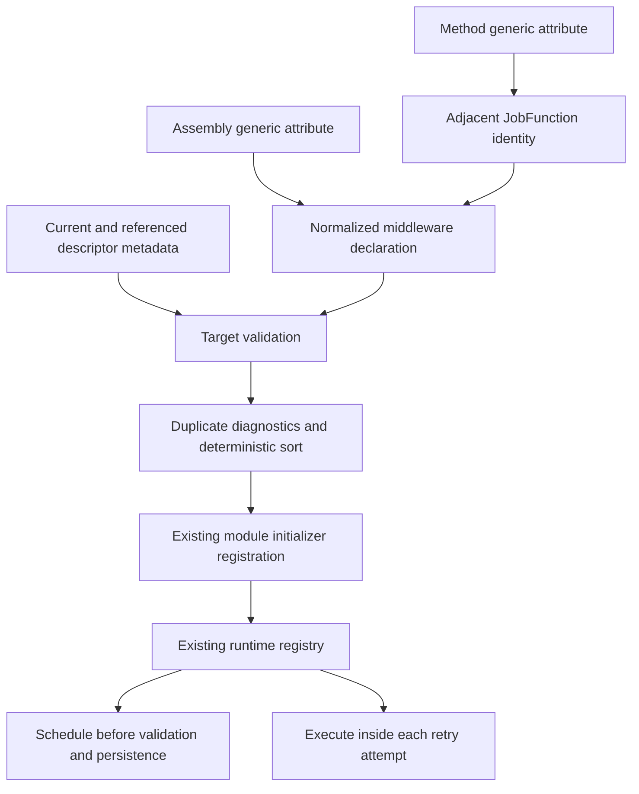

# Jobs Middleware Authoring API Redesign - Plan

## Goal Capsule

- **Objective:** Replace the stage-enum Jobs middleware attribute with stage-specific constrained generic attributes, add method-local descriptor targeting without duplicated function strings, and retain deterministic generated direct-call dispatch.
- **Authority:** The user contract in this task overrides the current PR #685 authoring shape; issue #305 remains the runtime behavior contract; the #302 discovery decision remains the compile-time/AOT boundary.
- **Execution profile:** Change and validate PR #685 first, then propagate its reviewed commits through PR #689 and PR #690 without changing their bases or merging any PR.
- **Stop conditions:** Stop only if repository evidence makes a settled API decision infeasible, publication authority fails, or an external CI service remains unavailable after bounded retries.
- **Tail ownership:** This run owns implementation, simplification, review fixes, commits, pushes, PR metadata, ancestry checks, and green CI/CodeQL for all three branches.

---

## Product Contract

### Summary

Jobs middleware authoring will use separate generic schedule and execute attributes whose type constraints catch stage mismatches at compile time. Assembly placement declares global middleware, method placement derives a targeted durable identity from the adjacent `[JobFunction]`, and assembly-level `Function` remains the explicit fallback for functions declared elsewhere.

### Problem Frame

PR #685 implements the correct runtime seams but exposes one non-generic attribute whose middleware type and stage are independent constructor arguments. That permits avoidable authoring mistakes and forces local targeting to repeat the durable function string. The production generator also validates referenced function descriptors but lacks production metadata-reference tests, so its cross-assembly contract is weaker than the durable #302 decision and existing #305 plan claim.

### Requirements

#### Public authoring contract

- R1. Replace `JobMiddlewareAttribute` and `JobMiddlewareStage` with `JobScheduleMiddlewareAttribute<TMiddleware>` constrained to `IJobScheduleMiddleware` and `JobExecuteMiddlewareAttribute<TMiddleware>` constrained to `IJobExecuteMiddleware`.
- R2. Assembly-level generic attributes declare global middleware when `Function` is absent and retain `Priority` ordering configuration.
- R3. A generic middleware attribute on a method with `[JobFunction]` targets that method's durable function identity without a repeated string.
- R4. `Function` is valid only on assembly-level declarations and must target a descriptor emitted by another assembly; local functions must use method placement.
- R5. The obsolete non-generic attribute and stage enum are removed without compatibility shims.

#### Generator and runtime contract

- R6. Assembly and method declarations normalize into one registration model with stage, target, priority, stable identity, middleware type, and source location.
- R7. The generator preserves current-versus-referenced descriptor provenance, reports stable duplicate and unknown/invalid-target diagnostics, and excludes invalid declarations from output.
- R8. Generated dispatch preserves priority then ordinal stable-identity ordering, scoped DI resolution, module-initializer registration, and direct calls without runtime scanning, reflection invocation, or expression compilation.
- R9. `[JobFunction]` remains the sole handler model; runtime schedule-once and execute-per-retry placement remains unchanged.

#### Delivery contract

- R10. PR #685 remains based on `main`, PR #689 remains based on `xshaheen/issue-305-jobs-middleware`, and PR #690 remains based on `xshaheen/jobs-host-owned-registries`; all affected checks finish green without merging.

### Key Flows

- F1. Global authoring
  - **Trigger:** An application or library declares a schedule or execute middleware attribute at assembly scope.
  - **Steps:** The compiler enforces the stage interface constraint; the generator derives stage from the generic original definition and middleware type from its type argument; the declaration normalizes as global unless `Function` is present.
  - **Outcome:** The declaring assembly's module initializer registers one direct dispatcher with the existing runtime ABI.
- F2. Local targeted authoring
  - **Trigger:** A middleware attribute is placed beside `[JobFunction]` on a locally declared method.
  - **Steps:** The generator reads both attributes from the method symbol and derives the target from the `JobFunction` value.
  - **Outcome:** The same normalized registration model is emitted without a second function-name literal.
- F3. External target fallback
  - **Trigger:** An assembly-level declaration sets `Function` to a function owned by a referenced assembly.
  - **Steps:** The generator validates the exact target against generated referenced descriptor metadata.
  - **Outcome:** The local middleware is registered for the external descriptor while each assembly remains responsible for its own registrations.
- F4. Invalid authoring
  - **Trigger:** A type violates the generic constraint, a method declaration lacks `[JobFunction]`, a method supplies `Function`, an assembly `Function` points to a local descriptor, a target is unknown, or an exact normalized declaration is duplicated.
  - **Steps:** The compiler owns constraint diagnostics; the generator owns placement, target, and duplicate diagnostics at the declaration location.
  - **Outcome:** Invalid registrations are not emitted and diagnostics are deterministic.

### Acceptance Examples

- AE1. Given an assembly-level `JobScheduleMiddleware<AuditScheduleMiddleware>`, when the project compiles, then generated output calls `RegisterSchedule` with direct scoped resolution and no function target.
- AE2. Given an assembly-level `JobExecuteMiddleware<TracingMiddleware>`, when the project compiles, then generated output calls `RegisterExecute` and runtime behavior remains per retry attempt.
- AE3. Given `[JobFunction("invoice.create")]` and `[JobExecuteMiddleware<InvoiceExecutionMiddleware>]` on one method, when the generator runs, then the normalized target is `invoice.create` without a user-authored `Function` value.
- AE4. Given an assembly-level declaration targeting a descriptor from an emitted producer metadata reference, when the consumer generator runs, then the target validates and direct consumer registration compiles.
- AE5. Given the same effective declaration through assembly and method placement, when the generator normalizes both, then it reports one duplicate diagnostic and emits one registration.
- AE6. Given a middleware type for the wrong stage interface, when the project compiles, then C# rejects the generic attribute usage before generation succeeds.
- AE7. Given an assembly-level `Function` that resolves to a descriptor in the same compilation, when the generator runs, then it reports an invalid-local-fallback diagnostic and emits no registration.
- AE8. Given a middleware-only referenced assembly included through `AddJobsDiscovery`, when the host builds the catalog, then its module initializer registers the middleware exactly once before freeze.

### Scope Boundaries

Included: public attributes and XML documentation, production generator discovery/normalization, diagnostics and release notes, production metadata-reference and middleware-only discovery fixtures, generated snapshots, Jobs discovery documentation, the existing #305 plan, and the three-branch publication tail.

Excluded: new handler models, runtime plugin discovery, reflection-based dispatch, changes to manager/retry placement, changes to host-owned registry semantics in #689, durable cancellation changes in #690, and the abandoned `f1d1` worktree.

### Success Criteria

- Every documented authoring form compiles and produces the expected direct generated registration.
- Invalid forms fail at the earliest responsible layer with stable diagnostics.
- Existing schedule and execute runtime suites remain green without moving runtime ownership.
- The published branch chain is linear, PR bases are unchanged, and CI plus CodeQL is green on all affected heads.

---

## Planning Contract

### Key Technical Decisions

- KTD1. Use two stage-specific generic attributes and remove the non-generic attribute plus stage enum. (session-settled: user-directed — chosen over retaining one runtime-validated attribute or compatibility shim: generic constraints make invalid stage/type combinations unrepresentable in this greenfield API.)
- KTD2. Treat assembly placement as global by default and method placement as descriptor-targeted through the adjacent `[JobFunction]`. (session-settled: user-directed — chosen over repeating `Function` beside local functions: the function declaration is the durable identity authority.)
- KTD3. Keep `Function` only as an assembly-level fallback for an external descriptor and reject it on methods. (session-settled: user-directed — chosen over permitting two local identity sources: local declarations must not drift from their `[JobFunction]`.)
- KTD4. Preserve `[JobFunction]`, the module-initializer registry ABI, and generated direct DI calls. (session-settled: user-directed — chosen over class handlers, runtime scanning, or a second dispatcher: the existing AOT-safe architecture and runtime behavior remain authoritative.)
- KTD5. Let each declaring assembly emit its own middleware registration while referenced generated descriptor metadata validates external `Function` targets. Blindly re-emitting referenced middleware would duplicate module-initializer registration and can reference inaccessible internal types; metadata-reference and middleware-only host-discovery tests will prove the supported cross-assembly boundary.
- KTD6. Normalize all authoring placements before validation, duplicate detection, ordering, and emission. This keeps one semantic model and makes an assembly/local collision diagnosable rather than placement-dependent.
- KTD7. Propagate the completed bottom-branch change upward without changing PR bases. (session-settled: user-directed — chosen over retargeting or independently editing dependents: linear rebases preserve independently reviewable stack slices.)

### Assumptions

- A1. Both schedule and execute generic attributes support method placement, even though the user example shows execute middleware; they share the same targeting rule.
- A2. Empty or whitespace assembly-level `Function` values are explicit invalid targets and use the unknown-target diagnostic rather than becoming global.
- A3. Exact duplicate identity continues to include stage, target, priority, and stable middleware identity; declaring the same middleware at different priorities is not newly prohibited.
- A4. Generic constraint failures remain compiler diagnostics such as `CS0311`; the generator does not duplicate compiler responsibility.

### High-Level Technical Design

The normalized declaration is an internal generator model, not a second public registration API. Referenced assemblies expose durable function descriptor metadata; their own generated module initializers continue to own their middleware dispatch registration.

### File Ownership and Sequencing

| Slice | Owned files | Constraint |
| --- | --- | --- |
| Public API | `src/Headless.Jobs.Core/JobMiddleware.cs` | Replace only authoring types; keep runtime registry ABI intact for clean #689 propagation. |
| Generator | `src/Headless.Jobs.SourceGenerator/JobsIncrementalSourceGenerator.cs`, `src/Headless.Jobs.SourceGenerator/Validation/DiagnosticDescriptors.cs`, `src/Headless.Jobs.SourceGenerator/AnalyzerReleases.Unshipped.md` | One normalized model feeds the existing generated registration emitter. |
| Generator tests | `tests/Headless.Jobs.SourceGenerator.Tests.Unit/GeneratorTestHelper.cs`, `tests/Headless.Jobs.SourceGenerator.Tests.Unit/JobsIncrementalSourceGeneratorTests.cs`, relevant snapshots | Add real producer-reference coverage and authoring diagnostics. |
| Runtime regression | `src/Headless.Jobs.Core/DependencyInjection/JobsDiscoveryExtension.cs`, a middleware-only test asset, its focused Jobs unit test, `tests/Headless.Jobs.Tests.Unit/Transactions/JobsManagerCoordinatedRoutingTests.cs`, and `tests/Headless.Jobs.Tests.Unit/RetryBehaviorTests.cs` only where syntax updates are necessary | Prove explicit discovery loads middleware-only assemblies once and preserve existing schedule/retry behavior. |
| Documentation | `src/Headless.Jobs.Core/README.md`, `src/Headless.Jobs.SourceGenerator/README.md`, Jobs discovery documentation, `docs/plans/2026-07-15-001-feat-jobs-descriptor-middleware-plan.md` | Show generic global/local/external forms, middleware-only discovery, and final architecture. |
| Stack propagation | Published branches and PR metadata for #685, #689, and #690 | Bottom-up only; retain registry and cancellation commits and bases. |

### Risks and Mitigations

- **Referenced-registration duplication:** Re-emitting producer declarations in consumers would register them twice. Keep registrations owned by the declaring compilation and test the referenced boundary through descriptor metadata.
- **Lazy middleware-only assembly loading:** A library with middleware but no otherwise-used function type may not run its module initializer before registry freeze. Require it through `AddJobsDiscovery`, document that obligation, and prove exactly-once registration in a host test.
- **Silent invalid method placement:** A syntax pipeline limited to valid `[JobFunction]` methods would miss middleware-only misuse. Discover attributed methods broadly enough to report invalid placement before filtering registrations.
- **Unstable duplicate diagnostics:** Assembly and method enumeration order can vary. Normalize with locations, apply deterministic ordering, and report the later canonical duplicate once.
- **Stack conflict in `JobMiddleware.cs`:** PR #689 changes registry freezing and registration lifecycle in the same file. Resolve propagation by combining #685's generic authoring section with #689's host-owned lifecycle implementation, then run the full Jobs unit suite on each rebased head.
- **Documentation drift:** The existing #305 plan claims broader referenced declaration discovery than the current ABI safely supports. Rewrite that claim to distinguish descriptor metadata validation from declaring-assembly registration ownership.

### Sources

- [Issue #305](https://github.com/xshaheen/headless-framework/issues/305) for runtime placement and AOT behavior.
- `docs/solutions/tooling-decisions/jobs-middleware-cross-assembly-discovery-2026-07-14.md` for compile-time metadata, identity, ordering, and rejected runtime discovery.
- `docs/plans/2026-07-15-001-feat-jobs-descriptor-middleware-plan.md` for the implemented PR #685 runtime seams and current authoring assumptions.
- `tests/Headless.Jobs.MiddlewareDiscovery.Spike.Tests.Unit/CompilationFixture.cs` for emitted metadata-reference test patterns.

---

## Implementation Units

### U1. Replace the public authoring surface

- **Goal:** Introduce the two constrained generic attributes and remove the obsolete attribute/stage types.
- **Requirements:** R1-R5
- **Files:** `src/Headless.Jobs.Core/JobMiddleware.cs`
- **Approach:** Give both generic attributes assembly/method usage, shared `Priority` and `Function` configuration, complete XML documentation, and stage-specific interface constraints. Preserve all delegates, contexts, interfaces, priority constants, registry methods, and runtime implementation below the authoring surface.
- **Test scenarios:** Valid schedule/execute types compile; wrong-stage and unrelated types fail through compiler constraints; obsolete public names no longer resolve; assembly and method placements are accepted syntactically.
- **Verification:** Core builds without public API documentation or analyzer warnings, and generator test compilations observe compiler constraint errors for invalid type arguments.

### U2. Normalize generic assembly and method declarations

- **Goal:** Feed every supported placement into one generator registration model without changing the runtime ABI.
- **Requirements:** R2-R8
- **Files:** `src/Headless.Jobs.SourceGenerator/JobsIncrementalSourceGenerator.cs`
- **Approach:** Match generic attributes by namespace plus original-definition metadata name, map definition to stage, read the middleware type argument and named priority/function values, derive method targets from the same symbol's `JobFunction`, and combine all declarations before validation and sorting. Track whether each descriptor belongs to the current or a referenced assembly so an assembly fallback cannot target a local function. Continue reading generated descriptor metadata from referenced assemblies for external targets, but emit registrations only for declarations owned by the current compilation.
- **Test scenarios:** Global schedule/execute declarations normalize correctly; method-local schedule/execute target the adjacent durable identity; referenced descriptor metadata validates an external target; generated dispatch retains direct scoped calls and current registry method signatures.
- **Verification:** Generated source compiles for current and producer/consumer metadata-reference fixtures and contains no runtime discovery, reflection invocation, or expression compilation.

### U3. Make invalid authoring deterministic

- **Goal:** Reject semantic misuse at compile time with stable, location-aware diagnostics.
- **Requirements:** R4, R6, R7
- **Files:** `src/Headless.Jobs.SourceGenerator/JobsIncrementalSourceGenerator.cs`, `src/Headless.Jobs.SourceGenerator/Validation/DiagnosticDescriptors.cs`, `src/Headless.Jobs.SourceGenerator/AnalyzerReleases.Unshipped.md`
- **Approach:** Diagnose middleware on a method without a valid `JobFunction`, method-local `Function`, assembly fallback to a current-compilation descriptor, unknown assembly targets, and exact normalized duplicates. Keep compiler-owned generic constraint failures out of the HF diagnostic catalog. Exclude every invalid declaration from emission.
- **Test scenarios:** Each invalid placement reports at its attribute; assembly fallback accepts referenced descriptors but rejects local descriptors; unknown targets remain stable; assembly/local duplicate collisions report once; declaration and metadata-reference order changes do not change diagnostics or output.
- **Verification:** The diagnostic catalog test covers the expanded contiguous HF range, release notes document new rules, and focused generator tests assert messages, locations, and singular emission.

### U4. Prove cross-assembly and runtime compatibility

- **Goal:** Cover the authoring contract end to end while preserving the already-correct runtime seams.
- **Requirements:** R6-R9
- **Files:** `tests/Headless.Jobs.SourceGenerator.Tests.Unit/GeneratorTestHelper.cs`, `tests/Headless.Jobs.SourceGenerator.Tests.Unit/JobsIncrementalSourceGeneratorTests.cs`, relevant generator snapshots, `src/Headless.Jobs.Core/DependencyInjection/JobsDiscoveryExtension.cs`, a middleware-only test asset and host test, and existing Jobs runtime tests only where syntax adjustments are necessary.
- **Approach:** Extend the production generator fixture to compile a producer with the real generator, emit a metadata reference, compile a consumer, and inspect both compilation diagnostics and generated source. Add a middleware-only assembly fixture that a host force-loads through `AddJobsDiscovery` before provider build, proving one generated registration. Retain manager and retry suites as behavioral regression authority rather than rebuilding runtime fakes.
- **Test scenarios:** Global schedule/execute, local target derivation, external fallback, cross-assembly descriptor discovery, middleware-only discovery before freeze, exactly-once registration, exact duplicates, unknown targets, deterministic priority/identity order, direct generated dispatch, schedule-before-validation, and per-retry execution all pass.
- **Verification:** The full source-generator unit project and Jobs unit project pass with no skipped authoring or runtime scenarios.

### U5. Align documentation and publish the stack

- **Goal:** Make the final public contract reviewable and preserve the three-PR topology after the bottom change lands.
- **Requirements:** R1-R10
- **Files:** `src/Headless.Jobs.Core/README.md`, `src/Headless.Jobs.SourceGenerator/README.md`, `docs/plans/2026-07-15-001-feat-jobs-descriptor-middleware-plan.md`, PR descriptions for #685/#689/#690, and the three published branches.
- **Approach:** Replace obsolete examples, document global/local/external semantics and diagnostics, require `AddJobsDiscovery` for assemblies that contain middleware declarations even when they contain no `[JobFunction]`, clarify declaring-assembly registration ownership, and update #685's plan/PR description. Commit and push the reviewed bottom slice, then transplant the existing #689 and #690 commit ranges onto their updated bases with lease-protected published-history updates. Resolve only expected overlaps while preserving host-registry and cancellation behavior.
- **Test scenarios:** Documentation examples match compiled fixtures; ancestry is linear; branch diffs retain each PR's owned slice; PR bases remain correct; affected CI and CodeQL workflows pass on every final head.
- **Verification:** PR metadata reports the correct stack, all branch heads are reachable in order, no unrelated commits enter any slice, and all required GitHub checks are successful.

---

## Verification Contract

| Gate | Command or evidence | Covers |
| --- | --- | --- |
| Core build | `make build-project PROJECT=src/Headless.Jobs.Core/Headless.Jobs.Core.csproj` | U1 |
| Generator build | `make build-project PROJECT=src/Headless.Jobs.SourceGenerator/Headless.Jobs.SourceGenerator.csproj` | U2, U3 |
| Generator contracts | `make test-project TEST_PROJECT=tests/Headless.Jobs.SourceGenerator.Tests.Unit/Headless.Jobs.SourceGenerator.Tests.Unit.csproj` | U1-U4 |
| Jobs runtime regressions | `make test-project TEST_PROJECT=tests/Headless.Jobs.Tests.Unit/Headless.Jobs.Tests.Unit.csproj` | U1, U4 |
| Focused analyzers | `make quality-analyzers-project PROJECT=src/Headless.Jobs.Core/Headless.Jobs.Core.csproj` and the equivalent source-generator project gate | U1-U3 |
| Formatting | `make format-check` | U1-U5 |
| Generated AOT contract | Syntax/output assertions prove direct generic DI resolution and forbid reflection scan, reflection invocation, and expression compilation | U2-U4 |
| Stack integrity | Git ancestry, range-diff, per-PR file ownership, and live PR base/head metadata agree with the required topology | U5 |
| Publication | CI and CodeQL conclude successfully for the final heads of PR #685, PR #689, and PR #690 | U5 |

The browser gate is not applicable because the affected diff contains no user-facing web route or dashboard behavior; pipeline mode records that explicit no-UI result.

---

## Definition of Done

- U1 is done when only the constrained generic authoring types remain and public API documentation/build checks pass.
- U2 is done when assembly and method placements share one normalized generator path and the existing runtime registration ABI is unchanged.
- U3 is done when compiler and generator responsibility is explicit, every invalid authoring form is covered, and diagnostics are deterministic and location-aware.
- U4 is done when production metadata-reference tests and existing Jobs runtime suites prove cross-assembly, ordering, AOT, schedule, and retry behavior.
- U5 is done when docs and PR descriptions show the final API, all three published branches form the required linear ancestry with correct bases, and CI/CodeQL is green without merging.
- The final diff contains no obsolete compatibility shim, no second handler/dispatch mechanism, no runtime scanning, no abandoned experimental code, and no changes from the read-only `f1d1` worktree.
