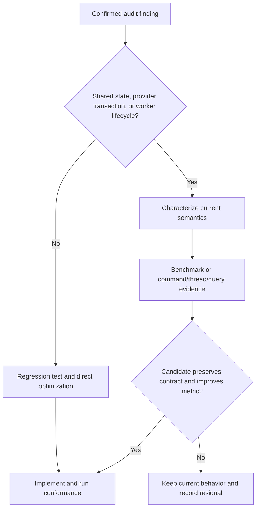
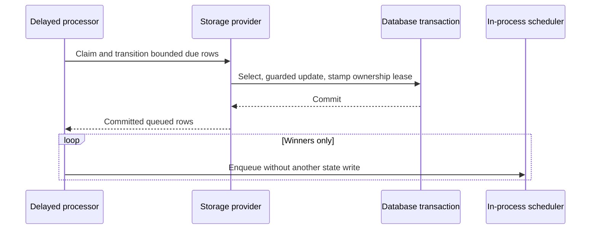
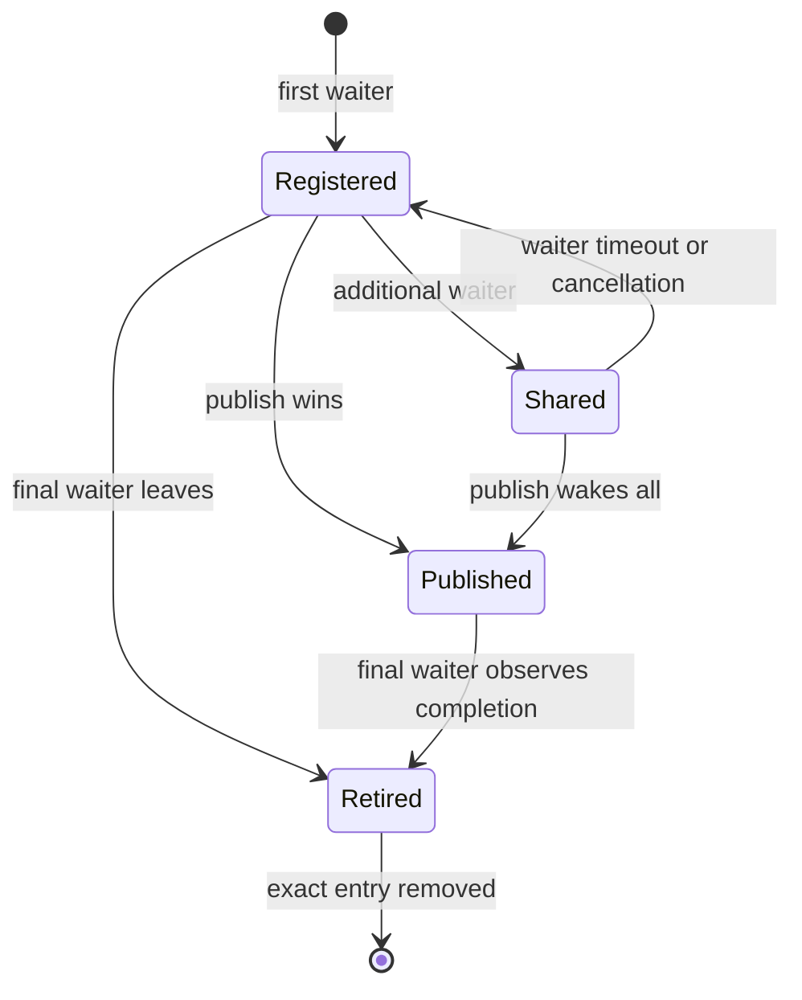

# Runtime Hot Paths and Resource Lifetimes - Plan

## Goal Capsule

- **Objective:** Fix the confirmed allocation, batching, lifetime, query-shape, thread, buffering, and cancellation findings from the repository performance audit without changing durable formats, provider correctness, or public behavior.
- **Authority:** The user request and `.context/arkan/x-code-review/15-07-2026_23-50-38-perf-audit/report.md` define scope; current code, conformance harnesses, and `docs/solutions/` define behavioral constraints.
- **Execution profile:** Characterization and measurement precede shared-signal, provider-batching, and worker-topology changes. Isolated buffer/query/token fixes may proceed directly with regression tests.
- **Stop conditions:** Stop rather than guess if a bulk transition cannot preserve terminal-row guards and transaction boundaries, if a scheduler change breaks priority/capacity/shutdown behavior, or if a public API change cannot remain additive and binary-compatible.
- **Tail ownership:** One focused performance PR with plan-aware review, explicit benchmark evidence, provider tests, and CI driven to a decided state.

---

## Product Contract

### Summary

Remove confirmed avoidable work from runtime hot paths while preserving the framework's provider contracts and recovery semantics. Every confirmed audit finding receives either an accepted optimization or a benchmark-rejected residual; suspected issues are measured but not changed without evidence.

### Problem Frame

Static inspection found full-payload copies in serialization paths, uncapped EF recovery candidates, row-at-a-time batch APIs, retained distributed-lock signal entries, unnecessary Jobs worker threads, dashboard over-fetching, request-buffering pressure, and cancellation gaps. Several fixes are mechanically safe, but signal lifetime, relational batching, and scheduler topology combine performance with correctness and require characterization before implementation.

### Requirements

#### Resource lifetime and scheduling

- R1. Polling release-signal entries must leave the resource dictionary after the final waiter completes while preserving concurrent waiters and publish races.
- R2. Jobs workers must not reserve a dedicated thread that only blocks on ThreadPool work when the task-only candidate passes its characterization and performance gates; priority, capacity, work-stealing, failure isolation, and shutdown behavior remain mandatory.
- R3. Bundled storage providers, and third-party providers implementing the optional capability, must transition delayed-message pickup as a bounded batch without one database round trip per row and enqueue only committed winning rows. Third-party providers using the compatibility fallback retain serial transitions.

#### Database and query efficiency

- R4. Compatibility CAS recovery must select at most `MaxClaimBatchSize` roots per sweep in deterministic order while preserving per-row ownership fences and child-tree behavior.
- R5. PostgreSQL and SQL Server permission `InsertManyAsync` must use bounded multi-row commands within one transaction and retain all-or-nothing behavior.
- R6. The cron graph must preserve its current history-derived UTC date-selection and zero-fill behavior while projecting only distinct date keys needed to select the range, then filtering and aggregating status counts in storage without loading lifetime entities or the `CronJob` navigation.

#### Allocation and buffering efficiency

- R7. Typed Jobs payloads and blob JSON must deserialize from UTF-8 buffers or streams without an intermediate UTF-16 payload string; persisted Jobs bytes and dashboard text conversion remain compatible.
- R8. Idempotency's maximum hashable body size must be independent from its in-memory spill threshold, with a conservative measured default.
- R9. Jobs execution must remove the confirmed avoidable activity-name and `Task.WhenAll` array copies without introducing pooling or changing fan-out semantics.

#### Cancellation responsiveness and compatibility

- R10. Delayed scheduler state writes and form-file buffering must observe caller cancellation at the I/O boundary without interrupting already-classified must-complete terminal writes.
- R11. New public options, persistence contracts, and helper overloads must be additive, documented, and covered by API/provider tests.
- R12. Each optimization must have before/after allocation, command-count, thread-count, or query-shape evidence appropriate to the finding; passing functional tests alone is insufficient for design-sensitive changes.

### Acceptance Examples

- AE1. Given two waiters on one resource, when one times out and the other is published, the remaining waiter completes and the entry is retired after both leave.
- AE2. Given `MaxClaimBatchSize` is 100 and more than 100 compatible-CAS recovery candidates, one sweep claims exactly 100 oldest roots, and later sweeps drain the remainder without duplicates or starvation.
- AE3. Given a delayed-message batch containing rows that became terminal after selection, only guarded-update winners are returned and enqueued after commit.
- AE4. Given a permission batch with a duplicate in a later chunk, neither provider commits any row from the batch.
- AE5. Given legacy compressed and uncompressed Jobs request bytes, typed reads return the same values without changing `ReadJobRequestAsString` output.
- AE6. Given dense, sparse, empty, and widely separated cron occurrence dates, the dashboard response retains the exact existing ordered date sequence and zero-filled gaps while SQL excludes irrelevant occurrence payloads and aggregates status counts.
- AE7. Given request cancellation during scheduler persistence, blob/form streaming, or a bounded claim loop, work stops promptly and no uncommitted in-process state is published.

### Scope Boundaries

#### Included

- All 11 confirmed findings in the audit report, including accepted Jobs worker topology and delayed-message batching changes after their characterization gates pass; any rejected candidate remains as an explicitly benchmarked residual rather than a forced optimization.
- Targeted BenchmarkDotNet coverage and provider command/query evidence needed to justify the implemented shapes.
- Public API and package documentation required by additive options or provider contracts.

#### Deferred to Follow-Up Work

- Tenant-cardinality changes to the EF compiled-query cache key.
- In-memory received-upsert lock sharding and retry-index redesign.
- Scheduled-queue timer/linked-token redesign, debounce timer reuse, broad logging-helper replacement, or eviction policies for type/topic/container/cron caches.
- Per-row CAS replacement with provider-native bulk claiming; this PR bounds the generic fallback and preserves its existing fence.

---

## Planning Contract

### Key Technical Decisions

- KTD1. UTF-8 buffers and streams are the primary serialization path; string conversion remains only for explicitly textual APIs. This follows `docs/solutions/architecture-patterns/buffer-first-serializer-contract.md` and keeps the persisted Jobs format unchanged.
- KTD2. Generic CAS recovery gains deterministic paging but keeps per-root atomic updates. Native bulk claim semantics remain provider-owned, following `docs/solutions/design-patterns/atomic-database-clock-relational-lease-claims.md`.
- KTD3. Delayed-message batching uses a separate optional atomic claim-and-transition capability that built-in providers implement and the processor detects at runtime. Existing third-party providers continue through the unchanged callback-based serial path; the no-write enqueue path stays internal to Core so consumers cannot bypass storage authority.
- KTD4. Permission inserts use bounded parameterized multi-row commands, not provider bulk loaders or new schema types. This retains ordinary transaction rollback and cancellation behavior with a smaller semantic delta.
- KTD5. Polling signals use ref-counted per-resource entries with exact key/value retirement. Unconditional removal from each waiter's `finally` is forbidden because waiters share a completion source.
- KTD6. The Jobs scheduler removes the current Thread-plus-`Task.Run` bridge only after characterization proves the dedicated-thread synchronization context does not govern user work. The replacement is one tracked task per logical queue slot, not a new custom asynchronous thread pump; the intentional `LongRunning` path remains dedicated.
- KTD7. Dashboard graph aggregation becomes an additive provider projection returning date/status/count data. A default interface implementation uses the existing occurrence-list API for third-party compatibility; bundled providers override it with storage-side aggregation. Existing entity-list APIs remain unchanged for consumers that need them.
- KTD8. Public surface changes are additive: a separate idempotency spill option, a token-aware form-file overload, and new provider projection/batch members retain existing call shapes.

### Assumptions

- The user intends “fix them” to mean every confirmed audit issue; suspected issues remain benchmark-only because the original request prohibited blind optimization.
- A single PR is acceptable despite touching several packages; commits and implementation units remain domain-focused for reviewability.
- A measured spill default near the framework buffering range can replace the current hash-cap-derived threshold without changing fingerprint or oversize behavior.
- Thread names and the currently ineffective Jobs synchronization context are not external contracts; scheduler priority, bounded concurrency, cancellation, and shutdown are contracts.
- The delayed-message capability coexists with the callback method during this PR so third-party providers are not forced into an immediate breaking migration.
- A committed delayed-message claim may be lost from the local queue if the process dies after commit; store-clock lease expiry provides bounded at-least-once recovery rather than an impossible commit-and-memory atomicity guarantee.

### High-Level Technical Design

#### Evidence gate

#### Delayed-message transition

#### Shared signal lifecycle

### Sequencing

1. Establish characterization and benchmark baselines for shared signals, Jobs scheduling, serialization, and buffering.
2. Land isolated streaming, cancellation, execution-allocation, and bounded-CAS fixes.
3. Land provider command batching and dashboard aggregation with relational coverage.
4. Land atomic delayed-message transition and post-commit enqueue across providers.
5. Remove the redundant Jobs thread bridge only after its characterization and benchmark gates pass.

---

## Implementation Units

### U1. Retire shared signals safely

- **Goal:** Eliminate retained `PollingReleaseSignal` keys without stranding concurrent waiters.
- **Requirements:** R1, R12; AE1.
- **Dependencies:** None.
- **Files:** `src/Headless.DistributedLocks.Core.Database/PollingReleaseSignal.cs`; `tests/Headless.DistributedLocks.Core.Database.Tests.Unit/PollingReleaseSignalTests.cs`; `tests/Headless.DistributedLocks.Tests.Unit/ConnectionScopedLocks/PollingReleaseSignalTests.cs`.
- **Approach:** Characterize timeout, cancellation, multi-waiter, and publish races; introduce a ref-counted entry with exact key/value removal and registration revalidation; cancel and drain the fallback delay when publish wins.
- **Patterns to follow:** `RunContinuationsAsynchronously`; exact-key/value dictionary removal; lifecycle guidance in `docs/solutions/best-practices/storage-initializer-lifecycle-correctness.md`.
- **Test scenarios:** Two waiters with one timeout; one cancelled waiter with one live waiter; publish racing final departure; later waiter never attaches to retired/completed state; publish-before-wait remains polling-based; final key becomes collectible without adding public diagnostics.
- **Verification:** Deterministic fake-time tests prove cleanup and all races repeatedly without wall-clock sleeps.

### U2. Stream serialization and remove per-job copies

- **Goal:** Remove full-payload strings/copies from Jobs and Blob JSON reads and eliminate small confirmed execution-path allocations.
- **Requirements:** R7, R9, R12; AE5, AE7.
- **Dependencies:** None.
- **Files:** `src/Headless.Jobs.Core/JobsHelper.cs`; `src/Headless.Jobs.Core/JobsExecutionTaskHandler.cs`; `src/Headless.Blobs.Abstractions/BlobStorageExtensions.cs`; `tests/Headless.Jobs.Tests.Unit/JobsHelperTests.cs`; `tests/Headless.Jobs.Tests.Unit/JobExecutionTaskHandlerTests.cs`; `tests/Headless.Blobs.Abstractions.Tests.Unit/BlobStorageExtensionsTests.cs`; `benchmarks/Headless.Jobs.Benchmarks/Headless.Jobs.Benchmarks.csproj`; `benchmarks/Headless.Jobs.Benchmarks/Program.cs`; `benchmarks/Headless.Jobs.Benchmarks/JobsRequestSerializationBenchmarks.cs`; `benchmarks/Headless.Jobs.Benchmarks/JobsExecutionFanoutBenchmarks.cs`; `benchmarks/Headless.Blobs.Benchmarks/Headless.Blobs.Benchmarks.csproj`; `benchmarks/Headless.Blobs.Benchmarks/BlobJsonBenchmarks.cs`; `headless-framework.slnx`.
- **Approach:** Deserialize plain Jobs bytes directly, wrap compressed array segments without copying, stream Blob JSON through both reflection and source-generated overloads, precompute activity names, and pass existing task spans directly to `Task.WhenAll`.
- **Execution note:** Add compatibility and malformed-input characterization before replacing the parsers; benchmark payload sizes before and after.
- **Patterns to follow:** Buffer-first serializer contract; source-generated JSON overload parity; `MemoryDiagnoser` and repository benchmark output conventions.
- **Test scenarios:** Compressed/uncompressed legacy round trips; null, empty, malformed, truncated, and signature-edge payloads; unchanged dashboard text conversion; seekable/non-seekable blobs; missing blob; cancellation and disposal on success/failure; fan-out result/order unchanged with tracing on and off.
- **Verification:** At 64 KiB and 1 MiB, payload allocations fall by at least 20% with no new Gen2/LOH pressure; 256 B and 4 KiB throughput stays within 5%. Fan-out benchmarks prove the target arrays disappear without more than 5% latency regression.

### U3. Decouple request buffering and propagate cancellation

- **Goal:** Bound idempotency request memory independently and make scheduler/form buffering cancellation-responsive.
- **Requirements:** R8, R10, R11, R12; AE7.
- **Dependencies:** None.
- **Files:** `src/Headless.Api.Idempotency/IdempotencyOptions.cs`; `src/Headless.Api.Idempotency/IdempotencyOptionsValidator.cs`; `src/Headless.Api.Idempotency/IdempotencyMiddleware.cs`; `src/Headless.Api.Core/Extensions/Http/HeadlessFormFileExtensions.cs`; `src/Headless.Messaging.Core/Processor/Dispatcher.cs`; `tests/Headless.Api.Idempotency.Tests.Unit/IdempotencyOptionsValidatorTests.cs`; `tests/Headless.Api.Idempotency.Tests.Unit/SetupIdempotencyTests.cs`; `tests/Headless.Api.Idempotency.Tests.Unit/IdempotencyMiddlewareTests.cs`; `tests/Headless.Api.Tests.Unit/Extensions/FormFileExtensionsTests.cs`; `tests/Headless.Messaging.Core.Tests.Unit/DispatcherTests.cs`; `benchmarks/Headless.Api.Idempotency.Benchmarks/Headless.Api.Idempotency.Benchmarks.csproj`; `benchmarks/Headless.Api.Idempotency.Benchmarks/Program.cs`; `benchmarks/Headless.Api.Idempotency.Benchmarks/RequestBufferingBenchmarks.cs`; `src/Headless.Api.Idempotency/README.md`; `docs/llms/api.md`; `headless-framework.slnx`.
- **Approach:** Add and validate a dedicated spill-threshold option copied through every options path; retain the existing form-file method and add a token-aware overload; pass scheduler cancellation into the non-terminal delayed-state write while preserving enqueue-after-success ordering.
- **Execution note:** Compare spill thresholds around 30/64/128 KiB at concurrency 1/32/128 before selecting the default from the memory/latency Pareto frontier.
- **Patterns to follow:** Additive NuGet public APIs; request `RequestAborted` propagation; terminal-write cancellation classification from `docs/solutions/logic-errors/terminal-state-overwrite-on-redelivery.md`.
- **Test scenarios:** Default/config binding and copies; below/above-threshold fingerprint, rewind, reject, and pass-through parity; pre-cancelled and mid-read form streams; exact storage token propagation; cancellation during blocked scheduler write; guarded false result; commit-success ordering.
- **Verification:** Public API compatibility passes, cancellation latency is bounded at the stream/storage I/O boundary, and the selected threshold lowers peak managed growth by at least 75% for 128 concurrent 1 MiB requests without more than 10% small-body latency regression.

### U4. Bound Jobs recovery and aggregate dashboard history in storage

- **Goal:** Bound compatibility recovery sweeps and remove lifetime occurrence materialization from the dashboard.
- **Requirements:** R4, R6, R11, R12; AE2, AE6.
- **Dependencies:** None.
- **Files:** `src/Headless.Jobs.EntityFramework/Infrastructure/JobsClaimStrategy.cs`; `src/Headless.Jobs.Abstractions/Interfaces/IJobPersistenceProvider.cs`; `src/Headless.Jobs.Abstractions/Models/CronOccurrenceStatusCount.cs`; `src/Headless.Jobs.EntityFramework/Infrastructure/JobsEFCorePersistenceProvider.cs`; `src/Headless.Jobs.Core/Provider/JobsInMemoryPersistenceProvider.cs`; `src/Headless.Jobs.Dashboard/Infrastructure/Dashboard/JobsDashboardRepository.cs`; `tests/Headless.Jobs.EntityFramework.Tests.Harness/JobsClaimConformanceTests.cs`; `tests/Headless.Jobs.EntityFramework.PostgreSql.Tests.Integration/PostgreSqlConformanceTests.cs`; `tests/Headless.Jobs.EntityFramework.SqlServer.Tests.Integration/SqlServerConformanceTests.cs`; `tests/Headless.Jobs.Tests.Unit/Dashboard/JobsDashboardRepositoryTests.cs`; `docs/llms/jobs.md`.
- **Approach:** Order timed-out roots by eligibility time and ID, cap before materialization, and retain per-row CAS. Characterize the dashboard's current history-derived date selection first. Add a default provider projection that reproduces it through the existing occurrence-list API; bundled providers override it with a two-stage storage projection: distinct UTC date keys select the exact existing inclusive range, then a filtered status-count aggregate supplies that range. Zero-fill the unchanged ordered date sequence in the dashboard.
- **Patterns to follow:** Native provider `MaxClaimBatchSize`; database-clock claim guidance; existing provider SPI documentation and in-memory parity.
- **Test scenarios:** More than 100 eligible roots; repeated drain without starvation; concurrent claimers; forced query-filter/discriminator compatibility strategy; cancellation between candidates; child-tree preservation; UTC boundary grouping; dense, sparse, empty, and widely separated graph dates; exact pre-change date-sequence parity; tenant filters; captured SQL excludes `Include`, projects date keys only for range selection, and aggregates status counts server-side.
- **Verification:** Provider conformance passes and SQL/query evidence proves bounded candidates and windowed aggregation.

### U5. Batch permission inserts transactionally

- **Goal:** Replace row-at-a-time permission insert commands with bounded multi-row commands for PostgreSQL and SQL Server.
- **Requirements:** R5, R11, R12; AE4, AE7.
- **Dependencies:** None.
- **Files:** `src/Headless.Permissions.Storage.PostgreSql/PostgreSqlPermissionGrantRepository.cs`; `src/Headless.Permissions.Storage.SqlServer/SqlServerPermissionGrantRepository.cs`; `tests/Headless.Permissions.Storage.PostgreSql.Tests.Integration/PostgreSqlPermissionsStorageTests.cs`; `tests/Headless.Permissions.Storage.SqlServer.Tests.Integration/SqlServerPermissionsStorageTests.cs`.
- **Approach:** Materialize the enumerable once, chunk at a parameter-safe bound, reuse cached SQL by row count, and execute all chunks inside the existing transaction. Do not introduce TVPs, bulk-copy APIs, or schema changes.
- **Patterns to follow:** Bounded multi-row insert in `src/Headless.Features.Storage.SqlServer/SqlServerFeatureDefinitionRecordRepository.cs`; exact parameter stamping and provider transaction conventions.
- **Test scenarios:** Empty and single-use enumerables; 1, 100, and multi-chunk batches; duplicate in a later chunk rolls back all rows; cancellation before and during execution; null/non-null tenant values; provider-equivalent conflict behavior.
- **Verification:** Integration tests prove atomicity; command count matches the chosen chunk formula; 1,000-row throughput improves at least 25%; one-row throughput remains within 10%; larger chunks are rejected when they materially increase tail transaction or lock duration.

### U6. Claim delayed messages atomically and enqueue after commit

- **Goal:** Remove serial per-message updates from delayed scheduling for bundled and capability-aware providers without weakening terminal-state, cross-replica safety, or the third-party compatibility fallback.
- **Requirements:** R3, R10, R11, R12; AE3, AE7.
- **Dependencies:** U3.
- **Files:** `src/Headless.Messaging.Core/Persistence/IDataStorage.cs`; `src/Headless.Messaging.Core/Transport/IDispatcher.cs`; `src/Headless.Messaging.Core/Processor/IProcessor.Delayed.cs`; `src/Headless.Messaging.Core/Processor/Dispatcher.cs`; `src/Headless.Messaging.Storage.PostgreSql/PostgreSqlDataStorage.cs`; `src/Headless.Messaging.Storage.SqlServer/SqlServerDataStorage.cs`; `src/Headless.Messaging.InMemoryStorage/InMemoryDataStorage.Maintenance.cs`; `tests/Headless.Messaging.Core.Tests.Harness/DataStorageTestsBase.cs`; `tests/Headless.Messaging.Core.Tests.Unit/DispatcherTests.cs`; `tests/Headless.Messaging.Storage.PostgreSql.Tests.Integration/PostgreSqlStorageTests.cs`; `tests/Headless.Messaging.Storage.SqlServer.Tests.Integration/SqlServerStorageTests.cs`; `benchmarks/Headless.Messaging.Benchmarks/DelayedSchedulingBenchmarks.cs`; `docs/llms/messaging.md`.
- **Approach:** Add a separate optional atomic bounded claim-and-transition interface, implement it on built-in providers, and have the processor type-check for it. PostgreSQL uses ordered locking, a store-clock ownership lease, and returned winners; SQL Server uses ordered candidates, the same lease fence, and output; InMemory uses per-message locks and injected time. Providers without the capability continue through the existing callback-based serial path unchanged. The capability path returns committed winners, and the processor invokes an internal no-write enqueue path.
- **Execution note:** Build conformance tests first because enqueue-before-commit and terminal resurrection are unacceptable regressions.
- **Patterns to follow:** Storage affected-row authority and terminal guard from `docs/solutions/logic-errors/terminal-state-overwrite-on-redelivery.md`; existing atomic retry-claim patterns.
- **Test scenarios:** Mixed delayed/stale queued candidates; terminal row changed after selection; callback/cancellation rollback; disjoint concurrent claimers; deterministic global ordering and batch cap; poison-row handling; winner-only return; InMemory observable parity; enqueue occurs only after commit; immediate re-poll cannot reclaim a live lease; failure after commit becomes reclaimable after lease expiry; old-contract provider fixture uses the serial fallback.
- **Verification:** Provider tests prove atomic winner sets, store-authoritative lease recovery, rollback, and compatibility. At the default 1,000-row batch, statements remain bounded and transaction duration falls at least 50% with zero duplicate/resurrected rows and no material deadlock or lock-wait regression.

### U7. Remove the redundant Jobs worker thread bridge

- **Goal:** Stop consuming a dedicated thread stack per worker when the loop and user work already execute on the ThreadPool.
- **Requirements:** R2, R12.
- **Dependencies:** U2.
- **Files:** `src/Headless.Jobs.Core/JobsThreadPool/JobsTaskScheduler.cs`; `src/Headless.Jobs.Core/JobsThreadPool/JobsSynchronizationContext.cs`; `tests/Headless.Jobs.Tests.Unit/JobsTaskSchedulerTests.cs`; `benchmarks/Headless.Jobs.Benchmarks/JobsTaskSchedulerBenchmarks.cs`; `src/Headless.Jobs.Core/Headless.Jobs.Core.csproj`.
- **Approach:** Characterize current thread identity and continuation behavior, replace blocking dedicated threads with one tracked task per logical queue slot, and remove thread-static/synchronization-context machinery only when characterization proves it is non-functional. Slot ownership, retirement, fault observation, and restart are explicit so `_activeWorkers` is never reused as a worker identity. Preserve failure isolation and the dedicated `LongRunning` path.
- **Execution note:** Keep the current implementation if task-only workers regress throughput, p99 enqueue latency, shutdown, or bounded concurrency.
- **Patterns to follow:** Async hot paths must not block ThreadPool threads; injected `TimeProvider`; existing work-stealing and priority counters.
- **Test scenarios:** `SynchronizationContext.Current` and thread identity before/after incomplete await; nested queueing; synchronous, yielding, delayed-I/O, CPU-bound, and blocking work at max concurrency; priority stealing/starvation; capacity cancellation; dispose during active work and idle backoff; non-highest slot retirement/restart; exception isolation.
- **Verification:** Dedicated-thread count falls by configured worker count and stack commitment falls accordingly; idle CPU does not rise; throughput remains within 5%; p99 enqueue and shutdown stay within 10%; maximum callbacks, fairness, and bounded concurrency remain exact. If these gates fail, omit U7's topology commit and retain its characterization evidence.

---

## Verification Contract

| Gate | Applies to | Required evidence |
|---|---|---|
| Focused unit tests through `make test-project` | U1-U4, U6-U7 | New race, cancellation, serialization, buffering, dashboard, dispatcher, and scheduler scenarios pass under MTP. |
| PostgreSQL and SQL Server integration projects | U4-U6 | Real-provider claim, permission, and delayed-message conformance passes with transaction/rollback assertions. |
| `make format-check` | All C# changes | CSharpier reports no formatting drift. |
| `make build-project` and `make quality-analyzers-project` | Every affected production project | Zero introduced build warnings, analyzer warnings, or public API documentation errors. |
| BenchmarkDotNet release runs | U2, U3, U5-U7 | Before/after allocated bytes, command count, transaction duration, threads, throughput, and latency are captured in the PR description; each adopted candidate improves its target metric without a material counter-metric regression. |
| Full `make build` and `make test` | Whole PR | Repository build and test suite pass after focused gates. |
| Public documentation and API compatibility | U3, U4, U6 | Additive contracts are documented in package README and `docs/llms/`; compatibility tooling reports no unintended break. |

### Performance acceptance protocol

- Record baseline and candidate commits, SDK, Release configuration, OS/CPU, GC mode, data seed, and raw result artifacts.
- Run baseline and candidate in independent process launches with confidence intervals; do not compare methods only within one warmed process when global state matters.
- Treat more than 5% regression in throughput or median latency, or more than 10% in tail latency, peak memory, GC frequency, lock waits, transaction duration, or shutdown time, as material.
- Require deterministic reductions for allocations, database command count, and dedicated thread count. Noisy latency claims must improve by more than 10% with intervals excluding parity.
- Serialization covers 256 B, 4 KiB, 64 KiB, and 1 MiB payloads, including compressible/high-entropy data and both Blob metadata paths.
- Permission batching covers 1/100/1,000/10,000 rows and multiple provider-safe chunk candidates; delayed scheduling covers 100/1,000/10,000 backlog rows, competing processors, and stale-row ratios.

Database cases use real providers or container-backed integration tests. Polling-signal lifetime is proven with deterministic race and collection tests rather than BDN alone. Idle CPU and thread-stack results may use `dotnet-counters` or process metrics where BenchmarkDotNet cannot capture them reliably.

---

## Definition of Done

- Every confirmed audit finding maps to a completed implementation unit and regression test, or to benchmark evidence that rejects the candidate and documents the residual.
- Shared-signal entries retire after the final waiter, including timeout/cancellation/publish races.
- Generic CAS sweeps and delayed-message claims are bounded and preserve ownership/terminal guards.
- Permission batches use bounded commands and remain transactionally atomic on both relational providers.
- Jobs/blob JSON avoids intermediate strings and copies while reading all existing persisted formats.
- Dashboard SQL filters and aggregates before materialization.
- Idempotency buffering has an independent validated spill threshold; form and scheduler I/O observe cancellation.
- Jobs worker loops no longer consume a redundant dedicated thread, unless benchmark evidence rejects the candidate and the residual is documented rather than forced.
- Focused tests, provider integration tests, formatting, analyzers, full build/test, and CI pass.
- Public contracts and docs remain synchronized; no generated artifacts, abandoned experiments, or unrelated `c` file enter the diff.
- The branch is committed in reviewable slices, pushed, opened as a PR, and CI reaches a decided state.

---

## Appendix

### Sources and Research

- `.context/arkan/x-code-review/15-07-2026_23-50-38-perf-audit/report.md`
- `docs/solutions/architecture-patterns/buffer-first-serializer-contract.md`
- `docs/solutions/design-patterns/atomic-database-clock-relational-lease-claims.md`
- `docs/solutions/logic-errors/terminal-state-overwrite-on-redelivery.md`
- `docs/solutions/concurrency/circuit-breaker-transport-thread-safety-patterns.md`
- `docs/solutions/best-practices/storage-initializer-lifecycle-correctness.md`
