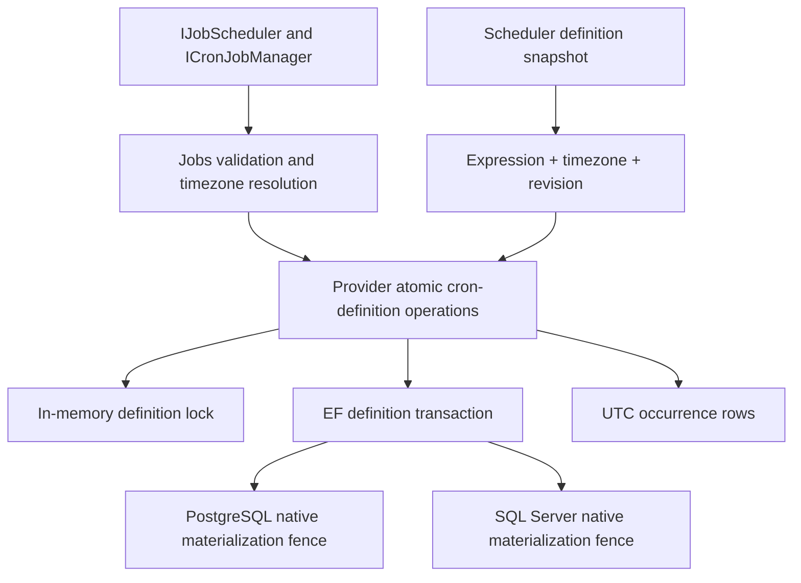
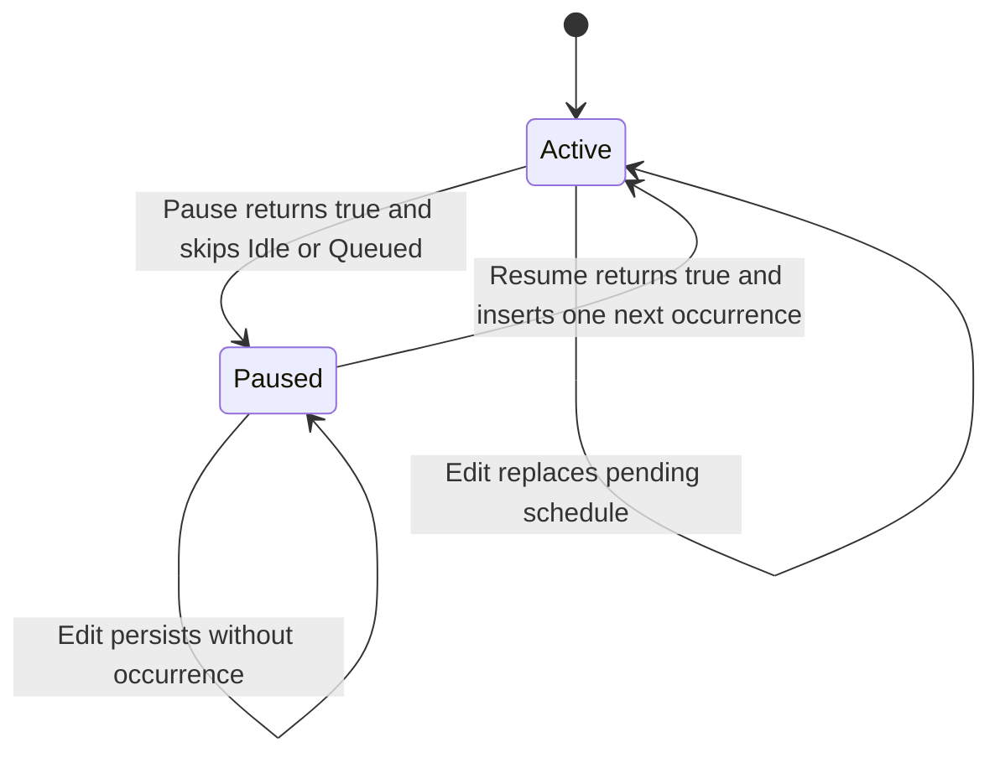
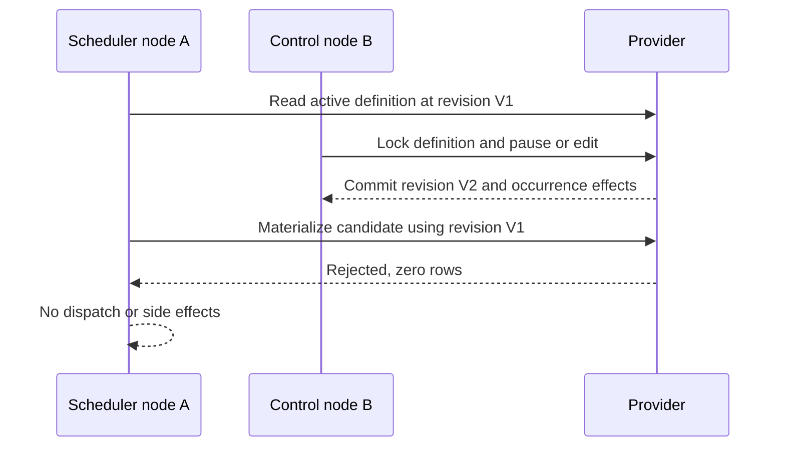

# Jobs Cron Pause and Per-Definition Timezones - Plan

## Goal Capsule

- **Objective:** Ship issue #312 as one public API, schema, provider-conformance, migration, and documentation PR that adds durable cron-definition pause/resume and per-definition IANA timezones.
- **Authority:** The live issue #312 body and comments govern behavior, followed by repository instructions, the .NET time/testing guidance, current Jobs code and provider harness, and the named prior-art documents.
- **Execution profile:** Prove behavior first, implement in dependency order, simplify the branch diff, run plan-aware review and apply eligible findings, pass the browser applicability gate, then open a ready PR against `main` and babysit CI/CodeQL to green.
- **Stop conditions:** Stop for a genuine contradiction that makes a settled decision infeasible. Do not implement misfire recovery, tenant cron, host/time-job pause, in-flight cancellation, calendars, chains, dashboard authorization, or unrelated cleanup.
- **Tail ownership:** The autonomous run owns branch creation, focused and Release/pre-push validation, eligible review fixes, PR creation with `Closes #312`, CI/review correction within the stated budgets, and a final green open PR without merge.

---

## Product Contract

### Summary

Add durable pause state and per-definition IANA timezone selection to recurring Jobs while keeping occurrence instants in UTC. Provider-owned atomic transitions must prevent stale scheduler nodes from creating or starting work after pause or after a schedule revision.

### Problem Frame

Cron definitions currently rely on one scheduler-global timezone and ordinary CRUD updates. The scheduler reads definitions, calculates occurrences in process, and later asks a provider to materialize them; this leaves no durable pause state and lets stale calculations race definition edits.

Pause/resume also spans two durable aggregates: the definition row and its not-yet-started occurrences. Updating them in separate calls can expose intermediate state, double-materialize on two nodes, or let a locally queued stale context start after the definition changed.

Misfire recovery is intentionally separate. The current model has no durable schedule cursor, so this work computes only the next occurrence from an explicit operation time and never replays the paused interval.

### Requirements

#### Definition and public API

- R1. `CronJobEntity` persists `IsPaused`, nullable `TimeZoneId`, and a provider-owned monotonic `ScheduleRevision`; existing definitions migrate to active state with the scheduler-global timezone fallback and an initial revision.
- R2. `IJobScheduler` exposes `PauseCronAsync(Guid cronJobId, CancellationToken cancellationToken = default)` and `ResumeCronAsync(Guid cronJobId, CancellationToken cancellationToken = default)` with the live issue's boolean semantics.
- R3. Unknown IDs and definitions already in the requested state return `false`; only the winning durable state transition returns `true`.
- R4. Recurring creation accepts an optional per-definition timezone through the descriptor-backed scheduler options without changing `[JobFunction]` as the sole handler model.
- R5. Create and update validate every non-null timezone as a resolvable IANA identifier before persistence and include the invalid identifier in the reported validation error.

#### Scheduling and timezone behavior

- R6. A null `TimeZoneId` resolves through the configured scheduler-global timezone; no code path uses the ambient local timezone.
- R7. Per-definition cron evaluation preserves the current spring-forward gap shift and emits a fall-back ambiguous wall time once at the later UTC instant.
- R8. Every materialized occurrence continues to persist a UTC instant regardless of the definition timezone.
- R9. Resume samples one injected `TimeProvider` instant and creates exactly the first occurrence strictly after that instant using the current expression and effective timezone.
- R10. Resume never replays, coalesces, counts, or otherwise materializes the paused interval.

#### Atomic state transitions and edits

- R11. Pause atomically sets `IsPaused = true` and changes every `Idle` or `Queued` occurrence for the definition to `Skipped`, stamps `DateExecuted`, clears stale ownership/lease fields, and records exactly `Cron definition paused`.
- R12. Pause never cancels or rewrites an `InProgress` occurrence; it may finish through the existing owner and completion fences.
- R13. Resume atomically clears pause and inserts exactly one next occurrence; concurrent resumes leave at most one future occurrence.
- R14. Updating expression or timezone while paused validates and persists the definition without materializing an occurrence.
- R15. Updating expression or timezone while active atomically retires every not-yet-started old-schedule occurrence and creates exactly one next occurrence under the new schedule.
- R16. Ordinary cron update APIs preserve the store-owned pause state; only pause/resume operations may change `IsPaused`.
- R17. Scheduler materialization is fenced on current durable pause state and definition revision so a stale node cannot recreate paused work or materialize an old expression/timezone after an edit or pause/resume cycle.
- R18. A locally held stale `Queued` context cannot transition to `InProgress` after pause or edit has terminalized it; affected-row results remain authoritative.

#### Providers, schema, tests, and documentation

- R19. In-memory, PostgreSQL, and SQL Server implement the same observable pause, resume, edit, and stale-node semantics, using provider-appropriate atomicity.
- R20. EF mappings, raw SQL fixtures, PostgreSQL demo migrations/snapshots, and SQL Server migration proof include all three new definition columns and preserve existing rows.
- R21. Shared provider-conformance coverage includes create/update validation, pause, resume, active edit, paused edit, duplicate/unknown calls, pending versus in-progress behavior, and two-node contention.
- R22. Unit coverage deterministically exercises explicit IANA spring-forward/fall-back behavior, null global fallback, Windows-only/unknown rejection, and `TimeProvider`-controlled resume timing.
- R23. Jobs package READMEs and `docs/llms/jobs.md` explain definition scope, global fallback, UTC persistence, DST behavior, atomic pause effects, and no-catch-up resume.
- R24. Validation reports discovered and executed test counts; a filtered run that discovers or executes zero relevant tests is not proof.

### Acceptance Examples

- AE1. Given a definition with one `Idle`, one `Queued`, and one `InProgress` occurrence, when pause wins, then the first two are skipped with the locked timestamp/reason, the running occurrence is untouched, and a second pause returns `false`.
- AE2. Given a node calculated an occurrence before another node paused the definition, when the stale node attempts materialization or start afterward, then the provider affects no row and no function begins.
- AE3. Given a definition remained paused across several scheduled wall-clock ticks, when resume occurs at time T, then exactly one occurrence is persisted for the first valid tick strictly after T and no paused-period tick appears.
- AE4. Given two nodes resume the same definition concurrently, when both operations settle, then one returns `true`, one returns `false`, and exactly one pending occurrence exists.
- AE5. Given an active definition has a pending occurrence from its old expression/timezone, when the schedule is edited, then the old pending occurrence cannot start and exactly one occurrence from the new schedule remains; an already `InProgress` occurrence is unchanged.
- AE6. Given a paused definition is edited, when the edit commits, then no occurrence is materialized; a later resume uses only the edited expression/timezone and the resume instant.
- AE7. Given `America/New_York`, when a scheduled wall time falls in the spring gap or fall overlap, then the gap is shifted through and the overlap is emitted once at the later UTC instant; the stored timestamp is UTC.
- AE8. Given null, an IANA identifier, a Windows-only identifier, and an unknown identifier, when definitions are created or updated, then null uses the global zone, the IANA identifier succeeds, and both invalid identifier classes fail before persistence with the supplied value named.

### Scope Boundaries

#### In scope

- Cron definitions only, identified by durable `Guid`, across the descriptor-backed scheduler facade, manager/provider layers, mappings, migrations, tests, and paired documentation.
- Provider-owned atomicity for individual and batch schedule edits, pause/resume, occurrence retirement/replacement, and stale-node fencing.
- Migration artifacts owned by current repository conventions: PostgreSQL-backed demo contexts plus a test-owned SQL Server upgrade proof.

#### Deferred to follow-up work

- Durable misfire cursor, policy design, bounded catch-up, replay, or coalescing remain parked in issue #676.
- Consumer applications remain responsible for generating their own EF migrations from the updated Jobs model.

#### Outside this work

- Tenant cron definitions or #278; global host pause; time-job pause; cancellation of in-flight work; calendar exclusions; chains; dashboard authorization or SPA work; new handler models; unrelated refactors.

---

## Planning Contract

### Key Technical Decisions

- KTD1. **Persist pause and timezone on each definition.** `IsPaused` and nullable `TimeZoneId` live on `CronJobEntity`; null resolves to the configured scheduler-global zone. (session-settled: user-directed — chosen over scheduler-global timezone plus process-only pause: state must be durable and definition-specific.)
- KTD2. **Make pause a provider-owned transition.** The provider changes the definition and every `Idle`/`Queued` occurrence in one critical section or relational transaction, while leaving `InProgress` untouched. (session-settled: user-directed — chosen over best-effort multi-step pause or forced cancellation: multi-node correctness must preserve existing execution ownership.)
- KTD3. **Resume from one operation time with no recovery cursor.** The manager resolves the effective timezone, samples `TimeProvider` once, calculates the first strictly-later occurrence, and passes that candidate into the provider's atomic resume operation. (session-settled: user-directed — chosen over catch-up or misfire replay: durable misfire semantics are deferred to #676.)
- KTD4. **Accept only IANA definition identifiers and store UTC instants.** A Jobs-owned resolver rejects Windows-only and unknown identifiers, null retains the global fallback, and `CronScheduleCache` keeps expression parsing cached while applying conversion with the resolved definition zone. (session-settled: user-directed — chosen over local or Windows IDs and stored wall-clock occurrences: portable definitions require stable persistence.)
- KTD5. **Land provider parity before relying on the public facade.** In-memory synchronization, generic EF transitions, PostgreSQL/SQL Server native materialization fences, migrations, and shared conformance ship in the same PR as the scheduler API. (session-settled: user-directed — chosen over API-first partial provider support: the public contract is unsafe without provider parity.)
- KTD6. **Complete the autonomous tail without merge.** The branch is simplified, reviewed, fixed, pushed, opened as a ready PR, and watched through CI/CodeQL and review feedback to terminal green. (session-settled: user-directed — chosen over implementation-only delivery or merge: the requested endpoint is a green open PR.)
- KTD7. **Use a dedicated monotonic schedule revision fence.** `CronJobEntity.ScheduleRevision` advances by exactly one inside the provider-owned pause, resume, or expression/timezone edit transaction. Scheduler dispatch contexts carry the exact committed integer and every materialization path requires equality. A dedicated revision avoids timestamp precision and custom-mapping ambiguity while closing same-instant edit and pause/resume-cycle races; it is definition-version metadata, not a misfire cursor.
- KTD8. **Treat affected-row results as execution authority.** A rejected provider transition stops scheduler restart, occurrence creation, notification, and local execution side effects. Queue-to-`InProgress` continues to require a non-terminal affected row before function invocation.
- KTD9. **Serialize with the definition row, then mutate occurrences.** Relational paths lock/update the parent definition before retiring or inserting occurrences; native PostgreSQL and SQL Server materialization takes a compatible parent lock and matches pause plus revision. In-memory uses a definition-scoped critical section around the same logical transaction.
- KTD10. **Preserve terminal audit rows while making uniqueness apply to live occurrences.** Replace the unconditional `(CronJobId, ExecutionTime)` uniqueness rule with provider-equivalent filtered/partial uniqueness for `Idle`, `Queued`, and `InProgress` occurrences. A pause or schedule-changing edit frees a pending scheduled instant by terminalizing the old row, and resume or active schedule-changing edit inserts a new occurrence ID; provider locks plus the live unique index prevent same-instant reinsertion after claim without reviving a stale row.
- KTD11. **Keep migration downgrade non-destructive.** `Down` restores the former unconditional occurrence-time uniqueness only when the upgraded data contains no terminal/live same-instant collision. If incompatible post-upgrade rows exist, the downgrade fails before mutation with an actionable error; operators must quiesce scheduling and resolve or archive the colliding audit data explicitly rather than having the migration delete or rewrite it.

### Assumptions

- IANA aliases that `TimeZoneInfo` identifies as IANA and resolves on the host are accepted and persisted as supplied; Windows-only aliases are rejected rather than normalized.
- Scheduler nodes for one Jobs store run with homogeneous OS/ICU timezone data. Divergent tzdata can map one IANA wall time to different UTC candidates and is outside the supported cluster contract; paired operational documentation makes this deployment invariant explicit.
- Active-edit retirement records old `Idle`/`Queued` occurrences as `Skipped` with one operation timestamp and stable reason `Cron definition updated`; this preserves audit history and fences locally held stale contexts. `InProgress` remains untouched.
- Existing cron batch-update validation stays all-or-nothing, and the provider applies all definition edits plus pending-occurrence replacements in one transaction/critical section.
- Dashboard backend and SPA behavior are outside scope unless compilation reveals a direct model-contract break; no dashboard feature work is planned.

### High-Level Technical Design

#### Component and authority flow

#### Definition control states

#### Stale-node linearization

### Implementation and Landing Strategy

- Create `xshaheen/issue-312-cron-pause-timezones` from verified `origin/main` commit `635d057742ad4fd7998c492345738717999ccc4a`, unless `origin/main` advances before branch creation; a pristine detached worktree may fast-forward first.
- Keep one coherent PR against `main` titled for issue #312 and include `Closes #312`.
- Do not merge. CI success requires terminal-green Build/pack, analyzer, and CodeQL signals; skipped publication jobs remain acceptable when their trigger conditions do not apply.

### Risks and Dependencies

- A cache-only pause filter is unsafe because cron-expression cache invalidation is post-commit and best-effort. Native materialization must re-read the authoritative row under a compatible lock.
- A boolean pause fence alone is insufficient after resume because a stale pre-pause node may see active state again. The monotonic integer revision match is load-bearing.
- Ordinary `UpdateRange` can overwrite a concurrently changed `IsPaused`. Atomic edit APIs must copy only editable fields while preserving the durable control state.
- Parent/child lock order must be identical for pause, resume, edit, and native materialization to avoid provider-specific deadlocks.
- Overlapping batch edits must validate fully before entering the transaction, lock definitions in deterministic ID order, and commit all definition revisions and occurrence changes together; an injected mid-batch failure must roll the whole batch back.
- Raw SQL seed helpers bypass EF mappings and must change with the schema before conformance tests are meaningful.
- Additive columns alone do not make mixed binaries safe: old scheduler nodes do not understand pause or revision fencing. Migrate first, upgrade all scheduler nodes, and only then use pause/timezone controls.
- Testcontainers or Docker availability may transiently block provider proof; retry bounded infrastructure startup, but do not replace provider tests with mocks or weaken assertions.

### Sources and Research

- Live issue #312 and parked design issue #676.
- `.context/docs/13-07-2026-jobs-issue-audit.md` for the pause/timezone versus misfire split.
- `docs/solutions/design-patterns/temporal-authority-standard.md` and `docs/solutions/design-patterns/atomic-database-clock-relational-lease-claims.md` for time and atomic-provider authority.
- `docs/solutions/concurrency/startup-pause-gating-and-half-open-recovery.md` for the late-starting-node admission analogy only.
- `docs/solutions/logic-errors/terminal-state-overwrite-on-redelivery.md` for precise mutable-state predicates and authoritative affected-row results.
- Current Jobs patterns in `src/Headless.Jobs.Core/CronScheduleCache.cs`, `src/Headless.Jobs.Core/Managers/InternalJobsManager.cs`, `src/Headless.Jobs.Core/Managers/JobsManager.cs`, and the Jobs provider-conformance harness.

---

## System-Wide Impact

- **Interfaces and routing:** `IJobScheduler` pause/resume flows through `IInternalJobManager` into explicit provider transitions. Existing `ICronJobManager` create, individual update, and batch update paths use the same timezone validation and atomic edit operations; ordinary edits never write store-owned `IsPaused`.
- **State lifecycle:** A scheduler snapshot carries expression, timezone input, pause state, and the exact committed `ScheduleRevision`. Resume atomically commits active state plus one strict-next UTC occurrence. An active schedule-changing edit to `Expression` or `TimeZoneId` terminalizes pending old-schedule rows and inserts one replacement; the same edit while paused changes only the definition. Metadata-only edits update ordinary audit metadata while preserving `ScheduleRevision`, pause state, and pending work. `InProgress` remains outside pause/edit mutation.
- **Occurrence identity and uniqueness:** Terminal skipped rows remain durable audit evidence. Filtered/partial provider indexes enforce same-instant uniqueness for `Idle`, `Queued`, and `InProgress` occurrences, so a replacement receives a new ID after the old pending row becomes terminal while locally held stale IDs remain terminal and fail admission.
- **Cache lifecycle:** Expression caching accelerates discovery only. Cached `IsPaused` suppresses fresh schedule calculation, never authoritative stored-occurrence lookup. Invalidation remains post-commit and best-effort; authoritative definition joins and revision predicates reject stale active snapshots, while stored-occurrence polling joins the current active definition and merges a resume-created occurrence independently of any stale cached pause value.
- **Admission matrix:** Fresh materialization, existing pending claim, lease-expiry reclaim, and queue-to-`InProgress` start all preserve authoritative pause/revision or terminal-child fences. Any path touching both aggregates uses one lock order: definition row, then occurrence row or range.
- **Provider and mapping integration:** In-memory, generic EF/CAS, PostgreSQL, and SQL Server expose the same accepted/rejected outcomes. Native SQL resolves mapped definition and occurrence metadata for custom schemas; EF projections, custom `TCronJob` types, raw fixtures, migrations, and notification payloads carry the new fields and revision.
- **Batch and rollback behavior:** Batch validation finishes before writes, definition locks are acquired in deterministic ID order, and one transaction or in-memory critical section owns every definition/revision/occurrence change. Any pre-commit exception or cancellation rolls back the entire operation.
- **Post-commit failure boundary:** Durable commit defines acceptance. Only accepted transitions invalidate caches, restart the local scheduler, and publish cron-definition updates; those callbacks are idempotent, non-authoritative availability aids and cannot reverse committed state. Rejected transitions emit no callbacks, and tests distinguish pre-commit rollback from post-commit callback failure/recovery.
- **Deployment and compatibility:** The definition-column migration is additive for stored rows but not behaviorally compatible with old scheduler binaries. Operators migrate first, upgrade every scheduler node, then enable pause/timezone use; every node sharing a store must also use homogeneous OS/ICU timezone data. Paired documentation names both constraints. No dashboard command endpoint or SPA behavior is added.

---

## Implementation Units

### U1. Add definition state, timezone validation, and deterministic schedule calculation

- **Goal:** Establish the public data/options contract and a reusable per-definition schedule calculation seam without changing occurrence persistence.
- **Requirements:** R1, R4-R10, R22; AE7-AE8.
- **Dependencies:** None.
- **Files:** `src/Headless.Jobs.Abstractions/Entities/CronJobEntity.cs`; `src/Headless.Jobs.Abstractions/Models/RecurringJobOptions.cs`; `src/Headless.Jobs.Core/CronScheduleCache.cs`; a focused Jobs-owned timezone resolver in `src/Headless.Jobs.Core/`; `src/Headless.Jobs.EntityFramework/Configurations/CronJobConfigurations.cs`; `tests/Headless.Jobs.Tests.Unit/CronScheduleCacheTests.cs`; focused timezone validation tests under `tests/Headless.Jobs.Tests.Unit/`.
- **Approach:** Add durable fields and XML documentation, initialize the monotonic schedule revision, bound the nullable timezone column, keep the expression parse cache independent of timezone, resolve null through the configured global zone, and validate non-null IDs as IANA before any manager/provider write.
- **Execution note:** Start with failing tests for explicit-zone DST transitions, strict next-after behavior, null fallback, and Windows-only/unknown rejection.
- **Patterns to follow:** Existing `CronScheduleCache` DST conversion; `Headless.Checks` for argument validation; injected `TimeProvider` for scheduling time.
- **Test scenarios:** Spring gap shift in an explicit IANA zone; fall overlap produces the later UTC instant once; origin inside the repeated hour remains deterministic; null matches the global zone; valid IANA succeeds; Windows-only and unknown IDs fail with the identifier in the error; returned occurrence kinds/values are UTC.
- **Verification:** Focused Jobs unit tests prove schedule math and validation independently of persistence.

### U2. Define atomic provider control contracts and in-memory behavior

- **Goal:** Create the provider-owned linearization contract for pause, resume, schedule edits, and stale materialization, then implement the in-memory reference behavior.
- **Requirements:** R3, R11-R18, R19; AE1-AE6.
- **Dependencies:** U1.
- **Files:** `src/Headless.Jobs.Abstractions/Interfaces/IJobPersistenceProvider.cs`; `src/Headless.Jobs.Abstractions/Models/JobManagerDispatchContext.cs`; `src/Headless.Jobs.Core/Provider/JobsInMemoryPersistenceProvider.cs`; new in-memory cron-control tests under `tests/Headless.Jobs.Tests.Unit/Provider/`.
- **Approach:** Add explicit provider operations whose results make accepted versus fenced transitions and the committed revision observable. Use a definition-scoped critical section to advance the revision, transition the definition, retire pending rows, and insert a replacement occurrence as one operation. Require pause state and expected revision to match immediately before every scheduler materialization/start.
- **Execution note:** Write the accepted/rejected and two-contender tests before replacing existing compound dictionary operations.
- **Patterns to follow:** `DurableCancellationProviderTests` for stale-candidate and boolean transition semantics; per-row locking guidance from terminal-state overwrite prevention.
- **Test scenarios:** Unknown/duplicate pause/resume return false without audit mutation; pause skips all Idle/Queued but preserves InProgress; resume creates one strict-next row; two concurrent resumes produce one winner; paused edit creates none; active edit retires old pending rows and creates one; stale revision and stale paused candidates are rejected; no intermediate definition/occurrence state is observable.
- **Verification:** In-memory unit tests prove every contract branch and repeat contention scenarios enough to expose compound-operation races.

### U3. Route scheduler, manager edits, and public pause/resume through the atomic contract

- **Goal:** Make all application-facing and background scheduler paths validate consistently and honor provider results without ghost side effects.
- **Requirements:** R2-R10, R14-R18; AE2-AE6.
- **Dependencies:** U1-U2.
- **Files:** `src/Headless.Jobs.Abstractions/Interfaces/IJobScheduler.cs`; `src/Headless.Jobs.Abstractions/Interfaces/Managers/IInternalJobManager.cs`; `src/Headless.Jobs.Core/JobScheduler.cs`; `src/Headless.Jobs.Core/Managers/JobsManager.cs`; `src/Headless.Jobs.Core/Managers/InternalJobsManager.cs`; `src/Headless.Jobs.EntityFramework/Infrastructure/MappingExtensions.cs`; `src/Headless.Jobs.EntityFramework/Infrastructure/BasePersistenceProvider.cs`; `tests/Headless.Jobs.Tests.Unit/JobSchedulerTests.cs`; `tests/Headless.Jobs.Tests.Unit/Managers/InternalJobsManagerTests.cs`; focused manager update tests.
- **Approach:** Mirror `CancelAsync` facade semantics, restart the host scheduler only on an accepted transition, preserve durable `IsPaused` during ordinary edits, carry timezone plus revision in cron expression projections/dispatch contexts, filter paused definitions for efficiency, and still rely on provider rechecks for correctness.
- **Execution note:** Add facade and stale-dispatch characterization tests before changing manager orchestration.
- **Patterns to follow:** Existing `CancelAsync` facade-to-internal-manager path; current function/expression validation and post-commit cache/scheduler side-effect boundaries.
- **Test scenarios:** Public API signatures have trailing optional cancellation tokens; accepted pause, resume, and schedule-changing edit transitions restart once and publish exactly one post-commit cron-definition update, while duplicate, unknown, fenced, rolled-back, and cancelled transitions do neither; create/update reject invalid timezone before provider calls; ordinary update cannot toggle pause; expression/timezone edits replace pending work only while active; metadata-only edits preserve pending work; active/paused individual and batch edits call atomic provider operations; stale/rejected materialization returns no execution state or notification.
- **Verification:** Focused API, manager, and scheduler tests prove routing, validation order, restart behavior, and authoritative affected-row handling.

### U4. Implement relational atomicity and stale-node fences

- **Goal:** Make EF, PostgreSQL, and SQL Server serialize definition transitions with occurrence materialization and start.
- **Requirements:** R11-R20; AE1-AE6.
- **Dependencies:** U1-U3.
- **Files:** `src/Headless.Jobs.EntityFramework/Configurations/CronJobOccurrenceConfigurations.cs`; `src/Headless.Jobs.EntityFramework/Infrastructure/JobsEFCorePersistenceProvider.cs`; `src/Headless.Jobs.EntityFramework/Infrastructure/BasePersistenceProvider.cs`; `src/Headless.Jobs.EntityFramework/Infrastructure/JobsRelationalMappings.cs`; `src/Headless.Jobs.EntityFramework.PostgreSql/PostgreSqlJobsClaimStrategy.cs`; `src/Headless.Jobs.EntityFramework.SqlServer/SqlServerJobsClaimStrategy.cs`; related provider wiring if required.
- **Approach:** Lock or conditionally update the definition first, increment and return the committed integer schedule revision, match the expected revision on admission, mutate only precise `Idle`/`Queued` rows, and insert the replacement occurrence before commit. Fresh materialization, pending claim, lease-expiry reclaim, and start follow the same parent-then-child lock order. Batch edits validate first and lock definition IDs deterministically. Native materialization/claim SQL takes a compatible parent lock and joins the current definition so pause or revision mismatch returns no occurrence.
- **Execution note:** Drive each relational change from shared conformance tests and verify provider-native SQL independently rather than inferring parity from generic EF.
- **Patterns to follow:** PostgreSQL transactional CTE/`ON CONFLICT` claim shapes; SQL Server `UPDLOCK`/`HOLDLOCK`/`ROWLOCK` plus `OUTPUT`; database-clock lease documentation for atomic statement ownership while keeping schedule-time input from `TimeProvider`.
- **Test scenarios:** Pause versus create and pause versus start in both winner orderings; concurrent resume; edit versus stale create; edit versus queued start; lease-expiry reclaim after pause/edit; `InProgress` survival; back-to-back transitions increment the committed revision exactly; materialization at the same instant as an `InProgress` row is rejected; same-instant replacement preserves the terminal old row under a new occurrence ID; expected-revision mismatch; unique live next occurrence; single and mid-batch transaction rollback leave both definitions and occurrences unchanged; custom schema/mapping still works.
- **Verification:** Real PostgreSQL and SQL Server integration tests prove locking, affected-row, uniqueness, and rollback behavior.

### U5. Add migrations, raw-fixture parity, and upgrade proof

- **Goal:** Make existing databases and provider fixtures compatible with the new definition schema before API exposure.
- **Requirements:** R1, R20-R21.
- **Dependencies:** U1, U4.
- **Files:** `src/Headless.Jobs.EntityFramework/Configurations/CronJobOccurrenceConfigurations.cs`; new migrations plus designers/snapshots under `demo/Headless.Jobs.Api.Demo/Migrations/` and `demo/Headless.Jobs.Console.Demo/Migrations/`; new SQL Server migration fixture/artifact under `tests/Headless.Jobs.EntityFramework.SqlServer.Tests.Integration/Migrations/`; `tests/Headless.Jobs.EntityFramework.SqlServer.Tests.Integration/SqlServerCancellationMigrationTests.cs` or a renamed/generalized Jobs migration test; `tests/Headless.Jobs.EntityFramework.Tests.Harness/JobsCoordinationFixtureBase.cs`; provider fixture raw SQL helpers.
- **Approach:** Add non-null `IsPaused` with default false, nullable bounded `TimeZoneId`, and non-null integer `ScheduleRevision` with an initial default; replace unconditional occurrence-time uniqueness with provider-equivalent live-state filtered/partial indexes covering `Idle`, `Queued`, and `InProgress`; update every raw `CronJobs` insert; and follow the existing PostgreSQL demo plus standalone SQL Server migration ownership model. Validate forward, rollback, and idempotent SQL behavior where the provider supports it.
- **Execution note:** Prove migration from the pre-#312 model with existing rows before regenerating snapshots.
- **Patterns to follow:** The durable-cancellation demo migrations and SQL Server migration round-trip tests.
- **Test scenarios:** Existing rows become active with null timezone and an initial revision; new columns round-trip; terminal rows can coexist with one live same-instant replacement while same-time `Idle`, `Queued`, or `InProgress` duplicates remain rejected; compatible `Down` restores the unconditional pre-existing uniqueness, while incompatible collision data causes a pre-mutation actionable failure and remains intact; model snapshot matches runtime mappings; raw fixtures use provider-correct bool/null types; generated idempotent SQL applies safely to an old database and is a no-op when reapplied.
- **Verification:** Migration tests and provider initialization pass before behavioral conformance is accepted as evidence.

### U6. Extend shared provider conformance and two-node proof

- **Goal:** Lock the complete observable contract into the shared harness and concrete provider leaves.
- **Requirements:** R19-R24; AE1-AE8.
- **Dependencies:** U2-U5.
- **Files:** new cron-definition control conformance tests under `tests/Headless.Jobs.EntityFramework.Tests.Harness/`; `tests/Headless.Jobs.EntityFramework.Tests.Harness/JobsCoordinationFixtureBase.cs`; `tests/Headless.Jobs.EntityFramework.Tests.Harness/JobsClaimConformanceTests.cs`; `tests/Headless.Jobs.EntityFramework.PostgreSql.Tests.Integration/PostgreSqlConformanceTests.cs`; `tests/Headless.Jobs.EntityFramework.SqlServer.Tests.Integration/SqlServerConformanceTests.cs`; focused native provider test files where needed.
- **Approach:** Keep portable scenarios in the harness, leaf projects limited to fixture wiring and backend-specific lock assertions, coordinate simultaneous starts with a barrier, and query survivors after both nodes settle.
- **Execution note:** Record baseline discovery counts, add failing conformance cases, then require the final runs to execute the expected non-zero totals.
- **Patterns to follow:** Existing Jobs coordination/claim conformance harness; two-node enqueue/cancellation tests; `TestBase.AbortToken` cancellation convention.
- **Test scenarios:** Full pause/resume/edit matrix on both relational providers; two-node pause/create, pause/start, pause/reclaim, resume/resume, and edit/create races; back-to-back frozen-time transitions still increment exact revisions; repeated survivor sweeps show at most one live next occurrence; explicit timezone DST scenarios persist UTC under the documented homogeneous-tzdata cluster invariant; pre-commit cancellation rolls back without partial transition; post-commit callback failure leaves durable acceptance discoverable; custom entity/provider mappings preserve fields.
- **Verification:** Shared harness plus both concrete provider suites execute non-zero expected counts and pass without skips, mocks, quarantine, or weakened assertions.

### U7. Synchronize documentation and complete release-quality validation

- **Goal:** Document the public contract, remove dead-end code, and deliver a clean green PR closing #312.
- **Requirements:** R23-R24 and all prior requirements.
- **Dependencies:** U1-U6.
- **Files:** `src/Headless.Jobs.Abstractions/README.md`; `src/Headless.Jobs.Core/README.md`; `docs/llms/jobs.md`; this plan; PR metadata.
- **Approach:** Keep README and domain facts aligned under the authoring rules, explain timezone choice, no-catch-up semantics, homogeneous cluster tzdata, and the migrate-then-upgrade-all-nodes operational boundary rather than listing methods only, run simplification/review, apply all eligible findings, and retain residuals durably if any.
- **Test scenarios:** Documentation examples use the exact public API; examples distinguish null fallback from explicit IANA; pause/resume semantics and the no-misfire boundary match tests; the final diff contains no #676 cursor/policy, tenant, dashboard, or unrelated work.
- **Verification:** Format, focused builds/tests/analyzers, migration checks, Release/pre-push build, plan-aware review, clean status, ready PR against `main`, and terminal-green CI/CodeQL all pass without merge.

---

## Verification Contract

| Gate | Command or evidence | Done signal |
|---|---|---|
| Fresh worktree setup | `make bootstrap` or the narrower `make restore` after tool restore | Restore completes without bypassing package quarantine or hooks |
| Test discovery baseline | MTP listing/discovery for each focused Jobs test project before filtered runs | Relevant test names and non-zero discovered totals are recorded |
| Jobs unit behavior | `make test-project TEST_PROJECT=tests/Headless.Jobs.Tests.Unit/Headless.Jobs.Tests.Unit.csproj` | All Jobs unit tests pass with a non-zero executed count |
| PostgreSQL conformance | `make test-project TEST_PROJECT=tests/Headless.Jobs.EntityFramework.PostgreSql.Tests.Integration/Headless.Jobs.EntityFramework.PostgreSql.Tests.Integration.csproj` | Real PostgreSQL suite passes with all new conformance/race tests executed |
| SQL Server conformance | `make test-project TEST_PROJECT=tests/Headless.Jobs.EntityFramework.SqlServer.Tests.Integration/Headless.Jobs.EntityFramework.SqlServer.Tests.Integration.csproj` | Real SQL Server suite passes with all new conformance/migration/race tests executed |
| Focused builds | `make build-project PROJECT=<each changed Jobs source, test, and demo project>` | Every changed project builds in Release configuration |
| Changed-project analyzers | `make quality-analyzers-project PROJECT=<each changed project>` | No warning/error diagnostics or analyzer suggestions remain |
| Formatting | `make format` followed by `make format-check` | CSharpier reports no drift |
| Migration proof | Generate/apply provider migration and idempotent SQL from the current migration contexts | Upgrade, reapply, rollback, and model snapshot checks pass with existing rows |
| Repository gate | `make hook-pre-push` after a successful restore, plus the repository Release build required by the hook/CI path | Formatting and changed-solution build pass with hooks enabled |
| Review gate | `x-simplify-code`, then plan-aware `x-code-review mode:agent`, followed by eligible fix application | No eligible finding remains unapplied; residuals, if any, are durable |
| PR/CI gate | Ready PR to `main` with `Closes #312`; GitHub checks and CodeQL observed through `x-babysit-pr` | Branch is pushed, checks are terminal green, feedback is resolved, and PR remains open/unmerged |

---

## Definition of Done

- Every requirement R1-R24 and acceptance example AE1-AE8 is implemented and traceable to passing tests or documentation.
- `CronJobEntity`, EF mappings, migration artifacts, snapshots, raw SQL fixtures, and custom mapping paths agree on `IsPaused`, `TimeZoneId`, and `ScheduleRevision`.
- Pause/resume and schedule edits are atomic in-memory, PostgreSQL, and SQL Server; two-node tests prove stale-creator fencing and at-most-one next occurrence.
- Explicit IANA and null fallback paths preserve deterministic DST behavior and UTC occurrence persistence.
- No misfire cursor, policy, catch-up, replay, tenant cron, host/time-job pause, in-flight cancellation, dashboard feature, or unrelated cleanup appears in the diff.
- Test evidence includes discovered and executed counts; zero-test or filtered-no-match runs are rejected.
- All abandoned experiments and dead-end implementation code are removed from the final diff.
- The working tree is clean on a pushed `xshaheen/` branch based on current `main`.
- The ready PR targets `main`, contains `Closes #312`, has all eligible review findings resolved, and shows terminal-green CI/CodeQL without being merged.
