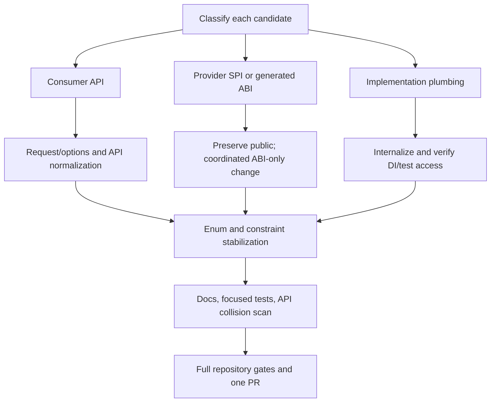

# Pre-v1 Public API Hardening - Plan

## Goal Capsule

- **Objective:** Ship one pre-v1 pull request that addresses only four public API debt classes: evolvable request/options shapes, async/cancellation/namespace/extension-holder normalization, explicit enum and generic-constraint contracts, and internalization of proven implementation plumbing.
- **Product authority:** Repository owner request on 2026-07-17. Breaking source changes are accepted by the repository's greenfield pre-v1 policy; no compatibility shims are required.
- **Success evidence:** Focused package tests and analyzer gates pass for every affected family; the full Release build, unit suite, format check, and analyzer suite pass; generated Jobs snapshots are updated deliberately; public docs match the new APIs; one PR contains no unrelated compatibility-review work; GitHub CI is green.
- **Execution budget:** At most three repair rounds after the first full verification pass. Escalate instead of guessing if a change requires a persistent-data migration, redefines a supported provider SPI/generated ABI, or expands beyond the four approved classes.
- **Open blockers:** None. Current `origin/main` is the implementation baseline. The 2026-07-16 audit is input evidence only where current source reconfirms it.

## Product Contract

### Summary

Pre-v1 is the last low-cost point to remove contract shapes that would otherwise require compatibility baggage. This change deliberately combines the four owner-selected cleanup classes in one PR while excluding the audit's other recommendations. Each public symbol must first be classified as a consumer API, third-party provider SPI, generated cross-assembly ABI, intentional testing API, or implementation detail. Breaking changes are allowed only where the selected cleanup class applies; visibility reductions are allowed only for implementation details whose activation and use are repository-owned.

### Key Technical Decisions

- **KTD-1 — One PR, four classes only.** The owner explicitly requested one PR for the selected optional-parameter, normalization, enum/constraint, and internalization work. Rejected: one PR per class, because it contradicts the requested landing unit. Rejected: folding in all audit findings, because the owner asked to suggest the remaining work afterward.
- **KTD-2 — Classification precedes visibility changes.** Consumer APIs and intentional SPIs stay public. Only DI-activated, source-generator-helper, persistence-implementation, runtime-implementation, or destructive test plumbing with no supported direct-consumer role becomes internal. Rejected: internalizing every type named by the older audit, because current architecture docs establish provider and generated-ABI exceptions.
- **KTD-3 — No compatibility shims before v1.** Call sites, tests, samples, and docs move directly to the new shapes. Obsolete forwarding overloads would freeze the very debt this work removes.
- **KTD-4 — Preserve protocol and storage meaning.** Existing enum numeric values are made explicit unless a verified unsafe zero default requires a deliberate new sentinel and all persistence/serialization behavior is migrated in the same unit. Wire parsers do not become tolerant merely because values are numbered.
- **KTD-5 — Generated Jobs plumbing remains a supported hidden ABI.** `JobFunctionDelegate` may be normalized only with coordinated generator/runtime/snapshot updates. Generator entry points and runtime members emitted into consumer assemblies remain public and additive; helper types may be internalized.
- **KTD-6 — Provider setup hooks remain public SPIs.** Setup builders and provider option-extension/register hooks retain their public surface and configuration/`Action`/named-instance overload families. They are not implementation plumbing.
- **KTD-7 — The sole extension-holder rename is explicit.** Type-specific foreign-namespace holders such as `TaskExtensions`, `DictionaryExtensions`, and EF builder-specific holders are valid. The only confirmed nonconforming holder in this PR is `GeoExtensions`, renamed to `HeadlessGeometryExtensions`.
- **KTD-8 — The documented Redis destructive helper is intentionally withdrawn.** The owner selected testing plumbing for internalization. `RedisTestSupportExtensions.FlushAllAsync` therefore becomes repository-internal with narrow test IVTs; a future dedicated downstream testing package is separate work.

### Requirements

#### Evolvable operation shapes

- **R1.** Replace the long optional filters on audit write/query operations with documented request/options types that preserve validation, nullable semantics, and result behavior.
- **R2.** Replace evolvability-risky creation/parse signatures in Settings, Features, JWT validation, Sitemaps, and Paymob CashIn with named request/options types. Preserve value-object constructors whose parameter lists describe immutable value identity rather than future operation configuration.
- **R3.** Do not rewrite BCL-shaped helpers, guard methods, framework-owned constructors, provider setup overload trios, or xUnit serialization constructors into options objects.
- **R4.** New request/options types use required members or constructors for true invariants, init-only properties for evolvable settings, validated defaults, nullable annotations that match runtime behavior, and XML documentation for type/member/default semantics. Secret- or PII-bearing requests use non-positional classes or explicitly redacted string/debug representations; JWT material and Paymob billing PII must not appear in `ToString`, validation exceptions, logs, or telemetry.

#### Async, cancellation, namespaces, and extension holders

- **R5.** For the confirmed APIs listed in R6-R8, normal async APIs end in `Async`; normal caller cancellation is a trailing optional `CancellationToken cancellationToken = default`. Framework overrides and provider SDK-options overloads retain mandated/provider-native shapes.
- **R6.** Reorder both `IFactoryCacheStore` read APIs to options before trailing optional cancellation, migrating implementations, coordinators, fakes, tests, and docs without changing cache behavior.
- **R7.** Normalize the generated Jobs delegate token position only as a coordinated ABI migration across Abstractions, source generation, Core execution, snapshots, tests, and docs.
- **R8.** Normalize `INodeDiscoveryProvider` async names and cancellation across Dashboard, Consul, and Kubernetes implementations; normalize the confirmed Paymob CashOut and Couchbase extension names and the Redis key-count cancellation surface.
- **R9.** Consolidate Security contracts, implementations, setup, validators, consumers, tests, and docs under `Headless.Security`.
- **R10.** Rename `GeoExtensions` to `HeadlessGeometryExtensions`; all type-specific holders allowed by the repository policy remain unchanged.

#### Enums and generic constraints

- **R11.** Assign explicit numeric values to all 15 audited public enums, preserving existing numeric and wire meaning unless an unsafe default is intentionally migrated and verified.
- **R12.** Give `CommitOutcome` a safe zero sentinel. Every `SignalAsync`/terminal-claim boundary rejects `CommitOutcome.Unspecified` with `ArgumentOutOfRangeException` before claiming state or draining callbacks. Give other persisted/wire-facing enums a sentinel only when the storage/serialization migration and unknown-value behavior are proven in this PR; otherwise preserve current values and document closed behavior.
- **R13.** Add only implementation-required generic constraints: Couchbase document IDs are non-null, EF entity keys match their actual equality/non-null requirements, and dictionary equality keys are non-null. Do not blanket-tighten message or DTO generics.
- **R14.** Treat enum member values and generic constraints as compatibility-tested API: add compile/runtime assertions where existing behavioral tests do not prove them.

#### Internalization

- **R15.** Internalize Messaging processor implementation plumbing while preserving intentional public monitoring/provider contracts.
- **R16.** Internalize the six concrete EF repository implementations for Features, Permissions, and Settings while keeping repository interfaces/record contracts public where they are supported storage SPIs.
- **R17.** Internalize Generator.Primitives and Jobs source-generator helpers while retaining public generator entry points and every generated cross-assembly runtime target.
- **R18.** Internalize the three auto-registered API options configurators, three initialization hosted-service implementations, and Jobs EF query/pagination implementation extensions, preserving DI discovery and test semantics.
- **R19.** Internalize destructive Redis test support and grant access only to the repository test assemblies that use it. Remove it from public runtime documentation. Do not internalize intentional consumer testing APIs merely because they live in tests.
- **R20.** Explicitly exclude unresolved SPI surfaces from visibility reduction: `MethodMatcherCache`, Audit capture/store contracts and `AuditLogEntry`, blob provider helpers, Features/Permissions/Settings storage records, Jobs entities/configuration/`JobsDbContext`/option builder, provider setup APIs, generator entry points, and generated Jobs runtime ABI.

#### Documentation and scope control

- **R21.** Update every affected package README and matching `docs/llms/<domain>.md` in the same units as public API changes. Examples must compile against the new surface and explain migration where the old name/signature was advertised.
- **R22.** Keep all other audit findings report-only after the PR: API baselines, oversized interface splits, mutable collection/value contracts, constructor/DTO curation, broader package-boundary work, nullable hardening, general naming/sealing, and repository-wide XML documentation enforcement.

### Acceptance Examples

- **AE1 (R1-R4):** Given an audit consumer constructs a query with a subset of filters, when it uses the new query object, then omitted values retain current behavior and adding a future filter does not require a method-signature change.
- **AE2 (R2-R4):** Given Settings/Features/JWT/Sitemap/Paymob consumers, when they use the new request/options types, then required invariants fail at the same or earlier boundary and optional defaults match current behavior.
- **AE3 (R5-R8):** Given a caller invokes each normalized async API with and without cancellation, then the `Async` member exists, the token is last/optional where policy applies, cancellation reaches the same underlying operation, and generated Jobs invocation still binds correctly.
- **AE4 (R9-R10):** Given a clean consumer compilation, when Security types and NTS extensions are imported, then the canonical namespace/holder resolves without duplicate or ambiguous extension candidates.
- **AE5 (R11-R14):** Given every audited enum, when its numeric map is reflected or serialized, then each value is explicit and stable; `default(CommitOutcome)` cannot be mistaken for a successful commit; constrained APIs reject nullable/incompatible key types at compile time.
- **AE6 (R15-R20):** Given each affected package is built and its DI registrations are exercised, when repository-owned services are activated, then internal implementations resolve normally while external compilation cannot directly bind those implementation types.
- **AE7 (R7, R17):** Given the Jobs source generator runs in a consumer project, when it emits registrations, then the generated code compiles against the retained public runtime ABI and its snapshots match the intentional token-order change.
- **AE8 (R21-R22):** Given docs/sample verification and a branch-scope diff, then all shown calls compile against the new API and no change from the deferred audit list is present.

## Scope Boundaries

- **In scope:** Only R1-R22 and their necessary call-site, test, generated snapshot, package README, and `docs/llms` migrations.
- **Out of scope:** Public API baseline tooling; interface capability splits; collection immutability; general constructor sealing/curation; broad DTO redesign; nullable serializer hardening; general XML-doc backlog; package dependency redesign; package renames; compatibility shims.
- **Out of scope despite the older audit:** `Headless.Settings.Abstractions` JSON dependency (documented intentional boundary); blanket renaming of type-specific foreign-namespace extension holders; blanket addition of cancellation to SDK-options APIs; internalization of provider setup SPIs or generated Jobs runtime targets.
- **Deferred report:** Summarize the remaining high-value compatibility work in the PR handoff, grouped into pre-v1 follow-ups versus major-version-only changes if v1 ships first.

## Planning Contract

### Assumptions

- A “long optional-parameter list” means a consumer-facing operation with at least five evolvable non-cancellation inputs, plus confirmed adjacent-boolean/credential signatures whose ambiguity independently blocks evolution. Immutable value constructors and familiar framework/BCL shapes are excluded.
- Pre-v1 clean breaks are preferred over obsolete forwarding overloads.
- The repository owns all current implementation call sites; current source and architecture docs override the older audit where they conflict.
- Enum migrations preserve existing numeric values by default. A new zero sentinel is mandatory only for `CommitOutcome`; any other sentinel requires evidence that persistence and forward-deserialization behavior are safe.
- `InternalsVisibleTo` is acceptable for repository test assemblies and tightly coupled provider assemblies when public visibility would otherwise expose implementation plumbing.
- Documentation files are selected by affected package/domain; no unrelated prose cleanup is included.

### Known Unknowns Resolved During Implementation

- Whether Paymob billing should use one options object or a required identity object plus address/contact options: choose the smallest shape that makes invariants explicit and keeps JSON/wire DTO behavior unchanged.
- Whether `StatusName` can gain `Unknown = 0`: inspect all persistence/serialization paths before changing values; preserve the existing map if any name/number ambiguity remains.
- Whether Redis endpoint enumeration can observe cancellation inside the provider SDK: at minimum check before each endpoint and document best-effort semantics.

### Candidate Disposition Manifest

This PR's objective is the exact named candidate set below, not an exhaustive repository-wide rewrite of every API in the four broad classes. U1 must validate this closed manifest against current metadata before edits. The final metadata diff may contain only these approved public changes; newly discovered same-class candidates are recorded in the remaining-work handoff unless they are necessary call-site consequences of a listed change.

| Class | Implement in this PR | Explicitly preserve or defer |
|---|---|---|
| Request/options | Audit `LogAsync`/`QueryAsync`; Settings `Add`; Features `AddChild`; JWT validation; `SitemapUrl`; Paymob CashIn billing construction | `BlobQuery`; `FullGeoCoordinate`; `FileHelper`; guard APIs; xUnit constructors; EF mapping helpers; Identity/setup-provider overloads; smaller Get APIs |
| Async/cancellation | `IFactoryCacheStore` reads; Jobs generated delegate; `INodeDiscoveryProvider`; Paymob CashOut `Disburse`; Couchbase `GetAllReplicas`; Redis `CountAllKeysAsync` | Framework/protocol overrides; established task combinators; SDK-options APIs carrying cancellation; broader lease/form-file/commit-scope candidates |
| Namespace/holders | Security namespace family; `GeoExtensions` -> `HeadlessGeometryExtensions` | Type-specific BCL/EF/NTS holders allowed by policy; infrastructure namespaces documented by the repository grammar |
| Enums/constraints | The 15 declarations named by U5; Couchbase document ID, EF entity-key, and dictionary-equality key constraints | Messaging value-type generics and every speculative constraint not required by current implementation |
| Internalization | Exact U2 file/type list | Provider setup SPI; Jobs generated ABI/entry points; `MethodMatcherCache`; Audit provider seams; blob provider helpers; public storage records; Jobs EF consumer surface; intentional downstream testing APIs |

### Enum Compatibility Map

All values below become explicit. The map preserves current ordinals except for the deliberate `CommitOutcome` sentinel migration. “Wire/storage” means names or values can cross a persistence/provider boundary and require focused serialization proof.

| Fully qualified enum | Target numeric map | Visibility |
|---|---|---|
| `Headless.AuditLog.AuditChangeType` | `Created=0`, `Updated=1`, `Deleted=2` | persisted audit data |
| `Headless.AuditLog.SensitiveDataStrategy` | `Redact=0`, `Exclude=1`, `Transform=2` | configuration |
| `Headless.CommitCoordination.CommitCoordinatorState` | `Active=0`, `Committed=1`, `RolledBack=2` | runtime state |
| `Headless.CommitCoordination.CommitOutcome` | `Unspecified=0`, `Committed=1`, `RolledBack=2` | deliberate sentinel migration |
| `Headless.CommitCoordination.DurableWork.DurableWorkProviderMismatchPolicy` | `Throw=0`, `Warn=1` | configuration |
| `Headless.Jobs.Customizer.ConfigurationType` | `UseModelCustomizer=0`, `IgnoreModelCustomizer=1` | EF configuration |
| `Headless.Messaging.MessagingEventKind` | `Persist=0`, `Publish=1`, `Consume=2`, `SubscriberInvoke=3` | telemetry contract |
| `Headless.Messaging.Monitoring.StatusName` | `Failed=-1`, `Scheduled=0`, `Succeeded=1`, `Delayed=2`, `Queued=3` | wire/storage; preserve exactly |
| `Headless.Messaging.Transport.MqLogType` | declaration order `0..13` from `ConsumerCancelled` through `TransportConfigurationWarning` | provider event contract |
| `Headless.MultiTenancy.HeadlessTenancyDiagnosticSeverity` | `Information=0`, `Warning=1`, `Error=2` | diagnostic contract |
| `Headless.Payments.Paymob.Services.CashIn.Models.DeliveryStatus` | declaration order `0..12` from `Scheduled` through `PackageReturned` | Paymob wire mapping; parser remains closed |
| `Headless.Payments.Paymob.Services.CashOut.Responses.CashOutResponseStatus` | `Pending=0`, `Success=1` | Paymob wire response |
| `Headless.Permissions.Models.PermissionGrantStatus` | `Undefined=0`, `Granted=1`, `Prohibited=2` | storage/domain contract |
| `Headless.Sitemaps.ChangeFrequency` | `Always=0`, `Hourly=1`, `Daily=2`, `Weekly=3`, `Monthly=4`, `Yearly=5`, `Never=6` | sitemap serialization |
| `Headless.Sms.SmsFailureKind` | `None=0`, `Unknown=1`, `Transient=2`, `RateLimited=3`, `InvalidRecipient=4`, `AuthFailure=5`, `OutOfCredit=6` | provider contract |

### U3 Public Contract Map

The following shapes are settled before implementation; U3 may refine XML wording and concrete collection interfaces but must not redesign these contracts while coding.

| Existing surface | Target surface | Required state | Optional/default state | Serialization and validation |
|---|---|---|---|---|
| `IAuditLog<T>.LogAsync(...)` | `LogAsync(AuditLogWriteRequest request, CancellationToken cancellationToken = default)` | `AuditLogWriteRequest(string action)` | `EntityType`, `EntityId`, `Data`, `ErrorCode` = `null`; `Success = true` | Validate action at construction/operation boundary; not a wire DTO; no payload values in string representation |
| `IReadAuditLog<T>.QueryAsync(...)` | `QueryAsync(AuditLogQuery query, CancellationToken cancellationToken = default)` | None; `new AuditLogQuery()` means no filters | Existing filters = `null`; `Limit = 100` | Validate positive limit before storage execution; not a wire DTO |
| `ISettingDefinitionContext.Add(...)` | `Add(SettingDefinitionCreateOptions options)` | `Name` through constructor | `DefaultValue`, `Description` = `null`; `DisplayName` falls back to name; visibility/encryption = `false`; inherited = `true` | Preserve current name/default validation; not serialized |
| `ICanAddChildFeature.AddChild(...)` | `AddChild(FeatureDefinitionCreateOptions options)` | `Name` through constructor | `DefaultValue`, `Description` = `null`; `DisplayName` falls back to name; client/host flags = `true` | Preserve current name validation; dynamic-definition replay uses the same contract |
| `IJwtTokenFactory.ParseJwtTokenAsync(...)` | `ParseJwtTokenAsync(JwtTokenValidationRequest request, CancellationToken cancellationToken = default)` | Token, signing key, issuer, audience through constructor | `EncryptingKey = null`; issuer/audience validation = `true` | Non-positional sealed class; never print token/keys; preserve null-on-validation-failure behavior |
| `SitemapUrl` constructors | Keep the two required identity constructors, each followed by `SitemapUrlOptions? options = null` | Either `Uri location` or alternate-location sequence | Last-modified/frequency/priority/images/language codes retain current null defaults | Snapshot enumerable inputs; validate priority and required identity exactly as today; not a wire DTO |
| `CashInBillingData` constructor | Keep `CashInBillingData(firstName, lastName, phoneNumber, email)`; move the nine address/shipping values to init-only properties | Existing four identity/contact strings | Each address/shipping property initializes to `"NA"` | Keep `CashInBillingData` as the Paymob wire DTO and preserve JSON names; non-positional class; no PII in string/debug output or exceptions |

## High-Level Technical Design

The work is organized by compatibility risk rather than package. Visibility reductions land first so later public-surface work does not spend effort polishing types that should disappear. Request objects then establish the new consumer contract. Async/name/namespace migrations update cross-package references, followed by enum/constraint stabilization after persistence paths have been inspected. Every unit includes its documentation and focused verification; the final unit proves repository-wide integration and branch scope.

## Implementation Units

### U1 — Lock the Candidate Matrix and Baseline Behavior

- **Depends on:** None.
- **Covers:** R3, R20, R22; KTD-1, KTD-2, KTD-5, KTD-6.
- **Inspect:** Current declarations/call sites under `src/`, `tests/`, package READMEs, `docs/llms/`, Jobs generated snapshots, and architecture exceptions in `docs/solutions/`.
- **Work:** Confirm every candidate's category and record excluded surfaces in the implementation notes/commit body rather than changing them. Capture current optional defaults, enum numeric maps, namespaces, and generated delegate shapes in focused tests or assertions before mutation where missing.
- **Tests:** Existing focused package tests must be green before mutation. Add only baseline assertions needed to prevent accidental semantic drift during subsequent units.
- **Exit:** No candidate remains unclassified; all deliberate SPI/ABI exclusions are named; any persistent enum migration uncertainty is resolved before U5.

### U2 — Internalize Proven Implementation Plumbing

- **Depends on:** U1.
- **Covers:** R15-R20.
- **Files:**
  - `src/Headless.Messaging.Core/Processor/`
  - `src/Headless.Features.Storage.EntityFramework/EfFeatureDefinitionRecordRepository.cs`
  - `src/Headless.Features.Storage.EntityFramework/EfFeatureValueRecordRepository.cs`
  - `src/Headless.Permissions.Storage.EntityFramework/EfPermissionDefinitionRecordRepository.cs`
  - `src/Headless.Permissions.Storage.EntityFramework/EfPermissionGrantRepository.cs`
  - `src/Headless.Settings.Storage.EntityFramework/EfSettingDefinitionRecordRepository.cs`
  - `src/Headless.Settings.Storage.EntityFramework/EfSettingValueRecordRepository.cs`
  - `src/Headless.Generator.Primitives/Shared/`
  - `src/Headless.Jobs.SourceGenerator/AttributeSyntaxes/ExtractAttributeExtensions.cs`
  - `src/Headless.Jobs.SourceGenerator/Validation/CronValidator.cs`
  - `src/Headless.Api.Mvc/Options/ConfigureMvcApiOptions.cs`
  - `src/Headless.Api.Mvc/Options/ConfigureMvcJsonOptions.cs`
  - `src/Headless.Api.MinimalApi/Options/ConfigureMinimalApiJsonOptions.cs`
  - `src/Headless.Features.Core/Seeders/FeaturesInitializationBackgroundService.cs`
  - `src/Headless.Permissions.Core/Seeders/PermissionsInitializationBackgroundService.cs`
  - `src/Headless.Settings.Core/Seeders/SettingsInitializationBackgroundService.cs`
  - `src/Headless.Jobs.EntityFramework/Infrastructure/JobsQueryExtensions.cs`
  - `src/Headless.Jobs.EntityFramework/Infrastructure/PaginationExtensions.cs`
  - `src/Headless.Redis/Testing/RedisTestSupportExtensions.cs`
- **Work:** Reduce visibility to `internal` for the proven list; add the narrow test assembly IVTs required by existing Redis integration suites; update test discovery to assert interfaces/behavior rather than concrete hosted-service type names; leave all U1 exclusions public.
- **Tests:** Build each affected production project; run Messaging, Features, Permissions, Settings, Jobs generator/EF, API MVC/MinimalApi, Generator.Primitives, and Redis-focused tests. Add activation tests where existing DI tests do not prove internal concrete construction.
- **Docs:** Remove any public Redis destructive-helper examples and any direct-construction examples for newly internal implementations.
- **Exit:** Packages compile without leaking the internal types; DI/generator/test paths remain functional; no intentional SPI/ABI was reduced.

### U3 — Introduce Evolvable Request and Options Contracts

- **Depends on:** U2.
- **Covers:** R1-R4.
- **Files:**
  - `src/Headless.AuditLog.Abstractions/IAuditLog.cs`, `IReadAuditLog.cs`, new request/query contracts, implementations/tests/docs
  - `src/Headless.Settings.Abstractions/Models/ISettingDefinitionContext.cs`, new options contract, Core/tests/docs
  - `src/Headless.Features.Abstractions/Models/ICanAddChildFeature.cs`, new options contract, definition/replay/tests/docs
  - `src/Headless.Api.Core/Security/Jwt/IJwtTokenFactory.cs`, new `JwtTokenValidationRequest`, implementation/tests/docs
  - `src/Headless.Sitemaps/SitemapUrl.cs`, new `SitemapUrlOptions`, tests/docs
  - `src/Headless.Payments.Paymob.CashIn/Models/Payment/CashInBillingData.cs`, request construction call sites/tests/docs
- **Work:** Implement the settled U3 Public Contract Map, migrate all overloads and consumers, delete replaced signatures, retain trailing optional cancellation, and document defaults/invariants. Use constructor/required members only for values without which an operation is invalid.
- **Tests:** Compile-time consumer tests for named construction and nullable annotations; behavioral parity tests for omitted/default fields, validation, serialization where applicable, and cancellation propagation. Assert JWT tokens/keys and Paymob billing PII are absent from string/debug representations and validation exception messages.
- **Docs:** Update `docs/llms/audit-log.md`, Settings, Features, API, utilities/Sitemaps, and payments domain docs plus affected package READMEs.
- **Exit:** No selected long operational signature remains; defaults and behavior are proven; no compatibility shim or unrelated constructor rewrite was added.

### U4 — Normalize Async, Cancellation, Namespace, and Extension Names

- **Depends on:** U3.
- **Covers:** R5-R10.
- **Files:**
  - `src/Headless.Caching.Core/IFactoryCacheStore.cs` and cache implementations/coordinator/tests/docs
  - `src/Headless.Jobs.Abstractions/Base/JobFunctionDelegate.cs`, Jobs Core execution, source generator, snapshots/tests/docs
  - `src/Headless.Messaging.Dashboard/NodeDiscovery/INodeDiscoveryProvider.cs`, Dashboard Consul/Kubernetes implementations/endpoints/tests/docs
  - `src/Headless.Payments.Paymob.CashOut/IPaymobCashOutBroker.cs` and consumers/tests/docs
  - `src/Headless.Couchbase/Context/DocumentSetExtensions.cs` and tests/docs
  - `src/Headless.Redis/ConnectionMultiplexerExtensions.cs` and tests/docs
  - `src/Headless.Security.Abstractions/`, `src/Headless.Security/`, consumers/tests/docs
  - `src/Headless.NetTopologySuite/Extensions/GeoExtensions.cs` and direct holder references/docs
- **Work:** Apply the exact signature/name migrations, move Security namespaces to `Headless.Security`, rename the NTS holder to `HeadlessGeometryExtensions`, and update every source/test/sample reference. Preserve SignalR/framework wire names if a C# rename would otherwise change protocol identity.
- **Tests:** Reflection/compile assertions for token position/default and async names; generator snapshot/runtime execution tests; cancellation tests for node discovery/cache/Redis; namespace/extension consumer compile tests; targeted package suites.
- **Docs:** Update matching caching, Jobs, messaging/dashboard, payments, Couchbase, Redis, Security/API/Settings, and utilities/NTS docs and READMEs.
- **Exit:** All confirmed violations are normalized, all explicit exceptions remain unchanged, generated Jobs consumers compile, and no duplicate extension candidates exist.

### U5 — Stabilize Enum Values and Generic Constraints

- **Depends on:** U1, U4.
- **Covers:** R11-R14; KTD-4.
- **Files:** `AuditChangeType`, `SensitiveDataStrategy`, `CommitCoordinatorState`, `CommitOutcome`, `DurableWorkProviderMismatchPolicy`, Jobs EF `ConfigurationType`, `MessagingEventKind`, `StatusName`, `MqLogType`, `HeadlessTenancyDiagnosticSeverity`, Paymob `DeliveryStatus`, Paymob `CashOutResponseStatus`, `PermissionGrantStatus`, `ChangeFrequency`, and SMS `SmsFailureKind`; constrained methods in `src/Headless.Couchbase/Context/DocumentSetExtensions.cs`, EF query extensions, and `src/Headless.Extensions/Collections/DictionaryExtensions.cs`.
- **Work:** Add explicit values while preserving established maps; introduce and handle `CommitOutcome.Unspecified = 0`; add other sentinels only where U1 proved persistence/wire safety; add the three required key constraints and update XML docs.
- **Tests:** Exact numeric-map assertions; `default(CommitOutcome)` rejection before mutation/drain across `CommitScope`, `TrackedCommitScope`, and coordinator claim paths; persistence/serialization assertions for `StatusName` and wire-facing Paymob/SMS enums; compile tests for allowed/disallowed generic keys.
- **Docs:** Document enum openness/closedness, sentinel behavior, and constraint requirements in affected XML docs/READMEs/domain docs.
- **Exit:** No audited enum relies on implicit numbering; zero/default behavior is intentional; no numeric meaning changes silently; constraints match implementation requirements.

### U6 — Documentation, Surface Audit, and Full Verification

- **Depends on:** U2-U5.
- **Covers:** R21-R22; AE1-AE8.
- **Work:** Run a fresh public-surface scan; review the branch diff against the four approved classes; repair stale samples, XML references, generated snapshots, and namespace mentions; produce the remaining-work handoff without implementing it.
- **Focused verification:** For each touched package, run repository-owned `make build-project`, `make test-project`, and `make quality-analyzers-project` targets as applicable.
- **Repository verification:** Run `make format-check`, `make build`, `make test-unit`, and `make quality-analyzers` (or the closest current Makefile aggregate targets confirmed by `make help`). Run package/sample checks required by touched docs and generated code.
- **Compatibility verification:** Compare before/after exported symbols to confirm only intended removals/additions/moves; inspect nullable metadata, defaults, enum values, constraints, namespaces, and extension holders; confirm deferred audit classes were not changed.
- **Exit:** All gates pass, branch scope is clean, documentation is synchronized, and the PR is ready for review.

## Verification Contract

### Required Gates

1. **Per-unit focused gates:** affected production project build, affected unit/integration tests, and affected analyzer project gate after each implementation unit.
2. **Generated-code gate:** Jobs source-generator tests and snapshots compile emitted code against the runtime package after delegate normalization/internalization.
3. **Consumer-contract gate:** compile tests cover new request/options construction, Security namespace imports, extension resolution, generic constraints, and normalized async signatures.
4. **Persistence/wire gate:** exact enum numeric maps and any sentinel behavior are asserted for storage/serialization-visible enums.
5. **Full repository gate:** format, Release build, unit tests, and analyzers pass through Makefile-owned commands.
6. **PR gate:** GitHub CI and CodeQL/relevant required checks are green; up to three evidence-driven repair rounds are allowed.

### Stop Conditions

- A proposed internalization is referenced by an external provider SPI or generated consumer assembly not covered by an intentional narrow IVT.
- An enum value change requires data migration or changes wire compatibility beyond explicit numbering and `CommitOutcome` zero-sentinel safety.
- A requested API shape has multiple materially different domain models that cannot be resolved from current usage/tests/docs.
- Full verification remains red after three distinct repair rounds for the same unresolved cause.

## Definition of Done

- [ ] The branch contains only the four owner-selected compatibility cleanup classes and necessary migrations.
- [ ] Selected long optional signatures are replaced with documented request/options contracts; exclusions remain untouched.
- [ ] Confirmed async, cancellation, Security namespace, and extension-holder violations are normalized with coordinated source/test/doc changes.
- [ ] All 15 audited enums have explicit values; unsafe zero behavior is handled deliberately; selected generic constraints are explicit and tested.
- [ ] Proven runtime, persistence-implementation, generator-helper, configurator, hosted-service, Jobs EF helper, and Redis test plumbing is internal; supported SPI/ABI surfaces remain public.
- [ ] Affected XML docs, package READMEs, `docs/llms` pages, examples, and generator snapshots match the new APIs.
- [ ] Focused and full repository gates pass.
- [ ] One conventional commit series is pushed on `xshaheen/pre-v1-api-hardening`, one PR is open, and required CI is green.
- [ ] The final handoff suggests the remaining compatibility work without implementing it.

## Remaining Compatibility Work to Suggest After This PR

- Establish per-package public API baselines and CI compatibility gates.
- Split oversized provider interfaces by capability.
- Make mutable value/collection contracts immutable or read-only.
- Curate public constructors, provider DTOs/SDK escape hatches, and package boundaries.
- Complete nullable/serializer-required hardening and the XML documentation backlog.
- Address broader naming/sealing/record-shape issues and remaining optional/cancellation candidates excluded by this plan.

## Sources

- Current source under `src/`, `tests/`, package READMEs, and `docs/llms/` on `origin/main` as of 2026-07-17.
- `.context/docs/16-07-2026_public-api-compatibility-review.md` as a stale finding inventory, with every implemented item revalidated against current source.
- `docs/solutions/architecture-patterns/unified-provider-setup-builder-pattern.md` and `named-instance-keyed-provider-registration.md` for provider SPI exceptions.
- `docs/solutions/tooling-decisions/jobs-middleware-cross-assembly-discovery-2026-07-14.md` for generated Jobs ABI constraints.
- `docs/solutions/best-practices/storage-initializer-lifecycle-correctness.md` for internal hosted-service patterns.
- `docs/solutions/conventions/cross-package-structure-conventions.md` for namespace/package exceptions.
- `docs/solutions/messaging/transport-wrapper-drift-and-doc-sync.md` and `docs/authoring/AUTHORING.md` for same-change documentation requirements.
