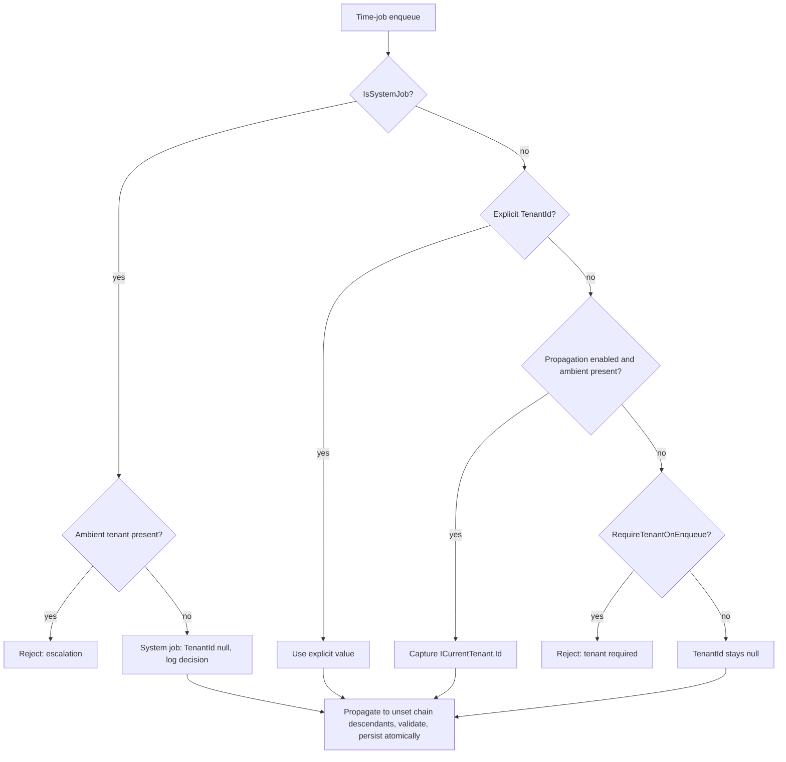
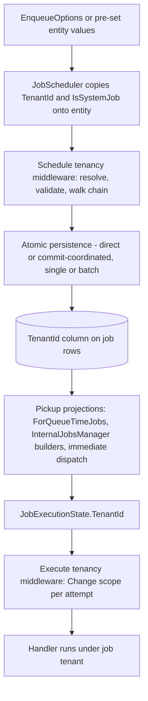
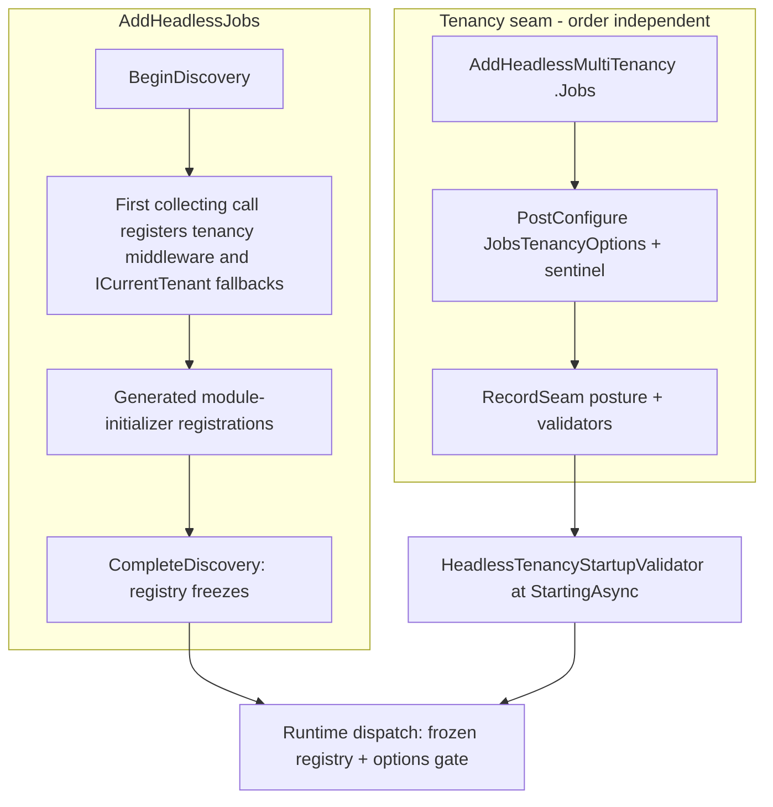

# Jobs Tenant Propagation - Plan

## Goal Capsule

- **Objective:** Propagate tenant identity through Jobs — persist a `TenantId` on job entities, capture the ambient tenant at schedule time, and restore it around every handler attempt — registered through the existing tenancy seam like Messaging.
- **Product authority:** GitHub issue #278 ("this issue body is the contract") as carried in this Product Contract; code-verified 2026-07-21.
- **Product Contract preservation:** changed — added R16, R17, AE6 and amended F1 (flow analysis found time-job chains would silently persist children with a null tenant, running them system-scope; the direct entity API had no `IsSystemJob` carrier). Outstanding Questions resolved in place into Planning Contract decisions. All other text and IDs preserved.
- **Open blockers:** None. Prerequisites #304 and #305 are merged; #270 is not a blocker.
- **Execution profile:** One feature PR from current `main`. CI gates on unit tests only — the provider integration suites (Postgres, SqlServer) must be run locally before shipping.

---

## Product Contract

### Summary

Add tenant scope to Jobs: time jobs carry a persisted, length-bounded `TenantId` resolved at schedule time (explicit value wins, otherwise ambient capture), execute middleware restores that tenant for every handler attempt, and cron stays system-scope with tenant fan-out owned by application code. Registration, strict-mode enforcement, and startup diagnostics mirror the Messaging tenancy seam.

### Problem Frame

Jobs persists no tenant identity: a handler scheduled from tenant context runs with no tenant restored, so multi-tenant applications cannot safely run tenant-scoped background work. Messaging already established the posture/validation pattern for this problem; Jobs lacks the equivalent entity field, capture point, and restore point. Downstream work (#313, #317) needs the tenant scope this issue establishes.

### Key Decisions

- **Tenant identity on time jobs; cron stays system-scope.** Cron definitions and occurrences require `TenantId = null`; a cron function needing tenant work enumerates tenants in application code and schedules one tenant-scoped time job per tenant. (session-settled: user-directed — chosen over per-tenant cron rows or expressions: keeps tenant enumeration out of the framework and cron storage single-scope.)
- **Capture at schedule time, atomic with the row write.** Explicit `TenantId` wins; otherwise schedule middleware captures `ICurrentTenant.Id` when propagation is enabled — before validation and before direct or coordinated persistence. (session-settled: user-directed — chosen over post-commit recomputation: the captured tenant is part of the same atomic row write.) Conflict note (doc review, 2026-07-21; resolved with the user 2026-07-22): explicit-wins honors an explicit tenant that differs from a present ambient tenant — the lateral tenant-to-tenant path stays open by default, matching the Messaging publish middleware and the in-process trust model (any code in the process already holds `ICurrentTenant.Change`). Resolution: the default logs a warning on the mismatch, and hosts opt into hard rejection with `RejectCrossTenantEnqueue()` on the seam (user-directed — chosen over keep-as-is and over hard-reject-by-default: guards the accident class without breaking the cross-tenant affordance or Messaging parity).
- **Strict enqueue with system-job bypass, no escalation.** `RequireTenantOnEnqueue()` rejects a tenantless time-job enqueue unless `IsSystemJob = true`; `IsSystemJob = true` is rejected when an ambient tenant exists, and the system-job decision is logged at schedule time. (session-settled: user-directed — chosen over trusting callers: prevents silent tenantless rows and tenant-to-system escalation.)
- **Execute-side restoration spans every attempt.** Execute middleware wraps each handler attempt in `ICurrentTenant.Change` with the job's persisted tenant and always disposes the scope on success or exception. (session-settled: user-directed — chosen over one-shot restoration: retries must also run under the job's tenant.)
- **Register through the tenancy seam; depend only on abstractions.** `HeadlessTenancyBuilder.Jobs(...)` exposes `PropagateTenant()` and `RequireTenantOnEnqueue()`, following the posture manifest and `IHeadlessTenancyValidator` model; the runtime middleware depends only on `Headless.Abstractions.ICurrentTenant`. (session-settled: user-directed — chosen over a Jobs-to-API dependency: mirrors the Messaging seam and keeps package layering clean.)
- **Tenancy middleware priority is `-1000`.** A `JobMiddlewarePriority.Tenancy = -1000` constant lands beside `Early = -1000`; no framework middleware registers at Early today, so ties are possible only with consumer-declared middleware and resolve deterministically by ordinal identity (`<assembly>:<fully-qualified-type>`). Relative order against consumer Early middleware is not contractual. (session-settled: user-approved — chosen over amending the issue to a value below `Early`: keep the contract value; the tie-break is deterministic and no ordering constraint exists.)

### Requirements

**Persistence and schema**

- R1. `BaseJobEntity` gains a nullable, length-bounded `TenantId`; time and cron definitions inherit it.
- R2. The time-job EF mapping adds a `(TenantId, Status, ExecutionTime)` composite index — `Status` and `ExecutionTime` exist only on time jobs.
- R3. In-memory and EF providers persist `TenantId`, with provider-conformance coverage in the Jobs EF harness.

**Scheduling behavior**

- R4. The time-job scheduler options (currently `EnqueueOptions`) gain `TenantId` and `IsSystemJob`.
- R5. Explicit `TenantId` wins; otherwise schedule middleware captures `ICurrentTenant.Id` when propagation is enabled, before validation and before persistence.
- R6. With `RequireTenantOnEnqueue()` active, a time-job enqueue with no explicit or ambient tenant is rejected unless `IsSystemJob = true`.
- R7. `IsSystemJob = true` is rejected when an ambient tenant exists; the system-job decision is logged at schedule time.
- R8. Cron definitions and occurrences remain system-scope; a tenant-scoped cron definition is rejected.
- R9. Single and batch enqueue, direct and commit-coordinated, persist the captured tenant atomically and never capture again after commit.
- R16. A time-job chain propagates the root's resolved `TenantId` to every unset descendant before persistence; a descendant's pre-set explicit value wins per node.
- R17. The direct entity API (`ITimeJobManager.AddAsync`/`AddBatchAsync`) participates in the same tenant semantics as the scheduler-options path: explicit entity `TenantId` and `IsSystemJob` are honored by capture, strict-mode validation, and the system-job bypass.

**Execution behavior**

- R10. Execute middleware restores the job's persisted tenant via `ICurrentTenant.Change` for the handler attempt and always disposes the scope on success or exception.
- R11. Tenant restoration spans every retry attempt.
- R12. Tenancy middleware is registered on both schedule and execute pipelines at the tenancy priority (see Key Decisions).

**Registration and diagnostics**

- R13. Jobs tenancy registration (`HeadlessTenancyBuilder.Jobs(...)` with `PropagateTenant()` and `RequireTenantOnEnqueue()`) is idempotent in DI.
- R14. Startup diagnostics mirror the Messaging seam: an isolated strict-mode warning, a missing-tenant-source error when propagation is enabled, and an options-clobber error.

**Documentation**

- R15. Jobs Core docs cover the cron fan-out pattern and an end-to-end typed scheduling example.

### Key Flows

- F1. Schedule-time capture
  - **Trigger:** A time-job enqueue enters the schedule pipeline.
  - **Steps:** Tenancy middleware resolves the root tenant (explicit, ambient, system, or rejection per the diagram) before validation; the generic schedule path then copies the resolved value onto unset chain descendants; persistence writes the tree with resolved tenants in the same atomic operation, on single and batch, direct and coordinated paths alike.
  - **Outcome:** Every persisted row carries its resolved tenant; nothing recaptures after commit.
  - **Covers:** R5–R9, R16, R17.
- F2. Execute-time restoration
  - **Trigger:** A claimed job attempt starts, first run or retry.
  - **Steps:** Execute middleware opens `ICurrentTenant.Change` with the tenant carried by the execution state, invokes the handler, and disposes the scope on success or exception.
  - **Outcome:** Every attempt runs under the job's tenant; no scope leaks between attempts.
  - **Covers:** R10–R12.

### Acceptance Examples

- AE1. **Covers R5, R9.** Given propagation enabled and ambient tenant `t1`, when a time job is enqueued with no explicit tenant, then the persisted row carries `t1` in the same write that created it.
- AE2. **Covers R6.** Given `RequireTenantOnEnqueue()` and no explicit or ambient tenant and `IsSystemJob = false`, when a time job is enqueued, then the enqueue is rejected.
- AE3. **Covers R7.** Given ambient tenant `t1`, when a time job is enqueued with `IsSystemJob = true`, then the enqueue is rejected and no escalation occurs.
- AE4. **Covers R8.** Given a cron definition carrying a tenant, when it is scheduled, then it is rejected; the supported path is application code enumerating tenants and scheduling tenant-scoped time jobs.
- AE5. **Covers R10, R11.** Given a persisted job with `TenantId = t1` whose first attempt fails, when the job retries, then each attempt runs under `t1` and the tenant scope is disposed after each attempt.
- AE6. **Covers R16.** Given ambient tenant `t1` and a two-level time-job chain with no explicit tenants, when it is enqueued with propagation enabled, then the root and every descendant persist `t1` and each descendant's handler observes `t1`; a descendant with a pre-set explicit `t2` keeps `t2`.

### Scope Boundaries

- Framework tenant enumeration, `ITenantStore`, per-tenant cron rows, and per-tenant cron expressions — application code owns fan-out.
- Tenant authorization for dashboard routes (#317).
- Bulk cancellation, idempotency scope, and correlation APIs.
- Cron occurrence projections stay untouched — cron is system-scope by contract, so no tenant-tagged cron audit.
- `specs/headless-jobs-v2.md` is not design authority; issue #278's body is the contract.

### Dependencies / Assumptions

- #304 and #305 are merged; verification confirmed the middleware interfaces, `EnqueueOptions`, and pipeline-before-persist ordering in all four enqueue paths.
- The Jobs EF harness covers both providers: `tests/Headless.Jobs.EntityFramework.PostgreSql.Tests.Integration` and `tests/Headless.Jobs.EntityFramework.SqlServer.Tests.Integration` exist, each with a concrete `IJobsCoordinationFixture`.
- #319 must later compose through the same execute pipeline without changing tenant ordering.
- Delivery: one reviewable feature PR carrying schema, middleware, tests, and docs, stacked from current `main`. EF is model-only (no migration files), so no preparatory migration stack is needed.

### Sources / Research

- GitHub issue #278 — the contract, including its 2026-06-08 code-verification comment.
- Code anchors verified 2026-07-21:
  - `src/Headless.Jobs.Abstractions/Entities/` — `BaseJobEntity` (no tenant field today), `TimeJobEntity` (`Status`, `ExecutionTime`, `Children`), `CronJobEntity` (neither).
  - `src/Headless.Jobs.Core/JobMiddleware.cs` — middleware interfaces, `JobMiddlewarePriority` (`Early = -1000`), registry ordering `OrderBy(Priority).ThenBy(Identity, Ordinal)` (line 252), `ResetUnderProviderLock` test hook.
  - `src/Headless.Jobs.Core/JobFunctionProvider.cs` — registry freeze: `BeginDiscovery` → options callback → `CompleteDiscovery` → `FreezeUnderProviderLock` inside `AddHeadlessJobs` (`src/Headless.Jobs.Core/DependencyInjection/SetupJobs.cs`).
  - `src/Headless.Jobs.SourceGenerator/Generators/MiddlewareRegistrationCollector.cs` — generator scans only the consuming assembly's middleware attributes (line 27); identity = `{assembly}:{full-type}` (line 179).
  - `src/Headless.Jobs.Core/JobScheduler.cs` — options→entity copy sites (`_ScheduleTimeAsync`, `_ScheduleRecurringAsync`).
  - `src/Headless.Jobs.Core/Managers/JobsManager.cs` — schedule pipeline before persistence in all four enqueue paths; `_BuildContextFromNonGeneric` immediate-dispatch projection.
  - `src/Headless.Jobs.Core/Managers/InternalJobsManager.cs` — execution-state builder sites (~6) that must carry `TenantId`.
  - `src/Headless.Jobs.Core/JobsExecutionTaskHandler.cs` — per-attempt pipeline dispatch inside the Polly retry loop.
  - `src/Headless.Jobs.EntityFramework/Infrastructure/MappingExtensions.cs` — `ForQueueTimeJobs` pickup projection, three nesting levels.
  - `src/Headless.Jobs.EntityFramework/Configurations/TimeJobConfigurations.cs` — existing `(Status, ExecutionTime)` index to sit beside.
  - `src/Headless.Messaging.Core/SetupMessagingTenancy.cs` and `src/Headless.Messaging.Core/MultiTenancy/TenantPropagation{Publish,Consume}Middleware.cs` — the seam and middleware template, including sentinel idempotency and the three validators.
  - `src/Headless.MultiTenancy/` — `HeadlessTenancyBuilder.RecordSeam`, strengthen-only `TenantPostureManifest`, `IHeadlessTenancyValidator`, `HeadlessTenancyStartupValidator` (`IHostedLifecycleService.StartingAsync`).
  - `src/Headless.Core/Abstractions/ICurrentTenant.cs` — `IDisposable Change(string? id, string? name = null)`; `MissingTenantContextException` in the same namespace.
  - `src/Headless.Messaging.Abstractions/MessageOptions.cs` — `TenantIdMaxLength = 200` precedent.
- Institutional learnings (docs/solutions/):
  - `logic-errors/asynclocal-ambient-scope-stranded-across-await.md` — AsyncLocal set must happen in the frame that awaits the handler; a happy-path-only test cannot distinguish correct scoping from a stranded no-op.
  - `tooling-decisions/jobs-middleware-cross-assembly-discovery-2026-07-14.md` — priority tie-break contract; ties are deterministic-but-arbitrary by identity string.
  - `architecture-patterns/startup-validation-gate-two-tier-mode-and-env-defaults.md` — keep tenancy validators Tier-1 (in-memory, always strict).

---

## Planning Contract

### Key Technical Decisions

- KTD1. **Always-registered, options-gated tenancy middleware.** `AddHeadlessJobs` registers the schedule and execute tenancy middleware into `JobMiddlewareRegistry` during its discovery window and `TryAdd`s their types in DI; the middleware no-ops unless `JobsTenancyOptions` enables behavior. Forced by the registry freezing at `CompleteDiscovery` and the source generator scanning only the consuming assembly — a runtime `.Jobs()` builder cannot touch the frozen registry, so it only flips options, records posture, and registers validators, making it order-independent with `AddHeadlessJobs`. This diverges from Messaging's runtime `AddBusConsumeMiddleware` mechanism while preserving the identical user-facing seam. Only the process-global registry insertion is gated, behind a process-global one-shot guard — Participant status alone does not exclude overlapping host configuration, and double insertion would dispatch the middleware twice; a post-freeze call skips insertion rather than throwing. The per-host DI registrations — middleware types via `TryAdd`, plus the tenant-context primitives (`ICurrentTenantAccessor` via `TryAddSingleton`, `ICurrentTenant` via the `AddOrReplaceFallbackSingleton<ICurrentTenant, NullCurrentTenant, CurrentTenant>` pattern from `src/Headless.Messaging.Core/Setup.cs`) — run on every `AddHeadlessJobs` call, so a second host built after the freeze (ExistingCatalog path) still resolves and dispatches tenancy middleware. The hand-written dispatch resolves via null-tolerant `GetService` so `JobsManager`'s `EmptyServiceProvider` test path stays a no-op — a test-path concession, never the mechanism by which a real host skips tenancy. (Instantiates the seam Key Decision; session-settled: user-directed — chosen over a Jobs-to-API dependency: mirrors the Messaging seam surface.)
- KTD2. **Carriers on the entity and options.** `BaseJobEntity` gains persisted `TenantId` (max length via `JobsTenancyOptions.TenantIdMaxLength = 200`, mirroring `MessageOptions`) and transient, unmapped `IsSystemJob` — the entity properties give the direct entity API parity (R17), since `EnqueueOptions` exists only on the `IJobScheduler` path. `EnqueueOptions` gains both; `JobScheduler._ScheduleTimeAsync` copies them onto the entity beside the existing `Retries`/`Description` copies. `RecurringJobOptions` is unchanged. (Length: session-settled: user-approved — chosen over a new bound: mirror Messaging's 200.)
- KTD3. **Execution-side carrier is `JobExecutionState.TenantId`.** At execute time no entity exists; the state must carry the tenant through every projection site — `ForQueueTimeJobs` (three nesting levels), the `InternalJobsManager` state builders, and `JobsManager._BuildContextFromNonGeneric` — or pickup after restart silently drops it (the RetryCount-class bug). The execute middleware wraps `next()` in `using var scope = currentTenant.Change(state.TenantId)` inside its own `InvokeAsync` frame, which satisfies the AsyncLocal flow-downward constraint; per-attempt coverage falls out of Polly re-dispatching the execute pipeline each attempt.
- KTD4. **`JobMiddlewarePriority.Tenancy = -1000`** added beside `Early`, used by the `SetupJobs` registration. (session-settled: user-approved — chosen over a below-`Early` value: no framework middleware registers at Early today and the ordinal-identity tie-break is deterministic.)
- KTD5. **Rejection semantics.** Missing tenant under strict mode throws `MissingTenantContextException` (`Headless.Abstractions`, Messaging parity). Contradictions — `IsSystemJob` with an ambient tenant, `IsSystemJob` with an explicit `TenantId`, a tenant-scoped cron definition — throw `JobValidatorException` from the schedule middleware. Over-length values fail closed: a present-but-over-length ambient tenant rejects the enqueue exactly like an over-length explicit value, and the diagnostic logs only the length, never the value — dropping ambient to null would silently downgrade a tenant job to system scope in propagate-only mode. Tenant identifiers must be non-whitespace: blank values are rejected wherever a value is supplied (roots and pre-set descendants), so strict mode cannot be satisfied by a nominally-present blank tenant. Structural validation — cron-tenant rejection, the `IsSystemJob` contradictions, length and blank bounds on explicitly supplied values — runs whenever the middleware dispatches, independent of options; only ambient capture (`PropagateTenant`) and missing-tenant rejection (`RequireTenantOnEnqueue`) are options-gated, keeping R7/R8 unconditional.
- KTD6. **Chain propagation is a generic tree walk in `JobsManager`, not the middleware.** `Children` exists only on the generic `TimeJobEntity<TTicker>` and is unreachable from the middleware's `BaseJobEntity`-typed context (a cast breaks for custom `TTimeJob` types), so the middleware resolves and validates the root only. `JobsManager._AddTimeJobAsync`/`_AddTimeJobsBatchAsync` extend their existing `_StampTimeJobTree`-shaped pass, after the pipeline returns and before persistence, to apply the root's resolution rules per node: an unset non-system descendant inherits the root's resolved tenant, a pre-set explicit value wins and is validated (length, non-blank), and a descendant's `IsSystemJob = true` is honored or rejected under the same R7 rules as the root — rejected when an ambient tenant is present, otherwise the node stays tenantless and the decision is logged. Without this, chain descendants persist `TenantId = null` and run system-scope — a silent security divergence.
- KTD7. **Seam and validators.** `SetupJobsTenancy.cs` in `src/Headless.Jobs.Core` (family-root namespace `Headless.Jobs`) mirrors `SetupMessagingTenancy.cs`: `HeadlessJobsTenancyBuilder`, `Seam = "Jobs"`, sentinel-guarded `PostConfigure<JobsTenancyOptions>` idempotency, `RecordSeam` (Propagating / Enforcing), and three `TryAddEnumerable` validators with `HEADLESS_TENANCY_JOBS_*` codes (isolated strict-mode warning, propagation-null-current-tenant error, require-tenant-disabled clobber error). Validators stay Tier-1: in-memory checks only, no I/O, always strict. Requires a new `Headless.Jobs.Core` → `Headless.MultiTenancy` ProjectReference (parity with `Headless.Messaging.Core`).

### Assumptions

Pipeline-resolved defaults, recorded here because no interactive confirmation was possible:

- `IsSystemJob` is transient (never persisted): it is a schedule-time authorization concept with no execution-time meaning.
- Chain propagation (R16) and direct-entity-API parity (R17) were added to the Product Contract without user confirmation — both close code-confirmed gaps consistent with the no-escalation intent rather than changing product direction.
- `IsSystemJob = true` combined with an explicit `TenantId` is rejected as contradictory (the issue named only the ambient case).
- Cron pickup projections do not carry `TenantId` (always null by contract).
- Explicit `TenantId` is honored even when it differs from a present ambient tenant — Messaging parity, and in-process code already holds `ICurrentTenant.Change`, so explicit values add no new escalation vector. Security review flagged this lateral path; rejecting the mismatch would be a product-posture change to raise with the user, not a planning default.

### High-Level Technical Design

Tenant identity flow, schedule to execute:

Registration timing — why the middleware registers in `AddHeadlessJobs`, not the seam:

### Sequencing

U1 first (model surface). U2 and U3 build on U1 and are file-disjoint except `src/Headless.Jobs.Core/DependencyInjection/SetupJobs.cs` — land the schedule and execute registration edits together. U4 needs U1 only. U5 needs U1 only (it flips options and registers validators; it never touches the middleware types) and can run parallel with U2–U4. U6 needs U2–U5. U7 last (final API names).

---

## Implementation Units

### U1. Tenant carriers on entities, options, and execution state

- **Goal:** Add the model surface every other unit builds on.
- **Requirements:** R1, R4, R17 (carrier part).
- **Dependencies:** None.
- **Files:** `src/Headless.Jobs.Abstractions/Entities/BaseEntity/BaseJobEntity.cs`, `src/Headless.Jobs.Abstractions/Models/EnqueueOptions.cs`, `src/Headless.Jobs.Abstractions/Models/JobExecutionState.cs`, new `src/Headless.Jobs.Abstractions/Models/JobsTenancyOptions.cs`.
- **Approach:** Nullable `TenantId` and transient `IsSystemJob` on `BaseJobEntity`; `TenantId`/`IsSystemJob` on `EnqueueOptions`; `TenantId` on `JobExecutionState`; `JobsTenancyOptions` with `PropagateTenant`, `TenantContextRequired`, and `public const int TenantIdMaxLength = 200`.
- **Test scenarios:** Test expectation: none — pure model surface; behavior is exercised by U2/U3/U6 suites.
- **Verification:** Solution builds; no public-API analyzer warnings.

### U2. Schedule-side capture, validation, and registration

- **Goal:** Resolve, validate, and stamp the tenant on every enqueue path before persistence.
- **Requirements:** R4–R9, R12, R16, R17. Covers AE1–AE4, AE6 (unit-level), F1.
- **Dependencies:** U1.
- **Files:** `src/Headless.Jobs.Core/JobScheduler.cs`, new `src/Headless.Jobs.Core/MultiTenancy/TenantPropagationScheduleMiddleware.cs`, `src/Headless.Jobs.Core/JobMiddleware.cs` (`Tenancy` constant), `src/Headless.Jobs.Core/DependencyInjection/SetupJobs.cs` (registry + DI registration), tests in `tests/Headless.Jobs.Composition.Tests.Unit/`.
- **Approach:** Middleware implements `IJobScheduleMiddleware`, reads `JobsTenancyOptions`, applies the Product Contract resolution diagram to the root entity, length-guards per KTD5 (fail closed), and no-ops when tenancy is disabled; the descendant walk lives in `JobsManager` per KTD6. `JobScheduler` copies `TenantId`/`IsSystemJob` from options beside the existing copies. Registry insertion happens inside `AddHeadlessJobs` behind a process-global one-shot guard; the per-host DI registrations (middleware types, `ICurrentTenant` fallback primitives) run on every call, per KTD1. Structural validation runs regardless of options; capture and strict mode are options-gated, per KTD5.
- **Patterns to follow:** `src/Headless.Messaging.Core/MultiTenancy/TenantPropagationPublishMiddleware.cs` (capture + length guard + log-drop); `_StampTimeJobTree` in `src/Headless.Jobs.Core/Managers/JobsManager.cs` (tree walk).
- **Test scenarios:** Explicit tenant wins over ambient. Covers AE1: ambient captured when explicit absent. Propagation disabled → no ambient capture; strict disabled → no missing-tenant rejection; structural validation of explicitly supplied values still applies (tenant-scoped cron, contradictions, over-length, blank). Covers AE2: strict mode + no tenant + not system → `MissingTenantContextException`. System job bypass persists null tenant and logs. Covers AE3: ambient + `IsSystemJob` → rejected. Explicit `TenantId` + `IsSystemJob` → rejected. Covers AE4: cron entity with tenant → rejected; cron never receives ambient capture. Covers AE6: two-level chain inherits root tenant via the `JobsManager` walk; explicit child value kept. Over-length ambient or explicit → rejected; diagnostic logs length only. Batch path: per-item resolution. Middleware registered at `Tenancy` priority exactly once per process (one-shot guard; overlapping host configuration does not double-register); a second `AddHeadlessJobs` in the same process (ExistingCatalog path) does not throw AND that second host still dispatches tenancy middleware (per-host DI intact). Whitespace-only explicit or ambient tenant → rejected wherever a value is supplied. Chain descendant with `IsSystemJob` under an ambient tenant → rejected; without ambient → stays tenantless and logged. A host with no tenancy seam and no `ICurrentTenant` registration enqueues and executes without a resolution failure. Unit-path note: `JobsManager` built without `IServiceScopeFactory` dispatches with `EmptyServiceProvider` — supply options/tenant explicitly in tests; the dispatch no-ops when the middleware resolves null (tests run in the existing `ResetUnderProviderLock` non-parallel collection).
- **Verification:** Unit suite green in `Headless.Jobs.Composition.Tests.Unit`; `dotnet build -c Release` clean on changed projects.

### U3. Execute-side restoration and state threading

- **Goal:** Every attempt runs under the job's persisted tenant; nothing leaks between attempts.
- **Requirements:** R10–R12. Covers AE5, F2.
- **Dependencies:** U1.
- **Files:** New `src/Headless.Jobs.Core/MultiTenancy/TenantRestoreExecuteMiddleware.cs`, `src/Headless.Jobs.Core/Managers/InternalJobsManager.cs` (all state-builder sites), `src/Headless.Jobs.Core/Managers/JobsManager.cs` (`_BuildContextFromNonGeneric`), `src/Headless.Jobs.Core/DependencyInjection/SetupJobs.cs`, tests in `tests/Headless.Jobs.Composition.Tests.Unit/`.
- **Approach:** Thread `TenantId` into `JobExecutionState` at every builder site (carry it exactly where `RetryCount` is carried). Middleware wraps `next()` in `using var scope = currentTenant.Change(state.TenantId)` inside `InvokeAsync`; no-ops when propagation is disabled. The hand-written execute dispatch resolves via null-tolerant `GetService` (KTD1).
- **Execution note:** The AsyncLocal stranding learning applies — write the negative tests (ambient reverted after scope disposal; each retry attempt freshly scoped) alongside the happy path from the start; a happy-path-only test cannot distinguish correct scoping from a stranded no-op.
- **Test scenarios:** Handler observes the persisted tenant. Covers AE5: each retry attempt re-scoped; no leak from a prior attempt. Ambient reverted after the attempt completes, fails, or cancels. Null `TenantId` → attempt runs system-scope. Immediate-dispatch path carries the tenant.
- **Verification:** Unit suite green; negative scoping tests present and passing.

### U4. Provider persistence: EF mapping, index, in-memory round-trip

- **Goal:** `TenantId` persists and survives every storage projection in both provider families.
- **Requirements:** R1–R3, R9 (persistence half).
- **Dependencies:** U1.
- **Files:** `src/Headless.Jobs.EntityFramework/Configurations/TimeJobConfigurations.cs` (column + `(TenantId, Status, ExecutionTime)` index beside the existing one; ignore `IsSystemJob`), `src/Headless.Jobs.EntityFramework/Configurations/` cron configuration (nullable column, no index, ignore `IsSystemJob`), `src/Headless.Jobs.EntityFramework/Infrastructure/MappingExtensions.cs` (`ForQueueTimeJobs`, all three nesting levels), `src/Headless.Jobs.Core/Provider/JobsInMemoryPersistenceProvider.cs`.
- **Approach:** Model-only change (no migration files exist for Jobs EF); `HasMaxLength(JobsTenancyOptions.TenantIdMaxLength)`. Cron pickup projections stay untouched per Scope Boundaries. Note: pickup projections materialize three chain levels today (root/child/grandchild) — deeper descendants already lose projected fields, a pre-existing depth limit this plan inherits, not a tenant-specific regression.
- **Test scenarios:** In-memory round-trip of `TenantId` including the timed-out re-queue path. EF model snapshot builds for both providers. (Cross-provider round-trip assertions land in U6.)
- **Verification:** Unit + existing EF model tests green.

### U5. Tenancy seam, options wiring, startup validators

- **Goal:** `AddHeadlessMultiTenancy(...).Jobs(j => j.PropagateTenant().RequireTenantOnEnqueue())` works idempotently with posture and diagnostics.
- **Requirements:** R13, R14.
- **Dependencies:** U1.
- **Files:** New `src/Headless.Jobs.Core/SetupJobsTenancy.cs` (namespace `Headless.Jobs`), `src/Headless.Jobs.Core/Headless.Jobs.Core.csproj` (add `Headless.MultiTenancy` ProjectReference), seam unit tests beside the Messaging tenancy seam tests' location.
- **Approach:** Mirror `SetupMessagingTenancy.cs` per KTD7: builder, seam/capability consts, sentinel idempotency, `RecordSeam`, three validators with `HEADLESS_TENANCY_JOBS_*` codes. Keep every validator I/O-free (Tier-1). Verify during implementation how root `AddHeadlessMultiTenancy` registration interacts with the Jobs `ICurrentTenant` fallback from KTD1 — enabling propagation must resolve a live accessor-backed tenant, not `NullCurrentTenant`.
- **Patterns to follow:** `src/Headless.Messaging.Core/SetupMessagingTenancy.cs` — read it directly; it is the spec.
- **Test scenarios:** Double registration is idempotent (sentinel). `PropagateTenant()` records Propagating posture; `RequireTenantOnEnqueue()` records Enforcing. Isolated strict-mode warning fires when strict is on without propagation. Propagation-without-`ICurrentTenant` produces the error diagnostic. Options-clobber (a later `Configure` disabling strict) produces the error diagnostic.
- **Verification:** Seam unit tests green; startup validation fires through the existing `HeadlessTenancyStartupValidator`.

### U6. Provider conformance and integration coverage

- **Goal:** Cross-provider proof that capture is atomic and `TenantId` survives pickup on Postgres and SqlServer.
- **Requirements:** R3, R9. Covers AE1, AE6 (integration-grade).
- **Dependencies:** U2–U5.
- **Files:** `tests/Headless.Jobs.EntityFramework.Tests.Harness/` (extend `JobsEnqueueAtomicityConformanceTests`; new tenancy conformance tests), `tests/Headless.Jobs.EntityFramework.PostgreSql.Tests.Integration/`, `tests/Headless.Jobs.EntityFramework.SqlServer.Tests.Integration/`.
- **Approach:** Follow the harness's interface + extensions shape (`IJobsCoordinationFixture`); do not fork per-provider fixtures.
- **Test scenarios:** Single and batch × direct and commit-coordinated enqueue persists the captured tenant in the same transaction. Pickup after lease timeout re-materializes `TenantId` (RetryCount-class regression guard). Chain rows persist per-node tenants. Rollback of a coordinated enqueue leaves no row (tenant capture has no post-commit step to misfire).
- **Execution note:** CI gates on unit tests only — run both provider integration suites locally (Docker) before the PR; any added DateTime round-trip asserts use `BeCloseTo(1µs)` for Postgres.
- **Verification:** Both provider integration suites green locally.

### U7. Documentation

- **Goal:** Consumers can adopt Jobs tenancy and the cron fan-out pattern from the docs alone.
- **Requirements:** R15.
- **Dependencies:** U2–U5 (final API names).
- **Files:** `docs/llms/jobs.md`, `docs/llms/multi-tenancy.md` (Jobs seam section beside Messaging's), `src/Headless.Jobs.Core/README.md`.
- **Approach:** Follow `docs/authoring/AUTHORING.md`. The fan-out example must pass an explicit per-tenant `TenantId` — cron handlers run system-scope, so ambient capture cannot apply inside them; call that footgun out.
- **Test scenarios:** Test expectation: none — docs-only.
- **Verification:** Doc drift checks from AUTHORING.md; example compiles as written (typed example).

---

## Verification Contract

| Gate | Command | Applies to |
|---|---|---|
| Build (clean, analyzer-true) | `dotnet build -c Release -v:minimal` on changed projects, then `make build` | All units |
| Unit tests | `make test-project TEST_PROJECT=tests/Headless.Jobs.Composition.Tests.Unit/Headless.Jobs.Composition.Tests.Unit.csproj` | U1–U5 |
| Provider integration (local, Docker) | `make test-project TEST_PROJECT=tests/Headless.Jobs.EntityFramework.PostgreSql.Tests.Integration/...csproj` and the SqlServer twin | U4, U6 |
| Analyzers | `make quality-analyzers` | Before PR |
| Format | `make format` | Before PR |

A green MTP test run is not a clean build — run the Release build on changed projects explicitly (repo learning, 2026-07-10).

---

## Definition of Done

- R1–R17 satisfied; AE1–AE6 each covered by at least one passing test.
- All four enqueue paths persist the captured tenant atomically; pickup projections carry `TenantId` (no RetryCount-class drop).
- Negative AsyncLocal scoping tests exist and pass (scope reverted after attempt; per-retry re-scope).
- Startup diagnostics fire in the three misconfiguration cases; seam registration is idempotent.
- Both provider integration suites green locally; unit suites green in CI.
- `make quality-analyzers` and `make format-check` clean.
- Docs updated per U7 with the explicit-tenant fan-out example.
- No dead or experimental code from abandoned approaches remains in the diff.
