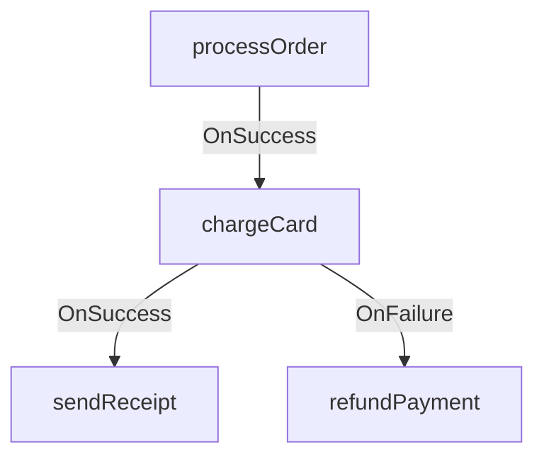
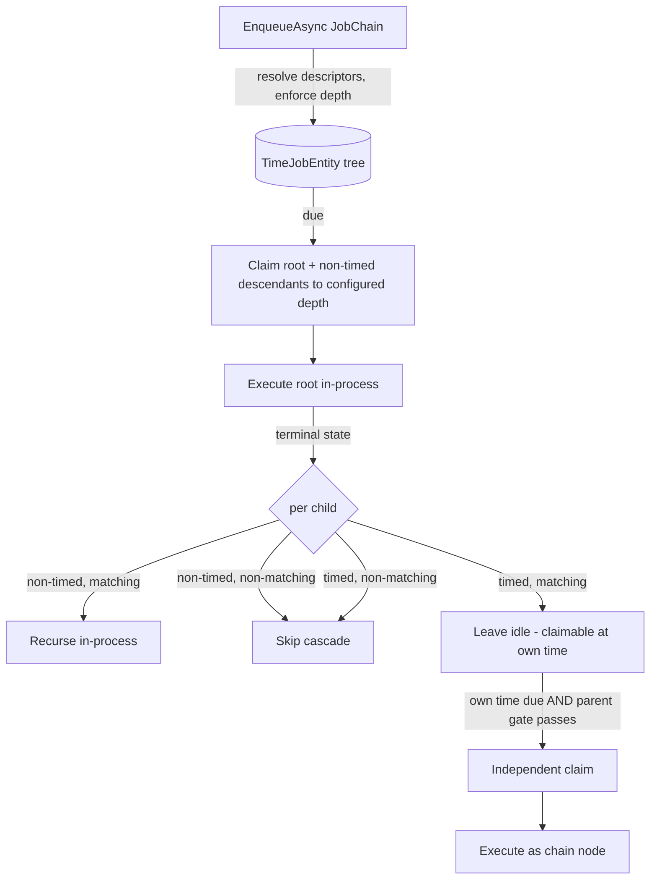
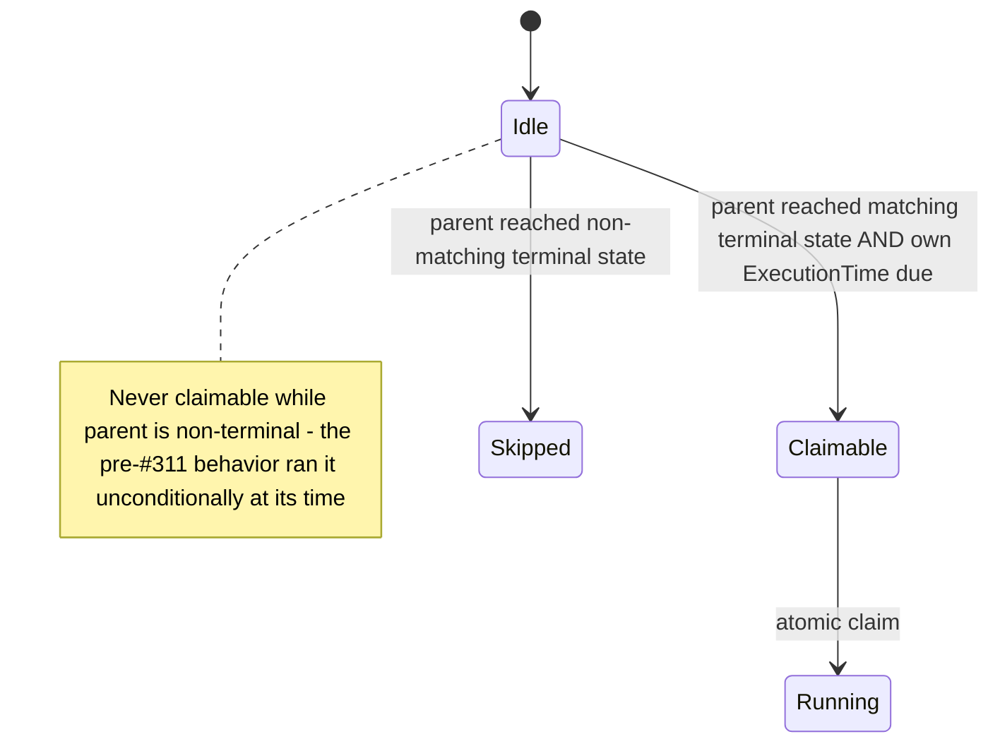

# Typed Job Chains - Plan

## Goal Capsule

- **Objective:** Replace `FluentChainJobBuilder` with a public typed `JobChain` authoring model built over the generated function descriptors from #304, persisted atomically onto the existing chain columns, with runtime claim/hydration extended to the configured chain depth and timed descendants gated on their parent's terminal state.
- **Product authority:** GitHub issue #311 (locked design, acceptance criteria, non-goals), refined by the Product Contract below; the Planning Contract records where implementation evidence adjusted the issue's letter (depth-limit enforcement point) while preserving its intent.
- **Stop conditions:** Surface as a blocker (do not improvise) if conformance work shows the in-process recursion model cannot satisfy R12/R13 without per-node independent pickup, or if extending the native claim SQL breaks existing coordination conformance suites in a way that requires schema changes.
- **Execution profile:** Single PR carrying abstraction, scheduler, runtime, removal, conformance tests, and docs — no half-migrated public surface. Integration suites run locally (CI gates unit tests only).
- **Tail ownership:** The invoking pipeline owns simplify/review/ship after implementation.

---

## Product Contract

### Summary

A public `JobChain` authoring model in `Headless.Jobs.Abstractions` builds conditional sequential job trees from generated function descriptors and enqueues them atomically through `IJobScheduler`. `Then` adds a single on-success child and `Catch` a single on-failure child; chains flatten onto the existing `TimeJobEntity` parent/child/`RunCondition` persistence shape. `FluentChainJobBuilder` is removed in the same slice.

### Problem Frame

`FluentChainJobBuilder<TTimeJob>` exposes persisted function names and the entity tree directly, and caps chains at two levels with five slots per level. It predates the descriptor-backed scheduler (#304), which made generated `JobFunctionDescriptor`s the durable function identity — so the old authoring surface no longer matches how jobs are identified or enqueued. Separately, `RunCondition.InProgress` starts a child concurrently with its parent, which contradicts the sequential-continuation purpose of a chain.

### Key Decisions

- **Descriptor-backed steps.** Payload steps resolve through #304's generated payload-to-descriptor index; requestless steps take an explicit generated descriptor. (session-settled: user-directed — chosen over handler-type generics such as `IJob<TArgs>`/`ICronJob`: chains must reuse #304's durable generated function identity.)
- **Sequential conditional tree only.** The builder authors `OnSuccess` and `OnFailure` edges and nothing else. (session-settled: user-directed — chosen over exposing arbitrary `RunCondition` values or parallel fan-out: broader workflow semantics require a separate design.)
- **Flatten onto the existing persistence shape.** Chains persist as `TimeJobEntity.Children`, `ParentId`, and `RunCondition` rows. (session-settled: user-directed — chosen over a second workflow schema: one persistence shape for all chained jobs.)
- **`Catch` is pure `OnFailure` sugar.** It adds no catch marker or ordering state and does not consume or rewrite the parent's failure; a failing catch step is an ordinary failed job whose own continuations follow the same rules. (session-settled: user-directed — chosen over catch consumption/recovery semantics: no extra state.)
- **Greenfield removal of `FluentChainJobBuilder`.** The old builder and its extensions go away in the same slice, with migration documentation. (session-settled: user-directed — chosen over a compatibility layer: breaking replacement in a pre-v1 framework.)
- **Per-step options follow #304's actual surface.** Steps carry a description, retries, retry intervals, node-death policy, and an explicit execution time; priority is generated from `[JobFunction]` metadata and stays descriptor-canonical. (session-settled: user-approved — chosen over the issue's illustrative per-step priority: #304 documents priority as intentionally not a per-enqueue option, and a step cannot override canonical identity.)
- **Depth limit is a global Jobs option.** The configurable maximum chain depth lives on the global Jobs options surface, not as a per-chain `Build()` parameter. (session-settled: user-approved — chosen over per-chain configuration: one policy knob.) Conflict call-out: the issue says the limit is enforced "during `Build()`", but `Build()` lives in `Headless.Jobs.Abstractions` with no access to DI-configured options; KTD4 moves configured-limit enforcement to `EnqueueAsync` (still pre-persistence, configured limit named in the error) and keeps a structural bound in `Build()`.
- **Non-authorable `RunCondition` values survive unchanged.** The enum keeps all members, and runtime handling of persisted non-authorable values, including `InProgress`, is not cleaned up here. (session-settled: user-approved — chosen over dead-code removal: persisted data and broader-semantics designs may still use those values.) Chain runtime traversal and descendant time gating are, by contrast, in scope — see R12-R13.

### Requirements

**Authoring surface**

- R1. A public `JobChain` authoring model lives in `Headless.Jobs.Abstractions`; public chain types expose no `TJob`, `IJob<TArgs>`, or `ICronJob` contract.
- R2. A payload-bearing step resolves exactly one generated function descriptor through the payload-to-descriptor index; a requestless step takes an explicit generated `JobFunctionDescriptor`.
- R3. `Then(...)` adds at most one on-success child to a node, `Catch(...)` at most one on-failure child; the returned node handle extends that branch, and the root owns `Build()`.
- R4. Any node, including the root, may carry both a success branch and a failure branch; the builder offers no other run conditions and no parallel fan-out. A root-only chain (no children) is valid.
- R5. Each step may carry a description, retries, retry intervals, node-death policy, and an explicit execution time.
- R6. A step cannot override the descriptor's canonical identity — function name, request type, or generated priority.

**Validation and diagnostics**

- R7. A second success edge or second failure edge on the same node fails with a clear `InvalidOperationException`.
- R8. The configured maximum chain depth (a global Jobs option, default 10) is enforced before persistence, naming the configured limit in the error; `Build()` additionally enforces a structural depth bound, which is also the configuration ceiling for the option. Catch branches count toward the same depth.
- R9. A descriptor/payload mismatch or an unmapped payload fails before persistence with actionable diagnostics; every node in the chain is validated, not only the root.

**Persistence**

- R10. `IJobScheduler.EnqueueAsync(JobChain, CancellationToken)` persists the root and every descendant atomically; no partial chain is visible after a failure. `Build()` returns an immutable chain; each `EnqueueAsync` call materializes fresh entities, so re-enqueueing the same built chain yields independent trees.
- R11. Chains flatten onto the existing `TimeJobEntity.Children`/`ParentId`/`RunCondition` shape — `Then` persists `RunCondition.OnSuccess`, `Catch` persists `RunCondition.OnFailure`, and no additional chain state is introduced.

Each authored edge becomes one child row keyed by `ParentId` and `RunCondition`:

**Runtime**

- R12. Every provider's claim, hydration, and continuation path executes persisted chains to the configured depth limit; descendants beyond the grandchild level are claimed and run.
- R13. A descendant with an explicit execution time becomes eligible at the later of its parent's matching terminal state and its own execution time — it never starts before its parent completes and is never failed or skipped because its time arrived first. When its parent reaches a non-matching terminal state, the timed descendant is skipped (with its subtree), mirroring the non-timed skip cascade.

**Replacement and documentation**

- R14. `FluentChainJobBuilder` and its extension holders are removed in the same slice; the two unit-test files that consume it are migrated to the typed builder.
- R15. Jobs documentation (`docs/llms/jobs.md` and affected package READMEs) shows the typed replacement, including migration guidance from the old builder.

**Conformance**

- R16. Provider-conformance tests cover the runtime chain behaviors: success continuation, failure continuation, catch-step failure, deep-chain execution beyond the grandchild level, timed-descendant gating (including non-matching-terminal skip), and atomic rollback. Validation errors — duplicate edges, the depth limit, descriptor-resolution failures — are proven by unit tests (U1-U2).

### Key Flows

- F1. Author and enqueue a chain
  - **Trigger:** Application code composes a multi-step workflow (for example order processing).
  - **Steps:** Start a chain from a payload or an explicit descriptor; extend node handles with `Then`/`Catch`; `Build()` validates edge uniqueness and the structural bound; `EnqueueAsync` resolves every node's descriptor, enforces the configured depth, and persists the whole tree atomically.
  - **Outcome:** The root runs; each child becomes eligible only when its parent reaches the matching terminal state.
  - **Covers:** R2, R3, R8, R9, R10.

Continuation eligibility extends the existing `OnSuccess`/`OnFailure` runtime behavior to the full configured depth and to timed descendants (R12-R13); no new user-facing flow is added.

### Acceptance Examples

- AE1. **Covers R3, R11.** Given `root.Then(a)` and `root.Catch(b)`, when the chain is enqueued and the root succeeds, then `a` becomes eligible and `b` never runs; `a` is persisted with `OnSuccess` and `b` with `OnFailure`.
- AE2. **Covers R4 and the `Catch` decision.** Given `charge.Catch(refund)` where `refund` has its own `Then(notify)`, when `charge` fails and `refund` succeeds, then `notify` becomes eligible; when `refund` fails, it is an ordinary failed job and `charge`'s failure state is unchanged.
- AE3. **Covers R7.** Given `root.Then(a)`, when `root.Then(b)` is called, then an `InvalidOperationException` reports a duplicate success edge.
- AE4. **Covers R8.** Given a chain 11 nodes deep with the default limit, when it is enqueued, then the error names the configured limit of 10.
- AE5. **Covers R9.** Given a payload type with no generated function mapping, when the chain is enqueued, then it fails before persistence with the unmapped-payload diagnostic.
- AE6. **Covers R10.** Given a chain whose persistence fails partway, when `EnqueueAsync` throws, then no job in the chain is visible in the store.
- AE7. **Covers R12.** Given a linear five-node chain, when each node succeeds, then every descendant down to the fifth node executes in order.
- AE8. **Covers R13.** Given `charge.Then(sendReceipt)` with `sendReceipt` scheduled at a future time, when `charge` succeeds before that time, then `sendReceipt` runs at its scheduled time; when that time passes while `charge` is still running, `sendReceipt` waits for `charge` to succeed.
- AE9. **Covers R13.** Given `charge.Then(sendReceipt)` with `sendReceipt` scheduled at a future time, when `charge` fails, then `sendReceipt` and its subtree are marked skipped and never run.

### Scope Boundaries

**Deferred for later**

- Parallel fan-out/fan-in, DAG joins, and compensation orchestration — a separate workflow design.
- Authoring of broader `RunCondition` values (`InProgress`, `OnCancelled`, `OnFailureOrCancelled`, `OnAnyCompletedStatus`).
- Whole-chain cancellation as a unit — #314 cancellation stays per-node; cancelling a root applies the existing cancelled-parent run-condition handling to its children.
- Per-node independent pickup for non-timed descendants (crash-recovery hardening of the in-process execution model) — see the Risks entry on mid-chain crash recovery.
- Dashboard chain visualization.

**Outside this product's identity**

- Handler interfaces or handler-type generics — #304 made generated descriptors the only function identity.
- Catch consumption/recovery semantics — `Catch` never rewrites its parent's outcome.

### Dependencies / Assumptions

- #304's merged surface provides everything the chain builder resolves through: generated descriptors, the payload-to-descriptor index (`JobFunctionProvider.JobFunctionDescriptorsByRequestType`), and the unmapped/mismatch diagnostics.
- The existing tree-stamping and single-call persistence path (`JobsManager._StampTimeJobTree` + `AddTimeJobsAsync`) already persists arbitrary-depth trees atomically via EF graph cascade; R10 needs no new write logic, only conformance proof.
- Current runtime state (verified): pickup projections, claim strategies, and execution-context building stop at the grandchild level in four independent places, and claim-time child hydration excludes children with explicit execution times; a timed child is claimable independently with no parent gate. R12-R13 exist because of these caps.
- Delivery constraint: one PR carrying abstraction, persistence flattening, runtime traversal, conformance tests, old-builder removal, and docs.

---

## Planning Contract

**Product Contract preservation:** changed relative to the requirements-only version — R8 (configured-limit enforcement moved from `Build()` to `EnqueueAsync`; structural bound stays in `Build()` and caps the option — `Build()` cannot read DI options), R13 (extended with non-matching-terminal skip semantics), R16 (split: conformance proves runtime behaviors, unit tests prove validation errors), R4/R10 (root-only validity and re-enqueue semantics pinned), AE9 added, Scope Boundaries gained whole-chain cancellation and per-node pickup as deferred items. R-IDs and all other text unchanged.

### Key Technical Decisions

- KTD1. **Runtime traversal to configured depth, keeping single-root in-process recursion.** Chains execute today as one root pickup that recurses into hydrated children in-process (`JobsExecutionTaskHandler._ExecuteTaskAsync` → `_SafeRecursiveExecution`); the executor recursion is already depth-unbounded, so only claim/hydration extends. Per-node independent pickup for non-timed descendants is rejected for this slice as a much larger redesign; its absence leaves a pre-existing crash-recovery limitation (see Risks). (session-settled: user-approved — traversal-in-scope chosen over capping depth at the current 3-node runtime limit: honors the issue's locked depth-10 design; the in-process-vs-per-node choice is a planning default.)
- KTD2. **Deep claim via bounded recursion per provider; hydration rebuilds the tree in memory.** PostgreSQL and SqlServer descendant stamping move from fixed two-level CTEs to recursive CTEs (`WITH RECURSIVE` / CTE + `MAXRECURSION`) bounded by the configured depth; the generic-EF CAS strategy frontier-iterates level by level **inside one transaction**, so a crash mid-claim cannot strand a partially claimed tree and all levels share a single claim instant; the in-memory provider recurses. Because a recursive EF `.Select` projection is not translatable, hydration becomes claim-the-id-set-to-depth, reload flat rows, rebuild the tree by `ParentId` in memory — replacing the fixed two-level `ForQueueTimeJobs` projection. Every projection carries the full field set (`RetryCount`, `RunCondition`, `ExecutionTime`, `OnNodeDeath`, …): omitting a field from any of the four pickup paths silently resets state after restart (docs/solutions precedent). Two documented scale properties: generic-EF claim latency grows one round-trip per level of configured depth, and claim breadth/hydration memory scale with persisted node count (worst case 2^depth for a fully bushy chain) — the depth limit is an authoring guard, not a resource bound.
- KTD3. **Timed-descendant gating: claim-time parent gate plus a set-based release/skip reconcile.** The independent claim query gains a parent predicate — a row with `ParentId != null` and an explicit execution time is claimable only when its parent has reached the terminal state matching its `RunCondition` — evaluated inside the atomic claim using the database clock (DB-clock discipline from docs/solutions/design-patterns/atomic-database-clock-relational-lease-claims.md). The release/skip side is one **set-based reconcile operation** — for idle timed children whose parent has reached a terminal state: non-matching → skipped with subtree; matching → released, re-stamping a child whose execution time has already passed to the database now (the main claim peek ignores stale rows, so an un-re-stamped past-due child would wait for the slow fallback sweep), and notifying `IJobsHostScheduler.RestartIfNeeded(earliestReleasedTime)` **after the releasing transaction commits** (a pre-commit nudge wakes the scheduler into pre-commit state and it sleeps again). The reconcile is invoked per-parent after executor completion and cancellation, set-based after dead-node/stalled-lease sweeps (which terminalize parents in bulk and report only counts — per-parent invocation cannot reach them), and as a **poll-time skip-only safety net** so a missed terminalization path can never permanently strand a timed child. The safety net never makes a child eligible early, which is what distinguishes it from the rejected poll-time re-evaluation without a claim gate. Also rejected: a new pre-eligible status column (schema churn on every provider). The cancellation path's current implementation filters to `ExecutionTime == null` and must be extended, or it would strand timed children behind the new gate.
- KTD4. **Depth limit as `MaxChainDepth` on the scheduler options surface, enforced at enqueue.** `SchedulerOptionsBuilder` gains `MaxChainDepth` (default 10) with an inline guard in `SetupJobs`; `JobScheduler` receives the options (new injection) and rejects an over-deep chain before persistence, naming the configured limit. `Build()` keeps a structural bound (constant, well above the default) so runaway authoring fails fast without needing options access. The structural bound doubles as the enforced configuration ceiling: the `SetupJobs` guard rejects `MaxChainDepth` above it, so the two limits can never contradict and SqlServer's recursive-CTE `MAXRECURSION` ceiling stays unreachable. (Inherits the user-approved global-option decision; conflict with the issue's "during `Build()`" wording recorded on the Product Contract decision entry.)
- KTD5. **Descriptor resolution at enqueue via the frozen per-`IHost` registry.** `JobChain` captures payloads/descriptors structurally; `JobScheduler.EnqueueAsync(JobChain)` resolves every payload step through `_descriptorByRequestType` and validates requestless descriptors through the canonical-descriptor check, reusing `JobFunctionNotFoundException` and the requestless-mismatch `ArgumentException`. Resolution cannot live in `Build()` — Abstractions has no registry access — and must read the immutable per-host registry, never process-global state. Per-node validation closes the existing root-only validation gap in `JobsManager._AddTimeJobAsync`.
- KTD6. **No new write-path logic; atomicity becomes a documented provider contract.** Enqueue maps the built chain to a `TimeJobEntity` tree (per-node `Function`, serialized `Request` via `JobsHelper.CreateJobRequest`, `ExecutionTime`, `Description`, `Retries`, `RetryIntervals`, `OnNodeDeath`, `RunCondition`) and calls the existing manager add path once. `AddTimeJobsAsync` today carries no written atomicity contract, so R10 is satisfied per provider: the EF providers persist the graph in one `SaveChanges` transaction (proven in U7); the in-memory provider is reordered to validate the whole tree before mutating shared state; the interface XML docs gain an explicit all-or-nothing contract that custom providers own. (Instantiates the user-directed flatten-onto-existing-persistence decision.)
- KTD7. **Lease-loss guard in the executor.** A parent that loses its lease returns without a terminal status, but children are currently processed against that non-terminal status and get wrongly skipped while the parent retries elsewhere. Child processing gains a terminal-status guard. Pre-existing defect; R12's deeper hydration widens its blast radius, so it lands with the traversal work.
- KTD8. **Sibling capacity becomes dynamic.** The executor's fixed `JobExecutionState[5]`/`Task[6]` sibling buffers become lists; typed chains author at most two children per node, but persisted data may carry more, and R12's deeper hydration newly reaches nodes the two-level cap never hydrated as executing parents — in-seam correctness for this slice, not a ride-along fix.

### High-Level Technical Design

Chain lifecycle across claim, execution, and the timed-descendant path:

Timed-descendant eligibility (evaluated inside the atomic claim, database clock):

Directional guidance, not implementation specification: exact member names and SQL shapes are the implementer's call within these boundaries.

### Assumptions

- The in-process execution model's mid-chain crash behavior (orphaned tail when a node dies after the root completed) is a pre-existing limitation, accepted and documented for this slice rather than engineered away.
- Lowering `MaxChainDepth` after deeper chains were persisted truncates runtime traversal for those chains; documented as an operational caveat rather than guarded in code.
- Chain authoring targets time jobs only (as with the old builder); cron definitions are not chain nodes.

### Risks

- **Mid-chain crash recovery (accepted).** Non-timed descendants have no independent pickup; if a node dies after the root completed while a descendant runs, reclaim returns it to idle without an execution time and nothing re-picks it up. Pre-existing at two levels; depth 10 widens exposure and holds one lease across the whole chain's duration. Mitigation: documented limitation, node-death policies still apply per node, per-node pickup deferred (Scope Boundaries).
- **Native SQL drift.** PG/SqlServer recursive CTEs and the generic-EF fallback must preserve identical claim semantics; a shared interface proves nothing about the SQL. Mitigation: conformance suites run against both providers locally (CI gates unit tests only), plus the generic-EF path.
- **Timestamp precision in asserts.** PG truncates to microseconds; SqlServer `datetime2(7)` keeps ticks. Conformance asserts on round-tripped execution times use `BeCloseTo(1µs)` and force fresh contexts (identity-map hits make exact asserts pass nondeterministically).

---

## Implementation Units

### U1. JobChain authoring model in Abstractions

- **Goal:** Public `JobChain`/node-handle types with `Start` (payload and requestless overloads), `Then`, `Catch`, per-step options, and `Build()` structural validation.
- **Requirements:** R1-R7, R8 (structural bound), R10 (immutability).
- **Dependencies:** none.
- **Files:** new `src/Headless.Jobs.Abstractions/Chains/` (chain, node handle, step model — final names implementer's call, aligned with #304 naming); tests `tests/Headless.Jobs.Composition.Tests.Unit/Chains/JobChainTests.cs`.
- **Approach:** Steps capture either `(payload object, Type)` or an explicit `JobFunctionDescriptor` plus per-step options mirroring `EnqueueOptions` fields + execution time; no registry access in Abstractions (KTD5). `Build()` freezes the tree into an immutable spec; duplicate-edge and structural-depth violations throw `InvalidOperationException`. Namespace follows the family root (`Headless.Jobs`), file header + `[PublicAPI]` conventions.
- **Test scenarios:** duplicate success edge throws (AE3); duplicate failure edge throws; root-only chain builds; `Then`/`Catch` return the child handle and extend that branch; catch branch counts toward depth; structural bound enforced; built chain is immutable (later `Then` on a handle after `Build()` throws or is impossible by design); per-step options captured verbatim; public surface exposes no `TJob`/`IJob<TArgs>`/`ICronJob` (API-shape assertion).
- **Verification:** unit tests green; `make quality-analyzers-project PROJECT=src/Headless.Jobs.Abstractions/Headless.Jobs.Abstractions.csproj` clean.

### U2. Scheduler enqueue, depth option, and DI wiring

- **Goal:** `IJobScheduler.EnqueueAsync(JobChain, CancellationToken)` resolving every node's descriptor, enforcing `MaxChainDepth`, and persisting the tree atomically through the existing manager path.
- **Requirements:** R2, R5, R6, R8, R9, R10, R11; AE4-AE6.
- **Dependencies:** U1.
- **Files:** `src/Headless.Jobs.Abstractions/Interfaces/IJobScheduler.cs`, `src/Headless.Jobs.Abstractions/Interfaces/IJobPersistenceProvider.cs` (`AddTimeJobsAsync` atomicity contract in XML docs — KTD6), `src/Headless.Jobs.Core/JobScheduler.cs`, `src/Headless.Jobs.Core/JobsOptionsBuilder.cs` (`MaxChainDepth` on `SchedulerOptionsBuilder`, default 10, inline guard), `src/Headless.Jobs.Core/SetupJobs.cs` (inject options into `JobScheduler`); tests `tests/Headless.Jobs.Composition.Tests.Unit/Chains/JobChainEnqueueTests.cs`.
- **Approach:** Reuse `_GetDescriptor`-style resolution per node (payload index; canonical requestless validation), then map each node to a `TTimeJob` (`Function`, `Request` via `JobsHelper.CreateJobRequest`, `ExecutionTime`, `Description`, `Retries`, `RetryIntervals`, `OnNodeDeath`, `RunCondition`, `Children`) and call the manager add path once (KTD6). Fresh entities per call (R10). Priority never settable per node (R6).
- **Test scenarios:** Covers AE4 — 11-deep chain rejected naming limit 10; configured limit 3 rejects 4-deep. Covers AE5 — unmapped payload throws `JobFunctionNotFoundException` before persistence (manager never called). Requestless mismatch (typed function via requestless step) throws with actionable message. Covers AE6 — persistence failure leaves no rows (assert via substitute provider). Re-enqueue same built chain → two independent trees (fresh ids). `Then` → `OnSuccess` and `Catch` → `OnFailure` on persisted entities (AE1 persistence half). Per-node options land on the right entities; root `RunCondition` null.
- **Verification:** unit tests green; analyzers clean on `Headless.Jobs.Core`.

### U3. Deep hydration and execution-context traversal

- **Goal:** Claim, hydration, and execution-context building traverse chains to the configured depth on the generic-EF and in-memory paths; executor sibling buffers and lease-loss handling hardened.
- **Requirements:** R12; AE7 (in-memory half).
- **Dependencies:** U2 (options surface for the depth bound).
- **Files:** `src/Headless.Jobs.Core/Managers/InternalJobsManager.cs` (`_BuildQueuedTimeJobContext` recursive), `src/Headless.Jobs.Core/JobsExecutionTaskHandler.cs` (sibling lists — KTD8; terminal-status guard before child processing — KTD7), `src/Headless.Jobs.Core/Provider/JobsInMemoryPersistenceProvider.cs` (recursive descendant claim/hydration), `src/Headless.Jobs.EntityFramework/Infrastructure/MappingExtensions.cs`, `src/Headless.Jobs.EntityFramework/Infrastructure/BasePersistenceProvider.cs`, `src/Headless.Jobs.EntityFramework/Infrastructure/JobsClaimStrategy.cs` (frontier iteration to depth; flat reload + rebuild-by-`ParentId` per KTD2); unit tests in `tests/Headless.Jobs.Composition.Tests.Unit/`.
- **Approach:** Executor recursion is already unbounded — do not touch it for depth. Replace the fixed two-level projection with flat claim-to-depth + in-memory tree rebuild. Carry the full field set in every projection (`RetryCount` restart trap). Reorder `JobsInMemoryPersistenceProvider._AddTickerWithChildren` to validate the whole tree before mutating shared dictionaries (KTD6 all-or-nothing).
- **Test scenarios:** five-deep chain executes in order in-memory (AE7); execution context contains great-grandchildren with `RetryCount`/`OnNodeDeath`/`RunCondition` intact; >5 persisted siblings execute (list capacity); lease-lost parent leaves children unprocessed (not skipped) and the parent reclaimable (KTD7); skip cascade still reaches the full subtree at depth.
- **Verification:** unit tests green; `make test-project TEST_PROJECT=tests/Headless.Jobs.Composition.Tests.Unit/Headless.Jobs.Composition.Tests.Unit.csproj`.

### U4. Native claim strategies to configured depth

- **Goal:** PostgreSQL and SqlServer native claim-and-return SQL stamps and returns descendants to the configured depth.
- **Requirements:** R12; AE7 (provider half).
- **Dependencies:** U3.
- **Files:** `src/Headless.Jobs.EntityFramework.PostgreSql/PostgreSqlJobsClaimStrategy.cs`, `src/Headless.Jobs.EntityFramework.SqlServer/SqlServerJobsClaimStrategy.cs` (`_StampDescendantsAsync` two-level CTEs → bounded recursive CTEs).
- **Approach:** PG `WITH RECURSIVE` with a depth column bounded by the configured max; SqlServer recursive CTE with `OPTION (MAXRECURSION …)`. Keep column lists complete (KTD2). Update the native and generic-EF paths together (docs/solutions DB-clock learning: shared interfaces don't prove SQL invariants — integration tests do).
- **Test scenarios:** covered by U7's conformance suite (deep-chain execution per provider); no native-only unit tests.
- **Verification:** `make build-project PROJECT=src/Headless.Jobs.EntityFramework.PostgreSql/Headless.Jobs.EntityFramework.PostgreSql.csproj` (and SqlServer); provider conformance in U7.

### U5. Timed-descendant gating

- **Goal:** A timed chain descendant runs at the later of its parent's matching terminal state and its own execution time; non-matching parent terminals skip it with its subtree.
- **Requirements:** R13; AE8, AE9.
- **Dependencies:** U3, U4.
- **Files:** `src/Headless.Jobs.EntityFramework/Infrastructure/BasePersistenceProvider.cs` (parent-gate predicate in `GetEarliestTimeJobsAsync`/`AcquireImmediateTimeJobsAsync`/timed-out paths; set-based release/skip reconcile per KTD3; extend the cancellation path's `ExecutionTime == null` filters at ~L358/L376 to cover timed children), `src/Headless.Jobs.EntityFramework/Infrastructure/JobsClaimStrategy.cs` (parent gate in the CAS timed-out claim, which selects `ExecutionTime != null` roots at ~L261), `src/Headless.Jobs.Core/Provider/JobsInMemoryPersistenceProvider.cs` (same pair; cancellation filter ~L350), native strategy SQL where independent claim is materialized, `src/Headless.Jobs.Core/JobsExecutionTaskHandler.cs` / `src/Headless.Jobs.Core/Managers/InternalJobsManager.cs` (invoke the reconcile per KTD3 — post-commit, per-parent on executor terminal states, set-based after sweeps, plus the poll-time safety net); conformance scenarios in U7.
- **Approach:** KTD3. The claim gate is a predicate (`ParentId == null` OR parent status matches the child's `RunCondition`) evaluated inside the atomic claim with the database clock — for EF, database-evaluated expressions inside the query, never pre-evaluated locals. The completion step handles the skip side so non-matching timed children don't linger idle forever.
- **Execution note:** Start with failing conformance scenarios for the AE8/AE9 matrix — this is the piece whose current behavior (timed child fires unconditionally) inverts.
- **Test scenarios:** Covers AE8 — timed child not claimable while parent running (its time due); claimable after parent success once due; runs immediately-on-parent-success when its time already passed (release re-stamps the past-due child so the staleness-filtered main peek claims it promptly, not the slow fallback sweep). Covers AE9 — parent failure skips timed `OnSuccess` child and subtree. Timed `OnFailure` (catch) child symmetric. Parent cancelled → timed children skipped with subtree (cancellation path extended — a stranded-idle timed child behind the gate is the failure mode). Dead-node/stalled-lease bulk terminalization of parents releases or skips their timed children via the set-based reconcile. Poll-time safety net skips a timed child whose parent terminalized through a path that missed the reconcile. Gate parity across in-memory, generic-EF CAS (run the timed-descendant scenarios with native strategies disabled in at least one provider), and native paths.
- **Verification:** unit tests for the in-memory gate; provider proof in U7.

### U6. Remove FluentChainJobBuilder and migrate consumers

- **Goal:** Old builder gone; consuming tests express the same contracts through the typed builder or direct entity construction.
- **Requirements:** R14.
- **Dependencies:** U1, U2.
- **Files:** delete `src/Headless.Jobs.Core/Managers/FluentChainJobBuilder.cs`; migrate `tests/Headless.Jobs.Composition.Tests.Unit/Managers/OnNodeDeathInputApiTests.cs` (per-node `OnNodeDeath` defaults/flow) and `tests/Headless.Jobs.Composition.Tests.Unit/Transactions/JobsManagerCoordinatedRoutingTests.cs` (manager re-stamps identity/time over a pre-built tree — preserve that contract); update the `FluentChainJobBuilder` cross-reference in `src/Headless.Jobs.Abstractions/Enums/RunCondition.cs` XML docs.
- **Approach:** Where a migrated test verified builder mechanics now covered by U1 tests, drop the duplicate; where it verified manager/runtime behavior, rebuild its arrangement with the typed chain.
- **Test scenarios:** migrated tests keep asserting their original contracts (node-death defaults; manager stamping with injected identity/clock).
- **Verification:** `rg FluentChainJobBuilder` returns only docs history; full unit suite green.

### U7. Chain conformance suite

- **Goal:** Cross-provider proof of chain semantics on PostgreSQL and SqlServer.
- **Requirements:** R16; AE1-AE2, AE6-AE9.
- **Dependencies:** U2, U3, U4, U5.
- **Files:** new `tests/Headless.Jobs.EntityFramework.Tests.Harness/JobsChainConformanceTests.cs` (pattern: `JobsEnqueueAtomicityConformanceTests<TFixture> : TestBase where TFixture : class, IJobsCoordinationFixture`, `public virtual` scenarios, `AbortToken`); `[Fact] override` wrappers in `tests/Headless.Jobs.EntityFramework.PostgreSql.Tests.Integration/` and `tests/Headless.Jobs.EntityFramework.SqlServer.Tests.Integration/`.
- **Approach:** Reuse fixture extensions (`BuildHost`, `CreateJobsSchemaAsync`, `ResetDatabaseAsync`, `CountTimeJobsAsync`, `ReadTimeJobDetailAsync`); atomic rollback via `BuildCoordinatedEnqueueHost` + sentinel-throw then `CountTimeJobsAsync()==0`. Validation-error paths (depth, duplicate edge, descriptor mismatch) stay in U1/U2 unit tests — conformance covers storage-visible behavior.
- **Test scenarios:** Covers AE1 — success path persists/executes `OnSuccess` child, `OnFailure` sibling skipped. Covers AE2 — catch chain (failure → catch succeeds → its child runs; catch fails → ordinary failed job). Covers AE6 — atomic rollback leaves zero rows. Covers AE7 — five-deep chain fully executes per provider (beyond-grandchild proof). Covers AE8/AE9 — timed-descendant matrix. Node-death/lease-loss mid-chain leaves the chain resumable (KTD7 guard). Round-tripped time asserts use `BeCloseTo(1µs)` with fresh contexts.
- **Verification:** both provider integration projects green locally (Docker): `make test-project TEST_PROJECT=tests/Headless.Jobs.EntityFramework.PostgreSql.Tests.Integration/Headless.Jobs.EntityFramework.PostgreSql.Tests.Integration.csproj` and the SqlServer sibling. CI does not gate these — local runs are mandatory.

### U8. Documentation sync

- **Goal:** Docs teach the typed chain and migration from the removed builder.
- **Requirements:** R15.
- **Dependencies:** U1-U6.
- **Files:** `docs/llms/jobs.md` (chain sections and the builder example near L1133), `src/Headless.Jobs.Abstractions/README.md`, `src/Headless.Jobs.Core/README.md`.
- **Approach:** Follow `docs/authoring/AUTHORING.md` before editing; keep both agent-facing surfaces in lockstep; include a short old-builder → typed-chain migration mapping and the timed-descendant/depth semantics (including the crash-recovery caveat and `MaxChainDepth`).
- **Test scenarios:** Test expectation: none — documentation-only unit.
- **Verification:** drift checks from AUTHORING.md; examples compile conceptually against the final API.

---

## Verification Contract

| Gate | Command | Applies to |
|---|---|---|
| Build | `make build` | all units |
| Unit tests | `make test-project TEST_PROJECT=tests/Headless.Jobs.Composition.Tests.Unit/Headless.Jobs.Composition.Tests.Unit.csproj` | U1-U3, U5, U6 |
| Integration (local, Docker; not CI-gated) | `make test-project TEST_PROJECT=tests/Headless.Jobs.EntityFramework.PostgreSql.Tests.Integration/Headless.Jobs.EntityFramework.PostgreSql.Tests.Integration.csproj` and SqlServer sibling | U4, U5, U7 |
| Analyzers | `make quality-analyzers-project PROJECT=<changed csproj>` for each changed src project | all units |
| Format | `make format` | pre-PR |

A green MTP test run is not a clean build — verify changed projects with the analyzer gate before CI (repo learning, 2026-07-10).

---

## Definition of Done

- All of R1-R16 satisfied and traceable to U1-U8; every AE covered by a named test.
- `FluentChainJobBuilder` absent from `src/`, `tests/`, and doc surfaces (`rg FluentChainJobBuilder` clean outside plan/history artifacts).
- Unit suite green; PostgreSQL and SqlServer integration suites green locally; analyzers and format gates clean.
- Docs updated per U8 with migration guidance; `CONCEPTS.md` chain vocabulary current.
- No abandoned experimental code in the diff.

---

## Sources / Research

- GitHub issues #311 (product authority) and #304 (merged descriptor scheduler).
- `src/Headless.Jobs.Core/Managers/FluentChainJobBuilder.cs` — the builder being removed.
- `src/Headless.Jobs.Core/JobScheduler.cs` — enqueue-time descriptor resolution seams (`_GetDescriptor` ~L231, `_GetRequestlessDescriptor` ~L237, `_ScheduleTimeAsync` ~L182).
- `src/Headless.Jobs.Core/Managers/JobsManager.cs` — `_StampTimeJobTree` (~L735, any-depth stamping + cycle check), root-only validation gap (~L145).
- `src/Headless.Jobs.Core/JobsExecutionTaskHandler.cs` — in-process recursion (`_ExecuteTaskAsync` ~L67, `_SafeRecursiveExecution` ~L1057), `_ShouldRunChild` ~L1023, skip cascade ~L1041, fixed sibling buffers ~L80, lease-loss child processing gap ~L114-160.
- `src/Headless.Jobs.Core/Managers/InternalJobsManager.cs` — two-level context building ~L176-205; "Rule RunCondition did not match!" ~L631.
- `src/Headless.Jobs.EntityFramework/Infrastructure/` — `MappingExtensions.ForQueueTimeJobs` (two-level projection ~L48), `BasePersistenceProvider` timed-child exclusion ~L254/L598 and ungated independent claim ~L220-259, cancellation analogue `_ApplyCancelledParentRunConditionsAsync` ~L351, `JobsClaimStrategy._ClaimTimeJobTreeAsync` ~L531.
- `src/Headless.Jobs.EntityFramework.PostgreSql/PostgreSqlJobsClaimStrategy.cs` ~L652 and `src/Headless.Jobs.EntityFramework.SqlServer/SqlServerJobsClaimStrategy.cs` ~L691 — fixed two-level descendant CTEs.
- `src/Headless.Jobs.Core/JobFunctionProvider.cs` — frozen registry accessors (`JobFunctionDescriptors`, `JobFunctionDescriptorsByRequestType` ~L67-74).
- `src/Headless.Jobs.Abstractions/Models/EnqueueOptions.cs` — per-step option fields; priority documented as not per-enqueue.
- `tests/Headless.Jobs.EntityFramework.Tests.Harness/` — `IJobsCoordinationFixture` + extensions shape; `JobsEnqueueAtomicityConformanceTests` precedent.
- docs/solutions: `design-patterns/atomic-database-clock-relational-lease-claims.md` (DB-clock claim discipline), `logic-errors/terminal-state-overwrite-on-redelivery.md` (terminal-state guards, predicate-boundary and provider-parity traps), `best-practices/storage-initializer-lifecycle-correctness.md` (conformance shape), `tooling-decisions/jobs-middleware-cross-assembly-discovery-2026-07-14.md` (descriptor identity canonicality).
