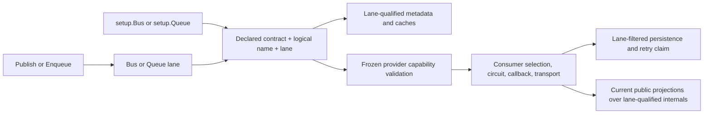
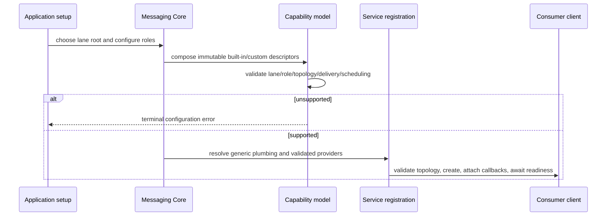
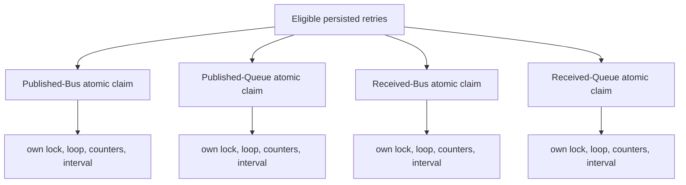

# Messaging Lane Model and Registration - Plan

## Goal Capsule

Establish Bus and Queue as explicit, stable messaging lanes from registration through runtime identity while preserving every existing `IntentType` database, header, and wire representation. Registration must begin at `setup.Bus` or `setup.Queue`; the same declared contract and logical name must work independently on both lanes; and lane selection must qualify all behaviorally relevant registries, caches, circuits, callbacks, retry workers, backpressure, and transport selection.

This is the complete next messaging cut for GitHub issue #336. It ships as one pull request from `xshaheen/issue-336-lane-model-registration-v2` to `xshaheen/messaging-verb-model`, reaches green CI and a clean review, and stops without merging. Public publisher/delivery/persistence/observability vocabulary belongs to #350, physical topology migration belongs to #359, transactional inbox and stable consumer identity belong to #225, and #337 owns final documentation, package-family compatibility, and release synchronization.

The implementation succeeds when current and legacy persisted messages remain readable without transformation, unsupported provider/lane combinations fail before readiness or side effects, typed publish middleware receives the declared contract and concrete callback value correctly, and load or failure on one lane cannot change the other lane's retry or backpressure state.

---

## Product Contract

### Requirements

#### Compatibility

- **R1 — Stable lane values.** Introduce `MessageLane` with explicit compatibility values `Bus = 0` and `Queue = 1`.
- **R2 — Checked compatibility mapping.** Convert between `MessageLane` and `IntentType` only through explicit checked mappings. Any undefined value is a terminal error and never falls back to Bus.
- **R3 — Unchanged persisted and wire contract.** Keep existing `IntentType` numeric values, relational columns, `Headers.Intent` / `headless-intent` representations, and provider envelope values readable and byte-for-byte compatible where the serializer currently controls the bytes.
- **R4 — Authoritative legacy evidence.** Characterize real pre-change PostgreSQL, SQL Server, in-memory, and provider-envelope formats with immutable fixtures or raw provider records whose provenance is recorded. Generated examples invented by the new implementation do not qualify.

#### Registration and identity

- **R5 — Lane roots only.** `setup.Bus` and `setup.Queue` are the only consumer registration roots. Remove lane-free `ForMessage`, `OnBus`, and `OnQueue` paths and migrate every source, test, demo, analyzer probe, provider extension, and package sample in the repository.
- **R6 — Independent dual-lane contracts.** A declared CLR contract and the same logical message name can be registered once per lane with independent consumers, middleware, names, and provider configuration. A duplicate within the same lane remains an error.
- **R7 — Declared-contract authority.** Metadata lookup and duplicate detection use the declared contract plus lane; assignable-type fallback must not silently bind a concrete payload to a different declared contract.
- **R8 — Lane-complete runtime keys.** Lane qualifies all behaviorally relevant registry, cache, circuit, middleware, executor, callback, storage, retry, backpressure, distributed-lock, monitoring, diagnostics, testing-observation, existing received-message deduplication, and transport-selection identities.
- **R9 — Provider extensions preserve lane.** Provider and package registration extensions may add configuration for the selected lane but cannot replace or infer a different lane.

#### Runtime behavior

- **R10 — Verb-conveyed lane.** Publish selects Bus and Enqueue selects Queue. Message contracts remain plain classes, records, or interfaces; marker/type classification is not the public semantic source.
- **R11 — Typed callback fidelity.** Publish requests retain both the declared contract type and the concrete payload/response type. Typed middleware for the declared contract executes for concrete subtypes and typed null callback results.
- **R12 — Circuit isolation.** Circuit groups, registrations, state transitions, recovery callbacks, and monitoring keys are independent for equal logical names on Bus and Queue.
- **R13 — Retry and backpressure isolation.** Storage pickup, worker loops, adaptive intervals, counters, failure state, distributed-lock resources, and saturation control are independent for Published/Received × Bus/Queue. Bus saturation or failure cannot delay, reset, or throttle Queue, and vice versa.
- **R14 — Atomic lane filtering.** Relational retry pickup applies the lane predicate inside the same database-clock claim operation; fetching a mixed set and grouping it in memory is not sufficient.

#### Capability safety

- **R15 — Immutable production descriptors.** Core owns immutable descriptors for provider roles and supported lane, topology, delivery, and scheduling combinations. Built-in and custom providers contribute through one supported seam, including providers added after `AddHeadlessMessaging`. Test-harness conformance manifests may verify descriptors but are not the production authority.
- **R16 — Early rejection.** Unsupported configured combinations fail during bootstrap before storage initialization, consumer client creation/readiness, middleware, or transport side effects. Unsupported per-call combinations fail before middleware or side effects.
- **R17 — Stable current contracts.** Preserve current `IConsumerClient` lifecycle and settlement contracts, readonly `OperateResult` transport results, Queue-request-to-Bus callback delivery, `IMonitoringApi`/`StatisticsView` names, Dashboard projections, and publisher/persistence facades until their owning follow-up issues.

### Acceptance Examples

- **AE1 — Compatibility round trip.** Given a real legacy record or envelope containing Bus/`0` or Queue/`1`, reading it yields the corresponding lane and writing it again preserves the existing database/header/wire value. An undefined numeric or textual value fails explicitly.
- **AE2 — Same contract on both lanes.** Given `OrderChanged` registered with logical name `orders.changed` on Bus and Queue, both registrations resolve their own consumer, options, cache, circuit, and transport path. A second Bus registration with the same contract/name is rejected without affecting Queue.
- **AE3 — Declared and concrete callback types.** Given a Queue request with a callback declared as an interface but returning a concrete subtype, exactly one callback response is published on Bus, typed middleware for the declared interface runs and receives the concrete value, and no Queue callback response is emitted. Given a typed null result, the declared type remains available and middleware still follows its typed path.
- **AE4 — Independent pressure.** Given one Published/Received × Bus/Queue retry quadrant saturating its configured batch and adaptive interval while another quadrant has eligible work, the healthy quadrant keeps its own pickup cadence, lock, counters, and successful progress.
- **AE5 — Capability gate timing.** Given a provider descriptor that does not support a configured lane/role, bootstrap or the direct call rejects it before readiness, middleware, storage writes, client creation, or transport I/O can be observed.
- **AE6 — Provider conformance.** Every provider's production descriptor agrees with the shared conformance manifest and its real integration leaf proves its supported combinations. Providers that cannot yet isolate a same-name dual-lane topology reject that combination before readiness; #336 does not fabricate physical isolation owned by #359.
- **AE7 — Existing consumer evidence stays distinct.** Given equal declared contract, current group/destination, and message ID on Bus and Queue, existing received-message deduplication, retry, diagnostics, monitoring, and testing observations remain distinct while current public projection names stay unchanged. #225 separately owns any new stable public or persisted subscription/inbox identity.

### Scope Boundaries

In scope:

- `MessageLane`, checked compatibility conversion, route keys, and real compatibility characterization, including explicit diagnostics for directly materialized unknown legacy values.
- Lane-root registration and full repository caller migration.
- Lane-complete internal metadata, runtime, callback, circuit, retry, backpressure, lock, and transport-selection identities.
- Immutable production capability descriptors and pre-side-effect validation.
- Provider, storage, broker-conformance, demo, analyzer-probe, and documentation updates required for the new registration contract.

Out of scope:

- #350 publisher/delivery renaming or removal, persistence schema renaming, public monitoring vocabulary cutover, and legacy compatibility removal.
- #359 broker entity, topic, subscription, consumer-group, or physical lane-topology migration.
- #225 the new transactional inbox plus stable public/persisted consumer and deduplication identity; #336 still lane-qualifies existing runtime received-message deduplication keys.
- #337 final cross-package documentation, package-family compatibility proof, integration-branch promotion, and release synchronization beyond the current-contract documentation required to ship #336 safely.
- Migrations that rewrite existing `IntentType` columns or historical records.
- Auto-merge, promotion of the integration branch into `main`, or more than one pull request.

---

## Planning Contract

### Source of Truth

- GitHub issue #336 and its live comments define the delivery scope.
- `docs/plans/2026-07-13-002-messaging-reviewed-architecture-plan.md` is the authoritative architecture, especially KTD4, KTD7, KTD15, KTD16, PR1/#336, U1, U3, runtime U4, U7, registration U8/U9.
- `CONCEPTS.md` defines verb-conveyed lanes and plain message contracts.
- `docs/plans/2026-07-15-001-issue-336-lane-model-registration.md` from the preserved source branch and commits `407b7e1b5`, `882228bce`, `39e3cc4f6`, and `866327ba5` are reusable evidence, not authority.
- `docs/plans/2026-07-13-001-messaging-consolidated-architecture-plan.md` and `docs/plans/2026-06-10-001-feat-messaging-dual-lane-topology-kafka-guard-plan.md` provide history and topology background only.
- PR #704's broker-conformance harness is complementary test groundwork and does not supersede #336.

### Key Technical Decisions

- **KTD1 — Verb-conveyed lanes.** Publish/Enqueue plus lane-scoped registration select behavior; contracts stay plain. Marker or type classification is rejected as the public semantic authority. `session-settled: user-approved; reason=plain contracts and verbs carry intent; rejected=marker/type classification`
- **KTD2 — One atomic #336 pull request.** Complete lane identity before #350, #359, or #337 and do not split the compatibility, registration, runtime, and capability units into independent pull requests. `session-settled: user-approved; reason=later cuts require lane-complete identity; rejected=skip ahead or publish U1-U4 separately`
- **KTD3 — Compatibility bridge remains.** Add `MessageLane` while retaining existing `IntentType` numeric, database, header, and wire representations. `session-settled: user-approved; reason=#350 owns the atomic public and persistence cutover; rejected=rename/remove stored compatibility in #336`
- **KTD4 — Bus zero remains valid.** `Bus = 0` and `Queue = 1`; undefined values throw and never become Bus. `session-settled: user-approved; reason=zero is already persisted Bus; rejected=Unknown=0 or fallback`
- **KTD5 — Route identity includes lane.** Use declared contract, logical name, and lane as the route identity, allowing the same contract/name independently on both lanes. `session-settled: user-approved; reason=lane derives from verb and registration; rejected=permanently bind CLR type to one lane`
- **KTD6 — Structural lane roots.** Only `setup.Bus` and `setup.Queue` lead to explicit or scanned consumer registration; remove lane-free `ForMessage`, `OnBus`, and `OnQueue`. `session-settled: user-approved; reason=lane must flow through every key; rejected=late-bound global selection`
- **KTD7 — Preserve the #350 boundary.** Keep publisher facades and persistence/observability projections while making their internal identity lane-complete. `session-settled: user-approved; reason=preserve reviewed PR boundaries; rejected=delivery/publisher cutover in #336`
- **KTD8 — Immutable capabilities fail early.** Production descriptors are composed and frozen before bootstrap side effects; unsupported startup and direct-call combinations reject before readiness, middleware, or I/O. `session-settled: user-approved; reason=#359 topology must remain safely unsupported; rejected=late capability failure`
- **KTD9 — One correctly based PR, no merge.** Publish one feature PR to `xshaheen/messaging-verb-model`, babysit it to green and clean review, and stop. `session-settled: user-directed; reason=messaging PRs 1-3 remain isolated until promotion; rejected=main target, multiple PRs, auto-merge`
- **KTD10 — Declared route keys, no assignable fallback.** Internal metadata uses an immutable route key built from declared contract, logical name, and lane. Concrete payload type is carried separately for serialization and callback fidelity; it cannot select another registration by assignability.
- **KTD11 — Capability roles are explicit.** Core descriptors distinguish the transport, storage, and coordination roles that affect startup or per-call validity rather than inferring support from mutable `IServiceCollection` contents. Built-in and custom providers register inert immutable contribution descriptors through one seam before service-provider build, including post-`AddHeadlessMessaging` contributions; raw `ITransport` DI registration is unsupported and diagnosed. `AddHeadlessMessaging` registers generic publisher/runtime plumbing up front. Bootstrap resolves, composes, freezes, and validates descriptors before resolving provider implementations or causing side effects, then records startup topology validation separately from declared support and live broker health; it never mutates an already-built DI container. Discovery and unrelated cross-cutting extensions remain on their current setup seams.
- **KTD12 — Retry scheduling is quadrant-specific at the source.** Published-Bus, Published-Queue, Received-Bus, and Received-Queue each own their pickup query, database claim predicate, distributed-lock resource, loop/task pair, counters, failure state, and adaptive interval. Post-fetch grouping and a shared shortest-interval scheduler are rejected because they retain shared contention and pressure.
- **KTD13 — Current-main names are stable.** Keep `OperateResult`, `IMonitoringApi`, `StatisticsView`, `UsePostgreSql`, `UseSqlServer`, `MessagingConsulDiscoveryOptionsExtensions`, and `MessagingK8sDiscoveryOptionsExtensions`. Treat the PostgreSQL and SQL Server EF adapter packages as separate provider adapters while `Headless.EntityFramework.Messaging` stays provider-neutral.
- **KTD14 — Callback delivery behavior stays Bus.** A Queue-originated request retains Queue as origin metadata, but its callback response continues to publish through the Bus outbox. Response middleware/routing uses the actual Bus delivery lane, the declared callback contract remains authoritative, and concrete response type is ephemeral metadata rather than a routing guess.
- **KTD15 — Existing operator backpressure remains aggregate-only.** Preserve `IRetryProcessorMonitor`; project the maximum quadrant interval, report backed off when any quadrant is backed off, and reset all four quadrants for the existing global reset. Add an internal quadrant snapshot/control seam for correctness tests; aggregate values never drive runtime cadence or lock TTL.

### Assumptions

- Existing providers may declare different supported lane/role combinations. A missing #359 physical topology capability is represented as unsupported and rejected early, not emulated.
- The current storage schema can apply an `IntentType`/lane predicate inside its existing atomic claim statement without a schema migration; if provider evidence disproves this, stop and report a scope conflict rather than weakening atomicity.
- Compatibility fixtures will be sourced from current real provider schemas, previously released/pre-change envelope output, or checked-in raw records with provenance and integrity metadata. A current-provider characterization may supplement but cannot replace authoritative historical proof; if no authoritative source exists for an affected compatibility boundary, report it as a Definition-of-Done blocker rather than inventing bytes.
- Public monitoring and persistence projections may aggregate lane-qualified internal state into the current `IntentType`-named views until #350, but internal cache keys and counters may not collapse lanes.
- Missing legacy intent headers retain the structurally selected registration/transport lane. A present recognized-but-mismatched header is diagnosed and cannot reroute delivery.

### Resolved During Planning

- Current main uses readonly `OperateResult`; no result-contract rename belongs in this change.
- PostgreSQL and SQL Server storage setup remains `UsePostgreSql` / `UseSqlServer`; provider-specific EF adapters are split packages with `UseEntityFramework<TContext>` entry points and must preserve their current ownership.
- Discovery options use `MessagingConsulDiscoveryOptionsExtensions` and `MessagingK8sDiscoveryOptionsExtensions`; discovery remains cross-cutting rather than a transport capability.
- `TransportConformanceManifest` is test evidence. The immutable production capability descriptor must live in shipped Core/provider code and the harness must compare against it.
- PR #704 added real broker-conformance test leaves but did not add lane identity or capability authority. Those leaves become #336 verification surfaces.
- Absorbed issues #351, #402, #661, and #668 require the custom-provider seam, declared-versus-startup-versus-health diagnostics, current callback delivery preservation, and four-quadrant retry isolation; they do not reopen the reviewed #336 boundaries.

### Partial-Commit Salvage Map

| Commit | Reuse | Required rework |
|---|---|---|
| `407b7e1b5` | `MessageLane`, compatibility mapping, route-key direction, focused tests | Rebase concepts onto current main; replace any synthetic compatibility samples with authoritative provider/envelope evidence |
| `882228bce` | lane-root builder/API direction and caller inventory | Resolve `MessagingSetupBuilder.cs` against current main; remove eager lane-free name registration and make declared contract + lane authoritative |
| `39e3cc4f6` | migration patterns across caching, locks, contexts, circuits, and metadata | Reapply deliberately to the evolved caller graph instead of cherry-picking wholesale |
| `866327ba5` | lane keys and separate declared/concrete callback types | Replace assignable metadata fallback, mixed retry pickup, shared retry state, and stale transport/monitoring assumptions |

### High-Level Technical Design

The sketches describe invariants and ownership; implementation should follow current repository idioms rather than copy pseudo-signatures literally.

### System-Wide Impact

- **Registration API:** `SetupMessaging`, `MessagingSetupBuilder`, registration builders, assembly scanning, message-name and message-scoped middleware registration, provider extensions, package-owned automatic consumers, demos, docs, analyzer probes, and tests all move to structural lane roots.
- **Metadata and dispatch:** `ConsumerRegistry`, `IMessageMetadataRegistry`, `MethodMatcherCache`, `ConsumerServiceSelector`, message publish requests, middleware, outbox writing, subscription execution, existing received-message deduplication, diagnostics, testing observations, and callback matching carry declared route identity plus concrete payload information.
- **Transport lifecycle:** `IConsumerClientFactory`, `IConsumerRegister`, each provider consumer factory, readiness, callback attachment, shutdown, settlement, circuit startup-pause, half-open recovery, stale timers, and teardown use lane-qualified identity.
- **Persistence and concurrency:** `IDataStorage`, in-memory/PostgreSQL/SQL Server pickup, distributed-lock resources, retry tasks, adaptive intervals, counters, and backpressure become lane-specific without changing stored `IntentType` values.
- **Provider composition:** Core accepts built-in and custom-provider inert descriptors through one seam, registers generic plumbing independently of provider order, freezes transport/storage/coordination capability contributions before resolving providers, and compares production descriptors with shared provider manifests. Runtime never scans or mutates `IServiceCollection`; discovery and unrelated extensions stay on their current setup paths.
- **Observability:** Internal metrics and circuit keys are lane-qualified; current `IMonitoringApi`, `StatisticsView`, Dashboard markers, and `IntentType` projections remain compatible until #350.
- **Failure propagation:** Undefined compatibility values and unsupported capabilities become explicit terminal configuration or call failures. They do not create partial registrations, start clients, enter middleware, write storage, or perform transport I/O.

### Risks and Mitigations

- **Silent Bus fallback.** Default enum values or casts could reinterpret corruption as Bus. Mitigation: centralized checked mappings, undefined-value tests at every storage/header boundary, and no optional/default lane parameters.
- **Partial identity migration.** One type-only cache or string-only circuit key can cross-wire lanes. Mitigation: introduce one route-key concept, inventory all registries/caches/locks/callbacks, and add same-name dual-lane tests at unit and broker-conformance levels.
- **Shared retry pressure.** Per-message grouping after one pickup leaves storage, scheduling, and locks shared. Mitigation: lane predicate in atomic claims plus separate worker state and contention tests.
- **Side effects before capability rejection.** Eager provider service mutation can make failure timing unverifiable. Mitigation: collect immutable descriptors/contributions first, validate the composed model, then apply services and create clients.
- **Compatibility fixtures that prove only the new code.** Newly generated JSON/rows can mask a breaking change. Mitigation: provenance-backed raw provider records/envelopes, immutable fixture hashes, and unchanged read/write assertions.
- **Provider physical-topology leakage.** Same-name dual-lane conformance may require topology work owned by #359. Mitigation: descriptors advertise only real support and reject unsupported combinations before readiness.
- **Callback behavior drift.** Lane propagation could accidentally enqueue a Queue request's response. Mitigation: pin the existing Queue-origin-to-Bus-response behavior while retaining origin lane as metadata and using Bus for response routing/middleware identity.
- **Stale source-branch assumptions.** Partial commits predate current storage, result, monitoring, and conformance contracts. Mitigation: reapply concepts unit by unit, preserve current names, and run current shared harnesses plus provider leaves.

---

## Implementation Units

### Execution Order

Execute the stable unit IDs in dependency order `U1 → U4 → U5 → U2 → U3 → U6`. The internal identity, callback, circuit, and four-quadrant retry behavior land before the public registration-root cutover, so every retained commit prefix remains behaviorally safe. U-IDs retain their reviewed meanings even though execution is not numeric.

### U1 — Compatibility foundation and authoritative fixtures

**Requirements:** R1, R2, R3, R4; AE1
**Depends on:** none

**Files and surfaces:**

- `src/Headless.Messaging.Abstractions/` for `MessageLane` ownership.
- `src/Headless.Messaging.Core/` compatibility mapping and route-key foundations.
- `src/Headless.Messaging.Core/MediumMessage.cs`, header/envelope mapping, and provider serialization boundaries that currently persist or emit `IntentType`.
- `tests/Headless.Messaging.Core.Tests.Harness/Fixtures/legacy-intent-v1/` for immutable, provenance-documented fixtures.
- `tests/Headless.Messaging.Storage.PostgreSql.Tests.Integration/PostgreSqlCrudTest.cs`.
- `tests/Headless.Messaging.Storage.PostgreSql.Tests.Integration/PostgreSqlStorageTests.cs`.
- `tests/Headless.Messaging.Storage.SqlServer.Tests.Integration/SqlServerStorageTests.cs`.
- Existing real broker-envelope integration tests in provider leaves.

**Approach:**

- Introduce the explicit enum and one checked compatibility mapping used by every boundary.
- Keep `MediumMessage.IntentType`, relational schema, headers, and wire strings unchanged.
- Establish an immutable route-key value using declared contract, logical name, and lane for later units.
- Capture authoritative raw records/envelopes with source/version/schema notes and integrity checks; do not regenerate them from the new implementation during tests.

**Test scenarios:**

- Bus `0` and Queue `1` map both directions and preserve existing serialized/header/database representations.
- Every undefined numeric enum value and unknown textual header fails terminally.
- PostgreSQL, SQL Server, in-memory, and available real provider envelopes read the pre-change fixture and write the same compatibility value.
- Route keys compare equal only when declared contract, logical name, and lane all match.

**Observable completion:** compatibility tests are red before the bridge, green after it, and fixture provenance demonstrates real pre-change formats.

### U2 — Immutable provider capability model and early composition gate

**Requirements:** R15, R16, R17; AE5, AE6
**Depends on:** U1, U4, U5

**Files and surfaces:**

- New capability types in `src/Headless.Messaging.Core/Configuration/` or the nearest existing configuration namespace.
- `src/Headless.Messaging.Core/Configuration/MessagingSetupBuilder.cs`.
- `src/Headless.Messaging.Core/Internal/IBootstrapper.Default.cs` and bootstrap tests.
- Every messaging transport/storage provider `Setup.cs` and consumer factory under `src/Headless.Messaging.*`.
- `src/Headless.Messaging.Storage.PostgreSql.EntityFramework/Setup.cs`, `src/Headless.Messaging.Storage.SqlServer.EntityFramework/Setup.cs`, and provider-neutral `src/Headless.EntityFramework.Messaging/Setup.cs`.
- `src/Headless.Messaging.Dashboard/NodeDiscovery/MessagingConsulDiscoveryOptionsExtensions.cs` and `src/Headless.Messaging.Dashboard.K8s/MessagingK8sDiscoveryOptionsExtensions.cs` for name-preservation regression checks only, not capability participation.
- `tests/Headless.Messaging.Core.Tests.Harness/Capabilities/TransportConformanceManifest.cs` and `tests/Headless.Messaging.Core.Tests.Unit/TransportConformanceManifestTests.cs`.

**Approach:**

- Model transport, storage, and coordination roles explicitly with immutable lane/topology/delivery/scheduling descriptors; leave discovery and unrelated extensions on their current setup seams.
- Register generic publisher/runtime plumbing during `AddHeadlessMessaging`. Let built-in and custom providers add inert immutable contribution descriptors before service-provider build, including after `AddHeadlessMessaging`; diagnose raw transport DI registrations.
- At bootstrap, resolve only the inert descriptors, compose and freeze the complete model, and validate it before resolving provider implementations, initializing storage, provisioning topology, or creating clients. Do not mutate the built container.
- Require direct publish/enqueue paths to consult the frozen capability model before middleware or side effects.
- Preserve current storage, EF adapter, discovery, client lifecycle, and `OperateResult` contracts.

**Test scenarios:**

- Unsupported startup combinations throw before storage initialization, service-side callbacks, client creation, provisioning, or readiness.
- Unsupported direct publish/enqueue calls throw before middleware, storage, or transport observations.
- Attempted provider lane replacement or duplicate incompatible role contribution is rejected deterministically.
- Production descriptors match the shared conformance manifest; test-only manifests cannot become runtime authority.
- Providers with only one real topology lane advertise that fact and reject unsupported dual-lane same-name use before readiness.
- A valid custom provider contributed after `AddHeadlessMessaging` is visible to generic publisher/runtime plumbing and the capability model; raw direct transport registration fails with actionable guidance.
- Diagnostics distinguish immutable declared support, startup topology validation result/timestamp, and live broker health.

**Observable completion:** side-effect spies remain untouched on rejection, supported compositions bootstrap normally, and descriptor/manifests agree for every provider.

### U3 — Structural lane registration and repository caller migration

**Requirements:** R5, R6, R7, R9, R10; AE2
**Depends on:** U1, U2, U4, U5

**Files and surfaces:**

- `src/Headless.Messaging.Core/Setup.cs`.
- `src/Headless.Messaging.Core/Configuration/MessagingSetupBuilder.cs`.
- `src/Headless.Messaging.Core/Registration/`.
- `src/Headless.Messaging.Core/ConsumerRegistry.cs`.
- `src/Headless.Messaging.Core/Internal/IMessageMetadataRegistry.cs`.
- A Core-owned internal lane-qualified framework-contribution descriptor consumed by the same structural registration pipeline; it is not a callable public consumer-registration root.
- All registration callers under `src/`, `tests/`, and `demo/`, including caching, distributed-lock, provider, and test-harness extensions.
- Analyzer/source-generator probes and package samples that compile registration code.
- `tests/Headless.Messaging.Core.Tests.Unit/ForMessageRegistrationTests.cs` and metadata registry tests.

**Approach:**

- Add Bus and Queue registration roots that carry their lane structurally into explicit and assembly-scanned registration.
- Remove lane-free registration and terminal `OnBus`/`OnQueue` choices rather than retaining compatibility shims.
- Register names, message-scoped middleware, provider configuration, and metadata only after declared contract plus lane are known; lane-scoped duplicates fail while cross-lane equivalents coexist.
- Preserve order-independent package-owned automatic consumers through inert internal contribution descriptors carrying an explicit lane. Bootstrap drains those descriptors through the same structural lane-registration pipeline. Remove public/callable `IServiceCollection.ForMessage`; the internal contribution contract must not become an alternate user-facing root.
- Sweep the evolved current-main caller graph rather than applying the stale caller-migration commit wholesale.

**Test scenarios:**

- The public setup surface exposes Bus/Queue roots and no lane-free registration roots or `OnBus`/`OnQueue` terminals.
- Same declared contract and name registers independently on both lanes and resolves separate configuration.
- The same assembly scanned on both roots creates both registrations; an explicit Bus registration suppresses only the matching Bus scan, not Queue.
- The same contract may have different names and middleware per lane; case-insensitive name variants conflict within one lane but not across lanes.
- Duplicate contract/name in one lane fails without poisoning the other lane.
- Assembly scanning stays lane-scoped and does not register discovered consumers globally.
- Every source, test, demo, analyzer probe, and provider extension compiles without a lane-free call site.
- Caching Hybrid and Distributed Locks automatic consumers work whether their package setup runs before or after `AddHeadlessMessaging`, and their internal contributions are explicitly Bus-scoped.

**Observable completion:** API/reflection assertions and a repository search prove lane-free roots are absent, while full builds prove all callers migrated.

### U4 — Lane-qualified metadata, middleware, callbacks, and transport selection

**Requirements:** R7, R8, R11, R12, R17; AE2, AE3
**Depends on:** U1

**Files and surfaces:**

- `src/Headless.Messaging.Core/Internal/IMessageMetadataRegistry.cs`.
- `src/Headless.Messaging.Core/Runtime/MethodMatcherCache.cs`.
- `src/Headless.Messaging.Core/Internal/ConsumerServiceSelector.cs`.
- `src/Headless.Messaging.Core/Internal/IMessagePublishRequestFactory.cs`.
- `src/Headless.Messaging.Core/Internal/PublishMiddlewarePipeline.cs`.
- `src/Headless.Messaging.Core/Internal/OutboxMessageWriter.cs`.
- `src/Headless.Messaging.Core/Internal/ISubscribeExecutor.cs`.
- `src/Headless.Messaging.Core/Internal/IConsumerRegister.cs`.
- `src/Headless.Messaging.Core/Transport/IConsumerClientFactory.cs` and every provider `*ConsumerClientFactory.cs`.
- Circuit registry/grouping and startup-pause/half-open recovery surfaces under `src/Headless.Messaging.Core/`.
- Existing received-message deduplication and diagnostic/observation surfaces under `src/Headless.Messaging.Core/` and `src/Headless.Messaging.Testing/` without adding a persisted subscription identity.
- `tests/Headless.Messaging.Core.Tests.Unit/Internal/MessageMetadataRegistryTests.cs`.
- `tests/Headless.Messaging.Core.Tests.Unit/Internal/MessagePublishRequestFactoryMetadataTests.cs`.
- `tests/Headless.Messaging.Core.Tests.Unit/Internal/PublishMiddlewarePipelineTests.cs`.
- `tests/Headless.Messaging.Core.Tests.Unit/CircuitBreaker/CircuitBreakerIntegrationTests.cs`.

**Approach:**

- Replace type-only, assignable, optional-Intent, and string-only identities with the route key or an equally explicit lane-qualified key.
- Carry declared contract and concrete payload/response type as separate metadata through requests, middleware, callbacks, and serialization.
- Preserve Queue-request-to-Bus-callback delivery: Queue remains origin context, while the callback response route and middleware use the actual Bus delivery lane.
- Remove default-Bus consumer-factory overload behavior; transport selection always receives the lane explicitly.
- Qualify circuit registration, known groups, callbacks, monitoring keys, timers, teardown, and half-open recovery by lane while preserving current public monitoring projections.

**Test scenarios:**

- Exact declared-contract lookup succeeds; assignable concrete lookup cannot select an unrelated registration.
- Declared interface plus concrete subtype and declared type plus typed-null result both execute the correct typed middleware path.
- A Queue request produces exactly one Bus callback response and no Queue callback response; origin lane remains available as context without rerouting the response.
- Same logical circuit group on Bus and Queue has separate registration, state, recovery, timer, teardown, and monitoring identity.
- Equal current contract, group/destination, and message ID on opposite lanes produce distinct existing dedupe, diagnostics, monitoring, and testing-observation keys.
- Late startup and failed half-open resume on one lane do not pause or mutate the other lane.
- Every provider factory requires an explicit lane and preserves existing callback/readiness/shutdown/settlement behavior.

**Observable completion:** callback fidelity tests, dual-lane cache/circuit tests, and provider factory tests fail on the old type-only/default-Bus behavior and pass with explicit lane identity.

### U5 — Lane-isolated retry, backpressure, locking, and storage claims

**Requirements:** R8, R13, R14, R17; AE4
**Depends on:** U1, U4

**Files and surfaces:**

- `src/Headless.Messaging.Core/Processor/IProcessor.NeedRetry.cs`.
- `src/Headless.Messaging.Core/Persistence/IDataStorage.cs`.
- `src/Headless.Messaging.Core/Internal/MessagingKeys.cs`.
- In-memory, PostgreSQL, and SQL Server retry-pickup implementations under `src/Headless.Messaging.Storage.*`.
- Distributed-lock integration used by retry processors.
- `tests/Headless.Messaging.Core.Tests.Unit/Processor/MessageNeedToRetryProcessorTests.cs`.
- `tests/Headless.Messaging.Core.Tests.Unit/RetryProcessorDistributedLockTests.cs`.
- `tests/Headless.Messaging.Core.Tests.Harness/DataStorageTestsBase.cs` and storage provider leaves.
- Real PostgreSQL and SQL Server integration projects.

**Approach:**

- Give Published-Bus, Published-Queue, Received-Bus, and Received-Queue independent retry loop/task pairs, adaptive intervals, counters, batch/backpressure state, and distributed-lock resources.
- Add lane to retry pickup contracts and apply it within the provider's existing atomic database-clock claim statement.
- Preserve current columns and `IntentType` values; use the checked compatibility bridge at storage boundaries.
- Keep public monitoring projections compatible: maximum quadrant interval, any-quadrant backed-off status, and global reset-all semantics. Ensure aggregate projections cannot drive quadrant scheduling or lock TTL.

**Test scenarios:**

- Saturation, repeated failure, lock contention, pickup failure, in-flight work, interval growth, circuit-open skips, or reset in one quadrant has no effect on another quadrant's cadence or counters.
- All four quadrants acquire distinct distributed-lock resources and can make concurrent progress.
- Mixed eligible rows yield only the requested lane from each atomic claim; concurrent claimers do not double-claim.
- PostgreSQL and SQL Server claims use their database clock and lane predicate in the same transaction/statement under skewed application clocks.
- Existing rows round-trip unchanged and undefined stored values fail explicitly.
- Aggregate operator reset resets all quadrants coherently; aggregate interval/backoff observations never feed runtime scheduling.

**Observable completion:** focused concurrency tests and real relational provider tests prove independent scheduling/locking and atomic lane-filtered claims.

### U6 — Provider conformance, integration coverage, and current-contract documentation

**Requirements:** R3, R5, R6, R8, R9, R15, R16, R17; AE1–AE6
**Depends on:** U2, U3, U4, U5

**Files and surfaces:**

- `tests/Headless.Messaging.Core.Tests.Harness/MessagingIntegrationTestsBase.cs`.
- `tests/Headless.Messaging.Core.Tests.Harness/Capabilities/TransportConsumerConformanceTestsBase.cs` and `TransportConformanceManifest.cs`.
- Existing real integration leaves for AWS, Azure Service Bus, Kafka, NATS, Pulsar, and RabbitMQ.
- Existing Redis and InMemory unit/in-process conformance projects; #336 does not create broker-integration projects for providers that have none on current main.
- Affected messaging READMEs, `CONCEPTS.md`, demos, and package examples.
- Current monitoring/Dashboard tests where internal lane keys project into legacy public views.

**Approach:**

- Extend the shared harness with dual-lane registration, descriptor agreement, header compatibility, early-rejection timing, callback fidelity, and isolation scenarios.
- Run AWS, Azure Service Bus, Kafka, NATS, Pulsar, and RabbitMQ real integration leaves only for capabilities they truthfully advertise; unsupported combinations assert pre-readiness rejection. Run Redis at its current unit-level conformance tier and InMemory at its current in-process unit tier.
- Update documentation to the #336 registration/runtime contract while retaining explicit #350/#359 boundaries and current names.
- Sweep the final diff for stale lane-free APIs, type-only behavior keys, optional/default lane parameters, and accidental public vocabulary cutover.

**Test scenarios:**

- Shared broker conformance proves every supported lane combination, production descriptor agreement, and unchanged header/envelope values.
- Same-name dual-lane registration either works independently or is rejected before readiness when the provider truthfully lacks #359 topology support.
- Current monitoring and Dashboard projections remain compatible while their underlying runtime observations are lane-qualified.
- All documentation and executable samples use `setup.Bus` or `setup.Queue` and keep Publish/Enqueue semantics explicit.

**Observable completion:** all relevant unit and shared-harness projects, the six existing broker integration leaves, Redis unit conformance, InMemory in-process conformance, and storage integration projects pass locally; docs and repository searches agree with the shipped API.

---

## Verification Contract

### Red and Characterization Evidence

- Before applying each behavior change, add or run focused tests that demonstrate the current failure: dual-lane collisions, assignable metadata fallback, typed-null callback loss, shared retry state/locks, mixed storage pickup, and late capability rejection.
- Record immutable legacy fixture provenance and prove the pre-change/current-main reader recognizes the captured representation where practical; never use the new writer as the only fixture oracle.
- Keep the old partial commits as comparison evidence, but run all tests on the refreshed current-main feature tree.

### Focused Unit Gates

- Compatibility mapping, route-key equality, registration roots/duplicates/scanning, metadata exactness, callback declared/concrete types, middleware, consumer selection, consumer registration, capability timing, circuit lifecycle, retry isolation, distributed locks, and bootstrap tests pass.
- API/reflection and repository-search checks find no lane-free registration root, callable `IServiceCollection.ForMessage`, `OnBus`/`OnQueue` terminal, optional/default lane transport selector, or behavior key that omits lane.

### Provider and Integration Gates

- Shared `DataStorageTestsBase` passes for in-memory, PostgreSQL, and SQL Server, including lane-filtered atomic retry claims and unchanged `IntentType` round trips.
- Real PostgreSQL and SQL Server integration projects pass with database-clock, mixed-lane, and concurrent-claimer cases.
- Shared `MessagingIntegrationTestsBase` and PR #704 transport-conformance tests pass in the six existing broker integration leaves (AWS, Azure Service Bus, Kafka, NATS, Pulsar, RabbitMQ), plus Redis unit and InMemory in-process conformance. Capability-specific skips/rejections must match production descriptors and carry an explicit reason; an unavailable external service is reported separately and is never represented as a passing integration.
- Current EF provider-neutral and PostgreSQL/SQL Server adapter projects build and their affected tests pass.

### Repository Quality Gates

- Restore and direct Release builds pass for every changed production and test project, followed by the full relevant Messaging solution slice.
- Repository formatting and analyzer verification pass using the Makefile targets required by `CLAUDE.md`; the diff remains clean afterward.
- Full relevant Messaging unit tests pass locally. Hosted CI is reported separately because it runs unit coverage only and is not proof of real-provider conformance.
- Pre-push hooks remain enabled and pass under the repository-pinned SDK and authenticated package restore.

### Shipping and Review Gates

- Commit only #336-owned paths in meaningful Conventional Commit slices after checking worktree status.
- Push `xshaheen/issue-336-lane-model-registration-v2` normally and create exactly one PR to `xshaheen/messaging-verb-model`; verify the live PR base after creation.
- Structured code review has no unresolved P0/P1/P2 defects and no accepted in-scope fix remains unapplied.
- Babysitting reaches terminal green required checks and no actionable review feedback after its normal repair rounds. Do not merge.

---

## Definition of Done

- [ ] `MessageLane` has stable Bus `0` / Queue `1` values and every `IntentType` bridge is explicit and checked.
- [ ] Real legacy relational and envelope formats remain readable; database columns, header names/values, and wire representations are unchanged.
- [ ] `setup.Bus` and `setup.Queue` are the only registration roots, and all repository callers compile on them.
- [ ] Same declared contract/logical name works independently on both lanes; same-lane duplicates fail.
- [ ] All behaviorally relevant registries, caches, circuits, callbacks, runtime selectors, locks, retry/backpressure state, and transport selection include lane identity.
- [ ] Typed publish middleware preserves declared contract and concrete payload/response type, including concrete subtypes and typed null.
- [ ] Bus and Queue retry pickup, adaptive scheduling, saturation, counters, and distributed locks are independent, with atomic lane-filtered relational claims.
- [ ] Immutable production capability descriptors reject unsupported startup and per-call combinations before readiness, middleware, storage, client, or transport side effects.
- [ ] Current `OperateResult`, client lifecycle, publisher/persistence, monitoring, Dashboard, storage setup, EF adapter, and discovery names remain compatible.
- [ ] #350, #359, and #337 work is absent except for explicit capability guards and boundary documentation.
- [ ] Focused/full Messaging unit tests, affected provider integration/conformance tests, Release builds, format, analyzers, and diff checks pass locally with exact results recorded.
- [ ] Simplification and structured review are complete, all accepted in-scope findings are fixed, and no abandoned compatibility shim or stale lane-free path remains.
- [ ] Meaningful Conventional Commits are pushed from `xshaheen/issue-336-lane-model-registration-v2`.
- [ ] Exactly one live PR targets `xshaheen/messaging-verb-model`; required CI is terminal green, actionable feedback is cleared, and the PR is not merged.

### Execution Boundary

If implementation evidence contradicts a `session-settled:` decision, the atomic-claim assumption, or authoritative compatibility preservation, stop and report the invalidating evidence. Routine complexity, provider-specific test setup, and current-main caller drift are implementation work, not reasons to weaken the contract.
