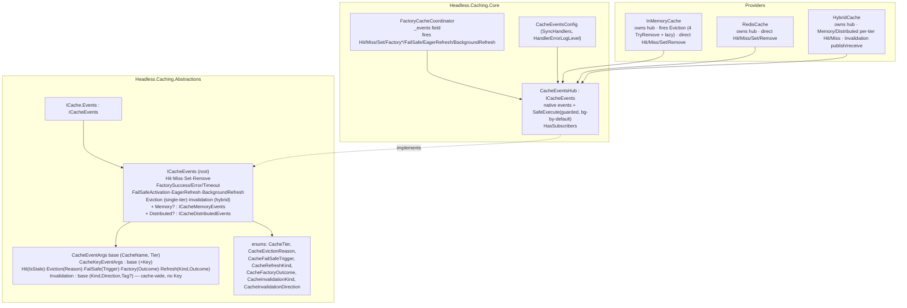

# feat: Public cache event surface (`cache.Events`)

## Summary

Add a typed, in-process **event surface** to the Headless caching stack so consumers can react to cache operations (hit/miss/set/remove, eviction, fail-safe activation, factory success/error/timeout, eager/background refresh, per-tier L1/L2 reads, and hybrid invalidation propagation) without scraping logs or attaching an OpenTelemetry exporter. The surface is a per-cache-instance `Events` accessor exposing native .NET `event EventHandler<TArgs>` members (`cache.Events.Hit += handler`), faithful to the FusionCache events model. Handlers run guarded on a background thread by default (opt-in synchronous), and the surface allocates nothing when no handler is subscribed.

This is a **second consumer channel over signals that already exist**: the framework already emits an OpenTelemetry metric/span for nearly every one of these signals (`CachingMetrics.Record*` in `FactoryCacheCoordinator` and the providers). Events reuse the same emission choke points and the same outcome vocabulary; they are additive and independent of OTel.

---

## Problem Frame

Issue #385 asks for "a typed event model (hit, miss, set, eviction, fail-safe activation, factory timeout, eager refresh) for consumers wanting hooks beyond logging," with two acceptance constraints: **events fire on the corresponding operations**, and **no allocation when no subscribers**.

Today the caching subsystem exposes only three observation channels — OpenTelemetry metrics (`CachingMetrics`), spans (`CachingDiagnostics`), and `[LoggerMessage]` structured logs. None of these give a consumer an in-process, strongly-typed callback to run custom logic (warm a related key, invalidate a downstream resource, emit a bespoke metric, drive a UI counter) when a specific cache event occurs. There is **no existing event/observer/callback mechanism** anywhere under `src/Headless.Caching.*` — this is a clean-slate addition with nothing to reuse or conflict with.

**Scope of "full parity" (user-directed):** one event per existing metric signal — the coordinator-owned get-or-add signals, the InMemory eviction signals, the hybrid per-tier L1/L2 read signals, and the hybrid invalidation publish/receive signals.

---

## Requirements

| ID | Requirement |
| --- | --- |
| R1 | Every `ICache` exposes an `Events` accessor returning a typed hub whose members are native .NET events supporting `+=`/`-=`. |
| R2 | The coordinator raises `Hit` (with `IsStale`), `Miss`, `Set`, `Remove`, `FactorySuccess`, `FactoryError`, `FactoryTimeout`, `FailSafeActivation` (with trigger), `EagerRefresh`, and `BackgroundRefresh` (with outcome) on the corresponding get-or-add operations — for all three factory providers via the shared coordinator. |
| R3 | The InMemory cache raises `Eviction` carrying the entry key and a typed reason (`expired`/`capacity`/`removed`/`flushed`). |
| R4 | The hybrid cache raises per-tier `Hit`/`Miss` for its L1 and L2 store reads, distinct from the aggregate get-or-add outcome. |
| R5 | The hybrid cache raises `Invalidation` events carrying kind (`tag`/`clear`/`flush`) and direction (`publish`/`receive`). |
| R6 | No allocation occurs when a given event has no subscriber: event args are constructed only when that event is subscribed, and the coordinator hot-path outcome resolution is gated to also run when events are subscribed (so events fire even with no OTel listener). |
| R7 | Handlers run on a background thread by default; each **synchronous** handler's execution is guarded — caught, logged, never propagated to the cache caller. Consumers may opt into synchronous execution via a `SyncHandlers` flag and configure the handler-error log level. `async void` handlers are unsupported: their exceptions bypass the guard (KTD11) and are a documented caveat. |
| R8 | `Events` propagates unchanged through the same-keyspace typed facade `Cache<T>`. The key-prefixing `ScopedCache<T>` does **not** expose the shared inner hub (would leak cross-scope events + prefixed keys); its `Events` returns the no-op hub in v1, with scoped projection deferred (KTD-ScopedCache, Scope Boundaries). |
| R9 | Docs are updated in lockstep: `docs/llms/caching.md` Observability section and the affected `src/Headless.Caching.*/README.md` files, per `docs/authoring/AUTHORING.md`. |

**Acceptance (from issue #385):** events fire on corresponding ops (R2–R5); no allocation when no subscribers (R6).

---

## Key Technical Decisions

Decisions labeled `session-settled:` were user-directed in the invoking conversation and are not open to re-litigation; the rest are planner resolutions of the brief's open areas.

- **KTD1 `session-settled:` — Native `cache.Events` hub.** The surface is a per-cache-instance accessor exposing native .NET `event EventHandler<TArgs>` members. *Rejected:* DI-registered listener/observer interface; hub+DI bridge. *Reason:* idiomatic .NET, free zero-allocation-when-empty via null-conditional dispatch, matches the FusionCache reference studied for this work.
- **KTD2 `session-settled:` — Full metrics parity scope.** One event per existing metric signal: coordinator events, InMemory eviction, per-tier L1/L2 hit/miss, hybrid invalidation publish/receive. *Rejected:* literal-7-only; 7-plus-cheap-siblings.
- **KTD3 `session-settled:` — Background-by-default handler execution.** Each fire dispatches handlers via `Task.Run`, each guarded by try/catch and logged; opt-in synchronous via a `SyncHandlers` flag; configurable error log level. *Rejected:* guarded-synchronous-by-default. Mirrors FusionCache's `SafeExecute`.
- **KTD4 — Sub-hub structure for per-tier signals (resolves open area 1).** The root hub carries the high-level events every cache raises, each carrying a `Tier` field identifying the instance's own tier (`l1`/`l2`/`hybrid`). The hybrid additionally exposes low-level `Events.Memory` and `Events.Distributed` sub-hubs for its per-tier L1/L2 `Hit`/`Miss`. *Reason:* a single `GetOrAddAsync` on the hybrid produces both an aggregate outcome (from the coordinator) and per-tier store reads (from the store layer); routing them onto the same root `Hit`/`Miss` stream would make a subscriber triple-count. FusionCache solves this exact problem with `.Memory`/`.Distributed` sub-hubs, and the user chose the FusionCache-faithful surface. Single-tier providers (InMemory, Redis) leave the sub-hubs `null` — they have no inner tier to distinguish. `Eviction` is a **root-hub** event fired by the concrete InMemory cache (the memory tier), not a sub-hub event. On the hybrid, per-tier `Memory`/`Distributed` `Hit`/`Miss` are always emitted by the hybrid's own `StoreLayer` (correctly attributed to this hybrid's reads). The hybrid does **not** re-raise its L1's evictions on `Events.Memory` — its L1 is a preconstructed shared singleton whose hub already exists and cannot be re-parented, and forwarding a shared L1's evictions would mis-attribute unrelated evictions; consumers observe L1 evictions on that `IInMemoryCache`'s own `Events.Eviction` (Codex P1/P2).
- **KTD5 — Typed enums in Abstractions, mapping to the existing metric string constants.** The public event args expose typed enums (`CacheTier`, `CacheEvictionReason`, `CacheFailSafeTrigger`, `CacheRefreshKind`, `CacheFactoryOutcome`, `CacheInvalidationKind`, `CacheInvalidationDirection`) rather than the raw metric strings. *Reason:* a public event API is nicer and safer with enums; the `CachingMetrics` string constants remain the single source for the metric wire values and the enum↔string mapping lives in one place in Core.
- **KTD6 — Hub owned by the provider cache; no-alloc gate is instance-level; emitters take raw state (no closure).** Each provider cache constructs one `CacheEventsHub`, passes it into its `FactoryCacheCoordinator`, and returns it from `Events`. The coordinator fires coordinator-owned events on that hub; the provider fires its direct-op and eviction events on the same hub. *No-alloc — critical:* emitter methods take the **raw primitives** (key, tier, isStale, trigger, …) as ordinary parameters and check `if (<Event> is null) return;` **first**, constructing the `EventArgs` only after a subscriber is confirmed. They must **not** accept an `Func<…EventArgs>` args-factory: a factory delegate capturing the key/name/tier allocates a closure at the call site even when the event is empty (Codex P1). The coordinator's hot-path gate at `FactoryCacheCoordinator.cs:132` is extended to also run outcome resolution when `_events?.HasSubscribers == true` — **not** the static `CachingDiagnostics.IsEnabled`, which is global and cannot see per-instance subscription.
- **KTD7 — Eviction covers lazy expiry-on-read too (resolves open area 2).** The `Eviction` event fires at the four `TryRemove` sites already carrying `RecordEviction` (sweep/compact/remove/flush) **and** at the read-path lazy-expiry reap sites (`_RemoveExpiredKey`/`_TryRemoveExpiredEntry`) with reason `expired`. *Reason:* an event consumer wants to know when their key is actually reaped; the metric intentionally omits lazy expiry (aggregate cost), but the per-key event has no such constraint. This is a deliberate, documented divergence where the event is *more* complete than the metric.
- **KTD8 — Contracts in Abstractions, dispatcher in Core.** `ICacheEvents` (+ `ICacheMemoryEvents`/`ICacheDistributedEvents`), the event args hierarchy, and the enums live in `Headless.Caching.Abstractions` (namespace `Headless.Caching`, zero external deps) because the `Events` accessor is on `ICache`. The concrete `CacheEventsHub` with the guarded/background `SafeExecute` dispatcher lives in `Headless.Caching.Core` (BCL-only). Providers construct the hub.
- **KTD10 — Event `Key` is always the caller-facing key, never the internally-prefixed store key; and the strip is gated by subscription (Codex P2 ×2).** Providers prepend `CacheOptions.KeyPrefix` (via `_GetKey`) before touching their backing store, so the removal/sweep/compaction/lazy-expiry/read/write sites operate on prefixed dictionary/Redis keys. Every keyed event arg (`Hit`/`Miss`/`Set`/`Remove`/`Eviction`) must **strip `_keyPrefix`** before construction so subscribers see the same key the public `ICache` API accepts and returns. **The strip allocates a substring, so it must happen *after* the specific-event subscription check** (`if (_events?.HasEvictionSubscribers == true) { key = strip(stored); _events.OnEviction(key, reason); }`) — stripping unconditionally would allocate on the hot path even when the event is unsubscribed, violating R6. When `KeyPrefix` is empty (the common case) the strip is a no-op/identity and allocates nothing regardless. Tests: a prefixed-cache test asserts the caller-facing key for at least one keyed event per provider, **and** a prefixed-cache *no-subscriber* test asserts zero allocation on the eviction path.
- **KTD11 — The handler-exception guarantee (R7) covers *synchronous* handlers only; `async void` handlers are explicitly unsupported.** Native `EventHandler<T>` handlers return `void`, so an `async` lambda compiles to `async void`: the C# state machine reports **any** exception — including one thrown before the first `await` — through the ambient `SynchronizationContext`/thread pool, **not** as a throw from the `invocation(sender, e)` call, so the dispatcher's `try/catch` can never observe it (Codex P1, twice). Keeping KTD1's native-events surface, the guarantee is therefore scoped honestly: the dispatcher catches every exception thrown by a **synchronous** handler on both the sync and background paths; `async void` handlers are unsupported and their exceptions are not caught (they can crash the process — the standard .NET-event footgun FusionCache also carries). Documented (README + `caching.md`): keep handlers synchronous; for async side-effects, start your own guarded fire-and-forget *inside* a sync handler. There is **no "up to the first await" partial guarantee** — that was a mis-scoping; the boundary is sync-handler vs. async-void, full stop. An awaitable-handler surface (`Func<…, ValueTask>` subscription list) is deferred (Scope Boundaries).
- **KTD9 — `Events` ships with a default interface implementation returning a shared no-op hub, so no existing implementer breaks.** Adding a bare abstract `Events` member to `ICache`/`ICache<T>` would break every current implementer with CS0535 — including test doubles like `ThrowingReadRemoteCache`, `InMemoryRemoteCacheAdapter`, `RecordingCache`, and `IdempotencyTestApp.ThrowingCache` (Codex P1). *Resolution:* declare `ICacheEvents Events => CacheEvents.NoOp;` as a **default interface implementation**, where `CacheEvents.NoOp` is a shared, allocation-free `ICacheEvents` whose events never fire and whose `HasSubscribers` is always false (in Abstractions). The three production providers override it with the real hub; `Cache<T>` forwards its inner cache's hub (same keyspace), while `ScopedCache<T>` deliberately keeps the no-op (KTD-ScopedCache — forwarding a shared inner hub would leak cross-scope events). During U1, sweep all `ICache`/`IRemoteCache`/`IInMemoryCache` implementers (production and test) and confirm none other than the three providers needs a live hub; the DIM covers the rest unchanged.

---

## High-Level Technical Design

Hub structure and where each event is emitted:



Handler dispatch (mirrors FusionCache `SafeExecute`), directional guidance — note the emitter takes **raw state**, never an args-factory delegate (KTD6), so an unsubscribed event allocates nothing (not even a closure):

```text
OnHit(string key, CacheTier tier, bool isStale):   // one typed emitter per event, raw params
    handler = Hit                                  // the multicast delegate
    if handler is null: return                     // R6: no subscriber -> no args, no closure
    args = new CacheHitEventArgs(_cacheName, key, tier, isStale)   // built only now
    SafeExecute(handler, args)

SafeExecute(handler, args):
    if SyncHandlers: foreach d in handler.GetInvocationList(): try d(sender,args) catch -> log(HandlerErrorLogLevel)
    else:            Task.Run(() => foreach d ...: try d(sender,args) catch -> log(...))
```

---

## Output Structure

New files (existing files modified are listed per unit):

```text
src/Headless.Caching.Abstractions/
  Events/
    ICacheEvents.cs                 # root + Memory/Distributed sub-hub interfaces
    CacheEventArgs.cs               # base + derived args (Hit/Eviction/FailSafe/Factory/Refresh/Invalidation)
    CacheEventEnums.cs              # CacheTier, CacheEvictionReason, ... (or one file per enum)
src/Headless.Caching.Core/
  CacheEventsHub.cs                 # concrete hub + guarded/background dispatcher
  CacheEventsConfig.cs             # SyncHandlers + HandlerErrorLogLevel (parallels CacheInstrumentationConfig)
tests/Headless.Caching.Core.Tests.Unit/
  CacheEventsHubTests.cs            # dispatch: background/sync, guard, no-alloc
  FactoryCacheCoordinatorEventTests.cs  # coordinator event emission matrix
tests/Headless.Caching.InMemory.Tests.Unit/
  InMemoryCacheEventTests.cs        # eviction (4 sites + lazy) + direct ops
tests/Headless.Caching.Hybrid.Tests.Unit/
  HybridCacheEventTests.cs          # per-tier Memory/Distributed + invalidation
```

---

## Implementation Units

### U1. Event contracts in Abstractions + `Events` accessor on `ICache`

- **Goal:** Define the public, provider-agnostic event surface and hang it off `ICache`.
- **Requirements:** R1, R8.
- **Dependencies:** none.
- **Files:**
  - Create `src/Headless.Caching.Abstractions/Events/ICacheEvents.cs` — `ICacheEvents` (root) exposing the native `event EventHandler<...>` members: keyed `Hit`, `Miss`, `Set`, `Remove`, `Eviction`, `FactorySuccess`, `FactoryError`, `FactoryTimeout`, `FailSafeActivation`, `EagerRefresh`, `BackgroundRefresh`; operation-level `RemoveAll`, `RemoveByPrefix`, `RemoveByTag`, `Clear`, `Flush`, `Invalidation`; nullable `Memory`/`Distributed` sub-hub properties; and **per-event `HasXxxSubscribers` fast-path flags** (e.g. `HasEvictionSubscribers`, `HasRemoveSubscribers`) so bulk/per-key loops can gate on the *specific* event, not the hub as a whole (Codex P2 — see U2/U5). `ICacheMemoryEvents` (per-tier L1 `Hit`/`Miss` only); `ICacheDistributedEvents` (per-tier L2 `Hit`/`Miss` only). **`Eviction` is a root-hub event, not a sub-hub event (Codex P1):** it fires on the concrete InMemory cache's root `ICacheEvents.Eviction`. The hybrid's L1 is a preconstructed shared singleton whose hub already exists and cannot be re-parented, so the hybrid does not (and cannot cleanly) re-raise L1 evictions on its `Memory` sub-hub — consumers wanting L1 evictions under a hybrid subscribe to that L1 `IInMemoryCache`'s own `Events.Eviction`. Namespace `Headless.Caching`.
  - Create `src/Headless.Caching.Abstractions/Events/CacheEventArgs.cs` — a **cache-wide** base `CacheEventArgs : EventArgs { string CacheName; CacheTier Tier }` (no `Key` — clear/flush/tag/prefix operations have none), a **keyed** subclass `CacheKeyEventArgs : CacheEventArgs { string Key }` for per-key events, and derived: keyed `CacheHitEventArgs : CacheKeyEventArgs { bool IsStale }`, `CacheEvictionEventArgs : CacheKeyEventArgs { CacheEvictionReason Reason }`, `CacheFactoryEventArgs : CacheKeyEventArgs { CacheFactoryOutcome Outcome }`, `CacheFailSafeEventArgs : CacheKeyEventArgs { CacheFailSafeTrigger Trigger }`, `CacheRefreshEventArgs : CacheKeyEventArgs { CacheRefreshKind Kind; CacheFactoryOutcome Outcome }`; and **operation-level** (cache-wide, no per-key enumeration) `CacheRemoveByPrefixEventArgs : CacheEventArgs { string Prefix; int RemovedCount }`, `CacheRemoveByTagEventArgs : CacheEventArgs { string Tag }`, `CacheRemoveAllEventArgs : CacheEventArgs { int RemovedCount }`, and `CacheInvalidationEventArgs : CacheEventArgs { CacheInvalidationKind Kind; CacheInvalidationDirection Direction; string? Tag }` (`Tag` set only for `tag` kind). **Rationale (Codex P1/P2):** `RemoveByTagAsync` is an O(1) logical marker bump, and Redis `RemoveAllAsync` returns only an aggregate count — neither yields a reliable per-key set, so both fire an operation-level event, never a fabricated per-key `Remove`. `RemoveAllAsync` fires a single `RemoveAll(removedCount)` on **both** providers (avoids InMemory-vs-Redis event-shape divergence for the same API). Keyed `Set`/`Remove`/`Hit`/`Miss` fire only where the key is actually known (`RemoveAsync`, `RemoveIfEqualAsync`, single reads/writes). **All keyed args expose the caller-facing key** — see KTD10.
  - Create `src/Headless.Caching.Abstractions/Events/CacheEventEnums.cs` — the KTD5 enums.
  - Create `src/Headless.Caching.Abstractions/Events/CacheEvents.cs` — a static holder exposing `CacheEvents.NoOp`, a shared allocation-free `ICacheEvents` whose events never fire, whose `Memory`/`Distributed` sub-hubs are null, and whose `HasSubscribers` is always false (backs the DIM in KTD9).
  - Modify `src/Headless.Caching.Abstractions/ICache.cs` — add `ICacheEvents Events => CacheEvents.NoOp;` as a **default interface implementation** beside `DefaultEntryOptions` (line 24), so existing implementers compile unchanged. `IInMemoryCache`/`IRemoteCache` inherit it.
  - Modify `src/Headless.Caching.Abstractions/ICache\`T.cs` — add `ICacheEvents Events => CacheEvents.NoOp;` (DIM) to `ICache<T>` (line ~20) and override-forward `Events => cache.Events` in `Cache<T>` (line ~287).
  - Modify `src/Headless.Caching.Abstractions/ScopedCache.cs` — **do NOT forward the inner hub** (Codex P1): `ScopedCache<T>` prefixes keys and multiple scopes share one singleton inner cache, so `Events => _cache.Events` would deliver every scope's (and unscoped callers') events — with prefixed `otherScope:key` values — to any scoped subscriber, breaking isolation and KTD10. In v1, `ScopedCache<T>.Events => CacheEvents.NoOp` with an XML-doc note directing consumers to subscribe on the underlying (unscoped) cache; a scope-filtered projection hub (filter to the scope prefix, strip it to caller-facing keys) is deferred (Scope Boundaries). `Cache<T>` (same keyspace, no prefixing) forwards normally.
  - **Sweep** (per KTD9): grep all `ICache`/`IRemoteCache`/`IInMemoryCache` implementers across `src/` and `tests/`; confirm only the three providers override `Events` and every other implementer (test doubles included) relies on the DIM — no CS0535.
- **Approach:** Contracts only — no dispatch logic here (that is Core, U2). Every member is `[PublicAPI]`. Enums map 1:1 to the `CachingMetrics` string constants (documented in U2's mapping). Copyright header on every new file.
- **Patterns to follow:** the `DefaultEntryOptions` accessor and its forwarding through `Cache<T>`/`ScopedCache<T>`; FusionCache `FusionCacheEntryEventArgs`/`FusionCacheEntryHitEventArgs`/`FusionCacheEntryEvictionEventArgs` hierarchy.
- **Test scenarios:** `Test expectation: none — pure contract/interface definitions; behavior is exercised by U2/U4/U5/U6 tests.`
- **Verification:** solution compiles; `ICache` implementers now require an `Events` member (drives U2/U5/U6).

### U2. `CacheEventsHub` dispatcher + config in Core

- **Goal:** Concrete hub implementing the contracts with a guarded, background-by-default (opt-in sync) dispatcher and a `HasSubscribers` fast-path flag; the config object carrying execution options.
- **Requirements:** R1, R6, R7.
- **Dependencies:** U1.
- **Files:**
  - Create `src/Headless.Caching.Core/CacheEventsHub.cs` — `sealed class CacheEventsHub : ICacheEvents`. Holds the native events; internal `On<Event>(<raw params>)` emit methods (KTD6 — raw params, no args-factory) each null-check their own handler, build args only when that handler is non-null, and dispatch via a private `SafeExecute` honoring `SyncHandlers` + guarded/logged at `HandlerErrorLogLevel`. Exposes `bool HasSubscribers` (any handler on any event) **and** per-event `HasXxxSubscribers` flags (e.g. `HasEvictionSubscribers => Eviction is not null`) so a bulk caller can cheaply gate a per-key loop on the *specific* event it would fire (Codex P2). Holds nullable `Memory`/`Distributed` sub-hubs (constructed only for the hybrid; a ctor flag or a second hub type selects). Maps typed enums ↔ `CachingMetrics` string constants in one place.
  - Create `src/Headless.Caching.Core/CacheEventsConfig.cs` — `sealed class CacheEventsConfig { bool SyncHandlers { get; init; }; LogLevel HandlerErrorLogLevel { get; init; } = LogLevel.Warning }`, `[EditorBrowsable(Never)]`, parallel to `CacheInstrumentationConfig`.
- **Approach:** Mirror FusionCache `FusionCacheInternalUtils.SafeExecute` — `GetInvocationList()`, per-handler try/catch, `Task.Run` unless sync, single `logger.IsEnabled` check hoisted out of the loop. Take `ILogger?` + `CacheEventsConfig` in the ctor. No allocation and no `Task.Run` when the specific event is unsubscribed.
- **Patterns to follow:** `FusionCacheInternalUtils.SafeExecute` (`src/ZiggyCreatures.FusionCache/Internals/FusionCacheInternalUtils.cs:375`); `CacheInstrumentationConfig`.
- **Test scenarios (`tests/Headless.Caching.Core.Tests.Unit/CacheEventsHubTests.cs`):**
  - `should_not_allocate_when_event_has_no_subscriber` — with no subscriber, wrap a warm-up fire + a measured fire in `GC.GetAllocatedBytesForCurrentThread()` and assert **zero** bytes allocated by the emit call (this is the true R6 check — the raw-param emitter shape from KTD6 is what makes it pass; an args-factory closure would fail it). Also assert the handler never runs and `HasSubscribers` is false.
  - `should_invoke_handler_with_expected_args_when_subscribed` — happy path per event arg type.
  - `should_run_handlers_on_background_thread_by_default` — assert handler observes a different thread id / the fire call returns before a blocking handler completes.
  - `should_run_handlers_synchronously_when_SyncHandlers_enabled` — Covers R7.
  - `should_swallow_and_log_sync_handler_exception_without_propagating` — a **synchronously** throwing handler does not surface to the caller and is logged at `HandlerErrorLogLevel` (the R7 guarantee boundary per KTD11). The `async void` caveat is a doc note, not a testable guarantee — no test asserts async-handler exceptions are caught.
  - `should_invoke_all_handlers_when_multiple_subscribed_even_if_one_throws`.
  - `HasSubscribers` edge: true after `+=`, false after matching `-=`.
- **Verification:** hub unit tests pass; a fired event with no subscriber does zero work.

### U3. Thread execution config through the setup builder

- **Goal:** Let consumers configure handler execution once at registration.
- **Requirements:** R7.
- **Dependencies:** U2.
- **Files:**
  - Modify `src/Headless.Caching.Core/HeadlessCachingSetupBuilder.cs` — add `bool SyncHandlers` and `LogLevel EventHandlerErrorLogLevel` (default `Warning`) beside `IncludeKeyInTraces` (line 34). (Alternatively a nested `Events(Action<...>)` mutator; a flat pair mirrors `IncludeKeyInTraces` and is simpler — prefer it unless the surface grows.)
  - Modify `src/Headless.Caching.Core/Setup.cs` — in `_AddCachingCore` (near line 88) register `services.TryAddSingleton(new CacheEventsConfig { SyncHandlers = setup.SyncHandlers, HandlerErrorLogLevel = setup.EventHandlerErrorLogLevel });`, parallel to the `CacheInstrumentationConfig` registration.
- **Approach:** Exact copy of the `CacheInstrumentationConfig` flow. No FluentValidation needed (a bool + an enum need no validation per the Options guidance).
- **Patterns to follow:** `CacheInstrumentationConfig` registration at `Setup.cs:88`; `IncludeKeyInTraces` on the builder.
- **Test scenarios:** `Test expectation: none — pure DI wiring; end-to-end execution behavior is covered by U2 (dispatch) and the provider event tests (U5/U6) that resolve the config.` (Optionally one Setup test asserting the singleton is registered with the configured values.)
- **Verification:** `AddHeadlessCaching(s => { s.SyncHandlers = true; })` resolves a `CacheEventsConfig` with the value set.

### U4. Coordinator event emission (covers all three factory providers)

- **Goal:** Fire the coordinator-owned events at the existing instrumentation choke points, and make the hot path run when events are subscribed.
- **Requirements:** R2, R6.
- **Dependencies:** U2.
- **Files:**
  - Modify `src/Headless.Caching.Core/FactoryCacheCoordinator.cs` — add a `CacheEventsHub? events = null` ctor parameter + readonly field (after `includeKeyInTraces`, line ~23); extend the hot-path gate at line 132 to `if (!CachingDiagnostics.IsEnabled && _events?.HasSubscribers != true)`. **Single aggregate outcome (Codex P1):** emit the get-or-add outcome event (`Hit` fresh, `Hit` with `IsStale=true`, or `Miss`) **exactly once, at the outcome-resolution site** in the outer `GetOrAddAsync` (~line 154), driven by the same `_ResolveGetOrAddOutcome` the metric uses. Do **not** emit `Miss` early at the commit-to-factory point: a factory that is reached but then fails/times out and serves a stale reserve resolves to `stale` (a single `Hit(IsStale=true)`), so an early `Miss` would double-report the outcome. **Set vs. outcome ordering:** `Set` is a distinct *write* signal fired inside `_WriteFactoryResultAsync` (~line 600), at a different semantic level than the aggregate outcome; because the write happens before the outer wrapper resolves, the observable order on a cold read is `Set` → `Miss`. This is intentional and documented — `Set` answers "was an entry written," the outcome answers "what did get-or-add return." The `Set` on the factory write path is genuinely new signal (no `set` metric today) and does not collide with the direct-op `Set` (U5), which fires only on the public `UpsertEntryAsync` path the coordinator's store write bypasses.
  - Modify `src/Headless.Caching.Core/FactoryCacheCoordinator.Instrumentation.cs` — fire `FactorySuccess`/`FactoryError`/`FactoryTimeout` in `_RecordFactoryOutcome` (line 49); fire `FailSafeActivation` (with trigger) in `_RecordFailSafe` (line 73). **Dispatch outside the keyed lock (Codex P2 — deadlock):** `_RecordFactoryOutcome`/`_RecordFailSafe`/eager/background emissions run inside the coordinator's per-key `KeyedAsyncLock` critical section. With `SyncHandlers=true`, a handler that re-enters `GetOrAddAsync` for the **same key** would block forever on the lock its own caller still holds. So the coordinator must **stage** these event signals during the locked section and **flush them to the hub only after the `finally` releases the keyed lock** (the aggregate `Hit`/`Miss` outcome event already fires post-`_RunGetOrAddAsync`, i.e. post-lock — extend the same discipline to the factory/failsafe/refresh events). Metrics/spans stay where they are; only the event dispatch is deferred past lock release.
  - Modify `src/Headless.Caching.Core/FactoryCacheCoordinator.EagerRefresh.cs` — fire `EagerRefresh` at the eager-refresh start/observe sites (~lines 292/302/314).
  - Modify `src/Headless.Caching.Core/FactoryCacheCoordinator.BackgroundCompletion.cs` — fire `BackgroundRefresh` (with outcome) at the background completion sites (~line 168).
  - Modify `src/Headless.Caching.InMemory/InMemoryCache.cs`, `src/Headless.Caching.Redis/RedisCache.cs`, `src/Headless.Caching.Hybrid/HybridCache.cs` — accept an optional `CacheEventsConfig? eventsConfig = null` primary-ctor parameter (same slot pattern as `CacheInstrumentationConfig?`), construct the hub from it (`ILogger` + config), pass the hub into `new FactoryCacheCoordinator(...)` (call sites `InMemoryCache.cs:105`, `RedisCache.cs:121`, `HybridCache.cs:66`), and return it from a new `Events` property. Tier is already known to each (`TierL1`/`TierL2`/`TierHybrid`).
  - **Thread the config through every manual `new` factory (Codex P1)** — the config singleton is not enough; the providers are hand-constructed in the setup files, so each `new InMemory/Redis/HybridCache(...)` must resolve and pass `CacheEventsConfig`: `src/Headless.Caching.InMemory/Setup.cs` (`AddNamedCacheCore` ~line 171 keyed factory + the default/tier registrations), `src/Headless.Caching.Redis/Setup.cs` (named/default/tier factories), and `src/Headless.Caching.Hybrid/Setup.cs` (hybrid construction). Follow the exact `provider.GetService<CacheInstrumentationConfig>()` pattern already at those sites. An optional ctor param that no factory passes would silently drop `SyncHandlers`/error-level (R7).
  - **Deliberate: append the optional ctor param; do NOT add binary-compat forwarding overloads.** A code review flagged that appending an optional parameter to the public provider/coordinator constructors is a *binary*-breaking change (`MissingMethodException` for consumers that upgrade the NuGet without recompiling). This is a **conscious, project-consistent choice, not an oversight**: `CLAUDE.md` states the framework is greenfield and prefers clean APIs over "awkward compatibility layers," and every provider *already* appends an optional `CacheInstrumentationConfig? = null` by exactly this pattern. Adding parallel event-aware overloads to preserve old binary signatures would be the compatibility cruft the project rejects. Source-compatibility (recompiling consumers) is preserved; binary-compat across an un-recompiled upgrade is intentionally not a goal here.
- **Approach:** Each emission is a single `_events?.On<Event>(...)` call co-located with the existing `CachingMetrics.Record*` call, so the metric and event stay in lockstep. Args carry `_cacheName`, the key, and the coordinator's `_cacheTier`. Reuse the trigger/outcome values the metric already computes; map to enums via U2.
- **Patterns to follow:** the existing `_RecordFailSafe`/`_RecordFactoryOutcome` co-location of metric + span; the internal nullable-delegate precedent on the coordinator (`FactoryCacheCoordinator.cs:51-59`) for the null-conditional gating.
- **Execution note:** Add event assertions alongside the existing coordinator diagnostics tests rather than reimplementing scenarios — the fail-safe/timeout/eager matrix already exists.
- **Test scenarios (`tests/Headless.Caching.Core.Tests.Unit/FactoryCacheCoordinatorEventTests.cs`, mirroring `CachingDiagnosticsTests`):**
  - Fresh hit fires `Hit` with `IsStale=false`; stale serve fires `Hit` with `IsStale=true`.
  - `should_emit_single_outcome_when_failsafe_serves_stale` — a reached-but-failed factory that serves a stale reserve fires exactly one aggregate outcome (`Hit` with `IsStale=true`), never a `Miss` as well (Covers the single-outcome fix).
  - `should_fire_set_and_miss_once_each_on_cold_read` — with `SyncHandlers=true`, a cold `GetOrAddAsync` fires `Set` (write) and `Miss` (outcome) once each; documents the `Set`→`Miss` observable order (distinct semantic levels).
  - Factory throws → `FactoryError` + `FailSafeActivation(FactoryError)` when a reserve exists.
  - Soft timeout → `FactoryTimeout` + `FailSafeActivation(FactoryTimeout)` + background completion fires `BackgroundRefresh(success)`; use the `BackgroundOperationFinished` hook to await.
  - Hard timeout without fallback → `FactoryTimeout`; with fallback → `FailSafeActivation(FactoryTimeout)`.
  - Lock-acquire failure serving stale → `FailSafeActivation(LockAcquireFailed)`.
  - Eager refresh past threshold fires `EagerRefresh`; failed eager factory still leaves the entry and fires `EagerRefresh` with error outcome; no eager event before threshold.
  - `Set` fires on `_WriteFactoryResultAsync` (a genuinely new signal — no `set` metric today).
  - `should_not_deadlock_when_sync_handler_reenters_same_key` — with `SyncHandlers=true`, a `FactorySuccess`/`FailSafeActivation` handler that calls `GetOrAddAsync` for the same key completes without deadlock (proves emission happens after the keyed lock releases; Codex P2).
  - No-subscriber: with no OTel listener and no event subscribers, the line-132 fast path is taken (assert via existing `IsEnabled`-style probe that no work runs); with an event subscriber but no OTel listener, the event still fires.
- **Verification:** coordinator event tests pass; all three providers pass the hub through (compile-checked).

### U5. Provider direct-op + InMemory eviction events (full metric-bearing coverage)

- **Goal:** Raise events for **every direct (non-factory) `ICache` operation that already records a metric**, plus InMemory evictions, and surface `Events` from InMemory and Redis. Full-parity (KTD2) means the direct events cover the same operation set the `requests`/`writes` metrics do — not just `GetAsync`.
- **Requirements:** R1, R2 (direct subset), R3.
- **Dependencies:** U2, U4 (providers already own the hub after U4).
- **Coverage checklist (both InMemory and Redis) — one event per metric-bearing op:**
  - **Reads → `Hit`/`Miss`** (wherever `RecordRequest` fires): `GetAsync` (`get`), `GetAllAsync` (`get_all` — fire per-key hit/miss for each entry in the batch), `ExistsAsync` (`exists`). (`GetByPrefixAsync`/`GetSetAsync` follow whatever `RecordRequest` operation they already emit; mirror the metric exactly.)
  - **Writes:** keyed `Set` for `UpsertAsync`/`UpsertEntryAsync` and per-written-key on `UpsertAllAsync`; keyed `Remove` for the single-key ops `RemoveAsync` and `RemoveIfEqualAsync`. **Operation-level** (no per-key enumeration, Codex P1/P2, single shape on **both** providers to avoid divergence): `RemoveAllAsync` → one `RemoveAll(removedCount)` (never per-key — InMemory and Redis must agree, and Redis knows only the aggregate count); `RemoveByPrefixAsync` → `RemoveByPrefix(prefix, removedCount)`; `RemoveByTagAsync` → `RemoveByTag(tag)` (O(1) marker bump, knows no keys); `ClearAsync` → `Clear`; `FlushAsync` → `Flush`.
  - **Evictions → `Eviction(key, reason)`** (InMemory only): the four `RecordEviction` sites — `_SweepExpiredEntries` ~2554 (`expired`), `_CompactAsync` ~2429 (`capacity`), `RemoveAsync` ~1420 (`removed`), `FlushAsync` ~1808 (`flushed`) — **and** the lazy-expiry reap sites `_RemoveExpiredKey` ~2176 / `_TryRemoveExpiredEntry` ~2184 (`expired`) per KTD7.
- **Files:** `src/Headless.Caching.InMemory/InMemoryCache.cs` (all read/write/eviction sites above); `src/Headless.Caching.Redis/RedisCache.cs` (all read/write sites above). Hybrid direct set/remove and per-tier reads are U6.
- **Approach:** Co-locate each event with the existing `CachingMetrics.RecordRequest`/`RecordWrite`/`RecordEviction` call so metric and event stay in lockstep and coverage is self-checking (every `Record*` gets a sibling `_events?.On*`) — **but fire write events only after the operation confirms success (Codex P2)**: the Redis `Set` path (`RedisCache.cs:294`) can textually sit before `_SetInternalAsync`, and a zero/negative expiration returns `false` (deletes the key) or a Redis call throws — so raise `Set`/`Remove` only on the success return (`true`/actually-removed), never blindly before the write completes; otherwise a subscriber is told an entry exists that does not. **Emit the caller-facing key (KTD10):** strip `_keyPrefix` before building any keyed arg. **Gate per-key loops on the *specific* event, not the hub (Codex P2):** a loop that would fire `Eviction` per key guards on `_events?.HasEvictionSubscribers == true`, so `FlushAsync`'s O(1) `ConcurrentDictionary.Clear()` path is **not** forced to enumerate the keyspace just because some unrelated event (e.g. `FactorySuccess`) has a subscriber. When `Eviction` is unsubscribed, `FlushAsync` fires only the single operation-level `Flush` event and stays O(1); per-key eviction on flush is opt-in cost paid only by a consumer who subscribed to `Eviction`.
- **Patterns to follow:** `InMemoryCacheRequestMetricsTests`/`HybridCacheTierMetricsTests`; the `RecordRequest`/`RecordWrite`/`RecordEviction` call sites (grep them to enumerate the exact op set to mirror).
- **Test scenarios (`tests/Headless.Caching.InMemory.Tests.Unit/InMemoryCacheEventTests.cs`, plus Redis coverage via U7 conformance):**
  - Eviction fires with reason `removed` on `RemoveAsync`, `flushed` on `FlushAsync`, `capacity` on forced compaction, `expired` on the maintenance sweep, and `expired` on a lazy read-path reap (advance `FakeTimeProvider` past expiry, then read); each carries the exact evicted key.
  - `GetAsync` hit/miss fires `Hit`/`Miss` (`Tier=l1`); `GetAllAsync` fires a `Hit`/`Miss` per key; `ExistsAsync` fires `Hit`/`Miss`.
  - `UpsertAsync` fires keyed `Set`; `UpsertAllAsync` fires `Set` per written key; `RemoveAsync` fires keyed `Remove`; `RemoveAllAsync` fires one `RemoveAll(removedCount)`.
  - `RemoveByPrefixAsync` fires one `RemoveByPrefix(prefix, count)`; `RemoveByTagAsync` fires one `RemoveByTag(tag)` (never per-key); `ClearAsync`/`FlushAsync` fire `Clear`/`Flush`.
  - `should_not_fire_set_when_write_fails` — a zero-expiration `UpsertAsync` (which returns `false` and deletes) does **not** fire `Set` (Covers the write-after-success fix).
  - `should_expose_caller_facing_key_when_KeyPrefix_configured` — with `KeyPrefix` set, a keyed event's `Key` equals the caller's key, not the prefixed store key (Covers KTD10).
  - `should_not_allocate_on_eviction_path_when_unsubscribed_and_prefixed` — with `KeyPrefix` set and no `Eviction` subscriber, an eviction does the `HasEvictionSubscribers` check and skips the key-strip substring allocation (`GC.GetAllocatedBytesForCurrentThread()` around the reap == 0; Covers the gated-strip in KTD10/R6).
  - `should_keep_flush_O1_when_eviction_unsubscribed` — with a subscriber on `FactorySuccess` but not `Eviction`, `FlushAsync` fires only `Flush` and does not enumerate the keyspace for per-key `Eviction` (Covers the specific-gating fix).
  - No event (and no per-key loop cost) when the relevant event is unsubscribed.
- **Verification:** InMemory event tests pass; a grep confirms every `Record{Request,Write,Eviction}` call in both providers has a sibling event emission; Redis direct-op events verified via the U7 conformance suite.

### U6. Hybrid per-tier, direct-op, and invalidation events

- **Goal:** Raise the low-level per-tier L1/L2 read events on the hybrid sub-hubs, the hybrid's own direct read/write events on the root hub, and the invalidation publish/receive events. (L1 evictions are observed on the composed L1 cache's own root hub — not re-raised by the hybrid; see KTD4.)
- **Requirements:** R4, R5, R2 (hybrid direct subset).
- **Dependencies:** U2, U4, U5 (InMemory already emits eviction on its own hub).
- **Files:**
  - Modify `src/Headless.Caching.Hybrid/HybridCache.cs` — construct the root hub with its `Memory`/`Distributed` sub-hubs; fire invalidation `receive` events on the consumer paths (flush ~133, clear ~158, tag ~197).
  - Modify `src/Headless.Caching.Hybrid/HybridCache.ReadOperations.cs` — **add explicit** root `Hit`/`Miss` emissions for the hybrid's direct public reads. **Note (Codex P1):** the hybrid has **no root `RecordRequest`/`RecordWrite`** — its `RecordRequest` calls live only in `StoreLayer.cs` for factory-tier reads — so "co-locate with the metric" does not apply here; the direct-op root events need brand-new emission sites in the public read methods (`GetAsync`/`GetAllAsync`/`ExistsAsync`), covered by U7 conformance.
  - Modify `src/Headless.Caching.Hybrid/HybridCache.WriteOperations.cs` — **add explicit** root `Set`/`Remove`/`RemoveAll`/`RemoveByPrefix`/`RemoveByTag`/`Clear`/`Flush` emissions for the hybrid's direct public writes (again, new sites — no root write metric to co-locate with); fire invalidation `publish` events (tag ~1070, clear ~1116, flush ~1281).
  - Modify `src/Headless.Caching.Hybrid/HybridCache.StoreLayer.cs` — fire `Memory.Hit`/`Memory.Miss` and `Distributed.Hit`/`Distributed.Miss` at the per-tier store-read sites (L1 hit ~42/72, L1 miss ~92, L2 hit/miss ~131/151).
- **L1 eviction is NOT on the hybrid `Memory` sub-hub (Codex P1/P2).** The `Memory`/`Distributed` sub-hubs carry per-tier `Hit`/`Miss` only. L1 evictions are raised on the composed L1 `IInMemoryCache`'s own root `Events.Eviction` (U5). The hybrid does not forward them — its L1 is a preconstructed shared singleton (`SetupHybridCache._ResolveTier` returns an already-constructed singleton with an already-created hub, and there is no ownership metadata to mark it exclusive), so there is no clean, correctly-attributed re-parenting path. A consumer wanting L1 evictions under a hybrid subscribes to the L1 cache instance's `Events.Eviction`. This removes the unimplementable dedicated-L1 ownership assumption entirely.
- **Approach:** Per-tier reads fire on the sub-hubs (`Tier=l1`/`l2`), distinct from the coordinator's aggregate `Hit`/`Miss` (`Tier=hybrid`) per KTD4. Invalidation events carry `(kind, direction)` co-located with the existing `RecordInvalidation` call. Take care the chosen L1-eviction wiring does not double-emit per-tier reads (StoreLayer already emits those for the factory path).
- **Patterns to follow:** `HybridCacheTierMetricsTests` for per-tier attribution; the `RecordInvalidation` publish/receive call sites; the L1/L2 composition in `HybridCache.cs`.
- **Test scenarios (`tests/Headless.Caching.Hybrid.Tests.Unit/HybridCacheEventTests.cs`):**
  - L1 miss + L2 hit fires `Memory.Miss` then `Distributed.Hit`; aggregate `Hit` fires once on the root with `Tier=hybrid` (no double count).
  - Hybrid direct `UpsertAsync`/`RemoveAsync` fire root `Set`/`Remove`; direct `GetAsync` fires root `Hit`/`Miss`.
  - L1 evictions surface on the composed L1 `IInMemoryCache`'s own `Events.Eviction`, not on `hybrid.Events.Memory` (documents KTD4).
  - Tag/clear/flush on this instance fires `Invalidation(kind, publish)`; a received backplane message fires `Invalidation(kind, receive)` — use `FakeBackplaneBus`.
  - Fail-safe/eager events still fire from the coordinator on the root hub (regression that U4 covers the hybrid).
- **Verification:** hybrid event tests pass; per-tier and aggregate streams are distinct; L1 evictions surface on the L1 cache's own `Events.Eviction` (not the hybrid `Memory` sub-hub).

### U7. Cross-provider contract events in the conformance harness

- **Goal:** Guarantee every `ICache` provider raises the same root-hub events for the shared contract operations (hit/miss/set/remove), and that `Events` propagates through wrappers.
- **Requirements:** R1, R2 (contract subset), R8.
- **Dependencies:** U4, U5, U6.
- **Files:**
  - Modify `tests/Headless.Caching.Tests.Harness/CacheConformanceTestsBase.cs` — add `public virtual` scenarios asserting root-hub `Hit`/`Miss`/`Set`/`Remove` fire for a `GetOrAddAsync`/upsert/remove round-trip; add wrapper checks: `Cache<T>` exposes the **same** hub identity as its inner cache, and `ScopedCache<T>` exposes the **no-op** hub (per R8/U1 — it must NOT forward the shared inner hub, which would leak cross-scope events + prefixed keys).
  - Modify each provider's conformance subclass (`InMemoryCacheConformanceTests`, `RedisCacheConformanceTests`, `HybridCacheConformanceTests`) — add `[Fact] public override Task ...` opt-ins calling `base.`.
- **Approach:** Base carries no `[Fact]`; each provider opts in (existing pattern). Keep coordinator-only events (fail-safe/eager/timeout) out of the conformance base — they are single-tier concerns tested in U4.
- **Test scenarios:** the shared `should_raise_hit_miss_set_remove_events_on_contract_operations`, `should_expose_same_events_hub_through_typed_facade` (`Cache<T>` identity), and `should_expose_noop_hub_through_scoped_wrapper` (`ScopedCache<T>` returns `CacheEvents.NoOp`), opted into by all three providers.
- **Verification:** all provider conformance suites pass, including Redis (run `Headless.Caching.Redis.Tests.Integration` locally — CI runs unit tests only).

### U8. Documentation sync

- **Goal:** Keep the two agent-facing doc surfaces in lockstep with the new public API.
- **Requirements:** R9.
- **Dependencies:** U1–U6 (final public shape known).
- **Files:**
  - Modify `docs/llms/caching.md` — extend the `## Observability` section (line 311) with an "Events" subsection: the `cache.Events` surface, the root/`Memory`/`Distributed` hubs, the full event list mapped to the existing metric table, background-by-default/`SyncHandlers` execution, the no-allocation-when-unsubscribed guarantee, the in-process caller-facing-key-on-args stance (KTD10; contrast with the metric/trace PII rule), the KTD7 lazy-expiry divergence, the `Set`→outcome ordering note, and the **`async void` handler caveat** (KTD11 — keep handlers synchronous). Update the Abstractions/Core feature bullets (~lines 356–377).
  - Modify `src/Headless.Caching.Abstractions/README.md`, `src/Headless.Caching.Core/README.md`, `src/Headless.Caching.InMemory/README.md`, `src/Headless.Caching.Redis/README.md`, `src/Headless.Caching.Hybrid/README.md` — add the event surface under `Key Features` + a `Quick Start`/`Configuration` snippet; keep the long architecture prose only in `caching.md`.
- **Approach:** Follow `docs/authoring/AUTHORING.md` drift checks: re-read `caching.md` for stale sub-sections, `grep` the new type/option names across `docs/llms/`, mirror README edits in `caching.md` within the same commit.
- **Test scenarios:** `Test expectation: none — documentation.`
- **Verification:** `grep` of the new public type/option names appears in both surfaces; README code samples compile against the shipped API.

---

## Scope Boundaries

**In scope:** the full event surface per KTD2 across Abstractions/Core/InMemory/Redis/Hybrid, execution config, tests, and docs.

### Deferred to Follow-Up Work
- Events on the `Headless.Caching.Bcl` (`IDistributedCache`) and `Headless.Caching.OutputCache` (`IOutputCacheStore`) adapters — they are adapters over a named `ICache`, not `ICache` implementers, so they get nothing new here; expose adapter-level events only if a consumer asks.
- An `IObservable<CacheEvent>`/`Channel` streaming projection over the hub (some consumers prefer reactive streams) — additive later; the native-events hub is the settled surface (KTD1).
- An **awaitable-handler surface** (`Func<…, ValueTask>` subscription list the dispatcher awaits and guards) — would let async handlers get the full exception guarantee, but departs from KTD1's native `EventHandler<T>` events; deferred per KTD11.
- A **scoped projection hub** on `ScopedCache<T>` (filter events to the scope's key prefix, strip the prefix to caller-facing keys, lazy subscribe-through with disposal detach) — deferred; v1 scoped caches return the no-op hub and consumers subscribe on the underlying cache.
- **L1 eviction on the hybrid `Memory` sub-hub** — not raised in v1 (the hybrid's L1 is a shared preconstructed singleton with no clean re-parenting/attribution path, see KTD4/U6); consumers observe L1 evictions on the composed L1 cache's own `Events.Eviction`. A scope-attributed hybrid L1-eviction signal would need an explicit dedicated-L1 registration mechanism — deferred.
- Wiring cache events into the OTel span pipeline (e.g. a handler that annotates the active `Activity`) — orthogonal; consumers can do this themselves.

**Non-goals:** changing any existing metric/span/log; enforcing cache-key length or payload-size limits (framework delegates these to consumers per `CLAUDE.md`).

---

## Risks & Mitigations

- **Hot-path overhead on hit/miss.** `Hit`/`Miss` fire on the busiest paths. *Mitigation:* the per-event null-check builds nothing when unsubscribed (R6); the coordinator gate only widens to run when `HasSubscribers` is true; per-key eviction loops guard on `HasSubscribers`.
- **Background dispatch reordering / test flakiness.** `Task.Run` handlers complete out of order and after the operation returns. *Mitigation:* tests use the coordinator's existing `BackgroundOperationFinished`/`FactoryTimeoutTimerRegistered` hooks to await; dispatch tests that assert ordering use `SyncHandlers=true`.
- **Static-listener bleed across tests.** The diagnostics tests already serialize on a shared collection. *Mitigation:* event tests subscribe to per-instance hubs (not static), and where they also assert diagnostics, join `CachingDiagnosticsCollection`.
- **Double-counting per-tier vs aggregate (hybrid).** *Mitigation:* KTD4 sub-hubs keep the streams separate; U6 explicitly tests no-double-count.
- **Integration suites don't gate CI.** Per repo learning, CI runs unit tests only. *Mitigation:* U7 verification runs the Redis integration suite locally.

---

## Verification Contract

- `make build` clean (warnings-as-errors in CI); `make format-check`; `make quality-analyzers` clean before PR.
- `make test-project TEST_PROJECT=tests/Headless.Caching.Core.Tests.Unit` and the InMemory/Hybrid unit projects green.
- Redis + Hybrid `*.Tests.Integration` run locally green (provider-behavior change).
- A no-subscriber micro-check: firing every event with zero subscribers invokes no args factory (proxy for zero allocation).
- Docs: new type/option names present in `docs/llms/caching.md` and the five affected READMEs; `AUTHORING.md` drift checklist walked.

## Definition of Done

- R1–R9 satisfied; issue #385 acceptance met (events fire; no allocation when no subscribers).
- All new/changed unit tests pass; Redis/Hybrid integration suites pass locally.
- Docs updated in lockstep and committed with the code.
- No changes to existing metric/span/log behavior.

---

## Assumptions (resolved open areas — pipeline defaults)

- **Per-tier routing (open area 1):** resolved to FusionCache-style `Memory`/`Distributed` sub-hubs on the hybrid, root hub carries a `Tier` field (KTD4). If review prefers a flat single-stream `Level` discriminator, that is a contained change to U1/U6.
- **Lazy expiry (open area 2):** resolved to include lazy read-path reaps in the `Eviction` event with reason `expired` (KTD7), a deliberate divergence from the eviction metric.
- **Type names / namespace (open area 3):** `ICacheEvents`/`ICacheMemoryEvents`/`ICacheDistributedEvents`, `CacheEventArgs` hierarchy, and the enums live in `Headless.Caching.Abstractions` under namespace `Headless.Caching`; concrete `CacheEventsHub` in `Headless.Caching.Core` (KTD8).
- Execution options are a flat `SyncHandlers` + `EventHandlerErrorLogLevel` pair on the setup builder (U3); promote to a nested `Events(...)` mutator only if the option set grows.

---

## Sources & Research

- GitHub issue #385 (caching: public event surface); epic #369.
- Codebase map: `FactoryCacheCoordinator` emission choke points (`FactoryCacheCoordinator.Instrumentation.cs` `_ResolveGetOrAddOutcome`/`_RecordFactoryOutcome`/`_RecordFailSafe`); provider coordinator construction (`InMemoryCache.cs:105`, `RedisCache.cs:121`, `HybridCache.cs:66`); `CachingDiagnostics.IsEnabled` (`CachingDiagnostics.cs:59`) + `CachingMetrics.AnyEnabled`; setup/config flow (`HeadlessCachingSetupBuilder.cs:34`, `CacheInstrumentationConfig.cs`, `Setup.cs:88`); wrapper delegation (`Cache<T>` `ICache\`T.cs:287`, `ScopedCache.cs:40`).
- Test analog: `tests/Headless.Caching.Core.Tests.Unit/CachingDiagnosticsTests.cs` (listener-collector + shared collection + coordinator background hooks); conformance base `tests/Headless.Caching.Tests.Harness/CacheConformanceTestsBase.cs`.
- Docs conventions: `docs/authoring/AUTHORING.md`; `docs/solutions/conventions/opentelemetry-instrumentation-conventions.md` (naming/PII); `docs/llms/caching.md` `## Observability`.
- Reference implementation: FusionCache `docs/Events.md`; `src/ZiggyCreatures.FusionCache/Events/*` (EventsHub, CommonEventsHub, MemoryEventsHub, EntryEventArgs hierarchy) + `FusionCacheInternalUtils.SafeExecute`.
