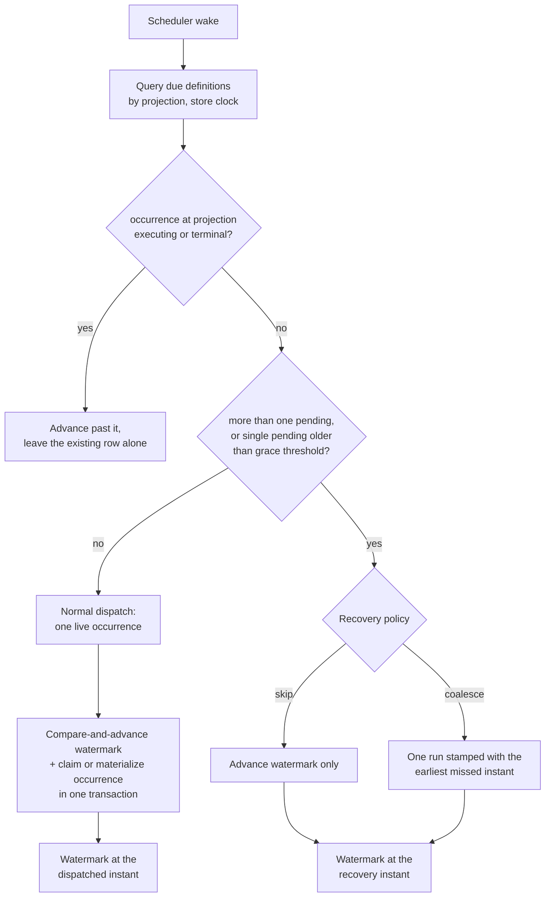
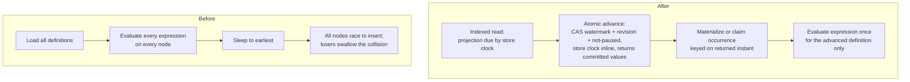

# Durable Cron Schedule Watermark and Misfire Recovery - Plan

## Goal Capsule

- Objective: give each cron definition a durable record of the instant through which its schedule has been reconciled, so missed occurrences become detectable, and the scheduler stops re-deriving every definition's next fire time on every node at every wake.
- Product authority: this artifact owns the schedule watermark, the dispatch selection path, and the skip and coalesce recovery policies. It does not own bounded catch-up, fencing dispatch on a schedule-interpretation change, overlap policy, operator-driven backfill, tenant cron fan-out, calendar exclusions, or dashboard authorization.
- Open blockers: none. Every product decision is settled and every planning question is resolved.
- Authority hierarchy: a requirement wins on product behavior; a Key Technical Decision wins on implementation mechanism within its cited requirements; an implementation unit overrides neither. `docs/solutions/design-patterns/temporal-authority-standard.md` outranks this plan on every clock question.
- Execution profile: five sequential slices, each its own branch and PR. U1–U5 must land and prove green on both relational providers before U6 begins, because U4 replaces the dispatch selection path everything else runs on.
- Stop conditions: stop and surface rather than guessing if the store-clock advance cannot be expressed as a single atomic statement on either relational provider, if the in-memory provider cannot match its observable semantics, or if a change would alter a Product Contract requirement rather than implement it.
- Tail ownership: each slice owns its own docs and conformance updates; U14 closes the remaining consumer-facing documentation.
- Product Contract preservation: unchanged. Planning refined mechanism only — see KTD1 and KTD2 for how R3, R12, and R24 are satisfied.

---

## Product Contract

### Summary

Give each cron definition a durable watermark recording the instant through which its schedule has been reconciled, plus a rebuildable projection of the next due occurrence. The watermark makes missed occurrences detectable and gives recovery an honest input; the projection is the indexed key that removes per-node cron evaluation from the scheduler's hot path. Recovery ships with two policies — skip and coalesce-one — matching what every comparable scheduler offers by default.

### Problem Frame

Headless Jobs persists what a schedule *is* (`CronJobEntity`) and what already dispatched (`CronJobOccurrenceEntity`). It persists nothing for reconciliation — no record of how far through its schedule a definition has been carried.

That state currently lives as an in-memory sleep timer. `JobsSchedulerBackgroundService` computes the time remaining until the earliest occurrence and sleeps exactly that long; the occurrence row is inserted later, at dispatch, inside the claim path. During the sleep window no row exists. A process that dies mid-sleep loses that occurrence with no trace, and on restart recomputes the next occurrence from the current time. Occurrences dispatched late today are only those already materialized by a resume or a schedule edit, or left unexecuted from a prior claim.

The same missing record costs throughput. Every node runs its own scheduler loop: each loads all cron definitions, evaluates `GetNextOccurrenceOrDefault` for every one of them, sleeps to the same computed instant, then wakes simultaneously with every other node and races to insert the same `(CronJobId, ExecutionTime)` row. The unique index resolves the race correctly and the losing node's `DbUpdateException` is caught and discarded. On an N-node cluster that is N-1 wasted transactions per occurrence, and cron evaluation cost scaling with definitions multiplied by nodes — correct, invisible, and scaling the wrong way on both axes.

### Key Decisions

- KD1. A durable per-definition schedule position as the record of reconciliation. (session-settled: user-directed — chosen over pre-materializing a horizon of occurrence rows and over a lateness-only contract with no durable position: six-field seconds-inclusive cron expressions make horizon row amplification untenable.) Governs R1, R3, R4.
- KD2. Store a watermark and derive the dispatch key from it, rather than storing a bare commitment to fire next. A watermark states what was accounted for, which stays true when a rule change invalidates any derived prediction, and skip advances it without anything firing. The projection remains the indexed dispatch key and is rebuildable at any time. Governs R1, R2.
- KD3. Ship skip and coalesce-one only; bounded catch-up is deferred. (session-settled: user-approved — chosen over shipping bounded catch-up in the same release: Quartz has offered cron triggers only `FireOnceNow` and `DoNothing` for two decades, systemd runs exactly one catch-up, and Hangfire's `Strict` is not its default. Multi-occurrence replay carried most of the design's complexity for its least-used policy.) Governs R18, R19.
- KD4. The evaluator is versioned so interpretation changes become visible, not so they can be blocked. Timezone rules, cron-library semantics, and DST interpretation can change while the expression and timezone string stay byte-identical, so a position derived under old rules would otherwise change meaning with no signal at all; no comparable scheduler fences this, so v1 surfaces the mismatch and rebases the affected projection immediately rather than blocking the definition until an operator intervenes. Governs R11.
- KD5. A dedicated watermark and projection that compose with `ScheduleRevision` rather than replacing it. `docs/plans/2026-07-17-001-feat-jobs-cron-pause-timezones-plan.md` KTD7 settled that the revision is definition-version metadata rather than a schedule position; the revision continues to fence stale-definition work. Governs R4, R5.
- KD6. Scheduler throughput is a co-equal goal, not a side effect. The projection is worth its cost on dispatch-path grounds even if no recovery policy ships. Governs R27, R28.
- KD7. The store owns the clock for every scheduling decision. Node wall clocks drift, and a fast node that advances the watermark early cannot be corrected by a slower one because the advance already happened; this follows the time authority the lease fields already use. Governs R12.
- KD8. A grace threshold is mandatory and its effective value is persisted per definition. (session-settled: user-approved — without one, a GC pause or thread-pool stall is indistinguishable from a real misfire and would fire recovery. Per-definition scope matches how timezone already resolves after #312 and how Kubernetes scopes `startingDeadlineSeconds`, since tolerance for lateness is a property of the job rather than of the host; persisting the resolved value rather than reading a local setting at evaluation time keeps two nodes from disagreeing about whether a tick misfired.) Governs R13, R14.
- KD9. Coalescing missed occurrences into one run is the default policy. (session-settled: user-approved — the default Hangfire, Quartz, and systemd independently converged on, and the least surprising outcome for a recurring job that missed its window.) Governs R18.
- KD10. Recovery policy is configurable through both the job function attribute and the runtime definition API, with the persisted runtime value authoritative. (session-settled: user-approved — every comparable scheduler puts this knob on the mutable definition rather than in code: Hangfire has no attribute at all, and Quartz has attributes available yet deliberately placed misfire on the persisted trigger. The attribute is a Headless-only convenience that seeds the definition at creation and is never reapplied during reconciliation, which makes an operator override self-evident without persisting a provenance marker.) Governs R17.
- KD11. A coalesced run reports the earliest missed instant as its scheduled instant. (session-settled: user-approved — chosen over the latest missed instant and over the recovery instant: prior art splits, so the tiebreaker is which value is safest when misused. A job doing incremental work from `ScheduledFor` silently loses the whole outage window under either alternative and merely reprocesses redundantly under this one. It is also the one value that is always exact, being the first occurrence after the watermark.) Governs R22.
- KD12. Counting missed occurrences is best-effort and never gates recovery. Recovery needs only to know that the watermark is behind, so counting exists for reporting; Kubernetes refuses to start a CronJob past 100 missed schedules and strands it permanently, which is the failure this avoids. Governs R15, R29.
- KD13. Only what the job consumes is persisted on the occurrence row; the rest is telemetry. (session-settled: user-approved — the watermark has already advanced past the backlog when a coalesced run executes, so the earliest instant and a recovery marker must survive independently of it, but persisting and propagating a count and range through every pickup, claim, and retry projection would be considerable work purely for reporting, and this repo has already lost a field that way once.) Governs R23.
- KD14. Recovery revokes ownership of a queued occurrence it repurposes. (session-settled: user-directed — chosen over having admission reload the durable row and over terminalizing the queued row and creating a fresh one: the claim path's in-progress stamp already requires `OwnerId == owner`, so a revoked row is dropped by its former owner through machinery that exists, with no cost on the normal execution path.) Governs R6.

### Actors

- A1. Scheduler node — one per host running Jobs; computes what is due, claims work, advances watermarks. Multiple nodes operate concurrently with no leader.
- A2. Storage provider — PostgreSQL, SQL Server, or in-memory; owns the atomicity guarantee and the time authority behind watermark advancement.
- A3. Job function — consumer code executing an occurrence; receives scheduling context about the run.

### Requirements

**Schedule watermark and dispatch projection**

- R1. Each cron definition carries a durable watermark holding the UTC instant through which its schedule has been reconciled.
- R2. Each cron definition carries a dispatch projection holding the first occurrence after the watermark, derivable from the watermark and the definition at any time.
- R3. A watermark advance commits atomically with whatever occurrence work accompanies it — materializing, claiming, repurposing, or nothing at all — so a crash leaves the whole step applied or none of it.
- R4. Advancement is a compare-and-advance requiring the observed watermark, the observed `ScheduleRevision`, and a non-paused definition, so concurrent nodes produce exactly one advancement and a node holding a stale definition cannot advance.
- R5. The watermark and projection are fields distinct from `ScheduleRevision`, which retains its definition-version meaning.
- R6. An occurrence at the projection's instant that has not begun executing — unclaimed, or claimed but still queued — is reused rather than duplicated during normal dispatch, and during recovery is resolved atomically by the selected policy: it becomes the single coalesced run or is transitioned to skipped, never left to execute alongside a run recovery created. Repurposing a claimed row revokes its ownership, so the prior owner's in-progress stamp fails its ownership predicate and the row is re-claimed carrying its persisted recovery stamp.
- R7. When the occurrence at the projection's instant is already executing or already terminal, the watermark advances past that instant without materializing a duplicate and without disturbing the existing row; a live row at that instant takes precedence over any terminal row sharing it.
- R8. Every persisted definition field that affects materialization advances `ScheduleRevision`, so a node holding a stale snapshot cannot apply superseded settings.
- R9. Every cron definition carries a watermark and a projection from the moment it is created — the watermark set to the store instant, the projection derived from it — so no definition ever exists in a state where the indexed query cannot select it, and no instant before its creation is treated as missed. A definition encountered without them is initialized by that same rule rather than from its occurrence history, so no separate upgrade path exists and none can replay a backlog.
- R10. Editing a definition's expression or timezone, and resuming a paused definition, set the watermark inside the same atomic transition that updates pause state and revision, so no window exposes a stale position and no crash can recover the paused interval.
- R11. An evaluation fingerprint covering cron-library semantics, timezone rule version, and DST interpretation is persisted with the projection. A sweep independent of dispatch surfaces every mismatch and rebases that definition by compare-and-advance: the new projection is derived from the watermark but anchored at or after the store instant, so a tick the changed rules move into the past is not replayed as a misfire; any non-terminal occurrence still sitting at the abandoned projection instant is terminalized in the same transaction, so an obsolete interpretation cannot execute alongside the current one; and the fingerprint is refreshed.

**Time authority**

- R12. Every instant that decides or derives a schedule position — due-ness, the grace comparison, the recovery instant, and initialization at create, edit, and resume — is read from a single time authority owned by the store: the database clock for relational providers and the injected `TimeProvider` for in-memory, never a node's wall clock.

**Misfire detection**

- R13. A grace threshold separates acceptable late dispatch from a misfire. Its effective value is persisted on the definition, seeded at creation from a scheduler-wide setting or the framework default, so every node evaluates the same threshold and no node's local configuration can decide whether a tick is a misfire.
- R14. A scheduled instant is pending when it falls at or before the current instant and the watermark has not passed it, whether or not an occurrence row exists for it. A definition enters recovery when more than one instant is pending at scheduler wake, or when its single pending instant is older than the current instant minus the grace threshold.
- R15. Recovery decides what to do from the watermark alone and never depends on a complete count; missed occurrences are counted for reporting under a framework-level evaluation ceiling, and a backlog exceeding it reports a lower bound rather than enumerating further.
- R16. Intervals during which a definition was paused never count as missed occurrences.

**Recovery policy**

- R17. Recovery policy is configurable on the job function attribute and through the runtime definition API; the attribute supplies a value only when a definition is created and is never applied during reconciliation, so any later persisted value is an operator override by construction and no provenance marker is needed.
- R18. The default policy materializes exactly one run for a recovery regardless of how many occurrences were missed.
- R19. The skip policy advances the watermark past all missed occurrences without materializing any run.
- R20. Both policies leave the watermark at the recovery instant, so the backlog they resolved is never reconsidered; a schedule whose interval is shorter than the scheduler's wake latency will legitimately enter recovery again on the following wake, which is the correct outcome rather than a fault.

**Job-visible scheduling context**

- R21. An executing occurrence exposes its scheduled instant, its lateness, and — when it is a recovery run — its persisted recovery marker to `JobFunctionContext`.
- R22. A coalesced run reports the earliest missed instant as its scheduled instant, which is the first occurrence after the watermark and is therefore exact regardless of how large the backlog is.
- R23. The occurrence row persists only the earliest missed instant and a marker that the run is a recovery, and both are carried through every pickup, claim, and retry projection so a run reclaimed after a restart still reports what it stands for. The missed count and the latest instant evaluation reached are emitted as telemetry when recovery runs and are never persisted or propagated.

**Provider behavior**

- R24. Relational providers advance the watermark in the same transaction as any occurrence materialization or claim it accompanies, and in a transaction of its own when the selected policy materializes nothing.
- R25. The in-memory provider offers atomicity equivalent to the relational path for watermark advancement and occurrence creation.
- R26. Cross-provider conformance coverage lives in the existing Jobs harness rather than duplicated per provider project.

**Scheduler dispatch path**

- R27. Scheduler wake selects due definitions through an indexed query over the projection instead of evaluating every definition's expression on every node, and stale-fingerprint definitions are selected by the R11 sweep independently of projection due-ness so a rule change that moves an occurrence earlier is never hidden behind the stale later projection.
- R28. A node that loses a dispatch race completes without a failed insert.

**Observability**

- R29. Missed, skipped, coalesced, and recovered occurrence counts, plus evaluation-fingerprint mismatches, are observable through the framework's existing telemetry surface, with lower-bound counts distinguishable from exact ones.

### Watermark lifecycle at scheduler wake

### Key Flows

- F1. Normal dispatch
  - **Trigger:** A definition has exactly one pending occurrence and it falls within the grace threshold.
  - **Actors:** A1, A2
  - **Steps:** Node selects due definitions by projection against the store clock; compare-and-advance the watermark while claiming an unowned existing occurrence or materializing a new one in the same transaction, matching watermark, revision, and non-paused state; losing nodes observe zero rows advanced and continue.
  - **Outcome:** No more than one live occurrence exists for the instant, and the projection points at the next occurrence after the new watermark.
  - **Covers R1, R2, R3, R4, R6, R7, R12, R27, R28.**

- F2. Recovery after downtime
  - **Trigger:** A node wakes and finds a definition with more than one pending occurrence, or with a single pending occurrence older than the grace threshold.
  - **Actors:** A1, A2, A3
  - **Steps:** Apply the definition's recovery policy from the watermark without waiting on a count; materialize one run for coalesce or none for skip, resolve any occurrence already sitting at a pending instant under the same policy, stamp the earliest missed instant and the recovery marker on any materialized run, and advance the watermark to the recovery instant in one transaction; count the backlog under the evaluation ceiling for telemetry only, excluding any paused interval.
  - **Outcome:** The watermark sits at the recovery instant, any materialized run durably carries the instant it stands for, and the count is emitted as telemetry with its lower-bound state.
  - **Covers R6, R14, R15, R16, R18, R19, R20, R22, R23, R29.**

- F3. Schedule interpretation changes
  - **Trigger:** The fingerprint sweep finds a definition whose persisted evaluation fingerprint does not match the running evaluator.
  - **Actors:** A1, A2
  - **Steps:** Record the mismatch and surface it through telemetry, then in one compare-and-advance re-derive that definition's projection from its watermark anchored at or after the store instant, terminalize any non-terminal occurrence left at the abandoned instant, and refresh the fingerprint — independently of whether the stale projection was due.
  - **Outcome:** The projection reflects current interpretation immediately, an occurrence the new rules moved earlier is not suppressed behind the stale later value, no interval is replayed as a misfire, and the drift is visible to operators.
  - **Covers R11, R29.**

### Acceptance Examples

- AE1. Coalesced recovery across a multi-occurrence outage
  - **Covers R18, R20, R22.**
  - **Given:** An hourly definition on the default policy with its watermark at 14:00.
  - **When:** Every node is down from 14:05 to 17:30 and one restarts.
  - **Then:** One run is materialized reporting 15:00 as its scheduled instant and marked as a recovery run, telemetry records three missed occurrences, and the watermark advances to 17:30.

- AE2. Skip policy over the same outage
  - **Covers R19, R20.**
  - **Given:** The same definition and outage, with the skip policy set.
  - **When:** A node restarts at 17:30.
  - **Then:** No run is materialized, and the watermark advances to 17:30.

- AE3. A single late occurrence inside the grace threshold is not a misfire
  - **Covers R13, R14.**
  - **Given:** An hourly definition with one pending occurrence, delayed by less than the grace threshold.
  - **When:** The scheduler wakes.
  - **Then:** The occurrence dispatches normally and no recovery runs.

- AE4. Two nodes contend for one due definition
  - **Covers R4, R28.**
  - **Given:** Two nodes wake simultaneously and observe the same watermark.
  - **When:** Both attempt to advance it.
  - **Then:** One advances and materializes the occurrence, the other observes zero rows advanced and completes without a failed insert.

- AE5. Crash between advancement and materialization
  - **Covers R3.**
  - **Given:** A node crashes partway through dispatching a due definition.
  - **When:** Any node next wakes.
  - **Then:** Either the watermark advanced and the occurrence exists, or neither happened and the definition is dispatched normally.

- AE6. A paused interval produces no misfire
  - **Covers R10, R16.**
  - **Given:** A definition paused at 14:00 and resumed at 17:30.
  - **When:** The scheduler evaluates it after resume.
  - **Then:** No occurrences are treated as missed, and the watermark sits at the resume instant.

- AE7. A sub-grace backlog still routes to recovery
  - **Covers R14, R20.**
  - **Given:** A one-second definition and a grace threshold of sixty seconds, with the scheduler stalled for ten seconds so ten occurrences are pending.
  - **When:** The scheduler wakes.
  - **Then:** Recovery applies despite no single occurrence exceeding the grace threshold, and the watermark lands on the recovery instant.

- AE8. Skip recovery does not execute a resume-created row
  - **Covers R6, R19.**
  - **Given:** A definition on the skip policy with an unowned resume-created occurrence at the oldest missed instant, after downtime long enough to leave several ticks overdue.
  - **When:** A node restarts and evaluates the definition.
  - **Then:** The existing occurrence is transitioned to skipped rather than executed, no run is materialized, and the watermark advances past every missed instant.

- AE9. The projection meets an occurrence another node is executing
  - **Covers R7.**
  - **Given:** A rolling deployment leaves the occurrence at the projection owned and in progress on another node.
  - **When:** A node evaluates that definition.
  - **Then:** The watermark advances past that instant, the running occurrence is left alone, and no second occurrence is created for it.

- AE10. The projection meets an occurrence that already completed
  - **Covers R7.**
  - **Given:** A resume-created occurrence at the projection's instant finished before a watermark-aware node evaluated the definition, so the filtered unique index no longer covers it.
  - **When:** That node evaluates the definition.
  - **Then:** The watermark advances past the instant and the completed occurrence is not executed a second time.

- AE11. A coalesced run reclaimed after restart still knows its backlog
  - **Covers R23.**
  - **Given:** A coalesced occurrence is materialized with its recovery stamp and the process dies before executing it.
  - **When:** Another node reclaims and executes it, by which point the watermark has moved past the backlog.
  - **Then:** The run still reports the earliest missed instant it was stamped with and that it is a recovery run.

- AE12. A backlog beyond the evaluation ceiling still recovers
  - **Covers R15, R22, R29.**
  - **Given:** A one-second definition after downtime long enough to exceed the evaluation ceiling.
  - **When:** A node restarts and evaluates it.
  - **Then:** Recovery proceeds without a complete count, the scheduled instant is still exact because it is the first occurrence after the watermark, telemetry reports the count as a lower bound, and the watermark still advances to the recovery instant.

- AE13. A node with a fast clock cannot dispatch early
  - **Covers R12.**
  - **Given:** One node's wall clock runs ahead of the store's clock by more than the grace threshold.
  - **When:** That node evaluates a definition whose projection is not yet due by the store clock.
  - **Then:** The definition is not treated as due, the watermark does not advance, and no occurrence is materialized early.

- AE14. A timezone rule update surfaces without replaying anything
  - **Covers R11, R29.**
  - **Given:** A monthly definition whose persisted projection was derived before a tzdata update that shifts its local firing time, with the expression and timezone string unchanged.
  - **When:** The fingerprint sweep runs on an upgraded node.
  - **Then:** The mismatch is recorded and surfaced, the sweep re-derives the projection under current rules even though the stale projection was not yet due, any live occurrence left at the abandoned instant is terminalized so the old interpretation cannot also run, the new projection lands at or after the store instant so nothing is replayed as missed, and the earlier occurrence the new rules introduced is not suppressed.

- AE15. A queued occurrence repurposed by recovery carries its context
  - **Covers R6, R23.**
  - **Given:** An occurrence at the earliest missed instant has already been claimed and queued by a node, but has not begun executing, when recovery runs under the coalesce policy.
  - **When:** Recovery repurposes that row as the coalesced run.
  - **Then:** Its ownership is revoked, the former owner's in-progress stamp fails and it drops the item, and the row executes once after re-claim reporting its persisted recovery stamp.

- AE16. A runtime policy override survives attribute reconciliation
  - **Covers R17.**
  - **Given:** A definition whose recovery policy was changed through the runtime API away from its attribute value.
  - **When:** The application restarts and reconciles declared job functions.
  - **Then:** The persisted runtime policy remains in force and the attribute value does not overwrite it.

### Scope Boundaries

**Deferred for later**

- Bounded catch-up that materializes more than one missed occurrence. It carried the majority of this design's complexity — age and count bounds, truncation semantics, exact-tail reporting, and a reverse-occurrence lookup — for the least-used of the three candidate policies. Adding it later needs a third policy value and a bound; the watermark already supports it.
- Fencing dispatch on the evaluation fingerprint so a changed interpretation cannot take effect until an operator approves it. R11 surfaces the change and rebases the projection immediately; preventing the new interpretation from applying at all needs a monotonic evaluator generation, equal-generation conflict rules, and spin prevention during rolling deployments, none of which any comparable scheduler ships, and quarantining mismatched definitions would stall every affected schedule on a routine tzdata update.
- Overlap policy — what happens when a recovered run collides with an occurrence still executing. Kubernetes (`concurrencyPolicy`), Temporal (`ScheduleOverlapPolicy`), and Quartz (`DisallowConcurrentExecution`) all treat this as a dimension independent of recovery, and Headless today has only a `MaxConcurrency` throughput limit.
- Operator-driven backfill over an explicit date range. Temporal's `BackfillRequest` and Airflow's Backfill API keep deliberate historical replay separate from crash recovery.
- Leader election for cron scheduling. A leader still needs a durable watermark to know what it missed across failover.
- Jitter or randomized start spreading, as in Temporal's `--jitter` and systemd's `RandomizedDelaySec=`.

**Outside this work's identity**

- Per-tenant cron schedules and framework-level tenant fan-out.
- Calendar exclusions and general workflow scheduling.
- Re-deriving DST and timezone rules. The gap and overlap behavior settled in #312 is inherited unchanged; R11 observes that interpretation rather than changing it.

### Dependencies / Assumptions

- Depends on #312 (merged), which supplies per-definition timezones, durable pause and resume, the `ScheduleRevision` fence, and the DST gap and overlap rules in `src/Headless.Jobs.Core/CronScheduleCache.cs`.
- The resume path and the atomic-update path already persist a live future-dated occurrence before it is due, so the projection must coexist with rows it did not create and may find already owned or already finished.
- The existing `UQ_CronJobId_ExecutionTime` index is filtered to `Idle`, `Queued`, and `InProgress`, so it backstops duplicates only among non-terminal rows; R7 rather than the index prevents re-running a terminal instant.
- Scheduler nodes running different Headless versions must not operate concurrently. A version without the watermark can re-materialize a tick a watermark-aware node already completed, which the filtered index cannot block once that row is terminal. Consumers upgrade every scheduler node together, matching the operational boundary #312 already established; no in-product fence enforces it, and rolling-upgrade safety across framework versions is not promised.
- Assumes next-occurrence evaluation is exclusive of the instant it is given, so repeated advancement always makes forward progress.
- The forward-only next-occurrence traversal the evaluator already provides is sufficient for every requirement here; backward traversal becomes necessary only if bounded catch-up is later added.

### Outstanding Questions

**Resolve Before Planning**

- None.

**Deferred to Planning**

- Default values for the grace threshold and the evaluation ceiling. Quartz.NET's 60-second misfire threshold is available as precedent.
- Whether the evaluation fingerprint in R11 hashes the tzdata version, the resolved offsets for the definition's own schedule, or both, and how often the sweep runs.
- Watermark, projection, and fingerprint field naming, storage types, and index shape.
- Which persisted definition fields count as materialization inputs under R8, given that `Retries`, `RetryIntervals`, and `OnNodeDeath` currently update without advancing the revision.
- How the store clock in R12 is read per provider without adding a round trip to every wake.
- The storage shape for the persisted earliest-missed instant and recovery marker in R23, and which projections must carry them.
- Telemetry instrument names and counter shape behind R29. Temporal's `schedule_missed_catchup_window` is a naming precedent.

### Sources / Research

- `src/Headless.Jobs.Core/BackgroundServices/JobsSchedulerBackgroundService.cs` lines 162-186 — sleep-until-next-occurrence loop; reconciliation state exists only as a sleep duration.
- `src/Headless.Jobs.Core/Managers/InternalJobsManager.cs` line 343 — per-definition next-from-now evaluation across all definitions at each wake.
- `src/Headless.Jobs.EntityFramework/Infrastructure/JobsClaimStrategy.cs` lines 433 and 464-468 — the `ScheduleRevision` fence, and the swallowed duplicate-insert exception that hides dispatch contention.
- `src/Headless.Jobs.EntityFramework/Infrastructure/JobsEFCorePersistenceProvider.cs` lines 416-440 — the revision advances only for expression and timezone changes, which is the gap R8 closes.
- `src/Headless.Jobs.EntityFramework/Configurations/CronJobOccurrenceConfigurations.cs` lines 46-50 — the unique index and its `Idle`/`Queued`/`InProgress` filter.
- `src/Headless.Jobs.Abstractions/Entities/CronJobOccurrenceEntity.cs` — `LockedUntil` already documents the store-clock time authority that R12 extends to scheduling decisions.
- `src/Headless.Jobs.Abstractions/Base/JobFunctionContext.cs` line 80 — `ScheduledFor` is a single instant, which is why R22 is a projection of the fuller context.
- `src/Headless.Jobs.Abstractions/Interfaces/Managers/ICronJobManager.cs` and `src/Headless.Jobs.Abstractions/Base/JobFunctionAttribute.cs` — the two surfaces R17 reconciles.
- `docs/plans/2026-07-17-001-feat-jobs-cron-pause-timezones-plan.md` — KTD3 (resume without a recovery cursor) and KTD7 (`ScheduleRevision` is not a misfire cursor).
- The repo learning that retry recovery broke when `RetryCount` was omitted from a pickup projection is the precedent behind R23; recovery metadata fails the same way if any projection drops it.
- Quartz.NET — `MisfireInstruction.CronTrigger` offers only `FireOnceNow` and `DoNothing`, with a `misfireThreshold` defaulting to 60 seconds; no backfill instruction exists for cron triggers. `MISFIRE_ORIG_FIRE_TIME` is persisted during misfire recovery and cleared afterward (`src/Quartz/Impl/AdoJobStore/StdAdoDelegate.Triggers.cs`), keeping original schedule identity separate from recovery execution time. The primary precedent for KD3.
- systemd timers — `Persistent=` stores the last trigger time on disk and fires once immediately if the unit would have triggered at least once while inactive, subject to `RandomizedDelaySec=`. Independent convergence on coalesce-one.
- Hangfire `MisfireHandlingMode` (`src/Hangfire.Core/MisfireHandlingMode.cs`): `Relaxed` creates one job regardless of missed count, `Strict` creates one per missed occurrence unbounded, `Ignorable` creates none. `Relaxed` is the default; it persists both `LastExecution` and `NextExecution`. In `RecurringJobEntity.ScheduleNext`, `Relaxed` assigns `next = now` and discards the missed instant entirely, so the enqueued job reports the recovery time — the opposite end of the range from KD11, and the reason that decision rests on a safety argument rather than on prior-art consensus. Policy lives on `RecurringJobOptions` and is persisted; there is no attribute surface.
- Temporal Schedules — `CatchupWindow` bounds recovery by age (default one year, minimum ten seconds), `ScheduleOverlapPolicy` handles collisions as an independent dimension, `BackfillRequest` keeps deliberate replay separate, and `schedule_missed_catchup_window` is a first-class metric.
- Kubernetes CronJob — `startingDeadlineSeconds` is an age window that also scopes missed-schedule counting, `concurrencyPolicy` is independent of it, and the controller refuses to start past 100 missed schedules with `too many missed start times ... or check clock skew`. The refusal is the behavior KD12 rejects; the error text's clock-skew warning is the hazard R12 removes.
- Apache Airflow — `catchup` is binary and unbounded when true, mitigated only by `max_active_runs`; its timetables expose backward alignment alongside forward traversal, which is the capability bounded catch-up would need.
- GitHub issue #676, which parked this design pending #312.

---

## Planning Contract

### Key Technical Decisions

- KTD1. Advance the watermark with a single atomic statement carrying the store clock inline, not a transaction wrapping advance-plus-insert. (session-settled: user-approved — chosen over one enclosing transaction: `docs/solutions/design-patterns/temporal-authority-standard.md` forbids sampling the store clock into a parameter, and `docs/solutions/design-patterns/atomic-database-clock-relational-lease-claims.md` forbids an explicit transaction around a database-clock write because PostgreSQL freezes `now()` at transaction open, which would make the recovery instant stale by the transaction's age.) Governs R3, R24.
- KTD2. Split time authority by the framework's four-row table rather than routing every instant to the store. Deriving a fire time from an expression is tz-database authority and stays in `CronScheduleCache`; the projection comparison and grace comparison are visibility decisions and go to the store clock inline; `CreatedAt`/`UpdatedAt` stay on the injected `TimeProvider`; the in-memory provider uses `TimeProvider` throughout as its coherent single-process clock. Governs R12.
- KTD3. Self-healing replaces transactional atomicity for the advance-then-materialize window. A crash between the two leaves a watermark with no occurrence; the next wake re-derives the projection from the watermark and materializes it, and the filtered uniqueness index makes a repeated insert idempotent. This is the same crash-mid-claim recovery the timed-descendant claim path already relies on. Governs R3.
- KTD4. Read committed values back rather than recomputing them. The advance statement returns the persisted watermark, projection, and store instant, following the existing claim-timestamp read-back so no caller re-derives a value the database already decided. Governs R3, R12.
- KTD5. Revoking ownership rides the existing ownership predicate. The claim path's in-progress transition already requires `OwnerId == owner`, so clearing the owner is sufficient to make the prior owner drop the item. (session-settled: user-directed — chosen over admission reloading the durable row and over terminalize-then-recreate: no new machinery and no cost on the normal execution path.) Governs R6.
- KTD6. Persist the resolved grace threshold and recovery policy on the definition, seeded at creation and never reapplied. A scheduler-wide value read at evaluation time would let two nodes disagree about whether the same instant misfired, and never reapplying the seed makes an operator override self-evident without a provenance marker. Governs R13, R17.
- KTD7. Run the fingerprint sweep as its own hosted service rather than folding it into the scheduler loop. It must select stale definitions independently of projection due-ness, which is the opposite selection criterion from dispatch. Governs R11, R31.
- KTD8. Extend the existing internal instrumentation surface; do not introduce a metrics surface. Jobs ships an `ActivitySource` and logger-based instrumentation today with no counters, and adding a meter is a larger cross-cutting decision than this work needs. Governs R29, R33.

### High-Level Technical Design

The dispatch path inverts. Today every node loads all definitions and evaluates every expression to find the earliest; afterwards the store answers that question with an indexed read, and expression evaluation happens only for the definitions that actually advanced.

Two writers touch a definition's schedule position, and they select on opposite criteria — dispatch takes projection-due rows, the sweep takes fingerprint-stale rows. Both use the same compare-and-advance fence, so neither can act on a stale read.

### Sequencing

U1 through U5 form one landing group: the fields, the advance primitive on both relational providers, the in-memory equivalent, the dispatch-path replacement, and the definition-lifecycle write paths. U4 is the risk concentration — it removes the selection path every other slice depends on, and it cannot be feature-flagged cleanly because the old path derives from data the new one no longer maintains. Both relational integration suites must pass before U6.

U6 through U8 add recovery on top of a proven advance. U9 and U10 expose configuration and context and can proceed once U7 defines what there is to configure. U11 and U12 are independent of recovery and could land earlier, but they write the same fields as U2, so they follow it. U13 and U14 close observability and documentation last, when the behavior they describe has stopped moving.

### System-Wide Impact

- Public API grows on `CronJobEntity`, `CronJobOccurrenceEntity`, `JobFunctionAttribute`, `JobFunctionContext`, and `ICronJobManager`. Every one is a consumer-facing contract in `Headless.Jobs.Abstractions`.
- The scheduler's wake cost stops scaling with definition count multiplied by node count. This is the plan's performance goal, not a side effect.
- The Dashboard reads occurrences and definitions; new fields are additive and it needs no change to keep working, but recovery-stamped occurrences will surface there.
- The source generator validates cron expressions at build time and is unaffected — the fingerprint concerns runtime interpretation, not expression syntax.

### Risks

- The advance must be one atomic statement on both PostgreSQL and SQL Server with the clock inline. If either provider cannot express the CAS and the clock read in a single statement, KTD1 is infeasible and the plan stops rather than falling back to a sampled clock.
- CI runs unit tests only, so no provider regression in U2, U3, U7, or U12 will be caught by merge gates. Both relational integration suites must be run locally for each of those units.
- Coalesce-one changes observable behavior for every definition on the default policy. The pause/timezone work's assertions that resume never replays an interval are now wrong and must be updated, not worked around.

---

## Implementation Units

| U-ID | Title | Primary files | Depends on |
|---|---|---|---|
| U1 | Schedule-position and recovery fields | `src/Headless.Jobs.Abstractions/Entities/`, `src/Headless.Jobs.EntityFramework/Configurations/` | — |
| U2 | Relational atomic advance primitive | `src/Headless.Jobs.EntityFramework/Infrastructure/` | U1 |
| U3 | In-memory advance parity | `src/Headless.Jobs.Core/Provider/` | U1 |
| U4 | Indexed dispatch selection | `src/Headless.Jobs.Core/Managers/`, `src/Headless.Jobs.Core/BackgroundServices/` | U2, U3 |
| U5 | Definition lifecycle write paths | `src/Headless.Jobs.EntityFramework/Infrastructure/`, `src/Headless.Jobs.Core/Provider/` | U2, U3 |
| U6 | Pending-instant and recovery detection | `src/Headless.Jobs.Core/Managers/` | U4, U5 |
| U7 | Skip and coalesce policies | `src/Headless.Jobs.Core/Managers/`, `src/Headless.Jobs.EntityFramework/Infrastructure/` | U6 |
| U8 | Harness conformance for position and recovery | `tests/Headless.Jobs.EntityFramework.Tests.Harness/` | U7 |
| U9 | Policy and grace configuration surface | `src/Headless.Jobs.Abstractions/Base/`, `src/Headless.Jobs.Abstractions/Interfaces/Managers/` | U7 |
| U10 | Job-visible scheduling context | `src/Headless.Jobs.Abstractions/Base/`, `src/Headless.Jobs.Core/` | U7 |
| U11 | Evaluation fingerprint computation | `src/Headless.Jobs.Core/` | U1 |
| U12 | Fingerprint sweep service | `src/Headless.Jobs.Core/BackgroundServices/` | U11, U2, U3 |
| U13 | Recovery observability | `src/Headless.Jobs.Abstractions/Instrumentation/`, `src/Headless.Jobs.Core/Instrumentation/` | U7, U12 |
| U14 | Documentation sync | `docs/llms/jobs.md`, `src/Headless.Jobs.Core/README.md` | U13 |

### U1. Schedule-position and recovery fields

- **Goal:** Persist the watermark, projection, evaluation fingerprint, resolved grace threshold, and recovery policy on the cron definition, plus the earliest-missed instant and recovery marker on the occurrence.
- **Requirements:** R1, R2, R5, R13, R17, R23.
- **Dependencies:** none.
- **Files:** `src/Headless.Jobs.Abstractions/Entities/CronJobEntity.cs`, `src/Headless.Jobs.Abstractions/Entities/CronJobOccurrenceEntity.cs`, `src/Headless.Jobs.EntityFramework/Configurations/CronJobConfigurations.cs`, `src/Headless.Jobs.EntityFramework/Configurations/CronJobOccurrenceConfigurations.cs`, `src/Headless.Jobs.EntityFramework/Infrastructure/JobsRelationalMappings.cs`, `tests/Headless.Jobs.Composition.Tests.Unit/`
- **Approach:** Add the fields as `virtual` properties following the existing entity style. Index the projection for the due query per R31. Keep the fields distinct from `ScheduleRevision` per R5 and KD5. Extend `JobsRelationalMappings` so the column names stay explicit rather than convention-derived.
- **Patterns to follow:** `CronJobEntity.ScheduleRevision` for a scheduler-owned scalar with an explicit mapping and a default; `CronJobOccurrenceEntity.RetryCount` for an occurrence field with an `internal` setter.
- **Test scenarios:**
  - A definition round-trips watermark, projection, fingerprint, grace, and policy through the relational model without precision loss on either provider.
  - An occurrence round-trips the earliest-missed instant and recovery marker.
  - The projection index exists with the expected name on the generated model.
  - A definition created with no explicit grace or policy persists the framework defaults rather than null.
- **Verification:** `make build-project` succeeds for the abstractions and EF packages, and the composition unit tests pass.

### U2. Relational atomic advance primitive

- **Goal:** Express the watermark advance as one atomic statement with the store clock inline, returning the committed watermark, projection, and store instant.
- **Requirements:** R3, R4, R12, R24, R32.
- **Dependencies:** U1.
- **Files:** `src/Headless.Jobs.EntityFramework/Infrastructure/JobsClaimStrategy.cs`, `src/Headless.Jobs.EntityFramework/Infrastructure/JobsEFCorePersistenceProvider.cs`, `src/Headless.Jobs.EntityFramework/Infrastructure/BasePersistenceProvider.cs`, `src/Headless.Jobs.Abstractions/Interfaces/IJobPersistenceProvider.cs`
- **Approach:** One `ExecuteUpdate`-shaped statement gated on the observed watermark, observed `ScheduleRevision`, and non-paused state, with the store clock expressed inside the statement and never bound as a parameter. Run it in autocommit, not inside an explicit transaction, per KTD1. Return the persisted values rather than recomputing them, following the claim-timestamp read-back. A losing racer observes zero rows affected and returns without an exception, replacing the current swallowed insert collision.
- **Execution note:** Land this against a deliberately skewed application clock in test so an accidental reintroduction of the app clock fails rather than passes.
- **Patterns to follow:** the root lease-deadline write and its two DB-clock invariants in `JobsClaimStrategy`; `claimTimestamps` for reading persisted values back; the revision-equality gate already used for definition fencing.
- **Test scenarios:**
  - An advance from the observed watermark succeeds and returns the next projection.
  - An advance whose observed watermark no longer matches affects zero rows and raises nothing.
  - An advance whose observed `ScheduleRevision` no longer matches affects zero rows.
  - An advance against a paused definition affects zero rows.
  - Two concurrent advances from the same observed watermark produce exactly one winner.
  - With the application clock skewed hours ahead of the database, due-ness and the returned instant still follow the database clock.
  - The statement runs outside an explicit transaction, so the returned instant is not frozen at transaction open.
- **Verification:** both relational integration suites pass locally; the skewed-clock scenarios fail if the clock is sampled into a parameter.

### U3. In-memory advance parity

- **Goal:** Give the in-memory provider advance semantics observably equivalent to the relational path.
- **Requirements:** R3, R4, R25.
- **Dependencies:** U1.
- **Files:** `src/Headless.Jobs.Core/Provider/JobsInMemoryPersistenceProvider.cs`
- **Approach:** Perform the compare-and-advance under the existing per-definition lock, using the injected `TimeProvider` as the coherent single-process clock per KTD2 and the lease-mechanic guidance. Return the same committed-value shape as the relational primitive so callers cannot tell the providers apart.
- **Patterns to follow:** the per-definition lock already guarding pause, resume, and expression edits in this provider.
- **Test scenarios:**
  - An advance from the observed watermark succeeds and returns the next projection.
  - A mismatched watermark, mismatched revision, or paused definition each yields no advance.
  - Concurrent advances from the same observed watermark produce exactly one winner.
  - Advancing a definition does not mutate a sibling definition's position.
- **Verification:** `make test-project` passes for the Jobs unit suites with no Docker dependency.

### U4. Indexed dispatch selection

- **Goal:** Select due definitions by an indexed projection read instead of evaluating every expression on every node.
- **Requirements:** R31, R32, R12.
- **Dependencies:** U2, U3.
- **Files:** `src/Headless.Jobs.Core/Managers/InternalJobsManager.cs`, `src/Headless.Jobs.Core/BackgroundServices/JobsSchedulerBackgroundService.cs`, `src/Headless.Jobs.Abstractions/Interfaces/IJobPersistenceProvider.cs`
- **Approach:** Replace the load-all-then-evaluate path with a provider query over the projection ordered by due time, evaluated against the store clock. Retire the cached all-definitions read from the tick path along with its invalidation coupling. Keep the sleep-until-next shape — the projection supplies the wake instant, so scheduling latency is unchanged while the derivation moves to the store.
- **Execution note:** This is the plan's riskiest change. Prove the existing cron integration suites green on both providers before moving on.
- **Patterns to follow:** the existing earliest-occurrence provider query for the shape of an indexed scheduler read.
- **Test scenarios:**
  - With many definitions and one due, only the due definition is selected.
  - No expression is evaluated for a definition that is not due.
  - Two nodes waking together select the same due definition and exactly one advances it.
  - A paused definition is never selected.
  - The scheduler sleeps to the projection instant rather than a recomputed one.
  - Editing an expression takes effect on the next wake without waiting on a cache expiry.
- **Verification:** both relational integration suites pass locally; the existing cron pause and timezone suites stay green.

### U5. Definition lifecycle write paths

- **Goal:** Set the watermark, projection, and fingerprint wherever a definition is created, edited, resumed, or paused.
- **Requirements:** R9, R10, R12.
- **Dependencies:** U2, U3.
- **Files:** `src/Headless.Jobs.EntityFramework/Infrastructure/JobsEFCorePersistenceProvider.cs`, `src/Headless.Jobs.Core/Provider/JobsInMemoryPersistenceProvider.cs`, `src/Headless.Jobs.Core/Managers/JobsManager.cs`, `src/Headless.Jobs.Core/BackgroundServices/JobsInitializationHostedService.cs`
- **Approach:** Extend the existing atomic pause, resume, and edit transitions so they write the position alongside the pause state and revision they already bump, per R10. Seeding at startup sets the position at creation. A definition found without a position is initialized by the same creation rule rather than from its occurrence history, per R9.
- **Patterns to follow:** the atomic resume path that already clears pause, bumps the revision, and inserts a replacement occurrence in one operation.
- **Test scenarios:**
  - A newly seeded definition has a watermark and a projection immediately.
  - Resuming a paused definition sets the watermark to the resume instant and derives a strictly later projection.
  - Editing an expression recomputes the projection from the edit instant.
  - Pausing leaves the position untouched and the definition unselectable.
  - A definition encountered with no position is initialized without producing a backlog.
  - A crash between clearing pause and writing the position cannot leave a resumable definition with a pre-pause position.
- **Verification:** both relational integration suites pass; existing pause and resume assertions stay green except where U14 updates them.

### U6. Pending-instant and recovery detection

- **Goal:** Decide when a definition enters recovery, from the watermark and the store clock.
- **Requirements:** R14, R15, R16, R13.
- **Dependencies:** U4, U5.
- **Files:** `src/Headless.Jobs.Core/Managers/InternalJobsManager.cs`, `src/Headless.Jobs.Core/CronScheduleCache.cs`
- **Approach:** A pending instant is one at or before the store instant that the watermark has not passed, whether or not a row exists, per R14. Recovery triggers on more than one pending instant, or on a single pending instant older than the definition's persisted grace threshold. Counting is bounded by an evaluation ceiling and never gates the decision, per R15 — the decision needs only that the watermark is behind. Exclude paused intervals per R16.
- **Patterns to follow:** `CronScheduleCache` for expression evaluation and its DST gap and overlap handling, which this must not re-derive.
- **Test scenarios:**
  - One pending instant inside the grace threshold is not a misfire.
  - One pending instant older than the grace threshold enters recovery.
  - Two pending instants enter recovery regardless of age.
  - A high-frequency definition whose interval is shorter than wake latency enters recovery on consecutive wakes without error.
  - A backlog beyond the evaluation ceiling still decides correctly and reports a lower-bound count.
  - An interval spanning a pause produces no pending instants for the paused span.
  - A definition whose grace differs from the scheduler default uses its own persisted value.
- **Verification:** Jobs unit suites pass; the ceiling scenario completes without unbounded evaluation.

### U7. Skip and coalesce policies

- **Goal:** Apply the two recovery policies, resolving any pre-existing occurrence at a pending instant under the same policy.
- **Requirements:** R6, R7, R18, R19, R20, R22, R23.
- **Dependencies:** U6.
- **Files:** `src/Headless.Jobs.Core/Managers/InternalJobsManager.cs`, `src/Headless.Jobs.Core/Managers/CronJobOccurrenceFactory.cs`, `src/Headless.Jobs.EntityFramework/Infrastructure/JobsClaimStrategy.cs`, `src/Headless.Jobs.Core/Provider/JobsInMemoryPersistenceProvider.cs`
- **Approach:** Coalesce materializes one run stamped with the earliest missed instant and the recovery marker, per R22 and R23; skip materializes none. A not-yet-executing occurrence at a pending instant is resolved by the selected policy rather than left to run — repurposed as the coalesced run with its ownership revoked per KTD5, or transitioned to skipped. An executing or terminal occurrence is stepped past without disturbance per R7, with a live row taking precedence over a terminal one sharing the instant. Both policies leave the watermark at the recovery instant per R20.
- **Patterns to follow:** the pause path's existing treatment of pending `Idle`/`Queued` occurrences versus preserved `InProgress` work, which is the same not-yet-executing boundary; `SkippedReason` for terminalizing with a cause.
- **Test scenarios:**
  - Covers AE1. Coalesce over a multi-occurrence outage produces one run reporting the earliest missed instant.
  - Covers AE2. Skip over the same outage produces no run and advances the watermark.
  - Covers AE8. A sub-grace backlog routes to policy rather than normal dispatch.
  - Covers AE9. Skip transitions an unowned pre-existing occurrence to skipped instead of executing it.
  - Covers AE10. An executing occurrence at the instant is left alone and not duplicated.
  - Covers AE11. A completed occurrence at the instant is not executed a second time.
  - Covers AE15. A queued occurrence repurposed by coalesce has its ownership revoked, is dropped by its former owner, and runs once carrying its stamp.
  - Coalesce stamps the earliest missed instant exactly even when the count saturated.
  - Recovery leaves no more than one live occurrence per instant.
- **Verification:** both relational integration suites and the Jobs unit suites pass; no scenario produces two live occurrences for one instant.

### U8. Harness conformance for position and recovery

- **Goal:** Prove positions and recovery behave identically across PostgreSQL, SQL Server, and in-memory.
- **Requirements:** R25, R26.
- **Dependencies:** U7.
- **Files:** `tests/Headless.Jobs.EntityFramework.Tests.Harness/`, `tests/Headless.Jobs.EntityFramework.PostgreSql.Tests.Integration/`, `tests/Headless.Jobs.EntityFramework.SqlServer.Tests.Integration/`
- **Approach:** Extend the existing Jobs coordination harness with the cross-provider scenarios rather than adding fixtures per provider project, per R26 and the repo's harness rule. Provider-specific behavior stays in the leaf projects. Assert round-tripped instants with microsecond tolerance, since PostgreSQL materializes at microsecond granularity while SQL Server keeps ticks.
- **Patterns to follow:** the existing Jobs coordination harness interface-plus-extensions shape; the messaging harness precedent for instant-comparison tolerance.
- **Test scenarios:**
  - Every U2 advance scenario passes identically on both relational providers.
  - Every U7 policy scenario passes identically on all three providers.
  - Round-tripped positions compare equal within microsecond tolerance against a freshly loaded context, not the identity map.
  - Concurrent advance contention resolves to one winner on each provider.
- **Verification:** `make test-integration` passes with Docker available, on both provider suites.

### U9. Policy and grace configuration surface

- **Goal:** Let a consumer set recovery policy and grace on the attribute and through the runtime API, with the persisted value authoritative.
- **Requirements:** R17, R13.
- **Dependencies:** U7.
- **Files:** `src/Headless.Jobs.Abstractions/Base/JobFunctionAttribute.cs`, `src/Headless.Jobs.Abstractions/Interfaces/Managers/ICronJobManager.cs`, `src/Headless.Jobs.Core/Managers/JobsManager.cs`, `src/Headless.Jobs.Abstractions/Enums/`, `src/Headless.Jobs.Core/BackgroundServices/JobsInitializationHostedService.cs`
- **Approach:** Add the policy enum and both settings to the attribute and the manager. The attribute value seeds a definition only at creation and is never reapplied during reconciliation, per KTD6 — that alone makes any later persisted value an operator override, so no provenance marker is needed. Unset falls back to the scheduler-wide setting, then the framework default, resolved once at creation and persisted per R13.
- **Patterns to follow:** the attribute's existing cron-expression and concurrency settings; the manager's existing definition-update entry points.
- **Test scenarios:**
  - Covers AE16. A runtime override survives application restart and attribute reconciliation.
  - A definition created with no attribute values persists the scheduler-wide grace and the default policy.
  - An attribute value seeds a new definition's policy.
  - Changing the attribute for an existing definition does not overwrite its persisted policy.
  - An out-of-range grace value is rejected at configuration time rather than persisted.
- **Verification:** Jobs unit suites pass; the public API surface compiles for an external consumer.

### U10. Job-visible scheduling context

- **Goal:** Expose the scheduled instant, lateness, and recovery marker to executing job code.
- **Requirements:** R21, R22, R23.
- **Dependencies:** U7.
- **Files:** `src/Headless.Jobs.Abstractions/Base/JobFunctionContext.cs`, `src/Headless.Jobs.Abstractions/Models/JobExecutionState.cs`, `src/Headless.Jobs.Core/JobsExecutionContext.cs`, `src/Headless.Jobs.EntityFramework/Infrastructure/MappingExtensions.cs`, `src/Headless.Jobs.Core/Provider/JobsInMemoryPersistenceProvider.cs`
- **Approach:** Extend the context with lateness and the recovery marker beside the existing scheduled instant. Thread the stamp through every pickup, claim, and retry projection per R23 — a projection that drops it silently loses the run's meaning, exactly as a dropped retry counter once restored a fresh retry budget after restart.
- **Execution note:** Enumerate the projection sites first and add a test per site, rather than trusting that the field flows through by construction.
- **Patterns to follow:** `RetryCount`'s propagation through the pickup projections, including the failure that motivated it.
- **Test scenarios:**
  - Covers AE12. A coalesced occurrence reclaimed after restart still reports its earliest missed instant and recovery marker.
  - A normally dispatched occurrence reports its scheduled instant and near-zero lateness.
  - A coalesced run reports lateness measured against its earliest missed instant.
  - Every projection that carries an occurrence to execution preserves the recovery stamp.
  - A retried occurrence preserves the stamp across attempts.
- **Verification:** Jobs unit and integration suites pass; no projection test is missing for a site that carries occurrences.

### U11. Evaluation fingerprint computation

- **Goal:** Compute and persist a fingerprint of the rules used to derive a position.
- **Requirements:** R11.
- **Dependencies:** U1.
- **Files:** `src/Headless.Jobs.Core/CronScheduleCache.cs`, `src/Headless.Jobs.Core/CronTimeZoneResolver.cs`, `src/Headless.Jobs.Core/`
- **Approach:** Derive the fingerprint from the cron-library semantics version, the timezone rule version, and the DST interpretation, and write it wherever a position is written. Keep it opaque to callers — only equality matters.
- **Patterns to follow:** `CronTimeZoneResolver` for how the effective zone is resolved, which is the input the fingerprint must reflect.
- **Test scenarios:**
  - Two definitions with the same expression and zone under the same rules produce the same fingerprint.
  - Changing the effective timezone changes the fingerprint.
  - A simulated timezone rule change changes the fingerprint while expression and zone string stay identical.
  - The fingerprint is stable across process restarts with unchanged rules.
- **Verification:** Jobs unit suites pass; the rule-change scenario is deterministic rather than dependent on the host tzdata.

### U12. Fingerprint sweep service

- **Goal:** Detect stale fingerprints and rebase the affected positions safely.
- **Requirements:** R11, R31, R33.
- **Dependencies:** U11, U2, U3.
- **Files:** `src/Headless.Jobs.Core/BackgroundServices/`, `src/Headless.Jobs.Core/DependencyInjection/SetupJobs.cs`, `src/Headless.Jobs.EntityFramework/Infrastructure/`, `src/Headless.Jobs.Core/Provider/JobsInMemoryPersistenceProvider.cs`
- **Approach:** A hosted service selects stale-fingerprint definitions independently of projection due-ness per KTD7 and R31, then rebases each by compare-and-advance: derive the projection from the watermark but anchor it at or after the store instant so a newly past instant is not replayed, terminalize any non-terminal occurrence left at the abandoned instant so an obsolete interpretation cannot also run, and refresh the fingerprint — all in one atomic step per R11.
- **Patterns to follow:** the existing hosted-service registration for scheduler-adjacent background work; the advance primitive from U2 for the fence.
- **Test scenarios:**
  - Covers AE14. A simulated rule change is surfaced, the projection is rebased even though it was not due, and no interval is replayed as missed.
  - A rule change that moves the next instant earlier is not suppressed behind the stale later projection.
  - A rule change that moves the next instant into the past yields a projection at or after the store instant rather than a backlog.
  - A live occurrence at the abandoned instant is terminalized in the same step as the rebase.
  - A rebase racing a pause, resume, or edit loses the fence and leaves the newer transition intact.
  - A definition whose fingerprint matches is not touched.
- **Verification:** both relational integration suites pass; no rebase scenario produces a misfire count.

### U13. Recovery observability

- **Goal:** Make missed, skipped, coalesced, recovered, and fingerprint-mismatch outcomes observable.
- **Requirements:** R29, R33.
- **Dependencies:** U7, U12.
- **Files:** `src/Headless.Jobs.Abstractions/Instrumentation/IJobsInstrumentation.cs`, `src/Headless.Jobs.Core/Instrumentation/LoggerInstrumentation.cs`, `src/Headless.Jobs.Core/Instrumentation/BaseLoggerInstrumentation.cs`, `src/Headless.Jobs.Core/Instrumentation/JobsDiagnostics.cs`
- **Approach:** Extend the internal instrumentation surface per KTD8 with the recovery outcomes, distinguishing a lower-bound count from an exact one per R29. Emit the count and the latest instant reached at recovery time only — neither is persisted, per R23 and KD13.
- **Patterns to follow:** the existing skip and cancel logging entries and the shared `ActivitySource`.
- **Test scenarios:**
  - A coalesced recovery emits a coalesced outcome with a missed count.
  - A skipped recovery emits a skipped outcome.
  - A saturated count is emitted as a lower bound and is distinguishable from an exact one.
  - A fingerprint rebase emits a mismatch outcome.
  - Normal dispatch emits no recovery outcome.
- **Verification:** Jobs unit suites pass; emitted outcomes are assertable without a metrics backend.

### U14. Documentation sync

- **Goal:** Bring the consumer-facing documentation in line with the shipped behavior.
- **Requirements:** R13, R17, R18, R19, R21, R22.
- **Dependencies:** U13.
- **Files:** `docs/llms/jobs.md`, `src/Headless.Jobs.Core/README.md`, `CONCEPTS.md`
- **Approach:** Document the watermark, the two policies and the default, grace configuration and its per-definition scope, the job-visible context, and the fingerprint's visibility role. Update the statements that resume never replays and that catch-up is outside the contract — the first is still true, the second is now partly false. Correct the pause-and-resume assertions that assumed no recovery existed. Add watermark and recovery-run vocabulary to `CONCEPTS.md`.
- **Patterns to follow:** the authoring rules that keep `docs/llms/jobs.md` and the package README in lockstep, and the existing explanation of pause and resume semantics.
- **Test scenarios:** Test expectation: none — documentation only. Correctness is checked by the drift review in the authoring rules and by the example APIs compiling as written.
- **Verification:** documented examples match the shipped public API; both doc surfaces agree.

---

## Verification Contract

| Gate | Command | Applies to |
|---|---|---|
| Scoped build | `make build-project PROJECT=<csproj>` | every unit |
| Solution build | `make build` | before each PR |
| Unit tests | `make test-unit` | every unit |
| Scoped tests | `make test-project TEST_PROJECT=<csproj>` | during a unit |
| Integration tests | `make test-integration` (Docker required) | U2, U3, U5, U7, U8, U10, U12 |
| Formatting | `make format-check` | before each PR |
| Analyzers | `make quality-analyzers` | before each PR |

Integration tests are not optional for the units listed. CI runs unit tests only, so a provider regression in the advance, policy, projection-threading, or sweep paths will not be caught by a merge gate — it has to be caught locally. A green `make test` run is not a clean build; verify changed projects with a scoped build too, since the test platform can compile code a direct build rejects on analyzer grounds.

Slice-level exit criteria: U1–U5 are done when both relational integration suites and the existing cron pause and timezone suites pass with the old selection path removed. Later slices are done when their own scenarios pass and no earlier slice's suite regressed.

---

## Definition of Done

- Every requirement in the Product Contract is implemented or explicitly traced to a deferred item in Scope Boundaries.
- Every acceptance example has a passing test, with the `Covers AE…` links in U7, U9, U10, U12 satisfied.
- Both relational providers and the in-memory provider pass the same harness conformance scenarios.
- The advance is a single atomic statement with the store clock inline on both relational providers, proven by the skewed-application-clock scenarios in U2.
- No dispatch path evaluates a cron expression for a definition that is not due.
- The recovery stamp survives a reclaim after restart, with a test at every projection site.
- `make build`, `make test-unit`, `make format-check`, and `make quality-analyzers` are clean; `make test-integration` passes locally for the units that require it.
- `docs/llms/jobs.md` and `src/Headless.Jobs.Core/README.md` agree with each other and with the shipped API, and the superseded no-catch-up statements are corrected rather than left standing.
- Abandoned experimental code from approaches that did not work out is removed from the diff, not left behind guarded or commented.
