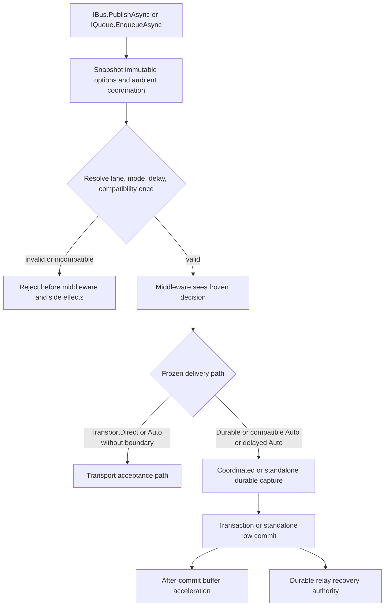
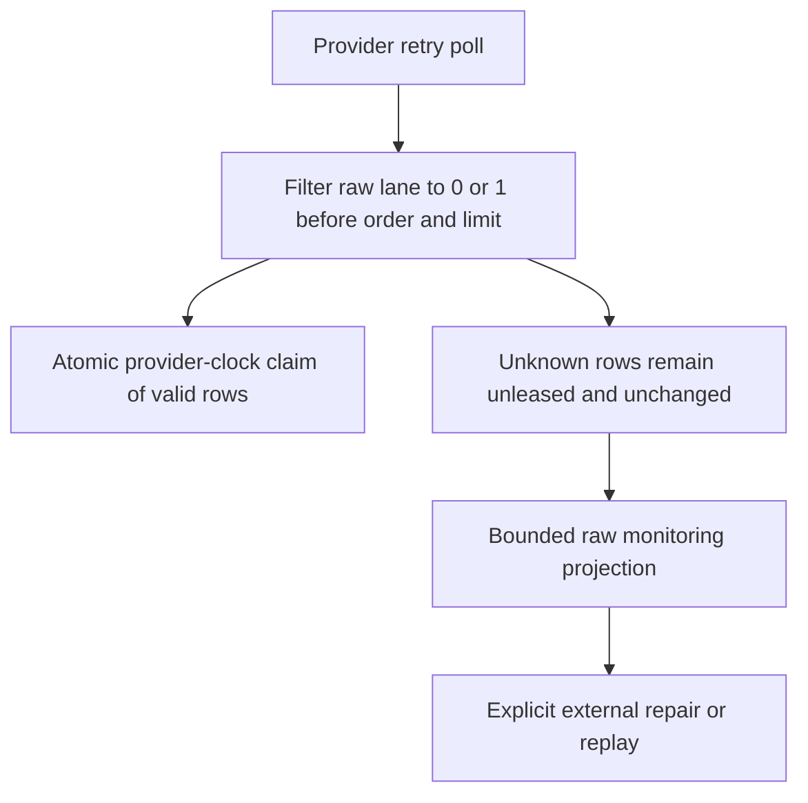
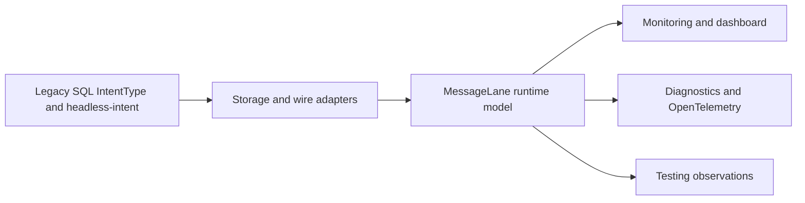

# Messaging Publishers and Delivery Modes - Plan

## Goal Capsule

Complete GitHub issue #350 as the second stacked messaging cut: make `IBus.PublishAsync` and `IQueue.EnqueueAsync` the only public publisher operations, select lane exclusively from the verb, select durability through immutable `DeliveryMode`, and migrate persistence and observability to `MessageLane` without rewriting existing SQL or wire data.

The implementation resolves lane, delivery mode, delay, coordination compatibility, and commit behavior exactly once before middleware. It preserves the current at-least-once boundaries, exposes requested and resolved delivery behavior, and makes unknown stored lanes visible without ever leasing, dispatching, mutating, deleting, or allowing them to starve valid rows.

This branch remains stacked on PR #763. The parent branch is read-only: before overlapping persistence work and again before final validation, fetch its latest head and absorb it into the child. If the child has been published, merge the parent; before first publication, a safe rebase is permitted. Parent-owned fixes for phantom routes, unknown-lane starvation, and the SQL Server initializer race must arrive from PR #763 rather than being recreated here. Offline index replacement remains deferred.

---

## Product Contract

### Problem Frame

The parent stack establishes lane-qualified registration and runtime identity but intentionally retains four publisher facades and `IntentType` at public, persistence, and observability boundaries. That interim shape makes durability look like a separate semantic operation, allows delivery behavior to be selected too late, and cannot represent the final unknown-lane operator contract without either throwing or defaulting invalid values to Bus.

Issue #350 must make the public verb, delivery decision, durable representation, monitoring surface, telemetry, dashboard, and testing vocabulary move together. A partial cutover would leave downstream consumers with conflicting authorities or produce rows that one part of the stack cannot interpret.

### Requirements

#### Public contract and resolution

- R1. `IBus.PublishAsync` always selects `MessageLane.Bus`; `IQueue.EnqueueAsync` always selects `MessageLane.Queue`; options cannot override lane and message contracts require no framework marker.
- R2. The only public publisher facades are `IBus` and `IQueue`; `IOutboxBus`, `IOutboxQueue`, their implementations, DI registrations, and repository callers are removed in the same cutover.
- R3. Add public `DeliveryMode` with stable values `Auto = 0`, `Durable = 1`, and `TransportDirect = 2`; immutable publish/enqueue options default to `Auto`, and their equality/hash behavior includes mode and delay.
- R4. Resolve one immutable delivery decision before middleware: authoritative lane, requested mode, resolved behavior, normalized relative delay, coordination state, and commit path cannot be rerouted by middleware.
- R5. `Auto` captures only inside a recognized compatible coordination boundary; without coordination it sends directly, except a delay resolves it to durable capture. `Durable` always captures. `TransportDirect` never captures.
- R6. Undefined modes, incompatible coordination, invalid delay, and delayed `TransportDirect` reject before middleware, persistence, scheduling, transport, or acceptance diagnostics.
- R7. One-shot relative delay is the only scheduling behavior in scope. Absolute, recurring, calendar, cancellation, and schedule-management APIs remain issue #223.

#### Durability and failure semantics

- R8. Compatible coordinated capture participates in the caller's live database transaction; commit makes business state and the outgoing row durable together, rollback preserves neither, and the post-commit buffer is acceleration rather than the durability authority.
- R9. Standalone durable capture returns only after the durable row commits; later dispatch remains asynchronous and recoverable across cancellation or shutdown.
- R10. Direct transport success means transport acceptance. Failure or cancellation around acceptance and durable state-write ambiguity remain explicitly diagnosed at-least-once duplicate windows rather than being reported as exactly-once outcomes.

#### Runtime, persistence, and observability cutover

- R11. Public/core/runtime vocabulary uses `MessageLane`, including publish/consume contexts, envelopes, persistence contracts, monitoring models, telemetry, dashboard projections, and testing observations.
- R12. Storage and wire adapters preserve the relational column name `IntentType`, numeric values `Bus = 0` / `Queue = 1`, header key `headless-intent`, header values `Bus` / `Queue`, and legacy stored-envelope representation. Undefined values never map to Bus.
- R13. Requested and resolved delivery behavior are observable in publish/persist diagnostics, OpenTelemetry, testing observations, and durable/dashboard projections where a row contains that metadata; legacy rows remain readable with explicit absence/default semantics.
- R14. PostgreSQL, SQL Server, and in-memory claim paths filter to recognized stored lane values before ordering and batch limiting. Unknown rows are never leased or dispatched and cannot prevent recognized rows from progressing in the same poll.
- R15. Monitoring exposes bounded, deterministic, read-only unknown-lane diagnostics using raw stored values without deserializing corrupt content. Framework code never automatically repairs, replays, mutates, or deletes unknown rows.

#### Delivery and stack boundaries

- R16. The public API, repository callers, runtime model, storage adapters, observability, dashboard, and testing migration is atomic in this child PR; no long-lived compatibility facade remains.
- R17. Failure-injection and provider conformance cover capture, commit, rollback, after-commit drain, transport acceptance, state-write ambiguity, cancellation, shutdown, unknown-lane progress, and legacy compatibility.
- R18. Provider physical topology expansion remains issue #359; final all-package documentation, release synchronization, and promotion remain issue #337.
- R19. The child PR targets `xshaheen/issue-336-lane-model-registration-v2`, does not merge, and contains no parent-review repair authored on the child branch.

### Acceptance Examples

- AE1. With no coordination and default options, `IBus.PublishAsync` sends directly on Bus; moving the same call into a compatible coordinated transaction captures it and reports requested `Auto`, resolved `Durable`.
- AE2. With a delayed default call, the message is durably captured for not-before dispatch. With delayed `TransportDirect`, the call fails before middleware and every side-effect spy remains untouched.
- AE3. With a live but incompatible coordination boundary, `Auto` and `Durable` reject before middleware; no standalone fallback silently escapes the transaction.
- AE4. A coordinated publish followed by rollback leaves no business change and no outgoing row. A commit followed by buffer-drain failure leaves the row committed and relay-eligible without changing the completed transaction outcome.
- AE5. A legacy row/header carrying `IntentType = 0` or `Bus` reads as `MessageLane.Bus`, and the Queue equivalents read as Queue; the schema and existing bytes/literals remain unchanged.
- AE6. Given an eligible unknown-lane row ordered before a valid Bus or Queue row, the valid row is claimed and dispatched while the unknown row remains byte-for-byte unchanged and appears through a bounded diagnostic query.
- AE7. Repository public-API probes find only `IBus` and `IQueue`; executable source contains no obsolete `IOutbox*`, `OnBus`, `OnQueue`, or runtime/public `IntentType` outside classified legacy schema/wire adapters and historical documents.

### Scope Boundaries

In scope:

- public publisher consolidation, delivery modes, and immutable option behavior;
- one pre-middleware delivery/coordination resolution seam;
- coordinated and standalone durable capture plus direct delivery behavior;
- repository caller migration and removal of all `IOutbox*` surfaces;
- public/core/storage/monitoring/telemetry/dashboard/testing vocabulary migration;
- legacy SQL/header/wire compatibility;
- bounded unknown-lane diagnostics and non-starving provider claims;
- focused failure injection and full relevant messaging/provider validation.

Out of scope:

- broker entity, topic, exchange, or subscription topology changes owned by #359;
- a dashboard or framework mutation endpoint for repairing unknown rows;
- new SQL columns solely for delivery-mode observability;
- inbox identity, request/reply, recurrence, absolute scheduling, replay UI, or schedule management;
- final cross-package docs, release publication, or integration-branch promotion owned by #337;
- parent fixes for phantom routes, retry starvation, or SQL Server initializer synchronization;
- online replacement of the existing SQL Server retry index.

### Deferred to Follow-Up Work

<!-- x-section: work-relationships -->

- #359 expands provider physical topology after this public/persistence contract lands.
- #337 synchronizes final package-family documentation, compatibility proof, release notes, integration-branch promotion, and publication.
- #222, #223, #225, and #276 build request/reply, scheduling expansion, inbox identity, and middleware expansion on the #350 contract.
- After PR #763 merges into `xshaheen/messaging-verb-model`, retarget this PR to that branch, refresh the stack, and revalidate diff ownership, ancestry, tests, review, and CI before merge consideration.

---

## Planning Contract

### Source of Truth

- GitHub issue #350 and the settled decisions in the invoking request define this PR's delivery scope.
- `docs/plans/2026-07-13-002-messaging-reviewed-architecture-plan.md` is authoritative, especially KTD5-KTD7, PR2, U2, U5, and the delivery-resolution and failure-boundary tables.
- `docs/plans/2026-07-21-001-refactor-messaging-lane-model-registration-plan.md` defines the parent contract and stack boundary.
- `CONCEPTS.md` defines Message lane, verb-conveyed lane model, and Delivery mode.
- `docs/solutions/logic-errors/asynclocal-ambient-scope-stranded-across-await.md` governs caller-frame coordination capture and negative atomicity proof.
- `docs/solutions/design-patterns/atomic-database-clock-relational-lease-claims.md` governs atomic recognized-lane claims and non-starvation.
- The consolidated and dual-lane topology plans are supporting history only and cannot broaden this PR into #359 or #337.

### Key Technical Decisions

- KTD1. **Verb is the only lane authority.** `(session-settled: user-directed — chosen over option or marker routing: one semantic authority prevents caller/type disagreement)` `IBus` fixes Bus and `IQueue` fixes Queue before any option or middleware is examined. Covers R1.
- KTD2. **Only two publisher facades ship.** `(session-settled: user-directed — chosen over a compatibility facade: the greenfield cutover prioritizes one clean public contract)` Repository callers migrate before `IOutbox*` deletion. Covers R2 and R16.
- KTD3. **Delivery uses a stable enum.** `(session-settled: user-directed — chosen over durable/outbox booleans: three explicit modes compose independently from lane)` Unknown values reject. Covers R3 and R6.
- KTD4. **Resolution is immutable and pre-middleware.** `(session-settled: user-directed — chosen over middleware-time routing: validation and side-effect ordering must be reconstructable)` Middleware receives the resolved view but cannot change lane, mode, delay, coordination, or commit behavior. Covers R4.
- KTD5. **Auto is context-sensitive but fail-closed.** `(session-settled: user-directed — chosen over always-durable or silent fallback: ergonomics may use a recognized transaction but must never escape an incompatible one)` No coordination means direct; compatible coordination means capture; a delay means durable; a present incompatible boundary rejects. Covers R5 and R6.
- KTD6. **Relative delay is the entire scheduling surface.** `(session-settled: user-directed — chosen over recurrence or absolute schedules: advanced lifecycle belongs to #223)` Delay must be positive and representable by the injected application clock. Covers R6 and R7.
- KTD7. **Durability and failure windows remain honest.** `(session-settled: user-directed — chosen over success-by-enqueue or exactly-once claims: store/transport acceptance boundaries are different authorities)` The post-commit buffer accelerates dispatch; the durable row and relay retain recovery authority. Covers R8-R10 and R17.
- KTD8. **Runtime vocabulary changes; legacy adapters do not.** `(session-settled: user-directed — chosen over a schema/wire rename: source/API clarity must not invalidate in-flight or stored data)` Public/core types use `MessageLane`; only storage/header/wire mapping retains `IntentType` literals. Covers R11 and R12.
- KTD9. **Unknown rows are isolated, not auto-quarantined.** `(session-settled: user-directed — chosen over throwing, deleting, or rewriting them: corruption must remain inspectable without blocking healthy work)` Recognized-value predicates precede ordering/limits and diagnostics are bounded/read-only. Covers R14 and R15.
- KTD10. **The cutover is atomic.** `(session-settled: user-directed — chosen over a partial compatibility phase: public verbs, persistence, and observability must agree at every published head)` Stack-local intermediate commits may exist, but the PR head exposes only the final surface. Covers R16.
- KTD11. **Topology and release stay downstream.** `(session-settled: user-directed — chosen over absorbing #359/#337: preserving reviewed PR boundaries keeps rollback and review credible)` Covers R18.
- KTD12. **Failure injection is acceptance evidence.** `(session-settled: user-directed — chosen over happy-path-only coverage: prior green tests missed a dead coordination branch)` Covers R17.
- KTD13. **Provider-owned coordination compatibility resolver.** Core snapshots the ambient coordinator synchronously, then asks the selected storage adapter to resolve a live compatible write handle before middleware. The adapter compares provider and database/connection identity without logging credentials. A non-null scope that cannot resolve is incompatible; Core does not inspect DI or compare raw connection strings itself. Covers R4-R6 and R8.
- KTD14. **Delivery metadata rides the immutable envelope, not a schema column.** Newly created messages carry reserved requested/resolved delivery metadata through persist, dispatch, telemetry, dashboard, and testing projections; legacy messages expose requested mode as absent and resolved durable behavior from their stored-row path. SQL schema and `headless-intent` remain unchanged. Covers R12 and R13.
- KTD15. **Unknown-lane diagnostics are a separate raw projection.** `MessageView` migrates to `MessageLane` for valid rows; an `IMonitoringApi` query returns capped raw unknown-lane records with deterministic pagination and safe metadata, without invoking the checked runtime mapper or deserializing content. Covers R11, R14, and R15.
- KTD16. **Parent fixes arrive only through the stack.** The child may proceed on non-overlapping units, but U5 cannot begin until the latest parent removes starvation; final publication absorbs all parent-owned corrections and proves no child-authored parent diff. Covers R19.

### High-Level Technical Design

### Assumptions and Execution Gates

- The parent correction will preserve atomic provider-clock claims while excluding unknown lanes before batch selection. If the parent instead changes the storage contract incompatibly, stop and reconcile the plan rather than duplicating it.
- Existing retry indexes already include `Version`, legacy `IntentType`, and retry ordering columns; #350 does not rebuild them.
- New reserved delivery headers are additive for new envelopes and optional when reading legacy fixtures. If an existing provider rejects unknown headers, adapt at that provider's existing wire boundary without changing the public contract.
- `DeliveryMode.Durable` requires a configured durable store even when no transport is currently available; transport capability remains necessary for eventual dispatch under the current framework composition.
- No product question remains open. Exact internal type/file splits may change if they preserve the requirements and tests.

---

## Implementation Units

### U0. Refresh and qualify the stacked parent

- **Goal:** Establish a safe child baseline without authoring any parent-owned repair.
- **Requirements:** R19; KTD16.
- **Dependencies:** none.
- **Files:** No production files. Compare the child against `origin/xshaheen/issue-336-lane-model-registration-v2`, PR #763, and the issue #350 plan.
- **Approach:** Fetch and verify PR #763's live head/base/state. Before U5 and before final validation, absorb the latest parent using a rebase only while the child is unpublished; once published, merge the parent. Confirm the parent fixes phantom global-plus-lane routes, unknown-lane starvation, and the SQL Server concurrent initializer race. Do not require the deferred offline-index recommendation.
- **Test scenarios:** Test expectation: none -- this is a branch/ownership gate, not runtime behavior.
- **Verification:** Child ancestry includes the current parent head, parent-only diffs are absent from the child comparison, and unresolved parent overlap is reported as a real blocker.

### U1. Add the public delivery contract and immutable resolver

- **Goal:** Add `DeliveryMode`, immutable options, and one table-driven delivery decision before middleware.
- **Requirements:** R1, R3-R7, R13; AE1-AE3; KTD1, KTD3-KTD6, KTD13-KTD14.
- **Dependencies:** U0.
- **Files:**
  - `src/Headless.Messaging.Abstractions/DeliveryMode.cs`
  - `src/Headless.Messaging.Abstractions/Headers.cs`
  - `src/Headless.Messaging.Abstractions/MessageOptions.cs`
  - `src/Headless.Messaging.Bus.Abstractions/PublishOptions.cs`
  - `src/Headless.Messaging.Queue.Abstractions/EnqueueOptions.cs`
  - `src/Headless.Messaging.Core/Configuration/MessagingCapabilityModel.cs`
  - `src/Headless.Messaging.Core/Internal/` delivery-decision and coordination-resolution types
  - `src/Headless.Messaging.Core/PublishContext.cs`
  - `tests/Headless.Messaging.Abstractions.Tests.Unit/PublishOptionsTests.cs`
  - `tests/Headless.Messaging.Abstractions.Tests.Unit/EnqueueOptionsTests.cs`
  - `tests/Headless.Messaging.Core.Tests.Unit/Internal/DeliveryDecisionResolverTests.cs`
  - `tests/Headless.Messaging.Core.Tests.Unit/ContextTypes/PublishContextTests.cs`
- **Approach:** Preserve the current immutable snapshot pattern, validate the closed enum and relative delay, snapshot ambient coordination synchronously, resolve provider compatibility through the storage-owned seam, and pass a frozen decision into middleware. Add requested/resolved delivery metadata only after successful resolution.
- **Execution note:** Start with the complete mode × coordination × delay decision table and side-effect spies so invalid paths are proven before implementation.
- **Test scenarios:**
  - Covers AE1. Bus/Queue verbs fix the correct lane regardless of option contents.
  - Default options are `Auto`; equality/hash differ for mode and delay while equivalent snapshots compare equal.
  - Every valid resolution-table row produces the expected direct/coordinated/standalone durable decision.
  - Undefined mode, zero/negative/overflowing delay, delayed direct, completed transaction, provider mismatch, and database mismatch reject before middleware and side effects.
  - Middleware cannot mutate lane, requested/resolved mode, normalized delay, or coordination result.
  - New delivery metadata is deterministic and legacy absence remains representable.
- **Verification:** The resolver is the only branch that selects the delivery path, and focused API/reflection tests prove options expose no lane override.

### U2. Consolidate publisher execution and prove coordination failure windows

- **Goal:** Route both verbs through the resolved direct/durable decision while preserving transactional capture and recovery semantics.
- **Requirements:** R1, R4-R10, R13, R17; AE1-AE4; KTD4-KTD7, KTD12-KTD14.
- **Dependencies:** U1.
- **Files:**
  - `src/Headless.Messaging.Core/Internal/Bus.cs`
  - `src/Headless.Messaging.Core/Internal/Queue.cs`
  - `src/Headless.Messaging.Core/Internal/DirectPublisherCore.cs`
  - `src/Headless.Messaging.Core/Internal/OutboxMessageWriter.cs`
  - `src/Headless.Messaging.Core/Internal/PublishMiddlewarePipeline.cs`
  - `src/Headless.Messaging.Core/Transactions/MessageOutboxBuffer.cs`
  - `src/Headless.Messaging.Core/Setup.cs`
  - `tests/Headless.Messaging.Core.Tests.Unit/BusTests.cs`
  - `tests/Headless.Messaging.Core.Tests.Unit/QueueTests.cs`
  - `tests/Headless.Messaging.Core.Tests.Unit/Internal/PublishMiddlewarePipelineTests.cs`
  - `tests/Headless.Messaging.Core.Tests.Unit/Internal/CommitCoordinatorOutboxTests.cs`
  - `tests/Headless.Messaging.Core.Tests.Unit/Internal/ScheduledMediumMessageQueueTests.cs`
  - `tests/Headless.EntityFramework.Messaging.Tests.Integration/OutboxBridgeIntegrationTests.cs`
- **Approach:** Keep one common execution kernel below `IBus`/`IQueue`. Direct delivery serializes and sends only after the frozen decision. Durable delivery stores with the resolved transaction handle or a standalone write, then uses the existing buffer/dispatcher seams. Preserve caller-frame ambient capture and treat relay recovery as authoritative after commit.
- **Execution note:** Use path-discriminating negative tests; a row-existing happy path does not prove transaction enlistment.
- **Test scenarios:**
  - Covers AE4. Commit persists business state and message; rollback persists neither.
  - `Auto` without coordination calls transport and never storage; `Durable` without coordination commits storage before enqueue; compatible `Auto` uses the live transaction.
  - Delayed `Auto`/`Durable` schedules durably; delayed direct and incompatible coordination touch no middleware/storage/scheduler/transport.
  - Failure before insert, after insert before commit, after commit before buffer drain, buffer timeout/fault, and shutdown leave the documented durable/replay state.
  - Cancellation before capture has no side effect; cancellation after enlisted capture does not delete transaction-owned work; must-complete post-commit cleanup observes its own lifetime.
  - Direct transport accepted followed by cancellation/timeout is diagnosed as ambiguous; durable transport accepted followed by terminal-state write failure remains retryable and diagnoses duplicate risk.
  - Requested/resolved delivery data reaches tracing/testing for direct and durable paths without leaking mutable headers.
- **Verification:** Focused unit and real EF integration tests distinguish direct, standalone durable, coordinated commit, rollback, and relay-recovery paths.

### U3. Migrate repository callers and remove outbox facades

- **Goal:** Make the public publisher cutover complete across DI, framework integrations, demos, and testing utilities.
- **Requirements:** R2, R16-R19; AE7; KTD2, KTD10-KTD11.
- **Dependencies:** U2.
- **Files:**
  - Delete `src/Headless.Messaging.Bus.Abstractions/IOutboxBus.cs`
  - Delete `src/Headless.Messaging.Queue.Abstractions/IOutboxQueue.cs`
  - Delete `src/Headless.Messaging.Core/Internal/OutboxBus.cs`
  - Delete `src/Headless.Messaging.Core/Internal/OutboxQueue.cs`
  - `src/Headless.Messaging.Bus.Abstractions/IBus.cs`
  - `src/Headless.Messaging.Queue.Abstractions/IQueue.cs`
  - `src/Headless.Messaging.Core/Setup.cs`
  - `src/Headless.EntityFramework.Messaging/`
  - `src/Headless.DistributedLocks.Core/`
  - `src/Headless.Messaging.Testing/MessagingTestHarness.cs`
  - affected `demo/Headless.Messaging.*/` callers and corresponding tests
  - `tests/Headless.Messaging.PackageReference.Tests.Unit/`
- **Approach:** Migrate semantically: former outbox calls become the authoritative verb with `Durable`; explicitly transaction-independent direct calls become `TransportDirect`; adopt default `Auto` only when ambient behavior is intended. Remove facades/implementations after every caller compiles, and preserve current optional-messaging behavior in Distributed Locks.
- **Test scenarios:**
  - DI resolves `IBus` and `IQueue` and cannot resolve removed facades or implementations.
  - EF integration events publish through Bus with `Durable` and remain transaction-atomic.
  - Distributed-lock wakeups remain durable when Messaging is registered and retain polling fallback when it is absent.
  - Testing harness exposes only Bus/Queue and can assert requested/resolved mode.
  - Demos and package-reference probes compile against the two-facade public graph.
- **Verification:** Executable source and API/reflection scans contain no `IOutboxBus`, `IOutboxQueue`, `OutboxBus`, or `OutboxQueue` symbol.

### U4. Move runtime and adapter vocabulary to MessageLane

- **Goal:** Complete the CLR/public rename while isolating intentional legacy mapping at storage and wire boundaries.
- **Requirements:** R11-R13, R16; AE5; KTD8, KTD10, KTD14.
- **Dependencies:** U1, U2.
- **Files:**
  - `src/Headless.Messaging.Abstractions/ConsumeContext.cs`
  - `src/Headless.Messaging.Abstractions/Headers.cs`
  - `src/Headless.Messaging.Core/Messages/MediumMessage.cs`
  - `src/Headless.Messaging.Core/PublishContext.cs`
  - `src/Headless.Messaging.Core/MessagingEnrichmentContext.cs`
  - `src/Headless.Messaging.Core/Internal/IMessagePublishRequestFactory.cs`
  - `src/Headless.Messaging.Core/Internal/IMessageSender.cs`
  - `src/Headless.Messaging.Core/Internal/ISubscribeExecutor.cs`
  - `src/Headless.Messaging.Core/Internal/IConsumerRegister.cs`
  - `src/Headless.Messaging.Core/Internal/MessagingTelemetry.cs`
  - `src/Headless.Messaging.Core/Internal/IntentTagEnricher.cs` or its lane-named replacement
  - provider consumer/wire adapters that read or write `Headers.Intent`
  - compatibility fixtures/tests in Messaging Abstractions/Core and provider suites
- **Approach:** Remove `IntentType` from public/core models and make adapters read/write the stable legacy raw values explicitly. Keep the SQL column/header literal names unchanged. Checked mapping rejects undefined values; missing legacy headers use the structurally selected route lane and recognized mismatches diagnose without rerouting.
- **Test scenarios:**
  - Legacy SQL/envelope/header fixtures read without regeneration and round-trip stable `0/1` and `Bus`/`Queue` representations.
  - Runtime contexts, envelopes, callbacks, retries, and sender paths expose `MessageLane` only.
  - Missing intent header preserves the selected route lane; recognized mismatched header is diagnosed and cannot reroute.
  - Undefined persisted lane values remain untouched and surface only through U5's raw unknown-lane projection.
  - Undefined header or envelope lane values fail checked adapter mapping before routing or handler acceptance, emit bounded adapter diagnostics, and never reroute to Bus or enter U5's storage-diagnostic path.
- **Verification:** Public/API scans and compile-time probes show `MessageLane`; intentional `IntentType` occurrences are confined to SQL column strings, stable wire/header mapping, fixtures, and historical documents.

### U5. Enforce non-starving unknown-lane persistence and diagnostics

- **Goal:** Make all storage providers progress valid work while preserving unknown rows for bounded operator inspection.
- **Requirements:** R12, R14-R17, R19; AE5-AE6; KTD8-KTD10, KTD12, KTD15-KTD16.
- **Dependencies:** U0 parent-readiness gate, U4.
- **Files:**
  - `src/Headless.Messaging.Core/Persistence/IDataStorage.cs`
  - `src/Headless.Messaging.Core/Monitoring/IMonitoringApi.cs`
  - `src/Headless.Messaging.Core/Monitoring/MessageQuery.cs`
  - `src/Headless.Messaging.Core/Monitoring/MessageView.cs`
  - new bounded unknown-lane query/projection types under `src/Headless.Messaging.Core/Monitoring/`
  - `src/Headless.Messaging.Storage.InMemory/InMemoryDataStorage.cs`
  - `src/Headless.Messaging.Storage.InMemory/InMemoryMonitoringApi.cs`
  - `src/Headless.Messaging.Storage.PostgreSql/PostgreSqlDataStorage.cs`
  - `src/Headless.Messaging.Storage.PostgreSql/PostgreSqlMonitoringApi.cs`
  - `src/Headless.Messaging.Storage.SqlServer/SqlServerDataStorage.cs`
  - `src/Headless.Messaging.Storage.SqlServer/SqlServerMonitoringApi.cs`
  - `tests/Headless.Messaging.Core.Tests.Harness/DataStorageTestsBase.cs`
  - in-memory, PostgreSQL, and SQL Server storage unit/integration leaves
- **Approach:** Build on the parent-owned starvation correction. Each claim atomically filters recognized lane values before ordering/limit and returns only the requested lane under provider-clock leases. A separate capped raw query reports unknown values without content deserialization. Do not touch retry-index DDL, write repair logic, or weaken affected-row authority.
- **Execution note:** Seed an unknown row ahead of valid rows and contend both recognized lanes so a false-green post-fetch filter cannot pass.
- **Test scenarios:**
  - Covers AE6. Unknown rows before, between, and after valid rows never consume the batch or prevent valid progress.
  - Unknown rows are never leased, dispatched, status-transitioned, deleted, deserialized, or rewritten by retry/maintenance paths.
  - Bus and Queue claims remain atomic under concurrent claimers and application-clock skew.
  - Bounded diagnostics return deterministic pages with raw lane, row/table direction, storage ID, safe name/status/timestamps, and no content.
  - Diagnostic count/tag cardinality is bounded; raw values appear only in rate-limited structured diagnostics.
  - Explicit external repair makes a row eligible on a later poll; the framework does not perform the repair.
  - Legacy schema introspection proves `IntentType` column names, numeric values, and existing retry indexes remain unchanged.
- **Verification:** Shared storage conformance plus real PostgreSQL and SQL Server integration tests prove non-starvation, non-mutation, claim atomicity, and compatibility.

### U6. Complete monitoring, telemetry, dashboard, and testing cutover

- **Goal:** Make every consumer-visible projection agree on `MessageLane` and requested/resolved delivery behavior.
- **Requirements:** R11-R17; AE5-AE7; KTD8-KTD10, KTD14-KTD15.
- **Dependencies:** U3-U5.
- **Files:**
  - `src/Headless.Messaging.Core/Monitoring/`
  - `src/Headless.Messaging.Core/MessagingDiagnostics.cs`
  - `src/Headless.Messaging.Core/MessagingTags.cs`
  - `src/Headless.Messaging.Core/MessagingInstrumentationOptions.cs`
  - `src/Headless.Messaging.Core/Internal/MessagingTelemetry.cs`
  - `src/Headless.Messaging.Dashboard/Endpoints/MessagingDashboardEndpoints.cs`
  - `src/Headless.Messaging.Dashboard/wwwroot/src/`
  - `src/Headless.Messaging.Testing/`
  - `tests/Headless.Messaging.Core.Tests.Unit/Diagnostics/`
  - `tests/Headless.Messaging.Dashboard.Tests.Unit/Endpoints/`
  - `tests/Headless.Messaging.Testing.Tests.Unit/`
- **Approach:** Rename DTO/filter/JSON/runtime labels atomically to lane vocabulary. Emit finite lane and requested/resolved-mode tags; categorize unknown values without unbounded tag cardinality. Extract envelope-backed delivery metadata with a per-row fault-tolerant parser: absent or unreadable metadata yields nullable requested/resolved fields while preserving the row and page. Expose unknown rows as a read-only dashboard/operator view, not a mutation surface. Treat dashboard JSON rename as the deliberate source/JSON break already assigned to #350.
- **Test scenarios:**
  - Monitoring filters distinguish same-name Bus and Queue rows using `MessageLane`.
  - Publish/persist spans, metrics, and testing observations carry authoritative lane plus requested/resolved delivery mode on direct and durable paths.
  - Legacy durable rows remain visible with explicit absent-requested/derived-resolved semantics.
  - One valid-lane row with absent or unreadable envelope delivery metadata remains visible with null mode fields and cannot fail the containing monitoring/dashboard page.
  - Dashboard endpoints and Vue client use lane vocabulary, render bounded unknown-lane diagnostics, and expose no repair/delete action.
  - Unknown raw values never become high-cardinality metric tags or throw from valid dashboard listing endpoints.
  - Same logical identity on opposite lanes remains distinct in monitoring, telemetry, dashboard, and recordings.
- **Verification:** Core diagnostics, dashboard backend/client, and Messaging Testing suites pass; repository scans classify every remaining legacy term.

---

## Verification Contract

### Parent and Diff Gates

- Verify PR #763 is open, its base/head names and SHA are current, and the child contains that head before U5 and final validation.
- Compare the child PR against `xshaheen/issue-336-lane-model-registration-v2`; parent defect fixes and physical topology changes must not appear as child-owned diff.
- Verify the child PR base remains the parent branch until PR #763 merges; after merge, retarget to `xshaheen/messaging-verb-model` and rerun every ancestry/diff gate.

### Focused Gates

- Use repository Makefile project-scoped restore/build/test targets for Messaging Abstractions, Core, EF Messaging, Distributed Locks, Dashboard, and Messaging Testing while implementing each unit.
- Run table-driven resolver, facade, option-equality, middleware immutability, commit/rollback, buffer drain, cancellation, ambiguity, and unknown-lane conformance tests before widening.
- Build the Messaging dashboard SPA with Node 22+ and run its backend and client tests for DTO/filter changes.

### Provider and Integration Gates

- Run the full relevant Messaging unit suite.
- Run shared storage conformance and the in-memory storage suite.
- Run PostgreSQL and SQL Server real integration suites, including coordinated capture, rollback, concurrent claims, unknown-lane progress, and schema/index introspection.
- Run affected provider integration/conformance leaves where the runtime vocabulary or wire adapter changed; provider topology expansion remains absent.
- Report unavailable Docker/external services separately; they are not passing evidence.

### Compatibility and Search Gates

- Prove current code reads immutable legacy PostgreSQL, SQL Server, in-memory, header, envelope, monitoring, and dashboard fixtures.
- Compare schema/index metadata before and after startup; no migration or index replacement belongs to this PR.
- Search `src/`, `tests/`, and `demo/` for `IOutboxBus`, `IOutboxQueue`, `OutboxBus`, `OutboxQueue`, `IntentType`, `OnBus`, and `OnQueue`; classify each remaining hit as intentional legacy mapping/fixture/history or remove it.
- Use API/reflection/package-reference probes to verify enum numeric values, two-facade surface, immutable options, and absence of lane override.

### Quality and Shipping Gates

- Run `make restore` before no-restore builds in this worktree.
- Run relevant Release builds/tests, Messaging provider integrations, dashboard validation, `make format-check`, and the narrowest credible analyzer targets; widen when shared projects change.
- Record exact commands, counts, failures, and final SHA. Local validation and external CI are separate evidence.
- Open one PR from `xshaheen/issue-350-publishers-delivery-modes`; target `xshaheen/issue-336-lane-model-registration-v2` while PR #763 is open, then retarget to `xshaheen/messaging-verb-model` after #763 merges. Its description names PR #763, states the resolved stack dependency, and includes exact test scenarios without claiming parent findings as child fixes.
- If CI does not auto-run for the stacked base, dispatch the appropriate workflow against the exact child SHA and verify terminal status. Classify runner/billing failures as external rather than repository regressions.
- Complete structured code review, repair every actionable child finding within three rounds per repeated failure class, and babysit CI/review to the permitted terminal state without merging.

---

## Definition of Done

- [ ] The latest parent head is in child ancestry; parent fixes were absorbed, not recreated, and the stacked diff is child-only.
- [ ] `IBus` and `IQueue` are the only public publisher facades and the verb is the only lane authority.
- [ ] `DeliveryMode` values/defaults/options equality are stable and every decision resolves once before middleware.
- [ ] Auto, Durable, TransportDirect, delay, compatible/incompatible coordination, cancellation, and failure-window behavior match R4-R10 with path-discriminating evidence.
- [ ] Repository callers compile on the authoritative verbs with semantically chosen modes; no `IOutbox*` facade or implementation remains.
- [ ] Public/core/runtime, monitoring, telemetry, dashboard, and testing vocabulary uses `MessageLane`.
- [ ] SQL `IntentType`, `headless-intent`, Bus/Queue numeric/textual values, and legacy fixtures remain compatible without schema/index replacement.
- [ ] Unknown lanes never starve valid work, are never leased/dispatched/mutated/deleted automatically, and have bounded read-only diagnostics on all three storage providers.
- [ ] Failure-injection evidence covers capture, commit, rollback, after-commit drain, transport/state ambiguity, cancellation, shutdown, and provider-specific unknown-lane behavior.
- [ ] Full relevant Messaging unit and in-memory/PostgreSQL/SQL Server integration suites, dashboard/testing consumers, formatting, analyzers, and public API/search gates pass with exact results recorded.
- [ ] Structured review has no unresolved actionable child finding; CI is terminal or any external blocker is durably and accurately reported.
- [ ] One unmerged PR preserves the stacked ancestry, targets `xshaheen/messaging-verb-model` after PR #763 merged, names #763, and records the verified retarget/revalidation state.
