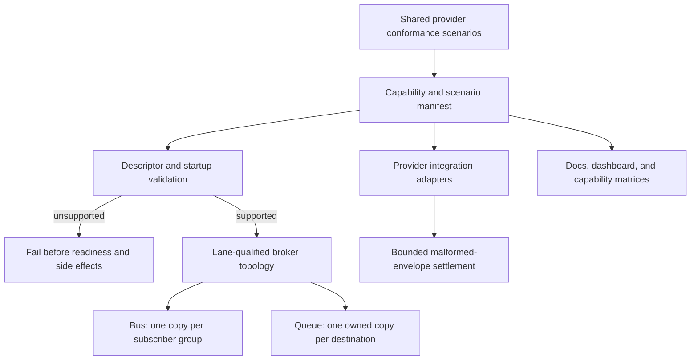
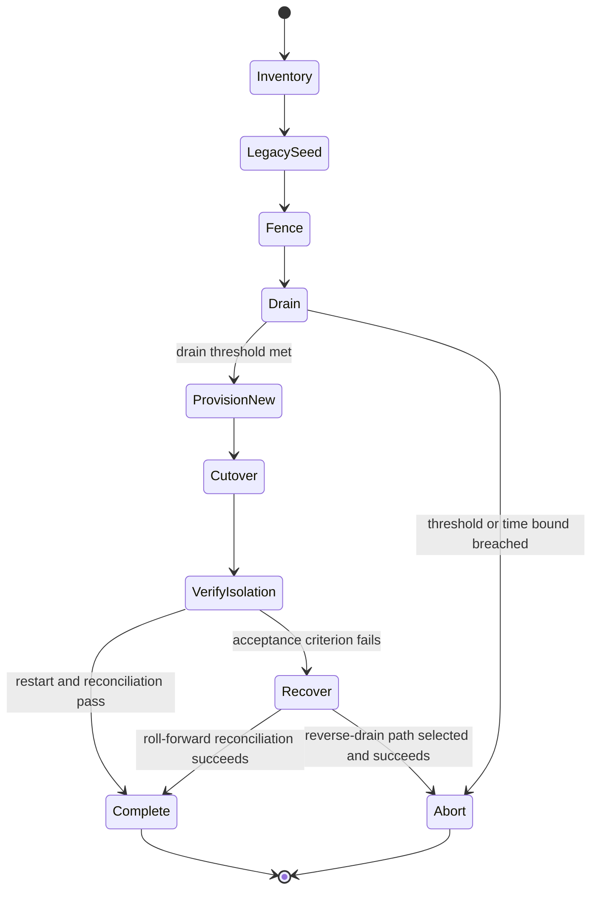

# Messaging Provider Conformance and Verb-Model Release - Plan

## Goal Capsule

Complete issues #359 and #337 in one pull request against `main`: make every Messaging provider tell and prove the same Bus-versus-Queue contract, add the topology and bounded-rejection corrections needed for that proof, and synchronize the public documentation, examples, package-family compatibility evidence, and release handoff with the verb model already merged through #336 and #350.

The shared contract is: Bus delivers one copy per logical subscriber group while replicas in that group compete; Queue delivers one owned copy within its logical destination; the same declared contract and logical name on both lanes never cross-delivers. Unsupported lanes or topology fail before readiness and side effects, and malformed transport envelopes terminate within a bounded rejection policy rather than creating broker requeue storms.

This PR stops before merge and publication. It may close #359 and #337 when merged, but it must not close tracker #217. Production deployment inventory, permission ownership, cutover execution, exact-main CI, GitHub Packages publication, GitHub Release creation, NuGet.org publication, and tracker closure remain explicit post-merge gates.

---

## Product Contract

### Problem Frame

The verb and delivery-mode model is now on `main`, but provider topology and evidence are uneven. The current shared harness proves baseline transport behavior, while its capability manifest still records that NATS, Pulsar, and RabbitMQ do not isolate lanes. Kafka intentionally supports Queue only. AWS has LocalStack coverage but does not yet provide the complete two-subscriber-group fan-out and actionable provisioning failure evidence required for a release claim. Documentation cannot truthfully promote the cutover until implementation, executable evidence, capability descriptors, examples, and operator migration limits agree.

The previous reviewed architecture planned separate provider and release PRs through `xshaheen/messaging-verb-model`. That branch is stale after #770 and #771 were squash-merged directly into `main`. The user-directed delivery contract combines the former PR3/PR4 boundary on one new branch without changing the reviewed runtime architecture.

### Requirements

#### Shared semantics and validation

- R1. A reusable provider-conformance harness is the single executable authority for Bus group fan-out, competing replicas, Queue ownership, same-name lane isolation, startup rejection ordering, malformed-envelope termination, cancellation, restart, and graceful shutdown.
- R2. Bus delivers one copy per logical subscriber group; replicas inside one group compete. Queue delivers one owned copy within its logical destination.
- R3. A declared contract and logical name registered on both Bus and Queue never cross-delivers. Lane qualification is permanent physical topology, not merely a bootstrap check.
- R4. Unsupported lane, topology, delivery, or configured transport-envelope capability rejects during deterministic startup validation before readiness, broker provisioning, persistence, handlers, or acceptance side effects. Authorization/policy sufficiency that can only be discovered through broker I/O follows a separate bounded provisioning phase: it still withholds readiness, reports an actionable sanitized failure, and cleans up only entities proven to have been created by that attempt. A shared sentinel-redaction contract covers messages, surfaced inner exceptions, logs, and serialized metadata for every provider. Runtime malformed or lane-mismatched deliveries follow R5 instead.
- R5. Structurally malformed, unknown-lane, or valid-but-wrong-lane transport envelopes terminate on their first framework observation and never reach persistence, middleware, or user handlers. This is distinct from ordinary valid-envelope handler rejection/redelivery, which retains the documented at-least-once policy. A single poison transport delivery cannot create an unbounded broker requeue/redelivery storm. Terminal handling emits exactly one structured metadata-only log/event and increments a rejection counter with provider, lane, logical endpoint, safe correlation identity when available, reason category, and provider-native disposition; payload bytes and unclassified headers are never logged.
- R6. Provider capability descriptors, runtime behavior, startup diagnostics, dashboard/provider visibility, documentation, and conformance manifests agree at the exact PR head.
- R7. Stable compatibility identity is preserved: `MessageLane.Bus = 0`, `MessageLane.Queue = 1`, relational `IntentType`, `headless-intent`, legacy `Bus`/`Queue` values, and established wire/storage literals are not renamed or renumbered.

#### Provider completion

- R8. AWS SNS-to-SQS topology fans one Bus publication to two independent subscriber groups, with competing replicas inside each group and no Queue cross-delivery. LocalStack proves the path. Invalid endpoint, topic/queue, subscription, policy, or IAM-like provisioning state fails fast with actionable diagnostics and no readiness signal.
- R9. Azure Service Bus, Redis, and InMemory are run through the shared contract. The official Azure Service Bus emulator supplies required containerized queue/topic/subscription proof; the credential-backed cloud tier separately records Azure-only identity/RBAC limitations and may be externally unavailable without replacing emulator evidence. Redis gains real Testcontainers proof and migrates Bus from Pub/Sub to lane-qualified Streams consumer groups because Pub/Sub cannot provide competing replicas inside one logical group; `UseRedis` becomes the final both-lane provider setup and obsolete Pub/Sub setup/runtime surfaces are removed. InMemory remains the deterministic reference tier. Other passing topology is not rewritten for symmetry.
- R10. Kafka remains Queue-only. Any Bus registration fails at startup with guidance to use Queue or another Bus-capable provider. Malformed transport envelopes reach a bounded terminal outcome without indefinite requeue.
- R11. RabbitMQ uses lane-qualified exchanges, bindings, and owned queues so the same logical name is isolated across lanes. Malformed envelopes are rejected without requeue storm.
- R12. NATS JetStream uses lane-qualified streams, subjects, durable consumers, and filter subjects. Real-broker tests prove legacy seed/drain, new isolation, restart, abort, and recovery behavior.
- R13. Pulsar uses lane-qualified topics and subscriptions. The existing `Headless.Messaging.Pulsar.Tests.Integration` Testcontainers project is extended to prove isolation and migration/recovery; a duplicate integration project is not created.
- R14. Every provider affected by topology changes has an executable cutover/recovery contract covering legacy seed by an isolated previous-package producer/consumer process, producer/consumer version fence, drain signal, new topology provisioning, lane-isolated cutover, abort criteria, restart, and recovery. Before the first publish to new topology, abort may return to the fenced legacy path; afterward recovery is roll-forward-only unless provider-specific tests prove a reverse drain. Current-code legacy adapters or golden envelopes may supplement but never be labeled previous-version proof.

#### Documentation, compatibility, and release handoff

- R15. `docs/llms/messaging.md` and every affected Messaging package README follow `docs/authoring/AUTHORING.md` and document final verbs, lane-scoped registration, `DeliveryMode`, one-shot delay, capability validation, provider topology, at-least-once guarantees, and cutover/recovery limits.
- R16. Provider capability/conformance and cutover matrices are generated or manually maintained from executable descriptors/tests with an explicit drift test; unsupported cells remain explicit rather than aspirational. Each row names evidence tier, exact-head evidence reference, status, and limitation so deterministic, Testcontainers/LocalStack, credential-backed service, and deployment-owned production evidence cannot be conflated.
- R17. Every quick-start/package example and affected demo/cross-domain sample compiles against the final public API. Public docs are checked against built assemblies.
- R18. Local-feed probes prove the previous complete pre-cutover package family works as all-old and the PR package family works as all-new. Mixed pre/post-cutover `Headless.Messaging.*` graphs are explicitly unsupported; documentation does not claim every arbitrary mixed graph fails restore unless a probe proves that exact graph.
- R19. Obsolete public/runtime terminology and stack-only bridges are removed. A Messaging-scoped classification accounts for every remaining `MessageQueueMarkerService`, `IOutbox*`, `IntentType`, `headless-intent`, `OnBus`, and `OnQueue` occurrence in current source, tests, demos, and current documentation as active defect, intentional stable schema/wire literal, or test fixture; historical plans and legacy compatibility fixtures are explicitly allowlisted.
- R20. Release notes identify source and JSON breaks, including Redis Pub/Sub surface removal; provider topology migration; lockstep Messaging package upgrades; at-least-once duplicate windows; the new terminal disposition for lane-mismatched/legacy envelopes and what operators must inspect before fencing; downtime/recovery limits; and the post-merge publication fence.
- R21. The single PR targets `main`, contains `Closes #359` and `Closes #337`, does not close #217, explains the combined former PR3/PR4 boundary, provides exact test evidence and operational handoffs, and is not merged by this pipeline.
- R22. No required provider may be omitted, weakened, or deferred to a split/successor PR. Failure to obtain credible implementation or required broker evidence within the bounded repair budget is a blocker.

Issue coverage:

- #359 owns R1-R14 and the provider-conformance portions of R16-R17 and R19-R20.
- #337 owns R15-R21 and the documentation, package-family, release-handoff, and repository-synchronization portions of shared requirements.
- R22 is the combined delivery gate. Tracker #217 receives no closing requirement in this plan.

### Acceptance Examples

- AE1. Two Bus subscriber groups, each with two live replicas, receive one logical copy per group; exactly one replica in each group handles it.
- AE2. Two Queue replicas sharing one logical destination receive one owned copy total; a separately named destination receives none.
- AE3. The same contract and logical name exist on Bus and Queue. Publishing reaches only Bus groups; enqueuing reaches only the Queue destination, including after consumer restart.
- AE4. Kafka Bus registration and any unsupported provider/lane combination fail during startup before readiness, provisioning, publish, persistence, or handler observation and include actionable remediation.
- AE5. A malformed broker envelope reaches the provider-native terminal state within the provider-declared bound enforced by the shared harness; delivery count and observation window prove no requeue storm.
- AE6. AWS LocalStack provisions SNS-to-SQS fan-out for two groups, proves competing replicas, and reports a sanitized actionable failure when provisioning authority/configuration is invalid.
- AE7. AWS, Redis, RabbitMQ, NATS, and Pulsar begin with legacy producer/consumer behavior, demonstrate their declared drain-or-quiescence fence, cut over to lane-qualified topology, prove lane isolation and restart, then exercise the documented abort/reconciliation route without message disappearance claims.
- AE8. The previous all-old local-feed consumer and new all-new consumer restore and compile. A deliberately selected mixed graph demonstrates the supported diagnostic boundary without generalizing beyond tested graphs.
- AE9. Searches find no active obsolete public/runtime surface. Remaining `IntentType` and `headless-intent` occurrences are classified as intentional compatibility boundaries, and historical plans are not rewritten as current API documentation.
- AE10. Release artifacts can be packed and inspected locally, but no workflow or command in this run creates a GitHub Release or publishes a package.

### Scope Boundaries

In scope:

- shared provider-conformance scenarios and descriptor drift checks;
- AWS, Azure Service Bus, InMemory, Kafka, NATS, Pulsar, RabbitMQ, and Redis conformance;
- provider topology corrections required by #359;
- bounded malformed-envelope handling and startup rejection needed for the common contract;
- executable migration/cutover/recovery fixtures for topology-changing providers;
- final Messaging docs, examples, dashboard provider visibility, package-family probes, and release notes;
- one branch, one PR, and post-merge handoff preparation.

Out of scope:

- Bus polymorphism/fan-out product features from #220 beyond group visibility and conformance;
- NATS ergonomics or DLQ product features from #233 beyond topology and conformance;
- Queue request/reply #222, scheduling expansion #223, transactional inbox #225, retry shutdown #271, or consume middleware redesign #276;
- redesigning the merged verb/publisher API except for the smallest correction needed by a proven conformance defect;
- renaming stable SQL columns, numeric lane values, headers, or legacy wire literals;
- splitting a provider or docs/release successor PR;
- merging the PR, publishing a GitHub Release/GitHub Packages/NuGet packages, or closing #217.

### Deferred to Follow-Up Work

<!-- x-section: work-relationships -->

- After merge, verify exact `main` CI and GitHub Packages publication from the merged commit.
- Publish the GitHub Release only from the verified merged commit, then verify the complete package family on NuGet.org.
- Reconcile the remaining Messaging backlog against the shipped contract and close #217 only after registry evidence is complete.
- Product expansion remains in #220, #222, #223, #225, #233, #271, and #276.

---

## Planning Contract

### Source of Truth

- The invoking request and live issues #359/#337 define delivery and completion. Tracker #217 supplies roadmap context but is not closed.
- `docs/plans/2026-07-13-002-messaging-reviewed-architecture-plan.md` remains authoritative architecture. Only KTD16's separate-PR/integration-branch topology is superseded.
- `docs/plans/2026-07-21-001-refactor-messaging-lane-model-registration-plan.md` and `docs/plans/2026-07-26-001-refactor-messaging-publishers-delivery-modes-plan.md` define the merged #336/#350 contracts.
- `docs/plans/2026-06-10-001-feat-messaging-dual-lane-topology-kafka-guard-plan.md` is topology history; stale API terms and its pre-existing Pulsar-test assumption are non-authoritative.
- Microsoft Learn's current Azure Service Bus emulator documentation (`https://learn.microsoft.com/azure/service-bus-messaging/overview-emulator` and `https://learn.microsoft.com/azure/service-bus-messaging/test-locally-with-service-bus-emulator`) establishes the supported containerized data-plane/admin-client evidence tier and its cloud-feature limitations.
- `CONCEPTS.md`, `docs/authoring/AUTHORING.md`, and current public assemblies govern vocabulary and documentation shape.
- `tests/Headless.Messaging.Core.Tests.Harness`, provider integration projects, and `MessagingCapabilityModel` are the implementation evidence roots.
- Relevant institutional patterns: `docs/solutions/guides/messaging-transport-provider-guide.md`, `docs/solutions/messaging/transport-wrapper-drift-and-doc-sync.md`, `docs/solutions/architecture-patterns/startup-validation-gate-two-tier-mode-and-env-defaults.md`, `docs/solutions/concurrency/startup-pause-gating-and-half-open-recovery.md`, `docs/solutions/architecture-patterns/messaging-keyed-di-lock-isolation.md`, and `docs/solutions/guides/publish-packages-guide.md`.

### Key Technical Decisions

- KTD1. **One combined branch and PR targets `main`.** `(session-settled: user-directed — chosen over separate provider and release PRs through xshaheen/messaging-verb-model: #336 and #350 already landed directly on main and the user requires one complete review boundary)` Covers R21-R22.
- KTD2. **Provider completeness is a hard release gate.** `(session-settled: user-directed — chosen over silent omission, weakened assertions, or a successor PR: the release claim is invalid if any required provider lacks credible implementation and evidence)` Covers R8-R14 and R22.
- KTD3. **One shared executable contract drives provider evidence.** `(session-settled: user-directed — chosen over copied provider fixtures: semantic drift must fail centrally and provider leaves should contain only broker adaptation)` Extend the existing Core harness and manifest; do not build a second parallel framework. Covers R1-R6.
- KTD4. **Topology identity is lane-qualified while durable/wire identity stays stable.** `(session-settled: user-directed — chosen over reusing a physical name across lanes or renaming stored identity: physical isolation fixes delivery while numeric, schema, and header compatibility protects in-flight data)` Unconditional qualification is also chosen over detection-scoped or opt-in legacy naming: every existing deployment on an affected provider accepts the R14 maintenance-window cost, even if it never registered the same logical name on both lanes. Covers R3 and R7.
- KTD5. **Kafka remains Queue-only and rejects Bus at startup.** `(session-settled: user-directed — chosen over emulated Kafka fan-out: Queue-only is the honest provider capability and actionable rejection is safer than partial Bus semantics)` Covers R4 and R10.
- KTD6. **Topology-changing providers ship an operator-ready cutover/recovery contract.** `(session-settled: user-directed — chosen over fresh-topology-only tests: existing brokers require a version fence, measurable drain, abort criteria, and recovery path)` A transitional legacy-naming mode is rejected because it leaves cross-delivery reachable and doubles the topology matrix through the release. Testcontainers proves executable procedures; deployment owners and production inventory remain explicit handoff facts. Covers R8-R9 and R11-R14.
- KTD7. **Documentation and release preparation ship in the same PR.** `(session-settled: user-directed — chosen over the former PR4 promotion cut: docs, examples, compatibility matrices, and release notes must describe the exact provider head)` Covers R15-R21.
- KTD8. **The pipeline stops before merge and publication.** `(session-settled: user-directed — chosen over feature-branch release mutation: exact-main CI and registry publication can be verified only after merge)` The PR carries the post-merge runbook but performs none of those mutations. Covers R20-R21.
- KTD9. **Malformed-envelope rejection is bounded and provider-native.** Shared tests enforce each provider manifest's declared observable bound; each provider maps it to its broker's terminal settlement/dead-letter/drop mechanism without adding a new product-level retry/DLQ API. Covers R5 and R8-R13.
- KTD10. **Existing passing providers change only on evidence.** Azure Service Bus and InMemory enter the shared manifest without topology churn unless tests reveal a mismatch. Redis changes because current Pub/Sub behavior is already proven incompatible with R2; KTD17 owns that correction. Covers R9.
- KTD11. **The existing Pulsar integration project is the evidence root.** Current `main` already contains `tests/Headless.Messaging.Pulsar.Tests.Integration`; extend it instead of creating a duplicate project. This realizes the settled requirement's intent using current repository reality. Covers R13-R14.
- KTD12. **Capability truth has one drift-checked projection.** Production descriptors remain runtime authority; the conformance manifest asserts parity, while docs/dashboard project the same provider/lane/topology facts and fail drift checks. Covers R6 and R16.
- KTD13. **Registration lane is authoritative and transport lane disagreement is terminal.** A known `Bus`/`Queue` header that disagrees with the selected lane is a misrouted transport envelope, not a warning-only condition. Reject it before persistence, middleware, or handlers while preserving the stable literal. Covers R3-R5 and R7.
- KTD14. **Physical names migrate; logical and stored identity do not.** Deterministic lane qualification may change broker exchange, stream, subject, topic, subscription, consumer, and owned-queue names. It does not change declared contract/logical names, message IDs, stable numeric values, SQL columns, or header literals. After this release, each provider's physical-name algorithm is itself a compatibility contract protected by golden boundary tests; later changes require a new operator migration. Covers R3, R7, and R11-R14.
- KTD15. **The default deployment fence is all-old to all-new.** Stop/fence all old producers and consumers, drain legacy topology to the provider's measured threshold, then deploy the lockstep all-new family. Rolling mixed-version operation is unsupported unless that provider's executable migration proof explicitly demonstrates safe overlap. Covers R14, R18, and R20.
- KTD16. **Each topology-changing provider owns one physical-address authority.** AWS, Redis, RabbitMQ, NATS, and Pulsar each derive provisioning, publish, consume, validation, migration, diagnostics, and test addresses through one provider-local resolver/value model. Producer and consumer paths cannot independently reconstruct names. Covers R3, R8-R9, and R11-R14.
- KTD17. **Redis conforms through Streams, not Pub/Sub.** Current Pub/Sub fan-out cannot make replicas inside one logical group compete. Redis Bus and Queue therefore use lane-qualified Streams with one Bus consumer group per logical subscriber group and one Queue ownership group per destination; `UseRedisPubSub` and its public/runtime types are removed in the pre-v1 lockstep cutover. Covers R2-R3, R9, R14, and R20.

### High-Level Technical Design

```mermaid
flowchart LR
    Feature["Feature PR head"] --> Local["Local build, brokers, docs, package probes"]
    Local --> PR["One PR: closes #359 and #337"]
    PR --> Stop["Pipeline stops: no merge or publication"]
    Stop --> Main["Post-merge exact-main CI and GitHub Packages"]
    Main --> Release["Release from merged commit"]
    Release --> NuGet["Complete NuGet family verification"]
    NuGet --> Tracker["Backlog reconcile, then close #217"]
```

### Assumptions and Execution Gates

- Current `main` at planning time is `0ac78b82adf1a2a00420356e7f8c96f484de4d50`; implementation refetches and safely reconciles `origin/main` before PR creation.
- The existing provider SDKs and broker Testcontainers images can express the settled semantics without a new public abstraction. If a provider cannot, the implementation records a blocker rather than weakening R1-R14.
- Repository-supported broker, LocalStack, and Azure Service Bus emulator image tags are pinned; exact evidence records resolved image digests and enabled features. Credential-backed Azure evidence records namespace/service tier metadata without secret or tenant-identifying values.
- The previous all-old package family version is derived during implementation from the latest complete published pre-cutover family, not guessed in this plan.
- Testcontainers evidence proves broker mechanics, bounded behavior, and the documented migration procedure. The official Azure emulator is the required functional broker tier; credential-backed Azure evidence is a separate cloud-only tier and an unavailable credential is recorded, not substituted with a mock. No repository test can prove production owner names, installed versions, maintenance-window authority, or real IAM/RBAC grants; those remain required, named post-merge handoff fields.
- The current harness may be split internally into reusable topology, rejection, lifecycle, and migration fixtures. This is an implementation detail and must not create new public API.
- No product question is open. Exact broker-name delimiters and test helper file splits may follow provider conventions if they preserve R3, R7, and the executable migration contract.

---

## Implementation Units

### U1. Extend the shared provider-conformance authority

- **Goal:** Make the common semantics and evidence matrix executable once.
- **Requirements:** R1-R7, R16; AE1-AE5; KTD3, KTD9, KTD12-KTD13.
- **Dependencies:** none.
- **Files:** `tests/Headless.Messaging.Core.Tests.Harness/Capabilities/TransportConformanceManifest.cs`, `TransportConsumerConformanceTestsBase.cs`, `TransportBusConformance.cs`, `TransportTestsBase.cs`, the harness README, new focused harness helpers under the same project, `tests/Headless.Messaging.Core.Tests.Unit/TransportConformanceManifestTests.cs`, `src/Headless.Messaging.Core/Configuration/MessagingCapabilityModel.cs`, `MessagingProviderCapabilities.cs`, `src/Headless.Messaging.Core/Internal/IBootstrapper.Default.cs`, and provider setup descriptors.
- **Approach:** Add explicit scenarios for group fan-out, competing replicas, Queue ownership, same-name lane isolation, startup no-side-effect rejection, bounded malformed-envelope settlement, restart/shutdown, and legacy cutover/recovery. Define test-only provider drivers for lane/name/group/replica session creation, with explicit optional capabilities for raw-envelope injection, terminal-state observation, topology inspection, startup side-effect recording, previous-package legacy process orchestration, seed/drain, and reconciliation. Preserve `_CheckRequirement()` before storage initialization and processor startup, and make any pre-provision topology check read-only. Keep production descriptors authoritative and fail manifest/README drift tests when declared support or independent topology differs. Give integration fixtures unique lane-qualified names and bounded observation APIs; semantic assertions remain shared while provider fixtures implement only broker operations. Each provider declares its native settlement invariant, maximum observed delivery count, observation window derived from visibility/retry settings, and post-restart proof so delayed redelivery cannot yield false green. Split host-level startup/DeliveryMode evidence from transport/broker evidence so a passing transport double cannot prove readiness ordering.
- **Test scenarios:** manifest completeness for every provider; descriptor mismatch failure; unsupported scenario reported explicitly; two-group/two-replica Bus; Queue ownership; readiness-gated same-name dual-lane controls followed by concurrent lane sends and bounded opposite-lane absence; startup rejection with zero spies; unknown and known-mismatched lane headers terminate before user code; malformed and oversized transport inputs settle on first framework observation inside explicit provider time/allocation bounds; exactly one sanitized rejection event and one counter increment occur; provider URLs, user-info, query secrets, tokens, keys, authorization values, receipt handles, payload bytes, and unclassified headers are absent from surfaced exception chains, logs, and metadata; valid handler rejection still redelivers; cancellation, restart, shutdown.
- **Verification:** Core/harness unit tests pass; every provider profile declares each runtime-capability scenario as supported or intentionally unsupported with startup proof and each migration-only scenario as supported or not applicable with a reason. Each malformed-envelope profile declares its native terminal invariant, maximum delivery count, and restart-inclusive observation window; drift tests reject a missing bound. No provider-local copy of semantic assertions appears.

### U2. Complete AWS SNS-to-SQS fan-out and provisioning diagnostics

- **Goal:** Prove safe Bus fan-out and fail-fast configuration/IAM behavior with LocalStack.
- **Requirements:** R2-R8, R14; AE1, AE3, AE6; KTD2-KTD4, KTD6, KTD15-KTD16.
- **Dependencies:** U1.
- **Files:** `src/Headless.Messaging.Aws/AmazonSnsBusTransport.cs`, `AmazonSqsConsumerClient.cs`, `AmazonSqsConsumerClientFactory.cs`, `AmazonPolicyExtensions.cs`, `AwsBrokerEndpoint.cs`, `Setup.cs`, AWS options/validation; `tests/Headless.Messaging.Aws.Tests.Unit`; `tests/Headless.Messaging.Aws.Tests.Integration/LocalStackTestFixture.cs`, `AmazonSnsBusTransportTests.cs`, harness/conformance and failure tests.
- **Approach:** Model each Bus subscriber group as its own SQS subscription target while replicas share that group's queue, with one provider-local endpoint/address resolver used everywhere. Preserve Queue ownership and lane isolation. Generate a per-queue policy granting only `sqs:SendMessage` to the SNS service principal, conditioned on the specific subscribing topic ARN, with no wildcard resource or principal. Replace the current malformed SNS-wrapper visibility-reset loop with bounded terminal settlement while leaving handler rejection behavior intact. Separate deterministic option validation from phased, idempotent broker provisioning; track resources created by the attempt so failure cleanup never deletes pre-existing topology. Use the isolated all-old package process to seed and drain legacy topology, enforce the producer-consumer fence, cut over to new subscriptions, and prove pre-publication abort plus post-publication roll-forward reconciliation and restart. LocalStack proves topology, fan-out, isolation, provisioning idempotence, and malformed settlement; deterministic AWS client fault injection proves AccessDenied/AuthorizationError diagnostics because LocalStack's default tier is not the authority for IAM evaluation. Sanitize failures while naming the missing action/resource class and remediation.
- **Test scenarios:** two groups and competing replicas; same-name Bus/Queue isolation; per-queue/per-topic least-privilege policy shape; legacy seed/drain and version fence; idempotent cutover, restart, abort, and reconciliation; missing/invalid topic, queue, subscription, policy, endpoint, and credentials in LocalStack where supported; injected permission-denial responses before readiness; ownership-aware partial provisioning cleanup/retry; malformed envelope terminal behavior.
- **Verification:** AWS unit/fault-injection and LocalStack suites satisfy their distinct evidence tiers with no required environment skip; diagnostic assertions contain action and logical resource but no secrets, and no claim says LocalStack proved real IAM policy sufficiency.

### U3. Prove Azure and InMemory; migrate Redis Bus to conforming Streams

- **Goal:** Establish complete Azure/InMemory evidence and correct Redis's verified Bus group-semantics defect.
- **Requirements:** R1-R9, R14, R19-R20; AE1-AE5, AE7, AE9; KTD3, KTD6, KTD10, KTD12, KTD14-KTD17.
- **Dependencies:** U1.
- **Files:** provider setup/transports/options under `src/Headless.Messaging.AzureServiceBus`, `src/Headless.Messaging.Redis`, and `src/Headless.Messaging.InMemory`; remove obsolete Redis Pub/Sub setup/options/transport/consumer files and tests after final callers migrate; corresponding unit projects; extend `tests/Headless.Messaging.AzureServiceBus.Tests.Integration` with a pinned official-emulator/SQL Server fixture; add `tests/Headless.Messaging.Redis.Tests.Integration/Headless.Messaging.Redis.Tests.Integration.csproj`, a `HeadlessRedisFixture`-backed fixture and shared-conformance leaves, required references/packages locks, and `headless-framework.slnx` registration.
- **Approach:** Bind all three providers to shared scenarios. Azure's official emulator proves queue ownership, topic/subscription groups, same-name isolation, malformed settlement, restart limits, and administration-client provisioning; its documented lack of Entra/VNet/cloud features stays explicit, while the existing credential-backed tier supplies optional cloud-only evidence. InMemory provides deterministic reference semantics. For Redis, replace Pub/Sub Bus with lane-qualified Streams through one physical-address resolver, reuse consumer-group settlement/reclaim infrastructure, make `UseRedis` register both lanes, and remove `UseRedisPubSub` plus obsolete runtime types after repository callers migrate. The isolated all-old process proves the volatile Pub/Sub legacy boundary; since Pub/Sub has no backlog to drain, the fence requires zero old live producers/consumers plus a measured quiet window before new Streams publication. Post-publication recovery is roll-forward-only.
- **Test scenarios:** all shared routing/lifecycle cases; ASB emulator topic/subscription versus queue isolation, admin provisioning, reset-after-restart behavior, and credential-backed cloud limitation classification; InMemory reference behavior; Redis two groups/two replicas, Queue ownership, same-name lane isolation, pending reclaim, malformed settlement, previous Pub/Sub process fence/quiet window, pre-publication abort, Streams cutover, restart, and roll-forward reconciliation; compile-negative proof that removed Pub/Sub APIs are gone.
- **Verification:** Azure emulator, Redis Testcontainers, InMemory, and applicable credential-backed Azure suites report distinct evidence tiers; manifests/descriptors/docs agree; unavailable cloud credentials remain explicit and never masquerade as emulator or production proof.

### U4. Enforce Kafka Queue-only startup and bounded poison handling

- **Goal:** Make Kafka's supported boundary exact and safe.
- **Requirements:** R4-R7, R10; AE4-AE5; KTD5, KTD9.
- **Dependencies:** U1.
- **Files:** `src/Headless.Messaging.Kafka/Setup.cs`, `KafkaTransport.cs`, `KafkaConsumerClient.cs`, `KafkaConsumerClientFactory.cs`, options; Kafka unit and integration projects.
- **Approach:** Reject Bus registration during startup validation before client/topic creation. Include provider/lane and remediation. Commit/skip only structurally malformed transport envelopes instead of seeking the same offset indefinitely; ordinary handler failures retain the existing redelivery contract. Do not introduce Bus emulation or a new DLQ product API.
- **Test scenarios:** Bus-only and mixed Bus/Queue registration reject before broker side effects; valid Queue works; malformed headers/body terminate within delivery/offset bound; cancellation, group restart, and shutdown preserve Queue ownership.
- **Verification:** Kafka unit and real-broker suite pass the Queue profile and negative Bus profile; broker observations prove bounded poison behavior.

### U5. Qualify RabbitMQ physical topology and rejection

- **Goal:** Isolate lanes and prevent poison-message storms.
- **Requirements:** R2-R7, R11, R14; AE1-AE5, AE7; KTD4, KTD6, KTD9, KTD14-KTD15.
- **Dependencies:** U1.
- **Files:** `src/Headless.Messaging.RabbitMq/IConnectionChannelPool.cs`, `RabbitMqTransport.cs`, `RabbitMqConsumerClientFactory.cs`, `RabbitMqConsumerClient.cs`, `RabbitMqBasicConsumer.cs`, `RabbitMqValidation.cs`, options/setup; pool/transport/consumer unit tests and the RabbitMQ integration project.
- **Approach:** Replace the shared physical exchange path with one lane-aware physical-address resolver used by provisioning, producer, consumer, validation, migration, diagnostics, and tests, plus lane-qualified routing keys/bindings and owned queues without changing logical or wire identity. Make structurally invalid envelopes terminal instead of `BasicNack` with `requeue: true`. The isolated all-old package process seeds and drains legacy topology under a version fence before cutover/restart. Before the first publish to new topology, abort returns to the fenced legacy path. After new-lane publication begins, recovery is roll-forward-only with reconciliation counts, restart order, and no reverse-drain claim.
- **Test scenarios:** shared Bus/Queue semantics; old topology seed/drain; producer/consumer fence; new topology isolation; malformed reject with bounded delivery count; provisioning interruption, restart, abort, and reconciliation.
- **Verification:** RabbitMQ real-broker suite proves R11/R14 and the shared manifest flips independent-lane support only after all evidence passes.

### U6. Qualify NATS JetStream lane topology and recovery

- **Goal:** Make streams, subjects, and consumers lane-qualified with executable migration proof.
- **Requirements:** R2-R7, R12, R14; AE1-AE5, AE7; KTD4, KTD6, KTD9, KTD14-KTD15.
- **Dependencies:** U1.
- **Files:** NATS setup, naming, transport, consumer factory/pool under `src/Headless.Messaging.Nats`; NATS unit, integration, and NATS/PostgreSQL integration projects.
- **Approach:** Use one NATS physical-address resolver for provisioning, publish, consume, validation, migration, diagnostics, and tests. Qualify stream and subject namespaces plus durable/filter consumer identity by lane while retaining logical contract identity. Bus streams use JetStream Interest retention; Queue streams use WorkQueue retention, with compatible durable/filter layouts. The isolated all-old package process seeds the current limits-policy legacy stream; measure drain, apply the producer/consumer fence, provision the two new retention-specific topologies, verify restart and isolation, prove pre-publication abort, then exercise post-publication roll-forward reconciliation.
- **Test scenarios:** shared semantic suite; durable consumer competition; same-name dual-lane isolation; legacy seed/drain/cutover; half-open broker recovery; malformed termination; cancellation and restart; durable NATS/PostgreSQL recovery path where affected.
- **Verification:** NATS real-broker suites pass with no required skips; recovery assertions count produced, drained, delivered, and reconciled messages without claiming exactly once.

### U7. Qualify Pulsar lane topology using the existing integration project

- **Goal:** Complete Pulsar isolation and recovery proof without duplicating test infrastructure.
- **Requirements:** R2-R7, R13-R14; AE1-AE5, AE7; KTD4, KTD6, KTD9, KTD11, KTD14-KTD15.
- **Dependencies:** U1.
- **Files:** Pulsar setup, topic/subscription naming, connection, transport, and consumer factory under `src/Headless.Messaging.Pulsar`; `tests/Headless.Messaging.Pulsar.Tests.Unit`; existing `tests/Headless.Messaging.Pulsar.Tests.Integration/PulsarFixture.cs`, harness, transport, and broker-fault tests.
- **Approach:** Use one Pulsar physical-address resolver for provisioning, publish, consume, validation, migration, diagnostics, and tests. Lane-qualify topics and subscriptions while preserving logical message identity. Extend the current Testcontainers fixture with an isolated all-old package process for legacy seed/drain, version fence, new topology cutover, restart, pre-publication abort, and post-publication roll-forward reconciliation. Keep integration lifecycle aligned with repository SDK/project conventions.
- **Test scenarios:** shared semantics; two Bus subscriptions with competing replicas; Queue ownership; same-name isolation; malformed terminal settlement; legacy migration; broker fault/restart; reconciliation and bounded shutdown.
- **Verification:** Pulsar unit and real-broker suites pass and independent-lane support changes only with complete executable evidence.

### U8. Synchronize documentation, dashboard visibility, examples, and migration guidance

- **Goal:** Make all public teaching and operational surfaces describe the exact implementation.
- **Requirements:** R6-R7, R15-R17, R19-R21; AE8-AE10; KTD7-KTD8, KTD12.
- **Dependencies:** U2-U7.
- **Files:** `docs/llms/messaging.md`, `CONCEPTS.md`, affected `src/Headless.Messaging.*/README.md`, `src/Headless.Messaging.Dashboard/Endpoints/MessagingDashboardEndpoints.cs`, `src/Headless.Messaging.Dashboard/wwwroot/src/stores/messagingStore.ts`, their backend/client tests, demos/samples, and issue/roadmap prose where canonical.
- **Approach:** Follow `docs/authoring/AUTHORING.md`: runnable quick start first, concise package scope, exact registration/publish APIs, guarantees and limits, provider matrix, then cutover/recovery matrix. Extend the existing authenticated dashboard layout metadata area with a compact provider summary and an accessible details disclosure rather than adding a new navigation route. The details present a semantic table ordered provider role, provider name, then Bus/Queue lane, with textual support and independent-topology states; on narrow screens the same labels remain in stacked rows. Keep the projection on the existing protected metadata route and limit it to provider identifier, supported lanes, independent-topology support, and validation state. Test the repository's explicit no-auth mode and CORS behavior; physical resource names, credentials, owners, permissions, drain thresholds, and evidence links never enter the response. Cutover state remains deployment-owned documentation, not dashboard runtime state. Document Bus groups, Queue ownership, lane-scoped registration, DeliveryMode resolution, one-shot delay, startup capability validation, provider- and delivery-mode-qualified at-least-once windows, mixed-graph boundary, downtime, abort, and recovery. Record deployment-owned fields as handoff requirements, not invented evidence.
- **Test scenarios:** compile every snippet/sample; snapshot or structural doc checks for current APIs and matrix parity; dashboard loading placeholder, explicit no-provider state, request error with retry, partial response retaining valid rows while marking incomplete rows, unknown descriptor values, unsupported capability guidance, and complete success; semantic table/list relationships, text-independent-of-color status, labelled retry/disclosure controls, visible keyboard focus, and announced loading/error changes; repository marker classification has no unclassified active occurrence.
- **Verification:** docs drift/compilation gates, dashboard lint/type/unit/build, and browser-visible provider capability presentation pass; remaining obsolete-term search output is attached with classification.

### U9. Prove package-family compatibility and prepare the fenced release handoff

- **Goal:** Produce release-ready local artifacts and exact post-merge instructions without publishing.
- **Requirements:** R17-R22; AE8-AE10; KTD1-KTD2, KTD7-KTD8.
- **Dependencies:** U8.
- **Files:** `tests/Headless.Messaging.PackageReference.Tests.Unit` plus named all-old, all-new, and selected-mixed isolated probe assets/projects under that test root; probe-owned `NuGet.config` files and package-family manifests; package verification scripts only if required; `.github/PULL_REQUEST_TEMPLATE.md` only if its contract must change; the PR body's authoritative `## Release Notes`; durable migration guidance in Messaging docs.
- **Approach:** Identify the latest complete pre-cutover Messaging family, pin its complete package-ID/version manifest, and restore/build an all-old probe from an ephemeral configuration that clears inherited sources, maps `Headless.*` only to the intended authenticated published feed, retains NuGet audit, and locks every version. Pack the PR family with SBOMs into a separate local feed, then restore/build an all-new probe whose explicit package-source mapping cannot fall through to published Headless packages. Run selected mixed probes from an explicit two-feed map and document only their observed boundary. Feed credentials remain environment-backed; configs and raw restore logs are ephemeral/gitignored and sanitized. Verify restored identities, versions, repository commit metadata, and hashes. Classify the source/JSON/topology breaks under the repository's MinVer/SemVer release policy, verify one compatible Messaging family version without guessing the final tag in the plan, and validate package IDs, metadata, dependencies, lockfiles, built public API, and version non-collision. Prepare an operator handoff with inventory owner, permissions, version fence, drain metric, abort threshold, recovery choice, exact-main CI, GitHub Packages, release, NuGet-family verification, backlog reconciliation, and #217 closure.
- **Test scenarios:** previous-all-old compile; new-all-new compile; selected mixed boundary diagnostic; complete package manifest/SBOM/version-classification verification; no existing-version collision in read-only preflight; release notes match the actual diff and provider evidence.
- **Verification:** local package probes and verifier pass; no release/package publication occurs; the PR body contains both issue closers, exact scenarios, operational handoffs, and the post-merge fence without closing #217.

---

## System-Wide Impact

- **Public API:** No new verb or delivery-mode redesign is planned. Redis deliberately removes its obsolete Pub/Sub setup/runtime surface as a pre-v1 source break; any other public change must be the smallest correction demanded by conformance and must update API compatibility baselines, docs, and local-feed probes.
- **Registration/startup:** Capability validation moves ahead of provider creation/provisioning. Unsupported configurations cannot advertise readiness or leave broker entities behind.
- **Broker state:** Redis moves Bus delivery from Pub/Sub to lane-qualified Streams; RabbitMQ, NATS, and Pulsar physical names change by lane; AWS subscription topology expands. Existing broker entities are not silently deleted or auto-migrated.
- **Naming:** Provider-specific physical-name builders must reject or escape broker wildcard/hierarchy characters, handle normalization collisions, case rules, and maximum lengths deterministically, and use collision-resistant suffixing without altering the application-visible logical name or stable envelope identity.
- **Delivery state:** The framework remains at-least-once. Bounded poison handling prevents hot redelivery but does not promise exactly-once processing or universal DLQ semantics.
- **Persistence/wire:** Stable lane numeric values, `IntentType`, `headless-intent`, and legacy envelopes remain unchanged. Storage provider suites are regression gates even when no schema code changes.
- **Diagnostics/dashboard:** Runtime diagnostics distinguish startup validation from continuous broker health. The dashboard exposes sanitized descriptor-backed provider, lane, and independent-topology capabilities; deployment cutover state remains in operator documentation.
- **Documentation/packages:** Current docs, examples, package metadata, release notes, and built assemblies form one compatibility boundary. Messaging packages upgrade in lockstep across the cutover.
- **Operations:** Testcontainers provides procedure evidence; production owner/version/permission facts must be completed by deployers. The PR cannot claim production cutover occurred.

## Verification Contract

### Implementation-time focused gates

- Run `make bootstrap` once in the fresh worktree before no-restore targets.
- Use `make build-project`, `make test-project`, and `make quality-analyzers-project` for each changed harness/provider project.
- Run every affected real broker suite: AWS/LocalStack, Azure Service Bus emulator, Redis, Kafka, RabbitMQ, NATS, and Pulsar, plus PostgreSQL/SQL Server and NATS/PostgreSQL where durable recovery crosses them. Run credential-backed Azure and InMemory at their distinct supported tiers.
- Preserve raw broker/container logs only in ephemeral local test results. Credentials remain environment/secret-store inputs; sanitize connection strings, URL user-info/query parameters, authorization headers, tokens, account keys, receipt handles, and sentinel values before any summary or evidence enters the repository, PR, CI annotation, or agent handoff. Environment skips do not replace a required #359 scenario.

### Pre-ship repository gates

- `make format-check`, `make quality-analyzers`, `make rebuild`, and `make test-unit` succeed from a restored workspace.
- Every affected Messaging integration project passes independently, then the full relevant integration set passes with bounded parallelism.
- Messaging dashboard lint, type checking, unit tests, and production build pass under Node 22+; browser testing verifies the changed provider/capability surface.
- Documentation drift/compilation and every sample/quick-start compile gate pass. Canonical buildable probe projects own snippet source, or a deterministic extraction/compiler check proves mirrored snippets cannot drift.
- `make pack`, package manifest/SBOM verification, previous-all-old, new-all-new, and selected mixed-boundary local-feed probes pass without publication.
- Public API/package documentation is compared with built assemblies.
- Searches classify exact Messaging symbols (`MessageQueueMarkerService`, `IOutbox*`, `IntentType`, `headless-intent`, `OnBus`, and `OnQueue`) across current source, tests, demos, and current docs. Historical plans and legacy schema/wire fixtures are explicitly allowlisted rather than rewritten.

### Exact-head delivery gates

- Refetch `origin/main` immediately before PR creation; integrate safely without rewriting published history, then repeat affected build/test/review evidence if the base changed.
- All eligible fresh-context review findings are fixed. Any non-eligible residual is durable with owner, impact, and follow-up condition.
- Branch history contains clear provider- or issue-aligned Conventional Commits; every retained prefix builds and passes its focused tests, with dependency closures reverted together if necessary.
- Push exactly `xshaheen/messaging-provider-conformance-release`; open exactly one PR to `main`; do not create or resurrect the stale integration branch.
- If automatic workflows do not cover the exact feature SHA, dispatch an applicable existing workflow without publishing artifacts. Babysit the exact head until CI is decided, distinguishing repository failure from external runner/billing failure.
- Stop after one open, unmerged PR and a verified post-merge handoff.

## Risks and Dependencies

- **Cross-version broker topology:** Old and new producers/consumers can split traffic or duplicate delivery. Mitigation: isolated previous-package processes, inventory, version fence, drain threshold, abort criteria, and executable recovery per provider before capability is marked complete.
- **Provisioning side effects before validation:** A rejected setup could leave partial broker entities. Mitigation: deterministic validation first, bounded provisioning second, explicit cleanup/idempotence tests, and zero-side-effect spies.
- **Poison-message loops:** Broker settlement differences can turn malformed envelopes into unbounded redelivery. Mitigation: shared observable bound plus provider-native terminal settlement and delivery-count/time-window evidence.
- **False conformance through mocks:** Unit facades cannot prove broker routing, ownership, or restart. Mitigation: required LocalStack/Testcontainers suites including the official Azure emulator, SDK-level fault injection only for IAM/RBAC denial shapes emulators do not enforce, and explicit credential-backed Azure limitations.
- **Package graph ambiguity:** A successful or failed arbitrary mixed graph can be overgeneralized. Mitigation: prove all-old/all-new, label mixed family unsupported, and describe only probed mixed outcomes.
- **Physical-name collisions/limits:** Lane prefixes can exceed provider limits, collapse normalized names, or interpret wildcard/hierarchy characters. Mitigation: provider-specific rejection/escaping, deterministic truncation, and collision-resistant suffix tests at boundaries.
- **Release side effects:** Creating a GitHub Release can publish packages. Mitigation: no release mutation in this run; local pack/read-only preflight only; exact-main publication is post-merge.
- **CI coverage gap:** Repository CI gates unit tests, while #359 depends on brokers. Mitigation: local real-provider evidence is mandatory and recorded separately from CI.
- **Dependency quarantine:** A provider fix may appear to need a recently released package. Mitigation: prefer existing pinned dependencies; never bypass the seven-day quarantine without explicit user authority.
- **Broker credential overreach:** Auto-provision clients can become de facto administrators. Mitigation: document and test a per-provider least-privilege matrix separating publish/consume data-plane actions from optional topology control-plane actions, including resource scope, rotation/revocation owner, and missing-action diagnostics that never widen policy automatically.
- **Evidence leakage:** Real-provider and restore logs can include credentials or infrastructure inventory. Mitigation: environment-backed secrets, ephemeral/gitignored configs and raw artifacts, sentinel-redaction tests, and sanitized PR summaries only.
- **Resource/time pressure:** Full broker and review loops are expensive. Mitigation: focused provider gates during development, full exact-head gates before ship, and maximum three repair rounds per repeated failure class before reporting a real blocker.

## Documentation and Operational Handoff

- The PR body's authoritative `## Release Notes` summarizes consumer-visible breaks and the publication fence. Durable migration/cutover details live in `docs/llms/messaging.md` and affected package READMEs, with a drift check against the PR summary.
- Documentation includes a least-privilege provider matrix that names runtime publish/consume actions separately from optional auto-provision actions, resource scope, credential rotation/revocation owner, and the diagnostic expected when an action is absent. It does not publish live credential identities or secret topology inventories.
- For AWS, Redis, RabbitMQ, NATS, Pulsar, and any additional provider whose physical topology actually changes, release handoff material must give operators: current producer/consumer versions, topology owner, auto-provision permission owner, deployment fence, legacy resource names, new lane-qualified names, drain or quiescence metric/threshold, maximum wait, abort condition, rollback or roll-forward reconciliation, restart order, and evidence link. Other providers retain capability/conformance rows without invented cutover fields.
- The same topology-changing rows include a legacy-resource decommission owner, retention window, and verified condition for deletion after the abort route is intentionally retired; the framework never deletes legacy entities automatically.
- Fields dependent on a real deployment are marked `deployment owner must supply`; they are not filled with examples that look like production evidence.
- The PR description must include `Closes #359` and `Closes #337`, must not contain a closing keyword for #217, and must explain the user-directed combined boundary.
- Post-merge sequence is strict: exact-main CI and GitHub Packages verification; release from merged commit; complete NuGet.org family verification; remaining Messaging backlog reconciliation; then #217 closure.

## Definition of Done

- R1-R22 and AE1-AE10 are traceable to passing executable evidence or an explicitly required deployment-owned handoff field.
- Every requirement attributed to #359 and #337 has passing evidence, so both PR closing keywords are defensible from the PR body alone; #217 remains open.
- AWS, Azure Service Bus, InMemory, Kafka, NATS, Pulsar, RabbitMQ, and Redis have truthful descriptor, manifest, implementation, docs, and supported-tier test alignment.
- Required real-broker suites pass with no substituted environment skip.
- Topology-changing providers have tested cutover and recovery, not only fresh-topology happy paths.
- Docs, examples, dashboard, public assemblies, package metadata, local-feed consumers, and release notes agree at one exact feature SHA.
- All eligible review findings are fixed; residuals are durable; local validation and GitHub CI are distinguished.
- The requested branch is pushed and exactly one open PR targets `main`; it remains unmerged and no package/release publication occurs.
- The final handoff records thread/worktree, branch, exact SHA, PR URL, commits, test totals/commands, review result, CI URLs/state, operational facts still owned by deployers, and the post-merge release/#217 sequence.
