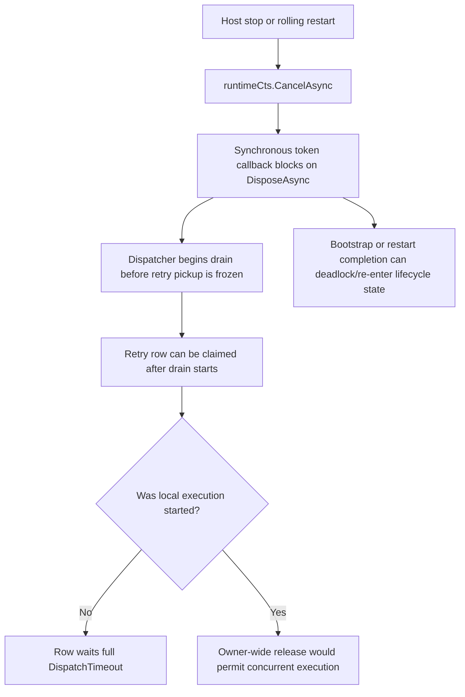
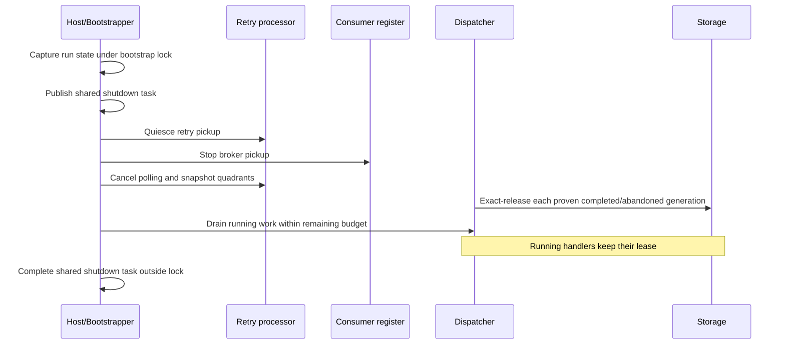

# fix(messaging): Harden retry shutdown and rolling restarts

## Goal Capsule

Make Messaging shutdown and rolling restarts fully asynchronous and bounded. Shutdown must stop broker and retry pickup before draining local work, release only exact lease generations that are locally complete or explicitly abandoned, retain the lease of every handler still executing, and preserve normal `LockedUntil` crash recovery and the documented at-least-once boundary.

---

## Product Contract

### Problem Frame

The bootstrapper currently registers a synchronous cancellation callback that blocks on `DisposeAsync().AsTask().GetAwaiter().GetResult()`. `StopAsync` enters that callback through `CancelAsync`, while bootstrap and consumer restart paths can still be publishing or awaiting shared startup state. This creates a lock/re-entry and completion-ordering deadlock surface during shutdown and rolling restart.

The processor order also starts draining the dispatcher before retry pickup is fully quiesced. `MessageProcessingServer` waits a hard-coded ten seconds for only its outer retry loops; retry quadrant tasks and rows claimed immediately before cancellation may remain unobserved. Releasing every lease owned by the stopping node is unsafe because a handler may still be executing an external effect. Leaving every pre-dispatch claim untouched instead makes a graceful rolling restart wait for the full `DispatchTimeout`.

The desired boundary is therefore precise: graceful shutdown may release an exact, locally known lease generation only after the attempt completed or before it began; a locally running handler retains ownership until it completes or its ordinary lease expires after a crash.

### Requirements

- R1. Replace the synchronous cancellation callback and all processor shutdown sync-over-async bridges with one idempotent, bounded asynchronous shutdown operation; retain and fault-observe any handler cleanup that outlives that bounded result.
- R2. Capture bootstrap and shutdown completion state under `_bootstrapLock`, then signal/cancel/await it outside the critical section so no callback or continuation re-enters the lock.
- R3. Concurrent `StopAsync`, `DisposeAsync`, and cancellation calls share one bounded host-shutdown completion. Consumer restart/pulse work is serialized against host stop and cannot double-start or strand pickup loops.
- R4. Use `MessagingOptions.ShutdownTimeout` as one monotonic end-to-end shutdown budget; no processor starts an independent hard-coded grace period.
- R5. Stop new broker and retry pickup before waiting for locally accepted work to drain.
- R6. Observe all retry quadrants and dispatcher work that belongs to the local runtime, including work claimed immediately before shutdown.
- R7. Represent a retry lease generation by the storage row ID plus exact `Owner` and store-returned `LockedUntil`, preserving Publish/Subscribe and Bus/Queue lane identity.
- R8. Release a lease only when that exact local attempt completed or was explicitly abandoned before execution; an owner-only, ID-only, or recomputed-deadline release is forbidden.
- R9. A handler still executing when the shutdown budget expires retains its lease. A kill or crash performs no graceful release and remains recoverable only after normal `LockedUntil` expiry or the existing proven-dead-owner path.
- R10. Implement exact lease-release semantics in InMemory, PostgreSQL, and SQL Server storage providers and prove the shared contract against all three.
- R11. Emit one actionable startup warning when `DispatchTimeout - InitialDispatchGrace` is strictly greater than the documented two-minute noticeable-delay floor; compare without overflow, include `DispatchTimeout`, `InitialDispatchGrace`, and `ShutdownTimeout`, and explain the rolling-restart consequence and at-least-once/long-handler guidance without blindly recommending a shorter global timeout.
- R12. Document `DispatchTimeout`, `ShutdownTimeout`, `InitialDispatchGrace`, the outer generic-host/orchestrator termination grace, rolling-restart latency, crash recovery, and the at-least-once limitation.
- R13. Focused bootstrap and runtime subscriber tests complete within 60 seconds each and race-sensitive scenarios pass repeatedly without arbitrary sleeps, polling retries, skipped tests, or weakened assertions.

### Acceptance Examples

- AE1. Cancelling a host while bootstrap is blocked signals the captured completion outside `_bootstrapLock`; bootstrap cancellation, `StopAsync`, and `DisposeAsync` finish without deadlock.
- AE2. Concurrent host stop/dispose calls observe a single bounded shutdown operation. A consumer restart races safely with host stop, starts replacement pickup only after old pickup loops are definitively quiesced, and keeps any old-generation running handler isolated, leased, retained, and fault-observed.
- AE3. Graceful shutdown closes retry and broker pickup first, then drains work using only the remaining `ShutdownTimeout` budget.
- AE4. A row claimed by this runtime but never accepted for execution is exact-released and can be reclaimed immediately by another owner.
- AE5. A queued retry item drained before its handler begins is exact-released; the same row with a different owner or `LockedUntil` generation is unchanged.
- AE6. A handler still running when shutdown times out retains its lease and is not concurrently re-picked. Once it actually completes, its normal terminal transition or exact completion release may make it eligible.
- AE7. A process killed without the graceful path does not release a lease; another owner becomes eligible only after store-authoritative expiry.
- AE8. The four retry quadrants—Publish/Subscribe across Bus/Queue—preserve their lane and satisfy the same freeze, drain, and release invariants.
- AE9. Default retry settings intentionally emit one material-timeout warning because their lease/grace difference exceeds two minutes. A difference of exactly two minutes does not warn; one tick above it does.
- AE10. `BootstrapperTests` and `RuntimeSubscriberIntegrationTests` pass at least 20 consecutive focused repetitions, with every test carrying a sub-60-second bound.

### Scope Boundaries

#### In Scope

- One-way host bootstrap/stop coordination and consumer-register restart coordination.
- Retry pickup quiescing and local attempt lifecycle tracking.
- Exact graceful lease release in the Core storage contract and all supported built-in storage providers.
- Focused unit, integration, provider-conformance, and race-repetition verification.
- Messaging option XML documentation, Core README, and `docs/llms/messaging.md` operational guidance.

#### Out of Scope

- Inbox, middleware, request/reply, release work, or unrelated Messaging capabilities.
- Exactly-once claims, distributed transactions around external handler effects, or shortening/releasing a lease while its handler is executing.
- Lowering the global `DispatchTimeout` default to mask rolling-restart latency.
- A release, merge, tag, GitHub Package, or NuGet publication.
- Changes to Jobs, Queue/Bus lane identity, or provider-conformance behavior unrelated to exact graceful release.

---

## Planning Contract

### Causal Model

The correction separates lifecycle signaling from asynchronous cleanup, gives the cleanup one authoritative deadline, and attaches exact attempt-generation state to every locally claimed retry row.

### Key Technical Decisions

- KTD1. **Session-settled: user-approved.** Deliver #271 as one independent maintenance PR from current `origin/main`. Rejected: bundling inbox, middleware, request/reply, release, or other Messaging work. Reason: shutdown and lease correctness is independently reviewable and should land before new capabilities.
- KTD2. **Session-settled: user-approved.** Preserve at-least-once delivery. Rejected: claiming exactly-once or releasing/shortening the lease of a still-running handler. Reason: storage fencing cannot make external effects exactly once.
- KTD3. **Session-settled: user-approved.** Make shutdown fully asynchronous and bounded by `MessagingOptions.ShutdownTimeout`. Rejected: the token callback sync-over-async bridge and arbitrary sleeps/timeouts. Reason: completion ordering—not elapsed delay—is the defect.
- KTD4. **Session-settled: user-approved.** Do not lower global `DispatchTimeout` defaults blindly. Rejected: shorter leases as a rolling-restart workaround. Reason: active handlers must retain ownership; safe reclaim is owner-, generation-, and completion-aware.
- KTD5. **Session-settled: user-directed.** Do not merge or publish any release, tag, GitHub Package, or NuGet package. Rejected: combining delivery with release work. Reason: release work is explicitly separate.
- KTD6. Use a per-run `TaskCompletionSource` created with `RunContinuationsAsynchronously` and one shared **bounded shutdown-completion task**. Under `_bootstrapLock`, transition the one-way host lifecycle and capture the bootstrap task, runtime CTS, and processor snapshot; outside the lock, signal/cancel/await them. Separately retain and fault-observe an **eventual-cleanup task** for handlers that outlive the bound. No cancellation callback performs asynchronous cleanup or acquires `_bootstrapLock`.
- KTD7. Host bootstrap remains non-restartable once shutdown begins. Concurrent host stoppers await the same bounded completion, while `IConsumerRegister` restart/pulse work is serialized against host stop: replacement consumers start only after old pickup loops are definitively quiesced, but may start after the deadline while old-generation running handlers remain isolated, leased, retained, and fault-observed.
- KTD8. Define explicit shutdown phases: atomically close retry and broker pickup gates without awaiting external teardown; snapshot local attempts; cancel polling; transition and exact-release every already-proven completed/abandoned attempt within the remaining budget; then await broker teardown, drain running work, and dispose remaining processors. Exact release is attached to the state transition that proves safety, so a slow broker or blocked handler cannot consume the budget before unrelated abandoned rows are released.
- KTD9. Keep `IProcessingServer` unchanged. Add an internal bounded-stop/quiesce capability for built-in processors; the bootstrapper passes the remaining budget to that capability and independently deadline-bounds legacy or third-party `DisposeAsync` calls.
- KTD10. Track retry claims internally without changing the public `IDispatcher` enqueue signature. Each attempt uses atomic state transitions: a worker must win `claimed/queued -> running` before invoking user or transport code; shutdown may release only after winning `claimed/queued -> abandoned`; and a failed abandon CAS retains the lease because execution has started or completed. Dispatcher work items carry the optional exact lease identity; ordinary non-retry messages remain unchanged.
- KTD11. Add a separate optional storage capability for exact graceful lease release, following the existing optional-capability pattern rather than adding required members to `IDataStorage`. InMemory, PostgreSQL, and SQL Server implement published and received release operations; unsupported third-party providers conservatively retain leases for normal expiry. The predicate is row ID, null-safe owner equality, and exact store-returned `LockedUntil`; successful release clears only `Owner` and `LockedUntil` and never changes lane, retry counters, terminal state, or scheduling fields.
- KTD12. A graceful release is attempted only after the dispatcher/executor/sender operation completes or when a locally claimed/queued item is proven never to have started. At deadline, running work remains tracked and leased; eventual completion may exact-release harmlessly after ordinary terminal writes, where the CAS becomes a no-op.
- KTD13. Define “materially exceeds” as the overflow-safe strict difference `DispatchTimeout - InitialDispatchGrace > 2 minutes`. The default difference is intentionally warned once per bootstrap: the defaults prioritize long-handler lease safety, while the diagnostic asks operators to measure valid handler duration and explicitly align `DispatchTimeout` and `InitialDispatchGrace` when rolling-restart latency matters. The warning names those values plus `ShutdownTimeout` and explains that crash or an over-budget handler can delay pickup until lease expiry; it preserves at-least-once semantics and never recommends an unmeasured timeout reduction.

### Final Design

The exact lease identity is immutable and constructed from the values returned by the store claim. The existing `IDataStorage` retry-claim contract already requires returned messages to reflect the committed durable `LockedUntil` and `Owner`, so no provider claim signature expansion is required. PostgreSQL uses `IS NOT DISTINCT FROM` for owner equality; SQL Server uses explicit null-safe owner predicates; InMemory compares the same fields while holding its row lock. No graceful action scans or releases all rows for a node owner.

### Existing Patterns to Follow

- `src/Headless.Messaging.Core/Internal/IBootstrapper.Default.cs` for the current shared bootstrap task and lock boundary.
- `src/Headless.Messaging.Core/Internal/IConsumerRegister.cs` for pickup-freeze followed by monotonic-budget drain.
- `src/Headless.Messaging.Core/Processor/Dispatcher.cs` for reentrant bounded disposal and local channel ownership.
- `src/Headless.Messaging.Core/Processor/IProcessor.NeedRetry.cs` for the four retry quadrants and active-task generation CAS.
- `src/Headless.Messaging.Core/Persistence/IDataStorage.cs` for storage-provider conformance boundaries.
- `docs/solutions/best-practices/storage-initializer-lifecycle-correctness.md` for lock-free completion signaling and atomic lifecycle transitions.
- `docs/solutions/design-patterns/atomic-database-clock-relational-lease-claims.md` and `docs/solutions/design-patterns/temporal-authority-standard.md` for store-authoritative lease generations and provider parity.

### Risks and Mitigations

| Risk | Mitigation |
| --- | --- |
| Bounded shutdown widens the public processing-server SPI. | Keep `IProcessingServer` unchanged; built-ins use an internal capability and third-party disposal is bounded externally. |
| A timeout leaves handlers running after the bounded host stop result. | Retain the captured processor/storage references, isolate attempt generations, and observe/log eventual faults; host shutdown remains one-way and consumer pickup restart waits only for definitive old-loop quiescence. |
| The outer host or orchestrator kills the process before Messaging's budget expires. | Document that the outer termination grace must exceed `MessagingOptions.ShutdownTimeout`; early termination intentionally falls back to normal lease expiry and is observable as incomplete graceful shutdown. |
| Database timestamp precision makes exact release miss. | Use the `LockedUntil` value returned by the database claim, never recompute it; add relational round-trip tests. |
| Shutdown releases a handler that ignored cancellation. | Execution-start state, not cancellation, controls release; running work is never released at the deadline. |
| A completed external effect is retried after its terminal write fails. | Preserve and document at-least-once; exact completion release can accelerate a duplicate but cannot overlap local execution. |
| Provider or lane behavior drifts. | Put identity/release cases in `DataStorageTestsBase` and inherit them in InMemory, PostgreSQL, and SQL Server; cover all four retry quadrants. |
| Race tests become timing-dependent. | Use `TaskCompletionSource`, barriers, `FakeTimeProvider`, and exact state assertions; sleeps and retry polling are forbidden. |

### Dependencies and Sequencing

U1 establishes red lifecycle characterizations and the bounded bootstrap coordinator. U2 defines the immutable lease identity and optional capability contract, then adds local attempt/quiesce behavior against a fake storage boundary. U3 implements that contract in each built-in provider. U4 composes runtime behavior and provider verification. U5 finalizes diagnostics and documentation after the semantics are proven.

---

## Implementation Units

### U1. Replace bootstrap sync-over-async with one bounded async coordinator

- **Goal:** Make one-way host shutdown and concurrent consumer restart idempotent, deadlock-free, and governed by one shutdown deadline.
- **Requirements:** R1-R5, R13
- **Dependencies:** None
- **Files:**
  - `src/Headless.Messaging.Core/Internal/IBootstrapper.Default.cs`
  - `src/Headless.Messaging.Core/Processor/IProcessingServer.Message.cs`
  - `src/Headless.Messaging.Core/Internal/IConsumerRegister.cs`
  - `tests/Headless.Messaging.Core.Tests.Unit/BootstrapperTests.cs`
  - `tests/Headless.Messaging.Core.Tests.Unit/ConsumerRegisterTests.cs`
- **Approach:** First add a deterministic characterization that exposes the callback/deadlock ordering and a red concurrent host-stop/consumer-restart test. Replace the callback with a per-run asynchronously continued bounded completion signal, retain eventual cleanup separately, and keep host bootstrap one-way. Capture state under `_bootstrapLock`; quiesce and await outside it. Thread a single monotonic remaining budget through an internal built-in capability and deadline-bound unchanged third-party `IProcessingServer.DisposeAsync` implementations at the bootstrapper.
- **Test scenarios:**
  - Cancellation during blocked bootstrap cannot deadlock or acquire the bootstrap lock from a completion callback.
  - Concurrent `StopAsync` and `DisposeAsync` call each processor stop once and await one completion.
  - A consumer restart cannot start replacement pickup until earlier pickup loops settle, but a non-cooperative old handler does not block it forever after the configured deadline.
  - A legacy `IProcessingServer` remains source-compatible because its interface is unchanged and its disposal is externally deadline-bounded.
  - Every lifecycle test has a `WaitAsync` bound below 60 seconds.
- **Verification:** Focused `BootstrapperTests` and `ConsumerRegisterTests` pass; an unchanged third-party `IProcessingServer` test double still compiles; no `GetAwaiter().GetResult()`, `.Result`, or `.Wait()` remains in the shutdown path.

### U2. Quiesce retry pickup and track local attempt completion

- **Goal:** Stop new pickup before drain and distinguish safely releasable retry attempts from running handlers.
- **Requirements:** R3-R9, R13
- **Dependencies:** U1
- **Files:**
  - `src/Headless.Messaging.Core/Processor/IProcessor.NeedRetry.cs`
  - `src/Headless.Messaging.Core/Processor/Dispatcher.cs`
  - `src/Headless.Messaging.Core/Transport/IDispatcher.cs`
  - `src/Headless.Messaging.Core/Persistence/IGracefulLeaseReleaseStorage.cs`
  - `src/Headless.Messaging.Core/Setup.cs`
  - `tests/Headless.Messaging.Core.Tests.Unit/Processor/MessageNeedToRetryProcessorTests.cs`
  - `tests/Headless.Messaging.Core.Tests.Unit/DispatcherTests.cs`
- **Approach:** Define the immutable lease identity and optional exact-release capability first, using the existing retry-claim guarantee that returned messages carry committed durable owner/lease values. Then add an internal quiesce/stop capability and local retry-attempt tracker against that seam. Close the accepting gate before snapshotting active quadrant tasks. Carry optional exact lease identity in internal dispatcher work items. Use atomic per-attempt CAS so the worker must publish and win queued-to-running before invocation and shutdown must win queued-to-abandoned before release; an unknown/unprovable state is treated as running and retains the lease. Exact-release every safe transition promptly within the shared remaining budget before waiting on external teardown or unrelated running work. Keep public enqueue APIs and ordinary message behavior intact.
- **Test scenarios:**
  - No storage pickup or quadrant start occurs after quiesce.
  - Publish/Subscribe and Bus/Queue claims retain the correct lane and direction.
  - Claimed-before-handoff and queued-not-started rows become explicitly abandoned.
  - A worker-start versus shutdown-abandon race has one winner; shutdown never releases after running wins.
  - An item dequeued while its running transition is in progress is conservatively retained, never exact-released.
  - A queued abandoned row is released even when an unrelated running handler consumes the remaining drain budget.
  - A blocked handler remains running and unreleased through shutdown timeout.
  - Reentrant/concurrent stop observes the same tracked work and cannot double-release.
- **Verification:** Focused processor and dispatcher suites pass with deterministic barriers and `FakeTimeProvider`; no arbitrary sleep or assertion retry is introduced.

### U3. Add exact generation-fenced lease release to every storage provider

- **Goal:** Make graceful abandonment/completion reclaimable without weakening active-handler or crash fencing.
- **Requirements:** R7-R10
- **Dependencies:** U2
- **Files:**
  - `src/Headless.Messaging.Storage.InMemory/InMemoryDataStorage.cs`
  - `src/Headless.Messaging.Storage.PostgreSql/PostgreSqlDataStorage.cs`
  - `src/Headless.Messaging.Storage.SqlServer/SqlServerDataStorage.cs`
  - `tests/Headless.Messaging.Core.Tests.Harness/DataStorageTestsBase.cs`
  - `tests/Headless.Messaging.Storage.InMemory.Tests.Unit/InMemoryDataStorageTests.cs`
  - `tests/Headless.Messaging.Storage.PostgreSql.Tests.Integration/PostgreSqlStorageTests.cs`
  - `tests/Headless.Messaging.Storage.SqlServer.Tests.Integration/SqlServerDataStorageTests.cs`
- **Approach:** Implement U2's optional storage capability in every built-in provider. Use row ID plus exact owner plus exact `LockedUntil` predicates, clearing only owner/lease fields; a provider without the capability keeps the normal lease. Extend the shared harness so all built-in providers prove the same result and durable state.
- **Test scenarios:**
  - Exact matching generation releases and is immediately reclaimable.
  - Wrong owner, stale `LockedUntil`, terminal/already-cleared, and renewed same-owner generations are no-ops.
  - Publish/Subscribe and Bus/Queue identity/state are preserved.
  - Relational providers round-trip store-returned timestamp precision.
  - No graceful call means the row remains unavailable until normal expiry.
  - A third-party `IDataStorage` implementation without the optional capability still compiles and conservatively retains the lease.
- **Verification:** InMemory unit plus PostgreSQL and SQL Server integration/conformance suites pass against real provider semantics.

### U4. Prove rolling restart, graceful drain, and crash invariants end to end

- **Goal:** Demonstrate that lifecycle ordering and lease ownership compose correctly across runtime subscriber restart and shutdown.
- **Requirements:** R1-R10, R13
- **Dependencies:** U1-U3
- **Files:**
  - `tests/Headless.Messaging.Core.Tests.Unit/BootstrapperTests.cs`
  - `tests/Headless.Messaging.Core.Tests.Unit/IntegrationTests/RuntimeSubscriberIntegrationTests.cs`
  - `tests/Headless.Messaging.Core.Tests.Unit/Processor/MessageNeedToRetryProcessorTests.cs`
  - `tests/Headless.Messaging.Core.Tests.Unit/DispatcherTests.cs`
- **Approach:** Compose deterministic fake transport/storage and barrier-controlled handlers. Assert observable pickup ordering, exact lease state, processor instance counts, and eventual cleanup. Repeat the two race-sensitive focused suites at least 20 times and bind every individual test below 60 seconds.
- **Test scenarios:**
  - Bootstrap cancellation and consumer restart do not deadlock.
  - Concurrent stop/restart never strands or double-starts loops.
  - Graceful shutdown closes pickup before drain.
  - Safely abandoned rows are immediately reclaimable.
  - In-flight handlers retain their lease through timeout and cannot overlap a new attempt.
  - Kill/crash omits graceful release and remains governed by `LockedUntil` expiry; the existing proven-dead-owner recovery path remains unchanged and provider-fenced.
- **Verification:** `BootstrapperTests` and `RuntimeSubscriberIntegrationTests` pass 20 consecutive focused repetitions with recorded totals; focused retry/dispatcher suites pass once and under their explicit bounds.

### U5. Add the material-timeout diagnostic and operational documentation

- **Goal:** Make rolling-restart latency and the at-least-once boundary actionable to operators.
- **Requirements:** R11-R12
- **Dependencies:** U1-U4
- **Files:**
  - `src/Headless.Messaging.Core/Configuration/MessagingOptions.cs`
  - `src/Headless.Messaging.Core/Configuration/RetryPolicyOptions.cs`
  - `src/Headless.Messaging.Core/Internal/IBootstrapper.Default.cs`
  - `src/Headless.Messaging.Core/Internal/LoggerExtensions.cs`
  - `tests/Headless.Messaging.Core.Tests.Unit/BootstrapperTests.cs`
  - `src/Headless.Messaging.Core/README.md`
  - `docs/llms/messaging.md`
- **Approach:** Evaluate whether the overflow-safe strict difference between `DispatchTimeout` and `InitialDispatchGrace` exceeds two minutes during startup and log one structured warning with all three Messaging timing values and remediation context. State that the default warning is intentional: operators should measure longest valid handler duration, then explicitly align the two settings if restart latency matters rather than blindly shorten the lease. Update option XML and operator docs to distinguish graceful shutdown, rolling restart, crash recovery, active handlers, at-least-once duplicates, and the requirement that outer host/orchestrator termination grace exceed Messaging's shutdown budget.
- **Test scenarios:**
  - A difference of exactly two minutes does not warn; one tick above warns.
  - Dispatch shorter than grace and overflow-scale configured values cannot wrap the comparison.
  - The warning includes `DispatchTimeout`, `InitialDispatchGrace`, `ShutdownTimeout`, lease-expiry behavior, and at-least-once guidance.
- **Verification:** Focused options/bootstrap tests pass and documentation matches the implemented threshold and lease lifecycle.

---

## Verification Contract

### Red/Characterization Gate

- Add and run the lifecycle test that demonstrates the current synchronous cancellation/deadlock ordering before production changes.
- Add the safe-abandon versus running-handler lease assertions before implementing exact release.
- Preserve the failing output in the implementation evidence; do not weaken the red assertion to make the old design pass.

### Focused Gates

- Build and analyzer-check `Headless.Messaging.Core` after lifecycle and dispatcher changes.
- Run focused `BootstrapperTests`, `MessageNeedToRetryProcessorTests`, `DispatcherTests`, and `RuntimeSubscriberIntegrationTests` with Microsoft Testing Platform filters.
- Run InMemory storage tests and shared harness cases.
- Run PostgreSQL and SQL Server storage integration tests against their real databases locally when Docker is available; otherwise keep their Definition of Done item open until PR CI supplies named provider evidence, and record which environment produced each run.
- Run formatting and diff whitespace checks after each implementation slice.

### Race-Repetition Gate

- Execute focused `BootstrapperTests` and `RuntimeSubscriberIntegrationTests` at least 20 consecutive times.
- Record per-run totals and the aggregate total; any hang, timeout, failure, or zero-test selection fails the gate.
- Each test uses a bound below 60 seconds; the command itself has an outer bounded timeout.

### Final Gates

- `make build` or the repository’s narrower authoritative Messaging build target passes with analyzers.
- All affected Messaging unit and storage-provider integration suites pass.
- Bus/Queue lane and Publish/Subscribe provider-conformance invariants remain green.
- Public API compatibility review confirms no breaking dispatcher change and a source-compatible processing-server extension.
- `git diff --check`, CSharpier/format verification, and repository status are clean except for the intentional change set.
- One conventional commit (or a minimal atomic series) is pushed to `xshaheen/fix-messaging-retry-shutdown` and one PR targets `main` with `Closes #271` plus exact verification evidence.
- PR CI reaches a terminal decided state; convergent failures are repaired within the autopilot budget.

---

## Definition of Done

- Issue #271 acceptance criteria are implemented without unrelated Messaging capability work.
- Shutdown is asynchronous, idempotent, lock-safe, and bounded by one configured `ShutdownTimeout` budget.
- Retry and broker pickup stop before drain; local quadrant and dispatcher work is observed.
- Only exact, owner-matched, store-generation-matched leases for completed or explicitly abandoned attempts are released.
- Running handlers retain their lease; crash recovery remains governed by normal `LockedUntil` expiry.
- The startup warning and docs explain material timeout skew, graceful rolling restarts, and at-least-once limits.
- Focused lifecycle suites pass at least 20 consecutive repetitions, each test bounded below 60 seconds.
- InMemory, PostgreSQL, and SQL Server exact-release conformance passes.
- Agent review has no unresolved blocking findings; residuals, if any, are explicitly documented in the PR.
- Browser testing is explicitly classified and either completed for affected UI or skipped as non-UI with evidence.
- The PR is open with terminal CI status and remains unmerged. No release, tag, GitHub Package, or NuGet publication occurs.

---

## Sources and Research

- GitHub issue [#271](https://github.com/xshaheen/headless-framework/issues/271), re-queried on 2026-08-05.
- Historical reviewed architecture at `a87dfc5a1d3470971f31c3130463dd16130f879b:docs/plans/2026-07-13-002-messaging-reviewed-architecture-plan.md` (removed from `main` by the later planning-artifact cleanup).
- `docs/solutions/best-practices/storage-initializer-lifecycle-correctness.md`.
- `docs/solutions/concurrency/startup-pause-gating-and-half-open-recovery.md`.
- `docs/solutions/design-patterns/atomic-database-clock-relational-lease-claims.md`.
- `docs/solutions/design-patterns/temporal-authority-standard.md`.
- `docs/solutions/logic-errors/terminal-state-overwrite-on-redelivery.md`.
- Live `origin/main` at `60d5993a7e899676a1a92c20882518927bc2f70a`.
