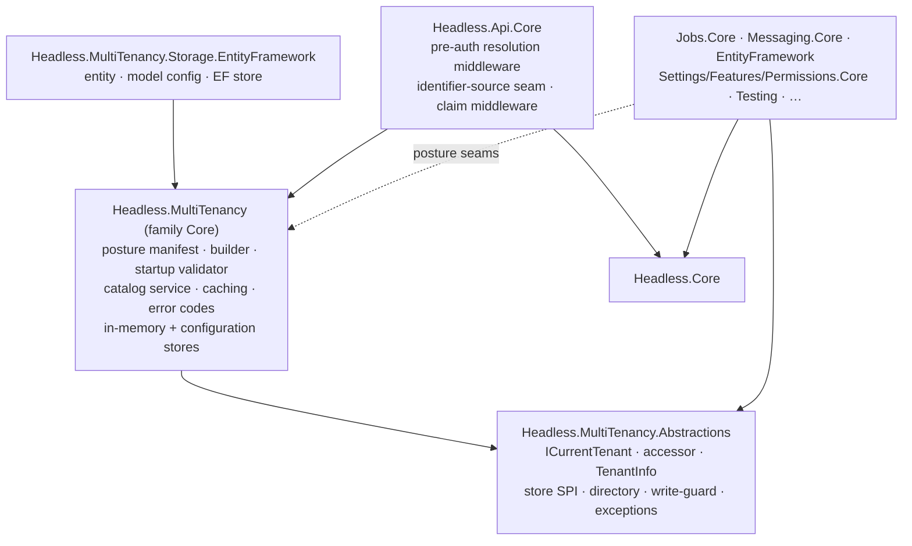
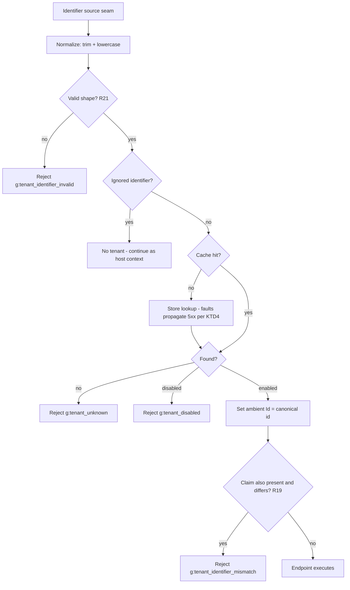

# Tenant Catalog - Plan

## Goal Capsule

- **Objective:** Restructure the Headless tenancy family (contracts + posture + catalog under `Headless.MultiTenancy`) and add the opt-in tenant catalog that maps public tenant identifiers to canonical tenant ids before ambient context is set, and serves tenant metadata to app code. Implements GitHub issue #253.
- **Product authority:** Issue #253 plus this contract. Where they differ, this contract wins — notably the non-generic contract shape supersedes the issue's generic `IHeadlessTenantStore<TTenantInfo>` sketch.
- **Stop conditions:** Surface a genuine blocker (scope change, contract contradiction, or invalidated KTD) instead of guessing. Details the plan leaves open are implementer judgment.
- **Execution profile:** Standard repo gates (build with warnings-as-errors, CSharpier, analyzers, unit + MultiTenancy-family integration tests). The family restructure (U1) lands first and must be behavior-neutral.

---

## Product Contract

### Summary

An opt-in tenant catalog: a non-generic `TenantInfo` model, a minimal read-only store SPI with in-memory, configuration, and EF Core implementations, and a family-owned catalog service that normalizes identifiers, caches read-through, canonicalizes identifier→id, and fails closed on unknown or disabled tenants. Apps without a store keep today's behavior unchanged. The tenancy family itself is restructured so contracts, posture, and catalog share one home.

### Problem Frame

HTTP resolution produces public identifiers such as `acme` from `acme.example.com`. In production systems the public identifier is not the canonical tenant id used for persistence and authorization; hostnames and routes change while tenant-owned data must stay keyed to a stable id. Headless today resolves the ambient tenant only from a JWT claim that already carries the canonical id (`src/Headless.Api.Core/Middlewares/TenantResolutionMiddleware.cs`) and owns no tenant lookup: `docs/llms/multi-tenancy.md:490` states the framework owns no tenant enumeration or `ITenantStore` by design, so apps hand-roll identifier mapping and tenant directories. The tenancy surface is also split across homes: tenant-context contracts sit in `Headless.Core` while `Headless.MultiTenancy` holds only posture bookkeeping.

Finbuckle.MultiTenant, the reference implementation in this space (reviewed at v10.1.0), shows the cost of the wrong shape: its `TTenantInfo` generic spread through ~40% of its source files; its context/accessor/store surface shipped a breaking redesign in four consecutive major versions (v7–v10), including shipping its `Abstractions` package split and namespace-consistency pass as late breaking changes; its 7-member store interface leaves shipped stores throwing `NotImplementedException`; its resolver hits stores on every request with no caching layer; and case sensitivity varies per store. This contract is designed against those failure modes using patterns this repo already ships, and takes the family-shape correction now, while the framework has no external consumers.

### Key Decisions

- **Non-generic pipeline, extensible model — three extension tiers.** The pipeline (store SPI, catalog service, resolution, ambient context, caching) carries no type parameter. Apps extend the tenant model by: (1) the `ExtraProperties` bag for read-along data, (2) subclassing non-sealed `TenantInfo` from an app-owned store implementation with real typed columns, (3) an opt-in typed accessor that is generic only at the leaf. (session-settled: user-approved — chosen over Finbuckle-style pipeline generics after examining generic virality, the indexing question, and the Jobs precedent: repo generics close per-call-site or per-provider at edges, never as one app-global pipeline parameter.) Governs R1, R3, R10.
- **The catalog owns identity, routing, and lifecycle only; per-tenant configuration belongs to Settings/Features/Permissions keyed by canonical id.** The framework already ships cached, managed per-tenant stores; a rich tenant model would compete with them. Finbuckle bolted per-tenant options onto its tenant model because it lacks a settings system; Headless does not. (session-settled: user-approved — chosen over a rich typed tenant model carrying app configuration.) Governs R2.
- **Consumer catalog service split from provider store SPI** — the Settings-domain pattern (`SettingValueStore` over `ISettingValueRecordRepository`): policy, caching, and normalization live once in the family Core; stores stay minimal. This split is what prevents Finbuckle's CRUD-bloated store contract. Governs R3, R6, R7, R12.
- **Queryable-by ⇒ first-class.** `ExtraProperties` is non-queryable read-along payload — the repo maps it through a serialized value-converter column that is opaque to EF LINQ (`src/Headless.EntityFramework/Extensions/HeadlessEntityConventionExtensions.cs:434`). An attribute that needs an index is either a tenant identifier or a column in an app-owned store implementation. Governs R2, R3.
- **Enumeration ships as an optional capability interface**, implemented by all v1 stores; fan-out orchestration stays app code. This deliberately supersedes the documented "no tenant enumeration by design" stance: all v1 stores can enumerate trivially, and the cron fan-out docs record real demand. (session-settled: user-approved — chosen over canonicalization-only scope.) Governs R4.
- **Read-through caching in the family Core via `ICache` with options-controlled expiration** — the Settings pattern. The cache stores the canonical base shape only (core fields + bag); typed subclass views are projections or re-hydrations, never polymorphic cache serialization. Expiration is the staleness bound. Governs R12, R13, R14.
- **Identifier normalization is family-Core policy, not store behavior.** One rule applied once by the catalog service, replacing Finbuckle's per-store case-sensitivity inconsistency. Uniqueness and input bounds are enforced on the normalized form. Governs R7, R20, R21.
- **Catalog misconfiguration fails at startup** through the existing `TenantPostureManifest` / startup-validator seam, not at first request. Governs R18.
- **Resolution failures are indistinguishable by default.** The pre-auth path returns one generic rejection for unknown, disabled, and mismatched tenants; granular codes are an opt-in diagnostics concession, not the default — a tenant directory must not be enumerable from error responses. Governs R11.
- **The tenancy family is one home.** Tenant-context contracts move out of `Headless.Core` into the restructured family so contracts, posture, and catalog live under `Headless.MultiTenancy`. (session-settled: user-directed — chosen over adding a new package beside the frozen posture package: the family identity should not stay split across `Headless.Core` and `Headless.MultiTenancy`.) Governs R23.

### Requirements

**Contract and model**

- R1. `TenantInfo` is non-generic and non-sealed, with `Id`, `Identifier`, `Name`, `IsEnabled`, and `ExtraProperties`.
- R2. `ExtraProperties` is read-along payload: it never participates in lookups, and documentation states per-tenant configuration belongs in Settings/Features keyed by canonical id.
- R3. The store SPI is read-only and minimal: find by normalized identifier, find by canonical id. Implementing it over an app-owned tenant aggregate is a documented first-class path; the shipped EF store is a convenience default, not a canonical schema.
- R4. An optional enumeration capability interface lists tenants; all v1 stores implement it; the framework builds no fan-out features on top of it.

**Resolution and ambient context**

- R5. The catalog is opt-in: with no store configured, every existing flow (claim resolution, EF filters, Jobs/Messaging propagation) behaves unchanged.
- R6. With a store configured, identifier-based resolution runs: normalize → ignored-identifier check → store lookup → fail closed on unknown → fail closed on disabled → set ambient context to the canonical id and display name via `ICurrentTenant.Change(TenantInfo.Id, TenantInfo.Name)`. Ignored identifiers never reach the store.
- R7. The catalog service normalizes identifiers once (trim, lowercase invariant) before lookup; stores compare the normalized form ordinally.
- R8. Claim-based resolution stays store-free: the claim value is the canonical id, per issue #253.
- R9. Resolved `TenantInfo` is available to app code through an accessor that loads lazily by canonical id — including for claim-resolved tenants when a store is configured. Accessor reads return data (including `IsEnabled = false`) and never reject; rejection happens only at resolution time. An id with no catalog row yields an absent (null) result — never an exception or a synthesized placeholder. When the ambient display name and the catalog name differ (e.g., a Jobs/Messaging-restored scope), the accessor's catalog value is authoritative.
- R10. An opt-in typed accessor exposes an app-defined `TenantInfo` view; its registration supplies the projection delegate (base shape → app type), with downcast as a fast path when the store returned the subtype. No other surface carries the type parameter.

**Failure semantics**

- R11. Unknown, disabled, invalid, and mismatched identifiers produce deterministic ProblemDetails failures, rejected before endpoint execution. Secure by default: unknown, disabled, and claim-mismatch outcomes return one generic rejection (`g:tenant_resolution_failed`, 404) so callers cannot enumerate tenants or their status from response differences; invalid identifier keeps its own code at 400 (shape validation reveals nothing tenant-specific). An opt-in diagnostics option restores granular codes and statuses (unknown 404, disabled 403, mismatch 403) for development and trusted environments. Codes register per framework conventions (MessageDescriber + resx). Infrastructure faults are never mapped to these codes: store faults propagate as ordinary server errors, and cache faults degrade to a cache miss that falls through to the store.

**Caching and staleness**

- R12. The catalog service caches store reads through `ICache` with an options-controlled expiration; repeat resolutions of the same identifier do not hit the store within the expiration window. Unknown identifiers are cached as negative entries under a separate, shorter expiration so repeated probes of the same unknown identifier do not reach the store; rotation through distinct identifiers still costs one store read each — that traffic class is the R22 rate-limiting delegation, not a caching promise.
- R13. The cache holds the canonical base shape only; subclass instances round-trip via projection or re-hydration. A typed subclass view whose fields exceed the base shape re-hydrates from the store on access in v1 — there is no typed cache entry, and R12's caching bound does not apply to that path.
- R14. Staleness is bounded by cache expiration: a disable or metadata change propagates within the expiration window, a newly created tenant becomes resolvable within the negative-cache window, and both bounds are documented — including the combined disabled-tenant exposure stated as one number: max(claim lifetime, cache expiration). The SPI is read-only, so there is no framework write path to invalidate through; reassigning an identifier to a different tenant within the window is therefore unsafe, and docs require a no-reuse period of at least the cache lifetime before re-pointing an identifier.

**Stores (v1)**

- R15. An in-memory store for tests and small apps.
- R16. A configuration-backed, read-only store bound through the options system with normal construction (no uninitialized-object reflection).
- R17. An EF Core-backed store following the repo storage-domain shape. Apps that use only in-memory or configuration stores take no EF package dependency.

**Configuration posture**

- R18. At most one store may be registered (exactly-one guard, matching the Settings storage guard), and incoherent posture fails at startup via the tenancy posture manifest — store-backed resolution enabled with no store, conflicting registrations, or a catalog-resolution posture whose pipeline hook or identifier sources are absent. Accessor-only hosts (store configured, no identifier resolution) are a valid posture and must not fail.

**Mapping integrity**

- R19. When identifier-based resolution and an authenticated tenant claim are both present on one request, both must canonicalize to the same tenant; a mismatch is rejected per R11. Claim-only requests keep the R8 store-free path.
- R20. Stores enforce uniqueness of normalized identifiers: the shipped EF store through a unique constraint on the normalized identifier, and the in-memory and configuration stores by failing at startup on duplicates.
- R21. Identifier-sourced values are validated against a maximum length and allowed shape before any cache or store lookup; invalid identifiers are rejected per R11. Default shape: DNS-label form (1-63 chars, lowercase letters, digits, hyphen, after normalization), configurable through options. Claim-carried canonical ids are not subject to this shape.

**Documentation**

- R22. Docs cover: tenant identifier vs canonical tenant id, migration guidance for apps that start claim-direct and add a catalog later, the three extension tiers, the staleness bounds, the identifier no-reuse rule, and a statement that DoS/rate-limiting protection for the pre-auth identifier-resolution path is a consumer responsibility (mirroring the existing input-validation delegation), recommending ASP.NET Core rate limiting or an edge control. The `docs/llms/multi-tenancy.md` "no tenant enumeration by design" statement is updated to reflect the enumeration capability decision. Doc surfaces follow `docs/authoring/AUTHORING.md`.

**Family restructure**

- R23. The tenancy family is restructured with no behavior change: tenant-context contracts (`ICurrentTenant`, accessor, write-guard types, tenancy exceptions) move from `Headless.Core` into the family; the family root namespace is `Headless.MultiTenancy`; all consumers update references and usings in the same change.

### Key Flows

- F1. Identifier resolution (store configured)
  - **Trigger:** Request arrives carrying a public identifier (e.g. host `acme.example.com` → `acme`) from an identifier source.
  - **Steps:** Normalize (`ACME ` → `acme`); check ignored list (`www`, `api`, …) — ignored ends resolution with no store call; catalog service consults cache, then store; unknown or disabled → fail closed with the R11 response; otherwise ambient `ICurrentTenant.Id` becomes the canonical id (`ten_123`).
  - **Outcome:** Endpoint executes with canonical ambient tenant id; EF filters, Jobs, Messaging see only canonical ids.
  - **Covers:** R6, R7, R11, R12.
- F2. Claim-resolved request using tenant metadata
  - **Trigger:** Authenticated request whose JWT carries the canonical tenant id claim.
  - **Steps:** Existing claim middleware sets ambient id with no store call; app code touches the tenant-info accessor; the accessor loads `TenantInfo` by canonical id through the cache; a typed leaf accessor projects the app view if registered.
  - **Outcome:** Claim flow performance and behavior unchanged until metadata is actually requested.
  - **Covers:** R5, R8, R9, R10.
- F3. Misconfigured startup
  - **Trigger:** Host starts with store-backed resolution enabled and no store registered, or two stores registered.
  - **Outcome:** Startup fails with a diagnostic from the tenancy posture validator; no request is served.
  - **Covers:** R18.

### Acceptance Examples

- AE1. **Covers R6.** Given a store mapping `acme → ten_123`, when a request resolves identifier `acme`, then ambient `ICurrentTenant.Id` is `ten_123` and app code sees the `TenantInfo` metadata.
- AE2. **Covers R6, R11.** Given no tenant with identifier `ghost`, when a request resolves `ghost`, then the request is rejected before endpoint execution with the generic tenant-resolution-failed response (404); with the diagnostics option enabled, the unknown-tenant `g:` code.
- AE3. **Covers R6, R11.** Given tenant `acme` with `IsEnabled = false`, when a request resolves `acme`, then the request is rejected before endpoint execution with a response byte-identical to AE2's generic rejection; with the diagnostics option enabled, the disabled-tenant `g:` code at 403.
- AE4. **Covers R6.** Given `www` is an ignored identifier, when a request arrives on `www.example.com`, then the store receives no call and resolution reports no tenant.
- AE5. **Covers R5, R8.** Given a configured store and a JWT carrying `tenant_id: ten_123`, when the request executes without touching tenant metadata, then the store receives no call and ambient behavior matches today's claim flow.
- AE6. **Covers R9.** Given the AE5 request, when app code reads the tenant-info accessor, then it receives the `TenantInfo` for `ten_123` loaded by id.
- AE7. **Covers R7.** Given identifier `acme` in the store, when a request resolves `ACME`, then it canonicalizes to the same tenant.
- AE8. **Covers R12, R14.** Given tenant `acme` resolved and cached, when the tenant is disabled in the store, then requests keep succeeding at most until cache expiration and fail closed after it.
- AE9. **Covers R19.** Given a store mapping `acme → ten_123`, when a request resolves identifier `acme` while its JWT claim carries `tenant_id: ten_999`, then the request is rejected before endpoint execution with the generic tenant-resolution-failed response; with the diagnostics option enabled, the mismatch `g:` code at 403.
- AE10. **Covers R20.** Given two tenants whose identifiers `Acme` and ` acme ` normalize to the same key, then the EF store rejects the second row via its unique constraint, and the in-memory and configuration stores fail at startup.
- AE11. **Covers R21.** Given a request whose resolved identifier is 200 characters long or contains characters outside the configured shape, then it is rejected with the invalid-identifier `g:` error code and neither cache nor store receives a call.
- AE12. **Covers R9.** Given ambient tenant `ten_A`, when a handler nests `ICurrentTenant.Change("ten_B")` and reads the tenant-info accessor inside that scope, then it receives `ten_B`'s info, and `ten_A`'s info again after the scope disposes.
- AE13. **Covers R10, R13.** Given an app-owned store returning `AcmeTenantInfo : TenantInfo` and a registered typed accessor, when app code reads the typed accessor after a resolution served from the cached base shape, then it receives an `AcmeTenantInfo` with its subclass fields intact (re-hydrated from the store), and no pipeline surface carries the type parameter.

### How This Work Fits Together

<!-- x-section: work-relationships -->

This plan owns the family restructure and the catalog layer: model, store SPI and v1 stores, canonicalization service, caching, failure semantics, and posture validation. The surrounding tenancy work is currently understood as follows; this breakdown is context, not a committed roadmap.

- HTTP identifier strategies (host, route, header) — separate work per issue #253. **Enables** end-to-end host-based resolution; this plan's identifier-source seam is what those strategies will plug into. This plan **can proceed independently of** it.
- Existing claim-based resolution — **shares** the ambient context; unchanged by this plan (R5, R8).
- Optional claim-path catalog validation (rejecting disabled tenants that hold still-valid JWTs) — a possible follow-up; **depends on** this plan. Deferred (see Scope Boundaries).
- Per-tenant Settings/Features/Permissions — **share** the canonical tenant id this catalog stabilizes; no changes to them in this plan (per Key Decisions: the catalog owns identity only).

### Scope Boundaries

**Deferred for later**

- HTTP host/route/header identifier strategies (separate issue per #253); this plan ships only the pluggable identifier-source seam they will implement.
- Distributed-cache and remote-HTTP store implementations, and retry/circuit-breaker hardening for remote stores.
- Opt-in validation of claim-resolved tenants against the catalog. Until it exists, `RequireTenantAttribute` / `TenantRequirementHandler` still checks only id presence — a disabled tenant's still-valid JWT passes it for the token's lifetime; the catalog does not change that.
- Multi-identifier (custom domain) support in the shipped EF store; the v1 schema must not preclude an identifiers table.
- Per-tenant connection strings and per-tenant options.
- Named/keyed multiple catalog instances in one host (KTD11).
- Catalog test doubles in `Headless.Testing` (fake `ITenantStore`/`ICurrentTenantInfo`) — the in-memory store covers consumer testing needs in v1.

**Outside this product's identity**

- Tenant management workflows, CRUD APIs, or UI — the catalog is a read surface.
- The catalog as a per-tenant configuration store — Settings/Features/Permissions own per-tenant state (per Key Decisions).

### Dependencies / Assumptions

- Assumption: the driver is framework completeness; no single consuming app pins the requirements (probed; unanswered). If a concrete app emerges, revisit store priorities and the multi-identifier question.
- Assumption: one tenant model per application; multi-model hosts are out of scope.
- EF tenant isolation (query filter, write guard) continues to key on the canonical tenant id only — unchanged by this plan.
- Jobs/Messaging tenant propagation restores ambient ids as today; background executions do not re-validate against the catalog (accessor semantics per R9 apply when handlers read tenant info).

### Sources / Research

- GitHub issue #253 — problem statement, baseline requirements, non-goals.
- Finbuckle.MultiTenant local clone at v10.1.0 — store/strategy/resolver design and its CHANGELOG breaking-change history (v7.0.0, v8.0.0, v9.0.0, v10.0.0/v10.0.2), which grounds the extension-tier, service/SPI-split, caching, normalization, and family-shape decisions.
- `src/Headless.Settings.Core/Setup.cs` and `src/Headless.Settings.Core/Values/SettingValueStore.cs` — the service/SPI split, exactly-one-storage guard (`GuardSingleStorageProvider`), and `ICache`-based read-through pattern this plan reuses.
- `src/Headless.MultiTenancy/Setup.cs`, `src/Headless.Api.Core/SetupApiTenancy.cs:179-284`, `src/Headless.Jobs.Core/SetupJobsTenancy.cs`, `src/Headless.Messaging.Core/SetupMessagingTenancy.cs` — posture manifest, `RecordSeam`, and `IHeadlessTenancyValidator` precedents behind R18.
- `src/Headless.Api.Core/Resources/GeneralErrorCodes.cs`, `GeneralMessageDescriber.cs`, `Middlewares/StatusCodesRewriterMiddleware.cs:65-88` — the full `g:` error-code + ProblemDetails chain the R11 wiring mirrors.
- `src/Headless.Core/Abstractions/ICurrentTenant.cs`, `src/Headless.Api.Core/Middlewares/TenantResolutionMiddleware.cs`, `docs/llms/multi-tenancy.md` — current tenancy surface; dependency graph verified for R23 (no package cycle; nothing else in `Headless.Core` consumes the moving types).
- `src/Headless.Jobs.EntityFramework.PostgreSql/Headless.Jobs.EntityFramework.PostgreSql.csproj` — template for new provider package mechanics; `tests/Headless.Jobs.EntityFramework.Tests.Harness/JobsCoordinationFixtureBase.cs` — the fixture-interface conformance shape KTD10 reuses.
- `docs/solutions/architecture-patterns/unified-provider-setup-builder-pattern.md`, `startup-validation-gate-two-tier-mode-and-env-defaults.md`, `named-instance-keyed-provider-registration.md`, `docs/solutions/best-practices/storage-initializer-lifecycle-correctness.md` — institutional patterns applied in KTD2/KTD6/KTD8/KTD11.

---

## Planning Contract

**Product Contract preservation:** restructured, no scope change for R1–R22 — R9, R11, and R21 each gained one clarifying qualifier (accessor read semantics; infra-fault separation; identifier-source-only shape validation); AE12 added; the four Outstanding Questions were resolved into KTD5–KTD8. Added R23 and its Key Decision (family restructure) as a user-directed session scope addition.

### Key Technical Decisions

- KTD1. **Family restructure: `Headless.MultiTenancy.Abstractions` (contracts) + `Headless.MultiTenancy` (family Core) + `Headless.MultiTenancy.Storage.EntityFramework`.** Abstractions holds `ICurrentTenant`, `ICurrentTenantAccessor`, `TenantInfo`, the store SPI + directory capability, write-guard types, and tenancy exceptions (moved from `src/Headless.Core/Abstractions/`, verified cycle-free — nothing else in `Headless.Core` consumes them). The family Core holds posture manifest + builder + startup validator (existing), catalog service, caching, error descriptors, setup builder, and the in-memory + configuration stores. All types unify under the `Headless.MultiTenancy` namespace; ~48 files across ~17 packages update usings/references in one behavior-neutral migration. `Headless.Mediator`'s `ProjectReference` to `Headless.MultiTenancy` has no source usage — remove it if the build confirms it is dead. (session-settled: user-directed — refactor of `Headless.MultiTenancy` chosen over bolting a new `.Core` package beside it; the Abstractions-split shape follows the repo's Settings.Abstractions precedent and Finbuckle's late-split lesson.) Governs R23; cites R17.
- KTD2. **Identifier resolution runs in a new pre-auth middleware consuming a pluggable identifier-source seam, registered through its own pipeline hook.** The existing `TenantResolutionMiddleware` is auth-gated (returns early for unauthenticated requests) and its hook adds middleware at the call site, so one hook cannot place catalog resolution before authentication and claim resolution after it — the catalog gets a separate pre-auth pipeline hook with a documented ordering contract — after `UseRouting()` (endpoint metadata like `[SkipTenantResolution]` must be resolvable) and before `UseAuthentication()`, with the existing claim hook after authentication — enforced by an ordering integration test, and a once-per-process misorder warning mirroring `TenantResolutionMiddleware`'s existing pattern when the middleware observes a null endpoint. The middleware sets the existing tenancy-resolution-applied request feature so catalog-only hosts do not trigger the missing-`UseHeadlessTenancy()` diagnostic. Posture records two distinct capabilities — catalog-accessor (store present, metadata reads only) and catalog-resolution (identifier resolution active) — so the startup validator can error on a missing hook or zero identifier sources for catalog-resolution hosts without false-failing accessor-only hosts. The family Core exposes an HTTP-agnostic resolution service returning a closed outcome set (resolved / unknown / disabled / ignored / invalid); `Headless.Api.Core` adds the middleware, an identifier-source seam interface the deferred HTTP strategies will implement, a `Catalog` posture seam, and a post-authentication integrity check that installs whenever catalog resolution is enabled — independent of `ResolveFromClaims`. The catalog middleware records the identifier-resolved canonical id in an immutable request feature; the integrity check compares that feature against the authenticated tenant claim directly — never the ambient value, which claim resolution may have overwritten; the direct comparison also keeps correctness independent of middleware registration order — and when `ResolveFromClaims` is also active, the claim middleware consults the feature and rejects a mismatch before applying the claim (R19). Because endpoint-scoped or non-default authentication schemes materialize the principal after middleware time, the authoritative R19 enforcement point is post-authorization, mirroring `TenantRequirementHandler`'s placement; the middleware comparison is a fast path only. v1 ships no built-in identifier source; tests use a stub source. Governs R6, R19; cites R5.
- KTD3. **The tenant-info accessor resolves against the ambient `ICurrentTenant.Id` observed at each read** — no per-scope memoization — so nested `Change()` scopes (Jobs retry, Messaging consume, admin flows) always see the inner tenant's info. Reads return data and never reject (R9). Caching makes repeat reads cheap. Governs R9; enables AE12.
- KTD4. **Failure classification:** the four business outcomes — unknown, disabled, invalid identifier, claim mismatch — map to R11's tenant responses (generic by default, granular under the diagnostics option; R19, R21); store faults propagate unwrapped (ordinary 5xx), mirroring `SettingValueStore`'s pass-through, and are never reclassified as a tenant outcome; cache faults follow the caching family's fail-safe degradation — treated as a miss that falls through to the store — and never fabricate a tenant outcome or a server error on their own. `OperationCanceledException` from the request token is not a cache fault: cancellation propagates and never triggers a store fallback. Governs R11.
- KTD5. **Two cache axes, one primary knob:** identifier→id mapping entries and id→`TenantInfo` entries are separate typed-cache namespaces sharing `TenantCatalogOptions.CacheExpiration` (default 5 minutes); unknown identifiers get negative entries under `UnknownIdentifierCacheExpiration` (default 30 seconds). Expiration-only staleness — no cross-node invalidation, matching Settings' read caching. The inconsistency window between axes is bounded by the same expiration. The catalog service is scoped, matching `SettingValueStore` (the EF store needs a scoped `HeadlessDbContext`; `ICache` is a singleton). Reads hand out defensive snapshots, never the cached instance — `ExtraProperties` is a mutable dictionary and the in-memory cache provider returns references. Negative entries are attacker-influenced keyspace: `UnknownIdentifierCacheExpiration = 0` disables negative caching, and R22's rate-limiting delegation is the primary control for hostile-cardinality traffic. Governs R12, R13, R14.
- KTD6. **EF store = entity + model configuration into the host's `HeadlessDbContext`** (app-owned migrations, matching `Headless.Settings.Storage.EntityFramework`): single table, `Id` PK, `NormalizedIdentifier` with a unique index pinned to a deterministic case- and accent-sensitive collation (EF Core `UseCollation`: binary collation on SQL Server, `C` on PostgreSQL — SQL Server's case-insensitive default would break R7's ordinal contract), `Name`, `IsEnabled`, `ExtraProperties` via the existing convention column. The entity derives `NormalizedIdentifier` from `Identifier` itself (not caller-settable) and recomputes it whenever `Identifier` changes before persistence, so app-seeded rows and identifier rebrands cannot carry stale or hand-written normalized values. The tenant entity does not implement `IMultiTenant`, so it sits outside the EF tenant query filter by construction. Single-identifier v1; the row shape leaves a follow-up identifiers table possible without breaking. Governs R17, R20.
- KTD7. **Configuration store is a startup snapshot:** bound once via the options system, validated for duplicate normalized identifiers at startup (fail fast), reload requires restart. Change-token refresh is deferred. Governs R16, R20.
- KTD8. **In-memory and configuration stores ship inside the family Core package; only the EF store is a separate package.** They add zero unique dependencies, and R17's no-EF rule is satisfied by the package split. `Use{InMemory|Configuration|EntityFramework}` extension members follow the unified provider setup-builder pattern with `GuardSingleStorageProvider`. Governs R15, R16, R17, R18.
- KTD9. **Error codes live in the family Core:** `TenancyErrorCodes` consts — `g:tenant_resolution_failed` (the secure default for unknown/disabled/mismatch) plus `g:tenant_unknown`, `g:tenant_disabled`, `g:tenant_identifier_mismatch` (surfaced only under the diagnostics option) and `g:tenant_identifier_invalid` — + descriptor + `Messages.resx`/`.ar.resx`, following the `GeneralErrorCodes`/`GeneralMessageDescriber` shape; `Headless.Api.Core` maps resolution failures to ProblemDetails via the `StatusCodesRewriterMiddleware`/exception-handler precedent. Governs R11.
- KTD10. **Harness-first testing:** `tests/Headless.MultiTenancy.Tests.Harness` carries the store-conformance suite (round-trip, normalization, uniqueness, enumeration, disabled, bounds) run by all three stores — in-memory and configuration at unit speed, EF via Testcontainers on PostgreSQL and SqlServer using the fixture-interface shape from `tests/Headless.Jobs.EntityFramework.Tests.Harness`. Prevents the storage-domain fixture-duplication anti-pattern from day one.
- KTD11. **Single default catalog instance;** named/keyed instances (per `named-instance-keyed-provider-registration.md`) deferred until a real multi-catalog host appears.

### High-Level Technical Design

Package topology after the restructure (arrows = project references):



Resolution pipeline (R6 + R19), authoritative prose lives on the cited Rs:



### Output Structure

```text
src/
  Headless.MultiTenancy.Abstractions/        (new: contracts, moved context types)
  Headless.MultiTenancy/                     (refactored: posture + catalog family Core)
  Headless.MultiTenancy.Storage.EntityFramework/  (new: EF store)
tests/
  Headless.MultiTenancy.Tests.Unit/          (existing, grows)
  Headless.MultiTenancy.Tests.Harness/       (new: store-conformance suite)
  Headless.MultiTenancy.Storage.EntityFramework.Tests.Integration/  (new: PG + SqlServer)
```

---

## Implementation Units

### U1. Family restructure migration

- **Goal:** One behavior-neutral migration: create `Headless.MultiTenancy.Abstractions`, move the tenant-context types out of `Headless.Core`, unify namespaces on `Headless.MultiTenancy`, update all consumers.
- **Requirements:** R23. Cites KTD1.
- **Dependencies:** none (unlocks all other units).
- **Files:** new `src/Headless.MultiTenancy.Abstractions/` (csproj per `Headless.NET.Sdk`, explicit `RootNamespace`); move `src/Headless.Core/Abstractions/{ICurrentTenant,ICurrentTenantAccessor,CrossTenantWriteException,ITenantWriteGuardBypass,TenantWriteGuardBypass,MissingTenantContextException}.cs`; `TenantInformation` from `src/Headless.Primitives/TenantInformation.cs` stays (Primitives is below Abstractions; Abstractions references it); usings/refs across ~17 packages incl. `src/Headless.Api.Abstractions`, `src/Headless.Testing`; `headless-framework.slnx`; per-project `packages.lock.json` regeneration.
- **Approach:**
  1. Create the Abstractions package (refs: `Headless.Checks`, `Headless.Primitives`); move types; change namespace `Headless.Abstractions` → `Headless.MultiTenancy`.
  2. `Headless.MultiTenancy` references Abstractions. Only contracts move in U1: the default context implementations (`CurrentTenant`, `AsyncLocalCurrentTenantAccessor`, `NullCurrentTenant`, `TenantWriteGuardBypass`) stay in `Headless.Core`, which gains the Abstractions reference — their existing DI registration keeps working with no new dependency chain. Moving them into the family Core would force that registration point onto the catalog package's Caching/Hosting dependencies (cycle risk) and break U1's behavior-neutrality; if a later slice relocates them, it must carry a `Headless.Extensions` reference for `DisposableFactory`.
  3. Sweep consumers: replace `using Headless.Abstractions;` (tenant symbols only) and add/adjust `ProjectReference`s; remove `Headless.Mediator`'s MultiTenancy reference if a clean build confirms it is unused.
  4. Regenerate lockfiles with CI-shaped restore (`CI=true GITHUB_ACTIONS=true`, `RestoreLockedMode=false`).
- **Execution note:** the whole work ships as one PR with U1 as its first, isolated commit; the whole solution must build and all existing unit tests pass unchanged on that commit before any catalog code starts. The `src/Headless.Core/README.md` and `docs/llms/core.md` move-notes may ride in U8 since the PR merges atomically.
- **Test scenarios:**
  - Full solution build (warnings-as-errors) green with zero source-behavior diffs.
  - Existing MultiTenancy + Core unit suites pass unmodified except using/namespace lines.
  - `Headless.Mediator` builds without the removed reference (or the reference stays with a found usage documented).
- **Verification:** `make build` + `make test-unit` green; `git diff` shows only moves, usings, refs, lockfiles.

### U2. Catalog contracts, options, and error codes

- **Goal:** The catalog's contract surface: `TenantInfo`, store SPI, directory capability, accessor interfaces, options + validator, error codes.
- **Requirements:** R1, R2, R3, R4, R21 shape config. Cites KTD8, KTD9.
- **Dependencies:** U1.
- **Files:** `src/Headless.MultiTenancy.Abstractions/` (`TenantInfo`, `ITenantStore`, `ITenantDirectory`, `ICurrentTenantInfo`, outcome type); `src/Headless.MultiTenancy/` (`TenantCatalogOptions` + validator in one file, `TenancyErrorCodes`, message describer, `Resources/Messages.resx` + `Messages.ar.resx`).
- **Approach:** `TenantInfo` non-sealed with `ExtraProperties` (implements `IHasExtraProperties`); SPI members take pre-normalized identifiers (per R7 the service owns normalization); options carry `CacheExpiration` (default 5 min), `IgnoredIdentifiers`, identifier shape settings (max length 63, regex/charset). Options validated per the Hosting `AddOptions<TOptions, TValidator>` pattern.
- **Test scenarios:**
  - Options validator rejects empty/oversized identifier-shape config and non-positive expiration.
  - `TenantInfo` extra-properties round-trips through the serializer.
  - Error descriptors resolve both resx cultures for all five codes (generic, three granular, invalid).
- **Verification:** unit tests in `tests/Headless.MultiTenancy.Tests.Unit`; `make build-project PROJECT=src/Headless.MultiTenancy/Headless.MultiTenancy.csproj`.

### U3. Catalog service, in-memory store, posture seam

- **Goal:** The working vertical slice: resolve an identifier through normalization → validation → ignored-check → cache → in-memory store → outcome, with posture recorded and startup-validated.
- **Requirements:** R4, R5, R6, R7, R9, R10, R11 classification, R12, R13, R14, R15, R18, R20 (in-memory), R21. Cites KTD3, KTD4, KTD5, KTD8.
- **Dependencies:** U2.
- **Files:** `src/Headless.MultiTenancy/` (catalog service, cache-item types, in-memory store, setup builder + `AddHeadlessTenancy` catalog extension + `UseInMemory`, `Catalog` posture seam + `IHeadlessTenancyValidator`, `ICurrentTenantInfo` implementation, typed leaf accessor).
- **Approach:** service normalizes once and owns the outcome classification (KTD4: store exceptions propagate); two typed-cache namespaces share one expiration (KTD5); in-memory store rejects duplicate normalized identifiers at build; `GuardSingleStorageProvider` + posture validator cover R18; accessor reads ambient id per read (KTD3).
- **Test scenarios:**
  - Covers AE1/AE2/AE3/AE4/AE7/AE11 at service level with the in-memory store.
  - Covers AE8: disabled propagates only after expiration (fake `TimeProvider`, no real sleeps).
  - Covers AE12: nested `Change()` reads inner then outer info.
  - Store throwing `InvalidOperationException` surfaces the same exception — never an unknown-tenant outcome.
  - Cache read fault degrades to a miss: the store is still consulted and the correct outcome returned — never unknown-tenant, never a failure from the cache path.
  - Cache write fault after a successful store lookup leaves the outcome unchanged (positive and negative entries): the resolution succeeds or fails per the store result, never per the cache upsert.
  - Second `UseInMemory` + `UseConfiguration` registration fails startup; catalog enabled with no store fails startup.
  - Enumeration capability lists seeded tenants; service itself never calls it.
  - Typed leaf accessor projects an app-defined `TenantInfo` subclass view (downcast when the store returned it; projection otherwise) and no pipeline surface carries the type parameter (R10).
  - Covers AE13: subclass fields survive a resolution served from the cached base shape via store re-hydration (R13).
- **Verification:** unit suite green; startup-failure cases assert `HeadlessTenancyValidationException` diagnostics.

### U4. Configuration store

- **Goal:** Config-bound read-only store: snapshot at startup, duplicate normalized identifiers fail fast.
- **Requirements:** R16, R20 (configuration). Cites KTD7, KTD8.
- **Dependencies:** U3.
- **Files:** `src/Headless.MultiTenancy/` (configuration store + `UseConfiguration` overload trio binding a `Headless:MultiTenancy:Tenants`-style section).
- **Approach:** bind via options with normal construction (R16); validate duplicates + identifier shape at startup through the same validator seam as U3; document reload-requires-restart.
- **Test scenarios:**
  - Covers AE10 (configuration arm): duplicate normalized identifiers abort startup.
  - Bound tenants resolve through the service identically to in-memory (conformance via U6 harness).
  - Extra-properties bind from configuration keys.
- **Verification:** unit suite green.

### U5. Api.Core integration: pre-auth middleware, mismatch, ProblemDetails

- **Goal:** HTTP behavior: pre-auth catalog resolution middleware with the pluggable identifier-source seam, fail-closed ProblemDetails responses, R19 mismatch enforcement, `SkipTenantResolution` respected.
- **Requirements:** R6 (HTTP arm), R8, R11, R19. Cites KTD2, KTD9.
- **Dependencies:** U3.
- **Files:** `src/Headless.Api.Core/` (new middleware, identifier-source seam interface, `HeadlessHttpTenancyBuilder` catalog entry recording the `Catalog` posture seam, ProblemDetails mapping, `MultiTenancyOptions` growth if needed); tests in the Api unit/integration projects with a stub identifier source.
- **Approach:**
  1. Middleware registered before authentication through its own pipeline hook (separate from the existing post-auth claim hook, per KTD2); consumes registered identifier sources in order; first identifier wins; no sources registered → middleware no-ops (R5).
  2. Failure outcomes short-circuit with ProblemDetails via the `problemDetailsCreator` + `IProblemDetailsService` precedent; codes per KTD9 — generic by default, granular under the diagnostics option (R11).
  3. R19 integrity check installs with catalog resolution itself (post-authentication, independent of `ResolveFromClaims`): ambient set by identifier + authenticated tenant claim differs → mismatch rejection; claim-only path untouched (R8).
  4. `[SkipTenantResolution]` skips catalog resolution the same way it skips claim extraction (the hook's after-`UseRouting` placement makes endpoint metadata resolvable; a null endpoint triggers the once-per-process misorder warning).
  5. The catalog middleware sets the tenancy-resolution-applied request feature so catalog-only hosts do not emit the missing-`UseHeadlessTenancy()` diagnostic.
- **Test scenarios:**
  - Covers AE1–AE5, AE7, AE9, AE11 end-to-end through the middleware with a stub source (per the verification-level decision).
  - Unauthenticated request on a tenant identifier resolves (pre-auth placement proven).
  - Ordering contract: catalog hook before `UseAuthentication` and claim hook after — both active in one pipeline, both resolution modes work (KTD2).
  - Catalog-only host (no `ResolveFromClaims`): authenticated request with a matching tenant claim passes; with a mismatching claim is rejected (R19 independent of claim resolution).
  - Combined pipeline (catalog + `ResolveFromClaims`): mismatching claim is rejected before the claim's `Change()` applies — the comparison reads the preserved request feature, not the ambient value (KTD2).
  - Tenant claim arriving via a non-default scheme (`[Authorize(AuthenticationSchemes = "secondary")]`): mismatch still rejected at the post-authorization enforcement point (KTD2).
  - `[SkipTenantResolution]` endpoint with catalog enabled: no resolution, no store call, no misorder warning.
  - Catalog-only host raising `MissingTenantContextException` does not emit the missing-`UseHeadlessTenancy()` diagnostic (marker feature set).
  - `[SkipTenantResolution]` endpoint bypasses both catalog and claim resolution.
  - Store fault inside the middleware surfaces 500, not a tenant code (KTD4).
  - Diagnostics option off (default): unknown, disabled, and mismatch produce byte-identical generic responses; on: granular codes and statuses per R11.
- **Verification:** Api.Core unit + integration suites green.

### U6. EF Core store package

- **Goal:** `Headless.MultiTenancy.Storage.EntityFramework`: entity, model configuration into `HeadlessDbContext`, EF-backed store with the unique normalized-identifier constraint.
- **Requirements:** R17, R20 (EF). Cites KTD6, KTD8.
- **Dependencies:** U2 (contracts), U3 (builder).
- **Files:** new `src/Headless.MultiTenancy.Storage.EntityFramework/` (csproj referencing `Headless.MultiTenancy` + `Headless.EntityFramework`; entity + configuration; store; `UseEntityFramework` overload trio; README); `headless-framework.slnx`.
- **Approach:** follow `Headless.Settings.Storage.EntityFramework` shape — entity registered through the model-builder convention (`TryConfigureExtraProperties` applies), `AsNoTracking` reads, app-owned migrations; unique index on `NormalizedIdentifier`; no framework write path.
- **Test scenarios:**
  - Covers AE10 (EF arm): duplicate normalized identifier violates the unique index.
  - Inserting through the consumer-facing entity path with a mixed-case `Identifier` persists the derived lowercase `NormalizedIdentifier` — the entity owns the derivation (KTD6).
  - Updating a tenant's `Identifier` through the entity path recomputes the normalized key: only the new identifier resolves afterward, the old one is gone, and an update colliding with an existing normalized key fails on the unique index (both PostgreSQL and SqlServer, via U7 fixtures).
  - Find-by-identifier and find-by-id round-trip incl. extra properties (`BeCloseTo` for timestamps if any, per PG microsecond precedent).
  - Enumeration returns all rows; disabled tenants included with `IsEnabled = false`.
- **Verification:** integration tests via U7 fixtures on PostgreSQL + SqlServer (Docker required, run locally — CI gates unit only).

### U7. Conformance harness and integration suites

- **Goal:** `Headless.MultiTenancy.Tests.Harness` store-conformance suite executed by all three stores; EF runs on PostgreSQL + SqlServer Testcontainers.
- **Requirements:** verifies R3, R4, R6, R7, R20, R21 uniformly across stores. Cites KTD10.
- **Dependencies:** U3, U4, U6.
- **Files:** new `tests/Headless.MultiTenancy.Tests.Harness/` (fixture interface + conformance test base + shared `Faker` builders); new `tests/Headless.MultiTenancy.Storage.EntityFramework.Tests.Integration/` (PG + SqlServer fixtures via the `IJobsCoordinationFixture`-style interface + extensions shape); in-memory/configuration conformance classes inside the unit project.
- **Approach:** conformance base covers lookup round-trip with pre-normalized keys (stores compare ordinally and never re-normalize, per R7 — normalization-equivalence tests live at the catalog service in U3), duplicate rejection, enumeration, disabled surfacing, id-lookup for claim-flow metadata; leaf fixtures own container lifecycle (per-assembly reuse labels per the SqlServer reuse learning; TestBase `AbortToken` throughout).
- **Test scenarios:** the conformance matrix itself (each scenario × 3 stores); EF-only: unique-index violation surface, `ExtraProperties` column round-trip, and collation proof (KTD6): case-only variants remain duplicates (they normalize to one key and collide per AE10), while normalization-surviving distinct values (e.g., accented identifiers admitted by a custom R21 shape) are distinct storable tenants resolving separately on both PostgreSQL and SqlServer — and a lookup never matches a row differing only by case.
- **Verification:** `make test-project TEST_PROJECT=tests/Headless.MultiTenancy.Tests.Unit/...` + integration project run locally with Docker.

### U8. Documentation sweep

- **Goal:** Docs match the shipped surface: family restructure, catalog concepts, migration guidance.
- **Requirements:** R22; R2/R14 documentation clauses. Cites KTD1.
- **Dependencies:** U1–U7 (content final).
- **Files:** `docs/llms/multi-tenancy.md` (rewrite: identifier vs id, three extension tiers, staleness + no-reuse rule, supersede the no-enumeration line — disambiguating the framework's directory capability from the app-owned `IAppTenantDirectory` example — package map); `src/Headless.Core/README.md` and `docs/llms/core.md` (tenant-contract entries move to the MultiTenancy family surfaces); READMEs for the three family packages; `docs/llms/extensions.md` untouched; `CONCEPTS.md` already carries the vocabulary (verify still accurate).
- **Approach:** follow `docs/authoring/AUTHORING.md` drift checks; keep `docs/solutions/` capture for the restructure decision out of scope here (post-ship compounding).
- **Test scenarios:** Test expectation: none — documentation-only unit; verification is the AUTHORING drift checklist.
- **Verification:** drift check pass; links resolve; README/domain-doc lockstep confirmed.

---

## Verification Contract

| Gate | Command | Applies to |
|---|---|---|
| Build (WAE, incremental off for doc changes) | `make build` / `make rebuild` | all units |
| Format | `make format-check` | all units |
| Analyzers | `make quality-analyzers-project PROJECT=src/Headless.MultiTenancy/…` then solution-wide `make quality-analyzers` before PR | U1–U6 |
| Unit tests | `make test-unit`; scoped: `make test-project TEST_PROJECT=tests/Headless.MultiTenancy.Tests.Unit/…` | U1–U5, U7 |
| Integration tests (Docker; not CI-gated — run locally) | `make test-project TEST_PROJECT=tests/Headless.MultiTenancy.Storage.EntityFramework.Tests.Integration/…` | U6, U7 |
| Lockfiles | CI-shaped regeneration only (`CI=true GITHUB_ACTIONS=true`, `RestoreLockedMode=false`); never commit local-shape churn | U1, U6 |
| Docs drift | `docs/authoring/AUTHORING.md` checklist | U8 |

The restructure unit (U1) has a stricter gate: zero behavioral diffs — existing tests pass without modification beyond namespaces/usings.

## Definition of Done

- All acceptance examples AE1–AE13 are enforced by passing tests at the seams KTD2/KTD10 name (service level, middleware with stub source, store conformance, typed-accessor cache seam).
- Full solution builds warnings-as-errors; `make test-unit` green; MultiTenancy EF integration suite green locally on PostgreSQL and SqlServer.
- `make quality-analyzers` reports no new findings; CSharpier clean.
- The `Headless.Mediator` dead reference is removed or its usage documented.
- Docs (R22 surfaces) updated in lockstep; no stale "no tenant enumeration" claim remains.
- No abandoned experimental code from the restructure or catalog work remains in the diff; lockfiles are CI-shaped.
