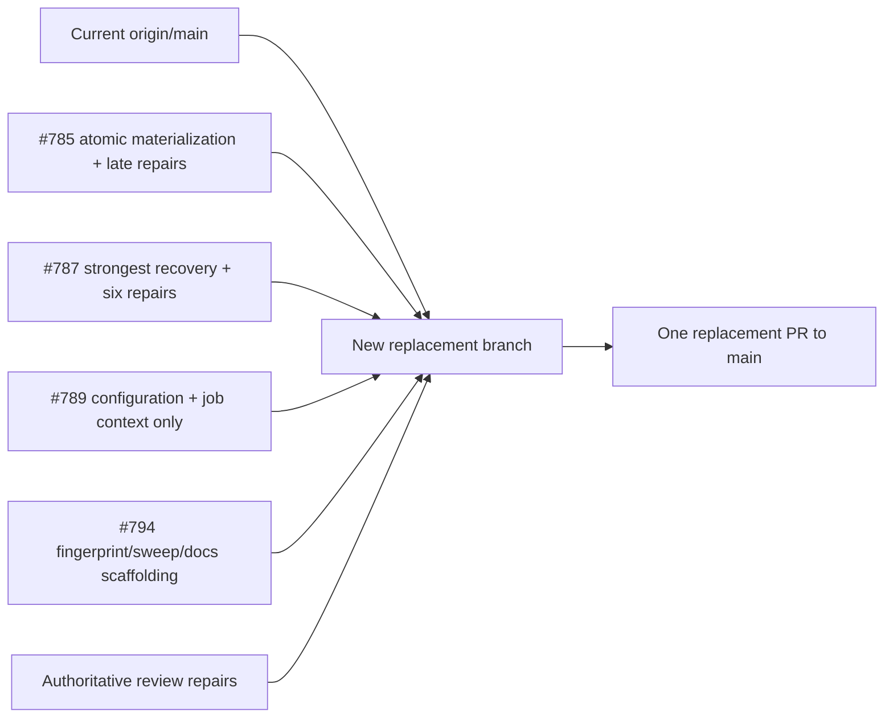
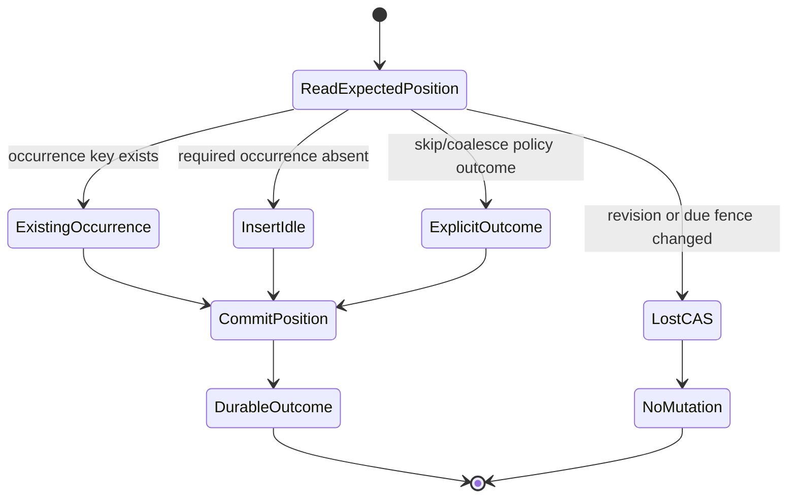
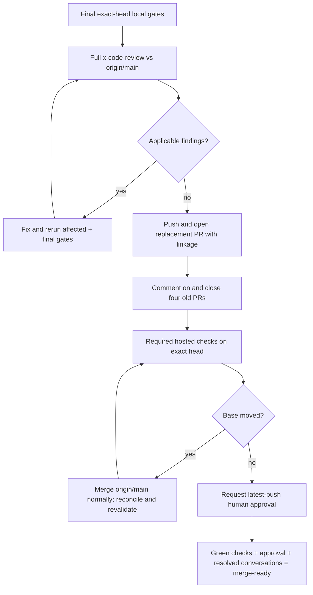

# Jobs Cron Recovery Consolidation - Plan

## Goal Capsule

Build one clean replacement branch and one review-ready pull request from exact current `origin/main` that preserves the complete intended and repaired Jobs cron-recovery behavior from pull requests #785, #787, #789, and #794. The result must keep current-main Jobs hardening, close the durable schedule-position/materialization gap, retain the six repaired recovery regressions, expose supported configuration and job context, and complete fingerprint rebase, durable bounded sweep progress, provider parity, migrations, telemetry, and operator documentation.

This self-contained addendum incorporates the prior plan's authoritative behavioral requirements, invariant matrix, regression set, migration and documentation obligations, and validation bar. It supersedes only that plan's four-branch landing topology and four-merge Definition of Done. The replacement PR closes #676 when merged, supersedes the four old PRs, and leaves #784, #793, #313, and #317 open.

The delivered scope is durable cron misfire recovery. It does not claim that the entire Jobs subsystem is enterprise-ready.

## Live Baseline

Captured on 11-08-2026 after fetching all remote refs. These SHAs are pinned source evidence; remote state must be refreshed before publication and before every readiness conclusion.

| Ref | Exact SHA | Relationship and extraction rule |
|---|---|---|
| `origin/main` | `24264926b8a542920743941b170040b9eaf26bb6` | Sole branch base; current-main Jobs behavior is the preservation floor. Add source-PR behavior on top without dropping current-main hardening, per R2. |
| PR #785 | `da896ca080fad847ccf0ccaf5a8635d8c53921f9` | Extract durable watermark, indexed selection, provider-owned atomic materialization, migrations, and all late atomicity/deadlock/cancellation repairs. |
| PR #787 | `f3b742265b26f176faff33e27547b735306b8959` | Extract skip/coalesce recovery and its strongest six repairs; it does not contain final #785 atomic materialization. |
| PR #789 | `b5d76da21eb68726373d5f595988985a3c8c80ed` | Extract public configuration, generated registration validation, and job-visible context only; its stale ancestry must not replace #787 behavior. |
| PR #794 | `21db3c81c5a90f377d8ef19ea7ea9a1e2061e194` | Extract fingerprint, rebase/sweep scaffolding, telemetry, and Jobs-only docs, then complete the review-required hardening in this plan. |

### Source Coverage Ledger

| Source | Required semantic coverage | Destination slice | Required regression evidence |
|---|---|---|---|
| Current main | Claim/retry coordination, fencing, cancellation, generated registration, provider query/claim strategy, dashboard, and hot-path hardening | Every implementation slice; current text is the conflict-resolution baseline | Existing `JobsClaimConformanceTests`, `JobsCoordinationConformanceTests`, `InternalJobsManagerTests`, `JobsDispatcherTests`, provider claim tests |
| #785 final head | Watermark/next-due projection; provider-owned `MaterializeCronScheduleOccurrenceAsync`; lost-fence/not-due/new/existing/terminal outcomes; rollback/restart/contention; SQL Server deadlock retry; cancellation completion | Atomic materialization slice | `CronSchedulePositionProviderTests`, `JobsSchedulePositionConformanceTests`, both database-clock suites, watermark migration suites, SQL Server claim/deadlock cases |
| #787 final head | Skip/coalesce plus arbitration tick-loss, migrated-expression rebase, valid enum default, occupied-instant walk, terminal protection, and recovery-status CAS repairs | Recovery/API/context slice | `CronPendingEvaluationTests`, `CronRecoveryPolicyProviderTests`, `JobsRecoveryConformanceTests`, `CronDispatchSelectionManagerTests`, `MissedRunPolicyMigrationDefaultTests` |
| #789 final head | Attribute/runtime policy and grace, source-generated registration, startup/create/update validation, and `RecoveredFromUtc` execution context | Recovery/API/context slice | `RecoveryKnobEmissionTests`, `CronRecoveryConfigurationTests`, `CronRecoveryContextPropagationTests`, runtime mutation validation |
| #794 final head plus review repairs | Evaluation fingerprint, rebase/sweep/telemetry/docs scaffolding; known-fingerprint and bounded-drain fixes; base-offset input; non-replay anchor; durable defer/keyset progress; activation ordering | Fingerprint/sweep/operations slice | `CronEvaluationFingerprintTests`, `CronFingerprintSweepTests`, `CronRecoveryObservabilityTests`, `DocumentedRecoveryApiTests`, provider restart/starvation/migration cases |

Observed GitHub policy requires `Build and pack`, both dashboard build contexts, one latest-push approval, and resolved conversations. The dashboard workflow's pull-request path filter will not naturally cover this Jobs-only diff, so dispatch it explicitly on the final branch and associate the successful exact-head runs in the PR evidence. Old check runs are not evidence for the replacement head.

## Product Contract

### Problem Frame

The four old PRs describe one durable scheduler state machine, but their ancestry diverged. #785 gained provider-atomic occurrence materialization after #787 forked. #789 then forked before #787's strongest repairs and #794 built on that stale line. A leaf merge would therefore lose validated behavior even if textual conflicts were resolved.

The replacement must reconcile semantics, not commits: one provider-owned transaction or critical section decides the occurrence/outcome and schedule position; recovery evaluates every elapsed occurrence in order; configuration and execution context remain public; rule changes establish a non-replay baseline; and the background sweep makes bounded, durable progress even when low-key definitions are invalid.

### Requirements

- **R1 — Exact-source discipline.** Work only on a new `xshaheen/` branch from fetched exact `origin/main`. Record and compare all four source heads. Do not push, rewrite, rebase, reset, or force-push the published old branches.
- **R2 — Current-main preservation.** Preserve all current-main Jobs behavior, including claim/retry coordination, fencing, cancellation, hot-path, generated registration, test harness, and dashboard/provider hardening. Resolve conflicts semantically in favor of the stronger combined contract, not the newest text.
- **R3 — Atomic durable outcome.** For one expected schedule revision, the provider atomically commits the schedule position with exactly one durable result: an existing or newly inserted Idle occurrence, an explicit skip/coalesce outcome, or lost CAS with no mutation. No committed cursor may leave a required occurrence absent.
- **R4 — Temporal authority.** Human schedule evaluation uses explicit time-zone rules. Shared relational predicates, fences, leases, retry-after, ownership, and the rebase anchor use provider/database time inside the atomic operation. In-memory uses its injected `TimeProvider` as one coherent process authority.
- **R5 — Recovery semantics.** Support `Skip` and `CoalesceOne`, defaulting to coalesce. Evaluate elapsed occurrences in order and preserve all six #787 repairs: arbitration tick loss, migrated-expression rebase, invalid migration enum default, occupied-instant coalescing, terminal double-dispatch, and recovery-status CAS handling.
- **R5a — Bounded recovery is prefix-safe.** Recovery evaluation is bounded by the existing public constant `JobsRecoveryDefaults.EvaluationCeiling` (1,000 occurrences), with the internal cache seam accepting a test-only override; it is not an additional consumer configuration knob. When that ceiling is saturated by occupied instants, advance only through the last examined/accounted instant and persist bounded progress. Do not mark the backlog complete or advance past an unexamined instant; continue on the next wake/restart until one coalesced run is committed or all elapsed instants are accounted for.
- **R6 — Public configuration and context.** Support the function attribute and runtime definition knobs for missed-run policy and positive grace, with runtime definitions authoritative. Carry scheduled/recovery context to job code, including the settled coalesced scheduled-instant contract.
- **R7 — Validation authority.** Statically known invalid attribute values produce source-generator diagnostics. Dynamic/bound values fail creation, update, or startup validation with actionable errors. Invalid durable rows discovered by a sweep are deferred rather than terminating the process.
- **R8 — Complete evaluation fingerprint.** Fingerprint every environmental rule input that can change UTC evaluation beneath an unchanged definition, including the cron-library version, zone identity/base offset/rules, adjustment transitions, daylight delta, and `AdjustmentRule.BaseUtcOffsetDelta` ticks. Expression changes remain fenced and rebased through the existing schedule-revision edit/reseed path rather than duplicating that mechanism in the fingerprint. Equivalent rules remain stable; materially different rules differ.
- **R9 — Non-replay rebase.** A fingerprint change deliberately discards elapsed-but-unreconciled occurrences under the prior rule set, then sets both `ReconciledThroughUtc` and `NextDueUtc` from one provider-time rebase anchor. Structured rule-change telemetry records the prior/new fingerprints, prior cursor, and new anchor so the non-replay loss and repeated fingerprint oscillation are observable without an unbounded historical occurrence count. Advancing time after rebase must not manufacture historical recovery work.
- **R10 — Starvation-free durable sweep.** Persist `FingerprintFailureCount` and `FingerprintRetryAfterUtc`. Only deterministic per-definition expression, time-zone, and rule-resolution failures increment durable defer state, using store time with exponential backoff starting at the sweep interval and capped at 24 hours. Cancellation, provider/database, defer-write, and unknown failures propagate. Query eligible mismatches with bounded keyset scanning and one bounded wrap; later valid IDs must progress despite invalid low IDs and across relational provider/process recreation.
- **R11 — Sweep lifecycle contract.** Successful rebase and definition mutations that change fingerprint inputs clear defer state. Lost CAS changes neither defer field. Return observable `scanned`, `rebased`, `deferred`, `lostFence`, and `hasMore` counts. In-memory mirrors semantics but promises persistence only while the provider instance survives.
- **R11a — Safe initial activation.** With old schedulers quiesced after migration, every new-binary instance gates its scheduler pickup on one terminating initialization snapshot: capture the legacy/null-fingerprint ID high-water mark, scan that bounded keyspace once in key order, and count each row as accounted after it is rebased or durably deferred even if its retry window expires before the pass ends. Infrastructure failure fails closed; deterministic invalid definitions do not block activation. New definitions created during the pass persist their current fingerprint. Later live rule/tzdata changes remain eventually rebased; dispatch-time fingerprint fencing remains out of scope.
- **R12 — Provider parity.** In-memory, generic EF over PostgreSQL and SQL Server, and native PostgreSQL/SQL Server strategies satisfy the invariant matrix below. Provider mechanics may vary; durable end states and CAS meanings may not.
- **R13 — Deployable schema.** Add provider mappings, indexes, migrations, demo snapshots, test migrations, legacy-row defaults/backfill, and restart/upgrade proof. Document migrate-before-binary, scheduler quiescence, incompatible mixed scheduler versions, homogeneous time-zone data across scheduler instances, rollback boundaries, and custom-provider SPI changes.
- **R14 — One replacement PR.** Deliver 2–4 coherent commits on one new branch and one PR targeting `main`. *(session-settled: user-directed — chosen over retaining four stacked PRs because one replacement preserves the combined behavior while removing stale ancestry and repeated landing gates.)*
- **R15 — Fresh exact-head evidence.** Focused red/green tests precede reconciliation fixes. The final pushed SHA receives full Jobs unit, PostgreSQL integration, SQL Server integration, format, analyzers, Release build, pack/package, hosted required checks, and a full review against current `origin/main`. A completed per-source inventory maps every intended source behavior/test to its replacement counterpart or an explicit justified exclusion.
- **R16 — GitHub linkage and retirement.** The replacement body contains the completed source inventory plus `Closes #676`, `Supersedes #785, #787, #789, #794`, and `Related: #784, #793, #313, #317`, explicitly out of scope. Only after the replacement exists, its exact pushed head passes local final validation, the inventory has zero unexplained gaps, and those links are present may each old PR receive a supersession comment and be closed.
- **R17 — Human gate.** Do not merge the replacement. Required checks, resolved conversations, and a human approval of the latest push are hard gates. Request `MinaMaherNicola` only after the final head is green; use `SleemMostafa` only after re-verifying access. Never self-approve or admin-bypass.

### Acceptance Examples

- **AE1 (R3/R12).** Inject a failure after the provider atomic operation commits. On restart, the occurrence exists exactly once and the schedule position reflects it; no advanced position lacks its occurrence.
- **AE2 (R3/R12).** Two workers target one due definition and expected revision on every provider path. Exactly one durable result wins; the loser returns lost CAS and changes neither occurrence nor cursor.
- **AE3 (R5).** Migrated expression, arbitration race, valid migration enum default, occupied coalesce instant, terminal occurrence, and competing recovery writer preserve the strongest #787 outcomes after all later features are applied.
- **AE3a (R5a).** With `EvaluationCeiling + 1` elapsed instants and the whole first page occupied, the first transition advances only through that page. A later wake or restart examines `N+1`, commits at most one coalesced run, and competing writers cannot skip it.
- **AE4 (R2).** Current-main claim, retry, coordination, fencing, cancellation, generated-registration, and hot-path tests retain their observed results.
- **AE5 (R8).** Two custom zones differing only in `BaseUtcOffsetDelta` produce different fingerprints while equivalent definitions remain equal.
- **AE6 (R9).** Rebase a definition whose cursor is far in the past, advance time, then dispatch. Zero pre-anchor recovery occurrences are created.
- **AE7 (R10-R12).** Seed a full page of invalid low IDs and a valid `N+1` row. Bounded repeated sweeps process `N+1`; relational progress survives provider/process recreation and in-memory progress survives manager/service recreation with the same provider.
- **AE8 (R7).** Undefined policy and non-positive grace values fail source generation when constant and runtime validation when dynamic. An invalid durable zone is deferred with increasing bounded retry-after and does not stop other rows.
- **AE9 (R13).** Upgrade legacy PostgreSQL and SQL Server databases. Rows initialize to a coherent non-replay position; the documented quiesce/migrate/start order works; rollback limitations are explicit.
- **AE9a (R11a/R13).** A pre-stack/null-fingerprint row cannot dispatch before initialization rebases or defers it. Restart during initial activation resumes safely, and invalid zones enter durable defer state without blocking valid definitions or scheduler startup.
- **AE9b (R5/R11).** Recovery and sweep writers racing pause, resume, expression/zone/policy/grace edits, deletion, or code-defined reseeding cannot overwrite the newer revision. Relevant mutations clear defer state, and paused spans do not become recovery backlog.
- **AE10 (R15/R17).** Local evidence, hosted checks, review, and PR state all identify the same final pushed SHA. A later base change forces a normal merge of `origin/main` and a complete evidence refresh.

### Provider Invariant Matrix

| Invariant | In-memory | Generic EF | PostgreSQL native | SQL Server native |
|---|---|---|---|---|
| Occurrence/outcome and schedule position atomic | One provider lock/critical section | One EF transaction with translated predicates | One transaction/statement boundary | One transaction/statement boundary |
| Lost CAS | No mutation; caller stops | Same | Same | Same |
| Recovery/rebase/sweep result contract | Required | Required | Required | Required |
| Shared time authority | Injected `TimeProvider` | Database-translated clock, tested on both engines | Stable statement-time expression | `SYSUTCDATETIME()` inside command |
| Survives provider/process recreation | Not promised | Required | Required | Required |
| Evidence | Deterministic unit/concurrency | Shared conformance on both databases | Native-strategy conformance | Native-strategy conformance |

### Scope Boundaries

In scope: atomic materialization and watermarking; skip/coalesce recovery; configuration, validation, and job context; evaluation fingerprint and non-replay rebase; durable bounded sweep progress; provider parity; schema/migrations; telemetry; Jobs package/operator documentation; one replacement PR and old-PR retirement.

Out of scope and left open: #784 overlap policy, #793 whole-tree deletion versus concurrent append, #313 atomic enqueue idempotency, #317 dashboard authorization and tenant-scoped mutations, retention/archival, global capacity/SLOs, active-active multi-region scheduling, and a general workflow scheduler.

## Planning Contract

### Key Technical Decisions

- **KTD1 — Extract by semantic layer.** Materialize #785's net behavior first; add the strongest #787 recovery delta; add only #789's configuration/context delta; then add #794's operational delta and the review-mandated repairs. Never copy a later whole file when it removes stronger behavior.
- **KTD2 — Keep 2–4 coherent commits.** The preferred four-slice shape is consolidation plan; atomic materialization; recovery plus public API/context; and fingerprint/sweep/operations. Consolidate adjacent slices when that improves reviewability, or use one explicit review-fix commit, while keeping the PR total within 2–4 commits.
- **KTD3 — Provider owns the atomic boundary.** `IJobPersistenceProvider` exposes one fenced materialization operation. The manager does not advance then enqueue in separate durable steps. Occurrence leasing remains later and outside this transaction.
- **KTD4 — Storage rejection is authoritative.** Zero affected rows or lost CAS terminates caller follow-up. Recovery status cannot be overwritten after another writer or a terminal occurrence wins.
- **KTD5 — Cursor is the rebase anchor.** Reuse `ReconciledThroughUtc` as the new rule baseline and move it with `NextDueUtc`; add no parallel baseline column unless concrete implementation evidence makes the existing cursor insufficient.
- **KTD6 — Defer state makes sweep progress durable.** Persist failure count/retry-after, exclude future retries, and use a bounded ID keyset plus one bounded wrap. The cursor itself need not be durable because deferred rows no longer monopolize the first page.
- **KTD7 — Current docs are patched narrowly.** Do not reintroduce the obsolete 26-07-2026 plan. Apply #794's `CONCEPTS.md` change only to Jobs so current Messaging vocabulary is preserved. Keep `docs/llms/jobs.md` and all changed Jobs package READMEs factually aligned.
- **KTD8 — Hosted dashboard contexts are explicit.** If path filtering does not start required dashboard checks for the PR head, run the workflow through `workflow_dispatch` on that exact branch and record run URLs alongside the naturally triggered build/pack run.
- **KTD9 — Activation is ordered, not dispatch-fenced.** The initialization hosted service captures an ID high-water mark and runs bounded rebase/defer batches over that snapshot until its activation-local result reports `hasMore == false` before scheduler pickup begins. A processed row is not revisited during the same pass if its retry-after expires. Deterministic per-definition evaluation failures are durably deferred and do not block activation; cancellation, provider/database, defer-write, and unknown failures propagate so scheduler pickup fails closed. Every new-binary instance enforces this gate; documented fleet quiescence excludes incompatible old binaries. This closes the legacy activation race without expanding scope into per-dispatch fingerprint fencing.

### High-Level Design

#### Source reconciliation



#### Atomic schedule state machine



#### Publication and convergence gate



## Execution Units

### U1 — Establish the consolidation artifact and source ledger

**Requirements:** R1, R2, R14
**Dependencies:** none

1. Record exact base/head SHAs, merge bases, commit lists, unique diffs, and current GitHub protections.
2. Create a source-coverage ledger mapping every intended behavior/repair/test from #785, #787, #789, #794, and current main to its destination commit and regression test. Exclude obsolete plan files and non-Jobs document reversions.
3. Create this implementation-ready plan and commit it as the first reviewable slice.

**Evidence:** clean status before branch work; `git diff --stat` and `git log --left-right` for every source; plan review confirms the single-PR decision is the only supersession of the prior behavioral plan.

### U2 — Reconcile durable position and atomic occurrence materialization

**Requirements:** R2-R4, R12-R13
**Dependencies:** U1

1. Apply #785's intended schema, selection, cursor, models, and provider atomic materialization onto current main.
2. Preserve current query/claim/cancellation hardening and final #785 repairs, including SQL Server deadlock retry and cancellation-safe persistence assertions.
3. Reconcile interface, in-memory, generic EF, PostgreSQL, and SQL Server implementations without a manager-level advance/enqueue gap.
4. Carry all demo/test migrations and legacy initialization with valid `MissedRunPolicy.Coalesce` defaults.

**Focused tests:** `CronSchedulePositionProviderTests`, `JobsSchedulePositionConformanceTests`, provider database-clock tests, watermark migration tests, restart-after-commit, concurrent materialization winner/loser, existing occurrence, lost-CAS no-mutation, SQL Server deadlock retry, and cancellation completion.

### U3 — Reconcile recovery, validation, configuration, and execution context

**Requirements:** R5, R5a, R6, R7, R12
**Dependencies:** U2

1. Apply #787 recovery evaluation and policy semantics while retaining U2's atomic operation.
2. Restore the six named regression repairs explicitly; do not accept #789/#794 versions that remove their mappings, walks, guards, or tests.
3. Make saturated coalescing a bounded-prefix transition: never advance beyond the last examined instant, persist partial progress, and resume safely after wake/restart until one run is committed or the backlog is fully accounted.
4. Apply only #789's public knobs, generated registration/diagnostics, runtime validation, and job-visible execution context.
5. Ensure function attributes and runtime definitions converge on one effective policy/grace contract, with runtime definitions authoritative.

**Focused tests:** `CronPendingEvaluationTests`, `CronRecoveryPolicyProviderTests`, both relational recovery suites, migration default, arbitration tick loss, migrated expression, occupied coalesce instant, terminal non-reuse, recovery-status CAS loss, `EvaluationCeiling + 1` occupied-prefix continuation with restart and contention, context propagation, configuration validation, and source-generator knob diagnostics/emission.

### U4 — Complete fingerprint, non-replay rebase, durable sweep, telemetry, and operations

**Requirements:** R8-R11, R11a, R12, R13
**Dependencies:** U3

1. Apply #794 fingerprint/sweep/telemetry scaffolding, including its known-fingerprint and bounded-drain fixes.
2. Add `BaseUtcOffsetDelta` to fingerprint inputs and prove equivalence/difference behavior.
3. Move `ReconciledThroughUtc` to the same rebase anchor used for `NextDueUtc`; add the time-advance/no-recovery regression.
4. Add durable failure count/retry-after fields, mappings, indexes, migrations, clearing rules, store-time backoff, bounded keyset/wrap selection, result counters, and provider conformance.
5. Order initial activation so bounded batches continue until `hasMore == false` and every legacy/null fingerprint is rebased or durably deferred before scheduler pickup. Fail closed on infrastructure errors while allowing per-row durable deferrals; make restart and invalid-definition behavior observable.
6. Fence recovery/rebase/defer writes against revision, watermark, fingerprint where applicable, and active state so pause/resume/edit/delete/reseed races cannot be overwritten.
7. Update Jobs instrumentation and structured logs without high-cardinality identifiers in metric dimensions.
8. Update Jobs `CONCEPTS.md`, `docs/llms/jobs.md`, affected package READMEs, and migration/rollout/rollback notes while preserving all unrelated current docs.

**Focused tests:** `CronEvaluationFingerprintTests`, `CronFingerprintSweepTests`, `CronRecoveryObservabilityTests`, documented API tests, base-offset delta, non-replay after time advance, invalid-low-ID starvation, defer backoff/cap/clear, CAS-loss no-field-change, `hasMore`/counter accuracy, initialization-before-pickup and restart, pause/resume/edit/delete/reseed races, process/provider recreation, and fresh/upgrade/repeat-upgrade/rollback migration cases on both relational providers.

### U5 — Exact-head validation and independent code review

**Requirements:** R15
**Dependencies:** U4

1. Run focused regressions while implementing, then run broad gates serially with no competing restore/build processes.
2. Run the complete Jobs unit suite, PostgreSQL Jobs integration suite, then SQL Server Jobs integration suite.
3. Run format, quality analyzers, Release build, and pack/package verification using repository Makefile targets where available.
4. Run full `x-code-review` against refreshed `origin/main`. Apply every verified applicable finding and rerun affected focused tests plus all final gates.
5. Reconcile the source-coverage ledger against the final diff and tests; require zero unmapped intended behaviors/tests and justify every deliberate exclusion.
6. Record exact command lines, pass/skip/fail totals, duration, and exact validated SHA.

### U6 — Publish, retire old PRs, and converge without merging

**Requirements:** R1, R14-R17
**Dependencies:** U5

1. Re-fetch `origin/main`. If it moved, merge it normally into the replacement branch, reconcile semantically, and repeat U5.
2. Push the exact locally validated head and open one ready PR to `main` with a value-first body covering problem, state-machine guarantees, public/API behavior, provider/storage/migrations, rollout/rollback, observability, exact evidence, risks/limitations, and reviewer focus.
3. Include the exact linkage lines required by R16.
4. Only then comment on each old PR with the replacement URL and close #785, #787, #789, and #794; capture comment and close receipts. Make retries idempotent by checking for the exact replacement comment and current open/closed state before mutating each PR.
5. Monitor fresh required checks. If path filters omit the dashboard contexts, dispatch `.github/workflows/dashboards.yml` once through `workflow_dispatch` on the final branch, then verify successful `Build SPA` matrix checks for both Jobs and Messaging on the exact head. Fix CI or review findings, push, and rebuild all exact-head evidence.
6. After the final exact head is green, request `MinaMaherNicola`. Stop at merge-ready; do not merge.

## Verification Contract

The executor must resolve the repository's current Makefile target names before running. These are the intended gates; substitutions must be equivalent and recorded exactly.

| Gate | Intended command/evidence | Pass condition |
|---|---|---|
| Bootstrap | `make bootstrap` | SDK/worktree dependencies restored without bypassing release quarantine. |
| Focused unit regressions | `dotnet test` on the named Jobs test projects with MTP filters as supported | Every named scenario passes; red/green evidence retained for new repairs. |
| Full Jobs units | `TEST_MAX_PARALLEL=1 MSBUILD_ARGS=-m:1 make test-unit` or the narrower canonical Jobs-unit target | Exact pass/skip/fail totals recorded; zero failures. |
| PostgreSQL integration | Canonical Jobs PostgreSQL integration target, run alone | Exact totals recorded; zero failures; all provider conformance included. |
| SQL Server integration | Canonical Jobs SQL Server integration target, run after PostgreSQL | Exact totals recorded; zero failures; all provider conformance included. |
| Format | `make format-check` or current equivalent | No diff and zero violations. |
| Quality analyzers | `make quality` or current equivalent | Zero analyzer failures. |
| Release build | `TEST_MAX_PARALLEL=1 MSBUILD_ARGS=-m:1 make build-release` or current equivalent | Clean Release build succeeds. |
| Package verification | `make pack CONFIGURATION=Release` followed by `make verify-packages` | All expected packages are produced; package set, nuspec metadata, and embedded SBOM validation succeeds. |
| Review | Full `x-code-review` against exact refreshed `origin/main` | No unresolved P0/P1; applicable findings fixed and gates repeated. |
| Hosted | Required check rollup on pushed exact SHA plus explicit dashboard workflow runs when needed | All required checks succeed on the final SHA. |
| Human review | GitHub review/conversation state | One eligible non-author approval after latest push; all conversations resolved. |

All broad .NET runs are serialized with `TEST_MAX_PARALLEL=1` and `MSBUILD_ARGS=-m:1` where supported. PostgreSQL and SQL Server suites never run concurrently. A base merge, code push, or review fix invalidates earlier final-head evidence.

## Risks and Failure Handling

| Risk | Mitigation / stop condition |
|---|---|
| Later PR text silently removes stronger repairs | Compare behavioral deltas and named regressions; never take leaf files wholesale. |
| Current main changes during work | Merge refreshed main normally, inspect the new diff, and rebuild exact-head evidence. |
| Migration mismatch across providers | Generate/review provider mappings, demo snapshots, and both relational test migrations together; validate upgrade/restart serially. |
| Store-time logic leaks application clock | Assert translated/provider SQL and clock conformance; keep in-memory `TimeProvider` contract explicit. |
| Invalid rows starve sweep | Durable defer plus bounded keyset/wrap and `N+1` conformance test are release gates. |
| Required dashboard contexts never trigger | Use the workflow's supported explicit dispatch on the exact final branch and capture run URLs. |
| Old PRs closed before a valid replacement exists | Enforce U6 ordering and verify replacement body/head/local evidence before comments or closure. |
| No eligible reviewer | Leave the new PR open and report exact head/check state and the single remaining approval action. |

## Pull Request Contract

Suggested title: `feat(jobs): add durable cron misfire recovery`.

The description leads with consumer and operator value, then explains the combined durable state machine, public configuration/context, provider implementation and migrations, rollout/rollback, observability, exact local and hosted evidence, known limitations, and focused review areas. It must contain these exact linkage statements:

```text
Closes #676
Supersedes #785, #787, #789, #794
Related: #784, #793, #313, #317
```

The Related line must say those issues remain open and out of scope. The PR is ready for review, not automatically mergeable by its author.

## Definition of Done

- One `xshaheen/` branch based on the fetched current `origin/main` contains 2–4 coherent commits and a clean net diff.
- The combined implementation satisfies R1–R17 and AE1–AE10 without regressing current-main Jobs behavior.
- The source-coverage ledger maps every intended behavior, repair, and test from #785, #787, #789, #794, and current main to a destination commit and named regression test, with zero unmapped entries and every deliberate exclusion justified in the replacement PR body.
- In-memory, generic EF over both databases, and native PostgreSQL/SQL Server paths satisfy the invariant matrix.
- Schema, migrations, legacy initialization, telemetry, Jobs docs, package READMEs, and rollout/rollback guidance are complete and aligned.
- Focused regressions, full Jobs units, both serial relational suites, format, analyzers, Release build, and pack/package gates pass on one exact final local SHA with exact totals recorded.
- Full `x-code-review` against current `origin/main` is complete and all applicable findings are resolved and revalidated.
- One ready PR targets `main`, contains the required linkage and reviewer-usable evidence, and its pushed exact head has fresh required hosted checks.
- Each old PR has a replacement comment and is closed only after the replacement ordering gate; receipts are captured. #676 remains open until the replacement merges; #784, #793, #313, and #317 remain open.
- The replacement PR has no unresolved conversations and has latest-push approval from an eligible human, or the final report names that approval as the exact remaining external action.
- The replacement PR is not merged by this execution.
