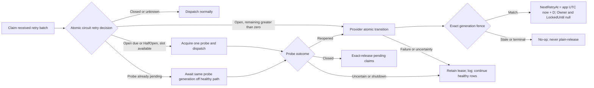

# Messaging Retry Lifecycle Reliability - Plan

## Goal Capsule

Close the two remaining retry-lifecycle reliability gaps as one cohesive change: circuit-open received retries must atomically move to the circuit's authoritative next eligible probe time while releasing only their exact claimed lease generation, and shutdown must quiesce every processor before concurrently draining all cleanup under one monotonic deadline. Preserve at-least-once delivery, running-handler lease ownership, Bus/Queue and Publish/Subscribe isolation, and third-party compatibility.

Authority is, in order: the live bodies of #808 and #809 plus the user-settled decisions; current `origin/main` code and tests; merged PRs #802 and #806; current Messaging documentation; then the historical shutdown foundation plan. Stop if implementation would require unsafe release of running or uncertain work, a public compatibility break without strong evidence, unrelated subsystem changes, or release/publication work. Execution ends with one PR against `main`; merge and publication remain outside this plan.

## Product Contract

### Problem Frame

The received-retry processor currently exact-releases a claimed row when its consumer group's circuit is Open or HalfOpen but leaves `NextRetryAt` unchanged. The same due row can therefore be reclaimed immediately, creating cross-node claim churn and allowing up to a full leading batch of open-group rows to starve healthy groups. While Open has a future eligibility boundary, Open-with-zero-remaining and HalfOpen require single-probe coordination rather than a timestamp guess. A safe correction must therefore combine atomic Open deferral with an authoritative probe-due disposition; splitting scheduling from release, retaining every row for `DispatchTimeout`, or releasing probe-pending rows immediately leaves part of the defect intact.

Messaging shutdown already has a shared outer timeout, but the bootstrapper awaits runtime cancellation and `pendingBootstrap` before processor teardown, then stops processors sequentially. A stuck bootstrap or the first slow processor can therefore prevent later processors from closing pickup gates, and sequential waits let one processor consume the whole budget. The correction must make quiescence an all-processor phase and make drain a concurrent, shared-deadline phase.

### Requirements

- R1. Ask the internal circuit state manager for one atomic retry-eligibility decision per `(lane, group)`: `Closed`, `Defer` with a strictly positive monotonic remaining Open duration, `ProbeAcquired` for exactly one Open-due/HalfOpen row, or `ProbePending` with the current probe-generation outcome. Convert only `Defer` to a persisted UTC boundary with the injected `TimeProvider`; never reconstruct `OpenedAt + EffectiveOpenDuration`, persist `now` for an Open-with-zero snapshot, or invent a blind delay.
- R2. Atomically set `NextRetryAt` to that boundary and clear `Owner` and `LockedUntil` in one provider transition fenced by storage row ID, persisted lane, null-safe exact owner, and exact store-returned `LockedUntil`. Stale generations and terminal rows are no-ops.
- R3. The circuit deferral transition changes no payload, status, expiry, exception information, retry counters, inline-attempt counters, identity, lane, or unrelated state. It uses store-authoritative lease validity and must-complete cancellation semantics once begun.
- R4. A successful transition makes the row ineligible until the captured probe boundary; transition rejection, cancellation before initiation, failure, blocking, or uncertainty must never fall back to a plain lease release. Classify and dispatch healthy rows before awaiting Open-row storage transitions so a slow command cannot starve healthy groups; built-in provider commands retain their finite command timeout and eventual faults are observed.
- R5. Preserve one shared HalfOpen probe slot across transport and persisted retry paths. At Open-due/HalfOpen, at most one claimed retry may atomically acquire the existing internal probe generation and dispatch through `ExecuteRetryAsync`, whose normal success/failure reporting closes or reopens the circuit. Other already-claimed rows await that generation without blocking healthy rows: on Close they exact-release as immediately eligible, on re-Open they atomically defer to the new authoritative boundary, and on shutdown or uncertain outcome they retain their exact leases. No row is assigned an arbitrary timestamp or released into a probe-pending hot loop.
- R6. On built-in or capability-supporting providers, circuit-open rows cannot hot-loop, monopolize repeated batches, or starve healthy groups. A provider without the optional atomic deferral capability retains the exact claimed lease and emits an actionable capability-fallback diagnostic; it remains correct through ordinary expiry but cannot promise accelerated deferral or fairness.
- R7. Resolve and publish the complete built-in processor set before any blocking initializer or `StartAsync` work, and set a shutdown-initiated latch before snapshotting it. Phase 1 initiates runtime/bootstrap cancellation and reaches every processor's non-blocking quiesce gate before phase 2 awaits any drain or external teardown; a late start observes the latch and never opens pickup.
- R8. The one deadline begins before phase 1. Phase 2 starts or captures every drain/dispose operation even when phase 1 consumed the allowance, then awaits their aggregate concurrently using the remaining time from that single `TimeProvider.GetTimestamp()` origin. Zero remaining time returns the bounded timeout while all started cleanup remains fault-observed; there are no sequential budgets, independent per-processor timeouts, or fixed slices.
- R9. A blocked first processor, slow or non-cooperative handler, broker teardown, quiesce fault, or stuck `pendingBootstrap` cannot prevent later processors from being reached. Per-processor initiation faults are isolated, logged, aggregated where actionable, and do not short-circuit the phase.
- R10. `pendingBootstrap` and runtime cancellation completion are tracked as eventual-cleanup participants, not serial prerequisites before processor quiescence. A timed-out bounded result retains and fault-observes unfinished cleanup.
- R11. Concurrent `StopAsync`, `DisposeAsync`, cancellation, and timeout callers share one idempotent shutdown operation. Built-in processors expose an internal quiesce/drain seam; public `IProcessingServer` and required `IDataStorage` members stay compatible. Third-party processors are disposed and externally bounded conservatively.
- R12. Retry pickup and dispatch gates close before drain. Claimed or queued work proven not to have started may follow existing exact-release rules; locally running or uncertain handlers retain their leases through timeout and recover only through their normal completion or ordinary at-least-once lease expiry.
- R13. Bus and Queue lanes and Publish and Subscribe directions remain isolated. The new circuit deferral applies only to received retries and cannot fall back across lane or direction.
- R14. Tests characterize the defects before correction and deterministically cover the second pickup, healthy-group progress, exact stale-generation no-op, cancellation/failure/blocked transition, Open-with-zero remaining, no-fresh-broker HalfOpen recovery, single persisted probe, probe success/re-open, all-processor quiescence, blocked first processor, stuck bootstrap, concurrent stop/dispose, timeout, and eventual cleanup without arbitrary sleeps, skips, weakened assertions, or retry-until-green loops.
- R15. Documentation describes the authoritative circuit deferral, built-in provider capability behavior, HalfOpen boundary, two-phase shutdown, one shared deadline, and the unchanged at-least-once/running-handler rules.
- R16. Deliver exactly one PR from the exact current `origin/main`; its body contains `Closes #808` and `Closes #809`. Do not merge, release, tag, publish GitHub Packages/NuGet, or alter unrelated issues.

### Acceptance Examples

- AE1. An Open Bus-group row claimed at application time `T` with snapshot remaining duration `D` is durably changed to `NextRetryAt = T + D` while its exact owner and lease deadline are cleared in the same transition; an immediate second pickup cannot return it.
- AE2. The same transition presented with a stale owner, stale `LockedUntil`, wrong lane, terminal row, or already-replaced generation changes nothing, and the processor performs no fallback release.
- AE3. A transition throws after the row was claimed. The uncertain row retains its lease, later healthy-group rows from the same batch still dispatch, and the exception is observed and logged.
- AE4. A full first batch of Open-group rows is deferred. The next pickup reaches a due healthy-group row instead of reclaiming the same head rows.
- AE5. With no fresh broker delivery, one Open-due or HalfOpen persisted row acquires the shared probe slot and runs through the normal retry executor. Other claimed rows neither dispatch nor requalify while that probe is pending; probe success exact-releases them into the Closed circuit, while probe failure atomically moves them to the newly authoritative Open boundary.
- AE6. Phase 1 records quiescence for every built-in processor before any processor's drain barrier is released, even when the first processor's drain never completes.
- AE7. Shutdown begins while bootstrap is blocked. Every resolved processor is quiesced promptly; the bounded caller returns at the shared deadline, while the bootstrap and eventual cleanup tasks remain fault-observed.
- AE8. Bootstrap unblocks after shutdown latched. No late processor opens its pickup gate, and every cleanup task is initiated even when phase 1 has already exhausted the shared allowance.
- AE9. Concurrent host stop, dispose, and cancellation calls initiate each processor lifecycle once and observe the same terminal or bounded result.
- AE10. A running retry handler ignores cancellation past the deadline. Its exact lease is not released; unrelated queued/abandoned work remains safely releasable by the existing rules.
- AE11. InMemory, PostgreSQL, and SQL Server prove exact successful deferral, stale fencing, unrelated-field preservation, lane isolation, and healthy progress using their real storage semantics.

### Scope Boundaries

#### In Scope

- Received-retry circuit deferral for built-in storage providers.
- Retry batch progress and provider-conformance behavior needed to prove the deferral.
- Bootstrapper and built-in processor quiesce/drain coordination.
- Focused Core/provider tests, repeated race validation, Messaging docs, and one PR.

#### Out of Scope

- Inbox, request/reply, scheduling expansion, middleware redesign, provider topology redesign, dashboards, Jobs, or unrelated refactors.
- Exactly-once claims or releasing/shortening a still-running or uncertain handler lease.
- Changing HalfOpen probe ownership, public processing topology, or required third-party storage contracts without evidence that the settled behavior cannot be achieved internally.
- Merge, release, tag, GitHub Packages, NuGet publication, release fixes, or tracker restructuring.

## Planning Contract

### Key Technical Decisions

- KTD1. Deliver #808 and #809 in one cohesive PR. (session-settled: user-directed — chosen over separate PRs: both are residual retry lifecycle reliability work with shared implementation and verification boundaries)
- KTD2. For Open circuits, atomically defer to the authoritative next eligible probe boundary and exact-release that claimed generation in the same durable write. (session-settled: user-directed — chosen over holding the lease for the full DispatchTimeout or clearing it without advancing NextRetryAt: cross-node handoff must avoid claim churn and head-of-line starvation)
- KTD3. Use two shutdown phases: quiesce every processor first, then concurrently drain/dispose under one shared monotonic deadline. (session-settled: user-directed — chosen over sequential budget consumption and fixed per-processor slices: every pickup gate must close before any slow participant can starve the rest)
- KTD4. Preserve at-least-once semantics and exact row, lane, null-safe owner, and store-returned `LockedUntil` generation fencing; never release a running or uncertain handler. (session-settled: user-directed — chosen over exactly-once claims or deadline-driven active-lease release: storage fencing cannot cancel external work)
- KTD5. End at one reviewed PR and decided CI state. (session-settled: user-directed — chosen over merge, release, tag, or package publication: those external mutations are explicitly outside this delivery)
- KTD6. Add a new internal optional `ICircuitRetryDeferralStorage` capability modeled on, but not added to, `IGracefulLeaseReleaseStorage`; built-in providers implement it and Core consumes it opportunistically. The existing relational claim returns only ID, content, lane, retry counters, added/scheduling timestamps, owner, and lease deadline, while `ChangeReceiveRetryStateAsync` also rewrites expiry, status, and exception information that the claim does not return; reusing it can overwrite unrelated durable state. The new capability updates only `NextRetryAt`, `Owner`, and `LockedUntil`. Unsupported providers conservatively retain the claim and log the degraded timing/fairness behavior rather than split scheduling from release.
- KTD7. Extend only the internal `ICircuitBreakerStateManager` with an atomic persisted-retry eligibility decision shared with the existing HalfOpen probe slot. A strictly positive Open remainder yields `Defer`; overdue Open transitions to HalfOpen and reserves one probe; HalfOpen either reserves the available probe or returns its current outcome generation. The acquired retry dispatches through the existing executor reporting path. Probe-pending sibling claims resolve asynchronously on that same generation—exact-release on Close, atomic defer on re-Open, retain on uncertainty—so no fresh broker message is required and no second probe bypasses transport arbitration.
- KTD8. Classify a claimed batch first and dispatch Closed/healthy rows before awaiting Open deferrals or probe-pending resolution. Every circuit row leaves the generic unhandled-release range before its dedicated disposition begins. Success or stale no-op completes its local disposition; exception/cancellation/timeout/uncertainty is logged and retains the lease. Built-in storage command timeouts remain the finite bound, and eventual tasks are observed. This prevents `finally` from recreating #808 without letting a blocked first transition starve healthy work.
- KTD9. Extend the internal `IProcessingServerShutdown` seam to separate non-blocking quiescence from drain waiting. Built-in quiesce methods close retry/dispatch/consumer pickup gates and capture one eventual cleanup task; repeated phase-1 or phase-2 calls share it. Public `IProcessingServer` remains unchanged.
- KTD10. The bootstrapper captures one processor snapshot and one timestamp, invokes all quiesce operations with per-item fault isolation, captures all drain/dispose tasks, then deadline-bounds one aggregate. Runtime cancellation and `pendingBootstrap` join eventual cleanup but are not awaited ahead of quiescence. A synchronously misbehaving third-party dispose is isolated so it cannot block iteration.
- KTD11. Do not move circuit filtering into storage claim queries. Consumer group is encoded in the serialized received envelope rather than a portable claim-column contract, and circuit state is node-local; a storage filter would require provider/topology redesign and could disagree across nodes. Claim first, then apply the lane-qualified atomic circuit decision and durable disposition.

### High-Level Technical Design



```mermaid
sequenceDiagram
    participant H as Host/Bootstrapper
    participant B as pendingBootstrap/runtime cancel
    participant P as All processors
    participant E as Eventual cleanup observer
    H->>H: Latch shutdown; capture published processors and monotonic start
    H->>B: Initiate cancellation without serial await
    loop Every processor, fault-isolated
        H->>P: Quiesce pickup gate
    end
    loop Every processor
        H->>P: Start/capture drain or dispose task
    end
    H->>H: Await Task.WhenAll with one remaining deadline
    alt Completed
        H-->>H: Return aggregated result
    else Shared deadline expired
        H->>E: Observe aggregate, bootstrap, and cancellation eventually
        H-->>H: Return bounded timeout result
    end
```

### Existing Patterns and Constraints

- `src/Headless.Messaging.Core/Processor/IProcessor.NeedRetry.cs` owns received retry pickup, per-batch circuit grouping, and unhandled-claim release.
- `src/Headless.Messaging.Core/CircuitBreaker/CircuitBreakerStateManager.cs` computes remaining Open duration under the group lock using monotonic elapsed time; `CircuitBreakerSnapshot.OpenedAt` is observational rather than the persistence formula.
- `src/Headless.Messaging.Core/Persistence/IGracefulLeaseReleaseStorage.cs` is the optional-capability and exact-identity pattern. The built-in provider assemblies already have internal visibility into Core.
- PostgreSQL uses `IS NOT DISTINCT FROM`; SQL Server uses explicit equality-or-both-null; InMemory mutates under the row lock. The new transition must mirror these exactness rules while changing only three columns/properties.
- `src/Headless.Messaging.Core/Internal/IBootstrapper.Default.cs` already anchors idempotence in one shutdown task and retains an eventual-cleanup observer. Preserve that ownership while replacing the serial prerequisites and loop.
- `MessageProcessingServer`, `IConsumerRegister`, and `Dispatcher` already have pickup gates or cleanup-task anchors. Refactor those existing seams rather than adding parallel lifecycle state machines.
- Read `docs/authoring/AUTHORING.md` before updating `docs/llms/messaging.md` or package READMEs; keep consumer docs and package documentation in lockstep.

### Risks and Mitigations

| Risk | Mitigation |
| --- | --- |
| Persisting an application-clock boundary while lease validity is store-clock-owned. | Use the circuit's monotonic remaining duration only for `NextRetryAt`; keep the provider's exact live-lease predicate authoritative for ownership. Relational assertions allow only precision-level timestamp tolerance. |
| Open reaches zero or changes to HalfOpen between observation and disposition. | Use one internal state-manager decision that either returns a strictly future boundary or reserves/joins the current probe generation under the group lock; test timer, success, failure, and no-broker races. |
| InMemory claim order hides head-of-line behavior. | First prove AE4 with atomic deferral. Do not change provider-wide ordering unless a failing real-provider characterization shows that deferral alone is insufficient; then document the existing contract and the narrowest compatible correction. |
| A provider transition starts but does not promptly complete. | Dispatch healthy rows before awaiting circuit dispositions, retain the uncertain lease, rely on the existing finite provider command timeout, and fault-observe eventual completion. |
| Optional capability is absent on a third-party provider. | Retain the lease for ordinary expiry; never degrade to non-atomic scheduling plus release. Document capability behavior. |
| A quiesce implementation starts an independent timeout. | Split gate closure/task capture from waiting; only the bootstrapper owns the shared deadline. |
| A processor throws or blocks synchronously during phase 1. | Isolate each invocation, continue the complete snapshot, aggregate observable failures, and test a hostile double. |
| Deadline expires with handlers or bootstrap still running. | Return the bounded result, retain their leases/references, and attach one eventual aggregate fault observer. |

### Dependencies and Sequencing

U1 establishes the exact circuit deferral and its failure semantics. U2 implements provider parity and batch progress. U3 establishes the two-phase lifecycle contract and processor implementations. U4 composes runtime, documentation, and full verification. Each unit begins with deterministic red characterization and ends at its highest credible seam.

## Implementation Units

### U1. Atomically defer Open-circuit received retries

- **Goal:** Replace plain exact-release with one authoritative scheduling-and-release transition while keeping uncertain work leased.
- **Requirements:** R1-R5, R13-R14
- **Dependencies:** None
- **Files:**
  - `src/Headless.Messaging.Core/Processor/IProcessor.NeedRetry.cs`
  - `src/Headless.Messaging.Core/CircuitBreaker/ICircuitBreakerStateManager.cs`
  - `src/Headless.Messaging.Core/CircuitBreaker/CircuitBreakerStateManager.cs`
  - `src/Headless.Messaging.Core/Persistence/ICircuitRetryDeferralStorage.cs` (new; `IGracefulLeaseReleaseStorage` is a pattern reference only)
  - `tests/Headless.Messaging.Core.Tests.Unit/Processor/MessageNeedToRetryProcessorTests.cs`
  - `tests/Headless.Messaging.Core.Tests.Unit/CircuitBreaker/CircuitBreakerStateManagerTests.cs` only if snapshot characterization is missing
- **Approach:** First pin the current second-pickup, Open-zero/HalfOpen, and failure-fallback defects with fake time and exact storage doubles. Introduce a purpose-specific immutable deferral request carrying `MessageLeaseIdentity` plus the circuit-derived UTC boundary. Add the internal atomic circuit decision/probe-generation seam from KTD7, reusing the existing `TryAcquireHalfOpenProbe` state and normal retry-executor outcome reporting. Classify the batch and dispatch healthy rows first. Remove each circuit row from generic release bookkeeping before its must-complete disposition begins; resolve probe-pending siblings from the generation outcome and retain any uncertain lease.
- **Test Scenarios:** Strictly positive Open boundary derivation, Open-with-zero transition, no-fresh-broker recovery, exactly one HalfOpen retry probe shared with transport, probe success/re-open sibling disposition, immediate second-pickup exclusion, both lanes, exact identity, stale no-op, pre-init cancellation, throwing and blocked transition, and healthy-row progress before circuit disposition completes.
- **Verification:** Focused processor and circuit tests pass under `TZ=Africa/Cairo`; storage doubles prove no call to plain release after the dedicated transition path begins.

### U2. Prove built-in provider exactness and batch fairness

- **Goal:** Implement the three-field atomic mutation with identical fencing and healthy progress in every built-in provider.
- **Requirements:** R2-R6, R13-R14
- **Dependencies:** U1
- **Files:**
  - `src/Headless.Messaging.Storage.InMemory/InMemoryDataStorage.cs`
  - `src/Headless.Messaging.Storage.PostgreSql/PostgreSqlDataStorage.cs`
  - `src/Headless.Messaging.Storage.SqlServer/SqlServerDataStorage.cs`
  - `tests/Headless.Messaging.Core.Tests.Harness/DataStorageTestsBase.cs`
  - concrete InMemory unit and PostgreSQL/SQL Server integration test projects
- **Approach:** Add the narrow capability to each provider. Predicate on ID, lane, terminal eligibility, null-safe owner, exact lease deadline, and live store-authoritative lease; update only `NextRetryAt`, `Owner`, and `LockedUntil`. Add shared conformance cases that snapshot every unrelated field before and after. Prove healthy progress with existing provider ordering after atomic deferral; change provider-wide ordering only if that real-provider characterization fails and the narrower correction is documented first.
- **Test Scenarios:** Exact success, stale owner, stale deadline, wrong lane, null owner, expired lease, terminal row, payload/counter/expiry/status/exception preservation, second pickup before/at boundary, a full leading open batch followed by a healthy row, and timestamp precision on both relational engines.
- **Verification:** Shared harness passes in InMemory and real PostgreSQL/SQL Server providers; provider-specific SQL is inspected for three-field-only mutation and exact predicates.

### U3. Make shutdown quiesce-all then drain-concurrently

- **Goal:** Close every pickup gate before any drain wait and share one monotonic shutdown deadline across all cleanup.
- **Requirements:** R7-R12, R14
- **Dependencies:** None
- **Files:**
  - `src/Headless.Messaging.Core/Internal/IProcessingServerShutdown.cs`
  - `src/Headless.Messaging.Core/Internal/IBootstrapper.Default.cs`
  - `src/Headless.Messaging.Core/Processor/IProcessingServer.Message.cs`
  - `src/Headless.Messaging.Core/Internal/IConsumerRegister.cs`
  - `src/Headless.Messaging.Core/Processor/Dispatcher.cs`
  - `tests/Headless.Messaging.Core.Tests.Unit/BootstrapperTests.cs`
  - focused MessageProcessingServer, ConsumerRegister, and Dispatcher unit tests
- **Approach:** Begin with barriers that prove the sequential, pending-bootstrap, and late-start starvation races. Resolve/publish the complete processor set before blocking initialization and latch shutdown before taking the snapshot. Refactor the internal lifecycle capability into an idempotent, non-blocking `Quiesce` plus a shared cleanup/drain task. Initiate cancellation without awaiting, quiesce every processor with fault isolation, start/capture every cleanup task even after deadline exhaustion, and await one aggregate with the remaining time. Include pending bootstrap and runtime cancellation in eventual observation, not ahead of phase 1. Keep third-party disposal source-compatible and externally bounded.
- **Test Scenarios:** All quiesced before any drain, blocked first processor, stuck bootstrap, late bootstrap completion cannot open pickup, slow broker teardown, quiesce fault, drain fault, phase-1 deadline exhaustion still starts all drains, one shared deadline, timeout return, eventual success/fault observation, concurrent stop/dispose/cancellation, repeated calls, and running-handler lease retention.
- **Verification:** Focused lifecycle suites use `TaskCompletionSource`, barriers, and `FakeTimeProvider`; no arbitrary sleep or N independent timeout is present.

### U4. Integrate, document, and deliver the consolidated reliability contract

- **Goal:** Prove the combined lifecycle behavior across Core and providers, document it, and prepare one auditable PR.
- **Requirements:** R6, R12-R16
- **Dependencies:** U1-U3
- **Files:**
  - `tests/Headless.Messaging.Core.Tests.Unit/CircuitBreaker/CircuitBreakerIntegrationTests.cs` where an end-to-end seam is credible
  - `src/Headless.Messaging.Core/README.md`
  - `docs/llms/messaging.md`
  - `src/Headless.Messaging.Storage.InMemory/README.md`
  - `src/Headless.Messaging.Storage.PostgreSql/README.md`
  - `src/Headless.Messaging.Storage.SqlServer/README.md`
- **Approach:** Add only the smallest end-to-end composition coverage not already proven by unit/provider seams. Run repeated deterministic race scenarios, update docs in authoring lockstep, simplify the final diff, independently review it, dispose every finding, and deliver one PR from a freshly verified base. Record commands, totals, repetitions, retries/failures, base/head SHAs, review dispositions, and hosted CI state.
- **Test Scenarios:** Open deferral through provider and subsequent eligibility, healthy-group progress, lifecycle composition with outstanding running work, all four direction/lane quadrants unchanged, and documentation examples matching the actual optional capability and shutdown phases.
- **Verification:** All gates in the Verification Contract pass; PR body contains both closing directives and no unrelated issue mutation or publication occurs.

## Verification Contract

Run the repository's Makefile entry points. Record exact totals and any first-attempt failure separately from reruns.

```sh
make format-check

TZ=Africa/Cairo make build-project PROJECT=tests/Headless.Messaging.Core.Tests.Unit/Headless.Messaging.Core.Tests.Unit.csproj
TZ=Africa/Cairo make test-project TEST_PROJECT=tests/Headless.Messaging.Core.Tests.Unit/Headless.Messaging.Core.Tests.Unit.csproj

TZ=Africa/Cairo make test-project TEST_PROJECT=tests/Headless.Messaging.Storage.InMemory.Tests.Unit/Headless.Messaging.Storage.InMemory.Tests.Unit.csproj
TZ=Africa/Cairo make test-project TEST_PROJECT=tests/Headless.Messaging.Storage.PostgreSql.Tests.Integration/Headless.Messaging.Storage.PostgreSql.Tests.Integration.csproj
TZ=Africa/Cairo make test-project TEST_PROJECT=tests/Headless.Messaging.Storage.SqlServer.Tests.Integration/Headless.Messaging.Storage.SqlServer.Tests.Integration.csproj

make quality-analyzers-project PROJECT=src/Headless.Messaging.Core/Headless.Messaging.Core.csproj
make quality-analyzers
make rebuild
TZ=Africa/Cairo make test-unit
```

- After one focused build, run the exact circuit deferral/fairness and bootstrapper concurrency classes at least 20 consecutive times with `make test-project-fast` and a method/class filter; zero failures and zero retries-to-green are allowed.
- Use real PostgreSQL and SQL Server semantics for the shared provider contract. If infrastructure is unavailable, report the gate as unavailable rather than substituting mocks or claiming parity.
- Inspect the final diff for generated public API baselines, documentation lockstep, lane/direction isolation, and accidental unrelated changes.
- Re-fetch `origin/main` before delivery; record the PR base SHA and pushed head SHA. Re-query exact-head GitHub checks and review state. Hosted CI must reach a decided pass/fail/cancelled state before handoff; pending or absent CI is not green.
- Browser testing is not applicable to this backend-only change, but the pipeline's browser-test stage must explicitly record that determination rather than silently skip it.

## Definition of Done

- R1-R16 and AE1-AE11 are traceable to passing deterministic tests or explicit delivery evidence.
- U1 proves authoritative Open scheduling, Open-due/HalfOpen single-probe recovery without a fresh broker delivery, exact atomic release, and no fallback release after failure or uncertainty.
- U2 proves identical three-field-only provider behavior and stale-generation no-ops in InMemory, real PostgreSQL, and real SQL Server, including healthy batch progress.
- U3 proves complete pre-bootstrap processor publication, shutdown-latched late starts, all-processor phase-1 quiescence, concurrent phase-2 drain even after allowance exhaustion, one monotonic deadline, pending-bootstrap non-starvation, idempotence, eventual observation, and running-handler lease retention.
- U4 updates consumer/package documentation, passes format/build/analyzer/Release/broader gates, and records repeated race evidence without arbitrary sleeps or weakened assertions.
- Independent review findings are fixed or explicitly dispositioned with evidence; no actionable correctness or security finding remains.
- Dead-end experiments, unused abstractions, duplicate lifecycle state, and obsolete tests pinning sequential behavior are removed from the final diff.
- Exactly one PR targets current `main`, contains `Closes #808` and `Closes #809`, and reaches a decided hosted-CI state. No merge, release, tag, GitHub Package, NuGet publication, or unrelated issue change occurs.

## Appendix

### Sources

- Live issues [#808](https://github.com/xshaheen/headless-framework/issues/808) and [#809](https://github.com/xshaheen/headless-framework/issues/809), re-read 2026-08-25.
- Merged reliability PR [#802](https://github.com/xshaheen/headless-framework/pull/802) and retry lease optimization PR [#806](https://github.com/xshaheen/headless-framework/pull/806).
- `docs/plans/2026-08-05-001-fix-messaging-retry-shutdown-plan.md` for established shutdown, generation-fencing, provider, at-least-once, and validation invariants.
- `docs/llms/messaging.md`, `src/Headless.Messaging.Core/README.md`, and built-in storage provider READMEs.
- `docs/solutions/design-patterns/atomic-database-clock-relational-lease-claims.md` and `docs/solutions/design-patterns/temporal-authority-standard.md`.
- `docs/solutions/concurrency/startup-pause-gating-and-half-open-recovery.md`, `docs/solutions/concurrency/circuit-breaker-transport-thread-safety-patterns.md`, `docs/solutions/logic-errors/terminal-state-overwrite-on-redelivery.md`, and `docs/solutions/best-practices/storage-initializer-lifecycle-correctness.md`.
