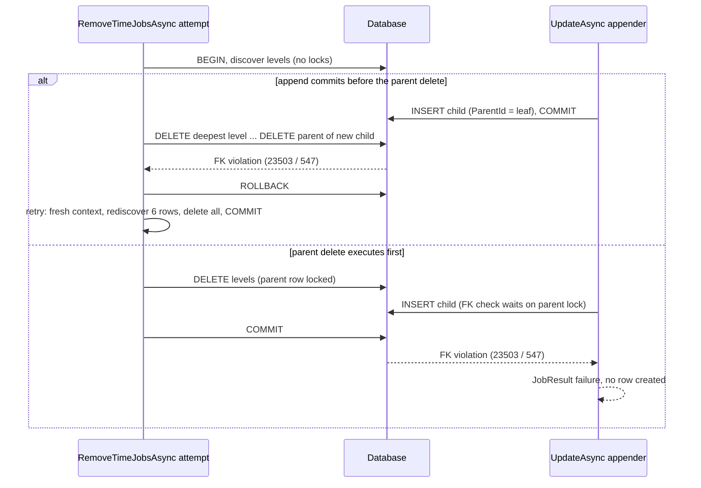
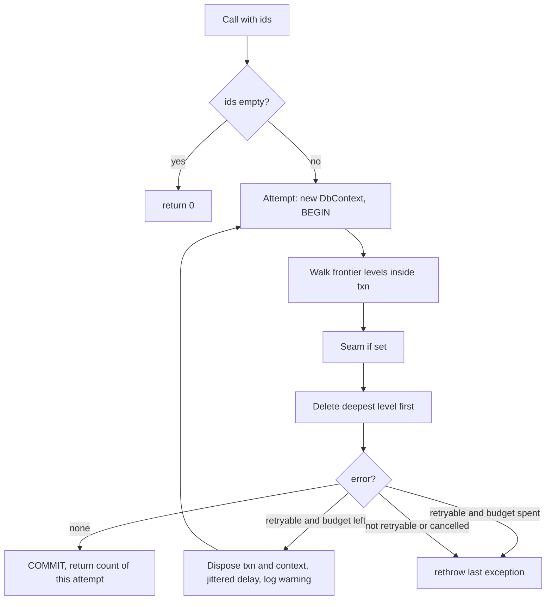

# Jobs whole-tree deletion safe against concurrent append - Plan

## Goal Capsule

- **Objective:** Deleting a time-job chain on the EF provider never leaves a stranded descendant row, even when another writer appends a child to that chain at the same moment. An operator who deletes a chain from the dashboard or `ITimeJobManager` sees either the whole tree gone or a reported failure with the tree intact. The one exception is a lost commit acknowledgement, which reports a failure whose outcome a repeated delete resolves (R3).
- **Means:** One read-committed transaction covers descendant discovery and deepest-first deletion, and the whole scope is retried on a classified conflict signal with fresh discovery (KTD1, KTD2, KTD3).
- **Authority:** This plan. Product behavior per the R-IDs below. Implementation mechanism per the KTDs. Repository conventions in `CLAUDE.md` and `docs/authoring/AUTHORING.md` override unit detail where they conflict.
- **Stop conditions:** Stop and report if research or a failing conformance test shows the foreign key does not raise a conflict on either PostgreSQL or SQL Server in the append-first arm (that would invalidate KTD1), or if the harness cannot append a child through the public update path.
- **Execution profile:** Standard depth. Five units in dependency order. Docker required for U4.
- **Tail ownership:** The calling pipeline owns simplification, review, commit, and PR. This plan does not define a landing strategy.

---

## Product Contract

### Summary

Move the descendant walk in `RemoveTimeJobsAsync` inside the delete transaction, wrap the whole discover-and-delete scope in a bounded, jittered retry that fires on foreign-key violation, deadlock, serialization failure, or a transient driver error, and prove the behavior with deterministic PostgreSQL and SQL Server conformance tests that append a child between discovery and deletion. Make the manager honor its documented "delete never throws" contract when retries are exhausted. Document the chosen strategy for generic EF, PostgreSQL, and SQL Server.

### Problem Frame

`JobsEFCorePersistenceProvider.RemoveTimeJobsAsync` discovers the descendant frontier before it opens a transaction. A child appended after the last frontier read is absent from the deletion levels. The Parent/Children relationship is `DeleteBehavior.NoAction`, so that child blocks the parent delete with a raw driver exception, or an earlier level is already gone when the failure surfaces. The only production append path that can hit this window is `ITimeJobManager.UpdateAsync` / `UpdateBatchAsync` with new id-less entries in `Children`. The callers (`JobsManager` delete paths, dashboard delete endpoints) have no catch, so the raw exception becomes an unhandled dashboard 500 while `docs/llms/jobs.md` promises delete returns a `JobResult` and does not throw.

### Requirements

**Deletion atomicity and conflict handling**

- R1. Descendant discovery and deletion for one `RemoveTimeJobsAsync` call execute inside one database transaction, so no attempt can commit a partially deleted tree.
- R2. A foreign-key violation, deadlock, serialization failure, or driver-transient error raised during discovery or deletion rolls the attempt back and the operation retries with fresh discovery, bounded by a fixed attempt budget with jittered exponential backoff.
- R3. After the retry budget is exhausted the provider rethrows the last conflict exception and the tree is unchanged in the database. An exception raised by the commit itself is never retried; it propagates as-is because the outcome is in doubt, and a caller may re-issue the delete, which returns zero rows when the tree is already gone.
- R4. The returned row count equals the rows deleted by the attempt that committed, including every descendant and any child appended before that attempt's discovery. The count may be lower than the discovered tree size when a concurrent deleter removed rows first; that is not a failure.
- R5. The generic EF path, the PostgreSQL package, and the SQL Server package all use this one mechanism. No serializable isolation and no provider-native locked recursive delete are introduced.
- R6. Cancellation between attempts honors the caller's token and is never retried. The commit itself runs with a none token, so a cancel cannot leave the tree deleted while the caller sees a failure.

**Caller contract**

- R7. `ITimeJobManager.DeleteAsync` and `DeleteBatchAsync` return a failed `JobResult` carrying the exception when the provider throws, matching the documented contract that delete does not throw. Cancellation is wrapped the same way, mirroring the update path.

**Proof**

- R8. A conformance test in the shared EF harness appends a child through the public update path in the gap between discovery and the first delete, and asserts the delete completes with the full count and an empty table. The test runs on both PostgreSQL and SQL Server.
- R9. A conformance test proves the delete-first arm: an append issued after the tree is deleted fails through the public update path and no row is created.
- R10. A conformance test proves a batch delete of two trees with one conflict retry returns the exact total once.
- R11. Unit tests without Docker cover the conflict classifier for every provider code and the retry loop shape (retry then success, cancellation not retried, exhaustion rethrows with the tree intact).

**Documentation**

- R12. `src/Headless.Jobs.EntityFramework/README.md` and `docs/llms/jobs.md` describe the transaction scope, the retry bound, the retryable error classes, the exhaustion behavior, and the in-doubt commit case. `src/Headless.Jobs.Core/README.md` mirrors the manager's delete result contract, including wrapped cancellation.
- R13. A `docs/solutions/concurrency/` entry records the strategy decision for the three paths and why serializable isolation and native locked recursion were rejected.

### Acceptance Examples

- AE1. Append wins the race
  - **Covers:** R1, R2, R4, R8
  - **Given:** a five-node chain and a delete of its root that has completed discovery
  - **When:** a sixth node is appended under a first-level child through `ITimeJobManager.UpdateAsync` on the root and committed before the first delete statement
  - **Then:** the delete's first attempt fails on the foreign key, the second attempt rediscovers six rows, the call returns 6, and the table is empty
- AE2. Delete wins the race
  - **Covers:** R9
  - **Given:** a chain that has been deleted
  - **When:** a caller appends a child to a stale copy of the root through `ITimeJobManager.UpdateAsync`
  - **Then:** the update returns a failed `JobResult` and the table stays empty
- AE3. Retries exhausted
  - **Covers:** R3, R7
  - **Given:** a conflict signal raised on every attempt
  - **When:** the retry budget is spent
  - **Then:** the provider throws the last conflict exception, every original row still exists, and the manager returns a failed `JobResult`

### Scope Boundaries

- `RemoveCronJobsAsync` stays as it is. The occurrence relationship is `DeleteBehavior.Cascade` and the delete is one statement, so it has no discover-then-delete window.
- `JobsInMemoryPersistenceProvider.RemoveTimeJobsAsync` stays as it is. It is a single-process development store and already deletes the whole subtree.
- `IInternalJobManager.DeleteJob` stays as it is. It has no callers in the repository but is public. It gains the provider retry and still throws on exhaustion; the no-throw contract in KTD6 is manager-only.
- The dashboard delete endpoints stay as they are. They already map a failed `JobResult` to a "Failed to delete" response.

#### Deferred to Follow-Up Work

- Provider-native locked recursive deletion (PostgreSQL `FOR UPDATE` frontier walk, SQL Server `UPDLOCK, HOLDLOCK` discovery) only if retry exhaustion is observed in production.
- User-initiated transactions across this provider (`BeginTransactionAsync` in delete, pause, resume, and the SQL Server claim strategy) are rejected by EF when a consumer configures `EnableRetryOnFailure`. Pre-existing and provider-wide. Track separately.
- The PostgreSQL claim strategy has no deadlock retry, so a delete racing a claim can fail one claim tick on PostgreSQL. Pre-existing; the next tick recovers.

---

## Planning Contract

### Key Technical Decisions

- KTD1. **Transaction plus conflict retry is the cross-provider contract.** The `NoAction` foreign key is the atomicity fence: with discovery inside the transaction, a child committed after discovery makes the parent delete fail, the transaction rolls back, and nothing partial commits. A child inserted after the uncommitted parent delete blocks on the parent's row lock on both databases (PostgreSQL `FOR KEY SHARE` versus the delete's lock; SQL Server foreign-key checks are locking reads even under read-committed snapshot) and fails after commit, so the appender loses cleanly. Serializable isolation was rejected: PostgreSQL SSI only constrains transactions that are all serializable, so a read-committed appender is unconstrained, and the SQL Server coordination store's serializable path only traded foreign-key signals for deadlocks that still needed a retry. Native locked recursive delete was rejected for this change: PostgreSQL forbids `FOR UPDATE` in a recursive CTE, SQL Server statement-end constraint checking is only third-party verified, and deletion is a cold path that does not justify two more strategy classes.
- KTD2. **Classify conflicts by provider name and error code, never by `IsTransient` alone.** Unwrap any exception through `GetBaseException()` to a `DbException` because `ExecuteDeleteAsync` throws the raw driver exception. Branch on `dbContext.Database.ProviderName` exactly like `_IsUniqueConstraintViolation` in `BasePersistenceProvider`. PostgreSQL: `SqlState` in `23503`, `40001`, `40P01`. SQL Server: the reflected `Number` property in `547`, `1205`, `3960`. `DbException.IsTransient` is an additional OR, not the sole signal, because `SqlException` overrides neither `IsTransient` nor `SqlState`. `OperationCanceledException` is never retryable, and neither is any exception raised while the caller's token is already cancelled, so a driver that reports a cancel as a `DbException` cannot consume the budget. `InvalidOperationException` (for example EF rejecting a user transaction under a retrying execution strategy) is not retryable. `40001` and `3960` stay in the set so the retry still works if a consumer raises the default isolation level. SQLite constraint errors are not classified; the SQLite unit path never retries, by design.
- KTD3. **One Polly retry pipeline per provider instance, three retries.** Build a `ResiliencePipeline` field from the constructor `TimeProvider` and `ILogger`, mirroring `_BuildDeadlockRetryPipeline` in `SqlServerJobsClaimStrategy`: exponential backoff, 50 ms base, 500 ms cap, jitter, and a warning `LoggerMessage` on each retry whose text names a "conflict", not a "concurrent append", because a permanent foreign-key fault produces the same signal. Three retries instead of the claim path's two because every concurrent appender consumes one retry. The retry policy covers discovery and the delete statements only: the delegate marks the commit phase on the resilience context before `CommitAsync`, and the predicate refuses to retry any exception raised after that mark. A commit that succeeded on the server but failed on the wire would otherwise be re-run and report zero rows for a tree that is already gone (R3, R4). Do not route through `Database.CreateExecutionStrategy()`; `BasePersistenceProvider` documents that correctness-relevant writes keep their own pipeline. Add an explicit `Polly.Core` package reference to `Headless.Jobs.EntityFramework.csproj` per the repository convention of explicit references.
- KTD4. **Fresh scope per attempt, disposed before the delay.** The `DbContext`, the transaction, the level list, the visited set, and the deleted-row accumulator are created inside the retried delegate. The transaction and then the context are disposed inside the delegate, before Polly's backoff delay runs, so row locks from already-deleted levels are released during the wait. PostgreSQL aborts the transaction after any statement error, SQL Server has already rolled back a deadlock victim, and SQL Server leaves the transaction open after error 547 unless it is rolled back, so reusing any of it across attempts fails. Commit uses `CancellationToken.None`, matching the sibling transactional writes in the provider; the caller token governs discovery, the seam, the deletes, and the inter-attempt delay only. This also makes R4 hold by construction.
- KTD5. **Seam fires on every attempt; the test makes it one-shot.** Add `internal Func<Task>? OnTreeDeleteBeforeFirstDelete { get; set; }` on the provider, invoked after discovery completes and before the first delete statement on each attempt, null in production. Same shape and comment style as `OnFrontierBeforeLease` in `JobsClaimStrategy`. The provider never nulls it. Tests guard it with a one-shot flag and reset it to null in `finally` because the provider is a DI singleton.
- KTD6. **The manager owns the no-throw contract.** `_DeleteTimeJobAsync` and `_DeleteTimeJobsBatchAsync` in `JobsManager` catch `Exception` around the provider call only and return `new JobResult<TTimeJob>(exception)`, wrapping cancellation the same way `_UpdateTimeJobAsync` does. The scheduler restart stays outside the catch, exactly as today, so a restart failure can never reclassify a committed deletion as failed. The provider keeps rethrowing so persistence stays honest. Governs R7.

### High-Level Technical Design

Race between a delete and an append through the public update path. The two arms both end with no stranded row.

Retry loop shape. Prose is authoritative where the two disagree.

### System-Wide Impact

- **Entry points.** `ITimeJobManager.DeleteAsync` / `DeleteBatchAsync` through the two `JobsManager` delete paths; the dashboard delete endpoints, which already map a failed `JobResult` to a failure response and stop returning 500 after U3; `IInternalJobManager.DeleteJob`, which still throws. No background sweep, reconcile, or retention path calls `RemoveTimeJobsAsync`. Deletes never route through commit coordination, so the per-attempt context cannot collide with an ambient coordinated transaction.
- **Failure propagation.** Retry exhaustion: provider rethrows, manager returns a failed result, dashboard reports failure, scheduler is not restarted because nothing was deleted. Cancellation between attempts: the delay is cancelled and the manager wraps the cancellation (R7). Cancellation mid-attempt: transaction disposal rolls back; the commit window is closed by the none-token commit (KTD4). Non-retryable error: no retry, tree intact, manager wraps.
- **Running executor.** Delete is an operator override with no owner fence. The executor already detects the vanished row through its lease-fenced writes (`WhereOwnedBy` in `BasePersistenceProvider`, `LeaseLost` handling and the renewal loop in `JobsExecutionTaskHandler`), so no executor change is needed and none should be added.
- **Lock hold during an attempt.** An attempt holds exclusive locks on already-deleted levels until it commits or rolls back. A running job's lease renewal on one of those rows can block for one renewal cadence and be treated as lost even if the attempt later rolls back. This existed before the change; backoff runs with the transaction disposed (KTD4), so the added exposure is bounded by the retry count.
- **Deadlock with a concurrent claim.** The claim strategies lock the root then stamp descendants top-down; the delete locks deepest-first. The delete side retries on `40P01` / `1205`. The PostgreSQL claim side has no deadlock retry and loses one tick, recovered at the next tick. PostgreSQL detects the deadlock only after its `deadlock_timeout` (1 s default), so a deadlock consumes one attempt, not one delay.
- **Deadlock with the appender.** `UpdateAsync` writes the root then inserts the child in one save; a delete attempt that already holds the leaf and wants the root can deadlock with it. Whichever side is the victim fails cleanly: the delete retries, the update returns a failed result. The conformance seam serializes the append before the first delete, so U4 does not exercise this arm; the synthesized deadlock unit tests in U2 cover the retry side.

### Risks & Dependencies

| Invariant | Failure path | Mitigation |
|---|---|---|
| The delete transaction can be opened | A consumer-configured retrying execution strategy makes EF reject the user transaction with `InvalidOperationException` | Pre-existing across the provider (Deferred). Not classified as retryable (KTD2); manager wraps; tree intact |
| A permanent foreign-key fault terminates | Corrupt `ParentId` cycle or an undiscoverable child fails every attempt | Bounded budget then rethrow (R3). Log text says "conflict" (KTD3). AE3 covers the shape |
| The seam never leaks between tests | The provider is a DI singleton; a seam left set fires in the next test | One-shot flag and `finally` reset (KTD5); the integration collections disable parallelization |
| Each attempt starts clean | Pooled contexts return to the pool after rollback; SQL Server keeps the transaction open after 547 | Dispose transaction then context inside the delegate, before the delay (KTD4) |
| Cancellation is never retried and never waits | A driver reports a cancel as a `DbException` and would consume the budget | Token-cancelled exceptions are excluded (KTD2); U1 tests pin it |
| A committed delete is never reported as failed or repeated | The commit succeeds on the server but the client sees a transient error; a retry would return zero rows or exhaust after the tree is gone | Commit phase excluded from the retry policy (KTD3); in-doubt commit propagates as-is (R3) |
| Package graph stays explicit | `Polly.Core` is only transitive today | Explicit reference in U1; lock-file churn limited to the new edge |
| Read-committed lock model on SQL Server | Without read-committed snapshot, discovery and foreign-key checks block on an uncommitted insert instead of reading past it | Correct under both models; only the container default (snapshot off) is exercised by U4 |

### Assumptions

- The design is correct under both lock-based read committed and read-committed snapshot on SQL Server; only the former is tested.
- Wrapping delete exceptions into a failed `JobResult` in the manager is in scope. It is a two-catch change that makes the already-documented contract true and gives the dashboard its existing failure path. The issue does not name it.
- Three retries is the right budget. The claim precedent uses two; one appender consumes one retry.
- The seam is invoked on every attempt and the harness makes it one-shot. The provider never mutates it.
- The in-memory provider's own discovery-versus-append window is accepted and documented as a single-process limitation.
- `40001` and `3960` are retained in the classifier even though the provider runs read committed.
- A child appended through `UpdateAsync` must have a default `Id`; EF marks it `Added` because the key is generated on add. A pre-set key is treated as `Modified` and fails, which is existing behavior, not this plan's concern.

### Sources

- `src/Headless.Jobs.EntityFramework/Infrastructure/JobsEFCorePersistenceProvider.cs` `RemoveTimeJobsAsync`: current walk-then-transact shape and the comment explaining why a stranded descendant is never harmless.
- `src/Headless.Jobs.EntityFramework.SqlServer/SqlServerJobsClaimStrategy.cs` `_BuildDeadlockRetryPipeline` and `_ExecuteWithDeadlockRetryAsync`: the Polly shape to mirror, including the comment on why immediate retry livelocks.
- `src/Headless.Jobs.EntityFramework/Infrastructure/BasePersistenceProvider.cs` `_IsUniqueConstraintViolation` and the execution-strategy comment above `GetEarliestTimeJobsAsync`: classification idiom and the split between execution-strategy reads and owned retry pipelines.
- `src/Headless.Jobs.EntityFramework/Infrastructure/JobsClaimStrategy.cs` `OnFrontierBeforeLease` and `tests/Headless.Jobs.EntityFramework.Tests.Harness/JobsChainConformanceTests.cs` `_BuildCas`: seam shape and how the harness sets it.
- `src/Headless.Jobs.Core/Managers/JobsManager.cs` `_UpdateTimeJobAsync` catch block and `_DeleteTimeJobAsync` / `_DeleteTimeJobsBatchAsync`.
- `tests/Headless.Jobs.Composition.Tests.Unit/Provider/TimeJobDeleteCascadeTests.cs` `EfFixture`: SQLite in-memory provider construction for Docker-free unit tests.
- `docs/solutions/design-patterns/atomic-database-clock-relational-lease-claims.md`: provider behavior must be proven by integration tests; half-applying a mechanic is worse than not applying it.
- `docs/solutions/architecture-patterns/coordination-register-establishes-durable-liveness.md`: the serializable-then-deadlock-retry precedent that informed KTD1.
- PostgreSQL 17 explicit locking and transaction isolation docs, plus `ri_triggers.c`: foreign-key checks lock with `FOR KEY SHARE`, `NO ACTION` checks use an up-to-date snapshot under read committed, SSI covers only serializable transactions.
- SQL Server Transaction Locking and Row Versioning Guide: foreign-key checks under snapshot isolation execute under read committed with locks; error 3960 for snapshot update conflicts.
- Microsoft.Data.SqlClient `SqlException` source: no `IsTransient` or `SqlState` override.
- EF Core 10 `RelationalCommand.ExecuteNonQueryAsync` and the connection-resiliency docs: `ExecuteDeleteAsync` rethrows the raw driver exception and joins the ambient transaction.

---

## Implementation Units

### U1. Conflict classifier, retry pipeline, and log event

- **Goal:** Give the EF provider a provider-agnostic way to recognize a retryable tree-delete conflict and a configured retry pipeline to drive it.
- **Requirements:** R2, R5, R6, R11
- **Dependencies:** none
- **Files:**
  - `src/Headless.Jobs.EntityFramework/Headless.Jobs.EntityFramework.csproj` (add `Polly.Core` reference, no version)
  - `src/Headless.Jobs.EntityFramework/Infrastructure/JobsEFCorePersistenceProvider.cs` (pipeline field, classifier, log holder)
  - `tests/Headless.Jobs.Composition.Tests.Unit/Provider/TimeJobDeleteConflictClassifierTests.cs` (new)
- **Approach:**
  1. Add an `internal static bool IsRetryableTreeDeleteFailure(string? providerName, Exception exception, bool commitStarted, CancellationToken cancellationToken)` next to the provider, following KTD2 and the KTD3 commit exclusion. Keep it a pure function so it is unit-testable.
  2. Build the pipeline as a readonly field from the constructor `TimeProvider` and `ILogger` per KTD3. Polly's retry predicate sees only its own arguments, never the state passed to the execute call, so capture `Database.ProviderName` into a private field on the first attempt inside the delegate (the factory is bound to one provider for the instance's lifetime). The delegate sets a commit-started property on the resilience context immediately before `CommitAsync`. The predicate calls the classifier with the provider-name field, the outcome exception, that property, and the predicate context's cancellation token.
  3. Add `internal static partial class JobsEfCorePersistenceProviderLog` at the bottom of the provider file with one warning `LoggerMessage` (`EventId = 3002`, continuing the package's 3000 block) that reports attempt number, max attempts, delay, root-id count, and the exception.
- **Patterns to follow:** `_IsUniqueConstraintViolation` in `BasePersistenceProvider.cs`; `_BuildDeadlockRetryPipeline` and `SqlServerJobsClaimStrategyLoggerExtensions` in `SqlServerJobsClaimStrategy.cs`; `BasePersistenceProviderLog` for the holder naming.
- **Test scenarios:**
  - PostgreSQL provider name with a fake `DbException` whose `SqlState` is `23503`, `40001`, or `40P01` returns true; `23505` returns false.
  - SQL Server provider name with a fake `DbException` exposing a public `Number` property of `547`, `1205`, or `3960` returns true; `2627` returns false.
  - Any provider with a fake `DbException` whose `IsTransient` is true returns true.
  - An `OperationCanceledException` returns false for every provider.
  - A matching `DbException` evaluated with an already-cancelled token returns false.
  - A matching `DbException` evaluated with `commitStarted` true returns false for every provider.
  - An `InvalidOperationException` returns false for every provider.
  - A `DbUpdateException` wrapping a matching `DbException` returns true (base-exception unwrapping).
  - Unknown provider name with a non-transient `DbException` returns false.
- **Verification:** The unit project builds under `make build-project` with no analyzer warnings, and the classifier tests pass. The restored lock files for dependent test projects change only by the new transitive edge.

### U2. Transactional, retried `RemoveTimeJobsAsync` with a test seam

- **Goal:** Make discovery and deletion one retried transactional scope and expose the deterministic seam.
- **Requirements:** R1, R2, R3, R4, R5, R6, R11
- **Dependencies:** U1
- **Files:**
  - `src/Headless.Jobs.EntityFramework/Infrastructure/JobsEFCorePersistenceProvider.cs`
  - `tests/Headless.Jobs.Composition.Tests.Unit/Provider/TimeJobDeleteCascadeTests.cs` (extend; the `EfFixture` already constructs the provider directly)
- **Approach:**
  1. Move the body of `RemoveTimeJobsAsync` after the empty-ids guard into a delegate executed by the pipeline from U1, per KTD4: create the `DbContext`, begin the transaction, run the existing level walk unchanged, invoke the seam per KTD5, delete deepest-first, commit with a none token, and return that attempt's count. The `await using` scopes for the transaction and the context must close inside the delegate so disposal precedes the backoff delay.
  2. Keep the existing explanatory comment about stranded descendants and extend it with one sentence stating that the foreign key is the atomicity fence and a conflict retries with fresh discovery (cite KTD1 in the plan, not in code).
  3. Add the `OnTreeDeleteBeforeFirstDelete` property with the same "always null in production" comment style as `OnFrontierBeforeLease`.
  4. Extend the `EfFixture.CreateProvider` helper in the cascade test file with optional `TimeProvider` and `ILogger` parameters (defaults unchanged) so a fake clock and a captured logger reach the pipeline. Drive retries with the pump shape in `tests/Headless.Jobs.Composition.Tests.Unit/JobsRetryPipelineTests.cs`: observe each retry through the captured log, then advance the fake clock past the maximum delay until the delete task completes.
- **Execution note:** Write the retry-then-success unit test first so the seam and per-attempt scope are proven before the conformance suites run.
- **Patterns to follow:** `_ExecuteWithDeadlockRetryAsync` static-lambda-with-state shape; `await using` for context and transaction inside the delegate; `.ConfigureAwait(false)` on every await; file-level `MA0133` pragma stays.
- **Test scenarios (SQLite in-memory, `FakeTimeProvider` drives delays):**
  - A four-level chain plus an unrelated survivor: deleting the root removes exactly the chain and returns its size (existing test stays green).
  - Seam throws a synthesized retryable exception on attempt one only: attempt two commits, the return value equals the tree size once, the survivor remains.
  - Seam throws `OperationCanceledException` from a cancelled token: no retry, the exception propagates, all rows remain.
  - Seam throws a retryable exception on every attempt: after the fourth attempt the same exception propagates, all rows remain, and the warning log was emitted three times.
  - Seam throws a non-retryable `InvalidOperationException`: no retry, all rows remain.
  - Empty id array returns 0 without opening a context.
- **Verification:** `make build-project` on `src/Headless.Jobs.EntityFramework/Headless.Jobs.EntityFramework.csproj` is clean, and the unit project passes. `Polly` retry delays are observed through the fake clock, not wall time.

### U3. Manager honors the documented no-throw delete contract

- **Goal:** Return a failed `JobResult` instead of propagating a provider exception from time-job deletes.
- **Requirements:** R7
- **Dependencies:** none (can land in parallel with U1 and U2)
- **Files:**
  - `src/Headless.Jobs.Core/Managers/JobsManager.cs`
  - `tests/Headless.Jobs.Composition.Tests.Unit/Managers/JobsManagerDeleteResultTests.cs` (new)
- **Approach:** Wrap only the provider call in `_DeleteTimeJobAsync` and `_DeleteTimeJobsBatchAsync` with the same `catch (Exception e) => new JobResult<TTimeJob>(e)` used by `_UpdateTimeJobAsync`; the scheduler restart runs after the try block (KTD6). Do not touch the cron delete paths or `InternalJobsManager.DeleteJob`.
- **Patterns to follow:** `_UpdateTimeJobAsync` catch block; manager construction in `tests/Headless.Jobs.Composition.Tests.Unit/Transactions/JobsManagerCoordinatedRoutingTests.cs` with an NSubstitute persistence provider.
- **Test scenarios:**
  - Provider `RemoveTimeJobsAsync` throws a `DbException`-derived exception: `DeleteAsync` returns a result whose failure carries that exception and the scheduler is not restarted.
  - Provider returns 3 and an executing function matches the id: `DeleteAsync` returns success with affected rows 3 and the scheduler restarts (existing behavior preserved).
  - Provider throws `OperationCanceledException`: `DeleteAsync` returns a failed result carrying it, mirroring the update path.
  - Provider returns 3 and the scheduler restart throws: the exception propagates unchanged; it is not converted into a failed result.
  - `DeleteBatchAsync` with a throwing provider returns a failed result once, not per id.
- **Verification:** The unit project passes and `docs/llms/jobs.md` line stating that delete does not throw is now true for the EF path.

### U4. Conformance tests on PostgreSQL and SQL Server

- **Goal:** Prove both race arms and the batch count on real databases.
- **Requirements:** R1, R2, R4, R8, R9, R10
- **Dependencies:** U2
- **Files:**
  - `tests/Headless.Jobs.EntityFramework.Tests.Harness/JobsChainConformanceTests.cs`
  - `tests/Headless.Jobs.EntityFramework.PostgreSql.Tests.Integration/PostgreSqlChainConformanceTests.cs` (one `[Fact] public override` per new scenario)
  - `tests/Headless.Jobs.EntityFramework.SqlServer.Tests.Integration/SqlServerChainConformanceTests.cs` (same)
- **Approach:**
  1. Resolve `IJobPersistenceProvider<TimeJobEntity, CronJobEntity>` from the host and cast to the internal `JobsEfCorePersistenceProvider<JobsDbContext, TimeJobEntity, CronJobEntity>` to set the seam; reset it in `finally`.
  2. In the seam, load the root through `ITimeJobManager<TimeJobEntity>.GetAsync`, which loads exactly one level of `Children`. Attach a new id-less child to one of the loaded first-level children's `Children`, then call `UpdateAsync(root)` so the whole graph is submitted through the timed root on its own context. Non-timed nodes cannot be passed to `UpdateAsync` directly (the manager rejects a null execution time), and deeper nodes are not reachable from one read, so the appended row always lands at depth three. Guard with a one-shot flag.
  3. Leaf files must redeclare each new scenario; the harness does not run anywhere on its own.
  4. Use `fixture.CountTimeJobsAsync` for committed-state assertions and the existing `_ReadNodeAsync` / `_ChildrenAsync` raw helpers where a per-row check is needed. Do not use a fake clock in these hosts; the retry delay must elapse on the system clock.
- **Patterns to follow:** `deleting_a_chain_root_removes_every_descendant_row`; the seam-callback-on-own-connection convention near line 878 of the harness; `JobsTenancyConformanceTests` for `ITimeJobManager.UpdateAsync` usage.
- **Test scenarios:**
  - Covers AE1. Five-node chain; seam appends a sixth node under a first-level child via `UpdateAsync(root)`; `RemoveTimeJobsAsync([rootId])` returns 6 and `CountTimeJobsAsync` is 0.
  - Covers AE2. Delete the chain, then append a child to a stale root entity via `UpdateAsync`: the result is a failure and `CountTimeJobsAsync` stays 0.
  - Covers R10. Two independent three-node trees; the seam appends one child under the second tree on the first attempt only; batch delete of both roots returns 7 and the table is empty.
  - Seam appends a child under the root itself: same outcome as AE1, proving the retry rediscovers at level one.
  - Deleting a mid-tree node while the seam appends under that same node: only that subtree, including the appended row, is removed; the root and its other branch remain.
- **Verification:** Both integration projects pass locally with Docker via `make test-project`, and the retry warning appears once in the AE1 run's log output. The existing depth-four deletion test still passes.

### U5. Documentation and solution entry

- **Goal:** Record the consumer-visible behavior and the strategy decision.
- **Requirements:** R12, R13
- **Dependencies:** U2, U3
- **Files:**
  - `src/Headless.Jobs.EntityFramework/README.md` (`## Design Notes`)
  - `src/Headless.Jobs.Core/README.md` (the manager delete contract paragraph, mirroring the Core section of `docs/llms/jobs.md`)
  - `docs/llms/jobs.md` (chain deletion paragraph under the Core design notes, currently line 796, and the `Headless.Jobs.EntityFramework` `### Design Notes`)
  - `docs/solutions/concurrency/jobs-tree-delete-conflict-retry.md` (new)
- **Approach:**
  1. Rewrite the existing deletion paragraph in `docs/llms/jobs.md`: discovery and deletion share one transaction, a conflict (foreign-key violation, deadlock, serialization failure, transient) retries with fresh discovery up to three times with jittered backoff, exhaustion surfaces as a failed `JobResult` from the manager with the tree intact, and a commit failure is never retried because its outcome is in doubt. Mirror the same paragraph in the EF README design notes, and update the Core README's manager contract line so delete and cancellation results match U3.
  2. Write the solution entry with the frontmatter shape used by `docs/solutions/concurrency/startup-pause-gating-and-half-open-recovery.md`: category `concurrency`, tags including `jobs`, `postgresql`, `sql-server`, `foreign-key`, `retry`. Body covers the three paths, the two race arms, why serializable and native locked recursion were rejected, the SQL Server `3960` and PostgreSQL `40001` isolation notes, and the follow-up trigger for a native lock walk.
  3. Run the drift checks in `docs/authoring/AUTHORING.md` for `RemoveTimeJobsAsync`.
- **Patterns to follow:** existing paragraphs in the README `## Design Notes` that explain the claim path's own deadlock pipeline.
- **Test scenarios:** Test expectation: none -- documentation only.
- **Verification:** README and `docs/llms/jobs.md` say the same thing about deletion; the solution entry has valid frontmatter and appears under `docs/solutions/concurrency/`.

---

## Verification Contract

| Gate | Command | Applies to |
|---|---|---|
| Build EF provider clean | `make build-project PROJECT=src/Headless.Jobs.EntityFramework/Headless.Jobs.EntityFramework.csproj` | U1, U2 |
| Build Core clean | `make build-project PROJECT=src/Headless.Jobs.Core/Headless.Jobs.Core.csproj` | U3 |
| Unit tests | `make test-project TEST_PROJECT=tests/Headless.Jobs.Composition.Tests.Unit/Headless.Jobs.Composition.Tests.Unit.csproj` | U1, U2, U3 |
| PostgreSQL conformance (Docker) | `make test-project TEST_PROJECT=tests/Headless.Jobs.EntityFramework.PostgreSql.Tests.Integration/Headless.Jobs.EntityFramework.PostgreSql.Tests.Integration.csproj` | U4 |
| SQL Server conformance (Docker) | `make test-project TEST_PROJECT=tests/Headless.Jobs.EntityFramework.SqlServer.Tests.Integration/Headless.Jobs.EntityFramework.SqlServer.Tests.Integration.csproj` | U4 |
| Format | `make format` then `make format-check` | all |
| Analyzers | `make quality-analyzers-project PROJECT=src/Headless.Jobs.EntityFramework/Headless.Jobs.EntityFramework.csproj` and the same for `src/Headless.Jobs.Core/Headless.Jobs.Core.csproj` | U1, U2, U3 |

CI runs unit tests only. The two integration projects must pass locally before the PR is opened.

---

## Definition of Done

- Every requirement R1 through R13 is satisfied by a unit above and its verification gate passed.
- Both integration projects were run locally after U4 and their output is reported in the PR.
- The retry pipeline, classifier, seam, and log event exist once, in the EF provider, with no copy in the provider packages.
- No serializable isolation, no execution-strategy wrapping, and no provider-specific SQL were added.
- Docs and README describe the same deletion behavior, and the solution entry exists.
- Dead-end code from abandoned attempts is removed from the diff.
- The PR body references #793 and checks off each of its acceptance criteria.
