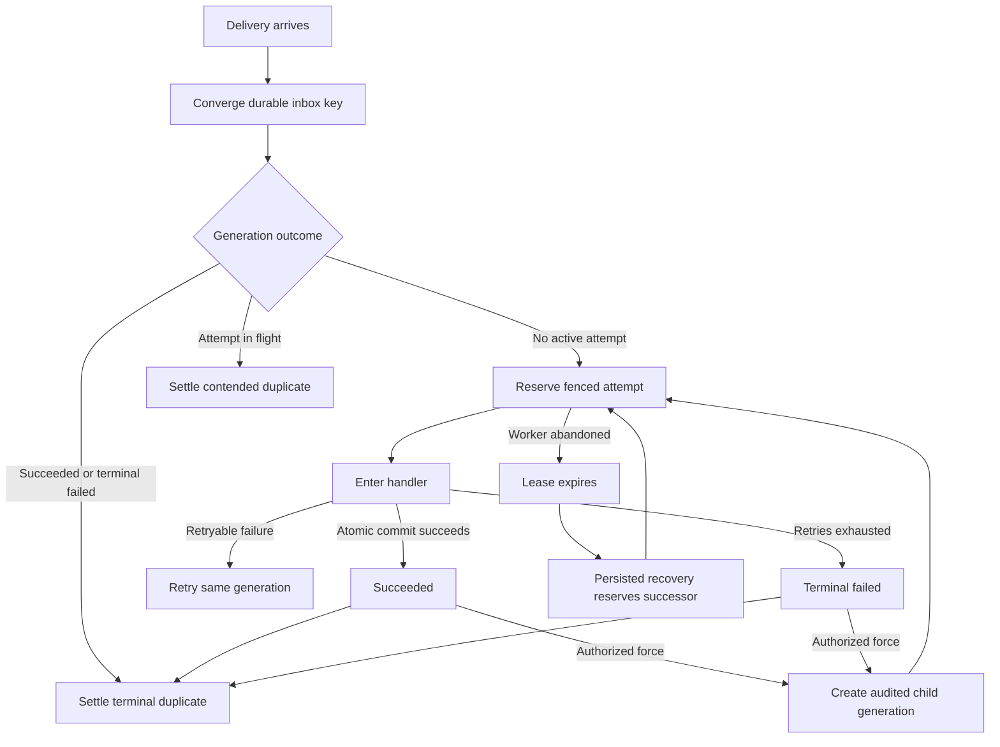
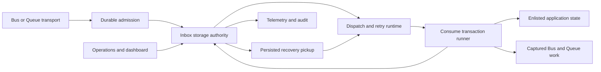
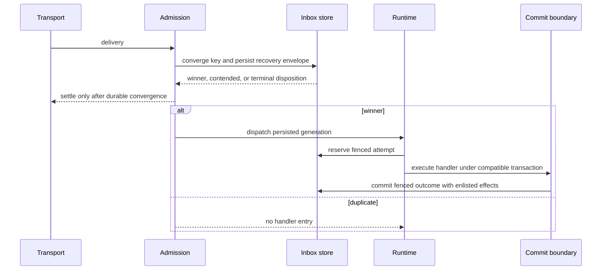
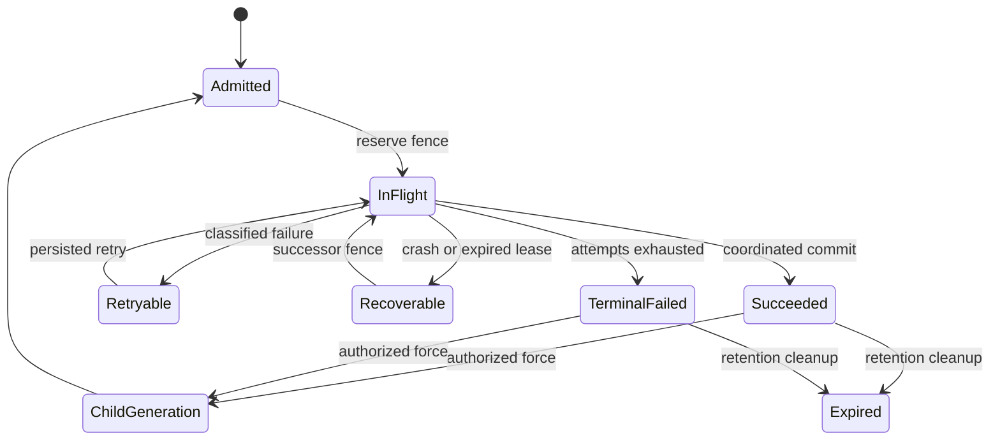
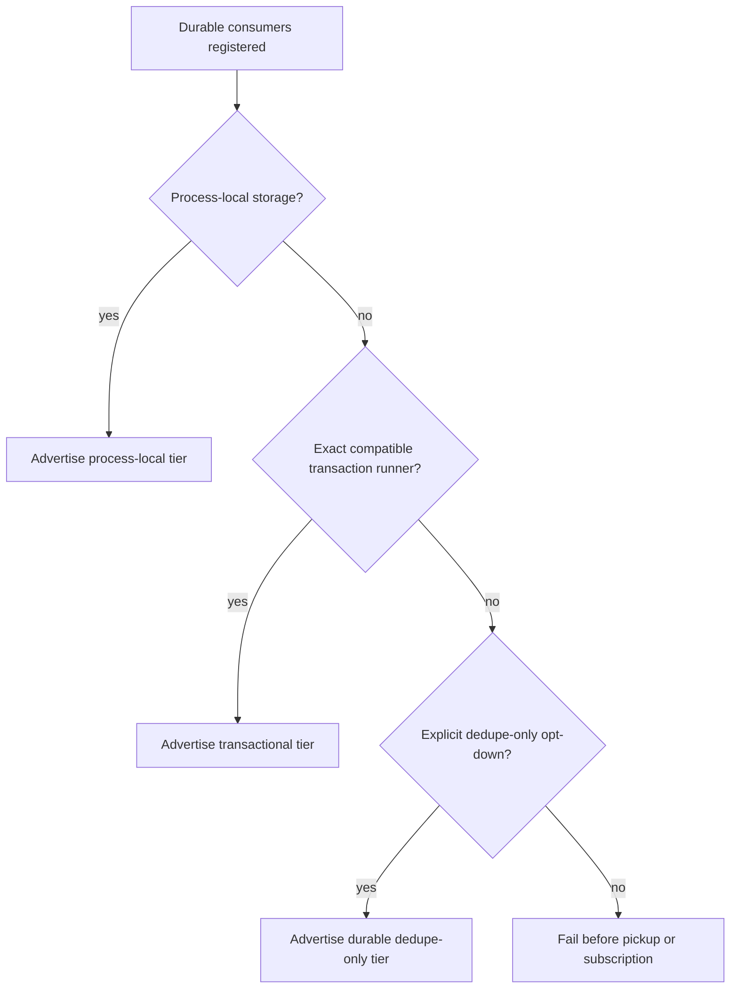
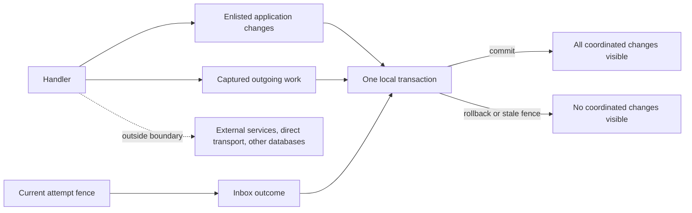
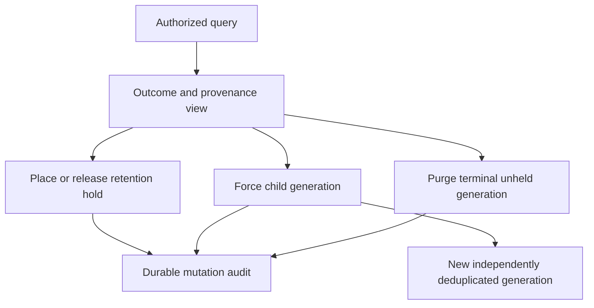
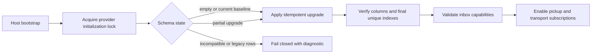
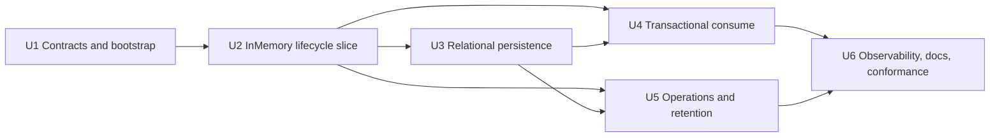

# Transactional Inbox Deduplication - Plan

## Goal Capsule

- **Objective:** Make a durable transactional inbox the standard receive contract for every durable Bus and Queue consumer.
- **Product authority:** GitHub issue [#225](https://github.com/xshaheen/headless-framework/issues/225), the current messaging contracts on `origin/main`, and the session-settled decisions recorded below.
- **Delivery baseline:** `origin/main` at `58127966061ae4a0372175884d60fe0820dc1950`.
- **Open blockers:** None for requirements. Issue [#350](https://github.com/xshaheen/headless-framework/issues/350) is closed. Issues [#808](https://github.com/xshaheen/headless-framework/issues/808) and [#809](https://github.com/xshaheen/headless-framework/issues/809), together with open implementation PR [#848](https://github.com/xshaheen/headless-framework/pull/848), are an implementation-overlap gate because they own the retry, lease, and shutdown semantics from which inbox implementation must start.
- **Execution profile:** Execute the dependency-ordered U-IDs against the current baseline. Re-query #808, #809, #848, and `origin/main` before U1; stop if their landed retry or lease contract conflicts with a KTD.

---

## Product Contract

### Summary

Headless will extend its received-message, retry, commit-coordination, provider, monitoring, and dashboard patterns into one provider-neutral transactional inbox for durable consumers.
The plan covers the full Product Contract and keeps unrelated middleware, topology, scheduling, and request/reply work outside the implementation.
The contract remains at-least-once and does not claim exactly-once handler entry or external effects.

### Problem Frame

The current receive path durably converges deliveries by message version, message identity, consumer group, and lane.
It also uses leases and terminal-state guards to prevent obvious concurrent or completed re-entry.
This identity is insufficient for an inbox because it omits tenant and operator-stable consumer identity, and its default handler identity is derived from CLR types.

Receive completion is also outside the coordinated application transaction.
A handler can therefore commit business state while the receive outcome remains uncertain, or vice versa.
Operators cannot distinguish ordinary redelivery from an intentional replay generation, and retention currently acts as an implicit dedupe window without an inbox-specific contract.

In this plan, coordinated application state means only state whose resource is enlisted in the same compatible transaction boundary as the inbox outcome.
Arbitrary databases, non-enlisted resources, and external services are outside that definition.

The package is greenfield and has no consumer or deployed-usage compatibility population.
The contract can therefore adopt one final durable-consumption model without legacy identity inference, semantic backfill, aliases, or deprecated paths.

### Key Decisions

- **Promote durable received-message state into the inbox.** (session-settled: user-directed — chosen over a second inbox ledger or application-owned middleware: one provider-neutral state machine avoids duplicate claims, retention, recovery, and monitoring.) Governs R1, R7-R13, R30.
- **Require explicit operator-stable consumer identity.** (session-settled: user-directed — chosen over topology-derived identity and a separate identity registry: identity must survive CLR and topology refactors without hidden coupling.) Governs R2-R5.
- **Normalize missing tenant to one no-tenant scope.** (session-settled: user-directed — chosen over distinct SQL `NULL` values or tenant-required handling: tenantless messages must still deduplicate.) Governs R6.
- **Use a commit-scoped guarantee.** (session-settled: user-directed — chosen over absolute single handler entry or best-effort suppression: crash recovery may re-enter handling, while capable providers fence duplicate committed effects.) Governs R11, R14-R18.
- **Keep identity immutable and resets explicit.** (session-settled: user-directed — chosen over alias graphs and inferred continuity: the greenfield contract favors visible resets and stable identifiers.) Governs R4, R26.
- **Represent intentional reprocessing as a new generation.** (session-settled: user-directed — chosen over reopening, deleting, or bypassing the original outcome: recovery must preserve provenance and remain deduplicated.) Governs R12, R13, R23.
- **Default to transactional capability with explicit degradation.** (session-settled: user-directed — chosen over transactional-only exclusion or silent degradation: useful durable suppression remains available without overstating atomicity.) Governs R14-R18.
- **Use inbox-specific 30-day retention.** (session-settled: user-directed — chosen over mandatory per-consumer declaration or the current successful-message retention: delayed redrive needs a safer default.) Governs R19-R22.
- **Make inbox semantics standard for durable consumption.** (session-settled: user-approved — chosen over per-consumer legacy opt-in after confirming the package is greenfield: one contract is simpler and safer than parallel durable modes.) Governs R1, R24-R26.
- **Expose bounded but correlatable telemetry.** (session-settled: user-approved — chosen over unbounded message-ID metric labels or aggregate-only telemetry: operators need message-level investigation without metric-cardinality failure.) Governs R27-R29.
- **Preserve an explicit direct-delivery escape hatch.** (session-settled: user-approved — chosen over forbidding direct delivery or allowing it silently: advanced use remains possible but outside the transactional guarantee.) Governs R17, R18.

<!-- x-section: work-relationships -->
### How This Work Fits Together

This plan owns transactional inbox identity, lifecycle, coordination, retention, recovery, and operational visibility.
The surrounding messaging work remains separately planned:

- **Depends on:** The verb-conveyed Bus/Queue and delivery-mode foundation from #350, which is already merged.
- **Requirements can proceed independently of:** #808, #809, and #848. This product contract does not depend on their unmerged implementation.
- **Implementation must follow:** The final retry, lease, and shutdown semantics from #808, #809, and #848 as landed on `origin/main`; inbox work must not fork, duplicate, or regress their behavior.
- **Shares semantics with:** Existing receive leases, attempt reservation, commit coordination, captured outgoing work, provider conformance, and dashboard authorization.
- **Does not absorb:** Request/reply, broader scheduling, consume-middleware redesign, or provider-topology expansion.

### Actors

- A1. **Application developer** declares a stable consumer identity and selects only explicit capability deviations.
- A2. **Messaging runtime** converges deliveries, owns inbox state, fences attempts, invokes handlers, and settles transport deliveries.
- A3. **Persistence and coordination provider** advertises and enforces its supported durability and transaction capabilities.
- A4. **Consumer handler** changes business state and may produce captured or explicitly direct outgoing work.
- A5. **Operator** investigates outcomes and performs authorized reprocessing, holds, or purges.

### Requirements

**Durable-consumer identity**

- R1. Every durable Bus or Queue consumer must use the inbox contract, while explicitly non-durable consumption remains outside its guarantees.
- R2. Every durable consumer must declare an operator-stable consumer identity before the application starts.
- R3. The framework must not derive persisted consumer identity from CLR types, handler method names, runtime subscription handles, groups, destinations, or mutable application configuration.
- R4. A stable consumer identity must survive handler-type, group, destination, and display-name refactors, while an identity change must start a new dedupe stream with an operator-visible diagnostic.
- R5. Consumer identity must be unique within the persistence namespace for a lane and contract version, with startup failure on collisions and independent Bus and Queue identities when their text matches.
- R6. The logical inbox key must consist only of tenant scope, message identity, lane, contract identity and version, stable consumer identity, and processing generation, with missing tenant normalized to one stable no-tenant scope.

**Inbox lifecycle and duplicate outcomes**

- R7. The runtime must durably converge the logical inbox key before user handling starts.
- R8. The first eligible delivery must reserve a fenced processing attempt and may enter user handling.
- R9. A duplicate that arrives while a valid attempt owns the key must not enter user handling and may settle only after durable convergence proves that the active generation remains recoverable from persisted state without that delivery.
- R10. A duplicate of a terminal generation must not enter user handling and must expose whether the retained outcome succeeded or failed terminally.
- R11. Persisted attempt recovery must keep retryable or abandoned work within one generation and must continue it under a new fence after lease expiry or abandonment without requiring another broker delivery.
- R12. An exhausted failure must become terminal and suppress ordinary redelivery until an authorized force-reprocess creates a new generation.
- R13. Replay must preserve the original outcome and generation unless authorized force-reprocessing creates one audited child generation that deduplicates independently.

The lifecycle projection below covers R7-R13.



**Transaction and capability contract**

- R14. The transactional tier must atomically commit the current fenced inbox outcome, application-state resources enlisted in the same compatible transaction boundary, and captured outgoing Bus and Queue work; no arbitrary database or external service is coordinated merely because the handler uses it.
- R15. A failed transactional commit must expose none of the coordinated changes and must leave the same generation eligible for recovery.
- R16. Transactional inbox capability must be the default, with startup failure before consumption when an application with durable consumers cannot satisfy it.
- R17. A consumer may explicitly opt down to durable dedupe-only capability that identifies possible state divergence and repeated handling.
- R18. `Auto` and `Durable` outgoing Bus and Queue work must be captured inside a compatible boundary, while explicit `TransportDirect`, non-enlisted databases, and external services must be diagnosed as outside the atomic and exactly-once guarantees.

**Retention and operations**

- R19. Terminal inbox generations must have a dedicated 30-day retention default that can be overridden per consumer.
- R20. Active generations and held records must not expire or be deleted by routine cleanup.
- R21. A delivery whose prior generation expired or was purged must be treated as new work, and this consequence must be visible to operators.
- R22. Cleanup, legal or operational holds, and purge must have provider-neutral behavior with authorization and audit for destructive operations.
- R23. One provider-neutral operations contract must power both dashboard and programmatic administration for outcome queries, force-reprocess, holds, and purge.

**Greenfield schema and compatibility**

- R24. PostgreSQL and SQL Server providers must own the schema change from the current repository baseline to the final inbox contract without semantic legacy backfill.
- R25. InMemory must implement the same observable state-machine outcomes for development and tests within a labeled process-local boundary that does not survive restart.
- R26. The feature must not introduce legacy identity backfill, automatic inference, alias migration, deprecated overloads, or a parallel group-keyed durable mode.

**Observability and documentation**

- R27. Metrics must expose bounded dimensions for consumer identity, lane, outcome, and capability tier, with tenant identity enabled only under explicit cardinality controls.
- R28. Authorized dashboards, logs, and traces must support tenant and message-identity correlation, but message identity must not be a metric label.
- R29. Inbox observability must not copy message payloads or arbitrary headers, and all recovery mutations must produce an audit record.
- R30. Documentation must state the retention window, post-expiry behavior, identity-reset consequences, provider capability tier, replay provenance, and the absence of exactly-once guarantees for handler entry or external effects.

### Key Flows

- F1. First transactional delivery
  - **Trigger:** A durable delivery arrives with no retained generation for its logical inbox key.
  - **Actors:** A2, A3, A4
  - **Steps:** The runtime converges the key, reserves a fenced attempt, invokes the handler, and commits the inbox outcome with enlisted application state and captured outgoing work.
  - **Outcome:** One succeeded generation is retained and later duplicates are suppressed.
  - **Covers:** R7, R8, R14, R15.

- F2. Concurrent duplicate across replicas
  - **Trigger:** Two replicas receive the same logical delivery concurrently.
  - **Actors:** A2, A3
  - **Steps:** Both converge on one generation; one attempt wins the fence and the other delivery settles without entering the handler.
  - **Outcome:** Only the current fenced attempt may commit coordinated effects.
  - **Covers:** R7-R10, R14.

- F3. Crash and stale-worker recovery
  - **Trigger:** The active worker stops making progress before a successful commit.
  - **Actors:** A2, A3, A4
  - **Steps:** The store-clock lease expires, persisted recovery reserves a new fenced attempt without waiting for another broker delivery, and any late stale commit fails its fence.
  - **Outcome:** Handling may re-enter from durable inbox state, but only the current attempt may commit enlisted effects.
  - **Covers:** R11, R14, R15.

- F4. Exhausted failure and forced reprocessing
  - **Trigger:** Retry policy exhausts, then an operator requests another processing run.
  - **Actors:** A2, A5
  - **Steps:** Ordinary redelivery remains suppressed; authorized force-reprocess creates an audited child generation linked to the original.
  - **Outcome:** The original record remains intact and the new generation deduplicates its own retries.
  - **Covers:** R12, R13, R22, R23.

- F5. Retention expiry and cleanup
  - **Trigger:** A terminal generation passes its retention deadline without a hold.
  - **Actors:** A2, A3, A5
  - **Steps:** Provider-neutral cleanup removes the generation and records any operator-directed purge separately.
  - **Outcome:** A later matching delivery is new work and can enter handling.
  - **Covers:** R19-R23.

- F6. Bootstrap capability validation
  - **Trigger:** An application starts with durable consumers.
  - **Actors:** A1, A2, A3
  - **Steps:** The runtime validates stable identities, collision scope, storage durability, and transaction capability before pickup begins.
  - **Outcome:** Supported configurations start with an observable tier; unsupported or silently degraded configurations fail before consuming.
  - **Covers:** R1-R6, R16, R17, R25.

### Acceptance Examples

- AE1. Transactional duplicate after broker redelivery
  - **Covers:** R7-R10, R14.
  - **Given:** A handler committed its inbox outcome, business state, and captured outgoing work, but the broker acknowledgement was lost.
  - **When:** The broker redelivers the same logical key within retention.
  - **Then:** The handler does not re-enter, no second captured outgoing operation is committed, and the duplicate is observable as suppressed.

- AE2. Concurrent replicas
  - **Covers:** R8, R9, R11, R14.
  - **Given:** Two replicas receive the same logical key at the same time.
  - **When:** Both attempt to reserve processing.
  - **Then:** One fenced attempt enters handling, the other delivery settles as contended, and only the winning attempt can commit coordinated effects.

- AE3. Crash before commit
  - **Covers:** R11, R14, R15.
  - **Given:** A worker enters the handler and crashes before the coordinated transaction commits.
  - **When:** Its lease expires.
  - **Then:** A successor may re-enter handling under a new attempt, while no partial coordinated state from the crashed attempt is visible.

- AE4. Paused stale worker
  - **Covers:** R11, R14, R15.
  - **Given:** A worker pauses beyond its lease and a successor reserves a new attempt.
  - **When:** The stale worker resumes and tries to commit.
  - **Then:** Its stale fence prevents the inbox transition and rolls back its coordinated business and captured outgoing changes.

- AE5. Tenant isolation
  - **Covers:** R6.
  - **Given:** Two messages share message identity, lane, contract version, consumer identity, and generation but have different tenant identities.
  - **When:** Both are delivered.
  - **Then:** Each tenant has an independent inbox generation and neither suppresses the other.

- AE6. No-tenant normalization
  - **Covers:** R6, R9, R10.
  - **Given:** Two tenantless deliveries share every other logical key dimension.
  - **When:** They arrive within retention.
  - **Then:** Both resolve to the same no-tenant scope and the duplicate is suppressed.

- AE7. Lane isolation
  - **Covers:** R5, R6.
  - **Given:** Bus and Queue deliveries reuse the same message identity, contract version, and consumer-identity text.
  - **When:** Both lanes process the deliveries.
  - **Then:** They produce independent generations because lane is part of the key.

- AE8. Identity refactor and reset
  - **Covers:** R2-R5, R26.
  - **Given:** A handler CLR type or topology name changes while its stable identity remains unchanged.
  - **When:** A retained duplicate arrives.
  - **Then:** The duplicate remains suppressed; if the operator changes the stable identity instead, the delivery becomes new work and startup reports the reset consequence.

- AE9. Retry exhaustion and forced generation
  - **Covers:** R11-R13, R23.
  - **Given:** A generation reached terminal failure.
  - **When:** The broker redelivers normally and an operator later issues one authorized force-reprocess request.
  - **Then:** Normal redelivery remains suppressed, while one audited child generation is created and deduplicates its own retries.

- AE10. Retention expiry
  - **Covers:** R19-R22.
  - **Given:** A terminal generation is older than its configured retention and has no hold.
  - **When:** Cleanup removes it and a matching delivery arrives later.
  - **Then:** The delivery is treated as new work, and documentation and operational views make this behavior discoverable.

- AE11. Capability failure and explicit opt-down
  - **Covers:** R16, R17, R25.
  - **Given:** A provider cannot coordinate the inbox outcome with application state.
  - **When:** The application starts without an explicit capability deviation.
  - **Then:** Startup fails before pickup; with explicit dedupe-only selection, startup succeeds and the degraded guarantee is observable.

- AE12. Direct and external effects
  - **Covers:** R18, R30.
  - **Given:** A transactional handler writes a non-enlisted database, performs `TransportDirect` work, or invokes an external service before a crash.
  - **When:** Recovery re-enters the handler.
  - **Then:** The framework may repeat that effect and does not describe it as exactly once.

- AE13. Provider conformance
  - **Covers:** R14-R18, R24, R25.
  - **Given:** The same lifecycle suite runs against InMemory, PostgreSQL, and SQL Server.
  - **When:** It exercises first delivery, duplicates, crash recovery, fencing, terminal failure, replay, retention, and capability validation.
  - **Then:** PostgreSQL and SQL Server prove their declared durable and transactional tiers, while InMemory proves the same observable outcomes within its process-local boundary.

- AE14. Settled in-flight duplicate followed by winner crash
  - **Covers:** R9, R11, R14, R15.
  - **Given:** One worker owns the fenced attempt and an in-flight duplicate durably converges on that generation and settles without entering the handler.
  - **When:** The winning worker crashes before commit and no further broker delivery occurs.
  - **Then:** Persisted recovery reserves a successor under a new fence and continues the same generation without depending on broker redelivery, while no partial enlisted state from the crashed attempt is visible.

### Success Criteria

- A planning pass can derive implementation units without inventing identity, lifecycle, atomicity, retention, replay, or provider-degradation behavior.
- Provider-conformance coverage demonstrates every conditional acceptance example that applies to InMemory, PostgreSQL, and SQL Server.
- Operator surfaces distinguish first processing, contention, completed duplicate, retry, terminal failure, abandoned attempt, forced generation, expiry, hold, and purge.
- Public documentation cannot reasonably be read as an exactly-once transport or external-effect guarantee.

### Scope Boundaries

- Request/reply behavior is outside this plan.
- Scheduling expansion, recurrence, cancellation, and management APIs are outside this plan.
- General consume-middleware redesign and provider-topology changes are outside this plan.
- Retry lifecycle, lease-release, and shutdown-budget decisions remain owned by #808, #809, and #848; this plan defines only inbox-facing interaction semantics and requires implementation to consume their final landed behavior.
- General outbox redesign is outside this plan; only captured outgoing work inside the inbox coordination boundary is relevant.
- Exactly-once transport delivery, absolute single handler entry, and exactly-once external effects are not product promises.
- Legacy consumer migration, stored-message identity backfill, identity aliases, and compatibility shims are outside this greenfield contract.

### Dependencies and Assumptions

- The package has no consumers or deployed usages that require behavioral or persisted-data compatibility; this is user-provided product authority.
- The current registry rejects duplicate consumer registrations for the same message name, group, and lane, so one received delivery maps to one executor within the current topology.
- The current received-state stores and provider conformance foundations are the implementation baseline; the Planning Contract selects their final inbox evolution.
- Inbox implementation planning must re-query #808, #809, #848, and current `origin/main`, then start from their final landed retry, lease, and shutdown semantics rather than unmerged or duplicated behavior.
- The producer-supplied tenant and message identity remain part of the internal messaging trust boundary; the inbox does not provide cryptographic identity validation.
- Transport redrive horizons outside Headless configuration may be unknown, so operators remain responsible for increasing retention when 30 days is insufficient.

### Sources and Research

**Repository and issue evidence**

- [Issue #225](https://github.com/xshaheen/headless-framework/issues/225) defines the inbox objective and acceptance criteria.
- [Issue #350](https://github.com/xshaheen/headless-framework/issues/350) provides the merged Bus/Queue and delivery-mode foundation.
- [Issues #808](https://github.com/xshaheen/headless-framework/issues/808) and [#809](https://github.com/xshaheen/headless-framework/issues/809), together with open implementation [PR #848](https://github.com/xshaheen/headless-framework/pull/848), own the overlapping retry, lease-release, and shutdown semantics that inbox implementation must consume after they land.
- `docs/llms/messaging.md` defines current lane, delivery, retry, and at-least-once behavior.
- `src/Headless.Messaging.Core/ConsumerRegistry.cs` defines the one-consumer-per-message-name/group/lane registration invariant.
- `src/Headless.Messaging.Core/ConsumerMetadata.cs` and `src/Headless.Messaging.Core/Configuration/MessagingOptions.cs` expose the current CLR-derived handler-identity fallback that R3 replaces.
- `src/Headless.Messaging.Storage.InMemory/InMemoryDataStorage.cs`, `src/Headless.Messaging.Storage.PostgreSql/PostgreSqlDataStorage.cs`, and `src/Headless.Messaging.Storage.SqlServer/SqlServerDataStorage.cs` provide the current convergence and lease foundations.
- `docs/llms/commit-coordination.md` and `docs/llms/orm.md` define the capability-qualified coordinated transaction and captured-work model.

**Competitor semantic benchmarks**

| Benchmark | Useful semantic | Headless decision |
|---|---|---|
| [MassTransit transactional outbox](https://masstransit.io/documentation/configuration/middleware/outbox) | Consumer-side dedupe can pair with captured outgoing work. | Keep the semantic, but use Headless lanes, stable consumer identity, and capability model. |
| [NServiceBus outbox](https://docs.particular.net/nservicebus/outbox/) | Business data and outgoing messages are coordinated, while immediate dispatch remains outside the outbox. | Adopt the same explicit guarantee boundary in R14-R18 and R30. |
| [Wolverine durability](https://wolverinefx.io/guide/durability/) | Durable inbox recovery and transactional middleware are provider-capability concerns. | Make capabilities explicit and fail fast instead of promising universal atomicity. |
| [Brighter inbox support](https://brightercommand.gitbook.io/paramore-brighter-documentation/outbox-and-inbox/brighterinboxsupport) | Per-handler context participates in dedupe identity. | Require operator-owned identity and reject handler-type inference. |
| [CAP idempotence guidance](https://cap.dotnetcore.xyz/user-guide/en/cap/idempotence/) | Application-owned tracking leaves dedupe behavior outside the framework contract. | Own inbox semantics, monitoring, and recovery in Headless. |

**Implementation research**

- [EF Core transactions](https://learn.microsoft.com/en-us/ef/core/saving/transactions) requires participating contexts and commands to share the exact `DbConnection` and `DbTransaction`.
- [EF Core connection resiliency](https://learn.microsoft.com/en-us/ef/core/miscellaneous/connection-resiliency) documents whole-delegate execution-strategy replay and ambiguous commit outcomes. The inbox transaction runner must not hide multiple handler entries inside one persisted attempt.
- [PostgreSQL `INSERT`](https://www.postgresql.org/docs/current/sql-insert.html) and [`SELECT`](https://www.postgresql.org/docs/current/sql-select.html) support atomic key convergence and queue-style recovery pickup as separate concerns.
- [SQL Server table hints](https://learn.microsoft.com/en-us/sql/t-sql/queries/hints-transact-sql-table) constrains recovery claims under `READ_COMMITTED_SNAPSHOT`; provider tests must cover supported database modes.
- `docs/solutions/logic-errors/terminal-state-overwrite-on-redelivery.md` establishes storage as the sole authority for conditional message transitions.
- `docs/solutions/design-patterns/temporal-authority-standard.md` and `docs/solutions/design-patterns/atomic-database-clock-relational-lease-claims.md` establish store-clock claims and persisted fence identity.
- `docs/solutions/logic-errors/asynclocal-ambient-scope-stranded-across-await.md` requires commit coordination to be visible before the first awaited handler operation.
- `docs/solutions/best-practices/storage-initializer-lifecycle-correctness.md` establishes blocking initialization, provider locks, and partial-schema repair.

---

## Planning Contract

The Product Contract is unchanged. This section resolves the implementation choices that were deferred during brainstorming.

### Key Technical Decisions

- KTD1. Start implementation from the final landed #808, #809, and #848 retry, lease, attempt, and shutdown model. Do not copy their current unmerged branch shape or introduce parallel lifecycle machinery. This gates U1 and governs the implementation of R9-R12.
- KTD2. Add one required stable consumer identity and one explicit immutable contract version to durable consumer registration. Keep transport group and destination as routing metadata. Remove CLR-derived identity fallback from the durable path. (session-settled: user-approved — chosen over reusing `HandlerId`, group, or runtime handles: the persisted identity must survive handler and topology refactors.) This implements R2-R6.
- KTD3. Promote the existing received-message store into the inbox authority and evolve its provider-owned schema in place. Replace the old group-keyed uniqueness rule with the R6 key and enforce one ordinal persisted equality contract across providers, including an unambiguous no-tenant encoding. Serialize admission and child allocation on the base identity without generation so one retained generation is current. Give every generation an immutable incarnation identity for provenance and audit. Keep the existing storage/runtime version only as operational metadata. Do not add an EF migration stream or a second inbox ledger. (session-settled: user-approved — chosen over a parallel ledger or semantic backfill: the package is greenfield and one authority avoids divergent recovery state.) This implements R1, R6-R13, and R24-R26.
- KTD4. Use two durable boundaries. One atomic admission transaction persists the complete recovery envelope and generation before dispatch or broker settlement. A separate committed claim precedes user code. Handler success then commits only the current fenced outcome, enlisted application state, and captured outgoing work. Failure recording occurs afterward under the same fence; loss of that write falls back to lease recovery. No transaction stays open across admission, dispatch, and handler execution. (session-settled: user-approved — chosen over one transaction spanning admission and handling: recovery must survive a settled duplicate followed by winner failure.) This implements R7-R11 and AE14.
- KTD5. Make every claim and lifecycle mutation an atomic storage decision. Generation and attempt fences are atomically allocated persisted identities. The provider clock decides eligibility and lease timestamps but never supplies identity. All providers use one documented lock order across admission, claim, completion, force, hold, cleanup, and purge. A zero-row or rejected mutation is a terminal instruction to stop callbacks and roll back the current coordinated transaction. This implements R8-R15.
- KTD6. Advertise inbox capability through the frozen provider capability model. The transactional tier requires a configured compatible consume-transaction runner. Raw relational storage without that runner is durable-dedupe-only and starts only after an explicit opt-down. InMemory advertises a separate process-local tier. (session-settled: user-approved — chosen over inferred or silently degraded capability: startup must prove the declared guarantee.) This implements R14-R18 and R25.
- KTD7. Let the configured application `DbContext` own one local transaction and share its exact provider, physical connection, transaction, and supported isolation mode with fenced inbox writes and captured outgoing work. Core owns the provider-neutral behavior. Relational storage packages own transaction-bound commands. Each Messaging EF integration package bridges its configured context to those commands; CommitCoordination remains messaging-agnostic. Establish the coordinator before awaiting user code. Reject mismatched or nested boundaries before handler entry. Do not use `TransactionScope`, distributed transactions, or transparent execution-strategy replay around the handler. Reconcile ambiguous commit through an authoritative connection: committed success suppresses re-entry, confirmed absence returns to persisted lease recovery, and indeterminate state remains quarantined until authority or lease expiry resolves it. (session-settled: user-approved — chosen over ambient or replaying coordination: one stored attempt must not conceal multiple handler entries.) This implements R14-R18.
- KTD8. Extend the existing persisted retry worker as the only recovery authority. It resolves retained work by stable consumer identity, lane, and contract identity/version, then applies the final landed retry and lease semantics. Missing registrations remain orphaned and operator-visible. This implements R4, R9-R13, and R26.
- KTD9. Keep `IMonitoringApi` read-only and add one provider-neutral inbox operations boundary for authorization, queries, holds, force-reprocess, and purge. Every mutation carries an actor, reason, and idempotent operation identity. Providers commit the mutation with an independent durable operation receipt and audit record that references the immutable incarnation without delete cascade. The receipt survives inbox-row deletion and prevents the same operation identity from acting on a later incarnation. This implements R22, R23, and R29.
- KTD10. Treat holds as retention barriers, not processing pauses. Persist terminal time and effective expiry from provider time with the terminal outcome; later configuration changes apply prospectively unless an audited operation changes retained rows. Routine cleanup removes only rows still terminal, expired, and unheld at the mutation predicate. Ordinary purge rejects active or held work. Force, cleanup, hold, and purge use expected-state conditional mutations. Expiry creates new work without a permanent per-key tombstone; cleanup telemetry and durable audit expose the consequence. (session-settled: user-approved — chosen over pause semantics and permanent tombstones: neither is required for dedupe retention.) This implements R19-R23.
- KTD11. Extend existing Messaging activities, meters, and dashboard projections. Metrics may use the registered stable consumer identity plus bounded lane, outcome, capability, and provider dimensions. Tenant dimensions require explicit cardinality controls; message and replay identities remain in policy-controlled traces, logs, or authorized operations views. This implements R27-R30.
- KTD12. Use a fail-closed greenfield cutover. Provider initialization upgrades an empty or current baseline schema under existing provider locks. It validates compatibility, repairs shape, establishes and verifies the final constraints and indexes, removes obsolete authority, then publishes a schema-readiness marker last. Every host checks that marker before subscriptions, recovery, or operations start. Unexpected legacy rows, incompatible binaries, incomplete capability probes, and downgrade after new-format data stop startup with an actionable reset/export diagnostic. (session-settled: user-approved — chosen over dual read/write compatibility: there are no deployed consumers to justify parallel semantics.) This implements R24-R26.

### High-Level Technical Design

These sketches constrain boundaries and ordering. They do not prescribe exact types, signatures, SQL, or UI composition.

#### Component topology



#### Admission and handler protocol



#### Inbox generation lifecycle



#### Capability decision



#### Coordinated data boundary



#### Operator command surface



#### Schema readiness lifecycle



### System-Wide Impact

- **Public contract:** Durable registrations gain mandatory persisted identity and contract-version metadata. Existing CLR-derived fallback leaves the durable path.
- **Persistence:** InMemory, PostgreSQL, and SQL Server gain generation, fence, provenance, hold, retention, and audit semantics. Relational initialization owns the baseline-to-final upgrade.
- **Runtime:** Admission, dispatch, handler execution, retry pickup, dead-owner recovery, and shutdown all consume one inbox lifecycle.
- **Transactions:** EF integration packages become the registration seam for compatible consume transactions. Non-enlisted resources remain outside the guarantee.
- **Operations:** Dashboard and programmatic recovery use one authorization-aware operations boundary; monitoring remains read-only.
- **Observability:** Metrics, traces, logs, dashboard views, and audit distinguish duplicate, retry, recovery, replay, expiry, and capability outcomes without payload exposure.
- **Documentation:** Messaging Core and provider guidance must explain stable identity, capability tiers, retention, recovery, and exactly-once boundaries.

### Sequencing and Dependencies



- U1 is blocked until the implementer refreshes `origin/main` and records the final #808/#809/#848 overlap result.
- U2 provides the process-local walking skeleton before relational complexity is added.
- U3 starts after U2 freezes the provider-neutral storage SPI and shared harness contract.
- U4 requires both a working lifecycle and relational transaction primitives.
- U5 requires the lifecycle and relational schema but does not require U4's full transactional handler path.
- U6 closes public, operational, and cross-provider parity after U4 and U5.

### Risks and Mitigations

| Risk | Consequence | Plan treatment |
|---|---|---|
| #808/#809/#848 lands with different attempt or lease semantics | Inbox forks retry behavior or counts attempts twice | U1 refreshes live state and maps the inbox to the landed contract before code changes. |
| Transparent EF execution-strategy replay re-enters user code | One persisted attempt hides multiple handler entries | KTD7 prohibits transparent handler replay; tests inject transient and ambiguous commit faults. |
| Admission is rolled back with handler work | A settled duplicate and crashed winner leave no recovery source | KTD4 splits durable admission from the fenced handler transaction; AE14 is a required cross-provider proof. |
| A stale worker commits application state | Duplicate coordinated effects become visible | KTD5 makes the inbox fence part of the same transaction and treats zero affected rows as rollback. |
| Provider clocks or locking modes differ | Replicas claim the same work or strand recovery | Providers use their own authoritative clocks; SQL Server tests cover supported RCSI modes and PostgreSQL separates convergence from queue pickup. |
| Partial schema initialization enables consumption | Hosts use different logical keys | KTD12 blocks readiness until the final unique key and indexes are verified under provider initialization locks. |
| High-cardinality or sensitive telemetry leaks identity | Monitoring cost or privacy exposure | KTD11 limits consumer labels to registered stable identities, gates tenant labels, and keeps message/replay correlators off metrics. |
| Purge removes the only recovery source | In-flight work is lost | KTD10 rejects active purge and keeps audit separate from the inbox row. |
| Composite key equality differs by provider | Unrelated messages suppress each other or duplicates enter | KTD3 requires provider-neutral ordinal encodings, constraints, and catalog-level parity tests. |
| Operation audit commits after a destructive mutation | Purge or replay loses evidence or executes twice | KTD9 commits an independent idempotency receipt and audit atomically with the mutation. |

---

## Implementation Units

### U1. Freeze durable identity, capability, and overlap contracts

**Goal:** Establish the public and bootstrap contracts that every later unit consumes.

**Requirements:** R1-R6, R16-R18, R24-R26; F6; AE5-AE8, AE11; KTD1, KTD2, KTD6, KTD12.

**Dependencies:** None. Refresh `origin/main`, #808, #809, and #848 before editing.

**Files:**

- `src/Headless.Messaging.Core/Registration/ConsumerBuilders.cs`
- `src/Headless.Messaging.Core/Registration/ScannedConsumerBuilders.cs`
- `src/Headless.Messaging.Core/ConsumerMetadata.cs`
- `src/Headless.Messaging.Core/Configuration/MessagingOptions.cs`
- `src/Headless.Messaging.Core/Configuration/MessagingProviderCapabilities.cs`
- `src/Headless.Messaging.Core/Configuration/MessagingCapabilityModel.cs`
- `src/Headless.Messaging.Core/ConsumerRegistry.cs`
- `src/Headless.Messaging.Core/Internal/IRuntimeConsumerRegistry.cs`
- `tests/Headless.Messaging.Core.Tests.Unit/ConsumerMetadataTests.cs`
- `tests/Headless.Messaging.Core.Tests.Unit/ConsumerRegistryTests.cs`
- `tests/Headless.Messaging.Core.Tests.Unit/Configuration/MessagingCapabilityModelTests.cs`
- `tests/Headless.Messaging.Core.Tests.Unit/Configuration/MessagingOptionsValidationTests.cs`
- `tests/Headless.Messaging.Core.Tests.Unit/Registration/MessagingRegistrationApiSurfaceTests.cs`

**Approach:**

1. Record the landed retry/lease contract and remove any proposed inbox behavior that duplicates it.
2. Add mandatory stable consumer identity and immutable contract version to all durable registration paths.
3. Keep Bus and Queue collision scopes independent and remove CLR-derived fallback from durable metadata.
4. Add declared inbox capability tiers and validate them before subscription creation or retry pickup.
5. Expose the process-local InMemory tier and require an explicit opt-down for durable dedupe-only providers.

**Patterns:** Follow frozen provider capability validation in `MessagingCapabilityModel` and registration freeze behavior in `ConsumerRegistry`.

**Test Scenarios:**

1. Register a durable consumer without stable identity or contract version; startup fails before transport or processor startup. Covers R2, R3, AE11.
2. Register the same textual identity for Bus and Queue; both registrations succeed and remain lane-qualified. Covers R5, AE7.
3. Register colliding identities for the same lane and contract version; startup reports the collision deterministically. Covers R5.
4. Change CLR type, group, destination, or display name while identity remains stable; durable metadata remains unchanged. Covers R4, AE8.
5. Start a provider without a compatible transaction runner; default startup fails, while explicit dedupe-only selection starts with a visible degraded tier. Covers R16, R17, AE11.
6. Start InMemory; it advertises process-local behavior and never satisfies a durable transactional requirement. Covers R25, AE13.

**Verification:** Run the Messaging Core unit project and inspect bootstrap logs/capability projection for each tier.

### U2. Deliver the provider-neutral inbox lifecycle through InMemory

**Goal:** Build one end-to-end process-local slice from durable admission through duplicate suppression, fenced handling, retry, and persisted recovery.

**Requirements:** R6-R13, R15, R25, R26; F1-F3; AE1-AE9, AE14; KTD3-KTD5, KTD8.

**Dependencies:** U1.

**Files:**

- `src/Headless.Messaging.Core/Persistence/IDataStorage.cs`
- `src/Headless.Messaging.Core/Messages/MediumMessage.cs`
- `src/Headless.Messaging.Core/Internal/IConsumerRegister.cs`
- `src/Headless.Messaging.Core/Internal/ISubscribeExecutor.cs`
- `src/Headless.Messaging.Core/Processor/Dispatcher.cs`
- `src/Headless.Messaging.Core/Processor/IProcessor.NeedRetry.cs`
- `src/Headless.Messaging.Storage.InMemory/InMemoryDataStorage.cs`
- `src/Headless.Messaging.Storage.InMemory/InMemoryDataStorage.Maintenance.cs`
- `tests/Headless.Messaging.Core.Tests.Harness/DataStorageTestsBase.cs`
- `tests/Headless.Messaging.Core.Tests.Harness/DeadOwnerReclaimConformanceTests.cs`
- `tests/Headless.Messaging.Core.Tests.Unit/ConsumerRegisterTests.cs`
- `tests/Headless.Messaging.Core.Tests.Unit/SubscribeExecutorRetryTests.cs`
- `tests/Headless.Messaging.Core.Tests.Unit/Processor/MessageNeedToRetryProcessorTests.cs`
- `tests/Headless.Messaging.Storage.InMemory.Tests.Unit/InMemoryDataStorageTests.cs`

**Approach:**

1. Introduce focused inbox key, convergence disposition, generation, attempt-fence, and lifecycle projections instead of expanding generic message status flags.
2. Persist the full recovery envelope before broker settlement and return winner, in-flight duplicate, terminal-success duplicate, or terminal-failure duplicate disposition.
3. Reserve attempts and commit outcomes through conditional storage mutations under per-row InMemory synchronization.
4. Route recovery through the existing retry processor by stable consumer identity, lane, and contract identity/version.
5. Preserve orphaned retained work when no current registration matches; expose it for operations instead of deleting or misrouting it.

**Patterns:** Follow `terminal-state-overwrite-on-redelivery.md`, existing retry-dispatch boundaries, injected `TimeProvider`, and snapshot returns from InMemory storage.

**Test Scenarios:**

1. Admit a first delivery, settle the broker, execute once, and suppress a later retained duplicate. Covers AE1.
2. Race N deliveries for one key; one fence enters the handler and all other deliveries settle without handler entry. Covers AE2.
3. Settle an in-flight duplicate, crash the winner before commit, provide no broker redelivery, advance the store clock, and verify persisted recovery claims a successor fence. Covers AE14.
4. Resume a stale worker after successor claim; its conditional completion fails and no callback or outgoing work continues. Covers AE4.
5. Exercise tenant, no-tenant, lane, contract-version, and generation isolation with otherwise identical keys. Covers AE5-AE7.
6. Exhaust retry policy; ordinary redelivery remains suppressed until a child generation is created. Covers AE9.
7. Remove or rename only mutable topology metadata; retained work still resolves by stable identity. Remove the stable registration; work remains orphaned and visible. Covers R4, R26.
8. Crash after rollback but before retry-state recording; lease recovery preserves the already reserved attempt budget. Covers R11.

**Verification:** Run Messaging Core and InMemory unit projects. Use deterministic `TimeProvider` advancement; do not use wall-clock sleeps.

### U3. Upgrade PostgreSQL and SQL Server inbox persistence

**Goal:** Implement the final inbox key, lifecycle, recovery, retention metadata, and initializer safety in both relational providers.

**Requirements:** R6-R13, R19-R26, R29; F2-F6; AE2-AE10, AE13, AE14; KTD3-KTD5, KTD8-KTD10, KTD12.

**Dependencies:** U2.

**Files:**

- `src/Headless.Messaging.Storage.PostgreSql/PostgreSqlDataStorage.cs`
- `src/Headless.Messaging.Storage.PostgreSql/PostgreSqlDataStorage.Delayed.cs`
- `src/Headless.Messaging.Storage.PostgreSql/PostgreSqlStorageInitializer.cs`
- `src/Headless.Messaging.Storage.SqlServer/SqlServerDataStorage.cs`
- `src/Headless.Messaging.Storage.SqlServer/SqlServerDataStorage.Delayed.cs`
- `src/Headless.Messaging.Storage.SqlServer/SqlServerStorageInitializer.cs`
- `tests/Headless.Messaging.Core.Tests.Harness/DataStorageTestsBase.cs`
- `tests/Headless.Messaging.Core.Tests.Harness/DeadOwnerReclaimConformanceTests.cs`
- `tests/Headless.Messaging.Storage.PostgreSql.Tests.Integration/PostgreSqlStorageTests.cs`
- `tests/Headless.Messaging.Storage.PostgreSql.Tests.Integration/PostgreSqlDeadOwnerReclaimConformanceTests.cs`
- `tests/Headless.Messaging.Storage.SqlServer.Tests.Integration/SqlServerStorageTests.cs`
- `tests/Headless.Messaging.Storage.SqlServer.Tests.Integration/SqlServerDeadOwnerReclaimConformanceTests.cs`
- `tests/Headless.Messaging.Storage.PostgreSql.Tests.Integration/PostgreSqlStorageInitializerTests.cs`
- `tests/Headless.Messaging.Storage.SqlServer.Tests.Integration/SqlServerStorageInitializerTests.cs`

**Approach:**

1. Upgrade the current received schema to the final R6 key and add current-generation authority, immutable incarnation identity, exact attempt fence, replay provenance, terminal retention, and hold metadata.
2. Keep topology group and destination as non-key metadata. Enforce ordinal persisted equality, `NOT NULL`, length, and tenant-presence constraints for every key component. Reject invalid or overlength values; never truncate them.
3. Implement atomic convergence and conditional lifecycle mutations with one command-stable provider-clock snapshot.
4. Use queue-style skip-locked claims only for eligible recovery pickup; never use them to decide duplicate truth.
5. Add a separate provider-owned operation receipt and audit authority. Mutation and audit must share one transaction, while audit lifecycle remains independent from inbox retention and deletion.
6. Extend existing provider initialization locks and idempotent repair blocks. Publish the compatibility marker only after final constraints, indexes, and obsolete-authority removal are verified.
7. Reject nonempty legacy group-keyed rows with an actionable reset/export diagnostic instead of synthesizing identity.

**Patterns:** Follow the existing PostgreSQL advisory-lock and SQL Server `sp_getapplock` initializers, relational dead-owner conformance, and temporal-authority solution documents.

**Test Scenarios:**

1. Run the same key, duplicate, fence, generation, tenant, lane, and recovery suite against both providers. N-way first admission and child allocation yield one current generation and one immutable incarnation. Covers AE2-AE9, AE14.
2. Skew application clocks across contenders; provider-clock ownership still yields one winner and correct expiry. Covers R8, R11.
3. Attempt stale completion after successor reservation; zero affected rows preserves the authoritative state. Covers AE4.
4. Start from an empty schema, current baseline schema, and a fault after each ordered upgrade phase; each restart reaches one final schema and publishes readiness last. Covers R24.
5. Race two initializers; consumption remains blocked until the final unique index exists. Covers R24, AE13.
6. Start with nonempty legacy received rows or an incompatible schema marker; startup fails without deletion or invented identities. Covers R24, R26.
7. Exercise SQL Server recovery claims with supported RCSI configurations and fail clearly for unsupported locking configuration. Covers R11.
8. Race PostgreSQL key convergence independently from recovery pickup; both preserve one generation authority. Covers R7-R11.
9. Compare case, Unicode, trailing spaces, maximum lengths, overlength input, and tenantless encoding across providers; catalog assertions prove the intended collation and constraints. Covers R6.
10. Start an incompatible host against partial and final schemas; it cannot subscribe, recover, or mutate. After new-format admission, downgrade fails closed. Covers R24-R26.
11. Fault an audited mutation before and after its receipt write; either both mutation and audit commit or neither does. Covers R22, R29.

**Verification:** Run the PostgreSQL and SQL Server integration projects against real provider containers. Verify final indexes and constraints, not only table existence.

### U4. Coordinate transactional handler execution and captured outgoing work

**Goal:** Make the current fenced inbox outcome, enlisted application state, and captured Bus/Queue work commit or roll back together on compatible EF provider paths.

**Requirements:** R14-R18, R30; F1-F3; AE1-AE4, AE11-AE14; KTD5-KTD7.

**Dependencies:** U2 and U3.

**Files:**

- `src/Headless.Messaging.Core/Internal/DeliveryCoordination.cs`
- `src/Headless.Messaging.Core/Internal/ISubscribeExecutor.cs`
- `src/Headless.Messaging.Core/Internal/OutboxMessageWriter.cs`
- `src/Headless.Messaging.Core/Transactions/MessageOutboxBuffer.cs`
- `src/Headless.Messaging.Storage.PostgreSql.EntityFramework/Setup.cs`
- `src/Headless.Messaging.Storage.SqlServer.EntityFramework/Setup.cs`
- `src/Headless.Messaging.Storage.PostgreSql/PostgreSqlDataStorage.cs`
- `src/Headless.Messaging.Storage.SqlServer/SqlServerDataStorage.cs`
- `tests/Headless.Messaging.Core.Tests.Unit/Internal/CommitCoordinatorOutboxTests.cs`
- `tests/Headless.Messaging.Core.Tests.Unit/SetupMessagingCoordinationTests.cs`
- `tests/Headless.Messaging.Storage.PostgreSql.Tests.Integration/PostgreSqlStorageTests.cs`
- `tests/Headless.Messaging.Storage.SqlServer.Tests.Integration/SqlServerStorageTests.cs`

**Approach:**

1. Add the provider-neutral consume-transaction behavior in Messaging Core, transaction-bound inbox commands in each relational storage provider, and the context bridge in each Messaging EF integration package.
2. Keep `Headless.CommitCoordination.EntityFramework` messaging-agnostic. Establish commit coordination synchronously before handler execution and share the exact provider, physical connection, local transaction, and supported isolation mode with inbox and captured-work writes.
3. Flush enlisted application state, captured `Auto`/`Durable` work, and fenced inbox completion in one commit.
4. Treat a stale fence as a rollback condition for every coordinated write.
5. Disable transparent execution-strategy replay around user code. Route pre-commit failure through persisted retry. Reconcile ambiguous commit into committed, definitely uncommitted, or indeterminate state from an independent authoritative connection before re-entry.
6. Diagnose nested or unrelated transactions, non-enlisted contexts, direct transport, and external effects as outside the transactional tier.

**Patterns:** Follow `IRelationalCommitContext`, current outbox buffering, EF shared-transaction guidance, and the AsyncLocal coordination solution document.

**Test Scenarios:**

1. Commit a handler business mutation, inbox success, and captured Bus and Queue work; all become visible together. Covers AE1.
2. Throw after application `SaveChanges` but before inbox completion; no coordinated change remains. Covers R15, AE3.
3. Make fenced completion affect zero rows; application and captured outgoing writes roll back. Covers AE4.
4. Enable a retrying EF execution strategy and inject a transient pre-commit failure; the framework records or recovers a new attempt instead of silently invoking the handler twice under one attempt. Covers R11, R15.
5. Inject both server-committed/client-lost and server-rolled-back/client-lost outcomes. Confirmed success suppresses re-entry; confirmed absence waits for lease recovery; indeterminate state does not re-enter before authority or expiry resolves it. Covers R15.
6. Resolve a mismatched provider, second context, replaced connection, or nested transaction; reject the transactional path before handler entry. Covers R14, R18.
7. Emit `TransportDirect` work or an external effect, then recover after failure; documentation and telemetry never label the effect exactly once. Covers AE12.
8. Verify coordinator visibility before the first awaited handler operation. Covers R14.

**Verification:** Run Core coordination tests and both EF-backed relational integration suites. The rollback-absence assertions are the decisive proof.

### U5. Add retention, replay, hold, purge, and durable operations

**Goal:** Give operators one audited provider-neutral recovery surface without weakening lifecycle or retention guarantees.

**Requirements:** R12, R13, R19-R23, R28, R29; F4, F5; AE9, AE10; KTD9, KTD10.

**Dependencies:** U2 and U3.

**Files:**

- `src/Headless.Messaging.Core/Monitoring/IMonitoringApi.cs`
- `src/Headless.Messaging.Core/Monitoring/MessageQuery.cs`
- `src/Headless.Messaging.Core/Processor/IProcessor.Collector.cs`
- `src/Headless.Messaging.Storage.InMemory/InMemoryDataStorage.Maintenance.cs`
- `src/Headless.Messaging.Storage.PostgreSql/PostgreSqlMonitoringApi.cs`
- `src/Headless.Messaging.Storage.SqlServer/SqlServerMonitoringApi.cs`
- `src/Headless.Messaging.Dashboard/Endpoints/MessagingDashboardEndpoints.cs`
- `tests/Headless.Messaging.Core.Tests.Unit/Processor/MessageNeedToRetryProcessorTests.cs`
- `tests/Headless.Messaging.Storage.InMemory.Tests.Unit/InMemoryDataStorageTests.cs`
- `tests/Headless.Messaging.Storage.PostgreSql.Tests.Integration/PostgreSqlMonitoringTest.cs`
- `tests/Headless.Messaging.Storage.SqlServer.Tests.Integration/SqlServerMonitoringApiTests.cs`
- `tests/Headless.Messaging.Dashboard.Tests.Unit/Endpoints/ReceivedMessageEndpointTests.cs`
- `tests/Headless.Messaging.Dashboard.Tests.Unit/Security/AuthorizationTests.cs`

**Approach:**

1. Add a narrow operations contract beside read-only monitoring with provider-neutral query and mutation results.
2. Apply authorization before every mutation. Require actor, reason, and operation identity for hold, release, force-reprocess, and purge; return the durable prior result for a repeated operation identity.
3. Allocate child generations atomically from the expected current incarnation and preserve immutable parent provenance after parent cleanup.
4. Persist provider-clock terminal time and effective expiry with the terminal transition. Apply later policy changes only to future generations unless an audited operation changes retained rows.
5. Make cleanup, hold, purge, and force conditional on the expected incarnation and state. Reject ordinary purge for active or held work.
6. Commit each mutation with its separate idempotency receipt and durable audit so deletion cannot erase evidence.
7. Route authorized dashboard actions and programmatic administration through the same contract.

**Patterns:** Follow dashboard authorization boundaries, provider monitoring projections, and collector scheduling. Do not expose payload-bearing `MessageView` fields through inbox operations by default.

**Test Scenarios:**

1. Repeat and race force-reprocess with the same operation identity; one child generation and one durable receipt are returned. Use a new operation identity; a later deliberate generation is allowed. Covers R13, AE9.
2. Hold a terminal generation past retention; cleanup preserves it. Release the hold; the next eligible cleanup removes it. Covers R20, AE10.
3. Use barriers to race hold versus cleanup, purge versus force, and cleanup versus delivery; one expected-incarnation mutation wins, recovery remains valid, and every result is audited. Covers R22, R23.
4. Attempt ordinary purge on active work; the operation is rejected and recovery remains possible. Covers R20-R23.
5. Purge a terminal generation, then deliver the same key; it receives a new incarnation and cannot consume an old operation identity or audit record. Covers R21, AE10.
6. Call each mutation without authorization, actor, reason, or operation identity; no state changes. Covers R22, R29.
7. Query orphaned retained work and replay provenance without exposing payload or arbitrary headers. Covers R28, R29.
8. Change retention configuration after terminalization and skew host clocks; stored provider-time expiry remains decisive. Covers R19-R21.
9. Fault before and after mutation/audit writes, then retry after purge and after a new incarnation; mutation, receipt, and audit remain atomic and idempotent. Covers R22, R29.

**Verification:** Run provider maintenance/monitoring tests and dashboard authorization/endpoint tests. Inspect persistence after purge to prove audit survives row deletion.

### U6. Close observability, dashboard, documentation, and full conformance

**Goal:** Make the declared inbox behavior operable, documented, and proven across all supported tiers.

**Requirements:** R27-R30 and all acceptance examples; KTD6, KTD9-KTD11.

**Dependencies:** U4 and U5.

**Files:**

- `src/Headless.Messaging.Core/MessagingMetrics.cs`
- `src/Headless.Messaging.Core/MessagingTags.cs`
- `src/Headless.Messaging.Core/MessagingInstrumentationOptions.cs`
- `src/Headless.Messaging.Dashboard/MessagingMetricsEventListener.cs`
- `src/Headless.Messaging.Dashboard/wwwroot/src/views/Received.vue`
- `tests/Headless.Messaging.Core.Tests.Harness/DataStorageTestsBase.cs`
- `tests/Headless.Messaging.Core.Tests.Unit/Diagnostics/MessagingTelemetryTests.cs`
- `tests/Headless.Messaging.Core.Tests.Unit/Diagnostics/MessagingInstrumentationTests.cs`
- `tests/Headless.Messaging.Dashboard.Tests.Unit/Endpoints/ProviderCapabilityEndpointTests.cs`
- `tests/Headless.Messaging.Dashboard.Tests.Unit/Endpoints/ReceivedMessageEndpointTests.cs`
- `docs/authoring/AUTHORING.md`
- `docs/llms/messaging.md`
- `docs/llms/commit-coordination.md`
- `docs/llms/orm.md`
- `src/Headless.Messaging.Core/README.md`
- `src/Headless.Messaging.Storage.InMemory/README.md`
- `src/Headless.Messaging.Storage.PostgreSql/README.md`
- `src/Headless.Messaging.Storage.PostgreSql.EntityFramework/README.md`
- `src/Headless.Messaging.Storage.SqlServer/README.md`
- `src/Headless.Messaging.Storage.SqlServer.EntityFramework/README.md`
- `src/Headless.Messaging.Dashboard/README.md`

**Approach:**

1. Add bounded duplicate, attempt, recovery, terminal, replay, retention, and capability metrics to existing instrumentation.
2. Limit consumer labels to registered stable identities and gate tenant dimensions behind explicit cardinality controls. Keep message and replay identity out of metric labels.
3. Add authorized dashboard views for outcome, tier, generation, provenance, hold, expiry, and recovery operations without payload/header projection.
4. Bind every applicable acceptance scenario into the shared provider harness and provider-specific integration projects.
5. Read `docs/authoring/AUTHORING.md`, then update conceptual and package documentation with the public contract and operational consequences.
6. State that handler re-entry and effects outside the compatible transaction may repeat.

**Patterns:** Follow existing Messaging `Activity`/`Meter` conventions, dashboard capability projection, and `tests/Headless.Messaging.Core.Tests.Harness` provider bindings.

**Test Scenarios:**

1. Emit each inbox outcome; metrics expose registered consumer identity and bounded outcome dimensions while excluding message identity, uncontrolled tenant identity, payload, and arbitrary headers. Covers R27-R29.
2. Enable detailed correlation policy; authorized traces, logs, and operations views correlate tenant/message/generation without changing metric labels. Covers R28.
3. Render process-local, durable-dedupe-only, and transactional tiers in dashboard metadata and received-message views. Covers R16, R17, R25.
4. Run the complete lifecycle suite against InMemory, PostgreSQL, and SQL Server; each provider proves only its declared tier. Covers AE13.
5. Run the no-redelivery recovery, stale-fence rollback, ambiguous commit, retention, replay, and direct-effect examples through their highest credible seams. Covers AE4, AE9, AE10, AE12, AE14.
6. Validate documentation examples against the final public API and verify every provider README states capability and retention behavior. Covers R30.

**Verification:** Run all projects in the Verification Contract, rebuild dashboard assets, and inspect generated documentation links and examples.

---

## Verification Contract

### Required automated checks

1. Core lifecycle and public contract:

   ```bash
   make test-project TEST_PROJECT=tests/Headless.Messaging.Core.Tests.Unit/Headless.Messaging.Core.Tests.Unit.csproj
   ```

2. Process-local provider behavior:

   ```bash
   make test-project TEST_PROJECT=tests/Headless.Messaging.Storage.InMemory.Tests.Unit/Headless.Messaging.Storage.InMemory.Tests.Unit.csproj
   ```

3. PostgreSQL schema, concurrency, recovery, and EF coordination:

   ```bash
   make test-project TEST_PROJECT=tests/Headless.Messaging.Storage.PostgreSql.Tests.Integration/Headless.Messaging.Storage.PostgreSql.Tests.Integration.csproj
   ```

4. SQL Server schema, locking modes, recovery, and EF coordination:

   ```bash
   make test-project TEST_PROJECT=tests/Headless.Messaging.Storage.SqlServer.Tests.Integration/Headless.Messaging.Storage.SqlServer.Tests.Integration.csproj
   ```

5. Dashboard authorization, capability, and operations endpoints:

   ```bash
   make test-project TEST_PROJECT=tests/Headless.Messaging.Dashboard.Tests.Unit/Headless.Messaging.Dashboard.Tests.Unit.csproj
   make dashboards
   ```

6. Repository formatting and analyzers:

   ```bash
   make format-check
   make quality-analyzers
   ```

### Behavioral proof matrix

| Proof | Required evidence |
|---|---|
| Durable admission | A separate connection sees the complete envelope and generation before dispatch or broker settlement; faulted partial admission settles nothing. |
| No-redelivery recovery | AE14 passes after all broker deliveries settle and the winner crashes. |
| Fence integrity | A stale completion changes zero rows and rolls back business and captured-work changes. |
| Transaction atomicity | The same provider, physical connection, and local transaction expose all coordinated changes on success and none on failure. |
| Commit ambiguity | Both committed/client-lost and rolled-back/client-lost outcomes reconcile without blind handler replay; indeterminate work remains quarantined. |
| Provider authority | N-way contention and skewed host clocks yield one store-clock winner. |
| Generation authority | N-way admission and force contention preserve one current generation and immutable incarnation provenance. |
| Key parity | Provider catalogs and cross-provider tests prove ordinal equality, tenantless encoding, constraints, and overlength rejection. |
| Schema readiness | Faults after every upgrade phase, raced initializers, incompatible hosts, and downgrade attempts have deterministic fail-closed outcomes. |
| Provider locking | PostgreSQL and supported SQL Server isolation modes follow one lock order and recover from pre-handler deadlocks without replaying user code. |
| Operator safety | Replay is idempotent, race losers are stable, holds block cleanup, active purge fails, and audit survives deletion. |
| Audit atomicity | Mutation, operation receipt, and audit commit together; a prior operation identity cannot act on a later incarnation. |
| Retention authority | Provider-time terminal expiry survives host-clock skew and later configuration changes. |
| Sensitive-data boundary | Metrics and default dashboard projections exclude payload, headers, and unbounded identifiers. |
| Guarantee boundary | Tests and docs show that direct transport, external services, and non-enlisted databases may repeat. |

### Manual review gates

- Re-query #808, #809, #848, and `origin/main` before implementation and again before final integration.
- Review public API changes for mandatory stable identity, contract version, and explicit capability opt-down.
- Review PostgreSQL and SQL Server upgrade SQL for provider locks, final index readiness, and rollback/restart behavior.
- Review every metric label and dashboard projection for cardinality and sensitive-data exposure.
- Verify `docs/llms/messaging.md` and package READMEs use at-least-once language and never imply exactly-once handler entry or external effects.

---

## Definition of Done

- Every R-ID, F-ID, and applicable AE-ID is implemented or proven by a named U-ID and verification scenario.
- Stable consumer identity and contract version are mandatory for durable consumption; CLR type, group, destination, and runtime handles cannot become persisted dedupe identity.
- Admission is durable before broker settlement, and persisted recovery succeeds without another broker delivery.
- InMemory, PostgreSQL, and SQL Server pass the shared lifecycle contract at their declared capability tiers.
- PostgreSQL and SQL Server start safely from empty, current-baseline, partial, and concurrent initialization states; incompatible or legacy states fail closed.
- Provider key equality, current-generation authority, immutable incarnation identity, and schema-readiness markers are enforced and verified at the database boundary.
- The transactional EF paths atomically commit the current fenced inbox outcome, enlisted application state, and captured outgoing Bus/Queue work on one exact local transaction.
- Transactional execution does not transparently replay user handlers, and ambiguous commits reconcile through durable inbox state.
- Retry exhaustion, child-generation replay, retention, hold, purge, orphan diagnostics, and audit have provider-neutral behavior.
- Destructive operations commit their authorization result, idempotency receipt, mutation, and durable audit atomically; audit and provenance survive inbox-row removal.
- Dashboard and programmatic operations share one authorized operations contract; read-only monitoring remains read-only.
- Metrics stay bounded, detailed correlators are policy-controlled, and no payload or arbitrary headers enter inbox telemetry or default operational projections.
- Public documentation explains identity reset, capability tiers, retention expiry, replay provenance, process-local limitations, and repeatable external/direct effects.
- All commands in the Verification Contract pass, including provider integration tests that do not run in the default CI path.
- The final diff contains only intended inbox work. Remove abandoned experiments, superseded compatibility paths, temporary diagnostics, and unused schema artifacts before completion.
