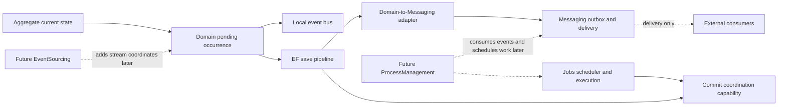
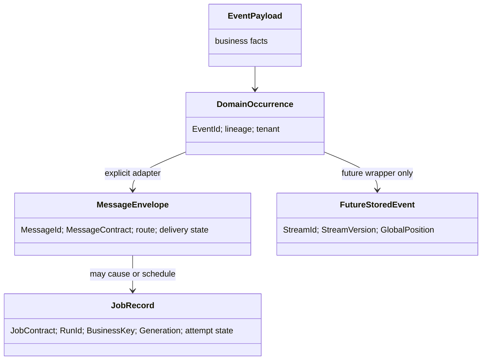
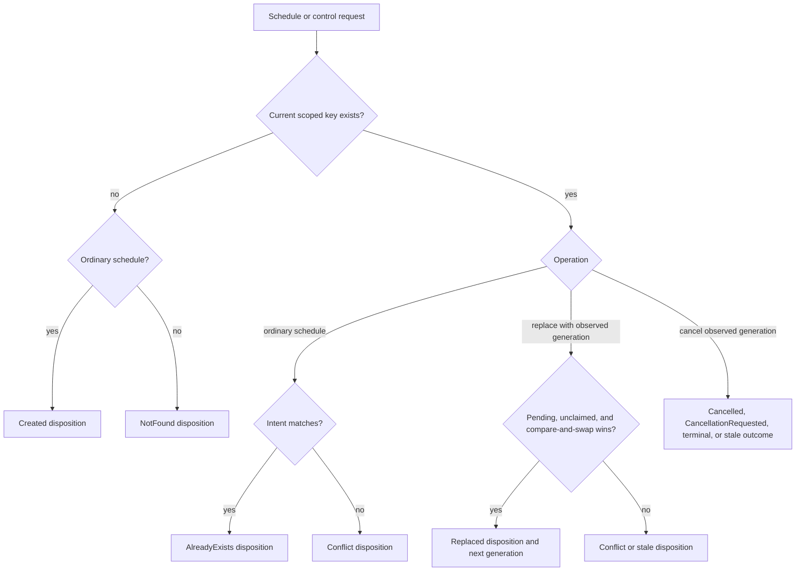
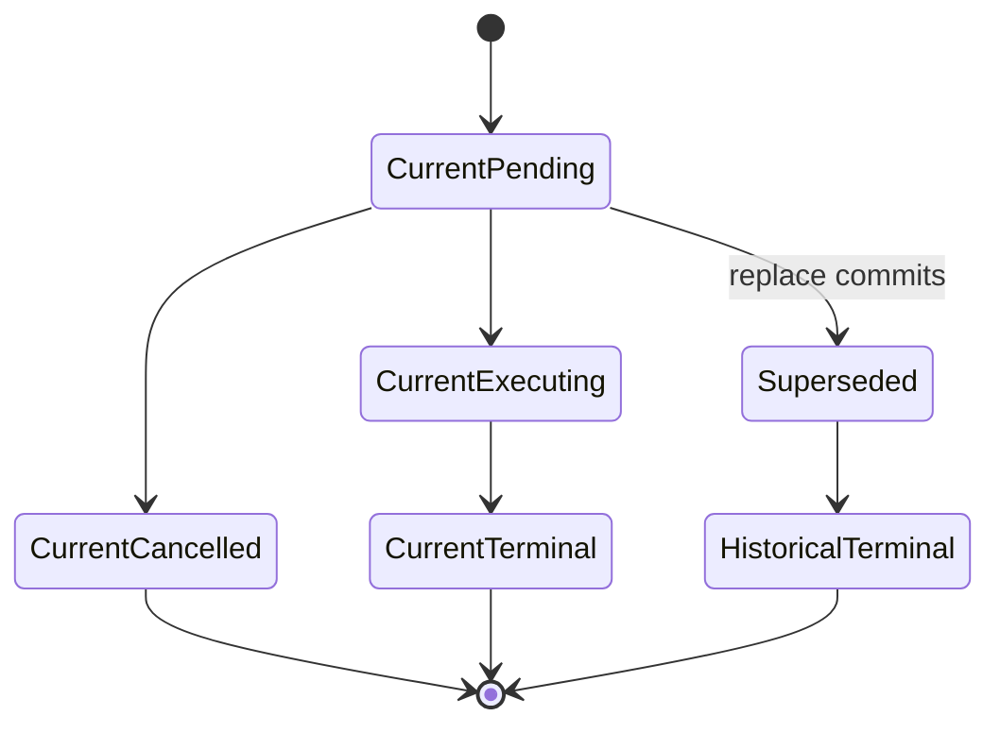
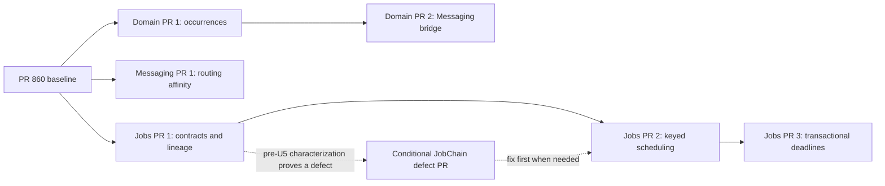

# Event-Sourcing-Compatible Foundation - Stacked Refactor Plan

## Goal Capsule

Refactor Domain, Domain-to-Messaging, Messaging, Jobs, and JobChain into a clean state-based foundation that is valuable now and can later host event sourcing without reusing the wrong identities or state machines.

**Review status:** the user approved both remaining recommendations: retain business keys after completion (KD6) and recover from a known outer rollback through a fresh unit of work (KD7). Requirements, technical decisions, diagrams, and unit scenarios now reflect those choices; implementation readiness is restored. This approval settles the plan only; no implementation work is authorized or performed by this review.

The plan records the intended implementation scope and sequencing. Current repository source and provider behavior are authoritative for implementation details. PR #860 is the required Messaging baseline, but its live head, review state, and relationship to `main` must be rechecked before execution. If implementation would require an event store, replay, projection, snapshot, upcaster, event-sourced aggregate, expected stream version, or process-manager runtime, stop: that is a scope change, not an implementation detail.

The proposed delivery is six planned PRs across three independently releasable stacks, plus one conditional JobChain defect PR. Each PR must compile, document its public transition, pass its focused tests, and improve the state-based framework independently. Documentation and provider proof travel with the PR that changes the contract; there is no late cleanup PR and no lane waits for unrelated lanes to ship.

---

## Product Contract

### Summary

Headless needs durable identities and explicit metadata boundaries before event sourcing can be added safely. The immediate product is not event sourcing. It is a simpler current-state framework in which event payloads contain business facts, occurrence metadata belongs to Domain, delivery metadata belongs to Messaging, and scheduling/execution metadata belongs to Jobs.

### Problem Frame

Today, Domain event payloads must implement `UniqueId`, while the EF integration-event bridge republishes only the payload and lets Messaging create a different message identity. Business correlation is also conflated with `Activity` tracing. PR #860 corrects the Messaging side by adding explicit message contract versions, causation, consumer identity, inbox generations, and provider capabilities, but Domain and Jobs do not yet share the same clean semantic distinctions.

Jobs already has durable logical function names and mature provider/recovery machinery. It lacks schema versioning, durable business-key control, and consistent lineage. JobChain already implements a bounded conditional tree with extensive lease fencing; its remaining work is to make that boundary and any demonstrated recovery gaps explicit rather than evolve it into a workflow or saga engine.

### Key Decisions

- **KD1 - Compatibility, not event sourcing** *(session-settled: user-directed — chosen over implementing event sourcing now: the requested value is a correct foundation for both state-based and future event-sourced applications).* Governs R1-R3 and R18.
- **KD2 - Separate subsystem ownership** *(session-settled: user-directed — chosen over a universal envelope/runtime: delivery, time, history, and process state have different guarantees).* Governs R4-R7.
- **KD3 - Build on PR #860** *(session-settled: user-directed — chosen over parallel Messaging abstractions: #860 already establishes the required delivery metadata and inbox foundation).* Governs R8-R11.
- **KD4 - Correct misleading public contracts cleanly** *(session-settled: user-approved — chosen over compatibility shims: this greenfield framework should not preserve payload-owned infrastructure identity or ambiguous control results).* Governs R12-R17.
- **KD5 - Keep JobChain bounded and static** *(session-settled: user-directed — chosen over expanding it into a saga/workflow: long-lived business state belongs to a future process-manager subsystem).* Governs R16-R17.
- **KD6 - Reserve business keys indefinitely** *(session-settled: user-approved — chosen over reusable keys or a separate compact ledger: retaining keyed rows is the smallest durable memory of completed scheduling intent).* Governs R14-R15. Current and historical keyed rows survive terminal execution and cleanup; storage growth is an accepted trade-off. A new business occurrence uses a new key.
- **KD7 - Fresh unit of work after a known outer rollback** *(session-settled: user-approved — chosen over transaction-lifetime occurrence recovery: preserve the existing SaveChanges completion boundary and keep command recovery application-owned).* Governs R3 and R18. Discard the rolled-back context and aggregate graph, then reload and replay through application idempotency.

### Requirements

- **R1 - Present-day value.** Every PR must improve state-based applications without requiring or exposing future event-sourcing services.
- **R2 - Payload purity.** `IDomainEvent` and `IIntegrationEvent` are business-payload markers; application event types do not implement occurrence identity, delivery, retry, stream, or checkpoint fields.
- **R3 - Stable occurrence identity.** Domain allocates one immutable event occurrence ID when an aggregate raises a fact and preserves it while the same captured occurrence passes through collection, local dispatch, EF execution-strategy retry, outbox persistence, and publication. A derived business fact receives its own occurrence ID and references its parent through causation. Re-executing an entire application command is not occurrence retry; command idempotency and recovery from an unknown commit outcome are separate concerns. A successful save inside a caller-owned transaction clears its exact saved batch without claiming physical commit. After a known outer rollback, discard the context and aggregate graph and reload through a fresh unit of work; resaving the old graph is unsupported recovery (KD7).
- **R4 - Domain owns occurrence semantics.** Domain owns its event occurrence envelope, identity, and lineage snapshot; it remains independent of durable message contracts, Messaging, Jobs, persistence, and commit coordination.
- **R5 - Messaging owns delivery.** Message identity, routes, inbox/outbox, retries, leases, broker metadata, and delivery attempts remain Messaging concerns.
- **R6 - Jobs owns time and execution.** Durable schedules, deadlines, leases, retries, runs, attempts, and cancellation remain Jobs concerns; transport delay is not the canonical business scheduler.
- **R7 - Future subsystems remain distinct.** Event streams, append concurrency, replay, projections, checkpoints, rebuild generations, and long-running process state have no current API or storage placeholder.
- **R8 - PR #860 is the stack base.** Follow-up branches start only after #860 is updated against `main`, its review blockers are resolved, and its final contract is revalidated.
- **R9 - Stable durable contracts.** Messaging integration messages and Jobs functions use their subsystem-owned operator-stable names plus string schema versions, independent of CLR namespaces, assembly versions, handler names, consumer identities, and replay generations. Local-only Domain occurrences have no durable contract registry in this foundation.
- **R10 - Truthful lineage.** Root correlation, immediate causation, tenant identity, and W3C trace context are distinct. Domain snapshots business lineage and tenant at the emission boundary, not later at EF drain. A root occurrence defaults correlation to its own ID; a child preserves root correlation and points causation to its immediate parent.
- **R11 - Optional keyed routing.** Messaging offers one provider-neutral routing-affinity key that survives direct and durable paths. It promises provider routing affinity for a configured topology, not FIFO, nonconcurrent handling, or unchanged partition placement after topology changes. Declared route requirements fail at startup when locally unsupported; dynamic keyed requests are checked again before durable insertion or transport effects.
- **R12 - Versioned Jobs contracts.** The existing durable job function name gains schema versioning through generation, registration, persistence, deserialization validation, execution context, diagnostics, and dashboards. Existing rows are version `"1"`.
- **R13 - Explicit Jobs identities.** Job contract, persisted row/run ID, business key, schedule generation, lease/attempt identity, retry count, inbox generation, and future stream position remain separate values.
- **R14 - Idempotent keyed time-job scheduling.** A tenant/system-scoped business key atomically distinguishes created, existing-same-intent, conflicting-intent, replaced, and not-found outcomes for standalone one-shot time jobs across in-memory, PostgreSQL, and SQL Server providers. Recurring definitions and JobChain retain their existing identity semantics.
- **R15 - Durable keyed time-job control.** Cancel can target the current standalone time-job generation across restarts. Replace and reschedule can advance only a pending, unclaimed current generation; once work is claimed, the request conflicts and the caller must cancel cooperatively before scheduling separate replacement work. Cancel and replacement carry the observed generation; a stale attempt, retried control request, or superseded generation cannot control later work. Existing update, delete, retry, and dashboard paths must not bypass keyed invariants. Reserve the scoped key indefinitely by retaining all current and historical keyed rows, including terminal rows. Direct hard deletion rejects before effects; cleanup excludes those rows. No expiry, key reuse, implicit reset, or forget-key operation is provided (KD6).
- **R16 - Transactional deadlines are capability-gated.** Application state and a Jobs schedule are atomic only when Jobs persistence can enlist in the existing commit boundary. Required-atomic scheduling rejects missing or incompatible coordination before the scheduler produces effects; callers must let that rejection roll back any application writes already staged in their transaction.
- **R17 - JobChain stays a continuation tree.** `Then`/`Catch`, bounded depth, and durable parent/child gating remain; the stack adds truthful naming/docs and fixes runtime behavior only when a current-source conformance scenario proves a defect.
- **R18 - No inflated guarantees.** Inbox/outbox guarantees are limited to once-only committed handler effects inside a supported local transaction and the configured deduplication retention/generation boundary; delivery and external side effects remain at-least-once and require idempotency. An outbox without a compatible inbox does not deduplicate incoming business work.
- **R19 - Providers prove the contract.** New persistence or transport semantics ship with shared conformance fixtures and official-provider bindings; unsupported behavior is declared and rejected, never silently degraded.
- **R20 - Migration is explicit.** Breaking source migrations, consumer-owned relational schema changes, rolling-version restrictions, and operational quiescence are documented in the PR that introduces them. Headless supplies mappings, validation, and representative integration fixtures; it does not mutate application schemas automatically.

### Acceptance Examples

- **AE1 (R2-R4).** An application event containing only business fields is raised twice. The buffer holds two distinct occurrence IDs, and neither payload implements or exposes an ID member.
- **AE2 (R3/R10).** Message M causes Domain occurrence D, whose handler raises integration occurrence I. Correlation remains rooted at M; D has causation M and I has causation D. The outbox preserves I as its MessageId. Two distinct integration children I1/I2 have distinct IDs that remain stable on persistence retry. Forwarding the same captured integration occurrence preserves identity; deriving another fact does not reuse its parent ID. Trace changes affect none of these business identities.
- **AE3 (R3/R18).** Within one pipeline-owned save invocation, a transient EF execution-strategy retry reuses the captured occurrence IDs and a persistence retry after local dispatch has completed does not repeat that completed dispatch phase. If local dispatch itself fails, handlers must remain replay-safe; this foundation adds no per-handler checkpoint. Commit persists the business/outbox rows together; rollback produces no committed outbox publication. Local handlers have already run and may not perform rollback-unsafe external effects. Successful SaveChanges inside a caller-owned transaction clears only its saved occurrence batch and is not commit. Repeated successful saves capture each new batch once. A known outer rollback leaves neither business nor outbox rows committed; recovery discards the context and graph and reloads in a fresh unit of work. Application-command replay can create new occurrence IDs and must use its own stable business idempotency key. An unknown commit result is not reported as a known rollback.
- **AE4 (R9).** Renaming a CLR integration-message or job type while keeping the subsystem's explicit durable registration produces the same name/version. Duplicate registrations fail at startup before persistence; local-only Domain occurrences remain identified by occurrence metadata, not a second contract registry.
- **AE5 (R11).** A routing-affinity key survives direct publication and durable outbox dispatch. An unsupported declared route fails during startup. A keyed runtime override to an unsupported or unverifiable destination fails before persistence/transport I/O; an unkeyed route behaves as before.
- **AE6 (R12).** A persisted legacy job executes as contract version `"1"`; an unsupported stored version is rejected before request deserialization and is visible in diagnostics.
- **AE7 (R14/R15).** Concurrent schedules for one scoped business key produce exactly one new generation. Equal intent converges on it and different intent conflicts. Replace advances a pending, unclaimed generation exactly once; replace against claimed work conflicts; a stale attempt cannot mutate later work. After terminal execution, cleanup and restart preserve the key: identical scheduling observes the terminal result without executing again. Direct deletion of any keyed generation rejects; a mixed keyed/unkeyed delete batch rejects atomically. Cleanup still removes eligible unkeyed rows. A new business occurrence uses a different key.
- **AE8 (R16).** A supported relational application transaction commits or rolls back its business row and deadline together. An incompatible provider combination rejects required-atomic scheduling before scheduler effects; the caller rolls back any application writes already staged in its transaction.
- **AE9 (R17).** A JobChain success enables `Then` and skips `Catch`; failure does the inverse; cancellation follows the documented existing rule. Crash and lease-loss scenarios never justify adding saga/process state.
- **AE10 (R1/R7).** Public API and architecture checks find no stream ID/version, expected-version append, event store, replay, projection/checkpoint, snapshot, upcaster, or process-manager surface in the changed packages.

### Success Criteria

- State-based consumers have cleaner event payloads, deterministic cross-boundary identity, versioned job contracts, and durable idempotent scheduling.
- PR #860 remains the single Messaging source of truth for contract version, causation, inbox generations, and capability declarations.
- In-memory and both relational providers agree on keyed scheduling, generation fencing, and transactional capability behavior.
- All new public contracts have migration guidance and package/LLM documentation in the same PR.
- The final dependency graph preserves the four independent progress domains: Messaging delivery, Jobs execution/time, future event history/projections, and future process-manager state.

### Scope Boundaries

#### In Scope

- Domain occurrence envelopes, emission context, local-dispatch metadata, and EF collection changes.
- Domain-to-Messaging identity and lineage mapping through the existing transactional outbox and PR #860's existing Messaging contract authority.
- One neutral Messaging routing-affinity key and explicit provider support declarations.
- Jobs contract versioning, lineage, business-key scheduling/control, transactional-deadline capability, and required migrations.
- JobChain boundary documentation, migration guidance, and evidence-backed corrections only.
- Provider conformance, observability, dashboards, READMEs, `docs/llms/*`, and architectural dependency tests required by each change.

#### Explicit Non-Goals

- Event stores, stream append/read APIs, aggregate rehydration, expected stream versions, snapshots, upcasters, subscriptions, replay, projections, checkpoints, rebuild generations, and event-history retention. Existing inbox retention and indefinite keyed-job row retention remain relevant to this foundation.
- Sagas, process managers, workflow DSLs, dynamic joins/waits/signals, compensations, or mutable long-running business state.
- A universal envelope, a universal generation/version field, a generic Unit of Work, or a broad `Core`/`Extensions`/commit-coordination rewrite.
- Exactly-once delivery or exactly-once external side effects.

#### Deferred to Follow-Up Work

- Actual `Headless.EventSourcing.*` requirements and runtime.
- Projection lifecycle, replay safety, rebuild/cutover, and process-manager persistence.
- Event/job upcasting and the pending-row lifecycle policy for the first real non-v1 contract, after persisted schemas actually require conversion.
- Stronger ordering contracts beyond provider routing affinity.

### Dependencies

- [PR #848](https://github.com/xshaheen/headless-framework/pull/848) was verified merged on 2026-09-05; merge commit `56d73e04bc11f2383d60f10a2b3913406f7d41f2`.
- [PR #860](https://github.com/xshaheen/headless-framework/pull/860) was verified open at `31773aab8790b3b375ea95b52ac215ea14e24b9f` on 2026-09-05. Build/pack, both dashboard builds, and the Tus demo build succeeded; package-push jobs were skipped. It remains `BEHIND` and `REVIEW_REQUIRED`. These observations do not satisfy R8 or authorize execution.
- Source review used worktree HEAD `58127966061ae4a0372175884d60fe0820dc1950`, plus the locally available #860 commit for Messaging options. The plan itself is untracked in that worktree; it is not part of either commit.
- PostgreSQL and SQL Server integration environments are required because those suites are not fully represented by unit tests or in-memory behavior.

### Sources and Research

Official documentation was rechecked on 2026-09-05. Version labels below identify the documentation inspected, not a claim about the latest release. These are design comparisons, not dependency recommendations or proof that Headless implements the same guarantees.

| Framework / evidence | Transferable lesson | Headless decision and limit |
| --- | --- | --- |
| Axon Framework 5.0: [message anatomy](https://docs.axoniq.io/axon-framework-reference/5.0/messaging-concepts/anatomy-message/), [correlation](https://docs.axoniq.io/axon-framework-reference/5.0/messaging-concepts/message-correlation/) | Message type/version, occurrence identity, root correlation, and immediate causation are distinct. Representation conversion can preserve the same occurrence. Axon 5 changed the older correlation terminology. | Use the semantic distinctions in U1/U2/U4. Keep Domain free of a durable contract registry; do not copy Axon's buses, conversion infrastructure, event store, or aggregate runtime. A derived fact is not representation conversion. |
| Marten documentation labeled v9.x: [metadata](https://martendb.io/events/metadata.html), [event versioning](https://martendb.io/events/versioning) | Payloads and event metadata have separate representations; stored type names can be mapped independently of CLR names. Durable schema evolution needs explicit handling. | Use occurrence wrappers and explicit durable names. Deliberately do not copy the documented OpenTelemetry-derived correlation/causation default: Headless business lineage must survive tracing changes. Defer upcasting, not stored-version validation. |
| Wolverine: [EF inbox/outbox](https://wolverinefx.net/guide/durability/efcore/outbox-and-inbox), [partitioned messaging](https://wolverinefx.net/guide/messaging/partitioning) | Atomicity follows the actual database transaction. Local partitioning, external routing, and cluster-wide serialization have different mechanisms and costs. | U6 extends the existing enlisted writer; it does not invent buffering. U3 provides routing affinity only. Cluster ownership, exclusive listeners, and sequential execution remain outside this slice. |
| NServiceBus: [outbox](https://docs.particular.net/nservicebus/outbox/) | Deduplication depends on stable incoming message identity, transactional persistence, and retained deduplication records. After retention expires a retry can be processed again. | Qualify R18 by transaction, identity, generation, and retention. Do not use a transport/outbox promise as evidence of permanent business-key idempotency; KD6 establishes retained business-key identity separately. |
| MassTransit current docs: [outbox](https://masstransit.massient.com/concepts/outbox), [outbox configuration](https://masstransit.massient.com/configuration/middleware/outbox) | In-memory buffering, transactional bus outbox, and consumer inbox/outbox solve different failure windows. Duplicate detection has an explicit window. | Preserve durable capture before post-commit delivery and test crash boundaries. Do not infer atomic external effects or durable input deduplication from an in-memory buffer. |
| Eventuous: [serialization](https://eventuous.dev/dotnet/persistence/serialisation/), [checkpoints](https://eventuous.dev/dotnet/subscriptions/checkpoint/) | Explicit event type mapping avoids coupling stored names to CLR names. Subscription checkpoints represent read progress; periodic checkpointing requires idempotent processing. | Keep contract version, delivery generation, and future projection progress separate. Do not introduce checkpoint or subscription APIs into the foundation, or generalize checkpointing into an exactly-once side-effect guarantee. |
| Commanded v1.4.11: [event handlers](https://commanded.hexdocs.pm/Commanded.Event.Handler.html), [process managers](https://commanded.hexdocs.pm/Commanded.ProcessManagers.ProcessManager.html) | Process managers have business state and react to events with commands. Waiting for strongly consistent handlers does not create one transaction spanning all handlers. | Keep JobChain static. A waiting/continuation API must not imply process-state ownership or cross-subsystem atomicity. The old v0.15.1 citation is superseded by this versioned documentation. |

The recommendation is to adopt explicit identity and failure boundaries while keeping each subsystem's execution model. More shared infrastructure would make the present foundation harder to reason about without supplying event-sourcing guarantees.

#### Repository findings that changed this draft

Paths are relative to the reviewed source snapshot at the HEAD recorded above. The original worktree subsequently disappeared; this document was recovered into the current repository from the verified review copy (SHA-256 `c15fffbf228f0c7ec4c741b9c45a5cc351bb286f6c4eb375400001dd1cb734d0`) before recording KD6/KD7. Source findings remain observations of that reviewed snapshot and must be revalidated against the implementation baseline.

- `src/Headless.EntityFramework/Contexts/Runtime/HeadlessSaveChangesPipeline.cs:210-220,329-334,471-479`: caller-owned SaveChanges skips physical commit but still clears emitter buffers. KD7 preserves this boundary and requires fresh-unit-of-work recovery after a known outer rollback.
- `src/Headless.EntityFramework/Contexts/Processors/HeadlessMessageCollectorSaveEntryProcessor.cs:36-52` and the save pipeline's local-dispatch loop: collection includes only initially nonempty emitters, and dispatch enumerates their lists. Nested emissions require a defined drain lifecycle, not merely a new envelope type.
- `src/Headless.Jobs.EntityFramework/Infrastructure/BasePersistenceProvider.cs:2561-2579` and `src/Headless.Jobs.Core/Provider/JobsInMemoryPersistenceProvider.cs:2824-2836`: cron occurrence payloads come from the mutable parent. U4 must snapshot payload bytes with name/version.
- `src/Headless.Jobs.EntityFramework/Infrastructure/JobsEFCorePersistenceProvider.cs:260-275,328-331`: generic update/delete can bypass new keyed intent and lifetime rules. U5 must cover these existing entry points.
- `src/Headless.Jobs.Core/Managers/JobsManager.cs:178-203` and `src/Headless.Jobs.Abstractions/Interfaces/ICoordinatedJobWriter.cs`: automatic transaction-enlisted writes already exist; only notification/acceleration is deferred. U6 must preserve that default.

Review coverage: coherence, feasibility, adversarial, product, scope, and security lenses, reconciled against source and primary documentation. Separate agent passes used the same model family; no independent cross-provider model review or runtime validation is claimed.

### Confirmed Decisions for Execution

**Business-key lifetime (KD6, approved).** Reserve the key indefinitely, including after completion, cancellation, or supersession. Retain current and historical keyed identity-bearing rows; reject direct hard deletion, including an entire mixed delete batch before any deletion, and exclude keyed rows from automatic cleanup. A same-key/same-intent request observes the current record, including its terminal result; it never rearms it. A new business occurrence uses a new key. This deliberately accepts growing storage. A compact ledger that permits execution-history cleanup is deferred until that requirement exists and receives its own design; no expiry or reusable-key policy is hidden in this foundation. Key reservation prevents repeat scheduling under that key, not repeated external effects from delivery or execution retries.

**Outer-transaction rollback (KD7, approved).** Preserve the existing successful SaveChanges boundary: clear only that save's captured batch, even when the caller owns the physical transaction. Pipeline-owned persistence retries within the same save reuse their captured occurrences. After a known outer rollback, discard the context and aggregate graph, create a fresh unit of work, reload durable state, and replay the application operation through its own idempotency boundary. No transaction-lifetime event recovery batches or automatic restoration of EF accepted state are added. A replay can emit new occurrence IDs, so an application business key intended to survive command retries must not depend on those regenerated IDs. An unknown commit outcome requires outcome verification or durable application idempotency; it is not evidence of rollback.

Both decisions are recorded consistently below. The plan is implementation-ready subject to its existing PR #860 baseline and per-unit prerequisites; readiness does not waive those checks or authorize implementation in this planning session.

---

## Planning Contract

### Key Technical Decisions

- **KTD1 - Domain captures an immutable emission snapshot through an async-flow-local scope.** Aggregate buffering wraps a pure payload immediately, allocates the occurrence ID once, and reads a Domain-owned, nestable emission scope synchronously at the raising seam. Messaging, Jobs, or application adapters may establish a scope, but entities receive no injected service. Scope disposal is strict LIFO and restores the parent across exceptions; parallel async flows are isolated. Infrastructure can preserve an existing occurrence. Payload-only publication always creates a new occurrence ID, inherits an active emission scope, and becomes a correlation root only when no parent exists. Local handler dispatch establishes the current occurrence as the parent for nested emissions. The unit-of-work drain preserves an existing snapshot and never restamps it. EF-generated entity lifecycle events are new occurrences raised during save processing; their emission boundary is that processing step, not an earlier aggregate mutation. Occurrence metadata is immutable; producers must also treat payload objects as immutable after raising them, without introducing generic deep-copy infrastructure. Covers R2-R4 and R10.
- **KTD2 - Messaging remains the sole current durable integration-contract authority.** Domain owns local occurrence identity and lineage only. When an integration occurrence crosses the EF bridge, the bridge resolves the payload through PR #860's existing Messaging contract registration and maps the occurrence metadata into publish options; it does not create or reconcile a Domain contract registry. A future EventSourcing subsystem may define stored-event contracts independently when that work is actually designed. Covers R4, R5, R8, and R9.
- **KTD3 - Business lineage is not tracing.** The Domain emission scope propagates root correlation and immediate causation. `Activity` remains diagnostic trace context and is not a fallback durable business ID. A missing scope creates a root occurrence with `CorrelationId = EventId`, `CausationId = null`, and no tenant. A nested emission preserves root correlation and uses its immediate parent occurrence as causation. Covers R10.
- **KTD4 - Keyed Messaging means affinity, not FIFO.** The neutral key is optional, durable, and provider mapped. Frozen route declarations state whether affinity is required and how the configured destination supports it; unsupported declarations fail before processors/clients start. Per-publication overrides are revalidated before durable insertion or transport effects. A keyed dynamic destination with no verified configuration mapping is rejected. Local declaration checks are not remote broker-topology verification, which requires separate provider I/O. Typed/raw affinity settings must agree or the request is rejected. Ordering, head-of-line blocking, and redelivery order remain provider behavior unless a later contract explicitly strengthens them. Covers R11 and R19.
- **KTD5 - Jobs extends and snapshots its existing function identity.** The generated durable function name remains the contract name and gains a bounded string schema version. Every executable row, including a materialized cron occurrence, snapshots an immutable execution tuple: logical name, schema version, and the exact serialized payload bytes. It never reads execution payload or identity through a later-mutated parent definition. The same tuple must survive pickup, retries, node-death recovery, and diagnostics. Comparison, length, and canonicalization rules are identical across providers. Version is validated before payload deserialization and remains distinct from run/attempt/generation. Covers R12-R13.
- **KTD6 - Business-key identity excludes version and intent fingerprints are versioned.** The durable key scope is tenant/system scope plus job contract name plus caller business key. Fingerprint algorithm `v1` hashes the exact validated durable payload bytes plus a normalized, ordered encoding of contract version, due time, retry policy, and node-death policy. Tenant selects the key scope and is not repeated as intent. Presentation text and trace context do not affect intent. Byte equality is intentional, not semantic JSON equality: callers must use stable serialization and reuse the same absolute due instant on retries. Normalize that instant once to a provider-common precision before both hashing and storage; do not recompute now-plus-delay or reserialize stored payloads to compare them. Apply behavior-changing schedule policies before fingerprinting the final persisted intent. Existing rows are always evaluated with their recorded fingerprint algorithm; changing the algorithm requires explicit migration or replacement and never silently reinterprets stored intent. Under KD6, the current and all historical keyed rows remain indefinitely, even when terminal. Direct deletion rejects atomically and cleanup excludes them; no compact ledger, expiration, or key reuse is introduced. Covers R13-R15.
- **KTD7 - Replacement is compare-and-swap generation-fenced and pending-only.** Replace/reschedule supplies the observed current generation or a durable operation identity and advances at most once only when the current generation is pending and unclaimed. Claimed or executing work returns an explicit conflict; the caller may request cooperative cancellation and then schedule separate work. Cancel targets the observed current generation with a conditional write. Cancellation of claimed work reports a request, not proof that execution or external effects stopped; terminal work remains terminal. Repeating a stale cancellation cannot cancel a replacement generation. Old attempts cannot write terminal/control state into a later generation. Covers R14-R15 and follows the repository's storage-authoritative conditional-update pattern.
- **KTD8 - Transactional scheduling is an explicit caller-selected capability tier.** Scheduling options state whether atomic enlistment with application state is required. The default preserves existing automatic routing: enlist writes in a compatible ambient relational transaction; otherwise keep the existing direct path and existing misconfiguration failures. A required-atomic request rejects missing/incompatible coordination and extends the existing Jobs-owned coordinated-writer seam where application state and Jobs storage share a compatible relational boundary. Rows are written in that transaction; only notification and dispatch acceleration are deferred. Results before commit describe enlisted intent, not durable success. This is not distributed transaction support and does not make Messaging delay a deadline store. Covers R6 and R16.
- **KTD9 - Keep `JobChain`; sharpen its meaning and exclude keyed control.** Preserve the public name and describe it everywhere as a static conditional continuation tree. Characterize current root/subtree leasing, timed-descendant gates, cancellation, and reclaim behavior before changing runtime or schema. Keyed scheduling/control remains explicitly unsupported for JobChain in this foundation because safe replacement would require whole-tree generation fencing. Covers R17.
- **KTD10 - Schema rollout is consumer-owned and not mixed-binary compatible.** Headless provides bounded EF mappings, runtime validation for new writes, migration guidance, and representative PostgreSQL/SQL Server migration fixtures. Each consuming application owns and applies its generated migration: backfill legacy contract versions to `"1"` and materialized cron payloads from the available parent while workers and definition writers are quiesced. Historical payloads already overwritten in a parent cannot be reconstructed: report that limitation rather than claim the migration restores the original execution intent. Enforce nonblank values without a masking permanent default, and keep legacy rows wholly unkeyed while new keyed rows carry all metadata or none. New uniqueness and generation semantics require worker quiescence and prohibit mixed old/new binaries. Downgrade after non-v1 or keyed writes is unsupported; preflight detects incompatible data and operational recovery is roll-forward. Covers R12-R16 and R20.
- **KTD11 - Save completion and physical commit remain distinct.** In a pipeline-owned save, retain the exact captured occurrences across persistence retries and clear the saved batch on success. In a caller-owned transaction, successful SaveChanges clears that save's batch before outer commit; each later save handles only newly captured occurrences. A known outer rollback requires disposal of the context and abandonment of its aggregate graph, followed by fresh-unit-of-work application recovery. Do not restore accepted EF tracking state or retain transaction-lifetime occurrence batches. Unknown commit outcomes require separate durable outcome verification/idempotency. Covers R3 and R18; implements KD7.

### High-Level Technical Design

These diagrams express ownership and required behavior, not final type names or signatures.

#### Component ownership



#### Occurrence and commit sequence

This sequence covers a pipeline-owned transaction. Only an internal persistence retry reuses the captured save batch. A final failed save is not an instruction to replay the command on the same context. Caller-owned transactions follow the separate KD7 sequence below; successful SaveChanges alone is not physical commit.

```mermaid
sequenceDiagram
    participant App
    participant Aggregate
    participant EF
    participant LocalBus
    participant Bridge
    participant Outbox

    App->>Aggregate: Execute behavior
    Aggregate->>Aggregate: Capture payload and allocate EventId once
    App->>EF: SaveChanges
    EF->>LocalBus: Dispatch pending domain occurrences
    LocalBus-->>EF: Ordered handlers complete
    EF->>EF: Save business and audit state
    EF->>Bridge: Map integration occurrences
    Bridge->>Outbox: Resolve Messaging contract; preserve EventId, lineage, tenant
    alt commit
        EF->>Outbox: Commit coordinated rows
        EF->>Aggregate: Clear buffers
    else internal persistence retry
        EF-->>Aggregate: Reuse captured occurrences for this save
    end
```

#### Caller-owned transaction and recovery

```mermaid
sequenceDiagram
    participant App
    participant Context as DbContext and aggregate graph
    participant DB as Outer transaction
    App->>DB: Begin transaction
    App->>Context: Mutate and SaveChanges
    Context->>DB: Stage business and outbox rows
    Context->>Context: Clear exactly the saved occurrence batch
    opt More application changes
        App->>Context: Mutate and SaveChanges again
        Context->>DB: Stage next batch once
        Context->>Context: Clear exactly the next saved batch
    end
    alt Confirmed commit
        App->>DB: Commit all staged rows
    else Known rollback
        App->>DB: Roll back all staged rows
        App->>Context: Dispose context and abandon aggregate graph
        Note over App: Reload in a fresh unit of work; replay through application idempotency
    end
```

An ambiguous commit acknowledgement is outside the known-rollback branch. Verify durable outcome or use application idempotency before replaying. Occurrence IDs may change on command replay; use a stable application key when scheduling must deduplicate that replay.

#### Semantic records stay separate



#### Keyed schedule decision flow



#### Keyed time-job generation lifecycle

Execution reaching a terminal state does not release its key or delete its row. Under KD6, current and historical keyed rows remain reserved indefinitely; the final markers below mean execution has ended, not that retained identity disappears.



### Stacked PR Strategy



The program has three independently releasable stacks/milestones: Domain (`U1 → U2`), Messaging (`U3`), and Jobs (`U4 → U5 → U6`). `U7` exists only if pre-U5 JobChain characterization proves a current runtime defect. If needed, deliver the focused fix before U5 final validation; otherwise omit it. Never ship a failing required suite or disable the reproducer to retain the nominal sequence. Terminology, negative-scope tests, and keyed-control rejection ship in U5. The stacks share semantics and optional final composition evidence, not branch or release dependencies. U2 and U3 both build on PR #860; U4 builds on #860 only to reuse settled lineage vocabulary. Use the installed, source-owned `gh stack` workflow for local tracking and submission rather than hand-rolled branch/PR choreography. PR descriptions must state their base PR and which requirement/acceptance IDs they close.

### Implementation Constraints

- Preserve the existing EF ordering: local events before business save; integration dispatch after business/audit save and before commit; buffers clear only after the successful lifecycle.
- Preserve sync/async `SaveChanges` parity and KD7: successful caller-owned saves clear their exact batches; a known outer rollback requires a fresh context and graph. Save success does not claim physical commit.
- Treat persisted/transported payload bytes as untrusted; validate logical name/version before deserialization and use the existing buffer-first serializer seam.
- Use `DateTimeOffset` for new public/persisted instants. Store clock owns lease and shared scheduling decisions; application `TimeProvider` supplies observational timestamps; human schedules keep explicit timezone rules.
- Conditional provider transitions are atomic. A rejected write is a meaningful outcome that callers must honor; check-then-write is not acceptable.
- Persisted logical identities are bounded, nonblank, never silently truncated, and compared with provider-invariant canonical semantics.
- Static provider/route capabilities are immutable declarations checked before startup side effects. Dynamic request and live transaction compatibility are checked at the operation boundary before scheduling middleware, writes, or transport effects; remote topology proof is a distinct integration check.
- Public/SPI breaks update API-compatibility baselines and migration notes in the same PR.
- Each provider-affecting PR runs the in-memory suite plus live PostgreSQL and SQL Server coverage at its final head.

### Resolved During Planning

- Contract versions are strings within the durable subsystem that owns them: Messaging for integration messages and Jobs for job functions. Domain has no durable contract registry in this foundation.
- Event identity and the current business-lineage/tenant snapshot are captured at raise through a Domain-owned nestable async-flow-local scope; unit-of-work drain performs no lineage or Domain-contract lookup.
- A missing business parent roots correlation at the new occurrence ID; `Activity.Current.Id` is not used as business correlation.
- Messaging keyed routing promises affinity only. Strict per-key ordering is deferred.
- JobKey scope excludes schema version; version participates in intent and therefore conflicts until explicit replacement.
- JobChain keeps its current name and runtime unless current-source tests expose a real defect.

### Risks and Mitigations

- **Public break breadth:** Removing `UniqueId` and changing event buffer/handler context affects custom implementations. Keep PR 1 atomic across Domain, LocalEventBus, EF, API baselines, tests, and migration docs.
- **Ambient context leakage:** A malformed emission scope could leak lineage across nested operations or parallel requests. Enforce strict LIFO disposal, restore parent state on exceptions, and test parallel async flows, nested emissions, and post-disposal isolation.
- **Identity regeneration under retry:** EF retry or direct/local adapter paths could wrap twice. Provide one preservation path for infrastructure and test retry, nested emission, rollback, and direct publication explicitly.
- **Provider overclaim:** Broker partition/session/FIFO mechanisms differ. Declare capability per route and test either correct mapping or deterministic rejection; never document global ordering.
- **Persistent Jobs migration:** Uniqueness constraints and generation fencing can race mixed binaries, nullable tenant scopes, or partial metadata. Consumers quiesce workers, preflight legacy values, apply their generated migration/backfill, validate provider-specific constraints, deploy one version, and resume only after the all-or-none invariants pass. Downgrade after v2/keyed writes is unsupported; recovery is roll-forward.
- **Intent fingerprint drift:** Serializer or option changes could alter equality unexpectedly. Persist the fingerprint algorithm, base `v1` on exact durable payload bytes plus normalized ordered intent fields, evaluate existing rows with their recorded algorithm, and require explicit migration or replacement for future algorithms.
- **Concurrent replacement replay:** A lost response could cause a retry to advance two generations. Require expected-generation or operation-identity compare-and-swap semantics and prove replay/concurrent replacement advances at most once.
- **Keyed JobChain ambiguity:** Root-only generation fencing could let old descendants escape after replacement. Keyed `JobChain` scheduling/control remains unsupported throughout this foundation; whole-tree generation semantics require a separate future requirements process. Ordinary unkeyed chains remain unchanged.
- **JobChain scope creep:** “Workflow” terminology invites signals, joins, and process state. Enforce terminology in docs and architecture tests, and require a separate requirements process for process managers.

---

## Implementation Units

### U1. Domain stack PR 1 - Pure Domain events and stable pending occurrences

**Goal:** Replace payload-owned `UniqueId` with Domain-owned pending occurrences and a safe emission-context carrier while preserving current aggregate, local-dispatch, and EF save behavior.

**Requirements:** R1-R4, R10, R18, R20; AE1-AE3 and AE10; KTD1, KTD3, and KTD11.

**Dependencies:** PR #860 final contract revalidated for compatible version/lineage vocabulary; this PR remains Domain/Messaging independent.

**Files:**

- `src/Headless.Domain/Messages/Local/IDomainEvent.cs`
- `src/Headless.Domain/Messages/Distributed/IIntegrationEvent.cs`
- `src/Headless.Domain/Domain/IAggregateRoot.cs`
- `src/Headless.Domain/Messages/Local/IDomainEventEmitter.cs`
- `src/Headless.Domain/Messages/Distributed/IIntegrationEventEmitter.cs`
- `src/Headless.Domain/Events/EventOccurrence.cs` *(new)*
- `src/Headless.Domain/Events/EventEmissionContext.cs` *(new)*
- `src/Headless.Domain/Events/EventEmissionScope.cs` *(new)*
- `src/Headless.Domain/Events/EntityEventData.cs`
- `src/Headless.Domain/Messages/Local/ILocalEventBus.cs`
- `src/Headless.Domain/Messages/Local/IDomainEventHandler.cs`
- `src/Headless.Domain.LocalEventBus/ServiceProviderLocalEventBus.cs`
- `src/Headless.EntityFramework/Contexts/Messaging/EmitterMessages.cs`
- `src/Headless.EntityFramework/Contexts/Processors/HeadlessMessageCollectorSaveEntryProcessor.cs`
- `src/Headless.EntityFramework/Contexts/Processors/HeadlessLocalEventSaveEntryProcessor.cs`
- `src/Headless.EntityFramework/Contexts/Runtime/HeadlessSaveChangesPipeline.cs`
- `src/Headless.Domain/README.md`
- `src/Headless.Domain.LocalEventBus/README.md`
- `src/Headless.EntityFramework/README.md`
- `docs/llms/core.md`
- `docs/llms/orm.md`

**Approach:** Make the event interfaces pure markers and introduce a minimal Domain-owned occurrence record; aggregate/emitter buffers hold occurrences, not payloads. A nestable async-flow-local scope carries only root correlation, immediate causation, and tenant. Allocate `EventId` and snapshot that scope once at raise; no service is injected into entities and no ambient state is read at EF drain. Scope disposal uses strict LIFO restoration, including exceptional exits, and parallel async flows remain isolated. Preserve an occurrence explicitly supplied by infrastructure; payload-only local publication creates a new occurrence with the active parent, or a root when no scope exists. Keep exact-runtime local handler dispatch and current ordering; handlers receive payload plus read-only occurrence context without delivery semantics. Update the public API review and give custom bus/emitter/handler implementers a direct migration table.

**Drain lifecycle:** Use explicit captured batches and a processed-occurrence cursor rather than enumerating a mutable emitter list. Handler-generated Domain occurrences join subsequent ordered drain passes before business save; re-collect newly populated and newly tracked emitters. Collect integration occurrences after local dispatch reaches quiescence so a previously empty buffer is included. Do not regenerate EF lifecycle events on each drain pass. Bound recursive emission with a documented finite limit and a failure that rolls back the save. Clear only the occurrences successfully handed off for that save; later additions remain pending. Keep the same captured objects across an owned execution-strategy retry. Successful caller-owned SaveChanges completes only its saved batch before physical commit. A later outer rollback requires disposal of the context and abandonment of the graph; this pipeline does not restore their prior state (KD7/KTD11).

**Test Scenarios:**

- `tests/Headless.Domain.Tests.Unit/Events/EntityEventDataTests.cs`: generated lifecycle payloads contain business data only, while two captures create distinct stable occurrence IDs.
- Add `tests/Headless.Domain.Tests.Unit/Events/EventEmissionScopeTests.cs`: parallel async flows are isolated; nested scopes restore their parent; exception/disposal cannot leak lineage; missing scope produces root defaults.
- `tests/Headless.Domain.LocalEventBus.Tests.Unit/ServiceProviderLocalEventBusTests.cs`: payload-only publish creates one occurrence; infrastructure dispatch preserves an existing occurrence; ordered exact-runtime handlers observe the same metadata; nested publication snapshots root correlation and immediate causation at emission.
- `tests/Headless.EntityFramework.Tests.Integration/HeadlessDbContextRuntimeExtensibilityTests.cs`: custom collectors/processors compile against and preserve the new occurrence boundary.
- `tests/Headless.EntityFramework.Tests.Harness/Tests/HeadlessDbContextSaveChangesTestBase.cs`: sync/async saves preserve ordering, nested emissions, cancellation, rollback, buffer clearing, and a single `EventId` across a transient execution-strategy retry.
- Add nested-drain cases: a local handler fills an initially empty integration buffer, appends a Domain occurrence to the same aggregate, and tracks a new emitter; verify ordered completion without collection invalidation, repeated lifecycle synthesis, or lost occurrences. Verify finite failure for recursive emission and preservation of occurrences added after batch capture.
- Add sync/async caller-owned transaction scenarios: successful SaveChanges clears its exact batch; two successful saves dispatch only their new occurrences and commit their business rows together. A known outer rollback leaves neither batch committed; dispose the old context, abandon the old graph, and reload using a fresh unit of work. Verify command replay can produce new occurrence IDs; document application-owned idempotency without adding a Jobs dependency. U2 extends these scenarios to coordinated outbox rows. Do not claim automatic restoration or supported recovery by resaving the old graph.
- API compatibility tests: removal of `UniqueId` and custom implementation changes match the documented clean-break surface; no stream/history members appear.

**Verification:** Domain, LocalEventBus, and EF focused test projects pass together; package dependency inspection confirms Domain has no Messaging, Jobs, persistence, or commit-coordination dependency.

### U2. Domain stack PR 2 - Truthful Domain-to-Messaging outbox mapping

**Goal:** Publish integration occurrences through PR #860 without losing identity, business lineage, tenant, or transactional guarantees, while keeping Messaging as the sole durable integration-contract authority.

**Requirements:** R1, R3-R5, R8-R10, R18-R20; AE2-AE4; KTD2, KTD3, and KTD11.

**Dependencies:** U1 (including KD7/KTD11) and the final landed PR #860 contract.

**Files:**

- `src/Headless.EntityFramework/Contexts/Messaging/IHeadlessOutboxDispatcher.cs`
- `src/Headless.EntityFramework.Messaging/OutboxIntegrationEventDispatcher.cs`
- `src/Headless.EntityFramework.Messaging/IntegrationEventPublishInvokerCache.cs`
- `src/Headless.EntityFramework.Messaging/README.md`
- `docs/llms/messaging.md`
- `docs/llms/orm.md`

**Approach:** Widen the dispatcher boundary from payloads to integration occurrences. Resolve the payload through PR #860's existing Messaging registration, then create per-occurrence durable publish options mapping `EventId` to `MessageId` and Domain lineage/tenant to Messaging fields. Do not introduce a Domain contract registry or a second startup agreement mechanism. This bridge forwards already captured integration occurrences; it is not a general Domain-to-integration transformation registry. Application handlers that derive integration facts capture each child once with a new ID and the immediate Domain parent as causation. Retain the existing commit coordinator and fail-loud caller-managed transaction behavior; do not add a generic Unit of Work or change at-least-once dispatch semantics.

**Test Scenarios:**

- `tests/Headless.EntityFramework.Messaging.Tests.Unit/OutboxIntegrationEventDispatcherTests.cs`: every occurrence field is preserved, the caller occurrence ID becomes the message ID, and Messaging's existing contract resolver remains authoritative.
- `tests/Headless.EntityFramework.Messaging.Tests.Integration/OutboxBridgeIntegrationTests.cs`: business row and outbox row commit together, rollback leaves neither committed effect, and an internal persistence retry reuses one message identity. Extend the U1 sync/async caller-owned scenarios to two successful saves in one transaction: each occurrence maps once, outer commit persists both batches, and known outer rollback leaves no committed business/outbox rows. Recover with a fresh context and graph; command replay may allocate new occurrence IDs.
- The integration bridge test emits a derived event from a consumed PR #860 message and proves stable root correlation, direct causation, tenant propagation, and independent trace IDs.
- A caller-managed transaction without enlistment still fails before non-atomic dispatch; an enlisted transaction succeeds.

**Verification:** EF Messaging unit/integration tests pass against the final #860 API, and stored outbox evidence proves `IntegrationOccurrence.EventId == MessageId` without duplicate rows for retries of the same captured batch. Distinct derived facts must not collapse under deduplication.

### U3. Messaging stack PR 1 - Provider-neutral routing affinity

**Goal:** Let applications express one optional logical routing-affinity key consistently across direct and durable delivery without claiming a stronger ordering guarantee.

**Requirements:** R1, R5, R8, R11, R18-R20; AE5; KTD4.

**Dependencies:** Final PR #860 capability model; independent of U1/U2.

**Files:**

- `src/Headless.Messaging.Abstractions/MessageOptions.cs`
- `src/Headless.Messaging.Abstractions/TransportMessage.cs`
- `src/Headless.Messaging.Core/Internal/IMessagePublishRequestFactory.cs`
- `src/Headless.Messaging.Core/Messages/MediumMessage.cs`
- `src/Headless.Messaging.Core/Configuration/MessagingProviderCapabilities.cs`
- `src/Headless.Messaging.Core/MessagingProviderCapabilityServiceCollectionExtensions.cs`
- `src/Headless.Messaging.Storage.InMemory/InMemoryDataStorage.cs`
- `src/Headless.Messaging.Storage.PostgreSql/PostgreSqlDataStorage.cs`
- `src/Headless.Messaging.Storage.SqlServer/SqlServerDataStorage.cs`
- `src/Headless.Messaging.AzureServiceBus/AzureServiceBusMessagingHeaders.cs`
- `src/Headless.Messaging.Aws/AmazonSqsQueueTransport.cs`
- `src/Headless.Messaging.Aws/Setup.cs`
- `src/Headless.Messaging.AzureServiceBus/Setup.cs`
- `src/Headless.Messaging.Kafka/Setup.cs`
- `src/Headless.Messaging.Nats/Setup.cs`
- `src/Headless.Messaging.Pulsar/Setup.cs`
- `src/Headless.Messaging.RabbitMq/Setup.cs`
- `src/Headless.Messaging.Redis/Setup.cs`
- `tests/Headless.Messaging.Aws.Tests.Integration/AwsProviderConformanceDriver.cs`
- `tests/Headless.Messaging.AzureServiceBus.Tests.Integration/AzureServiceBusProviderConformanceDriver.cs`
- `tests/Headless.Messaging.Kafka.Tests.Integration/KafkaProviderConformanceDriver.cs`
- `tests/Headless.Messaging.Nats.Tests.Integration/NatsProviderConformanceDriver.cs`
- `tests/Headless.Messaging.Pulsar.Tests.Integration/PulsarProviderConformanceDriver.cs`
- `tests/Headless.Messaging.RabbitMq.Tests.Integration/RabbitMqProviderConformanceDriver.cs`
- `tests/Headless.Messaging.Redis.Tests.Integration/RedisProviderConformanceDriver.cs`
- `docs/solutions/guides/messaging-transport-provider-guide.md`
- `docs/llms/messaging.md`

**Approach:** Add one typed optional affinity field to the neutral outbound/durable/transport shapes. Extend the frozen capability model so routes requesting affinity are validated before startup side effects. Declare route affinity requirements in registration and repeat validation for runtime overrides. Map supported transports to their native partition/session/FIFO-group mechanism; providers without a truthful mapping declare unsupported. Preserve raw provider-specific hooks only as adapters; typed and raw keys must match when both are supplied. Record per provider: supported destination kind, native field, key bounds/encoding, required configuration, and what is actually guaranteed. No transparent sharding layer or exclusive-consumer topology is added. A shared partition may serialize different keys, so different keys are not promised independent lanes.

**Test Scenarios:**

- `tests/Headless.Messaging.Core.Tests.Unit/MediumMessageTests.cs`: key presence/absence survives durable serialization and does not alter unkeyed behavior.
- `tests/Headless.Messaging.Core.Tests.Harness/MessagingIntegrationTestsBase.cs`: direct and outbox paths deliver the same key to consumers/providers; redelivery preserves it.
- `tests/Headless.Messaging.Core.Tests.Harness/Capabilities/TransportConformanceManifest.cs`: each official transport proves mapping or deterministic unsupported rejection; a requested unsupported route fails before processors start.
- `tests/Headless.Messaging.Aws.Tests.Unit/AmazonSqsQueueTransportTests.cs` and provider-specific Azure Service Bus/Kafka/NATS/RabbitMQ suites: typed affinity maps to the native feature where supported, matching typed/raw values reconcile, and conflicting values fail before effects.
- Conformance covers stable mapping and retry preservation within the configured topology. Do not assert total FIFO, nonconcurrent same-key handling, distinct-key partition uniqueness, or unchanged placement after topology changes. Test unsupported dynamic route overrides before persistence.

**Verification:** Core unit/harness suites plus all official transport conformance bindings pass; storage round trips retain the key; provider docs state affinity rather than global ordering.

### U4. Jobs stack PR 1 - Versioned contracts and causal execution context

**Goal:** Extend Jobs' existing durable function identity with schema version and business lineage before business keys depend on it.

**Requirements:** R1, R6-R7, R9-R10, R12-R13, R19-R20; AE4 and AE6; KTD5 and KTD10.

**Dependencies:** Final PR #860 terminology only; no Domain/Messaging code dependency.

**Files:**

- `src/Headless.Jobs.Abstractions/Base/JobFunctionAttribute.cs`
- `src/Headless.Jobs.Abstractions/Base/JobFunctionDescriptor.cs`
- `src/Headless.Jobs.Abstractions/Entities/BaseEntity/BaseJobEntity.cs`
- `src/Headless.Jobs.Abstractions/Entities/TimeJobEntity.cs`
- `src/Headless.Jobs.Abstractions/Entities/CronJobEntity.cs`
- `src/Headless.Jobs.Abstractions/Entities/CronJobOccurrenceEntity.cs`
- `src/Headless.Jobs.Abstractions/Base/JobFunctionContext.cs`
- `src/Headless.Jobs.Abstractions/Models/EnqueueOptions.cs`
- `src/Headless.Jobs.Abstractions/Models/RecurringJobOptions.cs`
- `src/Headless.Jobs.Core/JobFunctionProvider.cs`
- `src/Headless.Jobs.Core/Managers/CronJobOccurrenceFactory.cs`
- `src/Headless.Jobs.Core/Provider/JobsInMemoryPersistenceProvider.cs`
- `src/Headless.Jobs.EntityFramework/Infrastructure/BasePersistenceProvider.cs`
- `src/Headless.Jobs.Core/JobScheduler.cs`
- `src/Headless.Jobs.SourceGenerator/JobsIncrementalSourceGenerator.cs`
- `src/Headless.Jobs.EntityFramework/Configurations/TimeJobConfigurations.cs`
- `src/Headless.Jobs.EntityFramework/Configurations/CronJobConfigurations.cs`
- `src/Headless.Jobs.EntityFramework/Configurations/CronJobOccurrenceConfigurations.cs`
- `docs/llms/jobs.md`

**Approach:** Thread a bounded string contract version from attribute/source generation through frozen descriptors, every executable persisted row, scheduler options, execution state/context, telemetry, and dashboards. Snapshot name/version plus exact request bytes onto materialized cron occurrences; update creation, payload loaders, and every pickup/recovery projection so later definition edits cannot change pending execution intent even when the version stays the same. Define one nonblank, no-truncation, provider-invariant comparison contract before U5 builds indexes. Propagate root correlation/direct causation/tenant using Jobs-owned option/context fields, not Messaging types. Validate stored version before request deserialization. Supply EF mappings, runtime write validation, migration guidance, and representative provider fixtures; each consuming application generates and owns the migration that backfills legacy rows to `"1"` before enforcing new-writer intent. Do not add an upcaster or automatic schema mutation.

**Test Scenarios:**

- `tests/Headless.Jobs.SourceGenerator.Tests.Unit/JobsIncrementalSourceGeneratorTests.cs` and descriptor snapshots: stable name/version generation is deterministic across source/reference order and CLR renames with unchanged explicit contract.
- `tests/Headless.Jobs.Composition.Tests.Unit/JobFunctionDescriptorTests.cs`: duplicate names/versions and ambiguous mappings fail deterministically before execution.
- `tests/Headless.Jobs.Composition.Tests.Unit/JobSchedulerTests.cs`: lineage defaults and parent propagation are correct; trace context does not become business correlation.
- Add representative PostgreSQL and SQL Server migration fixtures: old rows backfill to `"1"`, new writers must provide a nonblank version, oversized legacy values abort rather than truncate, preflight detects non-v1 data, and the documented rollback is roll-forward.
- The same provider tests inspect column bounds/comparison behavior and prove case-variant contract keys have the same identity result on PostgreSQL and SQL Server.
- Cron occurrence tests materialize a v1 occurrence, update its parent definition to v2, and prove the pending occurrence retains v1 and is rejected before deserialization when v1 is unavailable.
- Dashboard/telemetry tests display contract and lineage without conflating retry count, attempt identity, or generation.

- Materialize a cron occurrence, change its parent name/version/payload (also test a payload-only edit), restart the provider, and prove execution reads the original immutable tuple. Migration evidence distinguishes the available backfill from unrecoverable historical payloads.

**Verification:** Generator snapshots, Jobs composition tests, migration tests, and both relational integration suites pass at one final head.

### U5. Jobs stack PR 2 - Tenant-scoped idempotent scheduling and durable keyed control

**Goal:** Add atomic business-key schedule/cancel/replace/reschedule semantics for standalone one-shot time jobs that survive restart and fence superseded generations.

**Requirements:** R1, R6-R7, R13-R15, R17-R20; AE7, AE9, and AE10; KTD6, KTD7, KTD9, and KTD10.

**Dependencies:** U4 and pre-U5 JobChain characterization (with U7 completed first if a defect is found).

**Files:**

- `src/Headless.Jobs.Abstractions/Interfaces/IJobScheduler.cs`
- `src/Headless.Jobs.Abstractions/Interfaces/IJobPersistenceProvider.cs`
- `src/Headless.Jobs.Abstractions/Models/EnqueueOptions.cs`
- `src/Headless.Jobs.Abstractions/Models/JobKey.cs` *(new)*
- `src/Headless.Jobs.Abstractions/Models/JobScheduleDisposition.cs` *(new)*
- `src/Headless.Jobs.Abstractions/Models/JobScheduleResult.cs` *(new)*
- `src/Headless.Jobs.Abstractions/Entities/TimeJobEntity.cs`
- `src/Headless.Jobs.Core/JobScheduler.cs`
- `src/Headless.Jobs.Core/JobIntentFingerprint.cs` *(new)*
- `src/Headless.Jobs.Core/Managers/JobsManager.cs`
- `src/Headless.Jobs.Core/Provider/JobsInMemoryPersistenceProvider.cs`
- `src/Headless.Jobs.EntityFramework/Infrastructure/BasePersistenceProvider.cs`
- `src/Headless.Jobs.EntityFramework/Infrastructure/JobsEFCorePersistenceProvider.cs`
- `src/Headless.Jobs.EntityFramework/Configurations/TimeJobConfigurations.cs`
- `src/Headless.Jobs.Abstractions/README.md`
- `src/Headless.Jobs.Core/README.md`
- `CONCEPTS.md`
- `docs/llms/jobs.md`
- `tests/Headless.Jobs.Composition.Tests.Unit/Chains/JobChainTests.cs`
- `tests/Headless.Jobs.Composition.Tests.Unit/JobExecutionTaskHandlerTests.cs`
- `tests/Headless.Jobs.EntityFramework.Tests.Harness/JobsChainConformanceTests.cs`

**Approach:** Introduce a typed normalized scope/business key and explicit result/disposition model. Persist the key, canonical intent fingerprint plus fingerprint-algorithm version, positive generation, and a current-generation marker independent of execution status. Fingerprint `v1` hashes the exact validated durable serialized payload bytes plus a normalized ordered encoding of contract version, due time, retry policy, and node-death policy; tenant selects the key scope and does not also participate in intent. Evaluate an existing row with its recorded algorithm. Enforce all-or-none keyed metadata and two invariants: one row per scoped key/generation and one current generation per scoped key, including null/system scope. Implement atomic insert-or-observe and compare-and-swap current-generation control operations. Same key/same intent returns the current record; different intent conflicts. Explicit replace against an observed generation advances at most once only while the row is pending and unclaimed; claimed/executing work returns conflict and cannot be superseded. Keep keyed JobChain scheduling/control unsupported, and ship its precise diagnostic, continuation-tree terminology, negative-scope tests, and architecture guards here. Replace legacy `DateTime` scheduling inputs in the new keyed surface with `DateTimeOffset` rather than silently normalizing local/unspecified values. Apply KTD6 normalization before hashing and persist the exact validated result.

**Existing entry points:** Inventory generic manager/provider updates, dashboard edits, retries, resets, deletion, and cleanup. Presentation-only changes may preserve keyed metadata; intent changes or state resets must use the keyed transition or reject. Never allow an ordinary update DTO to clear key/fingerprint/generation fields. Enforce KD6 on every entry point: direct hard deletion rejects any keyed row, current or historical; a mixed delete batch rejects atomically before deleting any member. Automatic cleanup excludes keyed rows while continuing its existing policy for eligible unkeyed rows. Retain the full keyed rows indefinitely; do not introduce a compact ledger in this foundation. No implicit forget-key or terminal rearm operation is added.

**Control outcomes:** Return the observed generation, run ID, and execution state separately from the operation disposition. Same-intent scheduling of a terminal current key observes that terminal result; it does not execute it again. Pending cancellation prevents pickup if its conditional write wins; claimed cancellation reports a cooperative request. Replacement, cancellation, and claim races must have one storage-authoritative winner. A replay after a lost response may report stale/current state, but must never advance another generation or cancel it.

**Test Scenarios:**

- `tests/Headless.Jobs.Composition.Tests.Unit/JobSchedulerTests.cs`: created/existing/conflict/replaced/not-found outcomes are unambiguous; presentation/trace changes do not change intent; version, due time, payload bytes, retry policy, and node-death policy do. A tenant change selects an independent key scope rather than changing intent within one scope.
- Add `tests/Headless.Jobs.EntityFramework.Tests.Harness/JobsKeyedSchedulingConformanceTests.cs`: racing identical schedules create one current row; racing different intents create one row plus deterministic conflicts; cancel and replace survive provider restart.
- `tests/Headless.Jobs.EntityFramework.PostgreSql.Tests.Integration/PostgreSqlConformanceTests.cs` and `tests/Headless.Jobs.EntityFramework.SqlServer.Tests.Integration/SqlServerConformanceTests.cs`: filtered uniqueness and atomic disposition agree under contention.
- Generation-fence tests replace pending/unclaimed generation N concurrently, replay after a lost response, and prove exactly one N+1 row is created. A claimed or executing generation returns conflict; cooperative cancel followed by a separately scheduled job remains explicit rather than masquerading as atomic replacement.
- Provider scenarios cover null/system scope, two tenants sharing a business key, terminal current rows retaining the key, and historical generation uniqueness.
- Consumer-migration fixtures prove legacy rows remain wholly unkeyed, partial keyed metadata is rejected, and preflight detects data that makes downgrade unsafe. Scheduler/API tests prove keyed JobChain schedule, replace, and cancel fail before persistence while ordinary unkeyed chains remain unchanged.
- Fingerprint tests freeze the `v1` byte-level canonical vectors, preserve row-recorded algorithm interpretation, and reject an unknown algorithm without rehashing under current defaults. Include nonzero UTC offsets, sub-microsecond due times, repeated absolute instants, and schedule middleware changes; provider round trips must not alter equality.
- Exercise existing manager/dashboard update, reset/retry, delete, and cleanup paths against a keyed row. They cannot mutate intent behind its fingerprint, clear identity, repeat terminal work, or erase retained key/generation history. Prove direct keyed deletion and mixed delete batches reject before effects; cleanup retains current and historical keyed rows while removing eligible unkeyed rows. After restart, same-key/same-intent scheduling still observes the terminal result without another execution. Test control-response loss followed by a newer generation and a delayed cancellation retry.
- JobChain characterization covers whole-subtree leasing, success/failure frontier gates, timed descendants, cancellation, reclaim after crashes, and competing-node claims. Documentation/API checks describe a static conditional continuation tree and reject signals, joins, waits, compensation, mutable definitions, process state, and stream coordinates.

**Verification:** In-memory, PostgreSQL, and SQL Server execute the same shared scenario matrix, including contention and restart; schema/index inspection confirms provider-appropriate filtered uniqueness.

### U6. Jobs stack PR 3 - Capability-gated transactional deadlines

**Goal:** Add a required-atomic assertion to existing coordinated scheduling and extend it to keyed deadlines, preserving today's automatic enlistment behavior.

**Requirements:** R1, R6, R16, R18-R20; AE8; KTD8 and KTD10.

**Dependencies:** U5; reuse existing automatic coordinated routing.

**Files:**

- `src/Headless.Jobs.Abstractions/Interfaces/IJobScheduler.cs`
- `src/Headless.Jobs.Abstractions/Interfaces/IJobPersistenceProvider.cs`
- `src/Headless.Jobs.Abstractions/Models/EnqueueOptions.cs`
- `src/Headless.Jobs.Core/JobScheduler.cs`
- `src/Headless.Jobs.Core/Managers/JobsManager.CommitCoordination.cs`
- `src/Headless.Jobs.Abstractions/Interfaces/ICoordinatedJobWriter.cs`
- `src/Headless.Jobs.EntityFramework/Infrastructure/JobsEFCorePersistenceProvider.cs`
- `tests/Headless.Jobs.Composition.Tests.Unit/Transactions/JobsManagerCoordinatedRoutingTests.cs`
- `tests/Headless.Jobs.EntityFramework.Tests.Harness/JobsCoordinationConformanceTests.cs`
- `docs/solutions/architecture-patterns/coordination-domains-boundary.md`
- `docs/llms/jobs.md`

**Approach:** Add a required-atomic scheduling option while preserving existing automatic routing: a compatible ambient relational transaction enlists the write; the existing direct path remains when coordination is absent. Consume the existing relational commit-context capability without changing generic commit-coordination contracts or durable buffers. Validate the actual live connection, database, and transaction identity—not only provider family—before scheduler middleware or writes. Extend the existing Jobs-owned coordinated writer to perform keyed insert-or-observe and conditional transitions within the caller transaction; defer only post-commit acceleration/notification. Expose dispositions as provisional until the outer commit; rollback discards their durable effect. Use store time for shared scheduling decisions. Treat durable rows as authoritative when post-commit acceleration/notification fails. Preserve existing automatic routing when atomicity is not explicitly required; a required request never falls back to two independent writes. If characterization proves a missing generic primitive, stop and re-scope rather than widening commit coordination inside this PR.

**Test Scenarios:**

- `tests/Headless.Jobs.Composition.Tests.Unit/Transactions/JobsManagerCoordinatedRoutingTests.cs`: default scheduling still enlists in a compatible ambient transaction and otherwise retains the existing direct path. Required-atomic scheduling writes inside the caller transaction, commits or rolls back with it, and rejects absent/mismatched coordination before scheduling effects. Only post-commit notifications are deferred.
- `tests/Headless.Jobs.EntityFramework.Tests.Harness/JobsCoordinationConformanceTests.cs`: business row and keyed deadline appear together after commit and neither appears after rollback on PostgreSQL and SQL Server.
- Retry coverage proves one business-key generation is observed across an EF execution-strategy retry rather than scheduling duplicates.
- The conformance matrix injects failure before the Jobs write, after the Jobs write, during commit, on disposal without commit, and after commit notification; it proves atomic absence/presence and post-commit recoverability.
- Provider conflict handling leaves the caller transaction usable according to its documented isolation/transaction contract; a poisoned transaction cannot be reported as recoverable.
- Deliberate node/store clock skew proves due-time eligibility and lease ownership use the documented time authority.
- A transport delay test demonstrates that Messaging delay neither satisfies nor silently substitutes for the Jobs transactional capability.

**Verification:** Commit-coordination unit tests and live relational conformance pass; registration diagnostics enumerate the exact missing/incompatible capability.

### U7. Conditional Jobs defect PR - JobChain recovery correction

**Goal:** Correct a JobChain runtime recovery defect only if U5 characterization proves one. This PR does not exist when characterization passes.

**Requirements:** R1, R6-R7, R13, R17, R19-R20; AE9-AE10; KTD9.

**Dependencies:** Pre-U5 characterization has a reproducible failing current-source scenario. If needed, this fix precedes U5 final verification; U5/U6 are not prerequisites.

**Files:**

- `src/Headless.Jobs.Core/JobsExecutionTaskHandler.cs`
- `tests/Headless.Jobs.Composition.Tests.Unit/Chains/JobChainTests.cs`
- `tests/Headless.Jobs.Composition.Tests.Unit/JobExecutionTaskHandlerTests.cs`
- `tests/Headless.Jobs.EntityFramework.Tests.Harness/JobsChainConformanceTests.cs`

**Approach:** Carry forward the smallest reproducible failing scenario from pre-U5 characterization of whole-subtree leasing, frontier fencing, timed-descendant reconciliation, cancellation, and reclaim. Keep the `JobChain` name, `Then`/`Catch` surface, schema, and keyed-control rejection. Correct only the proven crash/lease boundary with a provider-atomic transition and caller early exit. Terminology, negative-scope tests, and subsystem architecture assertions are not deferred to this unit; they ship in U5 after this correction, if needed.

**Test Scenarios:**

- `tests/Headless.Jobs.Composition.Tests.Unit/Chains/JobChainTests.cs`: bounded shape, one success/failure child, immutability, and terminology remain aligned with the public model.
- `tests/Headless.Jobs.Composition.Tests.Unit/JobExecutionTaskHandlerTests.cs`: parent terminalization, failed reconcile, cancellation, and lease-loss paths either execute/skip descendants once or leave them durably reclaimable under existing rules.
- `tests/Headless.Jobs.EntityFramework.Tests.Harness/JobsChainConformanceTests.cs`: PostgreSQL and SQL Server agree at crashes before terminal write, after terminal write before descendant work, during descendant execution, and during competing-node claim; no node is stranded or double-active.

**Verification:** The original characterization fails before the patch and passes after it across in-memory and both relational providers, with no public or schema expansion. If pre-U5 characterization is green, record the evidence and omit U7.

---

## Verification Contract

### Per-PR Gates

- Build all changed projects and run their focused unit test projects.
- Run API compatibility checks for each public/SPI break and verify its migration note names every affected extension point.
- Run formatting/analyzers on the changed projects with zero new warnings.
- Run shared provider conformance whenever a neutral storage/transport contract changes; a provider-specific test alone is insufficient.
- Run PostgreSQL and SQL Server integration wrappers at the final head of U4-U6 and at U7 when that conditional PR exists. Record an unavailable environment as a blocker, not a pass.
- Verify README and `docs/llms/*` examples compile or are covered by the repository's documentation checks.

### Stack Integration Gates

- Run each independent stack's complete affected suites after rebasing that stack on current `main`; do not make one lane's release depend on an unrelated lane.
- After all three milestones are available, run the optional program-composition suite across Domain, LocalEventBus, EF, EF Messaging, Messaging Core/harness/providers, Jobs generator/composition, and Jobs relational providers.
- Exercise one end-to-end state-based flow: incoming message → aggregate mutation → local event → integration occurrence → coordinated outbox → consumer → keyed Jobs deadline. Verify identity, lineage, tenant, trace separation, commit/rollback, and retry behavior from stored/observed evidence.
- Run concurrency tests repeatedly for inbox fencing, keyed scheduling, replacement generation fencing, lease loss, and JobChain claim/recovery.
- Inspect public APIs and project references for the AE10 negative-scope terms; any introduced event-history or process-manager contract fails the plan.
- Review operational migrations on fresh and legacy PostgreSQL/SQL Server schemas, including worker quiescence and single-version rollout instructions.

### Required Evidence

- Exact test project results for every changed boundary.
- Live PostgreSQL and SQL Server provider results, not EF InMemory substitutes.
- Stored-row evidence for `EventId == MessageId`, legacy contract version `"1"`, keyed uniqueness, and generation fencing.
- Startup failure evidence for duplicate durable subsystem contracts and locally unsupported declared routing affinity.
- Operation-boundary rejection evidence for unsupported dynamic keyed destinations and incompatible live required-atomic scheduling, before the affected scheduler/publisher produces effects.
- A final per-stack dependency/status summary that distinguishes local green, hosted CI, review approval, base freshness, and mergeability.

---

## Definition of Done

- KD6/KD7 are reflected consistently in requirements, API documentation, diagrams, and provider scenarios; PR baseline checks still gate implementation.
- U1-U6 are delivered across the three declared independent stacks, with PR #860 revalidated and landed first; U7 is delivered before U5 final validation only when pre-U5 characterization proves a current JobChain runtime defect.
- Every PR is independently buildable, testable, reviewable, documented, and useful to current state-based applications.
- All R1-R20 requirements and AE1-AE10 examples are covered by implementation units and verified at their highest credible seam.
- Event payloads are pure; occurrence identity is allocated once per fact; the bridge preserves each integration occurrence while derived facts have distinct IDs; business lineage remains distinct from tracing. Nested drains, per-save batch completion, and KD7 fresh-unit-of-work recovery after a known outer rollback are verified.
- Messaging routing affinity is optional, durable, capability-gated, and documented without FIFO/global-order claims.
- Jobs executions snapshot name/version/payload together; keyed scheduling is atomic across every public entry point, cleanup retains every keyed generation indefinitely under KD6, control is generation-fenced, and required-atomic deadlines fail closed outside supported commit boundaries while automatic enlistment is preserved.
- JobChain remains a bounded static continuation tree and gains no process-manager or workflow-runtime behavior.
- Provider conformance passes for in-memory, PostgreSQL, SQL Server, and every affected official transport; unavailable live proof remains a blocker.
- Source/API/schema migration guidance is complete, consumer ownership of generated EF migrations is explicit, and no mixed-binary-safe rollout is claimed where KTD10 prohibits it.
- No event store, stream, replay, projection, checkpoint, snapshot, upcaster, event-sourced aggregate, or process-manager API exists in the resulting foundation.
- The final diff contains no abandoned experiments, duplicate abstractions, temporary compatibility layers, generated artifacts, or unrelated user changes.
