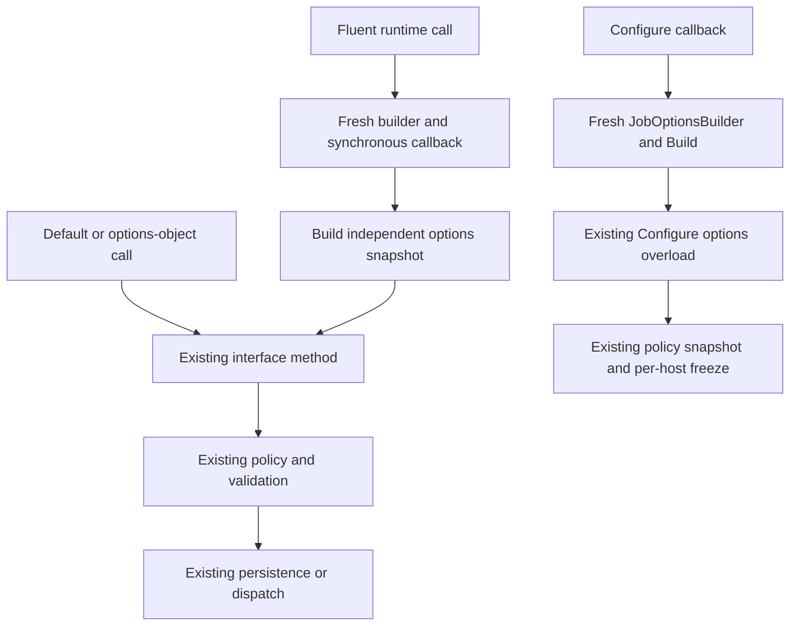

# Focused Fluent Options Builders - Plan

## Goal Capsule

Add focused `JobOptionsBuilder`, `PublishOptionsBuilder`, and `QueueOptionsBuilder` conveniences for configuration and ordinary runtime calls. Keep canonical options records and runtime policy owners intact.

- **Authority:** user scope and repository instructions, then this plan's Product Contract and Planning Contract. The public signatures below are proposed contracts, included at the user's request; they are not implemented APIs.
- **Baseline:** PR #863 head `4a88906163f4cc86b6e96f7e7e46c017a5edbd9d`, stacked on PR #860 head `31773aab8790b3b375ea95b52ac215ea14e24b9f`, verified on 2026-09-05. The planning checkout at `b006c1496c31c43af483c42a1dbb0abd469f6450` lacks these APIs. Implementation must start from the current successor of that stack and reconcile changes before editing.
- **Execution:** four bounded units, with consumer compilation as the first implementation proof. This planning task writes artifacts only; it does not authorize implementation, commits, pushes, or GitHub mutations.
- **Stop condition:** an upstream change invalidates the canonical records, policy ownership, or proposed overload shape. Do not rebuild those foundations within this convenience feature.
- **Tail ownership:** later implementation authorization controls landing and publication. No consumer migration, database preservation, backfill, downgrade, or old-binary compatibility work is required.

---

## Product Contract

### Summary

Provide fluent authoring of ordinary job and message options through small, separate builders. Runtime extensions build the existing records and invoke the existing options-object overloads. The Jobs subsystem builder also accepts callbacks for host and function policy configuration.

### Problem Frame

The DX stack already provides short default calls and init-only options records. Repeated object initializers are less convenient for header assembly and job policy setup. Making the records mutable or adding callback members to every runtime interface would expand implementation obligations for a call-site convenience.

### Requirements

**Call surfaces**

- R1. Preserve current default and options-object runtime calls, and add fluent callbacks for bus publish, queue enqueue, and typed/requestless Jobs enqueue, absolute schedule, and relative schedule.
- R2. Add callback overloads for `ConfigureDefaults`, `ConfigureJob<TRequest>`, and descriptor-based `ConfigureJob` on the existing subsystem builder.

**Behavior and ownership**

- R3. Builders MUST produce the canonical init-only records and delegate to the existing execution/configuration paths; they MUST NOT implement policy resolution, semantic validation, dispatch, clock calculations, or transaction logic.
- R4. Empty builders MUST retain record defaults and nullable inheritance; per-call configuration MUST NOT weaken inherited required atomic enlistment.
- R5. Mutable collection inputs, builder state, and each built result MUST be isolated snapshots. Sequential builder reuse is supported; concurrent mutation is unsupported.

**Consumer contract**

- R6. Builder names, namespaces, callback lifetime, null behavior, and overload outcomes MUST be documented and proven by representative consumer compilation and focused runtime tests.
- R7. Keep initial builder operations within each subsystem's existing options capabilities, with the field mapping and deferred surface defined below.

### Scope Boundaries

No new runtime-interface members, providers, packages, DI registrations, builder interfaces, universal builder, or options-record mutability changes. No storage schema, generated descriptor, retry engine, or CommitCoordination changes.

#### Deferred to Follow-Up Work

- Keyed scheduling/replacement/cancellation, recurring scheduling, and chain-node/chain-wide fluent expansion. Generic request overloads can still accept arbitrary payload types, including a `JobChain`; this is not a chain convenience and still follows existing typed-request validation.
- Messaging delivery-mode selection, contract/name/version overrides, routing affinity, callbacks, correlation sequence, and ambient-context suppression conveniences. Existing options objects remain available for these controls.
- Messaging retry/required-atomic settings: neither exists on `MessageOptions`. Durable message acceptance is not a new required-relational-enlistment assertion.
- Seed-from-options constructors, implicit conversions, asynchronous configuration callbacks, builder pooling, and public shared generic builder bases.

### Acceptance Examples

- AE1. **Covers R1, R3, R7.** A publish callback adds `source=checkout` and a correlation ID. The bus receives a `PublishOptions` snapshot on its existing options path with the original cancellation token.
- AE2. **Covers R2, R4.** Host policy sets retries to 3 and requires atomic enlistment. Function policy sets retries to 5. A per-call callback sets retries to 0; effective retries are 0 and atomic enlistment remains required.
- AE3. **Covers R4, R5.** A builder receives retry intervals `[2,5]`; its input and a previously built array are later mutated. Earlier snapshots and subsequent independent builds retain their captured values.
- AE4. **Covers R2, R3.** A configuration callback sets a correlation ID. Existing startup policy validation rejects it; the adapter does not drop the field or create a partial policy update.
- AE5. **Covers R1, R3.** A requestless relative schedule callback changes retries. The scheduler uses its injected clock and existing delay checks, and returns the same persisted identifier as its options-object path.

---

## Planning Contract

### Key Technical Decisions

- KTD1. **Thin runtime extensions, canonical records.** Implements R1/R3/R7. Use `Action<TBuilder>` adapters on the existing interfaces, without introducing a second dispatch route. (session-settled: user-approved — chosen over adding interface members or making records mutable: preserve implementations and existing policy ownership.)
- KTD2. **Distinct names and family discovery.** Implements R6. Keep the plural generic `JobsOptionsBuilder<TTimeJob,TCronJob>` for subsystem setup. Put the singular nongeneric `JobOptionsBuilder` and `JobSchedulerExtensions` in `Headless.Jobs`, following the existing root-namespace `JobChainBuilder` discovery pattern. Jobs callers import `Headless.Jobs` for fluent conveniences and `Headless.Jobs.Interfaces` for interface declarations; raw `JobOptions` stays in `Headless.Jobs.Models`. Messaging builders and extensions live in `Headless.Messaging`. Do not rename established types solely to avoid singular/plural similarity.
- KTD3. **Configuration uses instance overloads.** Implements R2/R6. Add three methods to the existing concrete subsystem builder. Conventional generic extension methods would require callers to supply entity type arguments alongside `TRequest`; C# 14 generic receiver extension blocks could avoid that but add unnecessary declaration complexity here. Instance overloads preserve `ConfigureJob<TRequest>(...)` directly. Accept the null/default source ambiguity documented in the matrix rather than adding compatibility shims.
- KTD4. **Reusable mutable authoring, independent snapshots.** Implements R5. Use sealed, publicly constructible builders with parameterless constructors and public `Build()`. This differs from `JobChainBuilder`'s single-use tree ownership. No DI lifetime, pooling, caching, or shared default builder instance.
- KTD5. **Guard adapter inputs; preserve semantic validation.** Implements R3/R6. Use `Headless.Checks` for null receiver, callback, header collection, and header key checks. Do not validate retry values, node-death enums, reserved headers, tenancy, or delay combinations in the builders. Existing runtime/configuration paths own those failures, including their exception types and messages.

Record-returning `With*` extensions were considered as a smaller overload surface. Builders are preferred here because the requested callback syntax provides one authoring scope and an explicit final snapshot boundary. This adds types and overloads; it does not replace direct record construction or `with` expressions for advanced calls.

### Proposed Public Surface

Declarations below are the exact proposed API inventory, not method implementations. All new public types and members receive XML documentation and repository-standard public API annotations. No new generic constraints are added to runtime request/message types.

**`Headless.Jobs.JobOptionsBuilder`**, a sealed class in `src/Headless.Jobs.Abstractions/JobOptionsBuilder.cs`:

```csharp
public JobOptionsBuilder();
public JobOptionsBuilder WithRetries(int? retries);
public JobOptionsBuilder WithRetryIntervals(params int[]? retryIntervals);
public JobOptionsBuilder WithNodeDeathPolicy(NodeDeathPolicy? policy);
public JobOptionsBuilder RequireAtomicEnlistment();
public JobOptionsBuilder WithCorrelationId(string? correlationId);
public JobOptionsBuilder WithCausationId(string? causationId);
public JobOptionsBuilder WithDescription(string? description);
public JobOptionsBuilder WithTenantId(string? tenantId);
public JobOptionsBuilder AsSystemJob();
public JobOptions Build();
```

`NodeDeathPolicy` remains `Headless.Jobs.Enums.NodeDeathPolicy`; the output is `Headless.Jobs.Models.JobOptions`. Retry intervals are integer seconds, matching the record. The fluent methods map directly to the corresponding record fields; `WithNodeDeathPolicy` maps to `OnNodeDeath`, and `AsSystemJob` maps to `IsSystemJob=true`. The two boolean operations only assert `true`; a fresh builder starts with `false`.

**`Headless.Messaging.PublishOptionsBuilder`**, a sealed class in `src/Headless.Messaging.Bus.Abstractions/PublishOptionsBuilder.cs`:

```csharp
public PublishOptionsBuilder();
public PublishOptionsBuilder WithHeader(string name, string? value);
public PublishOptionsBuilder WithHeaders(IEnumerable<KeyValuePair<string, string?>> headers);
public PublishOptionsBuilder WithCorrelationId(string? correlationId);
public PublishOptionsBuilder WithCausationId(string? causationId);
public PublishOptionsBuilder WithMessageId(string? messageId);
public PublishOptionsBuilder WithTenantId(string? tenantId);
public PublishOptionsBuilder WithDelay(TimeSpan? delay);
public PublishOptions Build();
```

**`Headless.Messaging.QueueOptionsBuilder`**, a sealed class in `src/Headless.Messaging.Queue.Abstractions/QueueOptionsBuilder.cs`:

```csharp
public QueueOptionsBuilder();
public QueueOptionsBuilder WithHeader(string name, string? value);
public QueueOptionsBuilder WithHeaders(IEnumerable<KeyValuePair<string, string?>> headers);
public QueueOptionsBuilder WithCorrelationId(string? correlationId);
public QueueOptionsBuilder WithCausationId(string? causationId);
public QueueOptionsBuilder WithMessageId(string? messageId);
public QueueOptionsBuilder WithTenantId(string? tenantId);
public QueueOptionsBuilder WithDelay(TimeSpan? delay);
public QueueOptions Build();
```

Keep the two small messaging builders package-local. Shared public inheritance or Bus-to-Queue dependencies are not justified by their similar field assignments. Advanced consumers can use the options-object path, including a `with` expression on a built record.

At the baseline, `PublishOptions` and `QueueOptions` are sealed records deriving from `MessageOptions` and add no fields. Their distinct types preserve lane-specific method contracts while the inherited base owns the shared metadata.

**`Headless.Messaging.BusExtensions`** in `src/Headless.Messaging.Bus.Abstractions/BusExtensions.cs` and **`Headless.Messaging.QueueExtensions`** in `src/Headless.Messaging.Queue.Abstractions/QueueExtensions.cs`, public static holders:

```csharp
public static Task PublishAsync<T>(this IBus bus, T? contentObj,
    Action<PublishOptionsBuilder> configure, CancellationToken cancellationToken = default);
public static Task EnqueueAsync<T>(this IQueue queue, T? contentObj,
    Action<QueueOptionsBuilder> configure, CancellationToken cancellationToken = default);
```

**`Headless.Jobs.JobSchedulerExtensions`** in `src/Headless.Jobs.Abstractions/JobSchedulerExtensions.cs`, a public static holder:

```csharp
public static Task<Guid> EnqueueAsync<TArgs>(this IJobScheduler scheduler,
    TArgs request, Action<JobOptionsBuilder> configure, CancellationToken cancellationToken = default);
public static Task<Guid> EnqueueAsync(this IJobScheduler scheduler,
    JobFunctionDescriptor descriptor, Action<JobOptionsBuilder> configure, CancellationToken cancellationToken = default);
public static Task<Guid> ScheduleAsync<TArgs>(this IJobScheduler scheduler,
    TArgs request, DateTimeOffset executionTime, Action<JobOptionsBuilder> configure,
    CancellationToken cancellationToken = default);
public static Task<Guid> ScheduleAsync(this IJobScheduler scheduler,
    JobFunctionDescriptor descriptor, DateTimeOffset executionTime, Action<JobOptionsBuilder> configure,
    CancellationToken cancellationToken = default);
public static Task<Guid> ScheduleAfterAsync<TArgs>(this IJobScheduler scheduler,
    TArgs request, TimeSpan delay, Action<JobOptionsBuilder> configure,
    CancellationToken cancellationToken = default);
public static Task<Guid> ScheduleAfterAsync(this IJobScheduler scheduler,
    JobFunctionDescriptor descriptor, TimeSpan delay, Action<JobOptionsBuilder> configure,
    CancellationToken cancellationToken = default);
```

`JobFunctionDescriptor` remains in `Headless.Jobs.Models`. The holder can use the repository's C# 14 extension-block notation without changing these caller-visible signatures.

**Existing `Headless.Jobs.JobsOptionsBuilder<TTimeJob,TCronJob>`** in `src/Headless.Jobs.Core/JobsOptionsBuilder.cs`, retaining its existing entity constraints:

```csharp
public JobsOptionsBuilder<TTimeJob, TCronJob> ConfigureDefaults(Action<JobOptionsBuilder> configure);
public JobsOptionsBuilder<TTimeJob, TCronJob> ConfigureJob<TRequest>(Action<JobOptionsBuilder> configure);
public JobsOptionsBuilder<TTimeJob, TCronJob> ConfigureJob(
    JobFunctionDescriptor descriptor, Action<JobOptionsBuilder> configure);
```

These signatures preserve the callback name `configure`, the existing payload parameter names, and `cancellationToken`. No callback is optional, and there are no competing `Func<TBuilder,TOptions>` or direct-builder overloads.

### Defaults, Lifetime, and Field Semantics

The following are the implementation mechanisms for R3–R5:

| Concern | Contract |
|---|---|
| Empty Jobs builder | Equivalent to `new JobOptions()`: nullable policy fields and invocation strings remain null; boolean fields remain false. Do not materialize effective defaults in `Build()`. |
| Job policy resolution | Existing `JobSchedulingPolicies.Resolve`: each nullable field takes call, then function, then host, then fallback. Final retries fallback is 0; node-death fallback is Retry. Atomic requirement is OR across all levels. |
| Reset and replacement | Nullable scalar setters accept null to remove the builder's explicit value. Scalars use last-write-wins. `WithRetries(0)` disables retries. Null retry intervals inherit; `WithRetryIntervals()` supplies an empty array and replaces inherited intervals. |
| Messaging defaults | `Build()` starts from the existing record defaults, including `DeliveryMode.Durable`. Unset metadata, headers, and delay remain null. No ambient state is read while building. |
| Headers | `WithHeader` assigns one key; `WithHeaders` eagerly copies and merges entries. Keys use `StringComparer.Ordinal`; repeated identical keys use last-write-wins; casing remains distinct. Null values are preserved. An empty supplied collection produces an empty dictionary; no header call leaves null. |
| Collection ownership | Copy retry-array and header inputs at the mutator boundary and copy again on every `Build()`. Each result owns its collections. Mutating a result cannot contaminate another build or builder state. Init-only options are not deeply immutable; callers can still mutate a returned array/dictionary. |
| Callback lifetime | Every adapter creates a fresh builder, invokes its synchronous callback exactly once, builds once, and delegates immediately. Registration callbacks run during configuration, not later through DI. Retaining a builder cannot mutate an accepted record or frozen host policy. |
| Failures/cancellation | Null callback/receiver fails before invoking user code. A throwing callback causes no delegated runtime call or policy write. Adapters return the underlying task directly, preserving completion, failure, result, and cancellation. They do not pre-cancel callbacks or wrap failures. An async-void lambda is unsupported; callback configuration must be synchronous. |
| Configuration subset | Only retry count, retry intervals, node-death policy, and atomic requirement are accepted by existing `JobSchedulingPolicies.Snapshot`. Invocation metadata remains available on the same builder but causes the existing configuration exception; never silently strip it. Repeated Configure calls replace the stored layer, as today. |
| Invocation validation | Tenant/system conflicts, invalid enum/numeric values, reserved/raw tenant headers, control characters, identity length, and delivery constraints retain their existing validators. `Build()` alone is not validation or acceptance. |
| Relative time | Forward `delay` into existing `ScheduleAfterAsync`; do not convert it to an absolute timestamp. Jobs accept zero delay; Messaging's existing delay policy requires a positive delay. |

For a failed `WithHeaders` enumeration, any entries already applied remain local to that builder; it performs no external operation. The callback failure rule still prevents submission. No atomic bulk-edit guarantee is added to mutable authoring.

### High-Level Technical Design



The public inventory defines the API shape. The lifetime table defines snapshot ownership; the diagram makes the delegation boundaries explicit. No adapter owns an execution policy.

### C# Overload Resolution and Consumer Matrix

The predictions below follow applicable-instance-method precedence from the [C# specification](https://learn.microsoft.com/en-us/dotnet/csharp/language-reference/language-specification/expressions#128103-extension-method-invocations). A [default literal](https://learn.microsoft.com/en-us/dotnet/csharp/language-reference/operators/default#default-literal) takes its type from context. These are planning conclusions, not compilation results. U1/U2/U3 compile their positive call forms as part of their own tests; U4 owns the combined matrix and isolated negative diagnostic inputs.

Use `message`/`request` variables with known static types, `ct` typed as `CancellationToken`, `descriptor` typed as `JobFunctionDescriptor`, and `jobs` with its actual generic subsystem-builder type.

| Consumer form | Expected outcome |
|---|---|
| `bus.PublishAsync(message)` / `(message, ct)` | Existing default instance overload. |
| `(message, new PublishOptions(), ct)` / `(message, options: null)` | Existing options instance overload; unchanged nullable-options behavior. |
| `(message, p => p.WithHeader("source", "checkout"), ct)` | Extension, then options instance overload. Verify expression and block lambdas and a typed `Action<PublishOptionsBuilder>` variable. |
| `(contentObj: message, configure: p => p.WithCorrelationId("order"), cancellationToken: ct)` | Extension. Named `configure` distinguishes callback intent; named `options` selects the existing contract. |
| `(message, null)` / `(message, null, ct)` | Existing options instance method; nullable annotations do not change overload selection. The callback extension is not considered. |
| `(message, default)` | Existing options/token instance overload ambiguity; the new extension neither causes nor fixes it. Use omitted argument, `default(CancellationToken)`, or a named argument. |
| `(message, default, ct)` | Existing options instance overload; the argument count disambiguates it. |
| `(message, default(CancellationToken))` / `(message, cancellationToken: default)` | Existing default instance overload. |
| `(message, configure: null!)` / typed-null `Action<PublishOptionsBuilder>` | Extension is selected and its callback guard throws. Typed-null `PublishOptions` selects the instance method instead. |
| Queue equivalents | Same outcomes, using `QueueOptions`, `QueueOptionsBuilder`, and `EnqueueAsync`. |
| Jobs ordinary typed equivalents | Same outcomes after accounting for `executionTime` or `delay`. Typed null `JobOptions` selects the canonical overload; `configure: null!` selects and rejects the callback. |
| `scheduler.EnqueueAsync(descriptor, j => j.WithRetries(3), ct)` | Requestless nongeneric extension wins over generic request inference; test exact descriptor forwarding. Repeat for both schedule verbs. |
| `jobs.ConfigureDefaults(j => j.WithRetries(3))` / `ConfigureJob<Request>(...)` | New instance overload, exact existing fluent return type. Include descriptor-based configuration and chained calls. |
| Configure with `new JobOptions()` or `options: null!` | Existing instance overload. Typed-null options retain the existing argument failure. |
| Configure with bare `null` or `default` | New ambiguity between record and callback instance overloads. Accepted source break for these invalid configuration calls; use `options:` or `configure:` to test explicit intent. |
| Configure with `configure: null!` or typed-null callback | New instance overload is selected; argument failure before stored policy mutation. |

Positive consumer probes must reference the actual changed projects and minimal documented imports. Negative cases belong in separate compiler inputs or a diagnostic harness; do not put intentionally ambiguous code in normal test sources. Verify CS0121 for ambiguous forms and distinguish baseline runtime ambiguity from new configuration ambiguity. Include all builders in one consumer to detect holder/type collisions and Bus/Queue confusion.

### Assumptions and Dependencies

The bounded operation lists and sequential reuse semantics are design recommendations chosen for this plan. They do not imply demand for a fluent method for every record field. Existing options records cover less common controls.

PR #863 and PR #860 were open when inspected. Published review collections for #863 and inline review comments for #860 were empty at that read; this does not establish approval or completion of separate local review tasks. Re-query those surfaces before implementation, without making this plan depend on unfinished reviews.

Source `MessageOptions` and default-call contracts say Durable; `CONCEPTS.md` still describes Auto as the default at the baseline. Correct that specific glossary claim during U3's documentation sync. No other glossary expansion is needed.

---

## Implementation Units

### U1. Fluent ordinary Jobs calls preserve scheduler behavior

**Goal:** deliver R1/R3–R7 for ordinary Jobs calls, following KTD1/KTD2/KTD4/KTD5.

**Dependencies:** current successor of the verified PR stack.

**Files:** create `src/Headless.Jobs.Abstractions/JobOptionsBuilder.cs`, `src/Headless.Jobs.Abstractions/JobSchedulerExtensions.cs`, `tests/Headless.Jobs.Composition.Tests.Unit/JobOptionsBuilderTests.cs`, and `tests/Headless.Jobs.Composition.Tests.Unit/JobSchedulerExtensionsTests.cs`; extend `tests/Headless.Jobs.Composition.Tests.Unit/JobSchedulingDefaultsTests.cs`; update `src/Headless.Jobs.Abstractions/README.md` and its section in `docs/llms/jobs.md`.

**Approach:** implement the Jobs inventory and ownership table. Keep wrappers visibly one-hop to their exact corresponding existing method. Follow `JobSchedulingDefaultsTests` for effective-policy and injected-clock proof.

**Execution note:** first compile representative signatures against the real baseline, especially requestless selection and `default` cases. This is implementation-time contract proof; no probes were run while planning.

**Test scenarios:**

- Empty builder preserves nulls; explicit retries 0 and empty intervals survive. Null setters restore inheritance; boolean assertions remain true across reuse.
- Covers AE3. Mutating input arrays, retained builders, and previous results does not alter other snapshots.
- Each of the six wrappers forwards exact payload/descriptor, options fields, time/delay, and token once, returning the underlying task/result. A typed request and a requestless descriptor select the intended existing overload.
- Covers AE5. Real scheduler composition with `FakeTimeProvider` proves relative scheduling, zero delay, absolute offset normalization, negative-delay rejection, and overflow rejection through fluent calls.
- Host/function retry fields still inherit independently; required atomic policy remains true when the call's builder has no atomic assertion. Invalid retry/node-death options fail through the existing scheduler policy path before manager persistence.
- Null receiver/callback and callback exceptions produce no scheduler call. Forwarded faulted/canceled tasks preserve outcome; a pre-canceled token reaches the existing path unchanged.

**Verification:** representative Jobs call forms compile in `JobSchedulerExtensionsTests.cs`, and focused Jobs composition tests pass. U4 owns the combined compiler matrix; it is not a prerequisite for closing U1. Delegation-only test doubles establish forwarding; real `JobScheduler` composition establishes policy/time semantics.

### U2. Fluent Jobs configuration preserves policy snapshots

**Goal:** deliver R2–R6 through the existing subsystem configuration path, following KTD3–KTD5.

**Dependencies:** U1's builder.

**Files:** modify `src/Headless.Jobs.Core/JobsOptionsBuilder.cs` and `tests/Headless.Jobs.Composition.Tests.Unit/JobSchedulingDefaultsTests.cs`; update `src/Headless.Jobs.Core/README.md` and its section in `docs/llms/jobs.md`.

**Approach:** add the three configuration signatures and delegate the built record to the corresponding existing method. Preserve validation-before-assignment and current identity replacement/freeze semantics. Search existing configuration callers across source, samples, and tests; disambiguate any bare null/default options arguments with `options:` and build the affected callers. The inspected baseline uses explicit options at the discovered call sites, so this is an upstream-drift check, not a consumer migration project.

**Test scenarios:**

- Covers AE2. Host retries 3, function retries 5, and per-call retries 0 resolve as specified; host or function atomic requirements cannot be weakened by the call.
- Configure typed and requestless handlers through callbacks; the returned subsystem builder supports normal chaining.
- Covers AE4. Invocation metadata and invalid retry/node-death values trigger the existing policy exceptions and leave any previously stored policy intact.
- Retained callback builders and input arrays cannot change configured policies or a constructed host; independently constructed hosts do not share policy state.
- Repeated Configure calls retain current replacement behavior. Unknown identities and duplicate request/descriptor configuration still fail at the existing validation boundary.
- Compile valid configuration forms and explicitly typed null arguments; a callback throwing before delegation leaves the prior configuration intact. U4 owns the bare-null/default ambiguity diagnostics.

**Verification:** use the existing in-memory host/storage composition in `JobSchedulingDefaultsTests` to inspect effective persisted policy, not only a builder unit test. Configuration docs state the valid policy subset and its reach into existing recurring/keyed/chain behavior; required atomic recurring policy remains unsupported as today.

### U3. Fluent bus and queue calls preserve messaging semantics

**Goal:** deliver R1/R3–R7 for both Messaging lanes, following KTD1/KTD2/KTD4/KTD5.

**Dependencies:** baseline only; no implementation dependency on U1/U2.

**Files:** create `src/Headless.Messaging.Bus.Abstractions/PublishOptionsBuilder.cs`, `src/Headless.Messaging.Bus.Abstractions/BusExtensions.cs`, `src/Headless.Messaging.Queue.Abstractions/QueueOptionsBuilder.cs`, `src/Headless.Messaging.Queue.Abstractions/QueueExtensions.cs`, `tests/Headless.Messaging.Abstractions.Tests.Unit/PublishOptionsBuilderTests.cs`, `tests/Headless.Messaging.Abstractions.Tests.Unit/QueueOptionsBuilderTests.cs`, and `tests/Headless.Messaging.Abstractions.Tests.Unit/MessagingOptionsExtensionsTests.cs`; extend `tests/Headless.Messaging.Core.Tests.Unit/BusTests.cs` and `tests/Headless.Messaging.Core.Tests.Unit/Internal/MessagePublisherDeliveryTests.cs`; update both affected package READMEs, `docs/llms/messaging.md`, and the stale delivery-default entry in `CONCEPTS.md`.

**Approach:** implement each lane's inventory inside its abstraction package. Reuse the existing Bus/Queue and publisher composition fixtures for pipeline assertions. Header snapshotting is authoring ownership, not a new header-validation subsystem.

**Test scenarios:**

- Covers AE1. Fluent bus and queue calls preserve their lane, Durable default, custom headers, metadata, and cancellation token.
- Empty callbacks and empty builders match new canonical options records. Header merges preserve null values, ordinal case distinctions, duplicate last-write-wins behavior, and null-versus-empty state.
- Input collection mutation, builder reuse, and mutations of previous options cannot alter another result; bulk enumeration occurs immediately.
- Reserved headers, control characters, tenant integrity violations, and invalid delays fail through existing publisher composition. A zero Messaging delay fails while a positive delay is preserved.
- Null callbacks/receivers and throwing callbacks cause no publish/enqueue invocation. A null payload with an explicit generic message type remains accepted at the adapter boundary as allowed by the interface.
- Compile both lanes' matrix with minimal imports and together; returning the original task preserves faults and cancellation.

**Verification:** abstraction tests prove snapshots and adapters; existing Core composition tests prove delivery/default/validation behavior. No broker/container rerun is required for adapters that leave provider code unchanged; if implementation changes a provider boundary, reassess scope and run its affected integration suite.

### U4. Verify the combined consumer surface and documentation

**Goal:** close R6 across all packages and catch ambiguous or undiscoverable public APIs.

**Dependencies:** U1/U2/U3.

**Files:** create `tests/Headless.Jobs.Composition.Tests.Unit/FluentOptionsConsumerCompilationTests.cs`; modify `tests/Headless.Jobs.Composition.Tests.Unit/Headless.Jobs.Composition.Tests.Unit.csproj` to reference the already-pinned `Microsoft.CodeAnalysis.CSharp` test dependency and both Bus/Queue abstraction projects. Reconcile U1–U3's README, `docs/llms/jobs.md`, `docs/llms/messaging.md`, and `CONCEPTS.md` edits together.

**Approach:** run positive and negative consumer compiler inputs against the actual built API. Follow the C# 14 `CSharpCompilation` and metadata-reference pattern in `tests/Headless.Jobs.SourceGenerator.Tests.Unit/GeneratorTestHelper.cs`; `Microsoft.CodeAnalysis.CSharp` 5.0.0 is already centrally pinned. Keep diagnostic probes focused on overload binding; do not create a new general testing framework or package. Positive calls also belong in ordinary compiled tests.

**Test scenarios:**

- Every row in the consumer matrix has the predicted binding or diagnostic, with typed cancellation tokens, explicit records, expression/block callbacks, typed actions, names, null, and bare default.
- Requestless calls bind nongeneric scheduler overloads across all three verbs. All three builders coexist without namespace/type conflicts.
- Existing implementations/test doubles need no added runtime-interface members. Consumer references expose helpers from the expected abstraction assemblies, without a new Core dependency for runtime calls.
- Compile the documented examples with actual package imports and generated request/descriptor fixtures; use a string correlation ID, matching the public contract.

**Verification:** affected projects build cleanly on the pinned SDK; focused tests and compiler probes prove the expected boundary. Read documentation under `docs/authoring/AUTHORING.md` and reconcile all changed-symbol matches across the two documentation surfaces.

---

## Verification Contract

No builds, tests, consumer probes, or production edits are part of this planning run. The following gates belong to implementation.

| Gate | Evidence required |
|---|---|
| Baseline | Before U1, re-query PR heads and changes since the recorded SHA; confirm `JobOptions`, `PublishOptions`, `QueueOptions`, the existing delegation targets listed in the public inventory, and their policy semantics in the actual implementation checkout. Preserve unrelated work. |
| Compile | Pinned `global.json` currently selects .NET SDK 10.0.400 and Headless SDK 0.3.0; affected projects declare net10.0. Evaluate effective settings at implementation. Build affected Abstractions/Core and test projects in Release, with analyzer warnings visible. |
| Jobs tests | Run `make test-project TEST_PROJECT=tests/Headless.Jobs.Composition.Tests.Unit/Headless.Jobs.Composition.Tests.Unit.csproj` for builder, wrapper, policy, and consumer-compilation coverage; confirm actual discovered/executed tests. |
| Messaging tests | Run `make test-project` with `TEST_PROJECT=tests/Headless.Messaging.Abstractions.Tests.Unit/Headless.Messaging.Abstractions.Tests.Unit.csproj`; also run focused affected tests using `TEST_PROJECT=tests/Headless.Messaging.Core.Tests.Unit/Headless.Messaging.Core.Tests.Unit.csproj`. Confirm both lanes' tests execute. |
| Consumer binding | Actual changed assembly references, expected successful bindings, and isolated negative diagnostic inputs. A passing mock alone does not prove overload resolution or policy inheritance. |
| Documentation/package boundary | Updated package READMEs and matching llms sections agree, examples compile, and packed affected abstractions contain the intended public surface and README with no new runtime dependency. |
| Final local quality | Repository formatting checks, `git diff --check`, and required `make quality-analyzers` before a later PR. Restrict fixes to this feature and report unrelated baseline failures separately. |

Re-check current Makefile help when executing these gates. No new dependency version is needed; any compiler-test reference uses the already-pinned dependency identified in U4.

---

## Definition of Done

- U1–U3 expose exactly the proposed bounded surface and pass their focused behavior checks.
- U4 proves the full consumer matrix, including documented baseline ambiguity and the accepted configuration ambiguity.
- Canonical records, runtime interfaces, policy resolution, storage/transaction boundaries, and existing direct calls retain their specified behavior.
- Both documentation surfaces explain singular/plural naming, supported configuration fields, snapshot reuse, synchronous callbacks, null behavior, and Durable messaging defaults.
- No abandoned prototypes, compatibility shims, generated-artifact churn, or unrelated changes remain in the implementation diff. Hosted CI/review/landing state is reported separately from local validation.

---

## Sources and Research

- [PR #863](https://github.com/xshaheen/headless-framework/pull/863) and [PR #860](https://github.com/xshaheen/headless-framework/pull/860), at the exact SHAs in Goal Capsule. Source was read with immutable Git objects; the existing implementation checkout was only inspected for state and was not altered.
- `src/Headless.Jobs.Abstractions/Models/JobOptions.cs`, `src/Headless.Jobs.Abstractions/Interfaces/IJobScheduler.cs`, and `src/Headless.Jobs.Core/JobSchedulingPolicies.cs`: canonical fields, runtime signatures, policy inheritance, and startup restrictions.
- `src/Headless.Jobs.Core/JobsOptionsBuilder.cs` and `src/Headless.Jobs.Abstractions/Chains/JobChainBuilder.cs`: subsystem naming, configuration identity, and the distinct single-use chain lifecycle.
- `src/Headless.Messaging.Abstractions/MessageOptions.cs`, `src/Headless.Messaging.Bus.Abstractions/IBus.cs`, and `src/Headless.Messaging.Queue.Abstractions/IQueue.cs`: canonical messaging defaults and lane-owned options.
- `docs/solutions/architecture-patterns/coordination-domains-boundary.md`: keep job atomic requirements and messaging delivery ownership separate.
- `docs/solutions/messaging/transport-wrapper-drift-and-doc-sync.md`: keep package and agent-facing usage synchronized when public wrappers change.
- Official C# references linked in the consumer matrix informed the overload predictions; those predictions still require actual consumer compilation during implementation.
