# Messaging Scheduled Delivery and Revocation - Plan

## Goal Capsule

- **Objective:** An application that scheduled a message for a future business moment can express that moment as the deadline it actually is, and can call the message off before it is sent.
- **Means:** Add an absolute instant to the existing durable outbox scheduling path, return the durable row handle from publish, and revoke by a fenced conditional delete on that handle (KTD1, KTD3, KTD4). Anything needing keys, replace, tenant scoping, or a transactional deadline routes to Jobs (Key Decision 3).
- **Authority:** Requirements govern product behavior. KTDs govern mechanism. `CONCEPTS.md` governs vocabulary and the not-before ceiling. When this plan and `docs/solutions/design-patterns/temporal-authority-standard.md` disagree on a clock, the solutions doc wins.
- **Execution gate:** none. Every design question raised in review is resolved and user-directed.
- **Stop conditions:** Stop and report if the revoke predicate cannot exclude both an already-reserved attempt and a live persisted retry while still permitting a claimed-but-unreserved row (KTD5), or if returning the durable handle from publish turns out to require a storage round-trip the direct path cannot afford.
- **Execution profile:** Provider-parity work. Every storage behavior lands in the shared conformance harness before any provider ships it.
- **Tail ownership:** This plan stacks on PR #865. It does not own merging #863 or #860.

---

## Product Contract

### Summary

Add an absolute `DateTimeOffset` delivery instant to `MessageOptions` alongside the existing relative `Delay`. Return the durable row handle from `PublishAsync` and `EnqueueAsync`, and add a revoke operation that deletes a scheduled row under a fence, so it either provably prevents dispatch or reports that an attempt was already reserved. Keep scheduling durable-only. Ship no operator surface: anything needing keyed identity, replace, tenant scoping, or non-repudiation is a Jobs composition, and the docs say so by name.

### Problem Frame

Headless Messaging can defer a send only by a relative offset fixed at the call. `MessageOptions.Delay` is a `TimeSpan?`; #350 settled its delivery semantics but not its shape. Business deadlines are absolute — trial expiry, payment retry windows, reminder sends. Expressing them as offsets makes every caller compute `deadline - now` against a clock the framework already owns, and the same offset means something different when the call is replayed.

Accepted scheduled work is also irrevocable. There is no handle addressing it and no operation that calls it off. A cancelled order still sends its reminder.

What the framework must not do is grow a second, weaker copy of Jobs. Jobs already ships keyed one-shot intents with absolute deadlines, generation-fenced cancel and replace, tenant and system scoping, and transactional enlistment, and `docs/llms/jobs.md:262-290` already documents publishing a message from a job inside one coordinated transaction. The gap Messaging genuinely owns is narrow: a not-before instant on a row that already exists, and a revoke of a row that has not yet been reserved for dispatch.

### Key Decisions

- KD1. **Build on PR #865's branch rather than `main`.** (session-settled: user-directed — chosen over implementing on `main` or waiting for #863 to merge: #865 adds `PublishOptionsBuilder.WithDelay`, the exact surface an absolute instant must extend, so a `main`-based change would ship a record property with no fluent counterpart.) Governs R4.
- KD2. **Settle the open design questions in the plan rather than in a separate decision record first.** (session-settled: user-directed — chosen over a doc-only decision record deferred until #863 lands: the user chose to ship now.) Governs R1, R9.
- KD3. **Messaging owns not-before scheduling and a minimal revoke; Jobs owns keyed, replaceable, tenant-scoped deadlines.** (session-settled: user-directed — chosen over building keyed scheduling natively in Messaging: Jobs already ships that capability, and duplicating it would put two divergent deadline vocabularies in one framework.) Messaging still warrants its own revoke because the dependency footprint is asymmetric — `Headless.Messaging.Storage.PostgreSql` references only Npgsql and Messaging.Core, while `Headless.Jobs.Core` pulls DistributedLocks, Coordination, and MultiTenancy, and the EF provider adds EF Core Relational and a `DbContext`. A Messaging-only host should not adopt a second subsystem to call off one message. Governs R9, R14.
- KD4. **Revocation is best-effort and honestly reported, never a delivery guarantee.** (session-settled: user-directed — chosen over promising a guaranteed cancel before the due instant: that would require reworking the claim path, and `CONCEPTS.md` pins messaging delivery at best-effort not-before.) Governs R11, R12.
- KD5. **No operator surface.** (session-settled: user-directed — chosen over mirroring the #860 inbox operations: receipts, audit tables across three providers, and a dashboard endpoint are the single largest cost in the feature and buy non-repudiation that a Jobs composition already provides.) Governs R14; see Scope Boundaries.

### Requirements

**Scheduling surface**

- R1. `MessageOptions` accepts an absolute delivery instant in addition to the existing relative `Delay`.
- R2. Supplying both the absolute instant and `Delay` on the same call is rejected before any side effect.
- R3. The absolute instant inherits `Delay`'s existing contract unchanged: storage is required, `DeliveryMode.Auto` upgrades the call to durable, explicit `DeliveryMode.TransportDirect` is rejected, and delivery timing is not-before rather than at-deadline.
- R4. `PublishOptionsBuilder` and `QueueOptionsBuilder` expose the absolute instant.
- R5. The caller's absolute instant is persisted as the row's not-before eligibility, normalized to UTC at microsecond granularity. It is eligibility state, not an immutable audit field.
- R6. The existing clock split is preserved exactly as built: the claim lease and its expiry comparison are store-clock authoritative, while the due-eligibility window and the in-process dispatch wait are application-clock. This work changes neither half.
- R7. An instant that is already past, or inside the provider's existing near-term window, dispatches immediately rather than being rejected.

**Handle and revocation**

- R8. `PublishAsync` and `EnqueueAsync` return a receipt carrying the durable row handle, and no handle when the call bypassed storage.
- R9. A caller holding a receipt can revoke the scheduled message while no dispatch attempt has been reserved for it.
- R10. Revoking accepted work is a distinct operation from the `CancellationToken` that cancels the accept call; neither is reachable through the other's parameter.
- R11. Revocation is one fenced conditional write whose result reports which outcome occurred: revoked, not found, or an attempt already reserved.
- R12. Revocation never reports a success it did not achieve. A revoked result means the framework will not hand the row to a transport; any other result is not proof of delivery or of non-delivery.
- R13. A revoked row is gone. It is never claimed, dispatched, retried, or resurrected by the dispatcher's shutdown flush.

**Boundary and parity**

- R14. The docs route callers needing keyed identity, replace, reschedule, tenant scoping, or a transactional deadline to the Jobs composition by name, citing the worked example in `docs/llms/jobs.md`.
- R15. InMemory, PostgreSQL, and SQL Server implement identical observable scheduling and revocation semantics, proven in the shared conformance harness before any provider ships.

### Scope Boundaries

**Deferred to follow-up work**

- Keyed identity, replace, and reschedule for scheduled messages. These exist in Jobs; R14 routes callers there rather than rebuilding them (KD3).
- An operator surface: receipts, audit tables, a dashboard endpoint, and the pending-work listing (KD5).
- Fencing `POST /published/delete` to terminal rows. It can still delete a pending scheduled row with no record. That matters only once an audited path exists to be bypassed, and no audited path is shipping.
- Broker-native scheduling on any transport (KTD6 rejects it on evidence).
- A configurable delayed-scheduler poll interval. The 60-second constant is fine: a longer interval makes a due row late, never missed, because the claimer re-selects `ExpiresAt < now + lookahead` every tick, and not-before permits lateness.

**Outside this product's identity**

- The Jobs transactional deadline capability. `CONCEPTS.md` states outright that messaging delivery delay does not provide it.
- Recurrence of any kind.
- Any promise stronger than not-before delivery.
- A forensic trace that a revocation happened. Revoking deletes the row; a revoked message is indistinguishable from one never published. KD5 accepted this when it dropped the audit surface.

### Acceptance Examples

- AE1. Covers R2. **Given** options with both `ScheduledAt` and `Delay` set, **when** publishing, **then** the call throws before any storage write and no row exists.
- AE2. Covers R7. **Given** `ScheduledAt` one hour in the past, **when** publishing, **then** the row is stored ready for immediate dispatch rather than rejected.
- AE3. Covers R8. **Given** a `TransportDirect` publish, **when** it completes, **then** the receipt carries no handle, because nothing durable exists to revoke.
- AE4. Covers R9, R11, R13. **Given** a message scheduled for tomorrow and its receipt, **when** revoke is called with that handle, **then** the result is revoked, the row is gone, and the delayed claimer never returns it.
- AE5. Covers R12. **Given** a scheduled message whose row the sender has already reserved for dispatch, **when** revoke is called, **then** the result reports an attempt was already reserved and does not claim the message was stopped.

---

## Planning Contract

### Key Technical Decisions

KTD1. **Add `DateTimeOffset? ScheduledAt` beside `TimeSpan? Delay` on `MessageOptions`; do not collapse them into one union type.** (session-settled: user-directed — chosen over replacing `Delay` outright or introducing a `MessageSchedule` union: Jobs already ships this exact pairing as `ScheduleAsync(DateTimeOffset)` / `ScheduleAfterAsync(TimeSpan)`, so two spellings is the established framework vocabulary and `Delay` is already documented from #350.) `DeliveryDecision` already carries both `TimeSpan? Delay` and `DateTimeOffset? PublishAt`, so the internal shape needs no change. Mutual exclusion is validated in `DeliveryDecisionResolver.Resolve`, the single existing validation point for scheduling values. Governs R1, R2.

KTD2. **`ScheduledAt` must be threaded through both invariants that guard scheduling state.** `MessageOptions` has hand-written `Equals`/`GetHashCode` enumerating every scalar — record equality silently ignores anything missing from them. `PublishContext.WithOptions` enforces the frozen-decision invariant by comparing only `DeliveryMode` and `Delay`, so without an addition there, middleware could mutate `ScheduledAt` after the decision resolved and the row would be stored against a different instant than the caller's options claim. Governs R1.

KTD3. **The revoke handle is the durable `StorageId` returned from publish, not the caller-supplied `MessageId`.** (session-settled: user-directed — chosen over keying revocation on `MessageId` to avoid a return-type break: `MessageId` is not a private handle, and using it as one corrupts consumer-side dedupe.) The decisive evidence: `MessageId` is written to the wire header and is the inbox dedupe key — `uq_received_non_inbox_transport_identity` is `UNIQUE ("Version","MessageId",COALESCE("Group",''),"IntentType") WHERE NOT "IsInboxRecord"`, and the received upsert does `ON CONFLICT (…) DO UPDATE SET "Content"=EXCLUDED."Content", …` guarded against terminal rows. So business-key-derived ids — the crash-safety argument for `MessageId` — make a consumer subscribed to two contracts treat the second message as a redelivery of the first: overwrite its payload if pending, silently drop it if already succeeded. Revoke-then-republish under the same id is deduped away at the consumer for the same reason.

Choosing `StorageId` also deletes four costs at once: no partial index, no ordinal-collation pin with an operator-run remediation on two providers, no set-valued outcome, and no cross-tenant guessability on a table that has no tenant column. It is a public break on the package's hottest method, which greenfield policy explicitly prefers over a shim, and it matches Jobs' own non-keyed pair (`ScheduleAsync → Task<Guid>`, `CancelAsync(Guid)`). The crash-safety loss is small: under `Durable`/`Auto` inside a coordinated transaction the outbox row and the business row commit together, so persisting the returned handle beside the business row is atomic. Governs R8, R9.

KTD4. **Revocation is a fenced conditional `DELETE`, not a new terminal status.** (session-settled: user-directed — chosen over adding `StatusName.Cancelled`: with the operator surface out of scope, a visible cancelled row buys nothing and costs the enum addition, the terminal-guard re-derivation at roughly thirteen interpolation sites per relational provider plus the InMemory mirrors, a retention stamp, `DeleteExpiresAsync` eligibility, seven parse and switch sites, and the dashboard status lists.) The delete gives identical race semantics through machinery that already exists, verified in source:

- Revoke commits first → the sender's `ReservePublishAttemptAsync` / `LeasePublishAndReserveAttemptAsync` matches zero rows → returns `false` → `_SendWithoutRetryAsync` returns `Completed(Success)` and never touches the broker. InMemory takes the same path: `_ReserveAttemptAsync` opens with `if (!messages.TryGetValue(message.StorageId, out var current)) return false`.
- Reservation commits first → the fence rejects → reported as an already-reserved attempt.
- The shutdown flush `ChangePublishStateToDelayedAsync` updates by id, so a missing row is a no-op and cannot be resurrected. The delayed claimer cannot return a row that is not there.

`DeletePublishedMessagesAsync` already exists as the unconditional sibling, so this is the same primitive with a fence. Governs R11, R13.

KTD5. **The revoke fence is the terminal-row guard plus the retry-state columns plus `Version`.** The reservation write set alone is insufficient. `_LeaseAndReserveAttemptAsync` writes only `LockedUntil`, `Owner`, and `InlineAttempts`, and `IMessageSender._HandleRetryAsync` resets `InlineAttempts` to zero on every persisted-retry transition — so a row awaiting a persisted retry presents `InlineAttempts = 0`, a cleared lease, and a non-terminal status, indistinguishable from a never-attempted schedule, and revoking it would silently kill a live retry. The predicate is therefore `Id = @Id` AND the existing terminal guard AND `InlineAttempts = 0` AND `NextRetryAt IS NULL` AND `Retries = 0` AND `Version = @Version`. `Version` matches every other published-table scheduler query. Governs R11, R12.

KTD6. **No broker-native scheduling; do not add a native capability flag.** `docs/solutions/guides/messaging-transport-provider-guide.md` states core already owns delayed publishing and transports must not reimplement it; `CONCEPTS.md` states `Delay` requires storage. Native support is also uneven — Kafka, NATS core, and Redis Streams have no per-message publish delay, SQS caps `DelaySeconds` at fifteen minutes — and handing a message to a broker forfeits the revocability this feature exists to add. Governs R3, R13.

KTD7. **Clock authority is already settled; inherit the split exactly as implemented, not as idealized.** `docs/solutions/design-patterns/temporal-authority-standard.md` sets the standard: the caller's instant is contract data, ownership time is store clock, pacing is monotonic. The shipped claim query mixes two clocks deliberately — `ClaimDelayedMessagesAsync` derives its due-window cutoffs from `timeProvider.GetUtcNow()` and binds them as parameters, while `clock_timestamp()` / `SYSUTCDATETIME()` gates lease eligibility and stamps `LockedUntil`; `ScheduledMediumMessageQueue` also waits on the application clock. Due-eligibility is application-clock today and only ownership is store-authoritative. Migrating that is a separate change and is out of scope.

**Pre-empt a predictable review objection:** the "pass a duration, never an app-computed absolute deadline, across an API that reaches the store" rule in that doc and in `atomic-database-clock-relational-lease-claims.md` is scoped to *lease* deadlines. A caller's due instant is a different category and must not be converted to a duration — that would re-inject app-clock skew into the user's stated intent. Governs R5, R6.

KTD8. **Past and near-term instants dispatch immediately, reusing the provider's existing insert-time status rule.** All three providers already choose insert status as `publishAt is null ? Scheduled : publishAt <= added.AddMinutes(1) ? Queued : Delayed`, so a past absolute instant already lands as `Queued` and fires on the next dispatch. Rejecting it would be hostile to a caller whose computed deadline just elapsed. Governs R7.

KTD9. **The revoke outcome vocabulary states only what the framework knows.** Three outcomes: `Revoked` (the row is gone; it will not be handed to a transport), `NotFound` (no matching row), and `AttemptReserved` (a dispatch attempt was reserved, so revocation did not apply). Do not name the third `AlreadyDispatched` — a reserved attempt may be on the broker, in flight, or crash-recovered and about to be re-sent, and the framework cannot distinguish those. The XML docs say plainly that `AttemptReserved` is not proof of delivery. Governs R11, R12.

### High-Level Technical Design

The published row lifecycle is unchanged except that a revoke removes the row. There is no new status.

```mermaid
stateDiagram-v2
    [*] --> Queued: publish, no schedule
    [*] --> Queued: ScheduledAt <= Added + 1min (KTD8)
    [*] --> Delayed: ScheduledAt > Added + 1min

    Delayed --> Queued: ClaimDelayedMessagesAsync<br/>(app-clock due window, up to 2min early;<br/>store clock stamps the lease)
    Queued --> Succeeded: reservation CAS wins, transport ack
    Queued --> Failed: retries exhausted

    Delayed --> [*]: revoke wins (fenced DELETE)
    Queued --> [*]: revoke wins before reservation
```

The race that matters is revoke versus reservation, not revoke versus claim. A claimed message still passes through the reservation CAS before any broker call, and that statement matches zero rows once the row is deleted.

| Ordering | Mechanism | Outcome |
|---|---|---|
| Revoke commits, then reservation runs | Reservation matches no row; `_SendWithoutRetryAsync` returns `Completed(Success)` without touching the broker | Revoked; no dispatch; no new code |
| Reservation commits, then revoke runs | `InlineAttempts > 0` fails the KTD5 fence | `AttemptReserved`, reported honestly |
| Claim commits, then revoke runs | Claim only moves `Delayed → Queued` and stamps a lease; the fence still passes | Revoked — claim and revoke both succeed, and that is correct |

The third row is why the conformance tests must not assert a single winner between revoke and claim.

### Assumptions

- The 2-minute delayed lookahead and 1-minute queued lookback stay as they are. This plan does not tune them.
- `StorageId` is assigned by the storage provider before the insert (`guidGenerator.Create()`), so returning it costs no extra round trip. Verified.
- Revocation is not tenant-scoped in the sense that the published table has no tenant column — but the handle is an unguessable Guid held only by the publisher, so capability alone bounds access. This is why KTD3 removes the tenancy concern rather than deferring it.
- `docs/llms/messaging.md:364` claims the delay header is "removed from the transport dispatch". Verified false: `headers.Remove(Headers.DelayTime)` runs only when `delayTime == null`, so on the delayed path the header is stamped and travels to the broker. No transport reads it. Corrected in U8.
- `docs/llms/messaging.md:965` overstates publish-context mutability; the runtime always builds the context frozen. Corrected in U8.

### Sequencing

U1 and U9 are the public surface and can land together as Phase 1. U3, U4, U5, and U6 are revocation and are the core of the issue. U8 tracks whatever ships. U2 and U7 are deliberate gaps: U2 was the `Cancelled` status that KTD4 removed, and U7 was the operator surface that KD5 removed. Their numbers are not reused.

---

## Implementation Units

### U1. Absolute schedule on the options surface

**Goal:** Callers can express a delivery instant instead of an offset, and cannot express both.

**Requirements:** R1, R2, R3, R4, R5, R7. Implements KTD1, KTD2, KTD8.

**Dependencies:** none.

**Files:**
- `src/Headless.Messaging.Abstractions/MessageOptions.cs` — add `ScheduledAt`; extend the hand-written `Equals` and `GetHashCode`.
- `src/Headless.Messaging.Core/Internal/DeliveryDecisionResolver.cs` — accept `ScheduledAt`, reject the both-set case, reject `TransportDirect` with a schedule, keep the existing overflow guard.
- `src/Headless.Messaging.Core/Internal/MessagePublisher.cs` — stop dereferencing `decision.Delay!.Value` on the scheduled branch; pass `scheduled:` to `EnsureOutboxSupported` for either scheduling form.
- `src/Headless.Messaging.Core/Internal/IMessagePublishRequestFactory.cs` — accept the absolute instant independently of a relative delay.
- `src/Headless.Messaging.Core/PublishContext.cs` — extend the `DeliveryFrozen` comparison in `WithOptions` to include `ScheduledAt`.
- `src/Headless.Messaging.Bus.Abstractions/PublishOptionsBuilder.cs`, `src/Headless.Messaging.Queue.Abstractions/QueueOptionsBuilder.cs` — add `WithScheduledAt`.
- `tests/Headless.Messaging.Core.Tests.Unit/Internal/DeliveryDecisionResolverTests.cs`
- `tests/Headless.Messaging.Abstractions.Tests.Unit/PublishOptionsBuilderTests.cs`, `QueueOptionsBuilderTests.cs`

**Approach:**
1. Add `DateTimeOffset? ScheduledAt` with XML docs stating not-before semantics and the storage requirement, citing R3.
2. Add it to both hand-written equality members and to the frozen-decision comparison (KTD2).
3. In the resolver, normalize to UTC and compute `PublishAt` from whichever form was supplied. Both set is `ArgumentException`; the resolver already uses the `ArgumentOutOfRangeException`/`InvalidOperationException` vocabulary, so stay in it.
4. Fix the request-construction path, which assumes a schedule implies a delay. The publisher passes `decision.Delay!.Value` into the six-argument `Create`, so an absolute-only decision throws before reaching storage; the factory overload also runs `Argument.IsPositive` on that `TimeSpan`, which would reject the past-instant case R7 requires. `_Create` already takes `TimeSpan?`, so the fix is a delay-less overload, not a rework. Stamp `Headers.DelayTime` only when a relative delay was supplied.
5. `ExpiresAt` is the instant's storage home. It is eligibility state, not an audit field: the retry path overwrites it on first failure. R5 is worded to match.
6. Builders stay non-validating, matching `WithDelay`'s documented posture.

**Test scenarios:**
- Absolute instant in the future resolves to `PublishAt` equal to that instant, UTC-normalized.
- Covers AE1. Both `ScheduledAt` and `Delay` set throws before any storage interaction; assert the storage substitute received no call.
- Covers AE2. Absolute instant in the past resolves without throwing, and publishing it reaches storage rather than failing a positive-`TimeSpan` guard.
- Publishing with `ScheduledAt` only — no `Delay` — reaches storage with the correct `publishAt`. This is the null-dereference regression; assert through the publish path, not the resolver alone.
- Non-UTC offset input resolves to the same instant in UTC.
- `TransportDirect` plus `ScheduledAt` throws, matching the existing `Delay` rejection.
- `Auto` plus `ScheduledAt` resolves to durable.
- Two `MessageOptions` differing only in `ScheduledAt` are unequal and hash differently.
- Middleware changing `ScheduledAt` on a frozen publish context throws `InvalidOperationException`.
- `Headers.DelayTime` is stamped for a relative delay and absent for an absolute-only schedule.
- `WithScheduledAt` round-trips onto the built record.

**Verification:** the two abstractions test projects and `Headless.Messaging.Core.Tests.Unit` pass; `make build-project PROJECT=src/Headless.Messaging.Abstractions/Headless.Messaging.Abstractions.csproj` is clean.

### U9. Publish receipt and the durable handle

**Goal:** A caller gets back the handle it needs to revoke, and honestly gets none when nothing durable was written.

**Requirements:** R8. Implements KTD3.

**Dependencies:** none. Independent of U1; both are Phase 1.

**Files:**
- `src/Headless.Messaging.Abstractions/` — the receipt type.
- `src/Headless.Messaging.Bus.Abstractions/IBus.cs`, `BusExtensions.cs`
- `src/Headless.Messaging.Queue.Abstractions/IQueue.cs`, `QueueExtensions.cs`
- `src/Headless.Messaging.Core/Internal/MessagePublisher.cs`, `OutboxMessageWriter.cs` — surface the stored `MediumMessage.StorageId` back to the publisher.
- `tests/Headless.Messaging.Core.Tests.Unit/Internal/MessagePublisherDeliveryTests.cs`
- Demo and test call sites that assign the publish delegate to a `Func<Task>`.

**Approach:**
1. Change both verbs from `Task` to a receipt-returning task. The receipt carries a nullable durable handle and the resolved message id.
2. Populate the handle from the `MediumMessage` the outbox writer already receives from `_StoreMessageAsync`. No new storage round trip — the provider assigns `StorageId` before the insert.
3. Return no handle on the `TransportDirect` path. Nothing durable exists, so nothing is revocable, and the receipt should say so rather than hand back a value that cannot be used (AE3).
4. `await bus.PublishAsync(...)` call sites keep compiling. Delegate assignments to `Func<Task>` break; fix them in-tree and note the break for consumers.

**Execution note:** this is a public API break on the package's hottest method. Land it as its own commit with the consumer-facing note written before the rest of the revocation work stacks on it.

**Test scenarios:**
- A durable publish returns a receipt whose handle matches the persisted row's `StorageId`.
- A durable enqueue does the same on the Queue lane.
- Covers AE3. A `TransportDirect` publish returns a receipt with no handle.
- An `Auto` publish that resolves to durable returns a handle; one that resolves to direct does not.
- A scheduled publish returns a handle.
- The receipt's message id matches the resolved `Headers.MessageId`, including when the caller supplied it.

**Verification:** `Headless.Messaging.Core.Tests.Unit` passes; a consumer-compilation check confirms `await`-style call sites still build.

### U3. Revocation storage capability and InMemory implementation

**Goal:** A fenced storage operation that removes a scheduled row by handle and reports what it did.

**Requirements:** R9, R11, R12, R13, R15. Implements KTD4, KTD5, KTD9.

**Dependencies:** U9.

**Files:**
- `src/Headless.Messaging.Core/Persistence/` — a new sibling **optional capability** interface for revocation plus its result type. Not a member of `IDataStorage`: that interface is `public`, so adding revocation there makes it mandatory for every third-party storage provider. Follow the established optional shape (`IDelayedMessageClaimStorage`, `IGracefulLeaseReleaseStorage`).
- `src/Headless.Messaging.Storage.InMemory/InMemoryDataStorage.cs`
- `tests/Headless.Messaging.Core.Tests.Harness/DataStorageTestsBase.cs`

**Approach:**
1. The operation takes the durable handle and returns an outcome plus nothing else — a single row means no count is needed.
2. Outcomes are `Revoked`, `NotFound`, `AttemptReserved` (KTD9). Document that `AttemptReserved` is not proof of delivery.
3. The write is one conditional `DELETE` fenced by KTD5's predicate. Never a read-then-write.
4. Honor the caller's `CancellationToken`: this is a caller-initiated revoke, not the dispatcher settling its own attempt, so a cancelled token throws before the write rather than forcing it through under `CancellationToken.None`. The `CancellationToken.None` rule in `terminal-state-overwrite-on-redelivery.md` governs the dispatcher's settling writes, not this one.
5. InMemory must remove the row from the dictionary so `_ReserveAttemptAsync`'s existing `TryGetValue` miss returns false, and must lock on the per-row object for the compound check-then-act.

**Patterns to follow:** `IGracefulLeaseReleaseStorage` for the fenced-capability shape and its "a stale identity must be a no-op" doc contract.

**Test scenarios:**
- Covers AE4. Revoking a `Delayed` row returns revoked and the row is gone.
- Revoking a `Queued` row that no sender has reserved returns revoked.
- Revoking an unknown handle returns not found.
- Covers AE5. Revoking a row whose attempt has already been reserved returns `AttemptReserved` and leaves the row intact.
- Revoking a row awaiting a persisted retry — `InlineAttempts = 0` and lease cleared, but `NextRetryAt` set — returns `AttemptReserved`. Without the retry-state columns in the fence this row looks like a fresh schedule and would be wrongly deleted (KTD5).
- Revoking a `Failed` row with retries remaining returns `AttemptReserved`, not revoked.
- A row belonging to a different `Version` is not matched.
- Revoke-then-reserve: the reservation matches no row and the sender never contacts the transport.
- Reserve-then-revoke: the revoke reports `AttemptReserved`. Neither ordering reports success twice.
- Revoke versus claim under racing workers: both may succeed, and the assertion is that no dispatch follows — not that one operation lost.
- Revoke with an already-cancelled token throws and performs no write.

**Verification:** InMemory conformance green in the unit run.

### U4. PostgreSQL and SQL Server revocation

**Goal:** Both relational providers implement the U3 contract with identical observable semantics.

**Requirements:** R5, R6, R9, R11, R12, R15. Implements KTD5, KTD7.

**Dependencies:** U3.

**Files:**
- `src/Headless.Messaging.Storage.PostgreSql/PostgreSqlDataStorage.cs`
- `src/Headless.Messaging.Storage.SqlServer/SqlServerDataStorage.cs`
- `tests/Headless.Messaging.Storage.PostgreSql.Tests.Integration/PostgreSqlStorageTests.cs`
- `tests/Headless.Messaging.Storage.SqlServer.Tests.Integration/SqlServerStorageTests.cs`

**Approach:**
1. One statement per provider: `DELETE FROM <published> WHERE "Id" = @Id AND <KTD5 fence> RETURNING "Id"` on PostgreSQL, `OUTPUT deleted."Id"` on SQL Server. The returned row count distinguishes revoked from the other outcomes; a follow-up existence probe distinguishes `NotFound` from `AttemptReserved` only when the caller needs it.
2. No schema change. No index, no collation pin, no DDL — the handle is the primary key. This is the whole point of KTD3.
3. Clock discipline (R6): PostgreSQL takes its snapshot from `statement_timestamp()`, SQL Server from `SYSUTCDATETIME()`. Neither uses `now()`, `CURRENT_TIMESTAMP`, or `GETUTCDATE()`. R6 is a preserve-as-is requirement — the proof is that the existing claim and lease paths are untouched and their tests still pass, not a new test asserting the split.

**Test scenarios:**
- Every U3 harness scenario passes unchanged against both providers.
- A round-tripped `ScheduledAt` asserts with `BeCloseTo(1µs)` read through a fresh context, not the identity map. PostgreSQL materializes at microsecond granularity; SQL Server `datetime2(7)` keeps ticks.
- Skew test: an application clock deliberately ahead of the database does not let a revoke win a row the store considers already reserved.
- Revoking a row concurrently with the delayed claimer, across N workers, leaves no dispatched message and no orphaned lease.

**Verification:** both integration projects pass locally. CI runs unit tests only, so this gate is local and mandatory.

### U5. Public revocation API

**Goal:** Applications can revoke accepted scheduled work without a scheduled-publisher abstraction.

**Requirements:** R9, R10. Implements KTD3, KTD9.

**Dependencies:** U3, U9.

**Files:**
- `src/Headless.Messaging.Abstractions/` — the revocation contract and its result type.
- `src/Headless.Messaging.Core/` — the implementation, the storage-capability probe, and DI registration in the existing `Setup.cs`.
- `tests/Headless.Messaging.Core.Tests.Unit/`

**Approach:**
1. A small contract carrying revoke only. It never sends, so it is not a scheduled publisher — this honors the issue's "no separate scheduled-publisher abstraction" objective.
2. The method takes the handle and a trailing `CancellationToken` that cancels only the durable request. Document that distinction on the parameter — R10 is a documentation obligation as much as a design one.
3. Probe for the optional storage capability at runtime and fail with a clear diagnostic when the configured provider does not implement it.
4. XML docs carry the boundary: `AttemptReserved` is not proof of delivery (KTD9), and callers needing keyed identity, replace, reschedule, or tenant scoping should use the Jobs composition (R14).
5. Namespace and registration follow repo policy: the contract lives in the family root namespace so one `using Headless.Messaging;` exposes it.

**Test scenarios:**
- Revoke delegates to storage and surfaces the storage outcome unchanged.
- A cancelled request token throws `OperationCanceledException` without performing the storage write.
- A storage provider without the capability produces a diagnostic naming the provider, not a `NullReferenceException`.
- The contract is resolvable from a host configured with each storage provider.

**Verification:** unit tests pass; a consumer-compilation check confirms the contract is reachable with a single `using`.

### U6. Cross-provider conformance and scheduling edge cases

**Goal:** Restart, clock-movement, and race behavior are proven, not asserted.

**Requirements:** R7, R13, R15. Implements KTD7, KTD8.

**Dependencies:** U4, U5.

**Files:**
- `tests/Headless.Messaging.Core.Tests.Harness/DataStorageTestsBase.cs`
- `tests/Headless.Messaging.Core.Tests.Unit/Processor/MessageDelayedProcessorTests.cs`
- `tests/Headless.Messaging.Core.Tests.Unit/DispatcherTests.cs`

**Execution note:** relational providers deliberately report `SupportsControllableClock => false` because their predicates use the database clock. Clock movement is testable against the application-clock half of the split, or by manipulating `ExpiresAt` directly. Do not add a fake clock to a relational provider to make a test pass.

**Test scenarios:**
- Restart with pending schedules: rows survive and are claimed after a simulated process restart.
- A revoked row does not reappear after a simulated restart.
- Covers R13. The dispatcher's shutdown flush does not resurrect a revoked row; the update by id matches nothing.
- Backward application-clock step delays eligibility and dispatches nothing early.
- A due backlog at startup does not bypass an open circuit.
- Forward clock step producing more due rows than `SchedulerBatchSize` drains across ticks without loss.
- Run the suite under `TZ=Africa/Cairo`.

**Verification:** `make test-unit` green; both provider integration projects green locally.

### U8. Documentation, including the Jobs boundary

**Goal:** The docs describe what shipped, correct two existing inaccuracies, and tell a caller when Messaging is the wrong tool.

**Requirements:** R1, R3, R8, R9, R14.

**Dependencies:** every unit that shipped.

**Files:**
- `docs/llms/messaging.md` — the delay/scheduling contract around `:364`; `MessageOptions` at `:403`; the Bus and Queue sections at `:492` and `:557`; publish-context mutability at `:965`; the three provider sections.
- `src/Headless.Messaging.Abstractions/README.md`, `src/Headless.Messaging.Bus.Abstractions/README.md`, `src/Headless.Messaging.Queue.Abstractions/README.md`, `src/Headless.Messaging.Core/README.md`
- `CONCEPTS.md` — the Delivery mode section.

**Approach:**
1. Read `docs/authoring/AUTHORING.md` first and run its drift checks; the trigger fired on public API and consumer-visible behavior.
2. **The Jobs boundary paragraph is the most important line in this feature (R14).** State that Messaging scheduling is not-before and revocable-until-reserved, and that keyed identity, replace, reschedule, tenant scoping, and transactional deadlines belong to Jobs — citing the worked composition example in `docs/llms/jobs.md:262-290` by name.
3. Correct `:364` — the delay header is not removed before transport dispatch; it is only cleared on the non-delayed path, and no transport reads it.
4. Correct `:965` — the runtime always constructs the publish context frozen, so middleware cannot change the resolved schedule.
5. Document the return-type break on both verbs with a migration line for consumers.
6. Extend the `CONCEPTS.md` Delivery mode entry to cover the absolute instant under the same not-before ceiling, and add a sentence on revocation. Keep it glossary-shaped.

**Test expectation: none — documentation only.**

**Verification:** `make format-check` clean; the AUTHORING drift checks pass.

---

## Verification Contract

| Gate | Command | Applies to |
|---|---|---|
| Focused unit tests | `make test-project TEST_PROJECT=tests/Headless.Messaging.Core.Tests.Unit` | U1, U9, U3, U5, U6 |
| Abstractions tests | `make test-project TEST_PROJECT=tests/Headless.Messaging.Abstractions.Tests.Unit` | U1, U9 |
| InMemory conformance | `make test-project TEST_PROJECT=tests/Headless.Messaging.Storage.InMemory.Tests.Unit` | U3, U6 |
| PostgreSQL integration | `make test-project TEST_PROJECT=tests/Headless.Messaging.Storage.PostgreSql.Tests.Integration` | U4, U6 |
| SQL Server integration | `make test-project TEST_PROJECT=tests/Headless.Messaging.Storage.SqlServer.Tests.Integration` | U4, U6 |
| Clean build | `dotnet build -c Release -v:minimal` on every changed project | all |
| Analyzers | `make quality-analyzers` | all, before PR |
| Format | `make format-check` | all |

Two repo-specific gates are mandatory and easy to skip:

- **Integration suites do not gate CI.** `make ci-test` runs unit tests only. Every provider-integration project above must be run locally and its result reported. A green CI run is not evidence for U4 or U6.
- **A green test run is not a clean build.** MTP can compile and run test code that `dotnet build` rejects with an analyzer error. Build each changed project in Release before opening the PR.

Time-sensitive tests use `FakeTimeProvider` where the clock is application-owned. Do not add one to a relational provider — those predicates use the database clock by design.

---

## Definition of Done

**Global**

- Every requirement R1–R15 is either implemented and tested, or explicitly moved to Scope Boundaries with a reason.
- All three storage providers pass the same conformance scenarios from the shared harness. No provider ships a behavior the harness does not assert.
- Revocation never reports a success it did not achieve; both race orderings are asserted, and revoke-versus-claim is not asserted as mutually exclusive.
- The Jobs boundary paragraph exists in `docs/llms/messaging.md` and names the composition (R14).
- The return-type break is documented with a consumer migration line.
- Docs sync per `docs/authoring/AUTHORING.md` is complete, including the two corrections in U8.
- No abandoned or experimental code remains in the diff.
- `make quality-analyzers` findings introduced by this change are resolved.

**Per unit**

| Unit | Done when |
|---|---|
| U1 | Both scheduling forms resolve; an absolute-only schedule publishes end to end; both-set rejects before side effects; equality and frozen-decision members updated |
| U9 | Both verbs return a receipt; the handle matches the persisted row; `TransportDirect` returns none |
| U3 | The revoke SPI is single-statement, fenced against terminal rows, reserved attempts, and live retries, and reports three honest outcomes |
| U4 | Both relational providers pass every U3 scenario with no schema change |
| U5 | The public contract revokes accepted work, is distinct from token cancellation, and fails clearly on a provider without the capability |
| U6 | Restart, clock movement, and race scenarios pass on all three providers |
| U8 | Docs describe what shipped, the two inaccuracies are corrected, and the Jobs boundary is stated |
