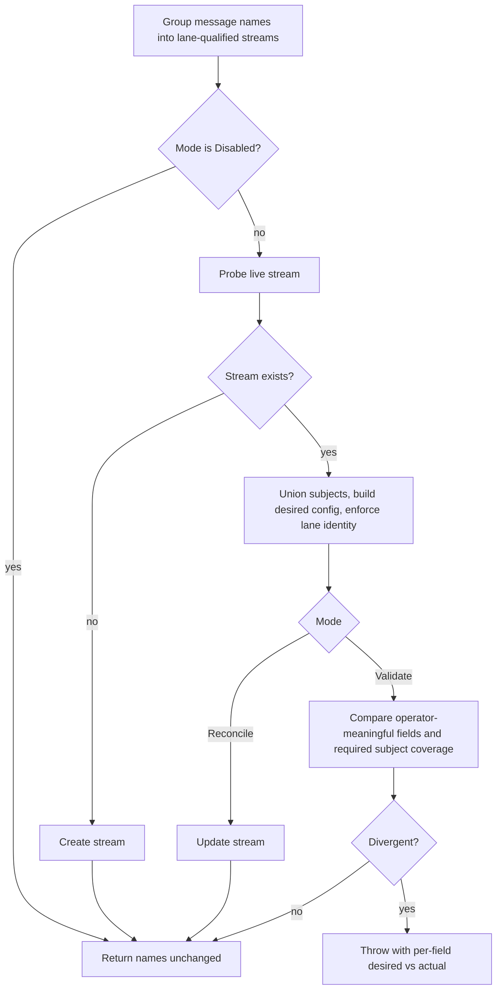

# NATS Stream Reconcile Safety - Plan

## Goal Capsule

- **Objective:** An operator who provisions JetStream streams with their own tooling can run Headless consumers against them without those streams being silently reconfigured at startup, and is told exactly what diverged when the stream and the application disagree.
- **Means:** A three-state provisioning mode on the NATS options, defaulting to verify-without-mutating (KTD1).
- **Authority:** This plan, then the repository conventions in `CLAUDE.md`. GitHub issue #233 is the originating request; where this plan and the issue body differ, this plan governs.
- **Execution profile:** Branch from and target `main`. The source change is provider-local to `src/Headless.Messaging.Nats`, but retiring the boolean reaches every project that sets it: three test projects (`Headless.Messaging.Nats.Tests.Unit`, `Headless.Messaging.Nats.Tests.Integration`, and `Headless.Messaging.NatsPostgreSql.Tests.Integration`, which project-references the provider and therefore fails `make build` until it is updated) and three documentation surfaces (the package README, `docs/llms/messaging.md`, and a worked example in `docs/solutions/messaging/transport-wrapper-drift-and-doc-sync.md`).
- **Stop conditions:** Stop if the lane-identity contract (stream name, subjects, retention as provider-owned) turns out to be negotiable, or if JetStream cannot report a stream's live configuration well enough to diff it. Both invalidate the approach rather than adjusting it.
- **Tail ownership:** This plan covers implementation and local verification. Landing, publication, and follow-up issue creation belong to the calling workflow.

---

## Product Contract

### Summary

Replace the boolean stream-provisioning flag on the NATS transport with a three-state mode, and make the safe state the default. The provider will still create a missing stream in every enabled mode, but it will no longer rewrite an existing stream's configuration unless the operator opts into reconciliation. When the live stream and the desired configuration disagree, startup fails with a diagnostic that names each divergent field.

### Problem Frame

`NatsConsumerClient` provisions JetStream topology during consumer startup. It reads the existing stream to union subjects, builds a desired `StreamConfig`, and calls `CreateOrUpdateStreamAsync` unconditionally. The only control is `NatsMessagingOptions.EnableSubscriberClientStreamAndSubjectCreation`, which is on by default.

That is safe for a stream the framework owns. It is not safe for a stream an operator provisioned through the NATS CLI, Terraform, or a Kubernetes operator. Every consumer start pushes the provider's own `Storage = File` and whatever `StreamOptions` sets over the live stream — replicas, retention limits, storage class. Nothing reports the overwrite, and nothing offers a dry run. An operator who wants to keep their own stream configuration has one option today: turn provisioning off completely, which also gives up first-run creation and subject union.

### Key Decisions

- Scope is stream reconcile safety plus a deferred advisory follow-up, not the five items the issue originally listed (session-settled: user-approved — chosen over the original five-item scope: per-stream configuration is already reachable because the stream name is assigned before `StreamOptions` runs, `NormalizeStreamName` already provides subject-to-stream routing, and JetStream has no DLQ primitive while the core pipeline already owns failure visibility). Governs R1, R2, R3, R4, R5.

### Requirements

**Provisioning behavior**

- R1. When the lane-qualified stream does not exist, the provider creates it in every mode except the disabled mode.
- R2. When the stream exists and its provider-governed configuration matches the desired configuration, startup completes without writing to the stream.
- R3. When the stream exists and its provider-governed configuration diverges, the default mode fails consumer startup and reports the stream name, each divergent field with its desired and actual value, and how to resolve it.
- R4. Modifying an existing stream's configuration happens only when the operator selects the reconciling mode.
- R5. A disabled mode performs no stream creation and no modification, preserving the behavior available today by setting the boolean to `false`.

**Preserved invariants**

- R6. Subject comparison is asymmetric. Subjects present on the live stream that the current client did not declare are never reported as divergence. Subjects the current client requires that the live stream does not cover are reported as divergence in the verifying mode and written in the reconciling mode.
- R7. Stream name, subjects, and retention stay provider-owned lane identity. The existing guard still throws when `StreamOptions` alters them.
- R8. Durable consumer creation is unchanged and is not governed by the mode.

**Configuration surface**

- R9. The mode is a single public enum-valued property on `NatsMessagingOptions` that replaces the boolean.
- R10. Options validation rejects a value outside the defined enum members.

**Documentation**

- R11. `src/Headless.Messaging.Nats/README.md` and `docs/llms/messaging.md` describe each mode, the default, and the migration from the boolean.

### Success Criteria

- The integration suite proves each mode against a real JetStream container, including the case that currently has no coverage: an operator-provisioned stream surviving consumer startup unmodified.
- No consumer group can start against a stream that does not cover its subjects. The verifying mode turns that condition into a startup failure rather than a consumer that silently receives nothing.
- A stream the provider itself created and then re-validates on a second startup reports no divergence. This is the phantom-drift regression guard for KTD2.

### Scope Boundaries

- Per-stream configuration, declarative subject-to-stream routing, DLQ/dead-letter observation, and sensitive-header scrubbing stay out. The Key Decision above records why.
- Durable consumer provisioning stays out (R8, KTD5).
- Other transports keep their own provisioning options. `AzureServiceBusMessagingOptions.AutoProvision` has the same binary shape and the same latent issue; aligning the family is follow-up work, not this change.

#### Deferred to Follow-Up Work

- JetStream advisory visibility (`$JS.EVENT.ADVISORY.*`). The sink question that blocked it is now answered: the provider already has an established observability channel in `OnLogCallback` / `LogMessageEventArgs` / `MqLogType`, used for connection faults in `NatsConsumerClient`. What remains is genuinely separate work — an additional background subscription with its own connection and shutdown lifecycle that must match the supervised-restart model. File it as its own issue rather than attaching it here.

### Sources

- `src/Headless.Messaging.Nats/NatsConsumerClient.cs` — the provisioning path, the subject union, and the lane-identity guard.
- `src/Headless.Messaging.Nats/Setup.cs` — the registration overload trio and `_ValidateShardSymmetry`, the diagnostic style this plan mirrors.
- `src/Headless.Api.DataProtection/BlobContainerProvisioning.cs` — the repository's existing provisioning-enum precedent, including its rationale for preferring an enum over a boolean.
- JetStream rejects a storage-type change on an existing stream, so reconciliation cannot converge every field. This is what splits the divergence classes in KTD7; confirm the full immutable set against `nats-io/nats-server` for the version the fixture runs.
- NATS.Net 2.8.2 (`Directory.Packages.props`) exposes `CreateStreamAsync`, `UpdateStreamAsync`, `CreateOrUpdateStreamAsync`, and `GetStreamAsync` as separate members on `NatsJSContext`, so the non-reconciling modes never need the upsert. `CreateStreamAsync` documents itself as returning an existing stream rather than failing when the name is taken, so existence is decided by the `GetStreamAsync` probe instead.

---

## Planning Contract

### Key Technical Decisions

- KTD1. **Replace the boolean with a three-state enum, and default to the safe state.** A new `NatsStreamProvisioning` enum with a verifying default, a reconciling opt-in, and a disabled state. `BlobContainerProvisioning` establishes both the naming shape and the reasoning that a dedicated enum beats a boolean flag. Defaulting to the verifying state is a breaking change; `CLAUDE.md` designates this repository greenfield and prefers breaking changes that improve correctness over compatibility shims. The change is narrower than it sounds: the verifying state still creates a missing stream, so only the overwrite-an-existing-stream case changes behavior. Three states, not four: a create-then-tolerate-drift state was considered and rejected because it differs from the verifying state only by staying silent about divergence, which is the behavior this change exists to remove. Governs R1, R3, R4, R5, R9.
- KTD2. **Diff only the fields the provider or `StreamOptions` actually set.** Comparing a desired `StreamConfig` against one read back from the server produces divergence on every field the provider never set, because the server fills in its own defaults. Build the desired config, snapshot it before invoking `StreamOptions`, and snapshot it again after; the delta identifies exactly which fields the operator's callback set. Compare the live stream against that delta plus the fields the provider sets itself. Never compare a field neither side set. Governs R2, R3.
- KTD3. **Subject comparison is asymmetric: extra is fine, missing is fatal.** A live stream legitimately carries subjects contributed by sibling consumer groups or an earlier deployment, so extra subjects are never drift. Missing coverage is the opposite. Today the unconditional upsert writes the union on every startup, which is what lets a second consumer group add its own subject to a shared stream. A verifying mode that ignored subjects entirely would let that group start against a stream that does not carry its subject, and JetStream delivers zero messages to a filter that matches nothing — with no error. That is the same silent-loss class `_ValidateShardSymmetry` exists to prevent. The verifying mode therefore reports missing coverage as divergence, and only the reconciling mode writes the union. Coverage is evaluated by subject-match semantics, not set membership: a live `prefix.>` wildcard covers an exact `prefix.foo`, matching the overlap pruning the desired config already performs. Governs R6.
- KTD4. **Fail startup on divergence, mirroring the existing guard.** The provisioning method already throws `InvalidOperationException` when `StreamOptions` violates lane identity, and `Setup.cs` throws at DI build time for shard asymmetry. Both name the problem, its consequence, and the exact remediation. The divergence diagnostic follows that established contract rather than logging and continuing: a consumer bound to a stream whose retention or storage is not what the application expects can silently fail to deliver. Governs R3.
- KTD7. **Classify divergence as in-place reconcilable or immutable, and give each its own remedy.** JetStream refuses to change some fields on an existing stream — storage type is the clearest case, so an update that tries to move a stream between file and memory storage fails rather than converging. A diagnostic that answers every divergence with "switch to the reconciling mode" would therefore be wrong for exactly the fields an operator is most likely to have set deliberately. Split the comparison result: reconcilable divergence recommends the reconciling mode; immutable divergence states that no mode can fix it in place and that the stream must be recreated or migrated out of band. The reconciling mode reports immutable divergence with the same diagnostic instead of attempting an update and surfacing a raw JetStream API error. Governs R3, R4.
- KTD5. **The mode governs streams only.** `CreateOrUpdateConsumerAsync` in the consume loop has the same upsert shape, but durable consumer names and configuration are derived by the provider from lane topology, not provisioned by operators. Extending the mode there would add surface without addressing the reported problem. Governs R8.
- KTD6. **Branch from and target `main`** (session-settled: user-approved — chosen over stacking on PR #863: the three NATS source files this plan changes are byte-identical on `main`, #860, and #863, and the Core commits that motivated stacking do not touch the `IConsumerClient` SPI, so stacking would inherit a draft, conflicting base for no technical benefit).

### High-Level Technical Design

The provisioning path keeps its current shape — group message names into streams, probe the existing stream, union subjects, build the desired config, apply `StreamOptions`, enforce lane identity — and gains a mode-governed decision where the unconditional upsert is today.

The comparison in the Validate branch is the only genuinely new logic. Everything else is a re-routing of calls the method already makes.

### Assumptions

These are un-validated bets. Downstream review should scrutinize them specifically.

- The set of `StreamConfig` fields worth diffing is discoverable by the before/after snapshot in KTD2 without enumerating a hard-coded field list. If the snapshot approach cannot distinguish "set to the same value as the default" from "never set", the implementer falls back to an explicit allow-list of operator-meaningful fields and records that in the unit.
- Failing consumer startup surfaces through the consumer register the same way the existing lane-identity throw does, so no new failure plumbing is needed.
- No consumer of this framework depends on the current silent-overwrite behavior as a deployment mechanism. The breaking-change default assumes topology is either framework-owned or operator-owned, not jointly written.

### Implementation Constraints

- Argument validation uses `Headless.Checks` (`Argument.*` / `Ensure.*`).
- Options validation extends the existing `NatsMessagingOptionsValidator` in the same file, wired through the `Headless.Hosting` `Configure<TOptions, TValidator>` path already used by all four `UseNats` overloads. Never call a validator directly.
- Test classes derive from `TestBase` and pass its `AbortToken`. Do not reference `TestContext.Current.CancellationToken`.
- New enum members get explicit values and `[PublicAPI]`, per the repository's public-API conventions.
- The divergence exception must not be a `BrokerConnectionException`. `ConsumerRegister.ExecuteAsync` catches that type, flips the health flag, and returns, so a divergence raised as one would vanish into an unhealthy consumer instead of surfacing. `InvalidOperationException` propagates, matching the lane-identity guard already in the same method.
- Provisioning runs inside the messaging bootstrapper, which is a `BackgroundService` — not an `IHostedLifecycleService` start gate. A throw therefore faults that service and stops the host through `BackgroundServiceExceptionBehavior.StopHost`, which happens after the host reports started rather than before it. The consumer does not run against a mismatched stream either way, but the failure is not a pre-start gate and the diagnostic should not claim to be one.
- The exact set of stream fields JetStream refuses to change in place is server-version dependent. Storage type is confirmed immutable and is enough to drive the KTD7 split. Confirm the rest against the server image the integration fixture runs, and treat any field whose mutability cannot be confirmed as immutable — over-reporting a divergence is recoverable, attempting an update JetStream rejects is not.

---

## Risks and Operational Notes

The default change is the risk that matters. Everything else in this plan is additive.

- **Upgrading consumers can fail startup where they previously succeeded.** A deployment whose live stream diverges from what the application asks for currently starts and silently overwrites the stream; after this change it fails with the divergence diagnostic. That is the intended fix, but it lands on upgrade rather than on a config change, so the release note must state it plainly and name the reconciling mode as the one-line restoration of previous behavior. The diagnostic itself is the mitigation: it names the fields and the remedy, so an operator hitting this at upgrade time has what they need without reading source.
- **Multi-group deployments feel this most.** Where several consumer groups normalize to one stream and each contributes subjects, the old upsert silently grew the subject list on every startup. Under the verifying default the second group now fails unless the stream already covers its subjects (R6, KTD3). Those deployments need either the reconciling mode or fully provisioned subject coverage. This is a real behavioral change for a working configuration, not only for a misconfigured one, and the documentation must call it out rather than bury it in a mode table.
- **Immutable divergence has no in-place remedy.** An operator whose stream differs on storage type cannot resolve it by switching modes; they must recreate or migrate the stream (KTD7). Getting the diagnostic wrong here would send them into a loop of switching to the reconciling mode and watching JetStream reject the update.
- **CI gates only a sliver of this change.** `.github/workflows/ci.yml:117` runs `make ci-messaging-conformance-evidence`, which executes the NATS integration assembly filtered to `*ProviderConformanceEvidenceTests` — so that one class does gate merges, and it binds its scenarios to method names in `NatsConsumerClientTests`. Renaming a bound method there breaks CI in a project most readers believe CI never runs. Everything else this plan adds is proven by suites that do not gate: the rest of the NATS integration project, and `Headless.Messaging.NatsPostgreSql.Tests.Integration`. Run them locally before the change lands. (CLAUDE.md's "CI runs unit tests only" learning predates that workflow step and is stale for messaging.)

---

## Implementation Units

### U1. Provisioning mode option

- **Goal:** Introduce the three-state mode on the NATS options surface and retire the boolean.
- **Requirements:** R5, R9, R10.
- **Dependencies:** none.
- **Files:**
  - `src/Headless.Messaging.Nats/NatsStreamProvisioning.cs` (new)
  - `src/Headless.Messaging.Nats/NatsMessagingOptions.cs`
  - `tests/Headless.Messaging.Nats.Tests.Unit/SetupTests.cs`
- **Approach:**
  1. Add the enum in its own file in the provider namespace, with explicit member values, `[PublicAPI]`, and XML docs stating what each mode does to a missing stream and to an existing one.
  2. Replace `EnableSubscriberClientStreamAndSubjectCreation` with the enum-valued property, defaulting to the verifying member. Remove the boolean outright — no obsolete shim.
  3. Extend `NatsMessagingOptionsValidator` with an enum-defined check.
  4. Update the XML docs on the options property to describe the default's safety posture and point at the reconciling member for the previous behavior.
- **Patterns to follow:** `src/Headless.Api.DataProtection/BlobContainerProvisioning.cs` for enum shape, naming, and doc voice; the existing validator rules in `NatsMessagingOptions.cs` for the validation style.
- **Test scenarios:**
  - Registering NATS without configuring the mode yields the verifying default.
  - Each `UseNats` overload carries a configured mode through to the resolved options.
  - Options validation rejects a value cast from an integer outside the defined members.
- **Verification:** `Headless.Messaging.Nats.Tests.Unit` passes and the provider compiles with no references to the removed boolean anywhere in the solution.

### U2. Mode-governed provisioning path

- **Goal:** Route stream provisioning through the mode, and capture which configuration fields the desired config actually asserts.
- **Requirements:** R1, R2, R4, R5, R6, R7, R8.
- **Dependencies:** U1.
- **Files:**
  - `src/Headless.Messaging.Nats/NatsConsumerClient.cs`
- **Approach:**
  1. Replace the early return that reads the boolean with a disabled-mode return.
  2. Keep the existing stream probe, subject union, overlap pruning, desired-config construction, `StreamOptions` invocation, and lane-identity guard exactly as they are.
  3. Snapshot the desired config before and after `StreamOptions` runs so the operator-asserted field set is known (KTD2).
  4. Branch on the mode: create when the probe found no stream; update when reconciling; compare when verifying; do nothing when the live configuration matches.
  5. In the verifying comparison, evaluate subject coverage separately from field comparison, per KTD3: every subject the client requires must be covered by the live subject list under wildcard-match semantics, while extra live subjects are ignored.
  6. Use the create-only and update-only members of `NatsJSContext` rather than the upsert, so a non-reconciling mode cannot write an existing stream even if the branch logic is later changed incorrectly.
- **Execution note:** The probe already distinguishes present from absent by catching the not-found API error. Reuse that result rather than adding a second round trip.
- **Patterns to follow:** the existing structure of the provisioning method — it already separates probe, build, guard, and write.
- **Test scenarios:**
  - Disabled mode returns the message names and issues no JetStream API calls.
  - A missing stream is created in both the verifying and reconciling modes.
  - An existing stream whose operator-meaningful fields match is not written in the verifying mode.
  - An existing stream with a divergent but mutable field, such as a retention limit, is written in the reconciling mode and its live config reflects the desired value afterwards.
  - An existing stream whose divergence is an immutable field, such as storage type, is reported rather than written, in both the verifying and reconciling modes.
  - Subjects contributed by a sibling consumer group survive a verifying startup and are not reported as divergence.
  - A consumer group whose required subject is not covered by the live stream fails a verifying startup rather than binding a filter that matches nothing.
  - The same group succeeds in the reconciling mode, and the live stream carries the unioned subject afterwards.
  - A required subject already covered by a live wildcard is not reported as missing.
  - The lane-identity guard still throws when `StreamOptions` alters the stream name or retention, in every mode.
- **Verification:** The NATS integration project's existing tests still pass, proving the refactor preserved first-run creation and subject union.

### U3. Divergence diagnostic

- **Goal:** Turn a detected divergence into an error an operator can act on without reading framework source.
- **Requirements:** R3, R6.
- **Dependencies:** U2.
- **Files:**
  - `src/Headless.Messaging.Nats/NatsConsumerClient.cs`
  - `tests/Headless.Messaging.Nats.Tests.Unit/StreamDivergenceReportTests.cs` (new)
- **Approach:**
  1. Collect divergences as field name plus desired value plus actual value rather than failing on the first one, so one startup reports the whole picture.
  2. Compose an `InvalidOperationException` naming the stream and listing every divergent field, grouped by whether it is reconcilable in place or immutable (KTD7). Reconcilable divergence states that the reconciling mode will write it. Immutable divergence states that no mode can converge it and that the stream must be recreated or migrated out of band.
  3. Keep the message composition in a testable member so it can be asserted without a broker.
- **Patterns to follow:** `_ValidateShardSymmetry` in `src/Headless.Messaging.Nats/Setup.cs` — it names the offending element, the consequence, and the exact call that fixes it. Match that voice and level of specificity.
- **Test scenarios:**
  - A single divergent field produces a message naming that field with both values.
  - Multiple divergent fields are all listed in one message, not just the first.
  - A missing required subject is reported as its own divergence kind, naming the uncovered subject and stating that the consumer would otherwise receive no messages.
  - The message names the stream and the remedy appropriate to each divergence class.
  - An immutable divergence never recommends the reconciling mode as its remedy.
  - No divergence produces no exception.
- **Verification:** Message-composition tests pass without a broker; the text reads as actionable to someone who has not seen the code.

### U4. Integration coverage across modes

- **Goal:** Prove each mode against a real JetStream container, including the operator-provisioned case that has no coverage today.
- **Requirements:** R1, R2, R3, R4, R5, R6.
- **Dependencies:** U2, U3.
- **Files:**
  - `tests/Headless.Messaging.Nats.Tests.Integration/NatsConsumerClientTests.cs`
- **Approach:**
  1. Use the fixture's existing stream helper to pre-create a stream with a deliberately different mutable setting, such as a retention limit, then start a consumer and assert the live configuration is unchanged and startup failed with the divergence error. Use a separate case with a divergent storage type for the immutable class.
  2. Add the phantom-drift regression guard from Success Criteria: let the provider create a stream, then run a second verifying startup against it and assert no divergence.
  3. Cover the reconciling mode writing the change through, and the disabled mode leaving a missing stream absent.
- **Execution note:** Requires Docker. CI runs unit tests only, so this suite must be run locally before the change is considered proven.
- **Patterns to follow:** the existing fixture usage in the NATS integration project, including its collection fixture and its connection and stream helpers.
- **Test scenarios:**
  - An operator-provisioned stream with divergent storage survives a verifying startup unmodified, and startup reports the divergence.
  - A provider-created stream re-validated on a second startup reports no divergence.
  - The reconciling mode applies a divergent mutable field to an existing stream and the live configuration reflects it afterwards.
  - The reconciling mode reports an immutable divergence with the migration remedy instead of attempting an update that JetStream would reject.
  - The disabled mode leaves a missing stream uncreated and lets the consumer proceed.
  - A stream carrying a sibling group's subjects passes verification.
  - Two consumer groups normalizing to one stream: the first creates it, the second requires a subject the stream does not carry. The verifying mode fails the second group's startup with the missing-coverage diagnostic; the reconciling mode admits it and the stream then carries both subjects. This is the scenario the old unconditional upsert handled silently.
- **Verification:** `Headless.Messaging.Nats.Tests.Integration` passes locally against Docker.

### U5. Documentation sync

- **Goal:** Describe the modes, the new default, and the migration in both required documentation surfaces.
- **Requirements:** R11.
- **Dependencies:** U1, U2, U3.
- **Files:**
  - `src/Headless.Messaging.Nats/README.md`
  - `docs/llms/messaging.md`
- **Approach:**
  1. Rewrite the README's stream auto-creation section around the three modes, stating what each does to a missing and an existing stream.
  2. State the breaking change plainly: the default no longer overwrites an existing stream, and name the mode that restores the old behavior.
  3. Add the design note that subject comparison is asymmetric — extra live subjects are ignored, missing coverage fails the verifying mode — and say why, so a reader understands both halves rather than reporting either as a bug.
  4. Call out the multi-group consequence explicitly: deployments where consumer groups share a normalized stream and each contributes subjects need the reconciling mode, or the stream provisioned with full subject coverage up front.
  5. Mirror the same content into the messaging LLM documentation at the depth that file uses for provider options.
- **Patterns to follow:** `docs/authoring/AUTHORING.md` for the required shape and drift checks; the README's existing Design Notes voice, which explains reasoning rather than listing API surface.
- **Test scenarios:** Test expectation: none — documentation only.
- **Verification:** Both surfaces describe the same three modes and the same default, with no surviving reference to the removed boolean anywhere in the repository.

---

## Verification Contract

| Gate | Command | Applies to |
|---|---|---|
| Build the provider | `make build-project PROJECT=src/Headless.Messaging.Nats/Headless.Messaging.Nats.csproj` | U1, U2, U3 |
| Unit tests | `make test-project TEST_PROJECT=tests/Headless.Messaging.Nats.Tests.Unit/Headless.Messaging.Nats.Tests.Unit.csproj` | U1, U3 |
| Integration tests (Docker) | `make test-project TEST_PROJECT=tests/Headless.Messaging.Nats.Tests.Integration/Headless.Messaging.Nats.Tests.Integration.csproj` | U2, U4 |
| Formatting | `make format` | all |
| Analyzers | `make quality-analyzers-project PROJECT=src/Headless.Messaging.Nats/Headless.Messaging.Nats.csproj` | all |
| Solution build | `make build` | final |

The integration gate is the one that matters most here and the one CI will not run. A green unit run does not prove this change.

## Definition of Done

- Every requirement R1 through R11 is satisfied or, for the preserved invariants, demonstrably left intact by a named unit.
- The boolean option has no remaining usages in `src/`, in the test projects that reference the provider by project reference, or in the documentation surfaces above. Two exclusions are deliberate: `tests/Headless.Messaging.PreviousVersionProbe` compiles against the published `Headless.Messaging.Nats` 0.11.0 *package*, where the boolean still exists and must keep working, and migration prose may name the removed flag so upgraders can find it.
- The verifying mode is the default, and an operator-provisioned stream survives startup unmodified — proven by U4 against a real container, not by unit tests alone.
- Re-validating a provider-created stream reports no divergence.
- The divergence message names the stream, every divergent field with both values, any uncovered required subject, and the remedy appropriate to each divergence class — never the reconciling mode for an immutable field.
- A second consumer group requiring a subject the shared stream does not carry fails the verifying mode instead of binding an unmatched filter — proven by the two-group integration scenario in U4.
- Both documentation surfaces are updated and agree with each other.
- `make quality-analyzers` is clean for the changed projects.
- No dead-end or experimental code from abandoned approaches remains in the diff.
