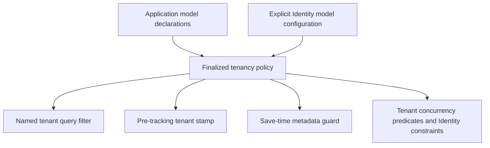
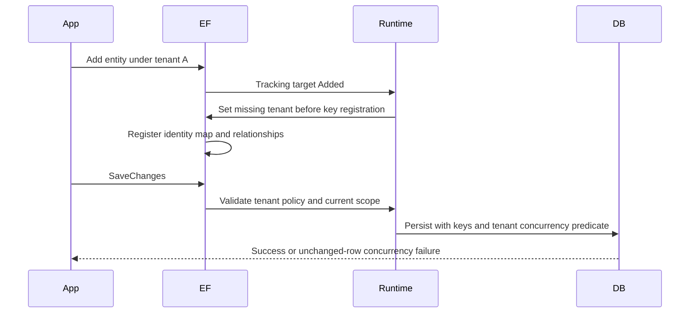
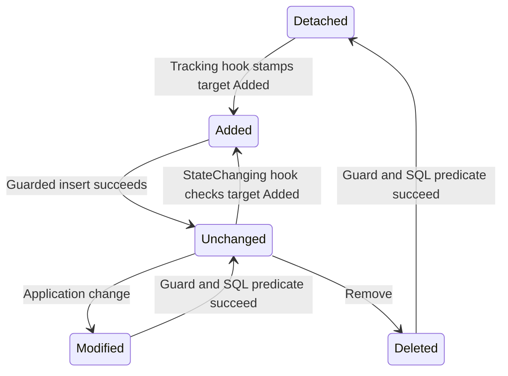

# Metadata-based tenant ownership for EF and Identity

## Goal Capsule

- Objective: Applications can isolate third-party EF entities and Identity accounts by tenant without custom tenancy interfaces, including reads, writes, uniqueness, and relationships.
- Means: One finalized model policy, SQL concurrency predicates, and explicit Identity model configuration (KTD1, KTD2, KTD4).
- Authority: Current user instructions, the approved issue #250 contract, this plan, then implementation details. #249 supplies the default SQL protection contract; #250's newer Identity-specific relationship decision governs Identity alternate keys.
- Execution profile: Implement and verify locally in an isolated branch. Establish failing behavioral evidence before changing the affected runtime.
- Tail owner: x-autopilot owns simplification, review, PR creation, and CI observation after implementation returns.
- Stop conditions: Report invalidating evidence against a settled decision, unavailable required verification infrastructure, or a scope collision that cannot be isolated. Never claim provider correctness from model-only or SQLite evidence.

---

## Product Contract

### Summary

Add declarative tenant ownership to Headless EF and consume it through one explicit Identity tenancy opt-in. Preserve ordinary primary keys and existing non-opted-in Identity behavior.

### Problem Frame

The existing runtime selects tenant entities through CLR interfaces and installs filters before consumer model configuration finishes. Its tracked-write guard trusts caller-supplied original values in detached flows. Identity also needs database constraints that prevent cross-tenant links, not just filtered queries.

### Key Decisions

- KD1. **General metadata ownership.** (session-settled: user-approved, chosen over CLR-only or Identity-only enforcement because third-party entities need the same framework policy.) Governs R1, R2, R3.
- KD2. **Explicit Identity scope with retained primary keys.** (session-settled: user-approved, chosen over blanket index/key rewriting because Identity lookup signatures and global login uniqueness must remain intact.) Governs R7, R8, R9.
- KD3. **Database-enforced Identity relationships.** (session-settled: user-approved, chosen over ID-only foreign keys because a valid child tenant stamp does not prove its parents belong to that tenant.) Governs R10.
- KD4. **Capture tenant at Added transition.** (session-settled: user-approved, chosen over save-time stamping because tenant scope can change between Add and SaveChanges.) Governs R4, R5.
- KD5. **Layered write errors.** (session-settled: user-approved, chosen over translating every concurrency exception because zero affected rows do not identify the reason.) Governs R6.

### Requirements

**Ownership and model configuration**

- R1. Generic and non-generic builders declare tenant ownership or explicit root opt-out; mutable and finalized metadata readers expose the resolved hierarchy policy. `IMultiTenant` remains the default convention, and conflicting derived declarations fail model validation.
- R2. Configuration after the base model-building call works. Metadata-only roots need neither `IEntity` nor `IMultiTenant`; use an existing mapped/CLR string tenant property or a required shadow property, rejecting incompatible mappings. Preserve interface nullability outside the explicit Identity opt-in.
- R3. Owned entities inherit their owner's policy without independent tenant columns or filters. Reject unsupported ownership mappings instead of silently losing protection. Named tenant filters use model property names, preserve sibling filters, and read the active context's tenant rather than capturing the first model-building tenant.

**Write and read boundaries**

- R4. Guard-enabled stamping fills a missing tenant before an entry becomes Added, for initial tracking and state transitions. Preserve supplied values and reject an add-under-A/save-under-B operation.
- R5. Guarded saves reject missing context, missing required tenants, and original/current tenant mismatches for add, update, soft delete, and physical delete. Do not extend legacy unguarded interface save-time stamping to metadata-only entities. Fresh contexts and Identity stores are required across tenant changes.
- R6. Include `TenantId` as a concurrency token for owned roots per #249, preserving ordinary concurrency tokens. In-memory mismatches use existing tenancy exceptions; SQL zero-row failures remain EF concurrency errors. Bypass disables the fast-fail guard, not database constraints. Read-filter bypass does not disable guarded saves; bulk query operations and raw SQL retain their documented boundaries.

**Index and Identity constraints**

- R7. A selected unique index can be tenant-scoped once, preserving its model/database names, existing column order/directions, filter, uniqueness, and supported annotations. Leave unselected indexes and key/relationship shapes alone; reject transformations that cannot preserve semantics.
- R8. One explicit Identity opt-in applies to the actual generic user, role, claim, login, membership, token, and present passkey types. Require tenant values throughout; do not reintroduce passkeys in older schemas.
- R9. Scope normalized usernames and role names per tenant. Retain the non-unique email index, primary key shapes, globally unique user/role IDs, external-login pair, and passkey credential ID. Exercise Identity's configured email validation through filtered queries.
- R10. Identity user/role alternate keys `(TenantId, Id)` and composite dependent foreign keys enforce same-tenant relationships in the database. Replace the corresponding original foreign keys, preserving intended delete behavior and supported navigation customizations.

**Proof and rollout**

- R11. Shared PostgreSQL and SQL Server conformance covers SQL predicates, detached attacks, uniqueness, direct SQL relationship violations, shadow persistence, and real Identity managers/stores. Inspect design-time migration output as well as the runtime model.
- R12. Document new APIs, supported mapping and context-lifetime boundaries, exception timing, guard requirements, and opt-in schema changes in package READMEs and `docs/llms/{orm,identity,multi-tenancy}.md`. Require consumer-owned tenant backfills before adding non-null columns or constraints.

### Acceptance Examples

- AE1. Covers R2, R3. Configure a third-party root after the base call and rename its tenant column; separate tenant-A and tenant-B contexts sharing a model each return only their rows.
- AE2. Covers R4, R5. Add a shadow-tenant role under A, then save under B; fail without persisting or rewriting its tenant.
- AE3. Covers R6. Attach a crafted tenant-A entity targeting tenant B's key and concurrency stamp; update/delete affects no victim row and raises `DbUpdateConcurrencyException`.
- AE4. Covers R9, R10. Equal role names in A and B succeed, but a tenant-A membership referencing B's role fails at the database even through direct SQL.
- AE5. Covers R8, R9. Identity v3 passkeys and configured older schemas work without changing their prescribed primary keys; globally duplicate external logins remain rejected across tenants.

### Scope Boundaries

No physical tenant placement (#877), generalized composite primary-key mode, cross-tenant external-login sharing, automatic migration/backfill, raw-SQL interception, or authentication middleware changes. Include #249's default concurrency predicate because #250 depends on it; do not implement #249's optional strict-mode design.

---

## Planning Contract

### Key Technical Decisions

- KTD1. **Finalize tenancy after user configuration.** (session-settled: user-approved, chosen over early model-building application because the approved after-base caller flow otherwise fails.) Register an `IModelFinalizingConvention` through the runtime's shared convention hooks. Use the active context expression for tenant filtering. Governs R1, R2, R3; realizes KD1.
- KTD2. **Metadata drives the save guard and SQL predicate.** Keep tenancy annotation constants/readers in `Headless.EntityFramework`; foreign-type extension holders follow existing `HeadlessAuditPolicyExtensions` placement. Preserve other filters and concurrency policies. Realizes R1, R5, R6 and KD1/KD5.
- KTD3. **Pre-tracking events provide tenant values before identity-map insertion.** Use EF 10 `Tracking` and `StateChanging` and their target state, not `entry.State`'s old value. Unsubscribe during runtime disposal. Required tenant keys can fail earlier than SaveChanges; use `MissingTenantContextException` in the enabled guard when a missing tenant prevents tracking. EF's immutable-key errors may occur before the guard on Identity reassignment, including under bypass. Realizes R4, R5, R10 and KD3/KD4.
- KTD4. **Identity knows its generic model types.** Expose a protected `ConfigureTenantOwnedIdentity(ModelBuilder)` helper on the nine-parameter base and route to a package-owned configurator. Consumers call it after the base model call. Record the actual types and apply/validate their policy at finalization, after all application customizations. Configure only present schema types. Preserve or explicitly reject ambiguous customized relationships rather than silently inventing parallel links. Realizes R8, R9, R10 and KD2/KD3.
- KTD5. **Selected index builder identifies the target.** Offer `IndexBuilder.IsTenantScoped()` with generic counterpart returning the original builder; mark the index and recreate it at finalization so subsequent chained configuration is retained. Append one ascending tenant column, preserving existing property order and Npgsql positional annotations whose omitted trailing entries use defaults. Extend explicit sort directions with ascending; expand the empty all-descending sentinel first. Preserve scalar and validated positional annotations, rejecting transformations that cannot preserve semantics. This favors existing business-key index ordering over tenant-prefix scans. Realizes R7 and KD2.
- KTD6. **Bound new Identity key columns explicitly.** Default newly configured tenant lengths to `DomainConstants.IdMaxLength`; default otherwise unbounded string Identity IDs to 128 within the opt-in. Preserve explicit compatible lengths and validate provider key budgets instead of silently shrinking consumer mappings. Keep this policy local to Identity, document its schema impact, and exercise provider limits. SQL Server PK/FK budgets are distinct from its nonclustered-index budget. Realizes R8, R10, R11.
- KTD7. **Conformance is shared; provider setup stays thin.** Extend the existing EF test harness with provider-neutral tenancy scenarios and SQL Server fixture support. Put shared Identity conformance in a new `Headless.Identity.Storage.EntityFramework.Tests.Harness` package, consumed by the existing integration project with thin provider fixtures. Reuse centrally pinned provider/Testcontainers packages. Realizes R11.
- KTD8. **Persist canonical tenant equality safely.** (session-settled: user-approved — chosen over changing tenant IDs to binary storage because string columns preserve the simpler consumer schema.) Use SQL Server `Latin1_General_100_BIN2` and PostgreSQL `C` collation for tenant columns; reject incompatible explicit mappings. Reject tenant IDs ending in U+0020 at the EF read/write boundary and enforce the persisted restriction through database check constraints. Never trim or normalize canonical IDs. Existing deployments must validate data before applying the collation and constraint migration. This restriction applies to both interface and metadata tenant ownership; it preserves nullable host rows. Governs R3, R5, R6, R10, R11, R12.

### High-Level Technical Design

Directional caller flow: call the Headless base model builder, declare a third-party entity tenant-owned, select a unique index for tenant scope, and optionally invoke the Identity helper. Consumer code still owns tenant resolution and guard registration.

### Mapping and operational risks

- Reject keyless and shared-type tenant roots in the first implementation. For owned graphs, allow only mappings for which writes retain the root tenant predicate; reject separately stored owned entities requiring a second tenant column. Identity JSON owned passkey data must retain protection in generated updates.
- For owned-only writes, resolve the actual tracked tenant-owning principal and validate its original/current tenant using the owned entry's effective write operation, even when the principal is Unchanged. Reject writes whose principal cannot be safely resolved. EF aggregates same-row and JSON changes with the owner's command and concurrency token; verify this on both providers. Do not rely on TableSharingConcurrencyTokenConvention, which excludes ownership paths and ordinary non-store-generated tokens.
- Validate new Identity composite keys against SQL Server's 900-byte PK/FK budget. Preserve the upstream schema-v3 passkey credential primary key and its 1024-byte declared maximum; the existing worst-case SQL Server limitation remains and must be documented. Do not blanket-reject that pre-existing mapping or claim full-length credential support.
- Identity opt-in introduces non-null columns and alternate-key/FK constraints. Consumers own data backfill and resolve old rows before migrating. No database is migrated by this work.
- No new tenant catalog dependency is needed. Canonical tenant IDs follow `CONCEPTS.md`; tenant identifiers are not persistence keys.

### Sources

`HeadlessDbContextRuntime`, `HeadlessEntitySaveEntryProcessor`, `HeadlessAuditPolicyExtensions`, and the existing Identity context are the primary extension seams. Existing harness global-filter tests and `HeadlessTenantWriteGuardTests` supply behavioral precedent. The audit documentation establishes finalized model metadata as policy ownership; its per-derived audit override behavior is not copied into tenancy.

Pinned EF/Identity 10.0.12 source confirms pre-tracking hooks, context-expression parameterization, Identity store `FindAsync` behavior, and schema-specific key mappings. #249 records the detached-write vulnerability. Microsoft SQL Server maximum-capacity documentation supplies distinct PK/FK and nonclustered-index limits.

[SQL Server string comparison documentation](https://github.com/MicrosoftDocs/sql-docs/blob/5eb8886de9beca391b3d21ab912a434c7a921611/docs/t-sql/language-elements/string-comparison-assignment.md) explicitly states that character operands are padded before equality comparison, that `abc` equals `abc `, and that ANSI_PADDING does not alter comparison semantics. This is documentation-backed evidence; no database reproduction has run in planning.

---

## Implementation Units

### U1. Resolve tenant metadata and filter queries

**Goal:** Third-party roots participate in tenant reads through final model metadata.
**Requirements:** R1, R2, R3; KTD1, KTD2; KD1.
**Dependencies:** None.
**Files:** `src/Headless.EntityFramework/HeadlessTenantPolicyAnnotations.cs`, `src/Headless.EntityFramework/Extensions/HeadlessTenantPolicyExtensions.cs`, `src/Headless.EntityFramework/Contexts/Runtime/HeadlessTenantModelConvention.cs`, `src/Headless.EntityFramework/Contexts/Runtime/HeadlessDbContextRuntime.cs`, both Headless context base convention hooks, `tests/Headless.EntityFramework.Tests.Integration/TenantModelPolicyTests.cs`.
**Approach:** Add declaration/read APIs, resolve hierarchy policy at finalization, validate supported mappings, and move only tenancy filtering out of early model building. Preserve nullability for implicit interface policy and existing non-tenant filters.
**Patterns:** Audit annotation extensions and existing named-filter runtime.
**Test scenarios:**
- Covers AE1. CLR and shadow tenants configured after base filter correctly across fresh contexts sharing a model, including a renamed database column.
- Explicit root opt-out suppresses tenancy; derived conflict and incompatible tenant property types fail clearly.
- Required metadata roots return no rows without tenant; existing nullable interface rows retain host behavior.
- Owned/shared/keyless mapping validation follows KTD1 and the mapping boundary above.
**Verification:** Focused public model/API tests pass; provider query execution is completed in U4.

### U2. Protect tracked and detached writes

**Goal:** Stamp tenants before tracking and fence SQL writes using #249's predicate.
**Requirements:** R4, R5, R6; KTD2, KTD3; KD4, KD5.
**Dependencies:** U1.
**Files:** Runtime/convention files from U1, `src/Headless.EntityFramework/Contexts/Processors/HeadlessEntitySaveEntryProcessor.cs`, `tests/Headless.EntityFramework.Tests.Integration/HeadlessTenantWriteGuardTests.cs`, `tests/Headless.EntityFramework.Tests.Integration/TenantMetadataWriteTests.cs`.
**Approach:** Replace interface-only guarded behavior with metadata. Preserve legacy unguarded stamping. Add pre-state events and root concurrency metadata, including protected owned changes. Replace #249's skipped expectations with real EF concurrency failure coverage rather than falsely requiring cross-tenant exceptions for SQL misses.
**Execution note:** Establish the existing detached-write failure before fixing it; test actual database effects.
**Test scenarios:**
- Covers AE2, AE3. Added scope switch fails; detached attack leaves the victim unchanged.
- Missing tenant, explicit mismatch, already-tracked transition to Added, and handler disposal behave consistently.
- Matching updates/deletes, soft deletes, legacy host rows, and bypass round trips remain valid.
- Owned JSON or shared-row edits cannot bypass owner tenancy; unsupported separate-table graphs fail model validation.
**Verification:** Focused relational writes and generated SQL prove the predicate and exception boundary.

### U3. Scope selected indexes and Identity relationships

**Goal:** Provide one deliberate Identity opt-in with safe uniqueness and relational ownership.
**Requirements:** R7, R8, R9, R10; KTD4, KTD5, KTD6; KD2, KD3.
**Dependencies:** U1, U2.
**Files:** `src/Headless.EntityFramework/Extensions/HeadlessTenantIndexExtensions.cs`, model convention from U1, `src/Headless.Identity.Storage.EntityFramework/HeadlessIdentityDbContext.cs`, `src/Headless.Identity.Storage.EntityFramework/HeadlessIdentityTenantModel.cs`, `tests/Headless.EntityFramework.Tests.Integration/TenantIndexPolicyTests.cs`, `tests/Headless.Identity.Storage.EntityFramework.Tests.Integration/IdentityTenantModelTests.cs`.
**Approach:** Transform selected index metadata after configuration. Use actual generic Identity types to add required tenants, selected indexes, and exact replacement relationships. Keep immutable PK shapes, absent passkeys absent, and explicit safe key lengths intact.
**Test scenarios:**
- Repeated selection preserves all supported index metadata and rejects unsupported per-column transforms without changing unrelated indexes.
- Custom generic types and older/v3 schemas produce correct tenant-owned sets and relationships.
- Non-opted-in Identity model is unchanged; opted-in PK property lists remain unchanged.
- Identity alternate-key stamping works before Add completes; native key immutability is documented/tested separately from guard errors.
**Verification:** Public model tests and migration model inspection cover every configured Identity entity and constraint.

### U4. Prove both database providers and Identity operations

**Goal:** Exercise the complete contract against PostgreSQL and SQL Server.
**Requirements:** R3, R5, R6, R7, R8, R9, R10, R11; KTD7.
**Dependencies:** U1, U2, U3.
**Files:** `tests/Headless.EntityFramework.Tests.Harness/Tenancy/`, `tests/Headless.EntityFramework.Tests.Integration/Tenancy/`, their project files, new `tests/Headless.Identity.Storage.EntityFramework.Tests.Harness/`, `tests/Headless.Identity.Storage.EntityFramework.Tests.Integration/Tenancy/`, its project file, `headless-framework.slnx`.
**Approach:** Shared contract tests receive thin provider fixtures and fresh context/store scopes. Register real UserManager/RoleManager/stores. Keep provider resource setup in fixtures and avoid copied scenario suites.
**Test scenarios:**
- Covers AE1-AE5 on both providers, including direct SQL cross-tenant FK rejection and same/cross-tenant unique names.
- Disable only the tenant filter on a metadata-owned root with a second named filter: cross-tenant rows become readable, the second filter remains active, and the enabled save guard still rejects a mismatched write.
- Per KTD8, case-distinct IDs remain isolated in reads, detached writes, and composite relationships; trailing-space IDs fail on ambient reads/writes and direct database insertion. Inspect the migration collation and check constraints.
- User/role lookup and creation, role assignment, claims, login lookup, email validation, tokens, and passkeys remain tenant-scoped.
- Global duplicate external login/passkey credentials fail; schema-v2 excludes passkeys.
- Direct model DDL and migration SQL contain required tenant columns, alternate keys, composite FKs, and selected indexes. Key boundary cases expose provider limits honestly.
**Verification:** Both provider suites execute successfully with nonzero tests; no SQLite or in-memory substitution. Existing affected EF and Identity integration suites pass.

### U5. Document and validate the consumer contract

**Goal:** Make registration, guarantees, and rollout requirements discoverable to consuming applications.
**Requirements:** R12 and public API behavior from R1-R11.
**Dependencies:** U1, U2, U3, U4.
**Files:** `src/Headless.EntityFramework/README.md`, `src/Headless.Identity.Storage.EntityFramework/README.md`, `docs/llms/orm.md`, `docs/llms/identity.md`, `docs/llms/multi-tenancy.md`, `CONCEPTS.md` only if a genuinely new domain definition is needed.
**Approach:** Follow `docs/authoring/AUTHORING.md`, remove the resolved detached-write limitation, and show after-base model configuration plus guard registration. Explain Identity key/global-login scope, key-length limits, immutable tenant ownership, fresh contexts, and explicit backfill requirements.
**Test expectation:** No separate prose tests. Validate examples against the public APIs and the executed U4 consumer scenarios.
**Verification:** Relevant Release builds/analyzers and package inspection pass; documentation drift checks agree with the implementation.

---

## Verification Contract

Use repository Make targets with explicit project scope. Run durable commands through task-owned `x-job` jobs; record exit status and test counts before cleanup.

- Build affected production and test projects with `make build-project PROJECT=...` in Release.
- Run `make test-project TEST_PROJECT=tests/Headless.EntityFramework.Tests.Integration/Headless.EntityFramework.Tests.Integration.csproj` and the corresponding Identity integration target, including both provider fixtures added by U4.
- Run `make quality-analyzers-project PROJECT=...` for affected production projects and changed test projects, plus focused formatting verification with the repository formatter.
- Inspect packed EF and Identity artifacts using the repository's scoped packaging support or a scoped equivalent when the Make target cannot select a project. Verify public files and package READMEs.
- Browser verification is not applicable: this change has no UI. Do not add frontend dependencies or start a dev server.

---

## Definition of Done

- Each U-ID satisfies its requirements, concrete scenarios, and verification outcome.
- Both relational providers prove detached-write protection and Identity relationship/uniqueness behavior through actual database execution.
- User-approved decisions remain intact; any invalidating evidence is reported before substituting another design.
- Public docs, migration guidance, and package artifacts match the final API.
- Only task-owned files are changed/committed; unrelated main-checkout work is preserved. Abandoned experiments are absent from the diff.
- Implementation returns evidence to x-autopilot; the pipeline opens a PR and records its CI decision without merging.
