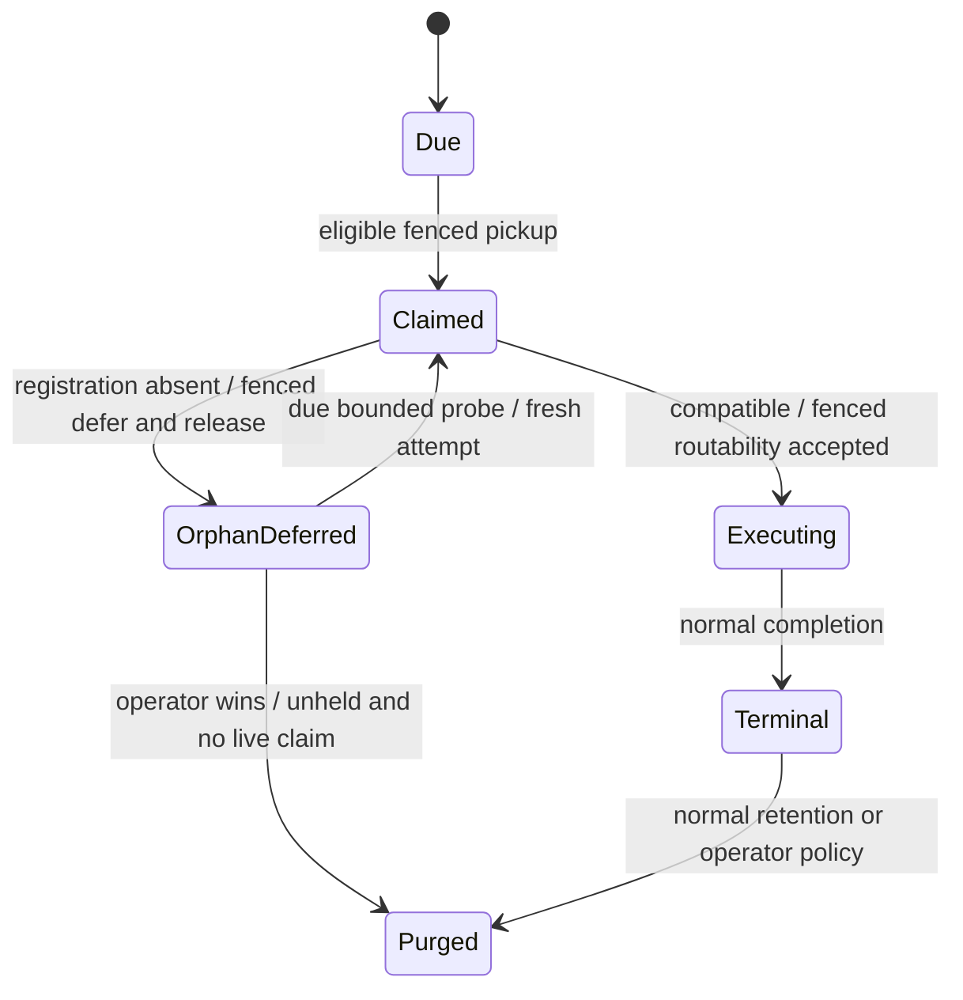
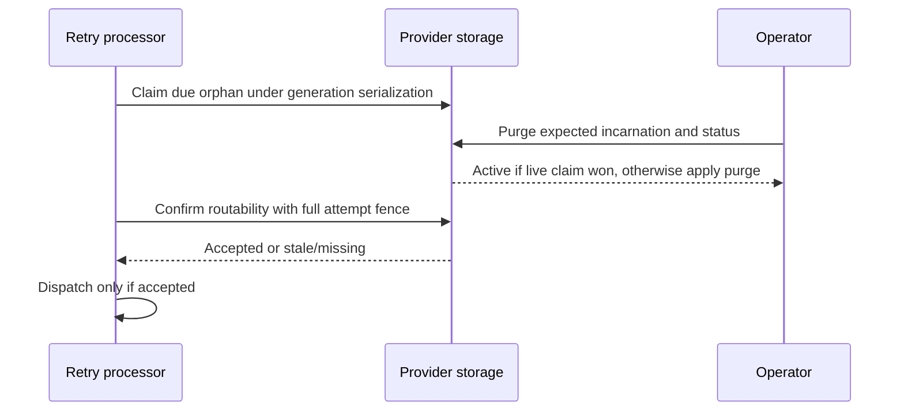
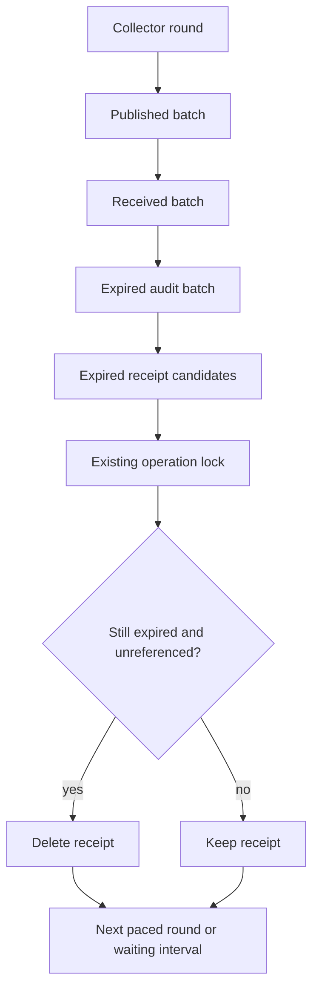

# Inbox lifecycle and operation retention - Plan

## Goal Capsule

- **Objective:** Keep missing-consumer inbox work recoverable without starving deliverable retries, and reclaim expired inbox operation history without breaking replay or concurrent operator actions.
- **Means:** Extend the existing fenced inbox lifecycle and provider collectors. Use the implementation assumptions below as delegated defaults.
- **Authority:** Issues [873](https://github.com/xshaheen/headless-framework/issues/873) and [874](https://github.com/xshaheen/headless-framework/issues/874), this contract, and repository conventions.
- **Execution:** Implement U1 through U5 in dependency order. Stop for a demonstrated contradiction in persistence or concurrency guarantees; routine API naming and query details remain implementation decisions.
- **Tail ownership:** The calling delivery workflow owns review, commits, PR, and CI monitoring.

---

## Product Contract

### Summary

Defer orphaned inbox generations under their exact execution fence and reserve separate capacity for probing them. Add bounded collection of inbox receipts and audits with documented evidence lifetimes and operation replay limits.

### Problem Frame

A missing consumer currently leaves a generation non-terminal, with its claim and retry time unchanged. Lease expiry returns it to the same retry batches, while operator actions reject it as active. This can delay messages that a running consumer can handle.

Expiration currently writes one receipt and one audit for every deleted generation. These records have no collector, so durable stores and the in-memory provider retain an ever-growing history. Their foreign key prevents deleting referenced receipts first.

### Requirements

**Orphan handling**

- R1. Missing consumer or exact contract-version registration must not cause known orphan generations to monopolize ordinary retry pickup capacity.
- R2. Deferral and claim release must compare storage ID, lane, generation, incarnation, attempt ID, owner, and lease timestamp atomically.
- R3. Define orphan recovery and deliberate operator handling consistently across PostgreSQL, SQL Server, and InMemory. Recovery and purge must never both win for one generation.
- R4. Registration absence must not consume the handler failure retry budget or be treated as evidence that every deployment lacks that consumer.

**Operation history**

- R5. Receipt replay and audit evidence have independently configurable finite lifetimes, with the guarantee after receipt deletion documented.
- R6. History collection must delete only expired audits and unreferenced expired receipts in bounded batches, preserving audit-to-receipt integrity under concurrency.
- R7. Message expiration must not starve history collection, and history collection must not create replacement history.
- R8. Repeated expiration and history collection must reclaim both durable records and in-memory entries once their configured lifetimes pass.

### Acceptance Examples

- AE1. Covers R1-R4. With a backlog of already-marked orphans and a due compatible retry, ordinary pickup can select the compatible retry without waiting for the orphan backlog to clear. A missing registration is deferred without increasing failure retries.
- AE2. Covers R2-R3. A compatible registration returns, and a concurrent purge targets the same incarnation. A successful execution claim prevents purge; a successful purge prevents that claim and stale dispatch.
- AE3. Covers R5-R6. An audit outlives its receipt's minimum lifetime. Collection keeps the receipt until all referencing audits expire. Replaying the receipt does not reset its creation time.
- AE4. Covers R6-R8. More expired history exists than the batch size while new messages continue expiring. Each collector round reaches history, deletes at most its per-category budget, and preserves young operator evidence.

---

## Planning Contract

### Assumptions

These are agent-selected defaults under the user's hands-off implementation delegation, not session-settled product decisions.

- A1. Orphans remain recoverable indefinitely until deliberate purge. They have no automatic terminalization or retention expiry. This avoids deleting work merely because one deployment cannot route it.
- A2. A compatible registration means the existing exact consumer identity, contract identity, contract version, and lane tuple. Recovery uses the same generation and a newly claimed attempt. Successful fenced recovery clears the orphan flag before dispatch.
- A3. Hold and ReleaseHold may operate on an orphan with no live execution claim. Hold protects against purge and eventual retention only; it does not pause recovery. ForceReprocess retains its terminal-only restriction.
- A4. Orphan probe backoff defaults to five minutes and a separate probe batch defaults to 10 per lane. Both are positive, validated options. The ordinary retry batch remains independent. First discovery of an unclassified orphan can occupy ordinary capacity once; after classification it moves to probe capacity. A continuously growing unclassified backlog has no promised absolute latency bound.
- A5. Cleanup receipts and cleanup audits default to seven days each. Operator receipt minimum residence defaults to 30 days and operator audits default to 90 days. All four durations accept any positive value; 30 days is not a validation floor. Age is based on each record's immutable creation time; replay does not refresh a receipt.
- A6. Receipt replay remains available while the receipt physically exists. After deletion, reuse of an operation ID can be evaluated as a new request. Clients use unique IDs and retry within the minimum window; no permanent deduplication is promised.
- A7. An audit may keep its receipt beyond the minimum. A surviving generation's hold metadata is independent of history retention and does not pin history forever. Deleting historical evidence does not release a hold. Document this evidence limit.
- A8. History retention changes apply to existing history records according to their creation timestamps. This does not change persisted inbox-generation retention. Increasing a duration cannot restore deleted evidence. Operators needing longer evidence configure durations before enabling the new collector. No automatic audit aggregation, dashboard UI, or separate metrics platform is included.

### Key Technical Decisions

- KTD1. **Extend existing lifecycle primitives.** Per R2-R4 and A1-A4, separate fenced orphan deferral from fenced routability confirmation. A successful no-op confirmation and a stale-fence rejection must be distinguishable; the processor must not dispatch after rejection. Keep database-clock lease authority and retry attempt minting. Derive orphan deferral from the existing scheduling clock convention consistently across providers.
- KTD2. **Separate pickup classes.** Per R1 and A4, normal received pickup excludes known orphans. A distinct bounded orphan pickup uses the same eligibility, lane, claim, and dead-owner rules plus the orphan filter. Avoid a combined globally limited query where orphans consume the ordinary quota. No new worker service or distributed coordination system is required.
- KTD3. **Serialize operator and recovery decisions.** Per R3 and A3, evaluate orphan operator eligibility from persisted orphan state and a store-clock live-claim check inside the same row/generation serialization used to mutate it. Preserve expected status/incarnation checks and held-purge protection. InMemory must reconcile its collection lock with row locks so a removed row cannot be claimed or mutated through a stale reference.
- KTD4. **Derive expiry from immutable timestamps.** Per R5-R8 and A5-A8, calculate independent cleanup/operator cutoffs at sweep time using the same clock authority that writes history creation timestamps: database time for SQL providers and the injected clock for InMemory. Reuse the existing operation-type discriminator instead of adding record-level expiry fields or backfilling all rows. Index the category and creation-time selection path and audit operation-reference lookup as needed.
- KTD5. **Use the existing operation lock for receipt deletion.** Per R6, select bounded candidates, acquire each operation's existing serialization lock, then recheck receipt age and absence of audit references before deleting. Match current transaction lock ordering; do not introduce an operation-lock/generation-lock inversion. A concurrent replay either sees the receipt or follows the documented new-request behavior.
- KTD6. **Round-robin collection.** Per R7, each round attempts one bounded batch for published messages, received messages, expired audits, and unreferenced receipts before repeating. Keep the existing cancellation, pacing, and error reporting conventions. Obtain one provider-created history cutoff snapshot per invocation so concurrent arrivals do not extend its age boundary and application clock skew cannot shorten SQL history lifetimes.

### High-Level Technical Design

Application callers configure orphan backoff/probe capacity and four history durations through the existing messaging options registration. Storage providers implement the policy; applications supply no custom collector or recovery callback.

Hold is an orthogonal retention flag and does not change the recovery transition.

### Risks and rollout

A host cannot infer another host's registrations. Marking an orphan delays its next opportunity on any host, so A4 trades recovery latency for reduced churn. Large newly unclassified backlogs still need classification work.

Changing history retention removes previously permanent evidence. A5-A8 must appear in consumer-facing docs before release. Existing permanent retention is not preserved through an undocumented compatibility default.

SQL providers use database time for ownership decisions and operation-history cutoffs. Application time must not determine whether a SQL execution lease is live or shorten the minimum lifetime of SQL history records. Verify history retention with a skewed application clock; test fixtures may age stored history through provider-specific test helpers.

Schema initializers must add indexes idempotently for existing stores as well as new stores. Verify initialization re-entry and concurrent collection against real providers. No deployed environment is changed by this work.

---

## Implementation Units

### U1. Fenced orphan deferral and bounded probing

**Goal:** Make orphan retries follow R1-R4 using A1-A4 and KTD1-KTD2.

**Dependencies:** None.

**Files:** `src/Headless.Messaging.Core/Persistence/IDataStorage.cs`, `src/Headless.Messaging.Core/Configuration/MessagingOptions.cs`, `src/Headless.Messaging.Core/Processor/IProcessor.NeedRetry.cs`, the three providers' `*DataStorage.cs` plus the SQL providers' `*DataStorage.Inbox.cs`, `tests/Headless.Messaging.Core.Tests.Harness/InboxStorageConformanceTests.cs`, `tests/Headless.Messaging.Core.Tests.Unit/Processor/MessageNeedToRetryProcessorTests.cs`, `tests/Headless.Messaging.Core.Tests.Unit/Configuration/MessagingOptionsValidationTests.cs`, `tests/Headless.Messaging.Core.Tests.Unit/Configuration/MessagingOptionsCopyToTests.cs`.

**Approach:** Extend the storage contract and options, implement provider claims and fenced mutations, then integrate both pickup classes with the processor's existing cancellation/release ownership paths. Preserve claim release for picked work that fails before handoff. Update copy/validation behavior for new options.

**Patterns:** Existing lane pickup, circuit retry deferral, and inbox attempt predicates in each provider.

**Execution note:** Start with a failing shared deferral/fence characterization and the processor missing-registration scenario.

**Test scenarios:**

1. A missing registration sets orphan state, advances retry time, clears ownership, and preserves the failure retry count.
2. An already-orphaned row repeats the same deferral on a later probe rather than retaining a claim.
3. Each stale fence component prevents both orphan deferral and routability confirmation from mutating or dispatching work.
4. Known orphan count exceeds the normal batch size while a live retry is due; ordinary capacity remains available and orphan pickup respects its own cap on both lanes.
5. Exact registration returns and recovery retains generation/incarnation while changing the attempt ID. A mismatched version remains orphaned.
6. Cancellation or storage failure before handoff does not strand remaining claimed messages.
7. Invalid durations/batch values fail options validation; copying options preserves configured values.

**Verification:** Core processor tests plus shared storage scenarios pass for InMemory and both real SQL providers.

### U2. Safe operator actions on recoverable orphans

**Goal:** Implement R3 and A3 without weakening live execution or terminal replay guards.

**Dependencies:** U1.

**Files:** `src/Headless.Messaging.Core/Internal/InboxOperationEvaluator.cs`, `src/Headless.Messaging.Storage.InMemory/InMemoryDataStorage.InboxOperations.cs`, `src/Headless.Messaging.Storage.PostgreSql/PostgreSqlDataStorage.Operations.cs`, and `src/Headless.Messaging.Storage.SqlServer/SqlServerDataStorage.Operations.cs`, `src/Headless.Messaging.Storage.InMemory/InMemoryDataStorage.cs`, `tests/Headless.Messaging.Core.Tests.Unit/InboxOperationEvaluatorTests.cs`, `tests/Headless.Messaging.Core.Tests.Harness/InboxOperationPolicyConformanceTests.cs`, provider operation-policy leaf tests.

**Approach:** Carry persisted orphan/live-claim facts into operation evaluation under KTD3. Preserve existing receipt idempotency and generation creation behavior. Align InMemory mutation and claim locking before permitting destructive orphan operations.

**Patterns:** Existing operation transaction and expected-incarnation checks; existing provider conformance bindings.

**Test scenarios:**

1. Unclaimed orphan accepts Hold and ReleaseHold; held orphan rejects Purge, and unheld orphan permits Purge despite a scheduled retry.
2. A live claim prevents every new orphan operator exception, even if its orphan flag remains true during probing.
3. Non-orphan active generations and ForceReprocess on non-terminal orphans retain their existing rejection behavior.
4. Race recovery claim against purge repeatedly; exactly one wins, with no stale dispatch or orphan child generation.
5. Hold does not prevent successful recovery, and held state survives normal terminal completion.
6. Expired claims use provider clock semantics; stale expected incarnation/status still rejects mutation.

**Verification:** Shared operation conformance and provider-specific concurrency tests pass against actual PostgreSQL and SQL Server and InMemory.

### U3. Configurable bounded operation-history deletion

**Goal:** Implement R5-R6 and R8 using A5-A8 and KTD4-KTD5.

**Dependencies:** U2, because operator eligibility and its locks must already be stable.

**Files:** `src/Headless.Messaging.Core/Configuration/MessagingOptions.cs`, `src/Headless.Messaging.Core/Persistence/IDataStorage.cs`, `src/Headless.Messaging.Storage.InMemory/InMemoryDataStorage.InboxOperations.cs`, `src/Headless.Messaging.Storage.PostgreSql/PostgreSqlDataStorage.Operations.cs`, and `src/Headless.Messaging.Storage.SqlServer/SqlServerDataStorage.Operations.cs` and `*DataStorage.cs`, `src/Headless.Messaging.Storage.PostgreSql/PostgreSqlStorageInitializer.cs`, `src/Headless.Messaging.Storage.SqlServer/SqlServerStorageInitializer.cs`, `tests/Headless.Messaging.Core.Tests.Harness/InboxOperationPolicyConformanceTests.cs`, provider operation-policy leaf tests, core options validation/copy tests.

**Approach:** Add separate bounded audit and receipt deletion capabilities with consistent counts and cancellation. Reuse creation timestamps, operation categories, and operation-ID serialization. Add minimal idempotent indexes to both SQL initializers. Extend the existing shared harness rather than copying provider test bodies.

**Test scenarios:**

1. Cleanup and operator records respect all four independent durations, including the exact cutoff boundary.
2. An expired receipt with a young audit survives; it becomes collectible after that audit expires.
3. A replay returns the original receipt before deletion without changing its creation time; reuse after deletion follows current state evaluation as a new request.
4. Concurrent replay/conflict-audit insertion and receipt deletion preserve references and produce no foreign-key errors or duplicate receipts.
5. More candidates than the batch size produce bounded deletions per call; cancellation stops without partial referential corruption.
6. Existing timestamps are honored after a configuration change, and a held generation remains held after its history expires.
7. Both initializers run twice successfully, including against an existing schema; expected indexes exist.

**Verification:** Shared retention/replay scenarios pass in all providers. SQL concurrency and schema re-entry pass with real databases.

### U4. Interleave collection and prove repeated reclamation

**Goal:** Implement R7-R8 under KTD6.

**Dependencies:** U3.

**Files:** `src/Headless.Messaging.Core/Processor/IProcessor.Collector.cs`, new `tests/Headless.Messaging.Core.Tests.Unit/Processor/CollectorProcessorTests.cs`, `tests/Headless.Messaging.Core.Tests.Harness/InboxOperationPolicyConformanceTests.cs`, existing provider conformance bindings.

**Approach:** Replace drain-one-table sequencing with paced rounds that reach every category. Retain deletion-count logging for history batches using stable low-cardinality category names. Keep cancellation and exceptions visible.

**Test scenarios:**

1. A message table continually returns a full batch; the same round still visits both history categories.
2. Empty categories do not skip later categories; when all categories are empty the configured waiting interval is used.
3. A failed history batch reports failure and respects existing processor retry behavior; cancellation does not start another batch.
4. Repeated message expiration followed by time advancement beyond configured windows and collection removes old receipt/audit entries while retaining young operator evidence.
5. Concurrent collectors respect batch bounds and foreign keys without creating history about history.

**Verification:** Core collector tests prove scheduling; shared provider tests prove actual record reclamation. State the workload and cutoff used rather than claiming a universal storage-size bound.

### U5. Document lifecycle, replay, and rollout guarantees

**Goal:** Publish the behavior required by R3 and R5 and its operational limits.

**Dependencies:** U1-U4.

**Files:** `src/Headless.Messaging.Core/README.md`, `src/Headless.Messaging.Storage.InMemory/README.md`, `src/Headless.Messaging.Storage.PostgreSql/README.md`, `src/Headless.Messaging.Storage.SqlServer/README.md`, `docs/llms/messaging.md`, public option/storage XML documentation in affected files.

**Approach:** Follow `docs/authoring/AUTHORING.md`. Document A1-A8 with configuration examples, exact-registration recovery, hold behavior, minimum replay windows, evidence deletion, and existing-record rollout effects. Explain that storage is bounded over time only when collector throughput keeps up with arrivals. Keep one detailed owner and concise links from provider docs.

**Test expectation:** No new tests for prose. Verify option names/defaults and examples against the implemented API and passing tests.

**Verification:** Documentation build/link conventions pass where applicable; all three providers describe the same contract.

---

## Verification Contract

Use repository Makefile entry points with affected project scope. Core unit tests, InMemory unit tests, PostgreSQL integration tests, and SQL Server integration tests are mandatory. Shared harness success requires all three provider bindings to execute, not only compile.

Run focused builds and tests through `make build-project` and `make test-project` with the affected project paths. Complete `make format-check` and the repository-required `make quality-analyzers` after relevant build/test gates. Record environment blockers separately from test failures; do not substitute mocks for SQL locking or foreign-key evidence.

No browser work is required by this backend-only change. Public contract compilation, real-provider races, initializer re-entry, and record-count reclamation are the affected boundaries.

---

## Definition of Done

- U1-U5 satisfy their cited requirements and scenarios across all providers.
- Every full attempt-fence component remains enforced on deferral and recovery; stale ownership never reaches dispatch.
- Known orphans cannot consume the ordinary pickup budget, and an orphan backlog remains periodically probeable.
- Operator/recovery races and history replay/deletion races have real-provider evidence.
- Record lifetimes, default values, configuration-change semantics, and the end of replay guarantees are documented.
- Builds, focused tests, formatting, and required analyzers pass, or a genuine external blocker is reported without a passing claim.
- No abandoned implementation, speculative UI, new infrastructure, or unrelated changes remain.
