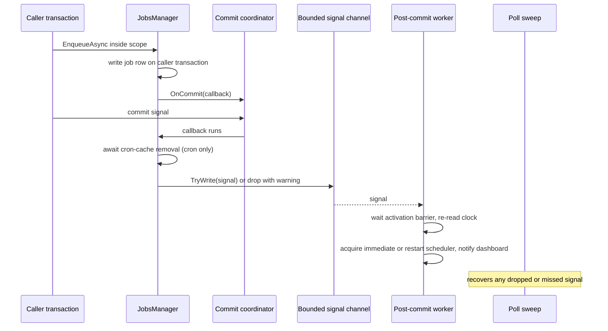
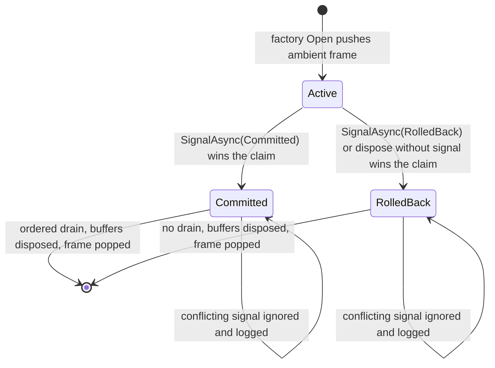

# Explicit Transaction Guarantees - Plan

## Goal Capsule

- **Objective:** An application developer can tell, from the operation they call and the policy they registered, whether a message or job is atomic with their transaction, durable on its own, or fire-and-forget, and the framework refuses a silently weaker guarantee instead of granting it. Framework maintainers carry one small commit-coordination contract whose public surface matches what Messaging and Jobs use.
- **Means:** Change the public guarantees first (durable-by-default delivery modes, a strict `Coordinated` mode, Jobs post-commit work moved to a worker), then rebuild the coordinator to the minimal contract (KD1 to KD5, KTD1 to KTD14).
- **Authority:** This contract, the session decisions recorded under Key Decisions, and the repository conventions in `CLAUDE.md`, `CONCEPTS.md`, and `docs/authoring/AUTHORING.md`.
- **Execution:** Stage 1 is U1 to U8, Stage 2 is U9 to U13, each stage in dependency order and shipped as its own pull request. Stop and report when evidence contradicts a Key Decision or an Assumption: a persisted numeric delivery-mode column that forbids renumbering the enum, a conformance scenario that cannot hold without join scopes, or an in-doubt commit that the rebuilt coordinator would observe as a rollback.
- **Tail ownership:** The calling delivery workflow owns review, commits, pull requests, and CI monitoring.

---

## Product Contract

### Summary

Replace the implicit `Auto` delivery mode with a durable default and a strict `Coordinated` mode, add per-message-type delivery policy, move Jobs post-commit side effects off the commit path, support atomic enlistment for recurring definitions, and then rebuild `Headless.CommitCoordination` to the six members its consumers use. One guarantee matrix is published in the messaging, jobs, and commit-coordination guides.

### Problem Frame

Messaging, Jobs, and CommitCoordination together implement the transactional outbox pattern, but the guarantee a caller receives depends on ambient setup that the call site cannot see. `DeliveryMode.Auto`, the host default, resolves to direct transport delivery when no coordination scope is active, even though every messaging host registers durable storage. A developer who forgets to open a coordinated transaction still gets a successful publish, with message loss on broker failure or a phantom message on rollback as the failure modes. Jobs make atomicity opt-in through `RequireAtomicEnlistment`, and recurring definitions reject that option outright.

The coordinator itself has grown into a general transaction-orchestration framework. Eight packages and about 4,900 lines serve a contract that Messaging, Jobs, and the Headless EF adapter reach through six members. Nothing outside the coordinator packages calls `OnRollback`. Every production provider opens a fresh root scope, so child scopes and promotion serve only the in-memory test provider. The `DurableWork` package has no production subclass. The SQL Server package spends most of its lines on out-of-band diagnostic commit detection that its own README calls fragile, while its transaction helper already signals commit explicitly. The `ICommitCoordinator` documentation promises relay recovery and no-op terminal registration; the implementation is in-memory and throws.

Jobs also runs asynchronous side effects inside the coordinator's commit drain, with timeout, late-fault observation, and cancellation-source lifetime handling that exist only because the drain accepts asynchronous work. Messaging already solved the same problem with a non-blocking enqueue.

### Key Decisions

- KD1. **Breaking changes over compatibility shims.** (session-settled: user-directed — chosen over obsolete paths or dual behavior: this is a greenfield framework and a smaller contract now is cheaper than a migration later.) Governs R1, R11, R14, R15, R17.
- KD2. **The guarantee lives on the contract, discovered ambiently.** Delivery mode is set per call, per message type, or per host; job atomicity per call or per function policy; the coordinator is still discovered through the ambient scope. (session-settled: user-approved — chosen over a transaction-bound `tx.Bus` / `tx.Jobs` facade: DI-injected publishers in handlers and domain services cannot receive a handle, the coordinator packages cannot name Messaging or Jobs types, and a facade would add a second publish path rather than remove one.) Governs R1 to R4, R12.
- KD3. **Rebuild the coordinator to the minimal contract.** (session-settled: user-approved — chosen over pruning inside the existing general framework: consumers use five members, no production provider uses join scopes, and the conformance harness already exists as the specification.) Governs R15 to R17.
- KD4. **Savepoint-blind callbacks and EF pre-commit replay stay as they are.** Documentation states them. (session-settled: user-approved — chosen over the retry and savepoint contract redesign in the external assessment: both transaction owners are internally consistent, the savepoint trade-off is tested and documented, and the plain EF helper's replay is EF's own execution-strategy contract.) Governs R13, R19.
- KD5. **The contract change lands before the coordinator rebuild.** (session-settled: user-approved — chosen over one combined change: Stage 1 is independent of coordinator internals and removes the only asynchronous post-commit consumer, which makes Stage 2 mechanical.) Governs the unit sequence.
- KD6. **`Auto` is removed; `Durable` is the default.** Messaging storage is mandatory at startup, so `Auto` could never resolve to direct by absence of storage and would equal `Durable` in every host. Three modes remain: `Durable`, `Coordinated`, `Direct`. Confirmed by the user before implementation started; see Assumptions. Governs R1, R3, R6.
- KD7. **In-memory messaging storage participates in non-relational coordinated scopes.** Without it, `Coordinated` cannot be exercised through `Headless.Messaging.Testing`. Confirmed by the user before implementation started; see Assumptions. Governs R7, R8.

### Requirements

**Messaging delivery guarantees**

- R1. A publish or enqueue with no per-call, per-type, or host override stores the message durably before dispatch: inside the caller's transaction when a compatible live coordinated transaction is active, standalone when no scope is active, and rejected before any effect when the active boundary is incompatible. No mode resolves to direct transport by omission.
- R2. `DeliveryMode.Coordinated` fails before any storage or transport effect unless a compatible live coordinated transaction is active, including when no coordinator is registered and when the active boundary is incompatible.
- R3. `DeliveryMode.Direct` remains an explicit choice per call, per message type, and as host default. It bypasses storage and coordination compatibility checks and still rejects `Delay` and `ScheduledAt`.
- R4. Delivery mode precedence is per call, then per message type registration, then host default.
- R5. A host whose default mode or any per-type policy is `Coordinated` fails startup validation unless a real commit coordinator is registered and, when durable consumers exist, the required inbox capability is `Transactional`.
- R6. Requested mode names `Durable`, `Coordinated`, and `Direct` appear in the delivery headers, telemetry tags, and dashboards. The resolved mode stays `Durable` or `Direct`.
- R7. In-memory messaging storage accepts a coordinator that carries no relational handle: rows become visible on commit and are discarded on rollback. A coordinator that carries a relational handle stays incompatible with in-memory storage.
- R8. `Headless.Messaging.Testing` works under the store-first default: harness reset does not race in-flight dispatch, recorded messages report the resolved mode truthfully, and a test can run work inside a coordinated scope.

**Jobs**

- R9. A coordinated job write registers only a synchronous, non-blocking commit callback. Immediate dispatch acquisition, scheduler restart, and dashboard notification run on a background worker. A dropped or missed signal delays pickup until the next poll sweep and never loses work. The cron path additionally awaits one bounded cache-invalidation call before returning.
- R10. Cron-expression cache invalidation runs on commit and is never dropped.
- R11. `SchedulerOptionsBuilder.PostCommitDrainTimeout` is removed.
- R12. Recurring definitions honor `RequireAtomicEnlistment` from function policy or call options: missing or incompatible coordination fails before persistence, and a compatible live transaction enlists the row. Startup seeding of attribute-defined definitions is exempt and documented as such.

**Commit coordination**

- R13. `ICommitCoordinator` documentation states the real contract: callbacks are process-local, run once per coordinator instance after the durable outcome, receive no cancellation, are not recovered after a crash, and registration after a terminal state throws.
- R14. The `Headless.CommitCoordination.DurableWork` package is removed with every reference.
- R15. The public coordinator contract is reduced to coordinator state, the relational handle, commit callbacks, scope-local state, one scope factory method, and explicit scope signaling. Rollback callbacks, child and join scopes, the capability bag, `CommitCoordinatorBindings`, the public signal-source interface, and the in-memory provider package are removed.
- R16. These semantics survive the rebuild: the first terminal claim wins between signal and dispose; an un-signalled dispose is a rollback; a repeated same-outcome signal is a silent no-op and a conflicting later signal is logged and ignored; callbacks drain in registration order without cancellation; a callback fault does not stop the remaining callbacks and surfaces after the drain; scope-local buffers are disposed on both outcomes; disposing a scope while an inner scope is still active throws, and disposing a frame its parent already popped is a no-op; an EF interceptor signal claims the outcome synchronously on the commit thread and drains off-thread.
- R17. Raw ADO enlistment on SQL Server and PostgreSQL shares one contract: the transaction helpers signal commit for the caller, a caller who enlists directly signals explicitly, and an un-signalled dispose after the transaction has completed logs a warning. SQL Server out-of-band diagnostic detection, its probe, hosted service, and options are removed.
- R18. The EF interceptor signal path and the EF interceptor startup gate remain.

**Documentation and verification**

- R19. One guarantee matrix (mode by coordination state to outcome) appears in `docs/llms/messaging.md`, `docs/llms/jobs.md`, `docs/llms/commit-coordination.md`, and `CONCEPTS.md`. Package READMEs and `docs/llms/index.md` reflect every removed or changed option, package, and behavior.
- R20. The affected provider integration suites pass locally before either stage is declared done, because CI runs unit tests only.

### Success Criteria

- A rollback-discard test exists for each subsystem: a message published and a job enqueued inside a rolled-back coordinated transaction leave no row and no dispatch.
- The commit-coordination conformance harness passes on the EF, PostgreSQL, and SQL Server fixtures after the rebuild, with the child and join scenarios removed and the new terminal-race scenarios added.
- The three guides and `CONCEPTS.md` carry the same matrix, and no doc states that the default sends directly outside coordination.
- The public type list of the coordinator packages after Stage 2 contains only the members named in R15 plus value types, helpers, and registration entry points.

### Scope Boundaries

- No transaction-bound publisher or scheduler facade (KD2).
- No change to savepoint semantics or to the plain EF helper's pre-commit replay (KD4).
- Messaging storage stays mandatory. Making it optional was considered and rejected as a larger capability-model change with no consumer asking for it.
- The two EF commit-coordination packages are not merged; their dependency directions differ.
- `RequireAtomicEnlistment` keeps its name and boolean shape.
- No cross-node job wake-up is introduced. Jobs notification remains a dashboard broadcast; worker nodes discover rows by polling.
- No two-database atomicity. Atomicity applies only when all participating rows use the same database transaction.

#### Deferred to Follow-Up Work

- A coalescing signal book for the Jobs worker if drop counters show the bounded channel filling in practice.
- The untracked assessment file `docs/jobs-messaging-commit-coordination-review.html` is not part of this change and is not committed.

### Acceptance Examples

- AE1. Durable default without a scope.
  - **Covers:** R1
  - **Given:** a host with PostgreSQL messaging storage and default options, no coordinated scope active
  - **When:** `bus.PublishAsync(new OrderPlaced(id))`
  - **Then:** an outbox row exists before the call returns, the relay dispatches it, and the resolved header says `Durable`.
- AE2. Durable default inside a compatible scope.
  - **Covers:** R1
  - **Given:** the same host, publish inside `db.ExecuteCoordinatedTransactionAsync`
  - **When:** the operation throws after the publish
  - **Then:** no outbox row exists and the transport received nothing.
- AE3. Coordinated without a scope.
  - **Covers:** R2
  - **Given:** `OrderPlaced` registered with `Coordinated` policy
  - **When:** published from a hosted service with no transaction
  - **Then:** an `InvalidOperationException` is thrown, storage received no call, and the transport received no call.
- AE4. Per-call override beats per-type policy.
  - **Covers:** R3, R4
  - **Given:** a type registered as `Durable`
  - **When:** published with `PublishOptions { DeliveryMode = Direct }` and no delay
  - **Then:** the transport receives the message and storage receives no call.
- AE5. Coordinated startup gate.
  - **Covers:** R5
  - **Given:** `DefaultDeliveryMode = Coordinated` and no commit coordination registration
  - **When:** the host starts
  - **Then:** startup validation fails with a message naming the missing coordinator registration.
- AE6. Job side effects survive a full channel.
  - **Covers:** R9
  - **Given:** the post-commit channel is full
  - **When:** a coordinated time job commits
  - **Then:** the commit callback returns without blocking, a drop is logged and counted, and the fallback poll sweep dispatches the job.
- AE7. Recurring definition with required atomicity.
  - **Covers:** R12
  - **Given:** a function policy with `RequireAtomicEnlistment`
  - **When:** `ScheduleRecurringAsync` runs outside any transaction
  - **Then:** it throws before any row is written; inside a compatible transaction it writes the cron row on the caller's transaction.
- AE8. Repeated commit signal.
  - **Covers:** R16
  - **Given:** a scope whose EF interceptor already signalled `Committed`
  - **When:** the inbox runner also signals `Committed`
  - **Then:** callbacks ran once and no warning is logged; a later `RolledBack` signal is ignored and logged.

---

## Planning Contract

### Key Technical Decisions

- KTD1. **Storage availability enters the resolver from the capability gate, not the writer resolver.** `DeliveryDecisionResolver.Resolve` takes a lane-scoped "outbox supported" input sourced from `IMessageCapabilityModel` through `IMessageCapabilityGate`. `OutboxMessageWriter` is registered unconditionally and throws when storage is missing, so probing it cannot express absence. The "storage missing" throw for `Durable` moves from inside the publish pipeline to before it, which is what R2 and R3 require.
- KTD2. **`DeliveryMode` becomes `Durable = 0`, `Coordinated = 1`, `Direct = 2`.** Names are the wire contract (headers use `ToString("G")` and `Enum.TryParse`), and monitoring reads modes from headers, so renumbering is safe. The implementer confirms no provider persists the numeric value and no documented configuration sample binds the enum by number before changing the numbers; if one does, keep the old numbers and only add `Coordinated`.
- KTD3. **Per-type policy is a nullable `DeliveryMode` on `MessageRegistration`, indexed by declared type and lane.** `IBusMessageBuilder<T>` and `IQueueMessageBuilder<T>` gain `WithDeliveryMode(DeliveryMode)`, following the `RequireRoutingAffinity` precedent. Explicit registrations are unique per type and lane; assembly-scan and framework contributions are not, and several can share a key. The frozen `(Type, MessageLane)` index is built only from registrations whose delivery policy is set, and `RegisterMessageRegistration` already rejects a second explicit registration for the same key. The publisher resolves the policy from `options.MessageType ?? typeof(T)` and the lane before `Resolve`, with exact type match. Assembly-scan and framework consumer registrations carry no policy. `WithMessageNameMapping<T>` does not create a registration and is not a policy carrier. A per-type `Direct` combined with a per-call `Delay` throws, because `Delay` is not a mode.
- KTD4. **The `Coordinated` startup gate lives in capability validation.** `MessagingCapabilityModel.ValidateStartup` receives the host default and the set of per-type modes. It rejects `Coordinated` when no `ICommitScopeFactory` is registered, the one registration `AddCommitCoordination` makes that neither the messaging nor the Jobs null coordinator sentinel can shadow, so the check is independent of registration order, and rejects `Coordinated` with durable consumers when the required inbox capability is weaker than `Transactional`, because handlers would then publish outside any scope and fail every attempt.
- KTD5. **In-memory storage captures coordinated rows in a scope-local buffer.** `InMemoryDataStorage.Resolve` returns compatible for an active coordinator with no relational handle. `IDataStorage.StoreMessageAsync` carries only a database transaction, so an internal Messaging.Core seam passes the coordinator for non-relational coordinated writes: `OutboxMessageWriter` calls it when the decision carries a coordinator and no transaction, and `InMemoryDataStorage` implements it. Rows written through that seam go into a coordinator-scoped buffer obtained through `GetOrAdd`, registered before the outbox buffer so rows are visible before dispatch; the buffer moves rows into the published set on commit and rollback disposes it. A coordinator with a relational handle remains incompatible, because in-memory rows cannot be atomic with a database.
- KTD6. **Jobs post-commit work is a bounded channel of signal records drained by one hosted worker.** The commit callback does two things: awaits the cron-expression cache removal (R10), bounded by one `WaitAsync` against a fixed internal deadline that logs a warning on timeout and lets the removal complete unobserved, and `TryWrite`s a signal record. Signal kinds: time jobs committed (ids with execution times), cron jobs committed (entities with the persisted earliest next-due), and schedule changed (keyed operations). The worker waits for the activation barrier, re-reads the clock when it processes a time-job signal, runs the existing side-effect methods, bounds each signal with one `WaitAsync` against a fixed internal deadline so a hung dashboard send cannot block later signals, logs and continues on fault or timeout, and on stop drains the items already present within the shutdown timeout. A full channel drops the incoming signal with a warning and a counter. The worker is registered whenever Jobs is registered, including with `DisableBackgroundServices()`: on such hosts the scheduler and dispatcher are no-ops and the notify send reaches a dashboard only when one is mounted, so the worker is harmless and keeps the callback shape uniform. Alternative considered: a coalescing signal book with an interlocked restart flag and bounded id sets. Deferred until drop counters show the channel filling; `RestartIfNeeded` already coalesces scheduler restarts.
- KTD7. **The recurring atomic requirement is a transient entity flag mirrored from time jobs.** `CronJobEntity` gets `[JsonIgnore] RequireAtomicEnlistment`, ignored in the single cron EF configuration next to `IsSystemJob`. `RecurringJobOptions` gains `RequireAtomicEnlistment` so call-level parity with `JobOptions` exists. `ResolveRecurring` keeps excluding the host default. `JobsManager` cron single and batch paths pass the requirement into `_TryCaptureCoordinatedContext`. Startup seeding through `IInternalJobManager` does not consult policies and stays exempt, because it runs before any application transaction exists and definitions are idempotent. Evaluation fingerprints are computed provider-side from schedule inputs, so no fingerprint exclusion is needed; the JSON exclusion test from the time-job path is replicated.
- KTD8. **New coordinator contract shapes.** `ICommitCoordinator` exposes `State`, `IRelationalCommitContext? Relational`, `IDisposable OnCommit(Func<ValueTask>)`, and the two `GetOrAdd` overloads constrained to `class`. `CommitContext` is deleted: callbacks drain only on commit, so its outcome was always the same value, no callback in the repository reads its service provider or capabilities, and dropping the owned service scope removes `TrackedCommitScope`. `ICommitScopeFactory` has one method, `Open(IRelationalCommitContext? relational)`, marked `[EditorBrowsable(EditorBrowsableState.Never)]`. `ICommitScope` keeps `Coordinator`, `SignalAsync(CommitOutcome)`, and async dispose. `CommitRetryGuard` stays public and hidden from IntelliSense. `InMemoryWorkBuffer<T>` moves into `Headless.Messaging.Core` as internal. `CommitContext`, `ICommitWorkBuffer`, `ICommitCapability`, `CommitCoordinatorBindings`, `ICommitSignalSource`, `CommitSignalSourceAttach`, `TrackedCommitScope`, `OnRollback`, `Begin`, `BeginNew`, and `CreateChild` are deleted. This drops `CommitContext`, which the settled table listed as kept; review confirmed the argument carried no information, and dropping it now avoids a second signature change later.
- KTD9. **Duplicate signals are idempotent per outcome.** A repeated same-outcome signal is a silent no-op. A conflicting later signal is ignored with a warning. This replaces the current racing-signal warning, which would fire on every inbox commit once the runners signal through the scope (KTD10).
- KTD10. **The EF package owns the transaction-to-scope map and the inbox runners signal through the scope.** `CommitCoordinationTransactionInterceptor` keeps a `DbTransaction` to `ICommitScope` map internal to `Headless.CommitCoordination.EntityFramework`. The messaging EF storage inbox runners call `coordinationScope.SignalAsync(Committed)` on the explicit and probe-confirmed paths instead of the internal signal-source methods, which removes the `InternalsVisibleTo` coupling for signaling. The interceptor keeps claiming the outcome synchronously on the commit thread and draining off-thread. Both `AddEntityFrameworkCommitCoordination` overloads stay public, because the Headless EF adapter and two test projects outside the visibility list call the nongeneric one. The EF enlistment wrapper registers the transaction-to-scope entry and removes it in the scope's dispose, so eviction never depends on an interceptor event; a commit that throws but is probe-confirmed raises none.
- KTD11. **The SQL Server package survives as the ADO helper package in the PostgreSQL shape.** `AddSqlServerCommitCoordination()` keeps only the parameterless overload. `SqlServerCommitCoordinationOptions`, the diagnostic observer, listener observer, probe, probe state and status, and hosted service are deleted with their tests. `SqlConnection.EnlistCommitCoordination` documents the explicit-signal contract, and an un-signalled dispose whose transaction has already completed logs a warning (R17). `docs/solutions/architecture-patterns/coordination-domains-boundary.md` records the new reason the package exists.
- KTD12. **Harness first, then Core, rebuilt in place.** The conformance harness is rewritten to the new contract before Core changes, so the failing tests define the work. Packages, namespaces, and project names are unchanged; the rebuild replaces files inside `Headless.CommitCoordination.Abstractions` and `.Core`. The internal `CommitScopeFactory` and `CommitScopeStack` constructors stay constructible, because Messaging unit tests build them directly.
- KTD13. **Stage 1 tests assert public outcomes.** Row present after commit, row absent after rollback, throw before effects. No Stage 1 test asserts coordinator internals, so Stage 2 does not invalidate them. The Jobs `FakeCommitCoordinator` in the routing tests is replaced once, in U11, by a real scope opened through the rebuilt factory; replacing it in Stage 1 would need a project reference to a surface U10 deletes.
- KTD14. **Messaging test harness quiesces before clearing.** A new `MessagingTestHarness.ResetAsync` drains in-flight dispatcher work before `InMemoryDataStorage.Clear()` and replaces the synchronous `Clear()` (KD1). The harness default mode stays the production default so tests exercise the store-first path. A `RunCoordinatedAsync` helper opens a non-relational scope through the factory so consumers can test `Coordinated` (KD7). The testing package references `Headless.CommitCoordination.Core` and registers coordination in the harness host, so the helper can open a scope and a type registered `Coordinated` passes the startup gate; the new dependency is documented.

### High-Level Technical Design

**Delivery decision matrix (R1 to R3).** Every throw happens before storage or transport effects.

| Requested mode | Compatible live coordinated scope | No scope | Incompatible scope |
|---|---|---|---|
| `Durable` (default) | capture in caller transaction, dispatch after commit | store first, relay dispatches | throw |
| `Coordinated` | capture in caller transaction, dispatch after commit | throw | throw |
| `Direct` | transport now | transport now | transport now |

`Delay` and `ScheduledAt` keep requiring storage and are rejected with `Direct`. Storage is mandatory at startup, so "no storage" is a configuration error surfaced by the startup gate rather than a fourth matrix column; the resolver still takes storage support as a defensive input for manually built contexts and misconfigured hosts.

**Jobs coordinated enqueue after this plan (R9, R10).**

**Coordinator scope lifecycle after the rebuild (R16).**

Registration after a terminal state throws. The EF interceptor claims on the commit thread and continues the drain off-thread; the PostgreSQL and SQL Server helpers claim inline after the commit call returns.

### Assumptions

- KD6 (drop `Auto`, default `Durable`) was proposed as a default while the user was away and confirmed by the user on 2026-09-13 before implementation started. The rejected alternative was keeping `Auto` resolving to direct outside a scope beside a new `Coordinated` mode.
- KD7 (in-memory storage participates in non-relational scopes) was proposed the same way and confirmed the same day. The rejected alternative was documenting `Coordinated` as untestable through the messaging test harness.

### Sequencing

Stage 1 (pull request one): U1, U2, U3, U5, U6, U7 can proceed after U1 in parallel where files do not overlap; U4 and U8 close the stage. Stage 2 (pull request two, branched after Stage 1 merges): U9, then U10, then U11 and U12 in parallel, then U13.

### Deferred Implementation Notes

- Whether any provider persists `DeliveryMode` as a number is confirmed at U1 start (KTD2).
- The exact channel capacity and per-signal deadline constants for the Jobs worker are chosen during U5 from the existing scheduler and dispatcher constants.
- The precise quiesce mechanism in the messaging test harness depends on the dispatcher's existing drain hooks and is settled during U4.
- The list of docs that mention `CommitCoordinatorBindings` or the SQL Server probe is regenerated by grep at U13, because Stage 1 edits may move lines.

### System-Wide Impact

- Every consumer that publishes outside a transaction moves from direct transport to store-first delivery, which adds one storage write and one relay hop per message and grows retention tables. `DynamicPermissionDefinitionStore` publishes with the default mode and is affected. `Headless.Caching.Hybrid` and `Headless.DistributedLocks.*` pass explicit `Direct` and are unaffected.
- The messaging retry and terminal-state pipeline becomes the mainline for every default publish; its existing conformance suites are the safety net.
- Jobs enqueue latency inside transactions drops, because the commit path no longer awaits dispatch or dashboard sends.
- Raw ADO users on SQL Server who enlisted without the helper lose automatic commit detection and must signal explicitly, matching PostgreSQL.

### Risks

- **Throughput regression for high-rate non-transactional publishers.** Mitigation: `Direct` per type or per host, and the change is named in the Stage 1 pull request description.
- **Test harness timing.** Store-first publishes reach the recording transport asynchronously. Mitigation: KTD14 quiesce and any needed await helper; flakiness in `Headless.Messaging.Testing.Tests.Unit` blocks Stage 1.
- **Hidden numeric persistence of `DeliveryMode`.** Mitigation: KTD2 check before renumbering.
- **Messaging EF storage packages depend on coordinator internals.** Mitigation: KTD10 moves the runners onto the public scope API within U12, so they never call the internal signal-source methods U10 removes.
- **Large Stage 2 diff.** Mitigation: harness first (KTD12), one package per commit, conformance and integration suites run per provider.
- **Dashboard rebuild.** The Vue type union changes, so `make dashboards` requires Node 22 or newer.

---

## Implementation Units

| U-ID | Title | Key files | Depends on |
|---|---|---|---|
| U1 | Delivery modes and resolver | `src/Headless.Messaging.Abstractions/DeliveryMode.cs`, `src/Headless.Messaging.Core/Internal/DeliveryDecisionResolver.cs`, `src/Headless.Messaging.Core/Internal/MessagePublisher.cs` | none |
| U2 | Per-type delivery policy and Coordinated gate | `src/Headless.Messaging.Core/Registration/MessageBuilder.cs`, `src/Headless.Messaging.Core/Configuration/MessagingCapabilityModel.cs` | U1 |
| U3 | In-memory coordinated capture | `src/Headless.Messaging.Storage.InMemory/InMemoryDataStorage.cs` | U1 |
| U4 | Messaging test harness under store-first | `src/Headless.Messaging.Testing/MessagingTestHarness.cs` | U1, U3 |
| U5 | Jobs post-commit worker | `src/Headless.Jobs.Core/Managers/JobsManager.CommitCoordination.cs`, `src/Headless.Jobs.Core/BackgroundServices/` | none |
| U6 | Recurring atomic enlistment | `src/Headless.Jobs.Abstractions/Entities/CronJobEntity.cs`, `src/Headless.Jobs.Core/JobScheduler.cs` | none |
| U7 | Coordinator doc correction and DurableWork removal | `src/Headless.CommitCoordination.Abstractions/ICommitCoordinator.cs`, `src/Headless.CommitCoordination.DurableWork/` | none |
| U8 | Stage 1 guarantee matrix and docs | `docs/llms/messaging.md`, `docs/llms/jobs.md`, `docs/llms/commit-coordination.md`, `CONCEPTS.md` | U1 to U7 |
| U9 | Conformance harness rewrite | `tests/Headless.CommitCoordination.Tests.Harness/` | U8 merged |
| U10 | Abstractions and Core rebuild | `src/Headless.CommitCoordination.Abstractions/`, `src/Headless.CommitCoordination.Core/` | U9 |
| U11 | Consumer migration | `src/Headless.Messaging.Core/`, `src/Headless.Messaging.Storage.*/`, `src/Headless.Jobs.Core/`, `src/Headless.EntityFramework.CommitCoordination/` | U10 |
| U12 | Provider packages | `src/Headless.CommitCoordination.EntityFramework/`, `src/Headless.CommitCoordination.SqlServer/`, `src/Headless.CommitCoordination.PostgreSql/`, `src/Headless.CommitCoordination.InMemory/` | U10 |
| U13 | Stage 2 docs | `docs/llms/commit-coordination.md`, coordinator package READMEs, `docs/solutions/` | U11, U12 |

### U1. Delivery modes and resolver

- **Goal:** `Durable` is the default, `Coordinated` exists, `Auto` is gone, and the resolver decides from storage support and coordination state before any effect.
- **Requirements:** R1, R2, R3, R6 (KD6 governs; KD1 governs the removal).
- **Dependencies:** none.
- **Files:** `src/Headless.Messaging.Abstractions/DeliveryMode.cs`, `src/Headless.Messaging.Abstractions/MessageOptions.cs`, `src/Headless.Messaging.Core/Internal/DeliveryDecisionResolver.cs`, `src/Headless.Messaging.Core/Internal/MessagePublisher.cs`, `src/Headless.Messaging.Core/PublishContext.cs`, `src/Headless.Messaging.Core/Configuration/MessagingCapabilityModel.cs`, `src/Headless.Messaging.Core/Configuration/MessagingOptions.cs`, `src/Headless.Messaging.Core/Internal/DeliveryModeTagEnricher.cs`, `src/Headless.Messaging.Core/MessagingTags.cs`, `src/Headless.Messaging.Core/Internal/Bus.cs`, `src/Headless.Messaging.Core/Internal/Queue.cs`, `src/Headless.Messaging.Dashboard/wwwroot/src/components/MessageDetailDialog.vue`; tests `tests/Headless.Messaging.Core.Tests.Unit/Internal/DeliveryDecisionResolverTests.cs`, `tests/Headless.Messaging.Core.Tests.Unit/Internal/DeliveryEnumArityTests.cs`, `tests/Headless.Messaging.Core.Tests.Unit/Internal/MessagePublisherDeliveryTests.cs`, `tests/Headless.Messaging.Core.Tests.Unit/ContextTypes/PublishContextTests.cs`, `tests/Headless.Messaging.Core.Tests.Unit/Configuration/DefaultDeliveryModeTests.cs`, `tests/Headless.Messaging.Core.Tests.Unit/Internal/IsTransactionalPropagationTests.cs`, `tests/Headless.Messaging.Testing.Tests.Unit/EndToEndTests.cs`.
- **Approach:**
  1. Reshape the enum per KTD2 and rewrite the XML docs on the enum, `MessageOptions.DeliveryMode`, `Delay`, `ScheduledAt`, and `MessagingOptions.DefaultDeliveryMode`.
  2. Add a non-throwing lane-scoped outbox-support query to `IMessageCapabilityGate` (KTD1) and pass it into `Resolve`; the resolver's guards, resolved-mode switch, and path switch implement the matrix in High-Level Technical Design.
  3. Extend the public `PublishContext<TMessage>` constructor with the storage-support input beside `isTransactional`, defaulting to storage supported, which mirrors every real host, so existing manual constructions keep working and `Direct` still resolves direct when asked.
  4. The direct-construction `Bus` and `Queue` constructors, which run with a transport-only capability model, default to `Direct`.
  5. Teach the tag enricher `coordinated`, update the tag XML docs, and add `'Coordinated'` to the dashboard type union.
- **Patterns to follow:** the existing incompatible-boundary throw at the top of `Resolve` is the template for the `Coordinated` rejection; `DeliveryMetadata` needs no change because it parses names.
- **Test scenarios:**
  - The decision table theory covers every cell of the matrix for both lanes, plus the defensive storage input: `Durable` with storage support false throws before any capability call.
  - `Coordinated` with no coordinator, with an incompatible boundary, and with a compatible boundary whose transaction is no longer live all throw before storage or transport calls.
  - `Coordinated` with a delay inside a compatible scope resolves to coordinated durable with the delay preserved.
  - Enum arity test pins `[Durable, Coordinated, Direct]` and names the resolver guard.
  - Publisher tests: default publish without a scope stores a row and does not call the transport directly; default publish inside a compatible scope stores on the captured transaction; explicit `Direct` sends and never touches storage; a direct-construction `Bus` publishes directly.
  - Manually constructed `PublishContext` with `Coordinated` and `isTransactional: false` throws; with `Durable` and the default storage input it resolves durable standalone; with storage support explicitly false it throws; with `Direct` it resolves direct.
  - Tag enricher emits `coordinated` for the requested mode and never emits it as a resolved mode.
  - End-to-end test in `Headless.Messaging.Testing.Tests.Unit` asserts the recorded resolved mode is `Durable` for a default publish.
- **Verification:** `tests/Headless.Messaging.Core.Tests.Unit` and `tests/Headless.Messaging.Abstractions.Tests.Unit` pass; `make build-project` and `make quality-analyzers-project` are clean for `Headless.Messaging.Abstractions` and `Headless.Messaging.Core`; the dashboard builds with `make dashboards`.

### U2. Per-type delivery policy and Coordinated gate

- **Goal:** A message type can pin its delivery mode at registration, precedence is per call, then type, then host, and a `Coordinated` host fails startup when it cannot honor it.
- **Requirements:** R4, R5 (KD2 governs).
- **Dependencies:** U1.
- **Files:** `src/Headless.Messaging.Core/Registration/MessageBuilder.cs`, `src/Headless.Messaging.Core/Registration/MessageRegistration.cs`, `src/Headless.Messaging.Core/Registration/MessageRegistrationBuilders.cs`, `src/Headless.Messaging.Core/Internal/MessagePublisher.cs`, `src/Headless.Messaging.Core/Setup.cs`, `src/Headless.Messaging.Core/Configuration/MessagingCapabilityModel.cs`, `src/Headless.Messaging.Core/Configuration/MessagingSetupBuilder.cs`; tests `tests/Headless.Messaging.Core.Tests.Unit/Configuration/DefaultDeliveryModeTests.cs`, `tests/Headless.Messaging.Core.Tests.Unit/Configuration/MessagingCapabilityModelTests.cs` (create if absent), `tests/Headless.Messaging.Core.Tests.Unit/Internal/MessagePublisherDeliveryTests.cs`.
- **Approach:**
  1. Add `WithDeliveryMode` to both message builder interfaces and carry it into `MessageRegistration` (KTD3).
  2. Build the frozen `(Type, MessageLane)` index at publisher construction from the registered `MessageRegistration` services that carry a policy, and inject it (KTD3).
  3. Resolve the effective requested mode before `Resolve` using the precedence in R4.
  4. Extend startup validation with the `Coordinated` gate (KTD4): presence of the `ICommitScopeFactory` registration plus the durable-consumer inbox-tier rule, with error messages that name the missing registration.
- **Patterns to follow:** `RequireRoutingAffinity` on the builders; `_CheckRequirement` in the messaging bootstrapper for the startup error shape.
- **Test scenarios:**
  - A type registered `Coordinated` and published without a per-call override inside a compatible scope resolves coordinated; outside a scope it throws before effects.
  - A per-call `Direct` on a type registered `Durable` sends directly; a per-call `Delay` on a type registered `Direct` throws before effects.
  - A type registered on both lanes with different modes resolves per lane.
  - A callback response, which sets `MessageType` and `MessageName` explicitly, resolves policy by the declared type and Bus lane.
  - An assembly-scan registration has no policy and inherits the host default.
  - Assembly scan with two consumers for one message type plus an explicit policy registration builds the publisher and applies the explicit policy.
  - Startup with `DefaultDeliveryMode = Coordinated` and no commit coordination registration fails, including when Jobs is registered before Messaging; with `AddCommitCoordination()` it passes.
  - Startup with any per-type `Coordinated`, durable consumers, and an inbox tier below `Transactional` fails; with `Transactional` it passes.
- **Verification:** `tests/Headless.Messaging.Core.Tests.Unit` passes; analyzer gate clean for `Headless.Messaging.Core`.

### U3. In-memory coordinated capture

- **Goal:** In-memory messaging storage takes part in a non-relational coordinated scope so `Coordinated` and the coordinated `Durable` path are testable without a database.
- **Requirements:** R7 (KD7 governs).
- **Dependencies:** U1.
- **Files:** `src/Headless.Messaging.Storage.InMemory/InMemoryDataStorage.cs`, `src/Headless.Messaging.Core/Internal/DeliveryCoordination.cs`, `src/Headless.Messaging.Core/Internal/OutboxMessageWriter.cs`, `src/Headless.Messaging.Core/Internal/ICoordinatedMessageStore.cs` (create, internal seam, name indicative); tests `tests/Headless.Messaging.Storage.InMemory.Tests.Unit/InMemoryDataStorageCoordinationTests.cs` (create).
- **Approach:**
  1. Allow `DeliveryCoordination.Compatible` to carry a null transaction for non-relational scopes; keep the relational-handle check in the PostgreSQL and SQL Server storages unchanged.
  2. In `InMemoryDataStorage.Resolve`, return compatible for an active coordinator whose `Relational` is null and incompatible when a relational handle is present.
  3. Add the internal coordinated-write seam that passes the coordinator (KTD5); `OutboxMessageWriter` calls it when the decision carries a coordinator and no transaction. In-memory storage stores those rows in a scope-local buffer via `GetOrAdd`, registered before the outbox buffer so rows are visible before dispatch, moves them into the published set on commit, and lets rollback dispose them.
- **Patterns to follow:** `MessageOutboxBuffer` for the scope-local buffer shape.
- **Test scenarios:**
  - A publish inside a non-relational scope is invisible to monitoring until commit, then visible.
  - A publish inside a non-relational scope that rolls back leaves nothing in storage.
  - Two scopes in sequence do not leak rows between each other.
  - A coordinator with a relational handle is still reported incompatible.
- **Verification:** `tests/Headless.Messaging.Storage.InMemory.Tests.Unit` passes; the Messaging.Core storage harness parity suite still passes for the in-memory provider.

### U4. Messaging test harness under store-first

- **Goal:** `Headless.Messaging.Testing` remains reliable when every default publish is durable and exposes a way to test coordinated delivery.
- **Requirements:** R8.
- **Dependencies:** U1, U3.
- **Files:** `src/Headless.Messaging.Testing/MessagingTestHarness.cs`, `src/Headless.Messaging.Testing/Headless.Messaging.Testing.csproj`, `src/Headless.Messaging.Testing/RecordedMessage.cs`, `src/Headless.Messaging.Testing/README.md`, `docs/llms/messaging.md` (testing section); tests `tests/Headless.Messaging.Testing.Tests.Unit/EndToEndTests.cs`, `tests/Headless.Messaging.Testing.Tests.Unit/CoordinatedHarnessTests.cs` (create).
- **Approach:**
  1. Add `ResetAsync`, which drains in-flight dispatcher work before clearing in-memory storage, and remove the synchronous `Clear()` (KTD14).
  2. Add a coordinated-scope helper that opens a non-relational scope through the commit scope factory, runs the caller's delegate, and signals commit or rollback. Reference `Headless.CommitCoordination.Core` from the testing package and register coordination in the harness host.
  3. Re-document `RecordedMessage.ResolvedDeliveryMode`, the harness's store-first behavior, the reset change, and the new package dependency.
- **Patterns to follow:** existing harness wait helpers for consumer completion.
- **Test scenarios:**
  - A default publish is recorded once with resolved mode `Durable` and the consumer runs.
  - Reset immediately after a burst of publishes leaves no recorded message from the previous test.
  - The coordinated helper with commit records the message; with rollback it records nothing.
  - A type registered `Coordinated` published inside the helper succeeds and outside it throws.
- **Verification:** `tests/Headless.Messaging.Testing.Tests.Unit` passes ten consecutive runs without flakes; README and guide updated per `docs/authoring/AUTHORING.md`.

### U5. Jobs post-commit worker

- **Goal:** Coordinated job writes register a non-blocking commit callback; dispatch, restart, and notification run on a hosted worker; the drain-timeout option is gone.
- **Requirements:** R9, R10, R11 (KD1 governs the removal).
- **Dependencies:** none.
- **Files:** `src/Headless.Jobs.Core/Managers/JobsManager.CommitCoordination.cs`, `src/Headless.Jobs.Core/Managers/JobsManager.cs`, `src/Headless.Jobs.Core/Managers/JobsManager.Keyed.cs`, `src/Headless.Jobs.Core/BackgroundServices/JobsPostCommitSignalService.cs` (create, name indicative), `src/Headless.Jobs.Core/DependencyInjection/SetupJobs.cs`, `src/Headless.Jobs.Core/JobsOptionsBuilder.cs`, `src/Headless.Jobs.Core/README.md`, `docs/llms/jobs.md`; tests `tests/Headless.Jobs.Composition.Tests.Unit/Transactions/JobsManagerCoordinatedRoutingTests.cs`, `tests/Headless.Jobs.Composition.Tests.Unit/JobsOptionsBuilderTests.cs`, `tests/Headless.Jobs.Composition.Tests.Unit/Transactions/JobsPostCommitSignalServiceTests.cs` (create).
- **Approach:**
  1. Define the internal signal record kinds and a bounded channel owned by the worker (KTD6).
  2. Replace `_DeferSideEffects` and `_ObserveLateSideEffects` with a callback that awaits the bounded cron-cache removal where applicable (KTD6) and `TryWrite`s a signal; delete the four catch arms and the deferred cancellation-source handling.
  3. Implement the worker: activation-barrier wait, clock re-read for time-job signals, existing side-effect methods, per-signal `WaitAsync` bound, log-and-continue, shutdown drain.
  4. Register the worker unconditionally in `SetupJobs` beside `JobsInitializationHostedService`.
  5. Delete `PostCommitDrainTimeout`, its validation, and its docs.
- **Execution note:** Write the rollback-discard and full-channel tests first; they define the boundary between the callback and the worker.
- **Patterns to follow:** `Dispatcher.EnqueueCommittedMessage` and `MessageOutboxBuffer` for the non-blocking enqueue; `JobsSchedulerBackgroundService` for hosted-service shape and barrier wait; `docs/solutions/architecture-patterns/shared-broker-client-sender-pool.md` for one-shot dispose ordering.
- **Test scenarios:**
  - The commit callback returns synchronously: a time-job enqueue inside a scope completes commit without invoking dispatch or notify on the caller thread.
  - After commit, the worker acquires an immediately due job and dispatches it; a job due later arms the scheduler restart.
  - The worker re-reads the clock: a job enqueued five seconds before commit and due at commit time is dispatched immediately rather than scheduled.
  - A full channel drops with a warning and a counter, and the enqueue still returns.
  - A side effect that throws is logged and the next signal is processed.
  - A side effect that ignores cancellation and hangs is abandoned after the bound and the next signal is processed.
  - Host stop drains signals already present and does not accept new ones.
  - Cron enqueue inside a rolled-back scope leaves no row and no cache invalidation; inside a committed scope the cache is invalidated on the commit path even when the channel is full.
  - A stalled cache during a cron commit is abandoned after the fixed bound with a warning, and the caller's commit completes.
  - Keyed replace and cancel enqueue one schedule-changed signal each.
  - Batch enqueue produces one signal carrying all ids.
  - With `DisableBackgroundServices()`, a coordinated enqueue commits, the worker processes the signal, and no exception surfaces.
- **Verification:** `tests/Headless.Jobs.Composition.Tests.Unit` passes; `tests/Headless.Jobs.EntityFramework.PostgreSql.Tests.Integration` and `tests/Headless.Jobs.EntityFramework.SqlServer.Tests.Integration` pass locally; analyzer gate clean for `Headless.Jobs.Core`.

### U6. Recurring atomic enlistment

- **Goal:** Recurring definitions accept `RequireAtomicEnlistment` and fail loud without a compatible transaction.
- **Requirements:** R12.
- **Dependencies:** none.
- **Files:** `src/Headless.Jobs.Abstractions/Entities/CronJobEntity.cs`, `src/Headless.Jobs.Abstractions/Models/RecurringJobOptions.cs`, `src/Headless.Jobs.Core/JobScheduler.cs`, `src/Headless.Jobs.Core/JobSchedulingPolicies.cs`, `src/Headless.Jobs.Core/Managers/JobsManager.cs`, `src/Headless.Jobs.EntityFramework/Configurations/CronJobConfigurations.cs`, `src/Headless.Jobs.Abstractions/README.md`, `src/Headless.Jobs.Core/README.md`, `docs/llms/jobs.md`; tests `tests/Headless.Jobs.Composition.Tests.Unit/JobSchedulingDefaultsTests.cs`, `tests/Headless.Jobs.Composition.Tests.Unit/Transactions/JobsManagerRequiredAtomicTests.cs`, `tests/Headless.Jobs.EntityFramework.Tests.Harness/` cron conformance additions.
- **Approach:**
  1. Add the transient flag to `CronJobEntity` and ignore it in every EF cron configuration (KTD7).
  2. Add `RequireAtomicEnlistment` to `RecurringJobOptions`; resolve call or function policy in `ResolveRecurring` without the host default.
  3. In `JobScheduler`, set the entity flag instead of throwing; in `JobsManager` cron single and batch paths, pass the requirement into capture.
  4. Document the seeding exemption where recurring policy is described.
- **Patterns to follow:** the time-job flow from `JobOptions` through `JobAtomicity.IsRequired` to `_TryCaptureCoordinatedContext`.
- **Test scenarios:**
  - Function policy requiring atomicity: scheduling a recurring definition outside a transaction throws before persistence; inside a compatible transaction the row is written on the caller transaction and rolled back with it.
  - Call-level `RecurringJobOptions.RequireAtomicEnlistment` behaves the same as function policy.
  - The host atomic default is still ignored for recurring definitions.
  - Serializing a `CronJobEntity` never contains the flag; the EF model snapshot has no column for it.
  - Batch recurring scheduling with one required entity enlists the whole batch or fails before effects.
  - The in-memory provider with a required recurring definition fails loud at capture.
  - Startup seeding of an attribute-defined definition whose function policy requires atomicity still seeds.
- **Verification:** `tests/Headless.Jobs.Composition.Tests.Unit` and both Jobs EF integration suites pass locally.

### U7. Coordinator doc correction and DurableWork removal

- **Goal:** `ICommitCoordinator` documents the real contract and the `DurableWork` package is gone.
- **Requirements:** R13, R14 (KD1, KD4 govern).
- **Dependencies:** none.
- **Files:** `src/Headless.CommitCoordination.Abstractions/ICommitCoordinator.cs`, `src/Headless.CommitCoordination.Abstractions/InMemoryWorkBuffer.cs` (doc reference), delete `src/Headless.CommitCoordination.DurableWork/` and `tests/Headless.CommitCoordination.DurableWork.Tests.Unit/`, `src/Headless.CommitCoordination.Core/Headless.CommitCoordination.Core.csproj`, `tests/Headless.CommitCoordination.Conformance.Tests.Unit/Headless.CommitCoordination.Conformance.Tests.Unit.csproj`, `tests/Headless.CommitCoordination.Conformance.Tests.Unit/InMemoryCommitCoordinationSpecificTests.cs`, `headless-framework.slnx`, `README.md`, `README.ar.md`, `docs/llms/index.md`, `docs/llms/commit-coordination.md`.
- **Approach:**
  1. Rewrite the interface remarks: process-local, once per coordinator instance after the durable outcome, no cancellation, no crash recovery, registration after a terminal state throws; keep the savepoint trade-off statement (KD4).
  2. Remove the Core project's `InternalsVisibleTo` for the deleted tests, the conformance project's reference, and its three `DurableWorkBuffer` tests, then delete the package and its tests and the solution entries.
  3. Remove the package rows from both root READMEs and the index, and remove the `DurableWork` section from the guide.
- **Test scenarios:** Test expectation: none -- documentation and deletion only; the conformance project must still build and pass.
- **Verification:** the solution builds; `tests/Headless.CommitCoordination.Conformance.Tests.Unit` passes; `docs/authoring/AUTHORING.md` drift checks for package removal are satisfied.

### U8. Stage 1 guarantee matrix and docs

- **Goal:** The three guides, `CONCEPTS.md`, and the package READMEs state the new guarantees once and consistently.
- **Requirements:** R19 (KD4 governs the savepoint and replay statements).
- **Dependencies:** U1 to U7.
- **Files:** `docs/llms/messaging.md`, `docs/llms/jobs.md`, `docs/llms/commit-coordination.md`, `CONCEPTS.md`, `src/Headless.Messaging.Core/README.md`, `src/Headless.Messaging.Abstractions/README.md`, `src/Headless.Messaging.Bus.Abstractions/README.md`, `src/Headless.Messaging.Queue.Abstractions/README.md`, `src/Headless.Jobs.Core/README.md`, `src/Headless.Jobs.Abstractions/README.md`.
- **Approach:**
  1. Insert the matrix from High-Level Technical Design into each guide and the `CONCEPTS.md` delivery-mode entry, replacing every "no coordination sends directly" statement found by grep.
  2. Document precedence, the `Coordinated` startup gate, the telemetry tag values including `coordinated`, and the recurring atomic support.
  3. Add one paragraph per guide on savepoint blindness and EF pre-commit replay as documented behavior.
  4. Update the `CONCEPTS.md` transactional deadline capability entry to cover recurring definitions.
- **Test scenarios:** Test expectation: none -- documentation; verify by grep that no guide or README still contains the old `Auto` wording or `PostCommitDrainTimeout`.
- **Verification:** `docs/authoring/AUTHORING.md` drift checks pass; table of contents regenerated where sections changed.

### U9. Conformance harness rewrite

- **Goal:** The harness expresses the minimal contract and becomes the failing specification for U10.
- **Requirements:** R15, R16 (KD3 governs).
- **Dependencies:** Stage 1 merged.
- **Files:** `tests/Headless.CommitCoordination.Tests.Harness/CommitCoordinationConformanceTests.cs`, `tests/Headless.CommitCoordination.Tests.Harness/ICommitCoordinationFixture.cs`, `tests/Headless.CommitCoordination.Tests.Harness/CoordinatedTransactionConformanceTests.cs`, leaf fixtures in `tests/Headless.CommitCoordination.Conformance.Tests.Unit/`, `tests/Headless.CommitCoordination.EntityFramework.Tests.Unit/`, `tests/Headless.CommitCoordination.PostgreSql.Tests.Integration/`, `tests/Headless.CommitCoordination.SqlServer.Tests.Integration/`.
- **Approach:**
  1. Delete the five child and join scenarios.
  2. Keep the once-after-commit, discard-after-rollback, reject-after-terminal, fault-surfaces-after-drain, and dispose-without-signal scenarios.
  3. Add scenarios for: nested new root while an ambient root is active restores the outer frame when disposed in order, disposing the outer scope while the inner is active throws, and disposing a frame its parent already popped is a no-op; signal after dispose is ignored; conflicting second signal is ignored and logged; dispose racing a background signal never drains committed work as rollback; `Relational` is null for non-relational scopes and non-null for relational ones; ambient `Current` is non-null immediately after `Open`.
  4. Change the fixture contract to open scopes through the new factory method.
- **Execution note:** These tests are expected to fail until U10 lands; commit them red.
- **Patterns to follow:** existing harness `TestHelpers`; the storage-domain harness guidance in `CLAUDE.md`.
- **Test scenarios:** the scenarios listed in Approach are the deliverable.
- **Verification:** the harness compiles against a stub of the new contract or is committed with the first U10 commit that makes it compile.

### U10. Abstractions and Core rebuild

- **Goal:** The coordinator packages expose the minimal contract and pass the rewritten harness.
- **Requirements:** R15, R16 (KD1, KD3 govern; KTD8, KTD9, KTD12).
- **Dependencies:** U9.
- **Files:** `src/Headless.CommitCoordination.Abstractions/` (rewrite `ICommitCoordinator.cs`, `ICommitScope.cs`, `ICommitScopeFactory.cs`; delete `CommitContext.cs`, `ICommitSignalSource.cs`, `ICommitCapability.cs`, `CommitCoordinatorBindings.cs`, `InMemoryWorkBuffer.cs`, `CommitProbeMode.cs` if only the SQL Server probe used it), `src/Headless.CommitCoordination.Core/` (rewrite `CommitCoordinator.cs`, `CommitScope.cs`, `CommitScopeFactory.cs`; keep `CommitScopeStack.cs`; delete `TrackedCommitScope.cs`, `CommitSignalSourceAttach.cs`), `src/Headless.CommitCoordination.Core/Headless.CommitCoordination.Core.csproj` (`InternalsVisibleTo` list), `src/Headless.Messaging.Core/Transactions/InMemoryWorkBuffer.cs` (create, internal); tests `tests/Headless.CommitCoordination.Core.Tests.Unit/`, `tests/Headless.CommitCoordination.Conformance.Tests.Unit/`.
- **Approach:**
  1. Write the new Abstractions types per KTD8, with XML docs that match R13.
  2. Rebuild `CommitCoordinator` around the existing terminal-claim compare-and-swap, ordered drain, buffer disposal, and background-drain helpers; drop child creation and promotion; implement KTD9 signal idempotency.
  3. Rebuild `CommitScopeFactory` with the single `Open` method that pushes an ambient frame and returns a scope whose dispose pops the frame and claims rollback when un-signalled.
  4. Move `InMemoryWorkBuffer<T>` into Messaging as internal.
  5. Rewrite the Core unit tests to the new contract; delete tests for removed members.
- **Patterns to follow:** current `CommitCoordinator.TryClaimTerminal` and `DrainAsync`; `CommitScopeStack.Push` pop-handle semantics; `docs/solutions/logic-errors/asynclocal-ambient-scope-stranded-across-await.md` for the synchronous-set rule.
- **Test scenarios:**
  - All U9 harness scenarios pass on the in-memory fixture.
  - Concurrent signal and dispose from two threads never drains and discards the same work; exactly one outcome is observed.
  - A callback registered during the drain by another callback throws because the state is terminal.
  - `GetOrAdd` returns the same instance for the same type within a scope and disposes it on both outcomes.
  - Disposing the outer scope while the inner is active throws; disposing the inner after its parent popped it is a no-op.
- **Verification:** `tests/Headless.CommitCoordination.Core.Tests.Unit` and `tests/Headless.CommitCoordination.Conformance.Tests.Unit` pass; analyzer gate clean for both packages.

### U11. Consumer migration

- **Goal:** Messaging, Jobs, and the Headless EF adapter compile and behave against the new contract.
- **Requirements:** R15, R16 (KD3 governs; KTD13).
- **Dependencies:** U10.
- **Files:** `src/Headless.Messaging.Core/Internal/MessagePublisher.cs`, `src/Headless.Messaging.Core/Internal/OutboxMessageWriter.cs`, `src/Headless.Messaging.Core/Transactions/MessageOutboxBuffer.cs`, `src/Headless.Messaging.Core/Transactions/MessagingNullCommitCoordinator.cs`, `src/Headless.Messaging.Storage.PostgreSql/PostgreSqlDataStorage.cs`, `src/Headless.Messaging.Storage.SqlServer/SqlServerDataStorage.cs`, `src/Headless.Messaging.Storage.InMemory/InMemoryDataStorage.cs`, `src/Headless.Jobs.Core/Managers/JobsManager.CommitCoordination.cs`, `src/Headless.Jobs.Core/Transactions/JobsNullCommitCoordinator.cs`, `src/Headless.Jobs.EntityFramework/Infrastructure/JobsEFCorePersistenceProvider.CommitCoordination.cs`, `src/Headless.EntityFramework.CommitCoordination/HeadlessCommitCoordinationTransactionCoordinator.cs`; tests `tests/Headless.Messaging.Core.Tests.Unit/Internal/CommitCoordinatorOutboxTests.cs`, `tests/Headless.Messaging.Core.Tests.Unit/Internal/DropSignalRelayRecoveryTests.cs`, `tests/Headless.Messaging.Core.Tests.Unit/Internal/IsTransactionalPropagationTests.cs`, `tests/Headless.Jobs.Composition.Tests.Unit/Transactions/`, `tests/Headless.Jobs.Composition.Tests.Unit/Headless.Jobs.Composition.Tests.Unit.csproj` (project reference to `Headless.CommitCoordination.Core`), `tests/Headless.Jobs.EntityFramework.Tests.Harness/`, Jobs EF integration fixtures.
- **Approach:**
  1. Replace `TryGetCapability<IRelationalCommitContext>` with `Relational` at every consumer.
  2. Adapt the `OnCommit` callbacks to the argument-less shape.
  3. Update the null coordinator sentinels and the EF adapter's scope wrapper.
  4. Replace direct construction of factory and stack in Messaging unit tests with the new `Open` call.
  5. Replace the Jobs routing tests' hand-rolled `FakeCommitCoordinator` with a real scope opened through the factory, adding the Core project reference (KTD13).
- **Patterns to follow:** the consumer list in Sources.
- **Test scenarios:**
  - Rollback-discard for a coordinated publish and a coordinated job enqueue on PostgreSQL and SQL Server.
  - `PreventRetry` still suppresses replay in the Headless save pipeline after a coordinated job write.
  - Keyed job replacement inside a coordinated transaction still returns a provisional result and rolls back cleanly.
- **Verification:** `tests/Headless.Messaging.Core.Tests.Unit`, `tests/Headless.Jobs.Composition.Tests.Unit`, both Jobs EF integration suites, `tests/Headless.EntityFramework.CommitCoordination.Tests.Integration`, and `tests/Headless.EntityFramework.Messaging.Tests.Integration` pass locally.

### U12. Provider packages

- **Goal:** EF, SQL Server, and PostgreSQL providers fit the new contract; the in-memory package is gone; SQL Server keeps only explicit signaling.
- **Requirements:** R17, R18 (KD3 governs; KTD10, KTD11).
- **Dependencies:** U10.
- **Files:** `src/Headless.CommitCoordination.EntityFramework/` (`CommitCoordinationTransactionInterceptor.cs`, `EntityFrameworkCommitSignalSource.cs` folded into the interceptor's map, `Setup.cs`, `CoordinatedTransactionExtensions.cs`, `EnlistCommitCoordinationExtensions.cs`, `CommitInterceptorStartupGate.cs` unchanged in behavior), `src/Headless.Messaging.Storage.PostgreSql.EntityFramework/Setup.cs` and `src/Headless.Messaging.Storage.SqlServer.EntityFramework/Setup.cs` (inbox runners signal through the scope), `src/Headless.CommitCoordination.SqlServer/` (delete `SqlServerCommitDiagnosticObserver.cs`, `SqlServerCommitDiagnosticListenerObserver.cs`, `SqlServerCommitDiagnosticProbe.cs`, `SqlServerCommitDiagnosticProbeState.cs`, `SqlServerCommitDiagnosticProbeStatus.cs`, `SqlServerCommitDiagnosticHostedService.cs`, `SqlServerCommitCoordinationOptions.cs`; rewrite `Setup.cs`, `SqlServerCommitSignalSource.cs`, `EnlistCommitCoordinationExtensions.cs`), `src/Headless.CommitCoordination.PostgreSql/` (same shape), delete `src/Headless.CommitCoordination.InMemory/`, `headless-framework.slnx`; tests `tests/Headless.CommitCoordination.EntityFramework.Tests.Unit/`, `tests/Headless.CommitCoordination.SqlServer.Tests.Unit/` (delete diagnostic tests, prune conformance tests), `tests/Headless.CommitCoordination.SqlServer.Tests.Integration/` (delete out-of-band detection tests), `tests/Headless.CommitCoordination.PostgreSql.Tests.Unit/`.
- **Approach:**
  1. EF: keep the interceptor's synchronous claim and off-thread drain; own the transaction-to-scope map with eviction on scope dispose (KTD10); keep both registration overloads public; keep the startup gate and `CommitInterceptorProbeOptions` (R18).
  2. Inbox runners: hold the scope returned by enlistment and signal through it on the explicit and probe-confirmed commit paths; rely on KTD9 for the duplicate interceptor signal.
  3. SQL Server and PostgreSQL: enlist synchronously through the factory; helpers signal after commit; direct enlistment documents the explicit contract; un-signalled dispose after a completed transaction logs a warning.
  4. Delete the in-memory package and repoint any test fixture to the Core factory.
- **Patterns to follow:** the current PostgreSQL package as the target shape for SQL Server.
- **Test scenarios:**
  - EF: commit through `SaveChanges` drains once; rollback discards; execution-strategy replay before commit re-enters the interceptor with a new transaction and drains only the final one.
  - Inbox runner: handler commit with interceptor and explicit signal drains once with no warning; probe-confirmed commit after a commit exception drains once and leaves the interceptor map empty.
  - SQL Server and PostgreSQL helpers: commit drains, exception rolls back and discards; direct enlistment without signal then dispose logs the warning and discards.
  - Startup gate still warns on a mis-wired interceptor.
- **Verification:** unit suites for the four packages pass; `tests/Headless.CommitCoordination.PostgreSql.Tests.Integration` and `tests/Headless.CommitCoordination.SqlServer.Tests.Integration` pass locally; `tests/Headless.Messaging.Storage.PostgreSql.Tests.Integration` and `tests/Headless.Messaging.Storage.SqlServer.Tests.Integration` pass locally.

### U13. Stage 2 docs

- **Goal:** Coordinator documentation describes only the contract that exists.
- **Requirements:** R19 (KD3, KD4 govern).
- **Dependencies:** U11, U12.
- **Files:** `docs/llms/commit-coordination.md`, `docs/llms/index.md`, `CONCEPTS.md` (commit coordination and startup validation entries), READMEs of `Headless.CommitCoordination.Abstractions`, `.Core`, `.EntityFramework`, `.SqlServer`, `.PostgreSql`, `Headless.EntityFramework.CommitCoordination`, `docs/solutions/logic-errors/asynclocal-ambient-scope-stranded-across-await.md`, `docs/solutions/architecture-patterns/coordination-domains-boundary.md`, `docs/solutions/architecture-patterns/startup-validation-gate-two-tier-mode-and-env-defaults.md`, `README.md`, `README.ar.md`.
- **Approach:**
  1. Rewrite the guide around the matrix, the scope lifecycle, the explicit-signal contract, and the EF startup gate; remove signal source, capability, bindings, rollback callback, and SQL Server probe content.
  2. Update the two learnings whose snippets or rationale reference removed types, and record the SQL Server package's new reason to exist in the domains-boundary learning.
  3. Remove the in-memory package rows from both root READMEs and the index.
- **Test scenarios:** Test expectation: none -- documentation; verify by grep that no doc names a removed type.
- **Verification:** `docs/authoring/AUTHORING.md` drift checks pass for every touched package.

---

## Verification Contract

| Gate | Command | Applies to | Done signal |
|---|---|---|---|
| Project build | `make build-project PROJECT=src/<pkg>/<pkg>.csproj` | every changed src project | no errors |
| Analyzers | `make quality-analyzers-project PROJECT=src/<pkg>/<pkg>.csproj` | every changed src project | no warnings introduced |
| Format | `make format-check` | both stages | clean |
| Messaging unit | `make test-project TEST_PROJECT=tests/Headless.Messaging.Core.Tests.Unit/...` plus `Headless.Messaging.Abstractions.Tests.Unit`, `Headless.Messaging.Storage.InMemory.Tests.Unit`, `Headless.Messaging.Testing.Tests.Unit`, `Headless.Messaging.Dashboard.Tests.Unit` | U1 to U4, U11 | pass; Testing suite passes ten consecutive runs |
| Jobs unit | `make test-project TEST_PROJECT=tests/Headless.Jobs.Composition.Tests.Unit/...` | U5, U6, U11 | pass |
| Coordinator unit | `make test-project` for `Headless.CommitCoordination.{Core,Conformance,EntityFramework,PostgreSql,SqlServer}.Tests.Unit` and `Headless.EntityFramework.CommitCoordination.Tests.Unit` | U7, U9 to U12 | pass |
| Messaging integration (Docker) | `make test-project` for `Headless.Messaging.Storage.PostgreSql.Tests.Integration`, `Headless.Messaging.Storage.SqlServer.Tests.Integration`, `Headless.EntityFramework.Messaging.Tests.Integration` | U1, U3, U11, U12 | pass locally |
| Jobs integration (Docker) | `make test-project` for `Headless.Jobs.EntityFramework.PostgreSql.Tests.Integration` and `Headless.Jobs.EntityFramework.SqlServer.Tests.Integration` | U5, U6, U11 | pass locally |
| Coordinator integration (Docker) | `make test-project` for `Headless.CommitCoordination.PostgreSql.Tests.Integration`, `Headless.CommitCoordination.SqlServer.Tests.Integration`, `Headless.EntityFramework.CommitCoordination.Tests.Integration` | U10 to U12 | pass locally |
| Dashboard | `make dashboards` | U1 | SPA builds with the new type union |
| Docs drift | checks in `docs/authoring/AUTHORING.md` | U4, U5, U6, U7, U8, U13 | guide and README in lockstep |
| Clean build | `dotnet build -c Release -v:minimal` on changed projects | both stages | no analyzer errors that the test runner skipped |

---

## Definition of Done

**Global**

- Every requirement R1 to R20 is traceable to a passing test, a doc change, or a recorded exemption.
- Both stages merged as separate pull requests, each with the Verification Contract gates green and the integration suites run locally with results quoted in the pull request description.
- No abandoned experimental code remains: the old `_DeferSideEffects` machinery, `FakeCommitCoordinator`, deleted packages, and removed options leave no dead references, solution entries, or `InternalsVisibleTo` lines.
- The Assumptions were either confirmed by the user or the plan was revised before U1 or U3 started.

**Per unit**

| Unit | Done when |
|---|---|
| U1 | Matrix theory covers every cell; enum arity test updated; default publish stores first in unit and end-to-end tests |
| U2 | Precedence tests pass; startup gate rejects the two `Coordinated` misconfigurations |
| U3 | In-memory rollback-discard test passes; relational coordinators still incompatible |
| U4 | Testing suite stable across ten runs; coordinated helper documented |
| U5 | Callback is synchronous in tests; full-channel and hang tests pass; option removed from code, validation, tests, docs |
| U6 | Recurring atomic tests pass on both providers; flag absent from JSON and model snapshot |
| U7 | Package deleted; solution builds; interface docs match R13 |
| U8 | Grep finds no old `Auto` wording; matrix present in three guides and `CONCEPTS.md` |
| U9 | Harness scenarios committed and reviewed as the specification |
| U10 | Harness passes on in-memory fixture; Core unit tests rewritten |
| U11 | Rollback-discard passes for messaging and jobs on both database providers |
| U12 | Provider suites pass; SQL Server package has no diagnostic types; in-memory package removed |
| U13 | No doc names a removed type; learnings updated |

---

## Appendix

### Sources

- Verified code anchors: `src/Headless.Messaging.Core/Internal/DeliveryDecisionResolver.cs` (resolved-mode switch), `src/Headless.Messaging.Core/Configuration/MessagingCapabilityModel.cs` (storage required at startup), `src/Headless.Messaging.Storage.InMemory/InMemoryDataStorage.cs` (always incompatible today), `src/Headless.Jobs.Core/Managers/JobsManager.CommitCoordination.cs` (`_TryCaptureCoordinatedContext`, `_DeferSideEffects`), `src/Headless.Jobs.Core/JobScheduler.cs` (recurring rejection), `src/Headless.Jobs.EntityFramework/Infrastructure/BasePersistenceProvider.cs` (cron-expression cache key), `src/Headless.CommitCoordination.Core/CommitCoordinator.cs`, `src/Headless.CommitCoordination.Core/CommitScopeStack.cs`, `src/Headless.CommitCoordination.EntityFramework/EntityFrameworkCommitSignalSource.cs`, `src/Headless.CommitCoordination.SqlServer/CoordinatedTransactionExtensions.cs` (explicit signal after commit), `tests/Headless.CommitCoordination.Tests.Harness/CommitCoordinationConformanceTests.cs`.
- Consumers of the coordinator outside its packages: `src/Headless.Messaging.Core` (publisher, outbox writer, outbox buffer, null sentinel), the three messaging storage packages and the two EF storage inbox runners, `src/Headless.Jobs.Core` (manager, null sentinel), `src/Headless.Jobs.EntityFramework` (relational context only), `src/Headless.EntityFramework.CommitCoordination` (adapter).
- Learnings: `docs/solutions/logic-errors/asynclocal-ambient-scope-stranded-across-await.md`, `docs/solutions/architecture-patterns/coordination-domains-boundary.md`, `docs/solutions/architecture-patterns/startup-validation-gate-two-tier-mode-and-env-defaults.md`, `docs/solutions/logic-errors/terminal-state-overwrite-on-redelivery.md`, `docs/solutions/concurrency/jobs-tree-delete-conflict-retry.md`, `docs/solutions/guides/jobs-keyed-scheduling.md`, `docs/solutions/architecture-patterns/shared-broker-client-sender-pool.md`, `docs/solutions/best-practices/storage-initializer-lifecycle-correctness.md`.
- Vocabulary: `CONCEPTS.md` entries for delivery mode, commit coordinator, commit signal source, work buffer, capability, and transactional deadline capability; the first, third, fourth, and fifth change under this plan.
- External assessment that prompted the work: an untracked HTML report at `docs/jobs-messaging-commit-coordination-review.html`; its seven findings were re-verified against source before planning and its transaction-bound facade proposal was rejected (KD2).
