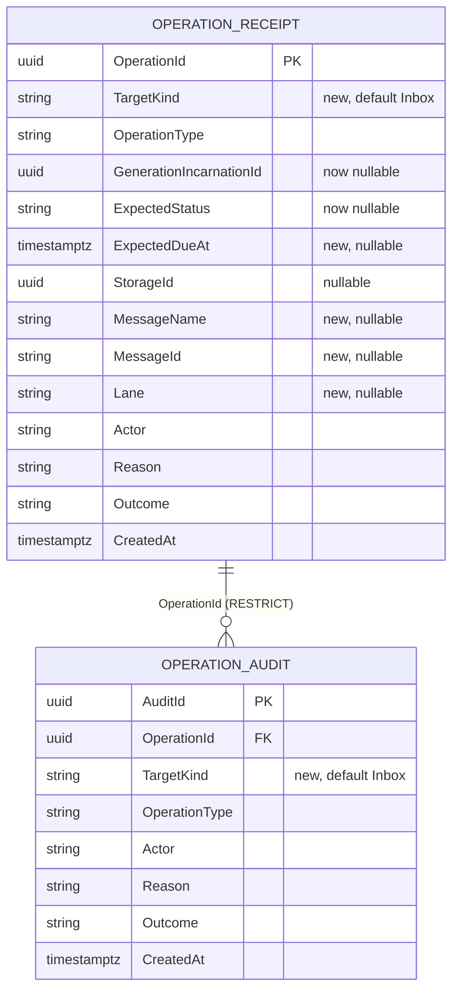

# Scheduled delivery operator actions - Plan

## Goal Capsule

- **Objective:** An authenticated operator can see every pending scheduled delivery and revoke one or dispatch it now, and the ledger records who did what and with what outcome even after the row is gone.
- **Means:** Extend the transactional-inbox operator conventions (actor, idempotent operation id, fenced mutation, receipt plus audit, bounded retention) to scheduled deliveries through one generalized messaging operator ledger (KTD1).
- **Authority:** Issue [892](https://github.com/xshaheen/headless-framework/issues/892), this contract, the #888 scheduled-delivery plan (`docs/plans/2026-09-06-001-feat-messaging-scheduled-delivery-plan.md`), and repository conventions.
- **Execution:** Implement U1 through U6 in dependency order; U1 to U3 are the storage contract and must land before any dashboard work. Stop for a demonstrated contradiction in the fence semantics, the ledger integrity rules, or the authorization boundary; naming, SQL shape, and UI layout remain implementation decisions. The Open Questions are deferred with stated defaults and do not block.
- **Tail ownership:** The calling delivery workflow owns review, commits, PR, and CI monitoring.

---

## Product Contract

### Summary

Add a paginated pending-scheduled-deliveries listing and two audited operator actions, revoke and dispatch-now, to the messaging operator surface. Both actions use the fenced operations the runtime already trusts, record a receipt and an audit in a ledger shared with inbox operations, and fall under the retention windows PR #891 shipped. The legacy bulk requeue and delete endpoints stop touching pending scheduled rows.

### Problem Frame

PR #888 added absolute scheduling, publish receipts, and `IMessageRevoker`. It deliberately shipped no operator surface (KD5 in its plan), so a revoked message is indistinguishable from one never published, and the only way to inspect pending schedules is the Published view's Delayed tab, which cannot tell a scheduled row from a retry-backlog row and offers only the unfenced, unaudited bulk requeue and delete.

The inbox operator surface from #860 already has the shape this needs: an authenticated actor, a client-minted operation id with replay-or-conflict semantics, a fenced mutation, and a receipt plus audit written in the same transaction. Its ledger is inbox-shaped: `GenerationIncarnationId` is `NOT NULL`, and the retention branches key on the inbox operation-type enum. Published rows have no incarnation, their status flips from Delayed to Queued without operator action, and a claimed row keeps an in-process timer keyed at its original due instant.

### Requirements

**Listing**

- R1. Operators can list pending scheduled deliveries, paginated and bounded by the existing dashboard page-size clamp, with the due instant, lane, message name, message id, storage id, and lease state of each row.
- R2. A pending scheduled delivery is a published row of the configured messaging version that matches the revocation eligibility predicate from #888 (not terminal, no inline attempt, no retry, no persisted retry time) in status Delayed or Queued; the listing presents both statuses as one Pending state.
- R3. Listing is an authenticated read and applies no tenant filter; the surface is system-scoped.

**Actions**

- R4. Revoke uses the same fenced delete as `IMessageRevoker` and reports Applied, NotFound, or Active (an attempt was reserved); none of these implies consumer completion.
- R5. Dispatch-now moves the due instant to the provider clock under the same eligibility predicate, rejects a row with a live dispatch lease, and leaves the row in a state the delayed processor claims on its next pass.
- R6. Every action request carries an operation id, the storage id, the due instant the operator saw, a reason, and an authenticated actor; a repeated identical request replays the prior result, and a repeated operation id with a different request records a conflict and changes nothing.
- R7. A request whose due instant no longer matches the row is rejected as a state conflict. The due instant travels between server and dashboard as the serializer's full-precision string, never through a JavaScript `Date`, so the comparison is exact at the provider's own precision.

**Ledger**

- R8. Each applied, rejected, or conflicting action writes a receipt and an audit in the same transaction as the mutation, recording actor, target snapshot, requested action, reason, and outcome.
- R9. The audit evidence survives deletion of the scheduled row and the expiry of the receipt within the operator audit retention window.
- R10. Ledger records for inbox and scheduled-delivery targets share one schema, one collector, and the four retention windows from PR #891, and the schema change is additive so replicas on the previous binary keep working during a rolling deploy.

**Authorization and actors**

- R11. Reads and actions require an authenticated principal with a stable actor name. A principal that proves nothing, the `anonymous` identity of the no-auth mode or the `host-user` placeholder, is rejected with a response that names the remedy; the shared-secret identities of the ApiKey and Custom modes are accepted as the deployment's chosen identity (Open Questions).
- R12. The surface is gated by the existing dashboard authorization configuration; no per-action policy is added.
- R13b. The dashboard distinguishes an unauthenticated request (401, session ends) from an authenticated principal without a usable actor (403 with an error code, rendered in place); the latter never logs the operator out.

**Legacy endpoints**

- R13. The bulk published requeue and delete endpoints reject ids that match the pending scheduled predicate and report them per id; other rows keep today's behavior, including today's actor rules.

**Documentation**

- R14. The messaging domain doc and the Core, Dashboard, and storage package READMEs distinguish operator actions from scheduling, recurrence, retries, and replay, state the dispatch-now latency and the ledger-only trace of a revoked row, and state that no-auth mode is read-only for operator actions.

### Key Decisions

- **Messaging owns an audited operator surface for its own scheduled rows, superseding #888 KD5.** KD5 rejected the surface because receipts, audit tables, and a dashboard endpoint were the largest cost and a Jobs composition already offered non-repudiation. Two things changed: the #860 ledger now exists, so KTD1 adds columns and enum values rather than tables per provider, and the #888 KD3 dependency argument (a Messaging-only host should not adopt Jobs to call off one message) applies equally to that host's operators. Rejected alternative: route operators needing an audit trail to the Jobs composition. Trigger: issue #892. Governs R1, R4, R5, R8.
- **Include dispatch-now; exclude reschedule to an arbitrary instant.** Dispatch-now is the audited replacement for requeueing a pending row; rescheduling is a keyed, replaceable deadline that Jobs owns (#888 plan R14). Governs R5, R13, R14.
- **Revocation stays a delete; the ledger is the trace.** A visible Revoked status would cost the enum, every terminal-guard site per provider, and the dashboard status lists for a row nobody can act on. Governs R4, R8, R9.
- **System scope only.** The published table has no tenant column; adding one is a schema and insert-path change on three providers for a surface the inbox operations also do not scope. Governs R3.
- **Fence legacy requeue and delete off pending scheduled rows rather than routing them through the ledger.** Routing every published action through receipts would widen this into a published-message operator rework. Governs R13.
- **Reject actors that prove nothing; accept shared-secret identities.** `WithNoAuth()` is an explicit opt-out that hosts choose for public or gateway-fronted dashboards, and under it every request carries the `anonymous` name; an audit record attributed to it is not evidence, so operator actions are deliberately unavailable there and the response names the remedy (an auth mode that yields an identifying actor). The trade-off is audit integrity over action availability, and it changes today's inbox actions under no-auth. ApiKey and Custom identities prove a deployment-held secret, so they stay accepted as they are for inbox actions today, pending the Open Question. Governs R11, R13b, R14.

### Scope Boundaries

- No per-action authorization policy; the single `HostAuthorizationPolicy` knob from #860 stays (R12).
- No reschedule to an arbitrary instant, no keyed identity, no replace; Jobs owns those.
- No tenant column on published rows; no tenant filter on the surface.
- No payload (`Content`) in any ledger record, view, or metric; the Scheduled view has no payload detail dialog.
- Non-pending published rows keep the unfenced, unledgered bulk requeue and delete.
- Physical ledger table names and the four retention option names stay as shipped in #860 and #891 (Open Questions).

#### Deferred to Follow-Up Work

- Audited requeue and delete for all published rows.
- A free-text reason prompt in the dashboard; the dashboard mints canned reasons like the inbox actions today.
- Ledger browsing in the dashboard (who did what); this plan writes the ledger and exposes outcomes per action only.
- Per-action authorization policies.
- An opportunistic local enqueue after dispatch-now when the dashboard host also runs a dispatcher, to make the co-hosted case immediate.

### Acceptance Examples

- AE1. Covers R1, R2. Given Delayed and Queued rows with no attempts, retries, or persisted retry time, plus a Delayed retry-backlog row and a Succeeded row, when the operator lists pending schedules, then only the first two appear, each as Pending with its due instant and lease state.
- AE2. Covers R4, R6, R8, R9. Given a pending row, when the operator revokes it with a fresh operation id, then the row is deleted, the result is Applied, and a receipt and audit exist with actor, storage id, message name, lane, message id, due instant, reason, and outcome; repeating the same request returns the same result flagged as replay and writes nothing new.
- AE3. Covers R4. Given the sender reserved an attempt after the operator listed the row, when the operator revokes it, then the result is Active, the row is unchanged, and the UI states the attempt may or may not deliver.
- AE4. Covers R5. Given a Delayed row with no live lease and a due instant an hour out, when the operator dispatches it now, then the row is Delayed with the due instant at the provider clock and no lease, and the delayed processor claims it on its next pass.
- AE5. Covers R5. Given a row the delayed claimer currently leases, when the operator dispatches it now, then the result is Active and the row is unchanged; when the lease expires and the stale in-process timer fires, the message is sent once.
- AE6. Covers R6. Given a receipt for an operation id, when a request with the same id but a different reason arrives, then the result is OperationConflict, an audit row records it, and no second receipt is written.
- AE7. Covers R7. Given the operator saw due instant T1 and a prior dispatch-now moved it to T2, when a revoke carrying T1 arrives, then the result is StateConflict and the row is unchanged; given a due instant with non-zero sub-millisecond ticks, when the listing value is echoed back unchanged, then the fence matches and the action applies.
- AE8. Covers R10. Given scheduled-delivery receipts and audits older than the operator windows and a held inbox generation's audit younger than its window, when the collector runs, then the old scheduled-delivery history is deleted in bounded batches, audits before receipts, and the young inbox audit and its receipt remain.
- AE9. Covers R11, R13b. Given no-auth mode, when any scheduled or inbox action request arrives, then it is rejected with 403 and an error code naming the remedy, nothing is written, and the dashboard stays signed in; given an unauthenticated request, then it is rejected with 401.
- AE10. Covers R13. Given a bulk delete containing one pending scheduled id and one Succeeded id, when it runs, then the Succeeded row is deleted, the pending id is reported as rejected, and the response points to the audited operations.

---

## Planning Contract

### Key Technical Decisions

- KTD1. **One generalized messaging operator ledger.** (session-settled: user-directed — chosen over a parallel scheduled-delivery ledger and over reusing the inbox tables unchanged: a parallel ledger duplicates the receipt and audit SQL, the retention branches, two storage SPI methods, and a collector category per provider; unchanged reuse leaves a `NOT NULL` incarnation with no meaning and audit queries by incarnation returning outbox rows.) The existing receipt and audit tables gain a `TargetKind` discriminator (`Inbox`, `ScheduledDelivery`) defaulting to `Inbox`, a nullable incarnation and expected status, and nullable target-snapshot columns for published rows. The FK from audit to receipt stays `ON DELETE RESTRICT`. Governs R8, R9, R10.
- KTD2. **Additive upgrade only; physical table names stay.** Renaming the tables was considered and rejected on deploy evidence: every prior ledger upgrade was additive, so replicas on the old binary kept working during a rolling deploy, whereas a rename fails every inbox operation and collector pass on old replicas the moment the first new replica initializes, and the schema-state guard makes rollback one-way. The initializers add the new columns, keep the names, and bump the `inbox` schema-state version so the readiness probe pins the new columns; old replicas keep running on rows they wrote, and rollback keeps the added columns. Code-level names are renamed for neutrality (KTD3). Governs R10.
- KTD3. **Operation types extend the existing enum, renamed to a ledger-neutral name.** Add `Revoke` and `DispatchNow` so the `Enum.GetValues` retention branches in both `History` partials enroll them under the operator cutoffs without new SPI methods or collector categories. The enum and the authorization context record are renamed at the code level (greenfield); the receipt reader branches on `TargetKind` for the now-nullable columns. Governs R10.
- KTD4. **Fence identity for a published row is storage id plus expected due instant plus the eligibility predicate.** Published rows have no incarnation, and their status legitimately flips Delayed to Queued without operator action, so `ExpectedStatus` would reject rows the scope says are still actionable. Only operators change the due instant of a pending row (verified on PostgreSQL: the claim query, the shutdown flush, and poison marking never touch it), so it is the operator-visible snapshot; `Version` and the #888 predicate (`InlineAttempts = 0`, `Retries = 0`, `NextRetryAt IS NULL`, non-terminal) are the runtime fence. The listing serializes the due instant at full provider precision, the SPA resubmits that string verbatim, and the provider compares against a parameter typed as the column's native type (`timestamptz`, `datetimeoffset(7)`). Replay equality and the receipt include the expected due instant. Governs R6, R7.
- KTD5. **Revoke shares the fenced delete; dispatch-now is a fenced lease-aware update.** Extract the #888 predicate from the three `Revocation` partials into one shared fragment per provider so `IMessageRevoker` and the operator path cannot drift. Dispatch-now requires `LockedUntil` null or expired, then sets status Delayed, due instant to the provider clock, and clears `LockedUntil` and `Owner`, the same flip the shutdown flush performs. A live lease returns Active: a lease exists only within two minutes of the due instant, so clearing it would be tolerated by the attempt-reservation fence but buys at most two minutes and adds a second-claimer race. Governs R4, R5.
- KTD6. **Outcome vocabulary reuses the inbox outcomes.** `Applied`, `NotFound`, `StateConflict` (due-instant mismatch), `Active` (reserved attempt or live lease), `OperationConflict`. No `Held` for scheduled targets. The revocation result maps `Revoked` to Applied and `AttemptReserved` to Active. The dashboard's message for an outcome is keyed by action plus outcome, because Active means "may or may not deliver" for revoke and "claimed elsewhere, will be sent once when its lease expires" for dispatch-now. Governs R4, R5, R7.
- KTD7. **One operations API per target kind on `IDataStorage`, sharing the ledger writer.** Add `GetScheduledDeliveryOperationsApi()` beside `GetInboxOperationsApi()`, returning query, revoke, and dispatch-now. The provider's ledger write, operation-id lock, and replay-or-conflict helpers are shared internals; `InboxOperationEvaluator` gains a target-kind branch rather than a second evaluator. `IMessageRevoker` and `IMessageRevocationStorage` are unchanged. Governs R4 to R8.
- KTD8. **Listing lives on the operations API as an authenticated query, not on `IMonitoringApi`.** Mirrors the inbox `QueryAsync`; keeps the read-only monitoring API read-only per #860 KTD9. The query accepts name, lane, due-window, and a bounded storage-id set (at most the bulk-action size), and the projection adds `Owner`, `LockedUntil`, `InlineAttempts`, and a derived `IsLeased`. The storage-id filter is what the legacy endpoints use to fence per id. Governs R1, R3, R13.
- KTD9. **Shared actor resolver with typed rejections.** Move `_TryCreateInboxAuthority` into a shared helper used by inbox and scheduled mutation endpoints. It rejects `host-user` and `anonymous` on every branch, including the `identity.Name` branch that admits `anonymous` today. An unauthenticated principal yields 401; an authenticated principal without a usable actor yields 403 with the error code `g:operator_actor_required` and a body naming the remedy. The dashboard client ends the session only on 401. The legacy requeue and delete endpoints do not use the resolver (R13). Governs R11, R13b.
- KTD10. **Legacy fencing is per id with a rejection body on both endpoints.** The handlers call the scheduled query with the request's ids under the host principal, treat every returned id as rejected, and process the rest; requeue already returns `{ rejected, requeued }` on partial rejection, and delete gains the same shape. Governs R13.
- KTD11. **Metrics tag by target kind and omit consumer identity for scheduled targets.** The existing recorder throws on unknown operation types and requires a consumer identity, so the scheduled path gets its own recorder. Governs R8.

### High-Level Technical Design

```mermaid
sequenceDiagram
    participant UI as Dashboard SPA
    participant EP as Dashboard endpoint
    participant API as Scheduled operations API
    participant DB as Provider (one transaction)
    participant DP as Delayed processor (any node)

    UI->>EP: POST revoke or dispatch-now {operationId, storageId, expectedDueAt (verbatim string), reason}
    EP->>EP: resolve actor (401 unauthenticated; 403 placeholder actor)
    EP->>API: request + authorization
    API->>DB: lock operationId, read receipt
    alt receipt exists
        DB-->>API: replay (equal) or OperationConflict (+audit)
    else
        API->>DB: read row, evaluate fence (KTD4)
        API->>DB: fenced DELETE or lease-aware UPDATE (KTD5)
        API->>DB: insert receipt + audit (TargetKind=ScheduledDelivery)
    end
    DB-->>API: outcome
    API-->>EP: result
    EP-->>UI: 200 Applied / 404 NotFound / 409 other, body = result
    DP->>DB: next pass claims rows due now (dispatch-now case)
```

Ledger shape after KTD1, columns added to the existing tables (names directional):



Pending state derivation for the listing and the fence, directional:

```text
pending(row) := Version = options.Version
             and status in {Delayed, Queued}
             and not terminal
             and InlineAttempts = 0 and Retries = 0 and NextRetryAt is null
isLeased(row) := LockedUntil is not null and LockedUntil > provider clock
revoke:       pending and ExpiresAt = ExpectedDueAt (native type)  -> DELETE
dispatch-now: pending and not isLeased and ExpiresAt = ExpectedDueAt
              -> status=Delayed, ExpiresAt=clock, LockedUntil=null, Owner=null
```

### Assumptions

These are agent-selected defaults recorded because the scoping confirmation timed out. They are not session-settled.

- A1. System scope only, no tenant column (Key Decisions). Alternative considered: a nullable `TenantId` on published rows with an operator tenant claim.
- A2. Revoke plus dispatch-now, reschedule excluded (Key Decisions). Alternative: revoke only.
- A3. Revocation remains a delete; the ledger is the trace (Key Decisions). Alternative: a `Revoked` terminal status.
- A4. Legacy requeue and delete are fenced off pending scheduled rows (Key Decisions). Alternative: route them through the ledger.
- A5. The four retention options keep their `Inbox*` names and semantics; the doc states they govern the whole ledger (Open Questions).
- A6. Physical table names stay (KTD2); only the operation-type enum and the authorization context record are renamed at the code level.
- A7. The dashboard mints canned reasons (`Dashboard revoke`, `Dashboard dispatch now`) and a client-side operation id per click, as the inbox actions do.
- A8. The target snapshot excludes `Added` and `Content`; message name, message id, lane, storage id, and due instant are sufficient evidence.
- A9. Dispatch-now is offered only for rows not already due within the delayed processor's pass interval; Queued rows are already inside the in-process scheduler's window and the action cannot advance them.

### Open Questions

All deferred; each has a default the units implement.

- OQ1. Should the ApiKey and Custom placeholder identities (`api-user`, `custom-user`) be rejected like `anonymous`, making operator actions require Basic or Host auth with a name claim? Default: accept them, as the inbox surface does today, and document that they attribute actions to the deployment's shared identity.
- OQ2. Should the four retention options be renamed to ledger-neutral names now that they govern scheduled-delivery evidence too? Default: keep the names; the doc and the option XML comments state the wider scope. Renaming is a public option break the physical schema does not force.
- OQ3. Should the physical ledger tables be renamed in a later, separately sequenced release with a documented stop-the-world step? Default: no; the discriminator makes the shared table explicit.

### System-Wide Impact

- **Persistent data:** new nullable columns and a discriminator with a default, schema-state bump on PostgreSQL and SQL Server; InMemory record shapes change. Additive, so rolling deploys and rollback are tolerated (KTD2).
- **Auth boundary:** inbox and scheduled actions under no-auth mode are rejected with 403; the inbox `host-user` rejection changes from 401 to 403 so the dashboard no longer logs the operator out. Document both as behavior changes.
- **Public API:** new `IDataStorage` member, new Core monitoring records, renamed operation-type enum and authorization context, new dashboard endpoints, changed legacy delete response on partial rejection. Greenfield policy accepts these without shims.
- **Collector:** no new category; the extended enum values flow through the existing history branches.

### Risks & Dependencies

- Dispatch-now latency depends on a node running the delayed processor; a dashboard-only host cannot promise it. The UI text states "picked up within about a minute by a delayed processor".
- The due-instant fence depends on the SPA never parsing the value; a future SPA change that formats through `Date` and resubmits would turn every action into StateConflict. The U5 unit test pins the verbatim echo.
- SQL Server x64 integration is not run in CI; run the SQL Server suite locally before merge (repo learning, 2026-07-21).

### Sources

- Inbox operations: `src/Headless.Messaging.Core/Monitoring/IInboxOperationsApi.cs`, `InboxOperations.cs`, `src/Headless.Messaging.Core/Internal/InboxOperationEvaluator.cs`, `src/Headless.Messaging.Storage.PostgreSql/PostgreSqlDataStorage.Operations.cs`, `.History.cs`, SQL Server twins, `src/Headless.Messaging.Storage.InMemory/InMemoryDataStorage.InboxOperations.cs`.
- Revocation and scheduling: `src/Headless.Messaging.Core/Persistence/IMessageRevocationStorage.cs`, the three `*DataStorage.Revocation.cs` partials, `PostgreSqlDataStorage.Delayed.cs` (claim predicate, two-minute lookahead, lease flip), `src/Headless.Messaging.Core/Processor/Dispatcher.cs` (in-process timer keyed at due instant), `IProcessor.Delayed.cs` (processor cadence), `ChangePublishStateToDelayedAsync` (shutdown flush flip).
- Schema: `src/Headless.Messaging.Storage.PostgreSql/PostgreSqlStorageInitializer.cs` (ledger DDL, `schema_state`, additive upgrade precedent), `src/Headless.Messaging.Storage.SqlServer/SqlServerStorageInitializer.cs`.
- Dashboard: `src/Headless.Messaging.Dashboard/Endpoints/MessagingDashboardEndpoints.cs` (`_ExecuteInboxDashboardOperationAsync`, `_TryCreateInboxAuthority`, `_PublishedRequeue`, `_PublishedDelete`, `_PublishedList`, `_MaxPageSize`, `_MaxBulkActionSize`), `src/Headless.Dashboard.Authentication/AuthService.cs` and `AuthMiddleware.cs` (placeholder actors), `src/Headless.Messaging.Dashboard/wwwroot/src/views/Received.vue` (action table pattern), `services/inbox.ts`, `services/http.ts` (401 handler that ends the session), `router/index.ts`.
- Tests to mirror: `tests/Headless.Messaging.Core.Tests.Harness/InboxOperationPolicyConformanceTests.cs`, `DataStorageTestsBase.Revocation.cs`, `tests/Headless.Messaging.Dashboard.Tests.Unit/Endpoints/ReceivedMessageEndpointTests.cs` (`_CreateTestApp`).
- Prior decisions: `docs/plans/2026-09-06-001-feat-messaging-scheduled-delivery-plan.md` KD3, KD5, KTD3, KTD4, KTD5; `docs/plans/2026-09-04-001-feat-transactional-inbox-deduplication-plan.md` KTD9; `docs/plans/2026-09-13-0131-fix-inbox-lifecycle-retention-plan.md` A5.

---

## Implementation Units

### U1. Generalize the operator ledger schema and retention

**Goal:** One ledger for inbox and scheduled-delivery operations with preserved history, an additive upgrade, and unchanged retention behavior.

**Requirements:** R8, R9, R10 via KTD1, KTD2, KTD3.

**Dependencies:** none.

**Files:**
- `src/Headless.Messaging.Core/Monitoring/InboxOperations.cs` (enum and authorization context rename, new values)
- `src/Headless.Messaging.Storage.PostgreSql/PostgreSqlStorageInitializer.cs`
- `src/Headless.Messaging.Storage.SqlServer/SqlServerStorageInitializer.cs`
- `src/Headless.Messaging.Storage.PostgreSql/PostgreSqlDataStorage.Operations.cs`, `.History.cs`
- `src/Headless.Messaging.Storage.SqlServer/SqlServerDataStorage.Operations.cs`, `.History.cs`
- `src/Headless.Messaging.Storage.InMemory/InMemoryDataStorage.InboxOperations.cs`
- `tests/Headless.Messaging.Core.Tests.Harness/InboxOperationPolicyConformanceTests.cs`
- `tests/Headless.Messaging.Storage.PostgreSql.Tests.Integration/PostgreSqlInboxOperationPolicyTests.cs`, `PostgreSqlRetentionTests.cs`
- `tests/Headless.Messaging.Storage.SqlServer.Tests.Integration/SqlServerInboxOperationPolicyTests.cs`, `SqlServerRetentionTests.cs`
- `tests/Headless.Messaging.Storage.InMemory.Tests.Unit/InMemoryInboxOperationPolicyTests.cs`

**Approach:**
1. Add `TargetKind` (default `Inbox`), make the incarnation and expected status nullable, and add the snapshot columns from the ledger diagram; keep the audit FK `RESTRICT` and the `(OperationType, CreatedAt)` indexes.
2. Add the guarded additive upgrade step and bump the `inbox` schema-state version; update the readiness probe's pinned columns.
3. Update the receipt and audit writers and readers and the InMemory records to carry `TargetKind` and the snapshot; existing inbox writes set `TargetKind = Inbox`; the reader branches on `TargetKind` for the nullable columns.
4. Confirm the `History` branches still derive from the enum and keep `Cleanup` on the cleanup cutoffs.
5. Rename the enum and authorization context at the code level and update their usages.

**Patterns to follow:** `docs/solutions/best-practices/storage-initializer-lifecycle-correctness.md`; the v3 to v4 additive upgrade in the initializers; the two-phase receipt deletion in `History.cs`.

**Test scenarios:**
- Fresh schema creates the tables with the new columns and the bumped schema-state version.
- A schema at the previous version with populated tables upgrades in place: rows survive with `TargetKind = Inbox`, and the initializer is a no-op on a second run.
- Existing inbox operation conformance tests pass unchanged in behavior.
- Retention still deletes cleanup history at the cleanup cutoff and operator history at the operator cutoff after the change (Covers AE8 for the inbox half).

**Verification:** Inbox conformance and retention suites pass on InMemory, PostgreSQL, and SQL Server.

### U2. Scheduled-delivery operations contract in Core

**Goal:** Define the operator API, request and result records, and the evaluator branch for scheduled targets.

**Requirements:** R1, R2, R3, R4, R5, R6, R7 via KTD4, KTD6, KTD7, KTD8.

**Dependencies:** U1.

**Files:**
- `src/Headless.Messaging.Core/Monitoring/IScheduledDeliveryOperationsApi.cs` (new)
- `src/Headless.Messaging.Core/Monitoring/ScheduledDeliveryOperations.cs` (new: query, view, request, result records)
- `src/Headless.Messaging.Core/Internal/InboxOperationEvaluator.cs` (target-kind branch)
- `src/Headless.Messaging.Core/Persistence/IDataStorage.cs`
- `tests/Headless.Messaging.Core.Tests.Unit/Internal/ScheduledDeliveryOperationEvaluatorTests.cs` (new)
- `tests/Headless.Messaging.Core.Tests.Unit/Monitoring/ScheduledDeliveryOperationRequestTests.cs` (new)

**Approach:**
1. Start from the caller: the dashboard posts operation id, storage id, expected due instant (verbatim string, parsed once at the server boundary), reason; the API returns a result with outcome, replay flag, actor, snapshot, and timestamps.
2. Request validation mirrors the inbox request: non-empty ids, reason length 1 to 1000, authorization validated first; shape errors throw `InvalidOperationException`, authority errors `UnauthorizedAccessException`.
3. The query record carries name, lane, due window, and a bounded storage-id set (KTD8).
4. The evaluator branch takes the row snapshot (status, attempts, retries, persisted retry time, lease, version, due instant) and the operation, and returns the outcome per KTD4 to KTD6.
5. Add `GetScheduledDeliveryOperationsApi()` to `IDataStorage`; providers without the capability throw `NotSupportedException` naming the provider, as `MessageRevoker` does.

**Patterns to follow:** `InboxOperationRequest.Validate`, `InboxOperationEvaluator.Evaluate`, `MessageRevoker` capability error.

**Test scenarios:**
- Pending Delayed row with matching due instant: revoke evaluates Applied; dispatch-now evaluates Applied.
- Pending Queued row with live lease: revoke Applied (lease does not block revoke); dispatch-now Active.
- Row with a reserved inline attempt: revoke Active; dispatch-now Active.
- Due instant mismatch: StateConflict for both actions (Covers AE7).
- Missing row: NotFound.
- Terminal row, retry-backlog row (`Retries > 0` or `NextRetryAt` set), and a row of another messaging version: NotFound for both actions because they are not pending.
- Request validation rejects empty operation id, empty storage id, empty or over-long reason, unauthenticated principal; the storage-id set above the bulk-action size is rejected.

**Verification:** Core unit suite passes; the evaluator is pure and provider-independent.

### U3. Provider implementations and conformance tests

**Goal:** Implement listing, revoke, and dispatch-now on InMemory, PostgreSQL, and SQL Server with ledger writes, and prove them in the shared harness.

**Requirements:** R1 to R10 via KTD4, KTD5, KTD7, KTD8, KTD11.

**Dependencies:** U1, U2.

**Files:**
- `src/Headless.Messaging.Storage.PostgreSql/PostgreSqlDataStorage.ScheduledOperations.cs` (new), `.Revocation.cs` (shared predicate fragment)
- `src/Headless.Messaging.Storage.SqlServer/SqlServerDataStorage.ScheduledOperations.cs` (new), `.Revocation.cs`
- `src/Headless.Messaging.Storage.InMemory/InMemoryDataStorage.ScheduledOperations.cs` (new), `.Revocation.cs`
- `tests/Headless.Messaging.Core.Tests.Harness/ScheduledDeliveryOperationConformanceTests.cs` (new)
- `tests/Headless.Messaging.Storage.InMemory.Tests.Unit/InMemoryScheduledDeliveryOperationTests.cs` (new)
- `tests/Headless.Messaging.Storage.PostgreSql.Tests.Integration/PostgreSqlScheduledDeliveryOperationTests.cs` (new)
- `tests/Headless.Messaging.Storage.SqlServer.Tests.Integration/SqlServerScheduledDeliveryOperationTests.cs` (new)

**Approach:**
1. Extract the #888 eligibility predicate into one per-provider fragment used by `RevokeAsync`, the operator path, and the pending listing.
2. Listing: `QueryAsync` with name, lane, due-window, and storage-id filters, ordered by due instant then id, page size clamped to 200, projecting the fields in R1 plus `IsLeased` from the provider clock and `Version` from options.
3. Actions follow the inbox transaction shape: operation-id lock, receipt read, replay or conflict, provider clock, row read with row lock, evaluate, mutate, receipt plus audit, commit, metric (own recorder, KTD11).
4. Dispatch-now update per KTD5; revoke delete per KTD5 using the shared fragment; the due-instant parameter is bound as the column's native type.
5. InMemory takes one lock for row and ledger; mirror the `ReferenceEquals` re-read in its revocation.

**Execution note:** Write the harness conformance tests first; the three providers then implement against one contract.

**Patterns to follow:** `_ExecuteInboxOperationAsync`, `_LockPostgreSqlOperationIdAsync`, `sp_getapplock` in the SQL Server twin, `DataStorageTestsBase.Revocation.cs` for race setups.

**Test scenarios:**
- Listing returns only pending rows of the configured version, presents Delayed and Queued as Pending, marks leased rows, and filters by storage-id set (Covers AE1).
- Revoke applied deletes the row and writes receipt and audit with the snapshot; replay returns the same result flagged as replay (Covers AE2).
- Revoke after attempt reservation returns Active and writes a receipt with that outcome (Covers AE3).
- Dispatch-now on an unleased Delayed row sets status Delayed, due instant to the clock, clears lease; the delayed claim query then selects it (Covers AE4).
- Dispatch-now on a leased row returns Active; after lease expiry the stale reservation path sends once and a second send does not occur (Covers AE5).
- Same operation id with a different reason yields OperationConflict and one audit, no second receipt (Covers AE6).
- Due instant mismatch yields StateConflict; a due instant with non-zero sub-millisecond ticks round-trips through the listing serialization and fences Applied (Covers AE7).
- Receipt outlives the row after revoke; retention deletes scheduled-delivery audits before receipts at the operator cutoffs while young inbox history remains (Covers AE8 for the scheduled-delivery half).
- Concurrent revoke and dispatch-now on one row with different operation ids: exactly one applies; the other is NotFound or StateConflict.
- Provider clock, not host clock, stamps `CreatedAt` and the dispatch-now due instant (round-trip asserted with microsecond tolerance per repo learning).

**Verification:** Conformance suite green on InMemory, PostgreSQL, and SQL Server locally; `IMessageRevoker` conformance unchanged.

### U4. Dashboard endpoints, shared actor resolver, and legacy fencing

**Goal:** Expose the listing and actions over the dashboard API, harden actor resolution without ejecting signed-in operators, and fence the legacy bulk endpoints.

**Requirements:** R1, R3, R4, R5, R6, R7, R11, R12, R13, R13b via KTD9, KTD10.

**Dependencies:** U2, U3.

**Files:**
- `src/Headless.Messaging.Dashboard/Endpoints/MessagingDashboardEndpoints.cs`
- `src/Headless.Messaging.Dashboard/Endpoints/DashboardOperatorAuthority.cs` (new, shared actor resolver)
- `tests/Headless.Messaging.Dashboard.Tests.Unit/Endpoints/ScheduledDeliveryEndpointTests.cs` (new)
- `tests/Headless.Messaging.Dashboard.Tests.Unit/Endpoints/PublishedMessageEndpointTests.cs`
- `tests/Headless.Messaging.Dashboard.Tests.Unit/Endpoints/ReceivedMessageEndpointTests.cs`

**Approach:**
1. Routes: `GET /api/scheduled` (flat query parameters like the inbox list), `POST /api/scheduled/revoke`, `POST /api/scheduled/dispatch-now`; all on the protected API group so proxying and host authorization apply.
2. One mutation helper shared with the inbox actions: 401 for an unauthenticated principal, 403 with `g:operator_actor_required` for a placeholder actor, 415 on non-JSON, 422 on shape errors, 200 Applied, 404 NotFound, 409 otherwise; the response body is the result record so the SPA can render the outcome.
3. Move actor resolution into the shared resolver per KTD9, rejecting `anonymous` and `host-user` on every branch.
4. Fence `_PublishedRequeue` and `_PublishedDelete` per KTD10 through the scheduled query's storage-id filter under the host principal, without the operator actor requirement.
5. Pin the new endpoints' JSON to the dashboard's own serializer options with string enums; serialize the due instant at full precision.

**Patterns to follow:** `_ExecuteInboxDashboardOperationAsync`, `_InboxList`, `_ReadStorageIdsAsync`, `_CreateTestApp` harness (supports no-auth with the real middleware, Host mode with an injected principal, and host JSON customization).

**Test scenarios:**
- Listing clamps page size to 200, maps 1-based pages, and returns the pending projection with lease state and a full-precision due instant.
- Revoke and dispatch-now route to the operations API with the resolved actor and return 200, 404, or 409 with the result body per outcome.
- Replay returns 200 with the replay flag.
- Unauthenticated principal gets 401; `host-user` and `anonymous` get 403 with the error code and remedy, and the storage API is not called (Covers AE9).
- Inbox mutations under no-auth mode now get 403; the inbox `host-user` case changes from 401 to 403 (behavior changes pinned).
- ApiKey and Custom identities are accepted as actors (pins OQ1's default).
- Non-JSON body gets 415; malformed JSON and failed validation get 422.
- Bulk delete with one pending scheduled id deletes the other ids and reports the pending one; bulk requeue behaves the same; both still work under no-auth mode for non-pending rows (Covers AE10).
- Host JSON customization (snake_case, camelCase enums) does not change the wire shape.

**Verification:** Dashboard unit suite passes; the inbox endpoint tests still pass with the shared resolver.

### U5. Dashboard SPA: Scheduled view and outcome rendering

**Goal:** Let operators list pending schedules and act on them with accurate outcome feedback.

**Requirements:** R1, R5, R6, R7, R13b via KTD6.

**Dependencies:** U4.

**Files:**
- `src/Headless.Messaging.Dashboard/wwwroot/src/views/Scheduled.vue` (new)
- `src/Headless.Messaging.Dashboard/wwwroot/src/services/scheduled.ts` (new)
- `src/Headless.Messaging.Dashboard/wwwroot/src/services/http.ts`
- `src/Headless.Messaging.Dashboard/wwwroot/src/router/index.ts`
- navigation component under `src/Headless.Messaging.Dashboard/wwwroot/src/components/`
- `src/Headless.Messaging.Dashboard/wwwroot/src/views/Published.vue` (tooltip)
- `src/Headless.Messaging.Dashboard/wwwroot/src/services/__tests__/scheduled.spec.ts` (new)

**Approach:**
1. New route and navigation entry; the view lists pending rows with due instant, lane, name, message id, lease state, and the existing pagination footer. The service keeps the due instant as the string the listing returned and parses to `Date` only for display.
2. Actions table like `Received.vue`: revoke and dispatch-now, confirm dialog, client-minted operation id, canned reason; dispatch-now disabled while leased and for rows already due within the delayed processor's pass interval (A9).
3. `http.ts` ends the session only on 401 and returns parsed bodies for 403, 404, and 409 so the view renders outcomes keyed by action plus outcome (KTD6), including the 403 remedy; after StateConflict, NotFound, or OperationConflict the view reloads the list so the operator sees current state before retrying.
4. Remove the Published view tooltip that sends operators to the database for short delays; point to the Scheduled view.

**Execution note:** Prefer a runtime check of the built SPA against the test server over broad component tests; unit-test the service mapping and the outcome-to-message table.

**Test scenarios:**
- Service builds the request with operation id, storage id, the verbatim due-instant string, and reason.
- Outcome mapping renders distinct messages per action plus outcome: revoke Active ("may or may not deliver") and dispatch-now Active ("claimed elsewhere, sent once when its lease expires") differ; Applied, replay, NotFound, StateConflict, OperationConflict, and the 403 remedy each have their own text.
- Leased rows and rows due within the pass interval disable dispatch-now and keep revoke enabled.
- `http.ts` returns the parsed body for 403, 404, and 409, ends the session only on 401, and still throws for network errors.
- A StateConflict response triggers a list reload.

**Verification:** `npm run test:unit` and `npm run lint:check` pass in `wwwroot`; `make dashboards` builds the SPA.

### U6. Documentation and vocabulary

**Goal:** Record the operator surface, its boundaries, and the ledger semantics.

**Requirements:** R14.

**Dependencies:** U1 to U5.

**Files:**
- `docs/llms/messaging.md` (scheduling and revocation, inbox operator actions, retention, dashboard, storage provider sections)
- `src/Headless.Messaging.Core/README.md`, `src/Headless.Messaging.Dashboard/README.md`, `src/Headless.Messaging.Storage.InMemory/README.md`, `src/Headless.Messaging.Storage.PostgreSql/README.md`, `src/Headless.Messaging.Storage.SqlServer/README.md`, `src/Headless.Messaging.Abstractions/README.md`
- `CONCEPTS.md`
- `docs/plans/2026-09-06-001-feat-messaging-scheduled-delivery-plan.md` (one line noting KD5 is superseded by this plan)

**Approach:**
1. Distinguish operator revoke and dispatch-now from scheduling, recurrence, retries, and inbox replay; state that application revoke retains no audit and operator revoke does; state the dispatch-now latency and that the ledger is readable by the host until dashboard browsing ships.
2. Document the discriminator, the unchanged table and retention option names and their ledger-wide scope, the schema-state bump, the 403 actor rejection under no-auth mode as a behavior change, and that ApiKey and Custom attribute actions to the deployment's shared identity.
3. Update `CONCEPTS.md`: the messaging paragraph on revocation, plus entries for operator ledger and pending scheduled delivery.

**Test expectation:** none -- documentation only; follow the drift checks in `docs/authoring/AUTHORING.md`.

**Verification:** Both doc surfaces agree on endpoint names, outcomes, status codes, retention windows, and the actor rule.

---

## Verification Contract

| Gate | Command | Applies to |
|---|---|---|
| Build | `make build-project PROJECT=src/Headless.Messaging.Dashboard/Headless.Messaging.Dashboard.csproj` (pulls Core and storage) | all |
| Core unit | `make test-project TEST_PROJECT=tests/Headless.Messaging.Core.Tests.Unit/Headless.Messaging.Core.Tests.Unit.csproj` | U2 |
| InMemory | `make test-project TEST_PROJECT=tests/Headless.Messaging.Storage.InMemory.Tests.Unit/Headless.Messaging.Storage.InMemory.Tests.Unit.csproj` | U1, U3 |
| PostgreSQL (Docker) | `make test-project TEST_PROJECT=tests/Headless.Messaging.Storage.PostgreSql.Tests.Integration/Headless.Messaging.Storage.PostgreSql.Tests.Integration.csproj` | U1, U3 |
| SQL Server (Docker) | `make test-project TEST_PROJECT=tests/Headless.Messaging.Storage.SqlServer.Tests.Integration/Headless.Messaging.Storage.SqlServer.Tests.Integration.csproj` | U1, U3 |
| Dashboard | `make test-project TEST_PROJECT=tests/Headless.Messaging.Dashboard.Tests.Unit/Headless.Messaging.Dashboard.Tests.Unit.csproj` | U4 |
| SPA | `npm run test:unit` and `npm run lint:check` in `src/Headless.Messaging.Dashboard/wwwroot`; `make dashboards` | U5 |
| Format and analyzers | `make format-check`; `make quality-analyzers-project PROJECT=...` for Core, each storage provider, and Dashboard | before PR |
| Clean build | `dotnet build -c Release -v:minimal` on changed projects | before PR |

Integration suites do not gate CI; run both relational suites locally before merge.

---

## Definition of Done

- Every acceptance example maps to a passing test; AE1 to AE8 pass on all three providers through the shared harness.
- Existing inbox operation, retention, and revocation conformance suites pass after the ledger change with behavior unchanged except the actor rejections named in System-Wide Impact.
- A populated previous-version schema upgrades in place additively with history preserved, proven by an integration test on PostgreSQL and SQL Server.
- Legacy requeue and delete cannot touch a pending scheduled row from the dashboard.
- Docs, READMEs, and `CONCEPTS.md` updated per U6; the #888 plan notes KD5 is superseded.
- Abandoned experiments removed; build, format, analyzer, and SPA gates green.
