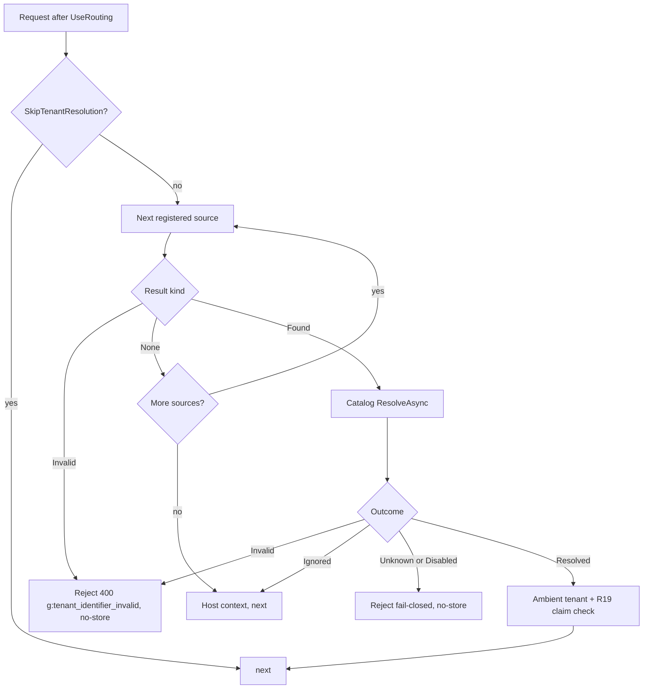

# HTTP Tenant Identifier Sources - Plan

## Goal Capsule

- **Objective:** An app that routes tenants by subdomain, custom domain, route segment, or a trusted header resolves the ambient tenant with one registration call and no custom middleware, with the same fail-closed catalog validation, diagnostics, and docs that claim-based tenancy has. Implements GitHub issue #252 on top of the #838 tenant catalog.
- **Means:** Built-in `ITenantIdentifierSource` implementations registered in order through the existing catalog resolution builder (KTD3), a widened source result so a source can reject ambiguous input (KTD1), and a link-generation spike before any decorator ships (KTD7).
- **Product authority:** Issue #252 as amended by its status comment, the settled decisions in Key Decisions below, and this contract. Where #252's original text conflicts with #838's identifier-versus-id model, this contract wins.
- **Stop conditions:** Stop and report when research or implementation invalidates a Key Decision or KTD, when the spike (U5) outcome is ambiguous across surfaces, or when a change would loosen the catalog's fail-closed rejection. Details the plan leaves open are implementer judgment.
- **Execution profile:** Standard repo gates: warnings-as-errors build, CSharpier, analyzers, unit tests in CI, and the `Headless.Api.Tests.Integration` suite run locally because CI never runs integration tests.

---

## Product Contract

### Summary

Ship host, route, and header tenant identifier sources plus a delegate shortcut, each configured through validated options and registered in priority order on `ResolveFromCatalog`. Widen the source contract so the header source can reject an ambiguous request instead of guessing, and harden the pre-auth path (no-store rejections, consult-time `Vary`, host trust guidance, log hygiene). Run a spike that decides whether ASP.NET Core drops a leading tenant route segment from generated links, and ship a `LinkGenerator` decorator only if it does. Update the four doc surfaces that describe identifier resolution.

### Problem Frame

#838 landed the seam this work plugs into: `ITenantIdentifierSource` in `src/Headless.Api.Core/MultiTenancy/`, registration on `HeadlessTenantCatalogResolutionBuilder`, and `TenantCatalogResolutionMiddleware` consulting sources in order before the catalog canonicalizes the identifier. It shipped with zero built-in sources, so today every host that wants subdomain, route, or header tenancy writes its own source, its own validation, and its own docs. Finbuckle.MultiTenant (reviewed locally at v10.0.8) ships host, base-path, route, header, and delegate strategies with the same identifier-then-store model, which confirms the shape but also shows three things to avoid: silent first-value on duplicate headers, fail-open resolution, and a `LinkGenerator` decorator shipped as a breaking default with a test that asserts only its type.

Three repository facts shape the design. `TenantCatalogService.ResolveAsync` trims, lowercases, then rejects on length or `IdentifierPattern` before the ignored-identifier check, so whole-host identifiers with dots need a pattern override. The source contract returns only `string?`, so a source cannot signal "present but ambiguous" today. `ResolveFromCatalog` constructs a fresh builder on every call, so across a composed host's registration passes the only shared state is the service collection, and its insertion order is the resolution order.

### Key Decisions

- **Sources emit public identifiers; the catalog canonicalizes them.** A bypass mode that used the raw value as the tenant id would let an anonymous caller select any string as the ambient id for EF filters and write guards. (session-settled: user-approved — chosen over a direct-id mode: it reintroduces the identifier/id conflation #253 removed and skips the catalog's fail-closed lookup.) Governs R1, R2, R3, R6.
- **Sources register on the catalog resolution builder in registration order.** (session-settled: user-approved — chosen over new `ResolveFromX` members on `HeadlessHttpTenancyBuilder`: ordering and first-wins are already implemented and documented there.) Governs R6.
- **Ignored identifiers stay on `TenantCatalogOptions`.** (session-settled: user-approved — chosen over a second list on the HTTP builder: two homes for one list drift.) Governs R8.
- **The header source uses a non-id name and rejects ambiguous duplicate values.** (session-settled: user-approved — chosen over Finbuckle's silent first value and over the issue's `X-Tenant-Id` name, which implies a canonical id.) Governs R3, R5.
- **The host source uses Finbuckle's template grammar compiled once with a match timeout.** (session-settled: user-approved — chosen over a fixed `{tenant}.suffix` shape: wildcards cover multi-environment and multi-region hosts with one registration.) Governs R1, R7, R11.
- **A delegate source shortcut ships alongside the built-ins.** (session-settled: user-approved.) Governs R4.
- **Link generation is a spike before any decorator.** (session-settled: user-approved — chosen over copying Finbuckle's decorator blind: ASP.NET Core's ambient-value rule may already keep a leading tenant segment for some surfaces.) Governs R12, R13.
- **Whole-host (custom domain) identifiers are supported in v1 only through a documented catalog pattern override.** The default DNS-label shape rejects dots by design. Governs R9.
- **The header source is documented as bypassing hostname-bound perimeter controls, not as "trusted infrastructure only".** Under the catalog model a header can only select an existing enabled tenant, and R19 rejects an authenticated caller whose claim disagrees; what a header does bypass is any WAF rule, mTLS policy, IP allowlist, or CDN configuration attached to a tenant's hostname. Governs R14, R16.

### Requirements

**Built-in sources**

- R1. The host source matches `Request.Host.Host` (port excluded, trailing dot stripped, case-insensitive) against one or more templates and yields the `{tenant}` capture; a host that matches no template, exceeds 253 characters, or is an IPv4 or IPv6 literal yields no identifier.
- R2. The route source yields the string route value named by its option (default `tenant`) from `Request.RouteValues`; a missing or non-string value yields no identifier.
- R3. The header source reads one or more configured header names (default `X-Tenant`); exactly one value across the set yields it, an absent or whitespace-only value yields no identifier, and more than one value (repeated header lines, or two configured names both present) yields an invalid result. Every time the source is consulted, whatever the outcome, it appends each configured header name to the response `Vary` header.
- R4. `AddSource(Func<HttpContext, string?>)` registers a delegate source; a null or blank return is no identifier, and a throwing delegate propagates like a store fault (never mapped to a tenant outcome).

**Source contract**

- R5. A source returns one of three results: none, found with an identifier, or invalid. An invalid result rejects the request immediately with the catalog's invalid-identifier outcome (`g:tenant_identifier_invalid`, 400) and never falls through to later sources.
- R6. Sources are consulted in first-registration order and the first found identifier wins; registering the same built-in or generic source type twice keeps its first position while each call's options contribution still applies (a second template or header name is added, never dropped), and delegate and instance registrations are always appended; sources never trim, lowercase, or shape-validate (the catalog owns that).

**Configuration and validation**

- R7. Each built-in source has an options type with a FluentValidation validator that fails startup on an empty template list, an unparsable template, a blank route value name, or an empty header-name list or a blank or non-token header name.
- R8. Ignored identifiers (for example `www`) end resolution as host context for host and route values exactly as they do for any other source, with no source-level list.
- R9. Docs state that whole-host templates require raising `MaxIdentifierLength` and replacing `IdentifierPattern` on the catalog options, that these settings are catalog-wide so mixing a subdomain source with a custom-domain source relaxes the subdomain shape too, and that hostile identifier cardinality is bounded by negative caching plus the consumer's rate limiting (#838 R22).

**Diagnostics and hardening**

- R10. When a route source is registered and the middleware observes the deferred misorder signal, the once-per-process log is emitted at Error level with a message stating that route resolution found nothing; docs no longer describe misordering as costing only the skip opt-out.
- R11. Host template matching runs in linear time (KTD2); a regex match timeout, should one still occur, yields an invalid result and a once-per-process warning, never an unhandled exception.
- R16. Docs require, ahead of the catalog middleware, `UseForwardedHeaders` with `KnownProxies` or `KnownNetworks` configured when the app sits behind a proxy, and host filtering (`AllowedHosts`) scoped to the tenant suffix; the host source reads the post-forwarding `Request.Host` and never `X-Forwarded-Host` directly.
- R17. Every tenant rejection response written by the catalog path carries `Cache-Control: no-store`.
- R18. No tenancy log event carries a raw host, route value, header value, or identifier; the misorder and timeout events name the source type and, for timeouts, the operator-supplied template only.

**Link generation**

- R12. A spike test records, for MVC action links and Minimal API named-endpoint links under a leading `{tenant}` segment, whether the ambient tenant value survives when linking to a different endpoint without an explicit tenant value.
- R13. If R12 shows the value is dropped on any surface Headless supports, a `LinkGenerator` decorator promotes the ambient tenant route value to an explicit value, an explicit different tenant value wins, and the behavior is opt-out through a route source option that ships only with the decorator.

**Docs and tests**

- R14. `src/Headless.Api.Core/README.md`, `docs/llms/multi-tenancy.md`, `docs/llms/api.md`, and `src/Headless.MultiTenancy/README.md` describe the sources, ordering, ignored identifiers, whole-host override, the header source's perimeter bypass with the host-first ordering example and edge strip/overwrite guidance, CORS placement, apex-host fallthrough with `TenantRequirement`, skip-metadata bypass, the R19 limits (a principal with no tenant claim passes a source-selected tenant unchecked, as does any endpoint where authorization never runs, such as `[AllowAnonymous]` or policy-less endpoints without a fallback policy; the recommended remedy is to map such credentials to a tenant claim so R19 applies, and such endpoints must not derive authorization from the ambient tenant), CDN caveats (a cache key that omits the host breaks host tenancy; many CDNs refuse to cache on unknown `Vary` values), and the link-generation outcome, per `docs/authoring/AUTHORING.md`.
- R15. Source behavior and options validation are covered by unit tests in a new `tests/Headless.Api.Tests.Unit` project so CI gates them; middleware and pipeline behavior are covered in `tests/Headless.Api.Tests.Integration`.

### Acceptance Examples

- AE1. **Covers R1.** Given template `{tenant}.example.com` and a request to `ACME.example.com:8443`, the source yields `ACME` and the catalog resolves the tenant whose normalized identifier is `acme`.
- AE2. **Covers R1, R8.** Given the same template, `IgnoredIdentifiers = ["www"]`, and a request to `www.example.com`, the request proceeds as host context with no store call.
- AE3. **Covers R1.** Given template `{tenant}.*` and a request to `10.0.1.5`, the source yields no identifier and the request proceeds as host context.
- AE4. **Covers R3, R5, R17.** Given a header source and a request carrying `X-Tenant: acme` and `X-Tenant: globex`, the response is 400 with code `g:tenant_identifier_invalid`, `Cache-Control: no-store`, and `Vary: X-Tenant`, and a source registered after it is never consulted.
- AE5. **Covers R6.** Given host then header sources and a request to `acme.example.com` with `X-Tenant: globex`, the tenant is `acme`.
- AE6. **Covers R7.** Given `AddHostSource("{tenant}.{tenant}.com")`, host startup fails with a validation message naming the template.
- AE7. **Covers R10.** Given a route source registered and the catalog middleware placed before `UseRouting()`, the first matched request logs an Error-level event and the endpoint runs as host context.
- AE8. **Covers R12.** Given an MVC action under `/{tenant}/orders` generating a link to another action without an explicit `tenant`, the spike records whether the generated path contains the ambient tenant.
- AE9. **Covers R6.** Given a shared library that registered a header source and an app that afterwards registers host then header, the effective order is header, host, and the docs tell the app to register the host source before the library's registration runs.

### Scope Boundaries

- No base-path strategy that rewrites `PathBase` and `Path`; route resolution covers APIs, which is Headless's primary audience, and Finbuckle documents the static-file and relative-URL pitfalls it drags in.
- No per-tenant remote-authentication callback strategy; that is per-tenant authentication, tracked with #877.
- No per-source identifier shape or length overrides; the catalog options stay the single validation home (R9 documents the consequence).
- No named or keyed source instances; the list-valued options cover a second template or header name, `Headless.Hosting` already supports named options (`AddOptions<TOptions, TValidator>(name)`) if a real host ever needs two differently configured sources of one type, and the delegate source covers it today.
- No warning when two sources both find identifiers that disagree; first-wins is the documented contract and R19 already guards authenticated callers.
- `Invalid` keeps its distinct 400 as settled by #838 (R11 there): the default shape is a public DNS-label rule, so distinguishing it reveals nothing tenant-specific; the security pass found no enumeration path through it.

#### Deferred to Follow-Up Work

- Per-source shape overrides if a real host mixes subdomain and custom-domain tenancy.
- A compound learning after the spike on regex-over-untrusted-host input and tenant route value preservation; neither is documented in `docs/solutions/` today.

### Dependencies / Assumptions

- `Headless.Hosting` `TryDecorate<TService, TDecorator>` (`src/Headless.Hosting/DependencyInjection/DependencyInjectionExtensions.cs`) is the decoration helper for U6; it rewrites every matching descriptor in place and returns false when the service is absent (`Decorate` is the throwing variant), which is why U6 calls `AddRouting()` first, asserts the result is true, and guards against re-entry.
- `RegexPatterns.MatchTimeout` (`src/Headless.Extensions/Constants/RegexPatterns.cs`) is the shared 100 ms timeout; no new timeout constant.
- Startup-time detection of `UseRouting()` order is not reliable under `WebApplication`, which pre-registers the endpoint route builder and auto-prepends routing; R10 therefore escalates the existing runtime detection rather than adding a startup gate.
- `NoCacheHeadersMiddleware` (`src/Headless.Api.Core/Middlewares/`) is opt-in and may sit downstream of the rejection short-circuit, so R17 is set by the rejection writer itself.

### Sources / Research

- `src/Headless.Api.Core/MultiTenancy/ITenantIdentifierSource.cs`, `src/Headless.Api.Core/SetupApiTenancy.cs` (`HeadlessTenantCatalogResolutionBuilder`, `ResolveFromCatalog`, `UseHeadlessTenantCatalogResolution`), `src/Headless.Api.Core/Middlewares/TenantCatalogResolutionMiddleware.cs`, `src/Headless.Api.Core/Middlewares/TenantCatalogRejectionWriter.cs` — the seam, the source loop, the deferred misorder warning, and the outcome-to-status mapping.
- `src/Headless.Api.Core/MultiTenancy/TenantIdentifierIntegrityChecker.cs` — `IsMismatch` returns false when the principal carries no tenant claim, the basis for the R14 limit statement.
- `src/Headless.MultiTenancy/TenantCatalogService.cs` (`ResolveAsync`, lines 54-75) — normalization and shape validation run before the ignored check; `src/Headless.MultiTenancy/TenantCatalogOptions.cs` — `IdentifierPattern` validator that rejects `Regex.InfiniteMatchTimeout`.
- `tests/Headless.Api.Tests.Integration/TenantCatalogResolutionMiddlewareTests.cs` and `Helpers/HttpTenancyTestHarness.cs` — real-host test pattern, stub `HeaderTenantIdentifierSource` double, ProblemDetails assertions, ordering tests around `HEADLESS_TENANT_CATALOG_MIDDLEWARE_ORDERING`.
- `docs/plans/2026-08-09-001-feat-tenant-catalog-plan.md` — #838 contract; R5 (host-context fallthrough), R11 (rejection mapping), R19 (claim mismatch), R21 (identifier shape), R22 (rate limiting delegation), KTD2 (pre-auth ordering).
- `docs/solutions/architecture-patterns/startup-validation-gate-two-tier-mode-and-env-defaults.md` — options validators are the Tier-1 startup gate; startup failures carry no `g:` code. `docs/solutions/architecture-patterns/unified-provider-setup-builder-pattern.md` — builder grammar; its exactly-one-provider gate does not apply to additive sources. `docs/solutions/api/aspnet-core-cancellation-vs-timeout-differentiation.md` — composed hosts call setup twice. `docs/solutions/architecture-patterns/named-instance-keyed-provider-registration.md` — the deferred named-instance shape.
- Finbuckle.MultiTenant v10.0.8 (local checkout): `src/Finbuckle.MultiTenant.AspNetCore/Strategies/HostStrategy.cs` (template grammar and compiled regex with 100 ms timeout), `RouteStrategy.cs`, `HeaderStrategy.cs` (`FirstOrDefault` on duplicates, the counterexample), `MultiTenantAmbientValueLinkGenerator.cs` (decorator shape; only `HttpContext` overloads promote), `docs/Strategies.md`.
- ASP.NET Core routing docs (`aspnetcore/fundamentals/routing`, URL generation): required values (controller, action) are processed before route parameters, and a differing explicit value rejects every ambient value after it. This predicts that MVC action links drop a leading `{tenant}` while Minimal API named-endpoint links keep it; U5 verifies.

---

## Planning Contract

### Key Technical Decisions

- KTD1. **Widen the source contract to a three-state readonly result.** `ITenantIdentifierSource.GetIdentifier` returns `TenantIdentifierSourceResult` with `Kind` (`None = 0`, `Found`, `Invalid`) and `Identifier`, so `default` is `None`; `Found(string?)` normalizes null and whitespace to `None` at construction, so the middleware and docs carry no "blank found" rule. The middleware loop continues on `None`, takes the first `Found`, and on `Invalid` writes the rejection through the existing writer with the catalog's `Invalid` outcome before any store call. Rejected alternatives: keeping `string?` plus a side channel splits one decision across two return paths; `TryGetIdentifier(out string?)` cannot express three states without the same enum and loses pattern matching; reusing a `TenantResolutionKind`-style type from `Headless.MultiTenancy.Abstractions` would conflate the source state machine with catalog outcomes a source can never produce. The type stays in `Headless.Api.MultiTenancy`: it takes HTTP input and has no non-HTTP implementer. The seam has no shipped implementers, so the break touches the interface, the middleware, one test double, and docs. Governs R3, R4, R5.
- KTD2. **Host template compiler shared by validator and source, linear-time.** An internal parser turns a template into an anchored regex: `{tenant}` becomes a named capture of one label, `?` one label, `*` zero or more labels, literal dots escaped; a bare `{tenant}` template matches the whole host. The parser rejects a template with zero or two `{tenant}` tokens, a wildcard adjacent to non-separator text, a port, or an empty label, and returns a message the validator surfaces verbatim. Compilation happens once (validation proves it parses; the source compiles from `IOptions` in its constructor) with `RegexOptions.NonBacktracking | IgnoreCase` and `RegexPatterns.MatchTimeout`; the grammar has no backreferences or lookarounds, so non-backtracking is a strict improvement that makes the timeout practically unreachable, and the catch stays as defense in depth (R11). Before matching, the source strips one trailing dot, returns `None` for hosts over 253 characters, and returns `None` for `IPAddress.TryParse` hits. Governs R1, R7, R11.
- KTD3. **Sources register through DI in insertion order: `TryAddEnumerable` for type entries, plain `Add` for instances and delegates.** `AddSource<T>()` and every built-in registration use `TryAddEnumerable(ServiceDescriptor.Singleton<ITenantIdentifierSource, T>())`, so a second registration of the same type keeps the first descriptor's position and is otherwise ignored; `AddSource(instance)` and `AddSource(Func<HttpContext, string?>)` (wrapped in `DelegateTenantIdentifierSource`) use plain `Add` and always append. The middleware keeps consuming `IEnumerable<ITenantIdentifierSource>`, which the container materializes in descriptor order. Options: one type and validator per built-in via `AddOptions<TOptions, TValidator>`; every overload's options contribution runs as an additional `Configure` call even when the descriptor was deduplicated, and the string convenience overloads append to `HostTenantIdentifierSourceOptions.Templates` and `HeaderTenantIdentifierSourceOptions.HeaderNames` rather than replacing them, so `AddHostSource("{tenant}.a.com").AddHostSource("{tenant}.b.com")` yields one source matching both and a legacy plus current header share one duplicate-detection scope. `RouteTenantIdentifierSourceOptions.RouteValueName` defaults to `tenant`; the default header name is a public constant. Builder members are instance methods: `AddHostSource(string)`, `AddHostSource(Action<...>)`, `AddHostSource(IConfiguration)`, the same trio for route and header, plus `AddSource(Func<HttpContext, string?>)`. The `Action<TOptions, IServiceProvider>` overload is intentionally absent: these are additive in-package sources, not provider registrations binding a backend, and provider-dependent behavior is what the delegate source is for. A dedicated ordered registry type was considered and rejected: it produces the same first-registration order as the service collection (AE9 comes out identical either way) while adding an internal type, a test file, and a middleware rewrite. No exactly-one guard: sources are ordered and additive by contract. Named instances are deferred (Scope Boundaries). Governs R4, R6, R7.
- KTD4. **Header ambiguity is any second value across the configured names, and `Vary` is appended on every consult.** `StringValues.Count > 1` on one name, or two configured names both present, is `Invalid`. A single header line whose value contains a comma is one value and reaches the catalog unchanged, where it can only ever match a tenant whose identifier literally contains a comma; docs say so. The source appends each configured name to `Response.Headers.Vary` whenever it runs, including `None` and `Invalid` outcomes, because a response resolved by a later source and cached without `Vary` would otherwise be served to a subsequent request that carries a different header value. Host and route inputs are part of the shared-cache URL key and need no `Vary`. Governs R3.
- KTD5. **Route misorder escalates the existing deferred detection instead of adding a startup gate.** The detection lives after `next()` returns, when the response may already be written, so throwing cannot become a clean failure; a startup check on the `UseRouting()` property is unreliable under `WebApplication` (see Dependencies). When any route source is registered, that path logs at Error with a dedicated event name stating route resolution found nothing; the Warning stays for hosts without a route source. On a correctly ordered pipeline an unmatched request leaves the endpoint null before and after `next()`, so a 404 probe never burns the once-per-process slot. Blind spot recorded for docs: a misordered host whose requests all reject or all 404 never logs, so this is best-effort diagnostics, not a gate. Governs R10.
- KTD6. **New `tests/Headless.Api.Tests.Unit` project.** `Headless.Api.Core` has no unit project of its own; `tests/Headless.Api.Composition.Tests.Unit` reaches it only through `Headless.Api.ServiceDefaults`, and the untracked `tests/Headless.Api.Tests.Unit/` directory holds only a cache file. Pure `GetIdentifier(DefaultHttpContext)` tests, template grammar tests, registration-order tests over a `ServiceCollection`, and validator tests belong at unit speed because CI runs only unit tests. The project mirrors `tests/Headless.Api.MinimalApi.Tests.Unit/Headless.Api.MinimalApi.Tests.Unit.csproj`, is added to `headless-framework.slnx`, and needs an `InternalsVisibleTo` entry in `src/Headless.Api.Core/Headless.Api.Core.csproj` because that project grants internals by explicit list and the template parser is internal. Governs R15.
- KTD7. **Spike first; decorator only on proven loss.** U5 writes integration tests that generate links under a leading `{tenant}` segment on MVC (`Url.Action`, `LinkGenerator.GetPathByAction`) and Minimal API (`GetPathByName`). If any supported surface drops the value, U6 ships a `LinkGenerator` decorator: `AddRouteSource` calls `AddRouting()` (TryAdd-based, safe to repeat) so the service exists, then `TryDecorate` and asserts it returned true, with a private marker registration (checked with `TryAdd` semantics) so a second call never nests a second decorator; `PromoteAmbientRouteValue` on the route options (default true) opts out and is added only in U6 so no dead public API ships if the spike passes. The decorator promotes only the configured route value name, only in the `HttpContext` overloads (the others carry no ambient values), and copies the dictionaries rather than mutating the caller's. The docs prediction is that MVC drops it and Minimal API keeps it, so U6 is expected to run. Governs R12, R13.
- KTD8. **Namespaces and naming.** Sources, options, validators, the result type, and the template parser live in `Headless.Api.MultiTenancy` beside `ITenantIdentifierSource`; the builder already sits in the family root `Headless.Api`. Builder members are instance methods rather than `extension(Builder)` members because there is one package and no provider split, so no cross-package extension seam exists; a future reviewer should not "correct" this to the unified-provider shape. Type names: `HostTenantIdentifierSource`, `RouteTenantIdentifierSource`, `HeaderTenantIdentifierSource`, `DelegateTenantIdentifierSource`, `TenantIdentifierSourceResult`. The integration-test double currently named `HeaderTenantIdentifierSource` is renamed to avoid the clash.
- KTD9. **Rejections are non-cacheable at the writer.** `TenantCatalogRejectionWriter` sets `Cache-Control: no-store` on every rejection it writes, because 404 is heuristically cacheable and the opt-in no-cache middleware may sit downstream of the short-circuit. Governs R17.

### High-Level Technical Design

Resolution loop after this work (authoritative for U1; per-source behavior is owned by R1-R4):



Host template grammar (directional; KTD2 owns the rules):

```text
template  := label ( "." label )*
label     := "{tenant}" | "?" | "*" | literal
bare "{tenant}"           -> whole host is the identifier
"{tenant}.example.com"    -> exactly one label before a literal suffix
"{tenant}.*"              -> first label, any suffix (Finbuckle default)
"*.{tenant}.?"            -> second-to-last label
```

Registration semantics (directional; KTD3 owns the rules):

```text
AddHostSource(...)      -> TryAddEnumerable<ITenantIdentifierSource, HostTenantIdentifierSource>; options Configure appended
AddSource<T>()          -> TryAddEnumerable<ITenantIdentifierSource, T>; second call keeps first position
AddSource(instance)     -> Add singleton instance; always appends
AddSource(delegate)     -> Add DelegateTenantIdentifierSource instance; always appends
middleware              -> IEnumerable<ITenantIdentifierSource> in descriptor order
```

### System-Wide Impact

- **Auth boundary.** All sources run pre-authentication. R19 rejects only authenticated principals that carry a tenant claim under the default scheme; tenant-less principals and endpoint-scoped schemes pass a source-selected tenant through, which R14 documents as a limit and U4 pins with a test.
- **Perimeter controls.** A header source lets a caller reach tenant B while presenting tenant A's hostname, bypassing anything bound to that hostname; the Key Decision and R14 own the guidance, and the host-first ordering example is the mitigation.
- **Shared caches.** R17 makes rejections non-cacheable and KTD4 makes header-resolved responses vary correctly; host and route tenancy rely on the URL being the cache key, which R14 warns can be undermined by a CDN that strips the host.
- **Logging.** R18 keeps attacker-controlled bytes out of log sinks; the timeout and misorder events are once-per-process so they cannot be used to flood logs.
- **Middleware ordering.** Forwarded headers and host filtering must precede the catalog middleware (R16); CORS must precede it so preflights short-circuit (R14); the catalog middleware still sits after `UseRouting()` and before `UseAuthentication()`.

### Risks & Dependencies

- **Spike prediction wrong in either direction.** If MVC keeps the tenant, U6 does not run and the docs record the ASP.NET Core behavior; if Minimal API also drops it, U6 covers both. Either way U5's assertions are the desired behavior and are never weakened.
- **Whole-host override relaxes every source.** Mitigated by R9 wording and the deferred per-source override.
- **Composed-host ordering surprises.** Insertion order is the contract (KTD3); AE9 in docs shows the composed-host case, and a registration-order unit test proves first-position retention and options accumulation.
- **Contract break on the seam.** Any downstream custom source breaks at compile time, which is the intended, visible failure; the README migration line shows the one-line change.

### Output Structure

```text
src/Headless.Api.Core/MultiTenancy/
  TenantIdentifierSourceResult.cs
  DelegateTenantIdentifierSource.cs
  HostTemplate.cs                           (internal parser/compiler)
  HostTenantIdentifierSource.cs
  HostTenantIdentifierSourceOptions.cs      (+ validator in same file)
  RouteTenantIdentifierSource.cs
  RouteTenantIdentifierSourceOptions.cs     (+ validator)
  HeaderTenantIdentifierSource.cs
  HeaderTenantIdentifierSourceOptions.cs    (+ validator)
  TenantAmbientRouteValueLinkGenerator.cs   (U6, conditional)
src/Headless.Api.Core/Headless.Api.Core.csproj  (InternalsVisibleTo for the new test project)
tests/Headless.Api.Tests.Unit/
  Headless.Api.Tests.Unit.csproj
  MultiTenancy/TenantIdentifierSourceResultTests.cs
  MultiTenancy/TenantIdentifierSourceRegistrationTests.cs
  MultiTenancy/HostTemplateTests.cs
  MultiTenancy/HostTenantIdentifierSourceTests.cs
  MultiTenancy/RouteTenantIdentifierSourceTests.cs
  MultiTenancy/HeaderTenantIdentifierSourceTests.cs
  MultiTenancy/TenantIdentifierSourceOptionsValidatorTests.cs
tests/Headless.Api.Tests.Integration/
  TenantIdentifierSourceContractTests.cs    (U1)
  HostTenantIdentifierSourceTests.cs        (U2)
  RouteTenantIdentifierSourceTests.cs       (U3)
  HeaderTenantIdentifierSourceTests.cs      (U4)
  TenantRouteLinkGenerationTests.cs         (U5/U6)
```

---

## Implementation Units

Units U2, U3, and U4 each edit `src/Headless.Api.Core/SetupApiTenancy.cs`, so they run in sequence; each owns its own integration test file.

### U1. Source result contract, registration semantics, delegate shortcut, no-store rejections

- **Goal:** Replace the `string?` source return with the three-state result, pin the registration and ordering semantics, add the delegate registration, and make rejections non-cacheable.
- **Requirements:** R4, R5, R6, R17. Cites KTD1, KTD3, KTD6, KTD8, KTD9.
- **Dependencies:** none.
- **Files:** `src/Headless.Api.Core/MultiTenancy/ITenantIdentifierSource.cs`, `src/Headless.Api.Core/MultiTenancy/TenantIdentifierSourceResult.cs` (new), `src/Headless.Api.Core/MultiTenancy/DelegateTenantIdentifierSource.cs` (new), `src/Headless.Api.Core/Middlewares/TenantCatalogResolutionMiddleware.cs`, `src/Headless.Api.Core/Middlewares/TenantCatalogRejectionWriter.cs`, `src/Headless.Api.Core/SetupApiTenancy.cs`, `src/Headless.Api.Core/Headless.Api.Core.csproj` (add `InternalsVisibleTo` for `Headless.Api.Tests.Unit`), `tests/Headless.Api.Tests.Integration/TenantCatalogResolutionMiddlewareTests.cs` (rename the stub double, adapt to the result type), `tests/Headless.Api.Tests.Integration/TenantIdentifierSourceContractTests.cs` (new), `tests/Headless.Api.Tests.Unit/Headless.Api.Tests.Unit.csproj` (new), `tests/Headless.Api.Tests.Unit/MultiTenancy/TenantIdentifierSourceResultTests.cs` (new), `tests/Headless.Api.Tests.Unit/MultiTenancy/TenantIdentifierSourceRegistrationTests.cs` (new), `headless-framework.slnx`.
- **Approach:**
  1. Add the result type per KTD1 (`None = 0`, `Found` normalizing blank to `None`, `Invalid`).
  2. Change the interface and its XML remarks; the "sources never normalize" rule stays.
  3. Switch `AddSource<T>` to `TryAddEnumerable` per KTD3, keep `AddSource(instance)` on plain `Add`, and add `AddSource(Func<HttpContext, string?>)` wrapping the delegate.
  4. Update the middleware loop: break on `Found`, continue on `None`, and on `Invalid` write the rejection with `TenantResolutionKind.Invalid` before any store call.
  5. Add `Cache-Control: no-store` in `TenantCatalogRejectionWriter` for every rejection it writes.
  6. Create the unit test project, grant it internals, and attach it to the solution.
- **Patterns to follow:** existing loop and rejection branch in `TenantCatalogResolutionMiddleware.InvokeAsync`; `TryAddEnumerable` usages elsewhere in `SetupApiTenancy`; `Argument.IsNotNull` argument checks.
- **Test scenarios:**
  - Unit (result): `default` is `None`; `Found(null)` and `Found("  ")` are `None`; `Found("acme")` carries the identifier unchanged.
  - Unit (registration, over a `ServiceCollection`): `AddSource<T>()` twice leaves one descriptor at the first position; two instance registrations of one type both remain; a delegate registered after a type entry resolves after it.
  - Unit: delegate returning `"acme"` yields `Found("acme")`; returning `null` yields `None`; a throwing delegate propagates unchanged.
  - Integration: source A returns `Invalid`, source B returns `Found("acme")`; response is 400 with `g:tenant_identifier_invalid` and `Cache-Control: no-store`, B is never invoked, and the store records no call.
  - Integration: source A returns `None`, B returns `Found("acme")`; tenant resolves to `acme`.
  - Integration: the fail-closed 404 for an unknown identifier carries `Cache-Control: no-store`.
  - Integration: two `ResolveFromCatalog` calls registering `AddSource<StubB>()` then `AddSource<StubA>().AddSource<StubB>()` consult A after B (AE9 shape) and consult B once.
  - Integration (existing suite): all current `TenantCatalogResolutionMiddlewareTests` pass after the double is adapted.
- **Verification:** Api.Core builds with no warnings; the integration suite is green; the new unit project runs under `make test-project`.

### U2. Host source with template grammar

- **Goal:** Ship the host source, its options and validator, the template compiler, and builder registration.
- **Requirements:** R1, R7, R8, R9, R11, R16, R18. Cites KTD2, KTD3, KTD8.
- **Dependencies:** U1.
- **Files:** `src/Headless.Api.Core/MultiTenancy/HostTemplate.cs` (new), `src/Headless.Api.Core/MultiTenancy/HostTenantIdentifierSource.cs` (new), `src/Headless.Api.Core/MultiTenancy/HostTenantIdentifierSourceOptions.cs` (new, validator in file), `src/Headless.Api.Core/SetupApiTenancy.cs`, `tests/Headless.Api.Tests.Unit/MultiTenancy/HostTemplateTests.cs` (new), `tests/Headless.Api.Tests.Unit/MultiTenancy/HostTenantIdentifierSourceTests.cs` (new), `tests/Headless.Api.Tests.Unit/MultiTenancy/TenantIdentifierSourceOptionsValidatorTests.cs` (new), `tests/Headless.Api.Tests.Integration/HostTenantIdentifierSourceTests.cs` (new).
- **Approach:**
  1. Implement the parser per KTD2 with a `TryParse` that reports a human message the validator surfaces verbatim.
  2. The source compiles every template once from `IOptions`, applies the 253-character guard, strips a trailing dot, returns `None` for IP literals and non-matches, and catches `RegexMatchTimeoutException` into `Invalid` plus a once-per-process warning `LoggerMessage` that names the template, never the host (R18).
  3. Registration: string convenience (appends to `Templates`), `Action<TOptions>`, and `IConfiguration` overloads; `TryAddEnumerable` for the source; `AddOptions<,>` for options.
- **Patterns to follow:** `TenantCatalogOptionsValidator` (regex timeout rule and message style); `SqlServerOptions` in `src/Headless.Messaging.Storage.SqlServer/SqlServerOptions.cs` for an in-file `[GeneratedRegex]`; `LoggerMessage` and the `Interlocked` once-only guard in `TenantCatalogResolutionMiddleware`.
- **Test scenarios:**
  - Unit (grammar): each template in the design table compiles and matches its documented example; `{tenant}.example.com` rejects `a.b.example.com` and `example.com`; `*.{tenant}.?` on `a.b.acme.dev` yields `acme`; bare `{tenant}` on `orders.acme.com` yields the whole host.
  - Unit (grammar rejections): no token, two tokens, `*.*`, `{tenant}*`, `{tenant}.example.com:443`, empty label `{tenant}..com` each fail `TryParse` with a message naming the template.
  - Unit (source): `ACME.example.com:8443` yields `Found("ACME")` (AE1); `acme.example.com.` yields `Found("acme")`; `10.0.1.5` and `[::1]` yield `None` (AE3); an unmatched apex yields `None`.
  - Unit (source): a 300-label host and a 254-character host each yield `None` without invoking the matcher.
  - Unit (source): first matching template wins when two templates are configured.
  - Unit (registration): `AddHostSource("{tenant}.a.com").AddHostSource("{tenant}.b.com")` yields one source descriptor whose options hold both templates, and a request to `acme.b.com` resolves `acme`.
  - Unit (validator): empty `Templates` and an unparsable template fail; two valid templates pass.
  - Integration: AE1 end to end through the catalog with an in-memory store; AE2 with `IgnoredIdentifiers = ["www"]` proves no store call; an unknown subdomain returns the generic fail-closed 404 with `no-store`; a whole-host template with `IdentifierPattern` and `MaxIdentifierLength` overridden resolves `orders.acme.com`.
  - Integration: `X-Forwarded-Host: acme.example.com` with forwarded headers not enabled resolves from `Host`, not the forwarded value.
  - Integration: `AddHostSource("{tenant}.{tenant}.com")` fails host build with the validator message (AE6).
- **Verification:** unit and integration scenarios green; analyzers clean on the new files.

### U3. Route source and misorder escalation

- **Goal:** Ship the route source and make misordering loud when it is registered.
- **Requirements:** R2, R7, R8, R10, R18. Cites KTD3, KTD5, KTD8.
- **Dependencies:** U2 (shared edits to `SetupApiTenancy.cs`).
- **Files:** `src/Headless.Api.Core/MultiTenancy/RouteTenantIdentifierSource.cs` (new), `src/Headless.Api.Core/MultiTenancy/RouteTenantIdentifierSourceOptions.cs` (new, validator in file), `src/Headless.Api.Core/Middlewares/TenantCatalogResolutionMiddleware.cs`, `src/Headless.Api.Core/SetupApiTenancy.cs`, `tests/Headless.Api.Tests.Unit/MultiTenancy/RouteTenantIdentifierSourceTests.cs` (new), `tests/Headless.Api.Tests.Integration/RouteTenantIdentifierSourceTests.cs` (new).
- **Approach:**
  1. Read `Request.RouteValues[RouteValueName]`; string → `Found`, otherwise `None`.
  2. In the middleware's deferred misorder path, if any registered source is a route source, log a new Error-level event (own `EventName`, no request data) instead of the existing Warning; the once-per-process guard stays shared, so tests asserting both events call `ResetOrderingWarningForTesting` between them.
  3. Registration trio; `TryAddEnumerable` for the source.
- **Patterns to follow:** `_WarnIfMiddlewareLikelyMisordered` and `ResetOrderingWarningForTesting` in the middleware; ordering tests around `_CreateAppAsync(applyBeforeUseRouting: true)`.
- **Test scenarios:**
  - Unit: route value `acme` yields `Found("acme")`; missing yields `None`; a non-string default value yields `None`; custom name honored.
  - Unit (validator): blank `RouteValueName` fails.
  - Integration: `/{tenant}/orders` with `acme` resolves the tenant; `/www/orders` with `www` ignored proceeds as host context; `/unknown/orders` returns the fail-closed 404.
  - Integration: middleware placed before `UseRouting()` with a route source logs the Error event once across two requests, the event message contains no path or route value, and the endpoint runs as host context (AE7); without a route source the existing Warning event still fires.
  - Integration: a 404 probe to an unmatched path does not consume the once-per-process slot.
- **Verification:** scenarios green; the ordering sentence in `docs/llms/multi-tenancy.md` is updated in U7.

### U4. Header source

- **Goal:** Ship the header source with duplicate rejection across configured names and consult-time `Vary`.
- **Requirements:** R3, R5, R7, R17. Cites KTD3, KTD4, KTD8.
- **Dependencies:** U3 (shared edits to `SetupApiTenancy.cs`).
- **Files:** `src/Headless.Api.Core/MultiTenancy/HeaderTenantIdentifierSource.cs` (new), `src/Headless.Api.Core/MultiTenancy/HeaderTenantIdentifierSourceOptions.cs` (new, validator in file, `DefaultHeaderName` constant), `src/Headless.Api.Core/SetupApiTenancy.cs`, `tests/Headless.Api.Tests.Unit/MultiTenancy/HeaderTenantIdentifierSourceTests.cs` (new), `tests/Headless.Api.Tests.Integration/HeaderTenantIdentifierSourceTests.cs` (new).
- **Approach:**
  1. For each configured name, `TryGetValue` with the indexer (not LINQ, per `HeadlessHttpContextExtensions`); count values across names; `> 1` → `Invalid`; `== 1` → `Found(value)`; `0` → `None`.
  2. Append every configured name to `Response.Headers.Vary` before returning, on every outcome, without duplicating an existing entry.
  3. Validator: non-empty list; each name non-blank and a valid HTTP token (no separators or whitespace).
  4. Registration: string convenience appends to `HeaderNames`; `TryAddEnumerable` for the source.
- **Patterns to follow:** header reads in `src/Headless.Api.Core/Extensions/Http/HeadlessHttpContextExtensions.cs`; `public const string` on a `[PublicAPI]` type per `docs/solutions/conventions/keyed-services-for-overridable-abstractions.md`.
- **Test scenarios:**
  - Unit: single `X-Tenant: acme` yields `Found("acme")` and `Vary` contains `X-Tenant`; absent header yields `None` and `Vary` still contains `X-Tenant`; whitespace-only yields `None`.
  - Unit: two `X-Tenant` lines yield `Invalid`; `X-Tenant: a` plus configured `X-Legacy-Tenant: b` yields `Invalid`; a single line `a,b` yields `Found("a,b")`; an existing `Vary: Accept` becomes `Accept, X-Tenant` once.
  - Unit (validator): empty list, blank name, and `X Tenant` fail; `X-Tenant` passes.
  - Unit (registration): `AddHeaderSource("X-Tenant").AddHeaderSource("X-Legacy-Tenant")` yields one source reading both names, and both names appear in `Vary`.
  - Integration: AE4 end to end (400, code, `no-store`, `Vary`, second source not consulted); a custom header name bound from `IConfiguration` resolves; header plus mismatching authenticated claim is rejected by the existing R19 check.
  - Integration: an authenticated principal with no tenant claim plus `X-Tenant: globex` resolves `globex` and is not rejected, pinning the documented R19 limit.
  - Integration: host source registered first, then header; `acme.example.com` with `X-Tenant: globex` resolves `acme` (AE5) and the response carries no `Vary: X-Tenant` because the header source was never consulted.
- **Verification:** scenarios green; existing integration tests that used the stub header double are migrated to the built-in where they exercise the same behavior.

### U5. Link-generation spike

- **Goal:** Produce evidence for R12 and decide whether U6 runs.
- **Requirements:** R12. Cites KTD7.
- **Dependencies:** U3.
- **Files:** `tests/Headless.Api.Tests.Integration/TenantRouteLinkGenerationTests.cs` (new).
- **Approach:** Build a host with a route source and both an MVC controller under `[Route("{tenant}/orders")]` and Minimal API endpoints under a `/{tenant}` group with names. From a request to `/acme/orders`, generate links to a different action (`Url.Action` and `LinkGenerator.GetPathByAction`) and to a different named endpoint (`GetPathByName`) without passing `tenant`, and assert the generated path. Also generate a link with an explicit different tenant. Record the outcome per surface in the test names and in a short note in the PR.
- **Execution note:** Write the assertions as the desired behavior (tenant preserved). A red MVC test is the expected evidence that triggers U6; do not weaken the assertion to make it green.
- **Test scenarios:**
  - MVC `Url.Action` to another action in the same controller preserves `/acme/`.
  - MVC `LinkGenerator.GetPathByAction` to another controller preserves `/acme/`.
  - Minimal API `GetPathByName` to another endpoint in the tenant group preserves `/acme/`.
  - Explicit `tenant = "globex"` produces `/globex/` on every surface.
  - A link generated from a request with no tenant segment to a tenant endpoint without explicit tenant returns null on every surface (documents the limit; not a defect).
- **Verification:** the test file exists, runs, and its pass/fail pattern is recorded; U6 starts only if any preserve-scenario fails.

### U6. Ambient tenant route value decorator (conditional)

- **Goal:** Keep the tenant segment in generated links on the surfaces U5 proved drop it.
- **Requirements:** R13. Cites KTD7.
- **Dependencies:** U5 with at least one failing preserve-scenario.
- **Files:** `src/Headless.Api.Core/MultiTenancy/TenantAmbientRouteValueLinkGenerator.cs` (new), `src/Headless.Api.Core/MultiTenancy/RouteTenantIdentifierSourceOptions.cs` (add `PromoteAmbientRouteValue`, default true), `src/Headless.Api.Core/SetupApiTenancy.cs`, `tests/Headless.Api.Tests.Integration/TenantRouteLinkGenerationTests.cs`, `tests/Headless.Api.Tests.Unit/MultiTenancy/TenantAmbientRouteValueLinkGeneratorTests.cs` (new).
- **Approach:** In `AddRouteSource`, call `AddRouting()`, then `TryDecorate<LinkGenerator, ...>` and assert it returned true, guarded by a private marker registration so the decoration happens once; in the two `HttpContext` overloads copy explicit and ambient dictionaries, move the configured route value from ambient to explicit when explicit lacks it, delegate everything else unchanged.
- **Patterns to follow:** Finbuckle `MultiTenantAmbientValueLinkGenerator.cs` for the overload set; `TryDecorate<TService, TDecorator>` in `src/Headless.Hosting/DependencyInjection/DependencyInjectionExtensions.cs`.
- **Test scenarios:**
  - Unit: ambient `{tenant=acme}` with explicit `{action=Other}` yields explicit `{tenant=acme, action=Other}` and ambient without `tenant`; explicit `{tenant=globex}` is untouched; the non-`HttpContext` overloads pass values through unchanged; caller dictionaries are not mutated.
  - Integration: every U5 preserve-scenario passes; with `PromoteAmbientRouteValue = false` the MVC scenario reverts to the ASP.NET Core default; registering the route source twice wraps once; registering the route source before `AddControllers()` still builds.
- **Verification:** U5 file fully green; the decorator resolves from DI as the `LinkGenerator` service exactly once.

### U7. Documentation

- **Goal:** Bring the four doc surfaces in line with the shipped API and behavior.
- **Requirements:** R9, R10 (docs half), R14, R16. Cites KTD4, KTD5, KTD7.
- **Dependencies:** U2, U3, U4, U5 (and U6 if it ran).
- **Files:** `src/Headless.Api.Core/README.md`, `docs/llms/multi-tenancy.md` (Agent Rules line ~80, Identifier-based resolution setup line ~352, ordering paragraph line ~389, Failure mapping, Migration Guidance, Design Notes), `docs/llms/api.md` (lines ~36-37, 53-54, 196-197), `src/Headless.MultiTenancy/README.md` (lines ~21, 99, 111).
- **Approach:** Replace the "v1 ships no built-in source" sample with the three built-ins and the delegate; document the result contract and the one-line migration for custom sources; ordering, first-position retention, and the AE9 composed-host example; ignored identifiers on the catalog options; the whole-host override, its catalog-wide effect, and the rate-limiting delegation; the header source's perimeter bypass with the host-first example and edge strip/overwrite guidance; forwarded headers and host filtering placement (R16); CORS placement (`UseCors` before the catalog middleware so preflight short-circuits); apex-host fallthrough with `TenantRequirement`; skip-metadata bypassing rejection; the R19 limits; CDN caveats; the route misorder Error and its blind spot; and the U5/U6 outcome. Run the AUTHORING.md drift grep for every new public name.
- **Test expectation:** none -- docs only; verification is the drift check.
- **Verification:** each new public type and builder member appears in `docs/llms/multi-tenancy.md` and the Api.Core README; no doc still says the catalog ships no built-in source or that misordering costs only the skip opt-out.

---

## Verification Contract

| Gate | Command | Applies to |
|---|---|---|
| Build, warnings as errors | `make build-project PROJECT=src/Headless.Api.Core/Headless.Api.Core.csproj` | U1-U6 |
| Unit tests (CI gate) | `make test-project TEST_PROJECT=tests/Headless.Api.Tests.Unit/Headless.Api.Tests.Unit.csproj` | U1-U4, U6 |
| Integration tests (local only) | `make test-project TEST_PROJECT=tests/Headless.Api.Tests.Integration/Headless.Api.Tests.Integration.csproj` | U1-U6 |
| Catalog unit tests unchanged | `make test-project TEST_PROJECT=tests/Headless.MultiTenancy.Tests.Unit/Headless.MultiTenancy.Tests.Unit.csproj` | U1 |
| Format | `make format-check` | all |
| Analyzers | `make quality-analyzers-project PROJECT=src/Headless.Api.Core/Headless.Api.Core.csproj` | before PR |
| Doc drift | AUTHORING.md grep of each new public name across `docs/llms/` and package READMEs | U7 |

---

## Definition of Done

- All R1-R18 have a passing scenario or, for R13, a recorded U5 outcome that shows the decorator was not needed.
- `tests/Headless.Api.Tests.Unit` exists in the solution and runs in `make ci-test`.
- The integration suite in `tests/Headless.Api.Tests.Integration` is green locally, including the existing catalog middleware tests after the KTD1 contract change.
- No source trims, lowercases, or shape-validates an identifier; no tenancy log event carries request-controlled bytes.
- Every rejection the catalog path writes carries `Cache-Control: no-store`.
- Docs updated per U7 with no stale "no built-in source" or "misordering is harmless" statements.
- Abandoned spike or decorator code is removed; U6 either ships fully or its files and the `PromoteAmbientRouteValue` option do not exist.
- Learnings row added to `CLAUDE.md` if the spike outcome or the regex handling produced a non-obvious rule.
