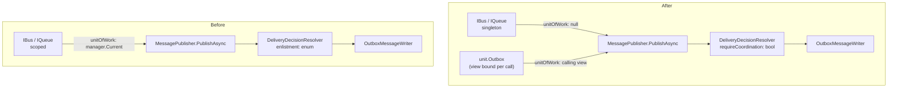
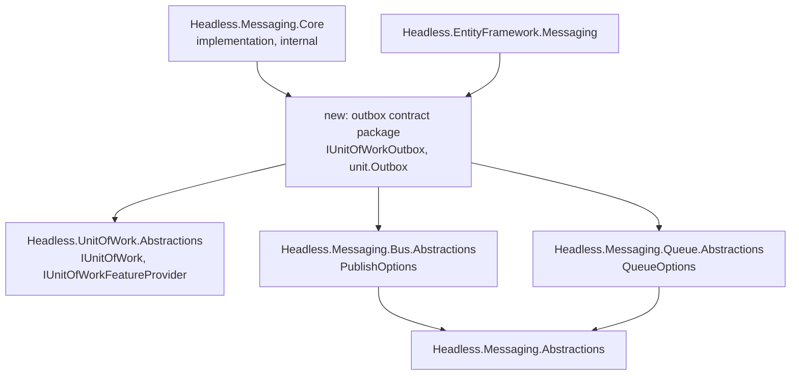
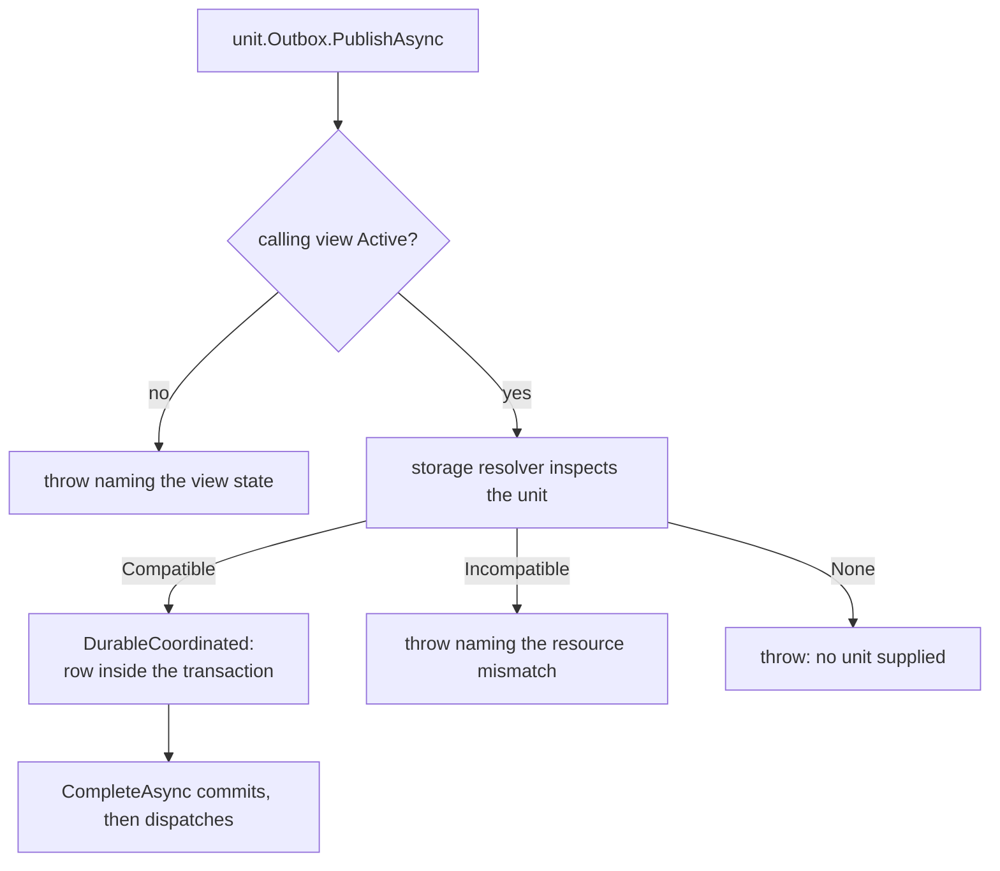

# Explicit Transaction Enlistment for Messaging - Plan

## Goal Capsule

- **Objective:** A service built on Headless starts under Development scope validation with permissions, caching, or distributed locks wired alongside messaging, and anyone reading a publish call can tell from that line alone whether the message survives a rollback.
- **Means:** Two publish surfaces distinguished by receiver — a singleton `IBus`/`IQueue` that never enlists, and `unit.Outbox` that always does (KTD1).
- **Authority hierarchy:** Requirements win on behavior; Key Technical Decisions win on mechanism within those requirements; units override neither.
- **Stop conditions:** Stop and report if Jobs production code cannot keep `TransactionEnlistment` working unchanged while Messaging stops using it (R14), or if the shared outbox package cannot be referenced by the EF bridge without a reference cycle (KTD8).
- **Execution profile:** Behavior-preserving for every caller except the two that deliberately change (R6, R7) and the test harness whose delegate signature changes (R17). Each enlisted path needs a rollback-discard test before its migration is called done.
- **Tail ownership:** `x-autopilot` owns review, residual handoff, and the pull request.

---

## Product Contract

### Summary

Move transaction enlistment from the DI scope to the call site. `IBus` and `IQueue` become singletons that never enlist; a new `unit.Outbox` accessor on `IUnitOfWork` becomes the only way to publish inside a transaction. The public `TransactionEnlistment` surface leaves Messaging, and the enum's remaining Jobs usage is untouched until a later phase.

### Problem Frame

Today `IBus` and `IQueue` are scoped services that read `IUnitOfWorkManager.Current` at publish time (`src/Headless.Messaging.Core/Setup.cs:248-255`). Whether a publish joins the caller's transaction therefore depends on which DI scope the publisher was resolved from — a fact invisible at the call site and unrepresentable for anything process-wide.

That produces two failures. The loud one is issue #922: `DynamicPermissionDefinitionStore` is a singleton that takes the scoped `IBus`, so any host calling `AddHeadlessPermissions` alongside `AddHeadlessMessaging` fails to start under `ValidateScopes`, taking the EF design-time host and integration fixtures down with it. The quiet one is worse: `ValidateScopes` defaults on only in Development, so a root-resolved `IBus` captured in a singleton publishes with no unit of work forever in Production, silently turning atomic outbox writes into non-atomic ones while dev and tests stay green.

The framework already concedes the design: `HybridCache` and the three lock primitives bypass the scoped registration entirely and hand-build a unit-less `Bus` over the singleton `MessagePublisher` (`src/Headless.Messaging.Core/Internal/Bus.cs:34-38`), a pattern `docs/llms/messaging.md:120` documents as framework-internal and forbids to everyone else.

### Key Decisions

- KD1. Enlistment is a property of the call, not of the resolving scope. *(session-settled: user-approved — chosen over adding a singleton root-bus abstraction beside the scoped `IBus`: DI lifetime carrying transaction semantics is what produced #922 and the silent Production case.)* Governs R1, R2, R3.
- KD2. The enlisted surface is `unit.Outbox`, reached from the unit of work. *(session-settled: user-directed — chosen over `bus.In(unit).PublishAsync`: it puts the shorter call on the safer path and leaves one noun to thread into helpers.)* Governs R2, R4.
- KD3. Breaking changes are acceptable and no compatibility shim is written. *(session-settled: user-directed — chosen over phased deprecation with both surfaces live: the repository is greenfield, and two live surfaces reintroduce the ambiguity this work removes.)* Governs R8, R10, R11.

### Requirements

**Publish surfaces**

- R1. `IBus` and `IQueue` resolve as singletons and never enlist in a unit of work, whatever is active in the caller's scope.
- R2. `unit.Outbox` publishes durably into the unit's transaction, exposing `PublishAsync` for the bus lane and `EnqueueAsync` for the queue lane on one accessor, matching the verb-conveyed lane model in `CONCEPTS.md:86`.
- R3. A publish through `unit.Outbox` refuses rather than degrades: when the storage cannot join the given unit, it throws before any effect instead of writing a standalone row. This is the old `TransactionEnlistment.Required` behavior, now implied by the receiver.
- R4. Delivery mode is unrepresentable on the enlisted surface. The outbox option records carry no `DeliveryMode`, because durable delivery is the enlistment mechanism.
- R5. Per-type delivery policy registered through `WithDeliveryMode(...)` applies only to the autonomous surface and cannot affect an enlisted publish.

**Caller migration**

- R6. `OutboxIntegrationEventDispatcher` publishes integration events through `unit.Outbox`, and its reflection-built invoker targets that accessor rather than `IBus`.
- R7. The transactional tier of `ISubscribeExecutor` publishes callback responses through `unit.Outbox`; the non-transactional tier publishes through the singleton `IBus` and stops creating a scope to do so.
- R8. `DynamicPermissionDefinitionStore`, `HybridCache`, `DistributedLock`, `DistributedReadWriteLock`, and `DistributedSemaphoreProvider` inject the singleton `IBus`. The unit-less `Bus`/`Queue` constructors and `DistributedLockCoreHelpers.ResolveUnitLessBus` are deleted.
- R9. Resolving `IDynamicPermissionDefinitionStore` from the root of a provider built with `ValidateScopes = true` succeeds, closing issue #922.
- R17. `MessagingTestHarness.RunInUnitOfWorkAsync` hands its delegate the `IUnitOfWork`, so a harness test can still prove that a rollback discards an enlisted publish.

**Enlistment surface removal**

- R10. `MessageOptions` carries neither `DeliveryMode` nor `Enlistment`; the autonomous records carry `DeliveryMode`.
- R11. Durable rows carry a coordination header derived from `DeliveryDecision.IsTransactional` in place of `headless-enlistment-requested`, and the dashboard shows whether a row was transaction-coordinated rather than what enlistment was requested.
- R12. A storage resolver returns `Incompatible(MissingRelationalCapability)` for a unit whose `Resource` is null, and `None` only when no unit of work was supplied, so the outbox path can tell a developer which of the two they hit.
- R13. Durable rows written before this change remain readable, and a missing coordination header reads as **unknown**, never as `false`. Reporting an old row as "not coordinated" would assert something about it that was never recorded.
- R14. No file under `src/Headless.Jobs.*` is edited, and `TransactionEnlistment` keeps its current behavior for Jobs. Test doubles that implement `IUnitOfWork` explicitly are exempt and are named in U1.

**Documentation**

- R15. The consumer contract states the two surfaces, the refuse-don't-degrade rule, and the execution-strategy consequence in R16, replacing the scoped-facade guidance currently in `docs/llms/unit-of-work.md:25-37` and `docs/llms/messaging.md:120`.
- R16. The documentation states that an enlisted publish forfeits EF execution-strategy replay from that line onward, and why.

### Success Criteria

- A reviewer reading any publish line in the diff can name its atomicity guarantee without checking where the publisher was resolved.
- No singleton in `src/` holds a scoped messaging service; scope validation has nothing left to report in this area.
- The messaging unit suites and the permissions composition suite pass without weakening or deleting an assertion that previously proved atomicity.

### Scope Boundaries

- Deleting the `TransactionEnlistment` type itself. It lives in `Headless.UnitOfWork.Abstractions` and Jobs is an independent first-class consumer across 16 source files; Messaging's use is what this work removes.
- Changing `OutboxMessageWriter` or the storage writers. The unit already reaches them as an argument (`OutboxMessageWriter.cs:36-58`); only its source changes. `MessagePublisher` is **not** in this boundary — it owns the enlistment default and policy map and must change (U3).
- Changing EF execution-strategy replay behavior. `UnitOfWorkManagerEntityFrameworkExtensions.cs:204-280` is untouched.

#### Deferred to Follow-Up Work

- `unit.Jobs` and `unit.Locks` accessors on the same feature seam, and the deletion of `TransactionEnlistment` with them. No schema impact: both job entities carry the enum `[JsonIgnore]` and never persist it (`src/Headless.Jobs.Abstractions/Entities/TimeJobEntity.cs:38-40`, `Entities/CronJobEntity.cs:26-30`).
- Making `IUnitOfWorkManager` a singleton factory and deleting `Current` and `Adopt`, gated on auditing every internal `Current` reader for reliance on join-by-default nesting.
- Execution-strategy replay for the non-EF relational providers, tracked as issue #923.
- Revisiting the `DbContext`-captures-`IBus` guardrail (`src/Headless.Messaging.Storage.PostgreSql.EntityFramework/Setup.cs:266-276`). It is a reflective type-shape check, untouched by this work, but one arm of the cycle it guards disappears once `IBus` no longer depends on `IUnitOfWorkManager`.

### Open Questions

- Deferred: whether to make "this occurrence is regenerated on replay" expressible on the public outbox options. `IsRetainedForTransactionReplay` is `internal` today (`src/Headless.Messaging.Abstractions/MessageOptions.cs:137-138`) and only the EF bridge can honestly make that promise. Making it public would let a caller recover execution-strategy replay; getting it wrong silently duplicates messages. R16 documents the restriction instead.
- Resolved: the Identity DbContext transaction-binding proof moves to `RunAsync` rather than being dropped. `tests/Headless.Identity.Storage.EntityFramework.Tests.Integration/HeadlessIdentityDbContextTransactionTests.cs:12,43` exists to test the deleted extension, but its subject is the binding, which survives this change. Migrating costs a few lines; dropping it would retire a proof for a reason that no longer applies.

### Sources & Research

- MassTransit v9 ships the same split by receiver: `IBus` is the singleton root publisher ("it's important to note that `IBus` isn't scoped, so any scoped filters, etc. may not work as expected") and `IScopedBus`/`IPublishEndpoint` are the scoped, context-carrying surfaces. NServiceBus divides `IMessageSession` from `IMessageHandlerContext` the same way.
- `docs/solutions/logic-errors/asynclocal-ambient-scope-stranded-across-await.md` — the `AsyncLocal` ambient design this replaced, and the reason its decisive test was the negative one. Read before writing U7's tests.
- `docs/solutions/architecture-patterns/coordination-domains-boundary.md` — records that the unit-of-work providers are deliberately symmetric because "no provider observes a database-native commit edge anymore, so no provider needs a privilege the others lack." The feature seam must not reintroduce a provider-specific commit privilege.

---

## Planning Contract

### Key Technical Decisions

- KTD1. **Two receivers, each stating its own guarantee.** Singleton `IBus`/`IQueue` never enlist; `unit.Outbox` always does. Instantiates KD1 and KD2 for R1-R3. The alternative — one surface with an enlistment argument — is what exists today in `MessageOptions.Enlistment`, and its middle value already throws on an incompatible resource rather than degrading, so it never delivered the flexibility its name implied.
- KTD2. **The feature seam is a DI-registered provider resolved lazily off the unit.** `IUnitOfWorkFeatureProvider` is registered by bridge packages; `IUnitOfWork.GetFeature<T>()` resolves and caches through the existing `GetOrAdd<TState, TArg>` state bag. *(session-settled: user-approved — chosen over exposing `IUnitOfWork.Services` and resolving from it: `docs/llms/unit-of-work.md:34` explicitly retired threading `IServiceProvider` through transaction helpers.)* No existing type registers a factory in DI and has the unit resolve it lazily, so this sets the precedent; the closest analogue is `OutboxMessageWriter.cs:53-58`, whose factory is supplied at the call site.
- KTD3. **The cached capability is root-stable; the calling view binds per call.** `UnitOfWork.GetOrAdd` passes the *view* to the factory and caches the result by type on the root (`src/Headless.UnitOfWork/Internal/UnitOfWork.cs:91-115`), so a child-first construction would permanently capture that child. The child can complete while the root stays active, and a later root publish would then reach a dead view — after the row is already stored, because the writer attaches its buffer at `OutboxMessageWriter.cs:53` only after `_StoreCoordinatedMessageAsync`. The cached feature therefore holds no view. `unit.Outbox` returns a readonly-struct binding of the cached capability to the calling view.
- KTD4. **The enum leaves the public surface; the resolver takes an internal boolean.** `DeliveryDecisionResolver.Resolve` replaces its `TransactionEnlistment` parameter with `bool requireCoordination`, and `DeliveryDecision.Enlistment` and its header stamp are replaced per R11. Keeping the enum as an internal argument was considered and rejected: `DeliveryMetadata.Stamp` writes `decision.Enlistment` into every durable row (`src/Headless.Messaging.Core/Internal/DeliveryMetadata.cs:18-23`), so the enum would survive in exactly the wire header and dashboard row that R11 addresses. *(Conflict call-out on KD3: the settled decision was to delete `TransactionEnlistment` entirely, which R14 defers for Jobs. The public Messaging surface goes now; the type dies with the Jobs work.)*
- KTD5. **Refusal is storage-decided, not publisher-decided.** Each storage's `IDeliveryCoordinationResolver` already encodes whether it can join a given unit; the outbox path only refuses `DeliveryCoordinationStatus.None`. This keeps the in-memory storage's legitimate resource-less join working (`InMemoryDataStorage.cs:61-70` returns `Compatible(unit, transaction: null)`) without a special case in the publisher.
- KTD6. **`unit.Outbox` ships into the `Headless.UnitOfWork` namespace** behind a `Headless`-prefixed holder with the `IDE0130` pragma, per the tier-3 rule in `docs/solutions/conventions/namespace-policy.md:77-91`. Consumers already hold `using Headless.UnitOfWork;` where they hold the unit; requiring a second using to discover the accessor would hide it at the moment of use.
- KTD7. **Enlisted publishing forfeits execution-strategy replay, and the plan says so rather than working around it.** `MessagePublisher.cs:153-160` calls `PreventRetry()` on every coordinated publish unless `IsRetainedForTransactionReplay`, which is `internal`. Making `unit.Outbox` the ordinary enlisted path turns a narrow consequence into a routine one, so R16 documents it and the public opt-in stays an Open Question.
- KTD8. **The outbox contract needs a package both lanes and the EF bridge can see.** `Headless.Messaging.Bus.Abstractions` references only `Headless.Messaging.Abstractions` (`csproj:12`) and the queue package mirrors it, so one accessor carrying both lane verbs cannot live in either; `Headless.EntityFramework.Messaging` references neither `Messaging.Core` nor the queue package (`csproj:9-13`), and Core's internals grant covers only that bridge's integration test project. A new small package referencing both lane abstractions and `Headless.UnitOfWork.Abstractions` declares the public accessor contract; the implementation stays internal in Core. Two lane-owned accessors were rejected: no lane package exposes a type the other consumes today, so that shape would invent a cross-lane dependency and split R2's single noun. The accepted cost is a shipped one: because the contract names both lanes' option records, `Headless.EntityFramework.Messaging` gains a transitive NuGet dependency on `Headless.Messaging.Queue.Abstractions`, which it does not have today and does not otherwise need — the bridge publishes on the bus lane only. Nothing else in `src/` takes a new reference: the monitoring APIs, the dashboard, and `RecordedMessage` consume Core internals already covered by Core's grant list, and the in-memory storage implements `ICoordinatedMessageStore` rather than this contract.
- KTD9. **The invoker retarget has no compile-time safety net, so the rollback-discard test is the control.** A missed retarget is silent, not loud: `IBus.PublishAsync<T>(T, PublishOptions, CancellationToken)` still exists after U2, so `typeof(IBus).GetMethods(...).Single(...)` keeps resolving and the dispatcher keeps publishing autonomously with no exception. Changing the delegate's type parameter does **not** rescue this — `Expression.Parameter(typeof(IBus))` returns an untyped `ParameterExpression` (`IntegrationEventPublishInvokerCache.cs:34-58`), so a stale expression parameter or `MethodInfo` still compiles and fails only when the expression is built or invoked. A partial retarget matching zero or several methods throws inside type initialization, surfaced as `TypeInitializationException` with no guaranteed timing, and not every partial retarget throws at all. Three things must be retargeted together and checked by test, not by the build: the delegate type, the expression parameter, and the `MethodInfo` lookup.

### High-Level Technical Design

Where the unit of work comes from is the whole change. The writer and the storages keep their current shape.

Package placement, which KTD8 exists to satisfy:

The outbox decision gate, after U3:

### Assumptions

These are agent bets made without confirmation, recorded so review can scrutinise them:

- A1. This work is scoped to Messaging only, with Jobs, locks, and the singleton unit-of-work factory as separate later work. The phase split was recommended and not explicitly confirmed.
- A2. `IQueue` stays a separate surface rather than folding into one `IMessageBus` with both verbs.
- A3. The new package is named `Headless.Messaging.UnitOfWork`, following the bridge convention `Headless.Messaging.EntityFramework` and `Headless.EntityFramework.Messaging` already set — the producing family first, the bridged family second. The feature-seam type names and the outbox option record names remain proposals. The package's *existence* is not a naming question; KTD8 forces it, and the name is the one item here that ships as public API, so it is the cheapest thing to change before merge and the most expensive after.
- A5. Success is proven by the existing unit suites plus the new tests in each unit; no integration suite is required to gate this change, consistent with CI running unit tests only. U8 is the exception: it deletes an API two integration suites exist to test.

### Sequencing

Three groups land atomically, because each leaves the tree unbuildable mid-group:

- **Group A — U2, U3, U9 (operator surface only; U9's R17 harness test lands with group C).** U2 removes `MessageOptions.Enlistment`, whose consumers live in U3's files; U3 removes `DeliveryMetadataValues.RequestedEnlistment`, whose consumers live in U9's six packages.
- **Group B — U4, U6.** U4 deletes the unit-less `Bus` constructor whose only callers are U6's.
- **Group C — U1, then U5, then U7.** These are genuinely sequential and each builds on its own.

U8 and U10 are independent. Per-unit verification below names the group where the build gate actually applies.

---

## Implementation Units

| U-ID | Title | Key files | Depends on |
|---|---|---|---|
| U1 | Unit-of-work feature seam | `Headless.UnitOfWork.Abstractions`, `Headless.UnitOfWork/Internal` | — |
| U2 | Split the message option records | `Headless.Messaging.Abstractions`, both lane abstractions | — |
| U3 | Internal coordination flag replaces the enum | `Headless.Messaging.Core`, storage resolvers | U2 |
| U4 | Singleton `IBus`/`IQueue` | `Headless.Messaging.Core/Setup.cs`, `Internal/Bus.cs`, `Internal/Queue.cs` | U3 |
| U5 | Outbox contract package and `unit.Outbox` | new package, `Headless.Messaging.Core` | U1, U3 |
| U6 | Migrate the autonomous singletons | Permissions, Caching.Hybrid, DistributedLocks.Core | U4 |
| U7 | Migrate the two enlisted publishers | `Headless.EntityFramework.Messaging`, `ISubscribeExecutor` | U5 |
| U8 | Delete `ExecuteTransactionAsync` | `Headless.EntityFramework/Extensions` | — |
| U9 | Replace the enlistment operator surface | Dashboard, monitoring APIs, test harness | U3 |
| U10 | Rewrite the consumer contract | `docs/llms`, `CONCEPTS.md`, `docs/solutions`, `CLAUDE.md` | U4, U5, U7 |

### U1. Unit-of-work feature seam

**Goal:** Let a bridge package attach a typed capability to a unit of work without the unit-of-work packages depending on it.

**Requirements:** R2, R14. Instantiates KTD2, KTD3.

**Dependencies:** none. Heads group C.

**Files:**
- `src/Headless.UnitOfWork.Abstractions/IUnitOfWorkFeatureProvider.cs` (new)
- `src/Headless.UnitOfWork.Abstractions/IUnitOfWork.cs`
- `src/Headless.UnitOfWork/Internal/UnitOfWork.cs`, `UnitOfWorkHandle.cs`, `ChildUnitOfWork.cs`
- `src/Headless.UnitOfWork/Setup.cs`
- `tests/Headless.Jobs.Composition.Tests.Unit/Transactions/JobsManagerCoordinatedRoutingTests.cs` (the `UnitOfWorkProbe` explicit implementer)
- `tests/Headless.Messaging.Core.Tests.Unit/Internal/FakeUnitOfWorks.cs`
- `tests/Headless.UnitOfWork.Tests.Unit/` (feature-seam tests)

**Approach:**
1. Add `IUnitOfWorkFeatureProvider` exposing the feature type it produces and a factory taking the unit.
2. Add `GetFeature<TFeature>()` to `IUnitOfWork`, returning null when no provider is registered for that type.
2b. Add a view-aware liveness operation to `IUnitOfWork` that each implementation answers **for itself**, throwing when the receiver can no longer carry work. The root handle answers from its own disposal and the engine state; the child answers from its own `_disposed` and `_completedView` flags *and* the root state. The existing `State` property cannot serve this: `ChildUnitOfWork.State` forwards to `root.State` (`src/Headless.UnitOfWork/Internal/ChildUnitOfWork.cs:32`) while child completion sets the private `_completedView` (`:95`), so a completed child still reports `Active` while the root is open.
3. Implement it over the existing state bag so the capability is created once per unit and disposed with it; use the closure-free `GetOrAdd<TState, TArg>` overload, following `OutboxMessageWriter.cs:53-58`.
4. Resolve the registered providers once, not per call.
5. Update the two test doubles that implement `IUnitOfWork` explicitly.

**Approach note:** `UnitOfWorkProbe` is a forwarding decorator. Adding the member as a default interface implementation would compile and then silently bypass the inner unit, so implement it explicitly there and forward. This is the one place R14's no-Jobs-edits rule is relaxed, and it is test-only.

**Patterns to follow:** `src/Headless.Messaging.Core/Internal/OutboxMessageWriter.cs:53-58` for the state-bag attachment and its closure-free state struct at `:101`.

**Test scenarios:**
- Resolving a feature twice on the same unit returns the same instance.
- A feature resolved first from a child view and then from the root returns one instance, and the instance carries no reference to either view — the regression KTD3 guards.
- Resolving a feature on a unit that has completed throws.
- The liveness operation reports a completed child view as unusable while the root is still active, and reports the root itself as usable in that same state.
- Resolving a feature with no registered provider returns null rather than throwing.
- The capability is disposed after commit and after rollback alike.
- `UnitOfWorkProbe` forwards the new member to its inner unit rather than answering for it.

**Verification:** `Headless.UnitOfWork.Tests.Unit` and `Headless.Jobs.Composition.Tests.Unit` pass; the new tests fail if `GetFeature` is changed to create per call.

### U2. Split the message option records

**Goal:** Make "durable delivery into a transaction" and "delivery mode" mutually exclusive by type.

**Requirements:** R4, R10.

**Dependencies:** none. Lands with group A.

**Files:**
- `src/Headless.Messaging.Abstractions/MessageOptions.cs`
- `src/Headless.Messaging.Abstractions/DeliveryMode.cs` (crefs at `:10,19,27`)
- `src/Headless.Messaging.Bus.Abstractions/PublishOptions.cs`, `IBus.cs` (prose at `:15,53-54,74`)
- `src/Headless.Messaging.Queue.Abstractions/QueueOptions.cs`, `IQueue.cs` (same prose positions)
- new outbox-shaped records beside each lane's existing options
- `tests/Headless.Messaging.Abstractions.Tests.Unit/`

**Approach:**
1. Remove `DeliveryMode` and `Enlistment` from `MessageOptions`, leaving identity, tenancy, headers, delay, scheduling, callback, and the two internal members.
2. Add `DeliveryMode` to the autonomous records for each lane.
3. Add an outbox-shaped record per lane carrying the base only.
4. Preserve structural equality: the existing `Equals`/`GetHashCode` overrides enumerate every scalar and must drop the removed members.
5. Fix every `<see cref="MessageOptions.Enlistment"/>` and stale prose reference in the listed files.

**Approach note:** `IsRetainedForTransactionReplay` stays declared in `Headless.Messaging.Abstractions`. Its internals grant (`Headless.Messaging.Abstractions.csproj:9-12`) reaches Core, the EF bridge, and Core's unit tests; `Headless.Messaging.Bus.Abstractions.csproj:9` grants only `.Core`, so moving the property beside `PublishOptions` would cut off `OutboxIntegrationEventDispatcher.cs:58` and silently cost every integration-event save its execution-strategy replay.

**Execution note:** a stale `<see cref="...Enlistment"/>` is CS1574, which the Headless SDKs raise as an error in CI. Search the whole solution for crefs to the removed members rather than fixing only the listed files.

**Test scenarios:**
- Two outbox option records with identical headers in different dictionary instances compare equal.
- A `with` expression on an outbox record preserves every other member.
- Changing a header value makes two records unequal, and their hash codes differ.

**Verification:** `Headless.Messaging.Abstractions.Tests.Unit` passes. The solution build gate applies at the end of group A, not here.

### U3. Internal coordination flag replaces the enum

**Goal:** Remove the enlistment concept from Messaging's decision path and replace its wire header with one that answers the question operators actually have.

**Requirements:** R3, R5, R11, R12, R13.

**Dependencies:** U2. Lands with group A.

**Files:**
- `src/Headless.Messaging.Core/Internal/DeliveryDecisionResolver.cs`
- `src/Headless.Messaging.Core/Internal/DeliveryMetadata.cs`, `MessagePublisher.cs`, `PublishContext.cs`
- `src/Headless.Messaging.Core/Internal/IMessagePublishRequestFactory.cs` (reserved-header list at `:73`)
- `src/Headless.Messaging.Core/Setup.cs:241` (passes `DefaultEnlistment` into the publisher)
- `src/Headless.Messaging.Abstractions/Headers.cs`
- `src/Headless.Messaging.Core/Registration/MessageBuilder.cs`, `MessageRegistration.cs`, `Configuration/MessagingOptions.cs`
- `src/Headless.Messaging.Storage.PostgreSql/PostgreSqlDataStorage.cs`, `Storage.SqlServer/SqlServerDataStorage.cs`
- `tests/Headless.Messaging.Core.Tests.Unit/`, including `Internal/MessagePublishRequestFactoryTests.cs:49`

**Approach:**
1. Replace the `TransactionEnlistment` parameter on `Resolve` with `bool requireCoordination` and rewrite the three branches: refuse `Incompatible` always; refuse `None` when coordination is required; otherwise resolve as today.
2. Replace `Headers.RequestedEnlistment` with a coordination header stamped from `DeliveryDecision.IsTransactional`, and update the reserved-header list.
3. Delete `DeliveryDecision.Enlistment`, the `RequestedEnlistment` member of `DeliveryMetadataValues`, `MessagingOptions.DefaultEnlistment` and its validator entry, and the per-type `WithEnlistment` registration.
4. Change the relational storage resolvers' null-resource branch from `None` to `Incompatible(MissingRelationalCapability)` — the mismatch value already exists at `DeliveryCoordination.cs:20` — and extend the incompatible message with a clause naming the missing relational resource (R12).
5. Keep `DeliveryMetadata.Read` tolerant of an absent coordination header and make the value nullable, so a row carrying the two delivery-mode headers but no coordination header reads as unknown rather than `false` (R13). The existing all-three-absent branch already handles a wholly empty envelope; the new case is a partially populated one.

**Approach note:** a host that set `DefaultEnlistment = Required` was using it as a "never publish outside a transaction" guardrail. Deleting the option removes that guarantee, and because the option simply disappears the host gets a compile error rather than silent behavior loss — which is the correct diagnostic under KD3, but it must be called out in the release notes for U10.

**Execution note:** the `Direct` plus coordination-required combination already throws; keep that guard, because the autonomous surface must never request coordination and `HybridCache` and both lock primitives publish `Direct`.

**Test scenarios:**
- Coordination required with a compatible unit resolves to the coordinated path.
- Coordination required with an incompatible resource throws, and the message names the mismatch.
- Coordination required with a null-resource relational unit throws with the missing-relational-resource clause, not the "begin one with BeginAsync" advice.
- Coordination required with in-memory storage and a resource-less unit succeeds, proving KTD5.
- Coordination not required with no unit resolves to the standalone durable path.
- `Direct` with coordination required throws before any transport call.
- A stored row carrying both delivery-mode headers but no coordination header reads as unknown, and the test fails if it reads as `false`.
- A coordinated publish stamps the coordination header true; an autonomous one stamps it false.

**Verification:** `Headless.Messaging.Core.Tests.Unit` passes and the solution builds at the end of group A. No occurrence of the enlistment header name remains under `src/`.

### U4. Singleton `IBus` and `IQueue`

**Goal:** Make the autonomous surface a singleton that cannot enlist.

**Requirements:** R1, R8.

**Dependencies:** U3. Lands with group B.

**Files:**
- `src/Headless.Messaging.Core/Setup.cs`
- `src/Headless.Messaging.Core/Internal/Bus.cs`, `Internal/Queue.cs`
- `tests/Headless.Messaging.Core.Tests.Unit/`

**Approach:**
1. Change both registrations from `TryAddScoped` to `TryAddSingleton`, constructed over `MessagePublisher` alone.
2. Delete the `IUnitOfWorkManager`-taking constructors and the unit-less constructors. The direct-construction constructor (`Internal/Bus.cs:39-64`) survives — `BusTests`, `IsTransactionalPropagationTests`, and `MessagingLaneSplitTests` use it.
3. Pass `unitOfWork: null` and coordination-not-required on every call.

**Test scenarios:**
- A publish through `IBus` inside an active unit of work writes a standalone durable row and does not enlist — the direct inverse of U5's first scenario.
- Both services resolve from the root of a provider built with `ValidateScopes = true`.
- Two resolutions from different scopes return the same instance.

**Verification:** `Headless.Messaging.Core.Tests.Unit` passes and the solution builds at the end of group B. No `AddScoped<IBus>` or `AddScoped<IQueue>` remains in `src/`.

### U5. Outbox contract package and `unit.Outbox`

**Goal:** Give the unit of work a publish surface whose guarantee is its own name, in a package every consumer can reference.

**Requirements:** R2, R3, R4. Instantiates KTD8.

**Dependencies:** U1, U3. Lands with group C.

**Files:**
- new package declaring the public outbox contract and the `unit.Outbox` accessor, referencing both lane abstractions and `Headless.UnitOfWork.Abstractions`
- `headless-framework.slnx`
- `src/Headless.Messaging.Core/Internal/` (the implementation and its feature provider)
- `src/Headless.Messaging.Core/Setup.cs` (register the provider)
- `src/Headless.Messaging.Core/Headless.Messaging.Core.csproj` (reference the new package)
- `tests/Headless.Messaging.Core.Tests.Unit/`

**Approach:**
1. Create the package with a Headless SDK per the repository's new-project rules and attach it to the solution file.
2. Declare the public outbox contract with `PublishAsync` and `EnqueueAsync` taking the outbox-shaped option records.
3. Implement it internally in Core over `MessagePublisher`, holding no view (KTD3).
4. Register its provider from `AddHeadlessMessaging`.
5. Add the `unit.Outbox` accessor as a `Headless`-prefixed extension holder in the `Headless.UnitOfWork` namespace with the `IDE0130` pragma (KTD6), returning a readonly-struct binding of the cached capability to the calling view, and throwing a message naming `AddHeadlessMessaging` when no provider is registered.
6. Call U1's view-aware liveness operation on the bound view at the start of **every** publish, not once when the accessor is taken. A binding can be retained in a local and used after its own view has completed, and the writer stores the row before attaching its buffer (`OutboxMessageWriter.cs:40-58`), so a check that runs only at accessor time can still leave a stored row that never dispatches.

**Execution note:** the accessor must be a synchronous property, not an async factory. `docs/solutions/logic-errors/asynclocal-ambient-scope-stranded-across-await.md` records the failure mode an async context factory produced here before.

**Test scenarios:**
- A publish through `unit.Outbox` inside a transaction that is then rolled back leaves no durable row — the negative test the AsyncLocal retrospective identifies as the only decisive one.
- The same publish followed by `CompleteAsync` leaves exactly one row and dispatches after the commit.
- A publish through `unit.Outbox` on a unit whose storage cannot join it throws before writing anything.
- A publish on a completed-but-undisposed child view throws rather than publishing against a dead view, and the test fails if the check reads the view's `State` property instead of its own completion flag.
- A binding taken from a child view, retained in a local, and used after that child completes throws — proving the check runs per publish rather than per accessor.
- `unit.Outbox` with messaging unregistered throws a message naming the registration call.
- A publish from a child view enlists in the root's transaction and is discarded when the root rolls back.
- Both lane verbs route to their own lane.

**Verification:** `Headless.Messaging.Core.Tests.Unit` passes, and the rollback-discard test fails if the implementation is changed to pass `unitOfWork: null`.

### U6. Migrate the autonomous singletons

**Goal:** Let the five framework singletons hold the singleton bus, and close issue #922.

**Requirements:** R8, R9.

**Dependencies:** U4. Lands with group B.

**Files:**
- `src/Headless.Permissions.Core/Definitions/DynamicPermissionDefinitionStore.cs`
- `src/Headless.Caching.Hybrid/Setup.cs`, `HybridCache.cs`
- `src/Headless.DistributedLocks.Core/DistributedLockCoreHelpers.cs`, `Setup.cs`
- `tests/Headless.Permissions.Composition.Tests.Unit/Definitions/`
- `tests/Headless.Caching.Hybrid.Tests.Unit/`, `tests/Headless.DistributedLocks.Tests.Unit/`

**Approach:**
1. Replace the hand-built unit-less `Bus` in the hybrid cache factory and `ResolveUnitLessBus` with the registered singleton `IBus`, keeping the locks' optional-bus behavior and its absent-bus log.
2. Delete `ResolveUnitLessBus`.
3. Leave every publish's options untouched: the cache and locks keep `Direct`, and the permissions store keeps publishing with no options, which resolves to host-default durable-autonomous exactly as it does today.

**Approach note:** the permissions store is registered `TryAddSingleton` (`Setup.cs:154`), so the `IBus` it captures today already comes from the root provider and its manager's `Current` is never set by request code. It cannot enlist now, and it does not enlist after. The migration is behavior-preserving, not an atomicity change.

**Test scenarios:**
- Covers R9. Resolving `IDynamicPermissionDefinitionStore` from the root of a provider built with `ValidateScopes = true` succeeds, and the test fails with the captive-dependency message if the constructor takes a scoped service again.
- `SaveAsync` publishes exactly one definitions-changed message per call that adds or updates permissions.
- Hybrid cache invalidation still publishes `Direct`.
- A lock release signal still publishes `Direct`, and a host with no messaging registered still logs the absent-bus fallback rather than throwing.

**Verification:** the permissions composition, hybrid cache, and distributed-lock unit suites pass; `make quality-analyzers-project` is clean for `Headless.Permissions.Core`.

### U7. Migrate the two enlisted publishers

**Goal:** Preserve atomicity for the only two production paths that genuinely enlist.

**Requirements:** R6, R7. Instantiates KTD9.

**Dependencies:** U5. Lands with group C.

**Files:**
- `src/Headless.EntityFramework.Messaging/OutboxIntegrationEventDispatcher.cs`
- `src/Headless.EntityFramework.Messaging/IntegrationEventPublishInvokerCache.cs`
- `src/Headless.EntityFramework.Messaging/Headless.EntityFramework.Messaging.csproj` (reference the new package)
- `src/Headless.Messaging.Core/Internal/ISubscribeExecutor.cs`
- `tests/Headless.EntityFramework.Messaging.Tests.Unit/`, `tests/Headless.EntityFramework.Messaging.Tests.Integration/`
- `tests/Headless.Messaging.Core.Tests.Unit/`, including the transactional inbox retry conformance tests

**Approach:**
1. In the dispatcher, publish through the current unit's outbox. Its existing guard already proves a resource-bearing unit is current (`:79`), so the guard becomes the accessor rather than a separate check.
2. Retarget the invoker cache in one pass — the delegate type parameter, the `Expression.Parameter` type, and the `MethodInfo` lookup — then prove it by test. The build will not flag a missed piece (KTD9).
3. In the subscribe executor, route the transactional tier (`:769-780`) through the attempt scope's current unit, and the non-transactional tier (`:781-790`) through the singleton bus, deleting the scope it creates solely to resolve one.

**Execution note:** a missed retarget is silent, not loud, and the compiler will not help. `IBus.PublishAsync<T>(T, PublishOptions, CancellationToken)` still exists after U2, so the reflection lookup keeps resolving and the dispatcher keeps publishing — autonomously. Only the rollback-discard test catches it; a smoke test will not.

**Approach note:** the dispatcher's rollback test needs a resource-bearing *non-relational* fake unit. The dispatcher demands `Resource is not null` (`:79`) while the in-memory storage refuses an `IRelationalUnitOfWorkResource` (`InMemoryDataStorage.cs:61-67`), so a unit test can prove this without the integration suite.

**Test scenarios:**
- Covers R6. Integration events dispatched during a save that then rolls back leave no durable rows; the same save committed leaves one row per event and dispatches after the commit.
- The invoker cache resolves and invokes for a runtime-typed payload, proving the retarget rather than assuming it.
- The dispatcher still throws its existing mis-wire error when no resource-bearing unit is current.
- Covers R7. A callback response published from the transactional tier is discarded when the handler's transaction rolls back, asserted as a conformance case: a failed handler that named a callback leaves zero published rows.
- A callback response published from the non-transactional tier is written autonomously and survives, and no DI scope is created on that path.

**Verification:** both EntityFramework.Messaging suites and `Headless.Messaging.Core.Tests.Unit` pass; each rollback-discard test fails when its publish is pointed back at the singleton bus.

### U8. Delete the `ExecuteTransactionAsync` extensions

**Goal:** Leave one receiver for opening a transaction.

**Requirements:** KD3.

**Dependencies:** none.

**Files:**
- `src/Headless.EntityFramework/Extensions/HeadlessDbContextTransactionExtensions.cs` (delete)
- `src/Headless.EntityFramework/Contexts/HeadlessDbContextServices.cs:35` (comment naming the deleted helper)
- call sites across `src/` and `tests/`
- `tests/Headless.EntityFramework.Tests.Integration/HeadlessDbContextTests.cs:259-360`
- `tests/Headless.Identity.Storage.EntityFramework.Tests.Integration/HeadlessIdentityDbContextTransactionTests.cs`
- `docs/llms/orm.md`, `docs/llms/unit-of-work.md`, `docs/llms/jobs.md:66,194,205,1545,1609`, `docs/llms/messaging.md:68,82,122`

**Approach:**
1. Delete both overloads and the file if nothing else lives in it.
2. Move each caller to `IUnitOfWorkManager.RunAsync(db, (unit, ct) => …)`, capturing the context from the enclosing scope.
3. Rewrite the two integration suites against `RunAsync`, or, for the Identity one, drop it if its binding proof is genuinely about the deleted API rather than the binding — see Open Questions.
4. Update every documentation sample that shows the extension.

**Approach note:** the deleted overloads pass `(_, ct) => operation(context, ct)`, discarding the unit `RunAsync` hands back. Every migrated call site gains access to the unit it previously could not reach, which is the point.

**Test scenarios:**
- The migrated `HeadlessDbContextTests` cases still prove what they proved before: transaction ownership, rollback on throw, and replay behavior under a retrying strategy.
- The Identity binding case, if kept, proves the same binding through `RunAsync`.

**Verification:** the solution builds; no reference to the removed extension remains in `src/`, `tests/`, or `docs/`.

### U9. Replace the enlistment operator surface

**Goal:** Give operators the fact they actually need — was this row transaction-coordinated — instead of a retired request value, and keep the harness able to prove atomicity.

**Requirements:** R11, R13, R17.

**Dependencies:** U3 for the operator-surface work, which lands with group A. The R17 harness work is **group C**: the delegate signature change may land with group A, but its rollback scenario needs `unit.Outbox` from U5 and the singleton `IBus` it must fail against from U4, so the test is written after U5.

**Files:**
- `src/Headless.Messaging.Core/Monitoring/MessageView.cs`
- `src/Headless.Messaging.Storage.InMemory/InMemoryMonitoringApi.cs`, `Storage.PostgreSql/PostgreSqlMonitoringApi.cs`, `Storage.SqlServer/SqlServerMonitoringApi.cs`
- `src/Headless.Messaging.Dashboard/Endpoints/MessagingDashboardEndpoints.cs`
- `src/Headless.Messaging.Dashboard/wwwroot/src/components/MessageDetailDialog.vue`, `wwwroot/src/views/Published.vue`, `wwwroot/src/views/Received.vue`
- `src/Headless.Messaging.Testing/RecordedMessage.cs`, `MessagingTestHarness.cs`
- `tests/Headless.Messaging.Dashboard.Tests.Unit/`, `tests/Headless.Messaging.Testing.Tests.Unit/`, `tests/Headless.Messaging.Storage.InMemory.Tests.Unit/`

**Approach:**
1. Replace the requested-enlistment field with a coordination field through the monitoring view, all three monitoring APIs, and the dashboard endpoint projections.
2. In the SPA, replace the `TransactionEnlistment` union type and both `requestedEnlistment` props with the coordination value, and relabel the detail row.
3. Replace `RecordedMessage.RequestedEnlistment` with the coordination value.
4. Change `MessagingTestHarness.RunInUnitOfWorkAsync` to hand its delegate the `IUnitOfWork` alongside the scope, and rewrite its XML contract, which currently instructs callers to resolve `IBus` from the scope to enlist (`MessagingTestHarness.cs:500-510`).

**Execution note:** this unit changes the SPA, so it needs Node 22+ and a dashboard rebuild; the embedded `wwwroot/dist` is not committed.

**Test scenarios:**
- A dashboard message-detail response reports coordination and carries no enlistment field.
- A row written before this change renders its coordination value as not recorded, distinct from a row that renders it as false.
- Covers R17. A harness test using `RunInUnitOfWorkAsync` proves a rollback discards an enlisted publish, and it fails if the delegate publishes through the singleton bus instead.

**Verification:** `make dashboard-messaging` succeeds; the dashboard, harness, and in-memory storage unit suites pass. The R17 harness scenario runs with group C, not group A.

### U10. Rewrite the consumer contract

**Goal:** Make the documentation state the new rule instead of the retired one.

**Requirements:** R15, R16.

**Dependencies:** U4, U5, U7.

**Files:**
- `docs/llms/messaging.md` (the guarantee matrix and framework-internal-singletons paragraph at `:110-122`, the harness contract at `:1745-1774`)
- `docs/llms/unit-of-work.md` (Agent Rules at `:25-37`, the scoped-facade rationale at `:48`)
- `docs/llms/jobs.md` (the enlistment cross-reference)
- `CONCEPTS.md` (`### Delivery mode` at `:105`, `### Unit-of-work manager` at `:174`, `### Transaction enlistment` at `:183`, `### Unit-local state` at `:210`)
- `docs/solutions/architecture-patterns/coordination-domains-boundary.md` (the UnitOfWork row's key-contracts cell at `:39`; `### Jobs transactional deadlines` at `:52-65` keeps its semantics but loses the Messaging pairing)
- `CLAUDE.md` (the 2026-09-17 learning asserting the scoped-facade contract)
- `src/Headless.UnitOfWork.Abstractions/README.md`

**Approach:**
1. Replace the three-row enlistment matrix with the two-receiver rule, keeping every throw case as outbox behavior.
2. State R16's execution-strategy consequence where the matrix used to be, and note that a host relying on `DefaultEnlistment = Required` as a guardrail now gets a compile error instead.
3. Narrow the `### Transaction enlistment` concept entry to Jobs and drop the Messaging mapping sentence.
4. Extend `### Unit-local state` to name the feature seam as a sanctioned framework-owned use, so it no longer reads as forbidding KTD2.
5. Rewrite the `CLAUDE.md` learning to state what is now true, rather than appending a contradicting line.

**Approach note:** `docs/llms/index.md:23` names transactions as a domain contract without asserting the scoped shape, so it needs no edit — verify rather than assume.

**Test scenarios:** Test expectation: none — documentation only. The authoring checks in `docs/authoring/AUTHORING.md:150-157` replace test coverage here.

**Verification:** no `docs/llms/` file describes `IBus` or `IQueue` as scoped; no `docs/` file outside the Jobs context describes `MessageOptions.Enlistment`; changed code samples compile against the new API.

---

## Verification Contract

| Gate | Command | Applies to |
|---|---|---|
| Focused build | `make build-project PROJECT=src/…/X.csproj` | every unit, during work |
| Group build gate | `make rebuild` | end of group A, group B, and after U5 and U7 |
| Messaging core | `make test-project TEST_PROJECT=tests/Headless.Messaging.Core.Tests.Unit/Headless.Messaging.Core.Tests.Unit.csproj` | U3, U4, U5, U7 |
| Permissions composition | `make test-project TEST_PROJECT=tests/Headless.Permissions.Composition.Tests.Unit/Headless.Permissions.Composition.Tests.Unit.csproj` | U6 |
| Unit of work | `make test-project TEST_PROJECT=tests/Headless.UnitOfWork.Tests.Unit/Headless.UnitOfWork.Tests.Unit.csproj` | U1 |
| Jobs composition | `make test-project TEST_PROJECT=tests/Headless.Jobs.Composition.Tests.Unit/Headless.Jobs.Composition.Tests.Unit.csproj` | U1 |
| EF messaging bridge | `make test-project TEST_PROJECT=tests/Headless.EntityFramework.Messaging.Tests.Unit/Headless.EntityFramework.Messaging.Tests.Unit.csproj` | U7 |
| Dashboard SPA | `make dashboard-messaging` | U9 |
| Whole suite | `make test` | before the pull request |
| Format | `make format-check` | before the pull request |
| Analyzers | `make quality-analyzers` | before the pull request |

Provider-integration suites are not a merge gate, but U7 and U8 both touch code those suites cover, so run `Headless.EntityFramework.Messaging.Tests.Integration` and `Headless.EntityFramework.Tests.Integration` locally before opening the pull request.

---

## Definition of Done

**Global**

- Every requirement R1-R17 is met or explicitly deferred in the pull request body.
- `make test`, `make format-check`, and `make quality-analyzers` are clean.
- No singleton in `src/` holds a scoped messaging service.
- No abandoned approach remains in the diff: no dead unit-less constructor, no commented-out enlistment branch, no parallel publish path kept "just in case".
- Issue #922 is closed by the regression test in U6, not by a workaround.

**Per unit**

- Its test scenarios exist as tests and fail when its change is reverted.
- For U5, U7, and U9, the rollback-discard test is present and demonstrably fails when the publish is pointed at the wrong receiver. A green happy-path test alone does not satisfy these units, per the retrospective cited in Sources.
