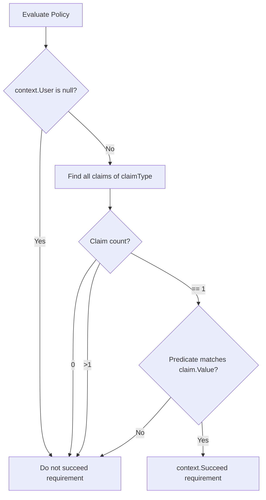

## Goal Capsule

- **Objective:** Enable APIs to configure authorization policies that strictly require a principal to possess exactly one claim of a given type and validate its value, failing authorization if the claim is missing, has an unmatching value, or appears multiple times.
- **Means:** Add `RequireSingleClaimValue` and `RequireSingleClaim` extension methods on `AuthorizationPolicyBuilder` in `Headless.Api.Core` backed by a self-handling `SingleClaimRequirement` (KTD1).
- **Authority hierarchy:** Issue #946 requirements supersede default claim handling; ASP.NET Core authorization extensibility standards govern requirement implementation.
- **Stop conditions:** Plan authoring completes after document review; pipeline hands off to `x-code` execution.
- **Execution profile:** Direct implementation across `src/Headless.Api.Core`, `tests/Headless.Api.Tests.Unit`, and `docs/llms/api.md`.

---

## Product Contract

### Summary

ASP.NET Core's built-in `AuthorizationPolicyBuilder.RequireClaim(type, value)` succeeds if *any* claim of the specified type matches. If a principal carries multiple claims of the same type (for example, conflicting or mutually exclusive tenant/role/level tags), the principal can satisfy multiple exclusive policies at once.

This feature adds `RequireSingleClaimValue` and `RequireSingleClaim` extension methods on `AuthorizationPolicyBuilder` in `Headless.Api.Core`. The requirement fails if the principal has zero claims of the given type, has more than one claim of that type, or has exactly one claim whose value fails the equality check or predicate.

### Problem Frame

When designing role or attribute-based authorization for strictly partitioned resources, applications frequently rely on claims that represent a single state (such as membership tier or exclusive access level). Because ASP.NET Core evaluates claims with existential semantics (`Any`), a user with both `tier=bronze` and `tier=gold` will pass both a bronze-only policy and a gold-only policy. Applications currently have to write custom requirement handlers or imperative endpoint filters to enforce that exactly one claim is present and matches. Providing this extension in `Headless.Api.Core` standardizes strict single-claim validation across Headless API applications.

### Requirements

#### Policy Builder Extensions
- R1. Provide an extension method `RequireSingleClaimValue(this AuthorizationPolicyBuilder builder, string claimType, string value)` on `AuthorizationPolicyBuilder` in namespace `Microsoft.AspNetCore.Authorization`.
- R2. The policy configured with `RequireSingleClaimValue` must pass only when the principal has exactly one claim of `claimType` and its value equals `value` using ordinal string comparison (`StringComparison.Ordinal`).
- R3. Provide an extension method `RequireSingleClaim(this AuthorizationPolicyBuilder builder, string claimType, Func<string, bool> predicate)` on `AuthorizationPolicyBuilder` in namespace `Microsoft.AspNetCore.Authorization` for general predicate-based claim evaluation.
- R4. The policy configured with `RequireSingleClaim` must pass only when the principal has exactly one claim of `claimType` and `predicate(claim.Value)` evaluates to `true`.
- R5. Both extension methods must validate arguments using `Headless.Checks.Argument`: `builder` cannot be null, `claimType` cannot be null or whitespace, `value` cannot be null, and `predicate` cannot be null.

#### Requirement and Handler Semantics
- R6. Implement an authorization requirement `SingleClaimRequirement` in `Headless.Api.Authorization` that also implements its own handler via `AuthorizationHandler<SingleClaimRequirement>`, requiring no explicit DI service registration for runtime evaluation under ASP.NET Core authorization.
- R7. Evaluation must fail (not call `context.Succeed`) if `context.User` is null, unauthenticated with no claims, has zero claims of `claimType`, or has two or more claims of `claimType` regardless of whether one or all match the expected value/predicate.
- R8. Evaluation must succeed (`context.Succeed(requirement)`) only when the count of matching claim type is exactly 1 and the predicate/value equality succeeds.

#### Documentation
- R9. Document `RequireSingleClaimValue` and `RequireSingleClaim` in `docs/llms/api.md` beside `RequireTenant()` with clear usage examples and explanation of single-claim vs `RequireClaim` existential semantics.

### Scope Boundaries

#### In Scope
- `RequireSingleClaimValue` extension on `AuthorizationPolicyBuilder`.
- `RequireSingleClaim` extension on `AuthorizationPolicyBuilder`.
- `SingleClaimRequirement` implementing `AuthorizationHandler<SingleClaimRequirement>, IAuthorizationRequirement`.
- Unit tests in `tests/Headless.Api.Tests.Unit`.
- Documentation in `docs/llms/api.md`.

#### Out of Scope
- Adding endpoints or middleware to enforce claims outside the ASP.NET Core authorization policy pipeline.
- Modifying ASP.NET Core's built-in `RequireClaim` behavior.
- Multi-claim collections or non-string claim value parsing beyond what the predicate provides.

---

## Planning Contract

### Key Technical Decisions

- KTD1. **Self-handling Authorization Requirement (`SingleClaimRequirement`)**: Derive `SingleClaimRequirement` from `AuthorizationHandler<SingleClaimRequirement>` and `IAuthorizationRequirement`. In ASP.NET Core, `AddAuthorizationCore` registers `PassThroughAuthorizationHandler`, which automatically executes requirements implementing `IAuthorizationHandler` without requiring separate DI service registration.
- KTD2. **Namespace and Class Placement**: Place `SingleClaimRequirement` in namespace `Headless.Api.Authorization` under `src/Headless.Api.Core/Authorization/SingleClaimRequirement.cs`. Place the extension methods in `HeadlessAuthorizationPolicyBuilderExtensions` in namespace `Microsoft.AspNetCore.Authorization` under `src/Headless.Api.Core/Extensions/Authorization/HeadlessAuthorizationPolicyBuilderExtensions.cs` with `#pragma warning disable IDE0130`. This follows Tier 1 (types in family namespace) and Tier 3 (extensions on foreign types in augmented namespace) of the repository's namespace policy.
- KTD3. **Bounded Enumeration & Ordinal Comparison**: When checking claims on `context.User`, iterate `context.User.FindAll(claimType)` using a loop that short-circuits after discovering a second claim (`count > 1`). For `RequireSingleClaimValue`, use `StringComparison.Ordinal` to compare values. Do not allocate intermediate lists.

### High-Level Technical Design

### Assumptions

- The target framework is .NET 10 (net10.0) as configured in `Headless.Api.Core.csproj`.
- `PassThroughAuthorizationHandler` is active by default in ASP.NET Core when `AddAuthorizationCore()` / `AddAuthorization()` is called.
- Ordinal comparison (`StringComparison.Ordinal`) is strictly required for `RequireSingleClaimValue`.

---

## Implementation Units

### U1. Implement SingleClaimRequirement and HeadlessAuthorizationPolicyBuilderExtensions

- **Goal:** Implement the requirement class and extension methods for `AuthorizationPolicyBuilder` in `Headless.Api.Core`.
- **Requirements:** R1, R2, R3, R4, R5, R6, R7, R8.
- **Dependencies:** None.
- **Files:**
  - `src/Headless.Api.Core/Authorization/SingleClaimRequirement.cs`
  - `src/Headless.Api.Core/Extensions/Authorization/HeadlessAuthorizationPolicyBuilderExtensions.cs`
- **Approach:**
  1. Create `SingleClaimRequirement` in `Headless.Api.Authorization`:
     - Inherit from `AuthorizationHandler<SingleClaimRequirement>, IAuthorizationRequirement`.
     - Expose properties `public string ClaimType { get; }` and `public Func<string, bool> Predicate { get; }`.
     - In `HandleRequirementAsync`, iterate `context.User.FindAll(requirement.ClaimType)` up to 2 items; succeed if and only if count is exactly 1 and `requirement.Predicate(singleClaim.Value)` is true.
  2. Create `HeadlessAuthorizationPolicyBuilderExtensions` in `Microsoft.AspNetCore.Authorization`:
     - Add `RequireSingleClaimValue(this AuthorizationPolicyBuilder builder, string claimType, string value)`.
     - Add `RequireSingleClaim(this AuthorizationPolicyBuilder builder, string claimType, Func<string, bool> predicate)`.
     - Validate inputs using `Headless.Checks.Argument`.
- **Patterns to follow:** `src/Headless.Api.Core/MultiTenancy/TenantRequirement.cs`, `src/Headless.Permissions.Core/Requirements/PermissionRequirement.cs`, and `src/Headless.Api.Core/Extensions/Http/HeadlessHttpContextExtensions.cs`.
- **Test scenarios:**
  - Argument validation: null `builder` throws `ArgumentNullException`.
  - Argument validation: null or whitespace `claimType` throws `ArgumentException`.
  - Argument validation: null `value` throws `ArgumentNullException`.
  - Argument validation: null `predicate` throws `ArgumentNullException`.
- **Verification:** Project builds without warnings or errors via `dotnet build src/Headless.Api.Core/Headless.Api.Core.csproj`.

### U2. Comprehensive Unit Test Suite in Headless.Api.Tests.Unit

- **Goal:** Provide thorough unit test coverage covering all scenarios for `RequireSingleClaimValue` and `RequireSingleClaim`.
- **Requirements:** R2, R4, R7, R8.
- **Dependencies:** U1.
- **Files:**
  - `tests/Headless.Api.Tests.Unit/Authorization/HeadlessAuthorizationPolicyBuilderExtensionsTests.cs`
- **Approach:**
  1. Create unit tests derived from `TestBase`:
     - Test policy construction: builder returns same instance and adds `SingleClaimRequirement` to requirements.
     - Test authorization execution via `AuthorizationHandlerContext`:
       - User has 0 claims of target type -> fails.
       - User has 1 claim matching expected value (ordinal) -> passes.
       - User has 1 claim with different value -> fails.
       - User has 1 claim with case-different value -> fails (verifies ordinal).
       - User has 2 claims of target type where both match expected value -> fails.
       - User has 2 claims of target type where one matches and one does not -> fails.
       - User has 3+ claims of target type -> fails.
       - User has claims of other types plus exactly 1 matching claim -> passes.
       - User is unauthenticated / null claims -> fails.
       - General form `RequireSingleClaim` with predicate: passes for 1 matching predicate, fails for 0, fails for 2, fails for non-matching predicate.
- **Patterns to follow:** `tests/Headless.Api.Composition.Tests.Unit/MultiTenancy/TenantRequirementHandlerTests.cs`.
- **Test scenarios:**
  - Zero claims fails.
  - One matching claim passes.
  - One non-matching claim fails.
  - Two claims including a match fails.
  - Two claims both matching fails.
  - Predicate matching/failing logic.
- **Verification:** All tests pass via `make test-project TEST_PROJECT=tests/Headless.Api.Tests.Unit/Headless.Api.Tests.Unit.csproj`.

### U3. Update Documentation in docs/llms/api.md

- **Goal:** Document the new authorization policy extensions beside `RequireTenant()` in `docs/llms/api.md`.
- **Requirements:** R9.
- **Dependencies:** U1.
- **Files:**
  - `docs/llms/api.md`
- **Approach:**
  1. Add documentation for `RequireSingleClaimValue` and `RequireSingleClaim` in `docs/llms/api.md` under `Headless.Api.Core` runtime behavior and setup sections.
  2. Include code snippet showing `options.AddPolicy(...)` with `RequireSingleClaimValue("tenant_tier", "premium")`.
  3. Explain the contrast with `RequireClaim` (existential vs strict single-value).
- **Patterns to follow:** Existing `RequireTenant()` documentation in `docs/llms/api.md`.
- **Test scenarios:** Test expectation: none -- documentation only.
- **Verification:** Markdown lint and git diff verification.

---

## Verification Contract

- Run project-scoped build:
  `dotnet build src/Headless.Api.Core/Headless.Api.Core.csproj -c Release`
- Run unit tests:
  `make test-project TEST_PROJECT=tests/Headless.Api.Tests.Unit/Headless.Api.Tests.Unit.csproj`
- Run analyzer check:
  `dotnet build src/Headless.Api.Core/Headless.Api.Core.csproj -c Release -v:minimal`

---

## Definition of Done

- `SingleClaimRequirement` and `HeadlessAuthorizationPolicyBuilderExtensions` implemented in `src/Headless.Api.Core`.
- All methods have XML documentation and follow `Headless.Checks` argument validation.
- Unit tests written and 100% passing in `tests/Headless.Api.Tests.Unit`.
- `docs/llms/api.md` updated with examples and contract details.
- No build warnings, analyzer warnings, or formatting violations.
