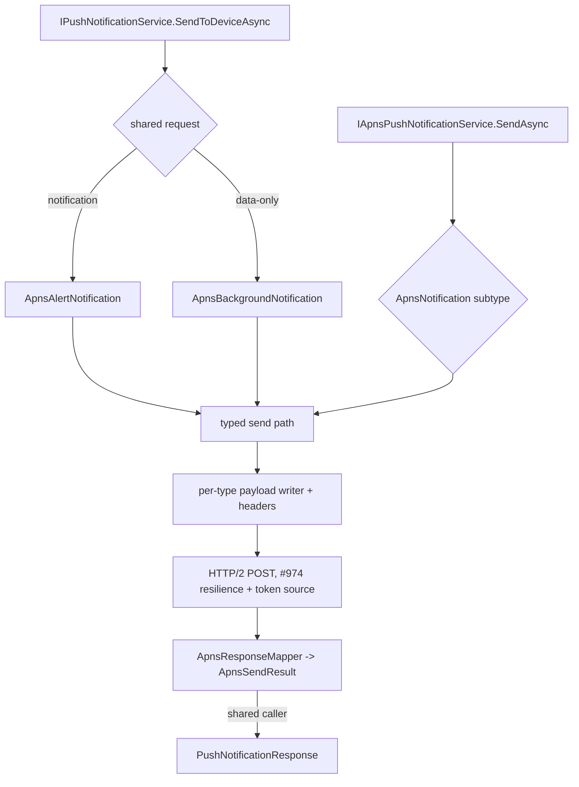

# APNs Rich Notifications and Live Activities - Plan

## Goal Capsule

- **Objective:** The native APNs provider should cover what iOS apps use most. Backends using Headless can then send rich alerts, silent background updates, and Live Activity start, update, and end pushes. Any provider can set a push's badge, sound, priority, and lifetime.
- **Means:** The work splits in two:
  - Cross-provider delivery fields go on `PushNotificationRequest`, with a data-only kind; Firebase maps them too (KTD1).
  - APNs-only capabilities go on a typed `IApnsPushNotificationService` with APNs-native notification types (KTD2).
- **Authority:** Product Contract Requirements win on behavior, and KTDs win on mechanism. `CLAUDE.md` and `docs/solutions/conventions/provider-setup-and-options.md` bind every unit.
- **Stop conditions:**
  - Stop if an Apple rule the plan relies on proves wrong in the fake-server tests and changes a public type.
- **Execution profile:** Deep .NET library work, 7 units.
  - It is stacked on `shaheen/feat/apns-provider` (PR #974), which is not merged yet.
  - It changes the Abstractions, Firebase, and Apns packages, their tests, the Composition and Dev test projects (U5), and the docs.
- **Tail ownership:** The caller owns review, commit, push, and PR.

---

## Product Contract

### Summary

PR #974 left several capabilities out; this plan adds them.

- **Shared request:** `PushNotificationRequest` gains optional `Badge`, `Sound`, `Priority`, and `TimeToLive`, plus a data-only form with no title or body. The Firebase and APNs providers both honor these.
- **APNs-native API:** `IApnsPushNotificationService` sends every APNs push type through its own notification type:
  - `ApnsAlertNotification`, `ApnsBackgroundNotification`, and `ApnsLiveActivityNotification`, with the full set of `aps` controls
  - `ApnsLocationNotification`, `ApnsPushToTalkNotification`, `ApnsWidgetsNotification`, `ApnsControlsNotification`, `ApnsComplicationNotification`, and `ApnsFileProviderNotification`
- **Certificate authentication:** an instance can authenticate with a `.p12` provider certificate instead of a `.p8` signing key.
- **Richer APNs response:** a 410 reports when the token became invalid, and a sandbox send reports Apple's delivery-log id.

### Problem Frame

PR #974 sends only title-and-body alerts, and the request contract makes that the only possible push. An iOS backend also needs:

- a badge count and a sound on ordinary alerts
- silent pushes that wake the app to sync
- grouping, action categories, and notification-service-extension content
- Live Activities, which the plan for #974 deferred because the request had no shape for them

Firebase can express badge, sound, priority, and time-to-live as well. Putting those fields on the shared request serves both providers.

### Key Decisions

- **Scope covers every APNs push type plus certificate auth; only iOS 18 broadcast channels are left out.** (session-settled: user-directed — chosen over the narrower rich-alerts, background, Live Activities, and per-message scope that the lead recommended: the user wants the provider to cover every APNs push type and legacy certificate auth.) Governs R13, R14, R15.
- **Split API shape: cross-provider fields on the shared request, APNs-only capabilities on a typed APNs service.** (session-settled: user-approved — chosen over putting everything on the typed APNs API, and over putting everything on the shared request: Firebase can map badge, sound, priority, and TTL, while Live Activities and the niche push types would leak APNs concepts to every provider.) Governs R1, R2, R3, R4, R5.

### Requirements

**Shared request**

- R1. `PushNotificationRequest` accepts four optional fields; `null` means "not set" for every one:
  - `Badge`: a non-negative `int?`. 0 clears the badge on iOS. Android cannot clear, so there 0 means "not set".
  - `Sound`: a sound name, or `default`.
  - `Priority`: a `PushNotificationPriority?`, `High` or `Normal`. Null means the provider default: `ApnsOptions.Priority` on APNs, and High on Firebase (today's value).
  - `TimeToLive`: a `TimeSpan?`, per message only; neither provider has a TTL option. Zero means one delivery attempt with no storage. Null sends no expiration, so the provider's storage policy applies.
  - An unset badge sends no badge on either provider. Firebase's hard-coded `aps.badge: 1` is removed.
- R2. A request is either a notification or a data-only message:
  - A notification has a non-blank title and body.
  - A data-only message has no title and no body, has at least one data entry, and has no badge or sound.
  - Any other combination throws `ArgumentException` before any network call.
- R3. Firebase maps R1 and R2 to FCM:
  - `Priority` goes to the Android priority and the APNs `apns-priority` header.
  - `TimeToLive` goes to the Android TTL and the `apns-expiration` header.
  - `Badge` goes to `aps.badge` and the Android notification count.
  - `Sound` goes to `aps.sound` and the Android sound.
  - A data-only request sends no notification block and no badge, keeps Android priority High, and sets `content-available: 1` with `apns-priority: 5` for the APNs bridge.
  - A null `TimeToLive` sends no Android TTL and no `apns-expiration` header.
- R4. The APNs provider maps R1 and R2 through `IPushNotificationService`:
  - On an alert-configured instance, a notification becomes an alert push and a data-only request becomes a background push.
  - On a VoIP-configured instance, both become VoIP pushes: push type `voip`, topic `.voip`, and the 5120-byte limit. Data-only is the ordinary VoIP payload, and PushKit never receives a `background` push.
  - A set `Priority` overrides `ApnsOptions.Priority`, except that background pushes are always priority 5.

**Typed APNs API**

- R5. `IApnsPushNotificationService` sends one notification to one device token or to many, and is resolvable wherever the APNs `IPushNotificationService` is: unkeyed for the default instance, keyed by name for a named instance.
- R6. An alert notification carries an alert and optional `aps` controls:
  - alert fields: title, subtitle, body, launch image, and localization keys with args for title, subtitle, and body
  - badge, sound (named, or critical with a volume from 0 to 1), thread id, category, mutable content
  - interruption level (`passive`, `active`, `time-sensitive`, `critical`), relevance score (0 to 1), target content id
  - custom top-level data
- R7. A background notification carries only custom data; the payload is `content-available: 1`. It sends with push type `background` and priority 5, whatever the options say.
- R8. A Live Activity notification sends with push type `liveactivity` to topic `<bundle>.push-type.liveactivity`, with priority 5 or 10 (default 5, see KTD6). It carries:
  - `event` (`start`, `update`, or `end`), a `timestamp`, and a `content-state` JSON object
  - optional `stale-date`, `dismissal-date`, `relevance-score`, and an alert
  - on `start` only: `attributes-type`, `attributes`, and a required alert
  - `content-state` is required on `start` and `update`. On `end` it is optional; Apple advises sending the final state so the ended activity shows the latest data
- R9. Every typed notification accepts an optional per-message `Expiration` (an absolute instant, or "deliver once") and `CollapseId`. Alert and Live Activity notifications accept `Priority`, typed as the existing `ApnsPriority` (10, 5, or 1), so Apple's priority 1 stays reachable here. Live Activity refuses priority 1, which Apple does not allow for that push type. The location, widgets, controls, complication, and file-provider types accept `Priority` limited to 10 or 5. Push-to-talk is fixed at 10. Background notifications have no `Priority`, because they always send at 5. Validation throws `ArgumentException` before any network call for any of these:
  - a collapse id over 64 bytes
  - a payload over the push type's limit (4096 bytes; 5120 for VoIP)
  - the reserved `aps` data key
  - a background push given alert, badge, or sound
  - a Live Activity `start` without attributes or an alert
  - a Live Activity `start` or `update` with no content state
  - a Live Activity content state or attributes value that is not a JSON object
  - a typed background, Live Activity, or niche notification sent through a VoIP-configured instance, whose PushKit tokens cannot receive those push types
  - a critical sound volume outside 0 to 1
  - a relevance score outside 0 to 1 on an alert

**Richer responses**

- R10. The typed API returns an `ApnsSendResult` for each token. It wraps the provider-agnostic `PushNotificationResponse` and adds the HTTP status, the APNs `reason`, the `apns-id`, the sandbox-only `apns-unique-id`, and, for a 410, the instant APNs reports the token became invalid (from the body's millisecond `timestamp`).
- R11. The typed API keeps every existing guarantee of #974: one result per token in input order, no exception for any per-token failure, the retry policy, token handling, and log masking.

**Niche push types**

- R13. The typed API sends six more push types. Each type fixes its `apns-push-type` header, its topic suffix, and its payload:

  | Type | Header / topic suffix | Payload | Priority |
  |---|---|---|---|
  | `ApnsLocationNotification` | `location` / `.location-query` | `{"aps":{}}` plus optional custom data | 10 (default) or 5 |
  | `ApnsPushToTalkNotification` | `pushtotalk` / `.voip-ptt` | custom top-level keys | 10; expiration defaults to deliver-once |
  | `ApnsWidgetsNotification` | `widgets` / `.push-type.widgets` | `{"aps":{"content-changed":true}}` | 10 (default) or 5 |
  | `ApnsControlsNotification` | `controls` / `.push-type.controls` | `{"aps":{"content-changed":true}}` | 10 (default) or 5 |
  | `ApnsComplicationNotification` | `complication` / `.complication` (see Sources) | custom top-level keys, empty `aps` | 10 (default) or 5 |
  | `ApnsFileProviderNotification` | `fileprovider` / `.pushkit.fileprovider` | top-level `container-identifier` and `domain`, no `aps` key | 10 (default) or 5 |

  - All six use the 4096-byte limit and the per-message `Expiration` and `CollapseId` from R9.
  - Apple documents no payload for `location`, so the provider sends an empty `aps` dictionary plus any custom data.
  - The docs note that ClockKit complications are superseded by WidgetKit, so `widgets` also covers widget complications.

**Certificate authentication**

- R14. An instance authenticates in exactly one of two modes:
  - token mode: `KeyId`, `TeamId`, and `PrivateKey`, as in #974
  - certificate mode: `Certificate` (a base64 PKCS#12 `.p12`) and `CertificatePassword`
  - Configuring neither mode, or both, fails `ValidateOnStart`.
  - Certificate mode also fails `ValidateOnStart` when:
    - the certificate cannot be loaded
    - it has no private key
    - it has expired
  - Loading and presence checks run in the options validator. The expiry checks run in a hosted service at host start, using `TimeProvider`:
    - An expired certificate fails the host start.
    - A certificate that expires within 30 days logs a warning, because Apple certificates last one year and are renewed by hand.
  - `Certificate` and `CertificatePassword` are secrets, like `PrivateKey`:
    - Both are `[JsonIgnore]` and left out of `ToString()`.
    - Validation messages never echo them.
    - `UseApns(ApnsOptions)` copies both.
- R15. In certificate mode, the provider presents the certificate during the TLS handshake and sends no `authorization` header. It still sends `apns-topic`, because a certificate that carries several topics requires it.
  - It refuses the push types that Apple documents or instructs as token-only: `location`, `fileprovider`, `liveactivity`, `widgets`, and `controls`. Each refusal is an `ArgumentException` before any network call.
  - Refusing `controls` is a conservative choice, because Apple does not state certificate support for it. The docs say so.

**Docs**

- R12. `docs/llms/push-notifications.md` documents the niche push types, certificate mode, and the new shared fields and each provider's mapping, the data-only rule, and the typed APNs API. It lists the entitlement critical alerts need, the Live Activity token types, and the limits.

### Acceptance Examples

- AE1. **Covers R1, R4.**
  - **Given** a request with `Badge = 3`, `Sound = "default"`, `Priority = Normal`, and `TimeToLive = 1h`.
  - **When** it is sent through `IPushNotificationService` on APNs.
  - **Then** the fake server receives `aps.badge: 3`, `aps.sound: "default"`, `apns-priority: 5`, and an `apns-expiration` one hour after the clock's now.
- AE2. **Covers R2, R4, R7.**
  - **Given** a request with only `Data = {sync: "1"}`.
  - **When** it is sent through APNs.
  - **Then** the payload is `{"aps":{"content-available":1},"sync":"1"}`, with push type `background` and priority 5, even though the request asked for `Priority = High`.
- AE3. **Covers R8.**
  - **Given** a Live Activity `update` with a content state `{"score":2}` and a stale date.
  - **When** it is sent.
  - **Then** the topic is `<bundle>.push-type.liveactivity`, the push type is `liveactivity`, and `aps` carries `event: "update"`, a `timestamp` in epoch seconds, the content state, and `stale-date`.
- AE4. **Covers R10.**
  - **Given** the fake server answers `410 {"reason":"Unregistered","timestamp":1758000000000}`.
  - **When** a typed send runs.
  - **Then** the result reports `Unregistered` with `InvalidSince` = 2025-09-16T05:20:00Z.
- AE5. **Covers R3.**
  - **Given** a data-only request to Firebase.
  - **When** it is sent.
  - **Then** the message has no `Notification`, and the APNs bridge sets `content-available` with `apns-priority: 5`.

### Scope Boundaries

- Not in this plan: iOS 18 broadcast channels (`/4/broadcasts`, channel management).
- The shared request gets no thread id or category: Firebase can map them only through its iOS bridge, so they live on the typed APNs API.
- The typed API does not add retries beyond #974's resilience policy.

### Deferred to Follow-Up Work

- **iOS 18 Live Activity broadcast channels.** They use a separate endpoint, port, and channel-management API.
- **Firebase Live Activities.** They would go through `ApnsConfig.LiveActivityToken`.
- **#972:** skip the expired-token re-send when no new token was minted. It is independent of this plan.

---

## Planning Contract

### Assumptions

- The scope and the API shape are now user decisions, recorded under Product Contract Key Decisions.
- Certificate mode is covered by in-process tests over TLS with self-signed certificates. No real Apple provider certificate was available.

### Key Technical Decisions

- KTD1. **Only fields that both providers map end to end go on the shared request.**
  - The fields are badge, sound, priority, time-to-live, and data-only. FirebaseAdmin 3.6.0 exposes all of them: `Aps.Badge`, `Aps.Sound`, `Aps.ContentAvailable`, `AndroidConfig.Priority`, `AndroidConfig.TimeToLive`, `AndroidNotification.Sound`, `AndroidNotification.NotificationCount`, and `ApnsConfig.Headers`.
  - Priority is a two-value provider-neutral enum, `PushNotificationPriority { High, Normal }`. APNs maps it to 10 and 5; Android maps it to high and normal.
  - Apple's priority 1 stays APNs-only.
- KTD2. **The APNs-native surface uses a closed hierarchy of notification types.**
  - `ApnsNotification` is an abstract record with a `private protected` constructor, which closes the hierarchy to the assembly. A private constructor would not compile for top-level subtypes. The sealed subtypes are `ApnsAlertNotification`, `ApnsBackgroundNotification`, and `ApnsLiveActivityNotification`.
  - `JsonElement` has no value equality, so two Live Activity notifications with equal content compare unequal. The type's docs say so.
  - The type decides the push type, topic suffix, priority rules, and allowed fields. So "alert on a background push" cannot be expressed, rather than being caught at runtime.
  - VoIP stays an option-level push type, as in #974.
    - On the shared path it applies to both notification and data-only requests (R4).
    - On the typed path, an `ApnsAlertNotification` sent through a VoIP instance goes as push type `voip` to `<bundle>.voip`, with the 5120-byte limit.
    - A typed background or Live Activity notification on a VoIP instance throws (R9).
- KTD3. **One sender implements both interfaces.**
  - `ApnsPushNotificationService` implements `IApnsPushNotificationService`. The existing `IPushNotificationService` methods convert the shared request into an alert or background `ApnsNotification`, call the typed path, and project each `ApnsSendResult` back to its `PushNotificationResponse`.
  - Registration exposes the same singleton instance under both service types, for the default and every named instance, so the typed and shared paths share one HTTP client, token source, and options.
- KTD4. **Live Activity content state and attributes are `JsonElement`.**
  - The caller serializes its own `ContentState` and attributes with its own `JsonSerializerContext`. Apple decodes content state with default JSON strategies, so the docs warn against custom naming or date strategies there.
  - The writer copies the element as is; it must be a JSON object, or the send throws `ArgumentException`.
  - This keeps the provider AOT-safe and free of reflection serialization.
- KTD5. **Time values come from `TimeProvider`.**
  - `timestamp` defaults to the clock's now in epoch seconds, unless the caller sets it.
  - Shared `TimeToLive` becomes `apns-expiration` = now + TTL in epoch seconds; `TimeSpan.Zero` sends `0`.
  - Typed `Expiration` is an absolute `DateTimeOffset` or the `ApnsExpiration.DeliverOnce` sentinel.
  - The 410 `timestamp` is parsed as milliseconds (Apple, handling-notification-responses).
- KTD6. **The priority rules are enforced per type.**
  - Background is always 5. It has no `Priority` field, and a shared request's `High` is ignored for it; the docs note this.
  - Live Activity allows 5 or 10 and defaults to 5, because Apple budgets priority-10 Live Activity updates per hour. The docs say so.
  - Alert uses the per-message priority, then the options default.
- KTD7. **The payload writer becomes one internal writer per notification type,** each on `Utf8JsonWriter` like today's writer. The size check and the reserved-key check stay shared. The existing `ApnsPayloadWriter.Write(PushNotificationRequest, …)` is removed; the shared path goes through the conversion in KTD3.
- KTD8. **The richer response reuses the mapper.**
  - `ApnsResponseMapper` returns the status, reason, and `timestamp` together.
  - `ApnsSendResult` is a public sealed record holding `Response` (`PushNotificationResponse`), `StatusCode`, `Reason`, `ApnsId`, `UniqueId`, and `InvalidSince`.
  - Batch sends return `ApnsBatchSendResult`, with counts and results in input order.

- KTD9. **Each niche push type is its own sealed subtype of `ApnsNotification`, with no alert fields.** A sealed type per push type makes the topic suffix, payload, and allowed fields a compile-time property, exactly as KTD2 does. Push-to-talk defaults its expiration to deliver-once, because Apple recommends not delivering stale PTT pushes.
- KTD10. **The authentication mode is a strategy chosen when the service is built, from the named options.**
  - Options bind at first resolution for the `IConfiguration` and service-provider overloads, so the mode is not known at registration.
  - `_CreateService` reads `IOptionsMonitor<ApnsOptions>.Get(name)` and picks the authenticator.
  - The primary handler moves from a static factory to `ConfigurePrimaryHttpMessageHandler(sp => …)`, which reads the same named options.
  - A keyed-per-instance DI singleton, `ApnsCertificateHolder`, loads and owns the certificate:
    - The handler factory reads it, and so does the expiry-check hosted service.
    - It is `IDisposable`, so the container disposes it. The factory never disposes the handler, because its lifetime is infinite.
  - The token authenticator resolves `ApnsTokenSource` lazily, so certificate mode never constructs it. `ApnsTokenSource` guards the now-nullable `TeamId`, `KeyId`, and `PrivateKey`.
  - An internal `IApnsAuthenticator` has two implementations:
    - The token authenticator wraps `ApnsTokenSource`: it sets the bearer header and owns the expired-token retry.
    - The certificate authenticator sets no header and never retries on token errors.
  - In certificate mode, the primary `SocketsHttpHandler` gets the certificate through `SslOptions.ClientCertificates`.
  - The certificate is loaded with `X509CertificateLoader.LoadPkcs12`; the `X509Certificate2` byte constructors are obsolete (SYSLIB0057) since .NET 9.
  - Storage flags depend on the OS:
    - Linux: `EphemeralKeySet`, so the key is never written to disk.
    - Windows: default flags, because SChannel cannot use an ephemeral key for TLS client authentication (dotnet/runtime #28829). The key reaches the user key store, and the docs say so.
    - macOS: default flags. macOS throws `PlatformNotSupportedException` for ephemeral keys and imports the key into a temporary keychain.
  - The validator disposes any certificate it loads for checking.
- KTD11. **Certificate-mode TLS tests use an internal handler seam.**
  - The fake server gains a TLS mode: a self-signed server certificate, Kestrel set to `ClientCertificateMode.RequireCertificate`, and a `ClientCertificateValidation` callback.
    - The callback accepts exactly the test client certificate's thumbprint. Kestrel rejects a self-signed client certificate when no callback is set.
    - Tests read the presented certificate from `HttpContext.Connection.ClientCertificate`.
  - The test trusts that server certificate through an internal `Action<SocketsHttpHandler>` seam on `AddApnsCore`, visible to the test assembly only.
  - The seam never reaches a consumer, and production validation stays on.

### High-Level Technical Design

Directional shape of the typed API (illustrative, not a specification):

```csharp
// Shared path: a data-only request becomes a background push.
await push.SendToDeviceAsync(token, new PushNotificationRequest { Data = new Dictionary<string, string> { ["sync"] = "1" } }, ct);

// Typed path, Live Activity update
var result = await apns.SendAsync(activityToken, new ApnsLiveActivityNotification
{
    Event = ApnsLiveActivityEvent.Update,
    ContentState = JsonSerializer.SerializeToElement(state, MyContext.Default.ScoreState),
    StaleDate = now.AddMinutes(10),
}, ct);
if (result.Response.IsUnregistered()) Remove(activityToken, result.InvalidSince);
```



### Sources & Research

Apple docs, verified 2026-09-25:
- [Generating a remote notification](https://developer.apple.com/documentation/usernotifications/generating-a-remote-notification): the `aps` keys, custom keys beside `aps`, the 4096 and 5120 limits.
- [Sending notification requests](https://developer.apple.com/documentation/usernotifications/sending-notification-requests-to-apns): expiration semantics and priority per push type.
- [Pushing background updates](https://developer.apple.com/documentation/usernotifications/pushing-background-updates-to-your-app): background pushes carry only `content-available` and send at priority 5.
- [Starting and updating Live Activities](https://developer.apple.com/documentation/activitykit/starting-and-updating-live-activities-with-activitykit-push-notifications):
  - the topic suffix and the event, timestamp, and dates
  - `start` needs `attributes-type`, `attributes`, and an alert
  - the hourly budget for priority 10
- [Handling responses](https://developer.apple.com/documentation/usernotifications/handling-notification-responses-from-apns): the 410 `timestamp` is in milliseconds, and `apns-unique-id` comes from Development only.
- [Critical alerts](https://developer.apple.com/documentation/usernotifications/unnotificationinterruptionlevel/critical): they need an Apple-approved entitlement.

Unverified: whether Apple sets a Live Activity payload limit other than 4 KB. The plan applies 4096.

Niche push types and certificate auth, verified 2026-09-25:
- [Establishing a certificate-based connection](https://developer.apple.com/documentation/usernotifications/establishing-a-certificate-based-connection-to-apns): one app per certificate, sandbox and production in one certificate, one-year validity, and extra topics in certificate extensions.
- [Location push service extension](https://developer.apple.com/documentation/corelocation/creating-a-location-push-service-extension): token auth only, and the `.location-query` topic.
- [Push-to-talk](https://developer.apple.com/documentation/pushtotalk/creating-a-push-to-talk-app): the `.voip-ptt` topic, priority 10, and expiration 0.
- [WidgetKit push](https://developer.apple.com/documentation/widgetkit/updating-widgets-with-widgetkit-push-notifications) and [controls](https://developer.apple.com/documentation/widgetkit/updating-controls-locally-and-remotely): payload `content-changed: true`.
- [File provider push](https://developer.apple.com/documentation/fileprovider/using-push-notifications-to-signal-changes): top-level `container-identifier` and `domain`, and token auth only.
- [SYSLIB0057](https://learn.microsoft.com/en-us/dotnet/fundamentals/syslib-diagnostics/syslib0057) and [cross-platform cryptography](https://learn.microsoft.com/en-us/dotnet/standard/security/cross-platform-cryptography): load the certificate with `X509CertificateLoader`; macOS rejects `EphemeralKeySet`.

Unverified:
- A documented `location` payload.
- Priority rules for widgets, complication, and file provider. The plan defaults these to 10.
- Certificate support for `controls`. The plan refuses it conservatively.
- The complication topic suffix. Apple's sending-notification-requests page renders it as `h.complication`, which looks like a typo: every sibling suffix starts with a dot, and APNs client libraries such as dotAPNS derive `.complication`. The plan uses `.complication`. The docs record the discrepancy, so a `TopicDisallowed` in production points straight at it.

Repository patterns:
- the #974 provider under `src/Headless.PushNotifications.Apns/`
- the FakeApnsServer and conformance harness under `tests/`
- `src/Headless.PushNotifications.Firebase/Internals/FcmMessageSender.cs` (message builders)

---

## Implementation Units

### U1. Shared request fields and the data-only kind, with the Firebase mapping

- **Goal:** Both providers get badge, sound, priority, time-to-live, and data-only through the shared request.
- **Requirements:** R1, R2, R3; KTD1, KTD5.
- **Dependencies:** none.
- **Files:**
  - `src/Headless.PushNotifications.Abstractions/Contracts/PushNotificationRequest.cs`
  - `src/Headless.PushNotifications.Abstractions/Contracts/PushNotificationPriority.cs` (new)
  - `src/Headless.PushNotifications.Firebase/FcmPushNotificationService.cs`
  - `src/Headless.PushNotifications.Firebase/Internals/FcmMessageSender.cs`
  - `src/Headless.PushNotifications.Firebase/Internals/IFcmMessageSender.cs`
  - `src/Headless.PushNotifications.Firebase/Setup.cs` (it passes `TimeProvider` to the sender, which computes `apns-expiration`)
  - `src/Headless.PushNotifications.Abstractions/Headless.PushNotifications.Abstractions.csproj` (`InternalsVisibleTo` for the Firebase and Apns packages, so they can reach the shared validation helper)
  - `tests/Headless.PushNotifications.Firebase.Tests.Unit/FcmPushNotificationServiceTests.cs`
  - `tests/Headless.PushNotifications.Firebase.Tests.Unit/FcmConformanceTests.cs` (expose the new harness scenarios as `[Fact]` overrides)
  - `tests/Headless.PushNotifications.Abstractions.Tests.Unit/` (validation test for the request, if the rule lives there)
  - `tests/Headless.PushNotifications.Tests.Harness/PushNotificationServiceConformanceTests.cs`
  - `tests/Headless.PushNotifications.Tests.Harness/PushNotificationRequests.cs`
- **Approach:**
  1. `Title` and `Body` become optional (`string?`).
  2. Add `Badge`, `Sound`, `Priority`, and `TimeToLive`.
  3. Put the R2 validation in one internal helper in Abstractions, reached through `InternalsVisibleTo`, so both providers enforce the same rule.
  4. Remove Firebase's hard-coded `aps.badge: 1` (`FcmMessageSender._ApnsBadge`).
  5. Firebase maps the fields per R3 in both message builders.
  6. The conformance harness gains portable scenarios for the R2 invalid mixes and for a data-only request being accepted.
- **Test scenarios:**
  - Each R2 invalid mix throws `ArgumentException` and the sender is not called:
    - a title without a body
    - a body without a title
    - no title, body, or data
    - data-only with a badge
    - data-only with a sound
    - a negative badge
    - a negative TTL
  - Covers AE5: a data-only Firebase message has no `Notification`, sets `Aps.ContentAvailable`, and sets `apns-priority: 5`.
  - Firebase `Priority = Normal` maps to Android normal priority and `apns-priority: 5`.
  - Firebase TTL of 1 hour maps to `AndroidConfig.TimeToLive` of 1 hour, and `apns-expiration` = now + 1 hour.
  - Firebase badge 3 and sound "default" reach `Aps.Badge`, `Aps.Sound`, `AndroidNotification.NotificationCount`, and `AndroidNotification.Sound`.
  - A plain title and body request builds the message #974 built, minus `aps.badge`: an unset badge sends none.
  - A data-only Firebase message sets no `aps.badge`.
  - A null TTL sends no Android TTL and no `apns-expiration`. The Firebase time tests use `FakeTimeProvider`.
- **Verification:** The Firebase tests and the harness pass. Callers that set only title, body, and data are unchanged.

### U2. APNs notification model and payload writers

- **Goal:** The typed APNs notification types exist and serialize to the exact APNs payload and headers.
- **Requirements:** R6, R7, R8, R9; KTD2, KTD4, KTD5, KTD6, KTD7.
- **Dependencies:** none (parallel with U1).
- **Files:**
  - `src/Headless.PushNotifications.Apns/Notifications/ApnsNotification.cs` (new: base plus the three sealed records)
  - `src/Headless.PushNotifications.Apns/Notifications/ApnsAlert.cs` (new: alert content and localization)
  - `src/Headless.PushNotifications.Apns/Notifications/ApnsSound.cs` (new: named or critical)
  - `src/Headless.PushNotifications.Apns/Notifications/ApnsEnums.cs` (new: interruption level, Live Activity event)
  - `src/Headless.PushNotifications.Apns/Notifications/ApnsExpiration.cs` (new)
  - `src/Headless.PushNotifications.Apns/Internals/ApnsPayloadWriter.cs` (rewrite into per-type writers)
  - `src/Headless.PushNotifications.Apns/Internals/ApnsRequestHeaders.cs` (new: push type, topic, priority, expiration)
  - `tests/Headless.PushNotifications.Apns.Tests.Unit/ApnsPayloadWriterTests.cs` (new)
- **Approach:**
  1. Write pure functions from notification + options + clock to (payload bytes, header set), so U2 is fully testable without HTTP.
  2. Custom data stays `IReadOnlyDictionary<string, string>` on alert and background; Apple allows only primitive custom values.
  3. On Live Activity, content state and attributes are `JsonElement` (KTD4).
- **Execution note:** Test-first: pin each payload shape as a JSON string assertion before writing the writer.
- **Test scenarios:**
  - An alert with subtitle, badge 0, sound "chime", thread id, category, mutable content, interruption level time-sensitive, relevance 0.5, target content id, and data `k:v` produces the exact JSON, with `mutable-content: 1` and `k` at top level.
  - Localized alert: `title-loc-key` and `title-loc-args` replace `title` in the output.
  - Critical sound `{critical:1,name:"alarm",volume:0.8}`; volume 1.5 throws.
  - Relevance 1.2 on an alert throws.
  - Background: the payload is `{"aps":{"content-available":1}, …data}`, the push type is `background`, the priority is `5`.
  - A Live Activity start or update with no content state throws. An end without one is accepted.
  - Covers AE3: Live Activity update → topic `<bundle>.push-type.liveactivity`, push type `liveactivity`, priority `5` by default, `timestamp` = clock epoch seconds, `event: "update"`, content state copied, `stale-date` in epoch seconds.
  - Live Activity `start` without attributes or without an alert throws. With both, it writes `attributes-type`, `attributes`, and `alert`.
  - Live Activity `end` with a dismissal date writes `dismissal-date`.
  - A content state that is a JSON array (not an object) throws.
  - Expiration `DeliverOnce` writes `apns-expiration: 0`; an absolute expiration writes epoch seconds; none omits the header.
  - A collapse id of 65 bytes throws; the reserved `aps` data key throws; a payload over 4096 bytes throws (5120 for VoIP alert).
- **Verification:** The writer tests pass with no network.

### U3. The typed service, the richer response, and shared-path conversion

- **Goal:** `IApnsPushNotificationService` sends typed notifications, returns `ApnsSendResult`, and the shared `IPushNotificationService` delegates to it.
- **Requirements:** R4, R5, R10, R11; KTD3, KTD8.
- **Dependencies:** U1, U2.
- **Files:**
  - `src/Headless.PushNotifications.Apns/IApnsPushNotificationService.cs` (new)
  - `src/Headless.PushNotifications.Apns/ApnsSendResult.cs` (new: result and batch result)
  - `src/Headless.PushNotifications.Apns/ApnsPushNotificationService.cs`
  - `src/Headless.PushNotifications.Apns/Internals/ApnsResponseMapper.cs`
  - `src/Headless.PushNotifications.Apns/Internals/ApnsJsonSerializerContext.cs` (410 `timestamp`)
  - `src/Headless.PushNotifications.Apns/Setup.cs`
  - `tests/Headless.PushNotifications.Apns.Tests.Unit/FakeApnsServer.cs` (echo `apns-unique-id`, capture per-request priority and expiration)
  - `tests/Headless.PushNotifications.Apns.Tests.Unit/ApnsTypedServiceTests.cs` (new)
  - `tests/Headless.PushNotifications.Apns.Tests.Unit/ApnsPushNotificationServiceTests.cs`
  - `tests/Headless.PushNotifications.Apns.Tests.Unit/ApnsSetupTests.cs`
  - `tests/Headless.PushNotifications.Apns.Tests.Unit/ApnsConformanceTests.cs` (expose the harness scenarios U1 added as `[Fact]` overrides, once the shared path honors R2 through the conversion)
- **Approach:**
  1. Refactor the per-token send so it takes the prepared payload and headers from U2. Keep #974's exception mapping, expired-token retry, cleartext guard, and masking.
  2. The shared methods convert the request (R4) and project results.
  3. Registration adds the concrete `ApnsPushNotificationService` singleton (keyed by name for named instances) and forwards both `IPushNotificationService` and `IApnsPushNotificationService` to it, so they resolve to the same instance. `IApnsPushNotificationService` and the notification types live in `Headless.PushNotifications.Apns`, beside `ApnsOptions`.
  4. The shared alert path emits the exact #974 payload shape for a plain request, so the existing 4096/4097-byte boundary tests keep their meaning.
- **Test scenarios:**
  - Covers AE1: a shared request with badge 3, sound, Normal, and TTL of 1 hour reaches the fake server with those payload fields, `apns-priority: 5`, and `apns-expiration` = clock + 3600.
  - Covers AE2: a data-only shared request becomes a background push at priority 5, even with `Priority = High`.
  - Covers AE4: a 410 with a millisecond `timestamp` gives `InvalidSince` 2025-09-16T05:20:00Z and `Response.IsUnregistered()`.
  - A 410 with no `timestamp` gives `InvalidSince` null.
  - A sandbox response header `apns-unique-id` appears in `UniqueId`; its absence gives null.
  - A data-only shared request on a VoIP instance sends push type `voip` to topic `<bundle>.voip`, not `background`.
  - On a VoIP instance, a typed alert sends as `voip`, while a typed background or Live Activity notification throws before any request.
  - A typed multicast of one notification to 3 tokens, with one 410, keeps input order, gives counts 2/1, and never throws.
  - A Live Activity update through the typed API reaches the fake server with the liveactivity topic and push type.
  - `IApnsPushNotificationService` and `IPushNotificationService` resolve to the same instance: unkeyed for the default, keyed for named instance "a".
  - Every existing #974 test still passes unchanged, apart from tests of the removed internal writer signature.
- **Verification:** The APNs tests and conformance pass, and the Release build is clean.

### U4. Documentation

- **Goal:** Consumers can use the new shared fields, the data-only rule, and the typed APNs API.
- **Requirements:** R12.
- **Dependencies:** U1, U3, U6, U7.
- **Files:**
  - `docs/llms/push-notifications.md` (including its Firebase design-constraints line on the hard-coded badge, now removed)
  - `src/Headless.PushNotifications.Apns/README.md` (only if its purpose line changes)
- **Approach:** Follow `docs/authoring/AUTHORING.md`. Document these topics:
  - a table mapping each shared field to each provider
  - the data-only rule
  - the typed notification types, with a Live Activity example
  - which token each Live Activity event uses: the push-to-start token for `start`, the activity token for `update` and `end`
  - the priority-10 budget
  - the critical-alert entitlement
  - the `JsonElement` content-state guidance
  - the new result fields
  - these divergences: Live Activities default to priority 5 while Apple defaults to 10, so they can be delayed. Android cannot clear a badge with 0. A shared data-only request ignores `High` on APNs.
- **Test expectation:** none; documentation only.
- **Verification:** Every documented name matches the code.

### U5. Conformance and regression sweep

- **Goal:** Cross-provider behavior stays consistent after the request contract change.
- **Requirements:** R2, R11.
- **Dependencies:** U1, U3.
- **Files:**
  - `tests/Headless.PushNotifications.Composition.Tests.Unit/*` (compile fixes only, if any)
  - `tests/Headless.PushNotifications.Dev.Tests.Unit/*` (Noop accepts data-only)
- **Approach:** The Noop provider stays inert: it accepts any request, data-only included. Composition tests need only compile fixes from the now-optional title and body.
- **Test scenarios:**
  - Noop returns success for a data-only request.
  - Composition resolves `IApnsPushNotificationService` for a named APNs instance, and resolves nothing for a named Firebase instance.
- **Verification:** All push-notification test projects pass.

### U6. Niche push types

- **Goal:** The typed API sends location, push-to-talk, widgets, controls, complication, and file-provider pushes with Apple's exact headers and payloads.
- **Requirements:** R13; KTD9. Governed by the scope Key Decision.
- **Dependencies:** U2, U3.
- **Files:**
  - `src/Headless.PushNotifications.Apns/Notifications/ApnsNotification.cs` (six new sealed subtypes)
  - `src/Headless.PushNotifications.Apns/Internals/ApnsPayloadWriter.cs`
  - `src/Headless.PushNotifications.Apns/Internals/ApnsRequestHeaders.cs`
  - `tests/Headless.PushNotifications.Apns.Tests.Unit/ApnsPayloadWriterTests.cs`
  - `tests/Headless.PushNotifications.Apns.Tests.Unit/ApnsTypedServiceTests.cs`
- **Approach:** Add each subtype and its writer branch. Header and topic rules come from the R13 table; nothing here is configurable.
- **Execution note:** Pin each push type's exact header, topic, and payload as a test before writing its branch.
- **Test scenarios:**
  - Each of the six types produces its exact `apns-push-type`, topic (`<bundle>` plus suffix), default priority, and payload JSON.
  - File provider writes `{"container-identifier":"c","domain":"d"}` with no `aps` key. A blank container identifier throws.
  - Push-to-talk with no expiration sends `apns-expiration: 0`. An explicit expiration overrides it.
  - Widgets and controls always send `{"aps":{"content-changed":true}}`.
  - Location with custom data writes `{"aps":{},"k":"v"}`.
  - Sending one of each type through the fake server succeeds, and each request carries its expected topic.
  - A niche notification sent through a VoIP-configured instance throws, the same way background and Live Activity do.
- **Verification:** The payload-writer and typed-service tests pass.

### U7. Certificate authentication

- **Goal:** An instance can authenticate with a `.p12` provider certificate over TLS instead of a signed provider token.
- **Requirements:** R14, R15; KTD10, KTD11. Governed by the scope Key Decision.
- **Dependencies:** U3, U6.
- **Files:**
  - `src/Headless.PushNotifications.Apns/ApnsOptions.cs` (optional token fields, certificate fields, and a validator that enforces exactly one mode)
  - `src/Headless.PushNotifications.Apns/Internals/IApnsAuthenticator.cs` (new, with the token and certificate implementations)
  - `src/Headless.PushNotifications.Apns/Internals/ApnsCertificateLoader.cs` (new: per-OS storage flags)
  - `src/Headless.PushNotifications.Apns/Internals/ApnsCertificateHolder.cs` (new: a keyed singleton that owns the certificate)
  - `src/Headless.PushNotifications.Apns/Internals/ApnsCertificateExpiryCheck.cs` (new: a hosted service)
  - `src/Headless.PushNotifications.Apns/Internals/ApnsTokenSource.cs` (guards for the nullable token fields)
  - `src/Headless.PushNotifications.Apns/ApnsPushNotificationService.cs`
  - `src/Headless.PushNotifications.Apns/Setup.cs` (mode-aware primary handler, the internal handler seam, and the startup expiry warning)
  - `src/Headless.PushNotifications.Apns/Internals/ApnsLoggerExtensions.cs`
  - `tests/Headless.PushNotifications.Apns.Tests.Unit/FakeApnsServer.cs` (TLS mode)
  - `tests/Headless.PushNotifications.Apns.Tests.Unit/ApnsCertificateAuthTests.cs` (new)
  - `tests/Headless.PushNotifications.Apns.Tests.Unit/ApnsOptionsValidatorTests.cs`
- **Approach:**
  1. `KeyId`, `TeamId`, and `PrivateKey` become optional. The validator requires exactly one complete mode.
  2. The send path asks the authenticator for request headers and whether an `ExpiredProviderToken` retry applies.
  3. The shared token source is registered and used only in token mode.
- **Test scenarios:**
  - The validator rejects each of these:
    - neither mode configured
    - both modes configured
    - a partial token mode, such as a key id with no private key
    - a certificate that fails to load or has a wrong password
    - a certificate with no private key
    - an expired certificate
  - Messages never echo the certificate or password.
  - With `FakeTimeProvider`, a certificate expiring in 10 days logs a warning at host start. One expiring in 60 days logs nothing. An expired one fails `StartAsync`.
  - `ToString()` hides the certificate and password, and `UseApns(ApnsOptions)` carries certificate mode through.
  - In certificate mode, the TLS fake server receives the client certificate (thumbprint matches), no `authorization` header, and `apns-topic` = bundle, and returns 200.
  - In certificate mode, `location`, `fileprovider`, `liveactivity`, `widgets`, and `controls` notifications each throw `ArgumentException` with no request. Alert, background, VoIP, push-to-talk, and complication succeed.
  - In certificate mode, a 403 `ExpiredProviderToken` maps to `Failure` with no retry and no token source call.
  - Token mode still passes every #974 test unchanged.
  - Resolving the service in certificate mode never resolves or constructs `ApnsTokenSource`.
- **Verification:** The certificate tests pass on the CI OS (Linux). The loader picks its storage flags by OS. The Windows and macOS loading paths are untested here, and the docs say so.

---

## Verification Contract

| Scope | Command | Proves |
|---|---|---|
| Firebase (U1) | `make test-project TEST_PROJECT=tests/Headless.PushNotifications.Firebase.Tests.Unit/Headless.PushNotifications.Firebase.Tests.Unit.csproj` | Shared field mapping and data-only |
| APNs (U2, U3) | `make test-project TEST_PROJECT=tests/Headless.PushNotifications.Apns.Tests.Unit/Headless.PushNotifications.Apns.Tests.Unit.csproj` | Payload writers, typed API, richer response, AE1 to AE4 |
| Niche types and certificate auth (U6, U7) | same APNs test project | R13 to R15, including the TLS fake server |
| Abstractions, Dev, Composition (U1, U5) | `make test-project` for each | No regression from the request change |
| Analyzer build | `dotnet build <each changed test project> -c Release --no-incremental -v:minimal` | Warnings are errors in CI |
| Format and pre-PR | `make format-check`, then `make quality-analyzers` | CI gates |

## Definition of Done

- R1 to R15 each trace to a passing test or a doc change, and AE1 to AE5 each have a named test.
- New files carry the copyright header, use `Headless.Checks`, and pin no package version in any `.csproj`.
- Every check in the verification table passes. Abandoned attempts and scaffolding are removed.
