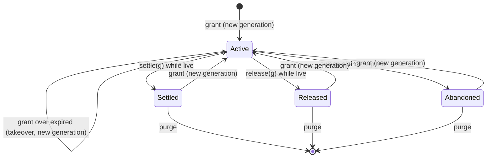
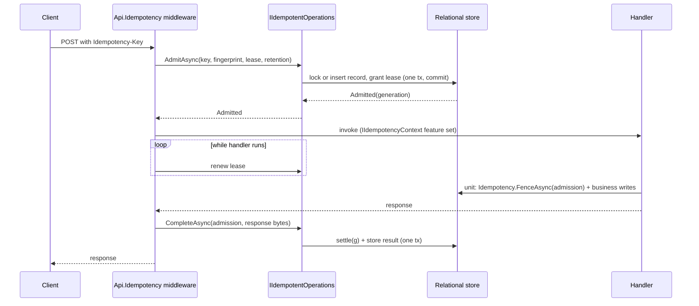

# Fenced Leases and Durable Idempotency - Plan

## Goal Capsule

- **Objective:** An application can hand work to any executor (an in-process handler, a message consumer, a job, or an external process) and accept exactly one result per attempt: a stale or zombie attempt's write is refused by the database, an abandoned attempt is routed rather than silently lost, and a retried logical operation replays its recorded result from any entry point, not only HTTP.
- **Means:** a relational fencing-lease primitive (`Headless.Fencing`, KTD1) as the lower layer, with durable idempotent admission (`Headless.Idempotency`, KTD8) built on it, and `Headless.Api.Idempotency` moved onto the durable store (KTD13).
- **Authority:** Product Contract Requirements win on behavior; KTDs win on mechanism within them; units override neither. `CLAUDE.md` conventions and `docs/solutions/design-patterns/temporal-authority-standard.md` bind every unit.
- **Closes:** GitHub #941 and #954 in one PR.
- **Stop conditions:** stop and report if the fenced-read lock cannot block a concurrent grant on either provider (KTD5 is then infeasible), or if SQL Server sequence use inside the grant statement cannot be made atomic without a retry loop in the enlisted path.
- **Execution profile:** Deep; 7 units; provider integration suites need Docker and do not run in CI (see Verification Contract).
- **Out of bounds:** `src/Headless.DistributedLocks*` and `docs/llms/distributed-locks.md` (a parallel PR owns them).

---

## Product Contract

### Summary

Add two package families. `Headless.Fencing` grants, renews, settles, releases, fences, sweeps, and purges leases identified by `(tenant, kind, resource)` whose generation increases on every grant and whose expiry the database clock decides. `Headless.Idempotency` admits a tenant-scoped operation key with a request fingerprint and answers `Admitted`, `InFlight`, `Replay`, or `Conflict`; an admitted attempt holds a fenced lease, and completing it stores the result and settles the lease in one transaction. `Headless.Api.Idempotency` drops `ICache` and `IDistributedLock`, admits through the durable store, and exposes the admission to handlers.

### Problem Frame

Downstream orchestrators hand work to external executors and build fencing by hand: `statement_timestamp()`, guarded `UPDATE … WHERE generation = @g`, `FOR UPDATE SKIP LOCKED` (#954). The framework has the pieces internally (Jobs row leases, keyed generations, the lock `FencingToken`) and exposes none of them as a reusable primitive. The PostgreSQL and SQL Server distributed locks are connection-scoped, so an external process cannot hold one.

Separately, `Headless.Api.Idempotency` is HTTP-only middleware over `ICache` with a 24-hour window (#941). A replay never reaches the handler, the record is internal, and a message consumer, job, or offline-sync batch cannot use it. Under `WaitAndReplay` a winner that outlives its lock lease still writes its result to the cache unfenced.

### Key Decisions

- **Separate package families, not an extension of `Headless.DistributedLocks`.** (session-settled: user-approved — chosen over adding lease/settle/sweep to `IDistributedLock`: a lease is a durable cross-process record that must enlist in the caller's unit of work, while a lock is an in-process handle held by an autonomous singleton.) Governs R1, R19.
- **Design #941 and #954 together in one PR; idempotent admission builds on the lease.** (session-settled: user-directed — chosen over two independent primitives and PRs: #941's in-flight admission is a lease with expiry and takeover.) Governs R10, R12.
- **Move `Headless.Api.Idempotency` onto the durable store; breaking changes allowed.** (session-settled: user-directed — chosen over keeping `ICache` plus `IDistributedLock` `WaitAndReplay`: the late winner write to the cache is unfenced.) Governs R16, R17, R18.
- **Jobs and Messaging keep their own row leases.** (session-settled: user-approved — chosen over retargeting them onto the lease table: their tuned native claim strategies would gain a second row per claim for no benefit.) Governs R19.
- **Coordination does not store leases.** (session-settled: user-approved — chosen over a Coordination-hosted lease ledger: `docs/llms/coordination.md` forbids an ownership ledger.) Governs R19.
- **Relational providers only (PostgreSQL and SQL Server).** (session-settled: user-approved — chosen over a Redis provider: the fence must be checked atomically with the result write in the same database.) Governs R1.

### Requirements

**Fenced lease (#954)**

- R1. `Headless.Fencing` ships abstractions, core, PostgreSQL, and SQL Server packages that grant a lease on `(tenant, kind, resource)` for a duration and return its generation.
- R2. Every successful grant returns a generation strictly greater than any generation previously issued for that lease identity, including after the lease row was purged.
- R3. A grant over a live `Active` lease is refused with the holder's generation and expiry; a grant over an expired `Active` lease takes it over atomically and reports the previous generation.
- R4. Renew by generation returns `Renewed` with the new expiry, `Expired` without extending when the lease already expired, `Stale` when the generation is not current, or the terminal state (`Settled`, `Released`, `Abandoned`) when the lease ended.
- R5. Settle by generation is the final write for an attempt: it succeeds once, is idempotent for the same generation, and is refused for a stale generation, an expired lease, or a lease that ended otherwise.
- R6. A fenced write guard, called inside the caller's unit of work, refuses (throws `StaleLeaseException`) unless the generation is current, `Active`, and unexpired, and holds that answer true until the unit commits.
- R7. A sweep claims expired `Active` leases of one kind, marks each `Abandoned`, and hands it to a caller-supplied handler inside the same transaction; the sweep never redispatches, and concurrent sweepers hand each lease to exactly one committed handler.
- R8. Expiry, grant deadlines, and renew deadlines are decided by the database clock; the application clock never decides lease ownership.
- R9. Terminal lease rows can be purged by kind and age without weakening R2.

**Durable idempotent admission (#941)**

- R10. `Headless.Idempotency` admits a tenant-scoped key with a versioned request fingerprint and returns `Admitted`, `InFlight`, `Replay` with the stored result, or `Conflict` with the stored fingerprint.
- R11. Concurrent admissions of one key and fingerprint yield exactly one `Admitted`; the rest see `InFlight` or `Replay`, and no caller observes a unique-violation error.
- R12. An autonomous admission holds a fenced lease; when that lease expires without completion, the next admission of the same key and fingerprint is `Admitted` as a takeover, and the expired attempt's completion is refused.
- R13. Completing an admission stores the result and settles its lease in the same transaction, enlisting in the caller's unit of work when one is supplied; releasing an admission without a result lets the next admission proceed at once.
- R14. An admission made inside a unit of work that rolls back leaves no record.
- R15. A completed record replays until its retention window ends, independent of any cache TTL; after retention a new admission of the key starts fresh.

**HTTP composition**

- R16. `Headless.Api.Idempotency` admits through `Headless.Idempotency`, replays stored responses, returns `409 g:idempotency_in_flight` or waits and replays per `InFlightStrategy`, and releases responses the cache predicate rejects.
- R17. A handler reached through the middleware can read the admission (key, lease, takeover flag) from the request, and can fence its own writes with that lease.
- R18. The middleware keeps the admitted lease alive while the handler runs and stops renewing once the lease is lost.

**Boundaries and documentation**

- R19. Jobs, Messaging, Coordination, and DistributedLocks behavior and public APIs are unchanged.
- R20. `docs/llms` documents both families, explains how a fenced lease differs from a distributed lock and from a lock's `FencingToken`, and records how HTTP idempotency composes with the durable store.

### Acceptance Examples

- AE1. **Covers R2, R6.** Given executors holding generations g1 and g2 of one lease with g2 granted after g1, when the g1 executor calls the fence guard, then it throws `StaleLeaseException`, on PostgreSQL and SQL Server.
- AE2. **Covers R4, R8.** Given a lease whose TTL elapsed on the database clock, when its holder renews, then the result is `Expired` and `expires_at` is unchanged, even when the application clock is skewed ten minutes behind.
- AE3. **Covers R5.** Given a settled lease at g, when settle(g) runs again, then it reports `Settled` without change; when settle(g-1) runs, then it reports `Stale`.
- AE4. **Covers R7.** Given ten expired leases of one kind and two concurrent sweepers, when both run, then every lease reaches exactly one committed handler invocation.
- AE5. **Covers R11.** Given 16 parallel autonomous admissions of one key and fingerprint, then exactly one is `Admitted` and the rest are `InFlight` or `Replay`.
- AE6. **Covers R10.** Given a completed record for key K, when K is admitted with a different fingerprint, then the result is `Conflict` and the stored result is unchanged.
- AE7. **Covers R14.** Given an admission inside a unit that rolls back, when the key is admitted again, then it is `Admitted`.
- AE8. **Covers R15.** Given a completed record, when admitted after the former cache TTL but within retention, then it is `Replay` with the stored bytes.
- AE9. **Covers R12.** Given an admitted attempt whose lease expires, when a second admission takes over and the first attempt then completes, then the first completion is refused and only the second attempt's result is stored.

### Scope Boundaries

- No Redis or in-memory provider for either family; unit tests mock the stores and integration tests use Testcontainers, as Sequences does.
- No change to Coordination code. A lease `holder` is an opaque diagnostic string; an in-cluster holder may pass `node@incarnation`. Early sweep on `NodeLeft` is not built because external executors are not Coordination nodes.
- No built-in sweep scheduler. The application calls `SweepExpiredAsync` from its own cadence (a Jobs cron or hosted service).
- The HTTP middleware completes after the handler's unit commits, so a crash in that window re-executes the operation on takeover. Handlers see `IsTakeover` and can fence their writes (R17); exactly-once HTTP completion inside the handler's unit is not built.

#### Deferred to Follow-Up Work

- An enlisted HTTP completion that stores the response inside the handler's unit.
- A `NodeLeft`-triggered early sweep for in-cluster holders, which needs a public Coordination registration seam (the dead-owner bridge is internal today).

### Sources

- Issues: #941, #954.
- `docs/solutions/design-patterns/temporal-authority-standard.md`, `docs/solutions/design-patterns/atomic-database-clock-relational-lease-claims.md`, `docs/solutions/design-patterns/relational-counter-table-over-native-database-sequences.md`, `docs/solutions/database-issues/sqlserver-trailing-space-padding-collapses-distinct-keys.md`, `docs/solutions/guides/jobs-keyed-scheduling.md`, `docs/solutions/best-practices/storage-initializer-lifecycle-correctness.md`, `docs/solutions/logic-errors/terminal-state-overwrite-on-redelivery.md`, `docs/solutions/best-practices/tests-harness-extraction.md`, `docs/solutions/logic-errors/asynclocal-ambient-scope-stranded-across-await.md`.
- Template feature: `src/Headless.Sequences.*`, `tests/Headless.Sequences.*`, `docs/llms/sequences.md`.

---

## Planning Contract

### Key Technical Decisions

- KTD1. **Two families: `Headless.Fencing.{Abstractions,Core,PostgreSql,SqlServer}` and `Headless.Idempotency.{Abstractions,Core,PostgreSql,SqlServer}`.** "Fencing" avoids the collision with `IDistributedLease`; the public types are `IFencedLeases`, `FencedLease`, and `unit.Leases`. Idempotency is its own family because it has its own table, retention, and consumers. Mirror Sequences for SDKs, references, setup, options, and initializers.
- KTD2. **Generations come from one store-wide sequence, stored as the lease row's current generation, and are drawn only after the grant holds the row lock.** This satisfies R2 across purges (R9), which a per-row counter cannot: a purged-and-recreated row would restart at 1 and a pre-purge zombie at 1 would match. Gaps are harmless because a stale holder is detected by inequality with the row's current generation, never by arithmetic. A burned value from a rolled-back enlisted grant is also harmless. Drawing before the lock breaks R2: a waiter that drew 5 while an enlisted grant holding 6 stays open past its TTL would later overwrite 6 with 5. PostgreSQL therefore draws `nextval` only after its locking read (KTD4), in either the insert or the takeover `UPDATE`. SQL Server draws with `SET @g = NEXT VALUE FOR …` after its locking read, because `NEXT VALUE FOR` is illegal inside `CASE`, `OUTPUT`, `WHERE`, subqueries, and `MERGE`. This refines #954's "per-resource column, not a global sequence": the column stays; its source changes.
- KTD3. **Lease state is `Active | Settled | Released | Abandoned`; "expired" is derived, never stored.** Expired means `Active` and `expires_at <= db_now` evaluated inside each statement. Terminal states are never left except by a new grant.
- KTD4. **Every verb is one statement (one T-SQL batch on SQL Server) on one database-clock snapshot and takes a duration.** The exception is the PostgreSQL grant: one transaction that first reads the row `FOR NO KEY UPDATE` and decides from that locked read and its clock. When the row is absent it runs `INSERT … VALUES (nextval(…)) ON CONFLICT DO NOTHING RETURNING`; if the insert loses a race, it repeats the locking read. A live `Active` row returns `Held` from the read. Otherwise it runs `UPDATE … SET generation = nextval(…)` and reports the previous generation from the read. A single `ON CONFLICT DO UPDATE … WHERE` upsert cannot do this: a refused update returns no row, and `RETURNING` cannot expose old values before PostgreSQL 18. PostgreSQL captures `clock_timestamp()` once per statement in a `MATERIALIZED` CTE, which gives the same single-statement snapshot the temporal standard gets from `statement_timestamp()`; never `now()`, which is frozen at transaction start inside a long enlisted unit. SQL Server uses `SYSUTCDATETIME()` captured once into a variable. Columns are `timestamptz` and `datetimeoffset(7)`; public instants are `DateTimeOffset`.
- KTD5. **The fence guard is an update-intent locking read in the caller's transaction, not a predicate appended to the caller's write.** PostgreSQL reads the lease row `FOR NO KEY UPDATE`; SQL Server reads it `WITH (UPDLOCK, HOLDLOCK, ROWLOCK)`, the hint set `SqlServerJobsClaimStrategy` uses to hold a row for the rest of a transaction (`src/Headless.Jobs.EntityFramework.SqlServer/SqlServerJobsClaimStrategy.cs:395`). A concurrent grant, renew, settle, or sweep then waits until the caller's transaction ends. A shared lock (`FOR SHARE`, `HOLDLOCK` alone) is wrong: a waiting grant takes its update lock, and the fencing transaction's own later settle then deadlocks against it. Two fenced transactions on one lease serialize, which is acceptable because only one of them can hold the current generation. `UPDLOCK` is lock-based under RCSI, so the fence needs no RCSI hint. An unlocked `EXISTS` or `AND generation = @g` predicate races a concurrent grant under READ COMMITTED, and appending a predicate to arbitrary EF or Dapper writes cannot be done generically. This replaces #954's `Fenced(db, resource, generation)` helper; EF and Dapper callers reach it through `db.UnitOfWork()` / `connection.UnitOfWork()` and `unit.Leases`.
- KTD6. **Autonomous `IFencedLeases` and enlisted `unit.Leases` follow the Sequences enlistment sequence exactly.** Enlisted calls run `RequireTransaction`, `ValidateEnlistment` (live transaction on the owning connection, same database via `RelationalDatabaseIdentity`), then `PreventRetry()` only for a non-owned resource and only for writes (grant, renew, settle, release); the fence read is replay-safe and never calls it. Autonomous calls open their own connection at READ COMMITTED and retry only deadlocks (`40P01`/`40001`, `1205`/`3960`) up to three times; enlisted calls never retry. Terminal writes pass `CancellationToken.None` to commit. Owned units come from a provider seam (`ILeaseStore.BeginOwnedUnitAsync`), because the connection-based `BeginAsync` overloads live in `Headless.UnitOfWork.PostgreSql` and `Headless.UnitOfWork.SqlServer`, which Core does not reference. Provider setups call `AddUnitOfWork()`.
- KTD7. **Sweep claims one lease per transaction and runs the handler in it.** Each iteration begins an owned unit through `ILeaseStore.BeginOwnedUnitAsync`, claims one expired `Active` lease of the requested kind with `SKIP LOCKED` (PostgreSQL) or `UPDLOCK, READPAST, ROWLOCK` (SQL Server, plus `READCOMMITTEDLOCK` when `is_read_committed_snapshot_on`, because `READPAST` is rejected under RCSI at READ COMMITTED; copy `GetReadPastHints`) in the same `UPDATE … RETURNING` / `OUTPUT` statement that marks it `Abandoned`, invokes the handler with that unit, then commits. The handler makes the handoff durable through `unit.Outbox`, `unit.Jobs`, or raw ADO/Dapper on the unit's connection; EF writes are refused on a connection a raw-ADO unit owns, and `fencing.md` says so. A throwing handler rolls back its lease only. Each call advances a keyset cursor over `(expires_at, tenant_id, resource)` past every lease it visits, whether its handler committed or threw, and stops at a per-call batch limit. A lease rolled back by a throwing handler is therefore retried by a later call, never re-claimed in a loop by the same call. The generation is not bumped on abandon: the fence already requires `Active`, and the next grant draws a higher generation anyway. No row lock outlives a statement boundary the caller controls, which is why the API is a callback and not an `IAsyncEnumerable`.
- KTD8. **Idempotent admission composes the enlisted lease API with a record table in one transaction.** The record row `(tenant, key)` stores fingerprint, fingerprint algorithm, lease generation, state `Pending | Completed`, result bytes, result contract, and `retention_until`. Admission locks or inserts the record, then decides: fingerprint mismatch → `Conflict`; `Completed` within retention → `Replay`; otherwise `unit.Leases.GrantAsync(kind: "headless.idempotency", resource: key)` → `Held` means `InFlight`, `Granted` or `Takeover` means `Admitted`. `IsTakeover` is true whenever the record was already `Pending` before this admission, which also covers a lease a sweep abandoned. Past retention, the record is reset in place. Admission sets `retention_until` from the database clock, and release and completion extend it. Every idempotency operation (admit, fence, complete, release, purge) locks the record row before the lease row. `unit.Idempotency.FenceAsync(admission)` locks the record, then runs the lease fence. Callers fence an admitted operation through it, never through `unit.Leases.FenceAsync(admission.Lease)`, because lease-then-record against a concurrent admission's record-then-lease deadlocks.
- KTD9. **Two admission modes.** Autonomous `IIdempotentOperations.AdmitAsync` commits the admission before returning, so a second caller sees `InFlight` and takeover works (R11, R12). Enlisted `unit.Idempotency.AdmitAsync` writes in the caller's transaction; a concurrent admitter blocks on the record lock until that transaction ends and then sees `Replay` or `Admitted`, and a rollback leaves nothing (R14). Both modes complete through the same fenced path.
- KTD10. **Record insert-or-lock never raises a unique violation.** PostgreSQL uses `INSERT … ON CONFLICT DO NOTHING` followed by `SELECT … FOR UPDATE`; SQL Server uses `SELECT … WITH (UPDLOCK, HOLDLOCK)` then `IF NOT EXISTS INSERT`, with no `TRY/CATCH` (a caught duplicate dooms an `XACT_ABORT` caller transaction). Catching `23505` inside a unit would poison the PostgreSQL transaction (`25P02`).
- KTD11. **Results are bytes plus a contract tag; typed helpers take `JsonTypeInfo<T>`.** The store never deserializes. A replay whose stored contract differs from the caller's expected contract is `Conflict`. Fingerprints are versioned (`v1` = SHA-256 of a caller-supplied canonical payload), mirroring `JobIntentFingerprint`; an unknown stored algorithm is refused, never recomputed.
- KTD12. **Keys are validated in one shared resolver per family, against limits that fit SQL Server's 900-byte clustered key.** Tenant (null is host scope, stored as `""`) ≤ 128, kind ≤ 64, resource ≤ 256, and idempotency key ≤ 256 UTF-16 units; tenant + kind + resource is 448 `nvarchar` characters (896 bytes). Values with leading or trailing whitespace, empty values, and over-length values are rejected. A `FencingFieldLimits` and an `IdempotencyFieldLimits` class hold these constants for both the DDL and the resolver, as `SequenceFieldLimits` does. Key columns use `COLLATE "C"` and `Latin1_General_100_BIN2`. The SQL Server trailing-space learning makes the whitespace rule mandatory.
- KTD13. **`Headless.Api.Idempotency` becomes a thin HTTP adapter over autonomous admission.**
  - Admitted: run the handler behind a lease-renewal loop (`IIdempotentOperations.RenewAsync`, each call bounded by a timeout because a handler's own fenced transaction blocks it), then complete with the captured response when `ShouldCacheResponse` accepts it, or release otherwise. A completion or release failure after the response has started is logged, never thrown, whatever `OnStoreError` says.
  - Store key: the SHA-256 hex (64 characters) of the derived scope string (user, method, path, query, header key), so long paths and 255-character headers always fit KTD12; the raw parts stay on `IIdempotencyContext`.
  - Replay: write the stored response. Conflict: return the mismatch status.
  - InFlight under `Reject`: return `409 g:idempotency_in_flight`. Under `WaitAndReplay`: poll admission with backoff until `Replay`, `Admitted` (takeover), or `InFlightLockTimeout`, which returns `409 g:idempotency_in_flight_timeout`.
  - Option changes: `IdempotencyKeyExpiration` becomes `Retention`, `WinnerLockLease` becomes `InFlightLease`, and `OnCacheError` becomes `OnStoreError` with default `Throw`. A durable store that fails open silently drops the guarantee it exists for.
- KTD14. **`IIdempotencyContext` is an `HttpContext` feature set synchronously by the middleware before it calls the next delegate.** It carries key, lease, and `IsTakeover`. It is not ambient: `AsyncLocal` context set inside an async method is lost across awaits.
- KTD15. **Idempotency retention purge runs as an opt-out hosted service in `Headless.Idempotency.Core`; lease purge is an API call.** The record store deletes, in bounded batches, completed records past `retention_until` and `Pending` records past `retention_until` whose lease is not live `Active` (released and abandoned attempts). The service then calls `IFencedLeases.PurgeAsync` for kind `headless.idempotency` with the same cutoff, so the idempotency providers never touch the Fencing tables. Using a Jobs cron would add a dependency no other framework library takes for maintenance.
- KTD16. **Bake-off not run.** The one close call (generation source, KTD2) was a judgment between two concrete options, not a mechanism needing development.

### High-Level Technical Design

Lease state machine (expired is derived; see KTD3):



Caller usage, directional sketch:

```text
// External executor handoff (#954)
grant = leases.GrantAsync(kind "exports", resource "order-42", ttl 5m, holder "worker-7")
send (resource, grant.Generation) to executor
executor heartbeats  -> leases.RenewAsync(lease, 5m)          // Renewed | Expired | Stale | terminal
executor posts result -> factory.RunAsync(db, unit =>
                            unit.Leases.FenceAsync(lease)     // throws StaleLeaseException
                            write result rows
                            unit.Leases.SettleAsync(lease))   // same transaction
cron                 -> leases.SweepExpiredAsync(kind "exports", (expired, unit) =>
                            unit.Outbox.PublishAsync(ExportAbandoned(expired)))

// Durable idempotency from a message consumer (#941)
admission = idempotency.AdmitAsync(key, fingerprint, lease 2m, retention 7d)
switch admission.Disposition
  Replay    -> return stored receipt number
  InFlight  -> redeliver later
  Conflict  -> reject
  Admitted  -> factory.RunAsync(db, unit =>
                  unit.Idempotency.FenceAsync(admission)          // record, then lease
                  do work
                  unit.Idempotency.CompleteAsync(admission, receipt))
```

Autonomous admission and HTTP flow:



### Output Structure

```text
src/Headless.Fencing.Abstractions/      IFencedLeases, FencedLease, results, StaleLeaseException, unit.Leases accessor
src/Headless.Fencing.Core/              AddHeadlessFencing, options, resolver, UnitOfWorkLeasesFeature
src/Headless.Fencing.PostgreSql/        UsePostgreSql, initializer, store SQL
src/Headless.Fencing.SqlServer/         UseSqlServer, initializer, store SQL
src/Headless.Idempotency.Abstractions/  IIdempotentOperations, admission types, unit.Idempotency accessor
src/Headless.Idempotency.Core/          AddHeadlessIdempotency, fingerprint, admission orchestration, purge service
src/Headless.Idempotency.PostgreSql/    record store SQL + initializer
src/Headless.Idempotency.SqlServer/     record store SQL + initializer
tests/Headless.Fencing.Tests.Harness/   ILeasesFixture + conformance suite
tests/Headless.Fencing.Core.Tests.Unit/
tests/Headless.Fencing.PostgreSql.Tests.Integration/
tests/Headless.Fencing.SqlServer.Tests.Integration/
tests/Headless.Idempotency.Tests.Harness/
tests/Headless.Idempotency.Core.Tests.Unit/
tests/Headless.Idempotency.PostgreSql.Tests.Integration/
tests/Headless.Idempotency.SqlServer.Tests.Integration/
docs/llms/fencing.md
docs/llms/idempotency.md
```

### Assumptions

- The lease table and the idempotency record table live in the same database, and handoff through `unit.Outbox` or `unit.Jobs` requires those stores in that database too; enlistment refuses otherwise.
- Storage schema is feature-owned (`FencingStorageOptions.Schema`, default `"fencing"`; `IdempotencyStorageOptions.Schema`, default `"idempotency"`) configured through `ConfigureStorage`, following Coordination and Jobs rather than Sequences' provider-level schema.
- Default lease TTL bounds: minimum 1 second, maximum 1 day; default idempotency retention 24 hours to match today's middleware window.
- The middleware renews at one third of `InFlightLease`, matching the DistributedLocks auto-extend cadence.

### Risks and Mitigations

| Risk | Mitigation |
|---|---|
| A long fenced transaction blocks grant, settle, and sweep on that lease, and a holder renewing from another connection while its own fenced transaction is open waits on itself. | Document it in `fencing.md`; `unit.Leases.RenewAsync` renews inside the same transaction; conformance test proves grant waits and then sees the settled row. |
| An enlisted grant that answers `Held` keeps the row lock until the caller's transaction ends, blocking the live holder's renew and settle for that time. | `fencing.md` recommends autonomous grants for contention checks and enlisted grants only when the grant must roll back with the caller's writes. |
| SQL Server rejects `READPAST` under RCSI at READ COMMITTED, which would break every sweep. | The sweep probes `is_read_committed_snapshot_on` and adds `READCOMMITTEDLOCK` (KTD7); the SQL Server integration fixture runs the sweep and AE4 with RCSI on and off. |
| High-cardinality idempotency keys grow the lease table. | KTD2 makes purge safe; KTD15 purges idempotency leases with their records. |
| Provider integration suites do not gate CI. | Run all four integration projects locally before the PR (Verification Contract). |

---

## Implementation Units

### U1. Fencing abstractions and core

- **Goal:** Public lease contract, registration, validation, and the `unit.Leases` enlisted receiver, with no storage yet.
- **Requirements:** R1, R3, R4, R5, R6, R19 (via KTD1, KTD3, KTD6, KTD12).
- **Dependencies:** none.
- **Files:**
  - `src/Headless.Fencing.Abstractions/Headless.Fencing.Abstractions.csproj`, `IFencedLeases.cs`, `FencedLease.cs`, `LeaseGrantResult.cs`, `LeaseRenewalStatus.cs`, `LeaseSettlementStatus.cs`, `ExpiredLease.cs`, `StaleLeaseException.cs`, `IUnitOfWorkLeases.cs`, `UnitOfWorkLeases.cs`, `HeadlessUnitOfWorkLeasesExtensions.cs`, `README.md`
  - `src/Headless.Fencing.Core/Headless.Fencing.Core.csproj`, `Setup.cs`, `HeadlessFencingSetupBuilder.cs`, `FencingOptions.cs`, `FencingStorageOptions.cs`, `IFencingProviderOptionsExtension.cs`, `ILeaseStore.cs`, `FencingFieldLimits.cs`, `LeaseRequestResolver.cs`, `FencedLeases.cs`, `UnitOfWorkLeasesFeature.cs`, `README.md`
  - `tests/Headless.Fencing.Core.Tests.Unit/` (setup, resolver, feature, accessor tests)
- **Approach:**
  1. `ILeaseStore` is the provider seam with autonomous and enlisted overloads plus `ValidateEnlistment`, shaped like `ISequenceStore`.
  2. `LeaseRequestResolver` reads `ICurrentTenant` on every call and applies KTD12.
  3. `UnitOfWorkLeasesFeature` is a singleton implementing KTD6's enlistment sequence.
  4. `AddHeadlessFencing` guards a single storage provider as Sequences does.
- **Patterns to follow:** `src/Headless.Sequences.Abstractions/HeadlessUnitOfWorkSequencesExtensions.cs`, `src/Headless.Sequences.Core/Setup.cs`, `UnitOfWorkSequencesFeature.cs`, `SequenceRequestResolver`, `src/Headless.Coordination.Core/CoordinationStorageOptions.cs`.
- **Test scenarios:**
  - `AddHeadlessFencing` with no provider throws naming `UsePostgreSql` and `UseSqlServer`; with two providers throws.
  - Resolver rejects a resource or kind with a leading or trailing space, an empty value, and a value one UTF-16 unit over the limit; accepts the limit exactly.
  - Resolver maps a null tenant to host scope and reads the tenant on every call (changing `ICurrentTenant` between calls changes the scope).
  - Enlisted call on a unit without a transaction throws before touching the store.
  - Enlisted call on an owned resource does not call `PreventRetry`; on an observed resource calls it once, after validation passes; a failed validation does not call it.
  - `unit.Leases` returns the same facade for repeated access on one unit.
  - Grant duration outside the configured bounds is rejected.
- **Verification:** the Core unit test project passes and both projects build clean in Release.

### U2. Fencing PostgreSQL provider and shared conformance harness

- **Goal:** A working PostgreSQL lease store that satisfies every lease requirement, proven by a provider-neutral conformance suite.
- **Requirements:** R1–R9, AE1–AE4 (via KTD2–KTD7).
- **Dependencies:** U1.
- **Files:**
  - `src/Headless.Fencing.PostgreSql/Headless.Fencing.PostgreSql.csproj`, `Setup.cs`, `PostgreSqlFencingOptions.cs`, `PostgreSqlFencingStorageInitializer.cs`, `PostgreSqlLeaseStore.cs`, `README.md`
  - `tests/Headless.Fencing.Tests.Harness/` (`ILeasesFixture.cs`, `LeasesConformanceTests.cs`)
  - `tests/Headless.Fencing.PostgreSql.Tests.Integration/` (fixture, conformance overrides, `StorageInitializerTests.cs`, `EntityFrameworkTests.cs`)
- **Approach:**
  1. The initializer creates the schema, the `leases` table keyed `(tenant_id, kind, resource)` with `COLLATE "C"`, the generation sequence, and a partial index on `(kind, expires_at) WHERE state = Active`. It uses the advisory-lock envelope from the initializer learning.
  2. The store implements each verb as one statement per KTD4.
  3. Grant follows KTD4's PostgreSQL grant transaction (locking read, then insert, `Held`, or takeover `UPDATE`) and draws `nextval` only after the lock (KTD2).
  4. Fence is KTD5's `FOR NO KEY UPDATE` read; sweep follows KTD7; `BeginOwnedUnitAsync` wraps `IUnitOfWorkFactory.BeginAsync(NpgsqlConnection)`.
- **Execution note:** Write the harness suite first against the fixture interface, then make PostgreSQL pass it.
- **Patterns to follow:** `src/Headless.Sequences.PostgreSql/`, `PostgreSqlJobsClaimStrategy.cs` (clock CTE, `SKIP LOCKED`), `PostgreSqlMembershipStore.cs`, `tests/Headless.Sequences.Tests.Harness/`.
- **Test scenarios:**
  - Covers AE1. Grant g1, grant after expiry yields g2 > g1, fence with g1 throws `StaleLeaseException`, fence with g2 succeeds.
  - Grant over a live lease returns `Held` with the holder's generation and expiry; nothing changes.
  - Grant over an expired lease returns `Takeover` with the previous generation; the sweep then does not claim it.
  - Covers AE2. Renew after the TTL elapses returns `Expired` and leaves `expires_at` unchanged, with the fixture's `TimeProvider` skewed ±10 minutes.
  - Renew with a stale generation returns `Stale`; renew after settle, release, or abandon returns that terminal state.
  - Covers AE3. Settle twice returns `Settled` both times; settle with a stale generation returns `Stale`; settle after expiry returns `Expired`.
  - A fence inside a caller transaction that stays open longer than the TTL is refused, proving the per-statement clock rather than transaction start.
  - A fence holding its transaction open makes a concurrent grant wait; the fencing transaction then settles and commits without a deadlock, and the grant proceeds and returns a new generation.
  - An enlisted grant with a 1-second TTL held open for 2 seconds while a concurrent grant waits: the waiter's generation is higher than the enlisted grant's.
  - Covers AE4. Two concurrent sweepers over ten expired leases hand each to exactly one committed handler.
  - A throwing sweep handler rolls back only its lease, which is re-swept later with the same generation.
  - One always-throwing lease among ten expired leases: a single sweep call hands the other nine to the handler and does not re-claim the throwing one.
  - Sweep with kind `a` never touches kind `b`.
  - Purge removes only terminal rows older than the cutoff; a later grant of a purged identity returns a generation greater than every earlier one.
  - An enlisted grant that rolls back leaves no row, and the next grant still returns a higher generation.
  - Enlisting a unit on a different database is refused.
  - Tenant A and tenant B with the same kind and resource are independent leases.
  - N racing grants on one fresh identity produce exactly one `Granted`; all generations returned across the run are unique.
  - Initializer: five concurrent hosts start without error and create each index once.
  - EF: `db.UnitOfWork()` inside `RunAsync(db, …)` reaches `unit.Leases`, and a fenced settle commits with the EF writes.
- **Verification:** the PostgreSQL integration project passes locally with Docker; Release build is clean.

### U3. Fencing SQL Server provider

- **Goal:** SQL Server parity for every lease requirement through the same conformance suite.
- **Requirements:** R1–R9, AE1–AE4.
- **Dependencies:** U2.
- **Files:**
  - `src/Headless.Fencing.SqlServer/Headless.Fencing.SqlServer.csproj`, `Setup.cs`, `SqlServerFencingOptions.cs`, `SqlServerFencingStorageInitializer.cs`, `SqlServerLeaseStore.cs`, `README.md`
  - `tests/Headless.Fencing.SqlServer.Tests.Integration/` (fixture with an RCSI-enabled variant, conformance overrides, initializer tests)
- **Approach:**
  1. Keys use `Latin1_General_100_BIN2` with a clustered primary key on the identity, sized by `FencingFieldLimits` (KTD12).
  2. Grant is one batch with no `TRY/CATCH` and no `SET` options on the caller's session:
     - `SELECT` the row `WITH (UPDLOCK, HOLDLOCK, ROWLOCK)` into variables; this range-locks the key when the row is absent.
     - Absent: `INSERT … VALUES (NEXT VALUE FOR …)`.
     - Live `Active`: return `Held` from the variables.
     - Otherwise: `SET @g = NEXT VALUE FOR …`, then `UPDATE … SET generation = @g … OUTPUT deleted.generation` (KTD2).
  3. Fence uses KTD5's `UPDLOCK, HOLDLOCK, ROWLOCK` read. Sweep uses KTD7's `READPAST` hints with the RCSI probe.
  4. Deadlines use the `DATEADD` chain from `SqlServerJobsClaimStrategy`. `BeginOwnedUnitAsync` wraps the SQL Server connection-based `BeginAsync`.
- **Patterns to follow:** `src/Headless.Sequences.SqlServer/`, `SqlServerJobsClaimStrategy.cs` (`GetReadPastHints`), `SqlServerDistributedLocksStorageInitializer.cs` for the applock envelope.
- **Test scenarios:**
  - Every harness scenario from U2, re-declared as `[Fact] override`.
  - The fence-then-settle scenario with a waiting grant completes without error 1205.
  - Sweep and AE4 pass with RCSI on and with RCSI off.
  - A grant over a live lease returns `Held` and raises no duplicate-key error inside a caller transaction running with `XACT_ABORT ON`.
  - Two keys that differ only by a trailing space are refused at the resolver, and no row is written.
  - Round-tripped `expires_at` compares with `BeCloseTo(1µs)` where it crosses providers.
- **Verification:** the SQL Server integration project passes locally with Docker; Release build is clean.

### U4. Idempotency abstractions and core

- **Goal:** Public admission contract, fingerprinting, admission orchestration over `unit.Leases`, and the `unit.Idempotency` receiver.
- **Requirements:** R10–R15 (via KTD8, KTD9, KTD11, KTD12, KTD15).
- **Dependencies:** U1.
- **Files:**
  - `src/Headless.Idempotency.Abstractions/Headless.Idempotency.Abstractions.csproj`, `IIdempotentOperations.cs`, `IdempotencyKey.cs`, `IdempotencyFingerprint.cs`, `IdempotentAdmission.cs`, `IdempotentDisposition.cs`, `IUnitOfWorkIdempotency.cs`, `UnitOfWorkIdempotency.cs`, `HeadlessUnitOfWorkIdempotencyExtensions.cs`, `IdempotentOperationsJsonExtensions.cs`, `README.md`
  - `src/Headless.Idempotency.Core/Headless.Idempotency.Core.csproj`, `Setup.cs`, `HeadlessIdempotencySetupBuilder.cs`, `IdempotencyOptions.cs`, `IdempotencyStorageOptions.cs`, `IIdempotencyRecordStore.cs`, `IdempotentOperations.cs`, `UnitOfWorkIdempotencyFeature.cs`, `IdempotencyRetentionService.cs`, `README.md`
  - `tests/Headless.Idempotency.Core.Tests.Unit/`
- **Approach:**
  1. `IIdempotencyRecordStore` exposes `BeginOwnedUnitAsync` plus enlisted lock-or-insert, complete, release, and purge (KTD6's seam shape).
  2. `IdempotentOperations` owns the KTD8 decision table. Autonomous admission and completion begin an owned unit through the store seam and call `unit.Leases` for the lease half, so both writes share one transaction. It also exposes `RenewAsync(admission, duration)` over `IFencedLeases` for the HTTP renewal loop.
  3. `AddHeadlessIdempotency` requires `AddHeadlessFencing` and fails at startup with a message naming it when absent.
  4. The retention service follows KTD15 and is disabled by `IdempotencyOptions.PurgeInterval = null`.
- **Patterns to follow:** `src/Headless.Jobs.Core/JobIntentFingerprint.cs` (mirror, do not reference), Sequences setup and feature, `docs/solutions/conventions/provider-setup-and-options.md`.
- **Test scenarios:**
  - Fingerprint `v1` over the same canonical payload is stable across runs; a stored unknown algorithm raises a descriptive error.
  - Decision table with a mocked record store and `unit.Leases`: no record → `Admitted`; different fingerprint → `Conflict` carrying the stored fingerprint; `Completed` within retention → `Replay` with bytes; `Pending` with lease `Held` → `InFlight`; `Pending` with lease `Takeover` → `Admitted` with `IsTakeover`; past retention → record reset and `Admitted`.
  - Replay with a stored contract that differs from the expected contract → `Conflict`.
  - Completion with a lease settle result of `Stale` or `Expired` throws `StaleLeaseException` and does not write the result.
  - Release settles the lease as `Released` and marks the record reusable.
  - `AddHeadlessIdempotency` without fencing registered fails at startup naming `AddHeadlessFencing`.
  - Typed JSON helpers round-trip a record type through `JsonTypeInfo<T>`.
  - The retention service stops cleanly on host shutdown and does not start when `PurgeInterval` is null.
- **Verification:** the Core unit test project passes and both projects build clean in Release.

### U5. Idempotency PostgreSQL and SQL Server record stores

- **Goal:** Durable record stores on both providers, proven by a shared idempotency conformance suite that runs against real fencing providers.
- **Requirements:** R10–R15, AE5–AE9 (via KTD8–KTD10).
- **Dependencies:** U2, U3, U4.
- **Files:**
  - `src/Headless.Idempotency.PostgreSql/` (`Setup.cs`, options, initializer, `PostgreSqlIdempotencyRecordStore.cs`, `README.md`)
  - `src/Headless.Idempotency.SqlServer/` (`Setup.cs`, options, initializer, `SqlServerIdempotencyRecordStore.cs`, `README.md`)
  - `tests/Headless.Idempotency.Tests.Harness/` (`IIdempotencyFixture.cs`, `IdempotencyConformanceTests.cs`)
  - `tests/Headless.Idempotency.PostgreSql.Tests.Integration/`, `tests/Headless.Idempotency.SqlServer.Tests.Integration/`
- **Approach:**
  1. Records are keyed `(tenant_id, idempotency_key)` with the collations from KTD12.
  2. Lock-or-insert follows KTD10.
  3. Completion writes the result, contract, `Completed`, and `retention_until` from the database clock in the same transaction as the lease settle, locking the record before the lease (KTD8).
  4. Purge deletes record rows only, per KTD15.
  5. Build the harness before either provider project.
- **Patterns to follow:** `tests/Headless.Sequences.Tests.Harness/`, `docs/solutions/best-practices/tests-harness-extraction.md`, `docs/solutions/guides/jobs-keyed-scheduling.md` (tenant or system index split).
- **Test scenarios:**
  - Covers AE5. 16 parallel autonomous admissions: exactly one `Admitted`, the rest `InFlight` or `Replay`, and no exception.
  - 8 parallel enlisted admissions: one `Admitted`, the rest block and then see `Replay` after the winner commits; no `25P02` on PostgreSQL.
  - The winner of the enlisted race rolls back; a blocked admitter then gets `Admitted`.
  - Covers AE6. Different fingerprint after completion returns `Conflict`; the stored bytes are unchanged.
  - Covers AE7. An admission in a unit that rolls back leaves no record; the next admission is `Admitted`.
  - Covers AE8. A completed record replays after 25 hours when retention is 7 days, then admits fresh once retention has passed.
  - Covers AE9. The first attempt's lease expires, a second admission takes over, the first attempt's completion throws `StaleLeaseException`, and only the second result is stored.
  - Release then immediate re-admit returns `Admitted` without waiting for the lease TTL.
  - Tenant A and tenant B with the same key are independent.
  - Purge removes completed records past retention and released or abandoned `Pending` records past retention, and leaves in-flight and in-retention records; the retention service then purges the matching `headless.idempotency` leases through `IFencedLeases`.
  - A concurrent admission racing an enlisted `FenceAsync`-then-`CompleteAsync` on the same key raises neither `40P01` nor `1205`.
  - SQL Server: keys that differ only by a trailing space are refused before any write.
- **Verification:** both integration projects pass locally with Docker; Release builds are clean.

### U6. Move Headless.Api.Idempotency onto durable admission

- **Goal:** The HTTP middleware uses `IIdempotentOperations`, exposes the admission to handlers, and keeps the lease alive while the handler runs.
- **Requirements:** R16, R17, R18 (via KTD13, KTD14).
- **Dependencies:** U4, U5.
- **Files:**
  - `src/Headless.Api.Idempotency/IdempotencyMiddleware.cs`, `IdempotencyOptions.cs`, `InFlightStrategy.cs`, `OnCacheErrorBehavior.cs` (rename to `OnStoreErrorBehavior.cs`), `Setup.cs`, `DefaultCachePredicate.cs`, `Headless.Api.Idempotency.csproj`, `README.md`
  - `src/Headless.Api.Idempotency/IIdempotencyContext.cs`, `IdempotencyHttpContextExtensions.cs` (new)
  - `tests/Headless.Api.Idempotency.Tests.Unit/`, `tests/Headless.Api.Idempotency.Tests.Integration/`
- **Approach:**
  1. Replace the cache read, marker insert, lock acquisition, and marker promotion with admit, run, then complete or release.
  2. The stored result is the existing response snapshot shape (status, allowlisted headers, body) serialized through a source-generated `JsonTypeInfo`.
  3. The key string keeps the user, method, path, and query segments but drops the tenant prefix, because the store scopes by tenant.
  4. The renewal loop runs at one third of `InFlightLease`. It stops on any renewal status other than `Renewed`, and completion is then refused by the fence.
  5. Remove the `Headless.DistributedLocks` and caching package references and the lock DI validator.
  6. Error codes stay as they are.
- **Patterns to follow:** existing `IdempotencyMiddleware` response capture and replay helpers; `docs/solutions/conventions/problem-details-error-codes.md`.
- **Test scenarios:**
  - First request with a key runs the handler, stores the response, and replays it byte-for-byte on the second request without invoking the handler.
  - Same key with a different body returns the configured mismatch status (422 default).
  - Concurrent second request under `Reject` returns `409 g:idempotency_in_flight`.
  - Concurrent second request under `WaitAndReplay` returns the winner's response once it completes, and returns `409 g:idempotency_in_flight_timeout` when the winner stalls past `InFlightLockTimeout`.
  - A 500 response is released, and an immediate retry runs the handler again.
  - A handler reads `IIdempotencyContext` with key and lease on first execution, and sees `IsTakeover` true when a stalled first attempt's lease expired.
  - A handler running longer than `InFlightLease` keeps its lease through renewal, and a concurrent request still sees `InFlight`.
  - Store failure with `OnStoreError = Throw` surfaces a 5xx; with `FailOpen` runs the handler without idempotency and logs once.
  - A request without the header, or with a method outside the configured set, passes through with no store call.
  - A 255-character header key on a 500-character path is admitted, completed, and replayed on SQL Server.
  - A handler that holds a fenced transaction longer than the renewal timeout does not stall the renewal loop.
- **Verification:** unit and integration test projects pass (integration against PostgreSQL through Testcontainers); Release build is clean.

### U7. Documentation, catalog, and solution wiring

- **Goal:** Consumers can choose, wire, and reason about both families from `docs/llms`, and every new project is in the solution.
- **Requirements:** R20.
- **Dependencies:** U1–U6.
- **Files:**
  - `docs/llms/fencing.md` (new), `docs/llms/idempotency.md` (new), `docs/llms/index.md`, `docs/llms/api.md`, `docs/llms/mediator.md`, `docs/llms/unit-of-work.md`
  - `README.md` (catalog rows and setup table), `CONCEPTS.md`, `headless-framework.slnx`
- **Approach:**
  1. `fencing.md` follows `docs/authoring/AUTHORING.md` and `docs/llms/sequences.md`. It opens with "Lease, lock, or fencing token?", which states the distinction below, and links `distributed-locks.md` without editing it.
     - A lock grants exclusive execution to a live in-process handle, and its `FencingToken` is a number the protected resource must check itself.
     - A fenced lease is a durable record any process can carry by `(resource, generation)`, checked by the database inside the caller's transaction, with explicit settlement and abandonment.
     - A Kleppmann-style timeline shows a paused holder whose late write is refused.
     - The guide states the limit: fencing refuses stale writes but cannot recall side effects already outside the database.
     - The guide relates the lease to Jobs keyed scheduling (`StaleGeneration`, `ReplaceKeyedAsync(expectedGeneration)`): Jobs fences its own scheduled rows, while a fenced lease fences any caller-owned write.
  2. `idempotency.md` documents both admission modes (KTD9), retention, and composition with the HTTP middleware, including the post-commit completion window.
  3. `api.md` rewrites the `Headless.Api.Idempotency` section and points to `idempotency.md`. `mediator.md` updates its "no idempotency pipeline behavior" doctrine to point at `IIdempotencyContext`.
  4. `unit-of-work.md` adds `unit.Leases` and `unit.Idempotency` to the typed-accessor list.
  5. `CONCEPTS.md` adds Fenced lease, Lease generation (distinguished from Incarnation), and Idempotent admission.
  6. Attach all 16 new projects to `headless-framework.slnx`.
- **Patterns to follow:** `docs/llms/sequences.md`, `docs/authoring/AUTHORING.md`, existing package README shape.
- **Test expectation:** none -- documentation and solution wiring; verified by build and the docs checks below.
- **Verification:** `make build` succeeds with every new project attached, each package README links its domain guide, and `index.md` links each new guide exactly once.

---

## Verification Contract

| Scope | Command | When |
|---|---|---|
| Per project build | `make build-project PROJECT=src/<Project>/<Project>.csproj` | after each unit |
| Unit tests | `make test-project TEST_PROJECT=tests/<Project>.Tests.Unit/<Project>.Tests.Unit.csproj` | U1, U4, U6 |
| Integration tests (Docker) | `make test-project TEST_PROJECT=tests/<Project>.Tests.Integration/<Project>.Tests.Integration.csproj` | U2, U3, U5, U6; mandatory locally because CI runs unit tests only |
| Release build of changed projects | `dotnet build -c Release -v:minimal` on each new or changed project | before the PR; a green MTP run is not a clean build |
| Formatting | `make format` | before commit |
| Analyzer gate | `make quality-analyzers` (narrow with `QUALITY_SEVERITY=warn` when noisy) | before the PR |
| Unaffected packages | `make test-project` for `tests/Headless.Jobs.Composition.Tests.Unit`, `tests/Headless.Messaging.Core.Tests.Unit`, `tests/Headless.Coordination.Core.Tests.Unit`, and `tests/Headless.DistributedLocks.Composition.Tests.Unit` | once, after U7, to confirm R19 |

---

## Definition of Done

- R1–R20 are each traceable to a passing test or a documentation change, and AE1–AE9 each have a named integration test on both providers.
- All four integration projects and all three unit test projects touched by this plan pass locally; Release builds and `make quality-analyzers` report no errors.
- No file under `src/Headless.DistributedLocks*`, `src/Headless.Jobs*`, `src/Headless.Messaging*`, or `src/Headless.Coordination*` changed.
- Every new `.cs` file carries the copyright header, uses `Headless.Checks` for argument validation, and every new `.csproj` uses a Headless SDK with versions only in `Directory.Packages.props`.
- `docs/llms/fencing.md` and `docs/llms/idempotency.md` exist and are routed from `index.md`; `api.md`, `mediator.md`, `unit-of-work.md`, `README.md`, and `CONCEPTS.md` reflect the change.
- The PR body closes #941 and #954.
- No dead-end or experimental code from abandoned approaches remains in the diff.
