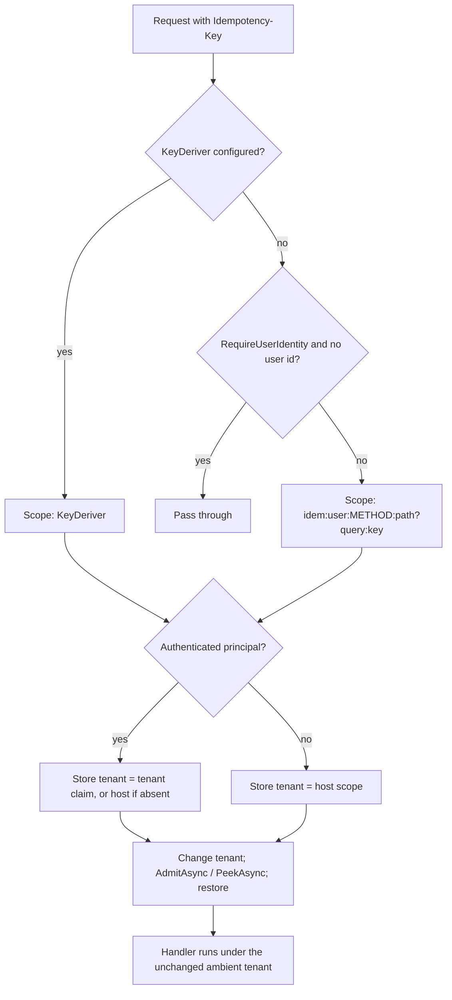

# Idempotency Keys Scoped by the Tenant Claim - Plan

## Goal Capsule

- **Objective:** Steering pre-auth tenant resolution (host or header) no longer moves an HTTP idempotency record into a tenant's namespace: a tenant's records are written and read only by principals whose authenticated tenant claim names that tenant, and anonymous traffic lives in one namespace outside every tenant.
- **Means:** The HTTP middleware derives the store's tenant from the authenticated principal's tenant claim and runs its store admission and peek under that tenant (KTD1, KTD2).
- **Authority:** Settled decisions in Product Contract Key Decisions > this plan's KTDs > repository conventions in `CLAUDE.md`.
- **Stop conditions:** Stop and report if the store cannot be driven to the claim tenant without changing `IIdempotentOperations` (owned by draft PR #992).
- **Execution profile:** One package (`src/Headless.Api.Idempotency`), its unit and in-memory integration tests, and docs. Target branch `shaheen/feat/fenced-leases-idempotency-941-954` (stacked on #992). Part of #921 (item H2).

---

## Product Contract

### Summary

The HTTP idempotency middleware stops trusting the ambient tenant. Tenant-scoped records take their tenant only from the authenticated principal's tenant claim. Anonymous requests, admitted only when `RequireUserIdentity` is `false`, all share one anonymous namespace outside every tenant.

### Problem Frame

The durable store keys each record by `ICurrentTenant.Id` at admission time (`src/Headless.Idempotency.Core/IdempotencyRequestResolver.cs`). Catalog resolution (`UseHeadlessTenantCatalogResolution`) sets that ambient tenant before authentication, from the host or a header the caller controls. With `RequireUserIdentity = false`, an anonymous caller can therefore choose which tenant's namespace its key lands in, so it can pre-seed a key a tenant's webhook sender will later use (the real request then replays the attacker's response or gets a fingerprint conflict) or replay a tenant's cached anonymous response. Issue #921 lists this as hardening item H2.

The shared anonymous namespace (R3) does not make anonymous endpoints safe on its own: anonymous callers of every tenant share it, so a webhook key stays pre-seedable and a cached anonymous response is replayable across tenants that share a path (AE4). Those endpoints need a `KeyDeriver` that adds a verified per-sender discriminator; the docs and PR body say so (R7).

### Key Decisions

- **Tenant segment comes only from the authenticated principal's tenant claim.** (session-settled: user-directed — chosen over the ambient pre-auth tenant (`ICurrentTenant` from host/header/catalog): the ambient tenant is attacker-controllable before authentication.) Governs R1, R2, R4.
- **Anonymous requests share one anonymous segment.** (session-settled: user-directed — chosen over a per-ambient-tenant anonymous segment: an anonymous caller carries no trustworthy tenant.) Governs R3, R5.
  - Conflict call-out: this widens anonymous sharing from per-routed-tenant to global, so on host- or header-routed apps an anonymous response cached for tenant A replays to tenant B on the same path. Accepted as the settled trade-off; mitigated only by a `KeyDeriver` discriminator (R7).
  - Conflict call-out (R2): apps that authenticate per tenant without a tenant claim lose per-tenant record separation and rely on globally unique user ids. Accepted as following the settled claim-only rule; documented under R7.
- **Greenfield, no compatibility shim; the PR targets #992's branch.** (session-settled: user-directed — chosen over targeting `main`: the package rewrite lives on #992.) Governs R7.

### Requirements

**Key scoping**

- R1. An authenticated request's record is keyed under the tenant named by the principal's tenant claim, read with the claim type the tenancy options configure (`MultiTenancyOptions.ClaimType`, default `tenant_id`).
- R2. An authenticated principal with no tenant claim is keyed under the host scope (no tenant), never under the ambient tenant.
- R3. An anonymous request admitted because `RequireUserIdentity` is `false` is keyed under the host scope with an empty user segment, whatever tenant the ambient context resolved.
- R4. A custom `KeyDeriver` changes only the scope string, and it still bypasses the `RequireUserIdentity` gate as it does today; the store tenant still follows R1 to R3.

**Admission gate**

- R5. With `RequireUserIdentity = false`, an anonymous request is admitted even when no ambient tenant exists (the old "no tenant and no user, pass through" refusal is removed). With `RequireUserIdentity = true` and no `KeyDeriver`, requests without a user id still pass through unchanged.
- R6. Authenticated behavior is otherwise unchanged: the scope string, hashing, replay, conflict, in-flight, renewal, and completion paths are identical when the claim tenant equals the ambient tenant.

**Delivery**

- R7. The public XML docs, `docs/llms/idempotency.md`, and the idempotency lines of `docs/llms/api.md` describe the claim-derived tenant, the shared anonymous namespace and its `KeyDeriver` remedy, and the claim-less-principal consequence; the PR body calls out the change for anonymous tenant-routed endpoints.

### Acceptance Examples

- AE1. **Covers R3.** Given `RequireUserIdentity = false` and an anonymous request whose ambient tenant is `B`, when it admits key `k`, then the store sees tenant `null` (host scope), not `B`.
- AE2. **Covers R1, R3.** Given an anonymous request routed to tenant `A` that admits `k` on `/echo`, when an authenticated tenant-`A` user sends `k` on `/echo`, then the user's request runs its handler (no replay, no conflict), because the two records live in different namespaces.
- AE3. **Covers R1.** Given an authenticated principal with claim tenant `A` and ambient tenant `B`, when it admits a key, then the store sees tenant `A`.
- AE4. **Covers R3, R5.** Given `RequireUserIdentity = false`, two anonymous requests routed to tenants `A` and `B` with the same method, path, query, key, and body, then the second replays the first. This is the deliberate trade-off R3 accepts.
- AE5. **Covers R2.** Given an authenticated principal with no tenant claim under ambient tenant `B`, when it admits `k`, then the store sees tenant `null`.
- AE6. **Covers R5.** Given `RequireUserIdentity = false` and no ambient tenant, when an anonymous request sends `k`, then it is admitted under tenant `null` instead of passing through.

### Scope Boundaries

- The ambient tenant the handler runs under is not changed; only the tenant the store sees during admission and peek changes.
- `IIdempotentOperations` and `Headless.Idempotency.Core` are not modified (they belong to #992).
- `docs/llms/multi-tenancy.md` is not edited; sibling tenancy PRs own it.
- Validation of the claim value (length, whitespace) stays with `IdempotencyRequestResolver`, as it does today for the ambient tenant.

---

## Planning Contract

### Key Technical Decisions

- KTD1. **Drive the store's tenant with `ICurrentTenant.Change` around `AdmitAsync` and `PeekAsync`.** The resolver reads `ICurrentTenant.Id` on every admit and peek; `Release`, `Renew`, and `Complete` use the admission's own recorded tenant (`ResolveAdmitted`), so wrapping only admit and peek scopes the whole record lifecycle. The scope wraps the awaited call and is disposed right after, so the handler still runs under the ambient tenant. Rejected: adding a tenant parameter to `IIdempotentOperations`, which is #992's public surface. Instantiates the Key Decisions governing R1 to R4.
- KTD2. **Read the claim through `TenantClaimReader` with `IOptions<MultiTenancyOptions>`.** This is the reader the tenancy post-auth resolution and the identifier integrity check already use, so the claim type stays single-sourced. It is internal to `Headless.Api.Core`, which `Headless.Api.Idempotency` already references; add `InternalsVisibleTo Headless.Api.Idempotency` to `src/Headless.Api.Core/Headless.Api.Core.csproj`. `IOptions<MultiTenancyOptions>` resolves to the default `tenant_id` claim type when tenancy is not configured. The claim is read only when `ICurrentUser.IsAuthenticated` is true, from `ICurrentUser.Principal`, the same source as `UserId`.
- KTD3. **Carry the resolved store tenant on `AdmissionRequest`.** `AdmissionRequest` is the middleware's private record in `IdempotencyMiddleware.cs`, not core surface. The identity step returns the scope and the tenant together, so the wait-and-replay poll (peek, then re-admit) reuses the same tenant without re-reading claims.

### High-Level Technical Design

### Assumptions

- `IdempotentOperations.AdmitAsync` awaits before the resolver reads `currentTenant.Id`, so KTD1 holds only because the `Change` scope stays open across the whole awaited call; never capture the `ValueTask` and dispose the scope before awaiting it.
- A host that registers its own `ICurrentTenant` implements `Change` for real. The framework's `CurrentTenant` does; `Headless.Idempotency.Core` registers it as the fallback.

---

## Implementation Units

### U1. Claim-derived store tenant in the middleware

- **Goal:** The middleware admits and peeks under the claim tenant (or host scope) and admits anonymous requests whenever `RequireUserIdentity` is `false`.
- **Requirements:** R1 to R6; KTD1 to KTD3.
- **Dependencies:** none.
- **Files:**
  - `src/Headless.Api.Idempotency/IdempotencyMiddleware.cs`
  - `src/Headless.Api.Core/Headless.Api.Core.csproj`
  - `tests/Headless.Api.Idempotency.Tests.Unit/IdempotencyMiddlewareTestBase.cs`
  - `tests/Headless.Api.Idempotency.Tests.Unit/IdempotencyMiddlewareTests.cs`
- **Approach:**
  1. Inject `IOptions<MultiTenancyOptions>`; replace the scope-only builder with one that returns scope plus store tenant (KTD3), dropping the `tenantMissing && userMissing` refusal (R5).
  2. Wrap `_AdmitAsync` and the wait-loop `PeekAsync` in `currentTenant.Change(request.TenantId)` (KTD1).
  3. Update the skip log message and the in-code comments that describe the ambient tenant.
- **Patterns to follow:** `src/Headless.Api.Core/Middlewares/TenantResolutionMiddleware.cs` for claim reading; existing substitute graph in the test base.
- **Test scenarios:** (the test base switches to a real `CurrentTenant` over `AsyncLocalCurrentTenantAccessor` and the admitting substitute records `ICurrentTenant.Id` at call time)
  - Covers AE3. An authenticated principal with claim `A` under ambient `B` admits with the store seeing `A`.
  - An authenticated principal with a custom configured claim type admits under that claim's value.
  - An authenticated principal with no tenant claim under ambient `B` admits with the store seeing `null`.
  - Covers AE1. Anonymous, `RequireUserIdentity = false`, ambient `B`: the store sees `null` and the scope carries an empty user segment.
  - Anonymous, `RequireUserIdentity = false`, no ambient tenant: admitted (previously passed through).
  - Anonymous, `RequireUserIdentity = true`: passes through without a store call (unchanged).
  - `KeyDeriver` configured with the default `RequireUserIdentity = true`, anonymous under ambient `B`: admitted, and the store sees `null`.
  - Wait-and-replay: the peek and the re-admission both run under the claim tenant.
  - After the middleware returns, and inside the handler, the ambient tenant is still `B`.
  - Existing authenticated scope-hash test still passes unchanged (R6).
- **Verification:** Unit tests pass; the replaced "tenant and user are null" pass-through test is rewritten to the new R5 behavior.

### U2. End-to-end isolation on the in-memory store

- **Goal:** Prove with a real store that an anonymous request routed to one tenant cannot pre-seed or collide with an authenticated tenant user's key, and that anonymous records share one namespace.
- **Requirements:** R1, R3, R5, R6.
- **Dependencies:** U1.
- **Files:**
  - `tests/Headless.Api.Idempotency.Tests.Integration/IdempotencyTestApp.cs`
  - `tests/Headless.Api.Idempotency.Tests.Integration/IdempotencyInMemoryTenantScopeTests.cs` (new)
- **Approach:** Give the test app an opt-in mode that registers the real `CurrentTenant`, sets the ambient tenant from a header for the request (mirroring catalog resolution), and lets the test user carry a `tenant_id` claim on its principal.
- **Test scenarios:** (AE2 and the second scenario are regression guards that also pass before U1, because anonymous and authenticated scopes already differ by user segment; the last three prove the new keying)
  - Covers AE2. Anonymous with header tenant `A` admits `k`, then an authenticated tenant-`A` user with the same key and body runs the handler (distinct invocation ids, no replay header).
  - Anonymous with header tenant `B` admits `k`; an authenticated tenant-`A` user with the same key runs the handler.
  - Authenticated claim tenant `A`, header tenant `B`: a retry with header tenant `A` replays the first response (the header does not move the record).
  - Authenticated tenant-`A` user admits `k` first, then an anonymous request with header tenant `A` and the same key runs its own handler (no read of the tenant record).
  - Covers AE4. Anonymous `A` then anonymous `B` with the same request replays.
- **Verification:** The new test class passes in `Headless.Api.Idempotency.Tests.Integration` with no container needed.

### U3. Documentation

- **Goal:** Consumers can tell where the store tenant comes from and what changed for anonymous endpoints.
- **Requirements:** R7.
- **Dependencies:** U1.
- **Files:**
  - `src/Headless.Api.Idempotency/IdempotencyOptions.cs` (`RequireUserIdentity`, `KeyDeriver` XML docs)
  - `src/Headless.Api.Idempotency/ApplicationBuilderExtensions.cs` (`UseIdempotency` remarks on how records are keyed)
  - `docs/llms/idempotency.md` (HTTP composition, store key bullet)
  - `docs/llms/api.md` (idempotency setup line, options table, behavior bullet)
- **Approach:** The PR body carries the same behavior-change note (R7), written at ship time. State the claim-derived tenant, the host-scope anonymous namespace, the removed no-identity refusal, and that a `KeyDeriver` must add its own trusted discriminator (for example a verified webhook account) when anonymous callers of different tenants share a path.
- **Test expectation:** none -- documentation only.
- **Verification:** Docs match the U1 behavior; no edit to `docs/llms/multi-tenancy.md`.

---

## Verification Contract

| Gate | Command | Applies to |
| --- | --- | --- |
| Scoped build | `make build-project PROJECT=src/Headless.Api.Idempotency/Headless.Api.Idempotency.csproj` | U1, U3 |
| Unit tests | `make test-project TEST_PROJECT=tests/Headless.Api.Idempotency.Tests.Unit/Headless.Api.Idempotency.Tests.Unit.csproj` | U1 |
| In-memory integration | `make test-class CLASS='*IdempotencyInMemory*'` (runs both in-memory classes, no Docker) | U2 |
| Release build | `dotnet build -c Release -v:minimal` on `src/Headless.Api.Idempotency`, `src/Headless.Api.Core`, and both `Headless.Api.Idempotency.Tests.*` projects | all |
| Analyzers | `make quality-analyzers` | all |

The PostgreSQL and SQL Server integration suites are not required: no store behavior changes, only the tenant the middleware passes in.

## Definition of Done

- R1 to R7 hold, and every U1 and U2 scenario has a passing test.
- `Headless.Api.Idempotency` builds in Release with no analyzer errors.
- The PR targets `shaheen/feat/fenced-leases-idempotency-941-954`, says "Part of #921, stacked on #992", and documents the anonymous tenant-routed behavior change.
- No abandoned-attempt code remains in the diff.
