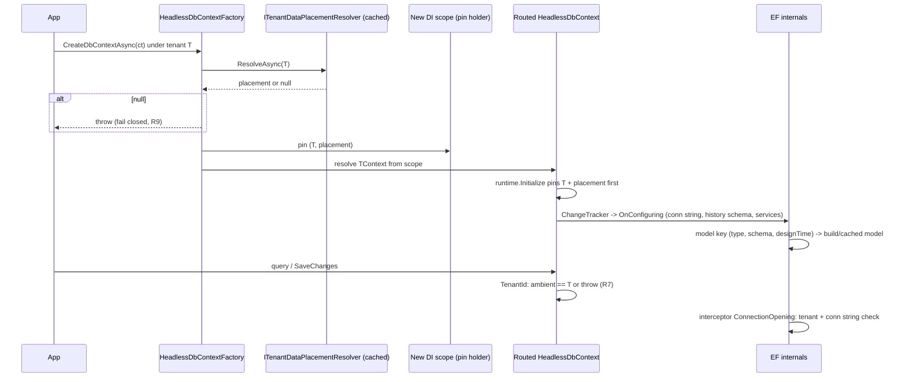
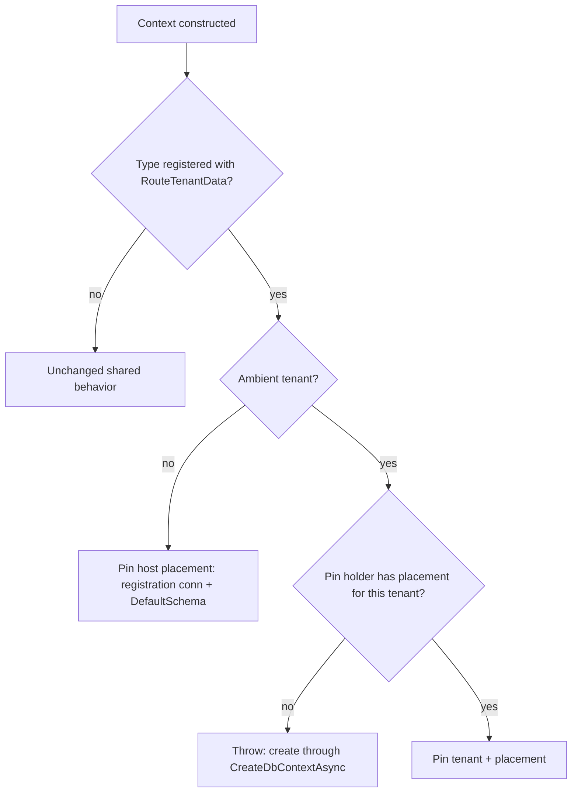

# Tenant Data Placement - Plan

## Goal Capsule

- **Objective:** An application can give each tenant its own schema or its own database. Tenant data then never reaches the shared store or another tenant's store, even when a placement is missing, a tenant changes mid-operation, or a relay reads the data. Shared-schema applications see no change and need no configuration.
- **Means:** a placement resolver SPI consumed by an opt-in routed `HeadlessDbContext` that pins its tenant and placement when it is constructed (KTD1, KTD4, KTD5).
- **Authority:** the settled decisions carried from the invoking session (KTDs marked `session-settled`) outrank this plan's own choices. The Product Contract outranks the Planning Contract on behavior. The Planning Contract outranks unit text on mechanism.
- **Stop conditions:**
  - Stop and report if database-per-tenant needs more than the guardrails in R9 to R11, such as a relay that reads several databases. Ship schema-per-tenant alone in that case.
  - Stop and report if an EF Core seam named in KTD8 or KTD9 cannot be implemented without behavior the plan did not anticipate.
- **Execution profile:** stacked on the #960 read-guard branch (`shaheen/feat/tenant-read-guard`). Rebase onto its head before implementing. Do not edit `HeadlessTenantModelConvention._ConfigureFilter`.
- **Tail ownership:** x-autopilot owns review, commit, push, and the PR, which targets the #960 branch.

---

## Product Contract

### Summary

Add per-tenant data placement to Headless multi-tenancy. A new `ITenantDataPlacementResolver` SPI maps a canonical tenant id to a schema, a connection string, or both. A `HeadlessDbContext` registered as routed applies that placement: it builds a per-schema model, connects to the tenant's database, and migrates each tenant through an out-of-DI runner. The tenant query filter, write guard, and read guard keep working unchanged. Contexts that feed a relay (outbox storage, the Jobs store) or hold host-level state (the EF tenant catalog, Settings, Features, and Permissions stores) never route.

Product Contract preservation: R11 was extended during review to cover the Settings, Features, and Permissions EF stores. Routing any of them would split host-level configuration across tenant stores behind one shared cache.

### Problem Frame

The tenant catalog shipped in #838 covers tenant identity only. The only supported isolation today is a shared schema with a filtered tenant column, and `docs/llms/multi-tenancy.md` declares every other topology out of scope. Applications that need a physical boundary between tenants have to build one outside the framework. That boundary may be required for blast radius, compliance, capacity, or residency. Issue #877 queued this work and set its constraints: pool exhaustion under database-per-tenant, migrations outside DI, resolution after tenant resolution, catalog-equal failure semantics, and unchanged tenant guards.

### Requirements

**Placement contract**

- R1. `ITenantDataPlacementResolver` in `Headless.MultiTenancy.Abstractions` resolves a canonical tenant id to a `TenantDataPlacement` (`Schema?`, `ConnectionString?`), or to `null` for no placement.
- R2. The default resolver returns `null`. A host that does not route a context needs no placement configuration and sees no behavior change.
- R3. A configuration-backed resolver ships in `Headless.MultiTenancy`. No Settings-backed resolver ships.
- R4. A custom resolver is cached with the catalog's rules: a cache fault is a miss, a store fault propagates unwrapped, and `OperationCanceledException` always propagates.
- R5. `TenantDataPlacement` never exposes its connection string through `ToString()`.

**Routed contexts**

- R6. A routed context applies its tenant's schema to the model and to migrations, and its tenant's connection string to its connection.
- R7. A routed context is pinned to one tenant and one placement for its lifetime. Using it after the ambient tenant changes throws.
- R8. A routed context used without an ambient tenant uses the registration's own placement (connection and `DefaultSchema`).
- R9. When a routed context is created for a tenant that has no placement, creation fails. It never falls back to the shared store.
- R10. Registering a routed context without a configured placement source fails startup.
- R11. Registering any of these over a routed context fails startup: the Jobs application context, an EF messaging storage, the EF tenant catalog store, or the EF Settings, Features, or Permissions store.
- R12. The tenant query filter, the write guard, and the #960 read guard stay keyed on the canonical tenant id and apply unchanged under a non-default schema or database.

**Operations**

- R13. An out-of-DI runner migrates every tenant in `ITenantDirectory`, each into its own schema or database, with its own migrations history table.
- R14. `docs/llms/multi-tenancy.md` states the supported topologies and documents the ADO.NET pool and PostgreSQL `max_connections` guidance. It also says when schema-per-tenant is the better choice.

### Key Decisions

- **Option C: a resolver SPI, not a store and not `TenantInfo`.** `TenantInfo`'s XML contract ("per-tenant configuration does not belong on this model") is upheld (session-settled: user-directed — chosen over Option A, a connection string on `TenantInfo`, and Option B, Settings-backed resolution: Option A breaks the documented identity-only contract and Option B recurses on a cold cache and silently falls back to the global value). Governs R1, R3.
- **A missing placement fails closed.** A tenant without a placement under a routed context is refused rather than sent to the shared database, so a hybrid topology where some tenants stay shared is not supported (session-settled: user-directed — chosen over falling back to the shared database: a fallback would silently co-locate an isolated tenant's writes with the shared data). Governs R9, R10.
- **Relay-bearing contexts never route.** Outbox storages and the Jobs store stay on one fixed database (session-settled: user-directed — chosen over relays that read several databases: `RelationalDatabaseIdentity` would strand rows in a database no relay or poller reads). Governs R11.
- **Schema-per-tenant is the default recommendation, and database-per-tenant is opt-in.** (session-settled: user-directed — chosen over treating both topologies as equal defaults: ADO.NET pools multiply per connection string and exhaust PostgreSQL `max_connections` first.) Governs R14.

### Acceptance Examples

- AE1. Covers R7. **Given** a routed context created for tenant A, **when** code changes `ICurrentTenant` to B and queries through that context, **then** the query throws before reaching the database.
- AE2. Covers R9. **Given** routing is configured and the resolver returns `null` for tenant C, **when** `CreateDbContextAsync` runs under tenant C, **then** it throws and no connection is opened.
- AE3. Covers R12. **Given** tenant A's schema holds a row stamped with tenant B's id, **when** a context routed to A queries that entity, **then** the filter hides the row, and saving a modified B-stamped entity through A's context is refused by the write guard.
- AE4. Covers R6, R8. **Given** a routed context with no ambient tenant, **when** it runs `MigrateAsync`, **then** it migrates the registration's database and `DefaultSchema`, exactly as an unrouted context does.

### Scope Boundaries

- Only `HeadlessDbContext` subclasses route. `HeadlessIdentityDbContext`, plain `DbContext`, and pooled contexts do not.
- The resolver is keyed by canonical tenant id only. Identifier-based placement is out of scope.
- Raw SQL inside migrations (`migrationBuilder.Sql(...)`) is not rewritten per tenant. The documentation says so.

### Deferred to Follow-Up Work

- A resolver backed by a `TenantInfo` subclass. An app-owned `ITenantStore` can implement `ITenantDataPlacementResolver` directly in a few lines, so the framework adds no surface for it now.
- Schema-name templating in the configuration resolver (for example `tenant_{id}`). A custom resolver covers it today.
- Framework HTTP or Jobs middleware that resolves the placement ahead of time, so a routed context could be injected directly under a tenant (see KTD5).

---

## Planning Contract

### Key Technical Decisions

- KTD1. **SPI shape.** `Task<TenantDataPlacement?> ResolveAsync(string tenantId, CancellationToken)`, where `Task` matches `ITenantStore`. `TenantDataPlacement` is a sealed class and not a record, because a record's generated `ToString()` would print the connection string (R5). Its constructor requires at least one non-blank member. The null default is registered with `TryAdd` in `AddHeadlessTenancyCore` (R2). Types live in the `Headless.MultiTenancy` family namespace, as the namespace policy requires. `TenantInfo`'s remarks gain one sentence pointing physical placement at the resolver (session-settled: user-directed — chosen over a connection string on `TenantInfo` or a Settings-backed value: see the Option C Key Decision). Governs R1, R2, R5.
- KTD2. **Registration surface.** Placement is configured once on the root tenancy builder with `tenancy.DataPlacement(p => p.UseConfiguration(section) | p.UseResolver<T>())`. Exactly one source is allowed, enforced with the same `GuardSingleStorageProvider` check the catalog uses. Routing is configured per context with `tenancy.EntityFramework(ef => ef.RouteTenantData<TContext>())`, where `TContext : HeadlessDbContext`. Each call records posture (seam `DataPlacement`, EF capability `route-tenant-data`). The configuration resolver binds a list of `{ TenantId, Schema, ConnectionString }` entries once at startup, like `ConfigurationTenantStore`, and validates unique ids and at least one member per entry (session-settled: user-directed — chosen over a Settings-backed implementation: recursion and silent fallback). Governs R3.
- KTD3. **Caching reuses the catalog helpers but stays in process.** `TenantCatalogService`'s private `_TryGetCacheAsync` and `_TryUpsertCacheAsync` move into one internal helper that both the catalog service and a new internal `CachingTenantDataPlacementResolver` call, so the fault rules have one owner. The caching resolver wraps only `UseResolver<T>()`. The configuration resolver is already an in-memory lookup. Placements carry connection strings, so the cache is the in-process tier (`IInMemoryCache` behind the typed `Cache<T>` adapter), never a distributed one. That tier is declared with `RequireRegisteredService`. Positive results are cached for `TenantDataPlacementOptions.CacheExpiration` (default 5 minutes). A `null` result is never cached, so a newly provisioned tenant routes as soon as its placement exists (session-settled: user-directed — chosen over new failure semantics: the fault rules must match the catalog. The choice of in-process tier is this plan's elaboration). Governs R4.
- KTD4. **The pin happens at construction, not at first connection open.** EF builds the model inside the `HeadlessDbContext` constructor: `HeadlessDbContextRuntime.Initialize` touches `ChangeTracker`, and building the change tracker builds the model. The schema must therefore be fixed before that point. The runtime pins the tenant and placement as the first step of `Initialize`. The routed context's `TenantId` then returns the pinned id and throws when the ambient tenant differs.

  A singleton interceptor, both a `DbConnectionInterceptor` and a `DbCommandInterceptor`, repeats the tenant check before every connection open and every command, sync and async. Commands on an already-open connection, raw SQL, and queries on entities that are not tenant-owned never read `TenantId`, and the command check still catches them.

  On open, the interceptor also verifies that the connection reaches the pinned database. It uses `RelationalDatabaseIdentity.IsSameDatabase` against an unopened connection built once per placement from the pinned connection string, and never compares raw `ConnectionString` values. After an open, Npgsql and SqlClient normalize the connection string and strip its password, so a raw comparison would reject legitimate reopens (session-settled: user-directed — chosen over re-routing mid-context: silent cross-tenant access. Conflict call-out: the settled wording pins "at first connection open", but EF needs the schema before the model exists, so the pin moves earlier. This is stricter than settled and loses no protection). Governs R7.
- KTD5. **Routed contexts under a tenant come from `IDbContextFactory<T>.CreateDbContextAsync`.**
  - The factory resolves the placement asynchronously, stores it in a scoped pin holder in the new scope, and only then resolves the context.
  - Resolving a routed context directly from DI while a tenant is ambient throws a message naming the factory. So does the synchronous `CreateDbContext()`.
  - With no ambient tenant, both paths use the registration placement (R8), so design-time tooling and host work are unaffected.
  - Rejected: blocking on the resolver inside the constructor (sync-over-async on a request thread), and a fast path that accepts a synchronously completed result, which would make a direct injection succeed or fail depending on cache warmth.
  - This is the plan's own judgment, not a settled decision. It is flagged for review in the PR.

  Governs R7, R8, R9.
- KTD6. **Applying the placement.**
  - `HeadlessDbContext` overrides `OnConfiguring`. For routed contexts only, it swaps the relational options extension's connection string (`WithConnectionString`) and migrations-history schema (`WithMigrationsHistoryTableSchema`), attaches the interceptor, and replaces `IModelCacheKeyFactory` and `IMigrationsAssembly`.
  - `OnModelCreating` applies the effective schema, `placement.Schema ?? DefaultSchema`.
  - A context configured with a `DbConnection` or a `DbDataSource` cannot take a per-tenant connection string. The interceptor's database check fails it at first open.
  - `OnModelCreating` stamps the effective schema on the model as an annotation. After `Initialize` builds the change tracker, the runtime compares that annotation with the pinned schema and throws on a mismatch. This catches a consumer `OnConfiguring` that skips base or replaces `IModelCacheKeyFactory` itself, which would otherwise let every tenant reuse the first model built.
  - A tenant-placed context refuses, at model finalization, a tenant-owned entity mapped to an explicit schema other than the effective schema. Such an entity would put every tenant's rows into one table. Entities that are not tenant-owned may keep an explicit schema and stay shared.
  - Exception and log messages on placement paths name the context type and tenant id only. They never include a connection string (R5).
  - Unrouted contexts keep EF's defaults (R2).

  (session-settled: user-directed — chosen over registration-time `AddDbContext` configuration and pooled contexts: registration is too early and pooling leaks per-request state. Conflict call-out: the connection string is applied in `OnConfiguring` from the pinned placement, while the interceptor enforces it. It is not resolved inside the interceptor. The pin already resolved it asynchronously, and applying it before any connection exists means `RelationalDatabaseIdentity` checks always see the tenant's database, never the shared one.) Governs R6.
- KTD7. **Model cache.** The key is `(context type, effective schema, designTime)`. The bound is EF's own internal `IMemoryCache`, which has a size limit of 10240. EF Core 10 caches a design-time model (size 150) and a runtime model (size 100) per key, so each schema costs 250. That caps one internal service provider at about 40 cached schemas, a budget compiled queries (size 10 each) share. Past it, models are rebuilt under `ModelSource`'s process-wide lock. U3 verifies behavior past 40 schemas. If models do not stay cached, routed contexts pass a sized cache through `UseMemoryCache`. Compiled queries cannot be shared across schemas, because the Headless compiled-query key already wraps EF's key (which includes the model) and the tenant id (session-settled: user-directed — chosen over rewriting SQL per tenant: a shared model with rewritten SQL would let the compiled-query cache reuse one tenant's SQL for another). Governs R6.
- KTD8. **Migrations are scaffolded once and rewritten per tenant.**
  - Migrations are authored against the registration placement.
  - A routed context's replaced `IMigrationsAssembly`, an EF `MigrationsAssembly` subclass with an inline `EF1001` pragma reason, rewrites every schema reference that equals the design-time default schema. The null default counts. Schema, principal schema, new schema, and `EnsureSchemaOperation.Name` all move to the pinned tenant schema. Explicit other schemas are untouched.
  - The same rewrite applies to each migration's `TargetModel`, which is still mutable before the migrator finalizes it. That covers entity table schemas, sequences, and the model default schema. EF generates SQL against that model: seed-data operations and provider `AlterColumn` handling look tables up by schema, so an unrewritten model throws `DataOperationNoTable`.
  - A tenant-placed context skips EF's pending-model-changes check (`RelationalEventId.PendingModelChangesWarning`), because its model differs from the snapshot by schema alone. The host placement keeps the check, so real drift is still caught there and at design time.
  - Rejected: hand-editing each migration to read an injected schema, which puts the burden on every migration forever.
  - Rejected: PostgreSQL `search_path` routing, which does not work on SQL Server and bypasses the settled model key.

  Governs R6, R13.
- KTD9. **Migration runner.** `IServiceProvider.MigrateTenantDatabasesAsync<TContext>(CancellationToken)` joins `HeadlessMigrateDbContextExtensions`. It requires `ITenantDirectory`, and throws with a remedy when the store has none. It migrates every tenant, disabled ones included so a re-enabled tenant is current, one at a time: `ICurrentTenant.Change`, then `CreateDbContextAsync`, then `MigrateAsync`. It logs the failing tenant id and rethrows the original exception. It does not migrate the host placement, which the existing `MigrateDbContextByFactoryAsync` already covers (session-settled: user-directed — chosen over an in-request or DI-scoped migration path: migrations must run outside request scope). Governs R13.
- KTD10. **The relay guard is one tenancy validator.** `Headless.MultiTenancy` exposes a public marker registration for routed context types and a helper that registers an `IHeadlessTenancyValidator`. The validator errors when a named relay's context type is routed. These registrations call the helper:

  - Jobs `UseApplicationDbContext`
  - the PostgreSQL and SQL Server `UseEntityFramework<TContext>` messaging storages
  - the EF tenant catalog store
  - the Settings, Features, and Permissions `UseEntityFramework<TContext>` stores, which hold host-level state behind a shared cache

  `RouteTenantData<T>()` registers the marker (U3). The helper and validator only read it (U5). Enlisted outbox or Jobs writes from a database-routed context are already refused by `RelationalDatabaseIdentity`. A schema-routed context shares the database, so its enlisted writes land in the relay's own tables (session-settled: user-directed — chosen over multi-database relays: stranded rows). Governs R11.
- KTD11. **Tenant guards are untouched.** The filter, the write guard, and the #960 read guard read `IHeadlessDbContext.TenantId`. For a routed context that property returns the pinned id (KTD4), so `_ConfigureFilter` and the read-guard code need no change, and the stack rebases cleanly (session-settled: user-directed — chosen over placement-aware guards: guards key on canonical id and are orthogonal to placement). Governs R12.

### High-Level Technical Design

Creation and pin sequence for a routed context under a tenant:



Routing decision at construction:



Caller usage this design is derived from (illustrative only):

```csharp
builder.AddHeadlessTenancy(t => t
    .DataPlacement(p => p.UseConfiguration(builder.Configuration.GetSection("Headless:MultiTenancy:DataPlacement")))
    .EntityFramework(ef => ef.GuardTenantWrites().RouteTenantData<AppDbContext>()));

await using var db = await factory.CreateDbContextAsync(ct);   // under the ambient tenant
await app.Services.MigrateTenantDatabasesAsync<AppDbContext>(ct);
```

### Assumptions

- Direct DI injection of a routed context under a tenant fails by design (KTD5). Applications inject `IDbContextFactory<T>` for routed contexts. This is the main ergonomic cost, and the PR names it for review.
- Tenant ids are acceptable in exception and log messages. They are canonical, non-PII ids that the framework already logs elsewhere.
- A tenant-placed schema must already be creatable by the database user that the placement's connection runs as.
- Schema-name validity (length and characters) is left to the provider. EF quotes schema identifiers, so a hostile schema string cannot inject SQL.

### Risks

| Risk | Mitigation |
|---|---|
| EF's model-cache bound differs from KTD7's reading in EF Core 10 | Verify against the installed source in U3, and fall back to a sized `UseMemoryCache` |
| `MigrationsAssembly` is pubternal and may change across EF versions | One subclass with an inline `EF1001` pragma reason, covered by the PostgreSQL integration test that fails loudly on drift |
| `WithMigrationsHistoryTableSchema` or `WithConnectionString` per instance creates a new EF internal service provider per tenant, which raises `ManyServiceProvidersCreatedWarning` | Integration test creates more than 20 tenant contexts. If the warning fires, move history and connection handling to scoped options (see Open Questions) |
| A custom resolver that itself uses a routed context recurses | Documented: resolvers read host-level storage only |
| Database-per-tenant multiplies connection pools | Documented pool and `max_connections` guidance (R14). Schema-per-tenant is the recommended default |

### Open Questions

- Deferred: if the EF internal service provider cache does fan out per tenant (Risks, row 3), replace the `OnConfiguring` swap with a scoped `IDbContextOptionsConfiguration<TContext>` that reads the pin holder. KTD6 then moves the swap and nothing else changes. Resolve during U3 from the integration test result. This does not block the start of work.

---

## Implementation Units

### U1. Placement contract and null default

- **Goal:** Ship the SPI, the value type, and the null default so hosts that do not route see no change.
- **Requirements:** R1, R2, R5. KTD1.
- **Dependencies:** none.
- **Files:**
  - Create `src/Headless.MultiTenancy.Abstractions/ITenantDataPlacementResolver.cs`
  - Create `src/Headless.MultiTenancy.Abstractions/TenantDataPlacement.cs`
  - Modify `src/Headless.MultiTenancy.Abstractions/TenantInfo.cs` (remarks sentence)
  - Create `src/Headless.MultiTenancy/NullTenantDataPlacementResolver.cs`
  - Modify `src/Headless.MultiTenancy/Setup.cs` (`TryAdd` in `AddHeadlessTenancyCore`)
  - Test `tests/Headless.MultiTenancy.Tests.Unit/DataPlacement/TenantDataPlacementTests.cs`
- **Approach:** Follow `TenantInfo`'s validating-constructor style with `Headless.Checks`. The null resolver is an `internal sealed` singleton.
- **Patterns to follow:** `TenantInfo`, `NullCurrentTenantInfo` registration in `AddHeadlessTenancyCore`.
- **Test scenarios:**
  - Constructing with only a schema, only a connection string, or both succeeds, and the properties round-trip.
  - Constructing with both null, or with a blank or whitespace member, throws `ArgumentException`.
  - `ToString()` on a placement with a connection string does not contain that string.
  - `AddHeadlessTenancy` with no placement configuration resolves the null resolver, which returns `null` for any id.
- **Verification:** unit tests pass. `TenantInfo` docs mention the resolver.

### U2. Placement sources, caching, and the shared cache helpers

- **Goal:** Configuration-backed and custom placement sources with catalog-equal fault semantics.
- **Requirements:** R3, R4. KTD2, KTD3.
- **Dependencies:** U1.
- **Files:**
  - Create `src/Headless.MultiTenancy/TenantCacheOperations.cs` (the extracted helpers and their log messages)
  - Modify `src/Headless.MultiTenancy/TenantCatalogService.cs` (call the extracted helpers)
  - Create `src/Headless.MultiTenancy/SetupHeadlessTenancyDataPlacement.cs` (the `DataPlacement(...)` builder entry and posture)
  - Create `src/Headless.MultiTenancy/HeadlessTenancyDataPlacementSetupBuilder.cs`
  - Create `src/Headless.MultiTenancy/TenantDataPlacementOptions.cs` (with validator)
  - Create `src/Headless.MultiTenancy/ConfigurationTenantDataPlacementResolver.cs`
  - Create `src/Headless.MultiTenancy/ConfigurationTenantDataPlacementOptions.cs` (with validator)
  - Create `src/Headless.MultiTenancy/CachingTenantDataPlacementResolver.cs`
  - Create `src/Headless.MultiTenancy/TenantDataPlacementCacheItem.cs`
  - Test `tests/Headless.MultiTenancy.Tests.Unit/DataPlacement/ConfigurationTenantDataPlacementResolverTests.cs`
  - Test `tests/Headless.MultiTenancy.Tests.Unit/DataPlacement/CachingTenantDataPlacementResolverTests.cs`
  - Test `tests/Headless.MultiTenancy.Tests.Unit/DataPlacement/DataPlacementSetupTests.cs`
- **Approach:**
  1. Extract the helpers without behavior change. The existing `TenantCatalogService` tests are the characterization net.
  2. `UseConfiguration` has the same three overloads as `SetupConfigurationTenantCatalogStore`. `UseResolver<T>()` registers `T` as scoped and wraps it.
  3. The caching resolver reads through the in-process tier, falls through on a read fault, swallows a write fault, and never caches `null` (KTD3).
- **Patterns to follow:** `SetupHeadlessTenancyCatalog`, `SetupConfigurationTenantCatalogStore`, `ConfigurationTenantStore`, `TenantCatalogService._ResolveByIdAsync`.
- **Test scenarios:**
  - The configuration resolver returns the configured placement for a known id and `null` for an unknown id.
  - Configuration with duplicate tenant ids, an empty id, or an entry with neither member fails options validation at startup.
  - The caching resolver calls the inner resolver once on a cold key and serves the second call from cache.
  - A `null` inner result is not cached: a second call reaches the inner resolver again.
  - A cache read fault degrades to a miss, the inner resolver answers, and the fault is logged.
  - A cache write fault is swallowed and the inner resolver's result is returned.
  - An inner resolver fault propagates as the same exception instance, unwrapped.
  - `OperationCanceledException` from the cache or the inner resolver propagates.
  - Registering two placement sources, or none inside `DataPlacement(...)`, throws.
  - `UseResolver<T>()` without an in-process cache tier fails startup through `RequireRegisteredService`.
  - The existing `TenantCatalogService` tests still pass unchanged.
- **Verification:** `Headless.MultiTenancy.Tests.Unit` passes, including the untouched catalog tests.

### U3. Routed `HeadlessDbContext`

- **Goal:** A routed context pins the tenant and placement at construction, applies the schema and connection, and fails closed.
- **Requirements:** R6, R7, R8, R9, R10, R12. KTD4, KTD5, KTD6, KTD7, KTD11.
- **Dependencies:** U1, U2.
- **Files:**
  - Modify `src/Headless.EntityFramework/SetupEntityFrameworkTenancy.cs` (`RouteTenantData<TContext>()`, capability label, routing-without-placement validator)
  - Create `src/Headless.MultiTenancy/TenantDataRouting.cs` (the public routed-context marker registration only. U5 adds the helper and validator to this file.)
  - Create `src/Headless.EntityFramework/Contexts/Runtime/HeadlessTenantPlacementPin.cs` (the scoped holder and the routing registry)
  - Create `src/Headless.EntityFramework/Contexts/Runtime/HeadlessTenantModelCacheKeyFactory.cs`
  - Create `src/Headless.EntityFramework/Contexts/Runtime/HeadlessTenantPlacementInterceptor.cs`
  - Modify `src/Headless.EntityFramework/Contexts/HeadlessDbContextFactory.cs` (resolve and pin before resolving the context)
  - Modify `src/Headless.EntityFramework/Contexts/HeadlessDbContext.cs` (`OnConfiguring` and the effective schema in `OnModelCreating`)
  - Modify `src/Headless.EntityFramework/Contexts/Runtime/HeadlessDbContextRuntime.cs` (pin first in `Initialize`, and the pinned `TenantId` guard)
  - Modify `src/Headless.EntityFramework/Contexts/HeadlessDbContextServices.cs`
  - Test `tests/Headless.EntityFramework.Tests.Integration/Tenancy/TenantDataPlacementRoutingTests.cs`
  - Test `tests/Headless.EntityFramework.Tests.Integration/Fixture/TenantPlacementDbContextTestFixture.cs`
- **Approach:**
  1. Pin first, before the runtime touches `ChangeTracker` (KTD4).
  2. `OnConfiguring` swaps services and options only when the type is routed (KTD6).
  3. The model key reads the pinned effective schema from the runtime.
  4. Verify the EF Core 10 model-cache bound and the internal-service-provider behavior (KTD7, Risks) before finalizing, and record the finding in a code comment where it shapes the code.
- **Execution note:** Start with a failing PostgreSQL integration test that writes through two tenant schemas and reads each back.
- **Patterns to follow:** `TenantWriteGuardDbContextTestFixture` for the Testcontainers fixture, `EntityFrameworkTenantWriteGuardStartupValidator` for the validator, `DiRegisteredInterceptorsOptionsConfiguration` for how interceptors attach.
- **Test scenarios:**
  - Happy path: tenants A and B each get their own schema. An entity saved through A's context lands in `a.<table>` and is readable only through A's context.
  - Two contexts for the same tenant reuse one cached model. Contexts for different schemas get distinct models.
  - Database-per-tenant: two databases in one container. Each tenant's writes land in its own database. `Database.GetConnectionString()` reports the tenant database before open.
  - No ambient tenant: the context uses the registration schema and connection (Covers AE4).
  - Covers AE1. Created under A, then `ICurrentTenant.Change(B)`, then a query throws, `SaveChanges` throws, and opening the connection throws.
  - With a transaction already open under A, changing to B and then running `ExecuteSqlRaw`, or querying an entity that is not tenant-owned, throws at the command check.
  - One routed context runs a query and then `SaveChanges`, which reopens the connection. Both succeed.
  - A routed context with an Npgsql enum mapping opens successfully.
  - The database-mismatch exception message does not contain the placement's connection string.
  - A routed subclass whose `OnConfiguring` skips base fails at construction with the schema-annotation mismatch.
  - In a tenant-placed context, a tenant-owned entity mapped to an explicit schema other than the effective schema fails model building. An entity that is not tenant-owned in an explicit schema is accepted.
  - Covers AE2. The resolver returns `null` for tenant C, and `CreateDbContextAsync` under C throws without opening a connection.
  - Resolving the routed context directly from a DI scope while a tenant is ambient throws a message naming `CreateDbContextAsync`. So does the synchronous `CreateDbContext()`.
  - An unrouted `HeadlessDbContext` in the same host behaves exactly as before: no pin, and the live ambient `TenantId`.
  - Covers AE3. With the write guard on, a routed context for A hides a B-stamped row inserted raw into A's schema. Modifying and saving a B-stamped entity through A's context throws `CrossTenantWriteException`. The same holds under database-per-tenant.
  - The #960 read guard's refusal applies unchanged through a routed context. Write this scenario against the read-guard behavior present after the rebase.
  - Startup: `RouteTenantData<T>()` without `DataPlacement(...)` produces the tenancy startup error.
  - A context configured with an `NpgsqlDataSource` and routed to a connection string fails at first open with the connection-string mismatch message.
  - More than 20 tenant contexts in one process do not raise `ManyServiceProvidersCreatedWarning` (Risks, row 3).
  - With more than 40 tenant schemas, the models stay cached, or the sized-cache fallback in KTD7 is in place and proven.
- **Verification:** the integration project passes against Docker PostgreSQL. `dotnet build -c Release -v:minimal` of `Headless.EntityFramework` is clean.

### U4. Tenant migrations and the runner

- **Goal:** Migrations authored once apply into each tenant's schema or database, with a per-schema history table, from outside DI.
- **Requirements:** R6, R13. KTD8, KTD9.
- **Dependencies:** U3.
- **Files:**
  - Create `src/Headless.EntityFramework/Contexts/Runtime/HeadlessTenantMigrationsAssembly.cs`
  - Modify `src/Headless.EntityFramework/Contexts/HeadlessDbContext.cs` (the service replacement and the pending-changes warning, tenant placement only)
  - Modify `src/Headless.EntityFramework/Extensions/HeadlessMigrateDbContextExtensions.cs` (`MigrateTenantDatabasesAsync<TContext>`)
  - Test `tests/Headless.EntityFramework.Tests.Integration/Tenancy/TenantDataPlacementMigrationTests.cs`
  - Test `tests/Headless.EntityFramework.Tests.Integration/Fixture/Migrations/` (migrations scaffolded with `dotnet ef` against default schema `app`, Designer and `BuildTargetModel` included. The first creates the tables with `HasData` seed rows. A later one alters an indexed column.)
- **Approach:** Rewrite only schema values equal to the design-time default, which is either `DefaultSchema` or null (KTD8). The runner follows KTD9. It reads `ITenantDirectory` from the root provider and uses a fresh factory call per tenant.
- **Patterns to follow:** `MigrateDbContextByFactoryAsync`, `DbMigrationSeeder`.
- **Test scenarios:**
  - The runner over tenants A (schema `tenant_a`) and B (schema `tenant_b`) creates the table in each schema, plus `__EFMigrationsHistory` in each schema, and nothing in `app`.
  - Running the runner twice is idempotent: no error, and history shows one row per migration per schema.
  - Database-per-tenant: the runner creates or migrates each tenant database, and no `app` schema exists in a tenant database.
  - Seed rows from `HasData` and the indexed-column alteration both apply inside each tenant schema.
  - A disabled tenant is migrated too.
  - Covers AE4. `MigrateDbContextByFactoryAsync` with no ambient tenant migrates `app` only, and EF's pending-model-changes check still runs there.
  - A store without `ITenantDirectory` makes the runner throw a message naming the missing capability.
  - A migration failure for one tenant logs that tenant's id and rethrows the original exception, and later tenants are not attempted.
  - Cancellation propagates `OperationCanceledException`.
  - A table that is not tenant-owned, mapped to an explicit schema such as `audit`, is left in that schema for every tenant.
- **Verification:** the PostgreSQL integration tests pass. The migrated catalogs are inspected through `information_schema` in the test.

### U5. Relay guardrails

- **Goal:** Contexts that feed a relay can never be routed. Startup fails with a named diagnostic.
- **Requirements:** R11. KTD10.
- **Dependencies:** U3 (routed-context registration exists).
- **Files:**
  - Modify `src/Headless.MultiTenancy/TenantDataRouting.cs` (add the `RequireUnroutedTenantDataContext` helper and the validator next to U3's marker)
  - Modify `src/Headless.Jobs.EntityFramework/Customizer/CustomizerServiceDescriptor.cs` (`UseApplicationDbContext`)
  - Modify the `UseEntityFramework<TContext>` setup in `src/Headless.Settings.Storage.EntityFramework`, `src/Headless.Features.Storage.EntityFramework`, and `src/Headless.Permissions.Storage.EntityFramework`
  - Modify `src/Headless.Messaging.Storage.PostgreSql.EntityFramework/Setup.cs`
  - Modify `src/Headless.Messaging.Storage.SqlServer.EntityFramework/Setup.cs`
  - Modify `src/Headless.MultiTenancy.Storage.EntityFramework/Setup.cs`
  - Test `tests/Headless.MultiTenancy.Tests.Unit/DataPlacement/TenantDataRoutingValidatorTests.cs`
  - Test `tests/Headless.Messaging.Storage.PostgreSql.EntityFramework.Tests.Unit/` and `tests/Headless.Messaging.Storage.SqlServer.EntityFramework.Tests.Unit/` (one registration test each)
  - Test for the catalog store in `tests/Headless.MultiTenancy.Storage.EntityFramework.Tests.Unit/`
  - Test for Jobs where Jobs EF registration tests already live (find it at execution time)
- **Approach:** `RouteTenantData<T>()` already registers the marker (U3). This unit adds the validator and wires each guarded registration to it. Diagnostic code: `HEADLESS_TENANCY_RELAY_CONTEXT_ROUTED`.
- **Patterns to follow:** `EntityFrameworkTenantWriteGuardStartupValidator`, `TenantCatalogPostureValidator`.
- **Test scenarios:**
  - The validator errors when a relay's context type has the routed marker, and passes when it does not.
  - The PostgreSQL EF messaging storage over a routed context yields the error diagnostic. The same holds for SQL Server.
  - The EF tenant catalog store over a routed context yields the error.
  - The Settings, Features, and Permissions EF stores over a routed context each yield the error. Put one registration test in each package's existing unit project.
  - Jobs `UseApplicationDbContext` over a routed `HeadlessDbContext` fails startup. It already fails today on the options-constructor requirement. Assert whichever failure fires first, and that it names the problem.
  - An unrouted context under each relay passes.
- **Verification:** the affected unit projects pass.

### U6. Documentation

- **Goal:** Consumers can choose a topology and wire it correctly from the domain guide.
- **Requirements:** R14, plus documentation of R1 to R13.
- **Dependencies:** U1 to U5.
- **Files:**
  - Modify `docs/llms/multi-tenancy.md`:
    - Rewrite the "Logical isolation with a shared schema is the model" Core Concepts bullet.
    - Add a new `## Tenant Data Placement` section.
    - Add the new API names to the package sections.
    - Add two or three Agent Rules bullets.
  - Modify `docs/llms/orm.md` (a one-line pointer where `HeadlessDbContext` registration is described)
  - Modify `docs/llms/unit-of-work.md` (one sentence in "Database identity and several databases" on routed contexts)
  - Modify `CONCEPTS.md` (a "Tenant data placement" entry)
- **Approach:** Keep edits inside the owned sections so sibling tenancy PRs rebase trivially. The new section covers:
  - the topologies
  - setup
  - the resolver contract and its caching and fault rules
  - the guardrails (pin, fail-closed, relay)
  - the factory requirement (KTD5)
  - the migration runner and its raw-SQL limit
  - the per-process model-count note (about 40 schemas per internal service provider, from KTD7)
  - moving a tenant's placement takes effect on each node only after its cached placement expires or the process restarts
  - the guarded host-level stores (catalog, Settings, Features, Permissions)
  - pool guidance: one ADO.NET pool per distinct connection string, a PostgreSQL default of 100 `max_connections`, and when schema-per-tenant is the better choice

  Follow `docs/authoring/AUTHORING.md`.
- **Test expectation:** none. This is documentation only.
- **Verification:** the doc states the supported topologies and every rule in R7 to R11 with its remedy. No package README changes.

---

## Verification Contract

| Gate | Command | Applies to |
|---|---|---|
| Scoped build | `make build-project PROJECT=src/<changed project>.csproj` | each changed `src` project |
| Release build | `dotnet build -c Release -v:minimal src/<changed project>.csproj` | each changed `src` project (analyzer gate MTP skips) |
| Unit tests | `make test-project TEST_PROJECT=tests/Headless.MultiTenancy.Tests.Unit/Headless.MultiTenancy.Tests.Unit.csproj` | U1, U2, U5 |
| Relay unit tests | `make test-project TEST_PROJECT=<each touched *.Tests.Unit project>` | U5 |
| Integration (Docker) | `make test-project TEST_PROJECT=tests/Headless.EntityFramework.Tests.Integration/Headless.EntityFramework.Tests.Integration.csproj` | U3, U4 |
| Neighbor integration | `make test-project` on `Headless.MultiTenancy.Storage.EntityFramework.Tests.Integration` and `Headless.EntityFramework.Messaging.Tests.Integration` | regression on touched EF and tenancy paths |
| Format | `make format-check` | all |
| Analyzers | `make quality-analyzers` | before PR |

## Definition of Done

- R1 to R14 are each proven by a named test or, for R14, by the doc section.
- AE1 to AE4 pass against real PostgreSQL.
- Shared-schema behavior is unchanged: the existing EF, tenancy, messaging, and Jobs tests pass without edits, apart from the helper extraction.
- `_ConfigureFilter` is untouched by this branch's diff against the #960 branch.
- Every gate in the Verification Contract passes, and any gate not run is named with the reason.
- The PR body records the settled design, the KTD4 and KTD6 conflict call-outs, and the KTD5 ergonomic trade-off for review.
- No abandoned-attempt code remains in the diff.
