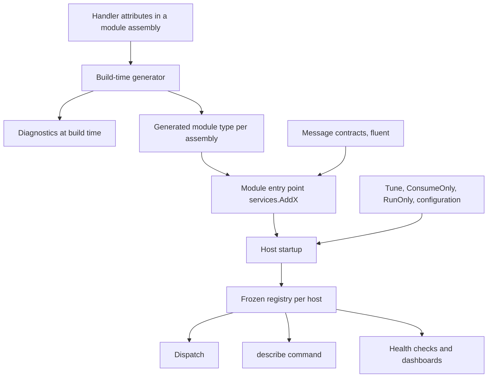
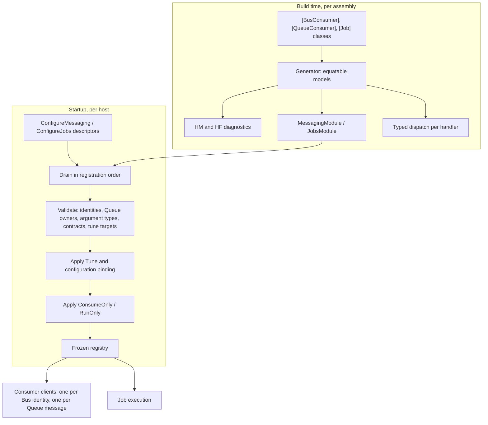

# Handler Declaration and Registration - Plan

## Goal Capsule

- **Objective:** A developer declares a message consumer or a job once, next to its code, and a host composes modules without naming groups, scanning assemblies, or knowing module internals. Registration mistakes surface at build time or at startup, never in production.
- **Means:** attributes declare handler classes, a source generator emits one module type per assembly per subsystem, and flat fluent calls cover message contracts, deployment tuning, and host controls (KTD1, KTD2).
- **Product authority:** the framework maintainer. The repository is greenfield, so public APIs and storage schemas break without compatibility shims or migrations. This plan owns the declaration and registration shape of Messaging and Jobs, including the Messaging generator and the move from consumer groups to consumer identities. Every-instance delivery semantics (#936) and the contents of the shared failure policy model are separate work.
- **Execution profile:** three phases. Phase A (shared contribution and policy slot) and Phase B (Jobs) ship independently. Phase C (Messaging) ships with or after #936, because the framework's per-process consumers need every-instance delivery before consumer identities become shared broker names (KTD7).
- **Failure policy:** The failure-policy declaration is deferred until the shared failure-policy model is designed. `IFailurePolicy` had no members and no runtime consumer, so every declared policy was a silent no-op; the `Headless.Reliability.Abstractions` package, the attribute `Policy` property, `Tune(...).FailurePolicy<T>()`, and the policy diagnostics were removed. The shared model's own issue reintroduces the declaration together with its behavior.
- **Stop conditions:** stop and ask when a unit would change a Product Contract requirement, when #936 has not landed and Phase C's framework consumers (U11) are reached, or when a provider cannot derive a Bus subscription name from an identity within its limits.
- **Tail ownership:** the implementer owns docs, demos, tests, and CONCEPTS.md updates in the same series. Merging into `main` needs an explicit request.
- **Open blockers:** none.

---

## Product Contract

Product Contract preservation: changed: R1, R2, R3, R4, R5, R8, R22, R23 and added R26, R27 — the maintainer replaced the three consumer attributes with `[BusConsumer]` and `[QueueConsumer]` over one `IConsume<T>`, dropped method-level jobs after the real usage count proved to be 11 demo jobs, limited a message to one Queue consumer, and chose argument-type scheduling. Key Decisions and acceptance examples were updated to match.

### Summary

Message consumers and jobs declare themselves with attributes on their handler classes: `[BusConsumer]` and `[QueueConsumer]` on `IConsume<T>` classes, and `[Job]` on `IJob` and `IJob<TArgs>` classes. Each module exposes one `services.AddX()` entry point that adds its generated module types and declares its message contracts. Hosts tune handlers by identity and choose which host consumes or runs what. On the Bus lane the consumer identity becomes the broker subscription name, which removes consumer groups and `UseApplicationId`.

### Problem Frame

Messaging registers a consumer through three nested lambdas, `setup.Bus.ForMessage<T>(m => m.Consumer<C>(c => ...))`, and discovers scanned consumers with reflection at startup. The broker subscription name comes from a group that defaults to `{ApplicationId}.{HandlerId}.{Version}`. `ApplicationId` defaults to the entry assembly name and `HandlerId` to CLR type names, so renaming a class or a host assembly silently moves broker subscriptions. Users must also keep a `ConsumerIdentity` for the inbox, a group for the broker, and a handler ID for diagnostics.

Jobs declares a job with `[JobFunction]` on a method, and its source generator now emits an explicit per-assembly `JobsModule` that the host adds with `AddModule<T>()`. The two subsystems still declare handlers differently, name identity differently, and place failure policy at different levels.

In a modular monolith, one process hosts several modules. The group model ties competition to the process, so extracting a module into its own service renames its broker subscriptions unless it keeps the monolith's application ID forever. Framework packages such as HybridCache and distributed locks already register consumers through an internal, order-independent contribution API that applications and modules cannot use.

### Registration at a glance

```csharp
// Handlers declare themselves
[BusConsumer(Identity)]
public sealed class InvoiceProjection : IConsume<InvoiceIssued>, IConsume<OrderPlaced>
{
    public const string Identity = "billing.invoice-projection";
}

[BusConsumer("billing.price-cache", EveryInstance = true)]
public sealed class PriceCacheRefresher : IConsume<PriceChanged>, IOnSubscriptionEstablished { }

[QueueConsumer("billing.issue-invoice")]
public sealed class IssueInvoice : IConsume<IssueInvoiceCommand> { }

[Job("billing.close-day", Cron = "0 0 * * *", TimeZone = "Africa/Cairo")]
public sealed class CloseDay : IJob { }

[Job("billing.send-invoice")]
public sealed class SendInvoice : IJob<InvoiceArgs> { }

// Module entry point
public static IServiceCollection AddBilling(this IServiceCollection services)
{
    services.ConfigureMessaging(m =>
    {
        m.AddModule<Billing.MessagingModule>();                     // generated for this assembly
        m.Message<InvoiceIssued>("billing.invoice-issued", version: "1");
    });
    services.ConfigureJobs(j => j.AddModule<Billing.JobsModule>()); // generated for this assembly
    return services;
}

// Host
services.AddHeadlessMessaging(m => m.UseRabbitMq(...).UsePostgreSql(...).ConsumeOnly("billing.*"));
services.AddHeadlessJobs(j => j.UsePostgreSql(...));
services.AddBilling().AddOrders();
services.ConfigureMessaging(m => m.Tune(InvoiceProjection.Identity, c => c.Concurrency(16)));

// Scheduling is keyed by the argument type, or by the job type when it takes none
await scheduler.EnqueueAsync(new InvoiceArgs(invoiceId));
await scheduler.EnqueueAsync<CloseDay>();
```

Names in this example show the shape. KTDs fix the member names that matter.



### Key Decisions

- **Attributes declare handlers, and fluent calls only tune them.** The attribute pipeline is the simplest generator input, and it matches the Jobs generator. (session-settled: user-directed — chosen over flat fluent registration generated through interceptors and over attributes only: interceptors add opt-in, call-site encoding, and a runtime fallback for no benefit when handlers are types.) Governs R1, R4, R14, R18.
- **One consumer interface and two lane attributes.** `IConsume<T>` serves every consumer kind, and the lane is the attribute: `[BusConsumer]` or `[QueueConsumer]`. (session-settled: user-directed — chosen over one `[Consumer(identity, lane)]` attribute and over `[Bus]`/`[Queue]`: the role stays in the name, and every-instance delivery on the Queue lane cannot be written.) Governs R1, R2, R3.
- **Every-instance delivery is a property of `[BusConsumer]`.** The attribute sits on the handler's class, so the delivery guarantee stays in the handler's code without a second interface. (session-settled: user-directed — chosen over a separate `IConsumeOnEveryInstance<T>` interface and a separate attribute: one handler interface for every kind.) Governs R1, R3.
- **Jobs are classes only.** A job is an `IJob` or `IJob<TArgs>` class, and method-level jobs are dropped. (session-settled: user-directed — chosen over static and instance method jobs: the only method jobs are 11 in demos, and one shape keeps scheduling typed and the generator small.) Governs R4, R22.
- **Scheduling is keyed by the argument type.** (session-settled: user-approved — chosen over passing both the job and argument types and over generated per-job methods: C# cannot infer one type argument while the caller writes the other, and the Jobs generator already enforces one job per argument type.) Governs R22, R27.
- **On the Bus lane the consumer identity is the broker subscription name, and `UseApplicationId` is removed.** (session-settled: user-directed — chosen over one required application ID per host and over module-scoped application IDs: a module moves between processes without renaming broker objects.) Governs R7, R8.
- **A message has exactly one Queue consumer.** (session-settled: user-directed — chosen over one queue per consumer identity: the Queue lane is point-to-point, and Queue destinations stay keyed by the message name.) Governs R26.
- **Modules own their registration through public, order-independent contributions.** (session-settled: user-approved — chosen over builder extensions the host calls once per subsystem and over a framework module interface: a module owns its registration end to end, and the framework stays unopinionated.) Governs R10, R11, R12.
- **Hosts tune by identity and filter what runs.** (session-settled: user-approved — chosen over tuning only: API and worker hosts that share modules need to split consumption.) Governs R18, R19, R20.
- **A handler names its failure policy as a type in its attribute.** (session-settled: user-directed — chosen over a policy name string and over tuning only: a typo fails the build, and the policy lives with the handler it describes.) Governs R6. **Deferred (2026-10-01):** see the Goal Capsule.
- **A message contract is declared once for both lanes.** The contract belongs to the message schema, as `docs/llms/messaging.md` already states. (session-settled: user-directed — chosen over one contract per lane: one name per message.) Governs R15.
- **Message types carry no Headless attribute.** NServiceBus's recorded regret was marker types that tied message assemblies to the framework version. (session-settled: user-approved — chosen over a contract attribute on message types: contract packages stay framework-free.) Governs R16.
- **Middleware for one handler attaches through tuning.** (session-settled: user-approved — chosen over an attribute and over both: middleware is resolved from DI and often deployment-specific.) Governs R18, R21.

### Requirements

**Declaring handlers**

- R1. A message consumer is declared by exactly one lane attribute on its class, `[BusConsumer(identity)]` or `[QueueConsumer(identity)]`, and `EveryInstance = true` exists only on `[BusConsumer]`.
- R2. The messages a consumer handles are exactly the `IConsume<T>` interfaces its class implements, with no separate message list.
- R3. A consumer attribute on a class that implements no `IConsume<T>` is rejected, and the optional `IOnSubscriptionEstablished` hook on a consumer that is not every-instance produces a warning.
- R4. A job is declared by `[Job(identity)]` on a class that implements `IJob` or `IJob<TArgs>`, and `[JobFunction]` and method-level jobs are removed.
- R5. A job attribute carries the job's intrinsic defaults: cron expression, time zone, priority, maximum concurrency, contract version, and missed-run policy.
- R6. Any handler attribute may name a failure policy type that implements `IFailurePolicy`, which is the declaration level of the shared call, then declaration, then host resolution order. **Deferred (2026-10-01):** not implemented; the shared failure-policy model owns it.

**Identity**

- R7. Every consumer and job identity has the form `owner.name`, is at most 200 characters, and names the owning module or service in its first segment.
- R8. On the Bus lane a consumer's identity is its broker subscription name: competing consumers with the same identity compete in whatever process registers them, and every-instance consumers derive a per-process name from it. `UseApplicationId`, `MessagingConventions.DefaultGroup`, `MessagingOptions.DefaultGroupName`, `GroupNamePrefix`, `Group()`, and `HandlerId` are removed.
- R9. Consumer identities are unique per lane and job identities are unique per host across all registered modules, and a duplicate fails the build within one assembly and fails startup across assemblies with both sources named.
- R26. A message has at most one Queue consumer across all registered modules, its Queue destination stays keyed by the message name, and a second Queue consumer fails the build within one assembly and fails startup across assemblies.

**Registration and modules**

- R10. Each assembly that declares handlers gets one generated module type per subsystem, and `ForConsumersFromAssembly`, `ForConsumersFromAssemblyContaining`, and `AddJobsDiscovery` are removed.
- R11. Public `services.ConfigureMessaging(...)` and `services.ConfigureJobs(...)` accept contributions before or after `AddHeadlessMessaging` and `AddHeadlessJobs`, and framework packages use the same API in place of the internal `AddFrameworkConsumerRegistration`.
- R12. Contributing the same handler twice with identical declarations is harmless, and a conflicting contribution for the same identity fails at startup.
- R13. Registration freezes into one immutable registry per host at startup, and dispatch, the `describe` command, health checks, and dashboards read only that registry.
- R14. No fluent call declares a handler, and the nested `setup.Bus.ForMessage<T>(m => m.Consumer<C>(c => ...))` shape is removed.

**Message contracts**

- R15. A message contract is declared once with `Message<T>(name, version)` and applies to both lanes, with correlation and lane-specific settings such as routing affinity and delivery mode chained on it.
- R16. Declaring a contract never requires an attribute on the message type or a Headless reference in the assembly that defines it.
- R17. Identical contract declarations from several modules merge, and conflicting names or versions for one message type fail at startup.

**Tuning and host control**

- R18. `Tune(identity, ...)` changes only a declared handler's deployment settings: concurrency, provider settings, a failure policy override (deferred with R6), and middleware. It cannot create a handler or change its identity, kind, lane, or messages, and an unknown identity fails startup.
- R19. The same deployment settings bind from configuration keyed by identity.
- R20. `ConsumeOnly(...)` and `RunOnly(...)` choose which consumers consume and which jobs run in a host, and handlers outside the filter stay registered so the host can still publish and schedule them.
  - Every-instance consumers always run regardless of `ConsumeOnly`, because they keep per-process state such as a hybrid-cache L1 current. Runtime subscriptions are never filtered either.
  - `ConsumeOnly` also filters the host's received-retry and inbox-orphan pickups to its consumed identities plus the identities of the competing runtime subscriptions attached to it, so a host never leases a row it has no executor for, and a runtime subscription's failed rows are retried by the host that holds its delegate.
- R21. Global and per-message middleware remain, and middleware keyed by group and lane is removed.

**Referencing handlers**

- R22. Scheduling code addresses a job by its argument type, or by its job type when it takes no arguments, never by a raw string alone.
- R27. Each argument type belongs to exactly one job, and a duplicate fails the build within one assembly and fails startup across assemblies.

**Build-time and startup checks**

- R23. The generator reports at build time:
  - an identity that is not a compile-time constant, or not in `owner.name` form;
  - a duplicate identity in the assembly;
  - a consumer attribute on a class with no `IConsume<T>`, or a job attribute on a class with no `IJob` or `IJob<TArgs>`;
  - a second Queue consumer for one message, or a second job for one argument type, in the assembly;
  - an invalid literal cron expression;
  - a policy type that does not implement `IFailurePolicy` (deferred with R6; HM005 and HF023 are unassigned).
- R24. Every diagnostic follows the shared diagnostic ID scheme, with resx text and a help link.
- R25. Consumer and job dispatch runs generated, typed code, with no `MakeGenericType`, runtime assembly scanning, or compiled expressions.

### Key Flows

- F1. A module declares and contributes its handlers
  - **Trigger:** a module author adds a consumer or a job.
  - **Steps:** the author adds the attribute and implements the interface; the build validates the declaration and regenerates the assembly's module type; the module's `AddX()` entry point already adds that module, so no host change is needed.
  - **Covered by:** R1, R2, R4, R10, R23
- F2. A host composes modules and splits work
  - **Trigger:** an operator deploys an API host and a worker host from the same modules.
  - **Steps:** both hosts call the same module entry points; the worker registers no filter; the API host limits consumption with `ConsumeOnly` and job execution with `RunOnly`; startup freezes each host's registry and validates identities, tuning, and contracts.
  - **Outcome:** the API host publishes and schedules but does not consume or run the filtered handlers.
  - **Covered by:** R11, R13, R20
- F3. A module moves out of the monolith
  - **Trigger:** the billing module becomes its own service.
  - **Steps:** the new service calls `AddBilling()` and the shared contracts it consumes; the monolith stops calling it.
  - **Outcome:** Bus subscription names do not change, because they come from the consumer identities, and Queue destinations do not change, because they come from the message names.
  - **Covered by:** R8, R15, R17, R26

### Acceptance Examples

- AE1. **Covers R9.** **Given** the orders and billing modules both declare a Bus consumer `billing.invoice-projection`, **when** a host adds both modules, **then** startup fails with an error that names both assemblies.
- AE2. **Covers R8.** **Given** a Bus consumer `billing.invoice-projection` running in the monolith, **when** the billing module moves to its own service with the same identity, **then** the broker subscription name is unchanged.
- AE3. **Covers R20.** **Given** the API host calls `AddBilling()` with `ConsumeOnly("orders.*")`, **when** an `InvoiceIssued` message is published, **then** only worker hosts consume it, and the API host can still publish it.
- AE4. **Covers R18.** **Given** `Tune("billing.unknown", ...)`, **when** the host starts, **then** startup fails and names the unknown identity.
- AE5. **Covers R1.** **Given** a class with `[QueueConsumer("billing.x", EveryInstance = true)]`, **when** the project builds, **then** compilation fails because `QueueConsumerAttribute` has no `EveryInstance` property.
- AE6. **Covers R17.** **Given** two modules that both reference a contracts package declaring `Message<OrderPlaced>("orders.placed", "1")`, **when** a host adds both, **then** the declarations merge and startup succeeds.
- AE7. **Covers R26.** **Given** the orders module declares `[QueueConsumer("orders.issue-invoice")]` for `IssueInvoiceCommand` and the billing module declares `[QueueConsumer("billing.issue-invoice")]` for the same message, **when** a host adds both, **then** startup fails and names both consumers.
- AE8. **Covers R22, R27.** **Given** `SendInvoice : IJob<InvoiceArgs>`, **when** code calls `scheduler.EnqueueAsync(new InvoiceArgs(id))`, **then** a `SendInvoice` run is enqueued without naming the job type.

### Scope Boundaries

- Every-instance delivery semantics, provider mapping, the reconnect signal's firing rules, and cleanup belong to #936. This plan declares every-instance consumers and wires them to that runtime.
- The contents of the shared failure policy model (tiers, classification, terminal actions) belong to its own issue. This plan adds the `IFailurePolicy` slot and the attribute property only. **Deferred (2026-10-01):** the slot and the property were removed too; the shared model's issue adds them with their behavior.
- `IRuntimeSubscriber` keeps registering handlers at run time. Its subscriptions compete by default; per #936, a subscription opts in to every-instance delivery with `RuntimeSubscriptionOptions.EveryInstance`.
- There is no migration path or compatibility layer for removed APIs, and group-keyed storage schemas change in place. The `docs/llms/` guides change with the code.
- Not planned: interceptor-based fluent registration, method-level jobs, lambda jobs, method-level consumer handlers, and attributes on message types.

### Deferred to Follow-Up Work

- Class-scoped consumer handler methods (a `[Handles]` marker with injected method parameters) as an additive second consumer shape.
- Consumers that accept more than one contract version of a message. Each route has exactly one contract version today (`src/Headless.Messaging.Core/Internal/IMessageMetadataRegistry.cs:85-100`).
- Generated typed dispatch for the publish and consume middleware pipelines, which still use compiled expressions and `MakeGenericType`.
- The `describe` command and the health checks, which read the registry this plan freezes.

<!-- x-section: work-relationships -->
### How This Work Fits Together

This plan owns the declaration and registration shape of Messaging and Jobs. The surrounding breakdown is the current understanding, not a committed roadmap.

- Jobs generator (#1024, merged): this plan extends its incremental pipeline, its generated `JobsModule`, and its explicit `AddModule<T>()` discovery.
- Shared generator infrastructure (#1028, merged): the Messaging generator builds on `src/Headless.SourceGenerators.Shared`.
- Every-instance delivery (#936): Phase C depends on it, and it shares the identity rule in R8.
- Shared failure policy model: fills the `IFailurePolicy` slot this plan adds. **Deferred (2026-10-01):** it now also owns the declaration slot.
- Shared diagnostic ID scheme: this plan assigns the Messaging prefix under it (R24).
- `describe` command and health checks: enabled by the frozen registry in R13.
- Dead-letter destination, job metrics, and other roadmap items: can proceed independently of this plan.

### Dependencies / Assumptions

- Separate systems and environments on one broker are isolated by the broker's namespace: RabbitMQ virtual host, Azure Service Bus namespace, Pulsar tenant and namespace, NATS account or stream prefix, Redis key prefix, AWS account and region. U10 confirms each provider exposes one, and adds a provider-level prefix option where it does not.
- Identities up to 200 characters exceed some broker name limits, for example Azure Service Bus subscription names. Providers shorten long names deterministically (KTD6).

### Sources / Research

- `src/Headless.Messaging.Core/Registration/MessageRegistrationBuilders.cs:107-156`: `ForMessage` and assembly-scanning roots.
- `src/Headless.Messaging.Core/Registration/ConsumerBuilders.cs:82-112`: `Group`, `Concurrency`, `HandlerId`, `ConsumerIdentity`, `InboxRetention`, `WithCircuitBreaker`.
- `src/Headless.Messaging.Abstractions/MessagingConventions.cs:32-161` and `src/Headless.Messaging.Core/Configuration/MessagingOptions.cs:42-57,573-586`: application ID, default group, and group resolution.
- `src/Headless.Messaging.Core/ConsumerRegistry.cs:112-139,394-427`: lane-keyed message names and the `(lane, identity, contract version)` uniqueness rule that ignores the message.
- `src/Headless.Messaging.Core/ConsumerMetadata.cs:35`: the 200-character identity limit.
- `src/Headless.Messaging.Core/Configuration/MessagingBuilder.cs:182`: middleware keyed by group and lane.
- `src/Headless.Messaging.RabbitMq/RabbitMqPhysicalAddress.cs:29-35`: Bus names from the group, Queue names from the message name.
- `src/Headless.Jobs.Core/IJobsModule.cs`, `src/Headless.Jobs.Core/JobsOptionsBuilder.cs:46`, `src/Headless.Jobs.SourceGenerator/Emitting/JobsSourceEmitter.cs`: the generated module and `AddModule<T>()` discovery from #1024.
- `src/Headless.Jobs.SourceGenerator/Validation/DiagnosticDescriptors.cs`: rules HF001 to HF022, including `DuplicateRequestType` (HF011).
- `src/Headless.Jobs.Abstractions/Interfaces/IJobScheduler.cs:21-341`: `ScheduleAsync<TArgs>` and `EnqueueAsync<TArgs>` already key scheduling by argument type.
- `src/Headless.Caching.Hybrid/HybridCacheInvalidationConsumerRegistration.cs:65` and `src/Headless.DistributedLocks.Core/RegularLocks/DistributedLockConsumerRegistration.cs:34`: internal framework contributions with fixed identities.
- `docs/solutions/tooling-decisions/jobs-middleware-cross-assembly-discovery-2026-07-14.md`: middleware discovery through referenced-assembly metadata, which KTD1 keeps for middleware and does not apply to handlers.
- `docs/solutions/architecture-patterns/unified-provider-setup-builder-pattern.md` and `docs/solutions/conventions/provider-setup-and-options.md`: the one-call `AddHeadless*` rule and deferred contribution draining.
- `docs/solutions/architecture-patterns/messaging-keyed-di-lock-isolation.md`: register framework internals keyed so an application's `TryAdd*` cannot shadow them.
- `docs/solutions/guides/jobs-versioned-contracts.md`: job name and contract-version rules.
- `CONCEPTS.md`, "Verb-conveyed lane model": lanes are chosen by the publishing verb.
- NServiceBus message conventions and the `NServiceBus.MessageInterfaces` package: the marker-coupling lesson behind R16.

---

## Planning Contract

### Key Technical Decisions

- KTD1. **Handlers register through generated module types that the module adds explicitly.** The Messaging generator mirrors the Jobs generator from #1024: each assembly gets a public `MessagingModule : IMessagingModule` in the assembly-named namespace, and a module adds it with `m.AddModule<T>()`. The July middleware decision discovers middleware from referenced-assembly metadata, and that stays for middleware. Handlers do not use it, because referencing an assembly would then register its consumers without the module's `AddX()` call, including HybridCache's consumer in hosts that do not use HybridCache. Governs R10, R11.
- KTD2. **`ConfigureMessaging` and `ConfigureJobs` record deferred contribution descriptors.** Each call adds an immutable descriptor to the service collection. Bootstrap drains all descriptors before the freeze, in registration order, which generalizes today's internal framework-contribution drain. For Jobs this moves the freeze from the `AddHeadlessJobs` callback to the build of the host's registry (U4), because a contribution added after `AddHeadlessJobs` must still count. Contributions never call `AddHeadless*`, so the one-call rule in the provider setup convention still holds. The contribution builders are non-generic because `JobsOptionsBuilder<TTimeJob, TCronJob>` is generic over entity types. Governs R11, R12, R13.
- KTD3. **Consumer uniqueness includes the message.** The registry key becomes `(lane, identity, message name, contract version)`, so one identity may cover several messages, and the inbox already keys rows by message name (`src/Headless.Messaging.Storage.PostgreSql/PostgreSqlStorageInitializer.cs:578-579`). One Bus identity maps to one subscription and one consumer client that binds all its messages. Governs R2, R8, R9.
- KTD4. **The consumer identity replaces the group everywhere the group was a key.** Storage columns and unique indexes, the `headless-msg-group` header, `ReceiveContext.GroupName`, circuit-breaker keys (`"{lane}:{identity}"`), `ICircuitBreakerMonitor`, dashboard filters, and `IConsumerClientFactory` all move to the identity. The metric tag keeps the OpenTelemetry semantic-convention name `messaging.consumer.group.name`, with the identity as its value. Schemas change in place. Governs R8, R21.
- KTD5. **Queue destinations stay keyed by the message name.** Providers keep their Queue naming, and the one-consumer rule in R26 makes the name unambiguous. Governs R26.
- KTD6. **One shared helper derives Bus names from identities.** Core owns a deterministic helper that each provider calls with its length limit and allowed characters. It keeps a readable prefix and appends a short stable hash when the identity must be shortened or normalized. Governs R8.
- KTD7. **Phase C ships with or after #936.** HybridCache invalidation and distributed-lock release use fixed identities. Once identities are shared Bus names, those consumers would compete across every application on a broker namespace instead of reaching every replica, so they move to `EveryInstance = true` in the same change that makes identities the Bus name. Governs R8, R11.
- KTD8. **`IFailurePolicy` lives in a new `Headless.Reliability.Abstractions` package.** Messaging and Jobs abstractions both reference it. This plan defines only the interface and the attribute property, and resolution falls back to today's host-wide retry until the shared failure policy model lands. Governs R6. **Deferred (2026-10-01):** the package was removed; see the Goal Capsule.
- KTD9. **Messaging diagnostics use the `HM` prefix.** Jobs keeps `HF001` to `HF022`. Both generators share the resx-and-help-link scheme from `src/Headless.SourceGenerators.Shared`. Governs R23, R24.
- KTD10. **Host filters take exact identities and `owner.*` patterns.** A pattern matches the owner segment only, which keeps filters readable and unambiguous. Tuning binds from `Headless:Messaging:Consumers:{identity}` and `Headless:Jobs:Jobs:{identity}`. Governs R19, R20.
- KTD11. **The Jobs context is renamed.** `JobFunctionContext` and `JobFunctionContext<TRequest>` become `JobContext` and `JobContext<TArgs>`, and `IJob.ExecuteAsync` returns `ValueTask`, matching `IConsume<T>.ConsumeAsync`. Governs R4.
- KTD12. **Scheduling without arguments adds `EnqueueAsync<TJob>()` and `ScheduleAsync<TJob>(...)`, constrained to `IJob`.** The existing argument-typed overloads stay. The descriptor-based overloads and the public `AppJobs` catalog are removed. Governs R22, R27.

### High-Level Technical Design

The design starts from the caller in "Registration at a glance" above.



Consumer identity to broker name, directional only:

```text
Bus, competing:      BusName(identity)                       -> provider-limited name
Bus, every-instance: BusName(identity + "." + instanceId)    -> per-process name (#936)
Queue:               existing QueueName(messageName)         -> unchanged
BusName(x) = x, when within the provider's length and character rules
           = readable prefix of x + "-" + stable short hash of x, otherwise
```

### Assumptions

- The shared failure policy issue fills `IFailurePolicy` without changing the attribute property's shape. **Deferred (2026-10-01):** no longer applies; that issue designs the declaration shape.
- #936 provides the every-instance runtime (subscription creation, cleanup, the reconnect signal) behind `EveryInstance = true`.

### Sequencing

- Phase A: U1, U2.
- Phase B (Jobs): U3, U4, U5.
- Phase C (Messaging, with or after #936): U6, U7, U8, U9, U10, U11, U12.

Phase C adds the new surface alongside the old one first (U6 to U8), switches the keys (U9, U10), migrates every caller (U11), and deletes the old surface last (U12). From U9 onward, old-style registrations keep working by supplying their existing, mandatory `ConsumerIdentity` as the key in place of their group, so the build stays green between commits.

---

## Implementation Units

| U-ID | Title | Key files | Depends on |
|---|---|---|---|
| U1 | Failure policy slot (deferred) | `src/Headless.Reliability.Abstractions/` (removed) | none |
| U2 | Public contribution API | `src/Headless.Messaging.Core/Registration/`, `src/Headless.Jobs.Core/DependencyInjection/` | none |
| U3 | Job classes and the `[Job]` attribute | `src/Headless.Jobs.Abstractions/`, `src/Headless.Jobs.SourceGenerator/` | U1 |
| U4 | Jobs contributions, tuning, and filters | `src/Headless.Jobs.Core/` | U2, U3 |
| U5 | Jobs docs and demos | `docs/llms/jobs.md`, `demo/Headless.Jobs.*` | U3, U4 |
| U6 | Messaging declaration types and contracts | `src/Headless.Messaging.Abstractions/`, `src/Headless.Messaging.Core/Registration/` | U1, U2 |
| U7 | Messaging source generator | `src/Headless.Messaging.SourceGenerator/` | U6 |
| U8 | Registry identity semantics and host controls | `src/Headless.Messaging.Core/ConsumerRegistry.cs`, `Setup.cs` | U6, U7 |
| U9 | Group to identity re-key | storage, headers, circuit breaker, dashboard | U8 |
| U10 | Provider Bus naming from identity | `src/Headless.Messaging.*/…PhysicalAddress.cs` | U8 |
| U11 | Migrate callers and framework consumers | tests, demos, `Headless.Caching.Hybrid`, `Headless.DistributedLocks.Core` | U7 to U10, #936 |
| U12 | Remove the old surface and update docs | `src/Headless.Messaging.*`, `docs/llms/messaging.md`, `CONCEPTS.md` | U11 |

### U1. Failure policy slot

**Deferred (2026-10-01):** implemented, then removed. See the Goal Capsule.

**Goal:** give handler attributes a typed place to name a failure policy.

**Requirements:** R6 (KTD8).

**Dependencies:** none.

**Files:**
- `src/Headless.Reliability.Abstractions/Headless.Reliability.Abstractions.csproj` (new, `Headless.NET.Sdk`)
- `src/Headless.Reliability.Abstractions/IFailurePolicy.cs`
- `src/Headless.Reliability.Abstractions/README.md`
- `headless-framework.slnx`

**Approach:**
1. Define `IFailurePolicy` as the declaration contract the shared model will fill. Keep its member set minimal, since the shared model owns the builder.
2. Add the package to the solution and reference it from `Headless.Messaging.Abstractions` and `Headless.Jobs.Abstractions`.

**Patterns to follow:** existing `*.Abstractions` packages and the namespace policy.

**Test scenarios:**
- Test expectation: none -- the unit adds an interface with no behavior. U3 and U7 test that the generators reject types that do not implement it.

**Verification:** the package builds and both abstractions packages reference it.

### U2. Public contribution API

**Goal:** let any assembly contribute Messaging and Jobs registrations in any order relative to `AddHeadless*`.

**Requirements:** R11, R12 (KTD2).

**Dependencies:** none.

**Files:**
- `src/Headless.Messaging.Core/Registration/MessageRegistrationBuilders.cs` (generalize the internal contribution drain)
- `src/Headless.Messaging.Core/Setup.cs`
- `src/Headless.Messaging.Core/Registration/MessagingContributionExtensions.cs` (new, `ConfigureMessaging`)
- `src/Headless.Jobs.Core/DependencyInjection/JobsContributionExtensions.cs` (new, `ConfigureJobs`)
- `src/Headless.Jobs.Core/DependencyInjection/SetupJobs.cs`
- `tests/Headless.Messaging.Core.Tests.Unit/Registration/ContributionOrderTests.cs`
- `tests/Headless.Jobs.Tests.Unit/DependencyInjection/JobsContributionTests.cs`

**Approach:**
1. Record each contribution as an immutable descriptor in the service collection.
2. Drain descriptors at bootstrap in registration order, before the freeze.
3. Keep the one-call rule: a contribution never calls `AddHeadless*`.
4. Register internal registry services keyed, per the keyed-DI learning.

**Patterns to follow:** `FrameworkConsumerRegistrationContribution` in `src/Headless.Messaging.Core/Registration/MessageRegistrationBuilders.cs:161-216`, and the deferred contribution order in the unified provider setup builder pattern.

**Test scenarios:**
- A contribution added before `AddHeadlessMessaging` and one added after are both applied.
- Two identical contributions for one handler merge.
- Two contributions for one identity with different settings fail at startup and name both.
- A contribution in a host that never calls `AddHeadlessJobs` is inert and does not fail.
- Calling `AddHeadlessMessaging` twice still fails as today.

**Verification:** contributions apply regardless of order, and the existing framework consumers still register.

### U3. Job classes and the `[Job]` attribute

**Goal:** make a job an `IJob` or `IJob<TArgs>` class declared with `[Job(identity)]`.

**Requirements:** R4, R5, R6, R7, R9, R22, R23, R24, R25, R27 (KTD9, KTD11, KTD12).

**Dependencies:** U1.

**Files:**
- `src/Headless.Jobs.Abstractions/Base/IJob.cs` (new, `IJob` and `IJob<TArgs>`)
- `src/Headless.Jobs.Abstractions/Base/JobAttribute.cs` (new; replaces `JobFunctionAttribute.cs`)
- `src/Headless.Jobs.Abstractions/Base/JobContext.cs` (renamed from `JobFunctionContext.cs`)
- `src/Headless.Jobs.Abstractions/Interfaces/IJobScheduler.cs`
- `src/Headless.Jobs.SourceGenerator/` (input model, validators, emitter, resx)
- `tests/Headless.Jobs.SourceGenerator.Tests.Unit/` (snapshots and caching tests)
- `tests/Headless.Jobs.Tests.Unit/`

**Approach:**
1. Switch the generator's input from `[JobFunction]` methods to `[Job]` classes through `ForAttributeWithMetadataName`, keeping value-equatable models.
2. Re-scope the rules. Rules about method parameters and constructors collapse into "the class implements `IJob` or `IJob<TArgs>`", and HF011 becomes the one-job-per-argument-type rule. Add `TimeZone` to the attribute.
3. Emit a typed invoker per job that constructs the class from the run's DI scope.
4. Add `EnqueueAsync<TJob>()` and `ScheduleAsync<TJob>(...)`, and remove the descriptor overloads and `AppJobs`.
5. Validate the `owner.name` identity form, alongside the existing job-name rules from `docs/solutions/guides/jobs-versioned-contracts.md`.

**Execution note:** update the golden snapshots deliberately, and review each snapshot diff before accepting it.

**Patterns to follow:** the current incremental pipeline and snapshot tests in `src/Headless.Jobs.SourceGenerator/` and its tests.

**Test scenarios:**
- A class with `[Job("billing.close-day")]` implementing `IJob` generates a module entry and an invoker.
- A class with `[Job]` that implements neither interface fails with its diagnostic at the attribute.
- Two jobs taking `InvoiceArgs` in one assembly fail with the duplicate-argument-type diagnostic. Covers AE8's uniqueness half.
- An identity `closeDay` (no owner segment) fails with the identity-form diagnostic.
- `Cron = "not a cron"` fails. `Cron = "%Jobs:Daily"` defers validation to startup.
- A policy type that does not implement `IFailurePolicy` fails. (Deferred with R6.)
- An unrelated edit leaves every cached generator step unchanged.
- `scheduler.EnqueueAsync(new InvoiceArgs(id))` enqueues a `SendInvoice` run. Covers AE8.
- `scheduler.EnqueueAsync<CloseDay>()` enqueues a run without arguments.

**Verification:** Jobs unit and generator tests pass, and snapshot diffs show only the intended shape change.

### U4. Jobs contributions, tuning, and filters

**Goal:** let modules contribute jobs and hosts tune and filter them by identity.

**Requirements:** R9, R11, R12, R13, R18, R19, R20, R27 (KTD2, KTD10).

**Dependencies:** U2, U3.

**Files:**
- `src/Headless.Jobs.Core/JobsOptionsBuilder.cs`
- `src/Headless.Jobs.Core/JobFunctionProvider.cs` and `src/Headless.Jobs.Core/JobMiddleware.cs` (`JobMiddlewareRegistry`; move the freeze to provider build)
- `src/Headless.Jobs.Core/DependencyInjection/SetupJobs.cs`
- `src/Headless.Jobs.Core/IJobsModule.cs` and the Jobs emitter in `src/Headless.Jobs.SourceGenerator/Emitting/`
- `src/Headless.Jobs.Core/DependencyInjection/JobsContributionExtensions.cs`
- `src/Headless.Jobs.EntityFramework/Infrastructure/` and `src/Headless.Jobs.Core/Provider/` (claim queries)
- `tests/Headless.Jobs.Tests.Unit/Registration/`

**Approach:**
1. Move the catalog and middleware freeze out of the `AddHeadlessJobs` callback. Today `SetupJobs.cs` calls `JobFunctionProvider.CompleteDiscovery` as soon as the callback returns, so a `ConfigureJobs` contribution added afterwards would arrive after the freeze, which breaks R11. Generated `IJobsModule` registration writes into a per-host catalog builder that is drained from the `ConfigureJobs` descriptors and frozen when the host's `JobFunctionRegistry` singleton is built. This replaces the process-wide static freeze.
2. Apply `Tune(identity, ...)` and configuration binding after the drain and before the freeze. An unknown identity fails.
3. Apply `RunOnly(...)` as a predicate on the host's runnable job identities in every claim, acquire, timed-out-sweep, and next-occurrence query of the EF and in-memory persistence providers, so a filtered host never claims a filtered row. Cron seeding and scheduling validation keep using the full registered set, because seeding deletes definitions whose job is absent from the set it is given.
4. Detect duplicate identities and argument types across modules at the freeze.

**Patterns to follow:** the per-host registry described in the 2026-09-27 CLAUDE.md learning, and `ConfigureJob<TRequest>` in `JobsOptionsBuilder`.

**Test scenarios:**
- `ConfigureJobs(j => j.AddModule<T>())` called after `AddHeadlessJobs` registers the module's jobs in the frozen registry.
- Two modules declaring `billing.close-day` fail at startup and name both modules. Covers AE1 for jobs.
- `Tune("billing.close-day", j => j.Concurrency(2))` changes concurrency in the frozen registry.
- `Tune("billing.unknown", ...)` fails at startup. Covers AE4 for jobs.
- Configuration `Headless:Jobs:Jobs:billing.close-day:Concurrency = 3` applies.
- `RunOnly("orders.*")` leaves `billing.close-day` schedulable, and the host never claims or executes it, so no `JobFunctionNotRegisteredOnNode` error is logged.
- A filtered host keeps cron seeding for filtered jobs, so their definitions are not deleted.
- Two hosts in one process each get their own frozen registry, with different filters.
- Integration: a PostgreSQL-backed host with `RunOnly` enqueues a filtered job that a second, unfiltered host executes.

**Verification:** Jobs unit tests and the Jobs EF integration tests pass.

### U5. Jobs docs and demos

**Goal:** make every Jobs guide, demo, and learning describe the class-based shape.

**Requirements:** R4, R11, R22.

**Dependencies:** U3, U4.

**Files:**
- `docs/llms/jobs.md`
- `demo/Headless.Jobs.Dashboard.Jwt.Demo/DemoJobs.cs`, `demo/Headless.Jobs.Api.Demo/`, `demo/Headless.Jobs.Console.Demo/`
- `docs/solutions/tooling-decisions/jobs-middleware-cross-assembly-discovery-2026-07-14.md` (its "`[JobFunction]` remains the sole authoring model" line)
- `CLAUDE.md` (the 2026-09-27 Jobs learning, which describes the freeze U4 moves)
- `CONCEPTS.md`

**Approach:**
1. Convert the 11 demo jobs into `IJob` or `IJob<TArgs>` classes.
2. Rewrite the declaration, scheduling, and generator sections of `docs/llms/jobs.md`.
3. Update the stale learning lines in place.

**Test scenarios:**
- Test expectation: none -- docs and demos. The demos compile as part of the solution build.

**Verification:** the demos build, and `docs/llms/jobs.md` contains no `[JobFunction]` or `JobFunctionContext`.

### U6. Messaging declaration types and contracts

**Goal:** add the attribute-based consumer declaration and the lane-agnostic contract API next to the existing API.

**Requirements:** R1, R2, R3, R6, R15, R16, R17 (KTD8).

**Dependencies:** U1, U2.

**Files:**
- `src/Headless.Messaging.Abstractions/BusConsumerAttribute.cs`, `QueueConsumerAttribute.cs` (new)
- `src/Headless.Messaging.Abstractions/IOnSubscriptionEstablished.cs` (new)
- `src/Headless.Messaging.Core/IMessagingModule.cs` (new)
- `src/Headless.Messaging.Core/Registration/MessageContractBuilder.cs` (new, `Message<T>(name, version)` with `.CorrelateBy`, `.OnQueue`, `.OnBus`)
- `tests/Headless.Messaging.Core.Tests.Unit/Registration/MessageContractTests.cs`

**Approach:**
1. Give both attributes one internal base type so tooling treats them uniformly. Only `BusConsumerAttribute` exposes `EveryInstance`.
2. Store contracts once per message type. Lane settings apply to the lane's route.
3. Keep the old API working until U12.

**Patterns to follow:** `src/Headless.Messaging.Core/Registration/MessageBuilder.cs` for contract settings.

**Test scenarios:**
- `Message<OrderPlaced>("orders.placed", "1")` makes both lanes resolve `OrderPlaced` to `orders.placed`.
- Two identical contract declarations merge. Covers AE6.
- Two declarations with different names for one type fail at startup and name both.
- `.OnQueue(q => q.RequireRoutingAffinity())` affects only the Queue route.

**Verification:** the new types compile, contract tests pass, and existing tests still pass.

### U7. Messaging source generator

**Goal:** generate each assembly's `MessagingModule` and typed consumer dispatch.

**Requirements:** R1, R2, R3, R9, R10, R23, R24, R25, R26 (KTD1, KTD9).

**Dependencies:** U6.

**Files:**
- `src/Headless.Messaging.SourceGenerator/` (new, built on `src/Headless.SourceGenerators.Shared`)
- `src/Headless.Messaging.Core/Headless.Messaging.Core.csproj` (pack the generator under `analyzers/dotnet/cs`, as `Headless.Jobs.Core` does)
- `tests/Headless.Messaging.SourceGenerator.Tests.Unit/` (new)

**Approach:**
1. Read `BusConsumerAttribute` and `QueueConsumerAttribute` through `ForAttributeWithMetadataName` into value-equatable models: identity, lane, every-instance flag, policy type, and the message types from implemented `IConsume<T>` interfaces.
2. Emit `MessagingModule` and a typed dispatcher per consumer that switches on the message type and constructs the consumer from the attempt's DI scope.
3. Emit `HM` diagnostics with resx text and help links: identity constant and form, duplicate identity, no `IConsume<T>`, a second Queue consumer for one message, a non-`IFailurePolicy` policy type (deferred with R6), and the every-instance hook warning.

**Execution note:** add snapshot and caching tests before wiring the generated dispatch into Core.

**Patterns to follow:** `src/Headless.Jobs.SourceGenerator/` pipeline, emitter, diagnostics, and test layout, and `src/Headless.SourceGenerators.Shared/README.md`.

**Test scenarios:**
- A `[BusConsumer("billing.invoice-projection")]` class with two `IConsume<T>` interfaces generates one module entry covering both messages.
- `[BusConsumer("billing.price-cache", EveryInstance = true)]` records the every-instance flag.
- `[QueueConsumer]` on a class with no `IConsume<T>` fails at the attribute.
- Two `[QueueConsumer]` classes for `IssueInvoiceCommand` in one assembly fail with the second-Queue-consumer diagnostic. Covers AE7 within one assembly.
- An identity that is a non-constant expression fails.
- A competing consumer that implements `IOnSubscriptionEstablished` produces the warning.
- `[QueueConsumer("x", EveryInstance = true)]` does not compile. Covers AE5.
- An unrelated edit leaves every cached step unchanged.
- The generated dispatcher invokes the matching `ConsumeAsync` overload with the typed context.

**Verification:** generator tests pass, and a sample assembly's generated module registers and dispatches in a Core unit test.

### U8. Registry identity semantics and host controls

**Goal:** make the registry key consumers by identity and apply host tuning and filters.

**Requirements:** R8, R9, R12, R13, R18, R19, R20, R21, R26 (KTD3, KTD10).

**Dependencies:** U6, U7.

**Files:**
- `src/Headless.Messaging.Core/ConsumerRegistry.cs`
- `src/Headless.Messaging.Core/Setup.cs`
- `src/Headless.Messaging.Core/Configuration/MessagingSetupBuilder.cs` (`Tune`, `ConsumeOnly`)
- `src/Headless.Messaging.Core/Configuration/MessagingBuilder.cs` (middleware through `Tune`)
- `src/Headless.Messaging.Core/Internal/IConsumerRegister.cs` (one client per Bus identity, one per Queue message)
- `tests/Headless.Messaging.Core.Tests.Unit/ConsumerRegistryTests.cs`

**Approach:**
1. Change the route key per KTD3, and update the test at `ConsumerRegistryTests.cs:992-1003` that pins the old rule. Add a separate freeze-time check that one `(lane, identity)` maps to exactly one consumer class across all modules. An identical redeclaration merges, and a different class fails with both sources named, because the route key alone lets two classes with one identity and different messages share a subscription.
2. Enforce the one-Queue-consumer rule across modules at the freeze.
3. Group consumer clients by Bus identity and by Queue message instead of by group.
4. Apply `Tune`, configuration binding, and `ConsumeOnly` after the drain and before the freeze.

**Patterns to follow:** the existing duplicate and conflict checks in `ConsumerRegistry.cs:385-427`.

**Test scenarios:**
- One Bus identity covering two messages registers once and subscribes one client to both.
- Two modules declaring Bus identity `billing.invoice-projection` on different classes for different messages fail at startup and name both classes.
- Two modules with Bus consumer `billing.invoice-projection` fail and name both. Covers AE1.
- Two modules with Queue consumers for one message fail and name both. Covers AE7.
- `Tune("billing.invoice-projection", c => c.UseMiddleware<Audit>())` runs `Audit` only for that consumer.
- `Tune("billing.unknown", ...)` fails. Covers AE4.
- Configuration `Headless:Messaging:Consumers:billing.invoice-projection:Concurrency = 16` applies.
- `ConsumeOnly("orders.*")` starts no client for billing consumers, and publishing `InvoiceIssued` still succeeds. Covers AE3.

**Verification:** Messaging Core unit tests pass with the new keys.

### U9. Group to identity re-key

**Goal:** replace every group-keyed identity in storage, context, monitoring, and the dashboard.

**Requirements:** R8, R21 (KTD4).

**Dependencies:** U8.

**Files:**
- `src/Headless.Messaging.Core/Persistence/IDataStorage.cs`
- `src/Headless.Messaging.Storage.PostgreSql/PostgreSqlStorageInitializer.cs`, `src/Headless.Messaging.Storage.SqlServer/`, `src/Headless.Messaging.Storage.InMemory/`, and their EF adapters
- `src/Headless.Messaging.Abstractions/Headers.cs` (`Group` header)
- `src/Headless.Messaging.Core/ReceiveContext.cs`
- `src/Headless.Messaging.Core/CircuitBreaker/` (keys and `ICircuitBreakerMonitor`)
- `src/Headless.Messaging.Core/MessagingMetrics.cs`, `src/Headless.Messaging.Core/CircuitBreaker/CircuitBreakerMetrics.cs`
- `src/Headless.Messaging.Core/Monitoring/MessageQuery.cs`
- `src/Headless.Messaging.Dashboard/` (endpoints and the Vue views that filter by group)
- `src/Headless.Messaging.Core/Transport/IConsumerClientFactory.cs`
- matching tests under `tests/Headless.Messaging.*`

**Approach:**
1. Rename the storage columns and unique indexes in place, with no migration.
2. Rename the header and the context property to the consumer identity.
3. Keep the metric tag name `messaging.consumer.group.name` and set it to the identity.
4. Change `IConsumerClientFactory.CreateAsync` to take the consumer identity (or the message name on Queue) with the lane.

**Execution note:** run the storage integration suites locally, since CI runs unit tests only.

**Test scenarios:**
- A received row stores and deduplicates by message ID plus consumer identity in PostgreSQL, SQL Server, and InMemory.
- The circuit breaker opens and resumes per identity, and `ICircuitBreakerMonitor.GetState(lane, identity)` reports it.
- A dashboard query filtered by identity returns only that consumer's rows.
- Metrics carry `messaging.consumer.group.name` with the identity value.

**Verification:** Messaging unit tests and the PostgreSQL, SQL Server, and InMemory storage integration tests pass, and the dashboard builds.

### U10. Provider Bus naming from identity

**Goal:** derive every provider's Bus subscription name from the consumer identity.

**Requirements:** R8, R26 (KTD5, KTD6).

**Dependencies:** U8.

**Files:**
- `src/Headless.Messaging.Core/Transport/BusNameBuilder.cs` (new, the shared helper)
- `src/Headless.Messaging.RabbitMq/RabbitMqPhysicalAddress.cs`, `src/Headless.Messaging.Nats/NatsPhysicalAddress.cs`, `src/Headless.Messaging.Pulsar/PulsarPhysicalAddress.cs`, `src/Headless.Messaging.AzureServiceBus/AzureServiceBusConsumerClientFactory.cs`, `src/Headless.Messaging.Aws/AwsPhysicalAddress.cs`, `src/Headless.Messaging.Redis/RedisPhysicalAddress.cs`, `src/Headless.Messaging.InMemory/MemoryQueue.cs`
- `src/Headless.Messaging.Kafka/KafkaConsumerClientFactory.cs`, `src/Headless.Messaging.Kafka/KafkaConsumerClient.cs` (Queue-only; `group.id` comes from the group today)
- provider conformance harness under `tests/Headless.Messaging.Core.Tests.Harness/`

**Approach:**
1. Implement the helper per KTD6 with each provider's length limit and allowed characters.
2. Replace the group argument in each provider's Bus naming with the helper's output. Leave Queue naming unchanged, except Kafka, whose Queue `group.id` and per-consumer configuration lookup move from the group to the Queue message name passed through the helper.
3. Confirm each provider's namespace isolation option, and add a provider-level prefix where none exists.

**Execution note:** run each provider's integration suite locally with Docker.

**Test scenarios:**
- An identity within limits becomes the Bus name unchanged on RabbitMQ.
- A 120-character identity on Azure Service Bus becomes a name within its subscription limit with a stable hash suffix, and the same identity always yields the same name.
- An identity containing `.` becomes a valid NATS consumer name.
- Two replicas with one Bus identity compete for one copy, per the existing group conformance assertion rewritten for identities.
- Queue destinations for a message keep their current names on every provider except Kafka.
- On Kafka, one message's consumer group is derived from its message name and is the same on every host.

**Verification:** provider conformance tests pass on every Bus-capable provider.

### U11. Migrate callers and framework consumers

**Goal:** move every consumer in the repository to the attribute shape, including the framework's own.

**Requirements:** R1, R11, R14 (KTD7).

**Dependencies:** U7 to U10, and #936's every-instance runtime.

**Files:**
- `src/Headless.Caching.Hybrid/HybridCacheInvalidationConsumer.cs`, `HybridCacheInvalidationConsumerRegistration.cs`
- `src/Headless.DistributedLocks.Core/RegularLocks/DistributedLockConsumerRegistration.cs` and its consumer
- tests using `ForMessage`, `.Group(`, `HandlerId(`, `UseApplicationId`, `DefaultGroupName`, and `ForConsumersFromAssembly` (about 38, 14, 4, 8, 7, and 5 test files)
- `demo/Headless.Messaging.*`

**Approach:**
1. Mark the HybridCache and lock-release consumers `[BusConsumer(..., EveryInstance = true)]`, and register them through `ConfigureMessaging`.
2. Convert test and demo consumers to attributes and module registration, grouped by test project.

**Test scenarios:**
- Two HybridCache replicas on one broker each evict L1 when either publishes an invalidation.
- A lock released on one replica wakes waiters on another replica.
- Existing test suites pass after conversion with no assertion changes beyond registration.

**Verification:** the full Messaging, Caching, and DistributedLocks unit suites pass, plus the provider integration suites for the two framework consumers.

### U12. Remove the old surface and update docs

**Goal:** delete the group-based and nested registration API and document the new shape.

**Requirements:** R8, R10, R14, R21.

**Dependencies:** U11.

**Files:**
- `src/Headless.Messaging.Core/Registration/MessageRegistrationBuilders.cs`, `MessageBuilder.cs`, `ConsumerBuilders.cs`, `ScannedConsumerBuilders.cs`
- `src/Headless.Messaging.Abstractions/MessagingConventions.cs`
- `src/Headless.Messaging.Core/Configuration/MessagingOptions.cs`
- `src/Headless.Messaging.Core/Internal/CompiledMessageDispatcher.cs` (consumer dispatch path)
- `docs/llms/messaging.md`, `docs/llms/caching.md`, `docs/llms/index.md`
- `CONCEPTS.md` (lane model and consumer identity)

**Approach:**
1. Remove `ForMessage`, `Group()`, `HandlerId`, `ForConsumersFromAssembly`, `UseApplicationId`, `DefaultGroup`, `DefaultGroupName`, `GroupNamePrefix`, middleware keyed by group and lane, and the reflection-based consumer dispatch.
2. Rewrite the registration, lane, provider-topology, and agent-rule sections of `docs/llms/messaging.md`.
3. Add the consumer identity and every-instance consumer terms to `CONCEPTS.md`.

**Test scenarios:**
- Test expectation: none -- removal. U11's migrated suites prove nothing still depends on the removed API.

**Verification:** a search of `src/`, `tests/`, `demo/`, and `docs/llms/` finds none of the removed names, and the solution builds in Release with analyzers.

---

## Verification Contract

| Scope | Command | When |
|---|---|---|
| Changed project build | `make build-project PROJECT=<path>` | every unit |
| Jobs and Messaging unit tests | `make test-project TEST_PROJECT=<path>` for the Jobs, Messaging Core, and generator test projects | every unit that changes code |
| Storage and provider integration | `make test-integration` (needs Docker) for the Messaging storage and provider projects | U4, U9, U10, U11 |
| Release build with analyzers | `dotnet build -c Release -v:minimal` on changed projects | before each PR |
| Analyzer gate | `make quality-analyzers` | before each PR |
| Dashboard build | `make dashboards` (needs Node 22+) | U9 |

CI runs unit tests only, so the integration runs above are the only proof of storage and provider behavior.

---

## Definition of Done

- Every requirement R1 to R27 is met, and each acceptance example has a passing test.
- Phases A and B merge independently. Phase C merges only with or after #936's every-instance runtime.
- `docs/llms/jobs.md`, `docs/llms/messaging.md`, `docs/llms/caching.md`, `CONCEPTS.md`, and the affected learnings describe the new shape, and the demos build.
- No removed API name remains in `src/`, `tests/`, `demo/`, or `docs/llms/`.
- Code from abandoned attempts is removed, not left in the diff.
