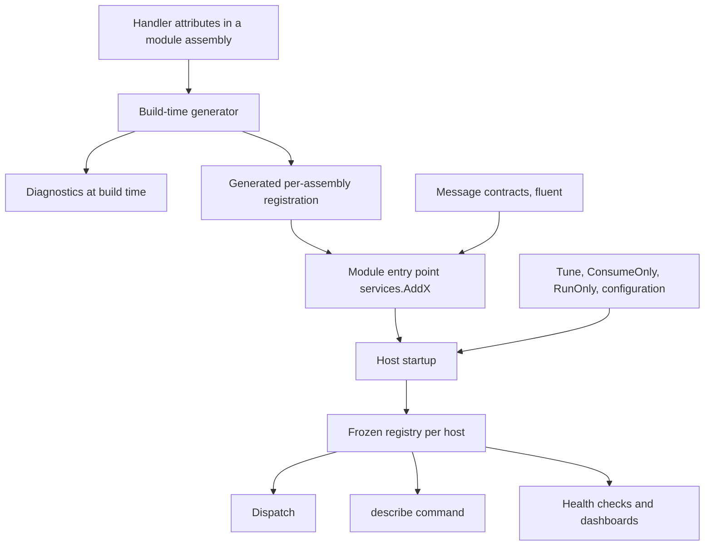

# Handler Declaration and Registration - Plan

## Goal Capsule

- **Objective:** A developer declares a message consumer or a job once, next to its code, and a host composes modules without naming groups, scanning assemblies, or knowing module internals. Registration mistakes surface at build time or at startup, never in production.
- **Means:** attributes declare handlers, each assembly gets generated registration, and flat fluent calls cover message contracts, deployment tuning, and host controls.
- **Product authority:** the framework maintainer. The repository is greenfield, so the public API breaks without compatibility shims. This plan owns the declaration and registration shape of Messaging and Jobs. Generator internals, every-instance delivery semantics (#936), and the contents of the shared failure policy model are separate work.
- **Open blockers:** none.

---

## Product Contract

### Summary

Message consumers and jobs declare themselves with attributes on their handler types: `[BusConsumer]`, `[QueueConsumer]`, `[EveryInstanceConsumer]`, and `[Job]`. Each module exposes one `services.AddX()` entry point that calls its generated per-assembly registration and declares its message contracts. Hosts tune handlers by identity and choose which host consumes or runs what. The consumer identity becomes the broker subscription name, which removes groups and `UseApplicationId`.

### Problem Frame

Messaging registers a consumer through three nested lambdas, `setup.Bus.ForMessage<T>(m => m.Consumer<C>(c => ...))`, and discovers scanned consumers with reflection at startup. The broker subscription name comes from a group that defaults to `{ApplicationId}.{HandlerId}.{Version}`. `ApplicationId` defaults to the entry assembly name and `HandlerId` to CLR type names, so renaming a class or a host assembly silently moves broker subscriptions. Users must also keep a `ConsumerIdentity` for the inbox, a group for the broker, and a handler ID for diagnostics.

Jobs takes the opposite approach. `[JobFunction]` on a method declares the job, a source generator validates it with 21 rules and registers it, and `AddJobsDiscovery` forces module initializers through `Assembly.Load`. The two subsystems therefore declare handlers differently, name identity differently, and place failure policy at different levels.

In a modular monolith, one process hosts several modules. The group model ties competition to the process. Extracting a module into its own service renames its broker subscriptions unless it keeps the monolith's application ID forever. Framework packages such as HybridCache and distributed locks already register consumers through an internal, order-independent contribution API that applications and modules cannot use.

### Registration at a glance

```csharp
// Handlers declare themselves
[BusConsumer(Identity, Policy = typeof(PaymentsPolicy))]
public sealed class InvoiceProjection : IConsume<InvoiceIssued>, IConsume<OrderPlaced>
{
    public const string Identity = "billing.invoice-projection";
}

[EveryInstanceConsumer("billing.price-cache")]
public sealed class PriceCacheRefresher : IConsumeOnEveryInstance<PriceChanged> { }

[Job("billing.close-day", Cron = "0 0 * * *", TimeZone = "Africa/Cairo")]
public sealed class CloseDay : IJob { }

public static class Reports
{
    [Job("reports.daily", Cron = "0 6 * * *")]
    public static Task RunAsync(JobFunctionContext context, CancellationToken ct) => Task.CompletedTask;
}

// Module entry point
public static IServiceCollection AddBilling(this IServiceCollection services)
{
    services.ConfigureMessaging(m =>
    {
        m.AddBillingConsumers();                                    // generated for this assembly
        m.Message<InvoiceIssued>("billing.invoice-issued", version: "1");
    });
    services.ConfigureJobs(j => j.AddBillingJobs());                // generated for this assembly
    return services;
}

// Host
services.AddHeadlessMessaging(m => m.UseRabbitMq(...).UsePostgreSql(...).ConsumeOnly("billing.*"));
services.AddHeadlessJobs(j => j.UsePostgreSql(...));
services.AddBilling().AddOrders();
services.ConfigureMessaging(m => m.Tune(InvoiceProjection.Identity, c => c.Concurrency(16)));
```

Names in this example show the shape. Planning fixes the final member names.



### Key Decisions

- **Attributes declare handlers, and fluent calls only tune them.** The attribute pipeline is the simplest generator input, and it matches the Jobs generator rebuild. (session-settled: user-directed — chosen over flat fluent registration generated through interceptors and over attributes only: interceptors add opt-in, call-site encoding, and a runtime fallback for no benefit when handlers are types.) Governs R1, R4, R14, R18.
- **Method-level `[Job]` stays alongside class jobs.** Static-method jobs keep working. (session-settled: user-directed — chosen over class jobs only: existing static-method jobs keep their shape.) Governs R4.
- **The consumer identity is the broker subscription name, and `UseApplicationId` is removed.** (session-settled: user-directed — chosen over one required application ID per host and over module-scoped application IDs: a module moves between processes without renaming broker objects.) Governs R7, R8.
- **Modules own their registration through public, order-independent contributions.** (session-settled: user-approved — chosen over builder extensions the host calls once per subsystem and over a framework module interface: a module owns its registration end to end, and the framework stays unopinionated.) Governs R10, R11, R12.
- **Hosts tune by identity and filter what runs.** (session-settled: user-approved — chosen over tuning only: API and worker hosts that share modules need to split consumption.) Governs R18, R19, R20.
- **A handler names its failure policy as a type in its attribute.** (session-settled: user-directed — chosen over a policy name string and over tuning only: a typo fails the build, and the policy lives with the handler it describes.) Governs R6.
- **A message contract is declared once for both lanes.** The contract belongs to the message schema, as `docs/llms/messaging.md` already states. (session-settled: user-directed — chosen over one contract per lane: one name per message.) Governs R15.
- **Message types carry no Headless attribute.** NServiceBus's recorded regret was marker types that tied message assemblies to the framework version. (session-settled: user-approved — chosen over a contract attribute on message types: contract packages stay framework-free.) Governs R16.
- **Middleware for one handler attaches through tuning.** (session-settled: user-approved — chosen over an attribute and over both: middleware is resolved from DI and often deployment-specific.) Governs R18, R21.
- **Every-instance delivery is declared by the consumer's interface and a Bus-only attribute.** This carries the #936 decision into the attribute shape. (session-settled: user-approved — chosen over a registration flag: the delivery guarantee belongs to the handler's code.) Governs R1, R3.

### Requirements

**Declaring handlers**

- R1. A message consumer is declared by exactly one lane attribute on its class: `[BusConsumer(identity)]`, `[QueueConsumer(identity)]`, or `[EveryInstanceConsumer(identity)]`, and every-instance consumers exist only on the Bus lane.
- R2. The messages a consumer handles are exactly the `IConsume<T>` or `IConsumeOnEveryInstance<T>` interfaces its class implements, with no separate message list.
- R3. `[EveryInstanceConsumer]` requires `IConsumeOnEveryInstance<T>`, the Bus and Queue attributes require `IConsume<T>`, and a class that implements both kinds for the same message is rejected.
- R4. A job is declared by `[Job(identity)]` on a class that implements `IJob` or `IJob<TArgs>`, or on a static method, and `[JobFunction]` is removed.
- R5. A job attribute carries the job's intrinsic defaults: cron expression and time zone, priority, maximum concurrency, contract version, and missed-run policy.
- R6. Any handler attribute may name a failure policy type that implements `IFailurePolicy`, which is the declaration level of the shared call, then declaration, then host resolution order.

**Identity**

- R7. Every consumer and job identity has the form `owner.name`, is at most 200 characters, and names the owning module or service in its first segment.
- R8. A consumer's identity is its broker subscription name: competing consumers with the same identity compete in whatever process registers them, and every-instance consumers derive a per-process name from it. `UseApplicationId`, `MessagingConventions.DefaultGroup`, `MessagingOptions.DefaultGroupName`, `GroupNamePrefix`, `Group()`, and `HandlerId` are removed.
- R9. Consumer identities are unique per lane and job identities are unique per host across all registered modules, and a duplicate fails the build within one assembly and fails startup across assemblies with both sources named.

**Registration and modules**

- R10. Each assembly that declares handlers gets one generated registration method per subsystem, and `ForConsumersFromAssembly`, `ForConsumersFromAssemblyContaining`, and `AddJobsDiscovery` are removed.
- R11. Public `services.ConfigureMessaging(...)` and `services.ConfigureJobs(...)` accept contributions before or after `AddHeadlessMessaging` and `AddHeadlessJobs`, and framework packages use the same API in place of the internal `AddFrameworkConsumerRegistration`.
- R12. Contributing the same handler twice with identical declarations is harmless, and a conflicting contribution for the same identity fails at startup.
- R13. Registration freezes into one immutable registry per host at startup, and dispatch, the `describe` command, health checks, and dashboards read only that registry.
- R14. No fluent call declares a handler, and the nested `setup.Bus.ForMessage<T>(m => m.Consumer<C>(c => ...))` shape is removed.

**Message contracts**

- R15. A message contract is declared once with `Message<T>(name, version)` and applies to both lanes, with correlation and lane-specific settings such as routing affinity and delivery mode chained on it.
- R16. Declaring a contract never requires an attribute on the message type or a Headless reference in the assembly that defines it.
- R17. Identical contract declarations from several modules merge, and conflicting names or versions for one message type fail at startup.

**Tuning and host control**

- R18. `Tune(identity, ...)` changes only a declared handler's deployment settings: concurrency, provider settings, a failure policy override, and middleware. It cannot create a handler or change its identity, kind, lane, or messages, and an unknown identity fails startup.
- R19. The same deployment settings bind from configuration keyed by identity.
- R20. `ConsumeOnly(...)` and `RunOnly(...)` choose which consumers consume and which jobs run in a host, and handlers outside the filter stay registered so the host can still publish and schedule them.
- R21. Global and per-message middleware remain, and middleware keyed by group and lane is removed.

**Referencing handlers**

- R22. Scheduling code references a job by its handler type or by a generated typed reference, never by a raw string alone.

**Build-time and startup checks**

- R23. The generator reports at build time:
  - an identity that is not a compile-time constant, or not in `owner.name` form;
  - a duplicate identity in the assembly;
  - an attribute on a type that lacks the matching interface;
  - one class implementing both consumer kinds for the same message;
  - an invalid literal cron expression;
  - an unsupported job method parameter;
  - a policy type that does not implement `IFailurePolicy`.
- R24. Every diagnostic follows the shared diagnostic ID scheme, with resx text and a help link.
- R25. Dispatch runs generated, typed code, with no `MakeGenericType`, runtime assembly scanning, or compiled expressions.

### Key Flows

- F1. A module declares and contributes its handlers
  - **Trigger:** a module author adds a consumer or a job.
  - **Steps:** the author adds the attribute and implements the interface; the build validates the declaration and regenerates the assembly's registration; the module's `AddX()` entry point already calls that registration, so no host change is needed.
  - **Covered by:** R1, R2, R4, R10, R23
- F2. A host composes modules and splits work
  - **Trigger:** an operator deploys an API host and a worker host from the same modules.
  - **Steps:** both hosts call the same module entry points; the worker registers no filter; the API host limits consumption with `ConsumeOnly` and job execution with `RunOnly`; startup freezes each host's registry and validates identities, tuning, and contracts.
  - **Outcome:** the API host publishes and schedules but does not consume or run the filtered handlers.
  - **Covered by:** R11, R13, R20
- F3. A module moves out of the monolith
  - **Trigger:** the billing module becomes its own service.
  - **Steps:** the new service calls `AddBilling()` and the shared contracts it consumes; the monolith stops calling it.
  - **Outcome:** broker subscription names do not change, because they come from the consumer identities.
  - **Covered by:** R8, R15, R17

### Acceptance Examples

- AE1. **Covers R9.** **Given** the orders and billing modules both declare a Bus consumer `billing.invoice-projection`, **when** a host adds both modules, **then** startup fails with an error that names both assemblies.
- AE2. **Covers R8.** **Given** a consumer `billing.invoice-projection` running in the monolith, **when** the billing module moves to its own service with the same identity, **then** the broker subscription name is unchanged.
- AE3. **Covers R20.** **Given** the API host calls `AddBilling()` with `ConsumeOnly("orders.*")`, **when** an `InvoiceIssued` message is published, **then** only worker hosts consume it, and the API host can still publish it.
- AE4. **Covers R18.** **Given** `Tune("billing.unknown", ...)`, **when** the host starts, **then** startup fails and names the unknown identity.
- AE5. **Covers R3.** **Given** a class that implements `IConsume<PriceChanged>` and `IConsumeOnEveryInstance<PriceChanged>`, **when** the project builds, **then** the build fails at that class.
- AE6. **Covers R17.** **Given** two modules that both reference a contracts package declaring `Message<OrderPlaced>("orders.placed", "1")`, **when** a host adds both, **then** the declarations merge and startup succeeds.
- AE7. **Covers R4, R23.** **Given** a static method `[Job]` that takes an `IServiceProvider` parameter, **when** the project builds, **then** the build fails at that parameter.

### Scope Boundaries

- The generator pipeline, emit strategy, and incremental caching belong to the Jobs generator rebuild and the Messaging generator issue. This plan defines only their input shape and checks.
- Every-instance delivery semantics, provider mapping, and cleanup belong to #936.
- The contents of the shared failure policy model (tiers, classification, terminal actions) belong to its own issue. This plan fixes only where a handler declares it.
- `IRuntimeSubscriber` keeps registering handlers at run time. Its subscriptions are always every-instance, per #936.
- There is no migration path or compatibility layer for the removed APIs. The `docs/llms/` guides change with the code.
- Not planned: interceptor-based fluent registration, lambda jobs, and attributes on message types.

<!-- x-section: work-relationships -->
### How This Work Fits Together

This plan owns the declaration and registration shape of Messaging and Jobs. The surrounding breakdown is the current understanding, not a committed roadmap.

- Jobs generator rebuild: this plan depends on it for the incremental attribute pipeline and the generated per-assembly registration pattern.
- Messaging source generator: this plan enables it. The attributes defined here are its input.
- Shared diagnostic ID scheme: this plan depends on it for R24.
- Shared failure policy model: shares the `IFailurePolicy` type and the resolution order that R6 declares into.
- Every-instance delivery (#936): shares the identity rule. Its subscription naming follows R8.
- `describe` command and health checks: enabled by the frozen registry in R13.
- Dead-letter destination, job metrics, and other roadmap items: can proceed independently of this plan.

### Dependencies / Assumptions

- The Jobs generator rebuild lands first, or together with this work, because both generators share one infrastructure.
- Because identities are global broker names, separate systems and environments on one broker are isolated by the broker's namespace (virtual host, namespace, tenant, or key prefix). This is an assumption, and planning confirms that every provider offers one.
- Identities up to 200 characters exceed some broker name limits, for example Azure Service Bus subscription names. Providers shorten long names deterministically.

### Outstanding Questions

**Deferred to Planning**

- How the generated registration method is named per assembly, and how a module author picks the name.
- The deterministic shortening rule for identities that exceed a provider's name limit, shared with #936.
- Whether `ConsumeOnly` and `RunOnly` take patterns, explicit identity lists, or both.
- The configuration section shape for tuning by identity.
- Whether static-method jobs keep a generated typed catalog like today's `AppJobs`, and what its members are named.
- How a consumer declares support for more than one contract version of a message.

### Sources / Research

- `src/Headless.Messaging.Core/Registration/MessageRegistrationBuilders.cs:107-156`: `ForMessage` and assembly-scanning roots.
- `src/Headless.Messaging.Core/Registration/ConsumerBuilders.cs:82-112`: `Group`, `Concurrency`, `HandlerId`, `ConsumerIdentity`, `InboxRetention`, `WithCircuitBreaker`.
- `src/Headless.Messaging.Abstractions/MessagingConventions.cs:32-161` and `src/Headless.Messaging.Core/Configuration/MessagingOptions.cs:42-57,573-586`: application ID, default group, and group resolution.
- `src/Headless.Messaging.Core/ConsumerMetadata.cs:35`: the 200-character identity limit.
- `src/Headless.Messaging.Core/Configuration/MessagingBuilder.cs:182`: middleware keyed by group and lane.
- `src/Headless.Jobs.Abstractions/Base/JobFunctionAttribute.cs:25-123`, `src/Headless.Jobs.Core/DependencyInjection/JobsDiscoveryExtension.cs:24`, `src/Headless.Jobs.Core/JobsOptionsBuilder.cs:31-88`, `src/Headless.Jobs.SourceGenerator/JobsIncrementalSourceGenerator.cs:362`: the current Jobs declaration, discovery, per-function policy, and `AppJobs` catalog.
- `src/Headless.Caching.Hybrid/HybridCacheInvalidationConsumerRegistration.cs:65` and `src/Headless.DistributedLocks.Core/RegularLocks/DistributedLockConsumerRegistration.cs:34`: internal framework contributions.
- `CONCEPTS.md`, "Verb-conveyed lane model": lanes are chosen by the publishing verb.
- NServiceBus message conventions and the `NServiceBus.MessageInterfaces` package: the marker-coupling lesson behind R16. NServiceBus 10.2 convention handlers: explicit, source-generated registration kept alongside attributes.
