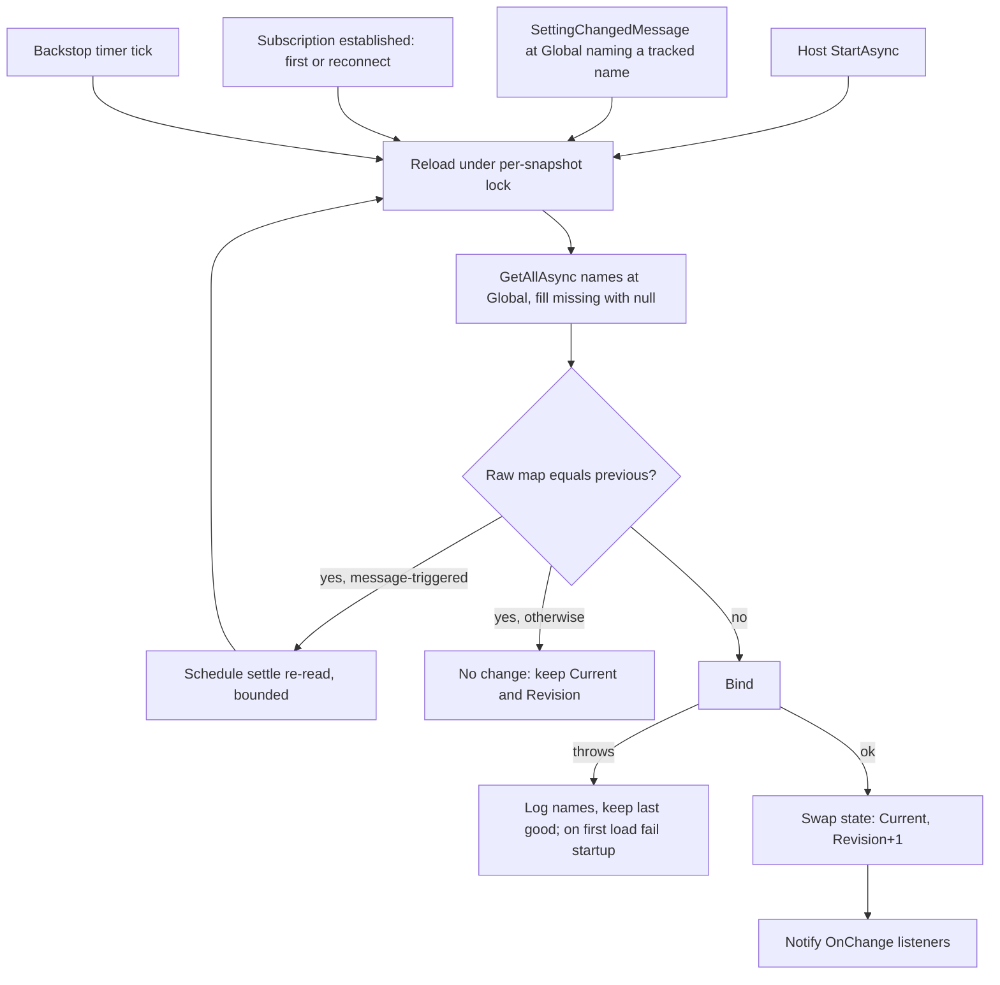

# Typed Settings Snapshot - Plan

## Goal Capsule

- **Objective:** An application reads an operator-tunable policy built from Global settings as a typed in-memory value that every replica refreshes after a write, without writing its own consumer, poller, or revision logic, and without the policy's revision moving when nothing changed.
- **Means:** `AddSettingsSnapshot<T>` and `ISettingsSnapshot<T>`, refreshed by one framework every-instance consumer of `SettingChangedMessage` plus a timer backstop (KTD1, KTD3, KTD5).
- **Authority hierarchy:** Issue #943 body (user-approved design) > this plan's KTDs > existing patterns in `src/Headless.Caching.Hybrid` and `src/Headless.Settings.Core`.
- **Stop conditions:** Stop and report if the generated `MessagingModule` cannot be produced in `Headless.Settings.Core`, or if a settled decision proves infeasible.
- **Execution profile:** `src/Headless.Settings.Abstractions`, `src/Headless.Settings.Core`, `tests/Headless.Settings.Tests.Unit`, `docs/llms/settings.md`. Closes #943.

---

## Product Contract

### Summary

Add a settings-backed snapshot to the settings family. A host declares the Global setting names a typed record is built from and a bind function. The framework loads it at host start, holds it as singleton state with a revision, reloads it when `SettingChangedMessage` names one of its settings, reloads it on every subscription establishment, and re-reads it on a timer as a backstop. The revision changes only when a resolved raw value changes.

### Problem Frame

`SettingManager` announces every write with `SettingChangedMessage`, and nothing in `src/` consumes it. Each application that wants one live, operator-tunable value rebuilds the same stack: a holder, a revision, a consumer, a poller, and a startup load. Each copy can get three rules wrong: it filters on `OriginHostName`, it bumps the revision on every poll (resetting consumers keyed on it, such as rate-limit partitions), or it reloads a stale hybrid-cache L1 value when `SettingChangedMessage` overtakes the peer's `CacheInvalidationMessage`.

### Requirements

**Contract**

- R1. A host registers a snapshot with `AddSettingsSnapshot<T>` naming a non-empty set of setting names, a bind function from the resolved `name -> string?` map to `T`, and an optional backstop interval (default one minute).
- R2. `ISettingsSnapshot<T>` exposes `Current`, `Revision`, and `OnChange(listener)` returning an `IDisposable` that unsubscribes.
- R3. The snapshot resolves values at Global scope only, with the normal fallback to the definition default; a tenant or user value never shadows it.

**Load and revision**

- R4. The first load runs at host start; a failure there, including an undefined setting name, fails host startup.
- R5. A reload whose resolved raw map equals the previous one does not call bind, does not replace `Current`, and does not change `Revision`.
- R6. A reload whose raw map differs calls bind, replaces `Current`, increments `Revision` by one, and then notifies `OnChange` listeners.
- R7. A bind exception after the first load keeps the previous `Current` and `Revision` and logs the setting names; it never logs values.
- R8. A listener exception is logged and neither stops other listeners nor undoes the swap.

**Refresh**

- R9. A `SettingChangedMessage` at Global naming a tracked setting reloads that snapshot on every replica, including the writer; the consumer never filters on `OriginHostName`.
- R10. A message at any other provider scope, or naming no tracked setting, reloads nothing.
- R11. Every subscription establishment, first or reconnect, reloads every snapshot.
- R12. A message-triggered reload that does not observe a change to the names that message announced re-reads a bounded number of times over a few seconds, so a peer whose cache invalidation arrives after the announcement still converges on that announcement.
- R13. A timer re-reads every snapshot at its backstop interval, with jitter, whether or not messaging is configured.

**Docs**

- R14. `docs/llms/settings.md` documents the snapshot with a worked example, states the origin, revision, and cache-ordering rules, its transport requirement, and corrects the hand-written consumer example.

### Key Decisions

- **Global scope only.** (session-settled: user-approved — chosen over tenant- or user-keyed snapshots: a single `Current` has no meaning per tenant, and keyed snapshots need their own eviction design.) Governs R3.
- **Revision compares raw values; bind is `values => T`.** (session-settled: user-approved — chosen over revision from `T` equality with `Bind(values, previous)`: a record holding a collection compares by reference and would bump the revision on every reload.) Governs R5, R6.
- **Bind failure keeps the last good value; first-load failure fails startup.** (session-settled: user-approved — chosen over swallowing to a default or loading lazily: a process must not serve on a policy it never read, and one bad operator value must not take a running process down.) Governs R4, R7.
- **No `OriginHostName` filter.** (session-settled: user-approved — chosen over self-filtering like `CacheInvalidationMessage`: the writing process holds copies too.) Governs R9.
- **Feature and permission-grant snapshots are out of scope.** (session-settled: user-approved — chosen over one builder for all three messages: different value shapes and no consumer yet.)

### Scope Boundaries

- Tenant- and user-scoped snapshots: out of scope.
- `FeatureChangedMessage` and `PermissionGrantChangedMessage` snapshots: out of scope.
- A cache-bypass or local-eviction API on `ICache`, `ISettingValueStore`, or `ISettingManager`: not added (KTD4).
- A distributed "values changed" stamp: not added (KTD5).

### Deferred to Follow-Up Work

- A hybrid-cache integration test of the cross-topic ordering race in `tests/Headless.Settings.Tests.Integration`: no hybrid fixture exists there today; R12 is proven in unit tests with a substituted manager.

### Assumptions

- `IsInherited = false` settings resolve from Global only, with no fallback to configuration or default (`SettingManager.cs` head-provider path). The snapshot inherits that behavior and the docs state it.
- Values written by direct `ISettingValueRecordRepository` writes are never announced and never evict the setting cache, so they become visible only after the cache entry expires (`ValueCacheExpiration`, default 5 hours); the backstop then picks them up. Configuration-provider values are read live, so the backstop catches them at its next tick.
- Cross-replica convergence needs a shared (Redis) or hybrid setting cache. With a process-local cache (`UseInMemory`) each replica's cache learns only its own writes, so a message, settle re-read, or backstop on another replica reads its stale copy until expiry; this is existing settings behavior the snapshot inherits.

---

## Planning Contract

### Key Technical Decisions

- KTD1. **The consumer is a `[BusConsumer]` in `Headless.Settings.Core`, contributed only by `AddSettingsSnapshot`.** It follows `HybridCacheInvalidationConsumer` and `DistributedLockConsumerRegistration`: `Headless.Settings.Core` gains references to `Headless.Messaging.Core` and the `Headless.Messaging.SourceGenerator` analyzer, and a `ConfigureMessaging` contribution adds the generated `Headless.Settings.Core.MessagingModule` (the generator names the module's namespace after the assembly; referenced as `Core.MessagingModule` from `Headless.Settings`, as `DistributedLockConsumerRegistration` does). The contribution is inert without `AddHeadlessMessaging`. Contributing it from `AddSettingsSnapshot` rather than `AddHeadlessSettings` keeps settings hosts on AWS SNS/SQS or without every-instance support starting as before; only a host that opts into a snapshot takes the every-instance requirement. `IRuntimeSubscriber` was rejected because runtime subscriptions get no `IOnSubscriptionEstablished` hook (`docs/llms/messaging.md`, every-instance section). Cost: every settings host takes `Headless.Messaging.Core` transitively, as hybrid-cache and distributed-lock hosts already do. (session-settled: user-approved — chosen over self-filtering consumers and per-app consumers: one framework consumer serves every snapshot, following `HybridCacheInvalidationConsumer`.) Governs R9, R10.
- KTD2. **Reload on every establishment, not only on `IsReconnect`.** The first load runs in `StartAsync`, and the messaging bootstrapper's subscription goes live later, so a write in between would wait for the backstop. `HybridCacheInvalidationConsumer` flushes on the first establishment for the same reason. Conflict call-out: the settled brief said "reloads on IsReconnect"; this is a superset that costs one read per snapshot at startup. Governs R11.
- KTD3. **Snapshot state is one immutable pair swapped atomically; reloads are serialized per snapshot.** `Current` and `Revision` live in one immutable state object behind a volatile reference so a reader never sees a new value with an old revision. A per-snapshot `SemaphoreSlim` serializes the consumer, establishment hook, settle re-reads, and timer, so `Revision` never moves backward. `Current` before the first load throws `InvalidOperationException`. Governs R2, R5, R6.
- KTD4. **The cache race is closed with bounded settle re-reads, not a cache bypass.** `ICache` exposes no local-only read or evict, and `RemoveAsync` on a hybrid would evict L2 and broadcast. A direct repository read would duplicate provider resolution, decryption, and default fallback. Instead, a message-triggered reload whose announced names did not change, and an establishment-triggered reload that saw no change, schedule a few further re-reads on `TimeProvider` (for example 0.5 s, 2 s, 5 s). A message's settle chain stops once its announced names change; an establishment's chain stops at any change. Settle re-reads carry their own reason and never schedule further re-reads. The establishment case exists because `HybridCacheInvalidationConsumer` flushes L1 in its own establishment hook, in no defined order against the snapshot's hook (R11). A same-value write also takes the retries; each is an idempotent cached read. Residual: if the peer's invalidation never arrives, the hybrid's own reconnect flush or L1 expiry bounds staleness, and the backstop picks it up. Governs R12.
- KTD5. **The backstop is a re-read through `ISettingManager`, not a distributed stamp.** Reads are served by the setting cache, so a periodic re-read is cheap. A stamp would live in the same `ICache`, see the same L1 lag, and add a write-path change. (session-settled: user-approved — chosen over a Jobs cron: `Headless.Settings.Core` must not depend on Jobs, and the refresh is per-process.) Jitter of about ±10% keeps replicas from reading in lockstep. Governs R13.
- KTD6. **One internal registry and one hosted service serve every snapshot.** `AddSettingsSnapshot<T>` registers the typed snapshot as a singleton, adds it to a registry (`TryAddEnumerable`), and registers the hosted service once. The hosted service loads every snapshot in `StartAsync` (after every `StartingAsync` hook, so the relational schema runner has created the tables) and throws on failure, then runs the backstop loop on `PeriodicTimer` with the injected `TimeProvider` at the smallest due interval. Pattern: `src/Headless.Tus/TusExpiredUploadsCleanupService.cs`. Governs R4, R13.
- KTD7. **The resolved map holds every tracked name.** `ISettingManager.GetAllAsync(names, Global, null, fallback: true)` drops undefined names and null values, so the snapshot fills each tracked name, `null` when absent, with an ordinal comparer. The first load checks every name against `ISettingDefinitionManager` and fails startup naming the undefined ones. Governs R1, R4.
- KTD8. **`ISettingsSnapshot<T>` lives in `Headless.Settings.Abstractions`; everything else in `Headless.Settings.Core`.** The interface sits beside `ISettingManager` in namespace `Headless.Settings.Values`, so consuming code depends only on Abstractions. The registration extension goes in the `SetupSettings` extension block (`src/Headless.Settings.Core/Setup.cs`) in the family root, per `docs/solutions/conventions/namespace-policy.md`. It takes one `Action<builder>` overload, per the cross-cutting consumer rule in `docs/solutions/conventions/provider-setup-and-options.md`. Governs R1, R2.

### High-Level Technical Design

Caller usage the design starts from:

```csharp
services.AddHeadlessSettings(setup => setup.UsePostgreSql(...));
services.AddSettingsSnapshot<HttpRateLimitPolicy>(snapshot => snapshot
    .Names(RateLimitSettings.PublicPerMinute, RateLimitSettings.AuthenticatedPerMinute)
    .Bind(values => HttpRateLimitPolicy.From(values))
    .Backstop(TimeSpan.FromMinutes(1)));

public sealed class RateLimitPartitioner(ISettingsSnapshot<HttpRateLimitPolicy> policy)
{
    // policy.Current, policy.Revision
}
```

Refresh triggers and the reload path:



### Sequencing

U1 builds the snapshot core against a substituted `ISettingManager`. U2 adds registration and the hosted service. U3 adds the consumer and the messaging references. U4 documents. U2 depends on U1; U3 depends on U1 and U2; U4 depends on U3.

---

## Implementation Units

### U1. Snapshot contract and reload core

- **Goal:** `ISettingsSnapshot<T>` and the internal snapshot implementation with raw-value revision, bind-failure handling, listeners, settle re-reads, and serialized reloads.
- **Requirements:** R2, R3, R5, R6, R7, R8, R12; KTD3, KTD4, KTD7, KTD8.
- **Dependencies:** none.
- **Files:**
  - `src/Headless.Settings.Abstractions/Values/ISettingsSnapshot.cs` (new)
  - `src/Headless.Settings.Core/Snapshots/SettingsSnapshot.cs` (new; internal implementation and its `LoggerMessage` log class)
  - `tests/Headless.Settings.Tests.Unit/Snapshots/SettingsSnapshotTests.cs` (new)
- **Approach:**
  1. Define the interface with XML docs stating Global scope, revision semantics, and that `OnChange` runs after the swap.
  2. Implement reload as one method taking a reason (startup, message with its announced names, establishment, backstop, settle) so only message- and establishment-triggered results schedule settle re-reads, and settle re-reads never schedule more (KTD4).
  3. Use `TimeProvider` for settle delays; cancel pending settle work on disposal.
  4. Log through a source-generated `LoggerMessage` class, names only.
- **Patterns to follow:** `HybridCacheInvalidationConsumer` exception policy (rethrow `OperationCanceledException` when the token is canceled, log the rest); `DynamicSettingDefinitionStore` volatile swap.
- **Test scenarios:**
  - First load binds the resolved map and sets `Revision` to 1.
  - Reading `Current` before the first load throws `InvalidOperationException`.
  - A reload with identical raw values does not call bind and keeps `Revision` (bind spy asserts call count). Covers R5.
  - A reload with one changed value calls bind once, increments `Revision` by one, and notifies listeners with the new value and revision.
  - Bind returns a record holding a list; repeated identical reloads keep `Revision`.
  - The map passed to bind contains every tracked name, with `null` for a name the manager omitted.
  - Bind throws on a later reload: `Current` and `Revision` stay, an error is logged naming the settings, no value appears in the log.
  - One listener throws: the next listener still runs and `Current` is the new value.
  - A disposed `OnChange` subscription is not called again.
  - A message-triggered reload with no change re-reads after the first settle delay (advance `FakeTimeProvider`), picks up a changed value, bumps `Revision`, and stops further retries.
  - A message-triggered reload with no change and no later change performs exactly the bounded number of re-reads and no more.
  - A backstop-triggered reload with no change schedules no settle re-read.
  - An establishment-triggered reload with no change re-reads after the first settle delay and picks up a changed value.
  - Two messages for different tracked names arrive in sequence; at the second reload only the first name's new value is visible; the second name's value still lands through that message's settle re-reads, before any backstop tick.
  - Concurrent reloads (message plus backstop) never leave `Revision` lower than a value already observed.
- **Verification:** the unit tests pass with a substituted `ISettingManager` and `FakeTimeProvider`.

### U2. Registration and hosted lifecycle

- **Goal:** `AddSettingsSnapshot<T>` with its builder, the registry, startup load with name validation, and the jittered backstop loop.
- **Requirements:** R1, R4, R13; KTD5, KTD6, KTD7, KTD8.
- **Dependencies:** U1.
- **Files:**
  - `src/Headless.Settings.Core/Setup.cs` (add `AddSettingsSnapshot<T>` to the `SetupSettings` block)
  - `src/Headless.Settings.Core/Snapshots/SettingsSnapshotBuilder.cs` (new; public builder)
  - `src/Headless.Settings.Core/Snapshots/SettingsSnapshotRegistry.cs` (new; internal)
  - `src/Headless.Settings.Core/Snapshots/SettingsSnapshotHostedService.cs` (new; internal)
  - `tests/Headless.Settings.Tests.Unit/Snapshots/SettingsSnapshotRegistrationTests.cs` (new)
  - `tests/Headless.Settings.Tests.Unit/Snapshots/SettingsSnapshotHostedServiceTests.cs` (new)
- **Approach:**
  1. Validate the builder with `Headless.Checks`: at least one name, bind set, backstop greater than zero.
  2. Register the snapshot singleton for `ISettingsSnapshot<T>`, add it to the registry, register the hosted service once, and require `ISettingManager` the way `Setup.cs` requires `ICache<SettingValueCacheItem>`.
  3. A second `AddSettingsSnapshot<T>` for the same `T` fails at registration with a clear message.
  4. The hosted service loads every snapshot in `StartAsync`, checks names through `ISettingDefinitionManager`, and throws on failure; the loop then ticks on `PeriodicTimer` with the injected `TimeProvider`.
- **Patterns to follow:** `src/Headless.Tus/TusExpiredUploadsCleanupService.cs` loop; `src/Headless.MultiTenancy/TypedCurrentTenantInfo.cs` typed registration; `tests/Headless.Settings.Tests.Unit/Seeders/SettingsInitializationBackgroundServiceTests.cs` for hosted-service tests.
- **Test scenarios:**
  - Registering without names, without bind, or with a non-positive backstop throws at registration.
  - `ISettingsSnapshot<T>` resolves as the same singleton instance.
  - Registering the same `T` twice throws.
  - `StartAsync` loads every registered snapshot; a bind failure there propagates and fails start.
  - An undefined tracked name fails `StartAsync` with an exception naming it.
  - Advancing `FakeTimeProvider` past the backstop interval re-reads; a changed value bumps `Revision`. Covers R13.
  - Two snapshots with different intervals each re-read on their own schedule.
  - The loop survives a manager exception on a tick and re-reads on the next one.
  - `StopAsync` ends the loop without logging an error.
- **Verification:** tests pass; a host with settings but no messaging starts and refreshes by backstop alone (across replicas only with a shared or hybrid setting cache).

### U3. Every-instance change consumer

- **Goal:** the framework consumer of `SettingChangedMessage` routing to tracked snapshots, reloading on every establishment, contributed by `AddSettingsSnapshot`.
- **Requirements:** R9, R10, R11, R12; KTD1, KTD2.
- **Dependencies:** U1, U2.
- **Files:**
  - `src/Headless.Settings.Core/Headless.Settings.Core.csproj` (add `Headless.Messaging.Core` and the source-generator analyzer reference, with the precedent's comments)
  - `src/Headless.Settings.Core/packages.lock.json` and any lock file the reference change touches
  - `src/Headless.Settings.Core/Snapshots/SettingsSnapshotChangeConsumer.cs` (new; `[BusConsumer("headless.settings.snapshot", EveryInstance = true)]`, `IConsume<SettingChangedMessage>`, `IOnSubscriptionEstablished`)
  - `src/Headless.Settings.Core/Snapshots/SettingsSnapshotConsumerRegistration.cs` (new; `ConfigureMessaging` contribution)
  - `tests/Headless.Settings.Tests.Unit/Snapshots/SettingsSnapshotChangeConsumerTests.cs` (new)
  - `tests/Headless.Settings.Tests.Unit/Snapshots/SettingsSnapshotMessagingTests.cs` (new; `MessagingTestHarness` with the InMemory transport)
- **Approach:**
  1. Add the references, restore, and commit every changed `packages.lock.json` with them.
  2. The consumer ignores non-Global messages and messages naming no tracked setting; it never reads `OriginHostName`.
  3. The establishment hook reloads every snapshot regardless of `IsReconnect` (KTD2).
  4. Contribute the module from `AddSettingsSnapshot` only (KTD1); `AddHeadlessSettings` already declares the message contract.
- **Patterns to follow:** `src/Headless.Caching.Hybrid/HybridCacheInvalidationConsumer.cs`, `src/Headless.Caching.Hybrid/HybridCacheInvalidationConsumerRegistration.cs`, `tests/Headless.Caching.Hybrid.Tests.Unit/HybridCacheInvalidationConsumerTests.cs`, `tests/Headless.Settings.Tests.Unit/WireContracts/SettingChangedMessageContractTests.cs`.
- **Test scenarios:**
  - A Global message naming a tracked setting reloads that snapshot and not an unrelated one.
  - A message with `OriginHostName` equal to this host still reloads. Covers R9.
  - A message at `User` or `Tenant` scope naming a tracked setting reloads nothing.
  - A Global message naming only untracked settings reloads nothing.
  - The establishment hook with `IsReconnect = false` and with `IsReconnect = true` both reload every snapshot.
  - A reload failure inside the consumer is logged and not rethrown; a canceled token rethrows.
  - End to end on the InMemory transport: `SetAsync` at Global on a tracked name updates `Current` and `Revision` in the same process.
  - A host with `AddHeadlessSettings` and messaging but no `AddSettingsSnapshot` does not register the consumer.
- **Verification:** tests pass; `make check-layering` passes with the new reference.

### U4. Consumer documentation

- **Goal:** `docs/llms/settings.md` describes the snapshot and corrects the hand-written consumer.
- **Requirements:** R14.
- **Dependencies:** U3.
- **Files:** `docs/llms/settings.md`.
- **Approach:**
  1. Lead "Reacting to a change" with the snapshot and keep the hand-written consumer as the path for state the snapshot does not fit.
  2. Change the hand-written example to reload on every establishment and state the cache-ordering race with a settle re-read or backstop.
  3. Add an `### API and behavior` bullet, a `#### Snapshot` recipe under `### Setup and use`, the constraints (Global only, non-inherited settings, raw-value revision, last good on bind failure, startup failure, every-instance transport requirement, backstop, the shared-or-hybrid cache requirement for cross-replica convergence, and the cache-expiry delay for unannounced repository writes), and an Agent Rules bullet.
  4. Check every sample against the shipped API; `settings.md` is not compiled.
- **Patterns to follow:** `docs/authoring/AUTHORING.md` change routing and style.
- **Test expectation:** none -- documentation only; samples are checked by hand against the API.
- **Verification:** `make docs-check` passes; no README setup row changes, since `AddHeadlessSettings` stays the entry point.

---

## Verification Contract

| Gate | Command | Applies to |
|---|---|---|
| Unit tests | `make test-project TEST_PROJECT=tests/Headless.Settings.Tests.Unit/Headless.Settings.Tests.Unit.csproj` | U1–U3 |
| Affected tests | `make test-affected` | all |
| Layering | `make check-layering` | U3 |
| Docs | `make docs-check` | U4 |
| Final proof | `make verify-affected`; paste `artifacts/proof/<run>/summary.md` into the PR | all |
| Locked restore | restore in locked mode after the csproj change | U3 |

Integration suites are not required: no provider behavior changes, and the end-to-end path runs on the InMemory transport in the unit project.

## Definition of Done

- Every R1–R14 is met and covered by the scenarios above or by the docs change.
- `make verify-affected` passes with no compiler or analyzer findings; each suppression carries an inline reason.
- Every changed `packages.lock.json` is committed with the reference change.
- New public types carry XML docs and the copyright header.
- No abandoned-attempt code remains in the diff.
- The PR body closes #943 and names the `Headless.Messaging.Core` dependency KTD1 adds.
