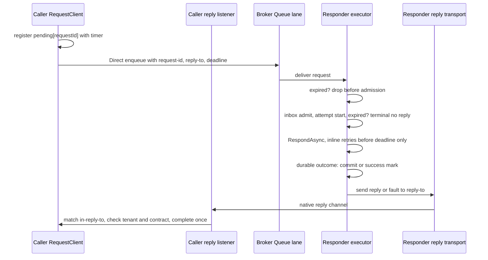
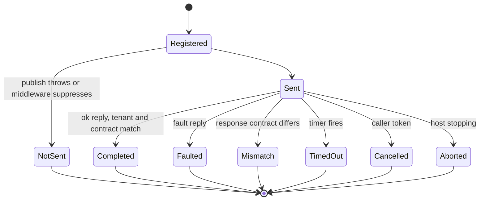
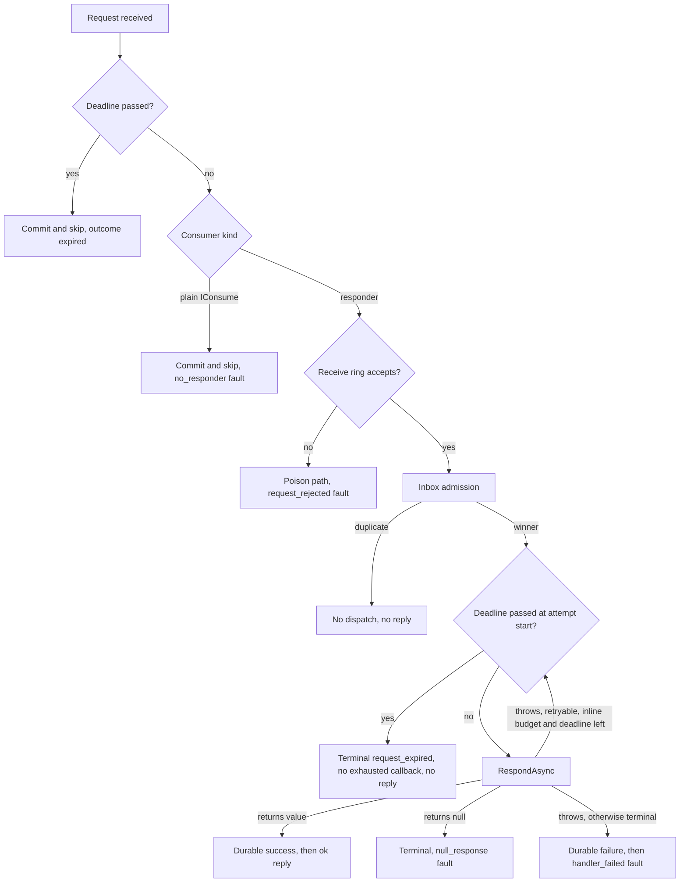

# Messaging Queue Request/Reply - Plan

## Goal Capsule

- **Objective:** An application can send a typed command to another service over its message broker and await one typed answer, getting a prompt, typed error for every way the call can fail instead of hanging or silently losing the answer.
- **Means:** Request/reply as an interaction on the existing Queue lane, with a per-provider native reply channel addressed to the calling process (KTD1, KTD2).
- **Authority:** GitHub issue #222 and its owner comment are the source of the requirements. The Key Decisions under Product Contract are binding. KTDs own mechanism. A unit never overrides an R or a KTD.
- **Stop conditions:** Stop and report if a supported provider cannot pass the shared conformance suite without changing a KTD. Stop if the reply-after-durable-outcome rule (R8) cannot be met on a storage tier. Never weaken a test to pass.
- **Execution profile:** Deep, cross-cutting change across Messaging Abstractions, Core, the source generator, four transport providers, the test harness, and docs. Integration suites need Docker.
- **Tail ownership:** The executor implements and verifies locally. The calling pipeline owns review, PR, and CI.

---

## Product Contract

### Summary

Add a typed request client that enqueues a request on the Queue lane and awaits one correlated response. A responder declares the request-to-response pair at compile time with a new responder interface. The responder's reply returns over a native, per-process reply channel that each provider implements, and providers that cannot offer one reject the configuration at startup.

### Problem Frame

Messaging offers fire-and-forget Bus callbacks: a consumer's return value is published durably to a named Bus message, and nobody awaits it. Applications that need an answer to continue (a quote, a validation result, a reservation) have no supported way to wait for one, so they fall back to HTTP between services or build ad-hoc correlation on top of callbacks. Issue #222 raised this as a P1 goal of the Messaging redesign once #1048 introduced consumer identities, `[QueueConsumer]` exactly-one ownership, and versioned contracts.

Every competitor that supports awaited request/reply loses the awaiting caller on restart and hands at-least-once handlers an ambiguous timeout. The value is in making each failure mode explicit and fast, not in pretending the round trip is durable.

### Requirements

**Interaction contract**

- R1. A caller sends a typed request on the Queue lane and awaits exactly one typed response through one client call. No third messaging lane exists.
- R2. A responder declares its request and response types at compile time. The source generator rejects invalid responder declarations with diagnostics.
- R3. At most one reply completes a call. Late, duplicate, unknown, and foreign-tenant replies are dropped and counted.
- R4. A call ends in exactly one typed outcome: the response, a timeout, a remote fault carrying a code, a response contract mismatch, a request that was never sent, or a request abandoned because the requester stopped. Only the caller's own cancellation surfaces as `OperationCanceledException`. It never returns null.

**Timing and failure**

- R5. Every request has a finite timeout, with a host default of 30 seconds. Caller cancellation ends only the wait; work the responder already accepted continues.
- R6. A request carries a deadline. The responder does not start or restart work for an expired request, sends no reply for it, and does not raise the exhausted-retry callback for it.
- R7. A request retries only inline and only before its deadline. A request that fails terminally before its deadline gets a fault reply.
- R8. A reply leaves the responder only after the handler's outcome is durable, and only from the attempt whose state write took effect.
- R9. A reply reaches only the calling process. A restarted caller can never receive a reply to a request its previous incarnation sent. A dead caller leaves no broker objects behind.
- R10. A fault reply carries a stable code. Exception type and message cross the boundary only when the responder host opts in.

**Integrity**

- R11. Replies correlate by a framework-owned request id. A caller cannot override the request's message id, and every new header is reserved.
- R12. The request carries the caller's tenant, the reply carries the request's tenant, and the caller rejects a reply whose tenant differs.
- R13. Requests pass through the existing Queue publish and consume middleware, and trace context links the request span to the reply span.

**Providers and hosting**

- R14. A provider supports request/reply only when it declares the capability and passes the shared request/reply conformance suite. A caller or responder host on any other provider fails at startup, before readiness.
- R15. Only hosts that enable requests create a reply channel.

**Interaction rules**

- R16. A request rejects callback names, delay, scheduling, and durable delivery. A responder cannot publish a callback response. A responder reached by a plain enqueue runs and discards its result.
- R17. Sending a request from inside a transactional inbox unit throws.
- R18. A request that reaches a plain `IConsume<T>` consumer is not handed to that consumer: the responder host commits and skips it and sends a `no_responder` fault, so that fault always means no work ran.

**Documentation**

- R19. `docs/llms/messaging.md` distinguishes request/reply from Bus callbacks, lists provider support, and states that the caller's continuation is at-most-once and a timeout is ambiguous.

### Key Decisions

- **Queue lane, not a new lane.** Requests are Queue messages, so "exactly one consumer" already defines whose reply counts. (session-settled: user-directed — chosen over a dedicated request/reply lane or Bus-lane requests: Queue already guarantees exactly one consumer per message.) Governs R1.
- **Bus callbacks stay.** The existing `CallbackName`/`SetResponse` flow remains the fire-and-forget option and the docs contrast the two. (session-settled: user-directed — chosen over removing callbacks in this change: callbacks serve callers that do not await.) Governs R16, R19.
- **Conformance or startup rejection per provider.** No provider ships best-effort request/reply. (session-settled: user-directed — chosen over silent best-effort on brokers without a clean reply mechanism: runtime surprises are worse than a startup error.) Governs R14.
- **Supported in this change: InMemory, RabbitMQ, NATS, Redis.** Azure Service Bus and Pulsar reject at startup until their reply channels land as follow-up work. Kafka and AWS reject permanently: Kafka has no per-process addressing short of a partition per instance, and AWS has no .NET temporary-queue client and bills queue churn. Governs R14.

### Scope Boundaries

- Request/reply is an awaited interaction for latency-tolerant commands, not a durable workflow. Durable multi-step coordination stays with jobs and future sagas.
- The caller's pending state is in-process only. No persisted caller state, no reply recovery across caller restarts.
- One response type per responder. No alternate response types and no accepted-types negotiation.
- No user Bus publish or consume middleware runs on replies.

#### Deferred to Follow-Up Work

- Azure Service Bus reply channel (rule-filtered or session-based reply entity) and its conformance run against a real namespace.
- Pulsar reply channel (non-persistent topic with producer eviction).
- Per-consumer failure policy and dead-letter destination (#1049); request retry rules align with it when it lands.
- Tenant propagation on the Queue lane generally (today both the tenant publish and consume middleware are Bus-only). This change covers request/reply only, through KTD13.
- Mapping the deadline to native broker TTL (RabbitMQ `expiration`, Service Bus `TimeToLive`).
- A `Response<T>` result that exposes reply headers, alternate response types, and a per-process cap on pending requests.

### Sources

- Issue #222 and its owner comment; #1048 (consumer identities, `[QueueConsumer]`, contracts); #1049 (open failure policy); #1057 (declaration pipeline).
- Competitor teardowns: MassTransit and NServiceBus (`RequestId` header, per-process temporary reply address, required timeout, faults only after retries, late replies dropped, Kafka refused), Wolverine (per-node reply queue, `DeliverWithin` expiry discarded before the handler), Rebus.Async (reply to a shared input queue breaks with multiple instances), Brighter (blocking call returning null), CAP (callbackName only, no awaited reply), Dapr (request/reply is service invocation).
- Broker survey: RabbitMQ exclusive server-named reply queue; NATS core inbox subject, and JetStream capturing a request subject swallows the reply subject; Redis pub/sub for at-most-once replies; Azure Service Bus session reply queue; AWS has no .NET temporary-queue client; Kafka needs a reply partition per instance; Pulsar maintainers rejected built-in request/reply.

---

## Planning Contract

### Key Technical Decisions

- KTD1. **Request/reply is an interaction on the Queue lane.** A request is an ordinary Queue message with request headers; a reply is not a lane message at all. Instantiates the Queue-lane Key Decision (session-settled: user-directed — chosen over a dedicated lane: Queue already guarantees exactly one consumer per message). Governs R1.
- KTD2. **Each provider implements a native reply transport.** A new transport seam in Core lets a provider open a per-process reply listener that returns an opaque address, and send a reply to an address:
  - InMemory delivers in-process.
  - RabbitMQ declares an exclusive queue named under a reserved `headless.reply.` prefix and sends through the default exchange with the queue name as routing key.
  - NATS subscribes and publishes on core NATS, outside JetStream, on a subject under the reserved `headless.reply.` prefix.
  - Redis uses pub/sub on a per-process channel under the reserved reply prefix.

  Every address lives in a reserved reply namespace, and a reply transport sends only to an address inside it. A request naming any other destination gets no write, and the drop is logged and counted as `invalid_reply_address`. This keeps a forged request from turning a responder into a writer to arbitrary queues or streams with its broker credentials. RabbitMQ uses a client-chosen prefix rather than the server-generated `amq.gen-` names, because every-instance subscription queues share that prefix.

  Rejected: reusing every-instance Bus subscriptions with a per-process message name. On NATS it adds one subject per process to the shared stream (startup fails under the default verify mode), on Redis it leaves an uncapped stream key per process, on Pulsar responders cache a producer per reply topic forever, and replies would be written to broker storage. Rejected: one shared reply name filtered per process, because every process would receive every reply payload. Governs R9, R14.
- KTD3. **Responders implement `IRespond<TRequest, TResponse>`.** It returns `ValueTask<TResponse>` from `RespondAsync(ConsumeContext<TRequest>, CancellationToken)`, takes `[QueueConsumer]`, and registers through a new generator-only catalog call that carries the response type to the consumer descriptor. A responder counts as the message's Queue consumer for HM004. Rejected: a runtime `RespondAsync` on the context (MassTransit style), which gives no compile-time pairing. Rejected: an `IRequest<T>` marker on the request type, which collides with Mediator's `IRequest` when both namespaces are imported. Governs R2.
- KTD4. **Callers use `IRequestClient.RequestAsync<TRequest, TResponse>(request, RequestOptions?, CancellationToken)`.** `IRequestClient` and `RequestOptions` live in `Headless.Messaging.Queue.Abstractions` beside `IQueue`. `RequestOptions` is its own record carrying timeout, tenant, correlation id, and custom headers. Rejected: deriving from `MessageOptions`, which would expose message id, delay, schedule, callback name, and delivery mode that requests must refuse. Governs R1, R5, R11, R16.
- KTD5. **New reserved headers carry the protocol.** Requests carry `headless-request-id` (a framework UUIDv7), `headless-reply-to` (the opaque reply address), and `headless-request-deadline` (an absolute UTC instant). Replies carry `headless-in-reply-to`, `headless-reply-status` (`ok` or `fault`), and the response contract name and version. All join both reserved-header sets. Each request gets a fresh message id, so inbox duplicate detection never swallows a legitimate retry. Rejected: correlating by `CorrelationId`, which names a chain root, or by `MessageId`, which users and middleware can set. Governs R3, R11.
- KTD6. **Requests always publish Direct.** The contract's per-lane delivery policy is ignored for requests. Rejected: allowing Durable, which adds outbox latency and can execute the command after the caller died. Governs R16.
- KTD7. **The deadline is an absolute instant checked on the responder's clock, and the caller's timer stays authoritative.** The responder drops an expired request before inbox admission (commit and skip, outcome `expired`) and again at every attempt start, including persisted pickups. There it ends terminally through the Stop decision with an explicit `request_expired` terminal reason, so neither the exhausted-retry callback nor a reply fires. The handler's cancellation token is not tied to the deadline, because accepted server work continues. Clock skew between hosts shifts the effective window; the docs state it. Governs R5, R6.
- KTD8. **Requests get inline retries only, inside the existing retry pipeline.** Request attempts keep the host's `RetryStrategy` classification and inline delay schedule. The retry decision handler turns a request's decision terminal in two cases: when the decision would schedule a persisted retry, and when the next inline delay would start an attempt after the deadline. A terminal decision then sends the `handler_failed` fault. Rejected: the global policy's 48 attempts with persisted retries after 30 seconds, under which the caller always times out before any fault arrives. Rejected: a hand-rolled retry loop outside Polly, which would retry exceptions the host classifies as permanent and ignore its backoff. Aligns with #1049 when per-consumer policies land. Governs R7.
- KTD9. **Replies are sent after the durable outcome, by the winner only.**
  - On the transactional inbox tier, the reply is registered with `IUnitOfWork.OnCompleted` on the consume unit.
  - On other tiers, it is sent after `_SetSuccessfulState` reports the row updated.
  - Fault replies are sent in `_PersistFailedStateAsync` only when the write took effect, the decision is terminal, and the terminal reason is not `request_expired`.
  - A request rejected at receive (contract version mismatch, deserialization failure) gets a `request_rejected` fault from the poison path.
  - A request whose consumer is a plain `IConsume<T>` is committed and skipped before admission with a `no_responder` fault, mirroring the expired path.

  A crash between the durable outcome and the reply leaves the caller with a timeout. Reply sending is best effort, is logged on failure, and is never retried. Governs R8, R18.
- KTD10. **Replies bypass the Bus publish pipeline and the contract registry.** The responder serializes the response with the host serializer and stamps the response contract name and version from its own registry. The caller resolves the expected contract for `TResponse` and fails the call with a contract-mismatch exception when they differ. No user Bus middleware runs on either side of the reply. Rejected: publishing replies through `IBus`, because the reply address is not a message name, contract policy for the response type could force durable delivery, and user middleware could suppress the reply. Governs R4, R13.
- KTD11. **Callers opt in with `MessagingSetupBuilder.AddRequestReply(...)`.** It registers `IRequestClient` and the reply listener, mirroring the `AddOutbox()` opt-in. Options live in a nested `MessagingOptions.RequestReply` section with a FluentValidation validator per the provider-setup convention:
  - `DefaultTimeout`: default 30 s, greater than zero, at most 10 minutes.
  - `IncludeExceptionDetailsInFaults`: default false, read by responder hosts.

  Governs R5, R10, R15.
- KTD12. **A new transport capability flag gates the feature.** `MessagingProviderCapabilities.Transport(..., supportsRequestReply)` requires the Queue lane. A new `EnsureRequestReplySupported` gate runs during bootstrap when the host enabled requests or declares any responder, and throws `MessagingConfigurationException` naming the provider. A provider registers its reply transport only when it declares the flag. Governs R14.
- KTD13. **Tenant flows explicitly, without waiting for general Queue-lane propagation.**
  - The client resolves the request tenant as `RequestOptions.TenantId`, else the ambient `ICurrentTenant.Id` when the host registered messaging tenant propagation, applying the publish middleware's rules (blank or over-length values are skipped). It stamps that value through the typed tenant option and records the tenant on the final envelope.
  - When tenant propagation is registered, the responder runs the handler inside the request envelope's tenant scope, as the Bus consume middleware does for Bus consumers.
  - The responder stamps the request envelope's tenant on the reply without consulting ambient context.
  - The caller drops a reply whose tenant differs, where null equals only null.

  Plain Queue enqueues keep today's behavior. Governs R12.
- KTD14. **The reply listener follows the host lifecycle.**
  - The bootstrapper opens the listener before consumer processors start.
  - `RequestAsync` waits for listener readiness inside its own timeout.
  - On shutdown, new calls throw `RequestNotSentException` and pending calls fail with `RequestAbortedException`, then the listener closes. A call whose listener cannot become ready within its timeout also throws `RequestNotSentException`.
  - When a provider re-establishes its listener after a connection loss, the address can change (RabbitMQ). Calls addressed to the old address time out.

  Governs R4, R9, R15.
- KTD15. **The client refuses to run inside a transactional inbox unit.** It detects this through the ambient consume-context accessor. Awaiting a reply there would hold the database transaction and the inbox lease for the whole timeout. Governs R17.
- KTD16. **Fault replies carry a code from `RequestFaultCodes`.** The codes are `handler_failed`, `no_responder`, `request_rejected`, and `null_response`. A responder that returns null faults with `null_response`. The caller throws `RequestFaultedException` exposing `Code`, plus `RemoteExceptionType` and `Detail` only when the responder opted in. The fault body is a small serialized object, never empty. Governs R4, R10, R18.
- KTD17. **Telemetry follows `MessagingMetrics` conventions:**
  - `messaging.request_reply.requests`: a counter tagged with the outcome.
  - `messaging.request_reply.duration`: a histogram.
  - `messaging.request_reply.dropped_replies`: a counter tagged with the drop reason.

  No instance id or correlation id appears as a metric tag. The request span injects trace context, and the reply carries `traceparent` from the responder's span. Log events use `LoggerMessage` with ids from the next free range in `Internal/LoggerExtensions.cs`. Governs R3, R13.

### High-Level Technical Design

Caller usage that drives the public surface (directional):

```csharp
// Caller host
services.AddHeadlessMessaging(setup => { setup.UseRabbitMq(...); setup.AddRequestReply(); });

var quote = await requests.RequestAsync<GetQuote, Quote>(new GetQuote(sku), cancellationToken: ct);

// Responder host
[QueueConsumer("pricing.get-quote")]
public sealed class GetQuoteResponder(IPricing pricing) : IRespond<GetQuote, Quote>
{
    public async ValueTask<Quote> RespondAsync(ConsumeContext<GetQuote> context, CancellationToken ct) =>
        await pricing.QuoteAsync(context.Message.Sku, ct);
}
```

Round trip:



Pending call state:



Every terminal transition removes the pending entry with a single winner; a reply that loses the race counts as dropped with reason `late`.

Responder decisions for a message carrying `headless-reply-to`:



### Assumptions

- The user delegated design leadership while away. The KTDs are the lead's recommendations grounded in the research sources, not user-approved decisions; the PR description lists them for review.
- A 30-second default timeout matches MassTransit's required-timeout posture. Wolverine's 5 seconds suits in-cluster RPC better but makes cold starts fail.
- Absolute deadlines without a skew allowance are acceptable for v1; hosts sharing a broker are assumed to run NTP-synchronized clocks.
- Azure Service Bus integration cannot be tested without a real namespace, as in #1048, so it is deferred rather than shipped unit-tested only.

### System-Wide Impact

- **Executor paths shared by every consumer.** The success, failure, and poison paths gain reply hooks. Each hook is guarded by the presence of `headless-reply-to`, so ordinary messages take today's path.
- **Transports.** Every transport already round-trips arbitrary headers, which the new request headers rely on. The new reply transport seam is additive; providers that do not implement it are untouched apart from their capability declaration.
- **Dashboard and storage.** Expired and inline-exhausted requests end as terminal failed rows with an explicit reason, visible in the messaging dashboard like any other failure. No schema change.
- **Telemetry consumers.** `Headless.Messaging.OpenTelemetry` picks up the new meter instruments through `MessagingMetrics`; the new receive outcome `expired` joins the existing outcome tag values.

### Risks

| Risk | Mitigation |
| --- | --- |
| Inline-only retries change failure behavior for request messages compared with other Queue messages | Scoped to messages carrying `headless-reply-to`; plain enqueues of the same type keep the host policy; documented |
| RabbitMQ reconnect issues a new reply address, so in-flight calls time out | Documented; the caller's typed timeout is the honest outcome; conformance covers listener re-open |
| Executor changes in the success and failure paths regress existing consumers | Reply hooks run only when the message carries request headers; existing callback, retry, and exhausted-callback tests stay green |
| Docs code samples must compile | Samples in `docs/llms/messaging.md` are checked by `tests/Headless.Docs.Examples.Tests.Unit` |

---

## Implementation Units

| U-ID | Title | Key files | Depends on |
| --- | --- | --- | --- |
| U1 | Public request/reply contract | `src/Headless.Messaging.Abstractions/IRespond.cs`, `src/Headless.Messaging.Queue.Abstractions/IRequestClient.cs`, `Headers.cs` | none |
| U2 | Reply transport seam, capability gate, InMemory channel | `src/Headless.Messaging.Core/Transport/`, `Configuration/MessagingProviderCapabilities.cs`, `src/Headless.Messaging.InMemory/` | U1 |
| U3 | Generator responder support | `src/Headless.Messaging.SourceGenerator/`, `MessagingCatalogBuilder.cs` | U1 |
| U4 | Caller request client | `src/Headless.Messaging.Core/RequestReply/`, `MessagingSetupBuilder.cs` | U1, U2 |
| U5 | Responder reply and fault delivery | `Internal/ISubscribeExecutor.cs`, `ConsumeMiddlewarePipeline.cs`, `CompetingDelivery.cs` | U2, U3 |
| U6 | Deadline and retry bounding | `Internal/ISubscribeExecutor.cs`, `IConsumerRegister.CompetingDelivery.cs` | U5 |
| U7 | Shared conformance suite and InMemory proof | `tests/Headless.Messaging.Core.Tests.Harness/` | U4, U5, U6 |
| U8 | RabbitMQ reply channel | `src/Headless.Messaging.RabbitMq/` | U2, U7 |
| U9 | NATS reply channel | `src/Headless.Messaging.Nats/` | U2, U7 |
| U10 | Redis reply channel | `src/Headless.Messaging.Redis/` | U2, U7 |
| U11 | Documentation | `docs/llms/messaging.md`, `CONCEPTS.md` | U1-U10 |

### U1. Public request/reply contract

**Goal:** Ship the public types callers and responders compile against.

**Requirements:** R1, R2, R4, R5, R11, R16; KTD1, KTD3, KTD4, KTD5, KTD16.

**Dependencies:** none.

**Files:**
- `src/Headless.Messaging.Abstractions/IRespond.cs` (new)
- `src/Headless.Messaging.Abstractions/Headers.cs`
- `src/Headless.Messaging.Queue.Abstractions/IRequestClient.cs`, `RequestOptions.cs`, `RequestFaultCodes.cs` (new)
- `src/Headless.Messaging.Queue.Abstractions/RequestReplyException.cs` plus `RequestTimeoutException`, `RequestFaultedException`, `ResponseContractMismatchException`, `RequestNotSentException`, `RequestAbortedException` (new)
- `src/Headless.Messaging.Core/Internal/IMessagePublishRequestFactory.cs` (reserved-header sets)
- `tests/Headless.Messaging.Abstractions.Tests.Unit/` (new `RequestOptionsTests.cs`, header reservation cases)

**Approach:**
1. Add the responder interface beside `IConsume<T>` with XML docs that contrast it with `SetResponse` callbacks.
2. Add `IRequestClient`, `RequestOptions` (validated with `Headless.Checks`: timeout greater than zero when set), the fault-code constants, and an exception hierarchy under one base so callers can catch all request failures.
3. Add the KTD5 header constants and put them in both reserved sets so custom headers and provider contributions cannot write them.

**Patterns to follow:** `IConsume.cs` docs; `PublisherSentFailedException` for an Abstractions-level exception; `QueueOptions` validation style.

**Test scenarios:**
- A custom header named `headless-reply-to` (and each other new header) is rejected at publish with the existing reserved-header error.
- `RequestOptions` with a zero or negative timeout throws `ArgumentOutOfRangeException`.
- `RequestFaultedException` exposes `Code`, and leaves `RemoteExceptionType` and `Detail` null when not supplied.

**Verification:** Abstractions and Core unit tests pass; the public types compile into a sample consumer project used by U3.

### U2. Reply transport seam, capability gate, InMemory channel

**Goal:** Give Core a provider-neutral way to listen for and send replies, gate it by capability, and implement it for InMemory.

**Requirements:** R9, R14, R15; KTD2, KTD12.

**Dependencies:** U1.

**Files:**
- `src/Headless.Messaging.Core/Transport/IReplyTransport.cs`, `ReplyListener` contract (new)
- `src/Headless.Messaging.Core/Configuration/MessagingProviderCapabilities.cs`, `MessagingCapabilityModel.cs`
- `src/Headless.Messaging.Core/Internal/IBootstrapper.Default.cs`
- `src/Headless.Messaging.InMemory/InMemoryReplyTransport.cs` (new), `src/Headless.Messaging.InMemory/Setup.cs`
- `src/Headless.Messaging.Kafka/Setup.cs`, `Aws/Setup.cs`, `AzureServiceBus/Setup.cs`, `Pulsar/Setup.cs` (explicitly not declaring; verify defaults)
- `tests/Headless.Messaging.Core.Tests.Unit/Configuration/MessagingCapabilityModelTests.cs`, `tests/Headless.Messaging.Core.Tests.Unit/RequestReply/RequestReplyCapabilityTests.cs` (new)

**Approach:**
1. Define the seam: open a listener that returns an opaque address and signals readiness, re-open after loss, validate that an address belongs to the transport's reserved reply namespace (KTD2), and send a `TransportMessage` to an address. Sending to a valid address with no listener is a silent drop.
2. Add `supportsRequestReply` to the transport capability factory with the Queue-lane invariant, compose it in the capability model, and add `EnsureRequestReplySupported`.
3. Call the gate from bootstrap when the host enabled requests (U4 sets a marker) or any registered consumer is a responder.
4. Implement the InMemory reply transport with the address-to-handler map inside the shared `MemoryQueue`, so hosts that share one `MemoryQueue` also share reply addresses, and declare the capability.

**Patterns to follow:** `supportsEveryInstance` end to end, including the `EnsureEveryInstanceSupported` gate and its bootstrap call.

**Test scenarios:**
- Composing capabilities where the transport declares request/reply without the Queue lane throws `ArgumentException`.
- A host with a responder on a transport that does not declare the capability fails bootstrap with `MessagingConfigurationException` naming the provider.
- A host that enabled requests on Kafka-like capabilities fails bootstrap before readiness.
- A host with neither requests nor responders on a non-supporting transport starts normally.
- InMemory: a reply sent to a listener's address reaches its handler; a reply sent to an unknown address inside the reply namespace is dropped without error; closing the listener stops delivery.
- An address outside the reply namespace is refused before any write and counted as `invalid_reply_address`.
- Two hosts sharing one `MemoryQueue` deliver replies across hosts.

**Verification:** capability and bootstrap tests pass; existing every-instance gate tests stay green.

### U3. Generator responder support

**Goal:** Let the source generator register responders and reject invalid ones.

**Requirements:** R2, R16; KTD3.

**Dependencies:** U1.

**Files:**
- `src/Headless.Messaging.SourceGenerator/Utilities/SourceGeneratorConstants.cs`
- `src/Headless.Messaging.SourceGenerator/Parsing/ConsumerParser.cs`, `Models/ConsumerModel.cs`
- `src/Headless.Messaging.SourceGenerator/Emitting/MessagingSourceEmitter.cs`
- `src/Headless.Messaging.SourceGenerator/Building/MessagingRegistrationBuilder.cs`
- `src/Headless.Messaging.SourceGenerator/Validation/DiagnosticDescriptors.cs`, `Resources/DiagnosticMessages.resx`, `AnalyzerReleases.Unshipped.md`
- `src/Headless.Messaging.Core/MessagingCatalogBuilder.cs`, `Setup.cs`, `ConsumerMetadata.cs`, `Messages/ConsumerExecutorDescriptor.cs` (carry the response type)
- `tests/Headless.Messaging.SourceGenerator.Tests.Unit/` (diagnostic, snapshot, and generated-dispatch tests)

**Approach:**
1. Detect `IRespond<,>` through `AllInterfaces`, yielding request and response pairs, and let HM003 accept a class that only responds.
2. Emit a generator-only catalog call that registers the responder for its request message with its response type. The generated dispatch awaits `RespondAsync` and hands the result to a reply slot on the context through an `[EditorBrowsable(Never)]` public member, kept separate from the callback slot.
3. Add diagnostics from HM010 upward, with docs anchors in U11:
   - HM010: a responder on `[BusConsumer]`.
   - HM011: one class implements both `IConsume<T>` and `IRespond<T, _>` for the same `T`.
   - HM012: one class responds to the same request with two response types.
4. A responder participates in HM004 as the message's Queue consumer.

**Patterns to follow:** the `IConsume` detection and `AddQueueConsumer` emission; HM004's cross-class check; `DiagnosticDescriptorMetadataTests`.

**Test scenarios:**
- A valid `[QueueConsumer]` responder generates a registration carrying the response type (snapshot).
- A responder on `[BusConsumer]` reports HM010.
- A class implementing `IConsume<GetQuote>` and `IRespond<GetQuote, Quote>` reports HM011.
- A class implementing `IRespond<GetQuote, Quote>` and `IRespond<GetQuote, OtherQuote>` reports HM012.
- A responder and a plain `[QueueConsumer]` for the same message in one assembly report HM004.
- Generated dispatch invokes `RespondAsync` and the returned value is visible to Core as the reply (compile-and-run test).
- A class implementing only `IRespond<,>` does not report HM003.

**Verification:** generator unit tests pass; diagnostic metadata test passes once U11 adds the anchors (run together before finishing).

### U4. Caller request client

**Goal:** Deliver `IRequestClient` end to end on the caller host.

**Requirements:** R1, R3, R4, R5, R9, R11, R12, R13, R15, R16, R17; KTD1, KTD4, KTD5, KTD6, KTD10, KTD11, KTD13, KTD14, KTD15, KTD17.

**Dependencies:** U1, U2.

**Files:**
- `src/Headless.Messaging.Core/RequestReply/RequestClient.cs`, `PendingRequests.cs`, `ReplyDispatcher.cs`, `ReplyListenerHost.cs` (new; final names at implementation)
- `src/Headless.Messaging.Core/Internal/Queue.cs`, `Internal/MessagePublisher.cs`, `Internal/IMessagePublishRequestFactory.cs` (internal request-publish path)
- `src/Headless.Messaging.Core/Configuration/MessagingOptions.cs` (nested `RequestReply` options and validator), `MessagingSetupBuilder.cs` (`AddRequestReply`)
- `src/Headless.Messaging.Core/MessagingMetrics.cs`, `MessagingTelemetry.cs`, `Internal/LoggerExtensions.cs`
- `tests/Headless.Messaging.Core.Tests.Unit/RequestReply/RequestClientTests.cs`, `ReplyDispatcherTests.cs` (new)

**Approach:**
1. `AddRequestReply` registers the client, the listener host, and the bootstrap marker for U2's gate.
2. The listener host opens the reply listener during bootstrap before processors start and exposes readiness; on shutdown it fails pending calls, then closes the listener.
3. Add an internal request-publish path through `Queue`, `MessagePublisher`, and the publish request factory. It takes the request id, reply address, and deadline as typed internal inputs, stamps them after custom-header validation, forces Direct delivery, pins the framework message id so publish middleware cannot replace it, runs the normal Queue publish middleware, and returns the final envelope's message id and tenant.
4. `RequestAsync` follows this order:
   1. Reject the call inside a transactional inbox unit.
   2. Await readiness within the timeout; a requester that is stopping or never becomes ready throws `RequestNotSentException`.
   3. Resolve the request tenant per KTD13.
   4. Register the pending entry under a new request id with a `TimeProvider` timer.
   5. Publish through the internal request path.
   6. Treat an empty receipt as not sent.
   7. Record the stamped tenant.
   8. Await the outcome.
5. The reply dispatcher reads `in-reply-to`, removes the pending entry with a single winner, checks the tenant and the response contract, deserializes with the host serializer, and completes the call. It completes asynchronously so a slow continuation never blocks the listener.

**Execution note:** Drive timer behavior with `FakeTimeProvider`; never sleep in tests.

**Patterns to follow:** `AddOutbox()` opt-in; nested options plus validator per `docs/solutions/conventions/provider-setup-and-options.md`; `MessagingMetrics` recorders; `IConsumeContextAccessor` for ambient detection.

**Test scenarios:**
- Happy path over InMemory: a matching reply completes the call with the deserialized response.
- No reply before the timeout: `RequestTimeoutException`, the pending entry is removed, and a later reply counts as dropped with reason `late`.
- Caller cancellation throws `OperationCanceledException` and removes the pending entry.
- Publish middleware suppresses the request: `RequestNotSentException` immediately, with no timer left behind.
- Transport throws on send: the exception surfaces and the pending entry is removed.
- A reply with an unknown request id is dropped with reason `unknown`; a second reply for a completed call is dropped with reason `duplicate`.
- A reply whose tenant differs from the stamped tenant is dropped with reason `tenant_mismatch` and the call later times out.
- A reply with a different response contract name or version fails the call with `ResponseContractMismatchException`.
- A fault reply fails the call with `RequestFaultedException` carrying its code.
- A call made before listener readiness waits and succeeds once ready; a call made after shutdown began throws `RequestNotSentException` immediately.
- Host shutdown fails every pending call with `RequestAbortedException`, never `OperationCanceledException`.
- Publish middleware that rewrites the message id or tries to set a request header cannot change the request id or the reply address on the wire.
- In a host that registered tenant propagation but not tenant-required publishing, a call under an ambient tenant stamps that tenant on the request, and the reply round-trips it.
- The request span injects trace context, and the reply's `traceparent` links back to it.
- A host that never called `AddRequestReply` registers no client and opens no reply listener.
- A call from inside a consumer on the transactional tier throws `InvalidOperationException`; the same call on the non-transactional tier proceeds.
- Options validation rejects a zero default timeout and a default above 10 minutes at startup.
- Metrics record one outcome per call and never tag the instance id.

**Verification:** RequestReply unit tests pass; existing publisher delivery tests stay green.

### U5. Responder reply and fault delivery

**Goal:** Send exactly one reply or fault per request, after the durable outcome, from the winning attempt.

**Requirements:** R3, R8, R10, R12, R13, R16, R18; KTD9, KTD10, KTD13, KTD16.

**Dependencies:** U2, U3.

**Files:**
- `src/Headless.Messaging.Core/Internal/ISubscribeExecutor.cs`, `ConsumeMiddlewarePipeline.cs`, `ConsumerExecutedResult.cs`
- `src/Headless.Messaging.Abstractions/ConsumeContext.cs` (reply slot; `SetResponse*` throws inside a responder)
- `src/Headless.Messaging.Core/Internal/IConsumerRegister.CompetingDelivery.cs` (poison path fault)
- `src/Headless.Messaging.Core/RequestReply/ReplySender.cs` (new)
- `tests/Headless.Messaging.Core.Tests.Unit/RequestReply/SubscribeExecutorReplyTests.cs` (new), existing `SubscribeExecutorCallbackPublishTests.cs`

**Approach:**
1. The pipeline carries the responder's result and the consumer kind into the executed result.
2. A `ReplySender` builds the reply envelope as KTD10 describes and sends it through the reply transport. It copies tenant, correlation, and causation from the request, and attaches the responder span's `traceparent`. Exceptions are logged, never rethrown.
3. Hook the reply sends as KTD9 describes: transactional tier, non-transactional success, terminal failure, poison on arrival, and the pre-admission `no_responder` skip in competing delivery. Only messages carrying `headless-reply-to` take these paths.
4. When tenant propagation is registered, run the responder's handler inside the request envelope's tenant scope (KTD13).
5. Fault content follows KTD16, adding type and sanitized message only when `IncludeExceptionDetailsInFaults` is set.
6. A responder reached without `headless-reply-to` discards its result with a debug log.

**Patterns to follow:** the current callback publish block for lineage; `MessageOutboxBuffer` for `OnCompleted`; the deserialization failure branch for terminal handling.

**Test scenarios:**
- Transactional tier success: the reply is sent only after commit; a rolled-back attempt sends nothing.
- Transactional tier with an indeterminate commit: no reply is sent.
- Non-transactional success with the row updated: one reply. With the row already terminal (stale lease): no reply.
- Terminal failure with the write taking effect: one `handler_failed` fault without exception details by default, with details when opted in.
- A responder returning null: one `null_response` fault.
- A request reaching a plain `IConsume<T>` consumer: the handler never runs, no inbox row is written, and one `no_responder` fault is sent.
- With tenant propagation registered, a responder handler observes the request's tenant as the current tenant.
- A request rejected at receive for a version mismatch: one `request_rejected` fault.
- The reply carries the request's tenant even when no ambient tenant exists.
- A responder calling `SetResponse` throws `InvalidOperationException`.
- A responder reached by a plain enqueue runs and sends nothing.
- A reply transport send failure is logged and does not fail the consumed message.
- Existing callback publish tests pass unchanged.

**Verification:** new and existing executor tests pass.

### U6. Deadline and retry bounding

**Goal:** Make the responder honor the request deadline and confine requests to inline retries.

**Requirements:** R6, R7; KTD7, KTD8.

**Dependencies:** U5.

**Files:**
- `src/Headless.Messaging.Core/Internal/IConsumerRegister.CompetingDelivery.cs` (pre-admission expiry)
- `src/Headless.Messaging.Core/Internal/ISubscribeExecutor.cs` (attempt-start expiry, inline-only budget)
- `src/Headless.Messaging.Core/MessagingMetrics.cs` (receive outcome `expired`)
- `tests/Headless.Messaging.Core.Tests.Unit/RequestReply/RequestDeadlineTests.cs` (new), `ConsumerRegisterTests.cs`

**Approach:**
1. In competing delivery, after subscriber lookup and before the receive ring, an expired request commits and skips with outcome `expired`, copying the existing Skip branch.
2. At each attempt start, including persisted pickups, an expired request ends terminally through the Stop decision with the `request_expired` terminal reason, so no exhausted-retry callback and no reply (KTD7, KTD9).
3. When a request attempt fails, the existing retry pipeline still classifies the exception and computes the inline delay. In the retry decision handler, a request's decision becomes terminal when it would schedule a persisted retry or when the next delay would start the attempt after the deadline (KTD8).

**Execution note:** Implement test-first with `FakeTimeProvider` for each expiry point.

**Patterns to follow:** the receive Skip branch; the Continue-versus-Exhausted decision in the executor's retry handler.

**Test scenarios:**
- A request arriving after its deadline is committed and skipped: no inbox row, no handler call, no reply, outcome `expired`.
- A request admitted before its deadline but dispatched after it ends terminally without invoking the handler or the exhausted-retry callback.
- A transient failure with time left retries inline; the success on the second attempt sends one reply.
- A transient failure that exhausts the inline budget before the deadline ends terminally with a `handler_failed` fault and no persisted retry row.
- A transient failure whose next inline delay would land after the deadline ends terminally with one `handler_failed` fault and no further attempt.
- An exception the host classifies as permanent (`ArgumentException` under the default classifier) faults after one attempt with no retry.
- A non-retryable handler exception before the deadline sends one `handler_failed` fault, while an attempt-start expiry sends nothing.
- A responder clock ahead of the caller clock by more than the remaining window treats the request as expired (documents skew behavior).
- A plain Queue message without request headers keeps the host retry policy, including persisted retries.

**Verification:** deadline tests pass; existing retry and exhausted-callback tests stay green.

### U7. Shared conformance suite and InMemory proof

**Goal:** Encode the acceptance outcomes once and prove them on InMemory.

**Requirements:** R3, R4, R6, R8, R9, R12, R14; covers the issue's acceptance criteria.

**Dependencies:** U4, U5, U6.

**Files:**
- `tests/Headless.Messaging.Core.Tests.Harness/RequestReply/TransportRequestReplyConformance.cs` (new)
- `tests/Headless.Messaging.Core.Tests.Harness/Capabilities/TransportConformanceManifest.cs`, `ProviderConformanceDriver.cs` (driver flag)
- `tests/Headless.Messaging.InMemory.Tests.Unit/` or the InMemory provider conformance project (wiring)

**Approach:** Add a `SupportsRequestReply` driver flag and a static conformance class each provider leaf calls, mirroring the every-instance conformance. Scenarios run two hosts (caller and responder) against one provider.

**Test scenarios:**
- Round trip returns the typed response.
- Two caller processes each receive only their own replies.
- A responder that throws terminally produces a fault on the caller.
- Timeout when the destination is provisioned but no responder runs: start the responder host once, stop it, then the call ends in `RequestTimeoutException` on every provider.
- A late reply after timeout is dropped.
- A request whose reply address names another Queue destination produces no write to that destination.
- A request reaching a plain `IConsume<T>` consumer ends in a `no_responder` fault and the consumer never runs.
- A caller restart (new process instance) never receives replies addressed to the old instance.
- Tenant flows from caller to responder and back.
- After disposing the caller host, the provider holds no reply objects (provider-specific probe hook in the driver).
- A non-supporting driver asserts startup rejection.

**Verification:** InMemory passes the suite.

### U8. RabbitMQ reply channel

**Goal:** Support request/reply on RabbitMQ.

**Requirements:** R9, R14; KTD2.

**Dependencies:** U2, U7.

**Files:**
- `src/Headless.Messaging.RabbitMq/RabbitMqReplyTransport.cs` (new), `Setup.cs`
- `tests/Headless.Messaging.RabbitMq.Tests.Integration/` (conformance wiring)

**Approach:** The listener declares an exclusive queue named `headless.reply.` plus a per-listener unique suffix on its own channel and returns the queue name as the address. Sends go through the default exchange with that name as routing key, without the mandatory flag, and only for names under the reserved prefix (KTD2). After a connection loss, it redeclares with a new suffix and publishes the new address (KTD14). Declare the capability.

**Patterns to follow:** the every-instance exclusive queue in `RabbitMqConsumerClient.cs`; the channel pool in `RabbitMqTransport.cs`.

**Test scenarios:**
- Conformance suite passes against the RabbitMQ container.
- After the caller host stops, the exclusive queue no longer exists (management probe).
- A reply sent to a deleted queue's name is dropped without an exception.
- A reply address naming an `amq.gen-` queue or an application queue is refused with no publish.

**Verification:** RabbitMQ integration conformance passes locally.

### U9. NATS reply channel

**Goal:** Support request/reply on NATS without touching JetStream.

**Requirements:** R9, R14; KTD2.

**Dependencies:** U2, U7.

**Files:**
- `src/Headless.Messaging.Nats/NatsReplyTransport.cs` (new), `Setup.cs`
- `tests/Headless.Messaging.Nats.Tests.Integration/` (conformance wiring)

**Approach:** The listener subscribes on core NATS to a per-process subject built from the messaging instance id under a reserved `headless.reply.` prefix, outside every stream's subject space. Sends are core publishes, only to subjects under that prefix (KTD2). The address is the subject. Declare the capability.

**Patterns to follow:** `NatsEveryInstanceListener` for core subscription lifecycle and readiness.

**Test scenarios:**
- Conformance suite passes against the NATS container, including with stream provisioning disabled.
- Replies never appear in any JetStream stream.
- After a NATS server restart, the listener resubscribes and a new request round-trips.
- A request to a subject no stream captures fails immediately with the existing send exception, not a timeout.
- A reply address outside `headless.reply.` is refused with no publish.

**Verification:** NATS integration conformance passes locally.

### U10. Redis reply channel

**Goal:** Support request/reply on Redis with pub/sub replies.

**Requirements:** R9, R14; KTD2.

**Dependencies:** U2, U7.

**Files:**
- `src/Headless.Messaging.Redis/RedisReplyTransport.cs` (new), `Setup.cs`
- `tests/Headless.Messaging.Redis.Tests.Integration/` (conformance wiring)

**Approach:** The listener subscribes to a per-process pub/sub channel built from the messaging instance id under the reserved reply prefix. Sends are `PUBLISH` to that channel, which creates no keys, and only to channels under the prefix (KTD2). The address is the channel name. Declare the capability.

**Patterns to follow:** the Redis connection multiplexer usage in `RedisConsumerClient.cs`.

**Test scenarios:**
- Conformance suite passes against the Redis container.
- After the caller host stops, no reply-related keys exist (`SCAN` probe).
- A reply address naming a stream key or an unrelated channel is refused with no write.

**Verification:** Redis integration conformance passes locally.

### U11. Documentation

**Goal:** Document the interaction for consumers and their agents.

**Requirements:** R19; all Key Decisions.

**Dependencies:** U1-U10.

**Files:**
- `docs/llms/messaging.md`: a new request/reply section near the Queue.Abstractions section; the callbacks rule rewritten to point to it; reserved header and transport round-trip lists; the provider capability table; HM010-HM012 rows with anchors.
- `CONCEPTS.md` (request/reply concept beside callbacks)
- `src/Headless.Messaging.Queue.Abstractions/README.md` only if its purpose line changes

**Approach:** Follow `docs/authoring/AUTHORING.md` change routing. Cover:
- setup, the responder interface, and outcomes and exceptions;
- expected business outcomes modeled in `TResponse` (a result-shaped response, with a compiled not-found sample) rather than thrown, because a throw becomes a `handler_failed` fault after inline retries;
- deadlines and clock skew, the at-most-once caller continuation, the ambiguous timeout, and the need for idempotent responders;
- the inside-consumer restriction and the meaning of `no_responder` (nothing ran, safe to retry);
- the provider support table, including that a NATS request to a subject no stream captures fails immediately;
- broker permissions: reply confidentiality and integrity depend on broker ACLs over each provider's reply namespace, with the minimum subscribe and publish grants for callers and responders;
- the difference from callbacks.

Keep code samples compilable.

**Test expectation:** none for behavior — the docs-examples test project and `make docs-check` gate it.

**Verification:** `make docs-check` passes; `tests/Headless.Docs.Examples.Tests.Unit` passes; `DiagnosticDescriptorMetadataTests` passes.

---

## Verification Contract

| Gate | Command | Proves |
| --- | --- | --- |
| Unit tests for the affected set | `make test-affected` | U1-U6 behavior, generator diagnostics, docs examples |
| Provider integration (Docker) | `make test-affected-integration` | U7-U10 conformance on InMemory, RabbitMQ, NATS, Redis |
| Focused runs while iterating | `make test-class CLASS='*RequestReply*' TEST_PROJECT=tests/Headless.Messaging.Core.Tests.Unit/Headless.Messaging.Core.Tests.Unit.csproj` | Fast feedback per unit |
| Docs and layering | `make docs-check`, `make check-layering` | Docs schema, Abstractions-only references |
| Final proof | `make verify-affected` | Build, affected unit tests with coverage, analyzers on changed projects; summary goes in the PR |

---

## Definition of Done

- Every unit's test scenarios exist and pass; `make verify-affected` passes with no analyzer findings left unresolved.
- `make test-affected-integration` passes for the RabbitMQ, NATS, and Redis conformance runs, and InMemory passes the same suite in unit tests.
- Kafka, AWS, Azure Service Bus, and Pulsar hosts with requests or responders fail at startup with a message naming the provider.
- `docs/llms/messaging.md` and `CONCEPTS.md` describe the feature; HM010-HM012 have anchors.
- Existing callback, every-instance, retry, and exhausted-callback tests pass unchanged.
- No abandoned-attempt code, temporary probes, or commented-out experiments remain in the diff.
- Follow-up issues exist for each item under Deferred to Follow-Up Work that has no issue yet.
