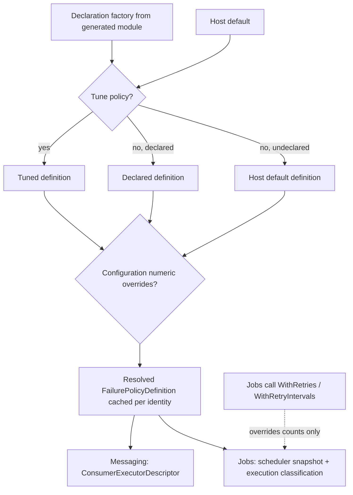
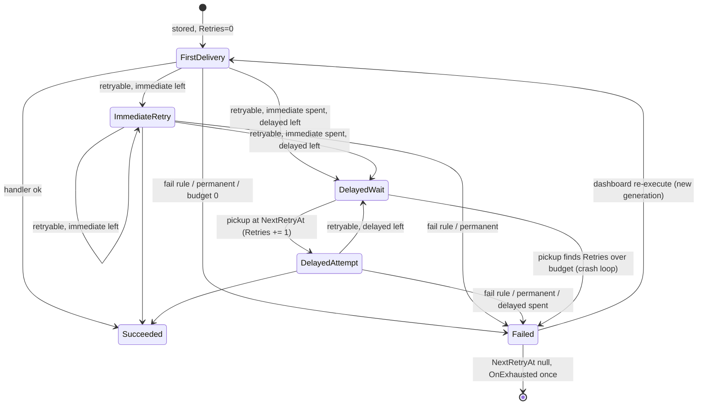
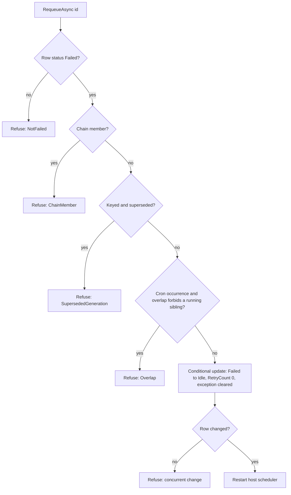

# Shared Failure Policy for Messaging and Jobs - Plan

## Goal Capsule

- **Objective:** A team declares how each message consumer and each job reacts to failure (how often it retries, how long it waits, which exceptions end it at once), and an operator can find and requeue whatever the policy gave up on.
- **Means:** one `FailurePolicy` model in a new `Headless.Reliability.Abstractions` package, declared on `[BusConsumer]`/`[QueueConsumer]`/`[Job]` and executed by each Core runtime (KTD1, KTD2).
- **Authority:** GitHub issue #1049 is the requirements source. Product Contract requirements win on behavior; KTDs win on mechanism; units override neither.
- **Execution profile:** one branch (`feat/1049-failure-policy`), one PR that closes #1049. Greenfield rules apply: break public APIs and storage semantics in place, no compatibility shims or migrations.
- **Stop conditions:** stop and report if a settled decision proves infeasible (for example, additive tiers cannot be expressed without a schema column), or if the Messaging and Jobs storage conformance suites cannot run.
- **Tail ownership:** the calling pipeline owns review, PR creation, and CI.

---

## Product Contract

### Summary

Add a `FailurePolicy` type that a consumer or job names by `typeof`. It defines immediate retries, delayed retries with exponential backoff, and exception rules that end a run without spending the remaining retries. `Tune` and configuration override or replace the declaration, and a host default applies only when nothing is declared. Messaging runs immediate retries in-process and delayed retries from storage with real backoff. Jobs flattens the policy into its existing per-row retry snapshot. A failure the policy gives up on stays `Failed`. Operators re-execute it from the Messaging dashboard, which they can already do, or requeue it from the Jobs dashboard, which is new.

### Problem Frame

Today retry behavior is host-wide on the Messaging consume side, multiplicative (48 attempts by default), and without backoff between persisted retries. Jobs cannot classify exceptions per job, seeds `[Job(Cron = ...)]` definitions with zero retries regardless of configuration, and has no way to requeue a failed job. #1048 removed an empty `IFailurePolicy` marker because a declared policy silently ran with host behavior. The declaration must ship with its behavior and its diagnostics.

### Requirements

**Policy model**

- R1. A `FailurePolicy` defines immediate retries, delayed retries (initial delay, maximum delay, exponential doubling, jitter), and fail rules (`FailOn<T>()` matching the type or a subtype, `FailWhen(predicate)`); any exception a fail rule does not match is retried.
- R2. Total attempts equal `1 + immediate + delayed`. Immediate retries run back-to-back with no delay; delayed retry `n` waits `min(initial × 2^(n-1), max)` with jitter.
- R3. A policy builds once into an immutable, thread-safe definition, cached per consumer or job identity.
- R4. A policy type that does not derive from `FailurePolicy`, is abstract or generic, or lacks an accessible public parameterless constructor is a build error through the source generators (HM005 for Messaging, HF023 for Jobs).

**Resolution**

- R5. Messaging resolves a consumer's policy as: `Tune`/configuration, then the declaration, then the host default. A publisher never chooses a consumer's policy.
- R6. Jobs resolves a job's retry counts as: the scheduling call's `WithRetries`/`WithRetryIntervals`, then `Tune`/configuration, then the declaration, then the host default. Fail rules always come from the resolved policy, never from the call.
- R7. Configuration overrides only the numeric fields (`ImmediateRetries`, `DelayedRetries`, `DelayedInitialDelay`, `DelayedMaxDelay`) of the otherwise-resolved policy and keeps its fail rules; an unknown key fails startup.
- R8. Defaults: a Messaging consumer without a policy retries 2 times immediately, then 5 times delayed from 30 seconds capped at 15 minutes. A job without a policy does not retry, as today.

**Messaging behavior**

- R9. A competing consumer's delayed retry is persisted with a `NextRetryAt` that grows with the delayed attempt number, and the retry processor picks it up regardless of how large the consumer's budget is.
- R10. A failure matched by a fail rule or by the framework's built-in permanent set skips the remaining retries and becomes terminal.
- R11. `OnExhausted` fires once per terminal consume failure: budget spent, fail rule, built-in permanent, deserialization failure, consumer no longer registered, and poisoned on arrival.
- R12. A `FailurePolicy` on an every-instance consumer is an error: HM010 at build time, and a startup error when it arrives through a hand-written module, `Tune`, or configuration.
- R13. `RetryPolicyOptions` retry settings (`RetryStrategy`, `MaxPersistedRetries`) govern only publishing; they no longer affect consumers.

**Jobs behavior**

- R14. A job's fail rule ends the run as `Failed` without consuming the remaining retries; `TerminateExecutionException` keeps its meaning.
- R15. `OnExhausted` fires once per terminal job failure, whether the budget ran out or a fail rule matched.
- R16. A `[Job(Cron = ...)]` definition is seeded with the retry counts of its resolved policy.
- R17. `RequeueAsync` puts a `Failed` standalone time job or cron occurrence back to `Idle` with `RetryCount` 0 and its exception cleared; it refuses chain members, superseded keyed generations, rows not in `Failed`, and a cron occurrence whose definition's overlap policy forbids a concurrent run.
- R18. The Jobs dashboard offers requeue on failed time jobs and failed cron occurrences.

**Documentation**

- R19. `docs/llms/reliability.md` (new), `docs/llms/messaging.md`, and `docs/llms/jobs.md` document the model, the resolution order, the terminal state, requeue, and the diagnostics; the new package is listed wherever `docs/authoring/AUTHORING.md` change routing requires.

### Key Decisions

- **Terminal state stays `Failed`; no dead-letter status.** A second status would duplicate `Failed`'s meaning and touch every status guard, index, and dashboard filter. Governs R10, R11, R14, R17. (session-settled: user-approved — chosen over a new `DeadLettered` status: forwarding and a separate destination were split to #1060 and the terminal row stays in storage, as proposed in the review the user accepted)
- **No per-publish policy.** Governs R5. (session-settled: user-approved — chosen over a publisher-chosen consumer policy: it couples producer to consumer)
- **Every-instance consumers reject a policy.** Their deliveries are at most once and never stored. Governs R12. (session-settled: user-approved — chosen over silently ignoring the policy: a declared but inert policy is the #1048 defect)
- **No discard outcome.** A handler that wants to drop a message catches the exception; a policy-level discard would hide a swallowed failure. Governs R1.
- **Jobs default stays at no retries.** Changing it would silently retry non-idempotent jobs in existing hosts. Governs R8.

### Scope Boundaries

- Forwarding a terminal message to a broker address or native dead-letter queue is #1060.
- Persisted (rescheduled) delayed retries for Jobs: job retries keep running in-process under the job's lease.
- Jobs added through `ITimeJobManager.AddAsync`, `ICronJobManager.AddAsync`, or the dashboard add/update endpoints keep the explicit `Retries` they carry; they do not pass through policy resolution.
- Re-applying a changed policy to an already-seeded cron definition: the first seed wins, as it does for the recovery knobs.

#### Deferred to Follow-Up Work

- Dashboard filter for terminal messages versus messages awaiting retry.
- Shortening the Messaging retry processor's poll interval to honor short delayed retries precisely.

### Success Criteria

- Each acceptance criterion in #1049 maps to a passing test named in the Implementation Units below.
- `make verify-affected` is clean, and the affected Messaging storage and Jobs EF conformance suites pass under `make test-affected-integration`.

---

## Planning Contract

### Key Technical Decisions

- KTD1. **New `Headless.Reliability.Abstractions` package, namespace `Headless.Reliability`, model only.** `Headless.Messaging.Abstractions` and `Headless.Jobs.Abstractions` reference it; `make check-layering` permits Abstractions-to-Abstractions. No Polly, no OpenTelemetry, `IsAotCompatible`. Scaffold from commit `44d6203d0f`. Chosen over `Headless.Core` or `Headless.Extensions`, which pull heavy dependencies into both Abstractions packages.
- KTD2. **`FailurePolicy` is an abstract class with `protected abstract void Configure(FailurePolicyBuilder)`, named by `typeof` on the attribute.** It builds into a sealed immutable `FailurePolicyDefinition` that owns the delay computation and the fail-rule evaluation, so both runtimes share one implementation. (session-settled: user-approved — chosen over string policy names: `typeof` lets the generators validate at build time)
- KTD3. **Generators emit a factory, never reflection.** The generated module passes `static () => new global::X()` to the catalog; `Tune` offers `FailurePolicy<T>() where T : FailurePolicy, new()` and `FailurePolicy(Action<FailurePolicyBuilder>)`. Jobs packages are `IsAotCompatible`, so `Activator.CreateInstance(Type)` would raise trim warnings that are build errors.
- KTD4. **Additive tiers on the Messaging consume side.** The immediate budget applies only while the row's `Retries` is 0; a delayed pickup gets exactly one attempt. One consume-side budget helper drives the exhaustion decision, crash-recovery detection (`RetryHelper.DetectCrashRecoveredReservation`), and the in-flight decision (`ResolveNextState`), so the three cannot disagree. (session-settled: user-approved — chosen over today's multiplicative inline × persisted model: budgets become predictable)
- KTD5. **Delayed backoff is a `TimeSpan` applied by the database clock.** The executor computes `delay(n)` from the definition and the delayed attempt number and passes it through the existing `RetryDelay.Exactly` path (`ShiftByDuration(Now, ...)`); no app-computed deadline. Delays are clamped to the policy maximum and computed without overflow for large `n`.
- KTD6. **Per-consumer budget is checked at execution, not in SQL.** The received-row pickup drops the `{Retries} <= @Retries` predicate; the published-row pickup keeps it. After crash detection, the executor fails a row whose `Retries` already exceeds its consumer's delayed budget through the existing terminal guard (`RelationalDataStorage.cs:115-118`), treating a lost CAS as stop with no `OnExhausted`. Chosen over a per-row budget column: no schema change, and the budget resolves from the consumer identity.
- KTD7. **Fail rules see the handler's exception, unwrapped.** The executor unwraps `SubscriberExecutionFailedException` once, as `RetryExceptionClassifier` does, before evaluating fail rules. A fail rule predicate that throws is treated as matched (fail), and the throw is logged.
- KTD8. **Messaging keeps its built-in permanent set; Jobs keeps its own.** `RetryExceptionClassifier` stays internal to Messaging.Core and always fails; Jobs keeps cancellation and `TerminateExecutionException` handling and does not start failing `ArgumentException`. Moving the Messaging set into Reliability would silently change Jobs behavior.
- KTD9. **Jobs flattens the resolved policy into `Retries` and `RetryIntervals`.** `Retries = immediate + delayed`; intervals are 0 for each immediate retry, then each delayed delay rounded up to whole seconds (the column stores integer seconds); jitter is not stored. Classification resolves by the job's function name at execution. No schema change. Chosen over a policy-identity column: the existing snapshot columns already carry counts and delays, and classification is code that cannot be stored either way.
- KTD10. **The policy is the only identity-level and host-level retry owner in Jobs.** `ConfigureDefaults`, `ConfigureJob<TRequest>`, and `Tune(...).Options(...)` that set `Retries` or `RetryIntervals` fail startup with a message naming `FailurePolicy`; their other options keep working. `JobsRetryOptions` keeps `OnExhausted` and `OnExhaustedTimeout` and loses its public `RetryStrategy`, so no host setting is accepted and then ignored. `JobsRetryPipeline` builds its Polly retry from fixed internal settings; a row that stores no interval for its retry index waits the resolved policy's `GetDelayedRetryDelay` for that job (the host default when undeclared).
- KTD11. **Requeue lives on `IJobScheduler`.** `RequeueAsync(Guid timeJobId)` and `RequeueOccurrenceAsync(Guid occurrenceId)` follow the `CancelAsync`/`PauseCronAsync` chain: scheduler, internal manager, persistence provider (in-memory and EF), with `_jobsHostScheduler.Restart()` on success. Each is one conditional update from `Failed` and safe to repeat. A time job's requeue sets `ExecutionTime` to the database now in the same update, so the staleness-filtered main peek claims it promptly, following the parent-terminal reconcile in `BasePersistenceProvider.cs`. A cron occurrence keeps its `ExecutionTime`, which is part of its identity in the occurrence unique index; the fallback check claims it within `FallbackIntervalChecker`. The overlap check for an occurrence runs under the cron definition's row lock, matching occurrence creation (`BasePersistenceProvider.cs:2271-2345`).
- KTD12. **Host defaults live on the existing options.** Messaging: a `DefaultFailurePolicy` on the messaging setup builder stored on `MessagingOptions` (included in `CopyTo`). Jobs: `DefaultFailurePolicy` on `JobsOptionsBuilder`. Runtime subscriptions use the Messaging host default.
- KTD13. **The policy joins the consumer redeclaration check.** `ConsumerRegistrationSettings` (`Setup.cs:536-540`) includes the policy type, so two modules declaring one consumer with different policies fail startup instead of silently merging.

### High-Level Technical Design

**Caller usage**

```csharp
public sealed class PaymentsFailurePolicy : FailurePolicy
{
    protected override void Configure(FailurePolicyBuilder policy) =>
        policy
            .Immediate(retries: 2)
            .Delayed(retries: 5, initialDelay: TimeSpan.FromSeconds(30), maxDelay: TimeSpan.FromMinutes(15))
            .FailOn<CardDeclinedException>()
            .FailWhen(static ex => ex is HttpRequestException { StatusCode: HttpStatusCode.BadRequest });
}

[QueueConsumer("billing.charge-card", FailurePolicy = typeof(PaymentsFailurePolicy))]
public sealed class ChargeCard : IConsume<ChargeCardCommand> { /* ... */ }

services.AddHeadlessMessaging(setup =>
{
    setup.DefaultFailurePolicy(p => p.Immediate(1).Delayed(3, TimeSpan.FromMinutes(1), TimeSpan.FromMinutes(10)));
    setup.Tune("billing.charge-card", c => c.FailurePolicy<StricterPaymentsPolicy>());
});

await scheduler.RequeueAsync(failedJobId, ct);
```

This sketch shows direction. Builder method names other than those in the issue may change during implementation.

**Resolution flow**



**Messaging consume attempt lifecycle**



**Jobs requeue decision**



### Assumptions

- The Messaging retry processor's poll interval (60 seconds base, up to 15 minutes when idle) is acceptable lateness for delayed retries; `NextRetryAt` itself is exact.
- Mixed-version nodes during a rolling deploy each apply their own resolved policy to rows they pick up; no cross-node agreement on the budget is needed.
- `RequeueAsync` returns a result describing the refusal reason rather than throwing for business refusals, matching `CancelAsync`'s boolean-style outcome; the exact result shape is chosen at implementation.
- `OnExhausted` stays a host-level callback; there is no per-consumer or per-job callback.

### Sequencing

U1 first. Messaging: U2, then U3 and U4. Jobs: U5, then U6 and U7, then U8. The Messaging and Jobs chains are independent and can proceed in either order after U1. U9 documents the final behavior and lands last, though each unit updates the docs its own tests assert (diagnostic table rows).

---

## Implementation Units

| U-ID | Title | Key files | Depends on |
| --- | --- | --- | --- |
| U1 | Reliability.Abstractions package | `src/Headless.Reliability.Abstractions/` | none |
| U2 | Messaging declaration and resolution | `MessageConsumerAttribute.cs`, `MessagingCatalogBuilder.cs`, `Setup.cs`, `ConsumerTuningBuilder.cs`, `ConsumerTuningApplier.cs` | U1 |
| U3 | Messaging generator diagnostics and emission | `src/Headless.Messaging.SourceGenerator/` | U1, U2 |
| U4 | Messaging consume runtime | `ISubscribeExecutor.cs`, `RetryHelper.cs`, `RelationalDataStorage.Pickup.cs`, `InMemoryDataStorage.cs` | U2 |
| U5 | Jobs declaration and resolution | `JobAttribute.cs`, `JobFunctionRegistration.cs`, `JobTuningBuilder.cs`, `JobsCatalogBuilder.cs`, `JobSchedulingPolicies.cs` | U1 |
| U6 | Jobs generator diagnostics and emission | `src/Headless.Jobs.SourceGenerator/` | U1, U5 |
| U7 | Jobs execution runtime | `JobsRetryPipeline.cs`, `JobsExecutionTaskHandler.cs`, `JobsRetryOptions.cs` | U5 |
| U8 | Jobs requeue and dashboard | `IJobScheduler.cs`, persistence providers, `DashboardEndpoints.cs`, SPA | U7 |
| U9 | Documentation | `docs/llms/*.md`, `CONCEPTS.md`, READMEs | U1-U8 |

### U1. Reliability.Abstractions package

- **Goal:** ship the policy model, its builder, and its immutable definition as a new package both families reference.
- **Requirements:** R1, R2, R3, R7 (merge helper), KTD1, KTD2.
- **Dependencies:** none.
- **Files:**
  - `src/Headless.Reliability.Abstractions/Headless.Reliability.Abstractions.csproj`, `README.md`, `FailurePolicy.cs`, `FailurePolicyBuilder.cs`, `FailurePolicyDefinition.cs`, `FailurePolicyOverrides.cs` (numeric override record)
  - `tests/Headless.Reliability.Abstractions.Tests.Unit/` (csproj, `FailurePolicyBuilderTests.cs`, `FailurePolicyDefinitionTests.cs`)
  - `headless-framework.slnx`, `eng/expected-packages.txt`, `README.md`, `README.ar.md`, `docs/llms/index.md`, `docs/llms/reliability.md`
  - `src/Headless.Messaging.Abstractions/Headless.Messaging.Abstractions.csproj`, `src/Headless.Jobs.Abstractions/Headless.Jobs.Abstractions.csproj` (project reference), and every regenerated `packages.lock.json`
- **Approach:**
  1. Scaffold from `git show 44d6203d0f` and `src/Headless.Coordination.Abstractions` for current csproj properties.
  2. The definition exposes the immediate count, the delayed count, `GetDelayedRetryDelay(int delayedAttempt)` (jitter from a supplied or shared random source), `ShouldFail(Exception)`, and `With(FailurePolicyOverrides)`.
  3. Validate with `Headless.Checks`: retries in `[0, 100]`, `initialDelay > 0` when delayed retries > 0, `maxDelay >= initialDelay`, both at most 24 hours.
  4. Add the project reference to both Abstractions packages and regenerate lock files.
- **Patterns to follow:** `src/Headless.Coordination.Abstractions` (package shape), `tests/Headless.Coordination.Abstractions.Tests.Unit` (test project).
- **Test scenarios:**
  - A policy with 2 immediate and 5 delayed retries reports 8 total attempts.
  - Delayed delays from 30 s capped at 15 min are 30 s, 60 s, 120 s, 240 s, 480 s, then 900 s for every later attempt.
  - Delayed attempt 64 returns the cap without overflow.
  - Jitter keeps every delay within the jitter band (chosen at implementation as a fraction of the computed delay) and never above the cap; the exact-delay scenarios above run with a fixed random source.
  - `FailOn<InvalidOperationException>()` matches `ObjectDisposedException` (subtype) and not `ArgumentException`.
  - `FailWhen` returning true fails; a predicate that throws counts as fail.
  - An exception matched by no rule is retryable.
  - Negative retries, zero initial delay with delayed retries, and max below initial each throw an `ArgumentException` from the builder.
  - Overrides replace only the supplied numeric fields and keep the fail rules.
  - Building a policy type twice returns equal definitions; the definition is safe to share across threads (no mutable state).
- **Verification:** the package references only `Headless.Checks` (no Polly, no OpenTelemetry), `make check-layering` passes, and the new test project passes.

### U2. Messaging declaration and resolution

- **Goal:** every competing consumer's descriptor carries its resolved `FailurePolicyDefinition`.
- **Requirements:** R5, R7, R8 (Messaging default), R12 (startup), KTD3, KTD12, KTD13.
- **Dependencies:** U1.
- **Files:**
  - `src/Headless.Messaging.Abstractions/MessageConsumerAttribute.cs`
  - `src/Headless.Messaging.Core/MessagingCatalogBuilder.cs`, `Registration/MessageRegistration.cs`, `Setup.cs`, `ConsumerMetadata.cs`, `ConsumerTuningBuilder.cs`, `ConsumerTuningApplier.cs`, `Configuration/MessagingOptions.cs`, `Configuration/MessagingSetupBuilder.cs`, `Registration/MessagingContributionBuilder.cs`, `Internal/ConsumerServiceSelector.cs`, `Internal/ConsumerExecutorDescriptor.cs`, runtime subscription descriptor creation
  - Tests: `tests/Headless.Messaging.Core.Tests.Unit/Registration/ConsumerTuningDurableSettingsTests.cs`, `ConsumerHostControlTests.cs`, `ConsumerDeclarationTests.cs`, new `Registration/ConsumerFailurePolicyResolutionTests.cs`
- **Approach:**
  1. Add `Type? FailurePolicy` to the attribute base (documentation only at runtime; the generator reads it).
  2. `AddBusConsumer`/`AddQueueConsumer` accept an optional `Func<FailurePolicy>? failurePolicy`; carry it through `MessagingConsumerDeclaration`, `MessageConsumerRegistration`, and `ConsumerMetadata`.
  3. Resolve per R5 in `_RegisterConsumers` and the applier, then apply configuration overrides per R7 under `Headless:Messaging:Consumers:{identity}:FailurePolicy`.
  4. Extend `_RejectDurableSettingsOnEveryInstance` and the registration path to reject a policy on an every-instance consumer, naming the setting.
  5. Add the policy type to `ConsumerRegistrationSettings` (KTD13).
  6. Copy the definition onto `ConsumerExecutorDescriptor`; runtime subscriptions get the host default.
- **Patterns to follow:** the circuit-breaker override path (`ConsumerTuningBuilder.CircuitBreaker`, `ConsumerTuningApplier._Tune`, `ConsumerMetadata.CircuitBreakerOverride`).
- **Test scenarios:**
  - A consumer declared with policy A and no tuning resolves to A.
  - `Tune(identity, c => c.FailurePolicy<B>())` over a declared A resolves to B.
  - Configuration `ImmediateRetries: 0` over a declared A keeps A's fail rules and sets immediate retries to 0.
  - An undeclared, untuned consumer resolves to the host default; with no host default set it resolves to 2 immediate and 5 delayed from 30 s capped at 15 min.
  - An unknown key under `FailurePolicy` fails startup and names the configuration path.
  - Configuration with `DelayedMaxDelay` below `DelayedInitialDelay` fails startup with the path.
  - `Tune` with a policy on an every-instance identity fails startup naming the identity and the setting.
  - A hand-written module calling `AddBusConsumer(everyInstance: true, failurePolicy: ...)` fails startup.
  - Two modules declaring one consumer identity with different policy types fail startup naming both sources.
  - A runtime subscription's descriptor carries the host default.
- **Verification:** the Messaging.Core unit tests above pass; every existing registration test still passes.

### U3. Messaging generator diagnostics and emission

- **Goal:** the generator validates and emits the declared policy.
- **Requirements:** R4 (HM005), R12 (HM010), KTD3.
- **Dependencies:** U1, U2.
- **Files:**
  - `src/Headless.Messaging.SourceGenerator/Parsing/ConsumerParser.cs`, `Validation/ConsumerValidator.cs`, `Validation/DiagnosticDescriptors.cs`, `Resources/DiagnosticMessages.resx`, `Models/ConsumerModel.cs`, `Emitting/MessagingSourceEmitter.cs`, `Utilities/SourceGeneratorConstants.cs`, `AnalyzerReleases.Unshipped.md`
  - Tests: `tests/Headless.Messaging.SourceGenerator.Tests.Unit/MessagingIncrementalSourceGeneratorTests.cs`, `DiagnosticDescriptorMetadataTests.cs`, `Snapshots/` (new verified snapshot), `GeneratedSourceCompilationTests.cs`
  - `docs/llms/messaging.md` diagnostics table rows for HM005 and HM010 (the metadata test asserts them)
- **Approach:** read the `FailurePolicy` named argument as an `INamedTypeSymbol`, validate per R4, store its fully qualified `global::` name in the model, and emit `failurePolicy: static () => new global::X()`. Update the test that asserts the assigned ID set.
- **Patterns to follow:** HM006 validation in `ConsumerParser.cs:85-101`; existing descriptors and resource naming.
- **Test scenarios:**
  - A valid policy on a Queue consumer emits a factory in the module snapshot, and the generated source compiles.
  - A policy type that does not derive from `FailurePolicy` reports HM005.
  - An abstract policy type, an open generic, and a type with only a private constructor each report HM005.
  - A policy on `[BusConsumer(EveryInstance = true)]` reports HM010.
  - A consumer without a policy emits no `failurePolicy` argument (snapshot unchanged).
  - The diagnostic ID set test now includes HM005 and HM010.
- **Verification:** generator unit tests and snapshots pass; `AnalyzerReleases` tracking builds clean.

### U4. Messaging consume runtime

- **Goal:** consume-side retries follow the resolved policy with additive tiers, persisted backoff, per-consumer budgets, and consistent `OnExhausted`.
- **Requirements:** R2, R9, R10, R11, R13, KTD4, KTD5, KTD6, KTD7, KTD8.
- **Dependencies:** U2.
- **Files:**
  - `src/Headless.Messaging.Core/Internal/ISubscribeExecutor.cs`, `Retry/MessagingRetryPipeline.cs`, `Retry/RetryHelper.cs`, `Configuration/RetryPolicyOptions.cs`, `Persistence/RelationalDataStorage.Pickup.cs`, `Persistence/RelationalDataStorage.Store.cs` (poison sentinel), `Internal/IConsumerRegister.CompetingDelivery.cs` (poison path stays, logging uses no global budget)
  - `src/Headless.Messaging.Storage.InMemory/InMemoryDataStorage.cs`
  - `src/Headless.Messaging.Testing/MessagingTestHarness.cs`, `RecordedMessage.cs` (the "Exhausted" outcome now means "terminal failure")
  - Tests: `tests/Headless.Messaging.Core.Tests.Unit/SubscribeExecutorRetryTests.cs`, `Retry/RetryHelperTests.cs`, `MessageSenderTests.cs`, `tests/Headless.Messaging.Storage.InMemory.Tests.Unit/InMemoryDataStorageTests.cs`, `tests/Headless.Messaging.Core.Tests.Harness/DataStorageTestsBase*.cs`, `tests/Headless.Messaging.Testing.Tests.Unit/EndToEndTests.cs`
- **Approach:**
  1. Introduce a small consume-side budget abstraction (immediate count applicable when `Retries == 0`, delayed count, delay function) built from the descriptor's definition; publish-side helpers keep reading `RetryPolicyOptions`.
  2. Run the inline pipeline with zero delay and per-call classification carried on the execution state (one pipeline, no per-consumer Polly instances).
  3. On a retryable failure with immediate retries spent and delayed retries left, persist `Continue` with `RetryDelay.Exactly(delay(Retries + 1))`; otherwise persist terminal.
  4. Route fail-rule, built-in permanent, deserialization, and unresolved-descriptor terminals through the path that fires `OnExhausted` when the CAS wins.
  5. After crash detection on pickup, fail an over-budget row (KTD6).
  6. Remove the received-row retries predicate from the relational and in-memory pickup; keep it for published rows.
- **Execution note:** start by rewriting `SubscribeExecutorRetryTests` cases to the additive model so they fail first; the multiplicative expectations in the current tests are the characterization of what changes.
- **Patterns to follow:** `docs/solutions/logic-errors/terminal-state-overwrite-on-redelivery.md` (terminal guard, `CancellationToken.None` for the terminal write, lost CAS means stop).
- **Test scenarios:**
  - Covers #1049 additive total: a handler that always throws under 2 immediate and 3 delayed is invoked exactly 6 times before the row is terminal.
  - Immediate retries happen in one dispatch with no persisted `NextRetryAt` between them.
  - Each delayed retry persists `NextRetryAt` equal to database now plus `delay(n)`, growing with `n` up to the cap (verify through the in-memory store's clock and the relational conformance suite).
  - A delayed pickup that fails again does not run immediate retries.
  - A consumer with 20 delayed retries is picked up for retry 16 and beyond (no global cap); a published row still stops at `MaxPersistedRetries`.
  - A `FailOn<T>` match on the first attempt makes the row terminal after one invocation and fires `OnExhausted` once.
  - `ArgumentException` from a handler fails at once even when the policy has no fail rule.
  - Deserialization failure at execute fires `OnExhausted` once.
  - A row whose consumer identity is no longer registered becomes terminal at pickup and fires `OnExhausted` once.
  - A crash-recovered row whose `Retries` exceeds the budget becomes terminal without invoking the handler.
  - Two nodes racing the terminal write: only the CAS winner fires `OnExhausted`; the loser logs and stops.
  - Host shutdown during an attempt writes nothing and fires nothing.
  - Cancellation thrown by the handler with the consume token is not classified by fail rules.
  - Changing `RetryPolicyOptions.RetryStrategy.MaxRetryAttempts` changes publish retries and not consume retries.
  - The testing harness records a fail-rule terminal as the terminal-failure outcome.
  - A dashboard re-execute of a fail-rule terminal row is accepted and starts with a full budget.
- **Verification:** Messaging.Core, InMemory storage, and Messaging.Testing unit tests pass; `DataStorageTestsBase` pickup cases pass on PostgreSQL and SQL Server under `make test-affected-integration`, including a skewed app clock case proving `NextRetryAt` uses the database clock.

### U5. Jobs declaration and resolution

- **Goal:** each job's resolved policy decides the retry snapshot written at scheduling and the cron seed.
- **Requirements:** R6, R7, R8 (Jobs default), R16, KTD3, KTD9, KTD10, KTD12.
- **Dependencies:** U1.
- **Files:**
  - `src/Headless.Jobs.Abstractions/Base/JobAttribute.cs`, `Base/JobFunctionRegistration.cs`, `Models/CronSeedDefinition.cs`
  - `src/Headless.Jobs.Core/JobTuningBuilder.cs`, `JobsCatalogBuilder.cs`, `JobsOptionsBuilder.cs`, `JobSchedulingPolicies.cs`, `JobScheduler.cs`, `JobScheduler.Keyed.cs`, `BackgroundServices/JobsInitializationHostedService.cs`, cron seed migration in `Managers/InternalJobsManager.cs`, `Provider/JobsInMemoryPersistenceProvider.cs`, `src/Headless.Jobs.EntityFramework/Infrastructure/BasePersistenceProvider.cs`
  - Tests: `tests/Headless.Jobs.Composition.Tests.Unit/JobSchedulingDefaultsTests.cs`, `Registration/*Tuning*`, new `JobFailurePolicyResolutionTests.cs`, `JobSchedulerTests.cs`
- **Approach:**
  1. Add `Type? FailurePolicy` to `JobAttribute` and a `Func<FailurePolicy>? FailurePolicy` init member to `JobFunctionRegistration`.
  2. Add `FailurePolicy<T>()` and `FailurePolicy(Action<FailurePolicyBuilder>)` to `JobTuningBuilder`, the `FailurePolicy` configuration keys under `Headless:Jobs:Jobs:{identity}`, and `DefaultFailurePolicy` on `JobsOptionsBuilder`.
  3. Resolve a frozen definition per function name; reject retry fields on startup `JobOptions` sources (KTD10).
  4. `Resolve` flattens the definition (KTD9) unless the call supplies counts; the scheduler snapshot paths stay as they are.
  5. Carry flattened retries on `CronSeedDefinition` into the seed migration (create only).
- **Test scenarios:**
  - A job declaring policy A enqueued without call options stores `Retries` and `RetryIntervals` flattened from A.
  - The call's `WithRetries(1)` overrides the count while classification still comes from A.
  - `Tune` and configuration override a declared policy; configuration keeps fail rules.
  - A job with no policy anywhere stores 0 retries.
  - Sub-second delayed delays round up to whole seconds.
  - `ConfigureDefaults(o => o.WithRetries(3))`, `ConfigureJob<TRequest>` with intervals, and `Tune(...).Options(o => o.WithRetries(2))` each fail startup naming `FailurePolicy`.
  - A `[Job(Cron = ...)]` with a policy seeds the definition with flattened retries; a second startup with a changed policy leaves the existing row unchanged.
  - An unknown configuration key under `FailurePolicy` fails startup with the path.
- **Verification:** Jobs composition unit tests pass; the EF harness cron materialization tests pass on PostgreSQL and SQL Server.

### U6. Jobs generator diagnostics and emission

- **Goal:** the Jobs generator validates and emits the declared policy.
- **Requirements:** R4 (HF023), KTD3.
- **Dependencies:** U1, U5.
- **Files:**
  - `src/Headless.Jobs.SourceGenerator/Parsing/JobParser.cs`, `Validation/DiagnosticDescriptors.cs`, `Resources/*.resx`, `Emitting/JobsSourceEmitter.cs`, `Utilities/SourceGeneratorConstants.cs`, `AnalyzerReleases.Unshipped.md`
  - Tests: `tests/Headless.Jobs.SourceGenerator.Tests.Unit/` (new `Jobs/FailurePolicyEmissionTests.cs`, `DiagnosticDescriptorMetadataTests.cs`, snapshots)
  - `docs/llms/jobs.md` diagnostics table row HF023
- **Approach:** mirror U3. Emit `FailurePolicy = static () => new global::X()` only when declared, following the recovery-knob emission pattern.
- **Patterns to follow:** `Jobs/RecoveryKnobEmissionTests.cs`, `JobsSourceEmitter.cs:153-178`.
- **Test scenarios:**
  - A valid policy emits the factory and the generated source compiles.
  - Invalid policy types (not derived, abstract, open generic, no public parameterless constructor) each report HF023.
  - A job without a policy emits no factory.
- **Verification:** Jobs generator tests and snapshots pass.

### U7. Jobs execution runtime

- **Goal:** job runs apply the job's fail rules and report every terminal failure consistently.
- **Requirements:** R14, R15, KTD8, KTD10.
- **Dependencies:** U5.
- **Files:**
  - `src/Headless.Jobs.Core/JobsRetryPipeline.cs`, `JobsExecutionTaskHandler.cs`, `JobsRetryOptions.cs`
  - Tests: `tests/Headless.Jobs.Composition.Tests.Unit/RetryBehaviorTests.cs`, `JobsRetryPipelineTests.cs`, `CrashRecoveryExhaustionTests.cs`, `TerminateExecutionExceptionTests.cs`
- **Approach:**
  1. In `_ShouldHandleAsync`, evaluate cancellation and `TerminateExecutionException` first, then the job's definition fail rules (by `FunctionName`), then the row's `Retries` budget.
  2. Remove the host `MaxRetryAttempts`/`MaxDelay`/`ShouldHandle` caps from the decision and the crash-recovery gate, and remove `JobsRetryOptions.RetryStrategy` (KTD10).
  3. Fire `OnExhausted` on every terminal `Failed` transition the CAS wins, including fail-rule terminals.
- **Test scenarios:**
  - A job whose policy fails on `InvalidOperationException` with 5 retries runs once and ends `Failed`, firing `OnExhausted` once.
  - A retryable failure with `Retries=2` runs 3 times with the stored intervals and fires `OnExhausted` once at the end.
  - `TerminateExecutionException` still ends the run with its requested status and does not fire `OnExhausted`.
  - `ArgumentException` is retried for a job (Jobs does not adopt the Messaging permanent set).
  - Crash recovery with `RetryCount` beyond `Retries` ends `Failed` without running the job and fires `OnExhausted` once.
  - A job enqueued with explicit `Retries` through `ITimeJobManager.AddAsync` and no declared policy retries per its row and uses the host default policy's fail rules.
  - A row with `Retries` and no `RetryIntervals` waits the resolved policy's delayed delay between attempts.
- **Verification:** Jobs composition unit tests pass.

### U8. Jobs requeue and dashboard

- **Goal:** an operator requeues a failed time job or cron occurrence from the API and the dashboard.
- **Requirements:** R17, R18, KTD11.
- **Dependencies:** U7.
- **Files:**
  - `src/Headless.Jobs.Abstractions/Interfaces/IJobScheduler.cs`, `Interfaces/Managers/IInternalJobManager.cs`, `Interfaces/IJobPersistenceProvider.cs`, result type next to the existing scheduler result types
  - `src/Headless.Jobs.Core/JobScheduler.cs`, `Managers/InternalJobsManager.cs`, `Provider/JobsInMemoryPersistenceProvider.cs`
  - `src/Headless.Jobs.EntityFramework/Infrastructure/BasePersistenceProvider.cs`, `JobsEFCorePersistenceProvider.cs`
  - `src/Headless.Jobs.Dashboard/Endpoints/DashboardEndpoints.cs`, `wwwroot/src/http/services/jobsService.ts`, `cronJobService.ts`, `wwwroot/src/views/TimeJob.vue`, `wwwroot/src/components/cronJobComponents/CronOccurrenceDialog.vue`, specs under `wwwroot/src/**/__tests__/`
  - Tests: `tests/Headless.Jobs.Composition.Tests.Unit/` (new `JobRequeueTests.cs`, `Dashboard/JobsDashboardRequeueEndpointTests.cs`, `Dashboard/DashboardEndpointMetadataTests.cs`), `tests/Headless.Jobs.EntityFramework.Tests.Harness/` (requeue conformance)
- **Approach:**
  1. Add the scheduler methods and the internal manager and persistence calls following `CancelAsync`.
  2. Implement each persistence operation as one conditional update from `Failed`, applying R17's refusals; for occurrences, take the definition lock and check for a non-terminal sibling when the overlap policy forbids concurrency.
  3. Map `POST /job/requeue` and `POST /cron-job-occurrence/requeue`, returning `Ok` or `BadRequest` with the refusal reason.
  4. Add SPA service calls and a requeue action on `Failed` rows in the time-job table and the occurrence dialog.
- **Test scenarios:**
  - Covers #1049 requeue: a `Failed` time job becomes `Idle` with `RetryCount` 0, no exception, `ExecutionTime` set to database now, and is claimed by the main peek.
  - A requeued cron occurrence keeps its `ExecutionTime` and is claimed by the fallback check.
  - Requeue of a `Succeeded`, `InProgress`, or `Idle` row is refused and changes nothing.
  - Requeue of a chain child or chain parent is refused.
  - Requeue of a superseded keyed generation is refused; the current generation is accepted.
  - Requeue of a failed occurrence while a later occurrence of a skip-overlap definition is `InProgress` is refused; with no running sibling it is accepted.
  - Two concurrent requeues of one row: exactly one succeeds.
  - A requeued row keeps its stored `Retries` and `RetryIntervals`.
  - The dashboard endpoints return `Ok` on success and `BadRequest` with the reason on refusal, and appear in the endpoint metadata enumeration.
  - SPA: the requeue action appears only for `Failed` rows and calls the endpoint with the row id.
- **Verification:** composition and EF harness tests pass on PostgreSQL and SQL Server; SPA specs pass with `npm run test:unit`; `make dashboards` builds both SPAs.

### U9. Documentation

- **Goal:** consumers and their agents can choose, declare, and operate failure policies from the docs alone.
- **Requirements:** R19.
- **Dependencies:** U1-U8.
- **Files:** `docs/llms/reliability.md`, `docs/llms/messaging.md` (Retry Policy section, consumer declaration, `OnExhausted`, diagnostics), `docs/llms/jobs.md` (retries, requeue, diagnostics), `docs/llms/index.md`, `CONCEPTS.md` (add "Failure policy"; update "Poison-on-arrival" and "Consumer tuning" wording), `README.md`, `README.ar.md`, `src/Headless.Reliability.Abstractions/README.md`
- **Approach:** follow `docs/authoring/AUTHORING.md` change routing. `csharp` samples in `messaging.md` and `jobs.md` must compile under `tests/Headless.Docs.Examples.Tests.Unit`; mark illustrative fragments `no-compile`.
- **Test expectation:** `tests/Headless.Docs.Examples.Tests.Unit` compiles every new sample; `make docs-check` passes.
- **Verification:** docs examples tests pass; `make docs-check` reports no failures.

---

## Verification Contract

| Gate | Command | Applies to |
| --- | --- | --- |
| Unit tests | `make test-affected` | every unit |
| Provider conformance | `make test-affected-integration` (Docker) | U4 (Messaging storage), U5 and U8 (Jobs EF) |
| SPA | `make dashboards`, then `npm run test:unit` in `src/Headless.Jobs.Dashboard/wwwroot` | U8 |
| Layering and docs | `make check-layering`, `make docs-check` | U1, U9 |
| Final gate | `make verify-affected`, resolving every analyzer finding (fix or suppress with an inline reason) | whole change |

## Definition of Done

- Every requirement R1-R19 is covered by a passing test or documentation check named in its unit.
- `make verify-affected` passes, and its `artifacts/proof/<run>/summary.md` is ready for the PR description.
- `make test-affected-integration` passes for the affected Messaging storage and Jobs EF projects, or the PR states which suites could not run and why.
- `packages.lock.json` changes from the new project reference are committed with the reference change.
- No abandoned-attempt code, commented-out code, or unused helpers remain in the diff.
