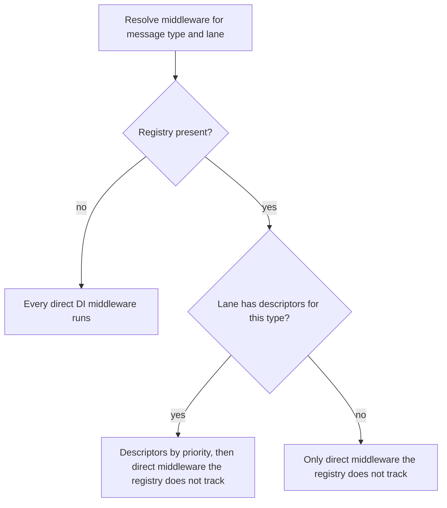
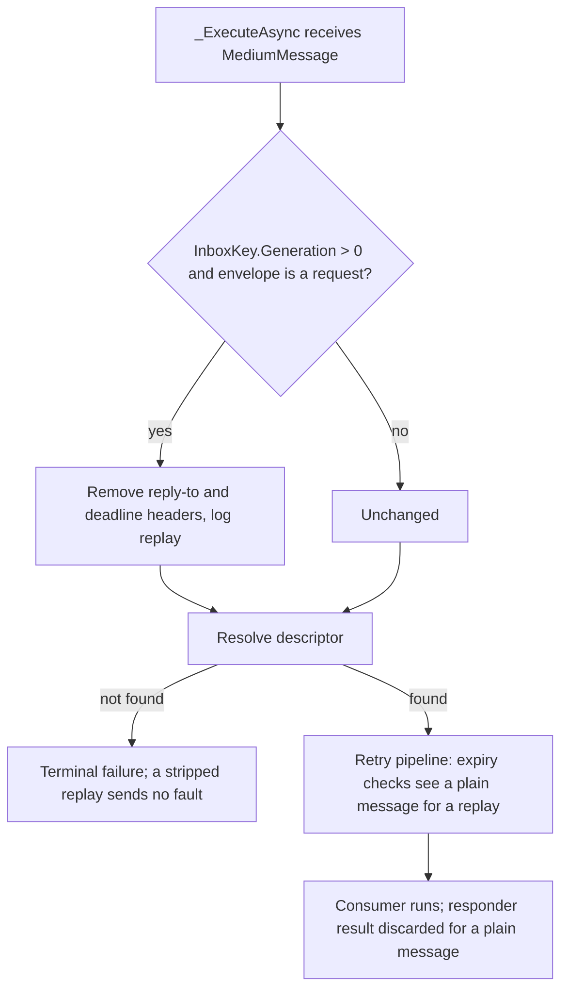

# Queue-Lane Tenant Propagation and Request/Reply Hardening - Plan

## Goal Capsule

- **Objective:** An application that opts into messaging tenant propagation gets the same tenant behavior on the Queue lane as on the Bus lane, and request/reply callers and operators get bounded, predictable behavior for nested requests, replayed requests, long timeouts, misconfigured NATS streams, and the receive metric.
- **Means:** Register the existing tenant publish and consume middleware on the Queue lane and delete the request/reply tenant special cases that stood in for it (KD1, KD2); close the lane-scoping leak in both middleware pipelines (KD3); inherit the inbound deadline for a nested request (KD5); run a force-reprocessed request as a plain Queue message (KD7); bound `RequestOptions.Timeout` (KD6); warn when a JetStream stream captures a NATS reply subject (KD8); prove startup rejection in every non-supporting provider leaf (KD9); give the no-responder case its own receive outcome (KD10); close the listed test gaps.
- **Authority:** GitHub issues #1069 (request/reply hardening follow-ups) and #1072 (propagate tenant on the Queue lane). Repository owner Mahmoud Shaheen (xshaheen) delegated design judgment for this work to the lead; the Key Decisions below are the lead's under that delegation, each with its rejected alternative, and the pull request lists them and every declined item with its reason. Requirements and Key Decisions bind planning; KTDs own mechanism; a unit never overrides an R, a Key Decision, or a KTD.
- **Stop conditions:** Stop and report if making the tenant middleware run on the Queue lane requires changing the lane semantics of user middleware beyond the leak fix in R4. Stop if a provider leaf's startup-rejection proof needs a change to that provider's capability declaration. Never weaken a test to pass.
- **Execution profile:** Deep. Cross-cutting in `Headless.Messaging`, `Headless.Messaging.Queue.Abstractions`, `Headless.Messaging.Nats`, the messaging test harness, four provider integration leaves, and `docs/llms`. Eleven units. The affected integration set needs Docker: RabbitMQ, NATS, Redis, the PostgreSQL and SQL Server storage leaves, and the Kafka, AWS, and Pulsar leaves for their new startup-rejection tests. The Azure Service Bus leaf skips without credentials and is reported as not run.
- **Tail ownership:** The executor implements and verifies locally per `AGENTS.md`: `make test-affected`, `make test-affected-integration`, `make docs-check`, and `make verify-affected` with its proof bundle in the PR body. The calling pipeline owns review, PR, and CI.

---

## Product Contract

Product Contract preservation: changed by clarification only, no scope change. KD3 gained its breaking-change note; R4 gained the raw-DI clause; R6 gained the missing-or-unreadable-header clause; R9 names when each storage shows the stripped headers; R10 narrows "becomes live" to the subscribe path. Every R-ID, KD-ID, and AE-ID is unchanged.

### Summary

Make `PropagateTenant()` cover both messaging lanes, and remove the three places where request/reply re-implemented tenant propagation for itself. In the same change, harden request/reply: a nested request inherits the remaining deadline of the request its consumer is answering, a force-reprocessed request runs as a plain Queue message, a per-call timeout is bounded like the host default, a NATS caller warns when a stream captures its reply subject, every non-supporting provider proves it rejects request/reply at startup, a request that reaches a non-responder gets its own receive outcome, and the test gaps from #1069 are closed.

### Problem Frame

Issue #1072: `PropagateTenant()` registers `TenantPropagationPublishMiddleware` and `TenantPropagationConsumeMiddleware` through `AddBusPublishMiddleware` and `AddBusConsumeMiddleware`, which are Bus-lane registrations. Queue request/reply (#1077) worked around this with three special cases: `RequestClient` reads the ambient tenant itself when the publish middleware is registered, `ConsumeMiddlewarePipeline` opens a tenant scope for a responder when the consume middleware is registered, and `SubscribeExecutor` does the same on the transactional inbox tier. A plain `EnqueueAsync` and a plain Queue consumer were left to "today's behavior".

Reading the pipelines shows that "today's behavior" is not stable. `ConsumeMiddlewarePipeline._ResolveSharedMiddleware` and `PublishMiddlewarePipeline._ResolveMiddleware` ask the descriptor registry for the lane's descriptors; when the lane has none, they return every object-typed middleware registered in DI, including middleware the registry tracks for the other lane. So a host with no Queue-lane middleware already runs the Bus-registered tenant middleware on Queue messages, and a host that adds any Queue-lane middleware silently stops doing so. The same leak applies to any user middleware registered through `AddBusConsumeMiddleware` or `AddBusPublishMiddleware`. Research confirmed this in the code; U1 proves it with a characterization test before changing it.

Issue #1069 lists the gaps the first request/reply version shipped with. Several are consequences of one fact: the request's deadline is a header on an envelope that is copied verbatim, so a nested request, a replayed row, and the responder's clock all see it without context. The others are bounds and proofs the first version left for later: an unbounded per-call timeout whose tombstone and timer live as long as the timeout, a NATS isolation rule that only documentation enforces, a startup-rejection proof that only a synthetic InMemory driver runs, a `skipped` receive outcome that now means two things, and a list of untested branches.

### Requirements

**Tenant propagation on the Queue lane (#1072)**

- R1. With `PropagateTenant()`, `IQueue.EnqueueAsync` without an explicit `TenantId` stamps the ambient `ICurrentTenant.Id` on the envelope under the publish middleware's existing rules (blank skipped, over-length dropped and logged, explicit value preserved), exactly as `IBus.PublishAsync` does. Source: #1072 acceptance criteria.
- R2. With `PropagateTenant()`, every Queue consumer, plain or responder, runs inside the envelope tenant's scope for the whole consume, on every inbox tier, as a Bus consumer does. Source: #1072 acceptance criteria; widens the current responder-only rule in `docs/llms/messaging.md`.
- R3. Request/reply holds no tenant logic of its own beyond three things that are not propagation: the request carries `RequestOptions.TenantId` when set, the pending call records the final envelope's tenant so a reply can be matched, and the reply echoes the request's tenant verbatim. The ambient-tenant read in `RequestClient`, the responder tenant scope in `ConsumeMiddlewarePipeline`, and the responder probe in `SubscribeExecutor` are removed. Source: #1072 acceptance criteria; #1069 item 6.
- R4. Object-typed middleware registered through the builder for one lane never runs on the other lane, whether or not the other lane has middleware of its own: the direct-DI fallback in both pipelines excludes every registry-tracked middleware type on every lane. Middleware registered directly in DI without the builder stays lane-agnostic, and a type the registry tracks obeys the registry everywhere. Source: confirmed in `ConsumeMiddlewarePipeline._ResolveSharedMiddleware` and `PublishMiddlewarePipeline._ResolveMiddleware` by research; proven by a characterization test before the change.
- R5. A host can register object-typed publish and consume middleware for the Queue lane through `MessagingBuilder`, mirroring the existing Bus-lane registrations, with the same priority handle. Source: inferred; R1 and R2 need a Queue-lane registration and none exists.

**Nested requests, timeouts, and replay (#1069 items 1 to 3)**

- R6. A request sent while a consumer answers a request waits at most the inbound request's remaining deadline, read on this host's clock. A longer per-call or default timeout is capped to that remainder, and the capped value is the timeout the outbound request carries in its deadline header and reports in `RequestTimeoutException.Timeout`. A consumer answering a plain Queue or Bus message, or a request whose deadline header is missing or unreadable, inherits nothing. Source: #1069 item 1.
- R7. A request sent while the inbound request's deadline has already passed is not sent. The call fails with `RequestNotSentException`, whose message names the inbound deadline, counts as outcome `not_sent`, and publishes nothing. Source: #1069 item 1; the outcome choice is the lead's, see KD5.
- R8. `RequestOptions.Timeout` accepts at most 10 minutes, the same bound as `RequestReplyOptions.DefaultTimeout`, through one shared constant. A longer value is rejected when the options record is constructed. Source: #1069 item 3.
- R9. A stored request that an operator force-reprocesses runs as a plain Queue message: no deadline check, no reply and no fault, the responder's result discarded, and the consumer's full failure policy applied, delayed retries included. The replay generation's stored envelope loses its reply address and deadline: at once on the in-memory storage, which holds live message references, and on the next content refresh on relational storage. The parent row keeps its original envelope. Source: #1069 item 2; the choice between refresh, refuse, and run-as-plain is the lead's, see KD7.

**NATS reply isolation (#1069 item 4)**

- R10. Each time a NATS reply listener subscribes its subject, the host asks JetStream once which streams capture that subject and logs a warning that names them when there are any. The check never fails startup or a call, never delays the address, runs under a short bound, and a check that cannot run (JetStream unavailable, permission denied, timeout) is logged at debug level while the address is served as before. Source: #1069 item 4; the warn-not-fail choice is the lead's, see KD8.

**Startup-rejection proof (#1069 item 5)**

- R11. The Kafka, AWS, Azure Service Bus, and Pulsar conformance leaves each run `TransportRequestReplyConformance.AssertRejectedAtStartupAsync` against their own transport, bound to the `RequestReplyStartupRejection` scenario in `TransportConformanceManifest`, so the manifest execution test fails when the binding is missing. Source: #1069 item 5.

**Receive outcome (#1069 item 7)**

- R12. A request that reaches a consumer that is not a responder is recorded with receive outcome `no_responder` on the `messaging.receive.outcomes` counter and the receive span. `skipped` keeps only its receive-middleware meaning. Source: #1069 item 7.

**Tests (#1069 item 8)**

- R13. Unit tests cover each listed gap: `ReplyAddresses` length and character-set boundaries; `ReplyListenerHost` open-failure and late-listener paths; the poison-on-arrival fault branches of competing delivery (`request_rejected`, `no_responder` from an unregistered consumer, no second fault when the poison row was already stored, no send when the host has no reply transport); `ResponderReplies` detail truncation, exception unwrapping, and serializer failure; and the request/reply tests assert the response contract's literal name and version from the test's own registration instead of calling the production `ResolveContract`. Source: #1069 item 8.
- R14. The "timeout saturation near `DateTimeOffset.MaxValue`" gap is declined: R8 makes the saturating code unreachable, so the code and the gap go together, replaced by tests of the bound. Source: #1069 item 8; declined by the lead, see KD11.
- R15. Tests of the removed special cases are replaced by tests of the shared path: a request stamps the ambient tenant through the Queue-lane publish middleware, and a responder runs under the request's tenant through the Queue-lane consume middleware. Existing conformance scenarios (tenant flowing both ways) stay green. Source: inferred from R3.

**Documentation**

- R16. `docs/llms/messaging.md` and `docs/llms/multi-tenancy.md` describe the lane behavior of propagation, the Queue-lane middleware registrations and the raw-DI rule, nested deadline inheritance, the timeout bound and its exception, replayed requests, the NATS warning, and the `no_responder` outcome, in the sections that already own those topics. Source: #1072 acceptance criteria; `AGENTS.md` docs rule.

### Key Decisions

- **KD1. Propagation covers both lanes by registering the same two middlewares on the Queue lane.** Chosen over a lane option on `PropagateTenant()` (no use case; the Jobs tenancy seam has none) and over redefining `AddBusPublishMiddleware`/`AddBusConsumeMiddleware` as lane-agnostic (their name says Bus, `AddReceiveMiddleware` is the lane-agnostic registration and carries no lane prefix, and the redefinition would silently widen every user's Bus middleware). Governs R1, R2, R5.
- **KD2. The special cases fold by deletion, not by a shared helper.** `RequestClient` stops reading the ambient tenant, `ConsumeMiddlewarePipeline` stops opening a responder tenant scope, and `SubscribeExecutor` stops probing for responders; the Queue-lane descriptors make the ordinary paths do the work. Chosen over computing the probe once in a shared helper (#1069 item 6's literal reading), because the probe exists only because registration was Bus-only. Governs R3.
- **KD3. Fix the direct-DI fallback leak.** Both pipelines always filter registry-tracked types out of the direct middleware list, whether or not the lane has descriptors. Chosen over leaving it, because R2's guarantee would otherwise hold only on hosts with no Queue-lane middleware, and because user Bus middleware leaks onto the Queue lane today. Breaking: a host that relied on Bus-registered object-typed middleware running on Queue messages must register it with the Queue-lane method too. A characterization test proves the leak before the fix. Governs R4.
- **KD4. Public `AddQueuePublishMiddleware<T>()` and `AddQueueConsumeMiddleware<T>()` on `MessagingBuilder`.** Chosen over an internal lane-parameterized registration, which would give the framework a capability consumers cannot reach and invite a second mechanism later; the names mirror the Bus pair and the typed `…For<TMiddleware, TMessage>(lane)` methods already take the lane. Governs R5.
- **KD5. A nested request's timeout is the minimum of the requested timeout and the inbound remaining deadline; an already-expired inbound deadline ends the call as not sent.** Chosen over `RequestTimeoutException`, because nothing was sent and `not_sent` tells the caller a retry repeats no work, and over ignoring the inbound deadline, which is the defect. Governs R6, R7.
- **KD6. One bound of 10 minutes, as `RequestOptions.MaxTimeout`, shared by `RequestReplyOptions.MaxDefaultTimeout`.** Chosen over a separate larger per-call cap, because every finished call keeps a tombstone and a timer for its whole timeout, so tracked entries scale with rate times timeout, and no use case needs a longer awaited call. The deadline saturation in `RequestClient` and the timer clamping in `PendingRequest` become unreachable and are removed. Breaking: a per-call timeout over 10 minutes now throws. Governs R8.
- **KD7. A replay generation that carries request headers runs as a plain Queue message.** At attempt entry the executor removes the reply address and deadline from the envelope of a replay generation (`InboxKey.Generation > 0`; admission always writes generation 0 and only force-reprocess creates children) and logs it, so every downstream request check sees a plain message. Chosen over refusing force-reprocess for requests (it blocks a legitimate rerun of side effects, and the storage evaluator cannot see headers without parsing the content column) and over refreshing the deadline (the caller is gone and its reply address is dead, so a reply could only be dropped). Governs R9.
- **KD8. NATS: a best-effort warning, not a startup failure.** The listener calls `INatsJSContext.ListStreamNamesAsync(subject)` for its own subject after each successful subscribe, under a short timeout, and warns with the stream names. Chosen over failing startup, because bootstrap deliberately never depends on the server being reachable, the caller principal may lack JetStream API permission, and a capturing stream costs storage rather than correctness. Governs R10.
- **KD9. The startup-rejection proof lives in each non-supporting provider's integration evidence leaf.** The provider's conformance driver selects its real transport for a request/reply host, the manifest marks `RequestReplyStartupRejection` supported, and the evidence test binds it; the gate runs before any broker connection, so the proof needs no live broker, but the leaf is where manifest evidence binds. Chosen over copies in the unit test projects, which would duplicate the harness pattern. Governs R11.
- **KD10. A new outcome value `no_responder` rather than a reason tag on `skipped`.** Chosen over a second tag dimension, which changes the instrument's shape; `expired` set the precedent of one value per cause. Governs R12.
- **KD11. Declined: the saturation test gap.** Governs R14.

### Acceptance Examples

- AE1 (R1). `PropagateTenant()` registered; ambient tenant `t1`; `queue.EnqueueAsync(message)` with no options. The envelope carries `headless-tenant-id = t1`. Without `PropagateTenant()`, the header is absent.
- AE2 (R2). `PropagateTenant()` registered; a Queue message with tenant `t1` reaches a plain `IConsume<T>` Queue consumer. The consumer observes `ICurrentTenant.Id == t1`, and the ambient tenant is restored after the consume. The same holds on the `Transactional` inbox tier, where tenant-aware services resolved in the attempt scope see `t1`.
- AE3 (R4). A host registers `AddBusConsumeMiddleware<Audit>()` and no Queue-lane middleware. A Queue consume runs no `Audit`. The symmetric case holds for publish middleware, and for Queue-registered middleware on a Bus message.
- AE4 (R6). A responder handles a request whose deadline is 3 seconds away and calls `RequestAsync` with `Timeout = 10 s`. The outbound request's deadline header is about 3 seconds from now, and a timeout surfaces as `RequestTimeoutException` with `Timeout` about 3 seconds.
- AE5 (R7). A responder handles a request whose deadline passed and calls `RequestAsync`. The call throws `RequestNotSentException`, the publisher is never invoked, and the request metric records `not_sent`.
- AE6 (R8). `new RequestOptions { Timeout = TimeSpan.FromMinutes(10) }` succeeds; one tick more throws `ArgumentOutOfRangeException`. `RequestReplyOptions.MaxDefaultTimeout` equals `RequestOptions.MaxTimeout`.
- AE7 (R9). An expired request's row is force-reprocessed. The replay generation runs the responder, no reply or fault is sent, the row succeeds, and the parent row's envelope is unchanged.
- AE8 (R10). A JetStream stream with subject `headless.reply.>` exists. Opening a reply listener logs one warning naming the stream, and the listener still serves its address. With no such stream there is no warning. When the JetStream API call fails, only a debug entry is written.
- AE9 (R12). A request reaches a host whose consumer is a plain `IConsume<T>`. The receive outcome is `no_responder`, the `no_responder` fault is sent, and the `skipped` outcome is not recorded.

### Scope Boundaries

Considered and not built, with the evidence that would change the call:

- A per-lane option on `PropagateTenant()`. No use case; a consumer who needs lane-specific tenant handling registers its own Queue-lane middleware through KD4.
- Refusing force-reprocess for requests at the storage operation. The operator's rerun is legitimate, and refusing would need the operations API to parse the content column.
- Failing NATS startup when a stream captures the reply subject. See KD8; a measured incident where storage growth went unnoticed despite the warning would reopen this.
- A responder-side NATS check before sending a reply, and a re-check on reconnect. The caller's subject is what a stream captures, the subscribe-time check covers it, and the reconnect handler runs on the client's event loop where a JetStream round trip would stall message dispatch.
- A unit-test seam on `NatsReplyListener` for the JetStream query. The listener takes a concrete connection; the integration leaf is the credible test, and a seam only for tests is against repository rules.
- Mapping the request deadline to broker TTL, a cap on pending requests per process, a `Response<T>` that exposes reply headers, and the Azure Service Bus and Pulsar reply channels. All remain the follow-ups the request/reply plan deferred.
- Tenant propagation for Jobs. Jobs has its own tenancy seam.
- Renaming `MiddlewareScope.Bus` (which means object-typed, not the Bus lane) and simplifying the `TryGet*Descriptors` boolean, which only gated the fallback. Both are repository-wide convention changes for a later pass.
- Unifying the UnitOfWork harness's own capturing logger provider with the messaging harness one that U9 moves down. A follow-up, not this change; neither harness references the other.

### Dependencies / Assumptions

- `NATS.Net` 2.8.2, the pinned version in `Directory.Packages.props`, resolves `NATS.Client.JetStream` 2.8.2, whose `INatsJSContext.ListStreamNamesAsync(string? subject, CancellationToken)` the check uses; verified in that package's XML documentation in the local NuGet cache.
- Replay generations are the only inbox generations above zero: `IDataStorage.AdmitReceivedMessageAsync` defaults `generation` to 0 and only `ForceReprocess` creates a child with `Generation + 1`, in both the relational and in-memory storages. A replay child is always a persisted pickup (`Scheduled` with a due time), never a fresh transport dispatch.
- `ConsumeContext` exposes `Headers` and `Lane`, and `IConsumeContextAccessor.Current` is set for the whole consume, so `RequestClient` can read the inbound request's deadline without a new seam.
- The request/reply startup gate (`MessagingCapabilityModel.EnsureRequestReplySupported`) runs in the bootstrapper's requirement check, before processors are resolved and before any transport connection.
- The in-memory storage offers only the `ProcessLocal` inbox tier, and `IInboxTransactionRunner` is registered only by the Entity Framework storage packages, so the transactional half of AE2 is proven at the executor seam and in the storage conformance harness, not in an in-memory end-to-end test.
- The Azure Service Bus integration leaf skips when `HEADLESS_TEST_AZURE_SERVICE_BUS_CONNECTION_STRING` is unset; its new test is reported as not run locally.

### Sources

- Issues #1069 and #1072, both pointing at source PR #1077; the request/reply plan `docs/plans/2026-10-02-2015-feat-messaging-queue-request-reply-plan.md`, whose KTD13 introduced the special cases and whose deferred list named Queue-lane propagation.
- Tenant registration and middleware: `src/Headless.Messaging/SetupMessagingTenancy.cs`, `src/Headless.Messaging/Configuration/MessagingBuilder.cs`, `src/Headless.Messaging/Configuration/IMiddlewareDescriptorRegistry.cs`, `src/Headless.Messaging/MultiTenancy/TenantPropagationPublishMiddleware.cs`, `src/Headless.Messaging/MultiTenancy/TenantPropagationConsumeMiddleware.cs`.
- Pipelines and the fallback leak: `src/Headless.Messaging/Internal/ConsumeMiddlewarePipeline.cs` (`_ResolveSharedMiddleware`, `_propagatesTenant`), `src/Headless.Messaging/Internal/PublishMiddlewarePipeline.cs` (`_ResolveMiddleware`).
- Request/reply: `src/Headless.Messaging/RequestReply/` (RequestClient, PendingRequests, ReplyListenerHost, ResponderReplies, RequestEnvelope), `src/Headless.Messaging/Internal/ISubscribeExecutor.cs`, `src/Headless.Messaging/Internal/IConsumerRegister.CompetingDelivery.cs` (`_ResolveUnservableRequestOutcome`, poison path), `src/Headless.Messaging/Internal/MessagePublisher.cs` (`PublishRequestAsync` reads the final tenant after middleware), `src/Headless.Messaging.Queue.Abstractions/RequestOptions.cs`, `src/Headless.Messaging/Configuration/RequestReplyOptions.cs`, `src/Headless.Messaging/MessagingMetrics.cs`.
- Replay: `src/Headless.Messaging/Persistence/RelationalDataStorage.Operations.cs` (`_CreateReplayChildAsync`), `src/Headless.Messaging.Storage.InMemory/InMemoryDataStorage.InboxOperations.cs` (`_CreateForcedChild`), `src/Headless.Messaging/Persistence/RelationalDataStorage.Pickup.cs` (InboxKey population), `src/Headless.Messaging.Dashboard/Endpoints/MessagingDashboardEndpoints.cs` (`/received/reexecute`).
- NATS: `src/Headless.Messaging.Nats/NatsReplyListener.cs` (`_MaintainAsync`, `_PublishAddressIfConnected`, `NatsReplyListenerLog`), `src/Headless.Messaging.Nats/NatsConsumerClient.cs` (`new NatsJSContext(connection)`), `tests/Headless.Messaging.Nats.Tests.Integration/NatsFixture.cs` (`EnsureStreamAsync`, `ListStoredSubjectsAsync`).
- Conformance: `tests/Headless.Messaging.Tests.Harness/RequestReply/TransportRequestReplyConformance.cs`, `tests/Headless.Messaging.Tests.Harness/RequestReply/RequestReplyConformanceHost.cs`, `tests/Headless.Messaging.Tests.Harness/ProviderConformanceDriver.cs`, `tests/Headless.Messaging.Tests.Harness/Capabilities/TransportConformanceManifest.cs`, `tests/Headless.Messaging.Tests.Harness/Capabilities/TransportConformanceTestBinding.cs`, `tests/Headless.Messaging.InMemory.Tests.Unit/InMemoryProviderConformanceTests.cs`, and `ProviderConformanceEvidenceTests.cs` with its driver in the Kafka, AWS, AzureServiceBus, and Pulsar integration test projects.
- Existing tests to extend or replace: `tests/Headless.Messaging.Tests.Unit/ConsumerRegisterTests.cs` (receive ring and poison path), `tests/Headless.Messaging.Tests.Unit/RequestReply/` (RequestClientTests, SubscribeExecutorReplyTests, RequestDeadlineTests, RequestReplyTestSupport, ResponderTestSupport), `tests/Headless.Messaging.Tests.Unit/MultiTenancy/SetupMessagingTenancyTests.cs`, `tests/Headless.Messaging.Tests.Unit/Configuration/MessagingBuilderMiddlewareTests.cs`, `tests/Headless.Messaging.Tests.Unit/Internal/ConsumeMiddlewarePipelineMigratedTests.cs`, `tests/Headless.Messaging.Tests.Harness/TransactionalInboxScopeConformanceTests.cs`, `tests/Headless.Messaging.Nats.Tests.Integration/NatsReplyTransportTests.cs`.
- Institutional learnings: `docs/solutions/architecture-patterns/messaging-keyed-di-lock-isolation.md` (lane is part of a registration's identity), `docs/solutions/architecture-patterns/startup-validation-gate-two-tier-mode-and-env-defaults.md` (a check that needs broker I/O warns, never fails startup), `docs/solutions/logic-errors/terminal-state-overwrite-on-redelivery.md` (in-memory pickup returns live references), `docs/solutions/design-patterns/temporal-authority-standard.md` (deadlines on the injected clock, bounded-interval assertions), `docs/solutions/conventions/opentelemetry-instrumentation-conventions.md` (outcomes are values, tenant is never a metric dimension).
- Docs to update: `docs/llms/messaging.md` (Request/reply: Setup options, Responders tenant scope and no-responder bullet, Sending requests tenant, Deadlines, Retries, Telemetry, Provider support operator rules; Middleware registration scopes; Multi-tenancy), `docs/llms/multi-tenancy.md` (Message Consumers, Automatic Propagation). `tests/Headless.Docs.Examples.Tests.Unit` compiles every plain `csharp` fence in `docs/llms/messaging.md`; `csharp no-compile` is the only opt-out.
- Test logging helper to move down: `tests/Headless.Messaging.Tests.Unit/Helpers/CapturingLoggerProvider.cs` (records level and event id; three Core unit callers), into `tests/Headless.Messaging.Tests.Harness`, which the Core unit project and the NATS integration leaf both reference.

---

## Planning Contract

### Key Technical Decisions

- KTD1. **The Queue-lane registration is two new `MessagingBuilder` methods that mirror the Bus pair with `lane: MessageLane.Queue`.** `MiddlewareDescriptor.Matches` already keys on `Lane`, so one middleware type registered on both lanes yields two descriptors and one scoped DI registration (`TryAddEnumerable` dedups by implementation type). `AddTenantPropagationServices` calls all four registrations with the existing priorities. No registry change. Instantiates KD1 and KD4. Governs R1, R2, R5.
- KTD2. **The leak fix is the untracked filter applied in both branches.** In `ConsumeMiddlewarePipeline._ResolveSharedMiddleware` and `PublishMiddlewarePipeline._ResolveMiddleware`, when the registry exists but the lane has no descriptors, return the direct middleware filtered through `_GetUntrackedDirectMiddleware` instead of unfiltered. Nothing else changes: a host without a registry, and middleware registered only in DI, behave as today; the `_HasNoMiddleware` fast path stays as is. Instantiates KD3. Governs R4.
- KTD3. **Deletion list for the special cases.** `RequestClient` loses `_propagatesTenant`, its `ICurrentTenant`, `IMiddlewareDescriptorRegistry`, and `ILogger` constructor dependencies, and stamps only `options?.TenantId`; `MessagePublisher.PublishRequestAsync` already reports the final envelope's tenant through `RequestStamp.OnPrepared` after middleware ran. `ConsumeMiddlewarePipeline` loses `_propagatesTenant` and the responder `tenantScope`. `SubscribeExecutor` loses `_propagatesTenantToResponders` and the `propagateTenant |=` line. `MiddlewareDescriptorRegistryExtensions.HasMiddleware<T>` then has no caller and is removed; `TenantPropagationPublishMiddleware.ResolveAmbientTenant` becomes private. Instantiates KD2. Governs R3.
- KTD4. **Nested inheritance reads `ConsumeContext.Headers` of `IConsumeContextAccessor.Current`, inside the measured region, from one clock read.** In `RequestClient.RequestAsync`, after the transactional-unit guard, read `now` once from the injected `TimeProvider`; when the current consume context is a Queue request with a readable deadline, `remaining = deadline - now`; `remaining <= 0` throws `RequestNotSentException` naming the inbound deadline before any publish; otherwise `timeout = min(requested or default, remaining)`. That `now` is also `sentAt`, so the outbound deadline header never exceeds the inbound deadline. The check sits inside the `try` that records the request metric so AE5 counts `not_sent`. Consume middleware sees and may alter the inherited header view; the executor's own expiry checks keep reading the stored envelope. Instantiates KD5. Governs R6, R7.
- KTD5. **The bound is `RequestOptions.MaxTimeout` in `Headless.Messaging.Queue.Abstractions`.** Core references Queue.Abstractions, not the reverse, so `RequestReplyOptions.MaxDefaultTimeout` becomes an alias of it. The `Timeout` init setter keeps `Argument.IsPositive` and adds an upper-bound guard through `Headless.Checks` on the non-null value (`Argument.IsLessThanOrEqualTo` has no `TimeSpan?` overload, so the null case passes through first). `RequestClient._ComputeDeadline` saturation and `PendingRequest.MaxTimerDuration`/`ClampTimerDuration` are removed as unreachable. Instantiates KD6. Governs R8.
- KTD6. **The replay strip is the first statement of `SubscribeExecutor._ExecuteAsync`.** When `message.InboxKey is { Generation: > 0 }` and the envelope is a request, remove `Headers.ReplyTo` and `Headers.RequestDeadline` from `message.Origin.Headers`, keep `Headers.RequestId`, and log one Information event. Placing it before descriptor resolution covers the subscriber-not-found terminal path (which would otherwise fault a dead address) and the crash-recovery and attempt-start expiry checks, and it covers both `ExecuteAsync` and `ExecuteRetryAsync` because both funnel through `_ExecuteAsync`. A replay child is only ever a persisted pickup, so the transport receive path needs no change. Instantiates KD7. Governs R9.
- KTD7. **The NATS check runs in `_MaintainAsync` only, after `_PublishAddressIfConnected()`, as a bounded fire-and-forget task.** It creates `new NatsJSContext(connection)` on the listener's pooled connection (the pattern `NatsConsumerClient` uses), enumerates `ListStreamNamesAsync(_subject)` under a `CancellationTokenSource` of a few seconds linked to `_closing.Token`, and logs `NatsReplyListenerLog` EventId 13 (Warning, stream names) or EventId 14 (Debug, check skipped with the exception type). Every exception is caught. The reconnect handler is not touched. Instantiates KD8. Governs R10.
- KTD8. **Each non-supporting provider leaf gets three edits.** Its driver overrides `ConfigureRequestReplyTransport` with the same `UseX(...)` body its routing-affinity path already uses, reading endpoint values from the leaf fixture; the manifest profile adds `.WithScenario(RequestReplyStartupRejection, Supported)`; the evidence test gains a `[Fact]` that calls `AssertRejectedAtStartupAsync(new XDriver(fixture), AbortToken)` and a self-binding for the scenario. The Azure Service Bus driver reads `fixture.ConnectionString`, which raises the leaf's skip while the request/reply host is being built, inside the transport delegate, exactly as that leaf's routing-affinity test already does. Instantiates KD9. Governs R11.
- KTD9. **`no_responder` is a `MessagingMetrics.ReceiveOutcomeNoResponder` constant recorded at the pre-ring settlement site.** `IConsumerRegister.CompetingDelivery` maps `UnservableRequest.NoResponder` to it on the counter and the activity tag; `skipped` stays for `ReceiveRingResult.Skipped`. Instantiates KD10. Governs R12.
- KTD10. **The capturing logger the NATS test needs is the existing Core unit-test helper, moved down into `Headless.Messaging.Tests.Harness`.** `tests/Headless.Messaging.Tests.Unit/Helpers/CapturingLoggerProvider.cs` already records level and event id; the Core unit tests and the NATS integration leaf both reference the messaging harness, so the harness is the lowest package both already reference, per the repository's "move shared logic down" rule. The move extends it to keep the formatted message so a test can assert the stream name, and its three Core callers follow the new namespace. No new public API enters a shipped package; the UnitOfWork harness copy is untouched. Governs R10.
- KTD11. **The literal-contract fix is one helper change.** `RequestReplyTestSupport.Replies.SendOkAsync` resolves the response contract through the production `ResolveContract`; it takes the expected name and version from the test's own `Message<T>("name", "version")` registration instead, and the two `RequestClientTests` that compare against it assert those literals. Governs R13.

### High-Level Technical Design

Middleware resolution per lane after KTD1 and KTD2 (directional):



Nested request from a responder (directional):

```mermaid
sequenceDiagram
  participant R as Responder handling request A
  participant C as RequestClient
  participant P as Queue publish pipeline
  R->>C: RequestAsync B, timeout T
  C->>C: now = clock; A.deadline from ConsumeContext.Headers
  alt A.deadline <= now
    C-->>R: RequestNotSentException, outcome not_sent
  else
    C->>C: timeout = min(T, A.deadline - now); B.deadline = now + timeout
    C->>P: publish B (Queue-lane tenant middleware stamps ambient tenant)
    P-->>C: final envelope tenant via OnPrepared
    C-->>R: response, or RequestTimeoutException(timeout)
  end
```

Executor attempt entry with the replay strip (directional):



### Assumptions

Un-validated bets made in this non-interactive run; each is cheap to revisit in review:

- The transactional half of AE2 is sufficiently proven by an executor-seam unit test with the fake inbox transaction runner plus a Queue-lane variant of the storage harness theory run by the PostgreSQL and SQL Server storage leaves; no in-memory transactional tier exists to test end to end.
- Moving the Core unit tests' capturing logger provider into the messaging harness, rather than copying it into the NATS leaf or adding one to a shipped package, is the right home; unifying it with the UnitOfWork harness copy is a follow-up.
- The NATS check's bound of a few seconds is a constant in the listener, not an option; no consumer asked to tune it.
- The Azure Service Bus startup-rejection test skipping without credentials, like the rest of that leaf, satisfies R11 for this change.
- The replay log event is Information, like the existing `ResponderResultDiscarded` Debug event's sibling `RequestExpiredBeforeAttempt`, because an operator rerun is a deliberate, infrequent action worth seeing.
- A stripped replay keeps `headless-request-id`; every consume-side reader of it is reached only when the message is still a request.
- Upper-bound validation of `RequestOptions.Timeout` throws `ArgumentOutOfRangeException` through `Headless.Checks`, matching the existing `IsPositive` guard's exception.

### System-Wide Impact

- **Every Queue consume and publish on a propagating host now runs the tenant middleware deterministically.** Hosts that already received it through the fallback see no change; hosts with Queue-lane middleware gain it. The strict publish guard and the exhausted-callback tenant scope were already lane-agnostic.
- **Two breaking changes for consumers:** Bus-registered object-typed middleware no longer leaks onto the Queue lane (KD3), and a per-call request timeout over 10 minutes throws (KD6). Both are named in the PR body and the docs.
- **Metrics consumers:** `messaging.receive.outcome` gains the value `no_responder`; dashboards that count `skipped` see fewer of them for request traffic.
- **Storage:** no schema change. A replay child's stored envelope loses two headers on its first refresh (at once in memory).
- **Test infrastructure:** the messaging harness gains the capturing logger provider the Core unit tests already used; the storage conformance harness gains a Queue-lane theory case, which widens the PostgreSQL and SQL Server storage integration runs.

### Risks

| Risk | Mitigation |
| --- | --- |
| The characterization test for the leak passes unexpectedly, meaning the leak does not exist as read | U1 writes the test first; if it is green before the fix, stop and re-read the resolution path before changing it |
| Removing the special cases drops tenant behavior on a path the Queue-lane descriptors do not reach | U3 keeps the existing tenant round-trip and responder-scope tests green as the proof, and adds the plain-consumer sibling on both tiers |
| The nested-deadline clock read and the outbound deadline drift apart and AE4 flakes | KTD4 uses one `now`; tests assert bounded intervals with `FakeTimeProvider`, never exact equality |
| The JetStream check delays the address or throws on the client event loop | KTD7 runs it after the address is published, as a separate bounded task, never in the reconnect handler |
| Provider leaf tests need a live broker to prove rejection | The gate runs before any connection; each leaf still runs inside its existing container collection, so no new fixture is introduced |
| Docs code samples fail the docs compile test | New `messaging.md` fences use the new API only after U2 lands; the docs test runs in `make test-affected` |

---

## Implementation Units

| U-ID | Title | Key files | Depends on |
| --- | --- | --- | --- |
| U1 | Prove and fix the lane leak in both pipelines | `src/Headless.Messaging/Internal/ConsumeMiddlewarePipeline.cs`, `src/Headless.Messaging/Internal/PublishMiddlewarePipeline.cs` | none |
| U2 | Queue-lane middleware registration and tenant propagation on both lanes | `src/Headless.Messaging/Configuration/MessagingBuilder.cs`, `src/Headless.Messaging/SetupMessagingTenancy.cs` | U1 |
| U3 | Delete the request/reply tenant special cases | `src/Headless.Messaging/RequestReply/RequestClient.cs`, `src/Headless.Messaging/Internal/ConsumeMiddlewarePipeline.cs`, `src/Headless.Messaging/Internal/ISubscribeExecutor.cs` | U2 |
| U4 | Nested request inherits the inbound deadline | `src/Headless.Messaging/RequestReply/RequestClient.cs` | U3 |
| U5 | Bound `RequestOptions.Timeout` and drop saturation | `src/Headless.Messaging.Queue.Abstractions/RequestOptions.cs`, `src/Headless.Messaging/Configuration/RequestReplyOptions.cs`, `src/Headless.Messaging/RequestReply/PendingRequests.cs` | U4 |
| U6 | A replayed request runs as a plain Queue message | `src/Headless.Messaging/Internal/ISubscribeExecutor.cs`, `src/Headless.Messaging/Internal/LoggerExtensions.cs` | none |
| U7 | `no_responder` receive outcome | `src/Headless.Messaging/MessagingMetrics.cs`, `src/Headless.Messaging/Internal/IConsumerRegister.CompetingDelivery.cs` | none |
| U8 | Close the request/reply unit-test gaps | `tests/Headless.Messaging.Tests.Unit/ConsumerRegisterTests.cs`, new test classes under `tests/Headless.Messaging.Tests.Unit/RequestReply/` and `Transport/` | U7 |
| U9 | NATS reply-subject capture warning | `src/Headless.Messaging.Nats/NatsReplyListener.cs`, `tests/Headless.Messaging.Tests.Harness/CapturingLoggerProvider.cs` | none |
| U10 | Startup-rejection proof in the four provider leaves | `tests/Headless.Messaging.Tests.Harness/Capabilities/TransportConformanceManifest.cs`, four drivers and evidence tests | none |
| U11 | Docs sweep and final verification | `docs/llms/messaging.md`, `docs/llms/multi-tenancy.md`, `docs/llms/testing.md` | U1 to U10 |

### U1. Prove and fix the lane leak in both pipelines

- **Goal:** Builder-registered object-typed middleware runs only on its registered lane, and a test proves the leak existed first.
- **Requirements:** R4 (KTD2, KD3).
- **Dependencies:** none.
- **Files:**
  - `src/Headless.Messaging/Internal/ConsumeMiddlewarePipeline.cs`
  - `src/Headless.Messaging/Internal/PublishMiddlewarePipeline.cs`
  - `tests/Headless.Messaging.Tests.Unit/Internal/ConsumeMiddlewarePipelineMigratedTests.cs`
  - `tests/Headless.Messaging.Tests.Unit/Internal/PublishMiddlewarePipelineMigratedTests.cs`
- **Approach:**
  1. Write the consume characterization test first: register a recording middleware with `AddBusConsumeMiddleware<T>()`, build the pipeline with the registry, run a consume whose descriptor and medium message carry `Lane = MessageLane.Queue`, and assert the recorder ran. Mirror `_CreateServices`, `_BuildPipeline`, and `_BuildConsumerContext` in the migrated tests file. Do the same for publish with `AddBusPublishMiddleware<T>()` and `pipeline.ExecuteAsync(..., MessageLane.Queue, ...)` using a Queue delivery decision.
  2. Confirm both tests are red in the intended direction (they currently prove the leak), then invert the assertions to the R4 contract.
  3. Apply KTD2 in both pipelines: the no-descriptor branch returns the untracked filter of the direct list.
  4. Add the symmetric case: Queue-registered middleware does not run on a Bus message, and middleware registered directly in DI without the builder still runs on both lanes.
- **Execution note:** Characterization first; the red run is the evidence that the fallback leak exists, and it goes in the PR body.
- **Patterns to follow:** `should_skip_typed_consume_middleware_for_other_message_type` and `should_invoke_bus_middleware_before_typed_consume_middleware` in the migrated consume tests; `should_keep_direct_bus_middleware_when_unmatched_typed_descriptor_exists` in `PublishMiddlewarePipelineTests.cs` for descriptor-plus-direct interaction.
- **Test scenarios:**
  - Covers AE3. Bus-registered consume middleware, no Queue descriptors, Queue consume: the middleware does not run.
  - Covers AE3. Bus-registered publish middleware, no Queue descriptors, Queue publish: the middleware does not run.
  - Queue-registered consume middleware (through U2's method, or a descriptor added directly to the registry in this unit), Bus consume: does not run.
  - Middleware added with `services.AddScoped<IConsumeMiddleware<ConsumeContext>, T>()` and no builder call runs on both lanes.
  - A host with no registry at all runs every direct middleware on both lanes (unchanged behavior).
  - Existing ordering tests (priority, then registration order) stay green.
- **Verification:** The two characterization tests fail before the fix and pass after; the migrated and non-migrated pipeline test classes pass.

### U2. Queue-lane middleware registration and tenant propagation on both lanes

- **Goal:** `AddQueuePublishMiddleware<T>()` and `AddQueueConsumeMiddleware<T>()` exist, and `PropagateTenant()` registers the tenant middleware on both lanes so a plain enqueue stamps the ambient tenant and a plain Queue consumer runs under it.
- **Requirements:** R1, R2, R5, R16 (KTD1, KD1, KD4).
- **Dependencies:** U1.
- **Files:**
  - `src/Headless.Messaging/Configuration/MessagingBuilder.cs`
  - `src/Headless.Messaging/SetupMessagingTenancy.cs`
  - `tests/Headless.Messaging.Tests.Unit/Configuration/MessagingBuilderMiddlewareTests.cs`
  - `tests/Headless.Messaging.Tests.Unit/MultiTenancy/SetupMessagingTenancyTests.cs`
  - `tests/Headless.Messaging.Tests.Unit/IntegrationTests/QueueTenantPropagationIntegrationTests.cs` (new)
  - `docs/llms/messaging.md` (Middleware registration list and "Registration scopes"; Multi-tenancy section)
  - `docs/llms/multi-tenancy.md` (Message Consumers, Automatic Propagation)
- **Approach:**
  1. Add the two builder methods beside their Bus twins with identical XML docs except the lane; keep the `MiddlewareScope.Bus` descriptor scope (it means object-typed).
  2. In `AddTenantPropagationServices`, register the consume and publish middleware on the Queue lane with the same priorities, after the Bus registrations. Update the `PropagateTenant()` summary to say both lanes.
  3. Add an end-to-end in-memory test host (the `SharedConsumeScopeIntegrationTests` shape with `Host.CreateApplicationBuilder()` and `AddHeadlessTenancy(t => t.Messaging(m => m.PropagateTenant()))`) with a `[QueueConsumer]` plain consumer that records `ICurrentTenant.Id` and a captured `IQueueTransport` for the envelope.
  4. Docs: list the new methods where the Bus pair is listed, rewrite the "Registration scopes" bullet so the Bus pair reads "on the Bus lane" and the Queue pair "on the Queue lane", add the raw-DI rule from R4 and the KD3 breaking note, and state in both tenancy sections that propagation covers both lanes.
- **Patterns to follow:** `AddBusConsumeMiddleware<T>` / `AddBusPublishMiddleware<T>` in `MessagingBuilder.cs`; `should_register_bus_consume_middleware_with_scoped_lifetime`, `should_not_duplicate_same_bus_consume_middleware_descriptor`, and `should_record_priority_from_fluent_handle` in the builder tests; `should_register_tenant_propagation_middleware_from_headless_tenancy_root` in the tenancy tests (extend to assert two registry descriptors per middleware type); `SharedConsumeScopeIntegrationTests` for the hosted test.
- **Test scenarios:**
  - `AddQueueConsumeMiddleware<T>()` registers one scoped DI entry and one Queue-lane descriptor; calling it twice does not duplicate; `WithPriority` is recorded.
  - `AddQueuePublishMiddleware<T>()` likewise.
  - A type registered through both the Bus and Queue methods has one DI entry and two descriptors.
  - `PropagateTenant()` yields Bus and Queue descriptors for both tenant middlewares, with priority -1000, and a single DI entry each.
  - Covers AE1. With `PropagateTenant()` and ambient `t1`, `EnqueueAsync` without options sends an envelope with `headless-tenant-id = t1`; explicit `TenantId` wins; without `PropagateTenant()` the header is absent.
  - Covers AE2 (`ProcessLocal` tier). The plain Queue consumer observes `t1` during the consume and the ambient tenant is restored afterwards.
  - The docs compile test passes for any new `messaging.md` fence.
- **Verification:** New and extended tests pass in `Headless.Messaging.Tests.Unit`; `make docs-check` passes.

### U3. Delete the request/reply tenant special cases

- **Goal:** Request/reply tenant behavior comes only from the shared lane path, with the existing round-trip and responder-scope tests as proof, plus the transactional-tier proof for a plain Queue consumer.
- **Requirements:** R2, R3, R15, R16 (KTD3, KD2).
- **Dependencies:** U2.
- **Files:**
  - `src/Headless.Messaging/RequestReply/RequestClient.cs`
  - `src/Headless.Messaging/Internal/ConsumeMiddlewarePipeline.cs`
  - `src/Headless.Messaging/Internal/ISubscribeExecutor.cs`
  - `src/Headless.Messaging/Configuration/IMiddlewareDescriptorRegistry.cs`
  - `src/Headless.Messaging/MultiTenancy/TenantPropagationPublishMiddleware.cs`
  - `tests/Headless.Messaging.Tests.Unit/RequestReply/RequestClientTests.cs`
  - `tests/Headless.Messaging.Tests.Unit/RequestReply/SubscribeExecutorReplyTests.cs`
  - `tests/Headless.Messaging.Tests.Harness/TransactionalInboxScopeConformanceTests.cs`
  - `docs/llms/messaging.md` (Responders "Tenant scope" bullet; Sending requests "Tenant" bullet)
- **Approach:**
  1. Apply the KTD3 deletion list. `RequestClient` keeps `TimeProvider`, `IConsumeContextAccessor`, and the publish collaborators; `_CreateQueueOptions` stamps only `options?.TenantId`.
  2. Keep `should_stamp_the_ambient_tenant_and_round_trip_it_when_the_host_propagates_tenants` and `should_run_the_responder_under_the_request_tenant_when_the_host_propagates_tenants` unchanged; they now pass through the Queue-lane descriptors and are the R15 proof.
  3. Add a `SubscribeExecutorReplyTests` sibling for a plain Queue consumer (`asRequest: false`) on both tiers using `ResponderExecutorHost` with the tenancy root; on the transactional tier use the existing `FakeInboxTransactionRunner` and assert the tenant is visible to a service resolved from the attempt scope.
  4. Add a Queue-lane case to the storage harness theory: a `[QueueConsumer]` in `InboxScopeModule`, a `MediumMessage` with `Lane = MessageLane.Queue`, and the same `HandlerTenant` assertions; the PostgreSQL and SQL Server storage leaves run it.
  5. Docs: the Responders tenant-scope bullet says every Queue consumer runs under the envelope tenant when the host propagates; the Sending requests tenant bullet says the request takes the ambient tenant through the Queue-lane publish middleware unless `TenantId` is set, and that `RequestOptions` has no ambient-suppression switch.
- **Patterns to follow:** `ResponderExecutorHost.Create(realInvoker: true, services: builder.Services)` and `host.Request(..., asRequest: false)` in `ResponderTestSupport.cs`; the transactional-tier host at the top of `SubscribeExecutorReplyTests`; the harness theory's `propagateTenant` parameter.
- **Test scenarios:**
  - Covers AE2 (`Transactional` tier). A plain Queue consumer under the request's tenant observes `t1` inside the attempt scope; the ambient tenant is restored afterwards.
  - A responder still runs under the request tenant and its reply echoes it (existing test, unchanged).
  - A request still stamps the ambient tenant and the reply round-trips it (existing test, unchanged).
  - Without `PropagateTenant()`, a request carries no tenant and a responder runs with a null ambient tenant.
  - Harness theory, Queue lane: handler tenant equals the envelope tenant when propagating, null otherwise, on both relational storages.
  - `RequestClient` constructs without `ICurrentTenant` or `IMiddlewareDescriptorRegistry` registered beyond what messaging registers (the DI graph still resolves).
- **Verification:** Core unit tests pass; the PostgreSQL and SQL Server storage integration leaves pass the extended theory; the request/reply conformance suites on RabbitMQ, NATS, and Redis stay green (tenant flows both ways).

### U4. Nested request inherits the inbound deadline

- **Goal:** A request sent while answering a request never outlives the inbound deadline, and an already-expired inbound deadline ends the call as not sent.
- **Requirements:** R6, R7, R16 (KTD4, KD5).
- **Dependencies:** U3.
- **Files:**
  - `src/Headless.Messaging/RequestReply/RequestClient.cs`
  - `tests/Headless.Messaging.Tests.Unit/RequestReply/RequestClientTests.cs`
  - `docs/llms/messaging.md` (Deadlines, timeouts, and clock skew)
- **Approach:**
  1. Move the timeout computation inside the metric-recording `try`; read `now` once; derive the inbound deadline through `RequestEnvelope.IsRequest` and `RequestEnvelope.GetDeadline` on `consumeContextAccessor.Current` (`Lane`, `Headers`).
  2. Expired remainder: throw `RequestNotSentException` whose message names the inbound deadline and says the nested request was not sent; it classifies as `not_sent` through the existing switch.
  3. Positive remainder: `timeout = min(requested or default, remaining)`; pass that `timeout` to the pending call and the deadline computation using the same `now` as `sentAt`.
  4. Docs: add a "Nested requests" bullet to the Deadlines section (inheritance, the not-sent case, missing or unreadable header inherits nothing, consume middleware can alter the inherited view, skew applies to the nested window, inheritance follows the consume's async context so a fire-and-forget task inherits and a unit-of-work completion callback does not).
- **Patterns to follow:** `should_send_from_inside_a_consumer_on_the_non_transactional_tier` and `_ConsumeContext(unitOfWork)` in `RequestClientTests.cs` (set `IConsumeContextAccessor.Current`; add `ReplyTo` and `RequestDeadline` headers); `FakeTimeProvider _time` for the clock; `RequestReplyMeasurements.OutcomeValues` for the metric.
- **Test scenarios:**
  - Covers AE4. Inbound deadline 3 s away, `Timeout = 10 s`: the sent request's deadline header is within [now + 3 s - tolerance, now + 3 s]; advancing the clock past 3 s fails the call with `RequestTimeoutException.Timeout` about 3 s.
  - Requested timeout shorter than the remainder is unchanged.
  - Default timeout longer than the remainder is capped.
  - Covers AE5. Inbound deadline already passed: `RequestNotSentException`, publisher never invoked, `not_sent` recorded, no pending entry left.
  - Inbound deadline header missing or unreadable: no inheritance.
  - Consume context for a Bus message with request headers, or no consume context: no inheritance.
- **Verification:** `RequestClientTests` passes; the docs compile test passes.

### U5. Bound `RequestOptions.Timeout` and drop saturation

- **Goal:** A per-call timeout above 10 minutes is rejected at construction, the host default shares the constant, and the code that only existed for unbounded timeouts is gone.
- **Requirements:** R8, R14, R16 (KTD5, KD6, KD11).
- **Dependencies:** U4.
- **Files:**
  - `src/Headless.Messaging.Queue.Abstractions/RequestOptions.cs`
  - `src/Headless.Messaging/Configuration/RequestReplyOptions.cs`
  - `src/Headless.Messaging/RequestReply/RequestClient.cs`
  - `src/Headless.Messaging/RequestReply/PendingRequests.cs`
  - `tests/Headless.Messaging.Abstractions.Tests.Unit/RequestOptionsTests.cs` (new)
  - `tests/Headless.Messaging.Tests.Unit/RequestReply/RequestClientTests.cs`
  - `tests/Headless.Messaging.Tests.Unit/RequestReply/PendingRequestsTests.cs`
  - `docs/llms/messaging.md` (Setup "Options" bullet; Headless.Messaging options list)
- **Approach:**
  1. Add `public static readonly TimeSpan MaxTimeout` (10 minutes) to `RequestOptions` with an XML summary; the `Timeout` setter passes null through, then `Argument.IsPositive`, then the upper bound through `Headless.Checks`; document `ArgumentOutOfRangeException` for both directions.
  2. `RequestReplyOptions.MaxDefaultTimeout = RequestOptions.MaxTimeout`; the validator message is unchanged in meaning.
  3. Remove `_ComputeDeadline` saturation (plain `sentAt + timeout`), `PendingRequest.MaxTimerDuration`, and `ClampTimerDuration`, and their callers in `RequestClient` and `PendingRequests`.
  4. Docs: "A per-call `Timeout` takes any positive value" becomes "at most 10 minutes, the same bound as the default; a longer value throws `ArgumentOutOfRangeException`".
- **Patterns to follow:** `should_reject_a_default_timeout_outside_the_allowed_range_at_startup` and `should_use_the_configured_default_timeout` in `RequestClientTests.cs`; `RequestReplyExceptionTests.cs` for the Abstractions test project shape.
- **Test scenarios:**
  - Covers AE6. `Timeout = 10 min` accepted; `10 min + 1 tick` throws `ArgumentOutOfRangeException` naming `Timeout`; zero and negative still throw; null accepted.
  - `RequestReplyOptions.MaxDefaultTimeout == RequestOptions.MaxTimeout`.
  - A call with `Timeout = MaxTimeout` carries a deadline of `sentAt + MaxTimeout` (no saturation path).
  - `PendingRequestsTests`: the tombstone retention equals the timeout for the maximum timeout.
  - Any existing test that used a timeout above 10 minutes is adjusted to the bound rather than deleted, and the saturation test, if one exists, is removed with the code.
- **Verification:** Abstractions and Core unit tests pass; `grep` finds no `ClampTimerDuration` or `MaxTimerDuration`.

### U6. A replayed request runs as a plain Queue message

- **Goal:** A force-reprocessed request runs its consumer with the host's full policy, sends no reply or fault, and is logged as a replay.
- **Requirements:** R9, R16 (KTD6, KD7).
- **Dependencies:** none logically; it shares `ISubscribeExecutor.cs` with U3, so in one working tree land it after U3 to keep the executor diff readable.
- **Files:**
  - `src/Headless.Messaging/Internal/ISubscribeExecutor.cs`
  - `src/Headless.Messaging/Internal/LoggerExtensions.cs`
  - `tests/Headless.Messaging.Tests.Unit/RequestReply/RequestDeadlineTests.cs`
  - `tests/Headless.Messaging.Tests.Unit/RequestReply/ResponderTestSupport.cs`
  - `docs/llms/messaging.md` (Deadlines section; Retries section; the terminal-failure paragraph that mentions re-executing from the dashboard)
- **Approach:**
  1. First statement of `_ExecuteAsync`: when `message.InboxKey is { Generation: > 0 }` and `RequestEnvelope.IsRequest(message.Lane, message.Origin.Headers)`, remove `Headers.ReplyTo` and `Headers.RequestDeadline` from `message.Origin.Headers` and log the new Information event (storage id, generation).
  2. Add the `LoggerMessage` event at the next free Core id (4116) named for a replayed request running without its caller.
  3. Extend `ResponderExecutorHost.Request(...)` with an optional generation so a test can build a replay child.
  4. Docs: in Deadlines, "A force-reprocessed request runs as a plain Queue message" with the three consequences from R9 and the note that the parent row keeps its envelope; in Retries, that a replayed request follows the full failure policy; in the terminal-failure paragraph, point to that bullet.
- **Patterns to follow:** `RequestDeadlineTests` (expired-at-attempt cases on `ResponderExecutorHost`); `InboxKey` construction with named arguments as in `SubscribeExecutorReplyTests`; `RequestExpiredBeforeAttempt` for the log event shape.
- **Test scenarios:**
  - Covers AE7. Replay child (generation 1) of an expired request through `ExecuteAsync`: the responder runs, no reply and no fault are sent, the success state is written, the headers no longer carry reply-to or deadline, `headless-request-id` remains.
  - The same through `ExecuteRetryAsync` (persisted pickup).
  - A replay child whose responder throws takes the host's retry decision, including a delayed retry, and sends no fault.
  - A replay child whose consumer is no longer registered ends as a terminal failure with no fault sent.
  - Generation 0 request with the same headers is unchanged (expires as before).
  - The storage-level fact that the parent envelope is unchanged is asserted through the in-memory `ForceReprocessAsync` child creation (parent content and child content differ only after the child's refresh).
- **Verification:** `RequestDeadlineTests` and `SubscribeExecutorReplyTests` pass; the replay log event appears once per replayed attempt.

### U7. `no_responder` receive outcome

- **Goal:** The receive counter distinguishes a request that reached a non-responder from a receive-middleware skip.
- **Requirements:** R12, R16 (KTD9, KD10).
- **Dependencies:** none.
- **Files:**
  - `src/Headless.Messaging/MessagingMetrics.cs`
  - `src/Headless.Messaging/Internal/IConsumerRegister.CompetingDelivery.cs`
  - `tests/Headless.Messaging.Tests.Unit/ConsumerRegisterTests.cs`
  - `docs/llms/messaging.md` (Responders "A request never reaches a plain consumer" bullet; Telemetry table row for `messaging.receive.outcomes`)
- **Approach:**
  1. Add `ReceiveOutcomeNoResponder = "no_responder"` with a comment beside `ReceiveOutcomeExpired`; update the `ReceiveOutcomeSkipped` comment to its single meaning.
  2. Map `UnservableRequest.NoResponder` to the new value for both the counter and the activity tag at the pre-ring settlement site.
  3. Docs: the bullet and the telemetry row say `no_responder`; `skipped` is only a receive-middleware skip.
- **Patterns to follow:** `receive_request_for_a_plain_consumer_commits_skips_and_faults_with_no_responder` and `_ListenToReceiveOutcomes` in `ConsumerRegisterTests.cs`.
- **Test scenarios:**
  - Covers AE9. The existing plain-consumer request test asserts the outcome contains `no_responder` and not `skipped`.
  - The expired-on-receive test still records `expired`.
  - The Bus-message-with-request-headers test asserts none of `expired`, `skipped`, `no_responder`.
  - A receive-middleware skip of a request still records `skipped`.
- **Verification:** `ConsumerRegisterTests` passes.

### U8. Close the request/reply unit-test gaps

- **Goal:** Every gap #1069 item 8 lists, except the declined saturation case, has a unit test, and the request/reply tests assert literal contracts.
- **Requirements:** R13 (KTD11).
- **Dependencies:** U7 (shares `ConsumerRegisterTests`).
- **Files:**
  - `tests/Headless.Messaging.Tests.Unit/ConsumerRegisterTests.cs`
  - `tests/Headless.Messaging.Tests.Unit/Transport/ReplyAddressesTests.cs` (new)
  - `tests/Headless.Messaging.Tests.Unit/RequestReply/ReplyListenerHostTests.cs` (new)
  - `tests/Headless.Messaging.Tests.Unit/RequestReply/ResponderRepliesTests.cs` (new)
  - `tests/Headless.Messaging.Tests.Unit/RequestReply/RequestReplyTestSupport.cs`
  - `tests/Headless.Messaging.Tests.Unit/RequestReply/RequestClientTests.cs`
- **Approach:**
  1. Poison fault branches in `ConsumerRegisterTests`: drive `_RunReceiveDeliveryAsync` on the Queue lane with `_RequestHeaders` and a `RecordingReplyTransport` registered through `configureServices`; one test per branch.
  2. `ReplyAddressesTests`: a theory over `IsInReplyNamespace`.
  3. `ReplyListenerHostTests`: construct the host from a substituted `IReplyTransport`, `ReplyDispatcher`, `PendingRequests`, a `FakeTimeProvider`, and a null logger.
  4. `ResponderRepliesTests`: resolve `ResponderReplies` from `ResponderExecutorHost.Provider` with `IncludeExceptionDetailsInFaults = true`; swap `ISerializer` through `configureServices` for the failure branch.
  5. `RequestReplyTestSupport.Replies.SendOkAsync` takes the expected name and version from the test's own `Message<PriceQuote>(...)` registration constants; the two `RequestClientTests` contract tests assert those literals.
- **Patterns to follow:** `receive_explicit_reject_stores_poison_row_and_releases_probe` for a rejecting receive middleware; `RecordingReplyTransport` in `ResponderTestSupport.cs`; `ReplyDispatcherTests` for the dispatcher collaborators.
- **Test scenarios:**
  - Poison: a request rejected by receive middleware stores a poison row and sends a `request_rejected` fault echoing the tenant.
  - Poison: a request for an unregistered consumer stores a poison row and sends a `no_responder` fault.
  - Poison: redelivery of an already-stored poison row (storage reports not stored) sends no second fault.
  - Poison: with no `IReplyTransport` registered, a rejected request stores the row and sends nothing, without throwing.
  - `ReplyAddresses`: exactly `MaxLength` accepted; `MaxLength + 1` rejected; prefix alone rejected; a remainder of letters, digits, `.`, `-`, `_` accepted; `*`, `>`, `#`, a space, and a non-ASCII letter rejected; null rejected; wrong prefix rejected.
  - `ReplyListenerHost`: `OpenListenerAsync` throws, so `StartAsync` rethrows and `WaitForAddressAsync` throws `RequestNotSentException` wrapping it; `Quiesce` before the open completes disposes the late listener and `WaitForAddressAsync` reports the requester stopping; `StopAsync` with a listener that never opened returns without error.
  - `ResponderReplies`: a detail longer than 1024 characters is truncated to the limit; a `SubscriberExecutionFailedException` wrapper is unwrapped to the inner exception type and message; a serializer that throws leaves the caller with no reply and logs the failure without throwing.
  - Contract tests compare against the literal registered name and version.
- **Verification:** All four test classes pass; no test in the request/reply folder calls `ResolveContract`.

### U9. NATS reply-subject capture warning

- **Goal:** A NATS caller learns from its log when an operator stream captures its reply subject, without any effect on startup or calls.
- **Requirements:** R10, R16 (KTD7, KTD10, KD8).
- **Dependencies:** none.
- **Files:**
  - `src/Headless.Messaging.Nats/NatsReplyListener.cs`
  - `tests/Headless.Messaging.Tests.Harness/CapturingLoggerProvider.cs` (moved from `tests/Headless.Messaging.Tests.Unit/Helpers/CapturingLoggerProvider.cs`)
  - the three Core unit test files that use the helper (namespace update only)
  - `tests/Headless.Messaging.Nats.Tests.Integration/NatsReplyTransportTests.cs`
  - `docs/llms/messaging.md` (Provider support, operator rule "NATS streams")
- **Approach:**
  1. In `_MaintainAsync`, after `_PublishAddressIfConnected()` and the backoff reset, start the bounded check task per KTD7; add EventIds 13 and 14 to `NatsReplyListenerLog`. Never log the connection URI.
  2. Move the Core unit tests' `CapturingLoggerProvider` into the messaging harness per KTD10, extend each recorded entry with the formatted message, and update its three Core callers.
  3. Integration test: create a stream whose subject is `headless.reply.>` through `fixture.EnsureStreamAsync`, open a listener with the capturing logger, await the address, assert one warning naming the stream, and delete the stream in `finally` so the existing "never a reply in any stream" test keeps its precondition.
  4. Docs: the operator rule says the caller logs a warning naming the capturing streams when its listener subscribes, and that the check is best effort.
- **Patterns to follow:** `NatsReplyListenerLog` entries; `new NatsJSContext(connection)` in `NatsConsumerClient`; `NatsReplyTransportTests` listener construction and `NatsFixture.EnsureStreamAsync`; the existing `CapturingLoggerProvider` shape (thread-safe list, metadata per entry).
- **Test scenarios:**
  - Covers AE8. A `headless.reply.>` stream exists: one warning names it; the listener's address is served.
  - No such stream: no warning (the existing round-trip tests cover this with the capturing logger attached or by asserting the warning is absent in a dedicated test).
  - The check failing (simulated by a bound of zero or a stream API denial if the fixture allows) logs only the debug event; the address is still served. When the fixture cannot simulate it, document that branch as covered by exception handling and reviewed, not tested.
  - The three existing Core unit tests that assert event ids through the helper stay green after the move.
- **Verification:** The NATS integration leaf passes with Docker; the Core unit tests that use the moved helper pass.

### U10. Startup-rejection proof in the four provider leaves

- **Goal:** Kafka, AWS, Pulsar, and Azure Service Bus each prove, through the shared assertion and the manifest, that a caller host and a responder host fail at startup naming the provider.
- **Requirements:** R11 (KTD8, KD9).
- **Dependencies:** none.
- **Files:**
  - `tests/Headless.Messaging.Tests.Harness/Capabilities/TransportConformanceManifest.cs`
  - `tests/Headless.Messaging.Kafka.Tests.Integration/KafkaProviderConformanceDriver.cs` and `ProviderConformanceEvidenceTests.cs`
  - `tests/Headless.Messaging.Aws.Tests.Integration/AwsProviderConformanceDriver.cs` and `ProviderConformanceEvidenceTests.cs`
  - `tests/Headless.Messaging.Pulsar.Tests.Integration/PulsarProviderConformanceDriver.cs` and `ProviderConformanceEvidenceTests.cs`
  - `tests/Headless.Messaging.AzureServiceBus.Tests.Integration/AzureServiceBusProviderConformanceDriver.cs` and `ProviderConformanceEvidenceTests.cs`
- **Approach:**
  1. Each driver overrides `ConfigureRequestReplyTransport` with its routing-affinity transport body (fixture connection values); `SupportsRequestReply` stays false.
  2. Each manifest profile adds `.WithScenario(TransportConformanceScenario.RequestReplyStartupRejection, ConformanceSupport.Supported)`.
  3. Each evidence test adds `should_reject_requests_and_responders_at_startup_on_a_transport_without_request_reply` and its self-binding, mirroring the InMemory leaf.
- **Patterns to follow:** `InMemoryProviderConformanceTests.should_reject_requests_and_responders_at_startup_on_a_transport_without_request_reply`; the Kafka `should_reject_bus_route_before_storage_or_broker_side_effects` for a startup proof inside the collection.
- **Test scenarios:**
  - Per provider: the caller host and the responder host both throw `MessagingConfigurationException` naming the provider from `BootstrapAsync`, `IsStarted` stays false, and no responder handler ran.
  - The manifest binding validation passes (a `Supported` scenario with a binding) for all four leaves.
- **Verification:** Kafka, AWS, and Pulsar integration leaves pass locally with Docker; the Azure Service Bus leaf skips without credentials and is reported as not run.

### U11. Docs sweep and final verification

- **Goal:** The two domain guides describe the shipped behavior, and the affected set is verified with the proof the PR body needs.
- **Requirements:** R16; all.
- **Dependencies:** U1 to U10.
- **Files:**
  - `docs/llms/messaging.md`
  - `docs/llms/multi-tenancy.md`
- **Approach:**
  1. Re-read every section the earlier units touched for consistency: lane wording in the Middleware and Multi-tenancy sections, the two breaking notes, the Deadlines, Retries, Telemetry, and operator-rule bullets, and the request/reply options.
  2. Confirm no `csharp` fence calls an API that does not exist; mark any illustrative fragment `csharp no-compile`.
  3. Run the verification contract below and keep the proof bundle path for the PR body.
- **Test expectation:** none for this unit beyond the docs compile test and the gates below; it ships no behavior of its own.
- **Verification:** `make docs-check` and `make verify-affected` pass; the summary names zero analyzer findings or each suppression carries its inline reason.

---

## Verification Contract

| Check | Command | Proves | When |
| --- | --- | --- | --- |
| Affected build and unit tests | `make test-affected` | Every unit's scenarios in `Headless.Messaging.Tests.Unit`, `Headless.Messaging.Abstractions.Tests.Unit`, `Headless.Messaging.InMemory.Tests.Unit`, `Headless.Docs.Examples.Tests.Unit`, and the provider unit leaves | After each unit, and at the end |
| Affected integration tests | `make test-affected-integration` (Docker) | RabbitMQ, NATS, and Redis request/reply conformance including tenant round trips; the NATS capture warning; the PostgreSQL and SQL Server storage harness theory on the Queue lane; the Kafka, AWS, and Pulsar startup-rejection tests. Azure Service Bus skips without `HEADLESS_TEST_AZURE_SERVICE_BUS_CONNECTION_STRING` and is reported as not run | After U3, U9, U10, and at the end |
| Scoped reruns while iterating | `make test-class CLASS='*ConsumerRegisterTests' TEST_PROJECT=tests/Headless.Messaging.Tests.Unit/Headless.Messaging.Tests.Unit.csproj` and siblings | One class without the whole affected set | During a unit |
| Docs schema and index | `make docs-check` | `docs/solutions` frontmatter and `INDEX.md` stay valid | End |
| Analyzer and coverage proof | `make verify-affected` | Builds the affected set, runs its unit tests with coverage, runs analyzers at every severity on the changed projects, writes `artifacts/proof/<run>/summary.md` for the PR body | End; after fixing or inline-suppressing every finding, run again |

Rules: use the make targets, never raw `dotnet`; run one build or test at a time per checkout; run builds and test suites in the background and collect on completion; builds in this agent shell treat warnings as errors; `make test-project` asserts restore and names the restore command when it is stale.

---

## Definition of Done

Global:

- Every requirement R1 to R16 holds, and every acceptance example AE1 to AE9 has a passing test or, for the Azure Service Bus part of R11, a reported skip.
- `make test-affected` and `make test-affected-integration` pass locally; `make verify-affected` passes with its proof bundle pasted into the PR body; `make docs-check` passes.
- `docs/llms/messaging.md` and `docs/llms/multi-tenancy.md` describe the shipped behavior; no `csharp` fence fails the docs compile test.
- The PR body closes #1069 and #1072, lists KD1 to KD11 as the design decisions with their rejected alternatives, names the two breaking changes (KD3, KD6), and states the one declined #1069 item (KD11) with its reason.
- No abandoned-attempt code remains: no leftover special-case probes, no saturation or clamping code, no unused `HasMiddleware<T>`.
- Commits and the PR body carry no AI attribution; comments and commit messages state reasons in their own words.

Per unit:

| Unit | Done when |
| --- | --- |
| U1 | Characterization tests were red before and green after; both pipelines filter tracked types on every lane |
| U2 | Both Queue methods exist with tests; `PropagateTenant()` registers four descriptors; AE1 and the `ProcessLocal` half of AE2 pass; docs updated |
| U3 | The three special cases and `HasMiddleware<T>` are gone; existing tenant tests pass unchanged; the transactional-tier plain-consumer test and the Queue-lane harness theory pass |
| U4 | AE4 and AE5 pass; no inheritance for the non-request cases; docs updated |
| U5 | AE6 passes; saturation and clamping code removed; docs updated |
| U6 | AE7 passes through both executor entry points; the replay is logged; docs updated |
| U7 | AE9 passes; docs updated |
| U8 | All listed gap tests pass; no request/reply test calls `ResolveContract` |
| U9 | AE8 passes in the NATS leaf; the capturing logger lives in the messaging harness and its Core callers still pass |
| U10 | All four leaves bind and pass the scenario (Azure Service Bus skips without credentials) |
| U11 | Docs consistent; verification contract satisfied |
