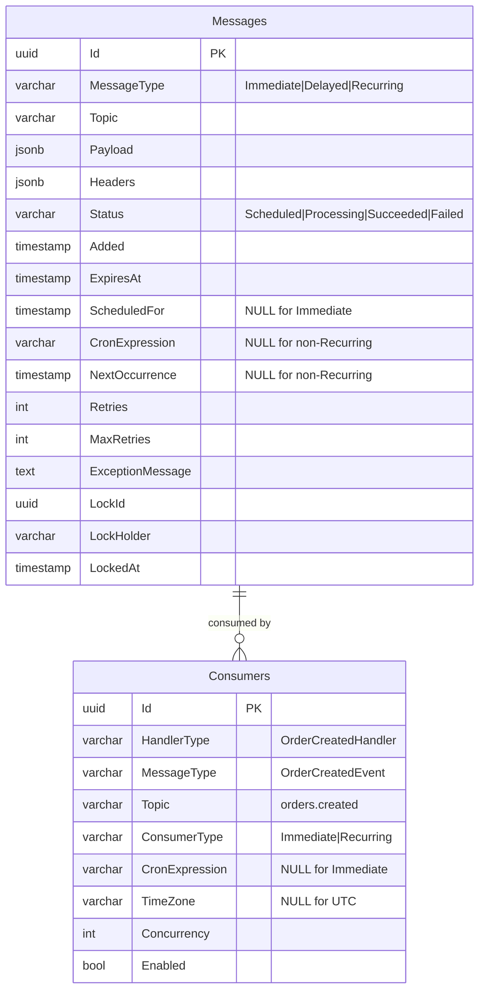

# Unify Framework.Ticker + Framework.Messages into Single Messaging System

## Overview

Merge Framework.Ticker (7 packages - background job scheduling with cron) and Framework.Messages (16 packages - distributed messaging with outbox) into a unified developer experience for immediate messages, delayed messages, and recurring scheduled jobs.

**Current Pain Points:**
- Two separate systems for scheduling vs. messaging (cognitive overhead)
- Overlapping concerns: persistence, retry, monitoring, distributed locking
- Ticker uses attribute-based discovery (`[TickerFunction]`), Messages migrating to interface-based (`IConsume<T>`)
- Separate dashboards, separate configuration APIs, separate storage providers
- No unified pattern for "publish recurring message" or "transactional scheduled job"

**Target State:**
- Single `IConsume<T>` interface for immediate, delayed, AND recurring messages
- Unified configuration API: `services.AddMessaging(m => ...)`
- Shared storage and outbox for transactional consistency
- Consolidated dashboard showing messages + scheduled jobs
- Migration path for existing Ticker and CAP users

**Industry Inspiration:**
- MassTransit: Unified interface for all message types, scheduling extensions
- CAP: Outbox pattern built-in, delayed publishing
- Quartz.NET: Enterprise-grade cron scheduling with clustering
- Hangfire: Developer-friendly dashboard and job management

## Problem Statement

Framework currently has **two independent systems** solving overlapping problems:

**Framework.Ticker** (Background Job Scheduling):
- Cron expressions for recurring jobs (`[TickerFunction]` attribute)
- Time-based scheduling (`ITimeTickerManager`)
- Custom thread pool with concurrency control
- Distributed locking (Redis-based)
- Dashboard for monitoring scheduled jobs
- Source generator for compile-time registration

**Framework.Messages** (Distributed Messaging):
- Type-safe message consumption (`IConsume<T>` - new, `[CapSubscribe]` - legacy)
- Outbox pattern for transactional publishing
- Multiple transports (RabbitMQ, Kafka, Azure Service Bus, etc.)
- Delayed message publishing (`PublishDelayAsync`)
- Dashboard for monitoring messages
- OpenTelemetry integration

**Overlap:**
1. **Scheduling**: Ticker handles cron + time-based, Messages handles delayed publishing
2. **Persistence**: Both use database tables with similar schema (status, retries, locks)
3. **Retry Logic**: Both implement retry with exponential backoff
4. **Monitoring**: Separate dashboards with similar UIs
5. **Distributed Locking**: Both coordinate execution across multiple instances
6. **OpenTelemetry**: Separate packages with similar instrumentation

**Why Merge?**
- Developers shouldn't choose between "scheduling" and "messaging" - these are delivery mechanisms
- Recurring job that publishes message = awkward current state
- Single transaction for job execution + message publishing
- Unified monitoring and operational experience
- Reduce package count and maintenance burden

## Proposed Solution

Create a **unified messaging system** where:

1. **Single Handler Interface**: `IConsume<T>` handles ALL message types (immediate, delayed, recurring)
2. **Unified Publishing API**: `IOutboxPublisher` supports immediate, delayed, AND recurring publication
3. **Shared Storage**: Single database schema for outbox messages + scheduled jobs
4. **Consolidated Dashboard**: `/messaging/dashboard` shows queued + scheduled + failed messages
5. **Flexible Execution**: Cron jobs can publish to broker OR directly dispatch (configurable)
6. **Migration Path**: Keep `[CapSubscribe]` and `[TickerFunction]` temporarily, guide to `IConsume<T>`

## Breaking Changes for Ticker Users

### Migration Strategy: Big Bang (Option A)

**No legacy `[TickerFunction]` support** - Clean break to unified `IConsume<T>` pattern.

All Ticker users must migrate handlers in single deployment. Timeline: ~1-4 days depending on job count.

### What Changes

#### 1. Handler Pattern (BREAKING)
**Before (Ticker):**
```csharp
[TickerFunction("DailyReport", cronExpression: "0 9 * * *")]
public static async Task ExecuteDailyReport(
    TickerFunctionContext context,
    CancellationToken ct)
{
    var request = context.GetRequest<ReportRequest>();
    // Process report
}
```

**After (Unified):**
```csharp
public sealed class DailyReportHandler : IConsume<ReportRequest>
{
    public async ValueTask Consume(
        ConsumeContext<ReportRequest> context,
        CancellationToken ct)
    {
        // Process report (context.Message instead of GetRequest)
    }
}
```

**Changes:**
- Static methods → Instance classes (enables DI via primary constructors)
- `[TickerFunction]` attribute → `IConsume<T>` interface
- `TickerFunctionContext` → `ConsumeContext<T>`
- `context.GetRequest<T>()` → `context.Message`
- Cron expression moves to registration: `m.AddConsumer<Handler>(c => c.Cron("0 9 * * *"))`

#### 2. Registration API (BREAKING)
**Before:**
```csharp
services.AddTickerQ<TimeTickerEntity, CronTickerEntity>(options =>
{
    options.AddOperationalStore(ef =>
        ef.UseTickerQDbContext<AppDbContext>(...));
    options.ConfigureScheduler(s => s.MaxConcurrency = 10);
});

app.UseTickerQ(TickerQStartMode.Immediate);
```

**After:**
```csharp
services.AddMessaging(m =>
{
    m.UsePostgreSql(config => { /* connection */ });
    m.AddConsumer<DailyReportHandler>(c => c.Cron("0 9 * * *"));
    m.ConfigureScheduler(s => s.MaxConcurrency = 10);
});
```

**Changes:**
- `AddTickerQ` → `AddMessaging`
- Generic entity types (`<TimeTickerEntity, CronTickerEntity>`) removed
- `UseTickerQ` middleware → Automatic bootstrap
- Storage configuration: `AddOperationalStore(ef => ...)` → `UsePostgreSql(...)`

#### 3. Package References (BREAKING)
**Before:**
```xml
<PackageReference Include="Framework.Ticker.Core" />
<PackageReference Include="Framework.Ticker.EntityFramework" />
<PackageReference Include="Framework.Ticker.Dashboard" />
```

**After:**
```xml
<PackageReference Include="Framework.Messages.Core" />
<PackageReference Include="Framework.Messages.PostgreSql" />
<PackageReference Include="Framework.Messages.Dashboard" />
```

#### 4. Database Schema (BREAKING - Requires Migration)
**Before (3 tables):**
- `TimeTickers` - Time-based jobs
- `CronTickers` - Cron-based jobs
- `CronTickerOccurrences` - Execution history

**After (1 table):**
- `Messages` - Unified table with `MessageType` enum (Immediate, Delayed, Recurring)

**Migration Required:**
```sql
-- Example migration script (customize for your schema)
INSERT INTO Messages (Id, MessageType, Topic, Payload, CronExpression, TimeZone, ...)
SELECT Id, 'Recurring', Function, Request, Expression, 'UTC', ...
FROM CronTickers;

-- Then drop old tables
DROP TABLE CronTickerOccurrences;
DROP TABLE CronTickers;
DROP TABLE TimeTickers;
```

#### 5. Dashboard URL (Optional Breaking)
**Before:** `/tickerq/dashboard`
**After:** `/messaging/dashboard`

Optional redirect for compatibility:
```csharp
app.MapGet("/tickerq/dashboard", () => Results.Redirect("/messaging/dashboard"));
```

### What Stays the SAME (No Migration Needed)

✅ **Cron expressions** - Identical syntax (`"0 9 * * *"`)
✅ **Time-based scheduling** - Supported via delayed messages
✅ **Distributed locking** - Same behavior (database-based locks)
✅ **Retry logic** - Same fallback/retry mechanism
✅ **Direct dispatch** - Jobs execute directly (not via broker)
✅ **Manual trigger** - Dashboard trigger button works identically
✅ **No hot reload** - Still requires restart for cron changes
✅ **No pause/resume** - Still delete-only (no per-job pause)
✅ **Storage retention** - Jobs kept indefinitely
✅ **Dashboard features** - View history, monitor executions
✅ **Concurrency control** - `MaxConcurrency` setting preserved
✅ **Exception handling** - `ITickerExceptionHandler` equivalent available

### Migration Effort Estimate

**Simple Ticker Usage (< 10 cron jobs):**
- Code changes: ~1-2 hours
- Testing: ~2-4 hours
- Database migration: ~30 mins
- **Total: ~1 day**

**Complex Ticker Usage (10-50 jobs):**
- Code changes: ~1-2 days
- Database migration: ~2-4 hours
- Testing: ~1-2 days
- **Total: ~3-4 days**

### Why Migrate? (Benefits)

1. **Unified DX** - One system for all messaging needs
2. **Transactional Scheduling** - NEW: Schedule jobs within DB transactions
3. **Better DI** - Instance classes → constructor injection
4. **Performance** - Compiled expressions (source generator) faster than reflection
5. **Immediate Messages** - NEW: Publish immediate messages with outbox
6. **Single Dashboard** - Monitor scheduled jobs + messages in one UI
7. **Type Safety** - `IConsume<T>` provides compile-time guarantees

### Core Design Decisions

#### Decision 1: Unified Interface - `IConsume<T>` for All Message Types

**Choice**: Single `IConsume<T>` interface handles immediate, delayed, AND recurring messages.

```csharp
// Single interface for all message types
public sealed class OrderHandler(
    IOrderRepository orders,
    ILogger<OrderHandler> logger
) : IConsume<OrderCreatedEvent>
{
    public async ValueTask Consume(
        ConsumeContext<OrderCreatedEvent> context,
        CancellationToken cancellationToken)
    {
        // Handler doesn't care if message was immediate, delayed, or recurring
        logger.LogInformation(
            "Processing order {OrderId} (scheduled for {ScheduledFor})",
            context.Message.OrderId,
            context.ScheduledFor ?? context.Timestamp);

        await orders.CreateAsync(context.Message, cancellationToken);
    }
}
```

**Context Enhancement**:
```csharp
public sealed class ConsumeContext<TMessage>
{
    // Existing
    public TMessage Message { get; }
    public Guid MessageId { get; }
    public string? CorrelationId { get; }
    public DateTimeOffset Timestamp { get; } // When published
    public IDictionary<string, string?> Headers { get; }
    public string Topic { get; }

    // NEW - Scheduling metadata
    public DateTimeOffset? ScheduledFor { get; }     // NULL if immediate
    public string? RecurringJobName { get; }         // NULL if not recurring
    public string? CronExpression { get; }           // NULL if not recurring
    public int ExecutionAttempt { get; }             // Retry count (0 = first attempt)

    // Computed
    public bool WasDelayed => ScheduledFor.HasValue && ScheduledFor > Timestamp;
    public bool IsRecurring => !string.IsNullOrEmpty(RecurringJobName);
}
```

**Registration**:
```csharp
services.AddMessaging(m =>
{
    // Immediate messages (default)
    m.AddConsumer<OrderHandler>();

    // Recurring job with cron
    m.AddConsumer<DailyReportHandler>(c => c
        .Cron("0 9 * * *")
        .Topic("reports.daily"));

    // Or attribute-based (optional)
    m.AddConsumersFromAssembly(typeof(Program).Assembly);
});

// Attribute option
[RecurringJob("0 9 * * *", Topic = "reports.daily")]
public sealed class DailyReportHandler : IConsume<DailyReport> { }
```

**Rationale**: MassTransit pattern - handlers are message type agnostic. Scheduling is delivery mechanism, not handler concern.

#### Decision 2: Cron Jobs Publish to Broker (Default), Direct Dispatch (Opt-In)

**Choice**: Recurring jobs **publish messages to broker** by default. Allow direct dispatch via configuration for low-latency scenarios.

**Default Behavior (Publish to Broker)**:
```csharp
// Cron triggers at 9:00 AM
// → Framework publishes DailyReport message to "reports.daily" topic
// → Broker delivers to consumer instances (distributed consumption)
// → DailyReportHandler executes via normal message flow
```

```csharp
services.AddMessaging(m =>
{
    m.AddConsumer<DailyReportHandler>(c => c
        .Cron("0 9 * * *")
        .Topic("reports.daily")
        .ExecutionMode(RecurringExecutionMode.PublishMessage)); // DEFAULT
});
```

**Opt-In Direct Dispatch**:
```csharp
services.AddMessaging(m =>
{
    m.AddConsumer<CacheWarmupJob>(c => c
        .Cron("0 */5 * * *")
        .ExecutionMode(RecurringExecutionMode.DirectDispatch) // Bypass broker
        .SingleInstance(true)); // Distributed lock ensures only one instance runs
});
```

**Rationale**:
- **Publish (default)**: Distributed consumption, broker monitoring, consistent with immediate messages
- **Direct Dispatch (opt-in)**: Lower latency for local jobs (e.g., cache warmup), no broker dependency

#### Decision 3: Unified Storage - Single Schema with Message Type Discriminator

**Choice**: Single `Messages` table with `MessageType` enum (Immediate, Delayed, Recurring).

**Schema**:
```sql
CREATE TABLE Messages (
    Id UUID PRIMARY KEY,
    MessageType VARCHAR(20) NOT NULL, -- 'Immediate', 'Delayed', 'Recurring'
    Topic VARCHAR(255) NOT NULL,
    Payload JSONB NOT NULL,
    Headers JSONB,

    -- Status tracking
    Status VARCHAR(20) NOT NULL, -- 'Scheduled', 'Processing', 'Succeeded', 'Failed'
    Added TIMESTAMP NOT NULL DEFAULT NOW(),
    ExpiresAt TIMESTAMP,

    -- Scheduling (NULL for immediate)
    ScheduledFor TIMESTAMP,
    CronExpression VARCHAR(100),
    NextOccurrence TIMESTAMP,

    -- Retry & Error
    Retries INT NOT NULL DEFAULT 0,
    MaxRetries INT NOT NULL DEFAULT 3,
    ExceptionMessage TEXT,

    -- Distributed lock
    LockId UUID,
    LockHolder VARCHAR(255),
    LockedAt TIMESTAMP,

    -- Indexing
    INDEX idx_messages_status_type (Status, MessageType),
    INDEX idx_messages_scheduled (ScheduledFor) WHERE ScheduledFor IS NOT NULL,
    INDEX idx_messages_next_occurrence (NextOccurrence) WHERE NextOccurrence IS NOT NULL
);
```

**Rationale**:
- **Single transaction** for job execution + message publishing
- **Unified queries** for monitoring (dashboard shows all message types)
- **Shared retry logic** (exponential backoff applies to all)
- **Simplified operations** (one table to backup/migrate)

**Alternative Considered (Rejected)**: Separate tables (`OutboxMessages`, `ScheduledJobs`) - adds complexity for joins and transactions.

#### Decision 4: Delayed Publishing Uses Unified Storage (Replaces CAP + Ticker)

**Choice**: `PublishDelayAsync` stores in unified `Messages` table (replaces CAP's outbox delayed + Ticker's time-based scheduling).

**API** (No breaking changes):
```csharp
// Immediate (existing)
await publisher.PublishAsync("orders.created", order);

// Delayed (existing API, new implementation)
await publisher.PublishDelayAsync(
    TimeSpan.FromHours(24),
    "order.reminder",
    reminder);

// Recurring (NEW)
await publisher.PublishRecurringAsync(
    "daily-report",
    "0 9 * * *",
    new DailyReport { Date = DateOnly.FromDateTime(DateTime.UtcNow) });
```

**Implementation**:
```csharp
public interface IOutboxPublisher
{
    // Existing
    Task PublishAsync<T>(string topic, T? message, ...);
    Task PublishDelayAsync<T>(TimeSpan delay, string topic, T? message, ...);

    // NEW
    Task PublishRecurringAsync<T>(
        string name,
        string cronExpression,
        T? message,
        IDictionary<string, string?>? headers = null,
        CancellationToken cancellationToken = default);

    Task CancelDelayedAsync(Guid messageId, CancellationToken cancellationToken = default);
    Task PauseRecurringAsync(string name, CancellationToken cancellationToken = default);
    Task ResumeRecurringAsync(string name, CancellationToken cancellationToken = default);
}
```

**Constraint Removed**: CAP's outbox typically has 7-day retention. Unified storage supports delays > 7 days (configurable retention per message type).

#### Decision 5: Cron Job Retry - Immediate Retry with Short Backoff, Then Wait

**Choice**: Recurring jobs retry immediately with **short backoff** (max 2 minutes), then skip until next occurrence.

**Example**:
```csharp
// Cron: "0 9 * * *" (daily at 9 AM)
// Job executes at 9:00 AM, throws DbConnectionException

// Retry attempts:
// 9:00:05 AM (5s backoff) → Still failing
// 9:00:15 AM (10s backoff) → Still failing
// 9:00:35 AM (20s backoff) → Still failing
// 9:01:05 AM (30s backoff) → Still failing
// 9:02:05 AM (60s backoff) → Still failing

// Max retry duration reached (2 minutes)
// → Mark as Failed
// → Next attempt: Tomorrow at 9:00 AM
```

**Configuration**:
```csharp
services.AddMessaging(m =>
{
    m.ConfigureRetryPolicy(r => r
        .MaxRetries(5)
        .InitialBackoff(TimeSpan.FromSeconds(5))
        .MaxBackoff(TimeSpan.FromMinutes(2))  // Recurring jobs cap at 2 min
        .BackoffMultiplier(2.0));

    // Override for specific consumer
    m.AddConsumer<CriticalJobHandler>(c => c
        .Cron("0 */1 * * *")
        .RetryPolicy(r => r.NoRetry())); // Don't retry, wait for next occurrence
});
```

**Rationale**: Balance between recovering from transient failures and not blocking next occurrence. Immediate messages use full exponential backoff (up to hours).

### Implementation Phases

#### Phase 1: Core Unified Abstraction (1 week)

**Goals**:
- Create unified `Messages` storage schema
- Enhance `ConsumeContext<T>` with scheduling metadata
- Implement `PublishDelayAsync` using new storage (replace CAP implementation)
- Background processor polls for due messages (immediate + delayed)

**Files**:
- `src/Headless.Messages.Abstractions/ConsumeContext.cs` - Add scheduling properties
- `src/Headless.Messages.Core/Storage/IDataStorage.cs` - Update interface for unified schema
- `src/Headless.Messages.Core/Internal/MessageEntity.cs` - Add MessageType enum, scheduling fields
- `src/Headless.Messages.Core/Internal/ScheduledMessageProcessor.cs` - NEW - polls Messages table for due messages
- `src/Headless.Messages.PostgreSql/PostgreSqlDataStorage.cs` - Implement unified schema
- `src/Headless.Messages.SqlServer/SqlServerDataStorage.cs` - Implement unified schema

**Migration**:
```sql
-- PostgreSQL migration
ALTER TABLE cap.published
ADD COLUMN message_type VARCHAR(20) DEFAULT 'Immediate',
ADD COLUMN scheduled_for TIMESTAMP,
ADD COLUMN cron_expression VARCHAR(100),
ADD COLUMN next_occurrence TIMESTAMP;

CREATE INDEX idx_published_scheduled ON cap.published(scheduled_for)
WHERE scheduled_for IS NOT NULL;
```

**Test Coverage**:
- Immediate message flow (existing, verify no regression)
- Delayed message stored and dispatched correctly
- Background processor polls every 5 seconds (configurable)
- Delayed message canceled before dispatch

**Acceptance Criteria**:
- [ ] `PublishDelayAsync` stores message in `Messages` table with `ScheduledFor` timestamp
- [ ] `ScheduledMessageProcessor` dispatches delayed messages within 1 second of `ScheduledFor`
- [ ] Delayed messages support cancellation via `CancelDelayedAsync`
- [ ] Migration script tested on existing CAP databases
- [ ] All existing Messages tests pass

#### Phase 2: Recurring Job Integration (1 week)

**Goals**:
- Implement `AddConsumer<T>(c => c.Cron(...))` registration
- Support `[RecurringJob]` attribute for convention-based discovery
- Implement `PublishRecurringAsync` API
- Cron scheduler calculates next occurrence and publishes messages
- Dashboard shows upcoming recurring jobs

**Files**:
- `src/Headless.Messages.Abstractions/IMessagingBuilder.cs` - Add Cron() extension
- `src/Headless.Messages.Abstractions/Attributes/RecurringJobAttribute.cs` - NEW
- `src/Headless.Messages.Core/Internal/RecurringJobScheduler.cs` - NEW - cron expression evaluation
- `src/Headless.Messages.Core/Internal/RecurringJobSeedingService.cs` - NEW - IHostedService for seeding
- `src/Headless.Messages.Core/DependencyInjection/ConsumerBuilder.cs` - Add Cron(), ExecutionMode() methods
- `src/Headless.Messages.Dashboard/Pages/RecurringJobs.razor` - NEW - recurring jobs UI

**Registration Examples**:
```csharp
// Fluent API
services.AddMessaging(m =>
{
    m.AddConsumer<DailyReportHandler>(c => c
        .Cron("0 9 * * *")
        .Topic("reports.daily")
        .TimeZone(TimeZoneInfo.FindSystemTimeZoneById("America/New_York")));
});

// Attribute-based
[RecurringJob("0 9 * * *", Topic = "reports.daily", TimeZone = "America/New_York")]
public sealed class DailyReportHandler : IConsume<DailyReport>
{
    public async ValueTask Consume(ConsumeContext<DailyReport> ctx, CancellationToken ct)
    {
        // Handler receives message at 9 AM daily
    }
}
```

**Cron Scheduler Logic**:
```csharp
// Runs every minute
while (!cancellationToken.IsCancellationRequested)
{
    var now = DateTimeOffset.UtcNow;
    var dueJobs = await storage.GetRecurringJobsDueAsync(now, ct);

    foreach (var job in dueJobs)
    {
        // Publish message to topic
        await publisher.PublishAsync(job.Topic, job.Payload, job.Headers, ct);

        // Calculate next occurrence
        var nextOccurrence = CronExpression.Parse(job.CronExpression).GetNextOccurrence(now);
        await storage.UpdateNextOccurrenceAsync(job.Id, nextOccurrence, ct);
    }

    await Task.Delay(TimeSpan.FromMinutes(1), cancellationToken);
}
```

**Test Coverage**:
- Cron job registered and seeded to database
- Next occurrence calculated correctly for various cron expressions
- Message published at scheduled time (integration test with time mocking)
- Recurring job paused/resumed via API
- Timezone handling (job scheduled in EST, server in UTC)

**Acceptance Criteria**:
- [ ] `AddConsumer<T>(c => c.Cron(...))` registers recurring job in database
- [ ] `[RecurringJob]` attribute discovered via assembly scanning
- [ ] Cron scheduler publishes messages within 1 second of next occurrence
- [ ] Dashboard shows upcoming recurring jobs with next occurrence time
- [ ] Recurring jobs support pause/resume without code changes
- [ ] All Ticker cron functionality migrated

#### Phase 3: Dashboard Consolidation (1 week)

**Goals**:
- Merge Messages and Ticker dashboards into single UI
- Show immediate, delayed, and recurring messages in unified views
- Add filters: message type, status, topic
- Manual trigger for recurring jobs
- Re-publish failed messages

**Files**:
- `src/Headless.Messages.Dashboard/Pages/Index.razor` - Update with tabs for Immediate/Delayed/Recurring
- `src/Headless.Messages.Dashboard/Pages/FailedMessages.razor` - NEW - DLQ view
- `src/Headless.Messages.Dashboard/Pages/RecurringJobs.razor` - Recurring jobs management
- `src/Headless.Messages.Dashboard/Shared/MessageTypeFilter.cs` - NEW - filter component
- `src/Headless.Messages.Dashboard/Api/MessagingController.cs` - Add endpoints for manual trigger, pause/resume

**Dashboard Views**:

**Tab 1: Consumers**
- List all registered `IConsume<T>` handlers
- Show handler type, message type, concurrency, status (active/paused)
- Filter: immediate vs. recurring

**Tab 2: Published Messages**
- List messages by type (immediate, delayed, recurring)
- Columns: ID, Topic, Type, Status, Added, ScheduledFor, Retries
- Filters: Message type, status, date range, topic
- Actions: View payload, retry failed, cancel delayed

**Tab 3: Recurring Jobs**
- List recurring jobs
- Columns: Name, Cron, Next Occurrence, Last Execution, Status
- Actions: Trigger now, pause, resume, edit cron
- Real-time countdown to next execution

**Tab 4: Failed Messages (DLQ)**
- List failed messages across all types
- Columns: ID, Topic, Type, Failed At, Exception, Retries
- Actions: Re-publish, delete, view stacktrace

**Tab 5: Metrics**
- Message throughput (messages/sec)
- Recurring job execution time (p50, p95, p99)
- Failed message rate
- Consumer lag (broker-specific)

**Test Coverage**:
- Dashboard loads all message types correctly
- Filters work (e.g., show only recurring jobs)
- Manual trigger executes job immediately
- Re-publish failed message creates new message

**Acceptance Criteria**:
- [ ] Single dashboard at `/messaging/dashboard` shows all message types
- [ ] Recurring jobs can be manually triggered from UI
- [ ] Failed messages can be re-published from DLQ
- [ ] Cron expressions can be updated via dashboard (hot reload)
- [ ] Real-time updates via SignalR (messages appear within 1 second)

#### Phase 4: Migration Tooling & Documentation (3-5 days)

**Goals**:
- Provide migration guides for Ticker users
- Keep `[TickerFunction]` deprecated but functional (opt-in legacy mode)
- Roslyn analyzer to suggest migration to `IConsume<T>`

**Deliverables**:

**Migration Guide** (`docs/migration/ticker-to-messaging.md`):
```markdown
# Migrating from Framework.Ticker to Framework.Messages

## Before (Ticker)
```csharp
[TickerFunction("DailyReport", cronExpression: "0 9 * * *")]
public static async Task ExecuteDailyReport(TickerFunctionContext context, CancellationToken ct)
{
    var payload = context.GetRequest<DailyReportRequest>();
    // Process report
}

services.AddTickerQ<TimeTickerEntity, CronTickerEntity>(options =>
{
    options.AddOperationalStore(ef => ef.UseTickerQDbContext<AppDbContext>(...));
});
```

## After (Messages)
```csharp
public sealed class DailyReportHandler : IConsume<DailyReportRequest>
{
    public async ValueTask Consume(ConsumeContext<DailyReportRequest> ctx, CancellationToken ct)
    {
        // Process report
    }
}

services.AddMessaging(m =>
{
    m.AddConsumer<DailyReportHandler>(c => c.Cron("0 9 * * *"));
    m.UsePostgreSql(config => { /* ... */ });
});
```

## Breaking Changes
- `TickerFunctionContext` → `ConsumeContext<T>`
- Static methods → Instance methods (primary constructor for DI)
- Payload serialization: Binary (`byte[]`) → JSON (`JSONB`)

## Migration Steps
1. Install `Framework.Messages.Core` + storage provider
2. Create `IConsume<T>` handlers (copy logic from `[TickerFunction]` methods)
3. Register handlers with `.Cron(...)` configuration
4. Test in staging environment
5. Deploy and remove `Framework.Ticker.*` packages
```

**Roslyn Analyzer** (`src/Headless.Messages.Analyzers/TickerFunctionAnalyzer.cs`):
- Detects `[TickerFunction]` usage
- Suggests: "Migrate to IConsume<T> for better performance and type safety"
- Code fix: Auto-generate `IConsume<T>` handler class from `[TickerFunction]` method

**Legacy Support** (Optional):
```csharp
// For gradual migration, support [TickerFunction] via compatibility layer
services.AddMessaging(m =>
{
    m.EnableLegacyTickerSupport(); // Discovers [TickerFunction], converts to recurring jobs
});
```

**Acceptance Criteria**:
- [ ] Migration guide covers all common Ticker scenarios
- [ ] Roslyn analyzer detects `[TickerFunction]` and suggests migration
- [ ] Code fix auto-generates `IConsume<T>` handler (80% accuracy)
- [ ] Legacy support mode allows gradual migration (optional feature)

### ERD: Unified Messages Schema



## Technical Considerations

### Distributed Lock Coordination

**Current State**:
- Ticker uses Redis-based distributed lock (`IResourceLocker`)
- Messages uses database lock (`LockId`, `LockHolder`, `LockedAt` columns)

**Unified Approach**:
- Use database-based locking (simpler, no Redis dependency)
- Lock acquisition via optimistic concurrency:
  ```sql
  UPDATE Messages
  SET LockId = @newLockId, LockHolder = @instanceId, LockedAt = NOW()
  WHERE Id = @messageId AND LockId IS NULL
  RETURNING *;
  ```
- Lock expiration: Background processor releases locks older than 5 minutes
- For high-concurrency scenarios, Redis-based locking remains optional

### Performance

**Throughput Targets**:
- Immediate messages: 10,000 msg/sec (existing CAP performance)
- Delayed messages: 1,000 msg/sec (batch inserts)
- Recurring jobs: 100 jobs/sec (scheduler queries every 1 minute)

**Optimizations**:
- Use compiled expressions for `IConsume<T>` dispatch (5-8x faster than reflection)
- Batch processing: Scheduler fetches up to 1,000 due messages per query
- Index optimization: Composite index on `(Status, MessageType, ScheduledFor)`
- Connection pooling: Dedicated connection for scheduler to avoid contention

### Security

**Concerns**:
- **Payload Injection**: JSONB allows arbitrary payloads - validate message types
- **Cron Expression Validation**: Malformed cron could cause infinite loops
- **Lock Poisoning**: Malicious instance could hold locks indefinitely

**Mitigations**:
- Payload deserialization: Strict type checking before dispatch
- Cron validation: NCrontab library throws on invalid expressions (fail fast at registration)
- Lock TTL: Automatic lock release after 5 minutes (configurable)
- Instance registration: Validate `instanceId` format (GUID or hostname)

## Acceptance Criteria

### Functional Requirements

- [ ] **Immediate Messages**: `PublishAsync` works identical to current CAP behavior
- [ ] **Delayed Messages**: `PublishDelayAsync` stores in unified schema, dispatches within 1s of scheduled time
- [ ] **Recurring Jobs**: `AddConsumer<T>(c => c.Cron(...))` registers job, publishes messages at cron schedule
- [ ] **Unified Handlers**: Single `IConsume<T>` handler receives all message types (immediate/delayed/recurring)
- [ ] **Transactional Publishing**: `IOutboxPublisher.Transaction` supports delayed and recurring messages
- [ ] **Retry Policy**: Recurring jobs retry immediately (short backoff), then wait for next occurrence
- [ ] **Concurrency Control**: Per-consumer concurrency limits apply to all message types
- [ ] **Distributed Lock**: Only one instance executes recurring job across cluster

### Non-Functional Requirements

- [ ] **Performance**: Immediate message throughput >= 10,000 msg/sec (no regression)
- [ ] **Storage**: Database size increase <= 20% (unified schema is efficient)
- [ ] **Latency**: Scheduled jobs execute within 1 second of due time (99th percentile)
- [ ] **Migration**: Zero downtime migration from CAP to unified schema (backward compatible)

### Quality Gates

- [ ] **Unit Test Coverage**: >= 85% for Messages.Core (existing + new scheduling logic)
- [ ] **Integration Tests**: All message types tested with real storage providers (Postgres, SQL Server)
- [ ] **Load Tests**: 10,000 msg/sec for 10 minutes without errors
- [ ] **Migration Tests**: CAP database migrated to unified schema successfully
- [ ] **Dashboard Tests**: All CRUD operations work via UI

## Success Metrics

**Developer Experience**:
- Single configuration API (vs. two separate systems)
- 50% fewer packages to reference (Messages.Core + storage vs. Messages.Core + Ticker.Core + storages)
- Unified documentation (one guide vs. two)

**Operational Efficiency**:
- Single dashboard for all messages (vs. two dashboards)
- Unified monitoring (one OpenTelemetry package)
- Simplified deployments (fewer packages to version)

**Performance**:
- No regression on immediate message throughput (baseline: 10,000 msg/sec)
- Recurring jobs execute within 1 second of schedule (99th percentile)
- Delayed messages dispatched within 1 second of scheduled time

## Dependencies & Prerequisites

**Blocking**:
- ✅ Complete Messages `IConsume<T>` migration (Parts 1-2 of existing plan) - **1 week**
  - Why: Unified interface depends on type-safe handler pattern
  - Status: `IConsume<T>` already implemented (commit 407c4029), needs convention system

**Recommended** (Not Blocking):
- Messages Part 3: Retry policies (can be done in parallel with Phase 2)
- Messages Part 4: Filter pipeline (can be added post-merge)
- Messages Part 5: Validation (can be added post-merge)

**Infrastructure**:
- Database migration scripts tested on staging
- Load testing environment with >= 10,000 msg/sec capacity
- Dashboard deployment pipeline (SPA build + embedding)

## Risk Analysis & Mitigation

### CRITICAL Risks

**Risk 1: Storage Schema Migration Breaking Production**
- **Impact**: High - Could corrupt existing outbox messages
- **Probability**: Medium - ALTER TABLE can lock tables
- **Mitigation**:
  1. Test migration on copy of production database
  2. Use online schema change tools (pt-online-schema-change for MySQL, pg_repack for Postgres)
  3. Feature flag: Keep old schema working during migration
  4. Rollback plan: DROP new columns, revert to CAP schema
- **Contingency**: Blue-green deployment with separate databases

**Risk 2: Performance Regression on Immediate Messages**
- **Impact**: High - Slower message processing affects all users
- **Probability**: Low - Unified schema adds minimal overhead
- **Mitigation**:
  1. Benchmark before/after with 10,000 msg/sec load test
  2. Index tuning: Ensure `idx_messages_status_type` is used in queries
  3. Connection pool sizing: Monitor active connections under load
- **Contingency**: Revert to old schema via feature flag

**Risk 3: Recurring Job Scheduler Missing Occurrences**
- **Impact**: High - Jobs not executing could cause business impact
- **Probability**: Medium - Timezone, clock skew, or leap second edge cases
- **Mitigation**:
  1. Use battle-tested NCrontab library for cron parsing
  2. Scheduler runs every 30 seconds (not 1 minute) for redundancy
  3. Alerting: Prometheus metric for "missed occurrences" (expected - actual)
  4. Graceful degradation: If scheduler crashes, next instance picks up
- **Contingency**: Manual trigger from dashboard + alerting

### HIGH Risks

**Risk 4: Dashboard Consolidation - Complex UI**
- **Impact**: Medium - Poor UX could confuse users
- **Probability**: High - Two systems with different mental models
- **Mitigation**:
  1. User testing with 5 beta testers before release
  2. Progressive disclosure: Default to "Immediate Messages" tab
  3. Tooltips and onboarding for new recurring jobs features
  4. Keep old dashboards available via feature flag during migration
- **Contingency**: Ship separate dashboards initially, merge later

**Risk 5: Migration Path Too Complex**
- **Impact**: Medium - Slow adoption if migration is painful
- **Probability**: Medium - Breaking changes require code rewrite
- **Mitigation**:
  1. Roslyn analyzer auto-generates 80% of migration code
  2. Legacy support mode: Keep `[TickerFunction]` working (deprecated)
  3. Migration guide with step-by-step examples
  4. Office hours / Slack support channel during migration period
- **Contingency**: Extend legacy support timeline (6 months → 12 months)

### MEDIUM Risks

**Risk 6: Distributed Lock Contention**
- **Impact**: Low - Slow job execution, not failures
- **Probability**: Medium - High job count could cause lock contention
- **Mitigation**:
  1. Lock expiration: Auto-release after 5 minutes
  2. Dead node cleanup: Background service releases orphaned locks
  3. Redis-based locking: Optional for high-concurrency scenarios
- **Contingency**: Add Redis lock provider package

**Risk 7: Cron Expression Validation Gaps**
- **Impact**: Low - Invalid cron causes startup failure (fail fast)
- **Probability**: Low - NCrontab validates at registration
- **Mitigation**:
  1. Validation at registration time (fail fast)
  2. Dashboard UI: Cron expression tester (show next 5 occurrences)
  3. Documentation: Common cron examples
- **Contingency**: Configuration reload endpoint to fix invalid cron without restart

## Future Considerations

**Phase 5: Advanced Scheduling** (Post-Merge):
- Misfire policies (Quartz.NET-style): Skip, RunImmediately, RunAll
- Business calendars: Skip holidays, weekends
- Conditional scheduling: "Run only if no messages in queue"
- Chained jobs: "Run Job B after Job A succeeds"

**Phase 6: Multi-Region Coordination** (Post-Merge):
- Cross-region distributed locks (Consul, etcd)
- Region-aware scheduling: "Run in US-EAST only"
- Geo-replicated outbox (eventual consistency)

**Phase 7: Saga Support** (Post-Merge):
- Long-running workflows with compensation
- State persistence per saga instance
- Timeout handling for saga steps

**Phase 8: Event Sourcing Integration** (Post-Merge):
- Publish domain events to event store
- Rebuild projections via recurring jobs
- Snapshot creation via scheduled jobs

## Documentation Plan

**New Guides**:
- `docs/messaging/getting-started.md` - Quick start with all message types
- `docs/messaging/delayed-messages.md` - Scheduling delayed execution
- `docs/messaging/recurring-jobs.md` - Cron-based scheduling
- `docs/messaging/outbox-pattern.md` - Transactional publishing
- `docs/migration/ticker-to-messaging.md` - Migration guide for Ticker users
- `docs/migration/cap-to-iconsume.md` - Migration guide for CAP users (existing)

**Updated Guides**:
- `README.md` - Update package count, add Messaging section
- `src/Headless.Messages.*/README.md` - Update with recurring job examples
- `docs/architecture/messaging-architecture.md` - NEW - System design doc

**API Reference**:
- `IOutboxPublisher` - Add recurring methods
- `ConsumeContext<T>` - Document scheduling properties
- `IMessagingBuilder` - Document Cron() and ExecutionMode() methods

## ✅ Resolved Design Decisions

All critical questions resolved following Ticker's existing patterns for consistency:

### 1. Storage Retention for Recurring Jobs
**Decision:** Keep indefinitely (no auto-cleanup)
- Recurring job definitions stored permanently in `Messages` table
- Execution history cleaned up separately (existing CAP behavior)
- Matches current Ticker behavior

### 2. Transactional Scheduling Semantics
**Decision:** Yes - Full transactional support
- Recurring job creation/deletion participates in `IOutboxPublisher.Transaction`
- Atomic with entity changes (both commit or both rollback)
- Consistent with immediate/delayed message behavior

### 3. Cron Timezone Handling
**Decision:** Configurable timezone per job (defaults to UTC)
- Each job specifies timezone via `.TimeZone("America/New_York")`
- Handles DST automatically using `TimeZoneInfo`
- Stored in database: `TimeZone VARCHAR(100)` column

### 4. Message Type Migration for Existing CAP Data
**Decision:** N/A - No migration needed
- Framework.Messages not in production yet
- Fresh schema from day one with `message_type NOT NULL`
- No backfill logic required

### 5. Dashboard Consolidation
**Decision:** Merge CAP into Ticker dashboard at `/messaging/dashboard`
- Base on existing Ticker dashboard UI
- Add CAP message features (Published Messages, DLQ) as new tabs
- Optional redirect from `/tickerq/dashboard` for compatibility

### 6. Manual Trigger Semantics
**Decision:** Direct invoke handler (Ticker's current behavior)
- Manual trigger bypasses broker, invokes handler directly
- Same execution path as scheduled jobs in Ticker
- Runs on instance handling the trigger request

### 7. Failed Recurring Job Behavior
**Decision:** Stay visible in DB, auto-retry for timeouts
- Failed jobs marked as `Failed`, stored in database with exception details
- Next cron occurrence gets fresh attempt (retry count resets)
- Fallback service auto-retries jobs stuck in `InProgress` (timeout recovery)
- Dashboard shows failed jobs (acts as DLQ)

### 8. Source Generator Applicability
**Decision:** Generate compiled expressions at build time
- Convert Ticker's source generator to generate compiled expression dispatchers
- Discovers `IConsume<T>` implementations at compile-time
- Even faster than Messages' current runtime compilation
- NativeAOT compatible

### 9. Hot Reload for Cron Expressions
**Decision:** No - Requires application restart
- Cron expressions read from database at startup (seeding/migration)
- Code changes update database on next restart
- Dashboard shows cron expressions (read-only)
- Matches current Ticker behavior

### 10. Pause/Resume API Scope
**Decision:** No pause/resume - Only delete jobs
- No per-job pause/resume initially (matches Ticker)
- Delete recurring jobs via API/dashboard
- Global scheduler freeze (operational tool, not per-job)
- Future enhancement: Add `Enabled` boolean flag

## References & Research

### Internal

**Existing Plans**:
- `plans/refactor-replace-capsubscribe-with-iconsume.md` - Messages migration plan (5 parts)
- `plans/refactor-iconsume-part1-core-foundation.md` - Part 1: Core `IConsume<T>` implementation
- `plans/refactor-iconsume-part2-conventions-assembly-scanning.md` - Part 2: Convention system

**Repository Analysis**:
- Framework.Ticker packages: 7 packages (`src/Headless.Ticker.*`)
- Framework.Messages packages: 16 packages (`src/Headless.Messages.*`)
- Overlapping concerns: Persistence, retry, locks, monitoring, OpenTelemetry

**Code References**:
- `src/Headless.Messages.Abstractions/IConsume.cs:15` - Current `IConsume<T>` interface
- `src/Headless.Messages.Abstractions/ConsumeContext.cs:8` - Current context (needs scheduling properties)
- `src/Headless.Ticker.Abstractions/Entities/CronTickerEntity.cs:7` - Cron job entity (migrate to Messages schema)
- `src/Headless.Ticker.Core/TickerQSchedulerBackgroundService.cs:23` - Scheduler logic (port to Messages)
- `src/Headless.Messages.Core/Internal/CompiledMessageDispatcher.cs:12` - Compiled expression dispatch (keep)

### External

**Industry Patterns**:
- [MassTransit Documentation](https://masstransit.io/) - Unified consumer interface, scheduling extensions
- [DotNetCore.CAP](https://github.com/dotnetcore/CAP) - Outbox pattern, delayed publishing
- [Quartz.NET](https://www.quartz-scheduler.net/) - Enterprise cron scheduling, clustering
- [Hangfire](https://www.hangfire.io/) - Dashboard-driven background jobs
- [Rebus](https://github.com/rebus-org/Rebus) - Deferred messages, minimalist API

**Best Practices**:
- [Implementing the Outbox Pattern](https://www.milanjovanovic.tech/blog/implementing-the-outbox-pattern) - Transactional publishing
- [Background Jobs in .NET](https://amarozka.dev/background-jobs-schedulers-dotnet-hangfire-quartz-temporal/) - Hangfire vs Quartz comparison
- [NServiceBus Delayed Delivery](https://docs.particular.net/nservicebus/messaging/delayed-delivery) - Delayed message patterns
- [Distributed Tracing with OpenTelemetry](https://openobserve.ai/blog/distributed-tracing-in-dotnet-application/) - Messaging instrumentation

**Framework Documentation**:
- [Primary Constructors in .NET 8](https://www.jondjones.com/programming/aspnet-core/framework/primary-constructors-in-net-8-everything-you-need-to-know/)
- [Health Checks in ASP.NET Core](https://learn.microsoft.com/en-us/aspnet/core/host-and-deploy/health-checks)
- [FluentValidation](https://docs.fluentvalidation.net/) - Message validation patterns
