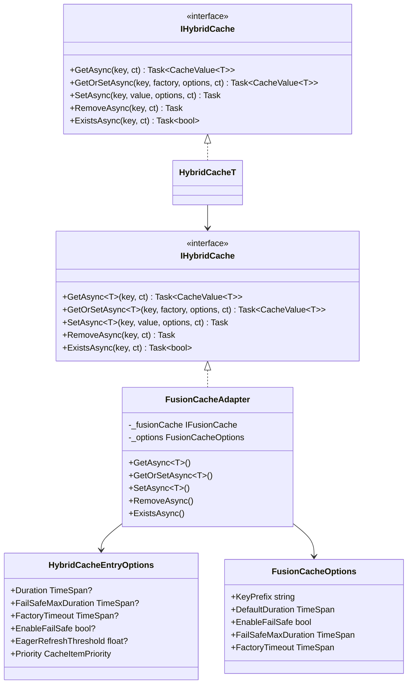

# feat: Caching abstraction supporting Foundatio and FusionCache

## Overview

Create a new caching interface that can be implemented by both Foundatio caching and FusionCache providers. The current `ICache` interface closely mirrors Foundatio's `ICacheClient` with atomic ops, CAS, lists, and prefix operations. FusionCache has a fundamentally different paradigm: high-level cache-aside pattern with L1+L2 hybrid, fail-safe, and eager refresh.

**Key insight**: These libraries serve different purposes. Rather than forcing one interface, design a layered approach.

## Problem Statement

Current state:
- `ICache` interface at `src/Framework.Caching.Abstractions/ICache.cs` is Foundatio-specific
- Existing usages (`CacheResourceLockStorage`, `IdempotencyMiddleware`) require CAS operations FusionCache cannot provide
- No support for FusionCache's killer features: fail-safe, eager refresh, L1+L2 hybrid

Pain points:
- Cannot swap Foundatio for FusionCache without breaking existing code
- No stampede protection in current `GetOrAddAsync` extension
- Missing fail-safe fallback for resilient caching

## Proposed Solution

**Two-tier interface design:**

```
┌─────────────────────────────────────────────────────────────────┐
│                    Interface Hierarchy                          │
├─────────────────────────────────────────────────────────────────┤
│                                                                 │
│  ICache (existing, Foundatio-style)                             │
│    └── Atomic ops, CAS, lists, prefix removal                   │
│    └── Providers: InMemory, Redis (via Foundatio)               │
│                                                                 │
│  IHybridCache (new, FusionCache-style)                          │
│    └── GetOrSetAsync with factory + options                     │
│    └── Fail-safe, eager refresh, stampede protection            │
│    └── Providers: FusionCache (L1+L2), InMemory (L1 only)       │
│                                                                 │
│  Shared: CacheValue<T>, CacheEntryOptions                       │
│                                                                 │
└─────────────────────────────────────────────────────────────────┘
```

## Technical Approach

### Phase 1: Core Interface Design

**New interface:** `IHybridCache`

```csharp
// src/Framework.Caching.Abstractions/IHybridCache.cs
public interface IHybridCache : IDisposable
{
    Task<CacheValue<T>> GetAsync<T>(string key, CancellationToken ct = default);

    Task<CacheValue<T>> GetOrSetAsync<T>(
        string key,
        Func<CancellationToken, Task<T?>> factory,
        HybridCacheEntryOptions? options = null,
        CancellationToken ct = default);

    Task SetAsync<T>(
        string key,
        T? value,
        HybridCacheEntryOptions? options = null,
        CancellationToken ct = default);

    Task RemoveAsync(string key, CancellationToken ct = default);

    Task<bool> ExistsAsync(string key, CancellationToken ct = default);
}
```

**New options class:** `HybridCacheEntryOptions`

```csharp
// src/Framework.Caching.Abstractions/HybridCacheEntryOptions.cs
public sealed record HybridCacheEntryOptions
{
    public TimeSpan? Duration { get; init; }
    public TimeSpan? FailSafeMaxDuration { get; init; }
    public TimeSpan? FactoryTimeout { get; init; }
    public bool? EnableFailSafe { get; init; }
    public float? EagerRefreshThreshold { get; init; }  // 0.0 - 1.0
    public CacheItemPriority Priority { get; init; } = CacheItemPriority.Normal;
}
```

**Files to create:**
- `src/Framework.Caching.Abstractions/IHybridCache.cs`
- `src/Framework.Caching.Abstractions/IHybridCache{T}.cs`
- `src/Framework.Caching.Abstractions/HybridCacheEntryOptions.cs`
- `src/Framework.Caching.Abstractions/HybridCacheOptions.cs`

### Phase 2: FusionCache Provider

**New package:** `Framework.Caching.FusionCache`

```
src/Framework.Caching.FusionCache/
├── FusionCacheAdapter.cs           # Implements IHybridCache
├── FusionCacheOptions.cs           # Provider options
├── FusionCacheOptionsValidator.cs  # FluentValidation
├── Setup.cs                        # DI extension methods
└── Framework.Caching.FusionCache.csproj
```

**Adapter implementation sketch:**

```csharp
// src/Framework.Caching.FusionCache/FusionCacheAdapter.cs
public sealed class FusionCacheAdapter(
    IFusionCache fusionCache,
    FusionCacheOptions options) : IHybridCache
{
    public async Task<CacheValue<T>> GetOrSetAsync<T>(
        string key,
        Func<CancellationToken, Task<T?>> factory,
        HybridCacheEntryOptions? options,
        CancellationToken ct)
    {
        var prefixedKey = _PrefixKey(key);
        var fcOptions = _MapOptions(options);

        var result = await fusionCache.GetOrSetAsync<T>(
            prefixedKey,
            async (ctx, token) => await factory(token).AnyContext(),
            fcOptions,
            ct).AnyContext();

        return result is null
            ? CacheValue<T>.Null
            : new CacheValue<T>(result, hasValue: true);
    }
}
```

### Phase 3: In-Memory Hybrid Cache (Optional)

For testing and simple scenarios, provide in-memory `IHybridCache` using Foundatio's `InMemoryCacheClient` wrapped with stampede protection.

**Files:**
- `src/Framework.Caching.Foundatio.Memory/InMemoryHybridCacheAdapter.cs`

### Phase 4: Tests

**Harness:**
- `tests/Framework.Caching.Tests.Harness/HybridCacheTestsBase.cs`

**Unit tests:**
- `tests/Framework.Caching.FusionCache.Tests.Unit/`

**Integration tests:**
- `tests/Framework.Caching.FusionCache.Tests.Integration/` (Redis + FusionCache)

## Acceptance Criteria

### Functional Requirements

- [ ] `IHybridCache` interface with Get, GetOrSet, Set, Remove, Exists
- [ ] `HybridCacheEntryOptions` with Duration, FailSafe, FactoryTimeout, EagerRefresh
- [ ] FusionCache provider implementing `IHybridCache`
- [ ] DI setup extension: `services.AddFusionCache(options => ...)`
- [ ] Existing `ICache` interface unchanged (backward compatible)

### Non-Functional Requirements

- [ ] GetOrSetAsync prevents cache stampede (single factory execution per key)
- [ ] Fail-safe returns stale value when factory fails
- [ ] Factory timeout prevents hanging
- [ ] L1+L2 hybrid caching with Redis as L2

### Quality Gates

- [ ] Unit tests for adapter logic
- [ ] Integration tests with Redis container
- [ ] Test harness base class for provider conformance

## Dependencies & Risks

**Dependencies:**
- `ZiggyCreatures.FusionCache` NuGet package (add to `Directory.Packages.props`)
- `ZiggyCreatures.FusionCache.Serialization.SystemTextJson`
- Optional: `ZiggyCreatures.FusionCache.Backplane.StackExchangeRedis`

**Risks:**
| Risk | Mitigation |
|------|------------|
| FusionCache API changes | Pin to specific version, add adapter tests |
| Performance of L1+L2 sync | Configure backplane only when needed |
| Serialization mismatch | Use existing `ISerializer` via adapter |

## File Structure

```
src/
├── Framework.Caching.Abstractions/
│   ├── ICache.cs                     # Existing (unchanged)
│   ├── IHybridCache.cs               # NEW
│   ├── IHybridCache{T}.cs            # NEW
│   ├── HybridCacheEntryOptions.cs    # NEW
│   └── HybridCacheOptions.cs         # NEW
│
├── Framework.Caching.FusionCache/
│   ├── FusionCacheAdapter.cs         # NEW
│   ├── FusionCacheOptions.cs         # NEW
│   ├── FusionCacheOptionsValidator.cs # NEW
│   ├── FusionCacheSerializerAdapter.cs # NEW
│   ├── Setup.cs                      # NEW
│   └── Framework.Caching.FusionCache.csproj # NEW
│
tests/
├── Framework.Caching.Tests.Harness/
│   └── HybridCacheTestsBase.cs       # NEW
│
├── Framework.Caching.FusionCache.Tests.Unit/
│   └── FusionCacheAdapterTests.cs    # NEW
│
└── Framework.Caching.FusionCache.Tests.Integration/
    └── FusionCacheRedisTests.cs      # NEW
```

## ERD



## References

### Internal References

- Existing caching abstraction: `src/Framework.Caching.Abstractions/ICache.cs`
- Foundatio adapter pattern: `src/Framework.Caching.Foundatio.Redis/RedisCachingFoundatioAdapter.cs`
- DI setup pattern: `src/Framework.Caching.Foundatio.Redis/Setup.cs`
- Serializer adapter: `src/Framework.Caching.Foundatio.Redis/FoundationSerializerAdapter.cs`
- Resource lock usage: `src/Framework.ResourceLocks.Cache/CacheResourceLockStorage.cs`

### External References

- [FusionCache GitHub](https://github.com/ZiggyCreatures/FusionCache)
- [FusionCache Options Docs](https://github.com/ZiggyCreatures/FusionCache/blob/main/docs/Options.md)
- [.NET HybridCache (comparison)](https://learn.microsoft.com/en-us/aspnet/core/performance/caching/hybrid)
- [Foundatio ICacheClient](https://github.com/FoundatioFx/Foundatio/blob/master/src/Foundatio/Caching/ICacheClient.cs)

---

## Unresolved Questions

1. **Should `IHybridCache` support batch operations?** FusionCache doesn't natively; emulation adds complexity.

2. **Should fail-safe be configurable globally AND per-operation?** Current design allows both via options cascade.

3. **Do we need a generic `IHybridCache<T>` wrapper?** Follows existing `ICache<T>` pattern but adds type-prefixed keys.

4. **Should we support FusionCache's tagging for invalidation?** Not in initial scope but could add later.

5. **What's the L2 cache backend?** Redis via `IDistributedCache`? Direct FusionCache Redis? Need to decide.

6. **Should we add backplane support for multi-node cache invalidation?** FusionCache supports it but adds infra complexity.
