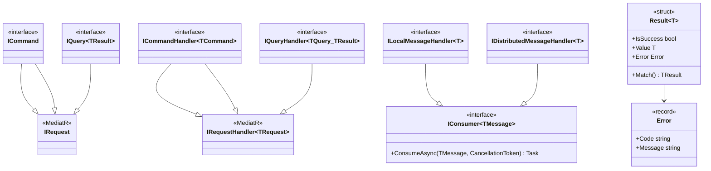

# refactor: Enhance Framework.Domain Architecture

## Overview

Modernize Framework.Domain architecture with MediatR-compatible CQRS marker interfaces, Result types, shared messaging consumer interface, and package rename for consistency.

## Problem Statement / Motivation

**Current Issues:**
1. **No CQRS abstractions** - Developers must bring MediatR or roll own `ICommand`/`IQuery` patterns
2. **No shared consumer interface** - `Framework.Domains.Messages` and `Framework.Messaging.Abstractions` have separate handler patterns
3. **No Result type** - Commands/queries return raw values or throw, no standardized error handling
4. **Naming inconsistency** - Package is `Framework.Domains` (plural) vs other singular packages
5. **Minimal test coverage** - Only `EqualityBase` has unit tests

**Key File References:**
| File | Lines | Issue |
|------|-------|-------|
| `src/Framework.Domains/Domain/IEntity.cs` | 7-14 | Basic interface |
| `src/Framework.Domains/Messages/Local/ILocalMessageHandler.cs` | 7-14 | No shared base |
| `src/Framework.Domains/Messages/Distributed/IDistributedMessageHandler.cs` | 7-14 | No shared base |

## Decisions Made

| Question | Decision |
|----------|----------|
| Full CQRS or markers only? | **Markers only** |
| Source generator for audits? | **No** - consumers implement interfaces |
| Messaging unification? | **No** - but shared `IConsumer` interface |
| MediatR compatibility? | **Yes** - handlers match MediatR signature |
| Package rename? | **Yes** - `Framework.Domains` → `Framework.Domain` |
| Result type? | **Yes** - `Result<T>` and `Result<T, TError>` |
| Validation hooks? | **No** |

## Proposed Solution

### Phase 1: Package Rename

Rename `Framework.Domains` → `Framework.Domain` for consistency.

**Files to rename:**
```
src/Framework.Domains/ → src/Framework.Domain/
src/Framework.Domains.LocalMessagePublisher.DI/ → src/Framework.Domain.LocalMessagePublisher.DI/
src/Framework.Domains.DistributedMessagePublisher.Cap/ → src/Framework.Domain.DistributedMessagePublisher.Cap/
tests/Framework.Domains.Tests.Unit/ → tests/Framework.Domain.Tests.Unit/
```

**Namespace changes:**
- `Framework.Domains.*` → `Framework.Domain.*`

### Phase 2: Result Types

Add discriminated union Result types for error handling:

```csharp
// Results/Result.cs
namespace Framework.Domain.Results;

public readonly struct Result<TValue>
{
    private readonly TValue? _value;
    private readonly Error? _error;

    public bool IsSuccess { get; }
    public bool IsFailure => !IsSuccess;

    public TValue Value => IsSuccess
        ? _value!
        : throw new InvalidOperationException("Cannot access Value on failed result");

    public Error Error => IsFailure
        ? _error!
        : throw new InvalidOperationException("Cannot access Error on successful result");

    private Result(TValue value)
    {
        IsSuccess = true;
        _value = value;
        _error = null;
    }

    private Result(Error error)
    {
        IsSuccess = false;
        _value = default;
        _error = error;
    }

    public static Result<TValue> Success(TValue value) => new(value);
    public static Result<TValue> Failure(Error error) => new(error);

    public static implicit operator Result<TValue>(TValue value) => Success(value);
    public static implicit operator Result<TValue>(Error error) => Failure(error);

    public TResult Match<TResult>(
        Func<TValue, TResult> onSuccess,
        Func<Error, TResult> onFailure)
        => IsSuccess ? onSuccess(_value!) : onFailure(_error!);
}

// Results/Error.cs
public sealed record Error(string Code, string Message)
{
    public static Error None => new(string.Empty, string.Empty);
    public static Error NotFound(string message) => new("NotFound", message);
    public static Error Validation(string message) => new("Validation", message);
    public static Error Conflict(string message) => new("Conflict", message);
    public static Error Unauthorized(string message) => new("Unauthorized", message);
    public static Error Forbidden(string message) => new("Forbidden", message);
}
```

**Files to create:**
- `src/Framework.Domain/Results/Result.cs`
- `src/Framework.Domain/Results/Error.cs`

### Phase 3: CQRS Marker Interfaces (MediatR-Compatible)

Add minimal CQRS interfaces compatible with MediatR's `IRequest<T>`/`IRequestHandler<T,R>`:

```csharp
// Commands/ICommand.cs
namespace Framework.Domain.Commands;

/// <summary>Command marker (no result, for side effects only).</summary>
public interface ICommand : MediatR.IRequest;

/// <summary>Command with result, compatible with MediatR.IRequest{TResult}.</summary>
public interface ICommand<out TResult> : MediatR.IRequest<TResult>;

// Commands/ICommandHandler.cs
namespace Framework.Domain.Commands;

/// <summary>Handler for commands without result.</summary>
public interface ICommandHandler<in TCommand> : MediatR.IRequestHandler<TCommand>
    where TCommand : ICommand;

/// <summary>Handler for commands with result, compatible with MediatR.</summary>
public interface ICommandHandler<in TCommand, TResult> : MediatR.IRequestHandler<TCommand, TResult>
    where TCommand : ICommand<TResult>;
```

```csharp
// Queries/IQuery.cs
namespace Framework.Domain.Queries;

/// <summary>Query marker, compatible with MediatR.IRequest{TResult}.</summary>
public interface IQuery<out TResult> : MediatR.IRequest<TResult>;

// Queries/IQueryHandler.cs
namespace Framework.Domain.Queries;

/// <summary>Query handler, compatible with MediatR.</summary>
public interface IQueryHandler<in TQuery, TResult> : MediatR.IRequestHandler<TQuery, TResult>
    where TQuery : IQuery<TResult>;
```

**Files to create:**
- `src/Framework.Domain/Commands/ICommand.cs`
- `src/Framework.Domain/Commands/ICommandHandler.cs`
- `src/Framework.Domain/Queries/IQuery.cs`
- `src/Framework.Domain/Queries/IQueryHandler.cs`

**Package reference to add:**
- `MediatR.Contracts` (just interfaces, no implementation)

### Phase 4: Shared IConsumer Interface

Add shared consumer interface used by both domain and messaging:

```csharp
// Messaging/IConsumer.cs
namespace Framework.Domain.Messaging;

/// <summary>
/// Base consumer interface shared between domain message handlers
/// and infrastructure message handlers.
/// </summary>
public interface IConsumer<in TMessage>
{
    Task ConsumeAsync(TMessage message, CancellationToken ct = default);
}
```

**Update existing handlers to inherit:**

```csharp
// Messages/Local/ILocalMessageHandler.cs
namespace Framework.Domain.Messages.Local;

public interface ILocalMessageHandler<in TMessage> : IConsumer<TMessage>
    where TMessage : ILocalMessage
{
    // Inherits: Task ConsumeAsync(TMessage message, CancellationToken ct)
}

// Messages/Distributed/IDistributedMessageHandler.cs
namespace Framework.Domain.Messages.Distributed;

public interface IDistributedMessageHandler<in TMessage> : IConsumer<TMessage>
    where TMessage : IDistributedMessage
{
    // Inherits: Task ConsumeAsync(TMessage message, CancellationToken ct)
}
```

**Files to create:**
- `src/Framework.Domain/Messaging/IConsumer.cs`

**Files to modify:**
- `src/Framework.Domain/Messages/Local/ILocalMessageHandler.cs`
- `src/Framework.Domain/Messages/Distributed/IDistributedMessageHandler.cs`

### Phase 5: Fix Naming Inconsistencies

| Issue | Location | Fix |
|-------|----------|-----|
| `Suspended()` should be `Suspend()` | `EntityWithCreateUpdateSuspendAudit.cs` | Rename + `[Obsolete]` redirect |
| Same in aggregate | `AggregateRootWithCreateUpdateSuspendAudit.cs` | Rename + `[Obsolete]` redirect |

## Technical Considerations

### Architecture

**Package Structure (after rename):**
```
Framework.Domain                          # Core (CQRS, Results, IConsumer)
Framework.Domain.LocalMessagePublisher.DI
Framework.Domain.DistributedMessagePublisher.Cap
```

### Performance

- Marker interfaces have zero runtime cost
- `Result<T>` is a struct, stack-allocated
- MediatR compatibility adds no overhead (just interface inheritance)

### Breaking Changes

| Change | Breaking? | Migration |
|--------|-----------|-----------|
| Package rename | **Yes** | Find-replace namespace |
| Add CQRS interfaces | No | Additive |
| Add Result types | No | Additive |
| Add IConsumer | No | Additive (existing handlers gain base) |
| Handler method rename `HandleAsync` → `ConsumeAsync` | **Yes** | Update implementations |
| `Suspended()` → `Suspend()` | **Yes** | `[Obsolete]` redirect |

## Acceptance Criteria

### Functional Requirements
- [ ] Package renamed from `Framework.Domains` to `Framework.Domain`
- [ ] `Result<T>` and `Error` types exist
- [ ] `ICommand`, `ICommand<T>` interfaces exist, extending MediatR.IRequest
- [ ] `ICommandHandler<T>`, `ICommandHandler<T,R>` interfaces exist, extending MediatR.IRequestHandler
- [ ] `IQuery<T>`, `IQueryHandler<T,R>` interfaces exist, extending MediatR equivalents
- [ ] `IConsumer<T>` base interface exists
- [ ] `ILocalMessageHandler<T>` extends `IConsumer<T>`
- [ ] `IDistributedMessageHandler<T>` extends `IConsumer<T>`
- [ ] `Suspended()` renamed to `Suspend()` with obsolete redirect

### Testing Requirements
- [ ] Unit tests for `Result<T>` success/failure scenarios
- [ ] Unit tests for `Error` factory methods
- [ ] Unit tests for implicit conversions on Result
- [ ] Verify MediatR registration works with new interfaces

### Documentation
- [ ] Update README with CQRS patterns
- [ ] Add Result type usage examples
- [ ] Document IConsumer hierarchy

## MVP

### Result.cs

```csharp
namespace Framework.Domain.Results;

public readonly struct Result<TValue>
{
    private readonly TValue? _value;
    private readonly Error? _error;

    public bool IsSuccess { get; }
    public bool IsFailure => !IsSuccess;

    public TValue Value => IsSuccess
        ? _value!
        : throw new InvalidOperationException("Cannot access Value on failed result");

    public Error Error => IsFailure
        ? _error!
        : throw new InvalidOperationException("Cannot access Error on successful result");

    private Result(TValue value) => (IsSuccess, _value, _error) = (true, value, null);
    private Result(Error error) => (IsSuccess, _value, _error) = (false, default, error);

    public static Result<TValue> Success(TValue value) => new(value);
    public static Result<TValue> Failure(Error error) => new(error);

    public static implicit operator Result<TValue>(TValue value) => Success(value);
    public static implicit operator Result<TValue>(Error error) => Failure(error);

    public TResult Match<TResult>(Func<TValue, TResult> onSuccess, Func<Error, TResult> onFailure)
        => IsSuccess ? onSuccess(_value!) : onFailure(_error!);
}
```

### Error.cs

```csharp
namespace Framework.Domain.Results;

public sealed record Error(string Code, string Message)
{
    public static Error None => new(string.Empty, string.Empty);
    public static Error NotFound(string message) => new("NotFound", message);
    public static Error Validation(string message) => new("Validation", message);
    public static Error Conflict(string message) => new("Conflict", message);
    public static Error Unauthorized(string message) => new("Unauthorized", message);
    public static Error Forbidden(string message) => new("Forbidden", message);
}
```

### ICommand.cs

```csharp
namespace Framework.Domain.Commands;

using MediatR;

/// <summary>Command marker (no result).</summary>
public interface ICommand : IRequest;

/// <summary>Command with result.</summary>
public interface ICommand<out TResult> : IRequest<TResult>;
```

### ICommandHandler.cs

```csharp
namespace Framework.Domain.Commands;

using MediatR;

public interface ICommandHandler<in TCommand> : IRequestHandler<TCommand>
    where TCommand : ICommand;

public interface ICommandHandler<in TCommand, TResult> : IRequestHandler<TCommand, TResult>
    where TCommand : ICommand<TResult>;
```

### IQuery.cs

```csharp
namespace Framework.Domain.Queries;

using MediatR;

public interface IQuery<out TResult> : IRequest<TResult>;
```

### IQueryHandler.cs

```csharp
namespace Framework.Domain.Queries;

using MediatR;

public interface IQueryHandler<in TQuery, TResult> : IRequestHandler<TQuery, TResult>
    where TQuery : IQuery<TResult>;
```

### IConsumer.cs

```csharp
namespace Framework.Domain.Messaging;

public interface IConsumer<in TMessage>
{
    Task ConsumeAsync(TMessage message, CancellationToken ct = default);
}
```

## ERD: Domain Abstractions



## References

### Internal References
- Existing domain: `src/Framework.Domains/Domain/`
- Local handler: `src/Framework.Domains/Messages/Local/ILocalMessageHandler.cs`
- Distributed handler: `src/Framework.Domains/Messages/Distributed/IDistributedMessageHandler.cs`
- MassTransit plan: `plans/feat-messaging-masstransit.md`

### External References
- [MediatR.Contracts](https://www.nuget.org/packages/MediatR.Contracts) - Interface-only package
- [Result Pattern in C#](https://www.milanjovanovic.tech/blog/functional-error-handling-in-dotnet-with-the-result-pattern)
- [Microsoft DDD Domain Model](https://learn.microsoft.com/en-us/dotnet/architecture/microservices/microservice-ddd-cqrs-patterns/net-core-microservice-domain-model)

### Related Work
- GitHub Issue #56: Consider Specification pattern (OPEN)
- GitHub Issue #63: Better separation for Clean Architecture (CLOSED)
