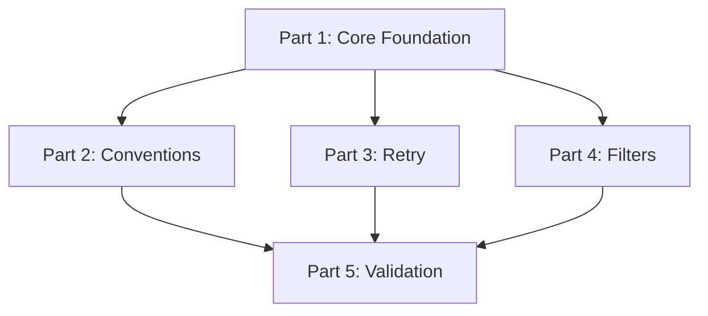

# IConsume<T> Migration - Execution Plan

## Overview

This migration replaces the attribute-based `[CapSubscribe]` pattern with type-safe `IConsume<T>` interface for message handling. Divided into 5 independently executable parts.

## Execution Order

### Must Execute First
**Part 1: Core Foundation** (CRITICAL)
- Removes old pattern completely
- Implements basic `AddConsumer<T>()` registration
- Integrates `CompiledMessageDispatcher`
- **Blocks**: All other parts depend on this

### Can Execute Independently After Part 1
These can be done in any order or in parallel:

**Part 2: Conventions & Assembly Scanning** (HIGH)
- Global conventions (kebab-case, prefixes)
- Message type → topic mapping
- Assembly scanning with filters
- **Recommended**: Execute second (DX improvement)

**Part 3: Retry & Error Handling** (MEDIUM)
- Retry policies
- Dead letter queue
- Exception handling
- **Optional**: Can skip initially, add later

**Part 4: Filters** (MEDIUM-LOW)
- Global and per-consumer filters
- Cross-cutting concerns
- **Optional**: Can skip initially, add later

**Part 5: Validation** (LOW)
- Minimal inline checks (20 lines)
- Duplicate detection + empty config warning
- **Optional**: Nice-to-have, execute last

## Priority Matrix

```
Priority | Part | Effort | Dependencies | Can Skip?
---------|------|--------|--------------|----------
CRITICAL | 1    | 2-3d   | None         | NO
HIGH     | 2    | 2d     | Part 1       | Temporarily
MEDIUM   | 3    | 1-2d   | Part 1       | Yes (use CAP's retry)
MEDIUM   | 4    | 1d     | Part 1       | Yes (use CAP's filters)
LOW      | 5    | 0.5h   | Part 1       | Yes (tests catch errors)
```

## Recommended Execution Strategies

### Strategy 1: MVP (Fastest to Production)
Execute only Parts 1 & 2, ship it.

**Timeline**: ~4-5 days
**Deliverable**: Type-safe handlers with convention-based discovery

```
Week 1:
  Mon-Wed: Part 1 (Core Foundation)
  Thu-Fri: Part 2 (Conventions & Scanning)
  Deploy: MVP
```

**What you get:**
- Type-safe `IConsume<T>` handlers
- Assembly scanning
- Convention-based topics
- Manual config for edge cases

**What you miss:**
- Retry policies (use CAP's default)
- Filters (add in future)
- Validation (trust developers)

### Strategy 2: Complete (All Features)
Execute all parts in order.

**Timeline**: ~7-9 days
**Deliverable**: Fully-featured messaging system

```
Week 1:
  Mon-Wed: Part 1 (Core Foundation)
  Thu-Fri: Part 2 (Conventions & Scanning)

Week 2:
  Mon-Tue: Part 3 (Retry & Error Handling)
  Wed:     Part 4 (Filters)
  Thu:     Part 5 (Validation)
  Fri:     Integration testing & docs
  Deploy: Full system
```

### Strategy 3: Iterative (Best for Learning)
Ship after each part, gather feedback.

**Timeline**: ~2-3 weeks
**Deliverable**: Incremental improvements

```
Week 1:
  Mon-Wed: Part 1 → Ship MVP
  Thu-Fri: Part 2 → Ship v1.1

Week 2:
  Mon-Tue: Part 3 → Ship v1.2
  Wed:     Part 4 → Ship v1.3
  Thu-Fri: Part 5 → Ship v1.4
```

## Technical Dependencies



**Key**:
- **Part 1** blocks everything
- **Parts 2, 3, 4** are independent after Part 1
- **Part 5** uses features from Parts 2, 3, 4 (but optional)

## Files Changed Summary

### Part 1: Core Foundation
- **Deleted**: 3 files (IConsumer.cs, Attributes.cs, old tests)
- **Created**: 10 files (builders, registry, tests)
- **Modified**: 2 files (selector, invoker)

### Part 2: Conventions & Scanning
- **Created**: 6 files (conventions, scanner, extensions)
- **Modified**: 2 files (builder interfaces)

### Part 3: Retry & Error Handling
- **Created**: 7 files (retry policies, DLQ config, tests)
- **Modified**: 4 files (metadata, invoker, builder)

### Part 4: Filters
- **Created**: 2 files (pipeline, tests)
- **Modified**: 5 files (metadata, builder, invoker)

### Part 5: Validation
- **Created**: 1 file (minimal validation test)
- **Modified**: 2 files (builder with inline check, extensions)

**Total Changes**: ~38 files across all parts (reduced from 45 with minimal validation)

## Testing Strategy

### Per-Part Testing
Each part includes:
- Unit tests (≥85% coverage)
- Integration tests (where applicable)
- Can be tested independently

### End-to-End Testing
After all parts complete:
- Full message flow tests
- Performance benchmarks
- Stress testing
- Migration validation

## Risk Assessment

| Part | Risk Level | Mitigation |
|------|------------|------------|
| 1    | HIGH       | Extensive testing, phased rollout |
| 2    | LOW        | Convention bugs easy to fix |
| 3    | MEDIUM     | Test retry logic thoroughly |
| 4    | LOW        | Filters are optional |
| 5    | LOW        | Validation is optional |

## Rollback Strategy

### After Part 1
**If issues found**: Revert commit, restore old pattern
**Difficulty**: Hard (big change)

### After Parts 2-5
**If issues found**: Disable feature via config
**Difficulty**: Easy (feature flags)

**Example**:
```csharp
// Disable conventions, use manual config
messaging.AddConsumer<Handler>(c => c.Topic("explicit.topic"));

// Disable validation
// messaging.ValidateOnStartup();  // Comment out

// Disable filters
// messaging.AddFilter<LoggingFilter>();  // Comment out
```

## Success Criteria

### Part 1 (MVP)
- [ ] Old pattern removed
- [ ] Basic registration works
- [ ] End-to-end message flow works
- [ ] Performance ≥ old pattern

### Part 2 (Conventions)
- [ ] Assembly scanning discovers handlers
- [ ] Conventions apply correctly
- [ ] Override conventions per-handler

### Part 3 (Retry)
- [ ] Retry policies work
- [ ] DLQ receives failed messages
- [ ] Exponential backoff calculates correctly

### Part 4 (Filters)
- [ ] Global filters execute
- [ ] Per-consumer filters execute
- [ ] Filter order correct

### Part 5 (Validation)
- [ ] Validation rules catch errors
- [ ] Clear error messages
- [ ] Fails fast on startup

## Documentation Updates

After each part:
- [ ] Update README.md in Framework.Messages.Abstractions
- [ ] Update README.md in Framework.Messages.Core
- [ ] Add XML docs to new public APIs
- [ ] Update migration guide (if applicable)

## Breaking Changes

**Part 1**: BREAKING
- Removes `IConsumer`, `[CapSubscribe]`, `[FromCap]`
- All existing handlers must migrate

**Parts 2-5**: NON-BREAKING
- Additive features only
- Opt-in via configuration

## Migration Path for Users

### Before (Old Pattern)
```csharp
public class OrderHandler : IConsumer
{
    [CapSubscribe("orders.created", Group = "order-processing")]
    public async Task HandleOrderCreated(OrderCreated order) { }
}
```

### After Part 1 (Minimal)
```csharp
public sealed class OrderCreatedHandler : IConsume<OrderCreated>
{
    public ValueTask Consume(ConsumeContext<OrderCreated> ctx, CancellationToken ct) {
        //
    }
}

services.AddMessaging(m =>
{
    m.AddConsumer<OrderCreatedHandler>(c =>
    {
        c.Topic("orders.created");
        c.Group("order-processing");
    });
});
```

### After Part 2 (Conventions)
```csharp
public sealed class OrderCreatedHandler : IConsume<OrderCreated>
{
    public ValueTask Consume(ConsumeContext<OrderCreated> ctx, CancellationToken ct) { }
}

services.AddMessaging(m =>
{
    m.ConfigureConventions(c => c.UseKebabCaseTopics());
    m.MapTopic<OrderCreated>("orders.created");
    m.AddConsumersFromAssembly(Assembly.GetExecutingAssembly());
});
```

### After All Parts (Full Featured)
```csharp
public sealed class OrderCreatedHandler : IConsume<OrderCreated>
{
    public ValueTask Consume(ConsumeContext<OrderCreated> ctx, CancellationToken ct) { }
}

services.AddMessaging(m =>
{
    m.ConfigureConventions(c => c.UseKebabCaseTopics());
    m.ConfigureRetryPolicy(r => r.MaxRetries(3));
    m.AddFilter<LoggingFilter>();
    m.ConfigureValidation(v => v.RequireGroup());
    m.ValidateOnStartup();
    m.AddConsumersFromAssembly(Assembly.GetExecutingAssembly());
});
```

## Decision Points

### Should I Execute Part 2 Immediately?
**Yes if**: You have >5 handlers (DX improvement worth it)
**No if**: You have <5 handlers (manual config is fine)

### Should I Execute Part 3?
**Yes if**: You need custom retry logic or DLQ
**No if**: CAP's default retry is sufficient

### Should I Execute Part 4?
**Yes if**: You need logging, metrics, validation filters
**No if**: You can add these in handlers directly

### Should I Execute Part 5?
**Yes if**: You want fail-fast configuration validation
**No if**: You trust developers and integration tests

## Recommended Approach

For most teams: **Execute Parts 1 & 2, evaluate Parts 3-5 later**

**Rationale**:
- Part 1 is required (breaking change anyway)
- Part 2 significantly improves DX (low cost, high value)
- Parts 3-5 can be added incrementally as needs arise

**Timeline**: 1 week to ship improved messaging system
